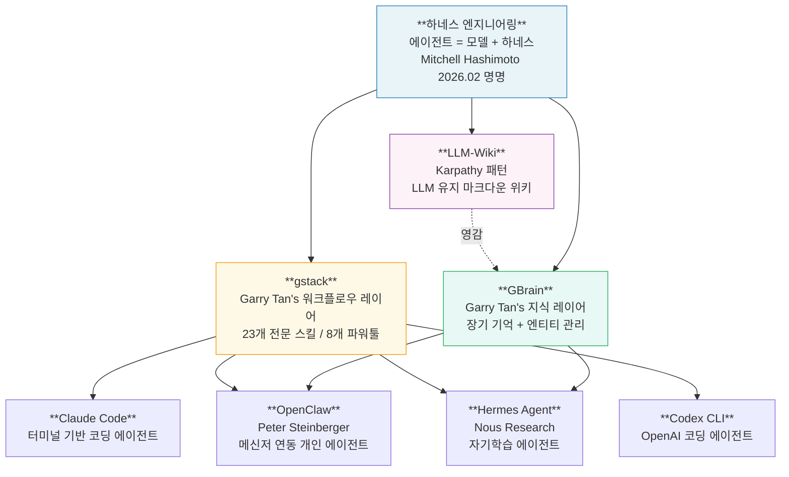
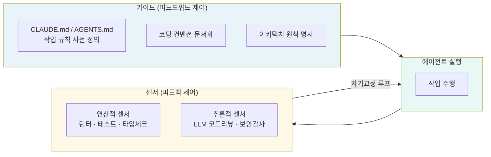
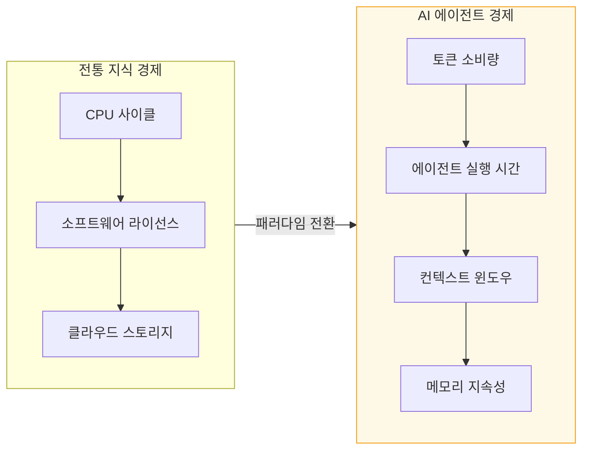
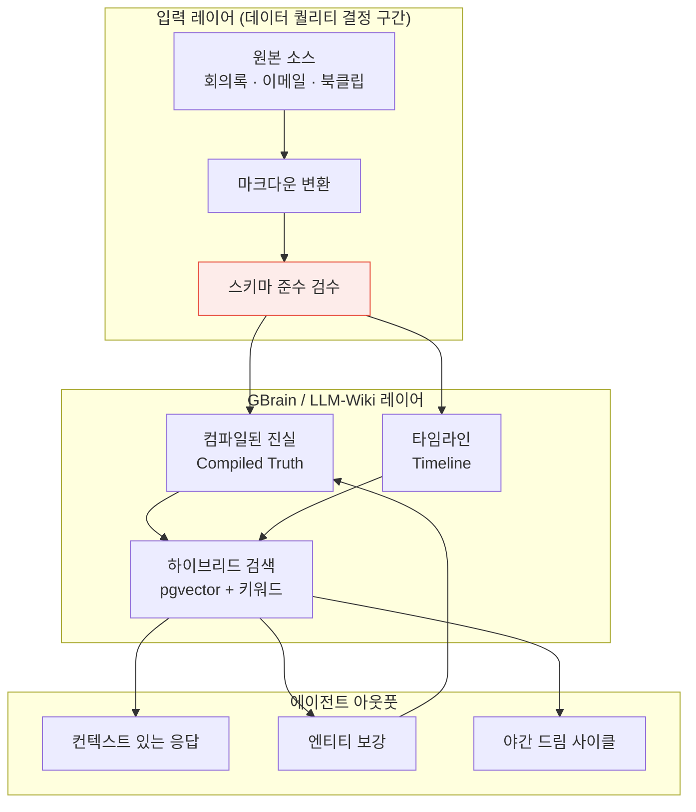
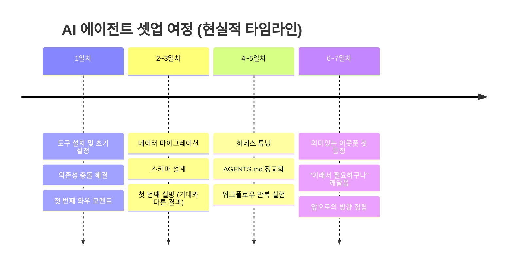
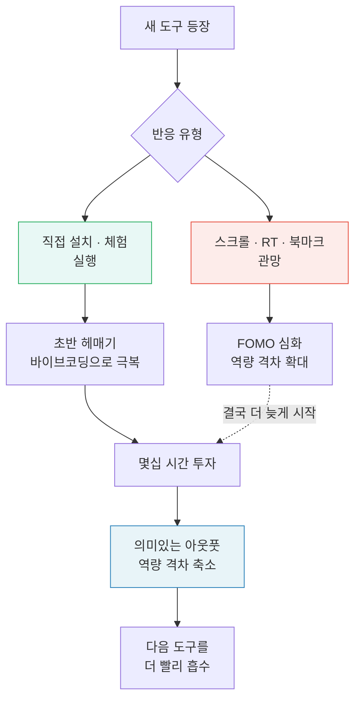
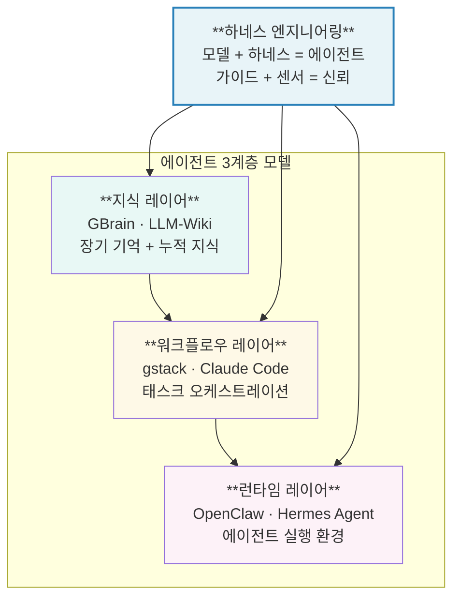

## 일주일 체험 후 7가지 깨달음

> 2026년 4월 | 박승순 (@park__seungsoon) Threads 포스트 기반  
> 최신 정보 보강 및 분석 정리

---

## 들어가며 — 지금 무슨 일이 벌어지고 있는가

2026년 봄, AI 에이전트 생태계는 폭발적인 속도로 재편되고 있다. Andrej Karpathy는 "수 개월째 코드를 한 줄도 직접 타이핑하지 않았다"고 밝혔고, Y Combinator CEO Garry Tan은 자신의 에이전트 셋업(gstack)을 오픈소스로 공개해 단 몇 주 만에 GitHub 스타 66,000개를 넘어섰다. Peter Steinberger가 주말 프로젝트로 시작한 OpenClaw는 GitHub 역사상 가장 빠른 성장 속도 중 하나를 기록하며 34만 스타를 돌파했다. Nous Research의 Hermes Agent는 "쓸수록 똑똑해지는 에이전트"라는 철학으로 출시 직후 커뮤니티를 둘로 갈라놓았다. Karpathy가 GitHub Gist 하나로 공유한 LLM-Wiki 개념은 16백만 뷰를 넘기며 개인 지식관리의 패러다임을 흔들었다.

이 모든 것을 직접 일주일 동안 체험하고 나서 느낀 점 7가지를 기록한다. 이것은 단순한 툴 리뷰가 아니다. AI 시대에 지식 노동자, 빌더, 크리에이터로 살아간다는 것이 어떤 의미인지에 대한 현장 보고서다.

---

## 체험한 도구들 — 간략한 소개

본격적인 7가지 깨달음에 앞서, 이번 체험의 대상이 된 도구들이 각각 무엇인지 간략히 짚어두는 것이 필요하다. 이 도구들은 서로 독립적이기도 하지만, 하나의 생태계로 연결되어 있기도 하다.

**하네스 엔지니어링(Harness Engineering)** 은 2026년 2월 Mitchell Hashimoto가 공식화한 개념이다. "에이전트 = 모델 + 하네스"라는 공식으로 요약되는 이 접근법은, AI 제품의 성패가 모델 자체가 아니라 모델을 감싸는 인프라 — 도구, 메모리, 검증 루프, 가드레일 — 에 달려 있다는 사실을 명확히 했다.

**gstack**은 Y Combinator CEO Garry Tan이 자신의 Claude Code 셋업을 오픈소스화한 것으로, CEO·디자이너·엔지니어링 매니저·릴리스 매니저·문서 엔지니어·QA 역할을 수행하는 23개의 전문 스킬 패키지다. Tan의 팀은 이 도구로 2026년 1~2월에만 60만 줄의 프로덕션 코드를 출하했다.

**GBrain**은 gstack의 코딩 레이어에 대응하는 지식 레이어로, 에이전트가 실행 전에 읽고 실행 후에 쓰는 장기 기억 시스템이다. Garry Tan 본인의 개인 브레인에는 현재 17,000개 이상의 페이지, 4,300명의 인물 정보, 21개의 자동 크론 작업이 돌아가고 있다고 밝혔다.

**LLM-Wiki**는 Karpathy가 2026년 4월 공개한 개념으로, RAG(검색증강생성) 없이 마크다운 파일로 구성된 개인 위키를 에이전트가 직접 컴파일하고 유지보수하는 방식이다. "Obsidian이 IDE라면, LLM이 프로그래머이고, 위키가 코드베이스"라는 한 줄 요약이 커뮤니티를 강타했다.

**Hermes Agent**는 Nous Research가 2026년 2월 출시한 오픈소스 에이전트로, "쓸수록 성장하는 에이전트"를 표방한다. 작업을 완료할 때마다 경험을 스킬 문서로 합성해 저장하고, 다음에 유사한 작업을 만나면 처음부터 추론하는 대신 저장된 스킬을 참조한다.

**OpenClaw**는 오스트리아 개발자 Peter Steinberger가 2025년 말 주말 프로젝트로 시작한 오픈소스 개인 에이전트다. WhatsApp, Telegram, Slack 등 50개 이상의 메신저와 연동되며 354,000개 이상의 GitHub 스타를 기록했다. Steinberger는 이후 OpenAI에 합류했고, OpenClaw는 재단 형태로 독립 운영되고 있다.

---

## 깨달음 1 : 지식·정보의 효율화 — "이건 진짜다"

일주일을 써보고 나서 가장 먼저 느낀 감정은 단순하다. 이건 진짜다.

지식 정보 효율화라는 말은 수없이 들어왔다. 구글 드라이브, 노션, 옵시디언, 로암 리서치 — 10년 넘게 쏟아져 나온 PKM(개인 지식관리) 도구들은 저마다 그 구호를 앞세웠다. 그러나 그것들은 결국 "더 잘 정리하는 방법"에 관한 것이었지, "지식이 나를 대신해 일하게 만드는 방법"에 관한 것이 아니었다.

이번에 체험한 도구들은 다르다. Karpathy의 LLM-Wiki 패턴은 RAG 파이프라인이나 벡터 데이터베이스 없이, 단순한 마크다운 파일들을 LLM이 직접 읽고 컴파일하여 살아있는 위키를 만들어낸다. 핵심은 "매번 처음부터 재발견하는" 기존 방식과 달리 지식이 누적된다는 점이다. Karpathy 본인은 약 100개의 아티클, 400,000 단어 규모의 개인 위키를 직접 한 줄도 쓰지 않고 에이전트가 구축하게 했다. 그는 이제 자신의 토큰 예산 중 상당 부분을 코드 생성이 아닌 지식 조작에 쓰고 있다고 밝혔다.

GBrain은 한 걸음 더 나아간다. 단순한 노트 저장을 넘어, 에이전트가 매 인터랙션마다 brain에서 먼저 검색하고(read), 응답하고, 새 정보를 다시 brain에 기록(write)하는 루프를 형성한다. Garry Tan의 brain은 12일 만에 10,000개 이상의 파일, 3,000개 이상의 인물 페이지를 갖추었다. 에이전트가 자는 동안에도 대화를 스캔하고, 엔티티를 보강하고, 깨진 인용을 수정하고, 기억을 통합한다. "아침에 일어나면 어제보다 뇌가 똑똑해져 있다"는 표현이 과장처럼 들리지 않는다.

기존의 지식 도구가 "파일 캐비닛"이었다면, 이 생태계는 "살아있는 조수"에 가깝다. 내가 쌓은 지식이 나를 위해 일한다는 감각 — 이것이 체험 첫날부터 느낀 가장 큰 흥분이었다.

---

## 깨달음 2 : 초반 헤매기는 AI가 알아서 해결 — 바이브코딩의 묘미

처음 셋업할 때는 솔직히 막막했다. gstack 설치, GBrain의 PGLite 초기화, Hermes Agent 마이그레이션, OpenClaw의 게이트웨이 설정... 문서를 읽어도 처음 보는 개념들이 쏟아지고, 어디서 시작해야 할지 감이 잡히지 않았다.

그러나 이것이 바이브코딩의 진짜 묘미가 드러나는 순간이다.

Claude Code에 "gstack을 설치하고 GBrain과 연동하고 싶어"라고 입력하면, 에이전트가 README를 읽고, 의존성을 파악하고, 단계별로 진행한다. 막히는 부분이 생기면 에러 메시지를 보고 스스로 수정한다. 인간이 Stack Overflow를 뒤지며 수 시간을 소비할 설정 작업을 에이전트가 수십 분 안에 처리한다.

OpenAI의 하네스 엔지니어링 사례가 이를 잘 보여준다. 그들의 팀은 빈 레포지토리에 에이전트가 직접 초기 스캐폴딩(저장소 구조, CI 설정, 포매팅 규칙, 패키지 매니저 설정, 애플리케이션 프레임워크)을 생성하게 했고, 심지어 에이전트에게 작업 방식을 안내하는 AGENTS.md 파일조차 에이전트 본인이 작성하게 했다. 5개월 후 이 레포지토리에는 백만 줄 규모의 코드가 쌓였다. 3명으로 시작해 7명의 엔지니어가 Codex를 활용해 하루 평균 엔지니어 1인당 3.5개의 PR을 머지하는 속도를 달성했다.

물론 이것이 "아무것도 몰라도 된다"는 뜻은 아니다. 에이전트가 뱉어낸 결과물을 이해하고 검증할 수 있는 기초 지식은 필요하다. 하지만 초반에 무엇을 해야 할지 막막한 감각 — 그 마찰은 AI가 상당 부분 흡수해준다. 이것이 바이브코딩이 가진 가장 강력한 진입 장벽 해소 효과다.

---

## 깨달음 3 : QC 지수가 높을수록 하네스의 필요성이 보인다

흥분이 가라앉은 뒤 찾아오는 것은 수정 요청의 연속이다.

AI가 생성한 코드는 대체로 동작한다. 그러나 "동작한다"와 "내가 원하는 방식으로 동작한다"는 다른 이야기다. 아키텍처가 내 의도와 다르거나, 네이밍 컨벤션이 일관되지 않거나, 테스트 커버리지가 부족하거나, 엣지 케이스를 놓치거나... QC(퀄리티 컨트롤) 기준이 높은 사람일수록 수정 요청이 폭발적으로 늘어난다.

이 지점에서 "아, 그래서 하네스가 필요한 거구나"라는 깨달음이 찾아온다.

하네스 엔지니어링의 핵심은 에이전트의 실수를 사후에 고치는 것이 아니라, 처음부터 좋은 결과가 나올 확률을 높이는 시스템을 설계하는 것이다. Thoughtworks의 Distinguished Engineer Birgitta Böckeler가 정리한 프레임워크에 따르면, 하네스는 두 종류의 제어로 구성된다. 첫째는 가이드(피드포워드 제어)로, 에이전트가 행동하기 전에 방향을 잡아준다. 둘째는 센서(피드백 제어)로, 에이전트가 행동한 후 자기교정을 돕는다.

gstack이 제공하는 `/review`, `/qa`, `/cso` 스킬들이 바로 이 센서 역할을 한다. `/review`는 PR 코드를 리뷰하고 자동 수정 및 이슈 등급을 매긴다. `/qa`는 실제 브라우저를 열어 UI를 통해 기능을 테스트하고 회귀 테스트를 커밋한다. `/cso`는 OWASP Top 10 + STRIDE 위협 모델에 따라 보안 취약점을 분석하는 Chief Security Officer 역할을 한다. gstack을 직접 써본 한 사용자는 "/cso 스킬 하나만으로도 설치할 이유가 충분하다. 2개월 동안 만든 프로젝트에서 20분 만에 3개의 실제 취약점을 찾아냈다"고 밝혔다.

Mitchell Hashimoto가 하네스 엔지니어링에 대해 내린 핵심 정의를 인용하면 이렇다. 에이전트가 실수를 할 때마다, 단지 다음에 더 잘 해주기를 바라는 것이 아니라, 그 실수가 다시 일어나지 않도록 시스템 안에 인코딩하라는 것이다. QC 기준이 높을수록 이 원칙의 중요성이 피부로 느껴진다.

---

## 깨달음 4 : 워크플로우를 돌리는 순간, 토큰이 폭발한다 — 미래 경제의 핵심

"자, 이제 본격적으로 워크플로우를 돌려보자." 이 순간이 왔을 때 가장 충격적인 것은 토큰 소모량이었다.

단순한 Q&A나 코드 스니펫 생성은 토큰을 별로 쓰지 않는다. 그러나 에이전트가 자율적으로 멀티스텝 태스크를 수행하고, 도구를 호출하고, 결과를 검증하고, 다음 단계를 계획하는 실제 워크플로우가 돌아가기 시작하면 이야기가 달라진다. GBrain의 야간 드림 사이클(모든 대화를 스캔하고, 엔티티를 보강하고, 기억을 통합하는 작업)은 Garry Tan의 brain 규모에서 하룻밤에도 상당한 토큰을 소비한다. LLM-Wiki의 전체 린팅 패스(위키 전체를 스캔해 불일치를 수정하고 새 연결을 생성)는 400,000 단어 규모에서 결코 저렴하지 않다.

Karpathy는 자신의 토큰 예산의 상당 부분이 코드 조작이 아닌 지식 조작에 투입된다고 직접 밝혔다. 이것은 단순히 개인의 비용 문제가 아니라, 미래 지식정보사회의 경제 구조가 어떻게 재편될지를 시사하는 신호다.

여기서 중요한 경제적 통찰이 있다. 과거에는 소프트웨어 개발의 핵심 경제 단위가 "개발자의 시간(인월)"이었다. AI 에이전트 시대에는 "토큰"이 그 자리를 차지하기 시작했다. 어떤 에이전트를 쓸지, 어떤 모델을 쓸지, 워크플로우를 어떻게 설계해 불필요한 토큰 소모를 줄일지 — 이것이 에이전트 시대의 원가 관리다.

실제로 gstack의 `/retro` 스킬은 모든 AI 툴에 걸쳐 글로벌 회고를 수행하며, Claude와 Codex 세션에 중복 비용을 지불하고 있는 부분을 주간 단위로 리포트해준다. 미래 기업의 CFO는 AWS 비용 다음으로 "에이전트 토큰 비용"을 들여다볼 것이다.

---

## 깨달음 5 : 세컨드 브레인 — 백업보다 데이터 퀄리티가 문제다

GBrain과 LLM-Wiki를 셋업하면서 마주친 예상치 못한 난관은 "백업"이 아니었다. 물론 Obsidian 볼트, Notion 내보내기, 이메일 아카이브, 미팅 트랜스크립트 등을 마크다운으로 변환하고 연동하는 작업은 생각보다 손이 많이 간다. 그러나 진짜 문제는 그 다음이었다.

"각 노트들이 유의미한 데이터로 작용하는지"의 검수.

GBrain의 아키텍처는 각 페이지를 두 레이어로 나눈다. 상단 절반은 "컴파일된 진실(Compiled Truth)" — 현재 합성된 상태로, 사람이나 에이전트가 빠르게 상황을 파악할 수 있도록 유지된다. 하단 절반은 "타임라인(Timeline)" — 추가 전용 히스토리로, 지식의 진화 과정을 보존한다. 이 구조 자체는 훌륭하다. 그러나 초기 입력 데이터의 품질이 낮으면 이 구조도 무용지물이 된다.

오래된 노트들, 컨텍스트 없는 링크들, 불완전한 미팅 메모들 — 이것들을 그대로 brain에 밀어 넣으면 에이전트는 잘못된 엔티티 연결을 만들어내거나, 오래된 정보를 현재 진실로 취급하는 실수를 범한다. AI 모델의 성능이 아무리 뛰어나도, 입력 데이터의 품질을 이길 수는 없다는 고전적 원칙이 여기서도 재확인된다.

LLM-Wiki의 경우도 마찬가지다. Karpathy의 시스템은 "소스의 질이 위키의 질을 결정한다"는 원칙 위에 서 있다. 시스템이 건강한지 주기적으로 에이전트가 스캔해 불일치를 수정하는 "린팅" 과정이 포함된 것도 이 때문이다. 커뮤니티 반응 중에 "내용이 제대로 된 정보로 작용하는지 검수가 필요하다는 점에서 초기 셋업의 80%는 데이터 정제 작업이었다"는 후기가 많다.

결론: 세컨드 브레인의 품질은 AI 모델 성능보다 데이터 퀄리티가 선행한다.

---

## 깨달음 6 : 몇십 시간의 엉덩이 싸움 없이는 의미있는 아웃풋이 없다

이 생태계가 "마법"처럼 즉시 작동한다는 환상은 첫날 이내에 사라진다.

OpenClaw의 게이트웨이 설정, GBrain의 PGLite 초기화와 Obsidian 볼트 마이그레이션, gstack의 팀 모드 설정과 스킬 충돌 해결, Hermes Agent의 메모리 백엔드 선택과 채널 연동, LLM-Wiki의 CLAUDE.md 스키마 튜닝... 이 모든 과정은 에이전트가 상당 부분을 처리해주지만, 각 단계에서 방향을 잡고, 결과를 검토하고, 다음을 결정하는 것은 여전히 사람의 몫이다.

OpenAI의 하네스 엔지니어링 사례에서도 그 실상이 솔직하게 드러난다. 초기에 팀은 "AI 슬롭(AI slop)"을 정리하는 데 매주 금요일 전체, 즉 업무 시간의 20%를 썼다. 이는 지속 불가능했고, 결국 "골든 원칙(golden principles)"을 레포지토리에 인코딩하고 반복 정리 프로세스를 구축하는 작업에 추가 투자를 해야 했다.

이것은 이 도구들의 단점이 아니라, 에이전트 시대의 노동 성격 변화를 보여주는 현상이다. 기존의 "코딩 노동"이 "에이전트 오케스트레이션 노동"으로 전환되는 것이지, 노동 자체가 사라지는 것이 아니다.

Garry Tan이 GBrain을 11일 만에 "손으로 직접 만든" 뒤 오픈소스화했다는 사실도 같은 맥락이다. 11일 동안 에이전트와 함께 꼼꼼히 앉아있어야 했다는 뜻이다. "30분 만에 완성"이라는 광고 문구는 초기 셋업에 관한 것이지, 의미있는 브레인을 구축하는 데 걸리는 시간에 관한 것이 아니다.

의미있는 아웃풋은 몇십 시간의 집중 투자 이후에야 나온다. 이것이 현실이다.

---

## 깨달음 7 : FOMO는 개인의 의지와 노력으로 뚫고 가야 한다

이 생태계를 일주일 동안 체험하면서 가장 강하게 느낀 감정 중 하나는 아이러니하게도 FOMO(Fear Of Missing Out)의 강화였다.

gstack이 66,000 스타를 넘어서는 동안 나는 무엇을 하고 있었나. Karpathy가 LLM-Wiki로 400,000 단어짜리 위키를 만드는 동안 나는 왜 아직도 Notion에 산발적으로 노트를 쌓고 있나. Garry Tan이 17,000 페이지의 개인 브레인을 돌리는 동안 나는 무엇을 쌓고 있나.

이 FOMO는 SNS 피드에서 오는 표피적인 것이 아니다. 실질적인 역량 격차(capability gap)에서 오는 것이다. 이 도구들을 능숙하게 다루는 사람과 그렇지 않은 사람 사이의 생산성 차이는 조금씩 벌어지는 것이 아니라 기하급수적으로 벌어진다. 좋은 하네스를 가진 에이전트와 그렇지 않은 에이전트의 차이처럼.

그러나 이 FOMO를 해소하는 방법은 단 하나다. 직접 해보는 것.

새로운 도구가 나올 때마다 스크롤하고 RT하고 북마크하는 것은 FOMO를 해소하지 않는다. 오히려 심화시킨다. Hermes Agent를 실제로 설치하고, GBrain에 자신의 데이터를 넣어보고, gstack의 `/office-hours` 스킬로 자신의 프로젝트에 대해 YC 스타일의 질문을 받아보아야 한다. 그 과정에서 에러가 나면 Claude Code가 대부분 해결해주고, 그래도 안 되면 커뮤니티가 해결책을 올려놓았다.

이것은 순수하게 개인의 의지와 노력의 영역이다. 어떤 튜토리얼도, 어떤 유튜브 영상도, 어떤 요약 스레드도 직접 손을 더럽히는 경험을 대체할 수 없다. AI가 많은 것을 도와주지만, 해보겠다는 결정과 끝까지 앉아있는 것은 여전히 사람의 몫이다.

---

## 종합 — 이 에코시스템이 보여주는 더 큰 그림

일주일의 체험을 정리하면서 개별 도구들 너머에 있는 더 큰 그림이 보이기 시작했다.

우리는 AI가 단순한 도구에서 에이전트로, 에이전트에서 시스템으로 진화하는 변곡점에 있다. 하네스 엔지니어링이라는 개념이 2026년 초에 갑자기 부상한 것은 우연이 아니다. 에이전트가 충분히 유용해졌지만 단독으로는 충분히 신뢰할 수 없는 임계점 — 바로 이 지점에서 인프라의 중요성이 전면에 드러난다.

두 제품이 동일한 기반 LLM을 사용하더라도, 더 뛰어난 하네스를 갖춘 제품이 훨씬 나은 사용자 경험을 제공할 것이라는 말은 이제 산업의 통념이 되어가고 있다.

gstack, GBrain, LLM-Wiki, OpenClaw, Hermes Agent는 각각 이 퍼즐의 다른 조각들이다. 어떤 도구가 "이긴다"는 질문보다, 이 조각들을 어떻게 자신의 워크플로우에 통합하느냐가 더 중요한 질문이다. 그리고 그 통합의 설계자는, 여전히, 사람이다.

---

## 체험 도구별 한줄 결론

| 도구 | 포지셔닝 | 핵심 가치 | 현실적 주의점 |
|------|---------|---------|------------|
| **하네스 엔지니어링** | 에이전트 시스템 설계 철학 | 실수를 줄이는 시스템 > 더 나은 프롬프트 | 하네스도 결국 유지보수 부채가 생김 |
| **LLM-Wiki** | 개인 지식 컴파일러 | RAG 없이 누적되는 지식 | 소스 퀄리티가 전부 |
| **gstack** | Claude Code 워크플로우 레이어 | 혼자서 팀처럼 | 스킬 충돌 · 업데이트 관리 필요 |
| **GBrain** | 에이전트 장기 기억 | 쓸수록 똑똑해지는 브레인 | 초기 데이터 정제에 상당한 시간 |
| **Hermes Agent** | 자기학습 에이전트 | 경험에서 스킬 생성 | OpenClaw보다 작은 생태계 |
| **OpenClaw** | 메신저 연동 개인 에이전트 | 50+ 플랫폼 통합 | 보안 취약점 이슈 (CVE-2026-25253 등) 주의 |

---

## 마치며

일주일이라는 시간은 이 생태계의 전부를 파악하기에 턱없이 짧다. 하지만 그 시간 동안 분명해진 것은 있다. 이 도구들은 단순히 편리한 유틸리티가 아니라, 지식 노동의 구조 자체를 바꾸고 있다.

AI는 더 이상 "AI를 쓴다"는 행위가 특별한 무언가가 아닌, 호흡처럼 당연한 무언가가 되어가는 세계를 만들고 있다. 그 세계에서 하네스를 설계하고, 지식을 누적하고, 데이터를 정제하고, 워크플로우를 최적화하는 능력 — 이것이 다음 시대의 핵심 역량이다.

FOMO는 개인의 의지로 뚫고 나가야 한다. 하지만 그 의지를 만들어주는 것은, 결국, 일주일 동안 직접 손을 더럽혀 보는 경험이다.

---

*작성일: 2026년 4월 | 참고: @park__seungsoon Threads 포스트, OpenAI Harness Engineering 블로그, Anthropic Long-running Agents 문서, Garry Tan gstack/gbrain GitHub, Nous Research Hermes Agent, Andrej Karpathy LLM-Wiki GitHub Gist, MartinFowler.com Harness Engineering for Coding Agents 외 다수*
