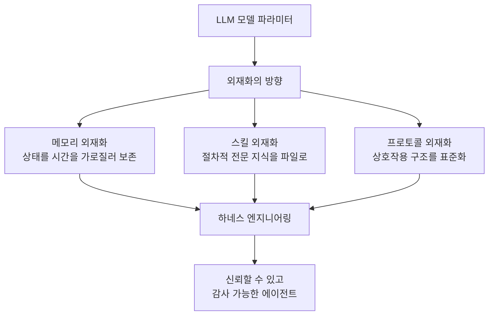
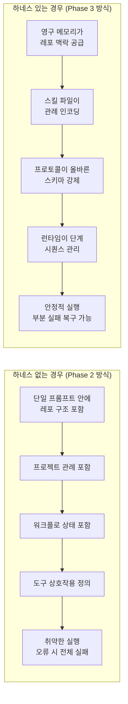
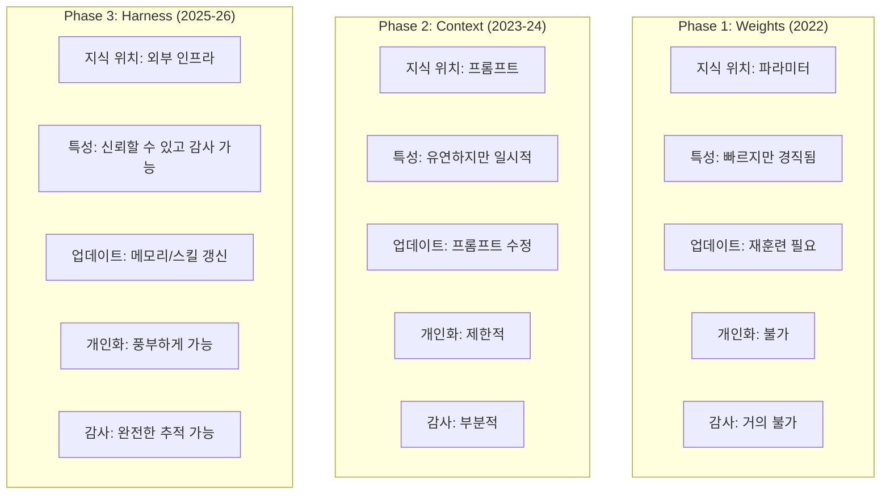
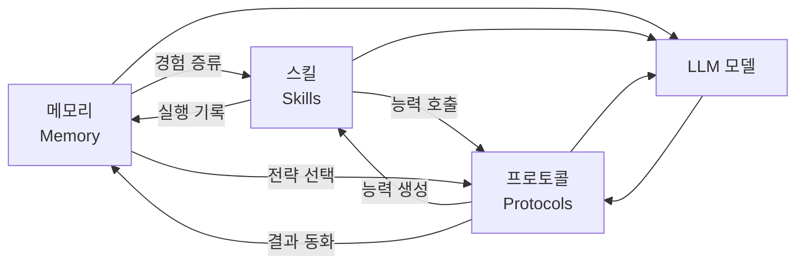
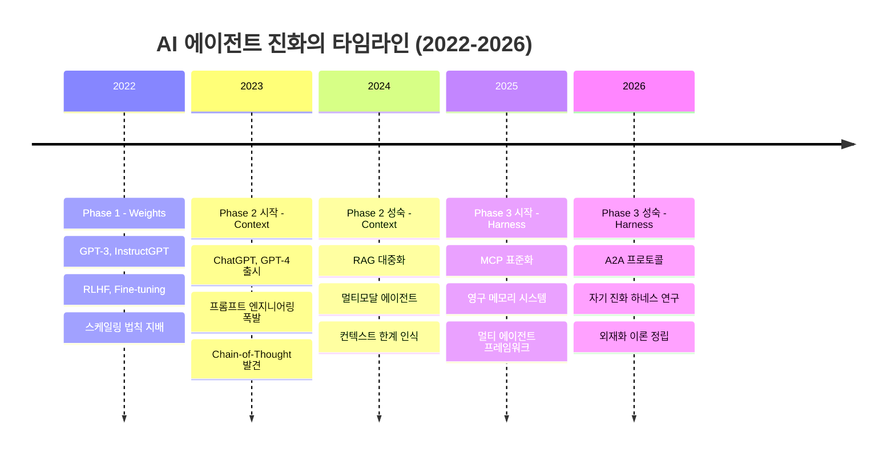

> **원문 출처**  
> - 트윗: [@akshay_pachaar](https://x.com/akshay_pachaar/status/2044763357300027842)  
> - 논문: [Externalization in LLM Agents: A Unified Review of Memory, Skills, Protocols and Harness Engineering](https://arxiv.org/abs/2604.08224)  
> - 저자: Chenyu Zhou 외 20인 (2026년 4월 9일 제출, arXiv:2604.08224)

---

## 개요: 가장 중요한 변화는 모델 자체가 아니었다

2022년부터 2026년까지, AI 에이전트 분야에서 가장 큰 패러다임 전환이 일어났다. 그런데 놀랍게도 이 전환은 모델을 더 똑똑하게 만드는 것과는 거의 무관했다. 진짜 변화는 **모델을 둘러싼 환경(environment)을 더 스마트하게 만드는 것**에 있었다.

이 4년간의 여정은 세 개의 뚜렷한 국면으로 요약할 수 있다:

1. **Phase 1 — Weights (2022)**: 능력은 모델 가중치 안에 있다
2. **Phase 2 — Context (2023–2024)**: 능력은 프롬프트 맥락 안에 있다
3. **Phase 3 — Harness Engineering (2025–2026)**: 능력은 모델을 감싸는 인프라 안에 있다

이 전환의 핵심 논리는 **외재화(Externalization)** 라는 개념으로 설명된다. 과거에 모델 내부(파라미터)에 갇혀 있던 지식, 절차, 상호작용 구조가 점점 외부의 영구적 인프라로 옮겨가고 있다는 것이다. arXiv 논문은 이 흐름을 인지 아티팩트(Cognitive Artifact) 이론을 빌려 체계적으로 분석한다.

---

## Phase 1: Weights — 가중치의 시대 (2022)

### 패러다임의 본질

2022년, AI 에이전트 개발의 중심에는 오직 **모델 자체**가 있었다. 당시 지배적인 신념은 매우 단순했다: 더 큰 모델, 더 많은 데이터, 더 나은 훈련 방식이 곧 더 나은 에이전트를 의미한다는 것이었다. 스케일링 법칙(Scaling Laws)은 이 믿음의 이론적 토대였으며, "파라미터가 늘어날수록 능력도 늘어난다"는 공식이 업계 전체를 지배했다.

이 시기에 RLHF(인간 피드백을 통한 강화학습)와 파인튜닝(fine-tuning)이 모델의 행동을 형성하는 핵심 도구였다. 더 나은 에이전트를 원한다면, 더 나은 모델을 훈련시키면 됐다. 사용자가 원하는 행동 패턴은 모두 가중치(weights) 안에 새겨졌다.

### 작동 방식과 성취

이 접근법은 **단일 턴(single-turn) 태스크**에서 놀라운 효과를 발휘했다. 질문 하나를 던지면 답변 하나가 나오는 구조, 즉 입력과 출력이 명확하게 분리된 환경에서는 가중치 기반 접근이 매우 강력했다. GPT-3, Codex, InstructGPT 등의 모델이 이 시기를 대표한다.

### 한계의 등장

그러나 이 패러다임은 몇 가지 근본적인 벽에 부딪혔다.

**첫째, 업데이트의 경직성이다.** 모델이 알고 있는 사실이 틀렸거나 오래됐다면, 그 사실 하나를 고치기 위해 전체 모델을 재훈련해야 했다. 이는 시간적으로도, 비용적으로도 막대한 부담이었다.

**둘째, 행동 감사(auditing)가 불가능에 가까웠다.** 모델이 왜 그런 판단을 내렸는지를 추적하는 것은 수십억 개의 가중치를 역방향으로 해석해야 하는 일이었다. 투명성과 설명 가능성이 심각하게 결여됐다.

**셋째, 개인화(personalization)의 한계다.** 단 하나의 고정된 가중치 집합으로 수백만 명의 사용자 각각에게 맞춤화된 경험을 제공하는 것은 구조적으로 불가능했다.

---

## Phase 2: Context — 맥락의 시대 (2023–2024)

### 핵심 통찰의 전환

Phase 2의 시작을 알린 것은 하나의 단순하지만 혁명적인 깨달음이었다: **모델을 바꾸지 않아도 된다. 모델이 보는 것을 바꾸면 된다.** 

같은 모델이라도 프롬프트에 무엇을 담느냐에 따라 전혀 다른 방식으로 행동할 수 있다는 사실이 실험적으로 입증됐다. 이는 에이전트 개발의 무게 중심을 훈련에서 추론 시점으로 옮기는 대전환이었다.

### 핵심 기법들의 부상

이 시기에는 다양한 컨텍스트 엔지니어링 기법들이 급격히 발전했다.

**프롬프트 엔지니어링(Prompt Engineering)** 은 모델에게 어떤 역할을 부여하고, 어떤 형식으로 응답하게 할지를 정교하게 설계하는 기술로 발전했다. 단순한 질문에서 벗어나, 시스템 프롬프트, 역할 설정, 제약 조건 등이 모두 프롬프트의 일부가 됐다.

**퓨샷 예시(Few-shot Examples)** 는 프롬프트 안에 몇 가지 예제를 포함시키는 방식으로, 모델이 추론해야 할 패턴을 명시적으로 보여줌으로써 행동 품질을 크게 향상시켰다.

**체인-오브-쏘트(Chain-of-Thought, CoT)** 는 모델에게 최종 답변을 바로 내놓는 것이 아니라, 단계적으로 추론 과정을 거치도록 유도하는 기법이다. "단계별로 생각해보자(Let's think step by step)"라는 단순한 지시가 복잡한 수학 문제 해결 능력을 크게 향상시킨다는 것이 실험적으로 확인됐다.

**RAG(Retrieval-Augmented Generation)** 는 이 시기 가장 중요한 혁신 중 하나였다. 외부 벡터 데이터베이스에서 관련 정보를 검색해 프롬프트에 포함시키는 방식으로, 모델이 학습 당시에는 몰랐던 최신 정보나 도메인 특화 지식을 실시간으로 활용할 수 있게 됐다.

### 패러다임 전환의 경제학

이 변화는 단순히 기술적인 것만이 아니었다. 경제적 인센티브도 명확했다. 파인튜닝보다 프롬프트 반복 실험이 훨씬 저렴하고 빨랐다. 결과적으로 많은 개발자들이 "모델 훈련"에서 "프롬프트와 검색 파이프라인 반복 개선"으로 전환했다. 이는 AI 개발의 진입 장벽을 극적으로 낮추는 효과도 가져왔다.

### 새로운 한계: 맥락은 유연성을 주었지만 신뢰성은 주지 않았다

그러나 컨텍스트 중심 접근법도 피할 수 없는 한계를 가졌다.

**컨텍스트 윈도우의 유한성**이 첫 번째 문제였다. 아무리 긴 컨텍스트를 허용하더라도, 장기 프로젝트나 복잡한 에이전트 워크플로에서 필요한 모든 정보를 담기에는 물리적 한계가 존재했다.

**"중간 손실(Lost in the Middle)" 현상**도 실증적으로 확인됐다. 긴 프롬프트에서 모델은 앞부분과 뒷부분의 내용에는 잘 주의를 기울이지만, 중간 부분의 정보는 상대적으로 무시하는 경향을 보였다. 즉, 프롬프트가 길어질수록 오히려 정보 처리의 균일성이 깨지는 역설이 발생했다.

**세션 간 망각(Inter-session Amnesia)** 도 구조적 문제였다. 모든 새 세션은 완전히 빈 상태에서 시작된다. 이전 대화에서 무슨 일이 있었는지, 사용자의 선호가 무엇인지, 과거에 어떤 결정을 내렸는지를 에이전트는 전혀 기억하지 못했다. 각 세션은 기억상실 환자와의 첫 만남과 같았다.

---

## Phase 3: Harness Engineering — 하네스 엔지니어링의 시대 (2025–2026)

### 근본적인 질문의 변화

Phase 3은 질문 자체가 바뀌면서 시작됐다. 이전까지의 질문이 "모델에게 무엇을 말해야 하는가(What should we tell the model?)"였다면, 이제의 질문은 **"모델이 어떤 환경 속에서 작동해야 하는가(What environment should the model operate in?)"** 로 전환됐다.

이 전환의 핵심은 다음의 인식에 있다: **모델은 더 이상 지능의 유일한 위치(sole location of intelligence)가 아니다.** 모델은 훨씬 더 큰 시스템의 한 구성 요소가 되었으며, 그 시스템 전체가 에이전트의 실질적인 능력을 결정한다.

### 하네스란 무엇인가

하네스(Harness)란 LLM 모델 주변에 구축되는 실행 인프라 전체를 의미한다. 논문은 이를 "모델이 신뢰할 수 있게 작동하도록 만드는 통합 레이어"로 정의한다. 하네스는 다음과 같은 핵심 구성 요소를 포함한다.

**1. 영구 메모리(Persistent Memory)**  
세션이 끝나도 사라지지 않는 메모리 시스템이다. 에이전트가 경험한 내용, 사용자의 선호, 프로젝트의 맥락 등을 외부 저장소에 기록하고, 다음 세션에서 관련 내용을 검색해 불러온다. 이를 통해 에이전트는 처음 만나는 사용자처럼 행동하는 것이 아니라, 오랜 협업자처럼 행동할 수 있게 된다.

**2. 재사용 가능한 스킬(Reusable Skills)**  
절차적 전문 지식을 외부 파일이나 모듈로 만들어두는 개념이다. 예를 들어, "코드 리뷰를 할 때는 이 기준에 따른다", "이 API를 호출할 때는 이 스키마를 따른다" 같은 절차가 스킬 파일로 외재화된다. 모델이 이 스킬을 로딩(loading)하면, 매번 프롬프트에 설명을 반복할 필요 없이 일관된 전문적 행동이 가능해진다.

**3. 표준화된 프로토콜(Standardized Protocols)**  
MCP(Model Context Protocol)와 A2A(Agent-to-Agent)와 같은 상호작용 프로토콜이 대표적이다. 이 프로토콜들은 에이전트가 도구를 어떻게 호출하고, 다른 에이전트와 어떻게 통신하며, 사용자와 어떻게 상호작용할지를 표준화한다. 즉흥적인 자연어 명령 대신 구조화된 인터페이스를 제공함으로써 실행의 정확성과 예측 가능성을 높인다.

**4. 실행 샌드박스(Execution Sandboxes)**  
에이전트가 실제로 코드를 실행하거나 시스템과 상호작용할 때의 격리된 실행 환경이다. 에이전트의 행동이 의도치 않은 부작용을 일으키지 않도록 경계를 설정하고, 실패 시 안전하게 롤백할 수 있게 한다.

**5. 승인 게이트(Approval Gates)**  
에이전트가 중요한 결정을 내리거나 돌이키기 어려운 행동을 취하기 전에 인간의 확인을 요청하는 메커니즘이다. 완전 자동화와 완전 수동 사이의 적절한 지점을 찾는 것이 핵심이다.

**6. 관찰 가능성 레이어(Observability Layers)**  
에이전트가 무엇을 보고, 어떻게 추론하고, 어떤 행동을 취했는지를 추적하고 기록하는 인프라다. 이는 디버깅, 감사, 개선을 가능하게 하는 핵심 인프라다. 과거에는 모델의 내부가 블랙박스였지만, 하네스 레이어는 에이전트 행동의 전체 궤적을 투명하게 만든다.

---

## 외재화(Externalization) 이론: 논문의 핵심 프레임워크

arXiv 논문은 이 전체 흐름을 **외재화(Externalization)** 라는 개념적 틀로 통합한다. 논문은 인지 아티팩트(Cognitive Artifact) 이론을 차용해, 에이전트 인프라가 단순히 보조 컴포넌트를 추가하는 것이 아니라, 모델이 해결하기 어려운 인지적 부담을 모델이 더 잘 처리할 수 있는 형태로 변환시킨다고 주장한다.

### 메모리의 외재화 (Externalized State: Memory)

메모리 외재화는 에이전트의 '상태(state)'를 시간을 가로질러 보존하는 것을 의미한다. 논문은 외재화되는 메모리의 내용을 네 가지로 분류한다.

- **작업 컨텍스트(Working Context)**: 현재 태스크에서의 중간 상태, 열린 파일, 현재 진행 단계 등
- **에피소딕 경험(Episodic Experience)**: 과거 세션에서 무슨 일이 있었는지, 어떤 접근법이 효과적이었는지
- **시맨틱 지식(Semantic Knowledge)**: 도메인 특화 사실, 프로젝트 규약, 시스템 아키텍처 문서 등
- **개인화 메모리(Personalized Memory)**: 특정 사용자의 선호, 작업 스타일, 과거 결정 패턴 등

메모리 아키텍처의 진화는 네 단계를 거쳤다. 먼저 **단일체 컨텍스트(Monolithic Context)** 에서 모든 것을 하나의 긴 프롬프트에 담는 방식으로 시작했다. 이어 **검색 저장소를 갖춘 컨텍스트(Context with Retrieval Storage)**, 즉 RAG 방식으로 발전했다. 그 다음에는 작업 메모리와 장기 메모리를 분리하는 **계층적 메모리(Hierarchical Memory)** 가 등장했다. 현재는 에이전트가 자신의 메모리를 능동적으로 관리하는 **적응형 메모리 시스템(Adaptive Memory Systems)** 으로까지 발전하고 있다.

### 스킬의 외재화 (Externalized Expertise: Skills)

스킬(Skill)은 절차적 전문 지식을 외부 파일이나 모듈로 만들어 재사용 가능하게 한 것이다. 스킬에는 세 가지 종류의 내용이 담긴다.

- **운영 절차(Operational Procedure)**: "이 작업을 할 때는 이 순서를 따른다"
- **의사결정 휴리스틱(Decision Heuristics)**: "이런 상황에서는 이 선택을 한다"
- **규범적 제약(Normative Constraints)**: "이것만큼은 절대 하지 않는다"

스킬의 진화도 세 단계로 분류된다. **원자적 실행 프리미티브(Atomic Execution Primitives)**: 단순한 API 호출 래퍼나 도구 정의. **대규모 프리미티브 선택(Large-scale Primitive Selection)**: 수백 개의 도구 중에서 적합한 것을 고르는 방식. **패키지화된 전문 지식으로서의 스킬(Skill as Packaged Expertise)**: 단순 도구를 넘어 체계적인 절차와 맥락이 담긴 스킬 패키지. 현재는 세 번째 단계가 실용적으로 가장 강력한 것으로 인식되고 있다.

스킬은 어떻게 만들어질까? 논문은 네 가지 방식을 설명한다. **저작(Authored)**: 전문가가 직접 작성. **증류(Distilled)**: 성공적인 에이전트 실행에서 패턴을 추출. **발견(Discovered)**: 에이전트 자신이 탐색을 통해 발견. **구성(Composed)**: 기존 스킬들을 조합해 새로운 스킬 생성.

### 프로토콜의 외재화 (Externalized Interaction: Protocols)

프로토콜은 에이전트와 외부 세계(도구, 다른 에이전트, 사용자) 사이의 상호작용 구조를 명시적으로 정의한 규약이다. 프로토콜이 정의하는 것은 네 가지다.

- **호출 문법(Invocation Grammar)**: 어떻게 도구를 호출하는가
- **생명주기 의미론(Lifecycle Semantics)**: 세션이 어떻게 시작되고 종료되는가
- **권한 및 신뢰 경계(Permission and Trust Boundaries)**: 누가 무엇을 할 수 있는가
- **발견 메타데이터(Discovery Metadata)**: 어떤 도구와 에이전트가 사용 가능한가

현재 중요한 프로토콜들의 유형은 다음과 같다.

- **에이전트-도구 프로토콜**: MCP(Model Context Protocol), OpenAI Function Calling, LangChain Tool Interface
- **에이전트-에이전트 프로토콜**: A2A(Agent-to-Agent), AutoGen 다중 에이전트 프레임워크
- **에이전트-사용자 프로토콜**: 인간 감독 인터페이스, 승인 요청 메커니즘

프로토콜의 중요성은 단순한 기술적 편의를 넘어선다. 프로토콜은 에이전트 시스템의 **거버넌스(governance)**, **보안(security)**, **감사 가능성(auditability)** 의 기반이 된다. 임의의 자연어 명령 대신 구조화된 인터페이스를 통해 에이전트가 행동하면, 그 행동의 범위와 책임 소재를 명확히 할 수 있다.

---

## 구체적 사례: 코딩 에이전트로 보는 차이

논문과 트윗에서 제시된 가장 설득력 있는 비교는 코딩 에이전트 사례다. 기능을 구현하고, 테스트를 실행하고, PR(Pull Request)을 여는 태스크를 상상해보자.

하네스 없는 환경에서는 에이전트가 레포 구조, 프로젝트 관례, 워크플로 상태, 도구 상호작용을 모두 하나의 취약한 프롬프트 안에 유지해야 한다. 컨텍스트가 넘치면 실패하고, 중간에 오류가 발생하면 처음부터 다시 시작해야 한다.

하네스 환경에서는 영구 메모리가 레포 구조를 공급하고, 스킬 파일이 프로젝트 관례를 인코딩하고, 프로토콜이 도구 스키마의 정확성을 보장하며, 런타임이 단계 간 전환과 실패 처리를 담당한다. **모델은 똑같다. 그런데 신뢰성은 완전히 달라진다.**

---

## 세 국면의 비교 분석

| 차원 | Phase 1 (Weights) | Phase 2 (Context) | Phase 3 (Harness) |
|------|-------------------|-------------------|-------------------|
| **지식의 위치** | 모델 파라미터 | 프롬프트 | 외부 인프라 |
| **업데이트 방식** | 전체 재훈련 | 프롬프트 편집 | 메모리/스킬 갱신 |
| **세션 간 연속성** | 없음 | 없음 | 있음 |
| **개인화 수준** | 불가 | 제한적 | 풍부하게 가능 |
| **감사 가능성** | 매우 낮음 | 부분적 | 높음 |
| **신뢰성** | 단순 태스크에 높음 | 중간 | 복잡 태스크에 높음 |
| **비용** | 훈련 비용 높음 | 추론 비용 중간 | 인프라 비용 발생 |
| **경직성** | 높음 | 낮음 | 낮음 |

---

## 하네스 설계의 6가지 분석 차원

논문은 하네스 설계를 평가하는 여섯 가지 핵심 차원을 제시한다.

### 1. 에이전트 루프와 제어 흐름 (Agent Loop and Control Flow)

에이전트가 어떤 순서로 지각(perceive), 추론(reason), 행동(act), 반성(reflect)하는지를 정의하는 제어 구조다. 단순한 선형 루프부터 복잡한 조건 분기, 재시도 로직, 다중 에이전트 오케스트레이션까지 다양한 형태가 존재한다. 좋은 제어 흐름 설계는 에이전트가 부분적 실패를 우아하게 처리하고 복잡한 멀티스텝 태스크를 완수할 수 있게 한다.

### 2. 샌드박싱과 실행 격리 (Sandboxing and Execution Isolation)

에이전트가 실제 시스템과 상호작용할 때의 안전 경계다. 에이전트가 코드를 실행하거나 파일을 수정하거나 API를 호출할 때, 그 행동이 시스템 전체에 의도치 않은 영향을 미치지 않도록 격리된 환경을 제공한다. 코드 에이전트에서는 특히 중요한데, 잘못된 코드 실행이 프로덕션 환경에 영향을 미치지 않도록 해야 한다.

### 3. 인간 감독과 승인 게이트 (Human Oversight and Approval Gates)

에이전트 자율성과 인간 통제 사이의 균형점을 설계하는 것이다. 모든 행동을 자동으로 실행할지, 특정 임계값을 넘는 중요 결정에서는 인간 확인을 요구할지를 정책으로 정의한다. 승인 게이트가 너무 많으면 자동화의 이점이 사라지고, 너무 적으면 위험한 자율 행동이 발생한다.

### 4. 관찰 가능성과 구조화된 피드백 (Observability and Structured Feedback)

에이전트의 추론 과정, 도구 호출, 중간 결과, 최종 행동을 모두 기록하고 추적하는 인프라다. 이는 단순한 로깅을 넘어, 에이전트가 왜 그런 결정을 내렸는지를 사후에 재구성할 수 있게 하는 구조화된 추적 시스템이다. 기업 환경에서 규정 준수(compliance)와 감사(audit)를 위해 필수적이다.

### 5. 설정, 권한, 정책 인코딩 (Configuration, Permissions, and Policy Encoding)

에이전트가 무엇을 할 수 있고, 무엇을 해서는 안 되는지를 명시적으로 정의하는 레이어다. 이것이 잘 설계되면, 에이전트의 행동 범위를 예측 가능하게 통제할 수 있으며, 서로 다른 배포 환경(개발, 스테이징, 프로덕션)마다 다른 정책을 적용하는 것도 가능해진다.

### 6. 컨텍스트 예산 관리 (Context Budget Management)

유한한 컨텍스트 윈도우를 어떻게 할당할지를 결정하는 메커니즘이다. 어떤 메모리를 로드할지, 어떤 스킬을 포함할지, 도구 설명을 어느 수준의 상세도로 포함할지를 동적으로 관리한다. 컨텍스트 예산을 잘 관리하면 같은 컨텍스트 윈도우 내에서 더 많은 작업을 수행할 수 있고, 중요 정보가 희석되는 것을 방지할 수 있다.

---

## 모듈 간 상호작용: 메모리·스킬·프로토콜의 연결

하네스 내의 세 구성 요소는 서로 분리된 것이 아니라 긴밀하게 상호작용한다.

이 상호작용의 의미를 구체적으로 설명하면 다음과 같다.

**메모리 → 스킬 (경험 증류)**: 에이전트가 특정 작업을 반복적으로 성공적으로 수행하면, 그 패턴이 스킬로 증류되어 나중에 재사용될 수 있다. 경험이 절차적 지식으로 변환되는 것이다.

**스킬 → 메모리 (실행 기록)**: 스킬을 실행한 결과와 맥락이 메모리에 기록된다. "이 상황에서 이 스킬을 사용했더니 이런 결과가 나왔다"는 에피소딕 경험이 쌓인다.

**스킬 → 프로토콜 (능력 호출)**: 스킬이 실제로 실행될 때, 정의된 프로토콜을 통해 도구나 외부 서비스를 호출한다. 스킬은 "무엇을 해야 하는가"를 정의하고, 프로토콜은 "어떻게 호출하는가"를 정의한다.

**프로토콜 → 스킬 (능력 생성)**: 새로운 외부 서비스가 프로토콜로 노출되면, 그것을 활용하는 새로운 스킬이 만들어질 수 있다. MCP로 새 도구가 등록되면, 그 도구를 활용하는 스킬이 추가되는 것이 그 예다.

**메모리 → 프로토콜 (전략 선택)**: 과거 경험을 기반으로, 동일한 목표를 달성하기 위해 어떤 프로토콜(어떤 API, 어떤 에이전트)을 사용할지를 선택한다.

**프로토콜 → 메모리 (결과 동화)**: 프로토콜을 통해 얻은 외부 결과(API 응답, 다른 에이전트의 답변 등)가 메모리로 흡수되어 다음 추론의 기반이 된다.

---

## 파라메트릭 vs. 외재화: 트레이드오프의 공간

논문은 능력을 모델 가중치(파라메트릭) 안에 두는 것과 외부 인프라(외재화)에 두는 것 사이의 트레이드오프를 네 가지 차원에서 분석한다.

**업데이트 빈도와 시간적 쇠퇴(Update Frequency and Temporal Decay)**: 빠르게 변하는 정보(최신 법령, 실시간 가격, 동적 API 명세)는 외재화가 유리하다. 느리게 변하는 일반 지식은 파라메트릭 인코딩이 유리하다. 모델 재훈련 없이 즉각적으로 업데이트할 수 있는 외재화는 시간에 민감한 도메인에서 특히 가치 있다.

**재사용 가능성과 다중 에이전트 이식성(Reusability and Multi-agent Portability)**: 외재화된 스킬과 메모리는 여러 에이전트 인스턴스와 다른 모델 간에 공유될 수 있다. 반면 파라메트릭 지식은 특정 모델 버전에 묶여 있어 이식성이 낮다.

**감사 가능성, 거버넌스, 정렬(Auditability, Governance, and Alignment)**: 외재화된 시스템은 에이전트의 행동을 투명하게 추적하고 검토할 수 있다. 파라메트릭 지식은 모델 내부에 분산되어 있어 특정 결정이 왜 내려졌는지를 확인하기 어렵다. 기업 환경의 규정 준수와 AI 정렬 관점에서 외재화의 이점이 크다.

**지연 시간, 단순성, 컨텍스트 부담(Latency, Simplicity, and Context Burden)**: 외재화는 검색, 로딩, 직렬화 등의 오버헤드를 수반한다. 단순한 태스크에서는 이 오버헤드가 이점보다 클 수 있다. 또한 컨텍스트 윈도우에 메모리와 스킬을 넣으면 그만큼 실제 태스크에 사용할 수 있는 공간이 줄어드는 컨텍스트 예산 문제도 있다.

---

## 미래 방향: 무엇이 다음에 올 것인가

### 자기 진화 하네스 (Self-Evolving Harnesses)

현재 하네스는 대부분 인간이 설계하고 유지한다. 다음 단계는 하네스가 스스로를 개선하는 방향이다. 에이전트가 실패한 경험을 분석해 스킬을 자동으로 업데이트하고, 더 효율적인 메모리 인덱싱 구조를 스스로 최적화하며, 새로운 태스크 패턴을 인식해 새로운 스킬을 자동으로 생성하는 시스템이 목표다.

### 공유 에이전트 인프라 (Shared Agent Infrastructure)

현재는 각 조직이 각자의 하네스를 구축하고 있다. 미래에는 스킬, 메모리 스키마, 프로토콜이 공공재 형태로 공유되는 생태계가 만들어질 수 있다. 오픈 소스 소프트웨어처럼, 에이전트 인프라의 공유가 집단 학습과 혁신의 속도를 높일 것이다. MCP 같은 표준 프로토콜의 부상이 이 방향을 예고한다.

### 체화된 외재화 (Embodied Externalization)

논문은 디지털 에이전트를 넘어 물리적 로봇이나 체화된 에이전트로의 확장도 논의한다. 대뇌(고수준 계획을 담당하는 LLM)와 소뇌(빠른 반사적 실행을 담당하는 전문화된 모듈)의 분리와 비슷하게, 하네스 엔지니어링의 원리가 로봇공학에도 적용될 수 있다.

### 외재화 측정 (Measuring Externalization)

현재는 에이전트의 성능을 측정하는 벤치마크들이 주로 파라메트릭 능력을 측정하도록 설계되어 있다. 외재화 수준, 하네스의 품질, 메모리·스킬·프로토콜의 효과성을 측정하는 새로운 평가 프레임워크가 필요하다.

---

## 비용, 위험, 거버넌스

하네스 엔지니어링이 강력하다고 해서 비용과 위험이 없는 것은 아니다. 논문은 세 가지 주요 과제를 지적한다.

**인지적 오버헤드(Cognitive Overhead)**: 하네스가 복잡해질수록, 개발자가 이해하고 유지해야 할 시스템의 복잡도도 높아진다. 메모리, 스킬, 프로토콜, 런타임이 서로 상호작용하는 방식을 파악하고 디버깅하는 것은 상당한 전문성을 요구한다.

**보안 및 무결성 위험(Security and Integrity Risks)**: 외재화된 컴포넌트들은 새로운 공격 표면을 만든다. 메모리에 주입된 잘못된 정보, 악의적으로 수정된 스킬 파일, 프로토콜 경계에서의 권한 탈취 등이 새로운 보안 위협이 된다. 또한 여러 에이전트가 공유 메모리를 사용할 때의 정보 오염 문제도 존재한다.

**인프라로서의 거버넌스(Governance as Infrastructure)**: 에이전트의 행동 기준이 모델 가중치 대신 외부 인프라로 이동한다는 것은, 거버넌스도 인프라 레이어에서 실행되어야 함을 의미한다. 누가 스킬을 승인하는가, 메모리를 어떻게 검증하는가, 프로토콜 표준은 누가 관리하는가 같은 질문들이 중요해진다.

---

## 결론: 중력의 중심은 바깥으로 이동했다

2022년부터 2026년까지의 여정을 돌아보면, 에이전트 엔지니어링의 핵심 통찰은 명확하다. 모델 자체의 능력 향상도 계속 중요하지만, 오늘날 에이전트 신뢰성의 가장 결정적인 개선은 **더 나은 메모리 검색, 더 날카로운 스킬 로딩, 더 엄밀한 실행 거버넌스, 더 스마트한 컨텍스트 예산 관리**에서 나오고 있다.

세 국면은 서로를 대체하지 않았다. 각 단계는 이전 단계 위에 층을 쌓았다. 가중치는 여전히 중요하고, 컨텍스트 엔지니어링도 여전히 중요하다. 그러나 **중력의 중심(center of gravity)이 바깥으로 이동했다.** 지식은 파라미터에서 프롬프트로, 프롬프트에서 지속적인 외부 인프라로 외재화됐다.

더 나은 에이전트를 만드는 것은 점점 더 **모델이 작동하는 더 나은 환경을 만드는 것**을 의미한다. 이것이 2022년에서 2026년까지 AI 에이전트 엔지니어링이 우리에게 가르쳐준 가장 중요한 교훈이다.

---

## 참고 문헌 및 자료

- **논문 (arXiv)**: [Externalization in LLM Agents: A Unified Review of Memory, Skills, Protocols and Harness Engineering](https://arxiv.org/abs/2604.08224)
  - 저자: Chenyu Zhou, Huacan Chai, Wenteng Chen 외 18인
  - 제출일: 2026년 4월 9일
  - 분류: Computer Science > Software Engineering (cs.SE), Multiagent Systems (cs.MA)
  - 분량: 54페이지
- **원문 트윗**: [@akshay_pachaar](https://x.com/akshay_pachaar/status/2044763357300027842)

---

*작성 일자: 2026-04-17*
