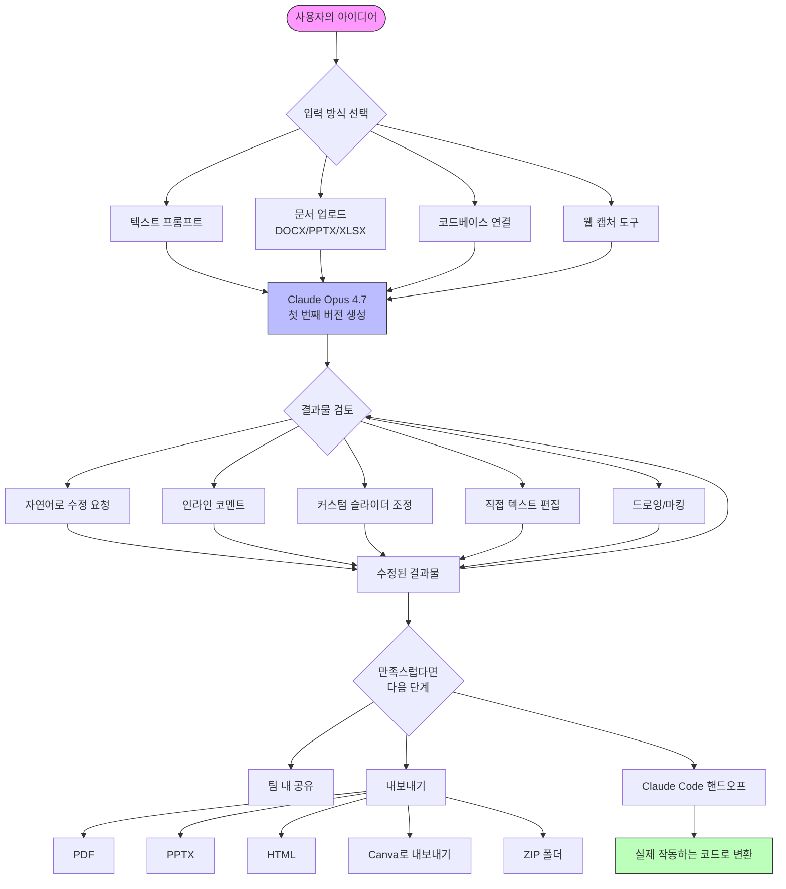
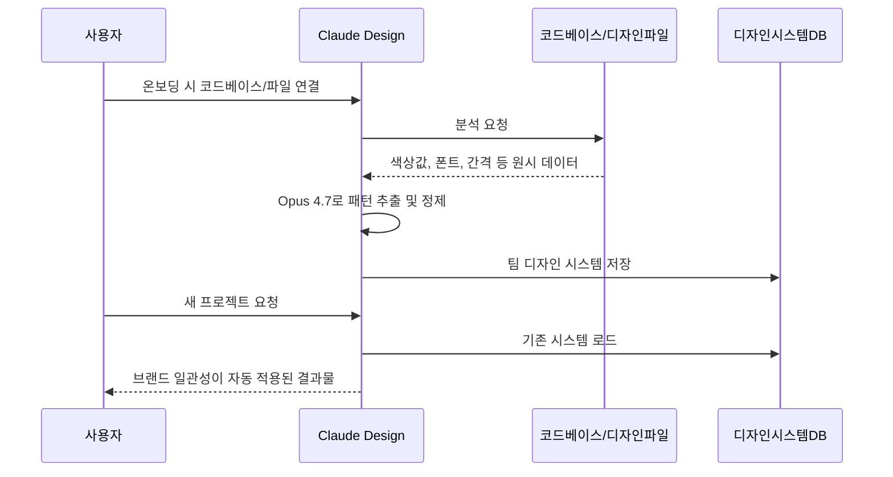
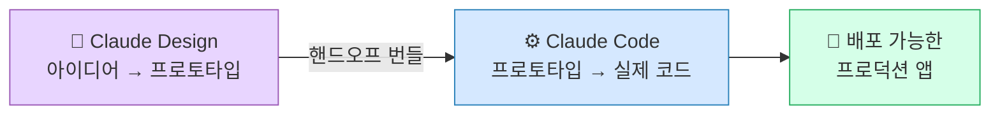
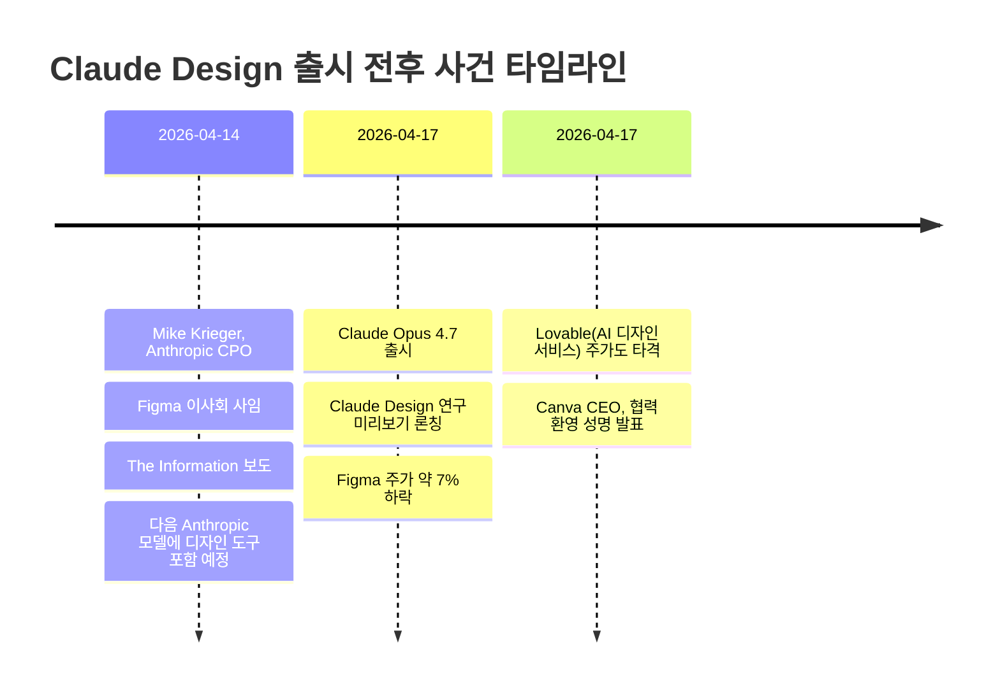
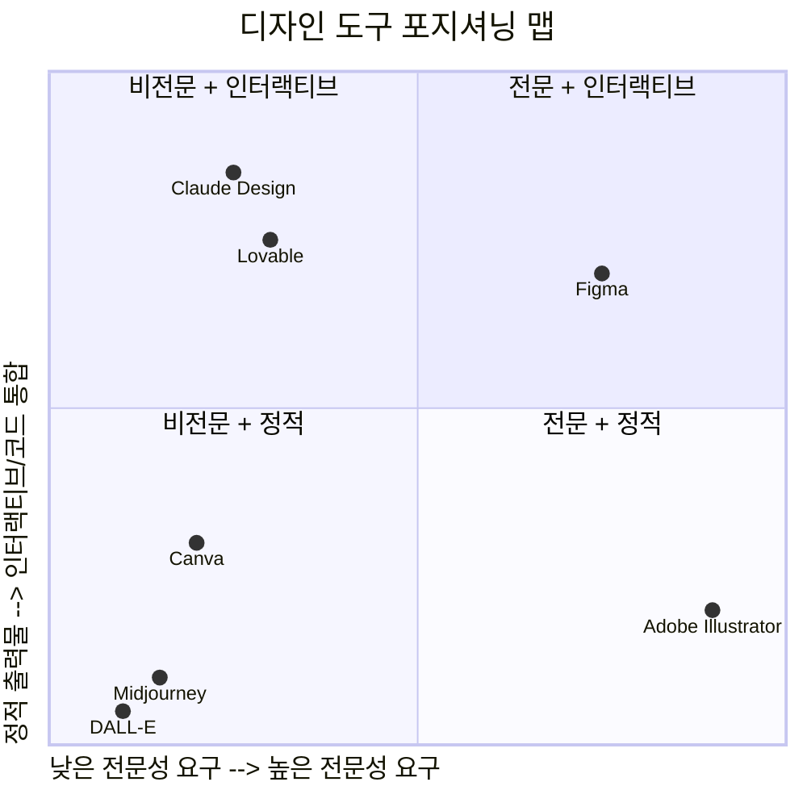
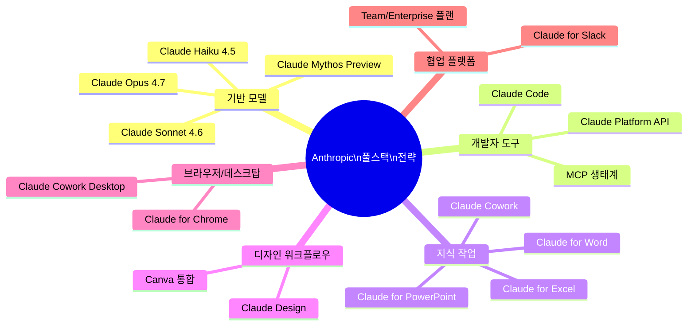

> **출처 기반 분석** | Anthropic 공식 발표 (2026-04-17) + 다수 미디어 취재 종합  
> **분류**: Anthropic Labs / Research Preview / X [阿绎 AYi](https://x.com/ayi_ainotes/status/2045176951292219770)


---

## 목차

1. [개요: Claude Design이란 무엇인가](#1-개요)
2. [탄생 배경과 출시 맥락](#2-탄생-배경)
3. [핵심 기능 상세 해설](#3-핵심-기능)
4. [작동 방식: 실제 워크플로우](#4-작동-방식)
5. [디자인 시스템 자동 구축](#5-디자인-시스템)
6. [Claude Code와의 통합](#6-claude-code-통합)
7. [수출(Export) 옵션](#7-수출-옵션)
8. [사용 요금 및 플랜 구조](#8-요금-구조)
9. [실제 사용 사례: 기업 후기](#9-실사용-사례)
10. [시장 충격: Figma 주가 7% 폭락](#10-시장-충격)
11. [Claude Design vs 기존 디자인 도구 비교](#11-도구-비교)
12. [한계와 현재 제약사항](#12-한계와-제약)
13. [디자이너의 미래: 대체인가 해방인가](#13-디자이너의-미래)
14. [Anthropic의 풀스택 전략 맥락](#14-anthropic-전략)
15. [총평 및 의의](#15-총평)

---

## 1. 개요

**Claude Design**은 Anthropic Labs가 2026년 4월 17일(금) 공식 론칭한 AI 기반 디자인 협업 도구다. 사용자가 자연어로 원하는 결과물을 설명하면 Claude가 즉시 인터랙티브한 프로토타입, 슬라이드 덱, 원페이저, 앱 인터페이스 목업 등을 생성해준다. 이 도구는 Anthropic의 최신 비전 모델인 **Claude Opus 4.7**을 기반으로 구동되며, 현재 연구 미리보기(Research Preview) 단계로 Pro, Max, Team, Enterprise 구독자를 대상으로 순차적으로 제공되고 있다.

Claude Design의 핵심 가치 제안은 간단히 말해 이것이다: **"디자이너가 아니어도 디자이너처럼 결과물을 만들 수 있고, 디자이너라면 열 배 더 빠르게 탐색할 수 있다."**

Anthropic은 이 제품을 단순한 이미지 생성 도구와 명확히 선을 긋는다. Claude Design이 만드는 것은 정적인 이미지가 아니라, 클릭하고 수정하고 코드로 내보낼 수 있는 **살아있는 인터랙티브 결과물**이다.

---

## 2. 탄생 배경

### 2-1. 디자인 현장의 오래된 병목

전통적인 디자인 프로세스는 여러 이해관계자 간의 긴 커뮤니케이션 사이클로 악명이 높다.

```
아이디어 발생
    ↓ (기획자 → 디자이너 브리핑, 수일 소요)
디자이너 목업 제작
    ↓ (리뷰 미팅, 피드백 수집)
수정 및 재작업
    ↓ (승인 프로세스)
최종 결과물
    ↓ (개발자 핸드오프, 재해석 오류 발생)
개발 구현
```

이 사이클에서 발생하는 문제점들은 오랫동안 알려져 왔다.

- **탐색의 제한**: 숙련된 디자이너조차 시간 제약 때문에 3~4개의 방향성만 탐색하고 마는 경우가 대부분이다. 십수 개의 방향을 자유롭게 프로토타이핑하는 것은 현실적으로 불가능했다.
- **비디자이너의 진입 장벽**: 창업자, 제품 관리자, 마케터 등이 자신의 아이디어를 시각적으로 표현하려면 Figma를 배우거나 디자이너에게 의뢰하는 수밖에 없었다. 그 사이에서 아이디어는 항상 희석되고 지연된다.
- **핸드오프 오류**: 디자인이 개발자에게 전달될 때 디자이너의 의도가 코드로 정확히 번역되지 않는 문제가 반복된다.
- **브랜드 일관성 유지**: 디자이너가 퇴직하거나 팀이 바뀌면 기존 디자인 시스템이 흐트러지는 일이 비일비재했다.

### 2-2. Claude Opus 4.7의 동시 출시

Claude Design의 론칭은 Claude Opus 4.7의 일반 출시와 동시에 이루어졌다. Opus 4.7은 이전 버전보다 비전 능력이 대폭 향상되어 더 고해상도 이미지를 처리할 수 있고, 인터페이스, 슬라이드, 문서 제작에서 더 뛰어난 "디자인 감각(design taste)"을 보인다고 Anthropic은 밝혔다. Claude Design은 사실상 Opus 4.7의 강화된 비전 능력을 활용하는 첫 번째 전용 제품 접점(product surface)이라 볼 수 있다.

### 2-3. 출시 전 긴장감: Figma와의 관계

출시 맥락에서 흥미로운 배경이 있다. Anthropic의 최고 제품 책임자(CPO) Mike Krieger는 Claude Design 출시 사흘 전인 4월 14일, Figma 이사회에서 사임했다. 같은 날 The Information은 Anthropic의 차기 모델에 Figma의 핵심 기능과 경쟁하는 디자인 도구가 포함될 것이라고 보도했다. 우연의 일치로 보기 어려운 타이밍이었다.

---

## 3. 핵심 기능

Claude Design의 기능은 크게 다섯 가지 축으로 구성된다.

### 3-1. 대화형 디자인 생성

가장 기본적인 기능이자 가장 혁신적인 부분이다. 사용자는 디자인 전문 용어 없이 원하는 것을 자유롭게 설명하면 된다.

**프롬프트 예시:**
> "명상 앱 모바일 인터페이스를 프로토타이핑해줘. 차분한 타이포그래피, 자연에서 영감을 받은 색상, 깔끔한 레이아웃이어야 해."

Claude는 이 텍스트를 받아 즉시 클릭 가능한 인터랙티브 목업을 생성한다. 이것이 기존 AI 이미지 생성 도구와의 결정적 차이다. DALL-E나 Midjourney가 생성하는 정적 PNG 이미지와 달리, Claude Design의 결과물은 실제로 조작하고 편집하고 코드로 내보낼 수 있다.

### 3-2. 다단계 정밀 편집 메커니즘

Claude Design은 사용자가 결과물을 다양한 방식으로 수정할 수 있도록 여러 편집 레이어를 제공한다.

**방식 1: 자연어 대화를 통한 수정**
- "이 버튼을 이끼색(moss green)으로 바꿔줘"
- "폰트 크기를 줄이고 줄 간격을 더 넉넉하게 해줘"
- "다크모드 토글을 추가해줘"

**방식 2: 인라인 코멘트**
디자인의 특정 요소를 클릭하여 직접 주석을 달 수 있다. 실제 디자이너와 협업할 때와 동일한 방식이다. "이 헤더가 너무 낮아 보여요"처럼 요소에 직접 붙여 놓는 방식이다.

**방식 3: 커스텀 슬라이더**
이것이 가장 독특한 기능이다. Claude가 해당 디자인에 맞는 조정 슬라이더를 직접 만들어준다. 예컨대 카드 컴포넌트를 만들면 "여백(padding)", "둥근 모서리(border-radius)", "그림자 강도(shadow intensity)" 같은 슬라이더가 자동 생성된다. 사용자는 코드나 수치를 직접 입력하지 않고 슬라이더를 드래그하여 실시간으로 결과를 보면서 조정할 수 있다.

**방식 4: 직접 텍스트 편집**
디자인 안의 텍스트를 클릭하면 바로 편집 모드로 진입한다.

**방식 5: 드로잉/마킹**
디자인 위에 직접 그림을 그리거나 표시를 남겨 수정 의도를 전달할 수 있다.

### 3-3. 다양한 결과물 유형

Claude Design이 생성할 수 있는 결과물의 범위는 상당히 넓다.

| 유형 | 설명 | 주요 사용자 |
|------|------|------------|
| **인터랙티브 프로토타입** | 클릭 가능한 앱/웹 인터페이스 목업 | 디자이너, PM |
| **제품 와이어프레임** | 기능 플로우 스케치 | PM |
| **피치덱/프레젠테이션** | 브랜드 일관 슬라이드 | 창업자, 영업 |
| **마케팅 콜래터럴** | 랜딩 페이지, SNS 에셋 | 마케터 |
| **원페이저** | 제품/서비스 소개 단일 페이지 | 누구나 |
| **프론티어 디자인** | 음성, 비디오, 3D, 셰이더 포함 코드 기반 프로토타입 | 고급 사용자 |

### 3-4. 멀티모달 입력 지원

Claude Design은 텍스트 프롬프트 이외에도 다양한 입력 방식을 지원한다.

- **문서 업로드**: DOCX, PPTX, XLSX 파일을 그대로 가져올 수 있다.
- **코드베이스 연동**: 기존 프로젝트의 코드베이스를 직접 지정하면 Claude가 해당 코드에서 디자인 언어를 추출한다.
- **웹 캡처 도구**: 기존 웹사이트의 요소들을 그대로 캡처하여 프로토타입에 반영할 수 있다. 덕분에 프로토타입이 실제 제품처럼 보인다.

### 3-5. 협업 기능

Claude Design은 팀 단위 협업을 위한 공유 기능을 내장한다.

- **비공개 문서**: 기본값은 작성자 본인만 볼 수 있는 비공개 상태다.
- **조직 내 공유**: 조직 스코프 링크 공유로 같은 조직의 누구든 볼 수 있게 설정 가능하다.
- **편집 권한 공유**: 동료에게 편집 권한을 부여하면 함께 디자인을 수정하고 Claude와의 대화도 공동으로 진행할 수 있다. (그룹 대화 형태)

---

## 4. 작동 방식: 실제 워크플로우

아래는 Claude Design의 전형적인 사용 흐름을 도식화한 것이다.



이 워크플로우에서 가장 주목할 점은 전체 사이클이 단일 대화 인터페이스 안에서 완결된다는 사실이다. 아이디어 구상부터 프로토타이핑, 정제, 코드 생성까지 창 전환 없이 이루어진다.

---

## 5. 디자인 시스템 자동 구축

Claude Design의 기능 중 가장 "검은 기술"에 해당하는 부분이 바로 **디자인 시스템(Design System) 자동 구축**이다.

### 5-1. 개념 설명

디자인 시스템이란 조직 내 모든 디자인 작업에 적용되는 시각적 언어의 집합이다. 색상 팔레트, 타이포그래피 규칙, 여백과 간격 가이드라인, 버튼/카드/폼 같은 재사용 컴포넌트 등이 포함된다. 대기업들은 이것을 체계적으로 관리하는 전담 팀을 두고 있으며, 중소 스타트업에서는 이것이 없어서 새 프로젝트마다 일관성이 깨지는 문제를 겪는다.

### 5-2. 작동 원리



온보딩 과정에서 Claude는 팀의 코드베이스와 기존 디자인 파일을 읽고, 거기서 팀의 색상 체계, 타이포그래피 스타일, 컴포넌트 규범을 자동으로 추출해 팀 고유의 디자인 시스템을 구축한다. 이후 모든 새 프로젝트는 자동으로 이 시스템을 적용받는다. 팀원들은 이 시스템을 시간이 지남에 따라 정제할 수 있고, 여러 개의 디자인 시스템을 병렬로 유지 관리할 수도 있다.

### 5-3. 이 기능의 혁명적 의미

기존에는 디자인 시스템이 특정 디자이너 개인의 지식이나 Figma 라이브러리에 암묵적으로 묻혀 있었다. 핵심 디자이너가 퇴직하면 전체 브랜드 일관성이 흔들리는 것이 현실이었다. Claude Design은 이 지식을 명시적이고 재사용 가능한 형태로 추출하여 조직 차원의 자산으로 만든다.

---

## 6. Claude Code 통합



Claude Design과 Claude Code의 통합은 Anthropic이 구축하려는 생태계의 핵심 루프다.

디자인 작업이 완료되면 Claude Design은 모든 디자인 의도와 명세를 포함한 **핸드오프 번들(handoff bundle)** 을 자동으로 패키징한다. 이 번들을 Claude Code에 단 한 번의 명령으로 전달하면, Claude Code가 그것을 실제로 작동하는 코드로 변환한다.

이 통합이 해결하는 문제는 단순히 속도가 아니다. 기존 디자인-개발 핸드오프 과정에서 가장 많은 손실이 발생했던 부분, 즉 디자이너의 의도가 개발자의 코드 해석 과정에서 변형되는 문제를 원천적으로 차단한다. 디자인 의도 자체가 번들에 포함되어 있기 때문이다.

Datadog의 제품 관리자 Aneesh Kethini는 이 통합에 대해 이렇게 말했다: "회의실을 벗어나기도 전에 아이디어에서 작동하는 프로토타입까지 완성됐다. 예전이라면 브리핑, 목업, 리뷰 회의를 오가며 일주일이 걸렸을 과정이 단 하나의 대화 안에서 끝났다."

---

## 7. 수출(Export) 옵션

Claude Design의 결과물을 다양한 형태로 내보낼 수 있다는 점도 중요한 특징이다.

| 내보내기 형식 | 특징 |
|--------------|------|
| **조직 내부 URL** | 링크만 있으면 조직 구성원 누구나 접근 가능 |
| **ZIP 폴더** | 로컬에 전체 파일로 저장 |
| **PDF** | 발표 자료, 공유 문서 등 범용 포맷 |
| **PPTX** | PowerPoint에서 바로 편집 가능한 프레젠테이션 파일 |
| **HTML** | 독립 실행 가능한 웹 파일 |
| **Canva** | Canva로 직접 내보내어 완전한 편집 및 협업 환경에서 계속 작업 |
| **Claude Code** | 핸드오프 번들 형태로 전달, 실제 코드로 변환 |

Canva와의 통합은 특히 눈여겨볼 만하다. Anthropic은 Canva를 경쟁자가 아닌 파트너로 명확히 포지셔닝하고 있다. Canva CEO Melanie Perkins는 공식 성명에서 "아이디어가 시작되는 곳에 Canva를 가져간다는 것이 우리의 사명"이라며 이 협력을 환영했다. Claude Design은 "아이디어에서 시각물로의 빠른 변환"을, Canva는 "그 시각물의 완성도 높은 편집과 협업"을 각각 담당하는 분업 구조다.

---

## 8. 요금 구조

Claude Design은 요금 측면에서 몇 가지 독특한 구조를 갖는다.

### 8-1. 기본 구독 포함

Pro, Max, Team, Enterprise 구독에 기본 포함되어 있다. 별도 추가 요금이 없다. 다만 사용량 한도는 별도로 적용된다.

### 8-2. 독립적인 사용량 추적

Claude Design은 **일반 채팅 및 Claude Code와 별도로 독립적인 사용량 한도**를 갖는다. Anthropic 공식 문서에 따르면:

> "Claude Design은 자체적인 사용량 추적, 자체적인 허용량, 구독 플랜에 대해서는 기존 채팅 또는 Claude Code 한도 안에 포함되지 않는 별도의 주간 한도를 갖습니다."

즉, 채팅을 아무리 많이 했어도 Claude Design 한도는 별도로 소진된다. 반대로 Claude Design을 많이 써도 채팅 한도는 줄어들지 않는다.

### 8-3. 사용자 불만: 빠른 한도 소진

현실적인 문제도 이미 제기되고 있다. X(구 트위터)에서 @voyagerdolphin2 사용자는 월 $200 Max 플랜 구독자임에도 단 3개의 디자인을 시도한 후 주간 할당량의 60%를 이미 소진했다고 밝혔다. 연구 미리보기 단계의 한도 정책이 실제 업무 활용에는 다소 빡빡할 수 있다는 우려가 나오고 있다.

### 8-4. Enterprise 특이 사항

Enterprise 조직에서는 Claude Design이 **기본값 비활성화**로 설정되어 있다. 관리자가 조직 설정에서 직접 활성화해야 한다. 또한 Enterprise 사용량 기반 과금 사용자에게는 일회성 크레딧이 제공되는데, 이는 약 20개의 전형적인 프롬프트를 커버하는 양이며 2026년 7월 17일에 만료된다.

---

## 9. 실사용 사례: 기업 후기

### 9-1. Brilliant (에듀테크)

교육 기술 회사 Brilliant의 시니어 제품 디자이너 Olivia Xu는 다음과 같이 평가했다:

> "Brilliant의 복잡한 인터랙티브 구성과 애니메이션은 역사적으로 프로토타이핑하기 가장 어려운 영역이었습니다. Claude Design은 정적 디자인을 인터랙티브 프로토타입으로 전환하는 데 있어 게임체인저였습니다. 다른 도구에서 20개 이상의 프롬프트가 필요했던 가장 복잡한 페이지들이 Claude Design에서는 단 2개의 프롬프트로 완성됐습니다."

특히 팀은 정적 목업을 쉽게 공유 가능한 인터랙티브 프로토타입으로 전환하여 코드 리뷰나 PR 없이 사용자 테스트를 진행할 수 있게 됐고, Claude Code 핸드오프 시 디자인 의도까지 포함되어 프로토타입에서 프로덕션으로의 전환이 매끄러워졌다고 밝혔다.

### 9-2. Datadog (클라우드 모니터링)

Datadog의 제품 관리자 Aneesh Kethini는 팀의 변화를 이렇게 묘사했다:

> "Claude Design은 우리 팀의 프로토타이핑 속도를 극적으로 높여, 회의 중 실시간 라이브 디자인을 가능하게 했습니다. 회의실을 벗어나기도 전에 거친 아이디어가 작동하는 프로토타입이 됐고, 결과물은 우리 브랜드와 디자인 가이드라인을 충실히 반영했습니다. 브리핑, 목업, 리뷰 라운드를 오가며 일주일이 걸리던 과정이 이제 단 하나의 대화로 끝납니다."

---

## 10. 시장 충격: Figma 주가 7% 폭락

Claude Design의 발표 직후 디자인 소프트웨어 시장에는 즉각적인 반응이 나타났다.



The Register는 이 상황을 "Claude Design announced, Figma's stock fell about 7 percent"라고 직접적으로 보도했다. Figma는 Anthropic과 긴밀하게 협력하며 자사 제품에 Claude 모델을 통합해왔는데, 이제 Anthropic이 직접 Figma의 핵심 기능 영역에 진입한 셈이다. VentureBeat는 이 상황을 "보완성을 주장하기 어려운" 상황이라고 표현했다.

다만 Anthropic은 공식적으로 Claude Design이 Figma를 대체하려는 것이 아니라 보완하는 제품이라는 입장을 유지하고 있다.

---

## 11. Claude Design vs 기존 디자인 도구 비교



| 특성 | Claude Design | Figma | Canva | Midjourney/DALL-E |
|------|:---:|:---:|:---:|:---:|
| 자연어 입력 | ✅ | ❌ (보조적) | ⚠️ 부분적 | ✅ |
| 인터랙티브 결과물 | ✅ | ✅ | ❌ | ❌ |
| 코드 직접 변환 | ✅ (Claude Code) | ⚠️ (서드파티) | ❌ | ❌ |
| 디자인 시스템 자동 구축 | ✅ | ❌ (수동) | ❌ | ❌ |
| 팀 협업 | ⚠️ (초기) | ✅ | ✅ | ❌ |
| 전문가 정밀 제어 | ⚠️ 제한적 | ✅ | ⚠️ | ❌ |
| 학습 곡선 | 낮음 | 높음 | 낮음 | 낮음 |
| 브랜드 일관성 자동화 | ✅ | ⚠️ 부분 | ❌ | ❌ |

### 결론적 차별화

Claude Design은 기존 도구들이 제공하지 못하던 **아이디어에서 인터랙티브 코드까지의 원스톱 파이프라인**을 제공한다는 점에서 완전히 새로운 카테고리에 있다. Figma가 "전문 디자이너의 정밀 작업 도구"라면, Claude Design은 "아이디어를 가진 모든 사람의 빠른 시각화 도구"에 가깝다. Canva가 "완성된 디자인의 편집 및 배포 플랫폼"이라면, Claude Design은 "그 디자인이 시작되기 전 단계"를 담당한다.

---

## 12. 한계와 현재 제약사항

연구 미리보기 단계인 만큼 현재 한계도 솔직하게 인정되고 있다.

VentureBeat 취재에 따르면 Anthropic 스스로 밝힌 현재 제약은 다음과 같다.

1. **코드베이스 품질 의존성**: 디자인 시스템 자동 추출 기능은 깔끔한 코드베이스에서 최선의 결과를 낸다. 지저분하고 일관성 없는 기존 코드베이스는 지저분한 디자인 시스템 출력으로 이어진다.

2. **협업 기능의 미완성**: 현재 협업 기능은 기본 수준이며, 진정한 멀티플레이어 실시간 협업은 아직 완전하지 않다.

3. **편집 경험의 거친 부분**: 직접 편집 경험에는 아직 개선이 필요한 부분들이 남아 있다.

4. **일반 출시 일정 미정**: Anthropic은 의도적으로 정식 출시 일정을 공개하지 않았다. 사용자 피드백이 제품 성숙도를 결정할 것이라는 입장이다.

5. **주간 사용량 한도**: 앞서 언급한 대로 빠른 한도 소진에 대한 불만이 초기 사용자들 사이에서 이미 제기되고 있다.

---

## 13. 디자이너의 미래: 대체인가 해방인가

이 도구의 출시와 함께 "디자이너가 대체될 것인가"라는 논의가 즉각 불붙었다. 그러나 현장의 목소리는 보다 미묘한 방향을 가리킨다.

### 대체될 것이라는 시각

The Register는 Claude Design의 가치 제안 문구로 "You don't need to be a designer to get great results"를 인용하며, 이것이 함의하는 바를 짚었다. 그래픽 디자인 레딧 커뮤니티에서는 Claude Design 출시 직전 "AI 없이는 '해고'라는 단어를 완성할 수 없다(You can't spell 'laid-off' without AI)"는 글이 올라오기도 했다.

### 해방된다는 시각

Anthropic과 실사용 기업들은 다른 해석을 내놓는다. Claude Design이 자동화하는 것은 주로 **반복적이고 소모적인 작업들**이다.

- 픽셀 단위 정렬 작업
- 디자인 시스템 문서 유지 관리
- 피드백을 반영한 반복 수정
- 브랜드 일관성 점검

이런 작업들이 자동화되면 디자이너는 진짜 창의적 의사결정과 사용자 경험 전략에 집중할 수 있다. 

샌프란시스코 기반 그래픽 디자이너 Molly McCoy는 The Register 인터뷰에서 AI 도구를 거의 활용하지 않고 있다고 밝혔다. 이는 시장 전반의 채택이 아직 초기 단계임을 시사한다.

### 시장 확장 효과

장기적으로 더 주목할 만한 시나리오는 **디자인 시장 자체의 확대**다. 기존에 디자인을 엄두도 내지 못했던 개인 창업자, 소규모 기업, 1인 마케터들이 이제 빠르게 시각화된 아이디어를 검증할 수 있다. 이 "거친 초기 프로토타입"들은 결국 전문 디자이너의 손을 거쳐 완성도 높은 최종 결과물로 다듬어져야 한다. 즉, 수요 자체가 늘어날 수 있다.

X(트위터)의 @ayi_ainotes가 정리한 시각도 이와 같다: "이건 Figma나 Canva를 죽이는 게 아니라, 디자인을 소수의 전문 기술에서 모두가 쓸 수 있는 생산성 도구로 변환하는 것이다."

---

## 14. Anthropic의 풀스택 전략 맥락

Claude Design은 독립적인 제품으로 봐서는 그 의미가 반감된다. Anthropic의 전체 제품 포트폴리오 안에서 이해해야 전략적 의도가 보인다.



VentureBeat는 이 흐름을 명확하게 포착했다: "Anthropic은 이제 기초 모델 제공자에서 완전한 풀스택 제품 회사로 변모하고 있다. 아이디어에서 출시 제품까지의 전 사이클을 Anthropic 생태계 안에서 완결하려는 것이다."

Claude Code(개발), Claude Cowork(지식 작업), Claude Design(시각화)이 갖춰지면서 Anthropic은 이제 소프트웨어 제품 개발의 전 과정—기획, 디자인, 개발, 배포—에 걸친 자체 생태계를 보유하게 됐다.

### 비즈니스 맥락

이 전략은 Anthropic의 급속한 매출 성장과 맞물려 있다. 블룸버그에 따르면 Anthropic의 연간 매출은 2026년 3월 초 약 200억 달러에 달했고, 4월 초에는 이미 300억 달러를 넘어섰다. 이 기세를 바탕으로 Anthropic은 Goldman Sachs, JPMorgan, Morgan Stanley와 함께 2026년 10월경 IPO를 논의 중인 것으로 알려졌다. Claude Design이 Anthropic의 기업 채택을 가속할 제품 훅이 될 수 있다는 점에서 전략적 타이밍이 맞아 떨어진다.

---

## 15. 총평 및 의의

Claude Design은 여러 의미에서 주목할 만한 출시다.

**기술적 관점**에서 Claude Design은 지금까지 AI 도구의 공통 한계였던 "정적 결과물" 문제를 해결한다. 생성된 디자인이 인터랙티브하고 코드로 직결된다는 것은, AI가 창작 과정의 최종 단계가 아니라 시작점이 된다는 의미다.

**사용자 경험 관점**에서 가장 인상적인 부분은 커스텀 슬라이더 생성 기능이다. AI가 단순히 결과물을 내놓는 것을 넘어, 해당 결과물을 탐색하고 조정하기 위한 최적의 인터페이스 자체를 동적으로 생성한다. 이는 "AI가 사용자의 다음 행동을 예측하여 도구를 만든다"는 새로운 패턴이다.

**산업 생태계 관점**에서 Claude Design의 등장은 "AI 통합 디자인 도구"가 독립 카테고리로 부상했음을 알리는 신호탄이다. Figma, Canva, Adobe 등 기존 강자들이 어떻게 대응할지, 그 대응이 협력인지 경쟁인지는 앞으로 수개월의 관전 포인트다.

**비판적 관점**에서 보면, 여전히 연구 미리보기 단계라는 점, 주간 사용량 한도의 빠른 소진, 협업 기능의 미완성 등은 실제 업무 도입에 있어 고려해야 할 현실적 제약이다. "회의실을 떠나기 전에 프로토타입이 완성된다"는 약속이 모든 팀에게 그대로 적용되려면 아직 성숙이 필요하다.

그럼에도 방향성은 선명하다. AI는 이제 "코드를 쓰는 것"을 넘어 "디자인하는 것"도 근본적으로 바꾸고 있다. 그리고 Anthropic이 그 변화의 한 축을 차지하겠다는 의지를 이번 출시로 분명히 했다.

---

## 참고 자료

- [Anthropic 공식 발표: Introducing Claude Design](https://www.anthropic.com/news/claude-design-anthropic-labs) (2026-04-17)
- [Anthropic 공식 발표: Introducing Claude Opus 4.7](https://www.anthropic.com/news/claude-opus-4-7)
- [TechCrunch: Anthropic launches Claude Design](https://techcrunch.com/2026/04/17/anthropic-launches-claude-design-a-new-product-for-creating-quick-visuals/)
- [VentureBeat: Anthropic just launched Claude Design](https://venturebeat.com/technology/anthropic-just-launched-claude-design-an-ai-tool-that-turns-prompts-into-prototypes-and-challenges-figma)
- [The Register: Anthropic debuts Claude Design](https://www.theregister.com/2026/04/17/anthropic_debuts_claude_design/)
- [9to5Mac: Anthropic launches Claude Design following Opus 4.7](https://9to5mac.com/2026/04/17/anthropic-launches-claude-design-for-mac-following-opus-4-7-model-upgrade/)
- [The New Stack: Anthropic launches Claude Design, a Figma and Canva rival](https://thenewstack.io/anthropic-claude-design-launch/)
- [Claude Design 바로가기: claude.ai/design](https://claude.ai/design)

---

