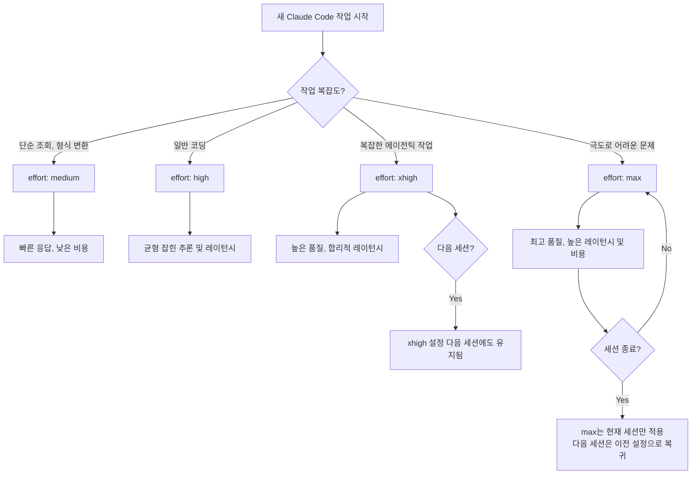
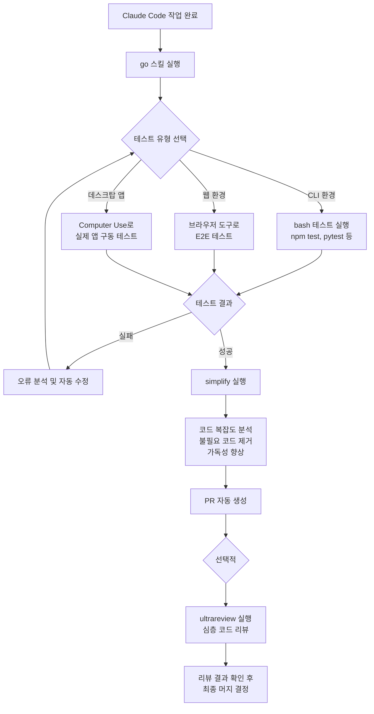
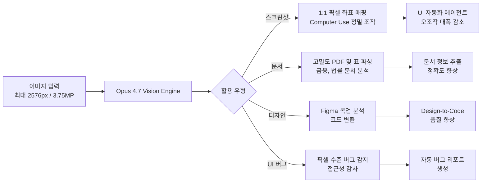
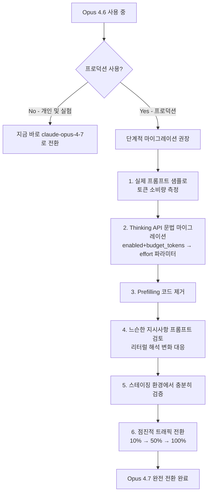

> **최신 업데이트 기준: 2026년 4월 16일 (공식 출시일)**  
> 작성일: 2026-04-17

---

## 목차

1. [Claude Opus 4.7 개요](#1-claude-opus-47-개요)
2. [핵심 성능 지표 — 벤치마크 총정리](#2-핵심-성능-지표--벤치마크-총정리)
3. [Claude Code: 핵심 기능 심층 해설](#3-claude-code-핵심-기능-심층-해설)
   - 3-1. Auto Mode
   - 3-2. /less-permission-prompts 스킬
   - 3-3. Recaps (세션 요약)
   - 3-4. Focus Mode (/focus)
   - 3-5. Effort Level (/effort) — xhigh 신설
   - 3-6. 검증 루프 (/go + /simplify + /ultrareview)
4. [비전(Vision) 업그레이드: 3.75MP 시대](#4-비전vision-업그레이드-375mp-시대)
5. [Task Budgets — 토큰 지출 통제](#5-task-budgets--토큰-지출-통제)
6. [메모리와 파일시스템 기반 컨텍스트 유지](#6-메모리와-파일시스템-기반-컨텍스트-유지)
7. [Opus 4.6 → 4.7 마이그레이션 가이드](#7-opus-46--47-마이그레이션-가이드)
8. [보안·안전 정책 변경 사항](#8-보안안전-정책-변경-사항)
9. [실전 조합 전략: AI 파이프라인 구축 시나리오](#9-실전-조합-전략-ai-파이프라인-구축-시나리오)
10. [주요 플로우 다이어그램](#10-주요-플로우-다이어그램)
11. [결론 및 요약](#11-결론-및-요약)

---

## 1. Claude Opus 4.7 개요

Claude Opus 4.7은 Anthropic이 **2026년 4월 16일** 정식 출시한 최신 플래그십 모델이다. 이전 버전인 Opus 4.6 대비 약 2개월 만에 업그레이드가 이루어졌으며, Anthropic이 채택한 예측 가능한 2개월 주기의 Opus 업그레이드 사이클을 유지하고 있다. 모델 ID는 `claude-opus-4-7`이며, 가격은 입력 토큰 $5/M, 출력 토큰 $25/M으로 이전 버전과 동일하게 유지된다.

이 모델은 **에이전틱 코딩, 장시간 자율 작업, 고해상도 비전** 세 가지를 핵심 강화 축으로 삼고 있다. 단순한 대화형 AI 역할보다는, 복잡한 소프트웨어 엔지니어링 작업을 감독 없이 장시간 자율적으로 처리할 수 있는 **코딩 에이전트**로서의 역할에 특화되어 있다.

현재 Claude의 라인업에서 Opus 4.7은 일반에 공개된 최강 모델이지만, Anthropic이 안전 문제로 제한 공개 중인 **Claude Mythos Preview**는 모든 벤치마크에서 여전히 더 높은 성능을 보인다는 점을 Anthropic 스스로 공개적으로 인정했다. Mythos Preview는 Apple 등 일부 핵심 플랫폼 파트너에게만 제공되고 있다.

### 이용 가능한 플랫폼

- claude.ai (Max, Teams, Enterprise 플랜)
- Anthropic API
- Amazon Bedrock
- Google Cloud Vertex AI
- Microsoft Foundry
- GitHub Copilot (Pro+, Business, Enterprise)
- Cursor, Windsurf 등 Claude API를 지원하는 AI IDE

---

## 2. 핵심 성능 지표 — 벤치마크 총정리

아래는 Anthropic이 공개한 주요 벤치마크 비교 수치다. Opus 4.7은 코딩·비전·금융 분석 분야에서 Opus 4.6, GPT-5.4, Gemini 3.1 Pro를 앞서지만, Terminal-Bench와 BrowseComp에서는 아직 열위에 있다.

| 벤치마크 | Opus 4.6 | Opus 4.7 | 비고 |
|---|---|---|---|
| **SWE-bench Verified** | 80.8% | **87.6%** | 소프트웨어 엔지니어링 실제 과제 |
| **CursorBench** | 58% | **70%** | 에이전틱 코딩 멀티스텝 |
| **GPQA Diamond** | — | **94.2%** | 대학원 수준 과학 추론 |
| **XBOW (비전 내비게이션)** | 57.7% | **79.5%** | 고해상도 비전 (비교 기준) |
| BigLaw Bench (Harvey) | — | **90.9%** | 법률 문서 분석 |
| Effort 100k xhigh | — | **71%** | Opus 4.6 max(200k)보다 높음 |

> **해석 포인트:** SWE-bench Verified는 실제 GitHub 이슈를 해결하는 과제로, 87.6%는 세계 최고 수준이다. 특히 xhigh 100k 토큰 환경에서 Opus 4.7이 Opus 4.6의 max(200k) 성능을 초과한다는 점은 **비용 효율성** 측면에서 중요한 의미를 갖는다.

---

## 3. Claude Code: 핵심 기능 심층 해설

Claude Code는 터미널에서 동작하는 Anthropic의 에이전틱 코딩 도구로, Opus 4.7 출시와 함께 여러 중요한 기능이 추가·업데이트되었다. 아래에서 각 기능을 상세히 해설한다.

---

### 3-1. Auto Mode — 권한 프롬프트 없이 장시간 작업

#### 개요

Auto Mode는 Claude Code가 각 명령어를 실행할 때마다 사용자에게 승인을 요청하는 기본 동작을 없애고, **내장된 classifier가 자동으로 안전성을 판단하여 즉시 실행**하는 모드다. 이전까지 Teams/Enterprise/API 사용자에게만 제한되었으나, **2026년 4월 16일부로 Max 플랜 사용자도 사용 가능**해졌다.

#### 활성화 방법

- **CLI 환경:** `Shift-Tab` 키 조합으로 토글
- **드롭다운 UI:** 모델 선택 드롭다운에서 "Auto Mode" 선택

#### 동작 원리

Auto Mode의 핵심은 단순히 모든 명령을 무조건 허용하는 것이 아니다. Anthropic이 자체 개발한 classifier가 각 bash 명령어, MCP 도구 호출, 파일 시스템 접근 요청을 실시간으로 분류하여, 안전하다고 판단되는 경우에만 자동 승인하고, 위험 가능성이 있는 경우에는 여전히 사용자 승인을 요청한다. 즉, **"아무것도 묻지 않는" 모드가 아니라 "안전한 것은 자동으로 처리하는" 스마트 모드**다.

#### 병렬 에이전트 워크플로우

Auto Mode의 가장 강력한 활용법은 **병렬 Claude 실행**이다. 하나의 Claude Code 인스턴스를 Auto Mode로 돌려두고 긴 작업을 처리하게 한 다음, 그 사이에 별도의 Claude Code 세션에서 다른 작업을 진행하는 방식이다. 이로써 순차적 작업의 병목을 극복하고 진정한 의미의 비동기 멀티에이전트 개발 환경을 구성할 수 있다.

#### 주의사항

Auto Mode는 편의성만큼 위험도 증가한다. 자동 실행이 허용되는 범위 내에서 모델이 예상치 못한 파일 수정이나 의도치 않은 시스템 변경을 수행할 수 있다. 따라서 **Task Budgets(3-5절 참고)과 함께 사용**하여 토큰 소비를 통제하고, 중요한 작업에는 여전히 수동 검토를 병행하는 것이 권장된다.

---

### 3-2. /less-permission-prompts 스킬 (구: /fewer-permission-prompts)

> **주의:** Claude Code 공식 체인지로그 기준으로 명령어 이름은 `/less-permission-prompts`이며, 일부 커뮤니티에서 `/fewer-permission-prompts`로 표기하는 경우가 있으나 실제 동작하는 명령어는 `/less-permission-prompts`다.

#### 개요

Auto Mode를 사용하지 않거나 사용할 수 없는 환경(예: Pro 플랜)에서도 권한 프롬프트를 최소화하고 싶은 경우에 사용하는 스킬이다.

#### 동작 방식

이 스킬은 현재 세션의 **트랜스크립트(대화 이력) 전체를 스캔**한다. 사용자가 반복적으로 승인한 bash 명령어나 MCP 도구 호출 패턴을 분석하여, 그중 안전하다고 판단되는 항목을 자동으로 allowlist 후보로 추천한다. 추천 결과는 `.claude/settings.json` 파일에 적용되어, 이후 세션에서도 해당 명령어들은 자동으로 승인된다.

#### 활용 시나리오

예를 들어, 개발 과정에서 `git status`, `git diff`, `ls`, `cat`, `npm test` 등의 명령어를 매번 수동으로 승인해왔다면, `/less-permission-prompts` 스킬이 이를 감지하여 allowlist에 추가할 것을 제안한다. 이는 Auto Mode의 전사적 허용 방식과 달리, **세밀하게 제어된 수동 튜닝 방식**이다.

---

### 3-3. Recaps — 장시간 세션 컨텍스트 복원

#### 개요

Recaps는 에이전틱 작업의 오랜 고통 포인트인 **"컨텍스트 단절"** 문제를 해결하기 위한 기능이다. Claude Code 세션을 잠시 떠났다가 복귀하거나, 별도의 에이전트 세션을 새로 시작할 때, Claude가 "현재까지 무엇을 했고, 다음 단계는 무엇인가"를 자동으로 요약하여 제시한다.

#### 작동 방식

Recaps는 세션 트랜스크립트를 읽어 완료된 작업, 진행 중인 작업, 발생한 오류 및 해결 방법, 다음에 해야 할 작업 등을 구조화된 형태로 정리한다. 이 요약은 새 세션의 컨텍스트로 자동 주입되거나, 사용자에게 먼저 표시되어 확인 후 계속 진행할 수 있게 해준다.

#### 멀티 에이전트 환경에서의 중요성

여러 Claude Code 인스턴스를 병렬로 운용하는 워크플로우(3-1절 참고)에서는 각 에이전트가 독립적으로 작업을 진행하므로, 오케스트레이터(사용자 또는 상위 에이전트)가 각 에이전트의 현재 상태를 파악하기가 어렵다. Recaps는 이 문제를 해결하여 **컨텍스트 복원 시간을 대폭 단축**시키고 멀티 에이전트 오케스트레이션의 신뢰성을 높인다.

---

### 3-4. Focus Mode (/focus)

#### 개요

Focus Mode는 Claude Code가 작업을 수행하는 과정에서 발생하는 중간 출력물(tool call 로그, 사고 과정, 중간 검증 결과 등)을 화면에서 숨기고, **최종 결과만 간결하게 출력**하는 모드다. `/focus` 명령어로 토글할 수 있다.

#### 기존 Verbose 모드와의 차이

Claude Code는 기본적으로 모든 동작 과정을 화면에 실시간으로 출력한다. 이는 디버깅이나 학습 목적에는 유용하지만, 장시간 자율 작업 시에는 오히려 노이즈가 되어 집중도를 떨어뜨린다. Focus Mode를 활성화하면 Claude가 배후에서 수십 번의 tool call을 수행하더라도 화면에는 최종 결론만 나타난다.

#### 사용 권장 상황

- 모델의 판단을 신뢰하고 긴 작업을 맡겨두는 경우
- 여러 에이전트를 동시에 돌리면서 각 에이전트의 진행 상황을 모니터링할 여유가 없는 경우
- 결과 중심의 워크플로우에서 중간 로그가 필요 없는 경우

#### UI 개선 사항

최신 버전의 Claude Code는 Footer 레이아웃을 개선하여, Focus 활성화 상태 표시기가 모드 표시 행에 고정 표시된다. 이전에는 Focus 상태가 줄 바꿈으로 인해 아래로 밀리는 레이아웃 문제가 있었으나 수정되었다.

---

### 3-5. Effort Level (/effort) — xhigh 신설

#### 개요

Effort Level은 Claude가 각 요청에 얼마나 많은 사고 토큰(Thinking Tokens)을 사용할지를 제어하는 파라미터다. 추론 품질과 응답 지연(레이턴시) 사이의 균형을 사용자가 직접 조절할 수 있게 해준다. Opus 4.7과 함께 새로운 레벨인 **xhigh (Extra High)** 가 추가되었다.

#### 레벨 체계 (업데이트 후)

| 레벨 | 특징 | 권장 사용 사례 |
|---|---|---|
| `low` | 최소한의 추론, 빠른 응답 | 간단한 조회, 형식 변환 |
| `medium` | 기본 추론 | 일반적인 코드 작성 |
| `high` | 강화된 추론 | 복잡한 코딩 과제, 버그 수정 |
| **`xhigh` (신설)** | **high와 max의 중간 지점** | **일상적 에이전틱 작업, 코드 리뷰** |
| `max` | 최대 추론, 가장 높은 레이턴시 | 극도로 어려운 문제, 최종 검증 |

> **레이턴시 vs. 정확도 트레이드오프:** xhigh는 max 수준에 가까운 정확도를 제공하면서도 레이턴시가 max보다 낮다. 벤치마크 상으로는 xhigh(100k 토큰)가 이전 Opus 4.6의 max(200k 토큰)를 이미 능가한다. 즉, 동일한 품질을 더 낮은 비용으로 달성할 수 있다.

#### Claude Code 기본값 변경

중요한 변화로, **Claude Code는 Opus 4.7부터 모든 플랜에서 기본 effort 레벨이 `medium`에서 `high`로 상향**되었으며, Opus 4.7 출시 시점에서는 실질적으로 `xhigh`가 새로운 권장 기본값으로 자리잡고 있다.

#### 세션 지속성

- **max:** 현재 세션에만 적용. 세션 종료 후 자동으로 이전 설정으로 복귀.
- **xhigh, high, medium, low:** 설정 변경 후 다음 세션에도 유지됨.

#### 설정 방법

```bash
# 인터랙티브 슬라이더 (인수 없이 실행 시)
/effort

# 직접 레벨 지정
/effort xhigh

# CLI 플래그로 지정
claude --effort xhigh

# API에서 지정
response = client.beta.messages.create(
    model="claude-opus-4-7",
    max_tokens=128000,
    output_config={
        "effort": "xhigh",
    },
    ...
)
```

#### 실전 권장 패턴

- **일상적인 에이전틱 코딩:** `xhigh` 기본 사용
- **장시간 복잡한 리팩토링:** `xhigh` → 검증 단계에서 `max`
- **단순 파일 읽기/조회:** `high` 또는 `medium`으로 다운그레이드
- **최종 PR 생성 전 검증:** `max`

---

### 3-6. 검증 루프 — /go + /simplify + /ultrareview

이 섹션은 원문 게시물에서 "제일 중요함"으로 강조된 부분이며, 실제로 Opus 4.7의 자체 검증 강화와 맞물려 가장 강력한 활용법을 제공한다.

#### /go 스킬 — 완전 자동화 검증 루프

`/go` 스킬은 클로드 코드 작업이 끝난 후 아래의 세 단계를 자동으로 순차 실행한다.

```
작업 완료
    │
    ▼
[1단계] End-to-End 테스트
    - bash 명령어로 유닛 테스트 실행
    - 브라우저 도구로 UI 동작 검증
    - computer use로 실제 애플리케이션 구동 테스트
    │
    ▼
[2단계] /simplify 스킬 실행
    - 완성된 코드의 복잡도 자동 분석
    - 불필요한 중복 제거, 리팩토링 제안
    - 가독성 향상을 위한 구조 개선
    │
    ▼
[3단계] PR 생성
    - 변경 사항 자동 커밋
    - Pull Request 자동 생성
    - 변경 내용 요약 작성
```

#### /ultrareview — 심층 코드 리뷰

`/ultrareview`는 Opus 4.7과 함께 새로 추가된 슬래시 커맨드로, 클라우드에서 병렬 멀티에이전트 분석을 통해 포괄적인 코드 리뷰를 수행한다.

**사용 방법:**
```bash
# 현재 브랜치 변경사항 리뷰
/ultrareview

# 특정 GitHub PR 리뷰
/ultrareview <PR번호>
# 예: /ultrareview 142
```

**리뷰 항목:**
- 버그 및 논리 오류
- 보안 취약점 (특히 새로 도입된 사이버 보안 safeguard와 연동)
- 설계 결함 및 아키텍처 문제
- 엣지 케이스 누락
- 성능 병목 가능성
- 코드베이스 내 유사 패턴과의 불일치

**주의:** `/ultrareview`는 xhigh effort로 동작하므로 토큰 소비가 크다. Anthropic은 출시 기념으로 3회 무료 리뷰를 제공하고 있다.

#### /simplify 스킬

`/simplify`는 완성된 코드를 받아 불필요한 복잡성을 제거하는 데 특화된 스킬이다. `/go` 루프의 2단계로 자동 실행되거나, 독립적으로 `/simplify`로 호출할 수 있다.

---

## 4. 비전(Vision) 업그레이드: 3.75MP 시대

### 해상도 변화

Opus 4.7은 Anthropic 모델 최초로 **고해상도 이미지 입력**을 지원한다.

| 항목 | Opus 4.6 | Opus 4.7 |
|---|---|---|
| 최대 해상도 | 1568px / 1.15MP | **2576px / 3.75MP** |
| 해상도 배율 | 기준 | **약 3.27배** |
| 비전 내비게이션 정확도 | 57.7% | **79.5%** |

### 왜 중요한가

단순히 더 큰 이미지를 처리할 수 있다는 것을 넘어서, **1:1 픽셀 좌표 매핑**이 가능해졌다는 점이 핵심이다. 이는 Computer Use 에이전트가 실제 화면을 조작할 때 특히 중요하다. 기존에는 화면을 다운샘플링하여 처리하다 보니 특정 UI 요소의 좌표를 정확히 짚지 못하는 문제가 있었다. 3.75MP 해상도에서는 스크린샷의 픽셀이 모델이 인식하는 좌표와 1:1로 일치하므로, 마우스 클릭이나 텍스트 선택 등의 UI 조작 정확도가 크게 향상된다.

### 주요 활용 분야

**스크린샷 분석:** UI 버그 리포트, 디자인 리뷰, 접근성 감사 등에서 세밀한 픽셀 수준의 분석이 가능해진다.

**문서 처리:** 고밀도 PDF, 스캔 문서, 복잡한 표가 포함된 보고서 등을 이전보다 훨씬 높은 정확도로 파싱한다. 특히 복잡한 금융 보고서나 법률 문서에서 표의 셀을 정확하게 인식하는 능력이 향상되었다.

**Computer Use 에이전트:** 웹 브라우저 자동화, 데스크탑 앱 조작, SaaS 도구 자동화 등에서 1:1 픽셀 매핑 덕분에 오조작 빈도가 크게 감소한다.

**디자인 워크플로우:** Figma, Adobe XD 등의 고해상도 목업을 정확히 분석하여 코드로 변환하거나, 디자인 명세서를 파싱하는 작업의 품질이 향상된다.

---

## 5. Task Budgets — 토큰 지출 통제

### 개요

Task Budgets는 현재 **공개 베타** 상태인 기능으로, 에이전틱 루프 전체(사고 토큰 + tool call + tool result + 최종 출력)에 걸쳐 사용할 최대 토큰 수를 지정하여 Claude가 예산 내에서 작업을 완료하도록 유도하는 메커니즘이다.

### 동작 방식

Task Budget을 설정하면, 모델은 현재까지 소비된 토큰 수와 남은 예산을 실시간으로 인식한다. 예산 소진이 가까워지면 모델은 남은 예산을 효율적으로 사용하기 위해 작업의 우선순위를 자동으로 재조정하고, 예산 한계에 도달하면 사용자에게 확인을 요청한 뒤 계속할지 여부를 결정하게 한다.

### Claude Code에서의 설정 방법

```bash
# Claude Code CLI에서 Task Budget 설정
/config task_budget 50000

# 설정 후 예산 초과 시 자동으로 확인 요청
# "작업이 50,000 토큰 한도에 근접했습니다. 계속하시겠습니까?"
```

### API에서의 설정 방법

```python
import anthropic

client = anthropic.Anthropic()

response = client.beta.messages.create(
    model="claude-opus-4-7",
    max_tokens=128000,
    output_config={
        "effort": "high",
        "task_budget": {
            "type": "tokens",
            "total": 128000
        },
    },
    messages=[
        {"role": "user", "content": "코드베이스를 검토하고 리팩토링 계획을 제안해주세요."}
    ],
    betas=["task-budgets-2026-03-13"],
)
```

### 권장 Task Budget 설정 (작업 유형별)

| 작업 유형 | 권장 토큰 예산 | 비고 |
|---|---|---|
| 단순 버그 수정 | 20,000 ~ 50,000 | |
| 단일 파일 리팩토링 | 50,000 ~ 100,000 | |
| 모듈/패키지 수준 리팩토링 | 100,000 ~ 200,000 | |
| 전체 코드베이스 분석 | 200,000 ~ 500,000 | |
| 복잡한 멀티파일 에이전틱 작업 | 500,000 이상 | max_tokens 한도 주의 |

> **주의:** 예산이 지나치게 제한적이면 모델이 작업을 불완전하게 완료하거나 아예 거부할 수 있다. 초기에는 여유 있게 설정하고 실제 소비량을 측정한 뒤 조정하는 것을 권장한다.

---

## 6. 메모리와 파일시스템 기반 컨텍스트 유지

### 파일시스템 메모리의 강화

Opus 4.7의 중요한 행동 변화 중 하나는 **파일시스템 기반 메모리 활용 능력의 향상**이다. Claude Code는 세션 간 컨텍스트를 유지하기 위해 파일시스템(노트 파일, 스크래치패드 등)에 정보를 기록하고 다음 세션에서 이를 읽어오는 방식을 사용한다.

Opus 4.6에서는 이 파일시스템 메모리 활용이 불안정하여, 세션이 길어지거나 며칠에 걸쳐 작업하면 이전에 결정한 아키텍처 방향이나 작업 진행 상황을 놓치는 경우가 빈번했다. Opus 4.7은 이 부분이 크게 개선되어, 장기 멀티세션 작업에서 컨텍스트 손실이 현저히 줄었다.

### 실제 시나리오

월요일에 대규모 리팩토링 작업을 시작하고, 수요일에 다시 세션을 재개하는 경우를 생각해보자. Opus 4.7에서는 Claude Code가 자동으로 이전 세션의 노트 파일을 읽어 아키텍처 결정 사항, 완료된 모듈, 남은 작업 목록을 복원한다. 이로 인해 "어디까지 했더라"를 설명하는 데 드는 시간이 대폭 줄어든다.

### Recaps와의 시너지

파일시스템 메모리는 Recaps(3-3절)와 시너지를 발휘한다. Recaps가 대화 트랜스크립트 기반의 요약이라면, 파일시스템 메모리는 Claude 자신이 명시적으로 기록해둔 구조화된 노트다. 두 가지를 함께 사용하면 장기 프로젝트에서의 컨텍스트 연속성이 크게 향상된다.

---

## 7. Opus 4.6 → 4.7 마이그레이션 가이드

Anthropic은 Opus 4.7이 대부분 4.6과 API 호환된다고 밝히고 있으나, **두 가지 주요 브레이킹 체인지**가 있어 프로덕션 전환 전 반드시 확인이 필요하다.

### 브레이킹 체인지 1: 토크나이저 업데이트

Opus 4.7은 업데이트된 토크나이저를 사용한다. 동일한 텍스트 입력에 대해 **1.0~1.35배 더 많은 토큰을 소비**할 수 있다. 콘텐츠 유형에 따라 편차가 있으며, 특히 코드, 수식, 비ASCII 문자(한국어 포함)가 많은 입력에서 차이가 클 수 있다.

**영향:**
- 비용 예산 재산정 필요
- `max_tokens` 설정 재검토 필요
- 컨텍스트 윈도우 압박 증가 가능성

**권장 조치:**
프로덕션 전환 전, 실제 운영 중인 프롬프트 샘플을 Opus 4.7로 실행하여 토큰 소비량 변화를 측정하고 비용 예산을 재산정한다.

### 브레이킹 체인지 2: Thinking API 문법 변경

Opus 4.7에서는 `thinking` 파라미터의 사용 방식이 변경되었다.

```python
# Opus 4.6 (구식 — Opus 4.7에서 지원 중단)
response = client.messages.create(
    model="claude-opus-4-6",
    thinking={
        "type": "enabled",
        "budget_tokens": 10000,
    },
    ...
)

# Opus 4.7 (신식 — 권장)
response = client.beta.messages.create(
    model="claude-opus-4-7",
    output_config={
        "effort": "xhigh",  # 또는 "high", "max" 등
        # thinking은 이제 effort 파라미터로 제어
    },
    ...
)
```

또한, **assistant 메시지 프리필링(prefilling)이 Opus 4.7에서 지원되지 않는다.** Prefilling을 사용하던 코드는 400 에러를 반환하므로 제거해야 한다.

### 행동 변화: 더 리터럴(Literal)한 명령 해석

브레이킹 체인지는 아니지만 주의가 필요한 행동 변화다. Opus 4.7은 프롬프트의 지시사항을 이전보다 훨씬 **문자 그대로** 해석한다. "가능하면", "될 수 있으면", "try to" 같은 느슨한 표현이 이전에는 사실상 선택사항처럼 처리되었다면, 이제는 더 엄격하게 이행 조건으로 해석된다.

**권장 조치:** Opus 4.6에서 작성된 중요 프롬프트를 검토하고, 의도치 않게 엄격해질 수 있는 지시사항을 명확하게 수정한 뒤 실제 트래픽에 적용하기 전 충분히 테스트한다.

---

## 8. 보안·안전 정책 변경 사항

### 사이버 보안 자동 차단 시스템 도입

Opus 4.7은 **Anthropic 모델 최초로 사이버 보안 관련 금지 사용 및 고위험 요청을 자동으로 감지하고 차단하는 시스템**을 탑재했다. 이는 더 강력한 능력을 갖춘 Claude Mythos Preview의 광범위한 공개에 앞서, 덜 강력한 모델에서 먼저 사이버 보안 safeguard를 검증하겠다는 Anthropic의 전략적 접근이다.

### Cyber Verification Program

보안 전문가, 취약점 연구자, 침투 테스터, 레드팀 전문가 등 합법적인 사이버 보안 목적으로 Opus 4.7의 고급 기능이 필요한 경우, Anthropic의 **Cyber Verification Program**에 신청하여 검증을 받으면 확장된 접근 권한을 부여받을 수 있다.

### Mythos Preview와의 관계

Anthropic은 Mythos Preview가 사이버 능력 면에서 Opus 4.7보다 현저히 강력하다는 점을 공개적으로 인정하며, 그러한 모델을 광범위하게 공개하기 전에 Opus 4.7 같은 덜 강력한 모델에서 safeguard를 먼저 검증하겠다는 입장이다. 즉, Opus 4.7의 사이버 보안 정책은 미래의 Mythos 공개를 위한 안전 검증 단계의 성격도 갖는다.

---

## 9. 실전 조합 전략: AI 파이프라인 구축 시나리오

아래는 AI Studio 파이프라인, 기사 자동 생성 시스템, 사내 AI-Agent 플랫폼 등 실제 시스템 구축 시 권장되는 Claude Code 활용 조합이다.

### 권장 조합: Auto Mode + xhigh Effort + /go 검증 루프

이 세 가지 기능의 조합이 현재 가장 실용적인 에이전틱 코딩 워크플로우를 만들어낸다.

```
[작업 시작]
    │
    ├─── Auto Mode 활성화 (Shift-Tab)
    │         → 반복적 승인 프롬프트 제거
    │
    ├─── /effort xhigh 설정
    │         → 높은 추론 품질 + 합리적 레이턴시
    │
    ├─── Task Budget 설정 (/config task_budget 100000)
    │         → 비용 통제 및 예산 초과 알림
    │
    └─── 작업 지시
              │
              ▼
         [Claude 자율 실행]
              │
              ▼
         /go 검증 루프 자동 실행
         ├── E2E 테스트
         ├── /simplify
         └── PR 생성
              │
              ▼
         [선택] /ultrareview로 심층 리뷰
```

### 멀티 에이전트 병렬 처리 시나리오

```
사용자
 ├── Claude Code 인스턴스 A (Auto Mode, xhigh)
 │       └── 백엔드 API 개발 (장시간)
 │
 ├── Claude Code 인스턴스 B (Auto Mode, high)
 │       └── 프론트엔드 컴포넌트 개발 (장시간)
 │
 └── Claude Code 인스턴스 C (interactive)
         └── 실시간 설계 검토 및 의사결정
```

각 인스턴스는 Recaps를 통해 컨텍스트를 복원하고, 파일시스템 메모리를 통해 공유 설계 결정사항을 동기화한다.

### 기사/콘텐츠 자동 생성 파이프라인에의 적용

AI 콘텐츠 자동 생성 시스템에 Claude Code를 붙일 경우:

- **데이터 수집 에이전트:** Auto Mode + high effort, 반복적인 웹 스크래핑·API 호출 자동화
- **글쓰기 에이전트:** xhigh effort, 고품질 초안 생성
- **검증·편집 에이전트:** max effort + /ultrareview, 팩트 체크 및 품질 보증
- **발행 에이전트:** high effort + /go, 최종 포매팅 및 배포

---

## 10. 주요 플로우 다이어그램

### Claude Code Effort Level 의사결정 트리



### /go 검증 루프 상세 플로우



### Opus 4.7 비전 업그레이드 활용 플로우



### 마이그레이션 의사결정 트리



---

## 11. 결론 및 요약

Claude Opus 4.7은 단순한 모델 업그레이드가 아니라, **에이전틱 코딩의 실용적 완성도를 한 단계 높인 릴리즈**다. SWE-bench Verified 87.6%, CursorBench 70%라는 수치는 단순한 벤치마크 승리가 아니라, 실제 개발 현장에서 감독 없이 어려운 작업을 처리할 수 있는 에이전트의 신뢰도를 의미한다.

Claude Code 측면에서는 **Auto Mode의 Max 플랜 확대, xhigh effort 신설, /ultrareview 추가**가 핵심이다. 이 세 가지와 기존의 /go 검증 루프를 조합하면, 장시간 자율 코딩 작업에서 인간의 개입 빈도를 대폭 줄이면서도 결과물의 품질을 높일 수 있다.

비전 업그레이드(1.15MP → 3.75MP)와 1:1 픽셀 좌표 매핑은 Computer Use 에이전트의 실용성을 크게 끌어올린다. 이제 고해상도 화면에서도 정밀한 UI 조작이 가능해졌으며, 고밀도 문서 파싱의 정확도도 함께 향상되었다.

마이그레이션 시에는 **토크나이저 변경에 따른 토큰 소비 증가(최대 1.35배)** 와 **Thinking API 문법 변경**이라는 두 가지 브레이킹 체인지를 반드시 사전에 검토해야 한다. 또한 Opus 4.7의 더 리터럴한 지시 해석 방식이 기존 프롬프트에 의도치 않은 영향을 줄 수 있으므로, 프로덕션 전환 전 충분한 테스트가 필요하다.

### 한 줄 요약

> **AI Studio 파이프라인·에이전틱 코딩 시스템에는 Auto Mode + xhigh Effort + /go 검증 루프 조합이 현재 가장 실용적인 선택이다.**

---

*작성일: 2026-04-17*  
*참고: Anthropic 공식 블로그, Claude Code 공식 체인지로그, AWS Bedrock 공지, GitHub Changelog, 9to5Mac, VentureBeat, Axios 등*
