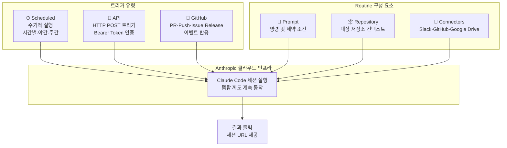
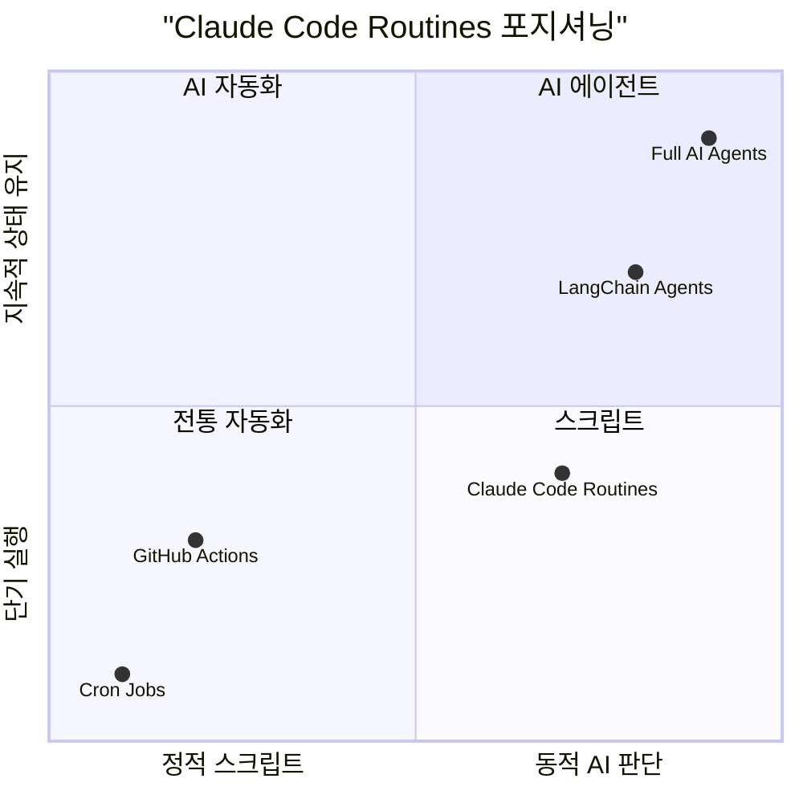
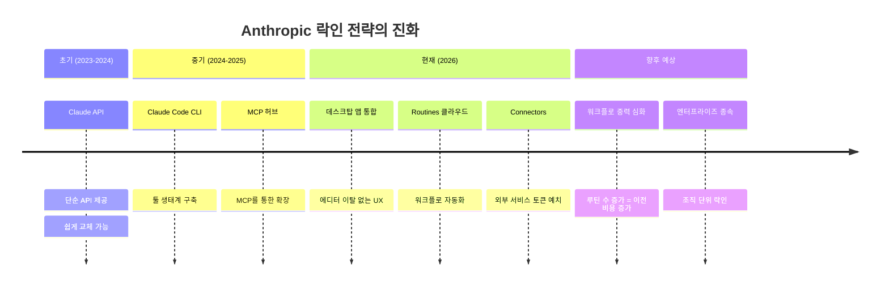
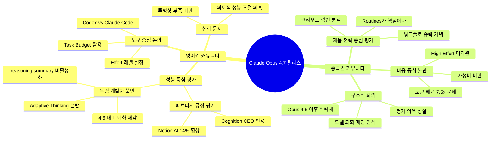
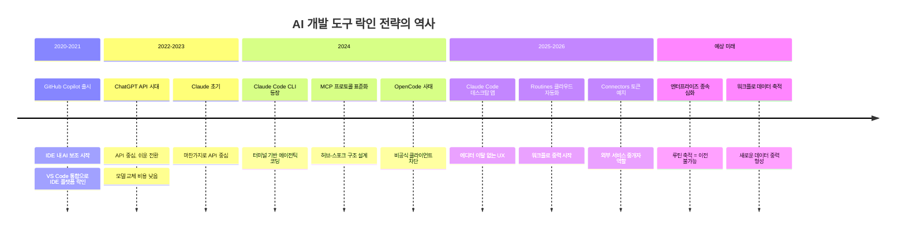

> **작성 일자**: 2026-04-17  
> **원본 스레드**: [@jmhong2020 Threads 게시물](https://www.threads.com/@jmhong2020/post/DXN7v1NlYIh)  
> **참고 자료**: Anthropic 공식 발표, Hacker News 스레드, LINUX DO, VentureBeat, The Register 등

---

## 목차

1. [들어가며: 같은 릴리스, 다른 질문](#들어가며)
2. [Claude Opus 4.7 공식 발표 요약](#공식-발표-요약)
3. [기술적 변경 사항 상세](#기술적-변경-사항)
4. [영어권 커뮤니티 반응 (Hacker News 중심)](#영어권-반응)
5. [중국권 커뮤니티 반응 (LINUX DO 중심)](#중국권-반응)
6. [같은 날 발표된 Claude Code 재설계와 Routines](#claude-code-업데이트)
7. ["워크플로 중력(Workflow Gravity)"이란 무엇인가](#워크플로-중력)
8. [두 커뮤니티의 시각 차이 구조 분석](#시각-차이-분석)
9. [락인 생태계의 역사적 맥락](#락인-역사)
10. [결론: 모델 전쟁인가, 플랫폼 전쟁인가](#결론)

---

## 들어가며: 같은 릴리스, 다른 질문 {#들어가며}

2026년 4월 16일, Anthropic은 Claude Opus 4.7을 공식 출시했다. 하나의 릴리스를 놓고, 세계 양쪽의 개발자 커뮤니티는 서로 전혀 다른 질문을 던지고 있었다.

영어권 Hacker News와 독립 개발자들은 이렇게 물었다.

> **"이 모델이 얼마나 똑똑한가? 어제보다 나아졌는가?"**

중국권 LINUX DO와 기술 분석가들은 이렇게 물었다.

> **"이 제품이 나를 어디에 가두는가? Anthropic의 진짜 의도는 무엇인가?"**

이 차이는 단순한 문화적 감수성 차이가 아니다. 두 커뮤니티가 AI 산업 구조를 보는 렌즈 자체가 다르다는 것을 드러낸다. 이 글은 그 차이를 심층적으로 파헤치면서, Claude Opus 4.7이 무엇인지, 그리고 같은 날 조용히 출시된 Claude Code Routines가 왜 어쩌면 더 중요한 발표인지를 서술한다.

---

## Claude Opus 4.7 공식 발표 요약 {#공식-발표-요약}

Anthropic은 Opus 4.7을 "현재 일반 공개된 가장 강력한 모델"로 소개했다. 공식 발표에 따르면, 이 모델은 특히 고급 소프트웨어 엔지니어링 분야에서 Opus 4.6 대비 눈에 띄는 도약을 이뤄냈다. 이전에 긴밀한 감독이 필요했던 가장 어려운 코딩 작업을 자신 있게 위임할 수 있게 되었다고 Anthropic은 설명한다.

모델 특성을 한 줄로 요약하면: **"더 긴 시간 동안 일관되게, 더 복잡한 작업을 더 깊이 생각하며 처리하는 모델"** 이다.

### 파트너사들의 반응 (얼리 액세스 테스터)

Anthropic이 공식 발표와 함께 공개한 파트너사들의 평가는 인상적이었다.

- **Cognition(Devin 개발사)**: CEO Scott Wu는 "몇 시간 단위의 작업을 일관성 있게 유지하며 이전에 신뢰할 수 없었던 깊은 조사 작업 클래스를 가능하게 한다"고 밝혔다.
- **Notion AI**: AI 리드 Sarah Sachs는 "복잡한 멀티스텝 워크플로에서 Opus 4.6 대비 14% 향상, 툴 호출 에러 3분의 1 수준으로 감소, 암묵적 요구 테스트를 통과한 첫 번째 모델"이라고 평가했다.
- **Cursor**: 공동 창업자 Michael Truell은 CursorBench에서 70% vs Opus 4.6의 58%라는 의미 있는 성능 도약을 기록했다고 밝혔다.
- **Warp**: 창업자 Zach Lloyd는 "이전 Claude 모델들이 실패했던 Terminal Bench 태스크를 통과했고, Opus 4.6이 해결하지 못했던 까다로운 동시성 버그를 처리했다"고 전했다.
- **CodeRabbit**: "코드 리뷰 리콜이 10% 이상 향상, 가장 복잡한 PR에서 발견하기 가장 어려운 버그를 포착했다"고 평가했다.
- **Harvey(법무 AI)**: "BigLaw Bench에서 High Effort 기준 90.9% 정확도, 이전 프론티어 모델들이 어려움을 겪었던 계약서의 양도 조항과 지배구조 변경 조항을 올바르게 구분했다"고 밝혔다.
- **XBOW(자율 침투 테스트)**: "시각 정확도 벤치마크에서 98.5% 달성, Opus 4.6의 54.5% 대비 획기적 도약"이라고 평가했다.
- **Replit**: 사장 Michele Catasta는 "낮은 비용으로 동일한 품질 달성, 로그와 트레이스 분석, 버그 발견, 수정 제안에서 더 효율적이고 정밀하다"고 언급했다.

이처럼 공식 발표는 거의 예외 없이 긍정적인 평가로 가득했다. 하지만 실제 커뮤니티 반응은 훨씬 복잡했다.

---

## 기술적 변경 사항 상세 {#기술적-변경-사항}

### 모델 스펙

| 항목 | Claude Opus 4.7 | Claude Opus 4.6 |
|------|----------------|----------------|
| 모델 ID | `claude-opus-4-7` | `claude-opus-4-6` |
| 입력 가격 | $5/백만 토큰 | $5/백만 토큰 |
| 출력 가격 | $25/백만 토큰 | $25/백만 토큰 |
| 최대 컨텍스트 | 1M 토큰 | 1M 토큰 |
| 최대 출력 | 128k 토큰 | 128k 토큰 |
| 최대 이미지 해상도 | 2,576px / 3.75MP | 1,568px / 1.15MP |
| Thinking 모드 | Adaptive 전용 | Enabled + Adaptive |
| 신규 토크나이저 | ✅ (최대 35% 토큰 증가) | ❌ |

### 주요 기술 변경 사항 상세

**① Adaptive Thinking만 지원 (Manual Thinking 완전 제거)**

이것이 가장 큰 API 변경점이다. 기존에 `thinking: {type: "enabled", budget_tokens: N}`으로 사용하던 방식은 Opus 4.7에서 400 에러를 반환한다. 오직 `thinking: {type: "adaptive"}`만 사용 가능하다. Adaptive Thinking 모드에서는 모델이 각 요청의 복잡도를 스스로 판단해 thinking 토큰을 동적으로 할당한다.

중요한 점은, **Adaptive Thinking은 기본값이 비활성화**라는 것이다. 즉, `thinking` 필드를 명시하지 않으면 모델은 thinking 없이 응답한다. 이것이 초기 커뮤니티 혼란의 핵심 원인이었다.

**② Reasoning Summary 기본값 비활성화**

기존에는 streaming 출력 시 thinking 내용이 보였으나, Opus 4.7에서는 `"display": "summarized"` 옵션을 명시하지 않으면 reasoning 요약이 출력에서 사라진다. 사용자 입장에서는 모델이 오랫동안 아무런 출력 없이 pause 상태처럼 보이는 문제가 생긴다.

**③ 새로운 Effort 레벨 `xhigh` 도입**

기존의 `low`, `medium`, `high`, `max` 사이에 `xhigh`라는 새 레벨이 추가되었다. Claude Code에서는 모든 플랜의 기본 Effort 레벨이 `xhigh`로 상향되었다. 이는 품질을 높이는 대신 토큰 소모량이 늘어나는 트레이드오프를 의미한다.

**④ 고해상도 이미지 지원 (3.75 메가픽셀)**

이전 모델의 1.15MP 대비 3배 이상 향상된 3.75MP까지 이미지를 처리할 수 있다. 2,576픽셀 이상 장변을 가진 이미지도 다운샘플링 없이 직접 처리 가능하다. Computer Use 에이전트, 복잡한 다이어그램 추출, 고밀도 스크린샷 분석 등에서 실질적 차이를 만든다.

**⑤ 신규 토크나이저**

Opus 4.7은 완전히 새로운 토크나이저를 탑재했다. 같은 텍스트를 처리할 때 기존 대비 최대 35% 더 많은 토큰을 사용할 수 있다. 이는 비용 계획 수립에 중요한 변수다. 컨텐츠 유형에 따라 1.0배에서 1.35배 사이에서 가변적으로 증가한다.

**⑥ Task Budgets (퍼블릭 베타)**

에이전틱 루프 전체(thinking + 툴 호출 + 결과 + 최종 출력)에 대한 토큰 예산을 설정할 수 있는 기능이 퍼블릭 베타로 출시되었다. 예산이 소진되어 가면 모델이 우선순위를 재조정해 작업을 gracefully 완료하려 시도한다.

**⑦ Temperature/Top-P/Top-K 파라미터 제거**

Opus 4.7부터는 기본값이 아닌 temperature, top_p, top_k를 설정하면 400 에러가 반환된다. 이 파라미터들로 모델 동작을 미세 조정하던 개발자들은 마이그레이션이 필요하다.

**⑧ 사이버 보안 세이프가드 도입**

Opus 4.7은 Project Glasswing의 일환으로, 금지된 사이버 보안 사용을 자동으로 감지하고 차단하는 세이프가드가 내장되었다. Cyber Verification Program을 통해 합법적인 보안 전문가(취약점 연구, 침투 테스트, 레드팀)는 별도 검증 후 사용 가능하다.

---

## 영어권 커뮤니티 반응 (Hacker News 중심) {#영어권-반응}

### 첫 번째 패턴: "버그 잡는 중"

Hacker News 스레드에서 가장 먼저 눈에 띄는 것은 **설정 혼란에 대한 불만**이었다.

어느 사용자는 이렇게 토로했다.

> "Adaptive thinking을 기본값에서 끄고 effort를 높여야 제대로 돌아간다. 이 변화가 너무 불명확하게 전달되었다."

특히 주목할 만한 것은 simonw(Simon Willison, 유명 오픈소스 개발자)의 지적이었다. 그는 reasoning summary가 기본값에서 빠졌기 때문에 **모델이 제대로 고민했는지 판별이 불가능**해졌다는 문제를 제기했다. 이전에는 streaming 중에 thinking 블록이 보였지만, Opus 4.7에서는 `"display": "summarized"` 옵션을 명시하지 않으면 모델이 얼마나 생각했는지, 혹은 전혀 생각하지 않았는지조차 알 수 없다는 것이다.

또 다른 사용자(jimmypk)는 상당히 실용적인 경고를 남겼다.

> "Claude Code의 기본 Effort 레벨이 xhigh로 올라갔고, 여기에 동일한 프롬프트에 대해 최대 35%까지 늘어나는 토크나이저 오버헤드가 겹친다. 4.6 기준으로 세운 비용 계획은 실제 트래픽 측정 없이 그냥 쓰면 예상을 초과할 것이다."

### 두 번째 패턴: Anthropic 신뢰 문제

Hacker News의 또 다른 강한 흐름은 **Anthropic 자체에 대한 신뢰 문제**였다.

한 사용자(endymion-light)는 이렇게 썼다.

> "나는 최근 Anthropic을 얼마나 믿어야 할지 모르겠다. 4.6이 눈에 띄게 품질이 떨어진 직후에 4.7이 나왔다는 게 의심스럽다. 오히려 4.7이 몇 달 전에 경험했던 그 Opus일 것 같다는 생각이 든다."

이것은 Anthropic이 트레이닝 전 모델 성능을 인위적으로 억제한다는 추측이 개발자 커뮤니티에 퍼졌다는 것을 보여준다. 일부 사용자들은 "훈련 중에는 컴퓨트를 아끼기 위해 성능을 줄여놓고, 릴리스 직전에 원래 수준으로 돌아오는 것"이라고 해석하기도 했다.

다른 사용자(buildbot)는 Claude Code 4.6이 실제 프로덕션에서 어떻게 실패했는지를 구체적으로 서술했다.

> "텐서 병렬 작업 방법을 찾으려 했더니 웹 페치를 한 번도 하지 않고 17,000개의 완전히 틀린 토큰을 환각했다. 그러더니 각 노드에 전체 모델을 복사하는 식으로 텐서 병렬을 흉내냈다."

또 다른 사용자(r0fl)는 이렇게 덧붙였다.

> "Claude가 얼마나 나빠졌는지 사람들이 과장한다고 생각했는데, 어제 파일 여러 개를 실수로 삭제했다. Codex가 출력이 예쁘지는 않지만 훨씬 일관되게 작동한다."

### 세 번째 패턴: Codex로의 이탈

가장 흥미로운 흐름 중 하나는 HN 사용자들이 Claude Code에서 OpenAI Codex로 이탈하는 움직임을 공개적으로 언급했다는 점이다.

TIPSIO라는 사용자의 댓글은 비꼬는 듯한 분위기를 정확히 포착했다.

> "빨리 사이드 프로젝트 챙겨라. 네프되지 않은 에이전틱 코딩 기간이 약 3일 정도 남았다."

이는 개발자들이 이미 새 모델이 릴리스 직후 몇 주 안에 "네프(성능 하향 조정)"될 것이라는 패턴을 학습했음을 보여준다. 새 모델 릴리스를 축하하는 게 아니라, 임박한 성능 저하 전에 사이드 프로젝트를 빠르게 완료하려는 반응이었다.

다수의 사용자들이 Claude와 Codex를 번갈아 사용하거나 병행하는 전략을 채택하고 있다고 밝혔다. Zach Lloyd(Warp CEO)가 "Opus 4.7은 Warp에 의미 있는 도약"이라고 공식 발표에 인용된 것과, 일반 개발자들이 "Codex로 넘어가고 있다"고 말하는 것이 같은 날 이루어졌다는 점이 아이러니하다.

### 네 번째 패턴: 기술 토론

성능 불만 외에도, HN에서는 새 토크나이저, Adaptive Thinking 아키텍처, Mythos Preview와의 관계 등에 대한 기술적 추측이 활발히 이루어졌다.

한 사용자(lucrbvi)는 흥미로운 가설을 제시했다.

> "새 토크나이저가 탑재되었다는 것은 Opus 4.7이 Opus 4.6의 단순 미세조정이 아니라 완전히 새로운 베이스 모델이라는 뜻이다. 일부는 Mythos에서 증류된 것 아니냐는 추측을 하고 있다."

또 다른 사용자(ffsm8)는 성능 저하 패턴에 대한 구체적인 해석을 제시했다.

> "보통 트레이닝 중에 퍼포먼스가 떨어지는 경향이 있다. 아마 지난 몇 주 동안 Mythos를 훈련시키고, 그것을 Opus 4.7로 증류했을 가능성이 높다. Mythos를 일반 공개하지 않는 이유도 바로 증류 전 상태라 비용이 너무 비싸기 때문일 것이다."

---

## 중국권 커뮤니티 반응 (LINUX DO 중심) {#중국권-반응}

### 냉담함을 넘어 체념으로

중국어권 개발자 커뮤니티 LINUX DO(중국 최대 기술 포럼 중 하나)의 반응은 HN과 결이 완전히 달랐다. HN이 설정 혼란과 성능 불만으로 요동쳤다면, LINUX DO는 처음부터 **냉담함과 체념**에 가까운 분위기였다.

대표적인 발언들을 살펴보자.

사용자 final은 이렇게 썼다.

> "이미 평가할 마음도 없다. Opus 4.5 때가 최고였고 그 후로 계속 나빠지고 있다."

사용자 ayt407123은 구체적인 실패 사례를 들며 비판했다.

> "순전히 후진기어다. 색맹 테스트 문제도 한 번을 못 맞혔다."

사용자 error502는 비용 문제를 정면으로 꺼냈다.

> "GitHub Pro+를 구독 중인데 Opus 4.7 토큰 배율이 7.5배로 책정되어 있다. 이 가격이면 적어도 지능은 높아야 하는 거 아닌가. High Effort도 지원 안 된다니, 40달러 돌려내라."

이러한 반응들은 단순히 "모델이 나쁘다"는 수준이 아니다. 중국어권 커뮤니티 사용자들은 Anthropic의 가격 정책, 지원 플랜 구조, 그리고 이전 모델 대비 가성비를 통합적으로 비판하고 있다. HN이 "왜 제대로 작동 안 하지?"를 물을 때, LINUX DO는 "이 비용을 지불할 가치가 있는가?"를 묻고 있다.

### 중국 분석가들의 다른 시선

그러나 중국 커뮤니티 반응의 더 흥미로운 부분은 분석가 층에서 나왔다.

중국 기술 분석가 JZNext와 人人都是产品经理(모두 PM이다)에 실린 분석은 영어권과 완전히 다른 프레임으로 릴리스를 읽어냈다.

핵심 주장은 이것이다.

> **"Opus 4.7만 보지 마라. 진짜 핵심은 같은 날 나온 Claude Code 데스크탑 재설계와 Routines(자동화 워크플로)다."**

그들은 Routines의 구조적 의미를 이렇게 분석했다.

1. **로컬 MCP 미지원**: Routines는 로컬 MCP 서버를 지원하지 않는다. Anthropic의 클라우드 Connectors(Slack, GitHub, Google Drive 등)만 허용된다.

2. **토큰 예치**: 사용자의 Slack 토큰, GitHub 토큰이 모두 Anthropic 클라우드에 예치되는 구조다.

3. **워크플로 중력**: 기존 SaaS의 락인이 "데이터 중력(Data Gravity, 데이터가 쌓일수록 이동 비용이 높아지는 현상)"이었다면, 이번 Anthropic의 전략은 **"워크플로 중력(Workflow Gravity)"** 이다. 사용자의 업무 루틴 자체가 Anthropic 인프라 위에서 실행될수록, 다른 플랫폼으로의 이전 비용이 기하급수적으로 높아진다.

이 분석은 영어권에서는 거의 논의되지 않았다. HN의 담론이 "이 모델이 얼마나 좋은가"에 집중될 때, 중국 분석가들은 "이 제품이 우리를 어디에 가두는가"를 이미 묻고 있었다.

---

## 같은 날 발표된 Claude Code 재설계와 Routines {#claude-code-업데이트}

Opus 4.7 발표 이틀 전인 4월 14일, Anthropic은 두 가지를 조용히 공개했다.

1. **Claude Code 데스크탑 앱 완전 재설계**
2. **Claude Code Routines (리서치 프리뷰)**

VentureBeat가 이를 직접 테스트하고 이렇게 평가했다.

> "플랫폼은 뚜렷한 '담장 정원(Walled Garden)' 효과를 만들어낸다. 터미널 버전 Claude Code는 더 넓은 범위의 이동이 가능하지만, 데스크탑 앱은 Anthropic 모델에 완전히 최적화되어 있다. 자주 모델을 전환하는 파워 유저에게 이 모델 락인은 치명적일 수 있다."

### Claude Code 데스크탑 재설계

재설계된 데스크탑 앱의 핵심은 **"에디터 이탈 없는 개발 사이클"** 이다. 기존에는 Claude Code를 쓰면서 다른 에디터를 열고, 브라우저를 열고, 터미널을 별도로 유지해야 했다. 재설계된 앱은 다음을 통합했다.

- 통합 터미널: 앱 내에서 직접 명령 실행
- 더 빠른 Diff 뷰어: 대형 코드 변경사항 처리 최적화
- 앱 내 파일 에디터: 에디터 앱 전환 불필요
- 확장된 Preview 영역: 웹 앱 라이브 변경사항 실시간 확인
- 멀티 세션: 여러 저장소에서 동시에 작업
- Side Chat (⌘+;): 메인 작업 히스토리를 오염시키지 않고 질문 가능

The Register의 날카로운 분석처럼, "에디터로 이동하지 않아도 된다는 것은 결국 Anthropic이 개발자들이 Claude와 상호작용하는 인터페이스를 직접 소유하고 싶다는 의미다."

### Claude Code Routines: 기술 상세

Routines는 다음과 같이 동작한다. 사용자가 프롬프트, 저장소, 커넥터를 한 번 설정해두면, 이것이 Anthropic 관리 클라우드 인프라 위에서 자동으로 실행된다. 트리거는 세 가지다.

**Scheduled 트리거**: 매 시간, 매일 밤, 매주 등 정해진 주기로 실행. 사용자가 노트북을 닫아도 Anthropic 서버에서 계속 돌아간다.

**API 트리거**: HTTP POST로 외부 시스템이 Routine을 호출한다. 예를 들어, Sentry에서 프로덕션 알림이 발생하면 해당 알림을 파라미터로 담아 Routine을 호출하고, Claude가 문제를 분석해 결과를 반환한다.

**GitHub 트리거**: PR 오픈, Push, Issue 생성, Release 등 GitHub 이벤트에 반응. PR 필터로 특정 브랜치, 작성자, 라벨, 드래프트 여부 등을 세밀하게 지정 가능하다.

### 플랜별 일일 사용 한도

| 플랜 | 일일 Routine 실행 수 |
|------|---------------------|
| Pro | 5회/일 |
| Max | 15회/일 |
| Team/Enterprise | 25회/일 |
| 초과분 | 종량제 별도 과금 |

### 기존 솔루션 대비 포지셔닝

Routines는 "동적 Cron Job"에 가장 가깝다. 정해진 코드가 아니라 Claude Code 세션이 실행되므로, 상황을 해석하고 판단하는 능력이 있다. 그러나 상태를 유지하거나 복잡한 멀티에이전트 협업을 지원하는 진정한 AI 에이전트와는 거리가 있다.

---

## "워크플로 중력(Workflow Gravity)"이란 무엇인가 {#워크플로-중력}

중국 분석가들이 제시한 "워크플로 중력" 개념을 좀 더 깊이 들여다볼 필요가 있다.

### 데이터 중력 vs. 워크플로 중력

기존 클라우드 산업의 락인 전략은 주로 **"데이터 중력(Data Gravity)"** 에 의존했다. 데이터가 특정 플랫폼에 축적될수록, 그 데이터를 이동시키는 비용(기술적, 운영적, 시간적)이 높아져 플랫폼을 떠나기 어려워지는 현상이다. AWS S3에 대규모 데이터를 저장하면, 그 데이터를 GCP로 이전하는 비용이 수십만 달러에 달하기 때문에 AWS에 남게 된다.

워크플로 중력은 이것과 다르다. 데이터가 아니라 **업무 루틴 자체**가 플랫폼에 종속된다. Claude Code Routines를 통해 매일 밤 Anthropic 서버에서 배포 검증이 돌아가고, 매주 월요일 이슈 트리아지가 실행되고, PR이 열릴 때마다 코드 리뷰가 자동으로 진행된다면 어떻게 될까?

이 시나리오에서 개발자와 엔지니어링 팀은 점차 Anthropic 클라우드에 의존하는 루틴을 축적한다. 이제 "Anthropic에서 다른 플랫폼으로 이전"한다는 것은 단순히 API 키를 교체하는 문제가 아니다. 수십 개의 자동화 루틴을 재설계하고, Connectors를 다시 연결하고, 팀의 일상적인 워크플로를 전면 재편해야 한다.

### Routines의 구조적 문제: 로컬 MCP 미지원

중국 분석가들이 특히 주목한 것은 **Routines가 로컬 MCP 서버를 지원하지 않는다**는 점이다. Routines에서 사용할 수 있는 Connectors는 Anthropic이 직접 관리하는 클라우드 Connectors(Slack, GitHub, Google Drive 등)뿐이다.

이것이 의미하는 바는 이렇다. 기업이 자체 MCP 서버를 구축해 내부 시스템과 연동하려 해도, Routines 맥락에서는 그것을 사용할 수 없다. Anthropic이 승인한 Connectors를 통해서만 외부 서비스에 접근할 수 있다. 그리고 그 연결을 위해 사용자의 Slack 토큰, GitHub 토큰이 Anthropic 서버에 저장된다.

이것은 Anthropic이 워크플로 자동화 시장에서 단순한 AI 모델 제공자가 아닌 **데이터 중개자이자 토큰 보관자** 역할을 하겠다는 선언이나 다름없다.

The Register는 이를 직접적으로 표현했다.

> "Anthropic은 이미 Anthropic의 공식 Claude Code CLI 밖에서 서비스를 사용하는 OpenCode를 사실상 추방(excommunicated)한 바 있다. 사용자들이 에디터로 이동하지 않아도 된다는 것은 결국 Anthropic이 개발자들이 Claude와 상호작용하는 인터페이스를 직접 소유하고 싶다는 의도의 표출이다."

### 2026년 1월 OpenCode 사태의 재소환

이 맥락에서 2026년 1월 9일 발생한 "OpenCode 사태"를 이해하면 더 명확해진다.

당시 Anthropic은 갑작스럽게 기술적 세이프가드를 배포해 공식 Claude Code CLI 이외의 서드파티 도구에서 Claude Pro/Max 구독 OAuth 토큰이 작동하지 않게 막았다. 56,000개 이상의 GitHub 스타를 보유한 OpenCode를 비롯, 구독을 통해 Claude를 사용하던 다양한 도구들이 하룻밤 사이에 작동을 멈췄다. 사전 경고도, 마이그레이션 경로도 없었다.

이 사건은 개발자 커뮤니티에 중요한 교훈을 남겼다. **Anthropic은 자신의 플랫폼 생태계를 철저히 통제한다는 의지를 갖고 있으며, 구독자라도 공식 인터페이스를 우회하는 행위는 용납하지 않는다는 것이다.**

---

## 두 커뮤니티의 시각 차이 구조 분석 {#시각-차이-분석}

이제 두 커뮤니티의 차이를 구조적으로 분석할 수 있다.

### 왜 이런 차이가 생기는가?

이 차이를 만드는 요인은 여러 층위에 있다.

**① 사용 패턴의 차이**

영어권 개발자들은 Claude Code를 직접 코딩 작업에 활용하는 비율이 높다. 성능 변화가 일상적 업무에 즉각 영향을 미치기 때문에, 모델 성능 평가가 1순위가 된다.

반면 중국어권 커뮤니티에서는 실제 개발 도구로의 채택률보다 관찰자적 분석이 활발하다. 중국 내 네트워크 제약과 지역별 서비스 가용성 문제로 인해 실제 사용보다 구조 분석에 더 익숙한 문화가 형성되어 있다.

**② AI 산업 구조에 대한 이해 수준**

중국 기술 분석가들은 BAT(Baidu, Alibaba, Tencent)를 비롯한 플랫폼 기업들의 락인 전략을 몸소 경험해왔다. 위챗 미니프로그램 생태계, 알리페이 금융 생태계 등에서 플랫폼이 어떻게 워크플로를 포획하는지를 실제로 목격했다. 이런 배경이 "Routines = 워크플로 중력"이라는 빠른 패턴 인식을 가능하게 한다.

영어권에서도 lock-in에 대한 경계심이 없는 것은 아니다(앞서 언급한 OpenCode 사태에서 극명하게 드러났다). 하지만 새 모델 릴리스 당일, HN의 1차 반응은 여전히 성능 평가가 압도적이다.

**③ 미디어 생태계 차이**

영어권에서는 Anthropic 파트너사의 발언이 VentureBeat, TechCrunch 등을 통해 빠르게 확산되며 초기 논의의 틀을 잡는다. 중국권에서는 이런 공식 채널의 영향력이 상대적으로 낮고, 커뮤니티 내 독립적 분석이 더 영향력을 가진다.

**④ 가격 민감도**

중국어권 개발자들의 구독 비용 부담은 구매력 차이로 인해 상대적으로 크다. GitHub Pro+ 구독 시 Opus 4.7 토큰 배율 7.5배라는 것이 "이 가격이면 적어도 지능은 높아야지"라는 반응으로 이어지는 것은 자연스럽다.

---

## 락인 생태계의 역사적 맥락 {#락인-역사}

Anthropic의 이번 전략을 역사적으로 위치시켜보자.

이 역사를 보면 Anthropic의 전략이 명확하다. 초기에는 API라는 공개적이고 교체 가능한 형태로 시장에 진입해 채택률을 높인 다음, 점차 사용자들이 의존하는 인터페이스와 인프라를 직접 소유하는 방향으로 이동하고 있다.

Claude Code가 터미널에서 데스크탑 앱으로, 단순 코딩 보조에서 자동화 워크플로 플랫폼으로 진화하는 과정은, 사용자 경험을 개선한다는 명분 아래 Anthropic 생태계로의 점진적 포획이 이루어지는 과정이기도 하다.

이것이 나쁜 것인가? 단순히 그렇다고 하기는 어렵다. Microsoft Azure, AWS, Google Cloud 모두 동일한 전략을 쓴다. 문제는 AI 모델 시장이 아직 성숙하지 않은 상태에서 이런 락인이 일어날 때, 모델 성능 경쟁에서 밀릴 경우 탈출구가 없어진다는 점이다.

---

## 결론: 모델 전쟁인가, 플랫폼 전쟁인가 {#결론}

Claude Opus 4.7 첫 주 반응에서 우리가 배울 수 있는 것은 다음과 같다.

**영어권이 던진 질문**: "이 모델이 내 코딩 작업에 실제로 도움이 되는가?"
이 질문은 타당하다. 매일 모델을 사용하는 개발자에게 성능은 가장 즉각적인 관심사다.

**중국권이 던진 질문**: "Anthropic이 나의 워크플로를 어디로 가두려 하는가?"
이 질문도 타당하다. 아니, 어쩌면 더 근본적인 질문이다.

실제로 이 두 질문은 분리되어 있지 않다. 모델 성능이 뛰어날수록, 그 모델의 클라우드 플랫폼에 의존하는 자동화를 더 많이 구축하게 된다. 자동화가 쌓일수록, 다른 모델로 이전하는 비용이 높아진다. 비용이 높아질수록, 모델 성능이 다소 떨어져도 계속 사용하게 된다.

이것이 워크플로 중력의 본질이다.

Claude Opus 4.7을 평가할 때, 우리는 두 가지 렌즈를 동시에 가져야 한다. 하나는 "오늘 이 모델이 얼마나 잘 작동하는가"이고, 다른 하나는 "이 플랫폼에 더 깊이 들어갈수록 나중에 빠져나오기가 얼마나 어려워지는가"이다.

영어권 개발자들이 적극적으로 사용하면서 버그를 잡는 동안, 중국권 분석가들이 구조를 분석하고 있다. 완전한 그림은 두 시각을 함께 볼 때만 보인다.

---

## 참고 자료

- **Anthropic 공식 발표**: [Claude Opus 4.7 소개](https://www.anthropic.com/news/claude-opus-4-7)
- **Anthropic API 문서**: [Adaptive Thinking](https://platform.claude.com/docs/en/build-with-claude/adaptive-thinking)
- **Anthropic API 문서**: [Opus 4.7 신기능](https://platform.claude.com/docs/en/about-claude/models/whats-new-claude-4-7)
- **Claude Code Routines 공식 문서**: [Routines](https://code.claude.com/docs/en/routines)
- **HN 스레드**: [Claude Opus 4.7 discussion](https://news.ycombinator.com/item?id=47793411)
- **VentureBeat**: [Claude Code 데스크탑 앱 & Routines 테스트 리뷰](https://venturebeat.com/orchestration/we-tested-anthropics-redesigned-claude-code-desktop-app-and-routines-heres-what-enterprises-should-know)
- **The Register**: [Claude Code routines promise mildly clever cron jobs](https://www.theregister.com/2026/04/14/claude_code_routines/)
- **SiliconANGLE**: [Anthropic's Claude Code gets automated 'routines'](https://siliconangle.com/2026/04/14/anthropics-claude-code-gets-automated-routines-desktop-makeover/)
- **LINUX DO**: [Opus 4.7 커뮤니티 반응](https://linux.do/t/topic/1984106)
- **人人都是产品经理 / JZNext**: "别盯着 Opus 4.7了" (Workflow Gravity 분석)

---

*작성 일자: 2026-04-17*
