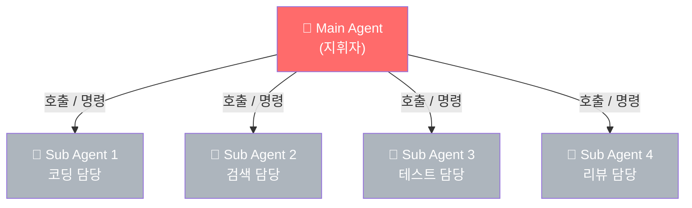
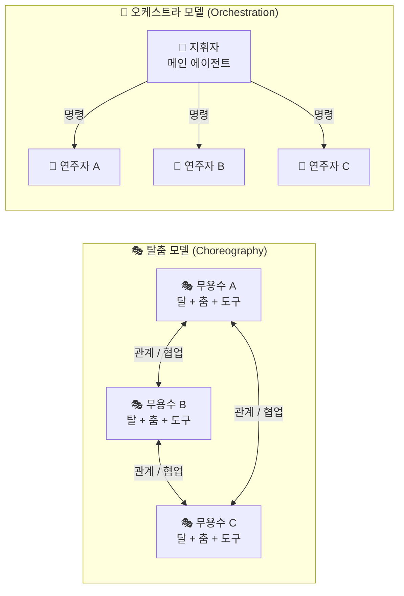
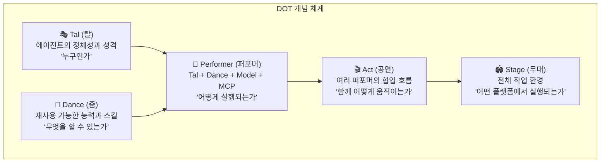
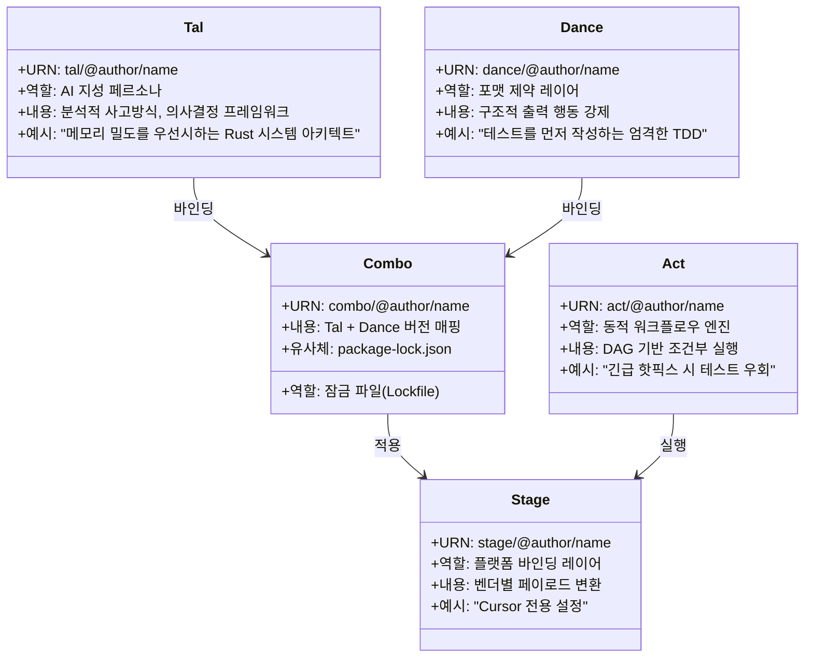
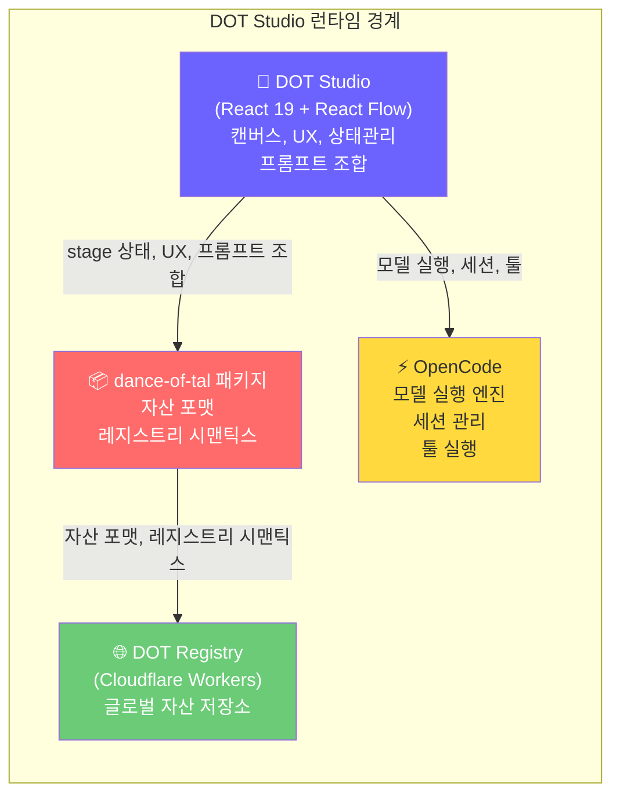
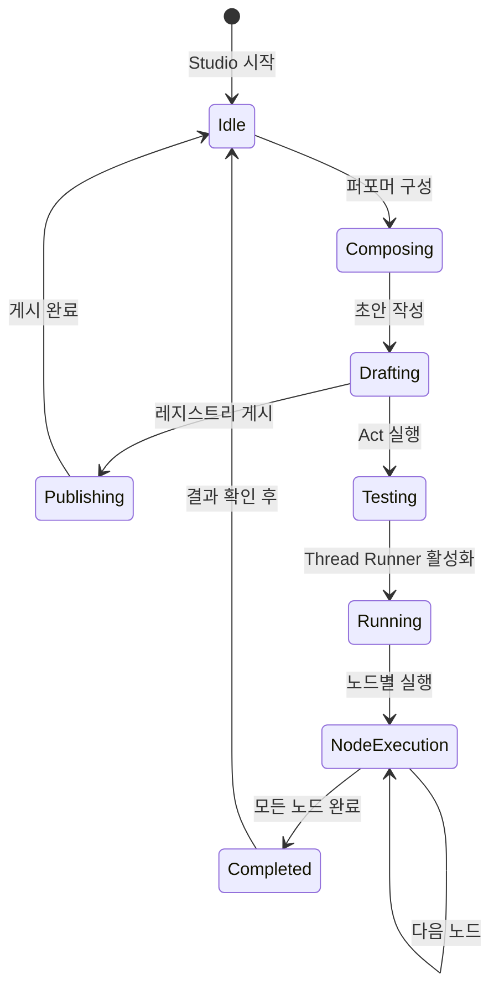
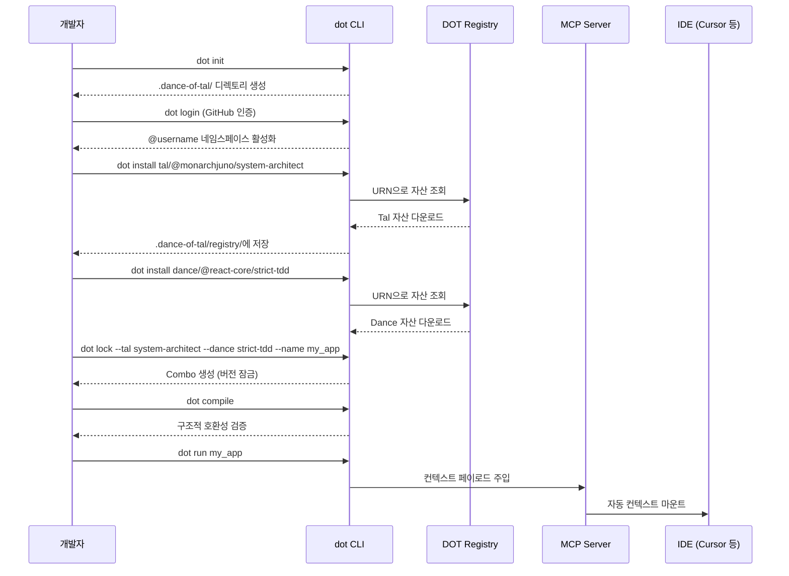
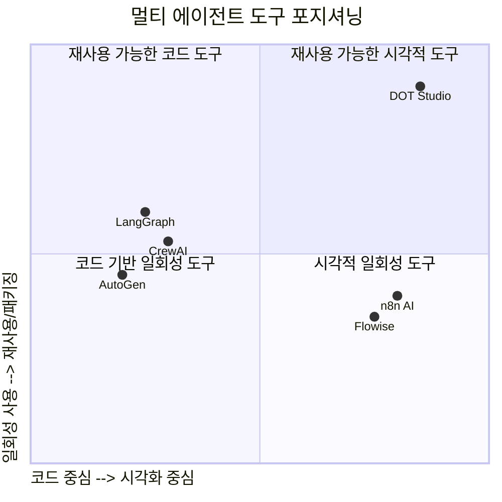

> **"멀티 에이전트가 이제 탈춤을 춥니다"**  
> 오케스트레이션(Orchestration)을 넘어, 코레오그래피(Choreography)로 — AI 에이전트 패키지 매니저의 등장

---

## 목차

1. [개요: 무엇이 문제인가?](#1-개요-무엇이-문제인가)
2. [철학적 배경: 오케스트레이션에서 탈춤으로](#2-철학적-배경-오케스트레이션에서-탈춤으로)
3. [Dance of Tal (DOT) — 핵심 개념 체계](#3-dance-of-tal-dot--핵심-개념-체계)
4. [DOT의 다섯 가지 자산 컴포넌트](#4-dot의-다섯-가지-자산-컴포넌트)
5. [DOT Studio — 피그마 스타일의 AI 에이전트 편집기](#5-dot-studio--피그마-스타일의-ai-에이전트-편집기)
6. [아키텍처 심층 분석](#6-아키텍처-심층-분석)
7. [기술 스택 및 런타임 경계](#7-기술-스택-및-런타임-경계)
8. [실제 사용 흐름: 설치부터 실행까지](#8-실제-사용-흐름-설치부터-실행까지)
9. [기존 멀티 에이전트 도구들과의 비교](#9-기존-멀티-에이전트-도구들과의-비교)
10. [프로젝트 현황 및 의미](#10-프로젝트-현황-및-의미)
11. [종합 평가 및 시사점](#11-종합-평가-및-시사점)

---

## 1. 개요: 무엇이 문제인가?

AI 에이전트 기술이 빠르게 성숙해가고 있는 2026년 현재, 멀티 에이전트 시스템 구성 방식에는 근본적인 구조적 한계가 존재한다. 가장 일반적인 패턴은 하나의 "메인 에이전트(Main Agent)"가 여러 "서브 에이전트(Subagent)"를 호출하는 방식이다. 이 방식은 처음에는 역할 분리처럼 보이지만, 시간이 지날수록 심각한 문제들을 노출시킨다.

### 1.1 기존 멀티 에이전트 구조의 문제



이 구조에서 발생하는 문제는 다음과 같다:

**종속성의 심화.** 서브 에이전트는 이름만 에이전트일 뿐, 사실상 메인 에이전트의 내부 기능(함수)처럼 굳어버린다. 독립적인 판단을 하는 주체가 아니라, 상위 에이전트의 지시를 기다리는 부속품으로 전락한다.

**재사용 불가.** 특정 맥락에서 특정 메인 에이전트를 위해 설계된 서브 에이전트는 다른 워크플로우에서 재사용하기 매우 어렵다. 코드 안에 하드코딩된 관계와 설정 때문에, 비슷한 역할을 하는 에이전트를 다른 프로젝트에 적용하려면 처음부터 다시 만드는 것이나 다름없다.

**설정의 불투명성.** 각 에이전트가 어떤 MCP(Model Context Protocol) 서버를 사용하는지, 어떤 시스템 프롬프트를 갖고 있는지, 어떤 모델과 연결되어 있는지가 코드나 설정 파일 깊숙이 숨어버린다. 실제로 시스템이 어떻게 동작하는지 한눈에 파악하기가 점점 어려워진다.

**확장성의 붕괴.** 에이전트가 많아질수록 협업 구조가 풍부해지는 것이 아니라, 상위 에이전트 아래에 기능들이 계속 매달리는 단순한 트리(tree) 구조로 고착된다. 이것은 진정한 "멀티 에이전트 협업"이라기보다, 복잡한 함수 호출 스택에 가깝다.

이 문제를 한국 전통 공연 예술의 개념을 빌려 재정의하려는 시도가 바로 **Dance of Tal(DOT)** 이고, 그 위에 만들어진 시각적 편집 환경이 **DOT Studio**이다.

---

## 2. 철학적 배경: 오케스트레이션에서 탈춤으로

프로젝트 이름에 담긴 핵심 은유를 이해하는 것이 이 프로젝트 전체를 파악하는 열쇠다.

### 2.1 오케스트레이션(Orchestration) 패러다임의 한계

오케스트레이션은 지휘자(conductor)가 모든 연주자의 행동을 지시하는 방식이다. 오케스트라에서 바이올린 주자는 지휘자의 신호 없이는 박자를 바꾸지 않는다. AI 에이전트 시스템에서 이것은 "메인 에이전트가 서브 에이전트에게 명령을 내리는" 구조로 나타난다.

### 2.2 코레오그래피(Choreography)와 탈춤의 은유

반면 탈춤(Talchum)은 다르다. 탈춤에서 각 무용수는 자신만의 탈(가면, 정체성)을 쓰고, 자신만의 춤사위(기술)를 지닌 채, 다른 무용수들과 관계를 맺으며 공연을 만들어간다. 지휘자가 없어도 공연은 진행된다. 각자가 독립적인 존재이면서도, 서로의 움직임에 반응하며 전체적인 맥락을 만들어낸다.



DOT의 제작자 monarchjuno는 이 은유를 통해 멀티 에이전트 시스템의 새로운 가능성을 제시한다. 각 에이전트가 독립적인 정체성, 능력, 설정을 갖춘 "퍼포머(Performer)"로 존재하고, 이들이 관계를 맺고 흐름을 만들어가는 방식이 더 건강한 멀티 에이전트 아키텍처라는 것이다.

---

## 3. Dance of Tal (DOT) — 핵심 개념 체계

DOT는 멀티 에이전트를 다루기 위한 네 가지 핵심 단위를 정의한다. 이 네 가지는 탈춤의 구성 요소에서 직접 이름을 따왔다.



### 3.1 Tal (탈) — 정체성 레이어

Tal은 에이전트의 영구적인 정체성을 정의한다. "항상 켜져 있는 명령 레이어(always-on instruction layer)"로서, 에이전트가 어떻게 생각하고, 어떤 원칙을 갖고 있으며, 기본적으로 어떻게 행동해야 하는지를 규정한다. 소프트웨어 개발 맥락에서라면 "엄격한 타입 안전성을 우선시하는 시니어 TypeScript 개발자"처럼 표현될 수 있다.

Tal은 `tal/@author/name` 형식의 URN(Uniform Resource Name)으로 식별되며, 글로벌 레지스트리에 게시하고 다른 프로젝트에서 재사용할 수 있다. 이것은 npm 패키지처럼 버전 관리되고 공유되는 AI 정체성 모듈이다.

### 3.2 Dance (춤) — 스킬 컨텍스트 레이어

Dance는 에이전트가 특정 상황에서 활성화할 수 있는 선택적 스킬 또는 능력 컨텍스트다. 필요할 때만 로드되는(loaded on demand) 모듈식 역량 레이어다. 예를 들어 "엄격한 TDD(테스트 주도 개발) 방식으로 코드를 작성하라"거나 "특정 JSON 스키마를 따르는 구조적 출력을 강제하라"는 식의 포맷 제약이나 워크플로우 규칙을 담는다.

Dance 역시 `dance/@author/name` 형식의 URN으로 관리되며, 서로 다른 Tal과 조합해 재사용할 수 있다. 한 번 잘 만들어진 "프론트엔드 접근성 검사" Dance는 어떤 Tal과도 결합해 사용할 수 있다.

### 3.3 Performer (퍼포머) — 실행 단위

Performer는 Tal, Dance, 선택된 AI 모델, 에이전트 실행 모드, 그리고 MCP 서버 바인딩이 모두 결합된 실제 실행 가능한 에이전트 단위다. 이것이 DOT 시스템에서 실질적으로 "에이전트"라고 부를 수 있는 것이다.

Performer는 DOT Studio의 캔버스 위에서 독립적인 객체로 존재하며, 시각적으로 구성하고 편집할 수 있다. 중요한 것은 Performer가 특정 워크플로우(Act)에 종속되지 않고 독립적으로 존재하기 때문에, 여러 Act에서 재사용할 수 있다는 점이다.

### 3.4 Act (공연) — 협업 흐름 그래프

Act는 여러 Performer가 참여하는 실험적인 지향성 워크플로우 그래프(directed workflow graph)다. 단순한 선형 실행 순서가 아니라, 워커(worker) 노드, 오케스트레이터(orchestrator) 노드, 병렬(parallel) 노드 등 다양한 실행 패턴을 조합하여 복잡한 다단계 AI 협업 흐름을 구성할 수 있다.

Act는 DAG(Directed Acyclic Graph, 방향성 비순환 그래프) 기반이므로, 이전 단계의 결과에 따라 다른 경로를 선택하는 조건부 분기(conditional branching)도 지원한다. 예를 들어 "긴급 핫픽스 상황에서는 테스트 작성 단계를 건너뛴다"는 식의 동적 워크플로우 변형이 가능하다.

### 3.5 Stage (무대) — 플랫폼 바인딩

Stage는 조립된 컨텍스트 페이로드를 특정 벤더나 플랫폼(Cursor, Windsurf, Claude API, Codex 등)에서 올바르게 소비할 수 있도록 변환해주는 레이어다. DOT Studio 문맥에서 Stage는 특정 프로젝트를 위해 저장된 스튜디오 작업 공간(workspace) 상태를 의미하기도 한다.

---

## 4. DOT의 다섯 가지 자산 컴포넌트

Dance of Tal V2 아키텍처는 AI 컨텍스트를 다섯 가지 엄격하게 타입이 지정된(strictly typed) URN 기반 자산 컴포넌트로 분해한다.



이 구조에서 가장 흥미로운 것은 **Combo**의 개념이다. Combo는 특정 버전의 Tal과 Dance를 하나의 사용 가능한 컨텍스트 프로파일에 정적으로 바인딩하며, 이는 JavaScript 생태계의 `package-lock.json`과 매우 유사하다. 특정 버전의 의존성을 고정함으로써 AI 컨텍스트의 재현 가능성(reproducibility)을 보장하는 것이다.

---

## 5. DOT Studio — 피그마 스타일의 AI 에이전트 편집기

DOT Studio는 DOT의 개념 체계를 시각적으로 조작할 수 있는 브라우저 기반 캔버스 편집기이자 런타임이다. 공식 설명에 따르면 "AI 에이전트 구성을 위한 시각적 작업 공간(visual workspace for composing and orchestrating AI agents)"이다.

### 5.1 핵심 특징: 단순한 "예쁜 UI"가 아니다

DOT Studio를 단순히 에이전트를 예쁘게 그려주는 시각화 도구로 오해하기 쉽다. 그러나 이 도구의 본질은 다르다. DOT Studio는 에이전트 행동을 **구조화된 작업 공간 상태(structured workspace state)** 로 다루며, 모든 설정이 숨겨진 프롬프트나 불투명한 설정 파일 안에 매몰되지 않고 **가시적이고(visible), 편집 가능하며(editable), 재사용 가능(reusable)** 하도록 설계되었다.

### 5.2 주요 기능

**퍼포머 컴포저(Performer Composer).** 캔버스 위에서 Tal(정체성 레이어)과 Dance(스킬 컨텍스트) 자산을 연결하고, AI 모델을 선택하고, MCP 서버를 할당하며, 컴파일된 프롬프트 봉투(prompt envelope)를 미리 확인할 수 있다. 이 모든 것이 드래그 앤 드롭 인터페이스로 이루어진다.

**Act 에디터(Act Editor, 실험적 기능).** 워커(worker), 오케스트레이터(orchestrator), 병렬(parallel) 노드로 구성된 멀티 노드 AI 워크플로우를 그래프 형태로 구성할 수 있다. 진입점(entry point)을 설정하고, 흐름 엣지(flow edge)와 브랜치 엣지(branch edge)를 연결하여 복잡한 조건부 실행 흐름을 직관적으로 만든다.

**Act 스레드 러너(Act Thread Runner, 실험적 기능).** 구성한 Act를 실제로 실행하고, 결과가 노드 단위로 실시간 펼쳐지는 것을 관찰할 수 있다. 반복적인 워크플로우를 위해 노드 세션을 하나의 스레드 내에서 살아있는 상태(alive)로 유지한다.

**초안 및 게시(Draft & Publish).** 캔버스에서 Tal과 Dance 초안을 만들고, 로컬에 저장한 후, DOT 레지스트리를 통해 게시할 수 있다. 모든 작업이 Studio를 떠나지 않고 이루어진다.

### 5.3 Studio Assistant

DOT Studio에는 반복적인 작업을 자동화하는 내장 어시스턴트인 **Studio Assistant**가 포함되어 있다. 직접 캔버스를 편집할 수도 있지만, 반복적이고 패턴화된 작업은 Studio Assistant에게 위임할 수 있다.

### 5.4 실행 아키텍처



이 아키텍처에서 핵심은 **역할 분리**다. DOT Studio는 작업 공간 레이어(workspace layer)로서 UX와 상태 관리를 담당하는 반면, 실제 AI 모델 실행의 권한은 **OpenCode**가 가진다. Studio는 OpenCode를 다시 구현하려 하지 않는다. 이것은 도구의 책임 범위를 명확히 하는 좋은 아키텍처 결정이다.

### 5.5 OpenCode와의 통합

OpenCode는 터미널에서 실행되는 AI 코딩 에이전트 런타임으로, DOT Studio는 이 위에서 동작하는 에이전트 구성 레이어다. OpenCode가 `http://localhost:4096`에서 실행되는 동안, Studio의 Hono(경량 Node.js 웹 프레임워크) 백엔드가 `http://localhost:3001`에서, Vite 개발 서버(클라이언트)가 `http://localhost:5173`에서 동작한다.

---

## 6. 아키텍처 심층 분석

### 6.1 레포지토리 구조

```
dot-studio/
├── src/           # React 앱, 캔버스 컴포넌트, 상태 슬라이스 (Zustand)
├── server/        # Hono 라우트, OpenCode 통합, Act 런타임
├── shared/        # 크로스 런타임 헬퍼, 메타데이터 유틸리티
├── client/        # 빌드된 브라우저 자산 (생성됨)
└── cli.ts         # CLI 진입점 (npx dot-studio 명령어)
```

### 6.2 상태 관리와 오케스트레이션



DOT Studio는 **XState**를 오케스트레이션 엔진으로 사용한다. XState는 유한 상태 기계(Finite State Machine) 및 상태 차트(Statecharts) 구현 라이브러리로, 복잡한 UI 상태와 비동기 흐름을 안전하게 관리하는 데 적합하다. 에이전트 실행 흐름의 상태 전이를 코드가 아닌 선언적 상태 기계로 표현함으로써 예측 가능성과 디버깅 용이성을 확보한다.

### 6.3 URN 기반 자산 관리 시스템

DOT의 자산은 모두 `category/@author/name` 형식의 URN으로 식별된다:

```
tal/@monarchjuno/system-architect
dance/@react-core/strict-tdd
act/@myteam/emergency-hotfix-workflow
stage/@myteam/cursor-setup
combo/@myteam/backend-v1
```

이 명명 체계는 npm의 스코프드 패키지(`@author/package-name`) 개념과 동일하다. 저자 네임스페이스가 GitHub 계정과 연동되어 보호되므로, 누가 만든 자산인지 명확히 구분된다.

### 6.4 의존성 주입(DI) 패러다임의 AI 적용

DOT의 가장 중요한 아이디어 중 하나는 소프트웨어 공학의 **의존성 주입(Dependency Injection)** 원칙을 AI 컨텍스트 관리에 적용했다는 점이다.

기존 방식은 수천 줄짜리 `AGENTS.md` 파일을 코드베이스에 통째로 복사-붙여넣기하는 것이었다. 이 방식의 문제는 비즈니스 로직이 바뀌거나 새로운 패러다임이 등장했을 때, AI의 추론을 깨뜨린 것이 어느 레이어인지 디버깅하는 것이 거의 불가능해진다는 것이다.

DOT는 AI의 **지성(Tal)**, **포맷 제약(Dance)**, **실행 워크플로우(Act)** 를 서로 분리된 버전 관리 가능한 마이크로 컨텍스트로 분해함으로써 이 문제를 해결한다.

---

## 7. 기술 스택 및 런타임 경계

### 7.1 DOT Studio 기술 스택

| 레이어 | 기술 | 역할 |
|--------|------|------|
| **프론트엔드** | React 19, Zustand, React Flow, Vite | 캔버스 UI, 상태 관리, 노드 그래프 렌더링 |
| **백엔드** | Hono, tsx | 경량 API 서버, TypeScript 직접 실행 |
| **오케스트레이션** | XState | 상태 기계 기반 워크플로우 관리 |
| **AI 런타임** | OpenCode SDK | 실제 모델 실행, 세션, 툴 호출 |
| **자산 시스템** | dance-of-tal 패키지 | Tal/Dance/Act 자산 포맷 및 레지스트리 |

### 7.2 dance-of-tal CLI 기술 스택

| 레이어 | 기술 | 역할 |
|--------|------|------|
| **런타임** | Node.js ≥ 20.19.0 (권장 22.22.1) | 실행 환경 |
| **언어** | TypeScript 98.7% | 타입 안전성 |
| **레지스트리** | Cloudflare Workers | 글로벌 엣지 배포 |
| **MCP 통합** | MCP 서버 프로토콜 | IDE/에이전트 연동 |

### 7.3 지원 플랫폼 및 통합

DOT는 다음 플랫폼들과의 통합을 지원한다:

- **Cursor** — AI 코드 에디터
- **Windsurf** — AI 코드 에디터 (Codeium)
- **Claude Desktop** — Anthropic Claude 데스크톱 클라이언트
- **OpenAI API** — OpenAI 모델 직접 연동
- **Codex** — OpenAI Codex
- **Antigravity** — AI 에이전트 플랫폼

---

## 8. 실제 사용 흐름: 설치부터 실행까지

### 8.1 원라이너 설치

```bash
# macOS / Linux
curl -fsSL https://danceoftal.com/install.sh | sh

# npm 전역 설치
npm install -g dance-of-tal@latest dot-studio@latest
```

### 8.2 DOT CLI를 통한 에이전트 컨텍스트 관리



### 8.3 DOT Studio를 통한 시각적 에이전트 구성

```bash
# 프로젝트 디렉토리에서 Studio 실행
cd my-project
npx dot-studio .

# 또는 포트 지정
dot-studio --port 3005 .
```

Studio가 실행되면 브라우저에서 다음 세 가지 서비스가 동시에 실행된다:

| 서비스 | URL | 역할 |
|--------|-----|------|
| Vite 클라이언트 | `http://localhost:5173` | React 캔버스 UI |
| Hono API 서버 | `http://localhost:3001` | 백엔드 API |
| OpenCode 런타임 | `http://localhost:4096` | AI 모델 실행 엔진 |

### 8.4 GitHub에서 직접 Dance 스킬 추가

```bash
# GitHub 레포지토리에서 Dance 스킬 직접 추가
dot add acme/agent-skills
# ✓ Added 3 Dance skill(s) from acme/agent-skills
```

이 기능은 npm에서 `github:user/repo` 형식으로 패키지를 설치하는 것과 유사하다. 중앙 레지스트리를 거치지 않고 GitHub의 모든 공개 레포지토리를 Dance 스킬 소스로 활용할 수 있어, 생태계 확장이 매우 유연하다.

---

## 9. 기존 멀티 에이전트 도구들과의 비교

### 9.1 포지셔닝 비교



### 9.2 주요 차별점

| 비교 항목 | 기존 방식 (LangGraph, AutoGen 등) | DOT / DOT Studio |
|-----------|----------------------------------|------------------|
| **에이전트 정의** | 코드로 직접 정의 | URN 기반 자산 패키징 |
| **재사용성** | 코드 복사 또는 클래스 상속 | 레지스트리에서 `dot install` |
| **버전 관리** | Git 커밋 | Combo 잠금파일 (npm-style) |
| **시각화** | 별도 도구 필요 | Studio 캔버스 내장 |
| **MCP 통합** | 별도 설정 | Studio에서 명시적 할당 |
| **실행 가시성** | 로그 기반 | 노드별 실시간 실행 뷰 |
| **배포 단위** | 전체 애플리케이션 | 개별 Tal, Dance, Act |

### 9.3 Addy Osmani의 agent-skills와의 관계

흥미롭게도, DOT는 Addy Osmani(Google Chrome 팀 엔지니어링 디렉터)가 공개한 `agent-skills` 레포지토리와 호환되도록 설계되어 있다. `dot add acme/agent-skills` 명령처럼 GitHub 레포지토리를 직접 Dance 스킬 소스로 사용할 수 있다는 점에서, 외부 커뮤니티의 에이전트 스킬 라이브러리들을 DOT 생태계로 흡수하는 것이 가능하다.

---

## 10. 프로젝트 현황 및 의미

### 10.1 현재 상태 (2026년 4월 기준)

- **DOT Studio**: GitHub Stars 23개, Fork 3개 — 매우 초기 단계지만 커뮤니티의 관심을 받기 시작하는 중
- **dance-of-tal 메인 레포**: Stars 0개 — 핵심 패키지 레포는 아직 커뮤니티 주목도가 낮음
- **npm 패키지**: `dot-studio` 및 `dance-of-tal@latest` 공개 배포 중
- **공식 웹사이트**: [danceoftal.com](https://danceoftal.com) 운영 중
- **레지스트리**: Cloudflare Workers 기반 글로벌 레지스트리 운영 중
- **라이선스**: MIT (오픈소스)
- **주요 기술**: TypeScript 86.6% (Studio), TypeScript 98.7% (dance-of-tal)

### 10.2 프로젝트의 핵심 가치

이 프로젝트가 흥미로운 이유는 단순히 새로운 도구를 만들었기 때문이 아니라, **AI 에이전트를 소프트웨어 의존성처럼 다루는 패러다임**을 제안하고 있기 때문이다.

npm이 JavaScript 패키지를 표준화하고, Docker가 컨테이너 이미지를 표준화했듯이, DOT는 AI 에이전트 컨텍스트를 표준화하려 한다. 개인 개발자가 만든 "뛰어난 코드 리뷰 에이전트 정체성(Tal)"을 전 세계 개발자들이 `dot install tal/@author/name` 하나로 재사용할 수 있다면, 이는 AI 에이전트 생태계에 상당한 변화를 가져올 수 있다.

### 10.3 한계와 주의점

**실험적 기능의 불안정성.** Act Editor와 Act Thread Runner는 현재 "Experimental(실험적)"로 표시되어 있다. 핵심 가치 제안 중 하나인 멀티 에이전트 협업 그래프 기능이 아직 안정화되지 않은 상태라는 점은 주의가 필요하다.

**OpenCode 의존성.** DOT Studio는 OpenCode를 AI 실행 런타임으로 사용한다. OpenCode 자체가 비교적 새로운 오픈소스 프로젝트(sst/opencode)이므로, Studio의 안정성은 OpenCode의 성숙도에도 영향을 받는다.

**생태계 초기 단계.** 아무리 좋은 패키지 매니저라도 설치할 수 있는 패키지가 없으면 의미가 없다. DOT 레지스트리에 얼마나 많은 고품질 Tal, Dance 자산이 쌓이느냐가 이 프로젝트의 성패를 결정할 것이다.

---

## 11. 종합 평가 및 시사점

### 11.1 아이디어의 참신성

DOT의 핵심 아이디어는 genuinely(본질적으로) 새롭다. AI 에이전트를 "npm 패키지"처럼 다루는 접근은, AI 에이전트 시스템이 점점 복잡해지는 현 시점에서 매우 적절한 타이밍에 나온 제안이다. 특히 다음 세 가지 관점에서 의미 있다:

첫째, **모듈성(Modularity)의 AI 적용**이다. 소프트웨어 공학이 수십 년에 걸쳐 발전시킨 "관심사의 분리(Separation of Concerns)" 원칙을 AI 컨텍스트에 적용한 것이다. AI의 "누구인가(정체성)"와 "무엇을 할 수 있는가(능력)"와 "어떻게 협업하는가(워크플로우)"를 분리하는 것은 기존 AI 도구들이 놓치고 있던 중요한 설계 원칙이다.

둘째, **재현 가능성(Reproducibility)의 확보**이다. Combo 잠금파일 개념을 통해 AI 컨텍스트의 재현 가능성을 보장하려는 시도는, AI 시스템의 결정론적 동작을 추구하는 엔터프라이즈 환경에서 특히 가치 있다.

셋째, **탈춤이라는 은유의 적합성**이다. 단순한 마케팅 언어가 아니라, 시스템 설계의 근본 원칙을 설명하는 정확한 비유다. 한국 전통 공연에서 각 무용수가 자신만의 정체성과 역할을 갖고 협업하는 방식은, 분산된 AI 에이전트 협업을 설명하는 데 놀랍도록 적합하다.

### 11.2 실용적 관점에서의 조언

이 프로젝트를 실제 업무에 도입하려는 분들을 위한 조언이다:

현재 시점(2026년 4월)에서는 **POC(Proof of Concept) 또는 사이드 프로젝트 레벨**의 탐색이 적합하다. 핵심 개념은 탄탄하고 방향성이 올바르지만, 아직 프로덕션 환경에서 사용하기에는 생태계의 성숙도가 부족하다. 그러나 개인 AI 에이전트 워크플로우 구성이나 Claude Code와 같은 AI 코딩 에이전트를 체계화하는 용도로는 충분히 실용적으로 사용할 수 있다.

특히 **Claude Code + DOT CLI + MCP** 조합은 주목할 만하다. DOT를 MCP 서버로 실행하여 Claude Desktop이나 Claude Code에 연동하면, 프로젝트별로 다른 에이전트 컨텍스트를 자동으로 로드하는 워크플로우를 구성할 수 있다.

```json
// Claude Desktop 또는 Claude Code의 MCP 설정
{
  "mcpServers": {
    "dance-of-tal": {
      "command": "npx",
      "args": ["-y", "dance-of-tal@latest"]
    }
  }
}
```

### 11.3 향후 발전 방향 예측

이 프로젝트가 성공적으로 발전한다면, AI 에이전트 시스템의 구성 방식은 다음과 같은 방향으로 진화할 것으로 예상된다: 공개 레지스트리에 커뮤니티가 만든 다양한 Tal, Dance 자산이 축적되고, 기업들은 내부 프라이빗 레지스트리를 운영하여 조직 표준 에이전트 컨텍스트를 공유하며, AI 에이전트의 "package.json"에 해당하는 `.dance-of-tal/` 설정이 프로젝트의 표준 구성 요소가 되는 세상이다.

멀티 에이전트 시스템이 단순한 오케스트레이션을 넘어 진정한 코레오그래피로 발전하는 여정의 첫 걸음으로서, DOT는 의미 있는 시도다.

---

## 관련 링크

- **DOT Studio GitHub**: https://github.com/dance-of-tal/dot-studio
- **dance-of-tal GitHub**: https://github.com/dance-of-tal/dance-of-tal
- **공식 웹사이트**: https://danceoftal.com
- **DOT Registry**: https://danceoftal.com/registry
- **문서**: https://danceoftal.com/docs/studio
- **GeekNews 소개 글**: https://news.hada.io/topic?id=28629

---

> 📅 작성 일자: **2026-04-17**  
> 이 문서는 GitHub 레포지토리, 공식 웹사이트, GeekNews 소개 글을 바탕으로 작성되었습니다.
