> **출처**: AWS 기술 블로그 (2026년 4월 16일)  
> **원문 링크**: https://aws.amazon.com/ko/blogs/tech/gsretail-aiops-sre-agent/  
> **핵심 성과**: 인시던트 분석 시간 30분 → 약 2분 (93% 단축)

---

## 목차

1. [배경: GS리테일과 클라우드 인프라의 복잡성](#1-배경-gs리테일과-클라우드-인프라의-복잡성)
2. [문제 정의: 수동 분석의 한계](#2-문제-정의-수동-분석의-한계)
3. [AIOps 도입 필요성과 설계 철학](#3-aiops-도입-필요성과-설계-철학)
4. [솔루션 아키텍처 전체 구조](#4-솔루션-아키텍처-전체-구조)
5. [6단계 인시던트 처리 파이프라인](#5-6단계-인시던트-처리-파이프라인)
6. [에이전트 루프: AI의 자율적 사고 엔진](#6-에이전트-루프-ai의-자율적-사고-엔진)
7. [동적 도구 로딩 전략 (Dynamic Tooling)](#7-동적-도구-로딩-전략-dynamic-tooling)
8. [하이브리드 모델 전략 (Sonnet + Opus)](#8-하이브리드-모델-전략-sonnet--opus)
9. [핵심 AI 로직: 시스템 프롬프트 설계](#9-핵심-ai-로직-시스템-프롬프트-설계)
10. [Thinking 로직: AI의 자율적 판단 메커니즘](#10-thinking-로직-ai의-자율적-판단-메커니즘)
11. [MCP 통합 도구 상세](#11-mcp-통합-도구-상세)
12. [RAG 기반 지식 검색 시스템](#12-rag-기반-지식-검색-시스템)
13. [SRE AI Chat Web](#13-sre-ai-chat-web)
14. [실제 인시던트 시나리오 전체 재현](#14-실제-인시던트-시나리오-전체-재현)
15. [RCA 보고서 구조 분석](#15-rca-보고서-구조-분석)
16. [도입 성과와 의미](#16-도입-성과와-의미)
17. [향후 로드맵: 자율 운영을 향하여](#17-향후-로드맵-자율-운영을-향하여)
18. [기술 스택 종합 정리](#18-기술-스택-종합-정리)
19. [핵심 교훈과 시사점](#19-핵심-교훈과-시사점)

---

## 1. 배경: GS리테일과 클라우드 인프라의 복잡성

GS리테일은 대한민국을 대표하는 유통 대기업으로, 그 규모와 서비스 다양성은 클라우드 운영 관점에서 매우 복잡한 환경을 만들어낸다. 주요 사업 부문을 정리하면 다음과 같다.

| 브랜드 | 형태 | 규모/특징 |
|---|---|---|
| **GS25** | 편의점 | 전국 18,000여 개 점포, 대한민국 최대 편의점 체인 |
| **GS THE FRESH** | 슈퍼마켓 | 신선식품 중심 오프라인 유통 |
| **우리동네GS** | O4O 플랫폼 | 온·오프라인 연계 (Online for Offline) |
| **GS SHOP** | 홈쇼핑 | TV 홈쇼핑 + 이커머스 통합 플랫폼 |

매일 수천만 명이 이용하는 이 서비스들은 단 한 순간도 중단될 수 없는 미션 크리티컬 시스템이다. 특히 주목할 점은, GS리테일이 단일 통합 플랫폼이 아닌 **사업 부문별로 독립된 Datadog 환경**을 운영하고 있다는 것이다. 이 구조는 각 사업부의 자율성과 독립성을 보장하는 반면, 전사 클라우드인프라팀 입장에서는 16개 이상의 서로 다른 조직(Org)에서 발생하는 알림을 통합적으로 모니터링해야 하는 거대한 운영 부담을 안고 있다.

각 조직은 서로 다른 메트릭 구조, 알림 임계값, 서비스 특성을 가지고 있기 때문에, 인시던트 하나가 발생해도 그 맥락(컨텍스트)을 파악하는 것 자체가 이미 상당한 숙련도를 필요로 하는 작업이었다.

---

## 2. 문제 정의: 수동 분석의 한계

### 2.1 도구 분산의 문제

인시던트가 발생하면 운영자는 다음과 같은 도구들을 각각 직접 열어서 확인해야 했다.

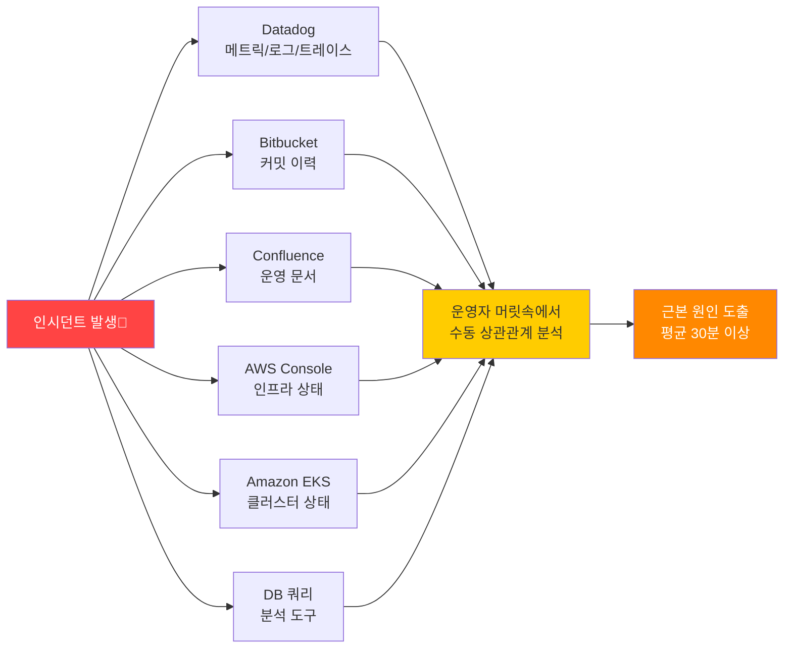

이처럼 평균 5~6개의 도구를 직접 오가며 분석해야 했고, 각 도구에서 얻은 정보를 운영자가 머릿속에서 하나하나 연결 지어 근본 원인을 추론해야 했다. 이 과정은 경험이 많은 숙련된 SRE에게도 평균 30분 이상이 소요되는 작업이었다.

### 2.2 4가지 핵심 문제점

**① 컨텍스트 전환 비용 (Context Switching Cost)**

Datadog 대시보드에서 이상 메트릭을 발견하고, 이것이 배포 때문인지 확인하려면 Bitbucket을 열어 최근 커밋 내역을 봐야 한다. 다시 Confluence에서 해당 서비스의 운영 문서를 확인하고, AWS 콘솔에서 인프라 상태를 점검하는 식이다. 이 전환 과정에서 이미 확인한 내용의 맥락을 놓치거나, 도구 간 시간 축이 맞지 않아 잘못된 상관관계를 도출하는 오류가 발생할 수 있다.

**② 야간/주말 대응의 취약성**

24시간 365일 서비스를 운영하는 GS리테일 입장에서, 새벽 3시에 발생한 장애에 신속하게 대응할 수 있는 숙련 인력을 항상 대기시키는 것은 현실적으로 매우 어렵고 비용도 크다. 당직 인력이 있다 하더라도, 수면 중에 깨어나 복잡한 멀티 도구 분석을 즉각 수행하기란 쉬운 일이 아니다. 이 시간 지연이 장애 확산으로 이어지는 위험이 항상 존재했다.

**③ 지식의 단절 (Knowledge Silo)**

숙련된 운영자가 10번의 유사 장애를 경험하면서 쌓은 "이런 패턴이 나오면 여기를 봐야 해"라는 직관적 노하우는, 그 사람이 퇴사하거나 팀을 이동하면 사라진다. 지식이 조직의 자산이 아닌 개인의 경험에 종속되어 있는 것이다. 이는 신규 인력의 온보딩 시간을 길게 만들고, 숙련도에 따른 분석 품질의 편차를 초래한다.

**④ 분석의 일관성 부재**

같은 인시던트에 대해서도 누가 분석하느냐에 따라 깊이와 품질이 달라진다. A 운영자는 메트릭만 보고 "서버 과부하"로 결론 내릴 수 있고, B 운영자는 배포 이력까지 교차 확인하여 "신규 배포의 메모리 설정 오류"라는 정확한 근본 원인을 찾을 수 있다. 이 불일치는 재발 방지 대책의 품질에도 직접적인 영향을 미친다.

---

## 3. AIOps 도입 필요성과 설계 철학

### 3.1 왜 단순 자동화가 아닌가

GS리테일 클라우드인프라팀은 이 문제를 해결하기 위해 여러 접근법을 검토했다. 단순한 스크립트 자동화나 룰(Rule) 기반 알림 시스템으로는 이 문제를 해결할 수 없다는 결론에 도달했다. 그 이유는 명확하다.

- **인시던트마다 원인이 다르다.** 어제의 메모리 부족은 코드 버그 때문이었지만, 오늘의 메모리 부족은 트래픽 급증 때문일 수 있다. 룰 기반으로는 이 차이를 구분할 수 없다.
- **확인해야 할 도구의 조합이 매번 달라진다.** DB 장애에는 DB 쿼리 분석이 필요하지만, K8s 이슈에는 Pod 상태 확인이 먼저다. 고정된 시퀀스로는 모든 상황에 대응할 수 없다.
- **상관관계 파악은 문맥적 추론을 필요로 한다.** "배포 10분 후 에러율 상승"이라는 상관관계를 발견하고 "이 배포가 원인일 가능성이 높다"고 추론하는 것은 단순한 패턴 매칭이 아니라 도메인 지식에 기반한 인과적 추론이다.

### 3.2 세 가지 핵심 설계 기준

클라우드인프라팀이 AIOps Agent 시스템을 설계하면서 세운 세 가지 기준은 매우 실용적이고 명확하다.

**기준 1: AI 모델의 도구 활용 능력**

단순히 텍스트를 생성하는 AI가 아니라, 외부 도구를 직접 호출하고, 그 결과를 바탕으로 다음 행동을 결정할 수 있는 AI가 필요했다. Amazon Bedrock의 **Converse API**가 이 에이전트 루프를 네이티브로 지원하기 때문에 선택되었다. 즉, AI가 "Datadog에서 메트릭을 가져와라"라고 도구를 호출하고, 결과를 받아 "이 메트릭 패턴을 보니 EKS Pod 상태를 확인해야겠다"고 스스로 다음 행동을 결정하는 구조가 가능해진다.

**기준 2: 비용과 분석 품질의 균형**

인시던트 분석의 각 단계는 서로 다른 요구사항을 가진다. 초기 데이터 수집과 반복적인 도구 호출 단계에서는 빠르고 비용 효율적인 모델이 유리하고, 최종 근본 원인을 도출하는 종합 추론 단계에서는 가장 강력한 모델이 필요하다. 이 두 가지를 하나의 모델로 해결하려 하면 비용과 품질 중 하나를 희생해야 한다. GS리테일은 **Sonnet 계열로 조사하고 Opus로 확정하는 하이브리드 전략**으로 이 문제를 해결했다.

**기준 3: 기존 운영 도구와의 원활한 연동**

새로운 시스템을 도입한다고 해서 이미 잘 작동하고 있는 Datadog, Bitbucket, Confluence 등의 도구를 교체할 수는 없다. AI가 이 기존 도구들을 직접 활용할 수 있는 표준화된 인터페이스가 필요했는데, **Model Context Protocol(MCP)** 이 바로 그 역할을 한다. MCP는 각 도구를 독립적인 서버로 구성하고, AI 에이전트가 표준 프로토콜로 호출할 수 있게 해주는 일종의 "AI를 위한 USB 허브"라고 이해할 수 있다.

---

## 4. 솔루션 아키텍처 전체 구조

GS리테일 AIOps Agent의 전체 아키텍처를 크게 세 개의 레이어로 나누어 살펴볼 수 있다.

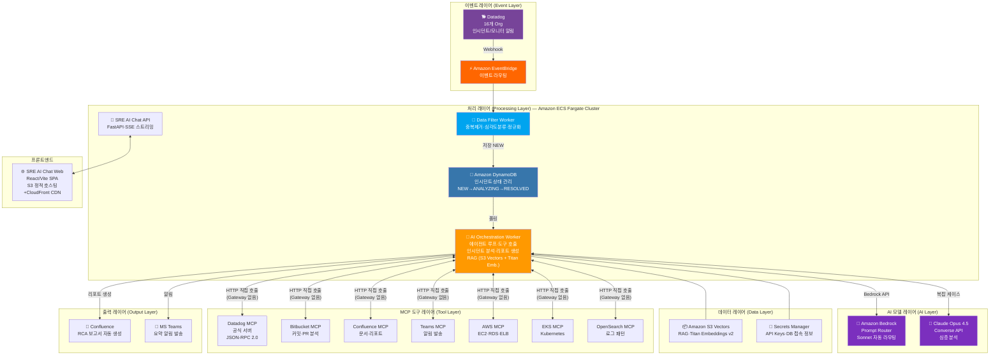

### 4.1 Amazon ECS Fargate 기반 컨테이너 아키텍처

시스템 전체는 Amazon ECS Fargate 위에서 동작하는 컨테이너 기반 아키텍처로 설계되었다. Fargate를 선택한 이유는 서버리스 컨테이너 실행 환경으로, 인시던트 발생 시 필요에 따라 유연하게 스케일할 수 있고, 서버 관리 부담 없이 컨테이너만 집중적으로 관리할 수 있기 때문이다.

내부에는 크게 세 가지 주요 컴포넌트가 있다.

- **Data Filter Worker**: 이벤트 필터링과 중복 제거를 담당
- **AI Orchestration Worker**: 에이전트 루프를 구동하는 핵심 엔진
- **SRE AI Chat API**: 대화형 분석을 위한 FastAPI 백엔드

### 4.2 핵심 설계 결정 4가지

**① Datadog 공식 MCP 서버 직접 호출**

자체적으로 MCP 서버를 만드는 대신, Datadog이 공식 제공하는 MCP 서버를 JSON-RPC 2.0 프로토콜로 직접 호출한다. 이는 유지보수 부담을 줄이고, Datadog 기능 업데이트를 자동으로 반영받을 수 있는 장점이 있다. 16개 조직의 API Key와 App Key는 AWS Secrets Manager에서 중앙 관리하며, 새로운 조직 추가 시 키만 등록하면 즉시 사용 가능한 구조다.

**② Gateway 없는 MCP 직접 통신**

AI Orchestration Worker가 Teams, AWS, Bitbucket, Confluence 등 각 MCP 서비스를 중간 Gateway 없이 HTTP로 직접 호출한다. API Gateway를 중간에 두면 레이턴시가 추가되고 아키텍처가 복잡해진다. 직접 통신 구조로 지연을 최소화했다.

**③ Amazon S3 Vectors 기반 RAG**

Amazon S3 Vectors와 Amazon Titan Embeddings v2를 활용하여 과거의 모든 인시던트 분석 결과를 벡터 데이터베이스에 저장한다. 새로운 인시던트 발생 시, 유사한 과거 사례를 검색하여 분석의 출발점으로 활용한다. 이는 AI가 조직의 운영 히스토리를 기반으로 더 빠르고 정확하게 근본 원인을 추론할 수 있게 해준다.

**④ Bedrock Prompt Router를 통한 비용 최적화**

Amazon Bedrock Prompt Router는 요청의 복잡도를 자동으로 판단하여 Claude 3.7 Sonnet과 Claude 3.5 Sonnet v2 사이에서 적절한 모델을 자동 선택한다. 이를 통해 단순한 도구 호출 작업에는 비용이 낮은 모델을, 복잡한 추론이 필요한 작업에는 더 강력한 모델을 자동으로 배정함으로써 품질과 비용의 균형을 맞춘다.

---

## 5. 6단계 인시던트 처리 파이프라인

인시던트가 발생하면 다음과 같은 자동화된 파이프라인을 통해 분석이 완료된다.

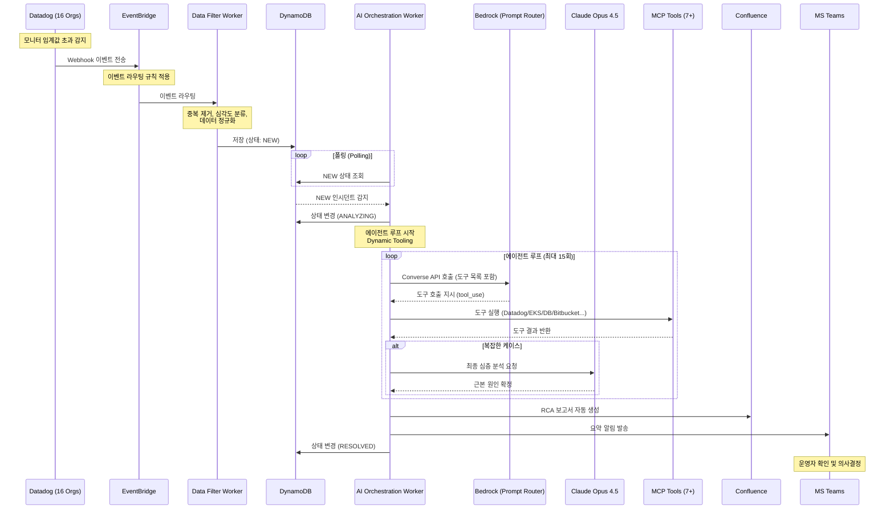

### 단계별 상세 설명

**1단계: Datadog 인시던트 감지**

GS리테일의 16개 독립 Datadog 조직 중 어느 하나에서 모니터 임계값이 초과되는 순간, Datadog은 설정된 Webhook을 통해 Amazon EventBridge로 이벤트를 자동 전송한다. 이 과정은 사람의 개입 없이 완전 자동으로 이루어진다.

**2단계: EventBridge 라우팅**

Amazon EventBridge는 수신된 이벤트의 패턴을 분석하여, 미리 정의된 규칙에 따라 Amazon ECS Fargate 위의 Data Filter Worker 서비스로 이벤트를 라우팅한다. EventBridge는 이벤트 버스 역할을 하며, 향후 다른 소비자 서비스를 추가하기도 용이한 확장 가능한 구조다.

**3단계: Data Filter Worker**

Data Filter Worker는 다음 세 가지 핵심 작업을 수행한다.

- **중복 이벤트 제거**: 동일한 인시던트에 대해 짧은 시간 안에 여러 알림이 도착하는 경우, 중복을 걸러내어 하나의 인시던트 레코드만 생성한다.
- **심각도 분류**: P1(크리티컬), P2(높음), P3(보통) 등 심각도를 분류하여 우선순위를 결정한다.
- **데이터 정규화**: 16개 조직마다 다른 형식의 Datadog 이벤트를 통일된 내부 데이터 구조로 변환한다.

이렇게 처리된 인시던트는 Amazon DynamoDB에 `상태: NEW`로 저장된다.

**4단계: AI Orchestration Worker**

AI Orchestration Worker는 Amazon DynamoDB를 주기적으로 폴링(polling)하여 `NEW` 상태의 인시던트를 감지한다. 새 인시던트를 발견하면 즉시 상태를 `ANALYZING`으로 변경하고, 에이전트 루프를 시작한다. 이 상태 관리 메커니즘은 여러 Worker 인스턴스가 동시에 실행되더라도 같은 인시던트를 중복으로 처리하는 것을 방지한다.

**5단계: 에이전트 루프 (자율 분석)**

이것이 이 시스템의 핵심이다. Amazon Bedrock의 Prompt Router와 Claude Opus 4.5를 조합하여, AI가 상황에 맞는 도구를 스스로 선택하고 반복 호출하며 근본 원인을 추적한다. 이 과정은 최대 15회까지 반복될 수 있으며, 각 반복마다 AI는 이전 단계의 결과를 바탕으로 다음 행동을 결정한다.

**6단계: 리포트 생성 및 알림**

근본 원인이 도출되면 AI는 Confluence MCP를 통해 구조화된 RCA(Root Cause Analysis) 보고서를 자동으로 생성한다. 동시에 Teams MCP를 통해 담당 채널에 요약 알림 메시지를 발송하고, DynamoDB의 인시던트 상태를 `RESOLVED`로 업데이트한다.

---

## 6. 에이전트 루프: AI의 자율적 사고 엔진

에이전트 루프는 이 시스템에서 가장 혁신적인 부분이다. 단순히 정해진 스크립트를 순서대로 실행하는 것이 아니라, AI가 매 순간 상황을 판단하고 다음 행동을 스스로 결정하는 "자율적 분석 사이클"이다.

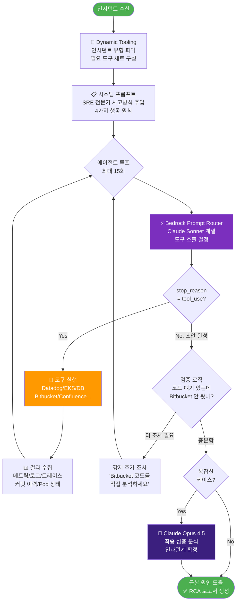

### 6.1 에이전트 루프 핵심 코드 분석

```python
async def _run_agent_loop(self, incident: dict, tools: list) -> dict:
    """Sonnet으로 조사하고, Opus 4.5 로 확정하는 하이브리드 루프"""
    messages = [self._build_system_prompt(incident)]

    for i in range(15):  # 최대 15회 반복
        # Phase 1: Sonnet으로 현장 조사
        response = await self.bedrock.converse(
            modelId=self.prompt_router_arn,
            messages=messages,
            toolConfig={"tools": tools}
        )

        if response["stop_reason"] == "tool_use":
            # AI가 도구 사용을 요청한 경우: 실행 후 결과를 다음 메시지로 추가
            results = await self._execute_tools(response)
            messages.append(response["output"]["message"])
            messages.append({"role": "user", "content": results})
            continue  # 다시 루프

        # Phase 2: 소스코드 확인 강제 검증
        final_draft = self._extract_text(response)
        if self._needs_more_investigation(final_draft):
            # 코드 관련 언급이 있으나 Bitbucket을 확인하지 않은 경우
            messages.append({
                "role": "user",
                "content": "추측 대신 Bitbucket 코드를 직접 분석하세요."
            })
            continue  # 강제로 추가 조사

        # Phase 3: 복잡한 케이스는 Opus 4.5로 에스컬레이션
        if self._is_complex_case(final_draft):
            return await self._interpret_with_opus(final_draft)

        return final_draft
```

이 코드에서 특히 주목할 부분은 세 가지다.

첫째, `stop_reason == "tool_use"` 체크다. Amazon Bedrock Converse API는 모델이 도구를 호출하고 싶을 때 `stop_reason`을 `tool_use`로 반환한다. AI가 "Datadog에서 메트릭을 조회하겠다"고 결정하면, 이 코드가 실제로 해당 MCP 도구를 호출하고 결과를 다시 AI에게 전달한다.

둘째, `_needs_more_investigation()` 검증 로직이다. AI가 보고서 초안을 작성했을 때, 코드 관련 내용이 언급되어 있지만 실제로 Bitbucket을 조회하지 않은 경우를 감지한다. 이 경우 AI에게 강제로 Bitbucket을 직접 확인하도록 지시한다. "코드를 확인해 보세요"라는 권고를 보고서에 쓰는 대신, 직접 코드를 읽고 분석하도록 강제하는 것이다.

셋째, `_is_complex_case()` 판단 후 Opus 에스컬레이션이다. 단순한 케이스는 Sonnet 계열로 마무리하지만, 복잡한 인과관계 분석이 필요한 경우 Claude Opus 4.5를 호출하여 최고 품질의 분석을 보장한다.

---

## 7. 동적 도구 로딩 전략 (Dynamic Tooling)

AI에게 모든 도구를 한꺼번에 제공하면 어떤 문제가 발생할까? 모델이 불필요한 도구까지 호출하려 시도하면서 분석이 느려지고, 과도한 토큰 비용이 발생하며, 관련 없는 도구의 결과가 분석 품질을 저하시킬 수 있다. GS리테일은 이 문제를 인시던트 유형에 따른 **동적 도구 로딩(Dynamic Tooling)** 으로 해결했다.

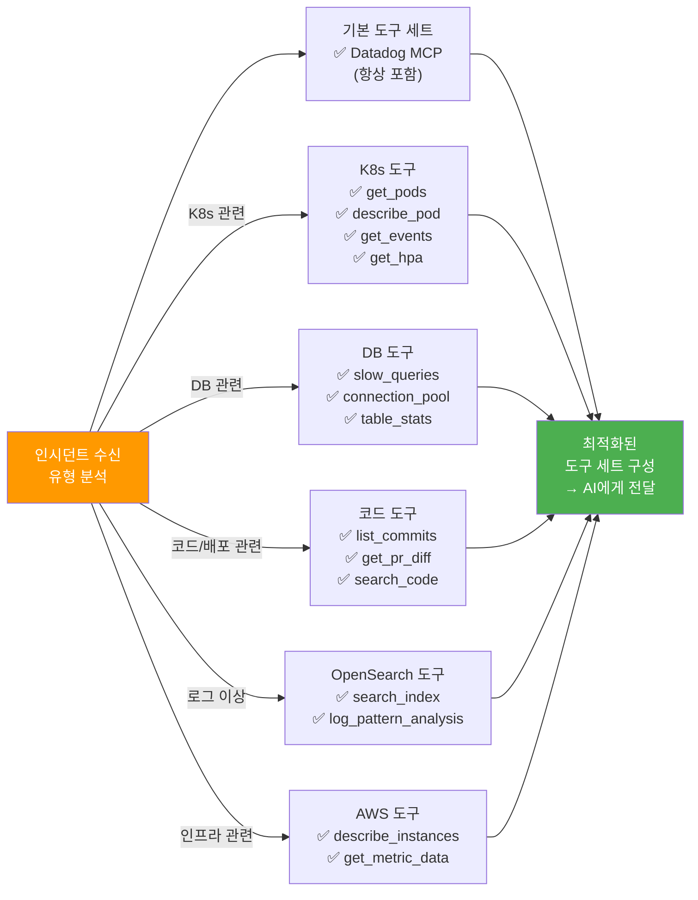

```python
async def _build_tool_config(self, incident: dict) -> list:
    """인시던트 성격에 따라 최적의 도구 세트 구성"""
    tools = []
    tools.extend(self._get_datadog_tools())  # 기본: 항상 포함

    if self._is_k8s_related(incident):
        tools.extend(self._get_eks_tools())      # EKS/K8s 이슈
    if self._is_db_related(incident):
        tools.extend(self._get_postgres_tools()) # DB 이슈
    if self._has_service_mapping(incident):
        tools.extend(self._get_bitbucket_tools())# 코드/배포 이슈

    return tools
```

이 전략의 효과는 세 가지다.

**정확도 향상**: 관련 없는 도구가 없으므로 AI가 핵심 영역에만 집중한다.

**비용 절감**: 불필요한 도구 정보가 프롬프트에 포함되지 않아 토큰 사용량이 줄어든다.

**속도 개선**: AI가 판단해야 할 선택지가 적어지므로 의사결정이 빨라진다.

---

## 8. 하이브리드 모델 전략 (Sonnet + Opus)

GS리테일이 채택한 이중 모델 전략은 비용과 품질 사이의 절묘한 균형을 실현한다.

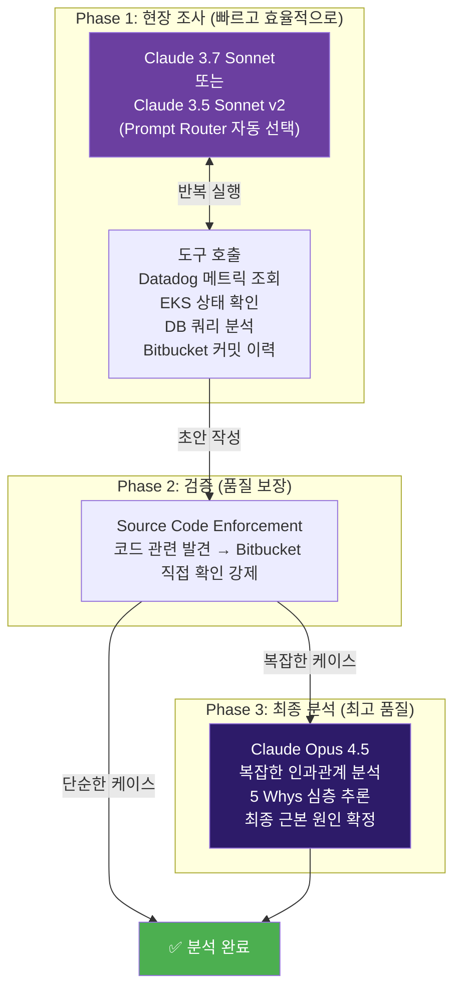

**Bedrock Prompt Router의 역할**

Prompt Router는 각 요청의 특성을 분석하여 Claude 3.7 Sonnet과 Claude 3.5 Sonnet v2 중 최적의 모델을 자동으로 선택한다. 운영자가 별도로 모델을 지정하지 않아도 비용과 성능의 균형을 자동으로 맞춰준다. 특히 반복적인 도구 호출 작업에서 이 자동 라우팅은 상당한 비용 절감 효과를 만들어낸다.

**Claude Opus 4.5의 역할**

개발 당시 Prompt Router에서 Opus 4.5를 직접 지원하지 않았기 때문에, GS리테일은 복잡한 케이스를 별도로 감지하여 Converse API로 Opus 4.5를 직접 호출하는 인터프리터 방식을 구현했다. Opus 4.5는 특히 다음과 같은 상황에서 호출된다.

- 여러 시스템에 걸친 복잡한 인과관계 분석이 필요한 경우
- Sonnet 계열로 도출한 원인이 불명확하거나 여러 가설이 충돌하는 경우
- 5 Whys(왜? 를 5번 반복하는 심층 원인 분석 기법)를 통한 근본 원인 확정이 필요한 경우

---

## 9. 핵심 AI 로직: 시스템 프롬프트 설계

시스템 프롬프트는 AI의 행동 방식 전체를 규정하는 가장 중요한 요소다. GS리테일이 공개한 시스템 프롬프트의 구조는 단순한 "분석해줘" 수준이 아니라, 숙련된 SRE 전문가의 사고방식 자체를 체계화하여 주입한 것이다.

```markdown
# 역할
당신은 장애의 근본 원인(Root Cause)을 추적하는 SRE 전문가입니다.
증상을 나열하는 것이 아니라, "왜 이 문제가 발생했는가"를 끝까지
파고들어야 합니다.

# 핵심 행동 원칙

## 1. 자율적 탐색
- 모든 도구를 자유롭게 사용하세요. 순서 제한 없습니다.
- 한 영역에서 원인을 못 찾으면 다른 영역으로 확장하세요.
- 인프라 ↔ 애플리케이션 ↔ 외부연동 ↔ 데이터베이스, 어디든 이동합니다.

## 2. 직접 확인 우선
- 의심되는 것은 반드시 도구로 직접 확인하세요.
- "~를 확인해 보세요"라고 쓰려면, 먼저 직접 확인을 시도하세요.
- 보고서에는 확인한 결과만 기술하세요.
- 소스코드도 직접 확인하세요! Bitbucket에서 실제 코드를 찾아
  분석 결과를 보고서에 포함하세요.

## 3. 증거 기반 분석
- 모든 판단에는 증거(로그, 메트릭, 트레이스, 코드)를 첨부하세요.
- 추측과 사실을 명확히 구분하세요. 추정 시 "[추정]" 표기.

## 4. 근본 원인까지 추적 (5 Whys)
- 증상 수집에서 멈추지 마세요. "왜?"를 반복하세요.
- 가설 수립 → 도구로 검증 → 결과 기록 → 다음 가설 (반복)
```

이 시스템 프롬프트의 설계 의도를 깊이 분석하면 다음과 같다.

**"자율적 탐색" 원칙의 의미**

기존의 자동화 시스템은 대개 `Step 1: Datadog 확인 → Step 2: EKS 확인 → Step 3: DB 확인`과 같은 고정된 순서를 따른다. 하지만 실제 장애 분석에서는 Datadog을 보고 즉시 Bitbucket 배포 이력이 먼저 확인되어야 하는 상황도 있고, EKS 이벤트를 보다가 갑자기 DB Slow Query가 의심되는 상황도 있다. "순서 제한 없이 자유롭게 도구를 사용하라"는 원칙은 AI가 정해진 루틴을 따르는 로봇이 아니라, 상황에 따라 판단하는 SRE처럼 행동하도록 유도한다.

**"직접 확인 우선" 원칙의 의미**

AI 모델이 학습 데이터에서 유사한 패턴을 기억하고 있더라도, "이런 경우에는 보통 코드에 문제가 있으니 코드를 확인해보세요"라고 권고하는 것은 충분하지 않다. 실제로 Bitbucket에 접속하여 해당 서비스의 최근 커밋 내역을 열람하고, 변경된 코드를 직접 분석한 결과를 보고서에 포함하도록 강제한다. 이는 보고서의 신뢰성을 획기적으로 높인다.

**"5 Whys" 방법론의 적용**

도요타 생산 시스템에서 유래한 5 Whys 방법론은 "왜?"를 5번 반복하여 표면적 증상 뒤에 숨어 있는 근본 원인을 찾는 기법이다. 예를 들어:
- Pod가 Pending 상태다 (증상)
- 왜? → 스케줄링에 실패했다
- 왜? → 노드 메모리가 부족하다
- 왜? → 새 배포에서 메모리 요청을 8GB로 설정했다
- 왜? → 개발팀이 로컬 테스트에서 메모리 사용량을 과도하게 추정했다
- 왜? → 스테이징 환경과 프로덕션의 부하 패턴이 달랐다 (진짜 근본 원인)

이처럼 표면적 증상에서 멈추지 않고 진짜 원인까지 파고드는 것이 핵심이다.

---

## 10. Thinking 로직: AI의 자율적 판단 메커니즘

에이전트 루프의 각 단계에서 AI는 `_think()` 메서드를 통해 자신의 추론 과정을 명시적으로 기술하고, 다음 행동을 결정한다.

```python
async def _think(self, observation: Dict, context: Dict) -> Dict:
    """AI가 다음 액션 결정 - 매 순간 상황을 보고 스스로 판단"""
    last = context['investigation_history'][-1]
    full_result_str = json.dumps(last['full_result'], indent=2)

    prompt = f"""
# 방금 조사한 내용 (자세히 읽어보세요!)
**액션**: {last['action']}
**상세 결과**: {full_result_str}

# 조사 철학
당신은 순서를 따르는 로봇이 아닙니다.
매 순간 상황을 보고 스스로 판단하는 SRE입니다.

1. "다음에 뭘 봐야 할까?"를 스스로 결정하세요
2. Datadog에서 문제를 발견하면 → Bitbucket에서 코드를 찾아 분석
3. 데이터가 본질과 관련없다면 즉시 다른 방법을 시도
4. 한 가지 방법에 2번 이상 집착하지 마세요
"""
    response = await self._call_bedrock(prompt)
    decision = self._parse_json_response(response)
    
    logger.info(f"[Think] {decision['thinking']}")
    logger.info(f"[Think] Decision: {decision['action']}")
    return decision
```

AI가 이 메서드를 통해 출력하는 JSON 형식의 사고 과정은 매우 흥미롭다. 실제 우리동네GS EKS Pod Pending 인시던트에서 AI가 생성한 사고 과정 예시를 보면:

**1차 사고**: EKS 이벤트 확인
```json
{
  "thinking": "Pod Pending 알람이네. EKS 클러스터 상태를 먼저 봐야겠어.
               노드 메모리가 부족한 건 아닌지, 스케줄링 실패 이벤트가 있는지 확인하자.",
  "action": "eks_get_events",
  "reasoning": "Pending 상태는 스케줄링 실패를 의미. 이벤트를 보면 원인을 알 수 있어.",
  "parameters": {
    "cluster_name": "EKS-PROD-CLUSTER-V1",
    "namespace": "xxxx"
  }
}
```

**결과**: "Insufficient memory" 이벤트 발견

**2차 사고**: 배포 이력 확인으로 전환
```json
{
  "thinking": "노드 메모리 부족으로 스케줄링 실패. 최근에 메모리를 많이 쓰는
               배포가 있었을 수 있어. Bitbucket에서 최근 커밋을 확인해보자.",
  "action": "bitbucket_list_commits",
  "reasoning": "xxxx-api 배포가 메모리 부족을 유발했을 가능성.",
  "parameters": { "service_name": "xxxx-api" }
}
```

이 사고 과정을 보면, AI가 단순히 다음 API를 호출하는 것이 아니라, 실제로 이전 결과를 해석하고 가설을 수립한 뒤 그 가설을 검증할 도구를 선택하는 과정을 밟고 있음을 알 수 있다. 이것이 룰 기반 자동화와 AI 에이전트의 근본적인 차이다.

---

## 11. MCP 통합 도구 상세

시스템에 통합된 7개 이상의 도구 카테고리를 상세히 살펴본다.

### 11.1 Datadog MCP (핵심 모니터링)

| 도구 | 기능 |
|---|---|
| `search_logs` | 특정 서비스, 기간, 패턴으로 로그 검색 |
| `get_metric` | CPU, 메모리, 에러율, 레이턴시 등 메트릭 조회 |
| `search_spans` | APM 분산 추적 데이터 검색 |
| `get_trace` | 특정 요청의 전체 트레이스 조회 |

Datadog 공식 MCP 서버를 JSON-RPC 2.0으로 직접 호출하는 방식을 채택했다. 16개 Org의 API Key는 AWS Secrets Manager에서 관리하며, 인시던트의 Org 정보를 바탕으로 적절한 키를 자동으로 선택한다.

### 11.2 Bitbucket MCP (배포 이력 분석)

| 도구 | 기능 |
|---|---|
| `list_commits` | 서비스별 최근 커밋 이력 조회 |
| `get_pr_diff` | PR 변경사항 상세 분석 |
| `search_code` | 특정 패턴이나 함수명으로 코드 검색 |

배포 관련 인시던트에서 가장 강력한 도구다. "10분 전에 배포가 있었고 그 후 에러가 급증했다"는 상관관계를 발견했을 때, 해당 PR의 diff를 직접 분석하여 문제가 된 코드 변경을 특정할 수 있다.

### 11.3 Confluence MCP (운영 지식 관리)

| 도구 | 기능 |
|---|---|
| `search` | 키워드로 운영 문서 검색 |
| `get_page` | 특정 페이지 내용 조회 |
| `create_page` | 새 RCA 보고서 생성 |

Confluence는 단순한 출력 채널이 아니라 입력 소스이기도 하다. 과거 장애 대응 이력이나 서비스 아키텍처 문서를 검색하여 분석의 맥락을 풍부하게 만들 수 있다.

### 11.4 AWS MCP (인프라 상태)

| 도구 | 기능 |
|---|---|
| `describe_instances` | EC2 인스턴스 상태 조회 |
| `get_metric_data` | CloudWatch 메트릭 조회 (ELB, RDS 등) |

AWS 인프라 레이어의 이상 여부를 직접 확인한다. ELB의 503 에러 급증이나 RDS의 CPU 사용률 이상 등을 감지할 수 있다.

### 11.5 EKS Kubernetes MCP

| 도구 | 기능 |
|---|---|
| `get_pods` | Pod 목록 및 상태 조회 |
| `describe_pod` | 특정 Pod 상세 정보 |
| `get_events` | 클러스터 이벤트 조회 |
| `get_hpa` | HPA(Horizontal Pod Autoscaler) 상태 |

K8s 관련 인시던트에서 핵심 도구다. Pod의 Pending/CrashLoopBackOff 상태, OOMKilled 이벤트, HPA의 스케일링 지연 등을 직접 확인할 수 있다.

### 11.6 PostgreSQL DBA MCP (자체 개발)

| 도구 | 기능 |
|---|---|
| `slow_queries` | 슬로우쿼리 분석 및 실행 계획 |
| `connection_pool` | 커넥션 풀 상태 및 고갈 감지 |
| `table_stats` | 테이블 통계, 락 정보, 인덱스 상태 |

GS리테일이 자체적으로 개발한 DBA Agent다. PostgreSQL 공식 MCP 및 Oracle MCP를 활용하여 DB 딕셔너리 테이블과 컬럼 구조를 조회한다. 특히 IDC 내 온프레미스 PostgreSQL부터 RDS, EDB on EC2까지 다양한 환경을 통합 관리하는 점이 인상적이다.

### 11.7 OpenSearch MCP (로그 패턴 분석)

| 도구 | 기능 |
|---|---|
| `search_index` | 인덱스 기반 로그 검색 |
| `log_pattern_analysis` | 로그 패턴 클러스터링 및 이상 탐지 |
| `data_distribution` | 데이터 분포 변화 감지 |

Datadog이 수집하지 않는 애플리케이션 레벨의 상세 로그를 분석한다. 특히 로그 패턴 분석은 단순한 에러 카운트가 아니라, 에러 메시지의 패턴 변화나 새로운 유형의 예외 등장 등을 감지하는 데 유용하다.

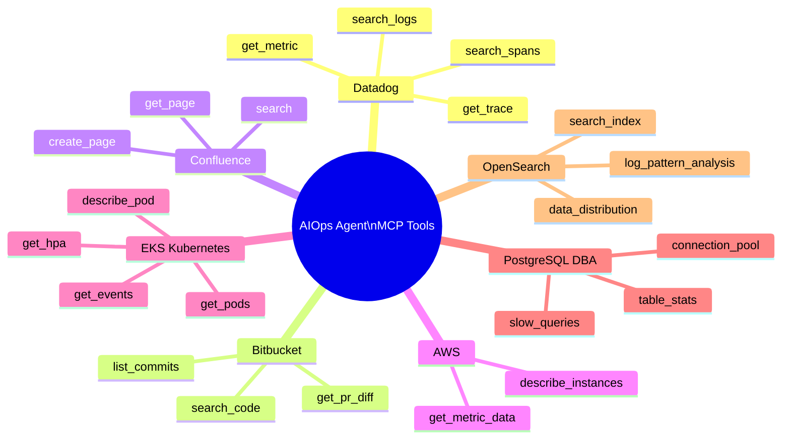

---

## 12. RAG 기반 지식 검색 시스템

Amazon S3 Vectors와 Amazon Titan Embeddings v2를 활용한 RAG(Retrieval-Augmented Generation) 시스템은 조직의 운영 지식을 AI 분석에 통합하는 핵심 메커니즘이다.

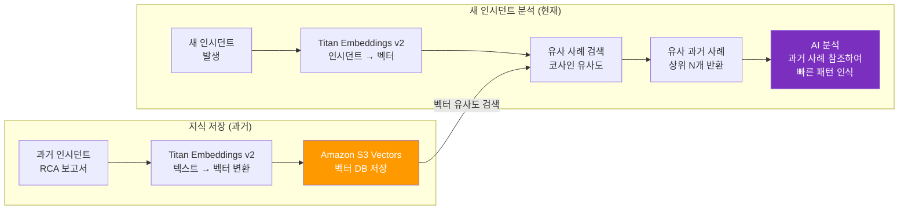

### RAG의 실질적 효과

**첫째, 분석 속도 향상**: 유사한 과거 사례가 있으면 AI가 처음부터 탐색하지 않고, 과거 사례의 분석 패턴을 참고하여 빠르게 원인을 좁혀나갈 수 있다.

**둘째, 분석 정확도 향상**: 조직의 실제 운영 히스토리를 기반으로 한 분석이기 때문에, 일반적인 공개 데이터로만 학습된 모델보다 GS리테일 환경에 특화된 분석을 수행할 수 있다.

**셋째, 지식의 누적과 선순환**: 매번 새로운 인시던트 분석 결과가 벡터 DB에 추가되어, 시스템이 운영될수록 분석 품질이 점점 더 향상되는 선순환 구조를 형성한다.

**넷째, 신규 인력 온보딩 가속**: 신규 운영자가 특정 서비스의 과거 장애 패턴을 SRE AI Chat에서 자연어로 질문하면, RAG를 통해 관련 과거 사례를 즉시 검색하여 답변받을 수 있다.

---

## 13. SRE AI Chat Web

자동 분석 시스템과 별개로, 운영자가 직접 AI와 대화할 수 있는 SRE AI Chat Web은 시스템의 사용성과 투명성을 크게 높여주는 컴포넌트다.

### 13.1 기술 스택

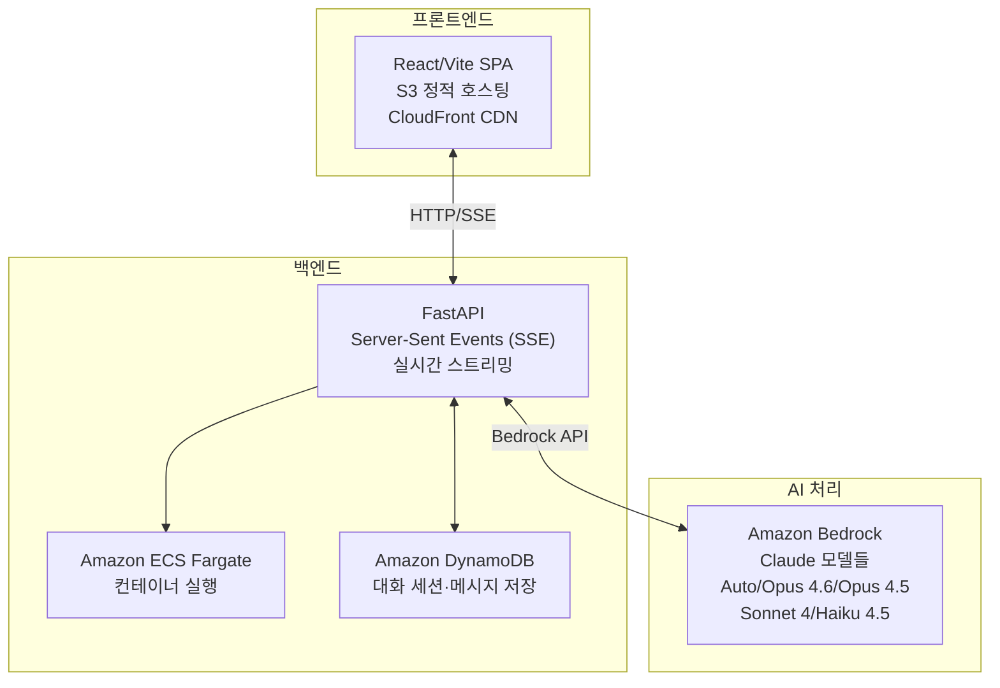

### 13.2 핵심 기능: 실시간 도구 호출 스트리밍

SRE AI Chat의 가장 중요한 특징은 AI가 분석 중 어떤 도구를 호출하고 있는지, 그 결과가 무엇인지를 **실시간으로 화면에 스트리밍**한다는 것이다. 

운영자가 "우리동네GS EKS Pod Pending 인시던트를 분석해줘"라고 입력하면, 화면에는 다음과 같은 과정이 실시간으로 표시된다.

```
💬 분석을 시작합니다...
💬 질문을 분석하고 있습니다...
💬 안녕하세요 [닉네임]님, 우리동네GS EKS Pod Pending 급증 인시던트를 분석해드리겠습니다.
   먼저 모니터 상세 정보를 확인하겠습니다.
💬 🔍 Datadog 모니터 검색 중...
   ✅ Datadog 모니터 검색 — org: o4o, query: id:2577...7 [펼치기 ▼]
💬 추가 분석 중... (step 2)
💬 모니터 정보를 확인했습니다. 이 모니터는 우리동네GS EKS 클러스터에서
   Pending 상태의 Pod가 10개를 초과할 때 알람을 발생시킵니다.
   이제 인시던트가 발생한 시간대의 Pending Pod 메트릭을 확인하겠습니다.
💬 📊 Datadog 메트릭 조회 중...
   ✅ Datadog 메트릭 조회 — org: ..., queries: [...] [펼치기 ▼]
```

이 투명한 분석 과정은 세 가지 중요한 가치를 제공한다.

**신뢰성**: 운영자가 AI의 분석 과정을 직접 볼 수 있기 때문에, AI가 어떤 근거로 결론을 도출했는지 이해하고 검증할 수 있다. "AI가 그렇다고 했으니까"가 아니라 "AI가 이런 데이터를 확인하여 이런 결론을 냈다"고 인지하게 된다.

**학습**: 신규 운영자가 AI의 분석 과정을 관찰하면서 "어떤 순서로 어떤 도구를 확인해야 하는가"를 자연스럽게 학습할 수 있다.

**개입 가능성**: 분석 도중 AI가 잘못된 방향으로 가고 있다고 판단되면, 운영자가 채팅으로 추가 지시를 내릴 수 있다.

### 13.3 인시던트 대시보드

SRE AI Chat Web에는 모든 인시던트의 현황을 한눈에 파악할 수 있는 대시보드가 포함된다. 대시보드에서 확인 가능한 주요 정보는 다음과 같다.

- **전체 인시던트 수**: 500개 (누적)
- **신규**: 0개 (현재 대기 중)
- **분석 중**: 2개 (현재 AI가 처리 중)
- **완료**: 428개 (성공적으로 분석 완료)
- **실패**: 7개 (분석 실패)
- **성공률**: 98%
- **평균 분석 시간**: 200초

각 인시던트 항목을 클릭하면 상세 분석 결과, 근본 원인, 타임라인, 권장 조치가 포함된 구조화된 리포트를 확인할 수 있으며, "AI에게 질문하기" 버튼을 통해 해당 인시던트에 대한 추가 질의를 할 수 있다.

---

## 14. 실제 인시던트 시나리오 전체 재현

가장 상세하게 공개된 실제 사례, 즉 2026년 3월 16일 발생한 우리동네GS EKS Pod Pending 급증 인시던트를 처음부터 끝까지 재현해본다.

### 사건 배경

우리동네GS(O4O 플랫폼)의 프로덕션 EKS 클러스터에서 특정 서비스 API의 신규 배포가 진행되었다. 해당 배포는 Pod당 메모리 요청을 8GB로 설정했는데, 기존 9개 노드 모두에서 메모리가 부족하여 새 Pod가 Pending 상태에 빠졌다. Cluster Autoscaler가 자동으로 새 노드를 추가하여 약 1분 내에 자동 복구되었지만, 알람은 발생했다.

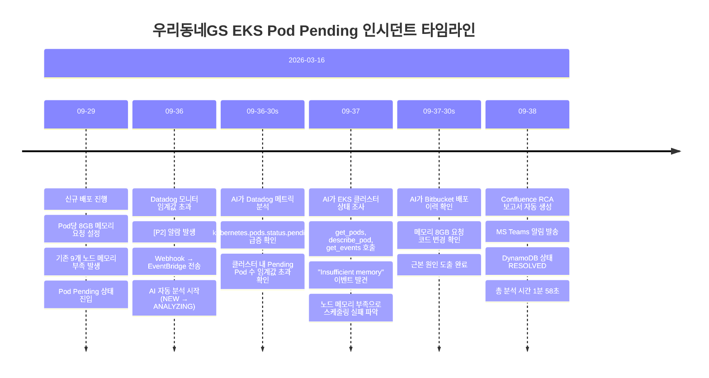

### AI의 실제 분석 흐름 재현

**Step 1: 인시던트 수신 및 컨텍스트 파악 (09:36)**

Data Filter Worker가 EventBridge 이벤트를 수신하고 DynamoDB에 저장한다. AI Orchestration Worker가 폴링으로 인시던트를 감지하고, 인시던트 유형이 K8s 관련임을 파악하여 EKS 도구와 Datadog 도구를 동적으로 로딩한다.

**Step 2: Datadog 메트릭 분석 (09:36~30s)**

```json
// AI 1차 사고
{
  "thinking": "Pod Pending 알람이네. EKS 클러스터 상태를 먼저 봐야겠어.",
  "action": "get_datadog_metric",
  "parameters": {
    "metric": "kubernetes.pods.status.pending",
    "cluster": "EKS-PROD-CLUSTER-V1",
    "period": "30m"
  }
}
```

결과: `kubernetes.pods.status.pending` 메트릭이 09:29부터 급격히 상승하여 09:36에 임계값(10개)을 초과한 것을 확인.

**Step 3: EKS 이벤트 조사 (09:37)**

```json
// AI 2차 사고
{
  "thinking": "메트릭 급증 시점을 확인했어. 이제 EKS 이벤트를 봐서
               스케줄링 실패 원인을 파악해야겠어.",
  "action": "eks_get_events",
  "parameters": {
    "cluster_name": "EKS-PROD-CLUSTER-V1",
    "namespace": "woodongs"
  }
}
```

결과: 여러 Pod에서 `0/9 nodes are available: 9 Insufficient memory.` 이벤트 발견.

**Step 4: 배포 이력 확인 (09:37~30s)**

```json
// AI 3차 사고
{
  "thinking": "메모리 부족으로 스케줄링 실패. 최근 배포에서 메모리 설정을
               너무 높게 잡은 건 아닐까? Bitbucket에서 확인하자.",
  "action": "bitbucket_list_commits",
  "parameters": {
    "service_name": "xxxx-api",
    "since": "2026-03-16T09:00:00"
  }
}
```

결과: 09:29에 해당 서비스의 배포가 있었고, Kubernetes deployment yaml에서 메모리 요청이 `2Gi → 8Gi`로 변경된 커밋 발견.

**Step 5: 근본 원인 확정 및 자동 복구 확인**

AI는 수집된 데이터를 종합하여 다음과 같이 근본 원인을 확정한다.

- **표면 증상**: EKS Pod Pending 급증
- **직접 원인**: 신규 배포 시 Pod당 메모리 요청 8GB로 설정
- **근본 원인**: 기존 9개 노드의 가용 메모리가 8GB 이하여서 스케줄링 불가
- **자동 복구**: Cluster Autoscaler가 약 1분 내에 새 노드를 추가하여 복구 완료
- **영향 범위**: Blue-Green 배포로 기존 Pod가 계속 트래픽을 처리하여 서비스 중단 없음

### Teams 알림 메시지 구조

```
🐕 우리동네GS

🚨 [AI분석] EKS Pod Pending 급증 - 자동 복구 완료

📋 장애 개요
• 도메인: 우리동네GS
• 발생 시간: 2026-03-16 09:29 KST
• 영향 서비스: [서비스명]
• 클러스터: EKS-PROD-CLUSTER-V1
• 현재 상태: ✅ 자동 복구 완료 (서비스 영향 없음)

🔍 원인 분석
[서비스명]-api 배포 시 Pod당 8GB 메모리 요청으로 기존 9개 노드 모두
메모리 부족 발생. Cluster Autoscaler가 약 1분 내 새 노드를 추가하여
자동 복구됨. Blue-Green 배포로 기존 Pod가 트래픽을 계속 처리하여
서비스 중단 없음.

✅ 조치 필요
• ✅ 자동 복구 완료 – 추가 조치 불필요
• 📊 모니터링 유지 – 현재 노드 10개, Pod 모두 Running 상태
• [선택] [서비스명]-api 메모리 요청량(8GB) 적정성 검토

ℹ️ 정상적인 Cluster Autoscaler 동작 사례. Pending 최대 1분, 에러 0건 발생.

🔗 참고 링크
📄 상세 보고서: https://[confluence]/pages/viewpage.action?...
📊 Datadog: https://app.datadoghq.com/monitors/...

🐕 AI SRE Automation | 2026-03-16 09:38:23 KST
```

---

## 15. RCA 보고서 구조 분석

Confluence에 자동 생성되는 RCA 보고서는 세 개의 섹션으로 구성된다.

### 섹션 1: 알람 정보 및 메트릭 분석

```markdown
## 알람 정보
- **모니터명**: [P2] [SREAI-L1] 우리동네GS EKS Pod Pending 급증 (V1)
- **심각도**: P2 (High)
- **클러스터**: EKS-PROD-CLUSTER-V1
- **서비스**: [서비스명]
- **발생 시각**: 2026-03-16 09:36 KST

## 메트릭 분석 결과
### kubernetes.pods.status.pending 추이
| 시각 | Pending Pod 수 | 임계값 | 상태 |
|------|----------------|--------|------|
| 09:29 | 2 | 10 | 정상 |
| 09:31 | 6 | 10 | 경고 |
| 09:34 | 10 | 10 | 임계값 초과 |
| 09:36 | 12 | 10 | 알람 발생 |
| 09:38 | 0 | 10 | 정상 복구 |
```

### 섹션 2: 조사 과정 상세

```markdown
## AI 조사 과정 상세

### Step 1: EKS 클러스터 상태 확인
- **조회**: EKS-PROD-CLUSTER-V1 클러스터 이벤트
- **발견**: 0/9 nodes are available: 9 Insufficient memory.
- **판단**: 스케줄링 실패 → 노드 메모리 부족

### Step 2: 배포 이력 확인
- **조회**: [서비스명]-api Bitbucket 커밋 이력 (09:00~09:40)
- **발견**: 09:29 커밋 - deployment.yaml 메모리 요청 2Gi → 8Gi 변경
- **판단**: 해당 배포가 메모리 부족의 직접 원인

### Step 3: Datadog 로그/트레이스 분석
- **조회**: [서비스명] 서비스 에러 로그 (09:29~09:38)
- **발견**: 에러 0건 (Blue-Green 배포로 기존 Pod 계속 서비스)
- **판단**: 서비스 중단 없음 확인
```

### 섹션 3: 근본 원인 및 권장 조치

```markdown
## 근본 원인 분석 (5 Whys)

| 단계 | 질문 | 답변 |
|------|------|------|
| Why 1 | Pod가 왜 Pending인가? | 스케줄링에 실패했다 |
| Why 2 | 왜 스케줄링에 실패했나? | 노드 메모리가 부족하다 |
| Why 3 | 왜 메모리가 부족한가? | 새 Pod의 메모리 요청이 8GB다 |
| Why 4 | 왜 8GB로 설정했나? | 배포 시 리소스 설정이 변경되었다 |
| Why 5 | 왜 이 설정이 문제가 됐나? | 기존 노드 가용 메모리가 8GB 미만이었다 |

**근본 원인**: 배포 시 메모리 요청 값이 클러스터 가용 용량을 초과하는 값으로 변경됨

## 권장 조치 사항
1. [즉시] 현재 노드 10개, 모든 Pod Running 상태 - 추가 조치 불필요
2. [단기] [서비스명]-api 메모리 요청량(8GB) 적정성 검토 및 조정
3. [중기] 배포 전 리소스 요청 값 검증 자동화 (OPA/Kyverno 정책 추가)
4. [장기] 클러스터 노드 가용 메모리 모니터링 대시보드 강화

## 재발 방지 대책
- CI/CD 파이프라인에 리소스 설정 변경 시 검토 단계 추가
- HPA/VPA를 통한 자동 리소스 조정 메커니즘 검토
```

---

## 16. 도입 성과와 의미

### 16.1 정량적 성과 요약

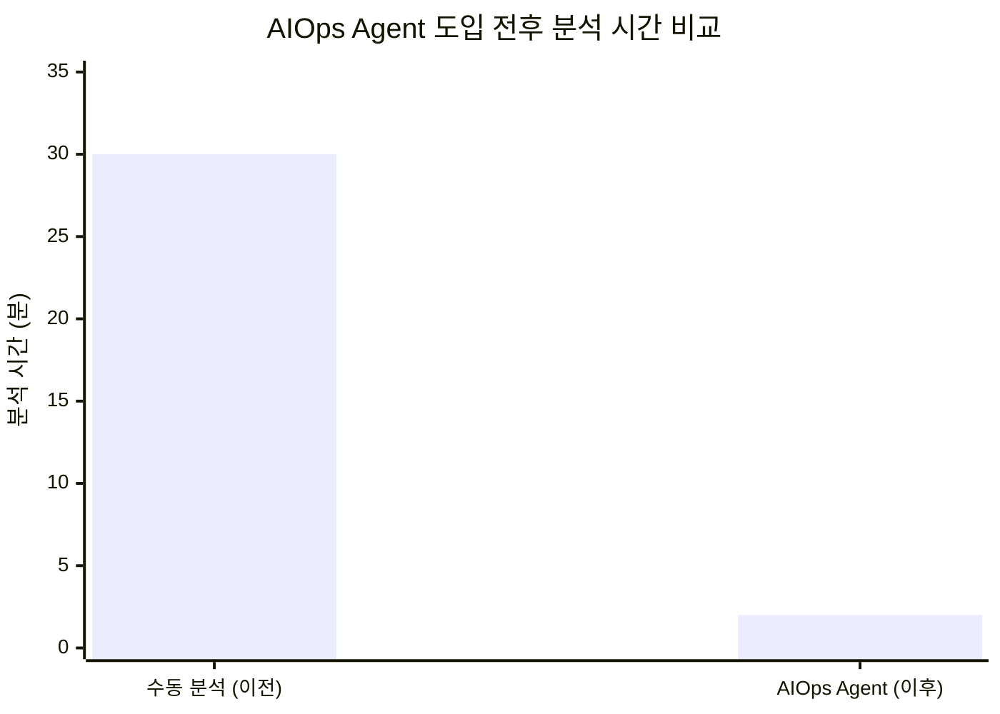

| 지표 | Before (수동 분석) | After (AIOps Agent) | 개선율 |
|---|---|---|---|
| **평균 분석 시간** | 30분 이상 | 약 2분 (198초) | **93% 단축** |
| **최소 분석 시간** | - | 76초 | - |
| **도구 전환** | 5~6개 수동 전환 | 7개 이상 자동 통합 | 자동화 |
| **야간/주말 초기 대응** | 당직 인력 의존 | AI 즉시 분석 시작 | 24/7 |
| **분석 결과 문서화** | 수동 작성 | Confluence 자동 생성 | 완전 자동 |
| **성공률** | - | 98% (500건 중 493건) | - |

### 16.2 정성적 성과의 깊은 의미

**① 운영자 역할의 고도화**

가장 중요한 변화는 운영자의 역할 자체가 달라졌다는 것이다. 기존에는 운영자가 분석가(Analyst)였다면, AIOps 도입 후에는 의사결정자(Decision Maker)가 되었다. 새벽 3시에 깨어나 막막한 분석을 시작하는 것이 아니라, AI가 준비한 정밀 보고서를 검토하고 "이 권장 조치를 실행할 것인가"만 판단하면 된다.

**② 지식의 제도화**

숙련된 운영자가 퇴사해도 그 노하우가 사라지지 않는다. 모든 분석 결과가 Confluence에 저장되고 RAG 시스템에 인덱싱되어, 조직의 영구적인 운영 지식이 된다. 신입 운영자가 SRE AI Chat에서 "이런 패턴의 장애 사례가 있나요?"라고 물으면, 과거 모든 유사 사례를 검색하여 답변받을 수 있다.

**③ 분석 품질의 민주화**

10년 경험의 숙련 SRE와 1년 차 신입 운영자가 같은 AI 시스템을 사용하면, 분석 품질이 균일화된다. 신입 운영자도 AI가 제공하는 체계적인 5 Whys 분석 결과를 검토하며, 자연스럽게 전문가 수준의 분석 사고방식을 익히게 된다.

**④ 팀 문화의 변화**

"장애 발생 시 누가 제일 먼저 파악하는가"에서 "AI가 파악한 결과를 팀이 어떻게 활용하는가"로 팀의 관심사가 이동한다. 더 이상 야간 당직에 대한 부담과 스트레스가 개인에게 집중되지 않으며, 팀 전체가 고품질의 분석 결과를 공유하는 협업 문화가 형성된다.

---

## 17. 향후 로드맵: 자율 운영을 향하여

GS리테일은 현재의 "분석 자동화"를 넘어 "자율 운영" 단계로 나아가는 명확한 로드맵을 수립했다.

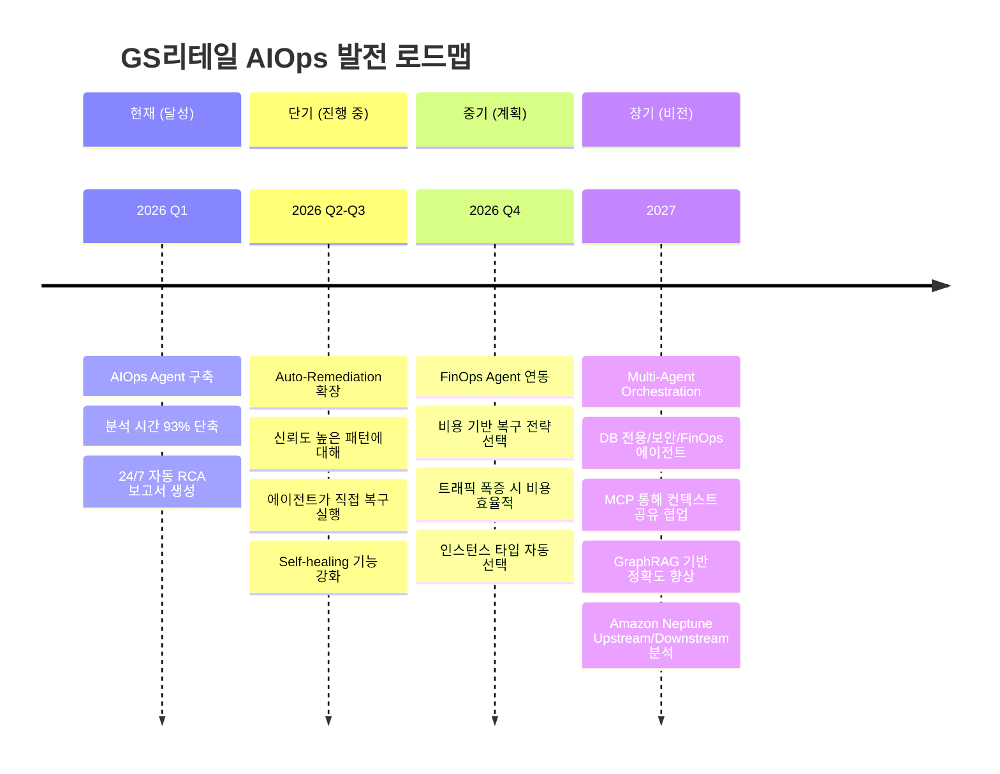

### 17.1 Auto-Remediation (자동 복구)

현재 시스템은 분석과 보고에 집중하며, 실제 복구 작업은 운영자가 수행한다. 향후에는 신뢰도가 충분히 높은 특정 장애 패턴에 대해서는 에이전트가 직접 인프라를 복구하는 Self-healing 기능을 추가할 계획이다.

예를 들어:
- 특정 서비스의 Pod가 OOMKilled로 재시작되는 패턴 → 메모리 요청값 자동 조정
- 클러스터 노드 수가 HPA 요구에 못 미치는 상황 → 수동 스케일 아웃 실행
- 특정 DB 락 패턴 감지 → 락 쿼리 자동 킬

### 17.2 FinOps Agent 연동

장애 복구에 "비용"이라는 변수를 추가하는 것은 매우 실용적인 접근이다. 트래픽 폭증 시 무조건 스케일 아웃하는 것이 아니라, 현재 예산 상황과 인스턴스 단가를 고려하여 가장 비용 효율적인 방법을 선택하는 것이다. 예를 들어, Spot 인스턴스 가격이 유리한 경우 스팟 인스턴스로 스케일 아웃하거나, 비핵심 배치 잡을 일시 중단하여 핵심 서비스의 리소스를 확보하는 등의 지능적인 대응이 가능해진다.

### 17.3 Multi-Agent Orchestration

단일 에이전트에서 전문화된 복수의 에이전트가 협업하는 구조로의 진화다.

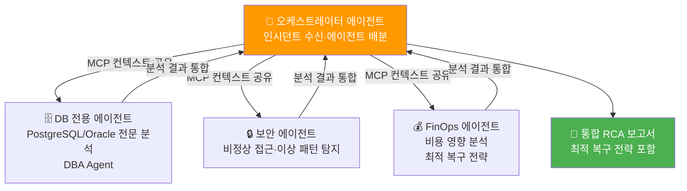

### 17.4 Graph DB 기반 정확도 향상 (GraphRAG)

Amazon Neptune을 활용한 GraphRAG는 가장 장기적이고 강력한 발전 방향이다. 회사 전체 시스템의 온톨로지를 그래프 형태로 구성하면, 장애 발생 시 해당 서비스의 Upstream(의존하는 서비스)과 Downstream(의존받는 서비스)에 미치는 영향을 즉시 파악할 수 있다.

예를 들어, 결제 API 장애가 발생했을 때 단순히 "결제 API에 문제가 있다"는 것을 넘어, 결제 API에 의존하는 주문 서비스, 포인트 서비스, 영수증 서비스에도 영향이 전파되고 있음을 자동으로 파악하여 통합 보고서에 포함하는 것이 가능해진다.

---

## 18. 기술 스택 종합 정리

### AWS 서비스

| 서비스 | 역할 |
|---|---|
| **Amazon Bedrock** | AI 모델 호스팅 및 Converse API 제공 |
| **Amazon Bedrock Prompt Router** | Claude Sonnet 계열 자동 라우팅, 비용 최적화 |
| **Amazon ECS Fargate** | 서버리스 컨테이너 실행 환경 |
| **Amazon EventBridge** | Datadog Webhook 수신 및 이벤트 라우팅 |
| **Amazon DynamoDB** | 인시던트 상태 관리, 대화 세션 저장 |
| **Amazon S3 Vectors** | RAG용 벡터 데이터베이스 |
| **Amazon S3** | SRE AI Chat Web 정적 호스팅 |
| **Amazon CloudFront** | CDN으로 프론트엔드 전송 속도 최적화 |
| **AWS Secrets Manager** | API Key 및 DB 접속 정보 중앙 관리 |
| **Amazon Neptune** | (예정) GraphRAG 구성을 위한 그래프 DB |

### AI/ML

| 기술 | 역할 |
|---|---|
| **Anthropic Claude 3.7 Sonnet** | Prompt Router 기본 모델 (빠른 조사) |
| **Anthropic Claude 3.5 Sonnet v2** | Prompt Router 대체 모델 |
| **Anthropic Claude Opus 4.5** | 복잡한 케이스 최종 심층 분석 |
| **Amazon Titan Embeddings v2** | 텍스트 → 벡터 변환 (RAG) |
| **Model Context Protocol (MCP)** | AI와 외부 도구 간 표준 통신 인터페이스 |

### 외부 도구 / MCP 서버

| 도구 | MCP 방식 |
|---|---|
| **Datadog** | 공식 MCP 서버, JSON-RPC 2.0 직접 호출 |
| **Bitbucket** | MCP 서버 직접 HTTP 호출 |
| **Confluence** | MCP 서버 직접 HTTP 호출 |
| **MS Teams** | MCP 서버 직접 HTTP 호출 |
| **Amazon EKS** | MCP 서버 직접 HTTP 호출 |
| **OpenSearch** | MCP 서버 직접 HTTP 호출 |
| **PostgreSQL** | 자체 개발 DBA Agent MCP |

### 백엔드 / 프론트엔드

| 기술 | 용도 |
|---|---|
| **Python (asyncio)** | AI Orchestration Worker 비동기 처리 |
| **FastAPI** | SRE AI Chat API 백엔드 |
| **Server-Sent Events (SSE)** | 실시간 AI 분석 과정 스트리밍 |
| **React + Vite** | SRE AI Chat Web 프론트엔드 |

---

## 19. 핵심 교훈과 시사점

이 사례에서 AI 에이전트 시스템을 구축하려는 모든 팀이 얻을 수 있는 핵심 교훈을 정리한다.

### 19.1 "AI에게 어떻게 생각할지 가르쳐라"

가장 중요한 교훈은 프롬프트 엔지니어링의 중요성이다. AI에게 단순히 "인시던트를 분석해줘"라고 하는 것과, 숙련된 SRE의 사고방식 전체를 체계화하여 주입하는 것은 완전히 다른 결과를 낳는다. 4가지 핵심 행동 원칙(자율적 탐색, 직접 확인 우선, 증거 기반 분석, 5 Whys)은 GS리테일이 오랜 운영 경험에서 추출한 SRE 전문 지식의 정수다.

### 19.2 "모든 걸 한번에 주지 마라 — 동적 로딩"

AI에게 모든 도구를 한꺼번에 제공하는 것은 직관적으로 옳아 보이지만, 실제로는 정확도 저하와 비용 증가를 초래한다. 인시던트 유형을 먼저 파악하고 필요한 도구만 동적으로 로딩하는 전략은 이 시스템의 성능과 비용 효율성의 핵심이다.

### 19.3 "속도와 품질을 트레이드오프하지 마라 — 하이브리드 모델"

조사는 Sonnet으로, 확정은 Opus로 하는 하이브리드 전략은 비용을 아끼면서도 최종 분석 품질을 타협하지 않는 영리한 접근이다. AI 에이전트 시스템을 설계할 때 모든 단계에 동일한 모델을 사용하는 대신, 단계의 특성에 맞는 모델을 선택하는 것이 중요하다.

### 19.4 "추측을 강제로 사실로 바꿔라 — Source Code Enforcement"

`_needs_more_investigation()` 검증 로직은 매우 실용적인 아이디어다. AI가 "코드를 확인해 보세요"라는 권고로 끝내려 하면, 강제로 다시 Bitbucket을 열어 직접 확인하도록 루프를 되돌린다. 이처럼 AI의 "추측"을 "직접 확인한 사실"로 강제 전환하는 메커니즘이 보고서 품질을 크게 높인다.

### 19.5 "투명성이 신뢰를 만든다"

SRE AI Chat Web에서 AI의 도구 호출 과정을 실시간으로 스트리밍하는 것은 단순한 UX 기능이 아니다. "AI가 이렇게 말했으니까"가 아니라 "AI가 이 데이터를 직접 확인하여 이런 결론을 냈다"는 투명성이, 운영자가 AI의 분석 결과를 신뢰하고 의사결정에 활용하게 만드는 핵심 요소다.

### 19.6 MCP 표준화의 위력

7개 이상의 이질적인 도구를 MCP라는 표준 인터페이스로 통합한 것은, 시스템의 확장성과 유지보수성을 크게 높였다. 새로운 도구를 추가할 때 AI 에이전트 코드를 수정하지 않고 MCP 서버만 등록하면 된다. 이는 MCP가 "AI를 위한 USB 표준"이 되고 있음을 잘 보여주는 사례다.

---

## 부록: 시스템 구성도 한눈에 보기

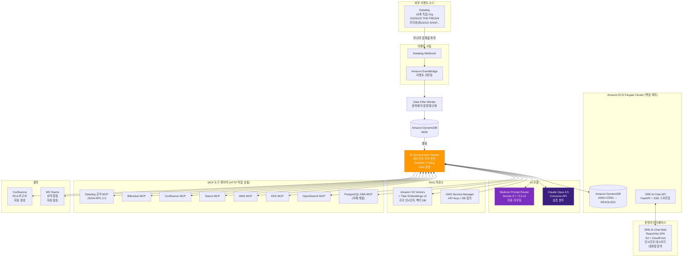

---

*본 문서는 AWS 기술 블로그에 게재된 GS리테일 AIOps Agent 사례(2026-04-16)를 기반으로 작성되었습니다.*  
*원문: https://aws.amazon.com/ko/blogs/tech/gsretail-aiops-sre-agent/*

---

**작성 일자: 2026-04-17**
