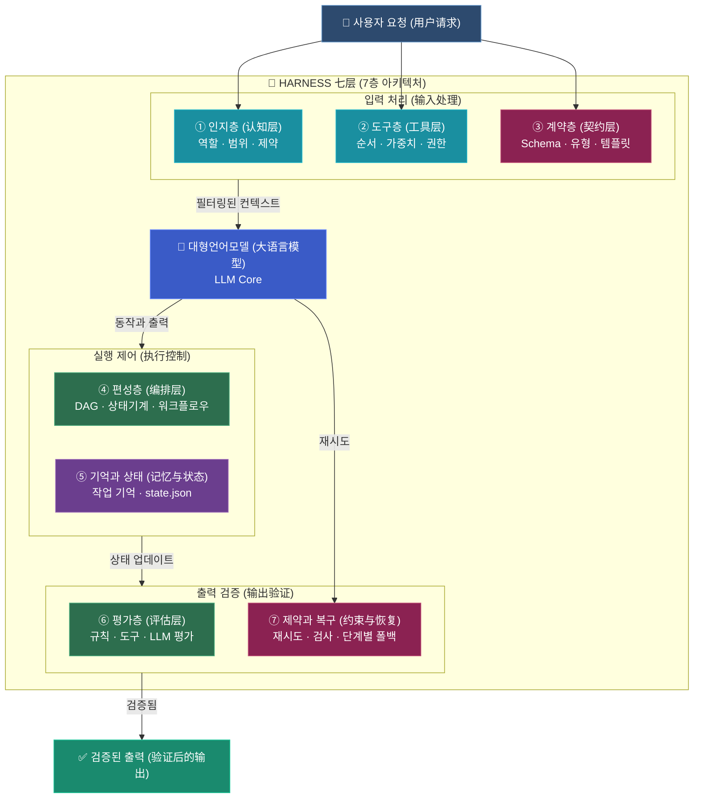
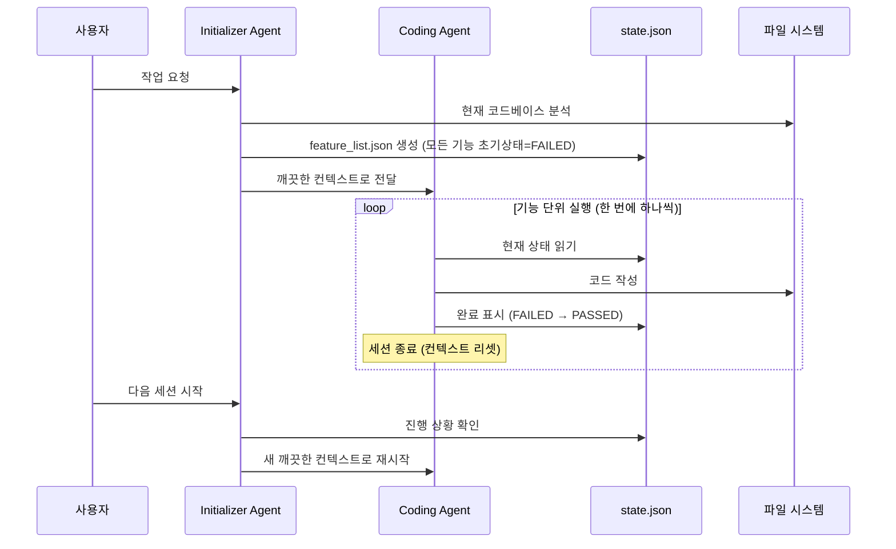
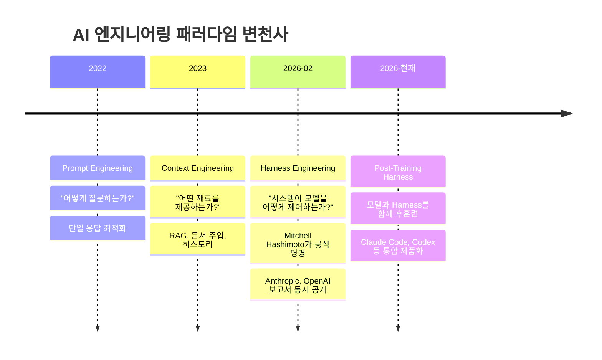

> **원문 출처**: 若石(Ruoshi) 블로그 / dotey([@dotey](https://x.com/dotey/status/2044660793153655205)) X(Twitter) 스레드  
> **핵심 개념**: Harness Engineering — AI Agent의 "안전벨트이자 에어백"이 되는 공학적 실천론  
> **작성 날짜**: 2026-04-17

---

## 목차

1. [배경: Prompt Engineering → Context Engineering → Harness Engineering](#1-배경)
2. [핵심 은유: 말(LLM)과 마구(Harness)](#2-핵심-은유)
3. [다이어그램 해설: Harness 7층 아키텍처 전체 흐름](#3-다이어그램-해설)
4. [각 레이어 심층 분석](#4-각-레이어-심층-분석)
   - [① 인지층 (认知层)](#-인지층-认知层)
   - [② 도구층 (工具层)](#-도구층-工具层)
   - [③ 계약층 (契约层)](#-계약층-契约层)
   - [④ 편성층 (编排层)](#-편성층-编排层)
   - [⑤ 기억과 상태 (记忆与状态)](#-기억과-상태-记忆与状态)
   - [⑥ 평가층 (评估层)](#-평가층-评估层)
   - [⑦ 제약과 복구 (约束与恢复)](#-제약과-복구-约束与恢复)
5. [4대 설계 원칙 심층 해설](#5-4대-설계-원칙-심층-해설)
6. [반직관적 함정 3가지](#6-반직관적-함정-3가지)
7. [하루 만에 구현 가능한 MVP Harness](#7-하루-만에-구현-가능한-mvp-harness)
8. [산업계 실증 사례](#8-산업계-실증-사례)
9. [Harness Engineering의 역사적 위치](#9-harness-engineering의-역사적-위치)
10. [결론: 모델이 문제가 아니라 Harness가 문제다](#10-결론)

---

## 1. 배경

### AI Agent 실패의 숨겨진 원인

많은 개발자들이 AI Agent를 10단계 이상의 복잡한 작업에 투입했을 때 예상치 못한 실패를 경험한다. 첫 번째 반응은 대부분 동일하다. "모델이 멍청한 게 아닐까?" 그러나 若石(Ruoshi)의 블로그 포스트는 완전히 다른 시각을 제시한다. **문제는 모델(말)이 아니라 Harness(고삐)가 제대로 설정되지 않았기 때문이다.**

### AI 엔지니어링의 3단계 진화

지난 2년간 AI 엔지니어링은 크게 세 단계를 거쳐 발전해왔다.

```
Prompt Engineering (2022~2023)
  → "어떻게 질문하는가?"에 집중
  → 단일 응답 최적화에는 효과적이지만
     다단계 자율 실행에는 한계

Context Engineering (2023~2024)
  → "어떤 재료를 먹이는가?"에 집중
  → 검색 증강(RAG), 문서 주입, 히스토리 관리
  → 여전히 실행 중 발생하는 예외와 상태 관리에 취약

Harness Engineering (2025~현재)
  → "어떻게 시스템이 모델을 제어하는가?"에 집중
  → 실행 환경, 제약, 복구, 검증의 전체 인프라
  → 모델을 바꾸지 않고도 성능을 극적으로 향상
```

**2026년 2월**, HashiCorp 공동 창업자 Mitchell Hashimoto가 블로그에서 "harness engineering"이라는 용어를 공식화했고, Anthropic과 OpenAI의 실전 아키텍처 보고서가 거의 동시에 공개되면서 AI 엔지니어링 커뮤니티에서 폭발적인 관심을 받았다.

---

## 2. 핵심 은유

### 말(LLM)과 마구(Harness)

Harness Engineering에서 가장 강렬하고 직관적인 비유는 **야생마와 마구**다.

> *"당신이 야생마를 훈련시킨다고 상상하라. 직접 올라타지 않는다 — 먼저 울타리를 세우고, 고삐를 준비하고, 달릴 길을 닦는다. 이 '인프라'는 말 자체가 아니지만, 이것이 없으면 아무리 좋은 말도 그냥 야생마일 뿐이다."*

| 요소 | 현실 세계 | AI Agent 세계 |
|------|-----------|----------------|
| **말** | 강력하지만 방향감 없는 야생마 | 강력하지만 경계를 모르는 LLM |
| **고삐(Reins)** | 방향을 잡아주는 장치 | 아키텍처 제약, 스키마 검증 |
| **안장(Saddle)** | 안정적으로 탈 수 있게 해주는 장치 | 컨텍스트 엔지니어링, 상태 외재화 |
| **울타리(Fence)** | 안전 경계 | 도구 권한, 샌드박스 |
| **마부(Driver)** | 전체 방향을 관장 | 오케스트레이션 레이어 |

**핵심 공식:**

```
Agent = Model + Harness

Model: 이해, 추론, 생성 담당 (AI의 "두뇌")
Harness: 스케줄링, 제약, 복구, 감사 담당 (두뇌가 안정적으로 일할 수 있는 "작업대")
```

---

## 3. 다이어그램 해설: Harness 7층 아키텍처 전체 흐름

이미지에 나타난 다이어그램은 "Harness 七层架构(7층 아키텍처)"를 시각화한 것으로, 副제목에 "墙绳工程 — 围绕模型设计系统(Harness Engineering — 모델을 중심으로 시스템을 설계)"이라고 명시되어 있다.



전체 흐름을 단계별로 서술하면 다음과 같다. 사용자의 요청이 시스템에 들어오면 먼저 **입력 처리(Input Processing)** 단계에서 인지층, 도구층, 계약층 세 개의 레이어를 통과한다. 이 과정에서 모델이 누구이며 어떤 범위에서 작업하고, 어떤 도구를 어떤 순서와 가중치로 사용할 수 있는지, 그리고 출력 형식과 스키마가 무엇인지를 결정한다. 이렇게 필터링된 컨텍스트가 LLM Core(대형언어모델)에 전달된다.

LLM이 추론하고 동작을 생성하면 **실행 제어(Execution Control)** 단계에 진입한다. 편성층이 DAG(방향성 비순환 그래프)와 상태기계를 통해 워크플로우를 관리하며, 기억과 상태 레이어가 작업의 현재 진행 상황을 `state.json` 파일에 외재화하여 저장한다.

실행이 완료되면 **출력 검증(Output Verification)** 단계에서 평가층과 제약/복구 레이어가 결과물을 독립적으로 검증한다. 검증을 통과한 경우에만 최종 출력이 사용자에게 전달된다. 검증 실패 시에는 해당 단계만 재시도하거나 단계별 폴백 처리를 수행한다.

---

## 4. 각 레이어 심층 분석

### ① 인지층 (认知层)

**키워드: 역할(角色) · 범위(范围) · 제약(约束)**

인지층은 Harness의 가장 첫 번째 관문으로, AI Agent가 "자신이 누구인지, 무엇을 해야 하는지, 어디까지 할 수 있는지"를 명확하게 정의하는 레이어다. 이것이 단순한 시스템 프롬프트와 다른 점은, 인지층의 설정이 정적인 텍스트가 아니라 **동적으로 관리되고 버전 관리되는 아티팩트**라는 것이다.

예를 들어 OpenAI의 실전 사례에서는, 아키텍처 명세서, API 계약서, 스타일 가이드를 모두 코드 저장소(repository)에 버전 관리 아티팩트로 저장한다. Slack 채팅이나 Google Docs에 흩어져 있는 지식은 Agent에게는 존재하지 않는 것이나 다름없다. **"저장소가 단 하나의 진실 원천(single source of truth)"** 이어야 한다는 원칙이 바로 인지층의 핵심이다.

또한 AGENTS.md 또는 CLAUDE.md 파일을 "백과사전"이 아닌 **"목차이자 지도"** 로 활용한다. 모든 정보를 한 파일에 쑤셔 넣는 것은 컨텍스트 창을 낭비하고, 오래된 정보가 더 위험할 수 있다. 대신 간결한 AGENTS.md가 세부 문서를 가리키는 링크 맵 역할을 한다.

```
repo/
├── AGENTS.md          ← 목차/지도 역할 (백과사전 아님)
├── docs/
│   ├── architecture/  ← 전체 아키텍처 설계
│   ├── domains/       ← 각 비즈니스 도메인 세부 문서
│   ├── plans/         ← 실행 계획 (버전 관리되는 1급 아티팩트)
│   ├── specs/         ← 제품 명세
│   └── runbooks/      ← 운영 매뉴얼
```

---

### ② 도구층 (工具层)

**키워드: 순서(顺序) · 가중치(去重, 중복제거) · 권한(裁剪, 트리밍)**

도구층은 AI Agent가 접근할 수 있는 도구(Tool)들을 관리하는 레이어다. 단순히 도구 목록을 나열하는 것이 아니라, **어떤 도구를 언제, 어떤 순서로, 어떤 권한 수준으로 사용할 수 있는지**를 체계적으로 정의한다.

도구 설명(Tool Description)은 도구가 무엇을 하는지만 설명해서는 안 된다. 언제 사용하는지, 언제 사용하지 않는지, 내부 작동 메커니즘은 무엇인지까지 포함해야 한다. 모호한 설명은 Agent가 스스로 검색 전략을 더듬어 찾게 만들고, 정밀한 설명은 Agent가 첫 번째 시도에서 올바른 도구를 선택하게 한다.

Vercel은 실제 사례에서 Agent 도구의 **80%를 제거**했다. 더 적은 도구가 더 나은 성과를 낸 것인데, 이는 도구가 많을수록 Agent의 선택 공간이 복잡해져 오히려 잘못된 경로로 빠질 확률이 높아지기 때문이다.

도구층에서 또 하나 중요한 개념은 **도구 호출 출력 오프로딩(Tool Call Output Offloading)** 이다. 도구가 반환하는 데이터가 너무 클 경우 전체 내용을 컨텍스트에 올리지 않고, 앞뒤 일부 토큰만 유지하며 전체 내용은 파일 시스템에 저장한다. 모델이 필요할 때 다시 접근할 수 있도록 참조만 컨텍스트에 남기는 방식이다.

---

### ③ 계약층 (契约层)

**키워드: Schema · 유형(类型) · 템플릿(模板)**

계약층은 Harness 4대 원칙 중 첫 번째 "코드로 제약할 수 있는 것은 모델에 맡기지 마라"의 핵심 구현체다. LLM에게 "유효한 JSON을 출력해달라"고 프롬프트로 부탁하는 것과, 출력물을 Schema 검증기(validator)에 통과시켜 실패 시 자동으로 재처리하는 것은 하늘과 땅 차이다.

계약층이 다루는 주요 계약 유형은 다음과 같다.

**출력 형식 계약**: JSON Schema, Pydantic 모델, TypeScript 인터페이스 등으로 모델이 반환해야 하는 데이터 구조를 명확히 정의한다. 유효하지 않은 출력은 자동으로 거부되고 재생성을 요청한다.

**API 계약**: 각 모듈 간의 인터페이스를 명확히 정의하여 Agent가 생성한 코드가 기존 시스템과 호환되도록 보장한다.

**아키텍처 제약 계약**: OpenAI의 사례에서는 레이어 간 의존성 방향을 엄격하게 정의했다. `Types → Config → Repo → Service → Runtime → UI` 방향으로만 의존해야 하며, 역방향 의존은 커스텀 린터(Linter)가 자동으로 차단한다. 이 규칙은 문서에 기록되는 것으로 끝나지 않고 CI/CD 파이프라인에서 기계적으로 강제 실행된다.

가장 주목할 만한 설계는 **린터 오류 메시지가 동시에 수정 지침**이 된다는 점이다. 단순히 "규칙 X를 위반했습니다"라고 알리는 것이 아니라, "이 규칙이 왜 존재하는지, 올바른 방법은 무엇인지"까지 설명한다. Agent는 린터 오류를 만났을 때 스스로 이해하고 수정할 수 있어 인간의 개입이 필요 없다.

---

### ④ 편성층 (编排层)

**키워드: DAG(방향성 비순환 그래프) · 상태기계(状态机) · 워크플로우(工作流)**

편성층은 Harness의 "소뇌" 역할로, 복잡한 작업을 분해하고 실행 흐름을 제어한다. 단일 LLM 호출로는 달성할 수 없는 다단계 자율 작업을 조율하는 핵심 레이어다.

편성층의 가장 중요한 기능 중 하나는 **단계별 명확한 입출력 계약**이다. CLI-Anything 프로젝트의 사례를 보면, 복잡한 작업을 7개의 엄격하게 순서화된 단계로 분해했다.

```
코드 분석 → 아키텍처 설계 → 구현 → 테스트 계획 → 테스트 작성 → 문서화 → 배포
```

각 단계는 명확한 입출력 계약을 가지며, Agent는 단계를 건너뛰거나 병합할 수 없다. 이것이 Harness Engineering의 "구조화된 작업 분해" 패턴이다.

**계획기(Planner)와 실행기(Executor)의 분리**도 편성층의 핵심 설계다. Anthropic의 아키텍처에서는 두 가지 Agent가 명확하게 분리된다.

- **Initializer Agent (초기화 에이전트)**: 절대로 기능 코드를 한 줄도 작성하지 않는다. 오직 수백 개의 작은 노드를 포함한 `feature_list.json` 파일을 생성하는 것만이 임무다.
- **Coding Agent (코딩 에이전트)**: 초기화 에이전트가 생성한 계획을 바탕으로 실제 코드를 작성한다.

이 분리는 "한 번에 너무 많은 것을 하려는 Agent의 본능"을 구조적으로 차단한다.

**상태 기계(State Machine)** 관리를 통해 작업의 상태 전환을 명시적으로 제어한다. 예를 들어 `계획 중 → 실행 중 → 검사 중 → 수정 중 → 완료`와 같이 명확한 상태 전이 규칙을 정의하고, 각 전이는 특정 조건이 충족될 때만 발생한다.

---

### ⑤ 기억과 상태 (记忆与状态)

**키워드: 작업 기억(工作记忆) · state.json**

기억과 상태 레이어는 Harness 4대 원칙 중 두 번째 "핵심 상태는 반드시 외재화해야 한다"를 구현하는 레이어다. 이것이 Harness Engineering에서 가장 강력한 통찰 중 하나다.

**문제**: LLM의 컨텍스트 창은 흐르고 불안정하다. 모델이 "10단계 중 어디까지 완료했는지", "어떤 작업이 실패했는지", "다음에 무엇을 해야 하는지"를 컨텍스트 창 안에서만 기억하도록 두면, 창이 가득 차거나 세션이 종료될 때 모든 진행 상황이 소멸된다.

**해결책**: 모델의 "잠재 공간(Latent Space)"에만 존재하던 상태(State)를 파일 시스템의 명시적 파일로 추출한다.

```json
// state.json 예시
{
  "task_id": "market-analysis-report-2026",
  "current_step": 7,
  "total_steps": 12,
  "completed_steps": [1, 2, 3, 4, 5, 6],
  "failed_steps": [],
  "context_checkpoint": "step_6_completed",
  "artifacts": {
    "step_1": "s3://bucket/step1_output.json",
    "step_6": "s3://bucket/step6_output.json"
  },
  "metadata": {
    "started_at": "2026-04-17T08:00:00Z",
    "last_updated": "2026-04-17T09:15:00Z",
    "token_usage": 45231
  }
}
```

이 `state.json`은 단순한 To-Do 목록이 아니다. 이것은 **Agent의 "외부 기억"이자 "세션 간 연속성"** 을 보장하는 하드코딩된 상태다. 각 새 세션의 첫 번째 동작은 이 파일과 `git log`를 읽어 "이전의 나"가 무엇을 했는지 파악하는 것이다.

Anthropic이 실제로 발견한 중요한 사실은, 모든 기능이 초기 상태에서 "실패(FAILED)"로 표시된다는 점이다. Agent는 상태 필드를 수정하는 방식으로만 완료를 표시할 수 있으며, 테스트 케이스를 삭제하거나 편집하는 것은 허용되지 않는다. 이는 Agent가 "기준을 낮추는 방식으로 작업을 완료하는" 꼼수를 구조적으로 차단한다.

**기억 정리 주기(Memory Compaction)** 도 중요한 개념이다. 장기 실행 Agent의 로그는 뒤죽박죽된 메모장처럼 되어, 오래된 정보와 새 정보가 충돌하고 토큰을 낭비한다. 이때 정기적으로 정리하여 잡다한 로그를 명확한 상태 파일로 압축한다. 어떤 팀은 이 기법으로 32K 토큰의 로그를 7K로 압축하면서도 핵심 정보를 전혀 잃지 않았다.

---

### ⑥ 평가층 (评估层)

**키워드: 규칙(规则) · 도구(工具) · LLM 평가(LLM 评审)**

평가층은 Harness 4대 원칙 중 세 번째 "모델의 출력은 제3자가 검수해야 한다"를 구현하는 레이어다. 모델이 자신의 작업에 스스로 점수를 매기는 것은 절대 신뢰할 수 없다. 이는 "자화자찬 사기(Self-evaluation Fraud)"라고 불린다.

평가층의 구조는 크게 세 가지 메커니즘으로 구성된다.

**1. 규칙 기반 검증**: 결정론적(Deterministic) 규칙으로 검증할 수 있는 것은 규칙으로 처리한다. JSON Schema 검증, Linter 검사, 단위 테스트, 컴파일러 실행 등이 여기에 해당한다. 이것들은 빠르고 신뢰할 수 있으며 재현 가능하다.

**2. 도구 기반 검증**: 실제로 실행해보는 것이 가장 확실한 검증이다. 코드를 컴파일러에 돌려보고, UI를 실제로 열어보고, API를 실제로 호출해보는 방식이다. Anthropic은 Puppeteer MCP를 통해 브라우저 자동화로 Agent가 인간 사용자처럼 엔드투엔드 테스트를 수행하게 했다.

**3. LLM 기반 평가 (독립 Evaluator 모델)**: 원래의 사고 과정을 보지 않고 결과물만 검수하는 독립적인 평가자 모델을 사용한다. Anthropic은 GAN(생성적 적대 신경망)의 "생성기-평가자" 대립 구조에서 영감을 받아 이 패턴을 설계했다.

```
계획기 (Planner)
    ↓
생성기 (Generator) → 결과물 생성
    ↓
평가기 (Evaluator) → 독립적 검수 (원래 사고 과정 미열람)
    ↓
피드백 루프 (Feedback Loop)
    ↑__________________________|
```

LangChain의 **Trace Analyzer Skill**은 이 평가 철학의 고급 구현 사례다. LangSmith에서 이전 실행의 추적 데이터를 가져와, 여러 오류 분석 Agent를 병렬 실행하여 각자 실패 원인을 진단한다. 주 Agent가 모든 발견을 종합하여 Harness 개선 제안을 도출한다. 이 워크플로우는 머신러닝의 Boosting 기법과 유사한 구조를 가진다.

---

### ⑦ 제약과 복구 (约束与恢复)

**키워드: 재시도(重试) · 검사(鉴查) · 단계별 폴백(降级回退)**

제약과 복구 레이어는 Harness 4대 원칙 중 네 번째 "실패는 국부적으로 제한해야 한다"를 구현하는 레이어다. 한 도구 호출이 실패했다고 전체 파이프라인이 처음부터 다시 시작될 필요는 없다.

**지수 백오프 재시도(Exponential Backoff Retry)**: 도구 호출이 실패하면 해당 단계만 재시도한다. 재시도 간격은 1초, 2초, 4초, 8초 등으로 지수적으로 증가시켜 과부하를 방지한다.

```python
import time

def retry_with_backoff(func, max_retries=3, base_delay=1.0):
    for attempt in range(max_retries):
        try:
            return func()
        except Exception as e:
            if attempt == max_retries - 1:
                raise
            delay = base_delay * (2 ** attempt)
            print(f"재시도 {attempt + 1}/{max_retries}, {delay}초 후 재시도...")
            time.sleep(delay)
```

**단계별 폴백(Step-level Fallback)**: 특정 도구나 방법이 반복적으로 실패할 경우, 더 단순한 대안으로 폴백한다. 예를 들어 고급 검색 API가 실패하면 기본 검색으로 폴백하는 식이다.

**컨텍스트 리셋(Context Reset)**: 컨텍스트가 오염되거나 70% 이상 채워진 경우, 현재 상태를 `state.json`에 저장하고 새로운 깨끗한 컨텍스트로 재시작한다. 이것은 "오염된 컨텍스트에 집착하지 말고, 저장하고 지우고 새 인스턴스로 계속 진행"하는 접근이다.

---

## 5. 4대 설계 원칙 심층 해설

다이어그램 우측에 명시된 "四大设计原则(4대 설계 원칙)"은 Harness Engineering의 철학적 핵심이다.

### 원칙 ① 제약, 명령이 아니다 (约束，而非指令)

> *"코드로 제약할 수 있으면, 모델에게 절대로 부탁하지 마라."*

이것은 프롬프트 엔지니어링과 Harness Engineering의 가장 근본적인 차이점을 드러낸다. 프롬프트로 "유효한 JSON을 출력해줘"라고 부탁하는 것과 Schema 검증기로 출력을 강제 필터링하는 것은 완전히 다른 신뢰 수준이다. 모델은 99번을 잘하더라도 100번째에 이상한 출력을 낼 수 있다. 그러나 Schema 검증기는 단 한 번도 무효한 출력을 통과시키지 않는다.

**실전 적용 예시:**
- JSON 형식 검증: Schema 검증기 사용 (프롬프트 부탁 X)
- 아키텍처 의존성 규칙: 커스텀 Linter 사용 (문서 기록 X)
- 출력 길이 제한: 하드코딩된 트리밍 함수 (모델 지시 X)

### 원칙 ② 상태 외재화 (外部化状态)

> *"상태는 반드시 컨텍스트 창 밖에 존재해야 한다."*

코드를 메모리에만 저장하지 않는 것처럼, 모델의 상태도 컨텍스트 창에만 존재해서는 안 된다. 외부 파일 시스템이나 데이터베이스에 명시적으로 기록되어야 한다.

### 원칙 ③ 매 단계 검증 가능 (每步可验证)

> *"검증할 수 없는 것은 믿을 수 없다."*

모든 중간 결과물은 독립적으로 검증 가능해야 한다. "모델이 잘 했다고 했다"는 것은 검증이 아니다. 실제로 실행하고, 컴파일하고, 테스트를 돌려봐야 한다.

### 원칙 ④ 국부 실패, 전체 붕괴 없음 (局部失败，而非全局崩溃)

> *"한 단계를 재시도하라, 전체 파이프라인을 다시 돌리지 마라."*

파이프라인의 한 단계가 실패했을 때, 처음부터 전부 다시 시작하는 것은 시간과 자원의 낭비다. 실패한 단계만 격리하여 재시도하고, 나머지 완료된 단계는 유지한다.

---

## 6. 반직관적 함정 3가지

### 함정 ① 컨텍스트 불안 증후군 (上下文焦虑症)

컨텍스트 창이 70% 이상 채워지면 모델의 행동 패턴이 변화한다. 단계를 건너뛰기 시작하고, 작업을 서둘러 마무리하려는 경향이 나타난다. 마치 "퇴근 시간이 다가오는 직원처럼" 서두른다.

**이 현상의 원인**: 모델이 훈련 과정에서 긴 컨텍스트에서 "결론에 도달해야 한다"는 패턴을 학습했기 때문이다. 컨텍스트가 길수록 모델은 "이제 마무리해야 할 시간"이라는 신호로 인식한다.

**해결책**: 컨텍스트가 70% 임계치에 도달하기 전에, 현재 상태를 저장하고 새로운 깨끗한 인스턴스로 계속 작업한다. 오염된 컨텍스트에 집착하는 것은 오히려 더 나쁜 결과를 낳는다.

### 함정 ② 자평 사기 (自评骗局)

모델이 형편없는 코드를 "구조가 명확하고 가독성이 뛰어납니다"라고 평가한다. 이는 고의적인 기만이 아니라, 모델의 구조적 한계다. 모델은 자신이 생성한 것에 대해 객관적인 거리를 유지하기 어렵다.

**해결책**: 항상 독립적인 Evaluator 모델을 사용하고, 가능하다면 실제 실행(컴파일, 테스트, 실행)을 통한 검증을 우선시한다.

### 함정 ③ 기억 정리 미실시 (记忆整理缺失)

장기 실행 Agent는 시간이 지남에 따라 로그가 비대해진다. 오래된 오류 메시지, 이미 해결된 문제, 실패한 시도의 흔적들이 컨텍스트를 오염시킨다. 새로운 정보와 오래된 정보가 충돌하고, 토큰이 낭비된다.

**해결책**: 정기적으로 로그를 압축하여 명확한 상태 파일로 변환한다. 32K 토큰의 로그를 7K로 압축하면서 핵심 정보를 보존한 사례가 실재한다.

---

## 7. 하루 만에 구현 가능한 MVP Harness

아직 완전한 7층 아키텍처를 구축하기 어려운 팀을 위한 최소 실행 가능 버전이다.

### 최소 MVP 4가지 요소

```python
# MVP Harness 핵심 구현 예시

# 1. state.json으로 작업 상태 관리
import json
import os

def load_state(state_file="state.json"):
    if os.path.exists(state_file):
        with open(state_file, 'r') as f:
            return json.load(f)
    return {"current_step": 0, "completed_steps": [], "failed_steps": []}

def save_state(state, state_file="state.json"):
    with open(state_file, 'w') as f:
        json.dump(state, f, indent=2)

# 2. 도구 호출에 try/catch + 지수 백오프 재시도
import time

def safe_tool_call(tool_func, *args, max_retries=3, **kwargs):
    for attempt in range(max_retries):
        try:
            result = tool_func(*args, **kwargs)
            return result
        except Exception as e:
            if attempt == max_retries - 1:
                raise
            wait_time = 2 ** attempt
            print(f"재시도 중... {wait_time}초 대기 (시도 {attempt+1}/{max_retries})")
            time.sleep(wait_time)

# 3. 모델 출력 Schema 검증
from pydantic import BaseModel, ValidationError
from typing import List, Optional

class TaskOutput(BaseModel):
    status: str          # "success" | "failure" | "partial"
    data: dict
    next_action: Optional[str]
    confidence: float

def validate_output(raw_output: str) -> TaskOutput:
    try:
        data = json.loads(raw_output)
        return TaskOutput(**data)
    except (json.JSONDecodeError, ValidationError) as e:
        raise ValueError(f"출력 Schema 검증 실패: {e}")

# 4. 도구 반환 데이터 토큰 초과 방지 (자동 트리밍)
def trim_tool_output(output: str, max_tokens: int = 2000) -> str:
    # 대략적으로 1토큰 = 4자로 계산
    max_chars = max_tokens * 4
    if len(output) <= max_chars:
        return output
    
    # 앞뒤 각 절반씩 유지, 중간 생략 표시
    half = max_chars // 2
    return output[:half] + f"\n...[{len(output) - max_chars}자 생략됨]...\n" + output[-half:]
```

### MVP 체크리스트

- [ ] `state.json` 파일로 작업 상태 관리 시작
- [ ] 모든 도구 호출에 try/catch 추가, 실패 시 지수 백오프 재시도
- [ ] 모든 모델 출력을 Schema로 검증
- [ ] 도구 반환 데이터를 일관되게 트리밍 (토큰 초과 방지)

이 4가지만 구현해도 Agent 작업 성공률이 크게 향상된다.

---

## 8. 산업계 실증 사례

### LangChain: 모델 변경 없이 성능 13.7% 향상

LangChain은 Terminal Bench 2.0 벤치마크에서 가장 인상적인 정량적 증거를 제공했다.

| 구분 | 점수 | 순위 |
|------|------|------|
| Harness 개선 전 | 52.8% | 30위 밖 |
| Harness 개선 후 | 66.5% | Top 5 |

**모델은 `gpt-5.2-codex`로 전혀 바뀌지 않았다.** 변경된 것은 오직 Harness(시스템 프롬프트, 도구 구조, 미들웨어)뿐이었다.

주요 변경 사항:
- **Plan-Build-Verify-Fix 흐름 도입**: Agent가 완료를 선언하기 전에 반드시 검증을 실행해야 하는 `PreCompletionChecklistMiddleware` 추가
- **Trace Analyzer Skill**: 이전 실행의 추적 데이터를 분석하여 Harness 개선점 도출

### OpenAI: 5개월간 수동 코드 없이 100만 줄 생성

OpenAI 팀은 5개월 동안 애플리케이션 코드를 단 한 줄도 수동으로 작성하지 않았다. 대신 Harness를 구축하고 Agent들이 100만 줄 이상의 코드를 생성하게 했다. 핵심은 컨텍스트 엔지니어링을 기반으로 한 **기계 판독 가능한 아티팩트**: 아키텍처 제약 문서, API 계약서, 설계 결정 기록이었다.

### Anthropic: 두 Agent 패턴으로 Context Rot 극복

Anthropic의 엔지니어링 팀은 장기 실행 Agent에서 발생하는 **Context Rot(컨텍스트 부패)** 문제를 해결하기 위해 Initializer Agent + Coding Agent 이중 레이어 아키텍처를 설계했다.



### Hashline 실험: 편집 형식 변경만으로 6.7% → 68.3%

보안 연구원 Can Boluk의 Hashline 실험은 Harness의 힘을 극단적으로 보여준다. 각 줄에 2-3자리 해시 식별자를 추가하는 형식 변경만으로, Grok Code Fast 1 모델의 벤치마크 점수가 **6.7%에서 68.3%로** 뛰어올랐다. 모든 모델에서 평균 출력 토큰이 20% 감소했다.

---

## 9. Harness Engineering의 역사적 위치

### AI 엔지니어링 패러다임의 계보



### Harness Engineering이 해결하는 문제

Rich Sutton의 "쓴 교훈(The Bitter Lesson)"은 AI에서 수작업으로 인코딩된 인간 지식보다 계산 능력을 활용하는 범용적 방법이 결국 항상 승리한다고 말한다. Harness Engineering은 이 교훈을 따른다. 복잡한 하드코딩된 로직으로 Agent를 "통제"하려는 시도보다, 모델이 더 잘할 수 있는 환경을 만드는 것이 훨씬 효과적이다.

인간 개발자가 코드를 작성할 때는 수많은 "암묵적 Harness"를 내재적으로 가지고 있다:
- 300줄이 넘는 함수를 보면 느끼는 "미적 혐오감"과 자발적 리팩토링
- `git blame`에 자신의 이름이 영원히 새겨진다는 사회적 책임감
- 두 줄을 입력하면 자동으로 LSP 오류를 확인하는 미시적 피드백 루프

AI Agent는 이러한 암묵적 Harness를 가지고 있지 않다. **Harness Engineering의 핵심 과제는 인간이 가진 이 암묵적 Harness를 명시적인 공학적 제어 흐름으로 변환하는 것이다.**

---

## 10. 결론

### 핵심 메시지 요약

Harness Engineering의 핵심 통찰은 단순하면서도 혁명적이다.

> **"AI 제품의 경쟁 우위는 '어떤 모델을 사용하는가?'에서 '얼마나 좋은 Harness를 가지고 있는가?'로 이동했다."**

같은 모델을 사용하는 두 팀이 Harness의 품질 차이만으로 60%와 98%의 작업 완료율을 기록할 수 있다.

### Agent = Model + Harness

모델은 "무엇을"(What)을 처리하는 두뇌이고, Harness는 "어떻게"(How)를 처리하는 몸체와 신경계다. 아무리 강력한 말(Model)도 제대로 된 마구(Harness) 없이는 방향을 잃는다.

### 즉시 시작하는 법

1. **`state.json`** 으로 시작하라: 진행 상황을 외부 파일에 기록한다
2. **Schema 검증**을 추가하라: 모든 모델 출력을 검증한다
3. **재시도 로직**을 구현하라: 실패한 단계만 재시도한다
4. **출력 트리밍**을 적용하라: 토큰 초과를 방지한다

이 4가지만으로도 하루 안에 Agent의 신뢰성이 크게 향상된다.

---

*이 문서는 若石(Ruoshi) 블로그 원문, dotey(@dotey) X 스레드(2044660793153655205), 및 관련 기술 자료를 기반으로 작성되었습니다.*

*작성 일자: 2026-04-17*
