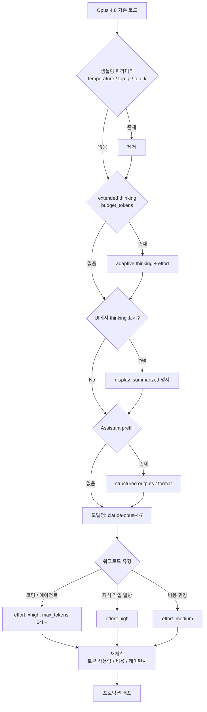

> 이 시리즈는 Claude Opus 4.7을 실제 서비스에 얹으면서 마주치는 문제들을 중심으로 정리한다. 첫 글은 릴리즈 요약과 마이그레이션 함정이다.

Claude Opus 4.7이 `2026년 4월 16일` 정식 출시됐다.

Anthropic은 이 모델을 **"현재 일반 공개된 Claude 중 가장 강한 모델"** 이라고 소개했고, 가격은 Opus 4.6과 똑같이 **입력 1M토큰당 $5 / 출력 1M토큰당 $25** 로 유지했다. 컨텍스트는 **1M 토큰**, 최대 출력은 **128k 토큰**이다. 즉 "가격은 그대로, 성능은 올림"이라는 포지션이다.

그런데 이번 릴리즈에서 정작 중요한 건 벤치 숫자가 아니다. **Opus 4.6용 코드를 모델명만 바꿔 배포하면 그대로 깨질 수 있다.** 샘플링 파라미터, extended thinking budget, thinking content 기본값이 모두 바뀌었기 때문이다. 이 글은 그래서 "Opus 4.7이 뭐가 새로운가"보다 "옮기면서 어디서 터지는가"에 초점을 맞췄다.

먼저 릴리즈 자체를 한 줄로 요약하면 이렇다.

> **가격 동결 + 토크나이저/행동/API가 전부 갈린 조용한 메이저 업그레이드.**

---

## 1. 이번 릴리즈에서 바로 눈에 띄는 세 가지

### 1-1. `xhigh` effort 추가 — 코딩/에이전트 전용 레벨

`effort`는 원래 Sonnet 4.6 때부터 "Claude에게 얼마나 생각시킬지"를 조절하는 파라미터였다. Opus 4.7부터는 기존 `low / medium / high / max` 위에 **`xhigh`** 라는 레벨이 새로 생겼다.

공식 문서의 톤은 꽤 명확하다. **코딩·에이전트 작업이면 기본값을 `xhigh`로 시작하라.** 일반적인 지식 작업 중 "지능이 중요한" 워크로드는 **최소 `high`** 가 권장이다. `max`는 여전히 존재하지만, 오히려 "오버싱킹" 위험이 있다고 문서가 직접 경고한다. 즉 `max`가 무조건 위가 아니라, 현실적인 상단은 `xhigh`라고 보는 게 맞다.

정리하면 2026년 4월 기준 effort 레벨의 감각은 다음과 같다.

| effort | 적합 워크로드 |
|---|---|
| `low` | 짧고 범위가 명확한 작업, 레이턴시 민감한 경량 호출 |
| `medium` | 비용 민감, 토큰 줄이고 지능을 살짝 희생 |
| `high` | 지능이 중요한 대부분 케이스의 **최소 권장선** |
| `xhigh` *(신규)* | **코딩·에이전트 작업 기본값** |
| `max` | 지능이 진짜 중요한 작업에서 테스트용. 과잉사고 리스크 있음 |

Opus 4.7에서 effort가 이전보다 훨씬 중요해졌다는 게 핵심이다. Anthropic도 "이전 어떤 Opus보다도 effort의 영향이 크다"고 못 박았다.

### 1-2. 고해상도 이미지 입력

Opus 4.7은 Claude 계열 중 **처음으로 고해상도 이미지를 네이티브로 받는 모델**이다. 이미지 장변 한도가 `1568px → 2576px`, 픽셀 수 기준으로는 `1.15MP → 3.75MP`로 올라갔다.

눈에 띄는 변화는 두 가지다.

- **좌표가 이미지 픽셀과 1:1로 맞는다.** 이전에는 모델이 뱉는 bbox/포인트를 실제 픽셀로 다시 스케일링해야 했는데, 이제 그 보정이 필요 없다. computer use, 스크린샷 분석, 문서 인식 쪽에 실질적인 정확도 개선이 기대된다.
- **대신 이미지 토큰이 최대 약 3배까지 늘 수 있다.** 풀해상도 이미지 한 장이 이전에는 1,600토큰 수준이었다면 Opus 4.7에서는 최대 4,784토큰까지 쓴다. 비전 워크로드는 비용·`max_tokens` 헤드룸을 반드시 다시 계산해야 한다.

이미지 고정밀 정보가 필요 없는 워크로드라면 클라이언트에서 미리 다운샘플하는 게 현실적인 비용 방어다.

### 1-3. Task budgets (beta)

`task_budget`은 에이전트 워크플로우 전체에 "대략 몇 토큰 안에서 끝내라"는 **가이드**를 주는 파라미터다. `max_tokens`와는 성격이 다르다.

| 구분 | `max_tokens` | `task_budget` |
|---|---|---|
| 성격 | 요청당 하드 캡 | 루프 전체의 권고 예산 |
| 모델 인지 | 모름 | 남은 예산을 실시간으로 인지 |
| 대상 | 생성 토큰 | thinking + 도구 호출 + 도구 결과 + 최종 출력 |
| 동작 | 초과시 잘림 | 초과 근처에서 모델이 스스로 마무리 시도 |

품질 우선의 오픈엔디드 에이전트 작업에는 쓰지 않는 게 낫고, **정해진 예산으로 스스로 페이스 조절을 시켜야 하는 워크로드에만 쓰는 게 맞다.** 최소값은 20k 토큰이며, 베타 헤더는 `task-budgets-2026-03-13`이다.

---

## 2. 빌더가 바로 걸리는 Breaking Change 3종

> 이 섹션은 Messages API 기준이다. Claude Managed Agents를 쓴다면 모델명만 바꿔도 된다.

### 2-1. Extended thinking budget은 이제 `400`

Opus 4.6까지 쓰던 이 형태는 Opus 4.7에서 **그냥 에러다.**

```python
# ❌ Opus 4.7에서 400 에러
thinking = {"type": "enabled", "budget_tokens": 32000}
```

대체 방식은 `adaptive thinking`과 `effort`의 조합이다.

```python
# ✅ Opus 4.7 기본형
thinking = {"type": "adaptive"}
output_config = {"effort": "high"}  # 또는 "xhigh", "max", "medium", "low"
```

한 가지 유의할 점. **Opus 4.7에서 adaptive thinking은 기본값이 OFF다.** `thinking` 필드를 안 넘기면 thinking 없이 돈다. 켜고 싶으면 `{"type": "adaptive"}`를 **명시적으로** 넣어야 한다. 이건 Opus 4.6 동작과 정렬되는 부분이다.

### 2-2. Sampling parameter는 비기본값이면 `400`

`temperature`, `top_p`, `top_k`를 **기본값 외의 값**으로 넣으면 역시 에러다. 즉 이런 코드는 이제 안 된다.

```python
# ❌ Opus 4.7에서 400 에러
response = client.messages.create(
    model="claude-opus-4-7",
    temperature=0.7,
    top_p=0.9,
    ...
)
```

마이그레이션은 단순하다. **아예 지워라.** Opus 4.7은 프롬프팅으로 행동을 유도하는 모델이다. `temperature=0`으로 결정성을 잡던 팁도 더 이상 통하지 않는다. 원래부터 완전한 결정성을 보장하지는 않았지만, 이제는 아예 지정 자체가 막혔다.

### 2-3. Thinking content가 응답에서 빠진다 (기본값)

이건 **silent change**라서 더 까다롭다. 에러도 안 나고, 응답 스트림에 thinking 블록은 여전히 나오는데, 그 안의 `thinking` 필드가 **비어있다.**

UI에서 추론 과정을 사용자에게 실시간으로 보여주던 제품이라면, 업그레이드 직후 **"모델이 한참 말이 없다가 갑자기 답을 토해내는"** 증상으로 보인다. 복구하려면 한 줄 추가하면 된다.

```python
thinking = {
    "type": "adaptive",
    "display": "summarized",  # 기본값은 "omitted"
}
```

Opus 4.6에서는 summarized가 기본이었기 때문에, **체감상 가장 놓치기 쉬운 회귀 지점**이다.

### 참고 — 이전에 정리된 Prefill 제거

Opus 4.6부터 이어진 변경인데, 혹시 더 낮은 버전에서 건너뛰는 경우라면 이것도 이슈다. Assistant 메시지 prefill은 400이다. 대체 패턴은 세 가지다.

- 포맷 강제: **structured outputs** 또는 `output_config.format`
- "Here is..." 같은 서두 제거: 시스템 프롬프트에 명시적으로 금지 지시
- 긴 대화 맥락 유지: prefill 대신 user turn에 주입

---

## 3. 마이그레이션 기본형

Opus 4.6 → 4.7은 거의 항상 이 형태로 정리된다.

```python
# ❌ Before (Opus 4.6)
response = client.messages.create(
    model="claude-opus-4-6",
    max_tokens=64000,
    thinking={"type": "enabled", "budget_tokens": 32000},
    temperature=0.7,  # 비기본값
    messages=[{"role": "user", "content": "..."}],
)

# ✅ After (Opus 4.7)
response = client.messages.create(
    model="claude-opus-4-7",
    max_tokens=64000,                          # xhigh/max 쓰면 더 키우는 게 안전
    thinking={"type": "adaptive"},             # 필요할 때만
    output_config={"effort": "xhigh"},         # 코딩/에이전트 기본값
    messages=[{"role": "user", "content": "..."}],
)
```

Claude Code를 쓰고 있다면 자동화 경로도 있다. Anthropic은 Claude API skill을 통해 코드베이스 자동 변환을 지원한다.

```
/claude-api migrate this project to claude-opus-4-7
```

이 명령은 모델 ID 교체, sampling 파라미터 제거, thinking 포맷 교체, prefill 제거, effort 보정을 스코프 확인 후 적용하고, 수동 검증 체크리스트까지 뽑아준다. 레거시 프로젝트가 많은 조직이라면 수작업보다 이 쪽이 실수가 적다.

전체 흐름을 다이어그램으로 보면 이렇다.



---

## 4. 비용 감각을 다시 잡아야 한다 — 새 tokenizer

Opus 4.7은 **토크나이저 자체가 바뀌었다.** 그래서 같은 텍스트가 이전보다 **1.0x ~ 1.35x 토큰**, 즉 최대 35%까지 더 쓰일 수 있다. 컨텍스트 윈도우는 1M 그대로지만 그 안에 실제로 담기는 양이 달라진다는 뜻이다.

실무 관점에서 영향받는 지점은 크게 네 군데다.

- **`max_tokens` 헤드룸**: 같은 답변이라도 더 많은 토큰을 쓸 수 있으니, compaction/컷오프 여유를 키워둬야 한다. 특히 `xhigh`·`max` effort에서는 최소 64k부터 시작하는 게 공식 권장이다.
- **클라이언트 토큰 추정 로직**: "글자수 × 고정 비율"로 토큰을 추정하던 코드는 전부 재검증 대상이다. 공식 엔드포인트 `/v1/messages/count_tokens`로 다시 측정해야 한다.
- **비용 예측 모델**: 가격은 동결이어도, 같은 워크로드가 더 많은 토큰을 쓰면 총 비용은 올라간다. 조직의 내부 단가표와 예산 경고 로직을 다시 계산해야 한다.
- **이미지 비용**: 앞서 본 대로 풀해상도 기준 이미지 토큰이 최대 약 3배. 이미지 중심 워크로드는 별도 트랙으로 재측정이 필요하다.

정리하면, **"가격은 그대로"라는 카피는 단가에 대한 말이지, 청구서 총액에 대한 말이 아니다.** 헤드룸과 예산 로직을 다시 계산하지 않은 상태로 배포하면 청구서가 예상보다 올라가 있을 확률이 꽤 있다.

---

## 5. 가장 놓치기 쉬운 것 — 행동 변화

API는 그대로 통과하는데, 모델이 "예전같이 안 움직이는" 체감이 가장 많이 나는 구간이다. 이건 breaking change로 분류되지 않아서 조용히 지나가기 쉽다.

요약하면 **Opus 4.7은 더 literal하고, 더 직접적이고, 기본적으로 덜 움직인다.** 구체적으로는 다음과 같다.

- **응답 길이가 작업 복잡도에 맞춰 자동 조정된다.** 단순 조회는 짧아지고, 오픈엔디드 분석은 길어진다. "항상 간결하게" 같은 글로벌 톤 지시가 덜 먹힌다.
- **지시를 더 문자 그대로 읽는다.** 특히 낮은 effort에서는 한 예시를 보고 다른 항목까지 일반화해주지 않는다. 하지 않은 요청을 추론해주지도 않는다. 구조화 추출·파이프라인처럼 **예측 가능성**이 중요한 용도에는 오히려 유리한 방향이다.
- **기본적으로 도구를 덜 쓰고, 추론을 더 쓴다.** "왜 MCP가 안 불리지?" 싶을 때 프롬프트를 고치기 전에 먼저 `effort`부터 봐야 한다. `high`/`xhigh`로 올리면 도구 사용량이 뚜렷하게 늘어난다.
- **서브에이전트도 기본적으로 덜 뿌린다.** 멀티 에이전트 설계에서 원하는 수준의 분기·위임을 확보하려면 명시적으로 프롬프트에 지침이 들어가야 한다.
- **긴 에이전트 실행 중 진행 상황 업데이트는 오히려 정기적으로 나온다.** "3번 툴 호출마다 요약해줘" 같은 수작업 scaffolding은 제거하고 재측정해보는 게 낫다.
- **효력 계층이 더 엄격해졌다.** `low`·`medium`에서는 "요청한 만큼만" 일한다. 복잡한 문제를 `low`로 돌리면 얕게 끝날 리스크가 있다. 레이턴시 때문에 `low`를 유지해야 한다면 프롬프트에 "이 작업은 다단계 추론이 필요하다. 응답 전에 문제를 신중히 생각하라" 같은 지시를 명시하는 게 권장이다.
- **톤 자체가 달라졌다.** Opus 4.6보다 더 직접적이고 의견이 분명한 편이며, 과한 공감 표현이나 이모지가 줄었다. 브랜드 보이스가 특정 톤에 묶여 있는 제품은 스타일 프롬프트를 다시 검수해야 한다.
- **실시간 사이버 보안 세이프가드가 새로 들어왔다.** 고위험 보안 주제는 거절될 수 있다. 정당한 침투 테스트·취약점 연구·레드팀 업무는 Cyber Verification Program을 통해 완화된 접근권을 신청할 수 있다.

결론적으로 **Opus 4.6 시절의 "느슨한 지시 + 기본값 의존" 스타일이 가장 많이 깨진다.** 마이그레이션 과정에서는 프롬프트와 하네스를 한 번 더 훑어보는 게 거의 항상 본전을 뽑는다.

---

## 6. 마무리 — 이 릴리즈를 한 장으로

Opus 4.7은 **"숫자 올린 모델"이 아니라 "계약을 바꾼 모델"에 가깝다.** 벤치마크 카드보다 중요한 건 이런 것들이다.

- 가격은 그대로지만 **토크나이저가 바뀌어서 같은 워크로드의 실제 토큰·청구액은 달라진다.**
- extended thinking budget·샘플링 파라미터는 **그냥 쓰면 400이 난다.**
- thinking 표시의 기본값이 바뀌었고, **UI가 조용히 회귀할 수 있다.**
- `xhigh` effort가 코딩·에이전트의 새 기본값이고, `effort` 자체가 **이전보다 훨씬 큰 레버**다.
- 모델이 더 literal하고 더 적게 움직이기 때문에, **행동은 프롬프트보다 `effort`로 먼저 튜닝**하는 게 맞다.

"Opus 4.6 코드를 모델명만 4.7로 바꿔 배포"는 안전해 보이지만, 위 다섯 줄 중 하나만 걸려도 프로덕션이 미묘하게 고장난다. 개인적으로는 아래 순서가 실무 기준 가장 적게 다치는 경로라고 본다.

1. 스테이징에서 `/claude-api migrate` 또는 수동으로 breaking change 세 가지 우선 교체
2. `effort`를 `xhigh`(에이전트·코딩) 또는 `high`(지식 작업)로 명시
3. 토큰 사용량·레이턴시·비용 **재측정**
4. 응답 길이·톤·도구 호출 횟수 **재측정**
5. 그 다음에 프롬프트 재튜닝

다음 글에서는 이 중 `effort`와 `task_budget`을 실제 에이전트 루프에 얹어본 결과와, `xhigh`가 `max` 대비 어디서 이득/손해를 보는지를 더 파보려고 한다.

---

## 참고

- [What's new in Claude Opus 4.7 (공식)](https://platform.claude.com/docs/en/about-claude/models/whats-new-claude-4-7)
- [Migration guide (공식)](https://platform.claude.com/docs/en/about-claude/models/migration-guide)
- [Models overview](https://platform.claude.com/docs/en/about-claude/models/overview)
- [Release notes](https://platform.claude.com/docs/en/release-notes/overview)
- [Adaptive thinking](https://platform.claude.com/docs/en/build-with-claude/adaptive-thinking)
- [Effort parameter](https://platform.claude.com/docs/en/build-with-claude/effort)
- [Task budgets (beta)](https://platform.claude.com/docs/en/build-with-claude/task-budgets)

---

*작성일: 2026-04-17*
