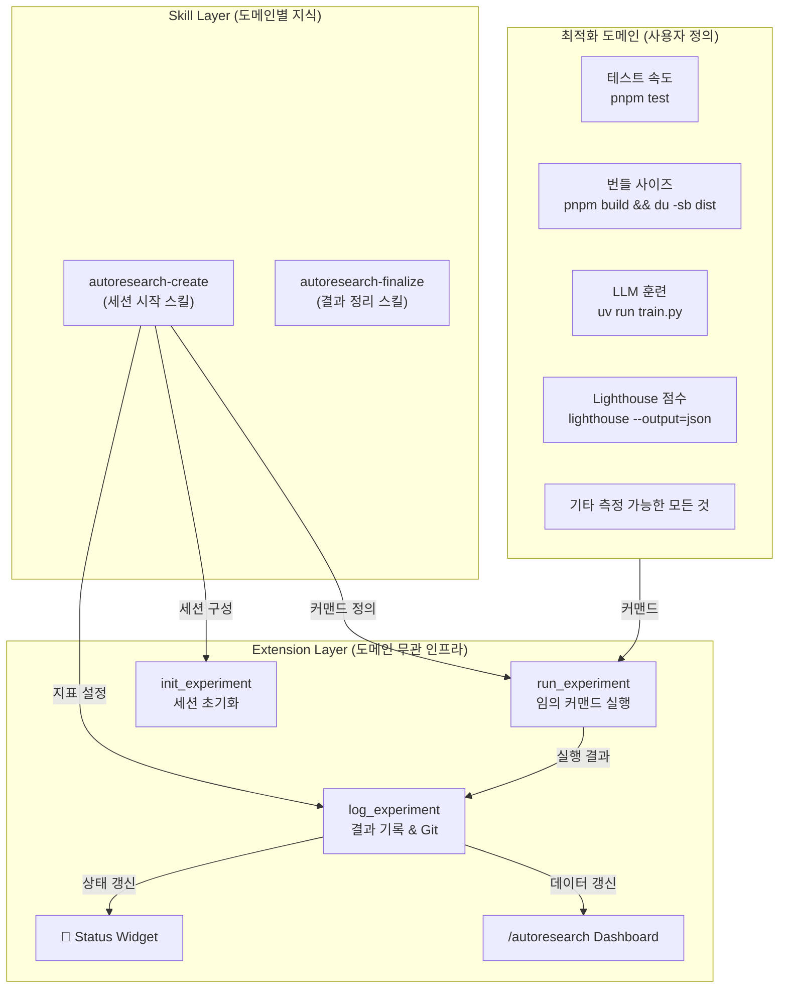
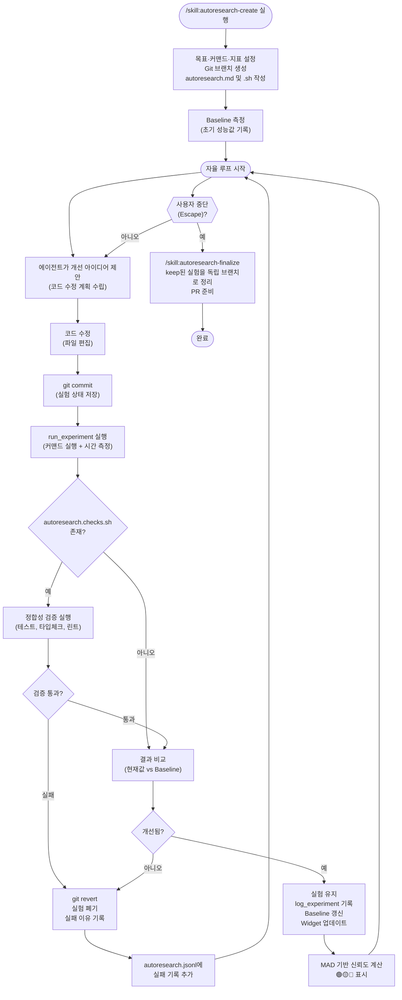
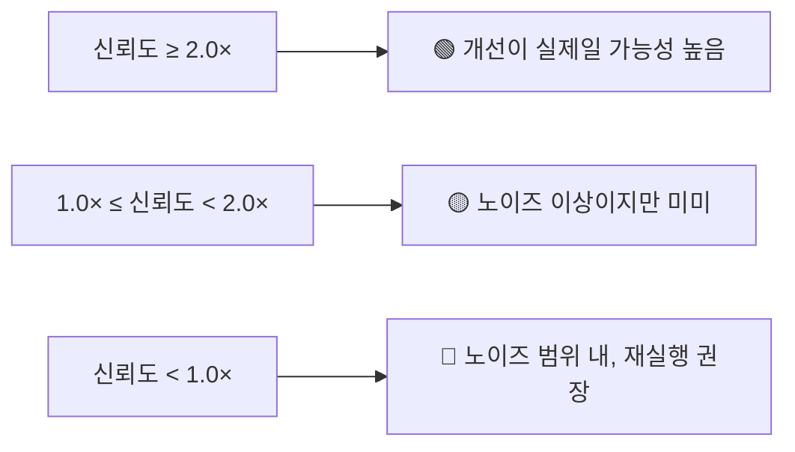
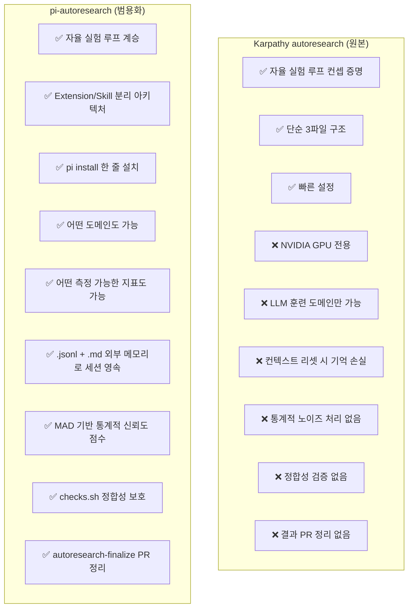

### Karpathy의 "AI 자율 실험" 아이디어를 범용화한 오픈소스

> **"아이디어를 시도하고 → 측정하고 → 개선되면 유지, 아니면 버리고 → 영원히 반복한다."**

- **저장소**: [github.com/davebcn87/pi-autoresearch](https://github.com/davebcn87/pi-autoresearch)
- **GeekNews 원문**: [news.hada.io/topic?id=28600](https://news.hada.io/topic?id=28600)
- **작성일**: 2026-04-17

---

## 목차

1. [배경: 왜 이 프로젝트가 등장했는가](#1-배경-왜-이-프로젝트가-등장했는가)
2. [Karpathy의 autoresearch란 무엇인가](#2-karpathy의-autoresearch란-무엇인가)
3. [pi 에이전트란 무엇인가](#3-pi-에이전트란-무엇인가)
4. [pi-autoresearch 소개](#4-pi-autoresearch-소개)
5. [핵심 구성요소 상세 분석](#5-핵심-구성요소-상세-분석)
6. [아키텍처 심층 분석](#6-아키텍처-심층-분석)
7. [자율 실험 루프 동작 원리](#7-자율-실험-루프-동작-원리)
8. [통계적 신뢰도 시스템](#8-통계적-신뢰도-시스템)
9. [세션 영속성 메커니즘](#9-세션-영속성-메커니즘)
10. [실전 사용 사례 및 도메인 예시](#10-실전-사용-사례-및-도메인-예시)
11. [설치 및 사용 방법](#11-설치-및-사용-방법)
12. [비용 및 운영 제어](#12-비용-및-운영-제어)
13. [Karpathy autoresearch와의 비교](#13-karpathy-autoresearch와의-비교)
14. [생태계 현황 및 커뮤니티 반응](#14-생태계-현황-및-커뮤니티-반응)
15. [기술적 한계와 과제](#15-기술적-한계와-과제)
16. [의의와 전망](#16-의의와-전망)

---

## 1. 배경: 왜 이 프로젝트가 등장했는가

소프트웨어 엔지니어링에서 성능 최적화는 반복적이고 지루한 작업이다. 개발자는 코드를 수정하고, 빌드하고, 테스트하고, 결과를 측정하고, 다시 수정하는 과정을 수십, 수백 번 반복한다. 이 과정 대부분은 규칙적인 패턴을 가지며, 사람이 직접 개입하지 않아도 자동화할 수 있는 작업들이다.

2026년 3월, AI 연구자 Andrej Karpathy가 바로 이 문제를 정면으로 겨냥한 오픈소스 프로젝트 `autoresearch`를 공개했다. "인간 연구자 없이 AI 에이전트가 혼자서 실험을 설계하고, 코드를 수정하고, 결과를 평가하고, 더 나은 방향으로 반복 진화하는" 시스템이었다. 이 컨셉은 불과 며칠 만에 GitHub에서 21,000개 이상의 스타를 받으며 AI 개발 커뮤니티에 큰 반향을 일으켰다.

그런데 Karpathy의 원본 `autoresearch`에는 분명한 한계가 있었다. 단일 NVIDIA GPU 전용이고, LLM 훈련이라는 단 하나의 도메인에만 적용 가능했다. 웹 프론트엔드 개발자, 백엔드 서비스 최적화 엔지니어, 빌드 파이프라인 담당자 등 GPU와 무관한 대부분의 소프트웨어 개발자는 이 도구를 그대로 활용할 수 없었다.

이 문제의식에서 출발한 것이 바로 `pi-autoresearch`다. David Cortés(davebcn87)가 개발한 이 프로젝트는 Karpathy의 핵심 컨셉—자율 루프, 결과 측정, 좋으면 유지 나쁘면 버리기—을 그대로 가져오면서, 이를 **어떤 소프트웨어 최적화 문제에도** 적용할 수 있는 범용 플랫폼으로 재설계했다.

---

## 2. Karpathy의 autoresearch란 무엇인가

### 핵심 아이디어

Andrej Karpathy는 전 Tesla AI 디렉터이자 OpenAI 공동 창립자로, "vibe coding"이라는 용어를 처음 만든 것으로도 유명하다. 그는 2026년 2월, "agentic engineering(에이전틱 엔지니어링)"이라는 개념을 제안했다: *"당신은 99%의 시간 동안 코드를 직접 작성하지 않는다. 당신은 에이전트를 조율하고, 그 에이전트들이 작업을 수행하며, 인간은 감독자 역할을 한다."*

`autoresearch`는 이 개념에서 한 발 더 나아간다. 인간이 에이전트를 실시간으로 조율조차 하지 않는다. 인간은 단지 **방향만 제시하고 자리를 떠난다**. 에이전트가 알아서 연구를 진행한다.

### 3파일 구조의 단순함

`autoresearch`의 설계는 극도로 미니멀하다. 전체 시스템이 단 세 개의 파일로 구성된다:

| 파일 | 역할 | 수정 가능 여부 |
|------|------|----------------|
| `prepare.py` | 데이터 준비 + 런타임 유틸리티 | 수정 불가 (고정) |
| `train.py` | 모델, 옵티마이저, 훈련 루프 | 에이전트가 수정 |
| `program.md` | 에이전트에게 주는 지시서 | 인간이 작성 |

에이전트는 오직 `train.py` 하나만 건드린다. 이 제약은 의도적이다. 수정 범위를 좁힘으로써 각 실험 간 변수를 통제하고, 에이전트의 변경사항을 쉽게 추적·롤백할 수 있게 한다.

### 실험 루프의 구조

```
[train.py 수정]
      ↓
[5분 훈련 실행] ← 항상 정확히 5분 (고정 타임 버짓)
      ↓
[validation loss 측정]
      ↓
개선됨? → [keep: git commit]
개선 안됨? → [discard: git revert]
      ↓
[반복]
```

5분이라는 고정 훈련 시간은 중요한 설계 결정이다. 모델 크기, 배치 사이즈, 아키텍처가 달라져도 실험 결과를 직접 비교할 수 있게 된다. 시간당 약 12회, 하룻밤이면 약 100회의 실험이 가능하다.

### 실제 성과와 파급력

Karpathy 본인의 실험 결과는 놀라웠다. 2일간 약 700번의 자율 변경 끝에 약 20개의 점진적 개선사항을 발견했고, 이를 누적 적용한 결과 "Time to GPT-2" 리더보드 지표가 2.02시간에서 1.80시간으로 약 **11% 향상**되었다. Karpathy는 *"이미 잘 튜닝되었다고 생각했던 코드베이스에서 에이전트가 어텐션 스케일링과 정규화의 결함을 발견했다"* 고 밝혔다.

Shopify CEO Tobias Lütke(공교롭게도 pi-autoresearch의 기여자 중 한 명)는 이를 내부 쿼리 확장 모델에 적용해 하룻밤 만에 37번의 실험으로 **19% 성능 향상**을 달성했다.

Fortune은 이 실험을 "The Karpathy Loop"라고 명명하며, *"AI가 자신의 개선 방향을 스스로 탐색하는 시대"*의 서막으로 평가했다.

---

## 3. pi 에이전트란 무엇인가

`pi-autoresearch`를 이해하려면 먼저 그것이 구축된 기반인 **pi 에이전트**를 알아야 한다.

### pi의 핵심 철학

pi는 Mario Zechner(badlogic)가 만든 터미널 기반 AI 코딩 에이전트다. Cursor나 Windsurf, Claude Code 같은 IDE 기반 또는 클라우드 기반 도구와 근본적으로 다른 철학을 가진다:

> *"pi는 공격적으로 확장 가능하게 설계되어, 워크플로우를 pi에 맞추는 것이 아니라 pi를 당신의 워크플로우에 맞출 수 있다."*

즉, 기능을 플랫폼 안에 내장하는 것이 아니라, 사용자가 필요한 기능을 플러그인처럼 추가하는 방식이다.

### 두 가지 핵심 확장 메커니즘

#### Extension (확장)

Extension은 에이전트에게 **새로운 도구(Tool)**를 추가한다. TypeScript로 작성하며, 파일 읽기/쓰기, 커맨드 실행 같은 기본 도구 외에 완전히 새로운 능력을 플러그인처럼 추가할 수 있다. Extension은 또한 UI 위젯, 대시보드, 슬래시 커맨드 등 인터페이스 요소도 추가할 수 있다.

#### Skill (스킬)

Skill은 에이전트에게 **워크플로우 패턴**을 가르친다. "이런 상황에서는 이런 순서로 이 도구들을 사용하라"는 절차적 지식을 정의한다. 마크다운 파일 형태로 작성되며, `/skill:스킬명` 커맨드로 호출된다.

### 설치와 공유의 단순함

```bash
pi install https://github.com/사용자/패키지
```

이 한 줄로 커뮤니티가 만든 어떤 Extension/Skill 패키지도 설치할 수 있다. npm을 통한 배포도 지원한다. pi-autoresearch는 바로 이 시스템 위에 만들어진 Extension+Skill 복합 패키지다.

---

## 4. pi-autoresearch 소개

### 프로젝트 정체

pi-autoresearch는 `pi` 에이전트의 확장 패키지로, Karpathy의 자율 실험 컨셉을 **LLM 훈련이 아닌 어떤 소프트웨어 최적화 문제에도** 적용할 수 있도록 일반화한 시스템이다. 개발자는 David Cortés이며, Shopify CEO Tobias Lütke도 기여자 목록에 이름을 올리고 있다(GitHub Stars 41개, Forks 1개 기준, 2026년 4월 현재).

### 한 줄로 설명한다면

> **"측정 가능한 모든 소프트웨어 품질 지표를 밤새 AI 에이전트가 자율로 개선하고, 아침에 리뷰 가능한 PR로 정리해 놓는 시스템"**

---

## 5. 핵심 구성요소 상세 분석

pi-autoresearch는 크게 두 개의 레이어로 구성된다.

### Extension 레이어 (도메인 무관 인프라)

Extension은 어떤 최적화 도메인에서도 공통으로 사용할 수 있는 인프라 계층이다.

#### 세 가지 핵심 도구(Tool)

| 도구 | 역할 | 세부 동작 |
|------|------|-----------|
| `init_experiment` | 세션 초기화 | 실험 이름, 측정 지표, 단위, 방향(최소화/최대화) 설정 |
| `run_experiment` | 실험 실행 | 임의 커맨드 실행, 벽시계 시간 측정, 출력 캡처 |
| `log_experiment` | 결과 기록 | 결과 저장, 자동 git commit, UI 위젯 및 대시보드 갱신 |

#### UI 구성요소

pi-autoresearch는 실험이 진행되는 동안 두 가지 UI 요소를 터미널에 상시 표시한다:

- **상태 위젯**: 에디터 상단에 항상 표시. `🔬 autoresearch 12 runs 8 kept │ best: 42.3s` 형태로 현재 실험 진행 상황을 실시간으로 보여준다.
- **대시보드(`/autoresearch`)**: `Ctrl+X`로 토글, `Escape`로 닫는 전체 결과 테이블. 모든 실험의 지표, 상태, 최고 기록을 한눈에 볼 수 있다.

### Skill 레이어 (도메인별 지식)

`autoresearch-create` 스킬은 새 실험 세션을 시작할 때 사용한다. 에이전트가 몇 가지 질문을 하거나(혹은 컨텍스트에서 자동 추론하여) 다음 항목을 파악한다:

- **목표**: 무엇을 최적화할 것인가
- **커맨드**: 어떤 명령어로 측정할 것인가
- **지표**: 어떤 수치를 기준으로 삼을 것인가
- **범위**: 어떤 파일들을 수정 대상으로 할 것인가

그런 다음 두 개의 핵심 파일을 생성하고 즉시 루프를 시작한다.

---

## 6. 아키텍처 심층 분석

### Extension과 Skill의 분리 원칙



이 분리 구조가 pi-autoresearch의 범용성을 가능하게 한다. Extension은 실험의 "어떻게"를 담당하고, Skill은 실험의 "무엇을"을 담당한다. Skill만 바꾸면 완전히 다른 도메인에 동일한 자율 루프 인프라를 재사용할 수 있다.

### 파일 시스템 구조

```
프로젝트 루트/
├── autoresearch.md         # 세션 문서 (목표, 시도한 것, 막다른 길, 핵심 성과)
├── autoresearch.sh         # 벤치마크 스크립트
│                           # (사전 검증 → 워크로드 실행 → METRIC 출력)
├── autoresearch.jsonl      # 모든 실험의 append-only 로그
│                           # (지표, 상태, 커밋 해시, 설명)
└── autoresearch.checks.sh  # (선택적) 정합성 검증 스크립트
                            # (테스트, 타입체크, 린트 등)
```

`autoresearch.sh`는 표준화된 출력 형식을 사용한다:

```bash
#!/bin/bash
# 사전 검증
npm run lint || exit 1

# 실제 워크로드 실행
pnpm test 2>&1

# 표준 METRIC 포맷으로 출력
echo "METRIC duration_seconds=42.3"
```

Extension의 `run_experiment` 도구는 이 `METRIC name=number` 형식을 파싱하여 결과를 기록한다.

---

## 7. 자율 실험 루프 동작 원리

### 전체 워크플로우



### 단계별 상세 설명

#### 1단계: 세션 초기화

사용자가 `/skill:autoresearch-create`를 실행하면, 에이전트는 다음을 묻거나 추론한다:
- "무엇을 최적화하고 싶은가?" (예: 유닛 테스트 실행 시간)
- "어떤 커맨드로 측정할 것인가?" (예: `pnpm test`)
- "개선인지 어떻게 판단할 것인가?" (예: seconds 낮을수록 좋음)
- "어떤 파일들을 수정 대상으로 볼 것인가?" (예: vitest 설정 파일들)

그리고 새 Git 브랜치를 만들고, `autoresearch.md`, `autoresearch.sh`를 작성한 후 베이스라인을 측정하고 루프를 즉시 시작한다.

#### 2단계: 자율 루프

이후 에이전트는 완전 자율로 다음을 반복한다:
1. **가설 생성**: 무엇을 수정하면 개선될 것인지 추론
2. **코드 수정**: 실제 파일 편집
3. **Git 커밋**: 실험 상태를 커밋으로 저장
4. **벤치마크 실행**: `run_experiment` 도구 호출
5. **정합성 검증**: `checks.sh`가 있으면 실행
6. **결과 판단**: 개선이면 keep, 아니면 revert
7. **기록**: `autoresearch.jsonl`에 결과 추가, 위젯 갱신

#### 3단계: 결과 정리

사용자가 언제든 `Escape`로 루프를 중단하고, `/skill:autoresearch-finalize`를 실행하면 에이전트는 keep된 모든 실험을 논리적 단위로 묶어 독립적인 Git 브랜치로 분리한다. 파일이 겹치지 않도록 보장하므로 각 브랜치를 독립적으로 리뷰하고 머지할 수 있다.

---

## 8. 통계적 신뢰도 시스템

벤치마크는 본질적으로 노이즈를 가진다. 동일한 코드를 두 번 실행해도 CPU 스케줄링, 디스크 I/O, 네트워크 상태 등 환경적 요인으로 결과가 달라진다. pi-autoresearch는 이 문제를 통계적으로 다룬다.

### MAD(Median Absolute Deviation) 기반 신뢰도 점수

3회 이상의 실험 데이터가 쌓이면, 시스템은 자동으로 신뢰도 점수를 계산한다:

```
신뢰도 = (개선 크기) / MAD(최근 결과들)
```

MAD는 이상치에 강건한 분산 측정값이다. 개선의 크기가 통계적 잡음의 몇 배인지를 나타내는 신호대잡음비로 해석할 수 있다.

### 시각적 피드백 체계



주목할 점은 이 시스템이 **자동으로 실험을 버리지 않는다**는 것이다. 최종 판단은 항상 에이전트에게 위임한다. 신뢰도 점수는 에이전트가 "이 개선을 정말 keep해야 하는가, 아니면 더 실험해야 하는가"를 판단하는 데 참고하는 정보다.

---

## 9. 세션 영속성 메커니즘

AI 에이전트의 가장 큰 제약 중 하나는 **컨텍스트 윈도우 한계**다. 장시간 실험 중 컨텍스트가 가득 차면 이전 시도들을 기억하지 못하게 된다. pi-autoresearch는 이를 두 파일의 조합으로 해결한다.

### autoresearch.jsonl — 기계가 읽는 이력

```jsonl
{"run": 1, "metric": 52.3, "status": "keep", "commit": "a1b2c3d", "description": "moved test setup to beforeAll"}
{"run": 2, "metric": 51.8, "status": "keep", "commit": "e4f5g6h", "description": "removed redundant beforeEach cleanup"}
{"run": 3, "metric": 54.1, "status": "discard", "commit": "i7j8k9l", "description": "tried parallel test execution - broke test order"}
{"run": 4, "metric": 49.2, "status": "keep", "commit": "m0n1o2p", "description": "vitest pool set to 'vmForks'"}
```

append-only 로그이므로 데이터가 절대 유실되지 않는다. Git 브랜치별로 독립된 `.jsonl` 파일을 유지하므로 여러 실험 세션을 병렬로 진행할 수도 있다.

### autoresearch.md — 인간과 에이전트가 함께 읽는 지식베이스

```markdown
# Autoresearch Session: Unit Test Runtime Optimization

## Objective
Reduce vitest test suite runtime from 52.3s (baseline) to under 30s

## Current Best: 41.7s (run #8)

## What's Been Tried

### Successful (KEPT)
- moved global setup to beforeAll hooks: -0.5s
- removed redundant afterEach cleanups: -0.5s  
- switched pool to vmForks: -3.1s

### Dead Ends (DISCARDED)
- parallel test execution: breaks test ordering, reverted
- increased worker count: no improvement, slight regression
- mock heavy imports: caused type errors, reverted

## Key Insights
- test isolation is critical; parallelism is risky in this codebase
- pool configuration is the highest-leverage lever
- file I/O in tests is the bottleneck, not CPU
```

이 파일은 "에이전트를 위한 외부 메모리"로 기능한다. 완전히 새로운 에이전트 인스턴스가 투입되어도 이 두 파일만 읽으면 즉시 이전 세션을 이어받을 수 있다.

---

## 10. 실전 사용 사례 및 도메인 예시

pi-autoresearch가 강조하는 핵심 중 하나는 도메인 제한이 없다는 것이다. `METRIC name=number` 형식으로 숫자 하나를 출력할 수 있는 커맨드라면 무엇이든 최적화 타겟이 될 수 있다.

### 공식 제시 예시

| 도메인 | 최적화 방향 | 측정 커맨드 | 지표 |
|--------|------------|-------------|------|
| 테스트 속도 | 낮을수록 좋음 (seconds ↓) | `pnpm test` | 실행 시간 |
| 번들 사이즈 | 낮을수록 좋음 (KB ↓) | `pnpm build && du -sb dist` | 파일 크기 |
| LLM 훈련 | 낮을수록 좋음 (val_bpb ↓) | `uv run train.py` | 검증 손실 |
| 빌드 속도 | 낮을수록 좋음 (seconds ↓) | `pnpm build` | 빌드 시간 |
| Lighthouse 성능 | 높을수록 좋음 (perf score ↑) | `lighthouse http://localhost:3000 --output=json` | 성능 점수 |

### 확장 가능한 추가 도메인

이 아이디어를 적용할 수 있는 다른 도메인들도 충분히 상상할 수 있다:

- **API 응답 시간**: `ab -n 100 http://localhost:3000/api/endpoint`
- **Docker 이미지 크기**: `docker build . && docker images --format "{{.Size}}"` 
- **TypeScript 컴파일 타임**: `time tsc --noEmit`
- **데이터베이스 쿼리 성능**: 특정 쿼리의 실행 계획 cost
- **메모리 사용량**: `node --max-old-space-size=256 --trace-gc app.js`

---

## 11. 설치 및 사용 방법

### 전제 조건

- pi 코딩 에이전트 설치 완료
- Git 저장소로 관리되는 프로젝트

### 설치

**자동 설치 (권장)**:
```bash
pi install https://github.com/davebcn87/pi-autoresearch
```

**수동 설치**:
```bash
cp -r extensions/pi-autoresearch ~/.pi/agent/extensions/
cp -r skills/autoresearch-create ~/.pi/agent/skills/
```

설치 후 pi 내에서 `/reload`를 실행하여 확장을 활성화한다.

### 기본 사용 플로우

```bash
# 1. 실험 세션 시작
/skill:autoresearch-create
# → 에이전트가 목표, 커맨드, 지표에 대해 묻거나 컨텍스트에서 추론
# → autoresearch.md, autoresearch.sh 생성
# → baseline 측정 후 자율 루프 즉시 시작

# 2. 진행 상황 모니터링
# - 터미널 상단 위젯으로 실시간 확인
# - /autoresearch 로 전체 대시보드 열기
# - Ctrl+X 로 대시보드 토글

# 3. 루프 중단 및 결과 정리
# Escape 로 루프 중단 후:
/skill:autoresearch-finalize
# → keep된 실험들을 독립 Git 브랜치로 정리
# → 각 브랜치별 PR 리뷰 가능
```

### 정합성 검증 추가 (선택적)

```bash
# autoresearch.checks.sh 생성
cat > autoresearch.checks.sh << 'EOF'
#!/bin/bash
set -e
pnpm tsc --noEmit    # 타입 체크
pnpm lint            # 린트
pnpm test:unit       # 유닛 테스트 (통합 테스트 제외)
echo "모든 정합성 검증 통과"
EOF
chmod +x autoresearch.checks.sh
```

---

## 12. 비용 및 운영 제어

자율 루프는 API 토큰을 계속 소모한다. pi-autoresearch는 두 가지 가드레일을 제공한다.

### API 키 한도

사용하는 LLM 제공사(Anthropic, OpenAI 등)의 API 키에 월별 지출 한도를 설정하는 것이 기본 방어선이다. pi-autoresearch 자체적으로도 API 키 한도 설정을 권장한다.

### maxIterations

세션당 최대 실험 횟수를 설정할 수 있다. 예산과 원하는 실험 깊이에 따라 조정한다.

```
# autoresearch.md에 명시
maxIterations: 50  # 최대 50번 실험 후 자동 종료
```

### 비용 추정

실험 1회당 LLM API 비용은 코드 복잡도와 모델에 따라 다르지만, Claude Sonnet 기준으로 대략 수 센트 수준이다. 50회 실험이면 약 1~2달러 이내로 예상할 수 있다.

---

## 13. Karpathy autoresearch와의 비교



### 핵심 차별점 요약

| 항목 | Karpathy autoresearch | pi-autoresearch |
|------|----------------------|-----------------|
| 적용 도메인 | LLM 훈련 전용 | 모든 측정 가능 도메인 |
| 하드웨어 의존성 | NVIDIA GPU 필수 | 없음 |
| 세션 영속성 | 없음 | jsonl + md |
| 통계 신뢰도 | 없음 | MAD 기반 |
| 정합성 보호 | 없음 | checks.sh |
| Git 통합 | 기본 | 전체 워크플로우 |
| PR 정리 | 없음 | finalize 스킬 |
| UI | 없음 | 위젯 + 대시보드 |
| 설치 방법 | 수동 설정 | `pi install` 한 줄 |

---

## 14. 생태계 현황 및 커뮤니티 반응

### pi 에이전트 생태계

2026년 초 기준, pi 에이전트는 Claude Code의 유력한 대안으로 부상하고 있다. 여러 개발자들이 pi의 Extension 시스템을 활용한 커스텀 워크플로우를 공개하고 있으며, pi-autoresearch가 그 중에서 가장 주목받는 패키지 중 하나다.

특히 주목할 점은 기여자 목록에 Tobias Lütke(Shopify CEO)가 포함되어 있다는 것이다. Karpathy의 autoresearch를 내부 모델에 적용해 19% 성능 향상을 달성했던 바로 그 Lütke가 이 프로젝트에 실제 코드 기여를 했다는 사실은 이 도구의 실전 가치를 보여준다.

### Karpathy autoresearch 원본의 파급력

Karpathy의 autoresearch 원본은 공개 이후 다양한 방향으로 확산되었다:

- **Red Hat OpenShift AI**: Kubernetes 환경에서 autoresearch를 컨테이너화하여 24시간 무인 실험 진행 (198회 실험, 29회 keep, 검증 손실 2.3% 개선)
- **DataCamp**: autoresearch의 동작 원리를 상세 튜토리얼로 정리
- **Fortune, VentureBeat 등 주요 매체**: "The Karpathy Loop"로 명명하며 AI 연구의 미래를 조망하는 심층 기사 게재

Karpathy 본인은 *"모든 LLM 프론티어 랩이 이것을 할 것이다. 이것이 최종 보스 배틀이다(final boss battle)"* 라고 표현했다.

### GeekNews 커뮤니티 반응

GeekNews(news.hada.io)에 게재된 pi-autoresearch 소개 글은 한국 개발자 커뮤니티에서 유의미한 관심을 받고 있다. "밤에 돌려놓고 아침에 PR을 리뷰하는 워크플로우가 현실이 되는 것인지 지켜볼 만하다"는 평가가 대표적이다.

---

## 15. 기술적 한계와 과제

pi-autoresearch가 흥미로운 시스템임은 분명하지만, 현실적인 한계도 존재한다.

### 1. 탐색 공간의 비효율성

현재 시스템은 에이전트가 순차적으로 하나의 아이디어를 시도한다. 병렬로 여러 아이디어를 동시에 탐색하는 능력은 없다. Karpathy가 *"에이전트 군집(swarm)이 협력하여 비동기적으로 대규모 탐색을 해야 한다"* 고 말한 미래 방향과는 아직 거리가 있다.

### 2. 지역 최적해 문제

어떤 최적화 알고리즘이든 지역 최적해(local optimum)에 갇힐 수 있다. 현재 ai-autoresearch는 이 문제에 대한 명시적 대응책이 없다. 에이전트가 점진적 개선을 계속 시도하다 보면 더 큰 리팩토링이 필요한 근본적 문제를 건드리지 못할 수 있다.

### 3. 컨텍스트 비용

장시간 실험은 상당한 LLM 토큰을 소모한다. `maxIterations`로 제어할 수 있지만, 비용 대비 효과를 사전에 예측하기 어렵다.

### 4. 벤치마크 신뢰성

`autoresearch.sh`의 품질이 전체 시스템의 신뢰성을 결정한다. 잘못 설계된 벤치마크—실제로 최적화하고 싶은 것을 제대로 측정하지 못하거나, 환경 의존성이 높거나—는 에이전트를 엉뚱한 방향으로 이끈다.

### 5. 정합성 검증의 한계

`checks.sh`가 있어도, 이것이 실제 비즈니스 로직의 정확성을 완전히 보장하지는 못한다. 테스트 커버리지가 낮은 코드베이스에서는 에이전트가 테스트를 통과하면서 실제로는 동작이 바뀐 코드를 commit할 수 있다.

---

## 16. 의의와 전망

### 소프트웨어 개발 패러다임의 변화

Karpathy는 AI와 인간의 협업 방식이 다음과 같이 진화하고 있다고 설명한다:

```
비브 코딩 → 에이전틱 엔지니어링 → 자율 연구
(인간이 코드 작성) (인간이 에이전트 조율) (인간이 방향만 제시)
```

pi-autoresearch는 세 번째 단계—**자율 연구**—를 소프트웨어 최적화 영역에서 실현하는 도구다. 인간 엔지니어의 역할은 "어떻게 최적화할 것인가"에서 "무엇을 최적화하고 싶은가"로 이동한다.

### 개인 개발자에게 주는 의미

GPU 클러스터나 대규모 팀 없이 혼자 작업하는 개발자에게도 이런 시스템은 실질적 가치를 제공할 수 있다. 밤에 `pnpm test` 최적화 루프를 돌려두고 아침에 결과를 확인하는 워크플로우는, 과거에 팀 단위로만 가능했던 체계적 성능 최적화를 개인 수준에서도 가능하게 만든다.

### 앞으로 지켜볼 방향

- **병렬 에이전트 탐색**: 여러 에이전트가 동시에 다른 방향을 탐색하는 swarm 방식
- **크로스 도메인 학습**: A 프로젝트에서 발견한 최적화 패턴을 B 프로젝트에 자동 적용
- **더 스마트한 탐색 전략**: 단순 순차 탐색을 넘어 베이즈 최적화나 강화학습 기반 탐색
- **엔터프라이즈 적용**: CI/CD 파이프라인에 통합하여 코드 병합 시 자동으로 최적화 루프 실행

pi-autoresearch는 현재 ⭐41개의 작은 프로젝트지만, 그것이 대표하는 아이디어—AI 에이전트가 소프트웨어를 스스로 측정하고 개선하는 자율 루프—는 앞으로 소프트웨어 개발 방식을 근본적으로 바꿀 잠재력을 가지고 있다.

---

## 참고 자료

- [pi-autoresearch GitHub](https://github.com/davebcn87/pi-autoresearch) — 원본 저장소
- [karpathy/autoresearch GitHub](https://github.com/karpathy/autoresearch) — Karpathy 원본
- [GeekNews 소개 글](https://news.hada.io/topic?id=28600)
- [Fortune: The Karpathy Loop](https://fortune.com/2026/03/17/andrej-karpathy-loop-autonomous-ai-agents-future/)
- [VentureBeat: autoresearch 심층 분석](https://venturebeat.com/technology/andrej-karpathys-new-open-source-autoresearch-lets-you-run-hundreds-of-ai)
- [DataCamp: Guide to AutoResearch](https://www.datacamp.com/tutorial/guide-to-autoresearch)
- [Red Hat Developer: OpenShift AI에서 198회 실험](https://developers.redhat.com/articles/2026/04/07/autoresearch-on-red-hat-openshift-ai-198-experiments-zero-intervention)
- [pi-mono GitHub](https://github.com/badlogic/pi-mono) — pi 에이전트 원본 저장소

---

*작성일: 2026-04-17*
