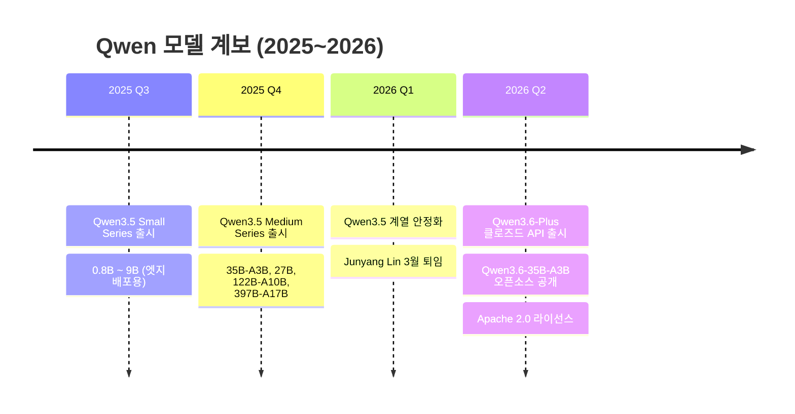
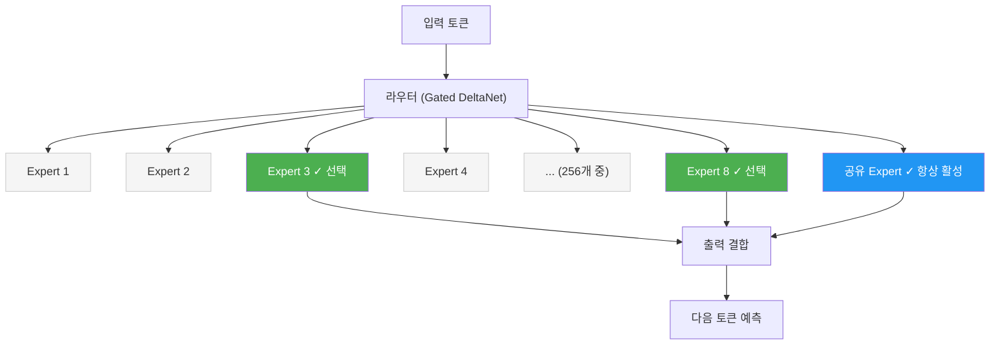
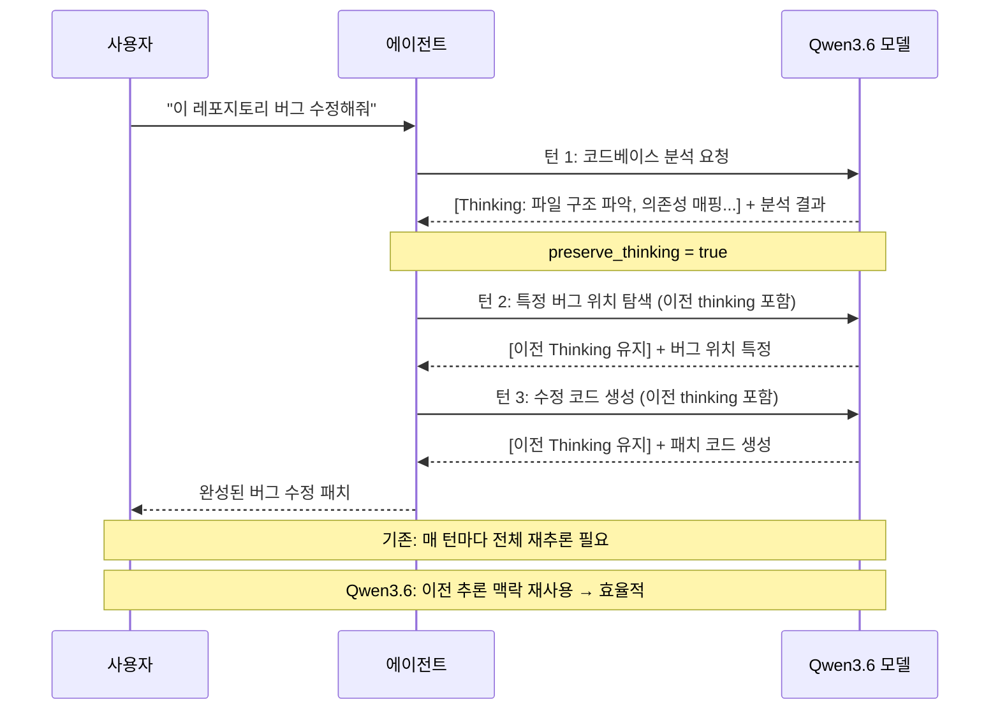
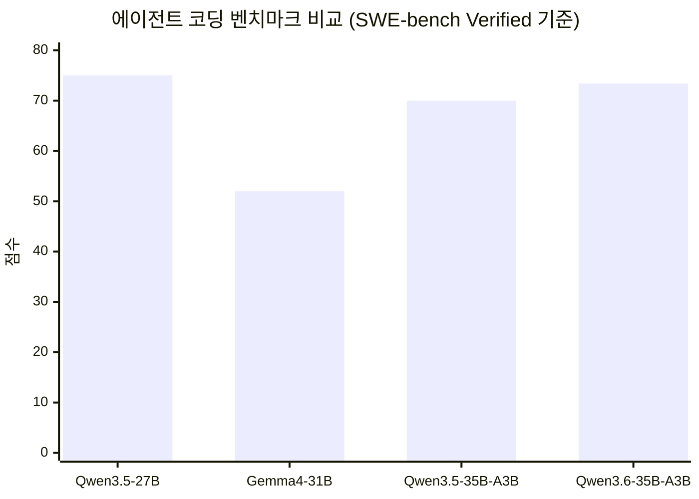
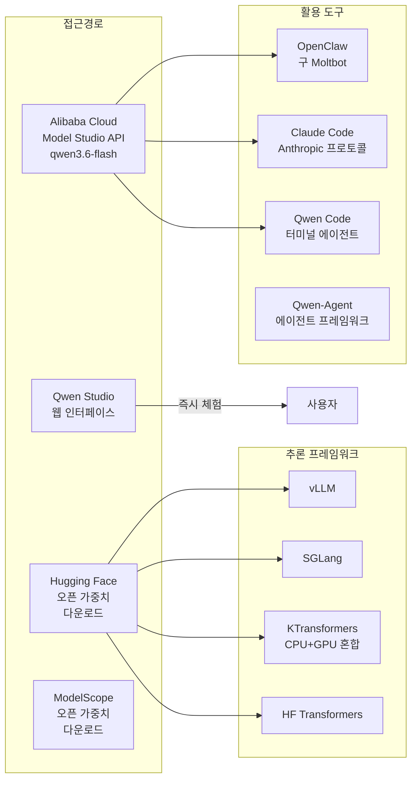
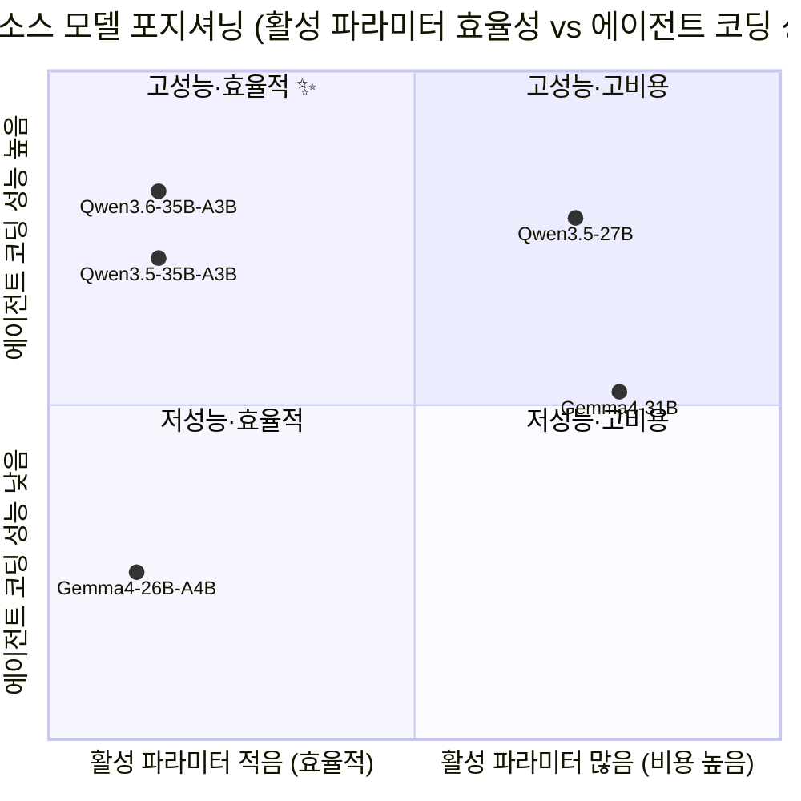
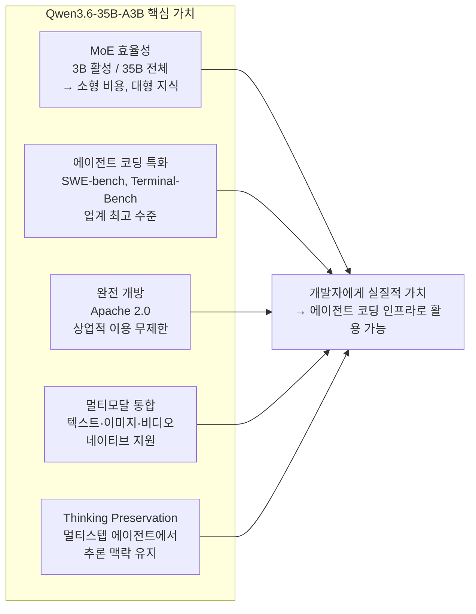

> **알리바바 Qwen 팀의 차세대 오픈소스 에이전트 코딩 모델 완전 해설**
>
> 작성일: 2026-04-17 
>
> 출처: [qwen.ai 공식 블로그](https://qwen.ai/blog?id=qwen3.6-35b-a3b) · [GeekNews](https://news.hada.io/topic?id=28621) · Hugging Face · MarkTechPost

---

## 목차

1. [모델 개요 및 출시 배경](#1-모델-개요-및-출시-배경)
2. [핵심 아키텍처: Sparse MoE 구조](#2-핵심-아키텍처-sparse-moe-구조)
3. [핵심 기능 및 특징](#3-핵심-기능-및-특징)
4. [성능 벤치마크 상세 분석](#4-성능-벤치마크-상세-분석)
5. [비전-언어 멀티모달 성능](#5-비전-언어-멀티모달-성능)
6. [배포 및 접근 방법](#6-배포-및-접근-방법)
7. [코딩 도구 통합 가이드](#7-코딩-도구-통합-가이드)
8. [커뮤니티 반응 및 실사용 사례](#8-커뮤니티-반응-및-실사용-사례)
9. [경쟁 모델 비교 및 포지셔닝](#9-경쟁-모델-비교-및-포지셔닝)
10. [출시 맥락: 팀 변화와 오픈소스 전략](#10-출시-맥락-팀-변화와-오픈소스-전략)
11. [기술적 한계와 유의사항](#11-기술적-한계와-유의사항)
12. [종합 평가 및 전망](#12-종합-평가-및-전망)

---

## 1. 모델 개요 및 출시 배경

2026년 4월 15일, 알리바바(Alibaba)의 Qwen 팀은 **Qwen3.6-35B-A3B**를 공식 출시하였다. 이 모델은 앞서 발표된 클로즈드 API 모델 `Qwen3.6-Plus`에 이어, 오픈소스 커뮤니티를 위해 완전한 가중치(open weights)를 공개한 모델이다.

모델명에서 핵심 정보를 읽을 수 있다. **35B**는 전체 파라미터 수(350억)를, **A3B**는 실제 추론 시 활성화되는 파라미터 수(30억, Active 3B)를 의미한다. 이 차이가 바로 이 모델의 가장 독창적인 특성이다. 총 파라미터는 거대 모델급이지만, 실제로 한 번의 추론에서 작동하는 파라미터는 3B에 불과하다. 즉, 27B나 31B 규모의 밀집(dense) 모델과 겨루면서도 계산 비용은 훨씬 적게 든다는 의미다.

라이선스는 **Apache 2.0**으로 상업적 이용, 수정, 재배포가 모두 자유롭다. Hugging Face, ModelScope에서 가중치를 직접 다운로드하거나, Alibaba Cloud Model Studio API에서 `qwen3.6-flash`라는 이름으로 호출할 수 있으며, Qwen Studio에서 즉시 체험도 가능하다.



---

## 2. 핵심 아키텍처: Sparse MoE 구조

### 2-1. Mixture-of-Experts(MoE)란 무엇인가

일반적인 밀집(dense) 신경망은 입력이 들어올 때 모든 파라미터를 활성화한다. 반면, **Mixture-of-Experts(MoE)** 구조에서는 모델 안에 다수의 "전문가(Expert)" 서브네트워크가 존재하고, 각 토큰마다 라우터(router)가 그 중 일부만 선택하여 활성화한다. 나머지 전문가는 해당 연산에서 완전히 비활성 상태로 남는다.

Qwen3.6-35B-A3B의 경우, 총 **256개의 Expert**가 존재하며 각 토큰당 **8개의 라우팅 Expert + 1개의 공유 Expert**가 활성화된다. 전체 파라미터 350억 중 실제 사용되는 것은 약 30억에 불과하다. 이는 1회 추론당 활성 파라미터 비율이 **약 8.6%** 에 불과함을 의미한다.



### 2-2. 아키텍처 세부 사양

| 항목 | 값 |
|------|-----|
| 전체 파라미터 | 350억 (35B) |
| 활성 파라미터 | 30억 (3B) |
| Expert 수 | 256개 |
| 라우팅 방식 | Gated DeltaNet |
| 기본 컨텍스트 길이 | 262,144 토큰 (262K) |
| 최대 확장 컨텍스트 | ~1,010,000 토큰 (YaRN 적용 시) |
| 라이선스 | Apache 2.0 |
| 모달리티 | 텍스트, 이미지, 비디오, 문서 |

### 2-3. Sparse MoE의 효율성

이 구조의 핵심 장점은 **추론 비용과 모델 역량의 분리**다. 학습 시에는 모든 Expert가 다양한 지식을 습득하지만, 추론 시에는 해당 입력에 가장 적합한 소수의 Expert만 활성화된다. 결과적으로 30억 파라미터 규모의 계산 비용으로 350억 규모의 학습된 지식에 접근할 수 있게 된다. 이는 단순히 작은 모델보다 훨씬 많은 지식을, 단순히 큰 모델보다 훨씬 적은 비용으로 활용할 수 있음을 의미한다.

---

## 3. 핵심 기능 및 특징

Qwen3.6-35B-A3B는 여러 주목할 만한 신기능을 도입했다. 그 중 가장 중요한 것은 **Thinking Preservation(사고 보존)** 기능이다.

### 3-1. Thinking Preservation (사고 보존)

기존 LLM 대화에서는 매 턴마다 모델의 내부 추론(thinking trace)이 초기화되었다. 이는 멀티스텝 에이전트 워크플로우에서 심각한 비효율을 초래한다. 예를 들어, 소프트웨어 개발 에이전트가 코드베이스 전체를 분석하는 과정에서 이전에 파악한 구조와 맥락을 매 단계마다 다시 추론해야 하는 문제가 생긴다.

Qwen3.6-35B-A3B는 이 문제를 해결하기 위해 이전 대화 턴의 thinking 내용을 유지하고 재활용하는 `preserve_thinking` 옵션을 도입하였다. 이 기능의 이점은 구체적으로 다음과 같다.

첫째, **의사결정 일관성**이 향상된다. 이전 단계에서 내린 판단과 파악한 맥락이 다음 단계에서도 유지되므로, 에이전트가 동일한 결론에 반복적으로 도달할 필요가 없다. 둘째, **중복 추론 감소**가 실현된다. 이미 분석한 코드 구조나 요구사항을 다시 파악하는 데 토큰을 소비하지 않아도 된다. 셋째, **KV 캐시 효율성** 향상으로 thinking 모드와 non-thinking 모드 모두에서 계산 자원을 절약한다.



### 3-2. 듀얼 모드 지원: Thinking vs Non-Thinking

이 모델은 **사고 모드(Thinking mode)** 와 **비사고 모드(Non-Thinking mode)** 두 가지를 모두 지원한다. 사고 모드에서는 내부 추론 과정을 거쳐 복잡한 문제를 단계적으로 해결하며, 비사고 모드에서는 빠른 응답이 필요한 단순 작업에 적합하다. 개발자는 작업의 복잡도에 따라 두 모드를 유연하게 선택할 수 있다.

### 3-3. 네이티브 멀티모달 지원

Qwen3.6-35B-A3B는 텍스트뿐만 아니라 이미지, 비디오, 문서를 포함한 **네이티브 멀티모달 모델**이다. 별도의 비전 모듈을 외부에서 붙인 것이 아니라, 처음부터 멀티모달 입력을 처리하도록 훈련되었다. 이는 코드 스크린샷 분석, UI 목업 구현, 데이터 시각화 도표 해석 등 실무적 개발 작업에 직접 활용 가능함을 의미한다.

---

## 4. 성능 벤치마크 상세 분석

### 4-1. 에이전트형 코딩 벤치마크

에이전트형 코딩 성능은 이번 모델이 가장 강조하는 부분이다. 단순한 코드 생성이 아닌, 실제 소프트웨어 개발 환경에서 에이전트가 자율적으로 작업을 수행하는 능력을 측정한다.

| 벤치마크 | Qwen3.5-27B | Gemma4-31B | Qwen3.5-35B-A3B | **Qwen3.6-35B-A3B** |
|----------|------------|------------|-----------------|---------------------|
| SWE-bench Verified | 75.0 | 52.0 | 70.0 | **73.4** |
| SWE-bench Multilingual | 69.3 | 51.7 | 60.3 | **67.2** |
| SWE-bench Pro | 51.2 | 35.7 | 44.6 | **49.5** |
| Terminal-Bench 2.0 | 41.6 | 42.9 | 40.5 | **51.5** ✨ |
| Claw-Eval Avg | 64.3 | 48.5 | 65.4 | **68.7** |
| QwenWebBench | 1068 | 1197 | 978 | **1397** ✨ |

**SWE-bench Verified**는 실제 GitHub 이슈를 해결하는 능력을 측정하는 업계 표준 벤치마크다. 73.4점은 동급 오픈소스 모델 중 최상위권이다. **Terminal-Bench 2.0**은 특히 인상적인데, 모든 비교 모델 중 51.5로 가장 높은 점수를 기록했다. 이 벤치마크는 실제 터미널 환경에서 3시간 제한, 32 CPU/48GB RAM 조건 하에 진행된다. **QwenWebBench**에서의 1397점도 동급 최고 수준으로, 프론트엔드 코드 생성 능력이 특히 뛰어남을 보여준다.

### 4-2. 에이전트형 코딩 성능 시각화



### 4-3. 일반 에이전트 벤치마크

| 벤치마크 | Qwen3.5-27B | Gemma4-31B | Qwen3.5-35B-A3B | **Qwen3.6-35B-A3B** |
|----------|------------|------------|-----------------|---------------------|
| MCPMark | 36.3 | 18.1 | 27.0 | **37.0** ✨ |
| MCP-Atlas | 68.4 | 57.2 | 62.4 | 62.8 |
| WideSearch | 66.4 | 35.2 | 59.1 | 60.1 |
| TAU3-Bench | 68.4 | 67.5 | 68.9 | 67.2 |
| DeepPlanning | 22.6 | 24.0 | 22.8 | **25.9** |

**MCPMark**는 Model Context Protocol(MCP) 기반 도구 사용 능력을 측정하는 벤치마크로, Qwen3.6이 37.0으로 모든 비교 모델 중 가장 높다. Claude Code, Cursor 등 현대적 AI 코딩 도구들이 MCP를 표준 프로토콜로 채택하고 있는 추세에서, 이 수치는 실용적 의미가 크다.

### 4-4. 지식 및 추론 벤치마크

| 벤치마크 | Qwen3.5-27B | Gemma4-31B | Qwen3.5-35B-A3B | **Qwen3.6-35B-A3B** |
|----------|------------|------------|-----------------|---------------------|
| MMLU-Pro | 86.1 | 85.2 | 85.3 | 85.2 |
| MMLU-Redux | 93.2 | 93.7 | 93.3 | 93.3 |
| GPQA | 85.5 | 84.3 | 84.2 | **86.0** |
| AIME26 | 92.6 | 89.2 | 91.0 | **92.7** |
| LiveCodeBench v6 | 80.7 | 80.0 | 74.6 | 80.4 |
| HMMT Feb 26 | 84.3 | 77.2 | 78.7 | 83.6 |

지식 및 추론 벤치마크에서는 다소 혼재된 결과를 보인다. GPQA(과학 및 전문 지식)에서 86.0으로 최고를 기록하고, AIME26(수학 경시대회)에서도 92.7로 탁월하다. 그러나 MMLU 계열에서는 Qwen3.5-27B(93.2)에 약간 뒤지는 부분도 있다. 이는 모델이 일반 지식보다 특히 **코딩과 에이전트 능력에 특화**된 방향으로 훈련되었음을 시사한다.

---

## 5. 비전-언어 멀티모달 성능

### 5-1. 멀티모달 벤치마크 결과

Qwen3.6-35B-A3B의 가장 놀라운 성과 중 하나는 비전-언어 성능이다. 30억 개의 활성 파라미터만으로 Claude Sonnet 4.5 수준 또는 그 이상의 성능을 달성하였다.

| 벤치마크 | Qwen3.5-27B | **Claude Sonnet 4.5** | Gemma4-31B | **Qwen3.6-35B-A3B** |
|----------|------------|----------------------|------------|---------------------|
| MMMU | 82.3 | 79.6 | 80.4 | **81.7** |
| MMMU-Pro | 75.0 | 68.4 | 76.9 | 75.3 |
| MathVista(mini) | 87.8 | 79.8 | 79.3 | **86.4** |
| RealWorldQA | 83.7 | 70.3 | 72.3 | **85.3** ✨ |
| MMBenchEN-DEV | 92.6 | 88.3 | 90.9 | **92.8** |
| OmniDocBench1.5 | 88.9 | 85.8 | 80.1 | **89.9** |
| RefCOCO(avg) | 90.9 | — | — | **92.0** ✨ |
| ODInW13 | 41.1 | — | — | **50.8** ✨ |
| VideoMMMU | 82.3 | 77.6 | 81.6 | **83.7** |

특히 **RealWorldQA**에서 85.3 대 70.3으로 Claude Sonnet 4.5를 무려 15점 이상 앞서는 결과는 매우 주목할 만하다. 다만 일부 분석가들은 이 차이가 지나치게 크고 Claude의 파라미터 수가 공개되지 않은 상태에서의 직접 비교이므로 신중하게 해석해야 한다고 지적한다.

**공간 지능(Spatial Intelligence)** 영역도 특히 뛰어나다. RefCOCO(공간적 참조 이해)에서 92.0, ODInW13(물체 감지 벤치마크)에서 50.8을 기록하여 동급 모델 중 최고 수준을 보였다. 이는 이미지 내 객체 위치 파악, 공간 관계 이해 등 실용적인 비전 AI 작업에서 강점이 있음을 의미한다.

### 5-2. 비디오 이해 성능

비디오 이해 분야에서도 안정적인 성능을 보인다. VideoMME(w sub. 87.0→86.6), VideoMMMU(82.3→83.7), MLVU(85.9→86.2) 등 장편 비디오 이해 벤치마크에서 전 세대 수준을 유지하거나 소폭 향상된 결과를 보였다. 이는 긴 동영상의 내용을 이해하고 질문에 답하는 능력이 상당함을 보여준다.

---

## 6. 배포 및 접근 방법



### 6-1. Alibaba Cloud Model Studio API

API 이름은 `qwen3.6-flash`이며, OpenAI 및 **Anthropic API 규격 모두와 호환**된다는 점이 특징이다. 즉 기존에 OpenAI API를 사용하던 코드나 Claude API를 사용하던 코드를 최소한의 수정으로 Qwen3.6-35B-A3B로 전환할 수 있다.

지역별 API 엔드포인트는 다음과 같다.

- **베이징**: `https://dashscope.aliyuncs.com/compatible-mode/v1`
- **싱가포르**: `https://dashscope-intl.aliyuncs.com/compatible-mode/v1`
- **미국(버지니아)**: `https://dashscope-us.aliyuncs.com/compatible-mode/v1`
- **Anthropic 호환 모드**: `https://dashscope-intl.aliyuncs.com/apps/anthropic`

### 6-2. 로컬 배포 옵션

오픈 가중치를 직접 다운로드하여 로컬에서 실행하는 방법도 지원된다. 지원 추론 프레임워크는 다음과 같다.

**vLLM**은 GPU 서버 환경에서 높은 처리량을 제공한다. **SGLang**은 복잡한 프롬프트 파이프라인에 최적화되어 있다. **KTransformers**는 특히 중요한 옵션으로, CPU와 GPU를 혼합하여 사용하는 이종 배포를 지원한다. 이를 통해 고가의 GPU 서버 없이도 일반 소비자급 하드웨어에서 모델을 실행할 수 있다. 실제로 커뮤니티 사용자들은 RTX 4090(24GB VRAM)에서 메모리 오프로드 없이 약 140 tokens/s의 속도로 실행했다고 보고하였다. **HuggingFace Transformers**는 표준적인 방법으로 연구 및 개발 목적에 적합하다.

### 6-3. GGUF 양자화 버전

Unsloth는 출시 직후 GGUF 양자화 버전을 Hugging Face에 공개하였다. 20.9GB 크기의 GGUF 버전은 LM Studio 등 로컬 AI 도구와 직접 호환되어, 고사양 서버 없이도 일반 노트북에서 실행이 가능하다. 다만 커뮤니티에서는 출시 직후 양자화 버전은 버그 수정이 이루어지는 경우가 있으므로, 중요한 프로젝트에는 1~2주 후의 안정화된 버전을 사용할 것을 권고한다.

---

## 7. 코딩 도구 통합 가이드

### 7-1. Claude Code와의 통합

가장 흥미로운 통합 옵션 중 하나는 Anthropic의 Claude Code와의 연동이다. Qwen API는 Anthropic API 프로토콜을 완전히 지원하므로, 환경 변수 설정만으로 Claude Code가 Qwen3.6-35B-A3B를 백엔드로 사용하도록 전환할 수 있다.

```bash
# Claude Code 설치
npm install -g @anthropic-ai/claude-code

# Qwen API를 백엔드로 사용하도록 환경 변수 설정
export ANTHROPIC_MODEL="qwen3.6-flash"
export ANTHROPIC_SMALL_FAST_MODEL="qwen3.6-flash"
export ANTHROPIC_BASE_URL=https://dashscope-intl.aliyuncs.com/apps/anthropic
export ANTHROPIC_AUTH_TOKEN=<your_dashscope_api_key>

# Claude Code CLI 실행 (내부적으로 Qwen3.6 사용)
claude
```

이 접근 방법은 Claude Code의 뛰어난 UX와 워크플로우를 그대로 유지하면서, 더 저렴하거나 로컬에서 실행 가능한 Qwen 모델을 활용할 수 있게 해준다.

### 7-2. OpenClaw와의 통합

OpenClaw(구 Moltbot/Clawdbot)는 오픈소스 자가 호스팅 AI 코딩 에이전트다. 터미널 기반의 완전한 에이전트 코딩 환경을 제공한다.

```bash
# Node.js 22 이상 필요
curl -fsSL https://molt.bot/install.sh | bash

export DASHSCOPE_API_KEY=<your_api_key>
openclaw dashboard  # 웹 브라우저 인터페이스
# 또는
openclaw tui        # 터미널 UI
```

설치 후 `~/.openclaw/openclaw.json`에 Model Studio API 정보를 병합하면 된다. 주의할 점은 기존 설정 파일을 덮어쓰지 않고 **병합(merge)** 방식으로 추가해야 한다는 것이다.

### 7-3. Qwen Code와의 통합

Qwen 팀이 직접 개발한 터미널 AI 에이전트로, Qwen 모델 시리즈에 최적화되어 있다.

```bash
# Node.js 20 이상 필요
npm install -g @qwen-code/qwen-code@latest

# 실행 후 인터랙티브 세션
qwen
# 세션 내 /auth 로 인증
```

### 7-4. Qwen-Agent 프레임워크

에이전트 애플리케이션을 빠르게 구축하기 위해 Qwen 팀이 추천하는 Python 프레임워크다. MCP 설정 파일, Qwen-Agent 내장 도구, 사용자 정의 도구를 조합하여 복잡한 에이전트 워크플로우를 구성할 수 있다.

```python
from openai import OpenAI
import os

client = OpenAI(
    api_key=os.environ.get("DASHSCOPE_API_KEY"),
    base_url="https://dashscope-intl.aliyuncs.com/compatible-mode/v1",
)

# enable_thinking: 내부 추론 과정 활성화
# preserve_thinking: 이전 턴의 추론 내용 보존 (에이전트 작업 권장)
completion = client.chat.completions.create(
    model="qwen3.6-flash",
    messages=[{"role": "user", "content": "코드 작성 요청"}],
    extra_body={
        "enable_thinking": True,
        "preserve_thinking": True,  # 에이전트 시나리오에서 권장
    },
    stream=True
)
```

---

## 8. 커뮤니티 반응 및 실사용 사례

Hacker News와 GeekNews 커뮤니티에서 이 모델에 대한 다양한 반응이 나왔다. 전반적으로 긍정적이나, 세부적으로는 논쟁적인 부분도 존재한다.

### 8-1. 긍정적 반응

가장 화제가 된 것은 **"자전거 타는 펠리컨" 이미지 생성 테스트**다. Simon Willison이 진행한 비교 실험에서 Qwen3.6-35B-A3B가 Anthropic의 Claude Opus 4.7보다 더 나은 결과를 생성했다고 보고되었다. M1 Max 64GB 노트북에서 90초 이내에 결과를 냈다는 점도 주목받았다.

RTX 4090 환경에서의 실행 경험도 공유되었다. 메모리 오프로드 없이 안정적으로 작동하며 약 **140 tokens/s**의 속도를 보였다. Qwen3.5와 비교하여 Qwen3.6이 "훨씬 큰 도약"이라는 평가도 다수 등장했다. 이전에 막혔던 프로젝트 개선을 스스로 해냈다는 구체적인 사례도 보고되었다.

Shoggoth.db 프로젝트에서 위키 탐색과 자동 DB 구축에 활용한 사례에서도 전 세대 대비 능력 향상이 체감되었다고 한다.

**로컬 모델의 가치**에 대한 논의도 활발했다. 사용자들은 다음과 같은 이유로 로컬 모델을 선호한다고 밝혔다. OCR 테이블 추출에서 복잡한 규칙 기반 파이프라인을 LLM으로 대체했다는 사례, Frigate FOSS NVR과 연동하여 보안 카메라 영상을 분석하는 사례, vLLM과 조합하여 토큰 제한 없이 GPU 100%를 활용하며 수백만 건의 문서를 배치 처리한 사례, 프라이버시 보호를 위한 셀프호스팅 선호, SaaS 서비스 중단 리스크 회피 등이 주요 이유로 언급되었다.

### 8-2. 비판적 시각

한편, 비판적 시각도 존재한다. **MoE 구조의 비효율성** 문제가 제기되었는데, 같은 VRAM에서 27B 밀집 모델을 돌리면 더 큰 컨텍스트를 활용할 수 있어 실질적으로 더 유리하다는 주장이다. **소형 모델의 한계**에 대한 지적도 있다. 로컬 소형 모델이 개인 용도나 특수 목적에는 유용하지만, 실제 기업 환경의 복잡한 작업에는 여전히 더 큰 모델이 필요하다는 의견이다.

**규제 산업에서의 신뢰성 검증** 문제도 제기되었다. 금융, 헬스케어 등 규제가 강한 산업에서는 모델이 악의적 데이터로 학습되지 않았음을 검증하는 표준화된 방법이 없다는 점이 도입 장벽으로 지적되었다. 또한 자가 보고된 벤치마크에 대한 신중론도 있었다. RealWorldQA에서 Claude Sonnet 4.5를 15점 이상 앞서는 결과는 독립적 검증이 아직 이루어지지 않았으므로 주의가 필요하다는 시각이다.

### 8-3. Quantization 관련 논의

커뮤니티에서 특히 활발한 논의 중 하나는 양자화(quantization) 관련 주제다. 왜 Qwen 팀이 직접 양자화 버전을 제공하지 않는지에 대해, 잘못된 양자화 버전이 모델 평판을 손상시킬 수 있기 때문이라는 분석이 있었다. Unsloth의 Dynamic 2.0 양자화 방식이 정확도와 성능 면에서 높이 평가받으며, GGUF 포맷으로 제공되는 다양한 양자화 옵션(Q4_K_M, Q5_K_S 등)이 하드웨어 사양에 따라 선택 가능하다.

---

## 9. 경쟁 모델 비교 및 포지셔닝



### 9-1. Qwen3.5-27B (밀집 모델) 대비

Qwen3.5-27B는 27억 파라미터가 모두 활성화되는 밀집 모델이다. Qwen3.6-35B-A3B는 활성 파라미터가 이의 약 11%에 불과함에도 SWE-bench Verified(73.4 vs 75.0), Terminal-Bench 2.0(51.5 vs 41.6)에서 경쟁적이거나 앞선다. 특히 Terminal-Bench 2.0에서 10점 이상 앞서는 결과는 실제 터미널 에이전트 시나리오에서의 강점을 보여준다.

### 9-2. Gemma4-31B (Google) 대비

Google의 Gemma4-31B와 비교하면 차이가 더 명확하다. SWE-bench Verified에서 52.0 대 73.4로 무려 21.4점 차이가 난다. Terminal-Bench 2.0에서도 42.9 대 51.5로 크게 앞선다. 에이전트 코딩 분야에서 Qwen3.6이 Gemma4 계열보다 분명히 우위에 있음을 수치가 보여준다. 단, QwenWebBench는 Qwen이 자체 제작한 내부 벤치마크이므로 결과 해석에 주의가 필요하다.

### 9-3. Claude Sonnet 4.5 대비

멀티모달 벤치마크에서 Claude Sonnet 4.5와 비교한 결과가 주목받고 있다. 거의 모든 비전-언어 벤치마크에서 Qwen3.6이 동등하거나 우위에 있는 것으로 나타난다. 단, Claude의 정확한 파라미터 수와 아키텍처가 공개되지 않아 직접적인 "효율성" 비교는 어렵다.

---

## 10. 출시 맥락: 팀 변화와 오픈소스 전략

### 10-1. Junyang Lin의 퇴임 이후

Qwen 프로젝트의 공식 얼굴이었던 **Junyang Lin**이 2026년 3월 초 팀을 떠났다. 그의 재임 기간 동안 Qwen 모델들은 Hugging Face에서 **6억 회 이상의 다운로드**와 **17만 개 이상의 파생 모델**을 기록하며, Meta의 Llama 시리즈를 파생 모델 수에서 앞질렀다. 커뮤니티에서는 이 인사이동이 프로젝트 지속성에 영향을 미칠지 우려하였으나, Qwen3.6-35B-A3B의 신속한 출시는 팀의 모멘텀이 유지되고 있음을 보여준다.

### 10-2. 오픈소스 공개 전략의 의미

Qwen 팀은 Qwen3.5부터 이어온 공격적인 오픈소스 공개 전략을 Qwen3.6에서도 유지하고 있다. 커뮤니티 일각에서는 클로즈드 모델(`Qwen3.6-Plus`)을 먼저 출시하고 이어서 오픈소스를 공개하는 패턴에 주목하며, 이것이 상업적 우선순위와 커뮤니티 기여 간의 균형을 유지하는 전략임을 분석한다.

또한 Qwen3.6 오픈소스 패밀리가 현재 35B-A3B 하나뿐이라는 점에서, 향후 더 작은 모델(27B dense, 소형 MoE 등)의 공개가 예상된다는 전망도 있다. 팀 내부에서는 투표를 통해 **27B 밀집 모델** 공개에 가장 많은 커뮤니티 수요가 있음을 확인했지만, 마케팅 측면에서 MoE 구조 모델이 더 효율적으로 포지셔닝되므로 공개 순서가 달라졌다는 해석이 있다.

---

## 11. 기술적 한계와 유의사항

### 11-1. 자가 보고 벤치마크의 신뢰성

현재 발표된 대부분의 벤치마크 수치는 Qwen 팀이 자체적으로 평가한 결과다. 독립적인 제3자 검증이 아직 이루어지지 않은 시점에서, 특히 경쟁사 모델 대비 매우 큰 차이를 보이는 일부 수치(예: RealWorldQA에서 Claude Sonnet 4.5와의 15점 격차)는 신중하게 해석해야 한다. 모델 평가 환경, 프롬프트 설정, 평가 데이터 선정 방식에 따라 결과가 크게 달라질 수 있기 때문이다.

### 11-2. MoE 구조의 실용적 한계

MoE 구조는 추론 시 계산 비용이 낮다는 장점이 있으나, 모든 파라미터를 메모리에 올려야 하는 특성 때문에 **전체 VRAM/RAM 요구량은 파라미터 수에 비례**한다. 즉 350억 파라미터 모두를 메모리에 적재해야 하므로, 실제 3B 활성 파라미터의 계산 비용만큼 하드웨어 요구사항이 낮아지지는 않는다. 24GB VRAM의 RTX 4090으로 실행 가능하지만, 그보다 작은 VRAM(예: 16GB, 12GB)에서는 양자화 버전을 사용하거나 KTransformers의 CPU 오프로드 기능에 의존해야 한다.

### 11-3. 보안 및 출처 검증

중국 기업인 알리바바의 제품이므로, 금융·헬스케어·국방 등 규제 산업에서는 모델 학습 데이터의 무결성과 잠재적 취약점에 대한 추가적인 검토가 필요할 수 있다. 이는 Qwen만의 문제가 아니라 출처가 투명하지 않은 모든 대형 오픈소스 모델에 공통으로 적용되는 과제다.

---

## 12. 종합 평가 및 전망

Qwen3.6-35B-A3B는 2026년 오픈소스 AI 모델 생태계에서 중요한 이정표를 제시하는 릴리스다. 핵심 메시지는 명확하다. **MoE 구조를 통한 파라미터 효율성의 극적인 향상**, **에이전트형 코딩에 특화된 성능**, 그리고 **Apache 2.0 라이선스의 완전한 개방성**이 이 모델의 세 가지 핵심 가치다.



실용적 관점에서 이 모델이 가장 적합한 사용 사례는 다음과 같다. 첫째, 클라우드 API 비용을 줄이면서도 강력한 에이전트 코딩 능력이 필요한 개발팀이다. 둘째, 프라이버시나 보안 정책 때문에 데이터를 외부로 보낼 수 없는 기업 환경에서의 온프레미스 배포다. 셋째, 오픈소스 코딩 에이전트(OpenClaw, Claude Code, Qwen Code)와 연동하여 완전 자체 호스팅 AI 개발 파이프라인을 구축하려는 조직이다. 넷째, 프론트엔드 코드 생성, 리포지토리 레벨 추론, MCP 기반 도구 사용이 핵심인 워크플로우에서 특히 강점을 발휘한다.

Qwen 팀은 Qwen3.6 오픈소스 패밀리를 계속 확장할 것을 예고하였다. 더 소형화된 모델들과 함께, 현재 클로즈드 API로만 제공되는 대형 모델의 일부도 순차적으로 공개될 가능성이 있다. 2026년의 오픈소스 LLM 경쟁은 단순한 파라미터 크기 경쟁에서 벗어나, 효율성·특화 성능·개방성의 삼박자를 어떻게 균형 있게 달성하느냐의 경쟁으로 진화하고 있으며, Qwen3.6-35B-A3B는 그 방향에서 설득력 있는 답을 제시한 모델로 평가할 수 있다.

---

## 참고 링크

- [Qwen3.6-35B-A3B 공식 블로그 포스트](https://qwen.ai/blog?id=qwen3.6-35b-a3b)
- [Hugging Face 모델 카드](https://huggingface.co/Qwen/Qwen3.6-35B-A3B)
- [Unsloth GGUF 버전](https://huggingface.co/unsloth/Qwen3.6-35B-A3B-GGUF)
- [GeekNews 원문 (한국어 커뮤니티 반응)](https://news.hada.io/topic?id=28621)
- [Alibaba Cloud Model Studio API 문서](https://modelstudio.console.alibabacloud.com)

---

*작성일: 2026-04-17*
