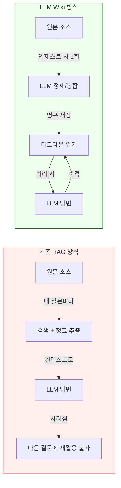
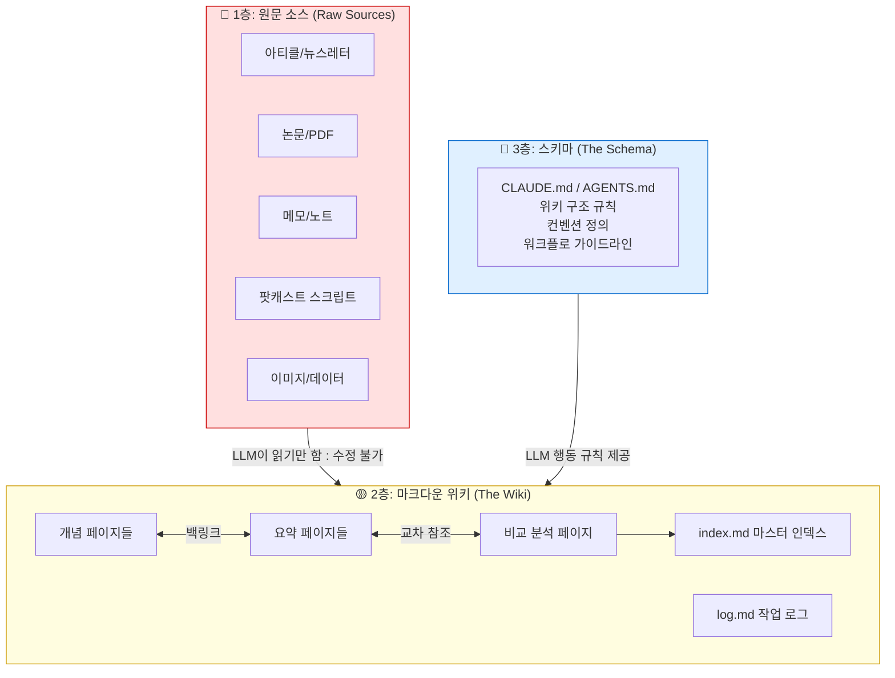
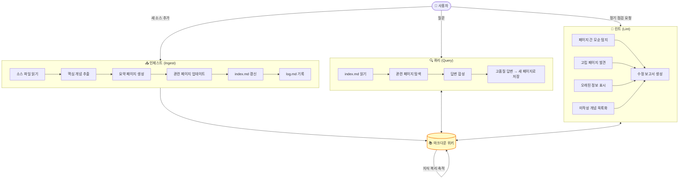
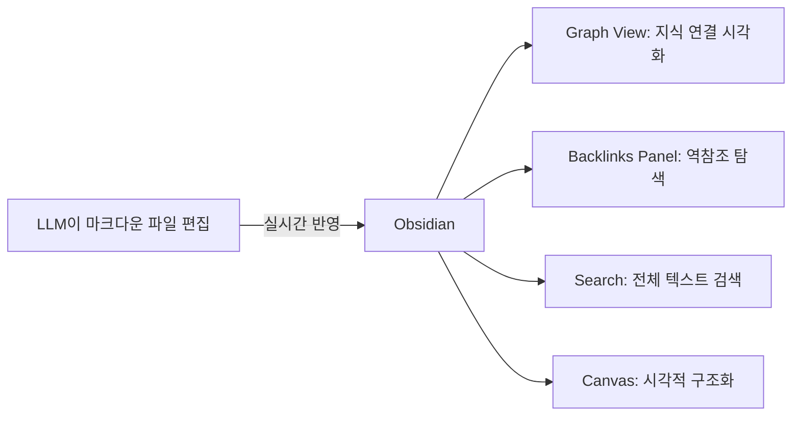
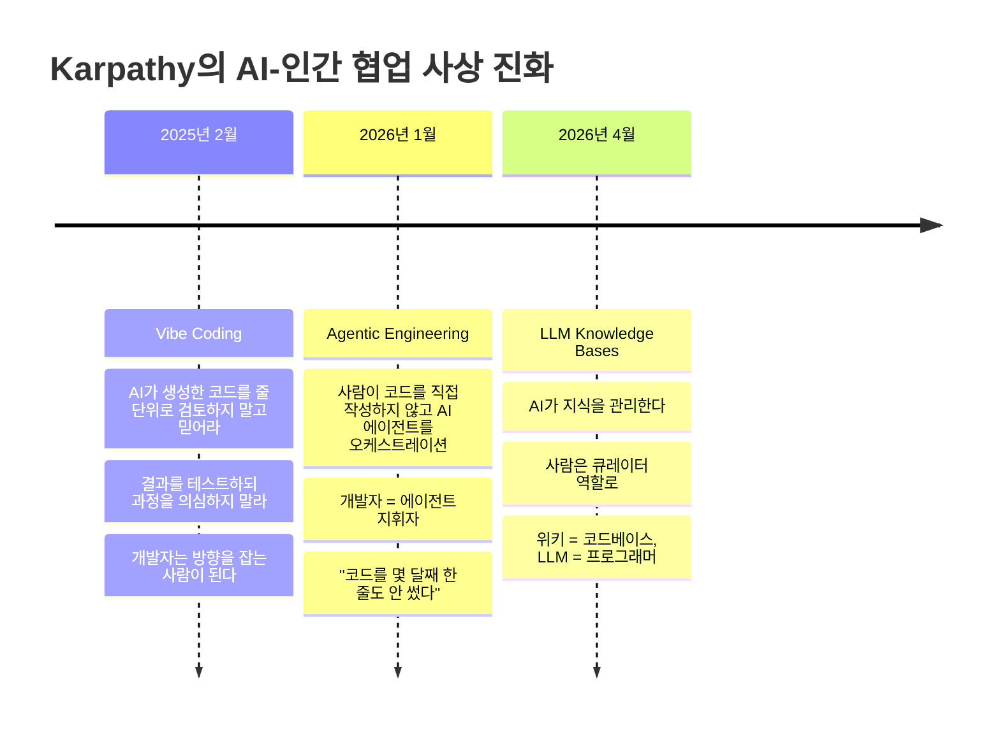
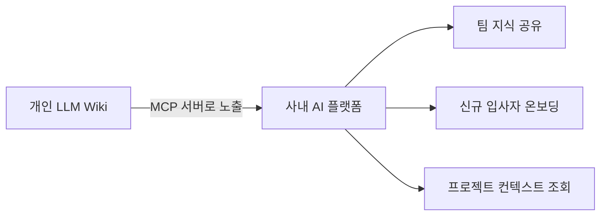
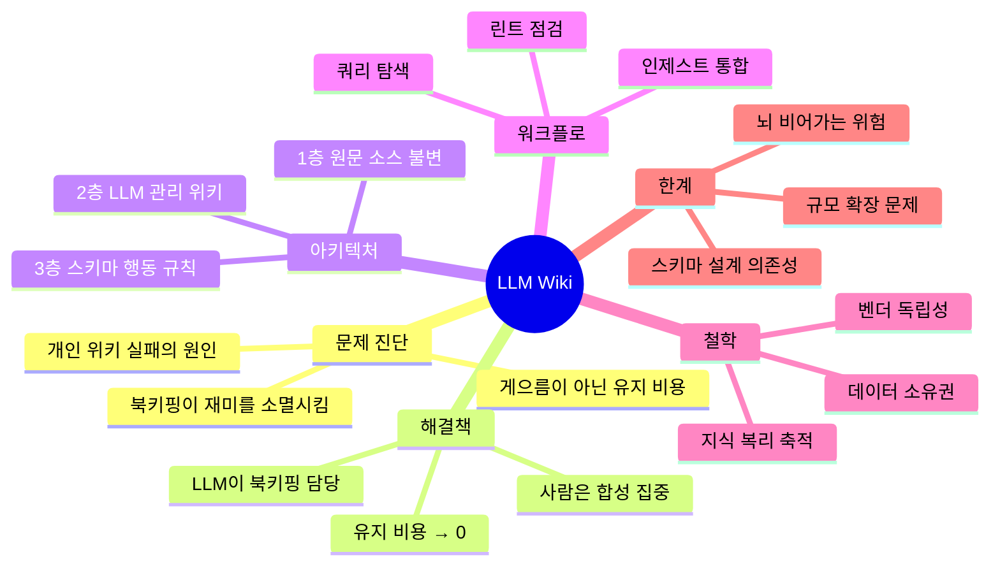

> **Andrej Karpathy의 아이디어에서 출발한 개인 지식 관리의 패러다임 전환**

**작성일:** 2026-04-17  
**참고 원문:** [요즘IT - 왜 개인 위키는 실패할까?](https://yozm.wishket.com/magazine/detail/3711/) | [Karpathy LLM-Wiki GitHub Gist](https://gist.github.com/karpathy/442a6bf555914893e9891c11519de94f)

---

## 목차

1. [왜 개인 위키는 항상 실패했을까?](#1-왜-개인-위키는-항상-실패했을까)
2. [Andrej Karpathy는 누구인가?](#2-andrej-karpathy는-누구인가)
3. [LLM Wiki란 무엇인가?](#3-llm-wiki란-무엇인가)
4. [기존 RAG 방식과의 근본적 차이](#4-기존-rag-방식과의-근본적-차이)
5. [LLM Wiki의 3층 아키텍처](#5-llm-wiki의-3층-아키텍처)
6. [AI의 3가지 핵심 작업 워크플로](#6-ai의-3가지-핵심-작업-워크플로)
7. [실제 구현 방법 — 단계별 가이드](#7-실제-구현-방법--단계별-가이드)
8. [사용 도구 생태계](#8-사용-도구-생태계)
9. [데이터 소유권과 벤더 독립성](#9-데이터-소유권과-벤더-독립성)
10. [지식 복리 축적의 철학](#10-지식-복리-축적의-철학)
11. [비판과 한계: AI가 정리하면 사람은 무엇을 하나?](#11-비판과-한계-ai가-정리하면-사람은-무엇을-하나)
12. [Hacker News 커뮤니티의 반응과 논쟁](#12-hacker-news-커뮤니티의-반응과-논쟁)
13. [Karpathy 사고 체계의 진화: Vibe Coding → LLM Wiki](#13-karpathy-사고-체계의-진화-vibe-coding--llm-wiki)
14. [역사적 맥락: Vannevar Bush의 Memex에서 LLM Wiki까지](#14-역사적-맥락-vannevar-bush의-memex에서-llm-wiki까지)
15. [관련 생태계 및 파생 프로젝트](#15-관련-생태계-및-파생-프로젝트)
16. [실무자를 위한 시작 가이드](#16-실무자를-위한-시작-가이드)
17. [한국 개발자/지식 노동자를 위한 활용 전략](#17-한국-개발자지식-노동자를-위한-활용-전략)
18. [결론: 유지 관리 비용이 낮아지면 지식은 복리로 쌓인다](#18-결론-유지-관리-비용이-낮아지면-지식은-복리로-쌓인다)

---

## 1. 왜 개인 위키는 항상 실패했을까?

### 실패의 보편적 패턴

"나중에 써먹어야지." 아티클을 읽다가, 흥미로운 뉴스레터를 보다가, 팟캐스트를 듣다가 누구나 한 번쯤 이런 생각을 한다. 그래서 사람들은 노션(Notion)이나 옵시디언(Obsidian) 같은 툴을 열고 개인 위키 만들기를 시작한다. 처음 며칠은 열정적으로 페이지를 만들고, 태그를 붙이고, 데이터베이스도 구성한다. 꽤 그럴듯한 구조가 생겨난다.

그런데 한두 달이 지나면 어김없이 같은 자리에서 막힌다.

- 새 정보를 넣으려면 **기존 태그 체계를 먼저 기억**해야 한다
- 정보가 중복되지 않도록 **기존 내용과 비교**해야 한다
- 새 내용을 추가할 때마다 **연관된 페이지들을 업데이트**해야 한다
- 페이지 간 **교차 참조(cross-reference)를 수작업으로 달아야** 한다

이 과정이 단 한 번의 업데이트에 30분을 넘어가기 시작하면, 어느 순간부터 열기가 귀찮아지고, 그렇게 위키는 조용히 멈춘다. 마치 죽어버린 식물처럼, 마지막으로 물을 준 날이 언제였는지도 기억하지 못하게 된다.

### 이것은 게으름의 문제가 아니다

많은 사람들이 이를 자신의 의지력 부족이나 게으름으로 귀결짓는다. 하지만 Andrej Karpathy는 이 문제를 다르게 진단했다. 

> "걸림돌은 게으름이 아니라, 정리를 계속 유지하는 데 들어가는 비용이 너무 컸던 것이다."

개인 위키가 실패하는 진짜 이유는 **유지 관리 비용(maintenance cost)이 위키가 제공하는 가치보다 빠르게 증가하기 때문**이다. 이 비용을 Karpathy는 **북키핑(bookkeeping)** 이라 부른다. 교차 참조 업데이트, 요약 최신화, 수십 페이지에 걸친 일관성 유지 — 이 모든 것이 쌓이면 지식을 쌓는 행위 자체가 무너진다.

```
[위키 유지 비용 증가 구조]

위키 페이지 수
      ↑
 100p │                           ★ 유지 비용 임계점 돌파
      │                      ·
  50p │              ·
      │       ·
  10p │  ·
      └──────────────────────────────────→ 시간(월)
         1   2   3   4   5   6
         
         ● 지식 입력 재미 > 유지 비용: 위키 성장
         ★ 유지 비용 > 재미: 위키 포기
```

---

## 2. Andrej Karpathy는 누구인가?

Andrej Karpathy는 AI 세계에서 가장 영향력 있는 인물 중 한 명이다. 그의 이력을 이해하면 왜 그의 아이디어가 이토록 빠르게 확산되는지 알 수 있다.

| 시기 | 역할 |
|------|------|
| OpenAI 공동 창립 멤버 | AI 연구의 초기 기반 구축 |
| Tesla AI 담당 VP | 자율주행을 위한 대규모 실전 AI 시스템 구축 |
| 교육자 / 연구자 | micrograd, nanoGPT 등 교육용 프로젝트로 수백만 명에게 딥러닝 전수 |
| 2026년 현재 | 독립 연구자이자 AI 커뮤니티 사상가 |

Karpathy는 복잡한 개념을 단순명료하게 설명하는 것으로 유명하다. "Vibe Coding(2025년 2월)", "소프트웨어 2.0" 같은 개념들이 그로부터 시작되어 업계 전체의 언어가 되었다. 2026년 4월, 그가 X(구 트위터)에 LLM-Wiki 아이디어를 공유했을 때, 해당 포스트는 며칠 만에 **1,600만 건 이상의 조회수**를 기록했고, 뒤이어 공개한 GitHub Gist는 **12시간 만에 2,100개의 별**을 받으며 개발자 커뮤니티를 뜨겁게 달궜다.

---

## 3. LLM Wiki란 무엇인가?

### 핵심 정의

LLM Wiki는 특정 소프트웨어나 제품이 아니다. **개인 지식 관리를 위한 워크플로 패턴(workflow pattern)** 이다. 핵심 아이디어는 다음과 같다:

> LLM이 원문을 읽고 마크다운 위키를 직접 쓰고, 새 소스가 들어올 때마다 기존 위키를 업데이트하면서 지식을 누적한다. 사람은 무엇을 읽을지, 무엇을 질문할지를 결정하고, 나머지 행정적 작업(bookkeeping)은 LLM이 맡는다.

Karpathy 자신의 표현을 빌리면:

> **"옵시디언은 IDE, LLM은 프로그래머, 위키는 코드베이스."**

### 기존 지식 관리 vs LLM Wiki 비교

| 구분 | 기존 개인 위키 | LLM Wiki |
|------|--------------|----------|
| **작성자** | 사람이 직접 | LLM이 작성 |
| **유지 관리** | 사람의 지속적 노력 | LLM 자동화 |
| **교차 참조** | 수동 업데이트 | 자동 업데이트 |
| **포기 이유** | 유지 비용 누적 | 유지 비용 ≈ 0 |
| **파일 형식** | 플랫폼 종속적 | 순수 마크다운 |
| **데이터 위치** | 클라우드/플랫폼 | 로컬 파일 |
| **AI 모델 교체** | 불가능 | 자유롭게 가능 |

---

## 4. 기존 RAG 방식과의 근본적 차이

### RAG(Retrieval-Augmented Generation)란?

대부분의 AI 기반 지식 도구들 — NotebookLM, ChatGPT 파일 업로드, 기업용 RAG 시스템 — 은 RAG 방식을 사용한다. 작동 방식은 다음과 같다:

```
[RAG 방식의 동작 원리]

사용자 질문
    ↓
문서 청크로 분할 → 벡터 임베딩 생성 → 벡터 DB 저장
    ↓
질문 임베딩 생성 → 유사 청크 검색 → LLM에 컨텍스트로 전달
    ↓
답변 생성 (단발성, 누적 없음)
```

도서관 사서에 비유하면, 매번 서가에서 책을 꺼내 읽어주는 것과 같다. 찾아주긴 하지만 **지식이 어딘가에 정리되어 쌓이지는 않는다.** 다음에 같은 질문을 해도 처음부터 다시 검색한다.

### LLM Wiki의 차이점



LLM Wiki는 **컴파일러(compiler) 비유**로 가장 잘 설명된다. RAG가 매번 원문을 인터프리트(interpret)한다면, LLM Wiki는 원문을 한 번 컴파일하여 구조화된 지식 바이너리(위키)로 만들어두는 것이다. 이후에는 컴파일된 위키를 대상으로 빠르게 쿼리한다.

### 효율성 비교

RAG 방식이 LLM Wiki 대비 최대 **70배 비효율적**이라는 분석도 있다. RAG는 다음과 같은 추가 인프라가 필요하기 때문이다:

- 벡터 임베딩 생성 API 호출 (별도 비용)
- 벡터 데이터베이스 구축 및 유지 (운영 비용)
- 청크 분할 로직 설계 (개발 비용)
- 검색 실패 시 오답 위험 (품질 비용)

반면 LLM Wiki는 **단 하나의 API 호출**로 전체 지식 베이스를 대상으로 쿼리할 수 있다. (단, 위키가 모델의 컨텍스트 윈도우에 들어갈 수 있는 크기일 때. Claude 3.5 Sonnet의 경우 약 200,000 토큰 = 약 150,000 단어 분량)

---

## 5. LLM Wiki의 3층 아키텍처

LLM Wiki는 세 가지 레이어로 구성된다. 이미지에서도 레고 블록 3층 구조로 시각화된 바로 그 구조다.



### 1층: 원문 소스 (Raw Sources) — 진실의 원천

원문 소스 레이어는 **불변(immutable) 레이어**다. LLM은 이 레이어를 읽기만 하고, 절대 수정하지 않는다. 여기에 들어가는 것들은:

- 내가 읽은 아티클 (마크다운으로 변환 권장)
- 연구 논문과 PDF
- 강의 노트와 개인 메모
- 팟캐스트 전사 텍스트
- 웹 클리핑 자료

Karpathy는 Obsidian Web Clipper 같은 브라우저 확장 프로그램을 사용하여 웹 기사를 마크다운 형식으로 변환해 로컬에 저장하는 방식을 추천한다. 이렇게 하면 원문이 외부 서버에 의존하지 않고 항구적으로 보존된다.

**폴더 구조 예시:**
```
raw/
├── articles/
│   ├── 2026-04-17-llm-wiki-karpathy.md
│   └── 2026-04-10-ai-agent-trends.md
├── papers/
│   └── attention-is-all-you-need.pdf
├── notes/
│   └── personal-thoughts-2026.md
└── podcasts/
    └── lex-fridman-episode-transcript.md
```

### 2층: 마크다운 위키 (The Wiki) — 지식의 결정체

위키 레이어는 **LLM이 직접 생성하고 관리하는 마크다운 파일들의 집합**이다. 사람은 이 레이어를 직접 수정하지 않는 것이 원칙이다 (단, 오류 수정은 가능). LLM이 원문 소스를 읽고 다음을 자동으로 생성한다:

- **개념 페이지**: 중요 개념에 대한 구조화된 설명
- **요약 페이지**: 각 소스 문서의 핵심 내용 정리
- **비교/분석 페이지**: 여러 소스에서 얻은 시각을 합성
- **백링크(Backlinks)**: `[[wiki-links]]` 형식으로 페이지 간 연결
- **index.md**: 전체 위키의 목차이자 LLM이 가장 먼저 읽는 파일
- **log.md**: 어떤 소스가 언제 처리되었는지의 작업 기록

Karpathy 자신의 경우, 단일 연구 주제 위키가 약 **100개 아티클, 40만 단어** 규모로 성장했다고 밝혔다. 이는 박사 논문 전체 분량에 가까운 방대한 지식 베이스다.

**폴더 구조 예시:**
```
wiki/
├── index.md          # 마스터 인덱스
├── log.md            # 작업 로그
├── concepts/
│   ├── llm-wiki.md
│   ├── rag.md
│   └── knowledge-management.md
├── people/
│   ├── andrej-karpathy.md
│   └── vannevar-bush.md
└── projects/
    └── obsidian-setup.md
```

### 3층: 스키마 (The Schema) — LLM의 행동 규칙서

스키마는 **LLM에게 위키를 어떻게 관리해야 하는지를 알려주는 설정 문서**다. 이 파일이 없으면 LLM은 일반 챗봇처럼 행동하지만, 이 파일이 있으면 체계적인 위키 관리자로 변환된다.

- Claude Code 환경에서는 `CLAUDE.md`
- OpenAI Codex 환경에서는 `AGENTS.md`
- 일반적으로는 어떤 파일명도 가능

**스키마 파일 예시 (CLAUDE.md):**
```markdown
# LLM Wiki 스키마

## 위키의 목적
이 위키는 AI 에이전트 개발에 관한 개인 연구 지식 베이스입니다.

## 폴더 구조 규칙
- raw/ : 원문 소스 (절대 수정 금지)
- wiki/ : LLM이 관리하는 위키 파일
- wiki/index.md : 항상 최신 상태 유지

## 페이지 형식
각 개념 페이지는 다음 구조를 따릅니다:
1. 1줄 정의 (요약 라인)
2. 핵심 개념 설명 (2-3단락)
3. 관련 개념 백링크
4. 참고 소스 목록

## 인제스트 규칙
새 소스 추가 시:
1. 소스 요약 페이지 생성
2. 관련 개념 페이지 업데이트
3. 새 개념이 있으면 새 페이지 생성
4. index.md 업데이트
5. log.md에 처리 기록

## 쿼리 규칙
- index.md를 먼저 읽고 관련 페이지를 파악
- 답변은 마크다운 형식으로
- 불확실한 정보는 명시적으로 표시
```

이 문서는 처음에 짧아도 되고, 사용자와 LLM이 함께 위키를 운영하면서 점진적으로 다듬어가는 살아있는 문서다.

---

## 6. AI의 3가지 핵심 작업 워크플로



### 인제스트 (Ingest) — 새 지식의 통합

인제스트는 새로운 원문 소스를 위키에 통합하는 과정이다. 단순히 "요약본 만들어줘"가 아니다. LLM은 새 소스를 읽고 **기존 위키 전체와의 맥락 속에서** 지식을 통합한다:

1. 새 소스의 핵심 내용 파악
2. 기존 위키에서 관련 페이지 식별
3. 관련 페이지들 업데이트 (새 정보 반영, 모순 표시)
4. 새 개념이 있으면 전용 페이지 생성
5. 백링크 자동 생성 (`[[개념명]]` 형식)
6. index.md의 목차 업데이트

소스 하나를 인제스트하면 **15개 이상의 연관 페이지**가 자동으로 업데이트될 수 있다. 사람이 수작업으로 했다면 몇 시간이 걸릴 일이다.

### 쿼리 (Query) — 축적된 지식 활용

위키가 어느 정도 구축되면, 원문을 매번 다시 읽지 않아도 된다. 이미 컴파일된 위키를 대상으로 자연어로 질문한다:

- "RAG와 LLM Wiki의 핵심 차이점을 비교 정리해줘"
- "Karpathy가 언급한 북키핑 비용이란 정확히 무엇인가?"
- "이 주제에서 아직 내가 탐구하지 않은 영역은 어디인가?"

특히 중요한 점은, **쿼리에서 생성된 좋은 답변이 새로운 위키 페이지로 저장될 수 있다**는 것이다. 탐색 행위 자체가 지식 축적이 된다.

### 린트 (Lint) — 위키 건강 유지

소프트웨어 개발에서 린터(linter)가 코드의 오류를 찾아주듯, LLM Wiki의 린트는 위키의 품질을 정기적으로 점검한다:

- **모순 탐지**: A 페이지에서는 X라고 했는데 B 페이지에서는 X와 반대되는 주장이 있을 때
- **고립 페이지**: 다른 페이지에서 링크가 없는 외톨이 페이지
- **오래된 정보**: 최신 소스에 의해 업데이트가 필요한 내용
- **미작성 개념**: 본문에서 여러 번 언급되었지만 아직 전용 페이지가 없는 개념

린트 결과는 위키를 계속 건강하게 유지하는 데 핵심적인 역할을 한다.

---

## 7. 실제 구현 방법 — 단계별 가이드

### Step 1: 주제 선정 (가장 중요)

처음부터 모든 지식을 담으려 하면 실패한다. **좁고 구체적인 단일 주제**로 시작해야 한다.

좋은 시작 주제의 예:
- "LLM 에이전트 아키텍처"
- "내가 읽은 마케팅 책들의 핵심 인사이트"
- "특정 프로그래밍 언어의 고급 패턴들"
- "내 회사의 기술 스택 문서화"

좋지 않은 시작 주제:
- "내가 아는 모든 것" (너무 광범위)
- "여러 분야를 동시에" (스키마 설계 복잡)

### Step 2: 폴더 구조 설정

```
my-llm-wiki/
├── raw/              # 1층: 원문 소스 (수정 불가)
├── wiki/             # 2층: LLM 관리 위키
│   └── index.md      # 마스터 인덱스 (자동 생성)
└── CLAUDE.md         # 3층: 스키마
```

### Step 3: 스키마(CLAUDE.md) 초안 작성

처음엔 5-10줄이어도 충분하다. 기본 내용:
- 위키의 목적과 주제 범위
- 페이지 기본 형식
- 인제스트 시 따라야 할 규칙

### Step 4: 첫 번째 소스 인제스트

아티클 하나를 `raw/` 폴더에 넣고 Claude Code에 지시한다:

```
CLAUDE.md의 스키마를 읽고, raw/ 폴더의 [파일명]을 인제스트해서 wiki/를 업데이트해줘.
```

어떤 페이지들이 생겨나는지 관찰하고, 스키마를 다듬는다. **이 관찰-수정 루프가 진짜 세팅 과정이다.**

### Step 5: 반복과 정착

- 소스를 하나씩 추가하면서 위키가 성장하는 것을 지켜본다
- 월 1회 정도 린트 실행으로 위키 건강 상태 확인
- 위키가 수십 페이지를 넘으면 Obsidian의 Graph View로 연결 구조 시각화

---

## 8. 사용 도구 생태계

### 필수 도구

**Claude Code (또는 동급 AI 코딩 에이전트)**
- 로컬 파일 시스템에 직접 접근하여 파일을 읽고 쓸 수 있음
- CLAUDE.md를 읽고 위키 관리자로 동작
- OpenAI Codex, OpenCode/Pi 등으로 대체 가능

**마크다운 편집기**
- 어떤 텍스트 에디터도 가능
- 단, 위키가 성장하면 Obsidian 강력 추천

### Obsidian — 위키의 시각화 인터페이스



Obsidian의 주요 장점:
- **Graph View**: 위키 페이지들이 노드로, 백링크가 엣지로 표시되어 지식 맵 시각화
- **로컬 저장**: 모든 파일이 내 컴퓨터에 마크다운으로 저장됨
- **Obsidian Web Clipper**: 브라우저 확장 프로그램으로 웹 기사를 마크다운으로 변환해 raw/ 폴더에 자동 저장

### 선택적 도구들

| 도구 | 용도 |
|------|------|
| Obsidian Web Clipper | 웹 기사 → 마크다운 변환, 빠른 소스 추가 |
| VS Code + Claude Code 확장 | 개발자 친화적 위키 편집 환경 |
| Git | 위키 버전 관리 및 백업 |
| MindStudio | 위키를 팀 공유용 AI 에이전트로 래핑 |

---

## 9. 데이터 소유권과 벤더 독립성

LLM Wiki의 가장 중요한 특성 중 하나는 **데이터 주권(data sovereignty)** 이다.

### 기존 AI 개인화 서비스의 문제

"쓸수록 알아서 좋아진다"는 AI 개인화 방식 — Notion AI, Google Gemini 통합, Microsoft Copilot 등 — 에서는 내 데이터가 어디에, 어떻게 저장되는지 불투명하다. 플랫폼이 서비스를 종료하거나 정책을 변경하면 내 지식 베이스가 사라질 수 있다.

### LLM Wiki의 해법

```
[데이터 소유권 비교]

기존 AI 서비스:
나의 지식 → [플랫폼 서버] → AI 처리 → 결과
              ↑ 접근 불가, 이동 어려움

LLM Wiki:
나의 지식 → [내 로컬 폴더] → AI 처리 → 결과
              ↑ 완전한 통제, 언제든 이동 가능
```

- **완전한 데이터 통제**: 모든 위키 파일이 내 로컬 드라이브에 평문(plain text)으로 존재
- **모델 교체 자유**: Claude에서 Gemini로, Gemini에서 GPT로 언제든 교체 가능
- **플랫폼 독립**: 특정 업체에 종속되지 않음 (vendor lock-in 없음)
- **AI 투명성**: AI가 무엇을 알고 모르는지 사람이 직접 확인하고 수정 가능
- **미래 보장**: 마크다운은 10년 후에도 읽을 수 있는 형식

---

## 10. 지식 복리 축적의 철학

### 복리(複利)란 무엇인가?

금융에서 복리는 원금뿐 아니라 이자에도 이자가 붙어 시간이 지날수록 기하급수적으로 성장하는 구조다. Karpathy는 LLM Wiki가 지식의 복리 축적을 가능하게 한다고 주장한다.

```
[선형 축적 vs 복리 축적]

지식량
 ↑
 │                        ●●● 복리 (LLM Wiki)
 │                    ●●
 │                ●●
 │            ●●
 │     ●●●●●●              ○○○ 선형 (기존 메모)
 │ ●●●          ○○○○○○○
 └─────────────────────────────→ 시간
```

**왜 복리인가?**

1. 새 소스가 추가될 때마다 기존 지식과 연결되며 가치가 증폭됨
2. 쿼리 답변이 새 페이지로 저장되어 탐색 자체가 지식 생산
3. 린트를 통해 지식의 품질이 지속적으로 개선됨
4. 시간이 지날수록 위키가 더 정교하고 촘촘하게 연결됨

### 북키핑(Bookkeeping) vs 합성(Synthesis)의 구분

Karpathy의 핵심 통찰은 지식 관리 작업을 두 가지로 나눈 것이다:

| 구분 | 정의 | 담당 |
|------|------|------|
| **북키핑** | 교차 참조 업데이트, 인덱스 관리, 모순 표시, 파일 일관성 유지 | LLM |
| **합성** | 무엇을 읽을지 결정, 무엇을 질문할지 판단, 개념 간 의미 연결, 새 인사이트 생성 | 사람 |

LLM Wiki는 사람이 합성 작업에만 집중할 수 있도록 북키핑을 LLM에게 완전히 위임한다.

---

## 11. 비판과 한계: AI가 정리하면 사람은 무엇을 하나?

### "뇌가 비어가는 느낌"

LLM Wiki 아이디어가 Hacker News에서 화제가 되었을 때, 한 댓글 작성자는 솔직한 경험을 공유했다. 그는 번아웃으로 집중력이 떨어졌을 때 많은 작업을 에이전트에 위임했는데, 새로운 형태의 기술 부채가 생겼고 **"뇌의 일부가 비어 있는 느낌"** 이 든다고 말했다.

이 경험이 시사하는 바는 명확하다. 직접 정리하는 과정에는 LLM이 대신할 수 없는 인지적 과정이 있다:

- 이 개념이 저 개념과 어떻게 연결되는지 **깨닫는 순간**
- 예전에 읽은 내용이 지금 읽는 것과 어떻게 이어지는지 **느끼는 순간**
- 두 상충되는 관점 사이에서 **자신만의 입장을 형성하는 과정**

이 순간들이 학습의 본체에 가깝다. 만약 모든 정리를 AI에게 맡기면, 위키는 쌓여도 내 머릿속은 비어가는 역설이 생길 수 있다.

### Karpathy의 반론

그러나 Karpathy가 LLM에게 맡기자는 것은 **사고의 과정이 아니라 북키핑**이다.

```
[LLM에게 위임 가능한 것 vs 불가능한 것]

위임 가능 (북키핑):                위임 불가 (합성):
✓ 교차 참조 업데이트              ✗ 무엇을 읽을지 결정
✓ 모순 감지 및 표시               ✗ 어떤 질문을 던질지 판단
✓ 파일 일관성 유지                ✗ 개념 간 의미 연결
✓ 인덱스 관리                     ✗ 새 관점 생성
✓ 요약본 작성                     ✗ 비판적 평가
✓ 백링크 생성                     ✗ 가치 판단
```

위키 관리 작업이 쌓이면 정작 읽고 연결하고 이해하는 데 쓸 시간과 에너지가 남지 않는다. LLM Wiki는 그 관리를 LLM에 넘겨 **사람은 생각에만 집중할 수 있게 하는 시도**다.

### 현실적 한계와 위험

1. **규모 확장 시 일관성 문제**: 위키가 수백 페이지 이상으로 커지면 LLM이 전체를 일관성 있게 유지하기 어려워진다.

2. **스키마 설계 의존성**: 스키마가 잘 설계되지 않으면 어느 순간 LLM도 사람도 전체 구조를 파악하지 못하게 된다.

3. **LLM 오류 전파**: LLM이 잘못 이해한 내용이 위키에 저장되면, 이후 쿼리에서도 오류가 반복될 수 있다.

4. **컨텍스트 윈도우 한계**: 위키가 수십만 단어를 초과하면 단일 LLM 호출로 전체를 처리할 수 없어 선택적 로딩 전략이 필요하다.

5. **Hacker News 경고**: "일정 복잡도를 넘으면 에이전트가 위키를 유지하지 못한다"는 실제 사용자들의 경고가 있었다.

---

## 12. Hacker News 커뮤니티의 반응과 논쟁

Karpathy의 LLM-Wiki GitHub Gist에는 485개 이상의 댓글이 달리며 활발한 논쟁이 벌어졌다. 주요 반응들을 정리하면:

### 긍정적 반응

- **"개발자들이 각자 이미 비슷한 것을 만들고 있었다"**: 그래프 DB, SPARQL, 엔티티 스토어 등의 커스텀 인프라를 만들던 개발자들이 "이것이 이름이 생겼다"며 반겼다
- **"Git 모델 제안"**: 한 개발자는 마크다운 파일 대신 Git 객체 모델(Blob = 지식 단위, Tree = 개념 카테고리)을 활용하면 중복 제거, 출처 추적, 브랜칭이 내장된다고 제안했다
- **"기업 지식 관리에 적용 가능"**: Slack 스레드, 고객 통화, PR 등을 인제스트하면 신규 팀원이 빠르게 컨텍스트를 파악할 수 있다는 의견

### 비판적 반응

- **"사용자 없는 위키"**: "사용자가 편집하지 않는 위키는 영혼이 없는 위키"라는 비판
- **"충분히 복잡해지면 무너진다"**: 일정 규모를 넘으면 에이전트가 위키를 유지하지 못한다는 경고
- **"타입화된 엔티티가 필요"**: 플랫 마크다운 구조가 아닌 타입 있는 엔티티와 관계가 필요하다는 주장 (Graphite Atlas 같은 솔루션 제안)
- **"번아웃 경험"**: 모든 것을 에이전트에 위임했을 때 "뇌가 비어가는 느낌"을 경험했다는 증언

---

## 13. Karpathy 사고 체계의 진화: Vibe Coding → LLM Wiki

LLM Wiki는 Karpathy의 AI-인간 협업에 대한 사고가 진화해 온 세 번째 단계다:



각 단계는 **더 많은 인지 노동을 LLM에게 이전**하면서도 사람이 판단과 방향 설정을 유지하는 방식을 탐구한다. 흥미롭게도 Karpathy 자신은 2026년 3월 "몇 달째 코드를 한 줄도 쓰지 않았으며 일종의 사이코시스(psychosis) 상태"라고 언급하며, 이것이 깊이 고민된 아키텍처인지 직관적 실험인지에 대한 의문도 제기됐다.

---

## 14. 역사적 맥락: Vannevar Bush의 Memex에서 LLM Wiki까지

Karpathy는 LLM Wiki 아이디어가 80년 전 아이디어에서 이어진다고 명시했다.

### Vannevar Bush의 Memex (1945)

1945년, 미국의 과학자 Vannevar Bush는 *"As We May Think"*라는 에세이에서 **Memex**라는 가상의 장치를 제안했다. Memex는:

- 개인이 모든 책, 기록, 커뮤니케이션을 저장할 수 있는 장치
- 문서 간 연결(링크)이 문서 자체만큼 가치 있는 지식 저장소
- 인간의 기억이 연상(association)으로 작동한다는 통찰을 반영

Memex는 현대 하이퍼텍스트와 월드와이드웹의 개념적 선조다. 그러나 Bush가 끝내 풀지 못한 문제가 있었다: **"이걸 누가 유지 관리하느냐?"**

### 80년의 여정

```
1945  Memex 제안 (Vannevar Bush)
       ↓
1965  하이퍼텍스트 개념 (Ted Nelson)
       ↓
1991  World Wide Web (Tim Berners-Lee)
       ↓
2000s 위키피디아 — 집단 지성으로 유지 관리 문제 해결 시도
       ↓
2010s 개인 위키 도구들 (Notion, Obsidian, Roam Research)
       ↓
2026  LLM Wiki — LLM으로 유지 관리 문제 해결
```

80년 만에 Bush가 품었던 질문 — "누가 유지 관리하느냐?" — 에 대한 답이 드디어 등장했다. 그 답은 LLM이다.

---

## 15. 관련 생태계 및 파생 프로젝트

LLM Wiki 아이디어는 빠르게 확산되며 다양한 파생 프로젝트와 도구들이 생겨났다.

### 핵심 관련 개념 및 프로젝트

| 프로젝트 | 특징 | LLM Wiki와의 관계 |
|---------|------|-----------------|
| **Jeremy Howard의 llms.txt** | 웹사이트가 외부 LLM에게 자신을 설명하는 표준 | 외향적(outward-facing). LLM Wiki는 내향적(inward-facing) |
| **Simon Willison의 docs-for-llms** | LLM 친화적 문서 연결 빌드 스크립트 | 같은 철학 (마크다운이 LLM 최적 형식) |
| **Waykee Cortex** | 팀용 계층적 지식 상속 시스템 | 팀 스케일로 LLM Wiki 확장 |
| **Graphite Atlas** | 타입화된 속성 그래프 기반 지식 관리 | 플랫 마크다운의 한계를 극복하려는 시도 |
| **A-MEM** | LLM 에이전트를 위한 에이전틱 메모리 | 학술적 접근의 유사 개념 |

### 실제 구현 사례

개발자 Farza는 Karpathy의 아이디어를 즉시 구현해 **2,500개의 개인 메모와 메시지**를 LLM으로 처리하여 **400개 아티클의 개인 백과사전**을 완성했다고 공유했다. 이 결과는 커뮤니티에 큰 반향을 일으켰다.

### 미래 방향: 파인튜닝된 개인 모델

Karpathy는 LLM Wiki의 미래 방향으로 흥미로운 가능성을 언급했다: 구축된 위키를 기반으로 합성 훈련 데이터를 생성하고, 이를 통해 LLM을 파인튜닝하면 **지식이 모델 가중치 안에 내재화**된다. 컨텍스트 윈도우에 의존하지 않고도 개인화된 지식을 갖춘 나만의 모델이 탄생할 수 있다.

---

## 16. 실무자를 위한 시작 가이드

### 3단계 시작법 (Karpathy 권장)

#### 1단계: 하나의 주제를 정하라

좁고 구체적일수록 좋다. 처음부터 모든 지식을 담으려 하면 스키마 설계가 복잡해지고 일관성을 유지하기 어려워진다.

**체크리스트:**
- [ ] 주제가 명확하게 한 문장으로 설명되는가?
- [ ] 6개월 안에 읽을 수 있는 소스의 범위인가?
- [ ] 이 주제의 핵심 개념 10개를 떠올릴 수 있는가?

#### 2단계: 스키마 파일을 먼저 써라

CLAUDE.md (또는 AGENTS.md) 초안을 작성한다. 처음엔 다음 내용만 담아도 충분하다:

```markdown
# My LLM Wiki Schema

## 목적
[주제]에 대한 개인 연구 지식 베이스

## 기본 규칙
- raw/ 폴더의 파일은 절대 수정하지 않음
- 모든 위키 페이지는 1줄 요약으로 시작
- 관련 개념은 [[이중 대괄호]]로 연결
- 새 소스 처리 시 index.md 업데이트 필수
```

#### 3단계: 아티클 하나를 넣어보라

```bash
# 터미널에서 Claude Code 실행 후:
> CLAUDE.md를 읽고, raw/[파일명].md를 인제스트해서 wiki/를 업데이트해줘.
> 어떤 새 페이지를 만들었고, 어떤 기존 페이지를 업데이트했는지 요약해줘.
```

이후 생성된 파일들을 살펴보고 스키마를 다듬는다. 이 **관찰-수정 루프**가 위키 설계의 핵심이다.

### 스케일업 전략

위키가 성장함에 따라 다음 순서로 도구를 추가한다:

```
초기 (1-20 페이지):
  마크다운 폴더 + Claude Code + 텍스트 에디터

중기 (20-100 페이지):
  + Obsidian (Graph View로 연결 구조 파악)
  + Obsidian Web Clipper (소스 추가 루틴)

성숙기 (100+ 페이지):
  + 선택적 파일 로딩 전략 (전체 위키를 한 번에 로드 불가)
  + 정기적 린트 스케줄 (주 1회 또는 월 1회)
  + Git으로 위키 버전 관리
```

---

## 17. 한국 개발자/지식 노동자를 위한 활용 전략

### 한국어 환경 고려사항

LLM Wiki를 한국어로 운영할 때 몇 가지 실용적인 고려가 필요하다:

**장점:**
- Claude, GPT-4o, Gemini 등 주요 LLM의 한국어 처리 능력이 충분히 성숙함
- 한국어 마크다운 파일도 백링크, 인덱싱 등이 완벽하게 동작

**주의사항:**
- 스키마(CLAUDE.md)는 영어로 작성하는 것을 권장 (모델이 명령을 더 정확히 따름)
- 위키 페이지 제목은 영어-한국어 혼용 시 일관성 규칙을 명시해야 함 (예: `개념명-en` 또는 `개념명-ko`)
- 기술 문서라면 영어 원문 보존 후 한국어 설명 추가 패턴이 효과적

### 한국 IT 환경에서의 활용 시나리오

| 직군 | 추천 주제 | 예상 소스 |
|------|---------|----------|
| 백엔드 개발자 | 특정 기술 스택의 심층 이해 | 공식 문서, 기술 블로그, 컨퍼런스 발표 |
| AI 플랫폼 개발자 | LLM 에이전트 아키텍처 | 논문, Karpathy 자료, 오픈소스 프로젝트 |
| 제품 관리자 | 경쟁사 분석 / 사용자 리서치 | 보도자료, 사용자 인터뷰 기록 |
| SI/아웃소싱 종사자 | 프로젝트 지식 누적 | 회의록, 기술 결정 문서, 레슨런 |
| 연구자 | 특정 도메인 논문 지식 베이스 | arXiv 논문, 저널 아티클 |

### 내부 AI 플랫폼과의 통합 가능성

Claude Code나 MCP(Model Context Protocol)를 활용하면 LLM Wiki를 기업 내부 AI 플랫폼과 통합할 수 있다:



이를 통해 개인 지식 베이스가 팀 자산으로 확장될 수 있다.

---

## 18. 결론: 유지 관리 비용이 낮아지면 지식은 복리로 쌓인다

### 핵심 인사이트 요약



### 최종 메시지

Karpathy가 말한 "에이전트 활용 능력은 21세기의 핵심 스킬"은 단순히 에이전트를 사용하는 능력만을 뜻하지 않는다. 그보다 중요한 것은 **무엇을 에이전트에게 맡기고, 무엇을 스스로 판단할지를 가르는 능력**이다.

- 북키핑은 맡겨라.
- 하지만 무엇을 읽고, 무엇을 질문할지는 네가 결정해야 한다.
- 그 판단의 질이 위키의 깊이로 이어진다.
- 위키의 깊이가 네 사고의 깊이로 이어진다.

1945년 Vannevar Bush가 Memex를 꿈꾸며 남긴 미해결 질문 — "이걸 누가 유지 관리하느냐?" — 에 대한 답이 80년 만에 나왔다. 그 답은 LLM이다. 그리고 이제, 당신의 차례다.

---

## 참고 자료

| 자료 | 링크 |
|------|------|
| Karpathy LLM-Wiki GitHub Gist | https://gist.github.com/karpathy/442a6bf555914893e9891c11519de94f |
| Karpathy X 포스트 | https://x.com/karpathy/status/2040572272944324650 |
| 요즘IT 원문 기사 | https://yozm.wishket.com/magazine/detail/3711/ |
| Hacker News 토론 | https://news.ycombinator.com/item?id=47640875 |
| DAIR.AI Academy 분석 | https://academy.dair.ai/blog/llm-knowledge-bases-karpathy |
| Starmorph 완전 가이드 | https://blog.starmorph.com/blog/karpathy-llm-wiki-knowledge-base-guide |
| Analytics Vidhya 구현 가이드 | https://www.analyticsvidhya.com/blog/2026/04/llm-wiki-by-andrej-karpathy/ |
| Vannevar Bush, "As We May Think" (1945) | https://www.theatlantic.com/magazine/archive/1945/07/as-we-may-think/303881/ |

---

*작성일: 2026-04-17*  
*이 문서는 요즘IT 기사, Karpathy GitHub Gist, 및 최신 커뮤니티 분석을 종합하여 작성되었습니다.*
