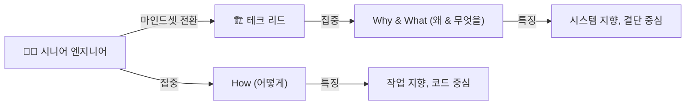
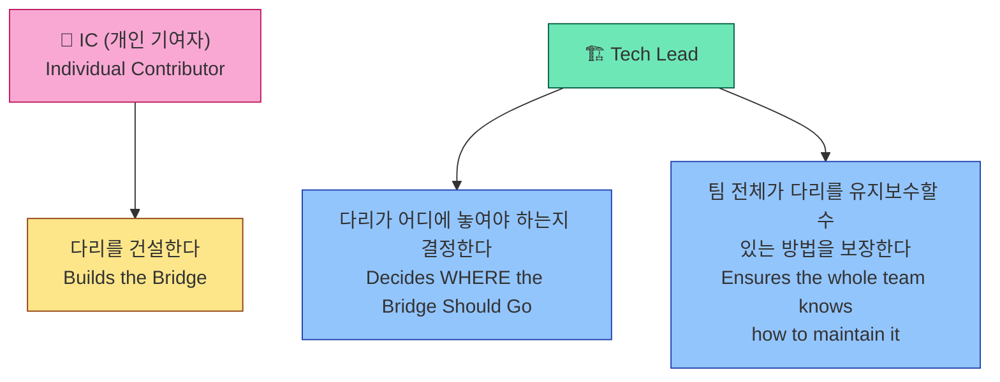
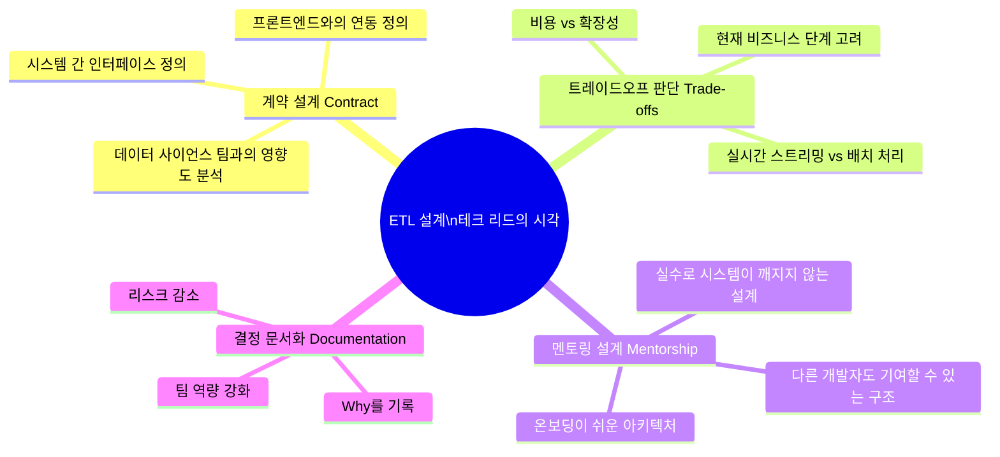
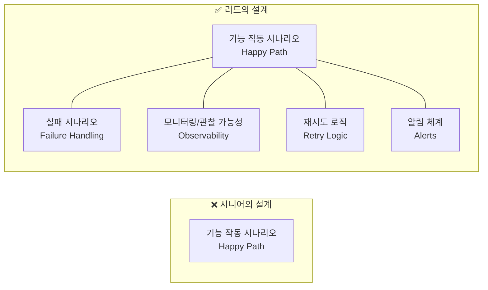
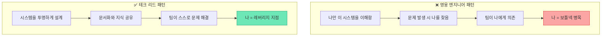
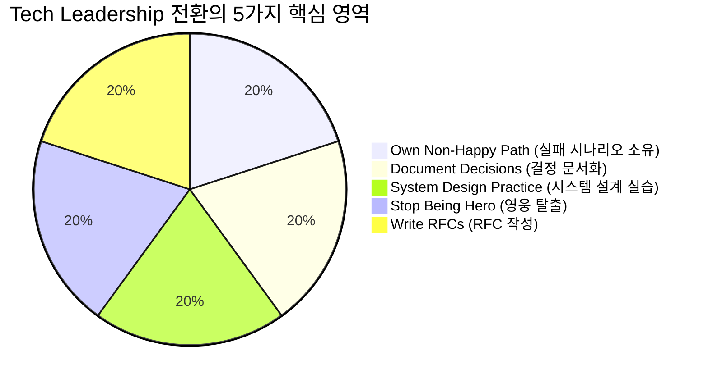
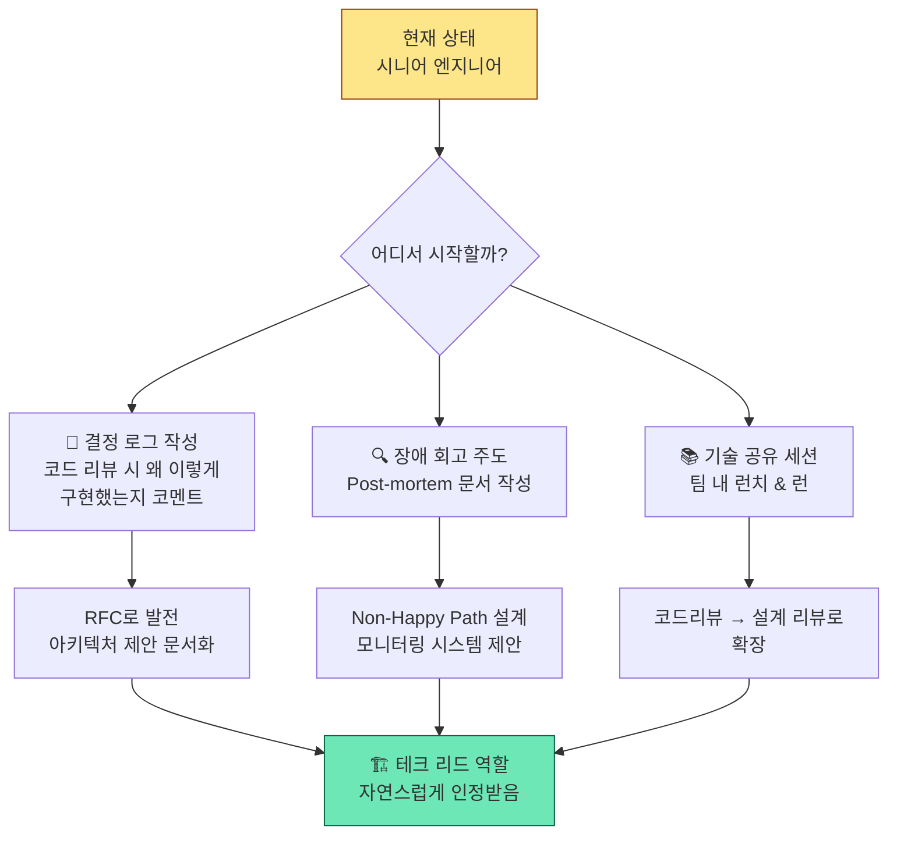
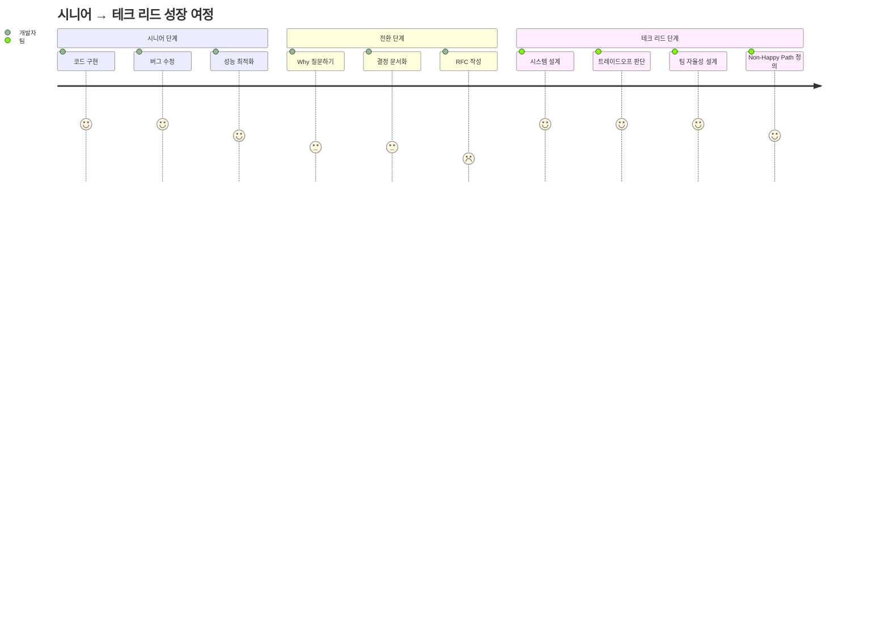

> **원문**: [*Stop Coding Tasks, Start Designing Systems*](https://newsletter.optimistengineer.com/p/stop-coding-tasks-start-designing) — Marcos F. Lobo (2026년 3월 25일)  
> **참고**: [@harumak_11](https://x.com/harumak_11/status/2044974130072817743) 의 일본어 요약 트윗 및 다이어그램 "Transitioning to Tech Leadership" (Napkin AI 제작)  
> **작성 일자**: 2026-04-18

---

## 목차

1. [왜 이 글이 중요한가](#1-왜-이-글이-중요한가)
2. [핵심 전제: 리더십은 코드가 아니라 결단이다](#2-핵심-전제-리더십은-코드가-아니라-결단이다)
3. [마인드셋 전환: How에서 Why로](#3-마인드셋-전환-how에서-why로)
4. [실전 예시: ETL 아키텍처로 보는 리드의 사고방식](#4-실전-예시-etl-아키텍처로-보는-리드의-사고방식)
5. [성장 가속을 위한 3가지 실천 원칙](#5-성장-가속을-위한-3가지-실천-원칙)
6. [다이어그램 해설: Tech Leadership 전환 모델](#6-다이어그램-해설-tech-leadership-전환-모델)
7. [한국 SI/IT 현장에서의 시사점](#7-한국-siit-현장에서의-시사점)
8. [결론: 기술 리더십은 근육이다](#8-결론-기술-리더십은-근육이다)

---


## 1. 왜 이 글이 중요한가

소프트웨어 업계에서 "시니어 엔지니어에서 테크 리드로" 올라가는 것은 단순한 연차 증가나 기술적 숙련도 향상의 문제가 아니다. 많은 시니어 엔지니어들이 이 전환점에서 막히는 이유는 **무엇을 바꿔야 하는지**를 명확하게 인식하지 못하기 때문이다.

Marcos F. Lobo가 작성한 이 뉴스레터 글은 단순히 "더 많은 것을 해라"는 조언 대신, **사고방식(Mindset) 자체를 바꿔야 한다**는 점을 구체적이고 실용적인 언어로 설명한다. 트위터(X) 사용자 @harumak_11 은 이를 일본어로 요약하며, "코딩 작업을 멈추고 시스템 설계를 시작하라"는 메시지가 아시아 개발자 커뮤니티에도 공감을 얻고 있음을 보여준다.



---

## 2. 핵심 전제: 리더십은 코드가 아니라 결단이다

저자가 가장 강조하는 명제는 다음과 같다:

> **"리더십은 당신이 작성하는 코드에 있는 것이 아니라, 당신이 가능하게 하는 결단에 있다."**  
> *"Leadership isn't about the code you write; it's about the decisions you enable."*

이 말이 함축하는 바는 크다. 시니어 엔지니어가 자신의 가치를 증명하는 방식과 테크 리드가 가치를 증명하는 방식은 근본적으로 다르다.

| 구분 | 시니어 엔지니어 | 테크 리드 |
|------|----------------|-----------|
| 가치 측정 기준 | 코드 품질, PR 속도, 버그 수정 수 | 팀의 의사결정 품질, 시스템 지속 가능성 |
| 집중 대상 | 개별 구현 태스크 | 아키텍처 결정과 그 파급 효과 |
| 성공 지표 | 내가 만든 기능이 잘 작동함 | 팀 전체가 좋은 결정을 내릴 수 있게 됨 |
| 소통 방식 | 코드로 소통 | 문서, 설계, 맥락으로 소통 |
| 영향 범위 | 내 코드베이스 | 팀 + 비즈니스 전체 |

흔히 JIRA 티켓을 가장 빨리 닫는 사람이 리드로 올라가야 한다고 생각하지만, 실제로 조직이 테크 리드에게 원하는 것은 **올바른 질문을 던지고, 올바른 방향으로 팀을 이끄는 능력**이다.

---

## 3. 마인드셋 전환: How에서 Why로

### 3.1 시니어 엔지니어의 사고 패턴

시니어 엔지니어는 자연스럽게 **"어떻게(How)"** 에 집중한다:

- "이 함수를 어떻게 구현할까?"
- "이 버그를 어떻게 고칠까?"
- "이 쿼리를 어떻게 최적화할까?"

이는 잘못된 것이 아니다. 이 역할에서는 매우 적절하고 필요한 사고방식이다. 시니어가 되기까지의 경력에서 **실행 능력(Execution)** 을 중심으로 성장해왔기 때문이다.

### 3.2 테크 리드가 해야 하는 사고 전환

테크 리드는 **"왜(Why)"와 "무엇을(What)"** 을 중심으로 사고해야 한다:

- "왜 이 기능이 지금 필요한가?"
- "이 아키텍처 결정이 6개월 후 팀에 어떤 영향을 미치는가?"
- "이 시스템이 실패했을 때 비즈니스에 무슨 일이 생기는가?"
- "이 기술 부채를 지금 해결하지 않으면 어떤 리스크가 누적되는가?"

### 3.3 다리 비유(Bridge Metaphor)

저자는 이를 **다리(Bridge) 비유**로 설명한다:



이 비유에서 핵심은 **방향(Direction)** 이다. IC가 아무리 훌륭한 다리를 건설해도, 그 다리가 엉뚱한 방향에 놓여 있다면 아무도 건너지 않는다. 테크 리드의 역할은 팀이 올바른 방향으로 올바른 다리를 짓도록 보장하는 것이다.

또한 "팀 전체가 유지보수할 수 있도록" 한다는 점이 중요하다. 이는 단순히 기술적 설계의 문제가 아니라, **지식의 분산(Knowledge Distribution)** 과 **팀의 자율성(Team Autonomy)** 을 설계하는 문제다.

---

## 4. 실전 예시: ETL 아키텍처로 보는 리드의 사고방식

저자는 ETL(Extract, Transform, Load) 아키텍처 설계를 예시로 들어 시니어와 리드의 접근 방식 차이를 구체적으로 설명한다.

### 4.1 시니어 엔지니어의 접근 방식

시니어 엔지니어는 문제를 받으면 곧바로 코드로 뛰어든다. "어떤 라이브러리가 요즘 트렌드인가?", "어떻게 데이터를 A 지점에서 B 지점으로 옮길 수 있는가?"에 집중한다. 이는 효율적으로 보이지만, **더 큰 맥락을 놓칠 위험**이 있다.

### 4.2 테크 리드의 접근 방식

테크 리드는 ETL 파이프라인을 단순히 구현하는 것이 아니라, **설계를 통해 리더십 결정**을 내린다:



#### ① 코드보다 '계약(Contract)' 을 설계한다

테크 리드는 단순히 데이터를 이동시키는 파이프라인을 만드는 것이 아니라, **시스템 간의 계약(Contract)** 을 정의한다. 이 데이터 파이프라인이 데이터 사이언스 팀에 어떤 영향을 미치는가? 프론트엔드는 어떤 형식의 데이터를 어떤 시점에 받아야 하는가? 이 인터페이스가 바뀔 때 누가 영향을 받는가?

이는 단순한 API 설계를 넘어서, **팀 간 협업의 기반을 만드는 작업**이다.

#### ② 완벽한 도구가 아닌 트레이드오프를 판단한다

시니어 엔지니어는 가장 최신의, 가장 성능 좋은 도구를 선택하려는 경향이 있다. 테크 리드는 다르다. "우리 현재 비즈니스 단계에서 실시간 스트리밍이 필요한가, 아니면 단순 배치 처리로 충분한가?"라고 묻는다.

이 질문에는 기술적 고려뿐 아니라 **비용, 팀 역량, 운영 복잡도, 미래 확장성**이 모두 포함된다. 최선의 기술이 아니라 **현재 맥락에서 최선의 결정**을 내리는 것이 리드의 역할이다.

#### ③ 다른 개발자들이 기여할 수 있는 설계를 한다

테크 리드는 자신이 구현한 시스템에 **다른 개발자들이 쉽게 참여**할 수 있도록 설계한다. 이는 코드 품질이나 패턴의 문제가 아니라, **지식 접근성(Knowledge Accessibility)** 의 문제다. 시스템을 이해하는 데 필요한 맥락을 문서화하고, 실수를 하더라도 전체 시스템이 망가지지 않는 경계(Boundary)를 설계하는 것이 포함된다.

#### ④ 아키텍처의 '왜'를 문서화한다

이것이 가장 강력한 리더십 행위다. 어떤 결정을 내렸는지뿐 아니라, **왜 그 결정을 내렸는지**를 기록하는 것. 이는 팀에게 명확성을 제공하고, 리스크를 줄이며, 팀 전체의 역량을 높인다. 이 행위 자체가 이미 테크 리드의 역할을 수행하고 있는 것이다.

---

## 5. 성장 가속을 위한 3가지 실천 원칙

저자가 제안하는 세 가지 구체적인 실천 방법은 다음과 같다. 이것들은 추상적인 조언이 아니라, **당장 내일부터 시도할 수 있는 행동**이다.

### 💊 원칙 1: Non-Happy Path를 소유하라



대부분의 엔지니어는 **시스템이 잘 작동할 때**를 중심으로 설계한다. 하지만 실제 프로덕션 환경에서 리더십이 드러나는 순간은 **시스템이 실패할 때**다.

테크 리드는 다음을 정의한다:
- **관찰 가능성(Observability)**: 시스템의 어느 부분에서 문제가 발생했는지 즉시 파악할 수 있는가?
- **재시도 전략(Retry Strategy)**: 일시적 실패는 어떻게 처리되는가?
- **알림 체계(Alerting)**: 누가 어떤 조건에서 알림을 받는가?
- **Graceful Degradation**: 핵심 기능은 부분적 실패 상황에서도 유지되는가?

이 "Non-Happy Path"를 설계하는 것은 단순한 방어적 코딩이 아니라, **시스템의 신뢰성을 설계하는 행위**다.

### 💊 원칙 2: RFC(Request for Comments)를 작성하라

RFC는 원래 인터넷 표준을 제안하는 문서 형식이었지만, 오늘날 많은 기술 조직에서 **아키텍처 결정을 제안하고 동료들의 검토를 받는 프로세스**로 활용된다.

RFC 작성이 강력한 이유:

1. **아이디어를 구조화**하는 과정에서 자신의 생각을 명확히 정리할 수 있다
2. 동료들이 **반론을 제시**하면서 더 나은 설계로 발전시킬 수 있다
3. 결정 과정이 **문서로 남아** 나중에 "왜 이렇게 결정했지?"라는 질문에 답할 수 있다
4. RFC가 승인되는 과정 자체가 **영향력을 발휘하는 경험**이 된다

저자의 말처럼, "동료들을 설득하여 자신의 아키텍처가 올바르다는 것을 납득시킬 수 있다면, 이미 리딩을 하고 있는 것"이다.

**간단한 RFC 구조 예시:**

```markdown
## RFC-001: 데이터 파이프라인 아키텍처 결정

### 배경 (Context)
현재 수동으로 처리되는 데이터 파이프라인이 확장성 문제를 야기하고 있음

### 제안 (Proposal)
Apache Kafka 기반의 실시간 스트리밍 파이프라인 도입

### 대안 검토 (Alternatives Considered)
- 배치 처리 (Airflow): 비용 저렴, 실시간성 부족
- 직접 DB 쿼리: 현재 방식, 확장 불가

### 트레이드오프 (Trade-offs)
- 장점: 실시간 처리, 고가용성
- 단점: 운영 복잡도 증가, 초기 학습 곡선

### 결정 (Decision)
...

### 영향 범위 (Impact)
...
```

### 💊 원칙 3: 영웅 노릇을 그만하라 (Stop Being the Hero)

이것이 가장 어렵고, 동시에 가장 중요한 원칙이다.



많은 엔지니어들이 "나만 알고 있는 시스템"을 가지고 있는 것을 일종의 **고용 보장**으로 여긴다. 하지만 이는 개인에게도, 팀에게도 해롭다.

- 개인에게: 항상 온콜(on-call) 상태에 있어야 하고, 휴가도 마음 편히 갈 수 없다. 더 중요하게는, **리더십으로 인정받지 못한다**. 조직 입장에서는 그 사람이 없으면 시스템이 작동하지 않는 것은 리더십이 아닌 **단일 실패 지점(Single Point of Failure)** 이다.
- 팀에게: 특정인에게 의존하는 구조는 팀 전체의 역량 성장을 막고, 버스 팩터(Bus Factor, 핵심 인력이 갑자기 사라지면 프로젝트가 망하는 위험)를 높인다.

진정한 테크 리드는 **자신이 없어도 돌아가는 시스템**을 만든다. 이것이 역설적으로 조직에서 더 높은 가치를 인정받는 방법이다.

---

## 6. 다이어그램 해설: Tech Leadership 전환 모델

이미지의 다이어그램 "Transitioning to Tech Leadership"은 위에서 설명한 개념들을 시각적으로 통합한 모델이다.

### 6.1 다이어그램 구조 분석

다이어그램은 크게 세 층위로 구성된다:

**하단 (진행 방향 화살표)**
- 좌측: **Senior Engineer Focus** — 태스크 지향, 코드 중심 접근
- 중앙: **Focus on "Why"** — 시스템의 목적과 영향을 이해함
- 우측: **Tech Lead Role** — 시스템 중심, 결단 중심 리더십

이 화살표는 **전환이 점진적이고 방향성이 있음**을 나타낸다. 시니어에서 리드로 가는 길은 갑작스러운 역할 변경이 아니라, "Why"에 대한 집중을 통해 서서히 이루어지는 여정이다.

**중앙 (원형 다이어그램 — Mindset Shift)**

원형의 중심에 "Mindset Shift"가 위치하고, 주변에 5가지 실천 영역이 배치된다:



각 영역의 구체적 내용:

| 영역 | 색상(다이어그램) | 핵심 행동 |
|------|----------------|-----------|
| Own Non-Happy Path | 청록색 | 시스템 실패를 위한 설계 |
| Document Decisions | 녹색 | 아키텍처 배경의 이유를 설명 |
| System Design Practice | 주황색 | 계약 정의, 트레이드오프 검토 |
| Stop Being Hero | 보라색 | 탄력적이고 자립적인 시스템 구축 |
| Write RFCs | 파란색 | 아키텍처에 대해 동료 설득 |

### 6.2 다이어그램이 전달하는 핵심 메시지

다이어그램의 구조 자체가 하나의 메시지를 담고 있다: **전환(Transition)은 순환하는 과정이다.** 리더십은 한 번 달성하면 끝나는 목표가 아니라, 지속적으로 연습하고 강화해야 하는 역량이다. 원형 구조는 이 5가지 실천이 서로 연결되어 있음을 시사한다.

---

## 7. 한국 SI/IT 현장에서의 시사점

이 글의 내용은 한국 소프트웨어 개발 현장, 특히 SI(System Integration) 및 인하우스 개발 팀 환경에서도 직접적인 시사점을 가진다.

### 7.1 한국 IT 현장의 특수성

한국 IT 조직, 특히 SI 회사와 대기업 인하우스 팀에서는 다음과 같은 패턴이 자주 관찰된다:

- **기술 리더십보다 관리자 트랙**: PM(프로젝트 매니저)이나 팀장으로의 전환이 곧 리더십으로 간주되는 문화
- **영웅 엔지니어 의존**: 특정 시스템을 오래 다룬 시니어 개발자에게 의존하는 구조
- **문서화 경시**: 개발 속도 압박으로 인해 아키텍처 결정의 이유를 기록하지 않는 관행
- **"빨리빨리" 문화**: 장기적인 시스템 설계보다 단기적인 기능 납기를 우선시

이런 환경에서 "테크 리드" 마인드셋을 갖는 것은 더 어렵지만, 동시에 **차별화 요소**가 될 수 있다.

### 7.2 실천 전략: 한국 현장 맞춤형



**단계별 실천 로드맵:**

1. **1개월차**: 코드 커밋 메시지와 PR 설명에 "왜"를 명시하는 습관 만들기
2. **2-3개월차**: 팀 내 기술 결정 시 간단한 의사결정 문서 작성 시작
3. **3-6개월차**: 담당 시스템의 장애 시나리오를 정의하고 알림 체계 제안
4. **6개월차 이후**: 새로운 기능/시스템 설계 시 RFC 형태의 제안서 작성

### 7.3 AI 시대의 테크 리드

현재 AI 코딩 도구(GitHub Copilot, Claude Code 등)의 발전으로 인해, 단순한 코드 작성 능력의 가치는 점점 하락하고 있다. 이 변화는 **테크 리드 마인드셋의 중요성을 더욱 높인다**.

AI가 코드를 생성할 수 있어도, AI는 다음을 할 수 없다:
- 비즈니스 맥락을 이해하고 올바른 방향을 결정하기
- 팀의 역량과 조직 문화를 고려한 아키텍처 선택하기
- 트레이드오프를 비즈니스 가치와 연결하여 설득력 있게 설명하기
- 팀의 신뢰를 구축하고 자율성을 높이는 설계 문화 만들기

즉, AI 시대일수록 **"코딩 작업을 멈추고 시스템 설계를 시작하라"** 는 메시지는 더욱 유효하다.

---

## 8. 결론: 기술 리더십은 근육이다

저자의 마지막 문장이 이 글의 핵심을 압축한다:

> **"기술 리더십은 근육이다."**  
> *"Technical leadership is a muscle."*

근육은 한 번의 운동으로 만들어지지 않는다. 매일 조금씩, 꾸준히, 의도적으로 사용할 때 강해진다. 기술 리더십도 마찬가지다.

IDE에서 한 발 물러서서 더 큰 그림을 바라보는 경험을 쌓을 때마다 이 근육은 성장한다. 모놀리스를 리팩토링할 때든, 새로운 데이터 파이프라인을 설계할 때든, 항상 스스로에게 물어야 한다:

> **"이 결정이 어떻게 팀을 더 나아지게 하는가?"**



이 여정은 한 순간에 완성되는 것이 아니라, 매일의 선택과 실천이 축적되는 과정이다. 오늘 작성한 RFC 한 줄이, 오늘 질문한 "왜?"가, 오늘 팀원에게 공유한 설계 맥락이 — 모두 기술 리더십이라는 근육을 만드는 운동이다.

---

## 참고 자료

- **원문**: Marcos F. Lobo, "Stop Coding Tasks, Start Designing Systems", Optimist Engineer Newsletter (2026-03-25)  
  https://newsletter.optimistengineer.com/p/stop-coding-tasks-start-designing
- **일본어 요약**: @harumak_11 (X/Twitter, 2026-04)  
  https://x.com/harumak_11/status/2044974130072817743
- **다이어그램 출처**: "Transitioning to Tech Leadership" — Made with Napkin AI
- **관련 뉴스레터**: The System Design Newsletter by Neo Kim  
  https://newsletter.systemdesign.one

---

*작성 일자: 2026-04-18*
