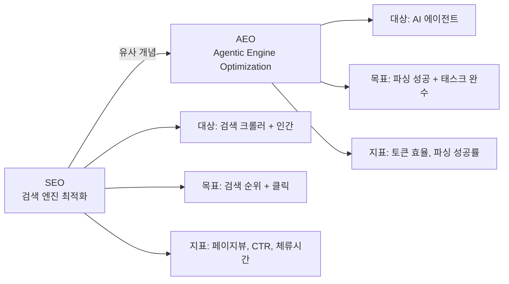
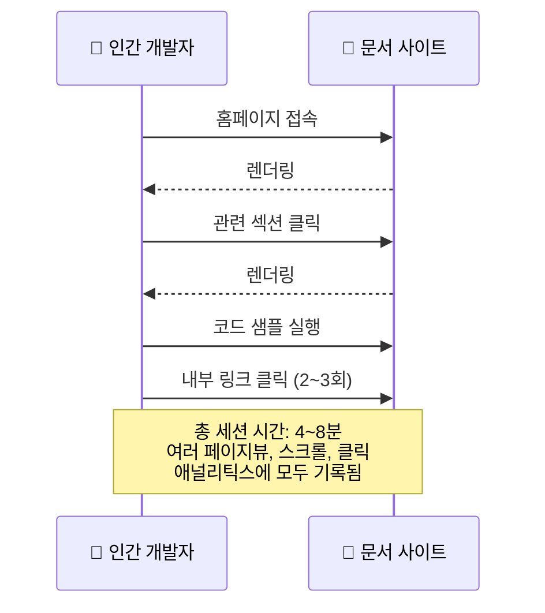
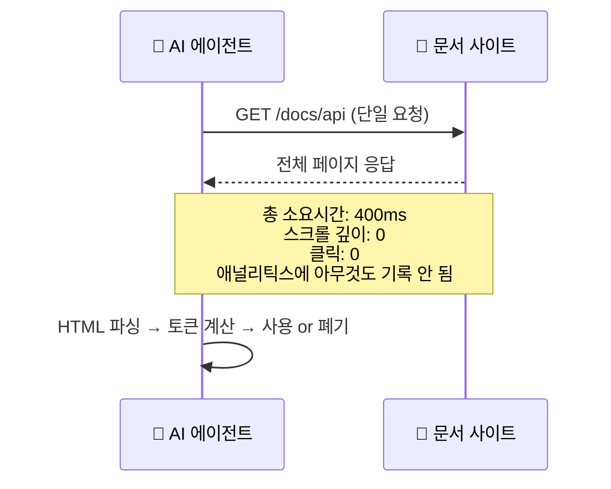
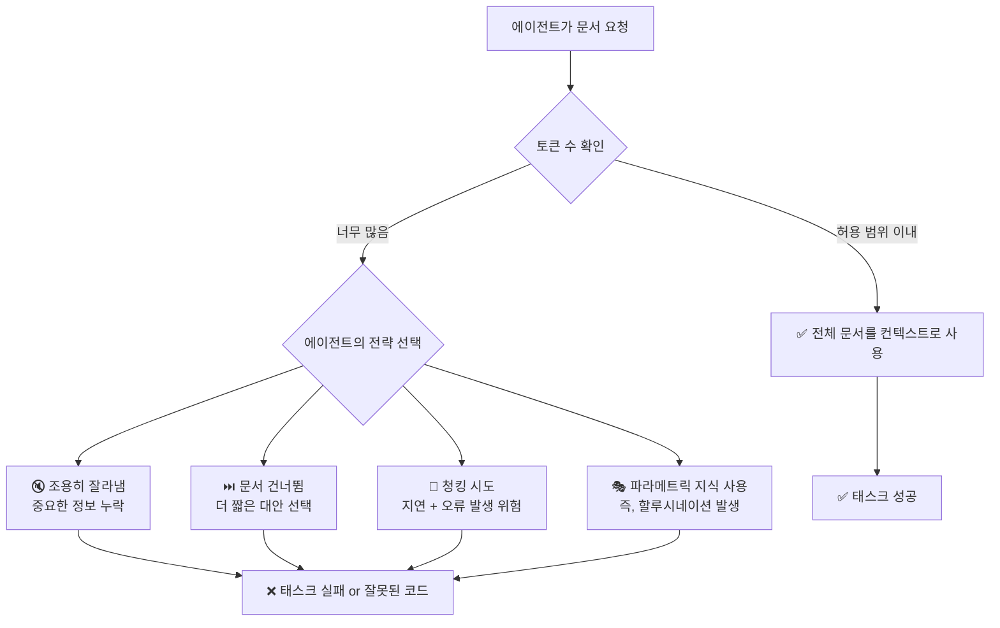
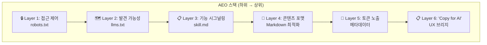
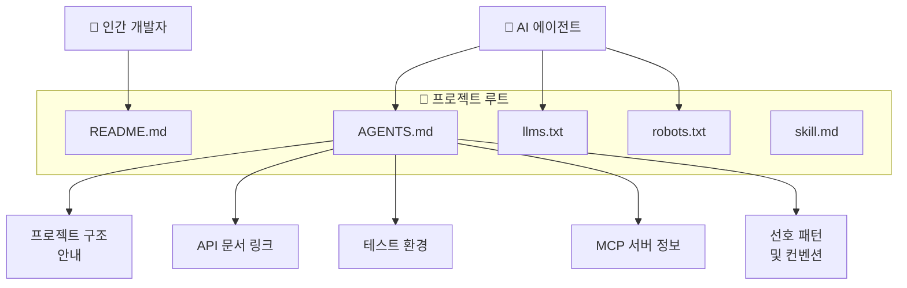
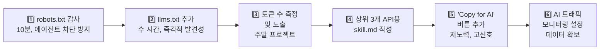

> **원문**: Addy Osmani (Google Cloud AI Director of Engineering)  
> **원문 게재일**: 2026년 4월 11일  
> **원문 URL**: https://addyosmani.com/blog/agentic-engine-optimization/  
> **분석 작성일**: 2026-04-18

---

## 목차

1. [개요 및 배경](#1-개요-및-배경)
2. [AEO란 무엇인가?](#2-aeo란-무엇인가)
3. [AI 에이전트가 문서를 읽는 방식](#3-ai-에이전트가-문서를-읽는-방식)
4. [토큰 문제: 당신의 문서는 에이전트에게 보이지 않을 수 있다](#4-토큰-문제)
5. [AEO 스택: 실제로 구축해야 할 것들](#5-aeo-스택)
6. [AGENTS.md: 새로운 기본 진입점](#6-agentsmd)
7. [AI 레퍼럴 트래픽 모니터링](#7-ai-레퍼럴-트래픽-모니터링)
8. [개발자 경험에 대한 더 넓은 함의](#8-개발자-경험에-대한-더-넓은-함의)
9. [AEO 감사 체크리스트](#9-aeo-감사-체크리스트)
10. [실천 우선순위 및 시작 방법](#10-실천-우선순위-및-시작-방법)
11. [비판적 시각과 업계 반응](#11-비판적-시각과-업계-반응)
12. [관련 도구: agentic-seo](#12-관련-도구-agentic-seo)
13. [종합 평가 및 시사점](#13-종합-평가-및-시사점)

---

## 1. 개요 및 배경

### 저자 소개

이 글의 저자인 **Addy Osmani**는 Google Cloud AI의 엔지니어링 디렉터로, 개발자들이 Gemini, Vertex AI, ADK(Agent Development Kit)를 통해 성공할 수 있도록 지원하는 역할을 맡고 있다. 그는 Chrome 팀에서 약 14년간 DevTools, Lighthouse, Core Web Vitals 등의 개발자 경험을 주도한 베테랑 엔지니어이며, *Learning JavaScript Design Patterns*, *Leading Effective Engineering Teams* 등의 저서로도 유명하다. Google DeepMind, 엔지니어링, 제품, 개발자 관계 팀을 연결하는 가교 역할을 하고 있으며, 25년 이상의 개발 경력을 보유하고 있다. (관련글 : [**AI 코딩 에이전트를 위한 프로덕션 수준의 엔지니어링 스킬 모음집**](https://k82022603.github.io/posts/ai-%EC%BD%94%EB%94%A9-%EC%97%90%EC%9D%B4%EC%A0%84%ED%8A%B8%EB%A5%BC-%EC%9C%84%ED%95%9C-%ED%94%84%EB%A1%9C%EB%8D%95%EC%85%98-%EC%88%98%EC%A4%80%EC%9D%98-%EC%97%94%EC%A7%80%EB%8B%88%EC%96%B4%EB%A7%81-%EC%8A%A4%ED%82%AC-%EB%AA%A8%EC%9D%8C%EC%A7%91/))

### 왜 이 주제가 중요한가?

2026년 현재, Claude Code, Cursor, Cline, Aider, GitHub Copilot 같은 AI 코딩 에이전트가 실제 개발 워크플로우에 깊숙이 침투해 있다. 개발자들은 이제 문서를 직접 읽는 대신 AI 에이전트에게 작업을 위임하고, 에이전트가 필요한 문서를 직접 가져와 해석한 뒤 코드를 생성하는 방식으로 일하고 있다.

이 패러다임 변화는 매우 근본적인 문제를 제기한다. **수십 년간 인간 독자를 위해 최적화된 기술 문서가 과연 AI 에이전트에게도 잘 작동하는가?** Osmani의 답은 단호하다: **"아니다."**

그는 이 간극을 해결하는 새로운 규율을 **Agentic Engine Optimization (AEO)** 라고 명명하며, 개발자 포털과 API 문서를 운영하는 모든 팀이 즉각적으로 주목해야 할 변화라고 주장한다.

---

## 2. AEO란 무엇인가?

### 공식 정의

> **Agentic Engine Optimization (AEO)**: AI 코딩 에이전트가 실제로 사용할 수 있도록 기술 콘텐츠를 구조화하고, 포맷하고, 제공하는 실천 방법. 인간 독자만이 아닌, 자율적으로 콘텐츠를 가져오고, 파싱하고, 추론하는 AI 에이전트를 위한 최적화.

### SEO와의 유사성

Osmani는 AEO를 SEO(검색 엔진 최적화)와 비교한다. 우리는 수년간 검색 크롤러와 인간의 클릭 패턴을 위해 최적화하는 방법을 배웠다. AEO는 동일한 아이디어이지만, 소비자가 다르다: 인간 대신 AI 에이전트다.



### AEO가 다루는 핵심 문제 영역

AEO가 중요하게 다루는 요소는 다음 다섯 가지다:

1. **발견 가능성(Discoverability)**: 에이전트가 JavaScript 렌더링 없이도 문서를 찾을 수 있는가?
2. **파싱 가능성(Parsability)**: 콘텐츠가 시각적 레이아웃 해석 없이도 기계가 읽을 수 있는가?
3. **토큰 효율성(Token Efficiency)**: 콘텐츠가 에이전트의 컨텍스트 윈도우 안에 잘리지 않고 들어가는가?
4. **기능 시그널링(Capability Signaling)**: 문서가 API를 어떻게 호출하는지뿐만 아니라, API가 무엇을 할 수 있는지 알려주는가?
5. **접근 제어(Access Control)**: robots.txt가 AI 트래픽을 실제로 허용하는가?

이 다섯 가지 중 하나라도 실패하면, 에이전트는 콘텐츠를 아예 건너뛰거나 미묘하게 잘못된 출력을 만들어낸다. 더 심각한 문제는 **어떤 애널리틱스 이벤트도 발화되지 않기 때문에 이 실패를 감지조차 할 수 없다**는 점이다.

---

## 3. AI 에이전트가 문서를 읽는 방식

### 인간 vs 에이전트: 행동 패턴 비교

Osmani가 인용한 연구(Developer Experience with AI Coding Agents)는 Claude Code, Cursor, Cline, Aider, VS Code, Junie 등 9개의 주요 AI 코딩 에이전트의 HTTP 트래픽을 분석했다. 결과는 충격적이다.





### 에이전트 트래픽의 지문(Fingerprint)

연구는 각 AI 에이전트 별로 고유한 HTTP 행동 서명을 식별했다. 서버 로그에서 이를 활용하면 AI 트래픽을 정확하게 탐지할 수 있다.

| 에이전트 | HTTP 런타임 | 사전 페치 동작 | HTTP 서명 |
|---|---|---|---|
| **Aider** | Headless Chromium (Playwright) | 온디맨드 GET | Full Mozilla/Safari user-agent |
| **Claude Code** | Node.js / Axios | 온디맨드 GET | `axios/1.8.4` |
| **Cline** | curl | GET + OpenAPI/Swagger 스윕 | `curl/8.4.0` |
| **Cursor** | Node.js / got | HEAD 프로브 → GET | `got (sindresorhus/got)` |
| **Junie** | curl | 순차 다중 페이지 GET | `curl/8.4.0` |
| **OpenCode** | Headless Chromium (Playwright) | 온디맨드 GET | Full Mozilla/Safari user-agent |
| **VS Code** | Electron / Chromium | 온디맨드 GET | Chromium 스타일 + Electron 마커 |
| **Windsurf** | Go / Colly | 온디맨드 GET | `colly` |

ChatGPT, Claude, Gemini, Perplexity 같은 AI 어시스턴트 웹 서비스도 사용자가 채팅 인터페이스에서 URL을 공유할 때 자체적인 서버 사이드 페치를 발생시키며, 각자 고유한 지문을 남긴다.

### 기존 애널리틱스가 실패하는 이유

이 행동 패턴의 가장 중요한 함의는 **전통적인 클라이언트 사이드 애널리틱스가 에이전트 트래픽을 완전히 놓친다**는 것이다:

- 스크롤 깊이: 측정 불가 (에이전트는 스크롤하지 않음)
- 페이지 체류 시간: 400ms (의미 없음)
- 버튼 클릭: 없음
- 튜토리얼 완료: 측정 불가
- 링크 팔로우: 없음
- 폼 인터랙션: 없음

에이전트는 분명히 당신의 문서를 **읽었다**. 하지만 당신의 퍼널은 아무것도 보여주지 않는다. 이것은 단순한 측정 문제가 아니라, **보이지 않는 성공 혹은 보이지 않는 실패**가 지속적으로 발생하고 있다는 의미다.

---

## 4. 토큰 문제

### 에이전트에게 토큰이란 무엇인가?

AI 에이전트는 무한한 컨텍스트를 갖지 않는다. 대부분의 에이전트는 실제 사용 가능한 컨텍스트 한계가 100K~200K 토큰 사이이며, 컨텍스트 관리는 모든 태스크에서 능동적인 제약 조건이다.

Osmani는 구체적인 사례를 든다: Cisco Secure Firewall Management Center REST API Quick Start Guide (Version 10.0)는 **193,217 토큰, 약 718,000자**에 달한다. 단 하나의 문서가 대부분의 에이전트의 전체 사용 가능한 컨텍스트 윈도우를 소진하거나 초과할 수 있는 것이다.

### 문서가 너무 길 때 벌어지는 일



이 때문에 Osmani는 **토큰 수가 이제 1급 문서 메트릭**이라고 주장한다. 에이전트는 실제로 토큰 수를 보고 콘텐츠를 읽을지 말지를 결정한다.

### 실용적인 토큰 목표치

| 문서 유형 | 권장 최대 토큰 수 |
|---|---|
| 퀵스타트 / 시작하기 페이지 | **15,000 토큰 미만** |
| 개별 API 레퍼런스 페이지 | **25,000 토큰 미만** |
| 전체 API 레퍼런스 | 리소스/엔드포인트별로 청킹 |
| 개념 가이드 | **20,000 토큰 미만**; 세부사항은 링크 |

**토큰 추정 방법**: 서버 사이드에서 문자 수를 세고 약 4로 나누면 대략적인 토큰 수를 얻을 수 있다.

---

## 5. AEO 스택

Osmani는 AEO를 단일 행동이 아닌 계층화된 신호와 표준의 집합으로 정의한다. 이를 '스택'으로 개념화하면 다음과 같다:



### Layer 1: 접근 제어 (robots.txt)

robots.txt는 에이전트의 첫 번째 방문지다. 많은 에이전트들은 콘텐츠를 가져오기 전에 robots.txt를 확인해 무엇에 접근할 수 있는지 파악한다.

**핵심 문제**: 잘못 구성된 robots.txt가 알려진 AI 크롤러를 차단하면, 에이전트는 문서에 아무런 소리 없이 접근하지 못한다. 트래픽도 없고, 오류도 없고, 무언가 잘못됐다는 표시도 없다.

**실천 방법**:
- robots.txt에서 AI 에이전트 user-agent를 의도치 않게 차단하는 규칙이 있는지 감사
- ClaudeBot, GPTBot 등 잘 알려진 AI 에이전트 패턴을 명시적으로 허용하는 것 고려
- 더 세밀한 제어가 필요하다면, 자동화된 상호작용을 허용하는 에이전트, 속도 제한, 선호 API 엔드포인트 등을 선언적으로 지정하는 신흥 표준인 `agent-permissions.json` 검토

### Layer 2: llms.txt를 통한 발견 가능성

에이전트가 콘텐츠에 접근할 수 있더라도, 올바른 콘텐츠를 찾아야 한다. 이를 위한 것이 `llms.txt`다.

**개념**: llms.txt는 AI 에이전트를 위한 사이트맵이다. `yourdomain.com/llms.txt`에 호스팅되는 평문 Markdown 형식의 파일로, 에이전트가 전체 사이트를 크롤하지 않고도 관련성 있는 내용을 파악할 수 있도록 설명이 포함된 문서 디렉토리를 제공한다.

**좋은 llms.txt의 특성**:
- 페이지 이름만이 아닌, 에이전트가 거기서 무엇을 찾을지 알려주는 설명
- 유용한 경우 페이지별 토큰 수 (에이전트가 컨텍스트 결정을 할 수 있도록)
- 제품 계층 구조가 아닌 태스크 기준으로 구성
- 그 자체로 5,000 토큰 미만 (인덱스 파일이 예산을 날려버리면 안 됨)

**llms.txt 예시**:
```markdown
# YourProduct Documentation

## Getting Started
- [Quick Start Guide](/docs/quickstart): 5분 안에 설치하고 첫 API 호출 하기
- [Authentication](/docs/auth): OAuth 2.0 및 API 키 인증 패턴 (8K tokens)
- [Core Concepts](/docs/concepts): 데이터 모델, 엔티티, 용어 (12K tokens)

## API Reference
- [REST API Overview](/docs/api): 기본 URL, 버전, 페이지네이션, 오류 코드
- [Users API](/docs/api/users): 사용자 관리 CRUD 작업 (12K tokens)
- [Events API](/docs/api/events): 이벤트 스트리밍 및 웹훅 구성 (8K tokens)

## MCP Integration
- [MCP Server](/docs/mcp): 직접 에이전트 통합을 위한 MCP 서버
```

### Layer 3: skill.md를 통한 기능 시그널링

`llms.txt`는 에이전트에게 어디에 무엇이 있는지 알려준다. `skill.md`는 제품이 실제로 무엇을 할 수 있는지 알려준다.

이 구분이 생각보다 훨씬 중요하다. 에이전트가 산문 형식의 문서에서 기능을 추론해야 하는 대신, `skill.md`는 기능을 선언적으로 노출한다. 의도를 엔드포인트와 리소스에 매핑하는 것이다.

**skill.md 예시 (인증 서비스)**:
```yaml
---
name: auth-service
description: 사용자 인증, OAuth 2.0 플로우, 세션 관리를 처리
---

## 수행 가능한 작업
- OAuth 2.0을 통한 사용자 인증 (authorization code, client credentials, PKCE)
- JWT 토큰 발급 및 유효성 검사
- 사용자 세션 및 리프레시 토큰 로테이션 관리
- SSO 제공자 연동 (SAML, OIDC)

## 필요한 입력
- Client ID 및 Client Secret (개발자 콘솔에서)
- Redirect URI (사전 등록 필요)
- 요청 스코프 (read:user, write:data, admin)

## 제약 사항
- 속도 제한: 애플리케이션당 분당 1000 토큰 요청
- 토큰 만료: 액세스 토큰 1시간, 리프레시 토큰 30일
- 공개 클라이언트에는 PKCE 필수

## 핵심 문서
- [OAuth 2.0 가이드](/docs/oauth): 코드 샘플 포함 전체 플로우 안내
- [토큰 레퍼런스](/docs/tokens): 토큰 구조, 클레임, 유효성 검사
```

### Layer 4: 에이전트 파싱을 위한 콘텐츠 포맷

완벽한 발견성과 기능 시그널링이 있어도, 실제 콘텐츠가 에이전트가 읽을 수 있는 형식이어야 한다.

**핵심 원칙들**:

**① Markdown을 제공하라 (HTML만이 아닌)**
많은 문서 플랫폼은 URL에 `.md`를 붙이거나 쿼리 파라미터를 통해 원시 Markdown에 접근할 수 있다. 에이전트는 Markdown을 HTML보다 훨씬 낮은 토큰 오버헤드로 처리한다 (태그 노이즈, 내비게이션 크롬, 푸터 쓰레기 없음).

**② 읽기가 아닌 스캔을 위해 구조화하라**
에이전트는 선형적으로 읽지 않는다 — 구조를 파싱한다:
- 일관된 헤딩 계층 사용 (H1 → H2 → H3, 건너뜀 없이)
- 각 섹션을 배경이 아닌 결과로 시작
- 코드 예제는 설명 바로 뒤에 배치
- 파라미터 레퍼런스에는 표 사용 (산문 목록보다 압축이 잘 됨)

**③ 내비게이션 노이즈를 제거하라**
HTML에 나타나는 사이드바, 브레드크럼, 푸터 링크는 Markdown/텍스트에서 그냥 노이즈다.

**④ 유용한 내용을 앞에 배치하라**
어떤 페이지든 처음 500 토큰은 다음을 답해야 한다: 이게 무엇인지, 무엇을 할 수 있는지, 시작하려면 무엇이 필요한지.

### Layer 5: 토큰 노출

문서 페이지에 토큰 수를 노출하는 것이다. 이상적으로는 llms.txt 인덱스와 페이지 자체 모두에 (메타데이터 또는 페이지 헤더로).

**에이전트가 할 수 있는 스마트한 결정들**:
- "이 페이지는 8K 토큰 — 컨텍스트에 전부 포함할 수 있다"
- "이 페이지는 150K 토큰 — 관련 섹션만 가져와야 한다"
- "이 페이지는 내 컨텍스트 윈도우를 초과한다 — llms.txt의 요약을 사용하겠다"

**구현**: 서버 사이드에서 문자 수를 세고, 약 4로 나눠 대략적인 토큰 수를 추정하고, meta 태그나 HTTP 응답 헤더로 노출한다.

### Layer 6: "Copy for AI" UX 브리지

개발자가 IDE에서 AI 어시스턴트와 함께 작업하면서 문서를 컨텍스트로 포함하고 싶을 때, 현재는 렌더링된 HTML에서 복사 붙여넣기를 한다 — 내비게이션 노이즈, 푸터 등이 모두 포함된다. **"Copy for AI" 버튼**은 클린 Markdown을 클립보드에 복사하며, 에이전트가 받는 컨텍스트의 질을 의미 있게 향상시킨다.

Anthropic, Cloudflare 등이 이미 이 기능의 변형을 출시했다. 노력은 적고 신호는 강하다.

---

## 6. AGENTS.md

### 새로운 표준 진입점

`README.md`가 저장소를 탐색하는 인간 개발자를 위한 기본 진입점이 된 것처럼, `AGENTS.md`는 AI 에이전트를 위한 진입점이 되고 있다. 코딩 에이전트가 프로젝트를 열면, 루트 디렉토리의 `AGENTS.md`를 찾아 이후의 모든 태스크에 그 지시사항을 반영한다.

### 좋은 AGENTS.md의 구성 요소

- 프로젝트 구조 및 주요 파일 위치
- 관련 API 또는 서비스 문서에 대한 직접 링크
- 사용 가능한 개발 샌드박스 및 테스트 환경
- 에이전트가 알아야 할 속도 제한 및 제약사항
- 코드베이스의 선호 패턴 및 컨벤션
- 사용 가능한 MCP 서버 링크

### 실제 채택 사례

Cisco DevNet은 이미 이를 오픈소스 프로젝트의 GitHub 템플릿에 기본 파일로 채택했다. 새로 만들어지는 프로젝트는 프로젝트 고유의 콘텐츠, OpenAPI 문서 링크, DevNet 샌드박스, 테스트 환경이 미리 채워진 `AGENTS.md`와 함께 시작한다.



---

## 7. AI 레퍼럴 트래픽 모니터링

### 지금 당장 할 수 있는 일: AI 레퍼럴 트래픽 추적

모니터링할 레퍼럴 소스들:

| 소스 | 설명 |
|---|---|
| `labs.perplexity.ai/referral` | Perplexity AI |
| `chatgpt.com/(none)` | ChatGPT |
| `chatgpt.com/organic` | ChatGPT 오가닉 트래픽 |
| `claude.ai/referral` | Claude |
| `copilot.microsoft.com/referral` | Microsoft Copilot |
| `gemini.google.com/referral` | Google Gemini |
| `platform.openai.com/referral` | OpenAI 플랫폼 |
| `perplexity/(not set)` | Perplexity 직접 트래픽 |

또한 앞서 언급한 HTTP 지문(`axios/1.8.4`, `curl/8.4.0`, `got (sindresorhus/got)`, `colly`)도 모니터링해야 한다. 이 에이전트들은 레퍼러 없이 직접 도착하기 때문이다.

AI 트래픽 세그먼트를 제대로 구축하는 것이, AEO 작업이 실제로 효과를 내고 있는지를 나타내는 선행 지표를 제공한다.

---

## 8. 개발자 경험에 대한 더 넓은 함의

### 기존 가정이 무너진다

웹의 역사 대부분에서, 개발자 포털은 인간의 인지 패턴을 중심으로 설계되었다: 점진적 공개, 시각적 계층 구조, 인터랙티브 예제, 가이드된 튜토리얼. 이 모두는 인간이 모든 단계에 있다고 가정한다.

에이전트 중심 세계에서 이 가정들이 무너진다:

| 전통적 설계 가정 | 에이전트 세계의 현실 |
|---|---|
| 시각적 계층 구조가 중요함 | 에이전트는 레이아웃이 아닌 텍스트를 읽음 |
| 점진적 공개가 도움이 됨 | 에이전트는 모든 것을 한 번에 원함 |
| 인터랙티브 예제가 가치 있음 | 정적/API 동등물이 없으면 가치 없음 |
| 사용자 여정이 중요함 | 다챕터 튜토리얼이 단일 컨텍스트 로드가 됨 |

### 두 청중을 동시에 섬기는 문서

**그렇다고 인간 중심 설계가 중요하지 않아지는 것은 아니다.** 인간은 여전히 문서를 읽는다. 하지만 점점 더 많은 경우, AI 어시스턴트의 컨텍스트 안에서 읽는다 — 에이전트가 종종 근접 소비자(proximate consumer)가 되고, 인간이 궁극적 수혜자가 된다.

최선의 문서는 두 청중을 동시에 섬겨야 한다: 인간을 위해 스캔하기 좋고 잘 구조화되어 있으며, 에이전트를 위해 기계가 읽을 수 있고 토큰 효율적이어야 한다. 다행히도 **에이전트를 위해 구축하면 인간을 위한 문서도 더 좋아지는 경향이 있다**. 두 규율은 생각보다 겹치는 부분이 훨씬 많다.

---

## 9. AEO 감사 체크리스트

### 발견 가능성

- [ ] llms.txt가 모든 문서의 구조화된 인덱스와 함께 루트에 존재
- [ ] robots.txt가 알려진 AI 에이전트 user-agent를 의도치 않게 차단하지 않음
- [ ] agent-permissions.json이 자동화 클라이언트를 위한 접근 규칙 정의
- [ ] 코드 저장소의 AGENTS.md가 관련 문서 링크 포함

### 콘텐츠 구조

- [ ] 문서 페이지가 클린 Markdown으로 제공 가능 (렌더링된 HTML만이 아닌)
- [ ] 각 페이지가 처음 200단어 안에 명확한 결과 문장으로 시작
- [ ] 헤딩이 일관되고 계층적으로 올바름
- [ ] 코드 예제가 산문 설명 바로 뒤에 위치
- [ ] 파라미터 레퍼런스가 중첩된 산문 대신 표 사용

### 토큰 경제

- [ ] 문서 페이지별 토큰 수 추적
- [ ] 청킹 전략 없이 단일 페이지가 30,000 토큰 초과 없음
- [ ] 주요 페이지의 토큰 수가 llms.txt에 노출
- [ ] 토큰 수가 페이지 메타데이터로 제공 (meta 태그 또는 HTTP 헤더)

### 기능 시그널링

- [ ] skill.md 파일이 각 서비스/API가 무엇을 하는지 설명 (호출 방법만이 아닌)
- [ ] 각 스킬이 포함하는 것: 기능, 필요한 입력, 제약사항, 주요 문서 링크
- [ ] 해당하는 경우 직접 에이전트 통합을 위한 MCP 서버 제공

### 애널리틱스

- [ ] 웹 애널리틱스에서 AI 레퍼럴 소스 세그먼트화
- [ ] 알려진 AI 에이전트 HTTP 지문에 대한 서버 로그 모니터링
- [ ] AI vs 인간 트래픽 비율 기준선 설정

### UX 브리지

- [ ] 문서 페이지에 "Copy for AI" 버튼 제공
- [ ] URL 컨벤션으로 Markdown 소스 접근 가능 (예: `.md` 추가)

---

## 10. 실천 우선순위 및 시작 방법

Osmani는 모든 체크리스트가 부담스러울 수 있음을 인정하며, 다음 순서를 권장한다:



각 단계의 특징:
1. **robots.txt 감사** — 10분 작업, 에이전트 조용한 차단 방지
2. **llms.txt 추가** — 수 시간 소요, 즉각적인 발견성 향상
3. **토큰 수 측정 및 노출** — 주말 프로젝트, 레버리지가 높음
4. **상위 3개 API용 skill.md 작성** — 에이전트가 가장 많이 사용할 API부터 시작
5. **"Copy for AI" 버튼 추가** — 낮은 노력, 높은 신호
6. **AI 트래픽 모니터링 설정** — 다른 모든 작업을 정당화할 데이터 확보

---

## 11. 비판적 시각과 업계 반응

### 긍정적 반응

이 글은 공개 후 빠르게 확산되었다. SEO 전문가, 개발자 포털 담당자, AI 도구 개발자들 사이에서 큰 반향을 일으켰다. Glenn Gabe 같은 SEO 전문가들은 "Addy를 오래 팔로우해왔는데 이 포스트가 확실히 눈에 띈다"며 AEO 스택 개념에 주목했다.

### 회의적 시각과 논란

몇 가지 중요한 반론도 제기되었다:

**1. AEO 용어 혼란**
Shaun Anderson 같은 SEO 전문가는 "AEO는 이미 Answer Engine Optimization의 약자로 사용되고 있다"며 용어 충돌 문제를 지적했다. Agentic SEO와 Agentic Engine Optimization이 같은 개념이 아니라는 주장도 있다.

**2. Google 내부의 불일치**
주목할 점은, Google의 다른 측면에서 공식적으로 일치하지 않는 의견이 나왔다는 것이다. Google의 John Mueller는 **Markdown 페이지에 반대**하며, Google이 `llms.txt` 파일을 사용하지 않는다고 언급했다. Osmani가 Google Cloud AI 소속이고 Mueller가 Google Search 소속인 점을 고려할 때, 이는 Google 내부에서도 팀들이 완전히 일치하지 않음을 시사한다.

**3. 실제 측정 가능성 문제**
AEO의 효과를 측정하기 어렵다는 점도 비판 대상이다. 에이전트 트래픽이 서버 로그에 나타나더라도, 그것이 실제 태스크 성공으로 이어지는지를 추적하기는 여전히 매우 어렵다.

**4. 표준화 부재**
`llms.txt`, `skill.md`, `AGENTS.md`는 아직 공식 표준이 아니며, 각 AI 에이전트가 이를 실제로 얼마나 일관되게 참조하는지도 불명확하다.

---

## 12. 관련 도구: agentic-seo

Osmani는 이 개념과 함께 `agentic-seo`라는 오픈소스 감사 도구도 공개했다. GitHub 저장소 `addyosmani/agentic-seo`에서 확인할 수 있다.

### 주요 기능

- robots.txt AI 에이전트 차단 여부 확인
- llms.txt 존재 및 품질 확인
- 페이지별 토큰 수 측정
- Markdown 접근 가능성 확인
- 5개 카테고리, 10개 검사 항목으로 100점 만점 채점
- Lighthouse와 유사한 개념 — 에이전트 준비도 기준

### 사용 방법

```bash
# 현재 디렉토리 감사 (프레임워크 자동 감지)
npx agentic-seo

# 특정 디렉토리 감사
npx agentic-seo ./my-docs-site

# 라이브 URL 감사
npx agentic-seo --url https://docs.example.com

# 누락된 AEO 파일 스캐폴드
npx agentic-seo init
```

### 설정 옵션

```json
{
  "outputDir": "_site",
  "checks": {
    "token-budget": {
      "maxTokensPerPage": 25000
    },
    "robots-txt": {
      "requiredAgents": ["ClaudeBot", "GPTBot"]
    }
  },
  "ignore": ["**/node_modules/**", "**/vendor/**"],
  "threshold": 60
}
```

---

## 13. 종합 평가 및 시사점

### 핵심 인사이트 요약

AEO는 단순한 기술적 체크리스트를 넘어, **웹 콘텐츠 소비 패러다임의 근본적 변화를 인식하는 프레임워크**다. SEO가 우리에게 "좋은 콘텐츠만으로는 충분하지 않다 — 실제 트래픽 패턴에 맞게 발견 가능하게 만들어야 한다"는 교훈을 줬듯, AEO는 같은 교훈을 에이전트 시대에 적용한다.

AI 코딩 에이전트는 이미 문서 트래픽의 상당하고 증가하는 비중을 차지한다. 그들은 인간 독자와 근본적으로 다르게 행동한다. 그리고 대부분의 개발자 포털은 아직 이에 맞춰 구축되어 있지 않다.

### 한국 개발 커뮤니티에 대한 함의

한국의 기업 개발 환경, 특히 SI 기업과 내부 플랫폼 팀의 관점에서 AEO는 다음과 같은 시사점을 갖는다:

1. **내부 API 문서화 전략 재검토**: Claude Code, Cursor 등의 AI 코딩 도구를 팀에 도입했다면, 내부 API 문서도 AEO 관점에서 재검토해야 한다. 에이전트가 내부 문서를 제대로 파싱하지 못하면, AI 코딩 도구의 효과가 반감된다.

2. **MCP 서버 문서화**: MCP 서버를 구축했다면, 그 기능을 skill.md로 명확히 기술하는 것이 에이전트의 활용도를 높인다.

3. **토큰 효율성을 새로운 품질 기준으로**: 기존에는 "얼마나 상세한가"가 문서 품질 기준이었다면, 이제는 "얼마나 토큰 효율적인가"도 중요한 기준이 된다.

4. **AGENTS.md 도입**: AI 코딩 에이전트를 활용하는 프로젝트에 AGENTS.md를 표준화하면, 팀원들이 AI 도구를 더 일관되게 활용할 수 있다.

### 결론

Osmani의 AEO 개념은 아직 완전히 표준화된 것도, 모든 AI 에이전트에게 균일하게 적용되는 것도 아니다. 하지만 그가 포착한 트렌드 자체 — AI 에이전트가 기술 문서의 주요 소비자로 부상하고 있으며, 기존 최적화 방식으로는 이를 섬기지 못한다는 점 — 는 매우 실질적이다.

초기에 움직이는 팀은 진짜 이점을 누릴 것이다: 그들의 API가 에이전트가 추천하고, 성공적으로 통합하고, 다시 돌아올 API가 될 것이다. 늦게 움직이는 팀은 문서 품질과 실제 에이전트 태스크 성공 사이의 점점 커지는 간극을 마주할 것이다 — 디버그하기 진정으로 어려운 조용한 실패 모드를.

> **"SEO는 올바른 트래픽 패턴의 실제 소비자에게 발견 가능하게 만드는 것이 중요하다는 교훈을 줬다. AEO는 다른 소비자에게 적용되는 같은 교훈이다."** — Addy Osmani

---

*이 문서는 Addy Osmani의 원문 블로그 포스트(2026년 4월 11일)를 기반으로 작성되었으며, 추가적인 웹 검색을 통해 최신 업계 반응 및 맥락을 보완하였습니다.*

*작성일: 2026-04-18*
