> **원본 영상**: [Claude Code for Designers (Full Course on Agentic Design)](https://www.youtube.com/watch?v=NlVxAy05KNA)  
> **제작자**: Alan Fidan (DMBA — 디자이너를 위한 비즈니스 스쿨 운영자)  
> **공개일**: 2026년 4월 15일  
> **총 길이**: 약 4시간 28분  
> **문서 작성일**: 2026-04-18

---

## 목차

1. [강의 개요 및 배경](#1-강의-개요-및-배경)
2. [커리큘럼 전체 구조](#2-커리큘럼-전체-구조)
3. [Chapter 1 — Agentic Design란 무엇인가?](#3-chapter-1--agentic-design란-무엇인가)
4. [Chapter 2 — AI 에이전트는 어떻게 작동하는가?](#4-chapter-2--ai-에이전트는-어떻게-작동하는가)
5. [Chapter 3 — Agentic 환경 설정하기](#5-chapter-3--agentic-환경-설정하기)
6. [Chapter 4 — 시스템 프롬프트 (Claude.md)](#6-chapter-4--시스템-프롬프트-claudemd)
7. [Chapter 5 — 3계층 아키텍처](#7-chapter-5--3계층-아키텍처)
8. [Chapter 6 — 도구 연결하기 (MCP / CLI / API)](#8-chapter-6--도구-연결하기-mcp--cli--api)
9. [Chapter 7 — Discover: 경쟁사 파이프라인 연구](#9-chapter-7--discover-경쟁사-파이프라인-연구)
10. [Chapter 8 — Create: 웹사이트·스킬·프로토타입 제작](#10-chapter-8--create-웹사이트스킬프로토타입-제작)
11. [Chapter 9 — Systematize: AI Native 디자인 시스템](#11-chapter-9--systematize-ai-native-디자인-시스템)
12. [Chapter 10 — Automate: 반복 업무 자동화](#12-chapter-10--automate-반복-업무-자동화)
13. [핵심 개념 종합 정리](#13-핵심-개념-종합-정리)
14. [디자이너를 위한 실전 액션 플랜](#14-디자이너를-위한-실전-액션-플랜)

---

## 1. 강의 개요 및 배경

### 1.1 강사 소개와 강의의 목적

이 강의는 Alan Fidan이 제작했다. 그는 **DMBA(디자이너를 위한 비즈니스 스쿨)** 를 운영하며 지금까지 1만 명 이상의 졸업생을 배출했다. 원래 IDEO 출신의 비즈니스 디자이너로 엔지니어링 배경은 전혀 없지만, 지난 1년간 수백 시간을 Agentic AI 툴과 함께 보내며 회사 내부 제품과 자동화 시스템을 12개 이상 직접 구축했다.

강의의 핵심 메시지는 단 하나다. **"디자이너는 이제 실행자(Executor)에서 조율자(Orchestrator)로 진화해야 한다."** 이 과정에서 Claude Code가 핵심 도구가 된다.

### 1.2 왜 지금 Agentic Design을 배워야 하는가?

현재 기업의 모든 부서—법무, 마케팅, 엔지니어링, 재무—가 AI로 가속화되고 있다. 만약 디자인 팀만 속도를 따라잡지 못하면 **디자인이 병목(Bottleneck)이 된다**. 더 심각한 문제는 비디자이너들이 AI 툴과 디자인 시스템을 결합해 "80~90% 수준"의 UI를 스스로 만들 수 있게 되었다는 점이다.

그러나 일회성 디자인을 만드는 것과 그것을 시스템으로 유지·발전시키는 것은 완전히 다른 차원의 일이다. 바로 그 시스템을 구축하고 관리하는 역할이 **디자이너의 존재 가치**가 된다.

Alan은 이 시점을 2016년 Figma 학습 시기와 비교한다. 지금 Agentic Design을 먼저 습득하면 회사와 커뮤니티 전체의 표준을 선도할 수 있다.

---

## 2. 커리큘럼 전체 구조

강의는 크게 세 파트로 구성된다.

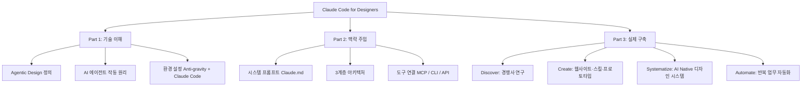

---

## 3. Chapter 1 — Agentic Design란 무엇인가?

### 3.1 Chat AI vs Agent AI의 근본적 차이

Agentic Design을 이해하려면 먼저 일반 채팅 AI와 에이전트 AI의 차이를 명확히 알아야 한다.

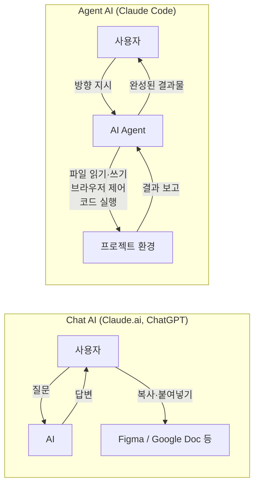

**Chat AI**는 사용자가 컨텍스트를 끌어다 넣고, AI가 답변하면, 사용자가 다시 그 결과를 복사해 원하는 환경에 적용하는 방식이다. 결국 "실제 작업"은 사람이 하는 것이다.

**Agent AI**는 다르다. 사용자가 방향을 지시하면 에이전트가 직접 파일에 접근하고, 브라우저를 열고, 코드를 실행하며 작업을 완수한다. 컨텍스트는 이미 그 안에 있다.

### 3.2 실전 데모: 폼 UX 리뷰

강의는 이를 도시 의회 주차 허가 신청 폼의 UX 검토를 예시로 보여준다.

**Chat 방식**: HTML 파일을 첨부하고 "UX 문제를 찾아줘"라고 요청하면 15개의 이슈 목록을 텍스트로 반환한다. 이 AI는 폼을 직접 실행해볼 수 없기 때문에 코드 읽기에만 의존한 분석이다.

**Agent 방식**: "내 UX 리뷰 스킬을 실행해줘"라고 말하면 다음이 자동으로 일어난다.

1. 로컬 서버를 띄워 폼을 실행 가능한 페이지로 만든다
2. `Maria(68세 시니어)`, `Jake(젊은 테크 사용자)`, `Heuristic Checker` 세 개의 서브 에이전트를 생성한다
3. 각 에이전트가 Chrome을 열고 실제로 폼을 작성한다
4. 완료 후 각 에이전트가 부모 에이전트에게 결과를 보고한다
5. 부모 에이전트가 모든 결과를 종합해 보고서를 생성한다

결과물에는 **UX 건강 점수**(40점 만점에 14점), 페르소나별 발견 이슈 테이블, 실제 사용 중 발견된 문제들(버그, 필드 오류 등), Top 5 수정 항목이 포함된다. Chat AI로는 절대 발견할 수 없는 런타임 이슈들이 포함되어 있었다.

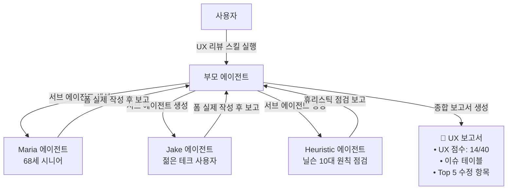

### 3.3 디자이너 역할의 변화

강의에서 Alan은 Miro 보드에 직접 손으로 쓴 메모로 이 개념을 시각화한다. 왼쪽에는 Chat AI("You Ask, AI Answers / Copy-Paste")를, 오른쪽에는 Agent AI("You Lead, AI Does Things for You")를 나란히 대비시키고, 그 아래에 "Role of Designer"라는 제목으로 역할 전환을 정리한다. 역할의 변화는 세 가지 축으로 요약된다.

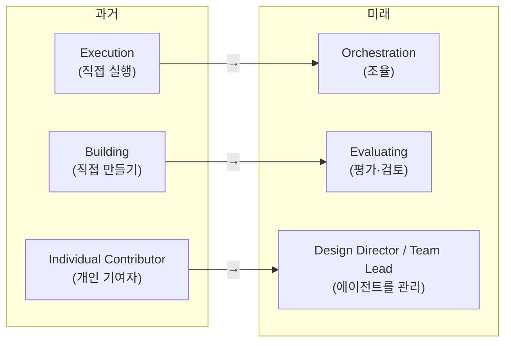

| 기존 역할 | → | 새로운 역할 |
|-----------|---|------------|
| Execution (직접 실행) | → | Orchestration (조율) |
| Building (직접 만들기) | → | Evaluating (평가·검토) |
| Individual Contributor | → | Design Director / Team Lead |

단, Alan은 "인간의 크래프트가 사라진다"는 것이 아님을 강조한다. 인간이 만든 디자인은 여전히 중요하지만, 그것이 사용되는 **빈도와 맥락이 달라진다**. 대부분의 기업은 속도와 비용을 최적화하기 위해 Agentic Design으로 이동할 것이며, 정교한 그래픽이나 특별한 순간에만 인간의 손이 필요해질 것이다.

### 3.4 Agentic Design 도구 생태계

강의에서 Alan은 두 개의 Miro 보드 슬라이드로 도구 생태계를 정리한다. 첫 번째 슬라이드는 "Tools for Agentic Design"이라는 제목 아래 General Agent Tools(Claude Code, "L→L"로 표기), Agentic Design Tools(Google Stitch, Figma Make), Legacy Design Tools(Figma, Adobe)를 구분해 보여준다. 두 번째 슬라이드는 이를 더 정교하게 발전시켜 "You(Creative Director)"를 정점에 놓고 그 아래 Explore(Stitch 등), Build(Claude Code, Cursor), Craft(Figma) 세 열로 나눠 각 툴의 입력-출력 방식(text→visual / text→things / pixel→pixel)을 구조화한다. 이를 정리하면 다음과 같다.

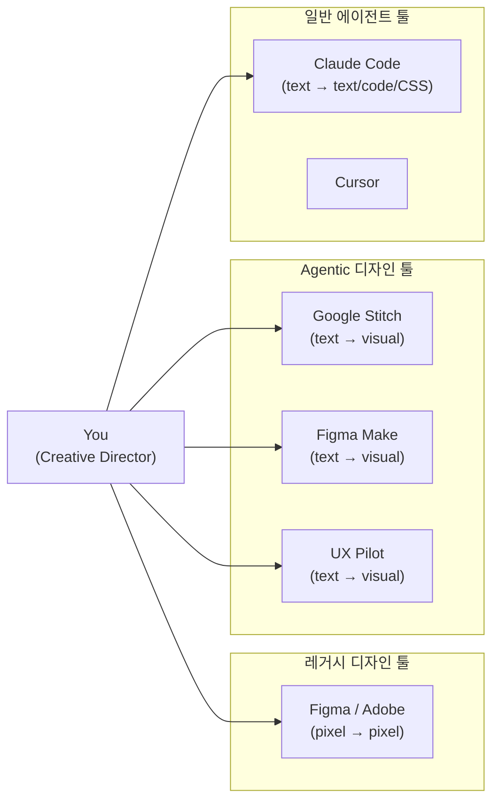

Claude Code로 디자이너가 할 수 있는 일들:

- **실제 작동하는 소프트웨어 제작 및 배포**
- **디자인 운영 자동화** (QA, 네이밍, 에셋 내보내기 스크립트)
- **대규모 리서치 데이터 분석** (인터뷰 녹취, 설문 → 인사이트)
- **내부 도구 제작** (대시보드, 계산기, 생성기)
- **API로 도구 연결** (Figma ↔ Google Sheets ↔ Slack)
- **자기강화 디자인 시스템 구축** (에이전트가 코드 규칙 준수를 경찰 역할)
- **실제 사용자처럼 디자인 테스트** (브라우저 자동화)

### 3.5 Claude Code vs Claude Cowork 비교

같은 Anthropic 제품이지만 근본적으로 다르다.

| 항목 | Claude Cowork | Claude Code |
|------|---------------|-------------|
| 작동 방식 | 화면 스크린샷 → 클릭 | 파일 시스템 직접 읽기/쓰기 |
| 속도 | 느림 | 빠름 |
| 기능 범위 | 제한적 | 광범위 |
| 대상 | 코드를 모르는 사용자 | 적극적 활용자 |
| 권장 여부 | 입문용 | **강력 권장** |

---

## 4. Chapter 2 — AI 에이전트는 어떻게 작동하는가?

이 챕터는 Claude Code를 잘 사용하는 데 필요한 가장 근본적인 원리를 다룬다.

### 4.1 핵심 원리: 확률론적(Probabilistic) 본질

강의 Miro 보드에는 이 개념을 대비해 시각화한 슬라이드가 등장한다. 왼쪽 "Probabilistic" 열에는 동일한 입력("Make me a card layout")이 AI를 거쳐 Run 1, Run 2, Run 3에서 각각 A, B, C로 다른 결과를 낸다고 표현한다. 오른쪽 "Deterministic" 열에는 동일한 입력(run export.py)이 Script를 거쳐 항상 동일한 결과("Always this. Exactly this.")를 낸다고 표현한다. AI는 **확률론적 기계**다. 동일한 입력을 줘도 매번 다른 출력이 나온다. Alan은 세 개의 Claude 창에 동일한 프롬프트("디자이너들이 Claude Code를 쓰는 짧은 노래를 써줘")를 넣어 완전히 다른 결과가 나오는 것을 시연한다.

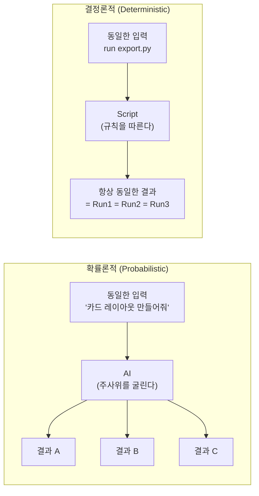

이 특성은 **창의성**의 원천이 되기도 하고, **신뢰성**의 걸림돌이 되기도 한다. 브레인스토밍이나 탐색 단계에서는 확률론적 특성이 유리하지만, 반복 실행이 필요한 프로덕션 작업에서는 결정론적 접근이 필요하다.

Claude Code가 강력한 이유는 **두 세계를 모두 커버하기 때문**이다. AI의 지능으로 코드(스크립트)를 작성하고, 그 스크립트는 결정론적으로 실행된다.

### 4.2 AI는 언어 기계다 (비주얼 기계가 아님)

강의의 Miro 슬라이드는 이 개념을 명확하게 시각화한다. 왼쪽에 "LLM"이라는 레이블과 함께, AI에게 들어오는 세 가지 입력 경로를 보여준다. 첫째는 "Your design (what you see)", 둘째는 "Your brief (what you write)", 셋째는 "Your rules (your constraints)"이며, 이 세 경로가 모두 중앙의 AI 박스로 흘러들어 "Tokens In → Tokens Out"을 거쳐 오른쪽에 words / code / CSS 세 가지 형태로 출력된다. 우측 여백에는 "We think visually, but LLMs don't! So, don't just SHOW. DESCRIBE."라는 핵심 메시지가 적혀 있다. LLM은 시각을 인식하는 것이 아니라, 비주얼을 언어로 번역해서 처리한다.

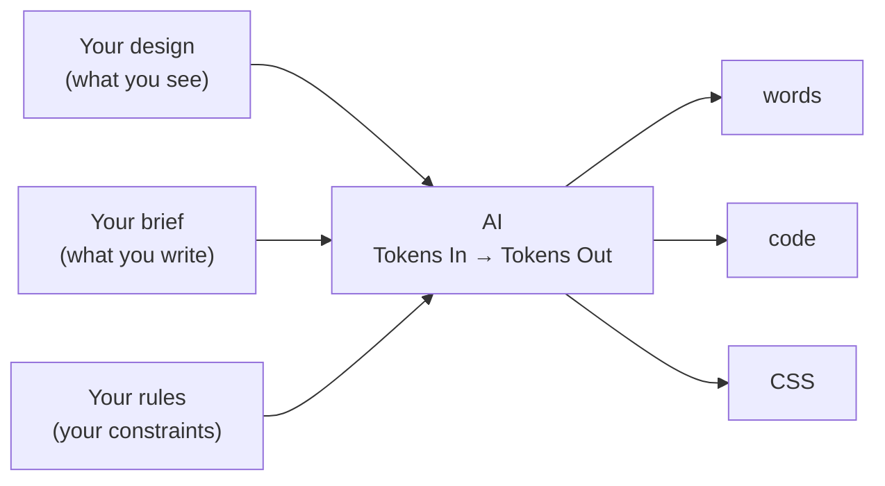

> **스크린샷을 넣어줄 때**: AI는 그 이미지를 "본다"고 생각하지만, 실제로는 언어/코드/CSS로 번역해서 이해한다.

따라서 디자이너들은 비주얼 작업 시 **말로도 설명을 추가**해야 한다. Alan이 권장하는 방법은 **Voice-to-Text 도구** 사용이다. 단축키 하나로 마이크를 켜서 머릿속 생각을 그냥 말하면 텍스트가 되어 프롬프트에 추가된다.

또한 HTML 파일은 스크린샷보다 훨씬 풍부한 정보를 AI에게 제공한다. 가능하면 HTML 소스 파일을 직접 제공하는 것이 좋다.

### 4.3 AI는 자신 있게 틀린다 (Hallucination)

AI는 망설임 없이 틀린 사실을 생성한다. 이것이 에이전트 워크플로에서 **사람의 역할이 중요한 이유**다. 디자이너는 AI가 생성한 결과물을 시각적·논리적으로 검토하는 필터 역할을 해야 한다.

복수의 에이전트를 병렬로 실행하는 전략도 이 문제를 완화한다. 5개의 에이전트가 동일한 주제를 리서치해 합의에 도달하면, 1개 에이전트의 결과보다 신뢰도가 훨씬 높아진다.

### 4.4 Context Rot (컨텍스트 부패)

가장 중요하지만 잘 알려지지 않은 개념이다. 대화가 길어질수록 모델 성능이 급격히 저하된다.

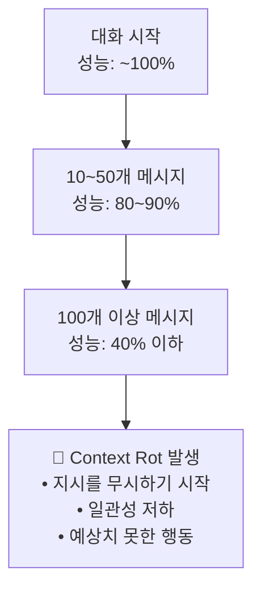

**현재 가이드라인 (2026년 4월 기준)**: Claude Code는 100,000~200,000 토큰 전후로 성능이 저하되기 시작한다.

**대응 방법**:
1. 모델에게 "지금까지 대화를 요약해줘, 새 에이전트에 넘길 거야"라고 요청
2. 요약을 복사
3. `/clear` 명령으로 대화 초기화
4. 새 대화에 요약을 붙여넣고 계속 진행

또한 한 번에 너무 많은 지시를 주면 일부가 무시된다. **한 번에 1~3개의 태스크**만 주는 것이 실용적이다.

### 4.5 신뢰도 사다리 (Trust Ladder)

강의 슬라이드에는 세로 축을 TRUST(위)에서 CHAOS(아래)로 배치한 사다리 그래프가 등장한다. 세 칸으로 나뉘며, 위로 갈수록 AI 산출물을 신뢰할 수 있는 정도가 높아진다. "AI ALONE" 구간에는 "Doesn't repeat. Different every time. No rules, no constraints. → This is where slop comes from.", "AI + RULES" 구간에는 "Repeats approximately. On-brand.", "CODE" 구간에는 "Repeats exactly. Every time. Design tokens, CSS, components. Write once, runs forever."라고 설명되어 있다. 우측에는 굵은 글씨로 "MOVE UP THE LADDER!"라고 적혀 있다.

```
▲ TRUST (신뢰)
│
│ Level 3 — CODE
│   "Repeats exactly. Every time."
│   디자인 토큰, CSS, 컴포넌트
│   한 번 작성하면 영원히 실행된다
│
│ Level 2 — AI + RULES
│   "Repeats approximately. On-brand."
│   AI가 새것을 생성하지만 디자인 시스템을 제약으로 읽는다
│   동일하지 않지만 일관성 있다
│
│ Level 1 — AI ALONE
│   "Doesn't repeat. Different every time."
│   규칙도 없고 제약도 없다
│   → AI SLOP이 나오는 원인
│
▼ CHAOS (혼돈)
```

**결론**: 반복적이고 프로덕션에 가까운 작업일수록 코드/스크립트 쪽으로 이동해야 한다. AI 혼자서는 신뢰할 수 없다.

---

## 5. Chapter 3 — Agentic 환경 설정하기

### 5.1 세 가지 환경 옵션

| 환경 | 장점 | 단점 | 사용 권장 |
|------|------|------|-----------|
| **터미널** | 가장 최신 기능, 가장 강력 | 파일 미리보기 없음, 배우기 어려움 | 고급자 |
| **Claude Desktop App** | 가장 쉬운 시작 | 파일 미리보기 없음 | 입문 |
| **IDE (Anti-gravity/VS Code)** | 파일 미리보기, 변경 사항 시각화, 상호운용성 | 초기 설정 필요 | **이 강의 권장** |

### 5.2 Anti-gravity 설치 및 설정 단계

강의는 Alan이 아내 컴퓨터에 직접 설치하며 촬영한 단계별 화면을 활용해 설명한다.

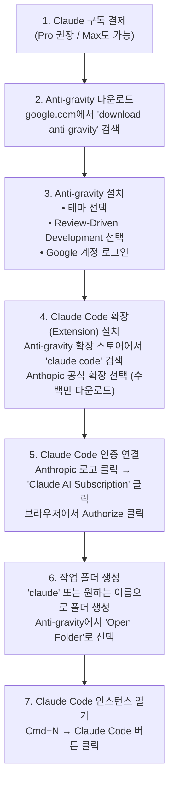

### 5.3 주요 UI 컨트롤

**모델 전환**: `/model` 명령 또는 상단 버튼 클릭

| 모델 | 특성 | 토큰 비용 | 권장 용도 |
|------|------|-----------|-----------|
| Opus 4.6 | 가장 강력, 가장 느림 | $15/M 토큰 | 복잡한 계획, 고급 코딩 |
| Sonnet 4.6 | 빠름, Opus의 80~90% 성능 | $3/M 토큰 | 일반 실행 작업 |
| Haiku 4.5 | 매우 빠름, 가장 저렴 | $0.25/M 토큰 | 단순 반복 작업 (이메일 분류 등) |

> **Pro/Max 구독자는 이 가격을 직접 지불하지 않음.** API 직접 사용 시의 참조 가격이며, 구독 시 토큰이 포함되어 있다.

**권한 모드 (Permission Mode)**:

| 모드 | 동작 | 권장 상황 |
|------|------|-----------|
| Ask before edits | 모든 파일 변경 전 승인 요청 | 입문자, 학습 단계 |
| Edit automatically | 해당 태스크 범위 내 자동 실행 | 중급자 |
| **Plan mode** | 즉시 실행 없이 먼저 질문, 계획 수립 | **새 빌드 시작 시 필수** |
| Bypass permissions | 모든 것을 자동으로 실행 | Plan mode 이후 사용 |
| Auto mode (출시 예정) | AI가 판단해 자동/수동 결정 | 곧 일반 공개 예정 |

**주요 슬래시 명령어**:
- `/model` — 모델 전환
- `/clear` — 대화 초기화 (Context Rot 대응)
- `/compact` — 대화 압축 (토큰 절약, `/clear`보다 효과 낮음)

---

## 6. Chapter 4 — 시스템 프롬프트 (Claude.md)

### 6.1 시스템 프롬프트의 역할

Claude Code와 일반 채팅의 결정적 차이 중 하나가 `CLAUDE.md` 파일이다. 이 파일은 새 대화를 시작할 때마다 자동으로 먼저 읽힌다. 일종의 **항상 실행되는 디자인 브리프**다.

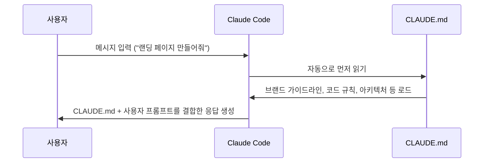

CLAUDE.md 없이 만든 결과물 → 일반적이고 AI스러운 "AI Slop"  
CLAUDE.md와 함께 만든 결과물 → 브랜드에 맞는, 실제로 사용할 수 있는 결과물

### 6.2 CLAUDE.md 구성 요소

기술적 프로젝트 기준의 표준 구조:

```markdown
# CLAUDE.md 예시 구조

## Project
이 프로젝트가 무엇인지 (what)
왜 존재하는지 (why)
어떻게 구성되어 있는지 (how)

## Architecture
폴더 구조, API 키 위치, 기술 스택

## Code Conventions
코딩 스타일, 네이밍 규칙, 포맷 규칙

## Design System
브랜드 컬러 (Hex 코드), 타이포그래피, 스페이싱 토큰, 컴포넌트 규칙

## Content & Tone
Voice & Tone 가이드라인, 콘텐츠 원칙
```

**권장 길이**: 40~80줄 (최대 150줄). 이보다 길면 분리해야 한다.

### 6.3 Hub-and-Spoke 구조

CLAUDE.md가 너무 길어지면, 그것을 허브로 삼고 각 세부 문서를 스포크(Spoke)로 연결한다.

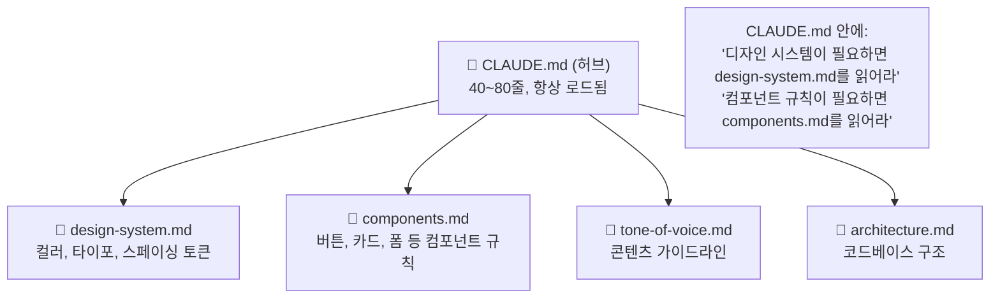

### 6.4 다중 레벨 CLAUDE.md

프로젝트가 커지면 레벨별로 CLAUDE.md를 관리한다.

```
/claude-workspace/           ← 루트 레벨 CLAUDE.md (개인 정보, 팀, KPI)
  /project-x/
    CLAUDE.md               ← 프로젝트 레벨 (해당 프로젝트 기술 스택, 규칙)
    /src/
  /project-y/
    CLAUDE.md               ← 프로젝트 레벨
```

Claude Code는 현재 작업 중인 프로젝트의 CLAUDE.md를 우선 읽고, 필요 시 루트 CLAUDE.md를 참고한다.

### 6.5 다른 AI 에이전트와의 호환

| 에이전트 | 읽는 파일 |
|----------|-----------|
| Claude Code | `CLAUDE.md` |
| Google Gemini | `GEMINI.md` |
| OpenAI Codex | `AGENT.md` |

다른 에이전트로 전환할 때는 Claude Code에게 "이 CLAUDE.md를 Gemini용으로 변환해줘"라고 하면 자동으로 처리된다.

---

## 7. Chapter 5 — 3계층 아키텍처

이 챕터는 강의에서 가장 핵심적인 개념으로, AI를 효과적으로 사용하는 철학적 프레임워크다.

### 7.1 문제: 확률의 곱셈

5개 단계로 구성된 작업이 있고, 각 단계에서 AI가 95% 정확도로 실행한다고 가정하면:

$$전체 성공률 = 0.95^5 ≈ 77\%$$

즉, **5단계짜리 작업을 AI에게 통째로 맡기면 23%의 확률로 실패**한다. 단계가 늘어날수록 성공률은 더욱 낮아진다.

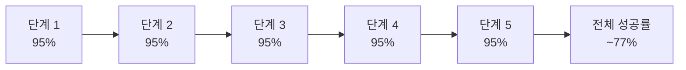

### 7.2 해결책: 3계층 아키텍처

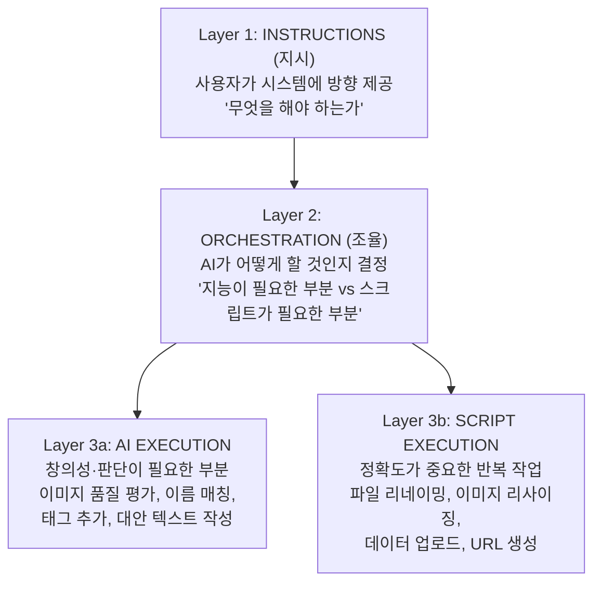

### 7.3 실전 사례: 이커머스 상품 이미지 파이프라인

사진작가가 30장의 상품 이미지를 전달했고, 이것을 웹사이트에 올리기 위한 워크플로를 구성한다.

| 단계 | 작업 | AI 사용 | 스크립트 사용 |
|------|------|---------|---------------|
| 1. 이미지 선별 | 어떤 이미지를 쓸지 판단 | ✅ (판단 필요) | |
| 2. 파일 리네이밍 | SKU-번호.jpg 형식으로 | | ✅ (정확성 필요) |
| 3. 배경 검토 | 배경이 브랜드에 맞는지 판단 | ✅ (판단 필요) | |
| 4. 배경 제거/교체 | 실제 이미지 처리 | | ✅ (반복 작업) |
| 5. 이미지 리사이징 | LinkedIn/Facebook/Instagram용 | | ✅ (정확성 필요) |
| 5-a. 초점 감지 | 리사이징 시 상품이 중앙에 오도록 | ✅ (이미지 인식) | |
| 6. 에셋 라이브러리 업로드 | 파일 업로드 | | ✅ |
| 6-a. 태그 추가 | 이미지 내용 기반 태그 | ✅ (인식 필요) | |
| 7. 상품 페이지 업데이트 | URL 생성 | | ✅ |
| 7-a. Alt 텍스트 작성 | SEO 최적화 대안 텍스트 | ✅ (창의성 필요) | |

### 7.4 실전 사례: Zoom 출석 체크 자동화

Alan이 DMBA에서 실제로 구축한 자동화 사례다. 매달 진행되는 코칭 세션 후 출석 여부를 확인하고 스프레드시트에 기록하는 작업이 기존에는 1~2시간이 걸렸다.

**구축 방법**: Claude Code에게 자연어로 요청 → 함께 설계 → 30초 내 자동 완료

**작동 원리**:
1. 스크립트가 Zoom API를 통해 해당 미팅의 참석자 CSV를 다운로드
2. AI가 CSV의 이름(별명, 이니셜, 회사명 등 다양한 형태)을 스프레드시트의 학생 행과 매칭
3. 90% 이상 확신하는 경우 자동으로 스프레드시트에 기록
4. 확신이 낮은 경우 목록을 사람에게 보고, 사람이 확인 후 피드백 → 다음번엔 기억

**핵심**: 스크립트(API 연결, CSV 처리)와 AI 지능(이름 매칭)의 최적 결합

### 7.5 Claude Skills (클로드 스킬)

스킬은 이 3계층 아키텍처를 **재사용 가능한 레시피**로 패키징한 것이다.

```
~/.claude/skills/
  ├── attendance/           ← 출석 체크 스킬
  │   ├── skill.md          ← 스킬 설명 (YAML frontmatter + 마크다운)
  │   ├── reference.md      ← 참조 URL 및 경로
  │   ├── .env              ← API 키 (절대 노출 금지)
  │   └── scripts/
  │       └── check_attendance.py
  │
  ├── competitor-pipeline/  ← 경쟁사 분석 스킬
  ├── color-thief/          ← 색상 추출 스킬
  └── skill-creator/        ← Anthropic 제공 스킬 생성 도우미
```

**skill.md 구조**:
```yaml
---
name: competitor-pipeline-research
description: |
  산업을 입력하면 5개 주요 경쟁사를 찾아
  그들의 Acquisition, Onboarding, Activation, Core Task, Pricing 파이프라인을 분석하고
  스크린샷과 비교 보고서를 생성한다.
tools: playwright-cli
---
```

**스킬 설치**: 스킬 파일의 URL이나 경로를 Claude Code에 주면 자동 설치한다.  
**스킬 공유**: 파일을 팀원과 직접 공유하거나 GitHub에서 버전 관리 가능.  
**Anthropic 공식 스킬**: `anthropic/skills` GitHub 저장소에서 다운로드 가능.

---

## 8. Chapter 6 — 도구 연결하기 (MCP / CLI / API)

### 8.1 왜 도구를 연결해야 하는가?

Claude Code가 기존 도구들과 연결되면:
- **멀티스텝 작업 자동화**: Figma → 코드 → Jira 티켓 → Slack 보고를 한 번에
- **컨텍스트가 에이전트 안에 항상 있음**: Chat처럼 매번 드래그·드롭 불필요
- **병렬 작업**: 아침에 Claude Code를 열면 이메일 분류, 디자인 작업, 티켓 정리를 동시에 진행

### 8.2 세 가지 연결 방식

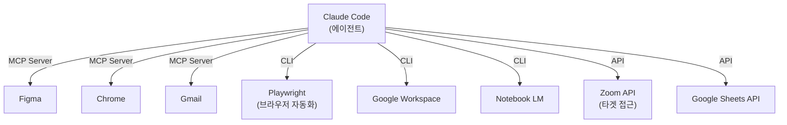

#### MCP (Model Context Protocol)

Anthropic이 만든 표준 프로토콜. 에이전트와 외부 도구 사이의 통역기 역할을 한다.

- **설치 방법**: Claude Code에 MCP 서버 링크를 주면 자동 설치
- **가장 유명한 MCP**: Chrome DevTools MCP (크롬 전체 제어 가능 → 모든 웹 서비스 접근)
- **Figma MCP**: Figma 파일을 직접 읽고 수정
- **주의**: 공식 MCP와 비공식 MCP가 섞여 있음. 트래픽과 리뷰를 확인하고 사용
- **단점**: 스크린샷 기반으로 작동하는 경우가 많아 토큰 소비가 많고 느림

#### CLI (Command Line Interface)

최근 떠오르는 방식. 화면을 캡처하는 대신 **접근성 트리(Accessibility Tree)** 를 읽어 페이지를 이해한다.

- **장점**: 훨씬 빠르고 토큰 효율적
- **단점**: 지원하는 도구가 아직 적음
- **Alan이 사용하는 CLI**: Playwright CLI (브라우저 자동화), Google Workspace CLI, Audacity CLI

**Playwright CLI**가 특히 중요하다. 강의 초반 데모에서 서브 에이전트들이 실제 폼을 작성할 때 사용된 것이 바로 Playwright CLI다.

| 항목 | MCP | CLI |
|------|-----|-----|
| 토큰 효율 | 낮음 (스크린샷 기반) | 높음 (텍스트 기반) |
| 지원 도구 수 | 많음 | 적음 |
| 속도 | 느림 | 빠름 |
| 유연성 | 높음 | 중간 |

#### API 직접 연결

특정 작업만 정확하게 수행할 때 가장 효율적이다. Zoom 출석 체크 예시에서 사용된 방식이다.

- **장점**: 토큰 효율적, 정확한 권한 제어 (읽기만 허용 등)
- **단점**: 유연성이 낮음, 용도가 고정됨
- **사용 시점**: 반복 실행하는 자동화 스크립트 구축 시

---

## 9. Chapter 7 — Discover: 경쟁사 파이프라인 연구

### 9.1 Competitor Pipeline Research 스킬

Alan이 실제로 구축한 스킬이다. 산업 이름을 입력하면:
1. 해당 분야 5대 경쟁사 자동 식별
2. 각 회사의 Acquisition → Onboarding → Activation → Core Task → Pricing 파이프라인 탐색
3. 스크린샷 캡처
4. 비교 보고서 (Markdown) 생성

**시연**: Form Builder 산업으로 실행 시 Google Forms, Tally, TypeForm, JotForm, Fillout 5개사가 식별되었고, "4개사 중 4개가 회원가입 벽(Sign-up Wall) 뒤에 제품을 숨긴다"는 인사이트를 포함한 보고서가 약 2분 만에 생성되었다.

**스킬 구축 시간**: 10분

### 9.2 디자이너가 만들 수 있는 Discovery 스킬 아이디어

| 스킬 이름 | 기능 |
|-----------|------|
| Review Miner | Amazon, G2 등에서 경쟁사 리뷰 스크래핑 → 분석 |
| Tone Scraper | 유사/타업계 회사들의 언어 패턴 분석 → 톤앤보이스 아이디어 |
| Heuristic Audit | 닐슨 10대 휴리스틱 기반 자동 UX 감사 |
| Color Thief | 특정 업계의 색상 체계 분석 → 차별화 기회 발견 |
| Business Model Mapper | 경쟁사 비즈니스 모델 이해관계자 맵 |
| Jobs-to-be-Done Mapper | 제품을 통해 도출한 JTBD 맵 |
| Survey-to-Persona | 설문 데이터 → 페르소나 자동 생성 |

---

## 10. Chapter 8 — Create: 웹사이트·스킬·프로토타입 제작

### 10.1 LinkedIn PDF → 개인 포트폴리오 웹사이트

**과정 요약**:
1. LinkedIn에서 프로필을 PDF로 저장
2. PDF를 Anti-gravity 폴더에 이동
3. Claude Code에 "이 PDF를 소개 웹사이트로 만들어줘, 하단에 연락 폼 포함"
4. Plan Mode로 계획 수립 → Bypass Permissions로 실행
5. 바로 브라우저에서 미리보기
6. "2개 버전을 더 만들어줘, 다크 모드 제외"
7. 마음에 드는 버전에 "내가 만든 프로젝트 섹션 추가해줘, 내 파일을 다 읽어봐"
8. Claude Code가 컴퓨터 전체를 스캔해 이전에 만든 프로젝트들을 찾아 섹션 자동 구성
9. "각 프로젝트 스크린샷도 찍어줘" → 자동 캡처

**배포**: Netlify 무료 플랜에 프로젝트 폴더를 드래그&드롭 → 즉시 라이브 URL 생성. 커스텀 도메인도 연결 가능. 결과적으로 **Squarespace 구독료 불필요**.

### 10.2 Color Thief 스킬 구축 (라이브 데모)

**목적**: 특정 업계의 경쟁사 웹사이트를 보고 색상 체계를 자동 추출한다.

**구축 과정**:
1. Anthropic의 `skill-creator` 스킬 먼저 설치 (스킬 만드는 스킬)
2. Claude Code에 자연어로 스킬 설명 (voice-to-text 활용)
   - "color thief라는 스킬을 만들어줘. 회사 이름이나 업계를 주면 웹사이트를 방문해서 Primary, Secondary, Tertiary, CTA, Background, Text 색상을 Hex로 추출하고, 홈페이지 스크린샷도 찍어서 MD 보고서를 만들어줘. Playwright CLI 사용해줘"
3. Plan Mode로 계획 검토 → 승인 → Bypass Permissions로 자동 구축 (약 20~30초)
4. Form Builder 업계로 테스트 실행

**결과**: TypeForm(보라), Tally(미니멀 무채색), Google Forms(구글 팔레트, 고유 브랜딩 없음) 등 각사 색상 체계와 브랜드 특성 분석 포함 보고서 생성.

### 10.3 멀티플레이어 게임 프로토타입 제작 (Number Estimator)

DMBA의 "프로토타이핑 위드 넘버스" 모듈을 위한 실제 게임을 약 5~10분 만에 구축한 사례다.

**게임 컨셉**: 실제 Google Maps 링크를 보며 팀이 토론해 숫자를 추정하고 정답에 가까울수록 점수를 얻는 멀티플레이어 게임

**예시 질문**: "로마 콜로세움을 1년에 몇 명이 방문하나요?" → Google Maps로 콜로세움 보기 → 팀 토론 → 추정값 제출 → 정답: 740만 명

**제작 과정 요약**:

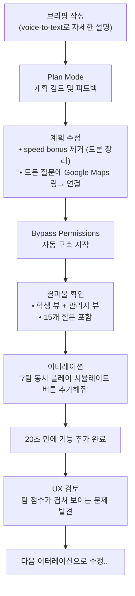

**핵심 통찰**: 기존에 만든 게임이 있으면, Claude Code가 그 코드의 CSS와 구조를 참고해 새 게임도 비슷한 시각적 스타일로 자동 구축한다. 이것이 **AI Native 디자인 시스템의 첫 번째 레이어**다.

---

## 11. Chapter 9 — Systematize: AI Native 디자인 시스템

이 섹션은 Alan의 동료 Tom(DMBA 프로그램 디렉터)과 함께 진행된다. Tom은 VS Code + 터미널에서 Claude Code를 사용한다.

### 11.1 AI Native 디자인 시스템이란?

**기존 디자인 시스템의 문제점**:
- 대기업에는 잘 맞지만 소규모 팀에서는 구축과 유지에 비용이 너무 크다
- 거버넌스(누가 어떻게 관리할 것인가)가 항상 가장 큰 과제
- Design Ops 전담자 없이는 살아있는 시스템을 유지하기 어렵다

**AI Native 디자인 시스템의 특징**:
- 모든 문서가 **Markdown**으로 작성된다 (AI가 가장 잘 읽는 형식)
- CLAUDE.md가 라우터 역할을 한다 (짧고 날카롭게 유지)
- 거버넌스도 코드화된다 (`decisions.md`로 의사결정 기록)
- 구축 시간: **5시간** (Tom의 실제 소요 시간)

### 11.2 DMBA 디자인 시스템 구조

```
/dmba-design-system/
  CLAUDE.md                  ← 라우터 (짧고 날카롭게)
  tokens.md                  ← 디자인 토큰 (정의의 근거)
  tokens.css                 ← CSS 변수 (AI가 직접 사용)
  accessibility.md           ← 접근성 규칙
  principles.md              ← 디자인 원칙 (why 레이어)
  patterns.md                ← 사용 패턴 (어떤 상황에 무엇을)
  decisions.md               ← 의사결정 기록 (새 규칙 추가 장소)
  /components/
    buttons.md               ← 버튼 변형, 사용법, dos/don'ts
    cards.md
    forms.md
    chat-input.md
    checkboxes.md
    progress-bar.md
    ...
```

**CLAUDE.md 내용 예시**:
```markdown
# DMBA Design System Router

## 무엇을 생성하거나 검토할 때는 다음 순서로 파일을 읽어라:
1. tokens.md — 색상, 간격, 폰트의 진실의 원천
2. principles.md — 왜 이렇게 해야 하는가
3. patterns.md — 어떤 맥락에서 무엇을 쓰는가
4. decisions.md — 최근 의사결정 사항
5. /components/[관련 컴포넌트].md

## 규칙:
- 기존 컴포넌트를 먼저 사용하라
- 하드코딩된 값 대신 토큰을 사용하라
- 토큰을 임의로 발명하지 마라
```

### 11.3 레거시 코드에 디자인 시스템 적용 vs. 처음부터 구축

강의는 두 시나리오를 비교해 보여준다.

**시나리오 A: 기존 vibe-coded 프로토타입에 디자인 시스템 적용**
- 결과: 표면적으로는 비슷해 보이지만 하위 레벨 구조가 어긋남
- 버튼 스타일이나 레이아웃이 "페인트칠"처럼 덮어씌워진 느낌
- 규칙을 완전히 따르지 않는 일관성 없는 결과물
- ❌ **권장하지 않는 방식**

**시나리오 B: 처음부터 디자인 시스템 컨텍스트로 vibe-coding**
- CLAUDE.md가 코딩 시작 전에 로드되어 처음부터 제약이 적용됨
- 결과물이 브랜드 친화적이고 패턴을 자연스럽게 따름
- ✅ **강력 권장**

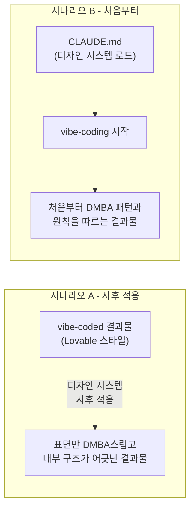

### 11.4 decisions.md: 살아있는 디자인 시스템

Tom이 세 가지 버전의 게임을 검토하면서 선호도가 생기면 그것을 `decisions.md`에 코드화한다.

예시:
```markdown
## 결정: 진행 표시기 유형

**규칙**: 학습 게임에서는 항상 단계 정보가 포함된 스테퍼(Stepper)를 추상적인 프로그레스 바 대신 사용하라.

**사용 시점**: 게임 화면의 진행 상황 표시
**사용하지 않는 경우**: 단순 로딩 상태

**이유**: 학습자는 자신이 여정의 어디 있는지 알아야 한다. 추상적인 바는 시각적으로 보기 좋지만 학습 맥락에 도움이 되지 않는다.

**근거**: 2026-04-10 게임 v1~v3 리뷰 후 추가. v3에서 스테퍼 버전이 v1의 추상적 바보다 훨씬 유용함을 확인.
```

이 결정은 다음 빌드에서 Claude가 자동으로 반영한다.

### 11.5 디자인 시스템과 디자이너의 역할

Tom의 핵심 메시지:

> "AI의 산출물 품질 기준선이 낮아지는 게 아니라 **높아졌다.** 여전히 누군가는 이 아이디어들을 보고 어느 것이 더 좋은 가르침을 주는지 결정해야 한다."

디자이너의 새로운 역할은 **MD 파일에 쓴 것이 AI에 의해 실제로 올바르게 해석되고 있는지 확인하는 것**이다. 즉, 인간이 읽을 수 있으면서 동시에 기계도 정확히 읽을 수 있는 문서를 작성하고 검증하는 능력이 핵심 스킬이 된다.

---

## 12. Chapter 10 — Automate: 반복 업무 자동화

### 12.1 팀 리포팅 자동화 데모

**시나리오**: 매주 금요일 오후 4시, Google Sheets에 주간 상태를 입력하지 않은 팀원에게 자동으로 Slack 메시지를 보내는 자동화.

**구축 과정**:

1. Google Sheets 구조 설계 (이름, Slack ID, 주차별 상태 컬럼)
2. Claude Code에 자연어로 요청: "매주 금요일 4PM CET에 Google Sheet에서 상태를 입력하지 않은 팀원을 찾아 Slack으로 DM 보내는 자동화를 만들어줘"
3. Claude Code가 Plan Mode에서 질문을 통해 구조 파악
4. 아키텍처 결정: 처음에 Slack Bot → 이후 Slack MCP로 전환 (메시지가 본인 계정에서 발송되도록)
5. Slack 앱 설정 (Slack API 포털에서 봇 생성, 권한 설정, 토큰 발급)
6. `.env` 파일에 토큰 저장 (채팅창에 API 키 절대 붙여넣지 말 것)
7. Google OAuth 연결
8. 테스트 실행 → Tom에게 실제 Slack DM 발송 성공

**ENV 파일의 중요성**: API 키는 비밀번호와 같다. 절대 채팅창에 붙여넣지 말고, 항상 `.env` 파일에만 저장한다.

```
team-reporting-skill/
  skill.md
  .env                  ← API 키 (절대 공유 금지!)
  scripts/
    check_status.py
    send_reminder.py
```

### 12.2 자동화 확장성 고민

Claude Code는 자동화가 완성된 후 추가 옵션도 제시한다:

- **로컬 크론 잡**: 컴퓨터가 켜져 있을 때만 실행 (금요일 오후 컴퓨터 꺼져 있으면 실패)
- **원격 서버 트리거**: 항상 실행되지만 서버 비용 발생
- **Claude 내장 스케줄 트리거**: Slack MCP가 이미 연결되어 있어 가장 편리한 방식

---

## 13. 핵심 개념 종합 정리

### 13.1 Agentic Design 전체 프레임워크

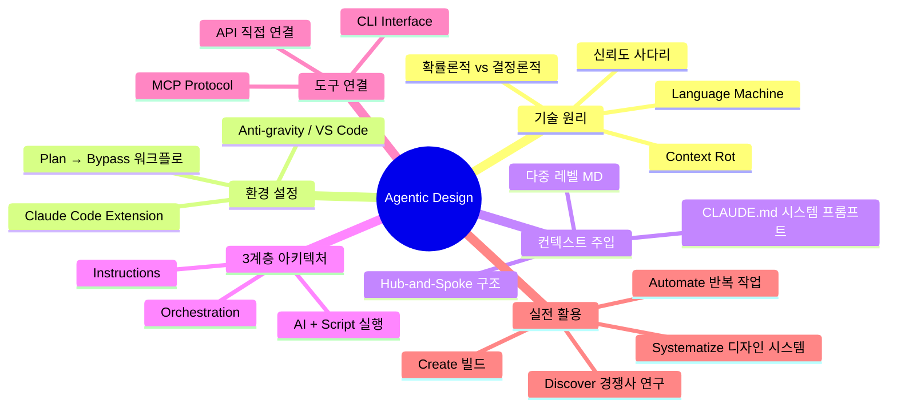

### 13.2 Agentic 워크플로 기본 루프

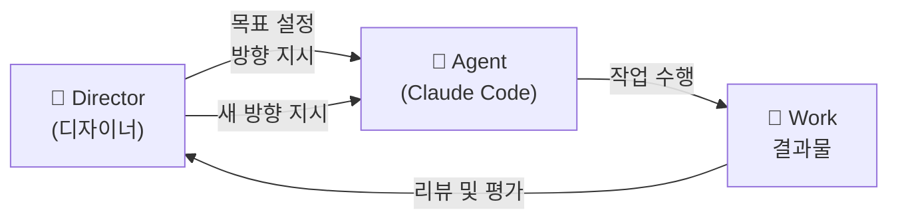

**고급 루프** (인간이 밖에서 감독):

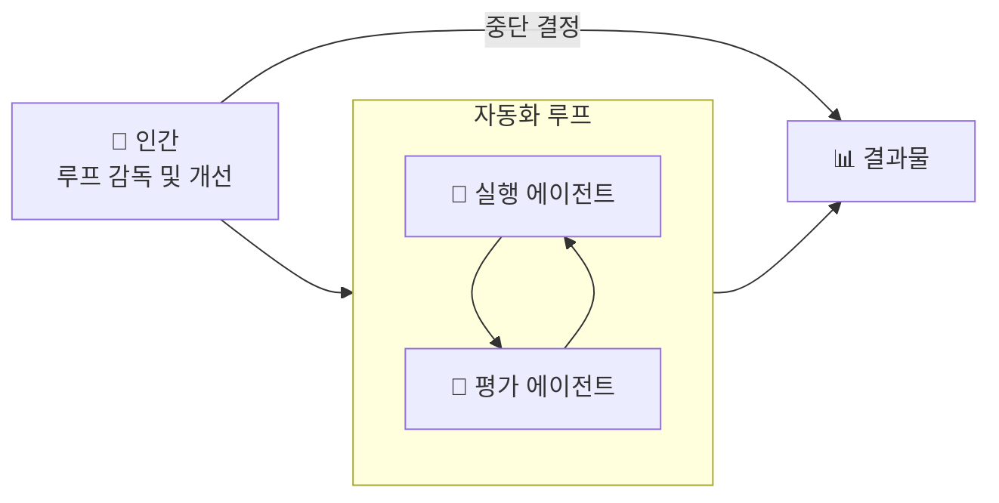

### 13.3 도구 선택 의사결정 가이드

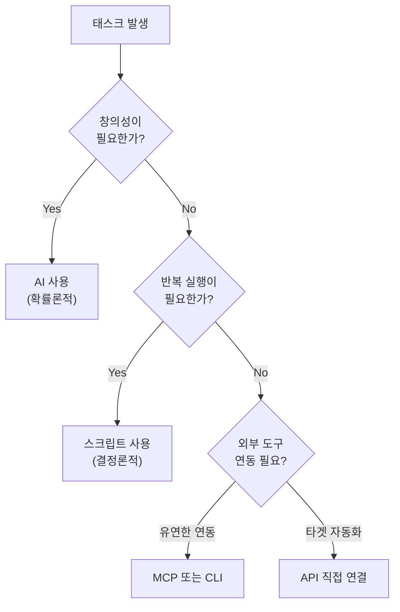

### 13.4 디자이너가 배워야 할 새로운 스킬셋

| 기존 스킬 (여전히 중요) | 새로운 스킬 (추가로 필요) |
|------------------------|--------------------------|
| 시각적 판단력 | Markdown 문서 작성 능력 |
| UX 리서치 | 시스템 프롬프트 설계 |
| 디자인 원칙 | 3계층 아키텍처 사고 |
| Figma 활용 | Claude Code 오케스트레이션 |
| 팀 협업 | 스킬 및 자동화 구축 |
| 비즈니스 이해 | AI 산출물 품질 검토 |

---

## 14. 디자이너를 위한 실전 액션 플랜

### Week 1: 환경 구축

- [ ] Claude Pro 또는 Max 구독
- [ ] Anti-gravity(또는 VS Code) 설치
- [ ] Claude Code 확장 설치 및 인증 연결
- [ ] 첫 작업 폴더 생성
- [ ] LinkedIn PDF → 개인 웹사이트 만들기 (강의 따라하기)
- [ ] Netlify 무료 배포 시도

### Week 2: 컨텍스트 주입

- [ ] 현재 프로젝트 기반으로 CLAUDE.md 초안 작성 (40~80줄)
- [ ] 브랜드 컬러, 타이포그래피, 톤앤보이스 포함
- [ ] CLAUDE.md 적용 전후 결과물 비교

### Week 3: 첫 번째 스킬 구축

- [ ] `anthropic/skill-creator` 스킬 설치
- [ ] 자신에게 유용한 스킬 하나 구축 (예: 경쟁사 분석, 색상 추출)
- [ ] Plan Mode → Bypass Permissions 워크플로 익히기

### Week 4: 도구 연결 및 자동화

- [ ] Chrome DevTools MCP 또는 Playwright CLI 설치
- [ ] 자신이 자주 반복하는 작업 하나 식별
- [ ] 3계층 아키텍처로 자동화 설계 및 구축

---

## 부록: 주요 리소스

| 리소스 | 링크 | 용도 |
|--------|------|------|
| Agentic Design Community | https://d.mba/agentic-design | 대기자 등록 |
| Anthropic Skills GitHub | https://github.com/anthropics/skills | 공식 스킬 다운로드 |
| Claude Code Docs | https://docs.claude.ai | 공식 문서 |
| Netlify | https://netlify.com | 웹사이트 무료 배포 |
| Playwright CLI | npm playwright | 브라우저 자동화 CLI |

---

## 마치며

이 강의의 핵심 메시지를 한 문장으로 요약하면:

> **"디자이너의 가치는 무엇을 '직접 만드느냐'에서 '어떤 시스템을 설계하고 AI를 어떻게 조율하느냐'로 이동하고 있다. 그 전환을 먼저 이해하고 실행하는 사람이 새로운 기준을 만든다."**

Alan은 이 변화를 2016년 Figma 도입기와 비교하며, 지금이 바로 그 선도자가 될 수 있는 타이밍이라고 강조한다. 엔지니어링 배경이 전혀 없어도 Claude Code와 함께라면, 디자이너는 예전보다 훨씬 넓은 영역에서 직접 가치를 만들어낼 수 있다.

---

*작성일: 2026-04-18*  
*원본 영상: https://www.youtube.com/watch?v=NlVxAy05KNA*  
*DMBA — Design MBA: https://d.mba*
