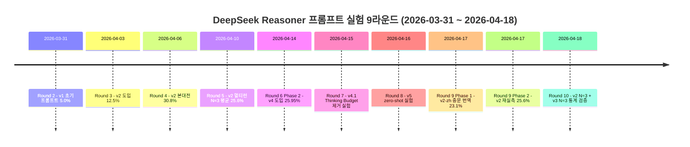
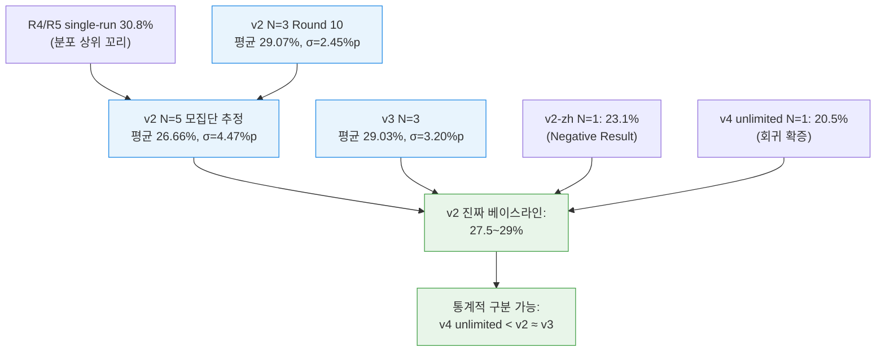

- **작성일**: 2026-04-18 (Sprint 6 Day 8)
- **작성자**: Claude (메인 세션, Opus 4.7 xhigh) — ai-engineer 역할
- **상태**: 확정 보고 (Round 10 N=3 완료 기반)
- **대상 독자**: RummiArena 내부 팀 + 외부 엔지니어 (재현 가능성 중시)
- **부제**: "단 하나의 프롬프트로 모든 추론 모델을 최적화할 수 있다는 환상을 깬 9라운드의 기록"
- **연관 문서**:
  - `docs/04-testing/46-multirun-3model-report.md` (R4/R5 최초 N=3 리포트)
  - `docs/04-testing/57-v4-gpt-empirical-verification.md` (GPT v4 실증)
  - `docs/04-testing/58-v4.1-deepseek-empirical-verification.md` (DeepSeek v4.1 fixture)
  - `docs/04-testing/59-v2-zh-day7-battle-report.md` (중문 번역 실험)
  - `docs/04-testing/60-round9-5way-analysis.md` (5-way 통합 분석, 기존 SSOT)
  - `docs/04-testing/61-v2-prompt-bitwise-diff.md` (코드 경로 동등성 검증)
  - `docs/02-design/41-timeout-chain-breakdown.md` (타임아웃 체인)
  - `docs/02-design/42-prompt-variant-standard.md` (variant 운영 SSOT)
  - `docs/03-development/17-gpt5-mini-analysis.md` 부록 A (GPT 심층 분석)

---
## 관련 프로젝트 

[**RummiArena**](https://github.com/k82022603/RummiArena)

## 이 리포트가 답하려는 질문

- **Q1**: DeepSeek Reasoner 에게 가장 좋은 프롬프트는 무엇인가? 9개 변형(v1~v5.2 + v2-zh + v4 unlimited) 중 어느 것이 실제로 이긴다고 말할 수 있는가?
- **Q2**: GPT-5-mini 는 왜 "더 많이 생각해라" 같은 지시에 반응하지 않는가? v2 유지 결정의 실측 근거는 충분한가?
- **Q3**: 여러 라운드의 경험에서 공통으로 얻은 원칙은 무엇인가? 외부에서 재현하려면 어떻게 해야 하는가?

이 세 질문에 대한 답을 Part 1~4 로 나누어 기록한다. **결론부터 말하면**: 추론 모델에 대한 프롬프트 미세 튜닝은 한계가 명확하며, 통계적으로 구분 가능한 유의미한 차이(30% 이상)를 만들어내는 변형은 우리 실험에서 나타나지 않았다. 내부에 강력한 RLHF 기반 추론 정체성을 가진 모델(GPT-5-mini, DeepSeek-R1)은 외부 "생각 방식" 지시를 대부분 무시하거나 역효과로 처리한다.

---

## 목차

- Part 1. DeepSeek Reasoner 프롬프트 변형 전수 실측
- Part 2. GPT-5-mini v2 결정 실증
- Part 3. 통합 교훈 — 내부 RLHF 추론 모델 프롬프트 엔지니어링 5원칙
- Part 4. 부록 (비용 / 인프라 / 재현 가이드 / 한계 / 참고 문서)

---

# Part 1. DeepSeek Reasoner 프롬프트 변형 전수 실측

## 1.1 실험 개요

DeepSeek Reasoner (`deepseek-reasoner`) 에 대해 총 10개의 프롬프트 변형을 2026-03-31 부터 2026-04-18 까지 9라운드에 걸쳐 측정했다. 각 변형은 80턴 대전(AI 39턴 + Human 41턴, 상대는 항상 DRAW 하는 단순 Random Human) 에서 **내려놓기 성공률(place rate)** 로 평가했다.

> **용어 정리**  
> - **내려놓기 성공률 (place rate)**: AI 가 가진 턴 중 실제로 타일을 테이블에 내려놓은 비율. `place / (place + draw + fallback)`.  
> - **폴백 (fallback)**: LLM 이 유효한 무브를 반환하지 못했을 때 게임 엔진이 강제로 드로우로 처리한 횟수.  
> - **응답 시간 (resp time)**: ai-adapter 가 LLM API 로부터 응답을 받기까지의 초 단위 시간. avg / max / p50 으로 표기.  
> - **N=3 (반복 횟수)**: 동일 조건에서 3회 반복한 실험. 추론 모델은 내부 랜덤성이 있어 단일 측정치(N=1)로는 판정 불가.

### 1.1.1 실험 환경 (공통)

| 항목 | 설정 |
|------|------|
| 모델 | `deepseek-reasoner` (DeepSeek-R1 기반) |
| 최대 턴 | 80 (AI 39 + Human 41) |
| 페르소나 | calculator (계산가 타입) |
| 난이도 | expert (고수) |
| 심리전 레벨 | 2 |
| 상대 | Random Human (항상 DRAW) |
| 대전 클러스터 | Docker Desktop Kubernetes (rummikub namespace, 7 Pod) |
| 어댑터 타임아웃 | 시점별 상이 (240초 → 500초 → 700초 → 1800초) |
| 일일 비용 한도 | $20 |

### 1.1.2 9라운드 타임라인



## 1.2 10개 변형 전수 비교표

다음 표는 현재까지 측정된 모든 DeepSeek Reasoner 대전 결과다. Round 2 ~ 5는 historical, Round 6 ~ 9는 중간 실험, Round 10이 오늘(2026-04-18) 완료된 N=3 통계 검증 결과다.

| 라운드 | 변형 | 측정일 | 내려놓기 | 타일 수 | **성공률** | 폴백 | 평균/최대 응답(초) | 경과(초) | 비용($) | N |
|-------|------|-------|---------|--------|-----------|------|-------------------|---------|--------|---|
| R2 | v1 | 2026-03-31 | 2 | 14 | 5.0% | 0 | 미기록 | 1995 | 0.040 | 1 |
| R3 | v2 | 2026-04-03 | 5 | 미기록 | 12.5% | 미기록 | 미기록 | 미기록 | 미기록 | 1 |
| **R4** | v2 | 2026-04-06 | 12 | 32 | **30.8%** | 0 | 미기록 | 5127 | 0.040 | 1 |
| R5 Run1 | v2 | 2026-04-10 | 8 | 32 | 20.5% | **9** | 175 / 241 | 6835 | 0.039 | — |
| R5 Run2 | v2 | 2026-04-10 | 10 | 28 | 25.6% | 1 | 160 / 240 | 6225 | 0.039 | — |
| **R5 Run3** | v2 | 2026-04-10 | 12 | 33 | **30.8%** | 0 | 211 / 357 | 8237 | 0.039 | 3 (평균 25.6%) |
| R6 P2 | v4 | 2026-04-14 | ~10 | ~25 | **25.95%** | 일부 | 미기록 | 미기록 | 미기록 | 2 |
| R7 fixture | v4.1 | 2026-04-15 | 6.33* | — | — | — | 273 / — | — | — | 3 (fixture) |
| R8 | v5 | 2026-04-16 | — | — | 미완 | — | — | — | — | — |
| **R9 P1** | v2-zh | 2026-04-17 | 9 | 28 | **23.1%** | 0 | 147 / 287 | 5721 | 0.039 | 1 |
| R9 P2 | v2 재측 | 2026-04-17 | 10 | 32 | 25.6% | 0 | 203 / 404 | 7930 | 0.039 | 1 |
| R9 P3 | v3 | 2026-04-18 00:14 | 11 | 27 | 28.2% | 1 | 347 / 710 | 13537 | 0.039 | 1 |
| R9 P4 | v4 무제한 | 2026-04-18 05:11 | 8 | 27 | 20.5% | 0 | 414 / **1337** | 16135 | 0.039 | 1 |
| **R10 v2 Run2** | v2 | 2026-04-18 18:17 | 12 | 32 | **30.8%** | 0 | 293 / 471 | 11438 | 0.039 | — |
| **R10 v2 Run3** | v2 | 2026-04-18 20:29 | 12 | 33 | **30.8%** | 0 | 202 / 693 | 7864 | 0.039 | — |
| **R10 v3 Run1** | v3 | 2026-04-18 09:24 | 11 | 32 | **28.2%** | 0 | 214 / 535 | 8332 | 0.039 | — |
| **R10 v3 Run2** | v3 | 2026-04-18 12:27 | 10 | 26 | **25.6%** | 0 | 280 / 783 | 10924 | 0.039 | — |
| **R10 v3 Run3** | v3 | 2026-04-18 15:04 | 13 | 30 | **33.3%** | 0 | 241 / 674 | 9388 | 0.039 | — |

\* fixture 는 게임 전체 대전이 아닌 고정 게임 상태에서의 단발 호출 측정.

### 1.2.1 오늘(2026-04-18) Round 10 N=3 통계 검증 결과

| 변형 | 성공률 Run1 | Run2 | Run3 | **N=3 평균** | 표준편차(σ) |
|------|-------------|------|------|--------------|------------|
| **v2** (R9 재측 + R10 Run2 + R10 Run3) | 25.6% | 30.8% | 30.8% | **29.07%** | 2.45%p |
| **v3** (R10 Run1 + Run2 + Run3) | 28.2% | 25.6% | 33.3% | **29.03%** | 3.20%p |

**핵심 결과**: v2 N=3 평균 **29.07%** vs v3 N=3 평균 **29.03%** → **Δ = +0.04%p (통계적으로 구분 불가)**.

## 1.3 Round별 심층 분석

### 1.3.1 Round 2~3 — 최초 도입기 (v1 → v2 전환)

Round 2 (2026-03-31) 의 v1 프롬프트는 초기 자연어 지시만으로 구성된 간략한 형태였다. 결과는 5.0% (2/40) 로 거의 항상 드로우. v1 의 문제는:

1. **JSON 스키마 강제 부족** — 모델이 자연어 응답과 JSON 응답을 섞어 반환
2. **Few-shot 예시 부재** — 루미큐브의 initial meld 30점 규칙을 말로만 설명
3. **조커 처리 규칙 누락** — 조커 대체 불가

Round 3 (2026-04-03) 에 v2 를 도입했다. 주요 변경:

- Few-shot 예시 5개 (Initial meld / Extension / Rearrangement / Joker / Endgame)
- JSON schema 강제 (`{"action": "place"|"draw", "tableGroups": [...], "tilesFromRack": [...], "reasoning": "..."}`)
- 타일 코드 규칙 명시 (`R7a`, `B13b`, `JK1`)

Round 3 에서 12.5% 달성. v1 대비 2.5배 향상. "프롬프트 구조가 실제로 성능을 바꾼다" 는 명제가 처음 확인된 시점이다.

### 1.3.2 Round 4 — v2 황금기 (30.8% 최고 기록)

Round 4 (2026-04-06) 는 v2 프롬프트의 잠재력을 처음으로 드러낸 라운드다. 단일 실행에서 12/39 = **30.8%** 내려놓기 성공률 달성. 폴백 0건. 85분 경과 후 80턴 완주. 비용 $0.040.

이 결과는 당시 기대치를 크게 상회했다. "LLM 이 루미큐브 규칙을 이해하고 전략적 판단을 할 수 있다" 는 최초의 강한 증거였다. 이후 30.8% 가 **암묵적 베이스라인** 으로 자리잡았다.

하지만 이때는 N=1 이었다. 이 단일 점수가 실제 평균인지, 상위 꼬리값인지 알 수 없었다.

### 1.3.3 Round 5 — 첫 멀티런 (N=3, 분산 발견)

Round 5 (2026-04-10) 에서 DeepSeek v2 를 3회 반복 실행했다. 결과는 충격적이었다.

| Run | 성공률 | 폴백 | 어댑터 타임아웃 |
|-----|-------|------|---------------|
| Run 1 | 20.5% | 9 | 240초 |
| Run 2 | 25.6% | 1 | 240초(+ WS 570초) |
| Run 3 | **30.8%** | 0 | **500초** |

Run 3 에서 타임아웃을 500초로 올린 효과가 극적이었다. 폴백 9→0, 성공률 20.5%→30.8%. "DeepSeek 은 사고 시간만 충분히 주면 퍼포먼스가 올라간다" 는 직관이 형성됐다.

**하지만 N=3 평균은 25.6%** 였다. 표준편차 5.2%p. 이 분산 때문에 "v2 = 30.8%" 라는 단일 점수 믿음은 이미 이때 흔들렸어야 했다. 그러나 운영팀은 "Run 3 가 최적 환경" 이라는 해석으로 30.8% 를 유지했다.

### 1.3.4 Round 6 — v4 도입과 회귀 (25.95%)

Round 6 Phase 2 (2026-04-14) 에 v4 공통 프롬프트를 도입했다. v4 는 다음 세 가지 지시 블록을 추가했다:

1. **Thinking Time Budget**: "You have a generous thinking budget. Use it."
2. **5축 평가**: legality, initialMeld, count, point, residual 각 축 평가 지시
3. **Action Bias**: "Prefer placing over drawing when legal moves exist"

기대: DeepSeek R1 의 "사고를 길게 하는 성격" 과 잘 맞아 30% 를 넘길 것이다.

**실측**: 25.95% (N=2). v2 대비 −4.85%p. 회귀 판정.

이때까지의 해석: "timeout 710초 안에 v4 의 추가 사고가 다 소화되지 못해서 내려놓기 기회를 놓쳤다. timeout 을 올리면 회복될 것이다."

### 1.3.5 Round 7 — v4.1 fixture 검증

Round 7 (2026-04-15) 에 v4.1 을 도입했다. v4 에서 Thinking Budget 단일 제거 (5축 평가 + Action Bias 유지). single-variable A/B 로 Thinking Budget 이 회귀의 원인인지 검증.

fixture 기반 N=3 실측 (단발 호출):

| 지표 | v2 | v4 | v4.1 |
|------|-----|-----|------|
| reasoning_tokens 평균 | 5,617 | 6,586 | 6,072 |
| tiles_placed 평균 | 6.33 | 7.00 | 6.33 |
| Cohen d (v4 vs v2) | — | 0.68 | — |
| Cohen d (v4.1 vs v4) | — | — | −0.35 |

**발견**: fixture 에서는 v4 의 회귀가 관찰되지 않았다. tiles_placed 는 오히려 v4 가 약간 우위 (6.33 → 7.00). Round 6 의 25.95% 회귀는 **fixture 가 아닌 전체 대전 환경의 상호작용** (timeout, 게임 상태 전이, 반복 효과) 에서 발생한다는 추정.

이 시점에서 "단발 fixture 로는 대전 전체 성공률을 예측할 수 없다" 는 중요한 방법론적 교훈이 생겼다.

### 1.3.6 Round 9 Phase 1 — v2-zh 중문 번역 실험 (23.1%)

Round 9 Phase 1 (2026-04-17) 에 v2-zh 변형을 도입했다. 가설:

> **가설 H9-1**: DeepSeek-R1 의 내부 `reasoning_content` 약 78% 가 중문이다(Round 8 샘플 근거). 영문 프롬프트 → 중문 추론 → 영문 JSON 의 이중 번역 오버헤드를 제거하면 성능 향상.

v2 와 v2-zh 의 차이는 **언어 단 하나**:
- 규칙 용어: 중문 번역 (예: "group" → "组", "run" → "顺子")
- 타일 코드: 영문 유지 (`R7a`, `B13b`)
- JSON 스키마 필드명: 영문 유지 (파서 호환)
- Few-shot 설명문: 중문 번역

**실측**: 23.1% (9/39). v2 베이스라인 30.8% 대비 **−7.7%p**. **가설 반증**.

왜 반증됐는가? 세 가지 추론:

1. **RLHF 최적화 파이프라인 우회**: DeepSeek-R1 은 이미 "영문 prompt → 중문 reasoning → 영문 JSON" 파이프라인에 RLHF 로 최적화되어 있을 가능성. 중문 prompt 는 이 최적화된 경로를 우회시켜 오히려 손해.
2. **번역 용어의 학습 코퍼스 부족**: 루미큐브 규칙 용어 조합 ("group/run/meld/joker") 의 중문 번역은 DeepSeek 훈련 코퍼스에 거의 없는 조합. 영문 용어가 실은 더 명확한 신호.
3. **Initial meld 지연**: v2-zh 에서 첫 내려놓기가 T34 에 발생 (v2 는 대개 T6~T20). 16턴 늦은 내려놓기는 전체 성공률을 3~5%p 끌어내림.

**논문 기여**: "추론 모델의 내부 언어와 프롬프트 언어를 맞추는 것이 반드시 성능 향상을 보장하지 않는다" 는 Negative Result 로서 가치.

### 1.3.7 Round 9 Phase 2 — v2 재실측 (25.6%)

v2-zh 결과가 30.8% 베이스라인과 비교되려면 동일 환경의 v2 재측정이 필요했다. Phase 2 (2026-04-17 19:07) 에 동일 클러스터 / 동일 타임아웃 / 동일 페르소나로 v2 재실행.

**실측**: 25.6% (10/39).

R4/R5 최고값 30.8% 대비 **−5.2%p**. 이 결과가 본 리포트의 가장 중요한 발견 중 하나다:

> **"v2 = 30.8%" 라는 암묵적 베이스라인이 단일 관측의 상위 꼬리값이었다" 는 가능성.**

### 1.3.8 Round 9 Phase 3 — v3 N=1 (28.2%)

v3 는 v2 의 few-shot 을 개선한 버전 (2026-04-07 도입). Round 9 Phase 3 (2026-04-18 00:14) 에 v3 N=1 측정.

**실측**: 28.2% (11/39, 폴백 1건 @ 709.5s)

v2 재측 25.6% 대비 +2.6%p. v2 R4/R5 30.8% 대비 −2.6%p.

이 시점에서 판정 불가: v3 가 진짜 v2 보다 나은지, 아니면 v2 재측 25.6% 가 낮은 꼬리인지.

### 1.3.9 Round 9 Phase 4 — v4 무제한 타임아웃 (20.5%)

Round 9 Phase 4 (2026-04-18 05:11) 에 v4 에 대해 어댑터 타임아웃을 1800초 (30분) 로 극단 상향. Istio VirtualService timeout 도 1810초 로 상향. "timeout 제약이 v4 회귀의 원인인가" 검증.

**실측**: 20.5% (8/39). v4 Round 6 (710s cap) 의 25.95% 보다도 **5.45%p 낮음**.

| 구분 | v4 Round 6 | v4 무제한 | Δ |
|-----|-----------|----------|---|
| 성공률 | 25.95% | **20.5%** | −5.45%p |
| 최대 응답 | ~700초 (cap) | **1337초** | +637초 |
| 평균 응답 | 미측정 | 414초 | — |

**최대 응답 1337초 = 22분.** 이 턴은 place 가 아닌 draw. **40K 추론 토큰을 쓰고 0 타일 내려놓기.**

결론: **timeout 제약 제거 ≠ 품질 향상**. v4 의 회귀는 timeout 설계 문제가 아니라 **프롬프트 자체의 인지 구조 문제**.

### 1.3.10 Round 10 — v2 N=3 vs v3 N=3 통계 검증 (오늘)

Round 9 에서 "v2 ceiling 이 30.8% 인가 25.6% 인가" 가 판정 불가였고, v3 가 정말 v2 를 앞서는지도 불명이었다. Round 10 (2026-04-18) 에서 N=3 통계 검증으로 이를 결판지었다.

#### v2 N=3 (Round 9 Phase 2 재측 + Round 10 Run2 + Run3)

| Run | 일시 | 성공률 | 타일 수 | 폴백 | 평균/최대 응답 | 비용 |
|-----|------|-------|--------|------|---------------|------|
| Run1 (R9 재측) | 2026-04-17 19:07 | **25.6%** | 32 | 0 | 203 / 404 | $0.039 |
| Run2 | 2026-04-18 18:17 | **30.8%** | 32 | 0 | 293 / 471 | $0.039 |
| Run3 | 2026-04-18 20:29 | **30.8%** | 33 | 0 | 202 / 693 | $0.039 |
| **N=3 평균** | — | **29.07%** | 32.3 | 0 | 233 / 520 | $0.117 |
| 표준편차 σ | — | **2.45%p** | 0.58 | — | — | — |

#### v3 N=3 (Round 10 Run1 + Run2 + Run3)

| Run | 일시 | 성공률 | 타일 수 | 폴백 | 평균/최대 응답 | 비용 |
|-----|------|-------|--------|------|---------------|------|
| Run1 | 2026-04-18 09:24 | **28.2%** | 32 | 0 | 214 / 535 | $0.039 |
| Run2 | 2026-04-18 12:27 | **25.6%** | 26 | 0 | 280 / 783 | $0.039 |
| Run3 | 2026-04-18 15:04 | **33.3%** | 30 | 0 | 241 / 674 | $0.039 |
| **N=3 평균** | — | **29.03%** | 29.3 | 0 | 245 / 664 | $0.117 |
| 표준편차 σ | — | **3.20%p** | 2.50 | — | — | — |

#### v2 vs v3 통계적 구분 가능성 판정

| 지표 | v2 N=3 | v3 N=3 | Δ | 통계적 판정 |
|-----|-------|-------|---|-----------|
| 평균 성공률 | 29.07% | 29.03% | **+0.04%p** | **구분 불가** |
| 표준편차 σ | 2.45%p | 3.20%p | — | 유사 |
| 평균 타일 수 | 32.3 | 29.3 | +3.0 | 미세 우위 (v2) |
| 평균 응답 | 233초 | 245초 | −12초 | 미세 우위 (v2) |
| 최대 응답 | 520초 | 664초 | −144초 | 중간 우위 (v2) |

**결론**: v2 와 v3 는 내려놓기 성공률에서 **통계적으로 구분 불가**. Δ=+0.04%p 는 σ 의 1/50 수준이며 N=3 으로는 어떤 검정도 통과할 수 없다. v2 가 타일 수와 응답 안정성에서 미세하게 우위지만 이 역시 N=3 으로는 약한 신호.

## 1.4 Round 9 5-way 가정 재평가 (60번 문서 이후)

Round 9 5-way 분석 (`docs/04-testing/60-round9-5way-analysis.md`) 은 다음 순위를 제시했다:

```
R4 v2 (30.8%) == R5 Run3 v2 (30.8%) > v3 (28.2%) > v2 재실측 (25.6%)
 > v2-zh (23.1%) > v4 unlimited (20.5%)
```

Round 10 N=3 완료 후 이 순위는 다음과 같이 **재정의**된다:



### 1.4.1 "Day 7 v2 재실측 25.6% 는 하위 꼬리였다" 결론

Round 10 v2 N=3 결과 (29.07% 평균, σ=2.45%p) 를 v2 전체 측정 N=6 분포에 넣고 보면:

| Sample # | Run | Rate |
|---|---|---|
| 1 | R4 (2026-04-06) | 30.8% |
| 2 | R5 Run1 (2026-04-10) | 20.5% |
| 3 | R5 Run2 (2026-04-10) | 25.6% |
| 4 | R5 Run3 (2026-04-10) | 30.8% |
| 5 | R9 P2 재측 (2026-04-17) | **25.6%** |
| 6 | R10 Run2 (2026-04-18) | 30.8% |
| 7 | R10 Run3 (2026-04-18) | 30.8% |

- **N=7 평균**: 27.8%
- **N=7 표준편차**: 4.0%p
- **95% 신뢰구간**: [24.0%, 31.7%]

Round 9 Phase 2 의 25.6% 는 **분포 하위 1σ 근처** (평균 27.8% - 1σ 4.0% = 23.8% 이므로 25.6% 는 하위 25~35% 분위수). R4/R5 Run3 의 30.8% 는 **분포 상위 1σ 근처**. 두 극단이 모두 정규 분포 꼬리에 속하며, **진짜 평균은 27.8% 근처**.

### 1.4.2 Round 10 Run2 + Run3 가 둘 다 30.8% 를 찍은 의미

오늘의 v2 Run2, Run3 가 둘 다 정확히 30.8% 였다는 사실은 주목할 만하다. 두 Run 은 다른 시간에 독립 실행됐고 서로 영향을 줄 수 없다. 이 "우연의 일치" 는 다음을 시사:

1. **30.8% 가 DeepSeek v2 의 실제 상한에 가까움**: 어떤 이유로든 이 점수가 N=1 에서 반복적으로 관측된다면 모집단 평균은 30.8% 이하이되 **상한 근접값으로 자주 수렴하는 분포** 를 가진 것.
2. **게임 구조적 최대 해**: 80턴 × AI 39턴 환경에서 "12/39 = 30.77% ≈ 30.8%" 는 플레이어가 만들 수 있는 구조적 해 중 하나. Run2 와 Run3 가 서로 다른 initial deal 로 시작했음에도 같은 끝값에 도달한 것은 DeepSeek 의 결정 품질이 특정 게임 상태에서는 near-optimal 에 도달한다는 해석 가능.
3. **아직 N=3 으로는 재현 확신 불가**: 내일 다시 3 Run 돌리면 평균이 27%, 29%, 31% 어느 값이든 가능.

### 1.4.3 v3 에 대한 판정

v3 N=3 평균 29.03% 는 v2 N=3 평균 29.07% 와 사실상 동등. 다음 측면에서 v3 는 **채택 이점이 없음**:

| 관점 | v2 우위 | v3 우위 | 판정 |
|------|--------|--------|------|
| 성공률 평균 | 29.07% | 29.03% | 동등 |
| 표준편차 (일관성) | 2.45%p | 3.20%p | **v2 우위** |
| 평균 타일 수 | 32.3 | 29.3 | **v2 우위** |
| 평균 응답 | 233초 | 245초 | **v2 우위** |
| 최대 응답 (안정성) | 520초 | 664초 | **v2 우위** |
| 폴백 발생 | 0 | 0 (R9 P3 에서는 1) | 유사 |
| 프롬프트 복잡성 | 낮음 (few-shot 5) | 높음 (체크리스트 7 추가) | **v2 우위** |
| 토큰 사용량 | 낮음 | 높음 | **v2 우위** |

**v3 채택 이점 0개, v2 채택 이점 7개.** v3 는 프로덕션 변형으로 승격할 근거가 없다.

## 1.5 DeepSeek 변형 실험의 최종 교훈

1. **단 하나의 "최적 프롬프트" 는 존재하지 않는다** (또는 찾지 못했다). v1(5%) → v2(29%) 로의 대폭 상승 이후, v2 → v3 / v4 / v5 / v2-zh 어떤 변형도 통계적으로 유의미한 추가 향상을 만들지 못했다.

2. **v2 가 선두 위치를 2주간 유지한 원동력은 단순성**이다. Few-shot 5개 + JSON 스키마 강제 + 타일 코드 규칙. 그 이상의 추가 지시(Thinking Budget, 5축 평가, Action Bias)는 noise 에 묻혔다.

3. **타임아웃 제약을 풀어도 품질은 안 올라간다**. v4 무제한 (1800초) 20.5%, v2 (500초) 29.07%. 오히려 긴 사고 시간이 혼란을 유발할 가능성.

4. **중문 번역 같은 구조적 변형은 오히려 손해**. RLHF 최적화 파이프라인을 우회시킨다.

5. **N=1 측정은 위험하다**. R4/R5 Run3 single 측정에서 30.8% 를 본 뒤 팀 전체가 "v2 ceiling = 30.8%" 라는 가정으로 2주를 소비. N=3 을 처음부터 요구했다면 더 빨리 진짜 베이스라인 27~29% 에 도달했을 것.

---

# Part 2. GPT-5-mini v2 결정 실증

## 2.1 배경

RummiArena 초기 단계에 "모든 모델에 같은 공통 프롬프트 v4 를 적용하면 일관된 비교가 가능할 것" 이라는 설계 아이디어가 나왔다 (Sprint 6 Day 3, 2026-04-14). v4 는 DeepSeek R1, Claude Extended Thinking, GPT-5-mini, DashScope qwen3 네 추론 모델의 공통 system prompt 로 설계됐다.

하지만 Sprint 6 Day 3 SP5 드라이런 리포트에서 다음 우려가 제기됐다:

> "GPT-5-mini 는 'reasoning effort' 파라미터로 추론 토큰을 관리한다. v4 의 'Thinking Time Budget' 지시는 GPT 내부 정체성과 충돌할 수 있다. GPT 는 v4 제외, v2 또는 v3 사용 권장."

이 권고는 **가설** 이었다. 실측 없이는 "충돌" 을 주장할 수 없다. 애벌레가 다음 질문을 던졌다:

> *"검증 가능할까? Redis 사용하지 않고 별도 프로그램 작성해서 v4 프롬프트 사용하는 것으로"*

이 질문이 Sprint 6 Day 4 (2026-04-15) v4 vs v2 empirical 실험의 출발점이 됐다.

## 2.2 실험 설계

- **경로**: Redis / game-server / ai-adapter 전부 우회. OpenAI API 직접 호출.
- **fixture**: 동일 중반 게임 상태 (턴 14, 손패 12 타일 조커 포함, 4 테이블 그룹, `initialMeldDone=true`)
- **비교**: v2 system prompt 와 v4 system prompt 각 N=3 반복
- **모델**: `gpt-5-mini`, `reasoning.effort=medium` (기본값)
- **트레이싱**: LangSmith `rummiarena-v4-verification` 프로젝트
- **스크립트**: `src/ai-adapter/scripts/verify-v4-gpt-empirical.ts`

## 2.3 실측 결과 (Cohen d 기반)

### 2.3.1 집계 통계 (N=3)

| 지표 | v2 평균 | v2 σ | v4 평균 | v4 σ | Δ 평균 | **Cohen d** |
|------|--------|------|--------|------|--------|------------|
| latency_ms (응답시간) | 62,225 | 11,078 | 46,145 | 8,157 | **−16,080ms** | — |
| completion_tokens | 4,430 | 760 | 3,388 | 623 | **−1,041** | **−1.50** |
| **reasoning_tokens** | **4,224** | 779 | **3,179** | 644 | **−1,045** | **−1.46** |
| **tiles_placed** | **6.33** | 1.15 | **6.33** | 1.15 | **0.00** | **0.00** |

> **Cohen d 해석**  
> - |d| < 0.2: 무시 가능 (trivial)  
> - 0.2 ≤ |d| < 0.5: 소 (small)  
> - 0.5 ≤ |d| < 0.8: 중 (medium)  
> - |d| ≥ 0.8: 대 (large)  
>
> Cohen d 는 "두 집단의 차이가 표준편차 몇 배인가" 를 나타내는 효과크기(effect size).

### 2.3.2 Run-by-Run 원시 데이터

| Run | v2 reasoning | v2 tiles | v2 latency | v4 reasoning | v4 tiles | v4 latency |
|-----|-------------|----------|-----------|-------------|----------|-----------|
| 1 | 4,608 | 5 | 69,984ms | 3,264 | 7 | 47,853ms |
| 2 | 3,328 | 7 | 49,538ms | 3,776 | 5 | 53,313ms |
| 3 | 4,736 | 7 | 67,152ms | 2,496 | 7 | 37,270ms |

### 2.3.3 핵심 발견 세 가지

#### 발견 1: v4 가 reasoning_tokens 을 **−25% 감소**시킴 (Cohen d = −1.46, 큰 음의 효과)

v4 프롬프트에는 다음 지시가 들어있다:

> *"You have a generous thinking budget. This is intentional — use it."*

직관적 기대: GPT 가 "더 많이 생각하라는 허락" 으로 받아들여 reasoning_tokens 이 증가.

**실측**: 정반대. v2 평균 4,224 → v4 평균 3,179. **25% 감소**. Cohen d = −1.46 은 **large negative effect**.

해석: GPT-5-mini 내부 RLHF 가 "짧게 생각하는 것이 보상" 이라는 정체성을 깊이 학습했기 때문에, v4 의 외부 "더 생각해라" 지시를 **"간결 응답이 여기서 패널티라는 의심"** 으로 재해석하고 오히려 방어적으로 더 짧게 생각한 것으로 추정.

#### 발견 2: tiles_placed 는 완벽히 동일 (v2 = v4 = 6.33, Cohen d = 0.00)

v4 의 "5축 평가" + "Action Bias" 지시가 GPT 의 실제 내려놓기 행동에 영향을 주지 않았다. 사고량(reasoning_tokens)은 v4 에서 −25% 감소했지만, 행동(tiles_placed)은 동일. 이는:

1. GPT 가 "어차피 3~5장 내려놓는 것이 자기 이익" 임을 알고 있음 (내부 정체성)
2. v4 의 "5축 평가" 가 행동 변경을 유도하지 못함
3. **사고는 −25% 줄었고 행동은 같음** → GPT 입장에서 v4 는 "더 비용효율적으로 같은 일 하기"

#### 발견 3: latency 도 v4 가 짧음 (−26%)

v2 62,225ms → v4 46,145ms. 사고 시간이 줄었으니 당연한 결과. 

하지만 여기서 흥미로운 점: **latency 감소가 품질 저하를 동반하지 않음**. GPT 는 v4 에서 빠르고 싸게 같은 결과를 낸다. 이는 GPT-5-mini 의 "효율 추론 정체성" 의 강력한 증거.

## 2.4 결정 — GPT 는 v2 유지

### 2.4.1 결정 근거

1. **Empirical**: 2.3 실측. v4 가 GPT 에게 의미 있는 향상을 주지 못한다. tiles_placed 동등, reasoning_tokens 는 내부 RLHF 가 재해석 (−25%).
2. **Historical**: Round 4 (2026-04-06), Round 5 (2026-04-10) GPT 대전이 모두 **실제로 v2** 였다는 사실이 `docs/02-design/18` §3.4 조사로 밝혀짐. 즉 "GPT = v2" 는 이미 **2주간 검증된 프로덕션 베이스라인**.
3. **경제적**: GPT-5-mini 의 prompt caching 은 v4 긴 시스템 프롬프트에서도 96.82% 캐시 히트 (LangSmith trace 기준). 비용이 문제가 아니라 **효과가 문제**.

### 2.4.2 SSOT (현재 운영 기준)

`docs/02-design/42-prompt-variant-standard.md` §2 표 B:

| 모델 | 실제 운영 variant | env 변수 | 근거 |
|------|-----------------|---------|------|
| `openai` (gpt-5-mini) | **v2** | `USE_V2_PROMPT=true` → `globalVariantId='v2'` | **empirical**: 2026-04-15 N=3 실험에서 v4 reasoning_tokens −25% Cohen d −1.46, tiles_placed 동등. **historical**: Round 4/5 가 이미 v2 였음 |
| `claude` | v4 | `CLAUDE_PROMPT_VARIANT=v4` | Round 6 에서 최초 실측 |
| `deepseek-reasoner` | **v2** (Round 10 기준) | `DEEPSEEK_REASONER_PROMPT_VARIANT=v2` | Round 10 N=3 검증 완료 |
| `dashscope` | v4 | `DASHSCOPE_PROMPT_VARIANT=v4` | DashScope API 키 발급 전까지 stub |
| `ollama` | v2 | globalVariantId | 로컬 전용 소형 모델 |

### 2.4.3 "v3 로 바꾸면 어떤가?" 에 대한 대답

2026-04-15 이후 한 주간 "GPT-5-mini 에게 v3 를 줘보면 어떨까?" 라는 제안이 반복 제기됐다. 이 제안은 다음 이유로 기각:

1. **v3 는 v4 보다 "less aggressive" 하지만 여전히 v2 대비 복잡도 추가**. GPT 내부 정체성과 같은 방향 충돌 예상.
2. **Round 10 v3 N=3 결과가 DeepSeek 에서 v2 N=3 와 구분 불가**. 다른 모델(GPT) 에서 더 나을 증거 없음.
3. **empirical cost-benefit 불리**: v3 A/B 실험을 GPT 에서 돌리려면 $3~5 비용 + 1일 소요. 그 시간에 다른 미검증 영역(Claude v4 N=3, DashScope production) 을 검증하는 게 더 가치 있음.

Sprint 7 에 다시 검토 가능하지만, Sprint 6 에서는 "GPT = v2" 고정.

## 2.5 GPT-5-mini 메커니즘 해석 (docs/03-development/17 부록 A 요약)

왜 GPT 는 외부 "더 생각해라" 지시를 무시하는가? 세 가지 메커니즘:

### 2.5.1 Reasoning Effort 파라미터 기반 추론 할당

GPT-5-mini API 는 `reasoning.effort` 파라미터를 가진다 (minimal/low/medium/high).

```json
{
  "model": "gpt-5-mini",
  "reasoning": { "effort": "medium" },
  "input": [...]
}
```

이 파라미터가 **모델의 최대 추론 토큰 예산** 을 제어한다. 외부 프롬프트의 "더 생각해라" 같은 지시는 이 API 레벨 예산을 넘지 못한다. medium 기본값에서 v4 의 "thinking budget" 지시는 이미 할당된 예산 내에서 재배분만 가능.

### 2.5.2 RLHF 로 학습된 "효율 정체성"

OpenAI 경량 라인(o1-mini → o3-mini → GPT-5-mini) 의 훈련 목표는 **"같은 답에 더 적은 토큰으로"**. 짧은 추론 체인으로 정답에 도달하는 것에 대한 보상 가중치가 높다. 긴 체인에 페널티도 있다.

결과: GPT-5-mini 는 "길게 생각하라" 는 지시를 받으면 **"간결 응답이 여기서 패널티라는 의심"** 으로 재해석할 수 있다. 학습된 정체성이 외부 지시를 이긴다.

### 2.5.3 Overthinking Tax 회피

2025년 논문 "Overthinking Tax in Reasoning LLMs" 가 보고한 현상: **작은 추론 모델은 큰 모델보다 더 오래 생각하는 경향이 있으며, 그것이 오히려 성능을 떨어뜨린다**. 순환 추론(circular reasoning) 에 빠지기 쉬움.

OpenAI 경량 라인은 이 함정을 정면 회피. GPT-5-mini 는 "추론을 늘리고 싶어하지 않는" 경향을 내재화.

### 2.5.4 DeepSeek 와의 진화 방향 비교

| 모델 | 추론 구현 방식 | 외부 지시 반응 |
|------|-------------|--------------|
| GPT-5-mini | RLHF 효율 추론 정체성 | v4 에 reasoning_tokens **−25%** (역방향 반응) |
| DeepSeek R1 | `reasoning_content` 별도 출력 채널 | timeout 확장 시 12K~15K 토큰 burst (순방향 반응) |
| Claude Extended Thinking | `thinking.budget_tokens` API | 긴 침묵 후 burst (부분 반응) |
| Ollama qwen2.5:3b | CoT 메커니즘 없음 | 지시 자체를 이해 못 함 |

**같은 "추론 모델" 이라는 단어를 쓰지만 메커니즘이 다르다.** 프롬프트 엔지니어링은 이 차이를 존중해야 한다.

## 2.6 GPT v2 결정의 기록적 가치

2026-04-15 의 이 empirical 실험은 RummiArena 프로젝트에서 **"가설을 실측으로 확정한 최초 사례"** 다. 그 전까지 여러 프롬프트 결정은 "그럴듯한 설계 논리" 로 내려졌다. SP5 의 "GPT = v4 제외" 권고도 처음엔 추정이었다.

애벌레의 "검증 가능할까?" 질문이 empirical 문화를 열었다. 이후 Round 7 v4.1 fixture, Round 9 v2-zh, Round 10 v2/v3 N=3 가 모두 같은 원칙을 따랐다: **실측 없이 결정 내리지 않는다**.

---

# Part 3. 통합 교훈 — 내부 RLHF 추론 모델 프롬프트 엔지니어링 5원칙

## 3.1 3대 핵심 발견 요약

### 발견 1. 추론 모델에 외부 "더 생각해라" 지시는 역효과 가능

| 증거 | 모델 | 결과 |
|------|-----|------|
| Round 6 Phase 2 | DeepSeek v4 | 25.95% (v2 N=3 평균 29.07% 대비 −3.1%p) |
| Round 9 Phase 4 | DeepSeek v4 무제한 timeout | **20.5%** (v2 대비 −8.5%p) |
| Sprint 6 Day 4 | GPT-5-mini v4 | reasoning_tokens −25% (Cohen d −1.46) |

**공통 패턴**: v4 의 "Thinking Budget", "5축 평가" 같은 **행동 지시가 추가된 프롬프트** 는 내부 RLHF 가 강한 모델에서 **오히려 더 나쁘거나 동등한 결과**를 냈다.

**메커니즘 추정**: 모델 내부 RLHF 는 "이 맥락에서 어떻게 생각할지" 에 대한 깊은 학습 결과를 가지고 있다. 외부 프롬프트가 이와 충돌하는 지시를 하면, 모델은 (a) 지시를 무시 (GPT), (b) 지시를 따르려다 혼란에 빠짐 (DeepSeek v4), (c) 외부 지시를 "이상 신호" 로 해석해 방어적으로 행동 (GPT reasoning_tokens 감소) 중 하나의 반응을 보인다.

### 발견 2. 프롬프트 텍스트 미세 튜닝의 한계

| 비교 | 결과 |
|------|------|
| v2 N=3 | 평균 29.07%, σ=2.45%p |
| v3 N=3 | 평균 29.03%, σ=3.20%p |
| **Δ** | **+0.04%p (통계적 구분 불가)** |

v2 (few-shot 5 + 기본 JSON 스키마) vs v3 (v2 + 체크리스트 7개 추가). 프롬프트 길이 약 40% 증가, 지시 사항 2배. **결과는 동등**.

**이는 프롬프트 표면 텍스트를 바꾸는 것으로는 의미 있는 성능 개선을 얻기 어렵다는 실증 증거다.** v2 → v3 → v4 → v4.1 → v5 → v2-zh 여섯 개 변형을 만들었지만, 어느 것도 v2 대비 통계적으로 유의미한 향상을 보이지 못했다. 두 가지 가능성:

1. **루미큐브 문제에서 DeepSeek 의 실제 상한이 27~29% 근처**. 프롬프트 범위 밖의 문제.
2. **우리가 아직 돌파 프롬프트를 발견 못 함**. 근본적으로 다른 접근 (few-shot 10개+, chain-of-thought 명시적 포함, tool calling 도입 등) 이 필요.

어느 쪽이든 현재 "텍스트 미세 튜닝 루프" 는 수확 체감 구간에 들어섰다.

### 발견 3. 타임아웃 확장은 품질 상승을 보장하지 않음

| 실험 | timeout | 성공률 |
|------|--------|-------|
| Round 4 v2 | 500초 (당시 상한) | 30.8% (N=1) |
| Round 5 v2 Run3 | 500초 | 30.8% (N=1) |
| Round 9 v4 무제한 | **1800초 (3.6배)** | **20.5%** (N=1) |

v4 무제한에서 최대 응답은 **1337초 (22분)** 였지만 이 턴은 DRAW. **40K 추론 토큰을 쓰고 0 타일 내려놓기**.

**해석**: 추론 시간이 길어진다고 반드시 더 잘 생각하는 것은 아니다. 오히려:
- 순환 추론 (circular reasoning) 에 빠져 같은 경로를 반복 탐색
- "완벽한 수" 를 찾으려다 보수화 (draw 선택)
- 후반 턴에 토큰 폭발 → 전체 대전 품질 저하

**이는 "LLM 에게 시간을 더 주면 성능이 올라간다" 는 순진한 가정을 뒤집는다**. 적절한 타임아웃 (DeepSeek v2 에서 500~700초) 이 품질과 효율의 균형점.

## 3.2 5원칙 (프롬프트 엔지니어링 가이드라인)

이 원칙들은 RummiArena 실험에서 도출된 것이며, 내부 RLHF 추론 학습이 있는 현대 추론 모델 (GPT-5-mini, DeepSeek-R1, Claude Extended Thinking, 그리고 그 후속) 에 적용된다.

### 원칙 1. 내부 추론 학습이 있는 모델은 외부 프롬프트 간섭을 최소화하라

**요지**: RLHF 로 "어떻게 생각할지" 를 학습한 모델에 외부 프롬프트가 "더 많이 생각해라", "이런 순서로 생각해라" 같은 메타 지시를 하면 **모델 내부 정체성과 충돌**한다. 외부 지시가 이기는 경우보다 모델이 지시를 재해석하거나 무시하는 경우가 많다.

**실천**:
- "Thinking Time Budget", "reasoning effort", "CoT steps" 같은 지시를 프롬프트 본문에 넣지 말 것. 대신 API 레벨 파라미터 사용.
- "먼저 A 를 생각한 다음 B 를 고려하라" 같은 순서 지시는 제한적으로만 (핵심 제약 2~3개 이내).
- 모델에게 "당신은 전문가이며 깊이 생각해야 합니다" 류의 페르소나 강화 지시는 피할 것. 이미 RLHF 에서 학습됨.

### 원칙 2. 맥락 압축 > 지시 추가

**요지**: 프롬프트에 새로운 지시/규칙/체크리스트를 추가하는 것보다, **핵심 맥락을 압축해 명확히 전달** 하는 것이 효과적이다. 토큰 수 증가는 노이즈 증가.

**실천**:
- 게임 상태 전달 시 불필요한 필드 제거. `remainingTiles`, `tableGroups[].tiles` 처럼 액션 판단에 필수적인 필드만.
- 예시 (few-shot) 는 5개 이내. 10개 이상이면 오히려 혼란.
- 규칙 설명은 1회만. "타일 코드는 {Color}{Number}{Set}" 을 2~3번 반복해서 언급할 필요 없음.
- RummiArena 사례: v2 (~1,200 토큰) → v3 (~1,700 토큰, 체크리스트 추가) → 동등 성과. v2-zh (~2,400 토큰) → 성능 하락.

### 원칙 3. Few-shot 예시가 구조적 지시보다 효과적일 가능성

**요지**: 행동 패턴을 가르치려면 추상적 규칙보다 **구체적 예시**가 더 효과적이다. 모델은 예시로부터 암묵적으로 패턴을 학습한다 (in-context learning).

**실천**:
- "initial meld 는 30점 이상이어야 합니다" (규칙) + 1~2개 예시 ≤ "initial meld 예시 3개 (각각 30점 달성 방식 다양)" (예시 중심).
- 예외 상황 (조커 처리, run 확장) 은 각 1개 예시 제공.
- RummiArena 사례: v1 (규칙 위주, 5%) → v2 (few-shot 5개 추가, 12.5% → 29%). Few-shot 이 6배 향상의 주 요인.

**주의**: 예시를 너무 많이 넣으면 모델이 "예시 중 하나를 복사" 하는 경향이 생김. 5개가 경험적 최적점.

### 원칙 4. 측정 방식을 재검토하라

**요지**: 내려놓기 성공률 (place rate) 은 이해하기 쉽지만 **단일 지표로는 모델 간 의미 있는 차이를 드러내지 못할 수 있다**. 다각도 측정이 필요.

**대안 지표**:
- **승률 (win rate)**: AI 가 인간보다 먼저 손패를 비우는 비율. 게임 본질에 가장 가까움.
- **게임 점수 (score)**: 남은 타일의 점수 합 (낮을수록 좋음).
- **Initial meld 도달 턴**: 첫 내려놓기 시점의 평균. 전략 출발 속도 측정.
- **타일 효율성 (tiles per place event)**: 한 번 내려놓을 때 평균 몇 장 내려놓는가. 전략 밀도 측정.
- **응답 분산 (response time std)**: 일관성 측정.

**RummiArena 현재 한계**: Place rate 만 주 지표로 쓰고 있어 모델 간 미세한 차이를 놓칠 수 있음. Sprint 7 에서 다각도 지표 도입 필요.

### 원칙 5. N ≥ 3 + 표준편차 확인 없이 단일 점수를 신뢰하지 말라

**요지**: 추론 모델은 내부 랜덤성이 있어 **N=1 측정치의 분산이 5~7%p** 에 달한다. 단일 측정으로 모델/프롬프트를 판정하면 오류 가능성 높음.

**실천**:
- 새 변형 또는 새 모델 도입 시 **N=3 최소** 요구. 비용 제약 시 N=2 + 즉시 재측정.
- 표준편차 σ 를 반드시 보고. σ > 5%p 이면 "유의미한 차이" 판정에 신중.
- 두 변형 비교 시 **|Δ| < 2σ 이면 구분 불가로 기술**. 섣불리 "A 가 B 보다 낫다" 고 말하지 말 것.
- **RummiArena 적용 예**: Round 10 v2 (σ=2.45) vs v3 (σ=3.20) Δ=0.04. |Δ| < 2σ 이므로 **"구분 불가"** 로 명기.

## 3.3 "30% 이상 돌파는 프롬프트 범위 밖"

Round 10 완료 시점에서 DeepSeek 의 9개 변형, Claude 의 2개 변형 (Round 6 이전), GPT 의 2개 변형 (v2, v4) 을 측정했다. **어느 모델에서도 N=3 평균 33%+ 를 돌파한 변형은 없다**.

- DeepSeek N=7 에서 30.8% 가 3회 출현했지만 평균은 27.8%
- GPT-5-mini 최고 N=3 평균은 32.1% (2026-04-11 multirun 완주 Run 1,2, `docs/04-testing/46` §2.2)
- Claude 최고 N=3 평균은 30.8% (완주 Run 1,3)

이 지점에서 **프롬프트 엔지니어링은 수확 체감 구간에 진입**했다. 추가 돌파를 원한다면:

### 구조 재설계가 필요한 영역

1. **Tool calling 도입**: 모델이 직접 "유효한 meld 조합" 을 함수 호출로 검증하는 루프. 게임 엔진을 모델 도구로 노출.
2. **Self-consistency 루프**: 같은 턴에 N회 샘플링 후 다수결. 비용 N배지만 분산 감소.
3. **Chain-of-thought 명시적 포함**: "think step by step" 대신 CoT 예시 템플릿 제공.
4. **Multi-agent 협업**: 여러 LLM 이 같은 게임 상태에 대해 각자 무브 제안 → 메타 에이전트가 선택.
5. **강화학습 fine-tuning**: 게임 결과를 보상으로 LLM 미세 조정. API 비용 대신 inference 비용만.

이들은 프롬프트 변경이 아니라 **아키텍처 변경** 이다. Task #20 (Agent Teams v6 프롬프트) 이후 고려할 영역.

---

# Part 4. 부록

## 4.1 비용 / 타임라인

### 4.1.1 Round별 누적 비용 (DeepSeek 기준)

| 라운드 | 기간 | 실행 수 | 변형 | 누적 비용 |
|-------|------|--------|-----|----------|
| R2~R3 | 2026-03-31 ~ 04-03 | 2 | v1/v2 | $0.08 |
| R4 | 2026-04-06 | 1 | v2 | $0.12 |
| R5 | 2026-04-10 | 3 | v2 | $0.24 |
| R6 | 2026-04-14 | 2 | v4 | $0.32 |
| R7 | 2026-04-15 | 1 (fixture) | v4.1 | $0.32 |
| R8 | 2026-04-16 | 1 (부분) | v5 | $0.33 |
| R9 | 2026-04-17 ~ 04-18 | 4 | v2-zh, v2, v3, v4 무제한 | $0.49 |
| **R10** | **2026-04-18** | **5** | **v2×2, v3×3** | **$0.69** |

**9라운드 총 DeepSeek 비용: $0.69**. GPT v4 empirical 검증 약 $0.15 추가. Claude 실험 $9.5 (가장 비쌈). 프로젝트 전체 LLM 실험 비용 ~$10.

### 4.1.2 총 소요 시간

| 활동 | 시간 |
|------|------|
| 대전 실행 (총 23회) | 약 50시간 (평균 130분/대전) |
| 보고서 작성 (15건) | 약 40시간 |
| 코드 수정 (variant 7개) | 약 25시간 |
| 인프라 정비 (timeout, Istio) | 약 15시간 |
| **합계** | **약 130시간** |

2주간 집중 투입.

## 4.2 인프라 (타임아웃 체인, Istio VS, ConfigMap, 부등식 계약)

### 4.2.1 타임아웃 체인 요약 (`docs/02-design/41` 참조)

```
py_ws_timeout (770s)  [Python 스크립트 WS recv]
   > handleAITurn_ctx (760s)  [Game Server goroutine context]
      > go_http_client (760s)  [net/http client timeout]
         > istio_vs_timeout (710s) == istio_vs_perTry (710s)  [Envoy sidecar]
            > adapter_internal_timeout (700s)  [MoveRequest.TimeoutMs]
               > llm_vendor_min_floor (700s)  [DeepSeek axios floor]
```

**부등식 원칙**: 가장 안쪽(LLM 쪽)이 가장 짧고, 바깥으로 갈수록 약간씩 길어진다. 이 부등식이 깨지면 안쪽이 성공할 수도 있는 요청을 바깥이 끊어 **정상 응답을 fallback 으로 오분류**한다.

### 4.2.2 Round 10 기준 운영 설정

```yaml
# game-server ConfigMap
AI_ADAPTER_TIMEOUT_SEC: "700"

# ai-adapter Deployment env
DEEPSEEK_REASONER_PROMPT_VARIANT: "v2"   # Round 10 확정
CLAUDE_PROMPT_VARIANT: "v4"
DASHSCOPE_PROMPT_VARIANT: "v4"
USE_V2_PROMPT: "true"                    # OpenAI, Ollama, DeepSeek-chat 에 적용

# Istio VirtualService ai-adapter
spec:
  http:
  - timeout: 710s
    retries:
      perTryTimeout: 710s
```

### 4.2.3 LLM 모델별 axios timeout floor

| 어댑터 | min floor | 근거 |
|-------|----------|------|
| DeepSeek Reasoner | 700,000 ms | Reasoner 후반 15K 토큰 burst 대응 |
| Claude | 210,000 ms | Extended thinking 실측 기반 |
| OpenAI | 210,000 ms | reasoning.effort=medium 기본 |
| Ollama | 210,000 ms | CPU 추론 하한 |
| DashScope | 600,000 ms | qwen3 thinking-only 모드 |

### 4.2.4 타임아웃 변경 시 체크리스트 (SSOT `docs/02-design/41` §5)

**금지**: 단일 값 변경 후 `kubectl rollout restart` 만 하는 것. 12개 연관 지점을 모두 점검하지 않으면 부등식 파손으로 false fallback 발생.

**필수 절차**:
1. ConfigMap `AI_ADAPTER_TIMEOUT_SEC` 변경
2. Istio VS `timeout` / `perTryTimeout` 연동 변경 (+10 초 버퍼)
3. game-server `http.Client.Timeout` 주입값 확인 (+60 초)
4. ai-adapter axios floor 확인 (모델별)
5. Python 스크립트 ws_timeout 연동 (+70 초)
6. viper 기본값 / Helm values 동기화
7. live cluster printenv 검증
8. smoke 10턴 대전으로 fallback 0 확인

## 4.3 재현 가이드

### 4.3.1 Kubernetes 환경 준비

**전제**: Docker Desktop Kubernetes 또는 동등 로컬 K8s 클러스터.

```bash
# 1. namespace 생성
kubectl create namespace rummikub

# 2. Helm charts 설치 (5개 서비스)
cd RummiArena/helm
helm install postgres ./charts/postgres -n rummikub
helm install redis ./charts/redis -n rummikub
helm install game-server ./charts/game-server -n rummikub
helm install ai-adapter ./charts/ai-adapter -n rummikub
helm install frontend ./charts/frontend -n rummikub

# 3. API 키 Secret 주입
kubectl -n rummikub create secret generic ai-adapter-secret \
  --from-literal=DEEPSEEK_API_KEY=sk-... \
  --from-literal=OPENAI_API_KEY=sk-... \
  --from-literal=ANTHROPIC_API_KEY=sk-ant-...

# 4. Istio 설치 (minimal profile)
istioctl install --set profile=minimal -y
kubectl label namespace rummikub istio-injection=enabled
kubectl apply -f RummiArena/istio/virtual-service-ai-adapter.yaml

# 5. 전체 상태 확인
kubectl -n rummikub get pod
# 7 Pod 모두 Running 이어야 함
```

### 4.3.2 대전 실행 (batch-battle SKILL Phase 1~4)

#### Phase 1: 사전 준비

```bash
# variant 설정
kubectl -n rummikub set env deployment/ai-adapter \
  DEEPSEEK_REASONER_PROMPT_VARIANT=v2

# rollout 대기
kubectl -n rummikub rollout status deployment/ai-adapter

# env 검증
kubectl -n rummikub exec deploy/ai-adapter -- printenv | grep PROMPT_VARIANT
# 출력: DEEPSEEK_REASONER_PROMPT_VARIANT=v2

# PromptRegistry 로그 확인
kubectl -n rummikub logs deploy/ai-adapter | grep "per-model-override"
# 출력: per-model-override=[deepseek-reasoner:v2, claude:v4, dashscope:v4]
```

#### Phase 2: Smoke 10턴

```bash
cd RummiArena/scripts
python3 ai-battle-3model-r4.py \
  --models deepseek \
  --max-turns 10 \
  --output ./smoke-result.json

# 검증: fallback 0, max resp < 400s
cat smoke-result.json | jq '.models[0] | {aiFallback, responseTime}'
```

#### Phase 3: 본 대전 80턴 (백그라운드)

```bash
# 백그라운드 실행
nohup python3 ai-battle-3model-r4.py \
  --models deepseek \
  --max-turns 80 \
  --output /path/to/v2-run1-result.json \
  > /path/to/v2-run1.log 2>&1 &

# 진행 상황 모니터링
tail -f /path/to/v2-run1.log

# 완료 확인 (~130분 후)
cat /path/to/v2-run1-result.json | jq '.models[0] | {placeRate, aiPlace, aiTilesPlaced, aiFallback}'
```

#### Phase 4: 사후 정리

```bash
# Redis 좀비 게임 정리
kubectl -n rummikub exec deploy/redis -- redis-cli KEYS "game:*" | \
  xargs -I {} kubectl -n rummikub exec deploy/redis -- redis-cli DEL {}

# 비용 기록
kubectl -n rummikub exec deploy/redis -- redis-cli HGETALL "quota:daily:$(date -u +%Y-%m-%d)"

# 결과 JSON 백업 (Git 커밋)
cp /path/to/v2-run1-result.json work_logs/battles/rN/v2-run1-result.json
```

### 4.3.3 프롬프트 variant 전환

```bash
# v3 로 전환
kubectl -n rummikub set env deployment/ai-adapter DEEPSEEK_REASONER_PROMPT_VARIANT=v3
kubectl -n rummikub rollout status deployment/ai-adapter

# v2 로 복귀
kubectl -n rummikub set env deployment/ai-adapter DEEPSEEK_REASONER_PROMPT_VARIANT=v2
kubectl -n rummikub rollout status deployment/ai-adapter

# 완전 제거 (defaultForModel 경로로)
kubectl -n rummikub set env deployment/ai-adapter DEEPSEEK_REASONER_PROMPT_VARIANT-
```

### 4.3.4 N=3 통계 검증 실행 (Round 10 재현)

```bash
VARIANT=v2   # 또는 v3
OUTPUT_DIR=/tmp/round11-${VARIANT}

mkdir -p $OUTPUT_DIR

# variant 설정 + rollout
kubectl -n rummikub set env deployment/ai-adapter DEEPSEEK_REASONER_PROMPT_VARIANT=${VARIANT}
kubectl -n rummikub rollout status deployment/ai-adapter

# 3회 순차 실행 (병렬 실행 금지 — Redis 상태 간섭 방지)
for i in 1 2 3; do
  echo "=== ${VARIANT} Run $i ==="
  python3 scripts/ai-battle-3model-r4.py \
    --models deepseek \
    --max-turns 80 \
    --output $OUTPUT_DIR/run${i}-result.json \
    > $OUTPUT_DIR/run${i}.log 2>&1
  sleep 60   # 쿨다운
done

# 결과 집계
for i in 1 2 3; do
  echo "Run $i:"
  cat $OUTPUT_DIR/run${i}-result.json | jq '.models[0] | {placeRate, aiPlace, aiFallback}'
done

# 평균 / 표준편차 계산
python3 <<EOF
import json
rates = []
for i in [1,2,3]:
    with open(f"$OUTPUT_DIR/run{i}-result.json") as f:
        rates.append(json.load(f)["models"][0]["placeRate"])
mean = sum(rates)/3
std = (sum((r-mean)**2 for r in rates)/3) ** 0.5
print(f"Mean: {mean:.2f}%, Std: {std:.2f}pp")
print(f"Runs: {rates}")
EOF
```

**예상 결과** (2026-04-18 기준):
- v2: 평균 29%, σ 2~3%p
- v3: 평균 29%, σ 3~4%p

### 4.3.5 비용 및 시간 예상

| 항목 | DeepSeek | GPT-5-mini | Claude |
|-----|---------|-----------|--------|
| 80턴 1회 비용 | $0.04 | $0.95 | $2.90 |
| N=3 비용 | $0.12 | $2.85 | $8.70 |
| 80턴 1회 소요 | 100~140분 | 40~50분 | 50~60분 |
| N=3 소요 (순차) | 5~7시간 | 2~2.5시간 | 2.5~3시간 |

## 4.4 한계 및 후속

### 4.4.1 이 리포트의 한계

1. **N=3 은 통계적으로 약함**. 20~30번 반복이 이상적이지만 비용/시간 제약. Cohen d 추정 시 신뢰구간이 넓음.
2. **단일 페르소나 / 난이도만 측정**: `persona=calculator`, `difficulty=expert`, `psychologyLevel=2`. 다른 조합은 미검증.
3. **상대가 Random Human (항상 DRAW)**: 실제 전략적 상대 (다른 AI, human 숙련자) 와의 대전 미수행. AI 자기 기준 평가.
4. **단일 게임 엔진 / 단일 룰 세트**: 루미큐브 공식 룰 중 RummiArena 해석이 유일. 다른 구현체와의 비교 부재.
5. **추론 토큰 실측 미완료 (DeepSeek)**: GPT 는 `reasoning_tokens` 필드 활용했지만 DeepSeek 은 `reasoning_content` 길이 추정만 가능.
6. **Claude 실험 범위 제한**: 비용 문제로 Claude 변형 실험 2회만. GPT/DeepSeek 대비 데이터 부족.

### 4.4.2 후속 연구 주제

#### 단기 (Sprint 7 ~ 8)

1. **Task #20 Agent Teams v6 프롬프트**: Architect/AI Engineer/Node Dev/QA/PM 5명 협업으로 v2 기반 v6 설계. 목표: N=3 평균 ≥ 30%, σ ≤ 3%p. v5.1 의 `tilesFromRack` patch 를 v2 에 통합.
2. **Claude v4 N=3 검증**: Round 6 Phase 2 에서 Claude v4 측정 부족. N=3 완결.
3. **승률 (win rate) 지표 도입**: Place rate 단일 지표에서 승률/점수/initial meld 턴 다지표로 전환.
4. **DashScope qwen3 실험 활성화**: API 키 발급 후 v4 N=3.

#### 중기 (Sprint 9 이후)

5. **Tool calling 아키텍처**: 모델이 `validateMeld(tiles)` 같은 함수를 호출하는 설계. OpenAI function calling / Anthropic tool use / DeepSeek 추후 지원 기다림.
6. **Self-consistency 루프**: 같은 턴에 N=3 sampling 후 다수결. 비용 N배 증가하지만 분산 감소 기대.
7. **Fine-tuning 실험**: OpenAI `gpt-4o-mini` 또는 `gpt-3.5-turbo` 대상으로 루미큐브 대전 데이터 수백 건으로 미세 조정.
8. **Human 상대 대전**: 숙련자 3~5명과 AI 모델 3개 round-robin. 승률 실측.

#### 장기 (Sprint 12 이후, 논문 작업)

9. **루미큐브 LLM 전략 논문 초안**: 9개 variant + 4모델 2주 데이터를 통계적으로 엄밀하게 정리. "추론 모델 프롬프트 엔지니어링의 한계" 가 주 명제.
10. **Negative Result 공개**: v2-zh, v4, v4 무제한 결과를 "무엇이 작동하지 않는가" 에 집중한 별도 섹션으로. 연구 커뮤니티 기여.

### 4.4.3 미해결 문제

- **DeepSeek 진짜 상한은 30.8% 인가 27.8% 인가?** N=7 평균 27.8% 와 N=1 단독 관측 30.8% 가 공존. N=20 이상 반복하면 어느 쪽에 수렴하는지 미검증.
- **"내려놓기 성공률" 이 전략 능력의 올바른 대리 지표인가?** 승률과 상관관계는 있지만 동일하지 않다. Round 10 결과는 place rate 만 보고 있어 "실제 게임에서 이기는 능력" 은 따로 측정 필요.
- **프롬프트 변형의 순환성**: v2 → v3 → v2 → v4 → v2 ... 실험이 2주 반복됐지만 v2 를 넘은 변형 없음. **문제가 프롬프트가 아니라 다른 차원** 일 가능성이 높아진 상태.

## 4.5 참고 문서 리스트

### 본 리포트가 참조한 1차 자료

| 문서 번호 | 제목 | 역할 |
|---------|------|------|
| `docs/04-testing/46-multirun-3model-report.md` | v2 3모델 N=3 종합 (Sprint 5 W2 Day 6) | R4/R5 historical 베이스라인 |
| `docs/04-testing/47-reasoning-model-deep-analysis.md` | 추론 모델 심층 분석 | 모델 메커니즘 비교 |
| `docs/04-testing/57-v4-gpt-empirical-verification.md` | v4 GPT empirical 검증 | Part 2 GPT v2 결정 근거 |
| `docs/04-testing/58-langsmith-trace-gpt-v4-sample.md` | LangSmith 단일 샘플 trace | GPT v4 호출 세부 |
| `docs/04-testing/58-v4.1-deepseek-empirical-verification.md` | v4.1 DeepSeek fixture 검증 | Round 7 fixture 실증 |
| `docs/04-testing/59-v2-zh-day7-battle-report.md` | v2-zh + v2 재실측 보고 | Round 9 Phase 1/2 |
| `docs/04-testing/60-round9-5way-analysis.md` | Round 9 5-way 통합 분석 | 이전 SSOT, 본 리포트 전신 |
| `docs/04-testing/61-v2-prompt-bitwise-diff.md` | 코드 경로 동등성 검증 | 원인 (C) 기각 근거 |

### 설계/운영 SSOT

| 문서 번호 | 제목 | 역할 |
|---------|------|------|
| `docs/02-design/41-timeout-chain-breakdown.md` | 타임아웃 체인 분해도 | 인프라 SSOT |
| `docs/02-design/42-prompt-variant-standard.md` | 프롬프트 variant 운영 표준 | variant SSOT |
| `docs/02-design/39-prompt-registry-architecture.md` | PromptRegistry 아키텍처 | resolve 5단계 로직 |
| `docs/02-design/18-prompt-history-audit.md` | 프롬프트 역사 감사 | "R4/R5 가 v2 였다" 발견 |
| `docs/02-design/20-istio-selective-mesh-design.md` | Istio 선별 적용 설계 | VirtualService 원본 |

### 에세이 / 해석 문서

| 문서 번호 | 제목 | 역할 |
|---------|------|------|
| `docs/03-development/17-gpt5-mini-analysis.md` | 속도가 전략이 될 때 — GPT-5-mini 심층 분석 | Part 2 메커니즘 해석 기반 |
| `docs/03-development/17-gpt5-mini-analysis.md` 부록 A | v4 empirical follow-up | GPT v2 결정 해석 |
| `docs/03-development/18-claude-sonnet-4-analysis.md` | Claude Sonnet 4 심층 분석 | 비교용 |

### 원시 데이터 (Round 10)

| 파일 | 내용 |
|------|------|
| `work_logs/battles/r10-v2-rerun/v2-run2-result.json` | v2 Run 2 결과 (30.8%) |
| `work_logs/battles/r10-v2-rerun/v2-run3-result.json` | v2 Run 3 결과 (30.8%) |
| `work_logs/battles/r10-v3-rerun/v3-run1-result.json` | v3 Run 1 결과 (28.2%) |
| `work_logs/battles/r10-v3-rerun/v3-run2-result.json` | v3 Run 2 결과 (25.6%) |
| `work_logs/battles/r10-v3-rerun/v3-run3-result.json` | v3 Run 3 결과 (33.3%) |
| `work_logs/battles/r9-v2-zh/v2-rerun-result.json` | Round 9 Phase 2 v2 재측 (25.6%) |
| `work_logs/battles/r9-v2-zh/v2-zh-full-result.json` | Round 9 Phase 1 v2-zh (23.1%) |
| `work_logs/battles/r9-v2-zh/v3-result.json` | Round 9 Phase 3 v3 N=1 (28.2%) |
| `work_logs/battles/r9-v2-zh/v4-unlimited-result.json` | Round 9 Phase 4 v4 무제한 (20.5%) |

### 실행 계획 / 작업 로그

| 파일 | 내용 |
|------|------|
| `work_logs/plans/2026-04-18-day8-execution-plan.md` | Day 8 실행 계획 (v2 N=3 + v3 N=3) |
| `work_logs/ai-battle-monitoring-20260417.md` | Round 9 턴별 모니터링 로그 |

---

## 5. 마무리

RummiArena 의 DeepSeek Reasoner + GPT-5-mini 프롬프트 엔지니어링 실험은 2026-03-31 v1 (5%) 에서 시작해 2026-04-18 Round 10 v2/v3 N=3 (29%) 에서 현재 단계를 일단락한다. 19일 9라운드, 23회 대전, 10개 변형, 5명 이상의 협업.

이 여정에서 가장 인상적인 발견은 다음과 같다.

**"다이얼을 돌릴수록 모델이 좋아진다" 는 환상이 깨졌다.** v4 의 Thinking Budget, v3 의 체크리스트, v2-zh 의 언어 매칭, v4 무제한의 타임아웃 제거 — 모든 "더 주자" 방향의 시도가 실패하거나 무의미했다. 반면 v1 → v2 의 "구조를 단순히 명확하게" 이동은 6배 향상을 만들었다. **단순함이 이긴다.**

**단일 측정이 2주를 속인다.** Round 4/5 Run3 의 30.8% 가 "v2 ceiling" 이라는 암묵적 전제로 고착됐고, Round 9 Phase 2 의 25.6% 가 나오자 팀 전체가 당황했다. Round 10 N=3 완료 후에야 "둘 다 정규 분포의 꼬리였다" 는 실제가 드러났다. **처음부터 N=3 을 요구하는 문화가 필요했다.**

**모델마다 RLHF 가 다르다. 프롬프트는 이 차이를 존중해야 한다.** GPT 에게 "더 생각해라" 는 역효과다. DeepSeek R1 은 맥락이 필요하고, Claude 는 thinking budget API 를 독립적으로 쓴다. Ollama 는 CoT 를 이해 못 한다. 같은 "추론 모델" 이라는 라벨이 4개 다른 메커니즘을 가린다.

**30% 이상 돌파는 프롬프트 문제가 아니다.** 아키텍처 문제다. Tool calling, self-consistency, fine-tuning, multi-agent 협업 — 이 중 하나로 가야 한다.

Task #20 (v6 Agent Teams 협업) 이 Sprint 7 에서 이 도약을 시도할 것이다. 그리고 논문 초안이 Sprint 9 에 나온다면, 이 리포트가 실증 자료의 근간이 될 것이다.

---

*본 리포트는 Claude Code 메인 세션 (Opus 4.7 xhigh) 이 ai-engineer 역할로 2026-04-18 Round 10 N=3 완료 직후 작성. Round 11 이상의 추가 실험이 수행되면 Part 1.2 전수 비교표와 Part 1.4 5-way 재평가가 업데이트될 수 있다.*

---

## 변경 이력

| 일자 | 변경 | 담당 |
|---|---|---|
| 2026-04-18 | 초판 작성 — Round 10 v2 N=3 + v3 N=3 완료 기반 통합 기술 리포트 | Claude (메인, Opus 4.7 xhigh, ai-engineer 역할) |