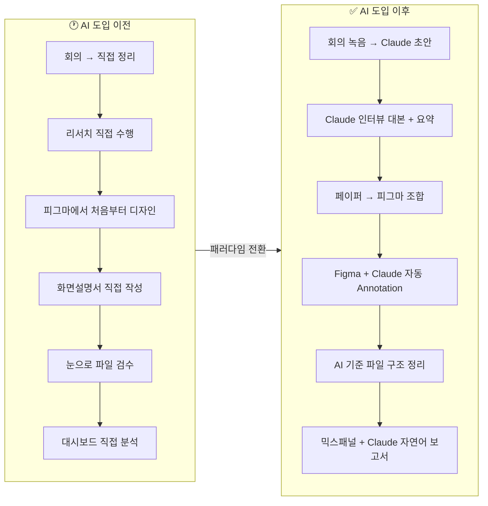
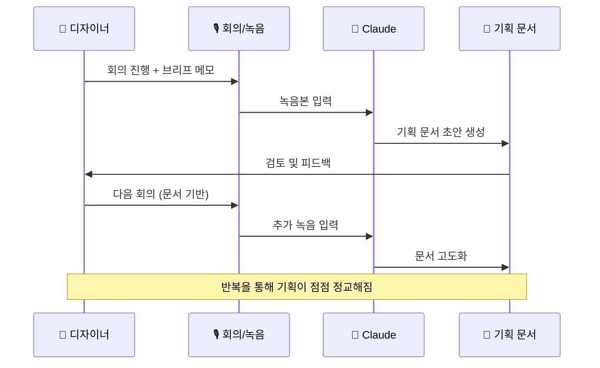
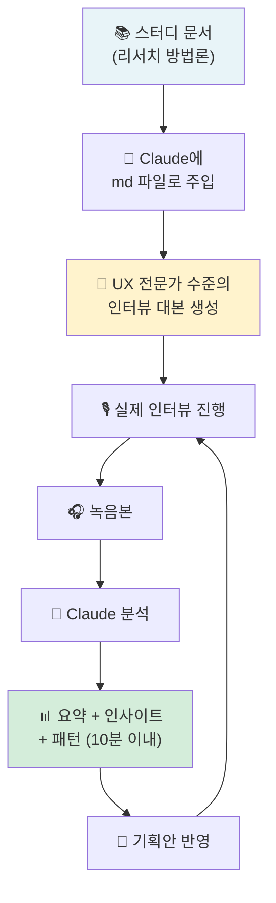
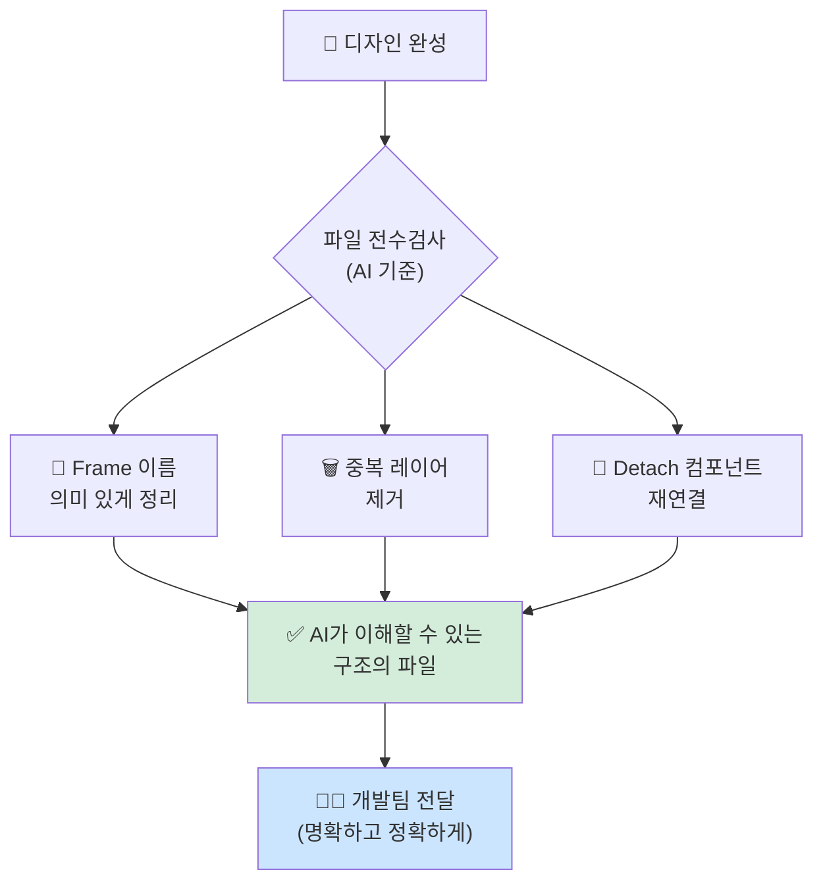
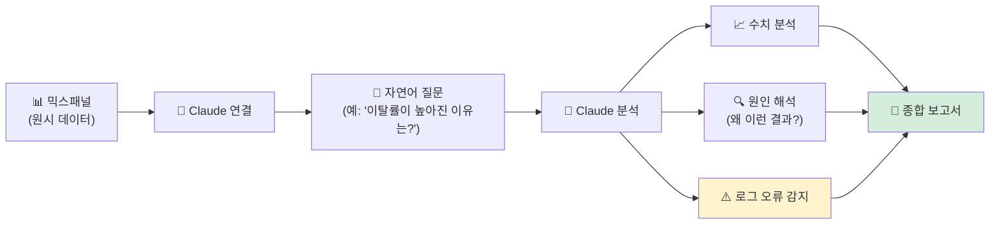
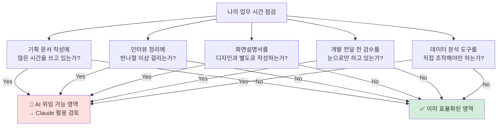

> **원문 출처:** [Ponyo 작가 브런치](https://brunch.co.kr/@ponyodesign/11) · 2026년 4월 13일 게재  
> **분석 작성일:** 2026-04-18  
> **키워드:** AI, 디자인, 업무 자동화, Claude, UX, 워크플로우

---

## 개요: "직접 하는 일"에서 "정리하고 시키는 일"로

이 글은 현직 UX/Product 디자이너 Ponyo가 Anthropic의 AI 도구 **Claude(클로드)** 를 실무에 본격 도입한 이후, 자신의 일하는 방식이 어떻게 근본적으로 달라졌는지를 6가지 영역으로 나누어 상세하게 서술한 실무 경험담이다. 단순히 "AI가 편리하더라"는 수준의 감상문이 아니라, 기획·리서치·디자인·문서화·개발 협업·데이터 분석이라는 디자인 업무의 전 사이클에 걸쳐 구체적으로 무엇이, 어떻게, 왜 바뀌었는지를 솔직하게 풀어낸다는 점에서 실무자들에게 특히 유의미하다.

저자가 강조하는 핵심 전환점은 하나다. **AI 도입 이후, 일의 본질이 "직접 수행"에서 "정리하고 위임하는 것"으로 변화했다.** 디자이너가 모든 것을 직접 손으로 만들던 시대에서, 디자이너가 "무엇을 만들어야 하는지 정의하고 AI에게 실행을 위임하는" 시대로의 전환이다. 이는 디자이너의 역할 자체를 재정의하는 흐름이기도 하다.

타이밍도 흥미롭다. 이 글이 게재되고 불과 나흘 뒤인 **2026년 4월 17일**, Anthropic은 디자이너를 위한 전용 도구 **Claude Design**을 공식 출시했다. 디자이너 실무자의 경험담이 Anthropic의 제품 방향성과 얼마나 정확히 맞닿아 있는지를 방증하는 사례다.

---

## 전체 워크플로우 변화 요약

아래 다이어그램은 AI 도입 전후 디자이너의 업무 흐름이 어떻게 달라졌는지를 한눈에 보여준다.

---

## 1. 기획 — "쓰는 것"에서 "흘려보내는 것"으로

### 변화 이전의 풍경

과거 디자이너의 기획 업무는 완전한 수작업이었다. 팀 회의가 끝나면 각자 머릿속에 흩어진 이야기들을 디자이너가 홀로 다시 정리하고, 문서로 만들고, 공유하는 과정을 반복했다. 이 과정에서 소비되는 시간은 상당했으며, 정작 중요한 "디자인 결정"에 쓸 에너지가 소진되는 경우도 많았다. 회의록을 작성하고, 그것을 기획서 형태로 재가공하고, 다시 팀에 공유하는 루프는 생산적이기보다는 소모적인 측면이 강했다.

### 변화 이후의 실제 작동 방식

지금은 회의를 할 때 녹음 버튼만 누른다. 회의 중에 디자이너가 직접 해야 할 일은 "간단한 브리프를 잡는 것" 뿐이다. 회의가 끝나면 그 녹음 내용을 그대로 Claude에 입력하면 기획 문서 초안이 생성된다. 이 초안을 바탕으로 다음 회의를 진행하고, 또 녹음하고, 또 Claude로 정리한다. 이 반복적인 루프를 거치면서 문서는 점점 정교해진다.

여기서 주목해야 할 것은 **"정제(Refinement)"라는 개념**이다. 기획을 처음부터 "창작"하는 것이 아니라, 회의에서 나온 날것의 아이디어를 AI를 통해 반복적으로 정제하는 과정으로 기획의 성격 자체가 바뀐 것이다. 디자이너는 이제 기획의 "작성자"가 아니라 "편집자"이자 "큐레이터"가 된다.

---

## 2. 유저 인터뷰 — 준비와 정리의 "속도 혁명"

### 변화 이전의 풍경

유저 인터뷰는 디자인 리서치의 핵심이지만, 준비와 사후 처리에 엄청난 시간이 걸리는 작업이었다. 인터뷰 대본 작성은 UX 리서치 방법론에 대한 깊은 이해가 필요했고, 인터뷰 후에는 녹음본을 하나하나 들으면서 직접 받아쓰기 하듯 정리해야 했다. 5명의 인터뷰만 진행해도 정리에 며칠이 걸리는 경우도 흔했다.

### 변화 이후의 실제 작동 방식

저자 팀은 UX 리서치 관련 도서 **'고작 다섯 명의 말을 어떻게 믿어요?'** 를 스터디하면서 챕터별로 노션에 정리한 내용을 Markdown 파일로 만들었다. 이 문서를 Claude에 참조 자료로 제공했더니, Claude는 사실상 UX 리서치 전문가 수준의 인터뷰 대본을 만들어냈다.

이 과정이 정교한 이유는, 단순히 "인터뷰 질문 만들어줘"라고 요청하는 게 아니라, **팀이 직접 학습하고 정리한 리서치 방법론 문서를 Claude에게 "주입"하는 방식**으로 Claude를 도메인 전문가로 만들었기 때문이다. 이는 AI를 잘 활용하는 사람과 그렇지 않은 사람의 결정적인 차이를 보여준다.

인터뷰 이후 처리도 완전히 바뀌었다. 노션의 회의록 녹음본을 그대로 Claude에 넣으면, **인터뷰 요약, 인사이트 도출, 패턴 분석까지 10분 안에** 완성된 파일이 나온다. 이 결과는 즉시 기획안에 반영되어, 리서치에서 기획으로의 연결 속도가 비약적으로 빨라진다.

---

## 3. 디자인 — "만드는 것"에서 "조합하는 것"으로

### 변화 이전의 풍경

전통적인 디자인 작업은 피그마(Figma) 앞에 앉아서 처음부터 끝까지 직접 UI를 만드는 방식이었다. 레이아웃을 구성하고, 컴포넌트를 배치하고, 색상을 정하고, 인터랙션을 정의하는 모든 과정이 디자이너의 손끝에서 이루어졌다. 이 과정 자체가 디자이너의 핵심 역량으로 여겨졌다.

### 변화 이후의 실제 작동 방식

지금은 **페이퍼(Paper)** 라는 별도 도구에서 UI 아이디어를 빠르게 스케치하듯 뽑아낸 후, 그것을 피그마로 옮겨 디자인 시스템을 적용하는 방식으로 바뀌었다. 이 방식의 핵심은 **"창조"와 "완성도"를 분리**한다는 것이다.

- **창조 단계:** 빠르게, 많이, 실험적으로 아이디어를 시각화
- **완성도 단계:** 기존 디자인 시스템을 적용하여 브랜드 일관성 확보

결과적으로 "처음부터 만드는 데 걸리는 시간"은 줄어들고, "완성도를 맞추고 다듬는 시간"에 더 집중할 수 있게 됐다. 이는 디자인의 본질인 "문제 해결을 위한 판단"에 더 많은 에너지를 쏟을 수 있는 환경을 만들어준다.

> 💡 **최신 동향 (2026.04.17):** 공교롭게도 이 글이 게재된 직후, Anthropic은 **Claude Design**을 공식 출시했다. Claude Design은 자연어 설명만으로 프로토타입, 와이어프레임, 슬라이드 등 시각 결과물을 생성하는 독립 도구로, 비디자이너도 아이디어를 빠르게 시각화할 수 있도록 설계되었다. Figma의 주가는 이 발표 직후 약 7% 하락했다.

---

## 4. 화면설명서 — "작성"에서 "자동 생성"으로

### 변화 이전의 풍경

화면설명서(또는 Design Spec 문서)는 디자이너와 개발자 사이의 가장 중요한 커뮤니케이션 매개체다. 각 화면의 구조, 기능 설명, 컴포넌트 상태(State), 예외 처리 등을 문서로 정리해야 하는 작업으로, 디자인 완성 후 이 문서를 작성하는 데만 상당한 시간이 소요되었다. 디자인을 두 번 하는 셈이었다.

### 변화 이후의 실제 작동 방식

지금은 피그마에 Claude를 직접 연결하여 **Annotation(어노테이션)** 형태로 화면설명서를 자동 생성한다. 화면을 선택하고 설명을 요청하면, Claude가 해당 화면의 구조, 기능, 상태를 분석하여 자동으로 정리해준다. 별도의 문서를 따로 만드는 것이 아니라, **디자인 파일 안에 설명이 직접 붙는 방식**으로 바뀐 것이다.

이 변화가 가져오는 효과는 단순히 "시간 절약" 이상이다. 디자인과 문서가 분리되지 않고 한 파일 안에 통합됨으로써 **정보의 일관성과 최신성이 자동으로 유지**된다. 디자인이 수정되면 그 수정 사항이 설명서에도 즉시 반영될 수 있는 구조가 되는 것이다.

---

## 5. 디자인 → 개발 전달 — "눈으로 보는 검수"에서 "AI 기준 정리"로

### 변화 이전의 풍경

디자인 파일을 개발팀에 전달하기 전 검수 과정은 철저히 수작업이었다. 레이어가 제대로 명명되어 있는지, 컴포넌트가 올바르게 연결되어 있는지, 중복 요소는 없는지를 디자이너가 눈으로 하나하나 확인해야 했다. 파일이 복잡해질수록 이 과정에서 실수가 생기기 쉬웠고, 개발 단계에서 뒤늦게 문제가 발견되는 경우도 잦았다.

### 변화 이후의 실제 작동 방식

지금은 개발 전달 전의 **"파일 전수검사"** 기준 자체가 AI로 바뀌었다. 구체적으로는 다음 세 가지 작업이 핵심이 된다:

1. **Frame 이름 정리:** 의미 있는 이름으로 모든 프레임을 체계적으로 변경
2. **중복 레이어 제거:** 불필요하게 쌓인 레이어 정리
3. **Detach된 컴포넌트 복원:** 디자인 시스템에서 분리된 컴포넌트 재연결

이 세 가지 작업의 궁극적인 목표는 **"AI가 이해할 수 있는 구조"** 로 디자인 파일을 만드는 것이다. 사람이 읽기 편한 파일이 아니라, AI가 파싱하고 이해하기 쉬운 구조로 파일을 정리함으로써 개발 전달의 명확성도 함께 높아진다.

---

## 6. 데이터 분석 — "보는 것"에서 "해석하는 것"으로

### 변화 이전의 풍경

디자인 의사결정을 데이터로 뒷받침하기 위해서는 **믹스패널(Mixpanel)** 같은 분석 툴을 직접 다룰 줄 알아야 했다. 퍼널을 만들고, 코호트를 구성하고, 각종 대시보드를 설계하고, 거기서 나온 수치를 해석하는 과정은 시간이 많이 걸리는 것은 물론이고, 분석 도구에 대한 별도의 학습이 필요했다. 디자이너가 데이터 분석가의 역할까지 겸해야 하는 상황이었다.

### 변화 이후의 실제 작동 방식

지금은 믹스패널을 Claude에 직접 연결하여, **자연어로 질문하면 분석 보고서를 자동으로 받는** 방식으로 바뀌었다. "지난 한 달간 온보딩 완료율이 낮아진 이유가 뭔가요?" 라고 물어보면, Claude가 데이터를 분석하여 수치뿐만 아니라 "왜 그런 결과가 나왔는지"까지 해석해서 보고서로 제공한다.

특히 주목할 만한 부분은, **데이터로만은 발견하기 어려운 로그 오류까지 확인이 가능**해졌다는 점이다. 예를 들어 특정 이벤트 로그가 잘못 기록된 경우, 숫자 분석만으로는 "데이터가 이상하다"는 것을 알기 어렵지만, Claude는 맥락적 분석을 통해 개발 단계에서의 로깅 오류를 감지해내기도 한다. 이는 단순한 데이터 시각화를 넘어서, 데이터 품질 자체를 관리하는 역할까지 AI가 수행하게 되었음을 의미한다.

---

## 종합 분석: 이 변화가 의미하는 것

### 디자이너의 역할 재정의

저자는 글의 마무리에서 이 모든 변화를 이렇게 정리한다. **"AI를 쓰면서 디자인을 덜 하게 된 게 아니라, 오히려 순수 '디자인' 이외의 것들을 AI로 더 빠르게 처리하고 진짜 '디자인'을 할 수 있는 시간을 여유롭게 만들게 됐다."**

이것이 핵심이다. AI가 디자이너의 일을 빼앗는 것이 아니라, 디자이너가 원래 하고 싶었던 "진짜 디자인"에 집중할 수 있도록 나머지 잡무들을 위임하는 도구가 된 것이다.

### 바뀐 것은 "툴"이 아니라 "순서"다

저자가 강조하는 또 하나의 통찰은 **"AI를 쓰고 나서 바뀐 건 툴이 아니라 일을 처리하는 순서"** 라는 것이다. Claude라는 새로운 도구를 추가한 것이 아니라, 기존 업무의 시퀀스와 우선순위가 재편된 것이다.

아래 표는 6가지 영역별 변화를 요약한다:

| 영역 | 이전 방식 | 이후 방식 | 핵심 변화 |
|:---:|:---:|:---:|:---:|
| 기획 | 회의 → 직접 작성 | 녹음 → Claude 초안 → 정제 | 작성 → 편집 |
| 유저 인터뷰 | 수동 대본 + 직접 정리 | Claude 대본 + 자동 분석 | 시간 대폭 단축 |
| 디자인 | 피그마 전체 직접 제작 | 페이퍼 → 피그마 조합 | 창조 + 완성도 분리 |
| 화면설명서 | 별도 문서 직접 작성 | Figma 내 자동 Annotation | 문서와 디자인 통합 |
| 개발 전달 | 눈으로 수작업 검수 | AI 기준 파일 구조 정리 | 기준 자체 변경 |
| 데이터 분석 | 대시보드 직접 해석 | 자연어 질문 → 보고서 | 보는 것 → 해석하는 것 |

---

## 최신 동향: Claude Design 출시 (2026년 4월 17일)

이 글이 게재된 직후인 2026년 4월 17일, Anthropic은 디자인 전용 AI 도구 **Claude Design**을 공식 발표했다. 이는 저자가 실무에서 경험한 변화들이 단순한 개인 차원의 적용을 넘어, Anthropic이 공식 제품으로 만들어 낼 만큼 보편적이고 강력한 흐름임을 보여준다. 

Claude Design의 주요 특징은 다음과 같다:

- **자연어 → 시각물:** 텍스트 설명만으로 프로토타입, 와이어프레임, 슬라이드 등을 자동 생성
- **브랜드 시스템 적용:** 기업의 코드베이스와 디자인 파일을 읽어 색상, 타이포그래피, 컴포넌트를 자동 적용
- **반복 정제:** 채팅, 인라인 코멘트, 직접 편집, 커스텀 슬라이더를 통한 정제 가능
- **Canva/PDF/PPTX 내보내기:** 결과물을 다양한 형태로 출력
- **Claude Code 연동:** 디자인이 완성되면 Claude Code로 핸드오프하여 개발로 직결
- **구동 모델:** Claude Opus 4.7 기반 (Anthropic의 최신 비전 특화 모델)

Claude Design은 비디자이너를 위한 도구이기도 하지만, 저자가 묘사한 것처럼 **"디자이너가 아이디어를 빠르게 시각화하는 첫 단계"** 로도 활용될 수 있어, 실무 디자이너의 워크플로우와도 자연스럽게 맞닿는다. (관련글 : [**Claude Design 완전 분석 — 디자인 패러다임의 전환점**](https://k82022603.github.io/posts/claude-design-%EC%99%84%EC%A0%84-%EB%B6%84%EC%84%9D-%EB%94%94%EC%9E%90%EC%9D%B8-%ED%8C%A8%EB%9F%AC%EB%8B%A4%EC%9E%84%EC%9D%98-%EC%A0%84%ED%99%98%EC%A0%90/))

---

## 실무 적용 제언: 나는 지금 어디에 시간을 쓰고 있는가?

저자가 독자에게 던지는 마지막 질문은 이것이다. **"본인은 지금 어떤 단계에서 시간을 쓰고 있는가?"**

이 질문에 자신 있게 답하기 위해, 아래 체크리스트를 참고해보자.

---

## 결론

이 글은 단순한 AI 도입 후기가 아니다. 디자이너라는 직업이 AI 시대에 어떻게 진화해야 하는지에 대한 실질적인 로드맵에 가깝다. 핵심은 세 가지로 압축된다.

1. **AI는 디자이너를 대체하지 않는다. 대신 디자이너 본연의 일에 집중하게 만든다.**
2. **AI 도입의 효과는 "좋은 도구를 쓰는 것"보다 "일의 순서를 바꾸는 것"에 달려 있다.**
3. **AI를 잘 쓰는 디자이너는 AI를 도메인 전문가로 만드는 방법을 안다.** (UX 리서치 문서를 Claude에 주입하는 사례처럼)

이 흐름은 2026년 현재 단순한 트렌드가 아니다. Claude Design의 출시, Figma의 AI 강화, Adobe의 Firefly 통합 등 산업 전체가 이 방향으로 빠르게 움직이고 있다. 지금 이 전환을 능동적으로 받아들이는 디자이너와 그렇지 않은 디자이너 사이의 생산성 격차는 앞으로 더 커질 것이다.

---

*분석 작성일: 2026-04-18*  
*원문: [브런치 - @ponyodesign](https://brunch.co.kr/@ponyodesign/11)*  
*최신 동향 참조: TechCrunch, VentureBeat, The Register, MacRumors (2026.04.17)*
