> **원문**: Lewis Campbell ([lewiscampbell.tech](https://lewiscampbell.tech/blog/260414.html), 2026년 4월 14일)  
> **한국어 커뮤니티 토론**: GeekNews ([news.hada.io](https://news.hada.io/topic?id=28583))  
> **분석 작성일**: 2026-04-18

---

## 목차

1. [개요 및 배경](#1-개요-및-배경)
2. [애자일의 역사적 계보](#2-애자일의-역사적-계보)
3. [애자일 선언문의 정체성 문제](#3-애자일-선언문의-정체성-문제)
4. [워터폴이라는 허수아비](#4-워터폴이라는-허수아비)
5. [Royce(1970)와 Bell-Thayer(1976): 애자일보다 앞선 통찰](#5-royce1970와-bell-thayer1976-애자일보다-앞선-통찰)
6. [LLM 시대의 등장과 스펙 기반 개발](#6-llm-시대의-등장과-스펙-기반-개발)
7. [한국 개발자 커뮤니티의 반응 분석](#7-한국-개발자-커뮤니티의-반응-분석)
8. [Hacker News 글로벌 커뮤니티 시각](#8-hacker-news-글로벌-커뮤니티-시각)
9. [비판적 종합 평가](#9-비판적-종합-평가)
10. [결론: 애자일 이후의 세계는 어디로](#10-결론-애자일-이후의-세계는-어디로)

---

## 1. 개요 및 배경

2026년 4월, 영국의 소프트웨어 컨설턴트 Lewis Campbell은 자신의 블로그에 "Saying Goodbye to Agile(애자일에 작별을 고하며)"라는 제목의 글을 게재했다. 이 글은 2001년 탄생한 '애자일 소프트웨어 개발 선언(Agile Manifesto)'을 정면으로 비판하는 내용을 담고 있으며, 한국의 개발자 커뮤니티 GeekNews와 글로벌 커뮤니티 Hacker News에서 활발한 논쟁을 불러일으켰다.

Campbell의 핵심 주장은 단순하면서도 도발적이다. **"애자일이 해결했다고 주장하는 문제들은 이미 1970년대에 해결되어 있었으며, 애자일 선언문 자체는 의미 있는 지침을 거의 담고 있지 않다"** 는 것이다. 더불어 LLM(대규모 언어 모델)의 확산으로 인해 소프트웨어 개발 패러다임이 다시 '스펙 기반 개발(Spec-Driven Development)'로 전환되고 있다고 주장한다.

이 글은 단순한 방법론 비판을 넘어, 25년간 소프트웨어 업계를 지배해 온 하나의 이념적 운동 전체를 재평가하는 시도라는 점에서 주목할 만하다.

---

## 2. 애자일의 역사적 계보

애자일이 어떤 역사적 흐름 속에서 탄생했는지 이해하기 위해서는 소프트웨어 공학의 역사를 되짚어볼 필요가 있다.

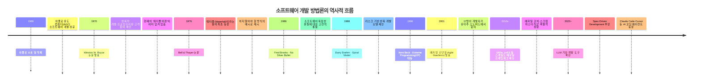

이 타임라인에서 눈여겨볼 점은, **애자일 선언문(2001) 이전에 이미 반복적 개발, 고객 참여, 요구사항의 점진적 정제 등 모든 핵심 개념이 학문적으로 정립되어 있었다**는 사실이다. Campbell의 비판은 바로 이 지점을 겨냥한다.

---

## 3. 애자일 선언문의 정체성 문제

### 3.1 선언문의 내용

2001년 발표된 애자일 선언문은 네 가지 핵심 가치와 열두 가지 원칙으로 구성된다. 네 가지 핵심 가치는 다음과 같다.

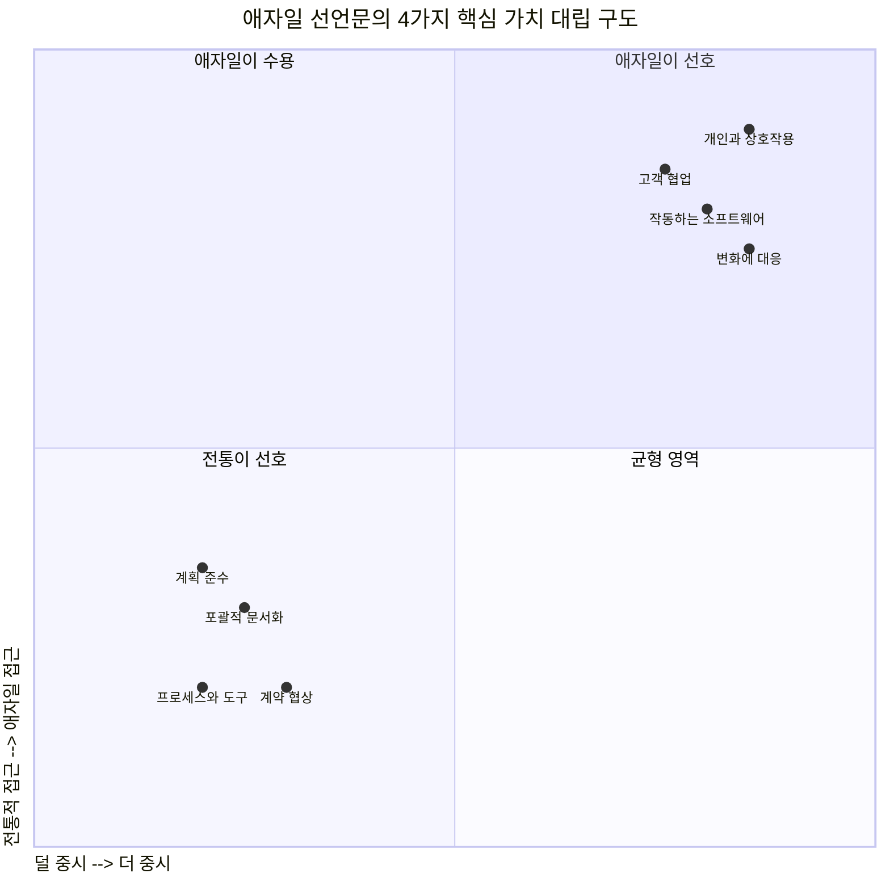

Campbell이 문제로 삼는 것은 이 가치들 자체가 아니다. 문제는 이 가치들이 **지나치게 추상적이고 모호하여, 어떤 실천 방식도 "애자일"이라고 주장할 수 있다**는 점이다.

### 3.2 "진짜 애자일" 방어 메커니즘

소프트웨어 업계에는 오랫동안 흥미로운 방어 논리가 존재해 왔다. 어떤 팀이나 조직이 애자일을 실천했다가 실패하면, 관찰자들은 이렇게 말한다: **"그것은 진짜 애자일이 아니었어."**

이 방어 논리는 철학적으로 '노 트루 스코트맨(No True Scotsman)' 오류와 동일한 구조를 가진다. 즉, 반증이 불가능한 방식으로 개념이 정의되는 것이다.

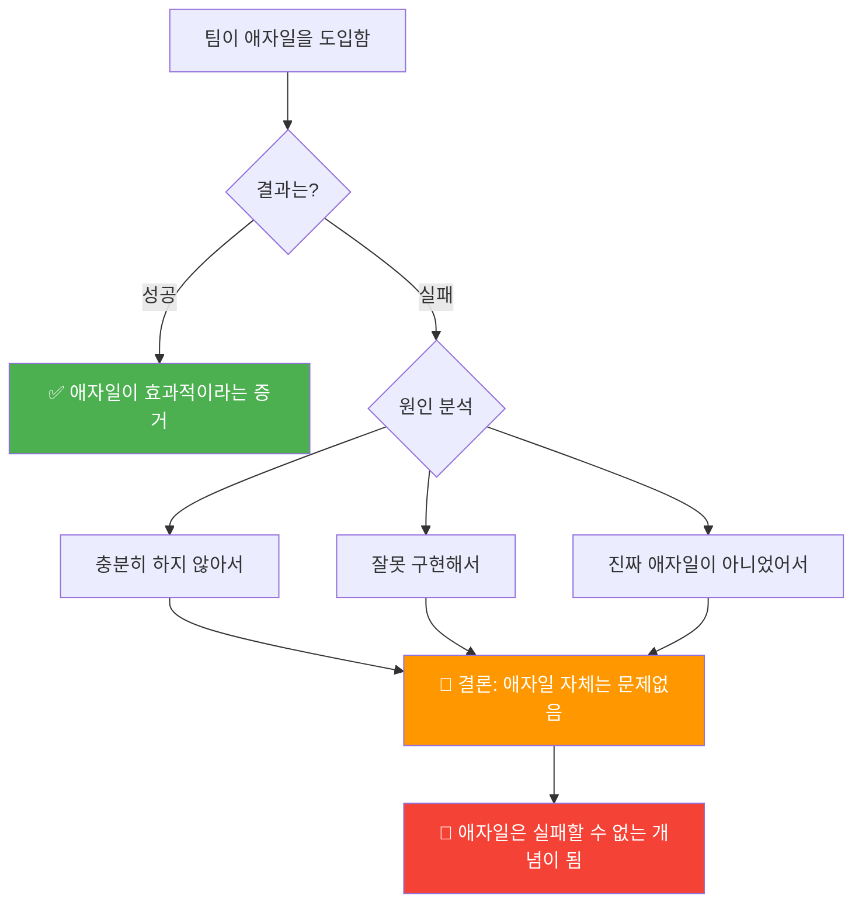

이 구조는 Campbell뿐만 아니라 Hacker News 커뮤니티에서도 강하게 지적되었다. 한 댓글에서는 이를 클라우드 컴퓨팅, 마이크로서비스, 긴축 재정 등 다른 유행어에서도 동일하게 발견되는 패턴이라고 꼬집었다.

### 3.3 상업적 변질: 대문자 Agile의 탄생

선언문의 창시자들인 Kent Beck, Martin Fowler 등이 의도한 것은 **유연한 가이드라인**이었다. 그러나 시간이 흐르면서 '소문자 agile(유연한 개발 철학)'은 '대문자 Agile(스크럼 의식주의)'로 변질되었다.

- **스크럼 마스터(Scrum Master)**: 새로운 직군의 등장
- **애자일 코치(Agile Coach)**: 고액 컨설팅 산업화
- **SAFe(Scaled Agile Framework)**: 수백 페이지 분량의 규범화된 프레임워크
- **스토리 포인트, 번다운 차트, 벨로시티**: 측정 지표의 목적화

이에 대해 Campbell은 냉소적으로 지적한다. *"선언문 어디에도 데일리 스탠드업(Daily Standup)이나 애자일 코치에 대한 언급은 없다."*

---

## 4. 워터폴이라는 허수아비

### 4.1 애자일의 정체성 공식

Campbell의 분석에서 가장 날카로운 통찰 중 하나는 **애자일이 본질적으로 워터폴의 반대 개념으로만 정의되어 왔다**는 점이다.

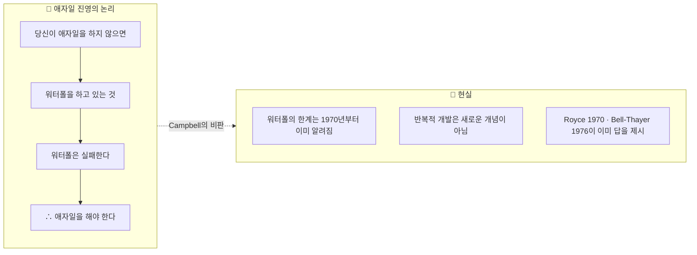

더 중요한 것은, **"워터폴"이라는 용어 자체가 1976년 Bell과 Thayer의 논문에서 "하지 말아야 할 것의 예시"로 처음 등장했다**는 사실이다. 즉, 워터폴은 당시에도 권장되는 방법론이 아니었다. 그럼에도 애자일은 수십 년 전에 이미 버려진 허수아비를 내세워 자신의 존재 이유를 정당화해 온 것이다.

### 4.2 전형적인 워터폴 vs 반복 개발의 비교

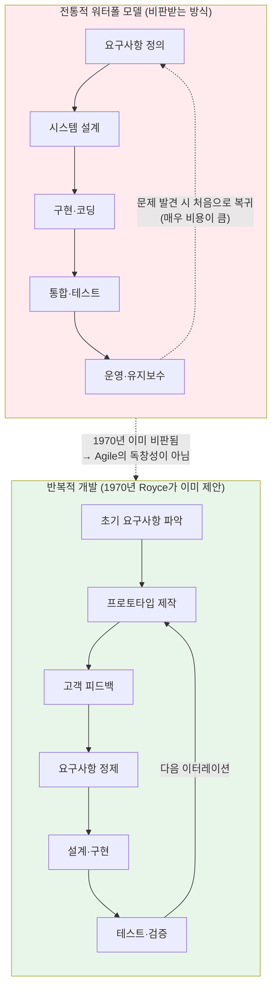

---

## 5. Royce(1970)와 Bell-Thayer(1976): 애자일보다 앞선 통찰

Campbell 주장의 핵심 역사적 근거는 두 편의 논문이다.

### 5.1 Winston W. Royce (1970)

달 착륙 다음 해인 1970년, Royce는 소프트웨어 개발에 관한 논문을 발표하며 워터폴 모델의 한계를 지적하고 다음의 대안을 제시했다.

| Royce(1970) 제안 | 나중에 "애자일의 혁신"이라 불린 것 |
|---|---|
| 프로그램 설계로 시작 | 스프린트 계획·백로그 정제 |
| 소프트웨어 프로토타입으로 요구사항 정제 | MVP(최소 기능 제품)·반복 개발 |
| 고객의 공식적·심층적·지속적 참여 | 고객 협업·스프린트 리뷰 |

Royce는 또한 문서화에 대해 이렇게 썼다: *"코딩이 시작되기 전까지는 문서화·명세·설계는 동일한 것을 지칭한다. 문서가 나쁘면 설계도 나쁘다. 문서가 존재하지 않으면 설계도 아직 존재하지 않는 것이며, 오직 생각하고 이야기하는 수준에 불과하다."*

이 문장은 56년이 지난 오늘날, LLM 시대의 Spec-Driven Development 논의와 완벽하게 맞닿아 있다.

### 5.2 Bell & Thayer (1976)

Bell과 Thayer의 논문은 두 가지 이유로 역사적으로 중요하다.

1. **'Waterfall'이라는 용어를 최초로 사용한 문헌**이다 — 단, 하지 말아야 할 방식의 예시로.
2. 실증 연구를 통해 다음을 발견했다: *"요구사항의 결함은 설계로 요구사항을 충족시키려 할 때 비로소 발견된다."* 이는 반복적 개발의 필요성을 경험적으로 증명한 것이다.

Campbell은 여기서 결정적인 질문을 던진다: **"1970년과 1976년의 연구를 돌아보면, 2001년의 애자일 선언문이 도대체 어떤 새로운 통찰을 제공했단 말인가?"**

---

## 6. LLM 시대의 등장과 스펙 기반 개발

### 6.1 패러다임의 역전

Campbell이 애자일의 '사망'을 선언하는 계기는 단순히 역사적 재검토에 그치지 않는다. 그는 현재 진행 중인 AI 혁명이 소프트웨어 개발의 철학적 기반을 뒤흔들고 있다고 주장한다.

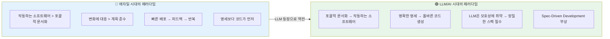

### 6.2 왜 LLM은 스펙을 요구하는가

LLM 기반 코딩 도구(Claude Code, Cursor, GitHub Copilot 등)가 보급되면서 실무 개발자들은 흥미로운 경험을 하고 있다. **모호한 지시를 주면 LLM은 모호한 코드를 생성한다.** 반면 정확하고 구체적인 명세를 제공하면 품질 높은 코드가 나온다.

이는 소프트웨어 공학의 오래된 진리를 AI라는 매개체를 통해 다시 한번 증명하는 것이다: **"입력의 품질이 출력의 품질을 결정한다."**

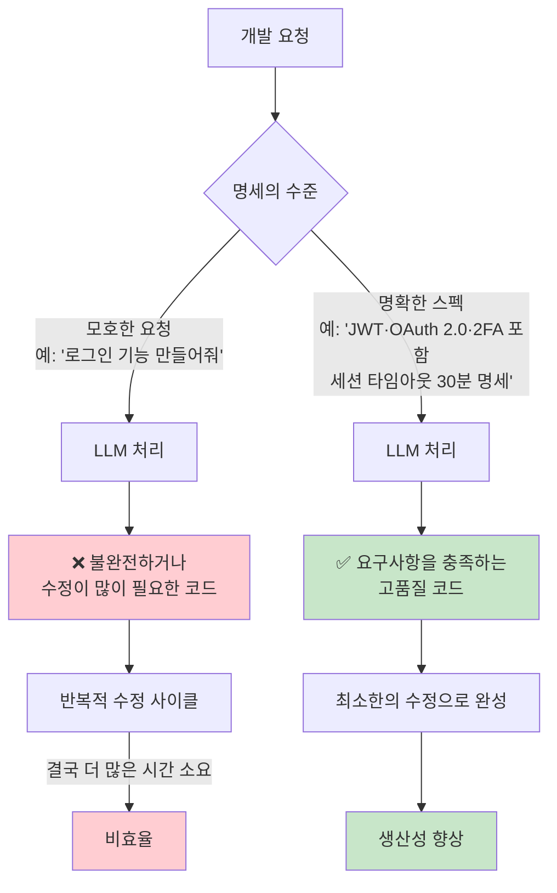

### 6.3 에이전트 시대의 스펙 작성

2025~2026년 현재, 흥미로운 역설이 등장하고 있다. AI 에이전트가 스펙을 작성하고, 인간이 그것을 검토하는 구조가 형성되고 있는 것이다.

이 구조에서는 다음의 흐름이 만들어진다:

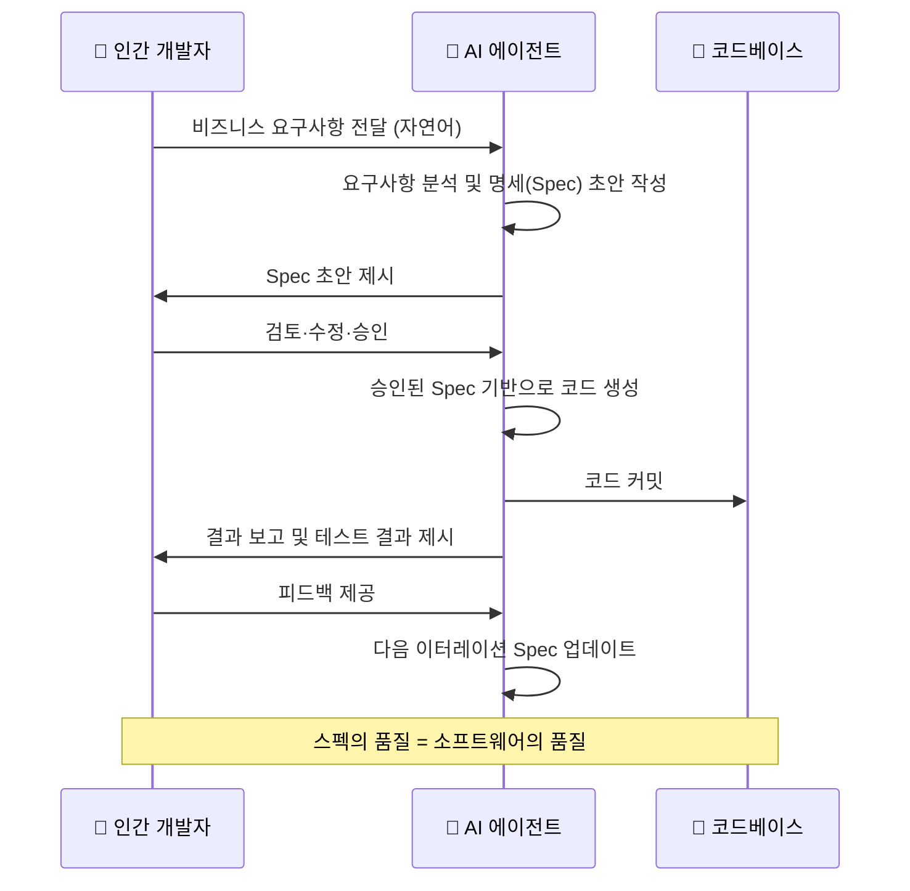

이 과정에서 Campbell의 주장처럼 **명세서(스펙)의 중요성이 극대화**된다. 코드보다 스펙을 먼저, 그리고 더 신중하게 작성해야 하는 시대가 온 것이다.

---

## 7. 한국 개발자 커뮤니티의 반응 분석

GeekNews와 제공된 문서에 담긴 한국 개발자 커뮤니티의 반응은 크게 세 가지 입장으로 분류된다.

### 7.1 비판적 수용 (Campbell에 동조)

**myc0058의 댓글**은 한국적 맥락에서 가장 강렬한 공감을 얻었다:
> "국내에서 애자일은 개발자들 일정 압박용 그 이상도 이하도 아님"

이 짧은 문장은 한국 IT 업계의 현실을 적나라하게 드러낸다. 애자일의 '스프린트'와 '빠른 출시'라는 개념이 실제로는 **개발자에게 더 많은 업무를 더 빠르게 강요하는 도구**로 악용되어 왔다는 것이다.

**savvykang**은 더 본질적인 문제를 지적했다:
> "왜 이렇게 방법론을 경전처럼 여기는지 모르겠습니다. 원 저자도 방향만 달랐지 교조주의적인건 마찬가지라고 생각합니다."

이는 Campbell의 글 역시 기존 애자일 옹호론과 같은 구조적 오류를 범할 수 있다는 날카로운 메타 비판이다.

### 7.2 반론: 여전히 애자일은 유효하다

**tekart**는 가장 균형 잡힌 반론을 제시했다:
> "결론이 좀 과한 거 같네요. 상업화나 형식화가 문제일 수 있지만 스프린트나 백로그 같은 도구가 쓸모없어진 건 아니죠. SDD가 중요해졌다는 건 맞지만 그 스펙 자체를 AI와 협력적으로 신속하게 작성할 수 있으니 여전히 애자일하죠. 2주짜리 스프린트가 몇 시간 정도로 단축된 것일 뿐, 반복적으로 깎는다는 본질은 그대로인 거 같습니다."

이 시각은 매우 중요하다. **애자일의 철학(반복·적응·피드백)은 살아있으며, LLM으로 인해 반복 주기가 단축될 뿐 본질은 유지된다**는 관점이다.

**dopeflamingo**는 더 직접적으로 비판했다:
> "바보같은 글이네요. spec 자체를 애자일하게 써야하는게 핵심인데...애자일은 고객 요구사항에 빠르게 변화해서 적응하는 겁니다."

### 7.3 코드 vs 문서 논쟁

특히 주목할 만한 것은 **develosopher와 snisper, willom2c 사이의 코드-문서 논쟁**이다.

**develosopher**: "가독성 높은 코드는 문서를 생산할 필요가 없도록 만든다. 코드와 문서를 번갈아 보는 작업을 줄이는 것이 핵심이다."

**snisper**: "코드는 문서를 대신할 수 없다. 프로그래밍 언어는 자연어의 풍부한 표현력을 갖지 못한다. 오르지 못할 바벨탑이다."

**willom2c**: "반대로 자연어가 코드를 대체하기도 힘들다. 컴퓨팅을 위해서는 결국 디테일을 채워 넣어야 한다."

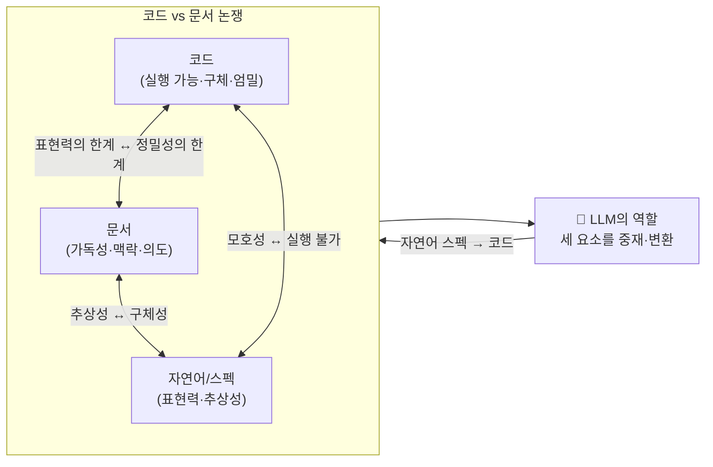

이 논쟁의 핵심은 **LLM이 자연어(스펙)와 코드 사이의 변환을 담당함으로써, 세 요소의 관계가 근본적으로 변하고 있다**는 것이다.

---

## 8. Hacker News 글로벌 커뮤니티 시각

Hacker News의 논의는 한국 커뮤니티보다 더 심층적이고 다양한 관점을 제시했다.

### 8.1 애자일은 실패할 수 없는 개념이다

가장 많은 공감을 받은 논지는 애자일의 **반증 불가능성**이다.

> "Agile을 통해 흥미로운 현상을 보게 되었음. 실패하면 '충분히 하지 않았다'는 식으로 해석되는 구조임. 클라우드, 마이크로서비스, 긴축정책 등에서도 같은 패턴을 봄."

이는 철학적으로 중요한 지적이다. 어떤 이론이나 방법론이 반증 불가능하다면, 그것은 과학적 지식이 아니라 신앙에 가깝다.

### 8.2 대기업 애자일의 민낯

> "내가 다닌 대기업들의 Agile은 거짓말이었음. 한 동료는 '다음 스프린트 일을 미리 해두면 항상 제때 끝난다'고 말했음. 즉, Agile은 실제 일보다 지표 생산 시스템으로 작동했음."

이 증언은 한국의 "일정 압박용 애자일" 비판과 완벽하게 일치한다. **벨로시티, 번다운 차트, 스토리 포인트 등의 측정 지표가 실제 생산성이 아닌 지표 관리를 위해 조작되는 현실**이 글로벌 공통 현상임을 보여준다.

### 8.3 규모 확장의 한계

> "이 네 문장(애자일의 핵심 가치)은 훌륭하지만, 실제로는 작은 팀에서만 잘 작동함. 인원이 늘면 목표 정렬이 어려워지고, 결국 통제와 절차가 필요해짐."

이 통찰은 중요하다. 애자일은 **소규모 자율 팀**을 전제로 한 방법론이다. SAFe, LeSS 같은 스케일드 애자일 프레임워크는 이 모순을 해결하려다 오히려 애자일의 본질을 훼손했다는 비판이 타당하다.

### 8.4 Kent Beck의 원래 의도

> "Kent Beck이 'Extreme Programming'에서 말했듯, Agile은 상상된 전지전능함의 폭정을 피하려는 시도였음. 과거의 워터폴은 설계 단계에서 모든 걸 예측하려 했고, 학습과 피드백을 무시했음."

이는 Campbell의 주장과 절충점을 찾는 시각이다. **애자일의 탄생 동기 자체는 유효했다.** 다만 그것이 상업화되고 의식화되는 과정에서 본질이 왜곡되었다는 것이다.

---

## 9. 비판적 종합 평가

Campbell의 주장은 도발적이고 날카롭지만, 몇 가지 중요한 약점도 가지고 있다.

### 9.1 Campbell 주장의 강점

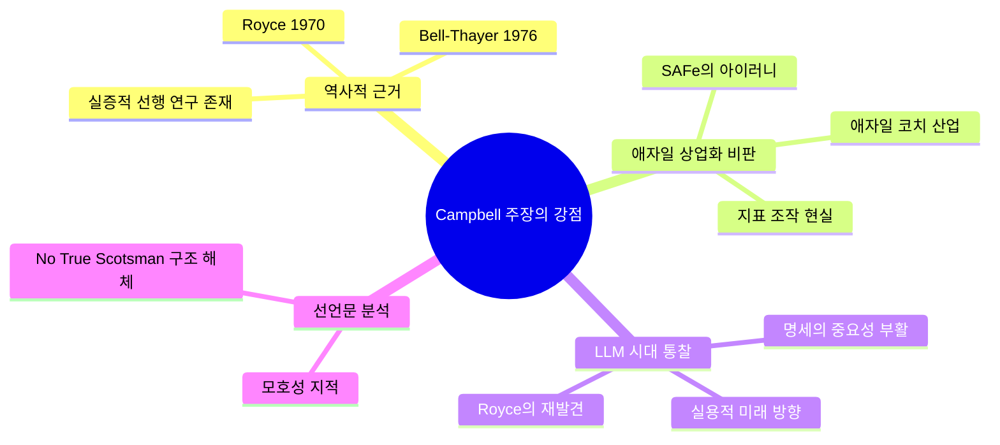

### 9.2 Campbell 주장의 한계

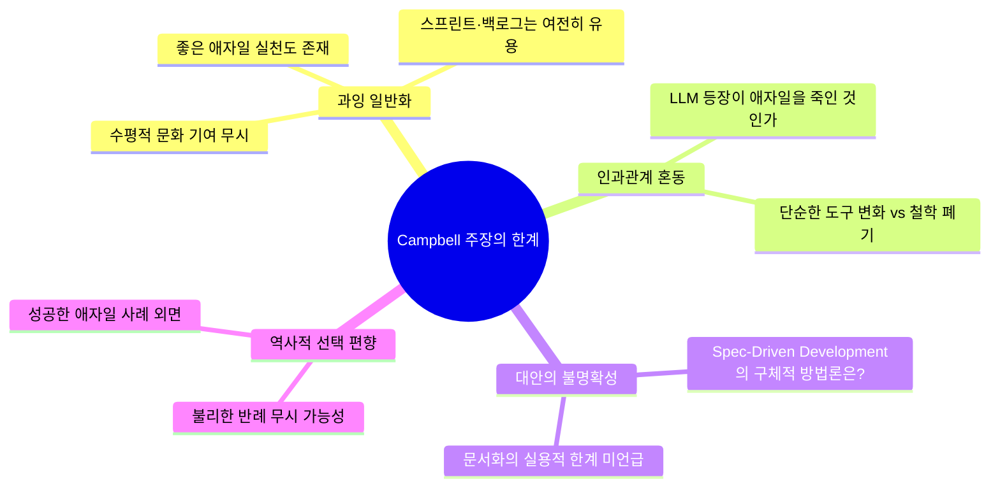

### 9.3 본질적 논점 정리

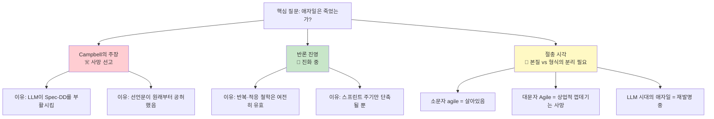

**가장 균형 잡힌 관점**은 아마도 이것일 것이다: 소문자 'agile'이 표현하는 **반복·적응·학습의 철학**은 소프트웨어 개발의 본질과 맞닿아 있어 결코 사라지지 않을 것이다. 반면 대문자 'Agile'이 상징하는 **스크럼 의식주의, 인증 산업, 지표 관리 문화**는 이미 그 실효성을 의심받고 있으며, LLM 시대에 더욱 빠르게 재편될 것이다.

---

## 10. 결론: 애자일 이후의 세계는 어디로

Campbell의 글이 제기하는 가장 근본적인 질문은 이것이다: **소프트웨어 개발에서 "방법론"이란 무엇이어야 하는가?**

역사는 보여준다. 워터폴→애자일→? 로 이어지는 패러다임 전환은 결코 이전 것을 완전히 폐기하지 않는다. 각 시대는 그 시대의 기술적 제약과 조직적 현실 속에서 최선의 답을 모색해 왔다.

앞으로 소프트웨어 개발은 다음과 같은 방향으로 진화할 것으로 보인다.

**① 스펙 작성의 재부상**: LLM을 효과적으로 활용하려면 정밀한 명세가 필수다. 이는 Royce(1970)가 강조한 문서화의 가치를 반세기 만에 재확인하는 것이다.

**② 반복 주기의 극단적 단축**: tekart가 지적했듯이, 2주 스프린트는 몇 시간 또는 몇 분으로 단축될 수 있다. 반복의 철학은 살아있지만 그 속도가 달라진다.

**③ 인간 역할의 재정의**: 코드를 작성하는 것에서 스펙을 작성하고 AI가 생성한 코드를 검토·판단·방향 설정하는 것으로 개발자의 역할이 이동한다.

**④ 방법론 교조주의의 쇠퇴**: Campbell의 글이 옳든 그르든, 어떤 방법론도 은총알(silver bullet)이 아님을 우리는 이미 알고 있다. 도구와 기술이 빠르게 변하는 AI 시대에 방법론 경전주의는 더욱 설 자리가 없어질 것이다.

마지막으로, Campbell 자신이 인용한 Royce의 1970년 문장으로 이 분석을 마무리한다:

> *"문서화, 명세, 설계는 코딩이 시작되기 전까지 동일한 것을 지칭한다. 문서가 나쁘면 설계도 나쁘다. 문서가 존재하지 않으면 설계도 아직 존재하지 않는 것이다."*

56년 전 달 착륙 직후에 쓰인 이 문장이 ChatGPT, Claude, Gemini의 시대에 다시 소환되고 있다는 것은, 소프트웨어 공학의 근본 진리가 얼마나 시대를 초월하는지를 역설적으로 보여준다.

---

## 참고 자료

| 자료 | 출처 |
|---|---|
| 원문 블로그 포스트 | [lewiscampbell.tech/blog/260414.html](https://lewiscampbell.tech/blog/260414.html) |
| GeekNews 한국어 토론 | [news.hada.io/topic?id=28583](https://news.hada.io/topic?id=28583) |
| Hacker News 토론 | [news.ycombinator.com/item?id=47774781](https://news.ycombinator.com/item?id=47774781) |
| Agile Manifesto 원문 | [agilemanifesto.org](https://agilemanifesto.org) |
| Royce 1970 논문 | Managing the Development of Large Software Systems |
| Bell & Thayer 1976 | Software Requirements: Are They Really a Problem? |

---

*작성일: 2026-04-18*
