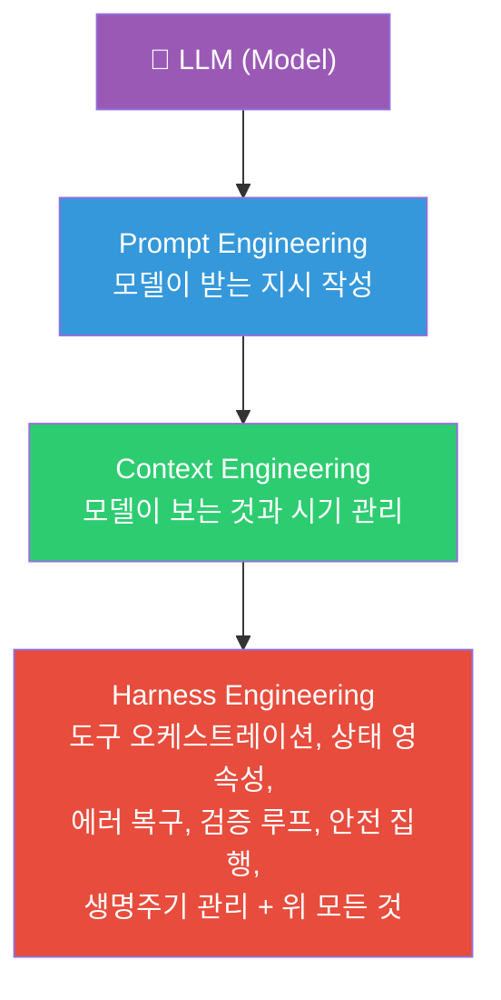
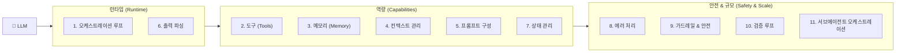
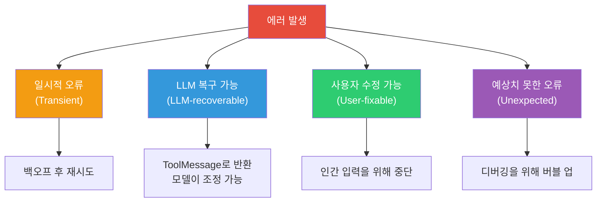
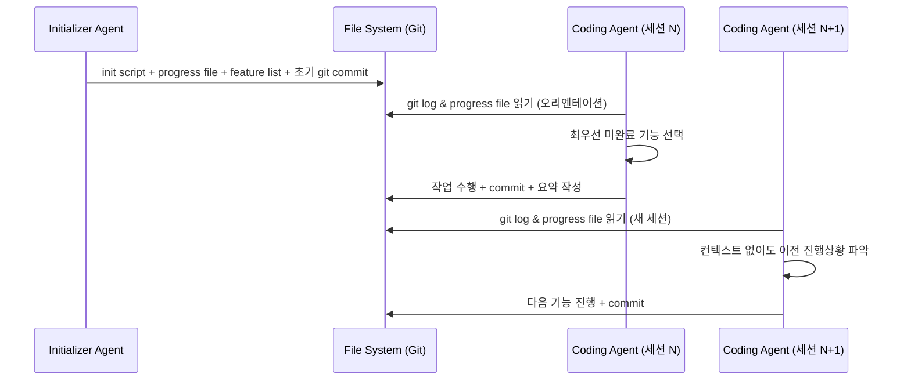
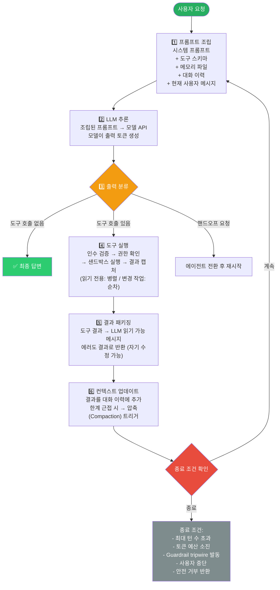
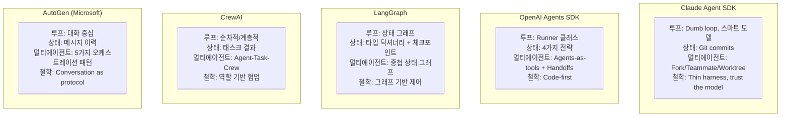
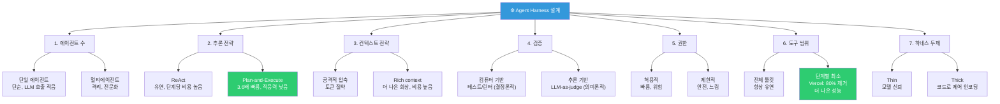

> **출처**: Akshay Pachaar ([@akshay_pachaar](https://x.com/akshay_pachaar/status/2041146899319971922)), 2026년 4월 6일  
> **작성**: 2026년 4월 19일 최신 정보 반영  
> **주제**: Anthropic, OpenAI, LangChain, CrewAI, AutoGen이 실제로 무엇을 만들고 있는가

---

## 목차

1. [왜 지금 Agent Harness인가](#1-왜-지금-agent-harness인가)
2. [Agent Harness란 무엇인가](#2-agent-harness란-무엇인가)
3. [컴퓨터 아키텍처 비유: Von Neumann의 귀환](#3-컴퓨터-아키텍처-비유-von-neumann의-귀환)
4. [엔지니어링의 3계층](#4-엔지니어링의-3계층)
5. [프로덕션 Harness의 12가지 구성요소](#5-프로덕션-harness의-12가지-구성요소)
6. [오케스트레이션 루프의 단계별 동작](#6-오케스트레이션-루프의-단계별-동작)
7. [주요 프레임워크별 Harness 구현 비교](#7-주요-프레임워크별-harness-구현-비교)
8. [스캐폴딩 비유: Harness는 왜 줄어들어야 하는가](#8-스캐폴딩-비유-harness는-왜-줄어들어야-하는가)
9. [Harness 두께 스펙트럼: Thin vs Thick](#9-harness-두께-스펙트럼-thin-vs-thick)
10. [Harness 설계를 결정짓는 7가지 선택](#10-harness-설계를-결정짓는-7가지-선택)
11. [2026년 현재의 산업 동향](#11-2026년-현재의-산업-동향)
12. [결론: Harness가 곧 제품이다](#12-결론-harness가-곧-제품이다)

---

## 1. 왜 지금 Agent Harness인가

챗봇을 만들어본 경험이 있다면, 혹은 ReAct 루프에 도구 몇 개를 연결해봤다면, 데모에서는 멀쩡히 동작하던 에이전트가 실제 프로덕션에 올라가는 순간 무너지는 경험을 해봤을 것이다. 모델은 3단계 전에 한 일을 잊어버리고, 도구 호출은 아무런 오류 메시지 없이 조용히 실패하고, 컨텍스트 윈도우는 잡음으로 가득 찬다.

**문제는 모델이 아니다. 모델을 둘러싸고 있는 모든 것이 문제다.**

이를 가장 극적으로 증명한 사례가 있다. LangChain은 **동일한 모델, 동일한 가중치**를 사용하면서 오직 LLM을 감싸는 인프라만 변경했다. 그 결과, TerminalBench 2.0에서 30위권 밖에서 **5위**로 도약했다. 별도의 연구 프로젝트에서는 LLM이 인프라 자체를 최적화하도록 했더니 수작업으로 설계된 시스템을 뛰어넘어 **76.4%의 통과율**을 기록했다.

이 인프라에는 이제 이름이 있다: **Agent Harness**.

2025년이 에이전트의 해였다면, **2026년은 에이전트 하네스의 해**다. 업계는 고통스럽게 발견했다. 에이전트를 만드는 것은 쉬운 부분이다. 그것을 신뢰할 수 있고, 비용 예측 가능하며, 프로덕션에서 안전하게 만드는 것이 진짜 엔지니어링이 일어나는 곳이다.

---

## 2. Agent Harness란 무엇인가

**"Agent Harness"** 라는 용어는 2026년 초에 공식화되었지만, 그 개념은 훨씬 오래전부터 존재했다. Harness는 LLM을 감싸는 **완전한 소프트웨어 인프라**다. 구체적으로는 다음을 포함한다:

- **오케스트레이션 루프** (Orchestration Loop)
- **도구 레이어** (Tools)
- **메모리 시스템** (Memory)
- **컨텍스트 관리** (Context Management)
- **상태 영속성** (State Persistence)
- **에러 처리** (Error Handling)
- **가드레일** (Guardrails)

Anthropic의 Claude Code 문서는 이를 간결하게 정의한다: SDK는 *"Claude Code를 구동하는 agent harness"* 라고. OpenAI의 Codex 팀도 같은 프레이밍을 사용하며, "에이전트"와 "하네스"라는 용어를 LLM을 유용하게 만드는 비모델 인프라를 지칭하는 데 혼용한다.

LangChain의 Vivek Trivedy가 만든 정규식은 이 분야에서 널리 인용된다:

> **"If you're not the model, you're the harness."**
> (모델이 아니라면, 당신은 하네스다.)

여기서 핵심적인 구분이 있다. **"에이전트"는 창발적 행동**이다: 사용자가 상호작용하는 목표 지향적이고, 도구를 사용하며, 자기 수정이 가능한 존재. **하네스는 그 행동을 만들어내는 기계장치**다. 누군가 "나는 에이전트를 만들었다"고 말할 때, 그 의미는 하네스를 만들어 모델에 연결했다는 것이다.

---

## 3. 컴퓨터 아키텍처 비유: Von Neumann의 귀환

Beren Millidge는 2023년 에세이 *"Scaffolded LLMs as Natural Language Computers"* 에서 이 비유를 정밀하게 제시했다.

```
컴퓨터 구성요소       →    LLM 에이전트 대응
────────────────────────────────────────────
CPU                   →    LLM (모델 가중치)
RAM                   →    Context Window
Hard Disk             →    Vector DB / 장기 저장소
Device Drivers        →    Tool Integrations
Operating System      →    Agent Harness  ← 핵심 레이어
Application           →    Agent (창발적 행동)
```

"원시 LLM은 운영체제가 없는 CPU다. 하네스는 그것을 유용하게 만드는 OS다."

이것은 장식적인 비유가 아니다. Von Neumann 아키텍처는 **모든 컴퓨팅 시스템에 자연스럽게 나타나는 추상화**이기 때문에 정밀한 비유다. 우리는 새로운 기질(substrate) 위에 같은 아키텍처를 재발명하고 있다.

---

## 4. 엔지니어링의 3계층

모델을 둘러싸는 세 개의 동심원 레이어가 있다:



- **Prompt Engineering**: 모델이 받는 지시를 작성하는 것
- **Context Engineering**: 모델이 보는 것과 시기를 관리하는 것
- **Harness Engineering**: 위 두 가지 모두를 포함하며, 거기에 전체 애플리케이션 인프라까지 — 도구 오케스트레이션, 상태 영속성, 에러 복구, 검증 루프, 안전 집행, 생명주기 관리까지 포괄한다

하네스는 프롬프트 주변의 래퍼가 아니다. **자율적 에이전트 행동을 가능하게 하는 완전한 시스템**이다.

---

## 5. 프로덕션 Harness의 12가지 구성요소

Anthropic, OpenAI, LangChain, 그리고 실무자 커뮤니티를 종합하면, 프로덕션 에이전트 하네스는 **12개의 구별되는 구성요소**를 가진다.



### 5.1 오케스트레이션 루프 (Orchestration Loop)

이것이 심장 박동이다. **사고-행동-관찰(Thought-Action-Observation, TAO) 사이클**, 즉 ReAct 루프를 구현한다. 루프는 다음과 같이 동작한다: 프롬프트 조립 → LLM 호출 → 출력 파싱 → 도구 호출 실행 → 결과 피드백 → 완료될 때까지 반복.

기계적으로는 종종 단순한 while 루프에 불과하다. 복잡성은 루프 자체가 아니라 루프가 관리하는 모든 것에 있다. Anthropic은 자신들의 런타임을 **"dumb loop"(멍청한 루프)** 로 설명한다 — 모든 지능은 모델에 있고, 하네스는 단지 턴을 관리할 뿐이다.

### 5.2 도구 (Tools)

도구는 에이전트의 손이다. 스키마(이름, 설명, 매개변수 타입)로 정의되어 LLM의 컨텍스트에 주입되므로 모델이 무엇을 사용할 수 있는지 안다. 도구 레이어는 등록, 스키마 검증, 인수 추출, 샌드박스 실행, 결과 캡처, LLM이 읽을 수 있는 관찰로 결과 포맷팅을 처리한다.

Claude Code는 6개 카테고리에 걸쳐 도구를 제공한다: **파일 작업, 검색, 실행, 웹 접근, 코드 인텔리전스, 서브에이전트 생성**. OpenAI의 Agents SDK는 함수 도구(@function_tool), 호스팅 도구(WebSearch, CodeInterpreter, FileSearch), MCP 서버 도구를 지원한다.

> **Vercel의 역설**: v0 코딩 에이전트 구축 시, 도구의 80%를 제거하고 오히려 더 나은 결과를 얻었다. 도구가 많다는 것이 곧 더 나은 성능을 의미하지 않는다.

### 5.3 메모리 (Memory)

메모리는 여러 시간 척도에서 작동한다.

- **단기 메모리**: 단일 세션 내 대화 이력
- **장기 메모리**: 세션 간 영속성
  - Anthropic: `CLAUDE.md` 프로젝트 파일과 자동 생성 `MEMORY.md` 파일
  - LangGraph: 네임스페이스 구조화된 JSON Store
  - OpenAI: SQLite 또는 Redis로 지원되는 Sessions

Claude Code는 **3계층 계층 구조**를 구현한다:
1. 경량 인덱스 (항목당 ~150자, 항상 로드됨)
2. 요청 시 로드되는 상세 주제 파일
3. 검색으로만 접근하는 원시 트랜스크립트

중요한 설계 원칙: 에이전트는 자신의 메모리를 **"힌트"로 취급하고**, 행동 전에 실제 상태를 대조 검증한다.

### 5.4 컨텍스트 관리 (Context Management)

이곳에서 많은 에이전트가 조용히 실패한다. 핵심 문제는 **컨텍스트 부패(context rot)** 다: 핵심 내용이 윈도우 중간 위치에 있을 때 모델 성능이 30% 이상 저하된다(Chroma 연구, Stanford의 "Lost in the Middle" 발견으로 확인됨). 백만 토큰 윈도우도 컨텍스트가 증가할수록 지시 추종 저하에서 자유롭지 않다.

프로덕션 전략:

| 전략 | 설명 | 사례 |
|------|------|------|
| **Compaction (압축)** | 한계에 근접 시 대화 이력 요약 | Claude Code는 아키텍처 결정과 미해결 버그 보존, 중복 도구 출력 폐기 |
| **Observation Masking** | 이전 도구 출력 숨기되 도구 호출은 보이게 | JetBrains Junie |
| **Just-in-Time 검색** | 경량 식별자 유지 후 동적 데이터 로드 | Claude Code: grep, glob, head, tail 사용 |
| **서브에이전트 위임** | 각 서브에이전트는 광범위하게 탐색하되 1000~2000 토큰 요약만 반환 | Claude Code 멀티에이전트 |

Anthropic의 컨텍스트 엔지니어링 가이드는 목표를 이렇게 말한다: *"원하는 결과의 가능성을 최대화하는 가장 작은 고신호 토큰 집합을 찾아라."*

### 5.5 프롬프트 구성 (Prompt Construction)

각 단계에서 모델이 실제로 보는 것을 조립한다. 계층적 구조를 가진다: 시스템 프롬프트, 도구 정의, 메모리 파일, 대화 이력, 현재 사용자 메시지.

OpenAI의 Codex는 엄격한 우선순위 스택을 사용한다:
1. 서버 제어 시스템 메시지 (최고 우선순위)
2. 도구 정의
3. 개발자 지시
4. 사용자 지시 (캐스케이딩 AGENTS.md 파일, 32 KiB 한도)
5. 대화 이력

### 5.6 출력 파싱 (Output Parsing)

현대 하네스는 네이티브 도구 호출에 의존한다. 모델이 파싱해야 하는 자유 텍스트 대신 구조화된 `tool_calls` 객체를 반환한다. 하네스는 확인한다: 도구 호출이 있는가? 실행하고 루프. 도구 호출이 없는가? 최종 답변.

구조화된 출력의 경우, OpenAI와 LangChain 모두 Pydantic 모델을 통한 스키마 제약 응답을 지원한다.

### 5.7 상태 관리 (State Management)

LangGraph는 상태를 그래프 노드를 통해 흐르는 타입화된 딕셔너리로 모델링하며, 리듀서가 업데이트를 병합한다. 체크포인팅은 슈퍼스텝 경계에서 발생하여 중단 후 재개와 타임트래블 디버깅을 가능하게 한다.

OpenAI는 4개의 상호 배타적 전략을 제공한다:
- 애플리케이션 메모리
- SDK 세션
- 서버 사이드 Conversations API
- 경량 `previous_response_id` 체이닝

Claude Code는 다른 접근법을 택한다: **git 커밋을 체크포인트로**, **진행 파일을 구조화된 스크래치패드로** 사용한다.

### 5.8 에러 처리 (Error Handling)

왜 이것이 중요한가: 단계당 99% 성공률의 10단계 프로세스도 전체 종단 성공률은 ~90.4%에 불과하다. 에러는 빠르게 복합된다.

LangGraph는 4가지 에러 유형을 구분한다:



Anthropic은 도구 핸들러 내에서 실패를 포착하고 에러 결과로 반환하여 루프를 계속 실행한다. Stripe의 프로덕션 하네스는 재시도 횟수를 2회로 제한한다.

### 5.9 가드레일 & 안전 (Guardrails & Safety)

OpenAI의 SDK는 3단계를 구현한다:
- **입력 가드레일**: 첫 번째 에이전트에서 실행
- **출력 가드레일**: 최종 출력에서 실행
- **도구 가드레일**: 모든 도구 호출에서 실행

"tripwire" 메커니즘은 트리거될 때 에이전트를 즉시 중단한다.

Anthropic은 권한 집행과 모델 추론을 아키텍처적으로 분리한다. **모델은 무엇을 시도할지 결정하고, 도구 시스템은 무엇이 허용되는지 결정한다.** Claude Code는 ~40개의 개별 도구 역량을 독립적으로 게이팅하며, 3단계를 거친다:
1. 프로젝트 로드 시 신뢰 수립
2. 각 도구 호출 전 권한 확인
3. 고위험 작업에 대한 명시적 사용자 확인

### 5.10 검증 루프 (Verification Loops)

이것이 장난감 데모와 프로덕션 에이전트를 구분한다. Anthropic이 권장하는 3가지 접근법:

1. **규칙 기반 피드백**: 테스트, 린터, 타입 체커
2. **시각적 피드백**: UI 작업을 위한 Playwright 스크린샷
3. **LLM-as-Judge**: 별도 서브에이전트가 출력 평가

Claude Code의 창시자 Boris Cherny는 이렇게 말했다: *"모델에게 자신의 작업을 검증할 방법을 주면 품질이 2~3배 향상된다."*

Martin Fowler의 Thoughtworks 팀은 이를 다음과 같이 구분한다:
- **가이드(Guides)**: 피드포워드 — 행동 전에 조종
- **센서(Sensors)**: 피드백 — 행동 후 관찰

### 5.11 서브에이전트 오케스트레이션 (Subagent Orchestration)

Claude Code는 3가지 실행 모델을 지원한다:

| 모델 | 설명 |
|------|------|
| **Fork** | 부모 컨텍스트의 바이트 동일 복사본 |
| **Teammate** | 파일 기반 사서함 통신을 가진 별도 터미널 창 |
| **Worktree** | 에이전트당 자체 git worktree, 격리된 브랜치 |

OpenAI SDK는 다음을 지원한다:
- **에이전트-as-도구**: 전문가가 제한된 하위 작업 처리
- **핸드오프**: 전문가가 전체 제어권 인계

LangGraph는 서브에이전트를 중첩된 상태 그래프로 구현한다.

### 5.12 Ralph Loop: 장기 실행 태스크를 위한 2단계 패턴

컨텍스트 윈도우 여러 개에 걸친 장기 실행 태스크를 위해 Anthropic은 **"Ralph Loop"** 패턴을 개발했다:



파일시스템이 컨텍스트 윈도우 간의 연속성을 제공한다.

---

## 6. 오케스트레이션 루프의 단계별 동작



루프는 기계적으로 단순하지만, 각 단계에는 상당한 인프라가 관여한다.

---

## 7. 주요 프레임워크별 Harness 구현 비교



### 프레임워크 상세 비교표

| 항목 | Claude Agent SDK | OpenAI Agents SDK | LangGraph | CrewAI | AutoGen |
|------|-----------------|-------------------|-----------|--------|---------|
| **루프** | Dumb loop, 스마트 모델 | Runner 클래스 | 상태 그래프 | 순차적/계층적 | 대화 중심 |
| **상태** | Git commits | 4가지 전략 | 타입 딕셔너리 + 체크포인트 | 태스크 결과 | 메시지 이력 |
| **멀티에이전트** | Fork/Teammate/Worktree | Agents-as-tools + Handoffs | 중첩 그래프 | Agent-Task-Crew | 5가지 패턴 |
| **철학** | Thin harness, trust the model | Code-first | 그래프 기반 제어 | 역할 기반 협업 | Conversation as protocol |
| **토큰 오버헤드** | 낮음 | 낮음 | 중간 | 중간 (~18%) | 높음 |
| **프로덕션 성숙도** | 높음 | 높음 | 높음 | 중간 | 중간 |
| **설정 복잡도** | 낮음 | 낮음 | 높음 | 매우 낮음 | 중간 |

### 각 프레임워크 특성

**Claude Agent SDK**: 단일 `query()` 함수를 통해 하네스를 노출하며, 비동기 이터레이터로 메시지를 스트리밍한다. "Gather-Act-Verify" 사이클을 사용한다: 컨텍스트 수집(파일 검색, 코드 읽기) → 행동(파일 편집, 명령 실행) → 결과 검증(테스트 실행, 출력 확인) → 반복. Constitutional AI 원칙이 아키텍처에 내장되어 있어 안전이 중요한 애플리케이션(의료, 금융, 법률)에 이상적이다.

**OpenAI Agents SDK**: Runner 클래스를 통해 3가지 모드를 구현한다: 비동기, 동기, 스트리밍. SDK는 "코드 우선(code-first)": 워크플로우 로직이 그래프 DSL이 아닌 네이티브 Python으로 표현된다. 2025년 3월 출시 이후 실험적 Swarm 프레임워크를 대체했다. 100개 이상의 LLM과 호환되는 제공자 무관 설계가 강점이다.

**LangGraph**: 하네스를 명시적 상태 그래프로 모델링한다. 두 노드(llm_call과 tool_node)가 조건부 엣지로 연결된다: 도구 호출이 있으면 tool_node로 라우팅, 없으면 END로 라우팅. LangChain의 AgentExecutor에서 진화했으며, v0.2에서 AgentExecutor가 deprecate되었다. Capital One 등 엔터프라이즈에서 거버넌스와 규정 준수가 필요한 워크플로우에 채택되었다.

**CrewAI**: 역할 기반 멀티에이전트 아키텍처를 구현한다: Agent(역할, 목표, 배경, 도구로 정의된 LLM 주변 하네스), Task(작업 단위), Crew(에이전트 집합). 최소한의 에이전트를 ~35줄의 코드로 작성할 수 있어 신속한 프로토타이핑에 유리하다. 다만 토큰 오버헤드가 약 18% 높고, 장기 실행 워크플로우를 위한 내장 체크포인팅이 없다는 한계가 있다.

**AutoGen (Microsoft Agent Framework)**: 대화 중심 오케스트레이션을 개척했다. 3계층 아키텍처(Core, AgentChat, Extensions)로 5가지 오케스트레이션 패턴을 지원한다: 순차적, 동시적(팬아웃/팬인), 그룹 채팅, 핸드오프, Magentic(관리 에이전트가 동적 태스크 레저를 유지하며 전문가를 조율). GroupChat에서 4에이전트가 5라운드 토론 시 최소 20번의 LLM 호출이 필요해 비용이 높지만, 품질이 속도보다 중요한 오프라인 워크플로우에 탁월하다.

---

## 8. 스캐폴딩 비유: Harness는 왜 줄어들어야 하는가

스캐폴딩 비유는 장식적이지 않다. 정밀하다.

건축 스캐폴딩은 작업자가 도달할 수 없는 높은 층을 건설할 수 있게 해주는 임시 인프라다. 스캐폴딩은 건설을 하지 않는다. 하지만 스캐폴딩 없이는 작업자가 상층에 도달할 수 없다.

**핵심 통찰: 건물이 완성되면 스캐폴딩은 제거된다.** 모델이 개선됨에 따라 하네스 복잡도는 감소해야 한다.

이것이 실제로 일어나고 있다:
- **Manus**: 6개월 만에 5번 재건축, 각 재작성마다 복잡도 제거. 복잡한 도구 정의가 일반 셸 실행으로 단순화됨
- **LangChain**: Deep Research를 1년 만에 4번 재아키텍처링 — 모델 때문이 아니라, 워크플로우 구조화, 컨텍스트 관리, 서브태스크 조율의 더 나은 방법을 발견했기 때문에
- **Anthropic**: 새 모델 버전이 해당 역량을 내재화함에 따라 Claude Code 하네스에서 계획 단계를 정기적으로 삭제

이것은 **공진화 원칙(co-evolution principle)** 을 가리킨다: 모델은 이제 특정 하네스가 루프에 있는 상태로 사후 훈련된다. Claude Code 모델은 훈련받은 특정 하네스를 사용하도록 학습했다. 도구 구현을 변경하면 이 긴밀한 결합으로 인해 성능이 저하될 수 있다.

**하네스 설계의 미래 검증 테스트**: 하네스 복잡도를 추가하지 않고도 더 강력한 모델에서 성능이 확장되면, 설계는 건전하다.

---

## 9. Harness 두께 스펙트럼: Thin vs Thick

```mermaid
graph LR
    subgraph Thin["🧠 Thin (얇은 하네스)"]
        T1["모델이 모든 결정"]
        T2["도구 + 컨텍스트 + 권한"]
        T3["'Trust the model'"]
    end

    subgraph Spectrum["← 스펙트럼 →"]
        SP1["Claude Agent SDK"]
        SP2["OpenAI Agents SDK"]
        SP3["CrewAI Flows"]
        SP4["LangGraph"]
    end

    subgraph Thick["🏗️ Thick (두꺼운 하네스)"]
        T4["하네스가 로직 인코딩"]
        T5["명시적 라우팅, 계획 단계"]
        T6["다단계 전략"]
        T7["'Control the flow'"]
    end

    Thin --- SP1 --- SP2 --- SP3 --- SP4 --- Thick

    style Thin fill:#27ae60,color:#fff
    style Thick fill:#e74c3c,color:#fff
```



하네스 두께는 모델을 얼마나 신뢰할지 대 코드에 얼마나 인코딩할지에 관한 **핵심 아키텍처 도박**이다.

모델이 개선됨에 따라 스펙트럼의 바는 왼쪽으로 이동한다 — 즉, 세계는 Thin 하네스 방향으로 이동하고 있다.

---

## 10. Harness 설계를 결정짓는 7가지 선택



### 각 결정 상세 설명

**결정 1: 단일 에이전트 vs 멀티에이전트**
Anthropic과 OpenAI 모두 말한다: **먼저 단일 에이전트를 최대화하라.** 멀티에이전트 시스템은 오버헤드를 추가한다 (라우팅을 위한 추가 LLM 호출, 핸드오프 중 컨텍스트 손실). 다음 경우에만 분할하라: 도구 과부하가 ~10개 이상 겹치는 도구를 초과하거나, 명확히 분리된 태스크 도메인이 있는 경우.

**결정 2: ReAct vs Plan-and-Execute**
ReAct는 매 단계에서 추론과 행동을 교차한다 (유연하지만 단계당 높은 비용). Plan-and-Execute는 계획과 실행을 분리한다. LLMCompiler는 순차적 ReAct 대비 **3.6배 속도 향상**을 보고했다.

**결정 3: 컨텍스트 윈도우 관리 전략**
5가지 프로덕션 접근법: 시간 기반 초기화, 대화 요약, 관찰 마스킹, 구조화된 메모 작성, 서브에이전트 위임. ACON 연구는 추론 추적을 원시 도구 출력보다 우선시함으로써 **95%+ 정확도를 유지하면서 26~54% 토큰 감소**를 보였다.

**결정 4: 검증 루프 설계**
컴퓨터 기반 검증(테스트, 린터)은 결정론적 근거를 제공한다. 추론 기반 검증(LLM-as-judge)은 의미론적 문제를 포착하지만 지연 시간을 추가한다.

**결정 5: 권한 & 안전 아키텍처**
허용적(빠르지만 위험, 대부분의 행동 자동 승인) vs 제한적(안전하지만 느림, 각 행동에 승인 요구). 선택은 배포 컨텍스트에 따라 다르다.

**결정 6: 도구 범위 전략**
도구가 많으면 성능이 나빠지는 경우가 많다. Vercel은 v0에서 도구의 80%를 제거하고 더 나은 결과를 얻었다. Claude Code는 지연 로딩으로 95% 컨텍스트 감소를 달성했다. 원칙: **현재 단계에 필요한 최소 도구 세트를 노출하라.**

**결정 7: 하네스 두께**
얼마나 많은 로직이 하네스에 있고 모델에 있는가. Anthropic은 thin harness와 모델 개선에 베팅한다. 그래프 기반 프레임워크는 명시적 제어에 베팅한다. Anthropic은 새 모델 버전이 해당 역량을 내재화함에 따라 Claude Code 하네스에서 계획 단계를 정기적으로 삭제한다.

---

## 11. 2026년 현재의 산업 동향

### 표준화 프로토콜의 부상

2025~2026년의 가장 중요한 변화 중 하나는 에이전트 간 통신을 위한 표준 프로토콜의 등장이다.

**MCP (Model Context Protocol)**
Anthropic이 2024년 말에 출시. 에이전트가 도구에 연결하는 방법에 대한 표준. "AI 도구용 USB"로 불린다. 표준화된 방식으로 어떤 에이전트도 어떤 도구를 발견하고 사용할 수 있다. 이미 LangGraph, CrewAI, Mastra, Microsoft Agent Framework 등에 통합되었다.

**A2A (Agent-to-Agent) Protocol**
Google이 2025년 4월에 출시하고 6월에 Linux Foundation에 기증. 다른 조직이 구축한 에이전트들이 서로 통신하는 방법 해결. Salesforce, SAP, ServiceNow, Atlassian을 포함한 150개 이상의 조직이 프로토콜을 지원한다.

이 두 프로토콜은 경쟁하는 것이 아니라 상호 보완적이다. 잘 설계된 에이전트 시스템은 둘 다 사용한다.

### "모델은 상품, 하네스가 해자"

2025년이 에이전트의 해였다면, 2026년은 하네스의 해다. 업계는 에이전트를 만드는 것은 쉬운 부분이고, 신뢰할 수 있고 비용 예측 가능하며 프로덕션에서 안전하게 만드는 것이 진짜 엔지니어링이 일어나는 곳이라는 것을 고통스럽게 발견했다.

과거의 해자는 모델 품질이었다. OpenAI는 GPT-4를 가졌고, Anthropic은 Claude를, Google은 Gemini를 가졌다. 모델 차별화가 우위를 만들었다. 이 해자는 침식되고 있다. 새로운 해자: 하네스 품질. 신뢰할 수 있는 하네스를 구축하려면 수천 시간의 엔지니어링이 필요하다. Manus는 6개월 동안 다섯 번 재작성했다. LangChain은 네 가지 아키텍처에 1년을 보냈다. Hugging Face에서 하네스를 다운로드할 수는 없다. 직접 구축하고, 테스트하고, 실패하고, 배우고, 재건해야 한다.

### 컨텍스트 부패(Context Rot)의 현실

Chroma의 2025년 7월 18개 최신 모델 평가는 집중된 프롬프트(~300 토큰)와 전체 컨텍스트(~113K 토큰) 사이에 상당한 정확도 차이를 발견했다. 에이전트 대화가 100K+ 토큰에 도달하면, 모델은 더 멍청해진다. 턴 1의 시스템 프롬프트를 잊는다. 사용자 선호도를 추적하지 못한다. 이전 진술과 모순되는 세부 사항을 환각하기 시작한다.

### 장기 실행 에이전트를 위한 Anthropic의 기여

Anthropic이 2025년 11월에 발표한 케이스 스터디는 여러 컨텍스트 윈도우에 걸쳐 복잡한 소프트웨어 프로젝트를 구축할 수 있는 장기 실행 AI 에이전트를 가능하게 하는 Claude Agent SDK 엔지니어링 작업을 설명한다. 해결된 근본적인 문제는 복잡한 작업을 수행하는 AI 에이전트가 불가피하게 컨텍스트 윈도우를 소진하여 이전 작업에 대한 기억 없이 새 세션을 시작해야 한다는 것이다. Anthropic은 이를 각 새 엔지니어가 이전에 무슨 일이 있었는지 기억하지 못하는 교대 근무로 소프트웨어 엔지니어가 작업하는 것과 유사하다고 프레이밍한다.

---

## 12. 결론: Harness가 곧 제품이다

동일한 모델을 사용하는 두 제품이 오직 하네스 설계만을 기반으로 완전히 다른 성능을 가질 수 있다. TerminalBench 증거는 명확하다: 오직 하네스만 변경해도 에이전트가 20위 이상 이동했다.

하네스는 해결된 문제나 상품 레이어가 아니다. **진짜 엔지니어링이 사는 곳이다**:

- 컨텍스트를 희소 자원으로 관리
- 실패가 복합되기 전에 포착하는 검증 루프 설계
- 환각 없이 연속성을 제공하는 메모리 시스템 구축
- 얼마나 많은 스캐폴딩을 구축하고 모델에게 얼마나 맡길지에 대한 아키텍처 도박

이 분야는 모델 개선에 따라 더 얇은 하네스 방향으로 이동하고 있다. 하지만 하네스 자체는 사라지지 않는다. 가장 강력한 모델도 컨텍스트 윈도우를 관리하고, 도구 호출을 실행하고, 상태를 영속화하고, 작업을 검증하는 무언가가 필요하다.

이제 AI 제품 개발에서 흔히 말한다: "하네스가 AI 제품을 만들거나 망친다." 두 제품이 동일한 기반 LLM을 사용할 수 있지만, 더 나은 도구 지원, 메모리, 사용자 안내를 제공하는 우수한 하네스를 가진 제품이 훨씬 더 나은 사용자 경험을 제공할 것이다.

---

> **핵심 메시지**  
> 에이전트가 실패하는 다음 번에, 모델을 탓하지 마라. **하네스를 살펴봐라.**

---

*이 문서는 Akshay Pachaar의 "The Anatomy of an Agent Harness" (2026년 4월 6일)와 2026년 4월 현재 최신 산업 정보를 바탕으로 작성되었습니다.*
