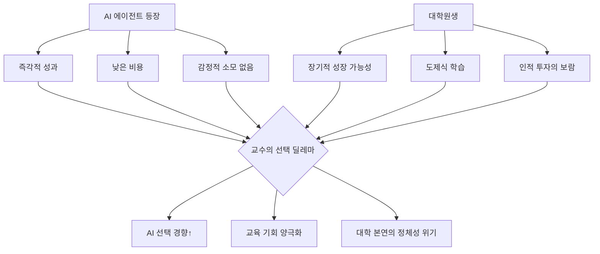
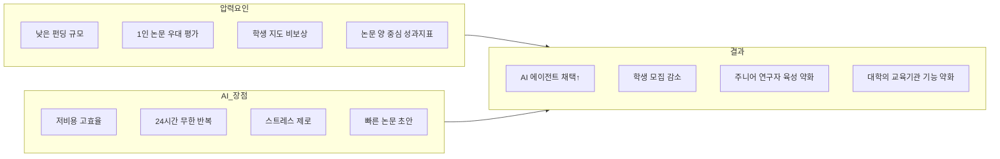
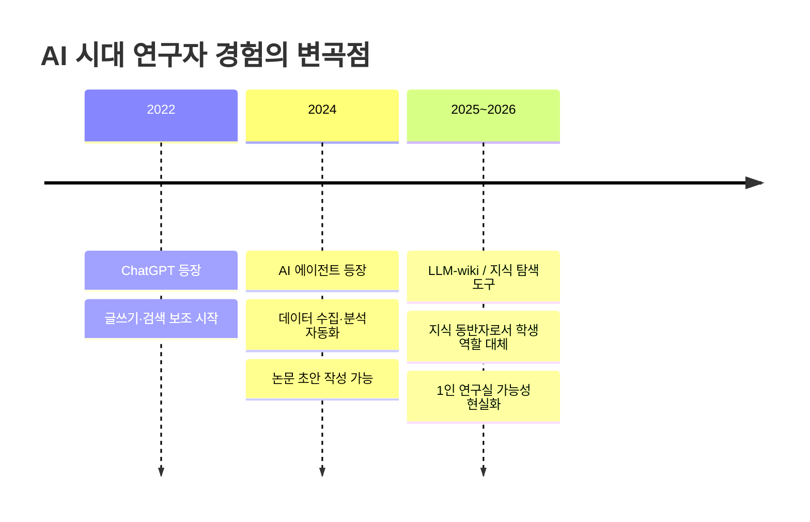

> **원문 출처:** Ariel Rosenfeld, *Science* Vol 391, Issue 6790, March 12, 2026  
> **추가 참고:** Threads SNS 한국 연구자·교수 반응 모음  
> **분석 작성일:** 2026-04-19

---

## 목차

1. [배경과 문제 제기](#1-배경과-문제-제기)
2. [본문 심층 분석 — Science 기고문](#2-본문-심층-분석--science-기고문)
3. [한국 연구자들의 현장 목소리 — Threads 반응 분석](#3-한국-연구자들의-현장-목소리--threads-반응-분석)
4. [핵심 논점 구조도](#4-핵심-논점-구조도)
5. [세계적 맥락과 최신 동향](#5-세계적-맥락과-최신-동향)
6. [한국 특유의 구조적 문제](#6-한국-특유의-구조적-문제)
7. [찬반 논거 종합](#7-찬반-논거-종합)
8. [결론 및 시사점](#8-결론-및-시사점)

---

## 1. 배경과 문제 제기

2026년 3월, 세계 최고 권위의 과학 학술지 *Science*는 이스라엘 Bar-Ilan University의 부교수 Ariel Rosenfeld의 기고문을 실었다. 제목은 단도직입적이다. [**"왜 나는 대학원생 대신 AI를 '고용'할지도 모른다(Why I may 'hire' AI instead of a graduate student)".**](https://www.science.org/content/article/why-i-may-hire-ai-instead-graduate-student)

이 짧고 솔직한 에세이는 전 세계 학계에 파장을 일으켰다. 단순한 기술 낙관론이나 비관론이 아니라, 실제로 연구실을 운영하는 교수가 느끼는 심리적 갈등과 윤리적 딜레마를 진솔하게 토로했기 때문이다.

비슷한 시기, 한국에서도 인간유전체 연구자, 포닥(박사후연구원), 심리학자, AI 업계 종사자 등이 Threads SNS를 통해 유사한 고백을 쏟아냈다. 이 문서는 *Science* 기고문과 한국 연구자들의 목소리를 함께 분석하여, AI 에이전트 시대에 학계가 직면한 복합적 위기를 입체적으로 살펴본다.

---

## 2. 본문 심층 분석 — Science 기고문

### 2-1. 저자의 출발점: 개인적 성장의 회고

Rosenfeld 교수는 자신이 대학원에 처음 진학했던 시절을 되돌아보는 것으로 글을 시작한다. 그는 컴퓨터 공학 박사 과정에 지원할 당시, 로봇공학·알고리즘·자연어처리가 무엇인지도 제대로 모르는 상태였다고 고백한다. 지도교수는 그의 무지를 꿰뚫어 보면서도 기꺼이 제자로 받아들였고, 처음 몇 달간은 가혹한 현실 앞에 놓였다. 밤새 읽고 요약하고 아이디어를 구상했지만, 지도교수에게 발표할 때마다 "처음부터 다시 하라"는 피드백이 돌아왔다. 그는 그만두고 싶다는 생각까지 했다. 그러나 지도교수는 포기하지 않았고, 약 1년의 인내 끝에 비로소 함께 발전시킬 수 있는 무언가를 만들어냈다. 무지한 초보자가 '유능한 주니어 동료'로 변모하는 데에는 그만큼의 시간과 헌신이 필요했다.

이러한 개인적 서사는 이후 전개될 논점의 윤리적 기반이 된다. 저자는 자신이 받았던 기회와 인내의 수혜자였음을 먼저 고백함으로써, AI 선택에 대한 유혹을 더욱 솔직하게 드러낼 수 있게 된다.

### 2-2. 역할 전환: 지도교수가 된 이후

시간이 흘러 교수가 된 Rosenfeld는 자신의 학생들이 예전의 자신처럼 씨름하는 모습을 지켜봤다. 달력은 학생들의 혼란을 풀어주는 미팅으로 가득 찼다. 하지만 결국 그 투자는 보상을 받았고, 제자들이 유능한 주니어 협력자로 성장하는 모습을 보며 깊은 만족감을 느꼈다고 한다.

그런데 이제 AI가 등장했다. 그것도 문헌 종합, 코드 작성, 모델 훈련, 통계 분석을 즉시 수행할 수 있는 AI가.

### 2-3. AI vs. 대학원생: 핵심 긴장 구도

저자가 제시하는 가장 핵심적인 대비는 다음과 같다.

> **"학생의 가치는 천천히 드러나지만, AI는 즉각적인 성과를 제공한다."**

AI는 교수에게 웜업 기간이 필요 없다. 미팅도 필요 없다. 감정적 지지도 필요 없다. 반면 대학원생은 초기에 막대한 자원(시간·에너지·감정)을 소비하며, 그 가치가 발현되기까지 수개월에서 수년이 걸린다.

저자는 이 유혹이 "불편하게도 매혹적"이라고 고백한다. 학술 문화 속에서 '수련생 대신 알고리즘을 선택하는 것'은 대학 본연의 사명에 대한 배신처럼 느껴지지만, 논문 생산의 압박과 가혹한 과학적 속도는 AI를 더욱 매력적으로 만든다는 것이다.

### 2-4. 실제로 진행 중인 변화

저자는 주변 동료 교수들의 행태 변화를 관찰하며 이미 조용한 전환이 진행 중임을 포착한다. 가까운 동료들이 예전만큼 학생을 받지 않고 있고, 학생을 받을 때는 훨씬 까다롭게 선발한다는 것이다.

또한 저자 자신의 반응도 솔직히 기술한다. 새로운 연구 환경에서 학생을 선발한다면, 처음부터 훨씬 높은 수준의 기여를 기대할 것이라고. 그런데 그 기대를 충족하기 위해 학생들은 어차피 자신이 사용할 수 있는 동일한 AI 도구에 의존할 것이고, 그 과정에서 초기 과제를 직접 씨름하며 실수로부터 배우는 소중한 경험을 건너뛸 수 있다. 학생이 '날것의 아이디어'와 'AI의 결과물' 사이를 잇는 단순한 중개자로 전락할 수 있다는 우려이다.

### 2-5. 진짜 위험: 조용한 기본값의 침식

저자는 "AI가 가까운 미래에 대학원생을 완전히 대체할 것"이라고 예언하지 않는다. 그보다 더 미묘하고 위험한 시나리오를 우려한다. 바로, **"학생을 받는 것이 당연하다는 교수 사회의 기본 가정이 조용히 침식되는 것"** 이다. 경우에 따라 가장 실용적인 해결책이 AI를 쓰는 것이 될 수 있으며, 그 상황에서 연구 경험 없이 시작하는 신입 학생이 설 자리는 어떻게 될 것인가.

저자는 에세이를 가장 솔직한 고백으로 마무리한다. 새 프로젝트에 초보자를 받아들이고 싶지 않다는 유혹을 강하게 느끼고 있으며, 그것은 곧 오늘의 자신이라면 '과거의 자신'을 뽑지 않았을 것이라는 뜻이기도 하다고.

---

## 3. 한국 연구자들의 현장 목소리 — Threads 반응 분석

*Science* 기고문은 한국 학계에서도 큰 공명을 일으켰다. 아래는 Threads에서 수집된 한국 연구자·포닥들의 반응을 주제별로 정리한 것이다.

### 3-1. 인간유전체 연구자 ([humangenomicslab](https://www.threads.com/@humangenomicslab/post/DXRQnr7EiW0)) — 가장 포괄적인 고백

이 교수는 AI 에이전트를 경험한 이후 "몇 달간 충격적인 경험"을 했다고 밝히며, 여러 층위에서 자신의 혼란을 진솔하게 토로한다.

**연구 실무 차원의 충격:**  
AI에게 데이터를 주면 분석해주고, 생각을 넣어주면 데이터를 수집해서 분석까지 해준다. 기존에는 거대한 데이터를 비싼 돈을 들여 생산하고 분석해야 했지만, 한국의 펀딩 구조 특성상 미국·유럽처럼 대규모 데이터를 생산할 수 없었다. 어차피 공공 데이터를 모아서 연구하는 구조라면 AI가 더 유리하다는 결론이다.

**경제적 계산:**  
"학생에게 줄 월급으로 7명의 Claude 에이전트를 구입하는 게 더 저렴하고 효율적이다." 이 발언은 도발적이지만, 실제 비용 구조를 반영한 것이다. 물론 이렇게 하자는 것이 아니라, 이런 생각이 들기 시작한다는 사실 자체가 혼란스럽다고 덧붙인다.

**근원적 질문으로의 귀결:**  
이 혼란은 결국 "한국에서 대학은 무엇인가?", "한국에서 과학이란 무엇인가?"라는 근본 질문으로 이어진다.

**AI 연구 워크플로우의 실제:**  
산책 중 아이디어가 떠오르면, Claude Dispatch로 에이전트를 호출해 "이거이거 해봅시다"라고 명령한다. Claude가 분석하고 작업해서 논문까지 작성해준다. IF(임팩트 팩터) 10점 이상의 저널에 투고할 수 있겠다는 생각이 들었다고 한다.

**AI 시대 연구자의 세 번의 변곡점:**  
이 교수는 AI 시대 연구자 유저가 세 번의 변곡을 경험했다고 분석한다. ①ChatGPT의 등장, ②에이전트의 등장, ③LLM-wiki. 이 세 번째 변곡점에서는 '지식 탐색의 동반자'로서 학생 연구원의 필요성이 사라진다고 본다.

**삶의 질 변화:**  
"솔직하게 이야기해서, 에이전트가 등장한 이후로 삶의 질이 정말 올라갔다. 스트레스가 없음." 이 한 문장은 냉정하지만 현실적인 진단이다.

**평가 구조와의 괴리:**  
학위생을 많이 배출한다고 승진에 점수가 생기거나 월급이 오르는 게 아니며, 국립대는 오히려 1인 논문이 평가에 더 높은 점수를 받는다고 한다. 도제식 연구를 지지할 제도적 유인이 없다는 것이다.

### 3-2. 포닥 (hellomymouse) — 웻랩에서도 느끼는 변화

박사후연구원 입장에서의 공감이다. 웻랩(wet lab, 실제 실험이 많은 연구실)임에도 불구하고, Claude Code를 3주간 사용한 후 "정말 학생이 필요 없겠다"는 생각이 들었다고 한다.

이유로는 다음을 꼽는다. ①기본적인 인간관계에서 오는 스트레스가 없다. ②원하는 방향으로 세세하게 지시할 수 있다. ③AI가 알아서 검증하고 리포트로 정리해온다. ④학생에게 시켰을 때 자신이 다시 해야 했던 데이터 분석 작업이 확 줄었다. 이제 학생에게 무엇을 가르쳐야 할지 혼란스럽고, AI가 못하는 청소·뒷정리·인터넷 연결 안 되는 기기 사용 같은 잡일이 남아 있을 뿐이라고 고백한다.

### 3-3. 심리학 박사 (dr.kang.psychology) — 미국 현장에서의 관찰

미국 대학에서 근무하는 것으로 보이는 이 연구자는, 사립 티칭스쿨이 아닌 이상 학생의 기회가 제한될 것이라고 전망한다. 점점 "골치 아파 보이는 연구에 관심이 없고, 돈을 줘도 일 시키기 어려우니 그냥 제가 해버린다"고 토로한다. Work ethic 문제가 있는 학생, 야단칠 기운도 없고 그런 문화도 아닌 현실. 결국 적극적으로 기회를 찾는 자가 더 많이 얻게 될 것이라는 양극화 예측을 내놓는다.

### 3-4. AI 업계 종사자 (seungdeua) — 균형 잡힌 비판적 시각

AI 업계에서 일하는 이 참여자는 교육 기회의 양극화 심화에 동의하면서도, 중요한 반론을 제기한다.

"LLM은 유용한 결과물을 내놓지만, 사실과 오류를 정교하게 뒤섞기 때문에 형태의 완결성이 곧 내용의 신뢰성으로 이어지지는 않는다." 즉, AI 결과물의 외형적 완성도가 내용의 정확성을 보장하지 않는다는 것이다. 질문을 설계하고, 결과를 검증하며 그 한계를 책임지는 것은 여전히 인간의 영역이라는 주장이다.

"검증과 피드백이라는 핵심 과정을 수행할 인력을 육성하지 않는 것이 장기적인 정답일지는 의문"이라는 날카로운 지적도 남긴다.

### 3-5. 일반인 (hyunjae3434) — 철학적 성찰

인간이기 때문에 때로는 비효율적이고 불합리한 선택을 하게 되고, 그 선택이 우리가 무엇을 가치로 두는지를 드러낸다는 관점이다. 교수가 이러한 고민을 하도록 만드는 것 자체가 AI가 할 수 있는 가장 의미 있는 역할일 수 있다는 철학적 해석을 제시한다.

---

## 4. 핵심 논점 구조도

### 4-1. 가치 충돌 구조

### 4-2. 한국 학계의 구조적 압력

### 4-3. 연구자 유저의 AI 시대 변곡점

---

## 5. 세계적 맥락과 최신 동향

### 5-1. AI가 과학을 '슈퍼차지'하지만 '위축'시키기도

*Science*는 2026년 1월, AI가 과학을 가속화하면서도 동시에 위축시킬 수 있다는 연구 결과를 보도했다. 1980년부터 2025년까지 4,100만 편 이상의 논문을 분석한 결과, AI를 활용한 논문 약 31만 편을 식별했다. AI를 활용하는 연구자들은 생산성이 올라가지만, 탐색하는 주제의 다양성은 줄어드는 경향이 확인됐다. 즉 AI가 연구의 속도는 높이되 폭은 좁힐 수 있다는 우려이다.

### 5-2. AI 인재의 산업계 유출

CEPR(경제정책연구센터)의 최신 분석에 따르면, AI 연구 인재 42,000명의 경력 추적 데이터 기반으로, 2001년 48%였던 산업계 AI 연구자 비율이 2019년에는 68%까지 상승했다. 산업계와 학계의 연봉 격차는 2021년 기준 150만 달러 이상으로 5배 넘게 벌어졌다. 최고 수준의 AI 인재가 기업으로 빠져나가면서 대학의 연구 역량 자체가 약화되고 있다.

### 5-3. 고등교육에서 AI의 2026년 전망

Inside Higher Ed의 분석에 따르면 2026년은 AI가 연구·교육·학습·캠퍼스 운영 전반을 재편하는 과정과 씨름하는 한 해가 될 것으로 전망된다. 일부 대학들은 이미 AI 역량을 졸업 요건으로 설정하거나, AI 플루언시 캠퍼스 전체 이니셔티브를 도입하고 있다. AI가 학계의 표준 인프라로 빠르게 편입되는 양상이다.

### 5-4. 오픈 사이언스의 위기

Stanford HAI는 대기업 AI 연구소들(Meta FAIR 예산 삭감, DeepMind의 논문 엠바고 강화, OpenAI의 폐쇄화)이 점점 성과를 공개하지 않는 방향으로 움직이고 있다고 경고한다. 이는 대학이 감당해야 할 공공재적 연구 역할과 충돌하며, 동시에 대학원생 훈련의 생태계 기반이 흔들리고 있음을 시사한다.

---

## 6. 한국 특유의 구조적 문제

한국 학계의 맥락은 *Science* 기고문이 담지 못한 특수한 층위를 추가한다.

### 6-1. 펀딩 구조의 비대칭

미국·유럽과 달리 한국의 연구 펀딩은 규모가 작고, 거대한 데이터 생산보다는 공공 데이터 활용에 의존하는 경향이 크다. 이미 AI 이전에도 '데이터 기생충' 방식(공공 데이터를 모아 분석)이 현실이었던 상황에서 AI가 도입되면, 소규모 연구실에서 AI의 효율적 활용이 더욱 매력적으로 느껴질 수밖에 없다.

### 6-2. 평가 체계의 왜곡된 유인

한국의 교원 평가 체계는 학생 지도와 교육에 낮은 인센티브를 제공한다. 학위생 배출이 승진이나 처우에 직접 연결되지 않는 경우가 많고, 국립대의 경우 1인 논문이 더 높은 점수를 받는 구조가 있다. 이러한 제도는 구조적으로 AI 중심 연구 쪽으로 교수의 합리적 선택을 유도한다.

### 6-3. 도제식 연구 문화의 해체 위기

이공계 연구는 오랫동안 도제식 학습에 의존해왔다. 학생이 실수를 통해 배우고, 교수가 실수를 교정하며 함께 성장하는 구조이다. AI 에이전트는 이 사이클을 단절시킬 수 있다. 학생이 없어도 논문이 나오는 환경에서, 젊은 연구자들은 '실수를 통한 학습'의 기회 자체를 잃을 수 있다.

### 6-4. 대학 정체성의 근원적 질문

가장 강렬한 질문은 "한국에서 대학이란 무엇인가?"이다. 대학이 교육기관이라는 실질적 보상과 명예가 없는 상황, 그리고 성과 중심의 압박이 가중되는 상황에서, 교수들은 선택의 기로에 선다. AI를 쓰면 혼자서도 세계적 수준의 논문을 낼 수 있다. 그렇다면 학생을 가르치는 것은 의무인가, 선택인가?

---

## 7. 찬반 논거 종합

### AI 에이전트 우선 선택을 지지하는 논거

| 논거 | 내용 |
|------|------|
| **즉각적 성과** | 문헌 종합, 코드 작성, 통계 분석을 즉시 수행 |
| **비용 효율** | 학생 월급 대비 낮은 비용으로 더 많은 작업 처리 가능 |
| **감정 소모 없음** | 인간관계에서 오는 스트레스·갈등 부재 |
| **24시간 가용성** | 언제든 원하는 방향으로 세세한 지시 가능 |
| **검증 및 리포팅** | 스스로 결과를 검증하고 리포트로 정리해옴 |
| **한국 현실 적합** | 소규모 데이터·낮은 펀딩 환경에 더 효율적 |

### AI 에이전트 우선 선택에 대한 비판적 논거

| 논거 | 내용 |
|------|------|
| **할루시네이션 위험** | 형태의 완결성이 내용의 신뢰성을 보장하지 않음 |
| **검증 인력 부재** | AI 결과를 평가할 전문 인력 육성이 단절됨 |
| **장기 생태계 약화** | 주니어 연구자 부재는 미래 과학 역량의 공동화를 초래 |
| **지식의 다양성 축소** | AI 활용 연구는 탐색 주제가 좁아지는 경향이 있음 |
| **교육 기회의 양극화** | 스스로 기회를 찾는 소수만이 대학에서 성장 가능 |
| **과학의 본질 훼손** | 실수와 성장의 과정이 과학자 정체성의 핵심임 |

---

## 8. 결론 및 시사점

Rosenfeld 교수의 기고문과 한국 연구자들의 목소리가 공통적으로 드러내는 것은, AI가 아직 '인간 연구자를 완전히 대체'한 것이 아니라, '교수들이 학생을 당연히 받아야 한다는 기본 가정'을 흔들고 있다는 사실이다. 그리고 그 흔들림은 구조적·제도적·문화적 요인들과 맞물리며 증폭되고 있다.

AI 에이전트가 진정으로 우려스러운 이유는 탁월한 성능 때문이 아니다. AI는 질문을 설계하는 법을 가르쳐주지 않는다. AI는 실패의 의미를 함께 고민해주지 않는다. AI는 '왜 연구를 하는가'라는 질문 앞에서 침묵한다. 그 침묵을 채우는 것이 바로 사람이고, 그 사람을 키우는 것이 대학의 역할이다.

그러나 대학이 그 역할을 수행할 유인이 사라지는 구조 속에서, 이 고민은 개인의 윤리적 선택 문제를 넘어 사회·제도적 설계의 문제가 된다. 결국 학계 전체가 답해야 할 질문은 이것이다.

> **"AI 시대에 대학이 존재해야 하는 이유는 무엇이고, 그 이유를 뒷받침하는 제도는 충분히 존재하는가?"**

---

*이 문서는 Science Vol.391 Issue 6790 (2026.03.12) 기고문과 Threads SNS 한국 연구자 반응, 그리고 2026년 4월 기준 최신 연구 동향을 종합 분석하여 작성되었습니다.*

**작성일: 2026-04-19**
