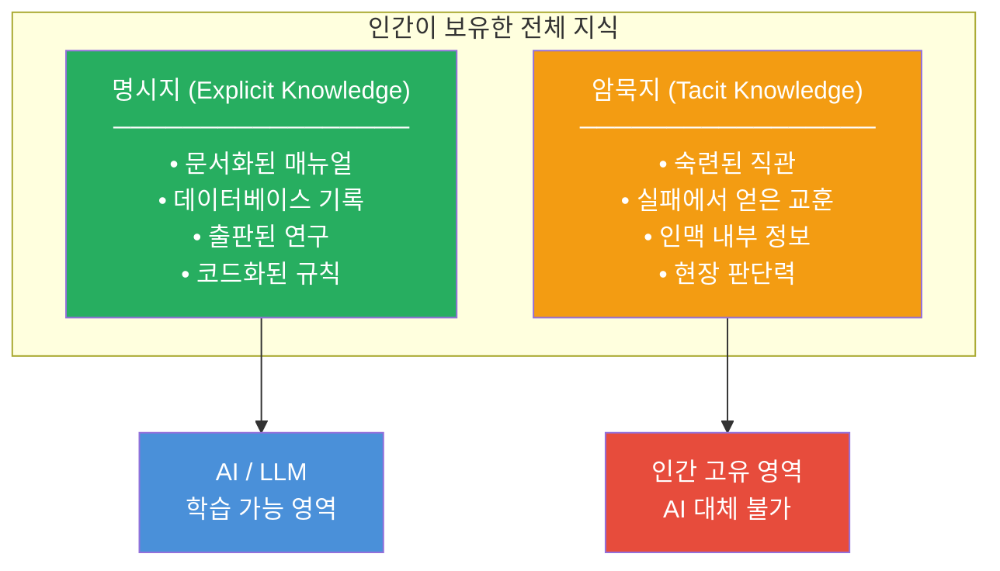
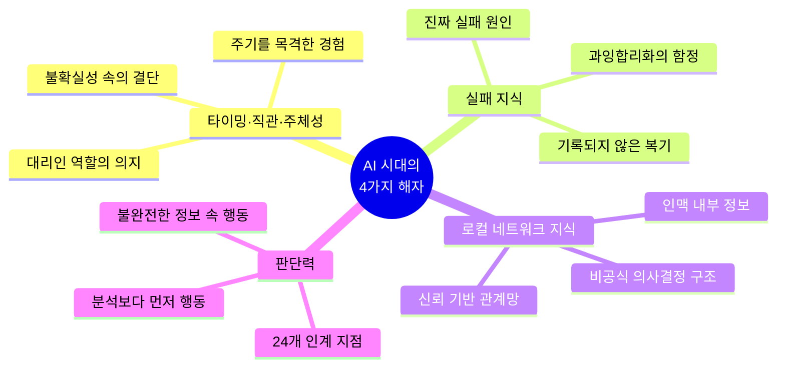
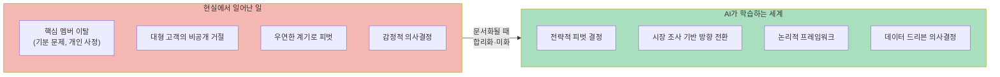
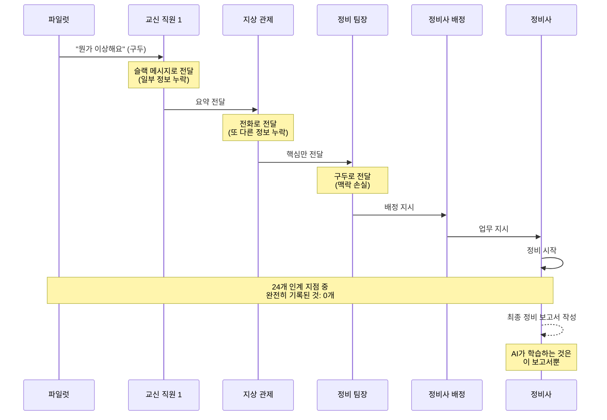
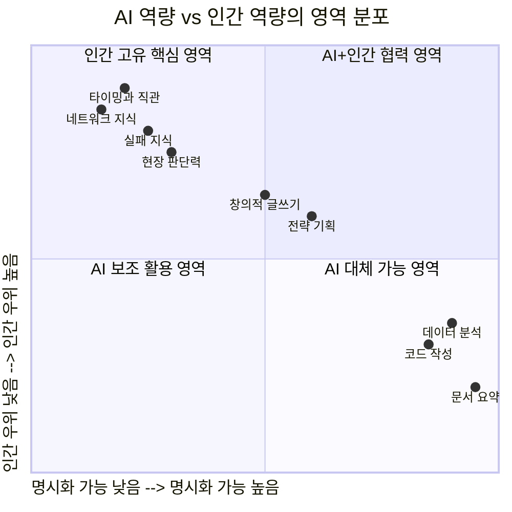

## — 암묵지(Tacit Knowledge)와 AI 시대의 4가지 해자(護城河)에 관한 심층 분석

> **원문 출처**
> - [@wadezone (Koda)](https://x.com/wadezone/status/2045435705246322930) — X(구 트위터) 게시물
> - [@not_racc (Tra的美本日记)](https://x.com/not_racc/status/2045253700499783745) — X 스레드 전문
>
> **작성일**: 2026-04-19

---

## 개요

이 글은 중국어로 작성된 두 개의 X(트위터) 게시물을 한국어로 상세 해설한 문서입니다. 표면적으로는 "AI가 인간을 대체할 수 있는가"라는 진부한 질문처럼 보이지만, 그 안에는 **인식론적·철학적·실무적으로** 매우 날카로운 통찰이 담겨 있습니다. 핵심 개념은 마이클 폴라니(Michael Polanyi)의 **암묵지(Tacit Knowledge)** 이론이며, 이를 AI 시대의 맥락에서 재해석하여 "AI가 구조적으로 학습할 수 없는 영역"을 네 가지로 분류하고 있습니다.

---

## 1부: Koda(@wadezone)의 리트윗 코멘트 — AI 교육의 심층 변화

### 원문 요약 번역

> "AI 교육의 근본적인 욕구가, 극히 가슴 아픈 방향으로 변화하고 있다.
> 과거에는: 미래를 향한 호기심으로 AI를 공부했다.
> 지금은: 도태되지 않으려는 생존 본능으로 AI를 공부한다.
> 기술이 일단 보편화되면, 즉각 저렴한 기반 인프라가 된다.
> 남는 건 오직 하나 — 도구를 걷어낸 뒤의 당신 자신의 맨몸 전투력이다."

### 해설

Koda의 이 짧은 코멘트는 현재 AI 교육 열풍의 이면에 숨겨진 **심리적 전환**을 정확히 꿰뚫습니다.

**① 과거의 동기: 호기심(好奇心)**

불과 몇 년 전만 해도 AI를 배우는 사람들의 주된 동기는 "멋진 미래 기술을 탐험해보고 싶다"는 지적 호기심이었습니다. ChatGPT 이전의 AI 교육 시장은 주로 연구자, 개발자, 얼리어답터 중심이었고, 배움의 분위기 자체가 설레고 개방적이었습니다.

**② 현재의 동기: 생존 본능(求生欲)**

그러나 생성형 AI가 대중화된 이후, 교육 시장의 분위기가 완전히 달라졌습니다. "AI를 모르면 뒤처진다", "내 직업이 사라질 수 있다"는 불안이 배움의 주된 동력이 되었습니다. 이것은 더 이상 탐구가 아니라 **방어**입니다.

**③ 기술의 상품화(Commoditization) 법칙**

Koda가 지적하는 가장 핵심적인 통찰은 이것입니다: **기술은 보편화되는 순간 인프라가 된다.** 전기가 처음 등장했을 때 "전기를 다룰 줄 아는 사람"은 희귀한 전문가였지만, 지금은 전기 스위치를 켜는 것이 아무런 경쟁 우위가 되지 않듯이 — AI 활용 능력도 결국 마찬가지 운명을 맞이할 것입니다.

그렇다면 **도구가 평준화된 이후에 남는 것**은 무엇인가? Koda는 그것을 "肉身肉搏能力(육신의 맨몸 전투력)"이라 표현합니다. 도구 없이도 싸울 수 있는 인간 고유의 능력 — 이것이 이 스레드 전체의 화두입니다.

---

## 2부: @not_racc의 스레드 전문 해설 — 4가지 해자(護城河)

### 도입: 비행기 격납고의 종이 한 장

MIT에서 항공우주 창업(Entrepreneurship in Aerospace) 수업을 듣던 한 학생(@not_racc)이, 항공 정비 AI 스타트업 창업자를 인터뷰한 경험에서 이 글은 시작됩니다.

창업자가 전한 이야기는 간단하지만 강렬합니다:

> "파일럿이 비행기를 격납고에 몰고 들어와서, 종이 한 장을 채워 링바인더에 꽂고, 그 바인더를 선반에 올려놓습니다. 그 종이는 **절대 스캔되지 않습니다.**"

그 종이에는 무엇이 적혀 있었을까요? 어떤 이상한 진동감, 이륙 직전의 어떤 '뭔가 이상하다'는 느낌, 숫자로 표현할 수 없는 직관적 경고들. 이 정보들은 어떤 데이터베이스에도 들어가지 못하고, 어떤 모델의 학습 데이터도 되지 못한 채, **영원히 사라집니다.**

이 단순한 이야기는 AI의 근본적 한계를 상징적으로 보여주는 은유입니다.

---

### 핵심 이론: 암묵지(Tacit Knowledge)

> "우리가 알고 있는 것은, 우리가 말할 수 있는 것보다 항상 많다."
> — 마이클 폴라니(Michael Polanyi), 1966년

**마이클 폴라니(1891~1976)** 는 헝가리 출신의 영국 철학자·화학자로, 1958년 저서 《개인적 지식(Personal Knowledge)》과 1966년 《암묵적 차원(The Tacit Dimension)》에서 이 개념을 정립했습니다.

암묵지란 말로 완전히 표현하기 어려운, 경험을 통해 체득된 지식입니다. 반대 개념은 명시지(Explicit Knowledge)로, 문서화·언어화·코드화가 가능한 지식입니다.

**AI가 학습할 수 없는 이유**는 단순합니다. AI는 **텍스트로 기록된 것만 학습**할 수 있습니다. 그런데 인간이 알고 있는 것의 상당 부분은 **애초에 기록된 적이 없습니다.** 이것은 모델이 더 강력해진다고 해서 극복되는 문제가 아닙니다. **구조적 한계**입니다.

---

## 3부: AI 시대의 4가지 해자(護城河)

> 해자(護城河, Moat): 원래 성 주위를 두른 방어용 수로를 뜻하지만, 비즈니스 맥락에서는 경쟁자가 쉽게 넘어오지 못하게 하는 **지속 가능한 경쟁 우위**를 의미합니다. 워런 버핏이 즐겨 사용한 개념.

### 해자 ①: 타이밍(Timing), 직관(Intuition), 주체성(Agency)

스레드는 좋은 투자자가 창업자를 만났을 때 "저 사람은 Agency가 있다"는 것을 **한눈에 알아본다**는 이야기로 시작합니다.

이 판단은 이력서에서 나오지 않습니다. 피치덱(Pitch Deck)에서도 나오지 않습니다. 그 사람이 **말하는 방식** 에서 느껴지는 것입니다.

이 판단력의 유일한 원천은 **주기(Cycle)를 목격한 경험**입니다.

- 한 번의 붐(boom)이 올라오는 것을 보았다
- 그것이 서서히 쇠퇴하는 것을 보았다
- 당시엔 반드시 성공할 것처럼 보였던 회사들이 소리 없이 사라지는 것을 보았다
- 그리고 또 다른 붐이 왔다

이런 경험이 축적되어야만, "지금이 뛰어들 때인가, 기다릴 때인가"를 판단할 수 있는 직관이 생깁니다.

데이터가 이것을 줄 수 있을까요? 보고서가? AI가 계산한 확률 분포가? 스레드의 저자는 단호하게 말합니다: **줄 수 없습니다.**

**Agency(주체성)** 는 더욱 인간적인 영역입니다. 확실한 답이 없는 상황에서, 한 방향을 선택하고, 걸어나가고, 그 결과를 책임지는 의지. AI는 모든 분석을 제공할 수 있지만, 그 한 걸음을 대신 내딛어 주지는 않습니다. 그 한 걸음은 **영원히 당신의 것**입니다.

---

### 해자 ②: 실패 지식(Failure Knowledge)

AI의 학습 데이터는 **성공 스토리에 심각하게 편향**되어 있습니다.

실패한 프로젝트들은 대부분 상세한 회고록을 남기지 않습니다. 실패의 진짜 이유는, 창업자 자신도 완전히 정리하지 못한 경우가 많고, 설령 정리했더라도 글로 쓰지 않습니다.

현실에서 벌어지는 일들을 생각해보십시오:

- 대형 고객이 미팅 후 자리를 나서면서 조용히 말했습니다: "우리 이 제품 안 쓸 거야." 이 말은 어떤 문서에도 기록되지 않았습니다.
- 제품 방향을 바꾼 진짜 이유는 핵심 멤버 한 명이 어느 날 기분이 나빴기 때문이었습니다. 하지만 이후에 공개된 버전에는 논리적인 프레임워크와 완성된 서사가 붙어 있습니다.

이 때문에 AI는 **과잉합리화(over-rationalized)된 세계관**을 가지게 됩니다.

AI는 "사건은 논리에 따라 발생한다"고 학습합니다. 그러나 현실에서 **사건은 사람에 따라 발생합니다.**

실패를 경험한 사람이 보유하고 있는 것은, AI가 영원히 읽을 수 없는 버전의 역사입니다. 그리고 저자는 말합니다: **그 버전이 진짜입니다.**

---

### 해자 ③: 로컬 네트워크 지식(Local Network Knowledge)

모든 산업에는 모두가 알고 있지만 아무도 쓰지 않은 규칙들이 있습니다.

- **진짜 결정권자**가 누구인지 (공식 직함과 다를 수 있습니다)
- 합의하는 척하지만 실질적으로는 아무것도 결정하지 않는 사람이 누구인지
- 특정 파트너사가 입으로는 "예스"를 말하지만, 그들 회사의 실제 의사결정 구조가 어떻게 생겼는지

이런 정보들은 **어떤 데이터베이스에서도 찾을 수 없습니다.**

이것들은 비공식 저녁 식사 자리에서 존재하고, 모든 사람을 아는 그 한 친구의 머릿속에 있습니다.

당신이 그 네트워크 안에 **embedded(내재)되어 있다면**, 당신은 이 정보 우위를 갖습니다. 당신이 그 안에 있지 않다면, 없습니다.

그리고 AI는 **영원히 그 안에 있지 않습니다.**

AI는 관계를 맺지 않습니다. 밥을 먹지 않습니다. 신뢰를 쌓지 않습니다. 따라서 비공식 채널을 통해 흐르는 정보는, 원칙적으로 AI에게 닿지 않습니다.

---

### 해자 ④: 판단력(Judgment)

항공 정비 AI 창업자는 또 하나의 사례를 이야기합니다.

비행기에 문제가 생겼을 때, **파일럿 보고에서 정비 시작까지** 24개의 인간 인계 지점(handoff point)이 있습니다.

전화, 슬랙 메시지, 구두 전달, 다시 다음 사람에게 구두 전달... **단 하나의 인계 지점도 완전히 기록되지 않습니다.**

AI가 보는 것은 마지막에 작성된 정비 보고서뿐입니다. 그러나 **정비 보고서 위의 세계**와 **실제 일어난 과정**은 전혀 다른 두 개의 사건입니다.

**판단력**이란 이 24개의 인계 지점 속에서, 정보가 불완전하고 시간이 촉박한 상황에서, **다음에 무엇을 해야 할지 아는 것**입니다.

먼저 행동하고, 행동하면서 수정한다. 분석이 완료된 뒤에 결정을 내린다면, 비행기는 이미 연착된 지 오래입니다.

AI는 최선의 분석을 제공할 수 있습니다. 하지만 분석에서 멈춥니다. **그 이후는 인간의 일입니다.**

---

## 4부: 종합 — AI가 강해질수록 경계가 선명해진다

스레드는 역설적인 결론에 도달합니다:

> "AI가 강해질수록, AI의 경계는 더 선명해진다. AI가 할 수 있는 것과 할 수 없는 것이 오히려 더 명확해진다. 경계가 선명해질수록, 그 경계 바깥에 서 있는 사람은 점점 더 대체 불가능해진다."

이것은 매우 중요한 통찰입니다. AI가 발전하면 인간이 설 자리가 없어진다는 공포는, **AI가 모든 것을 학습할 수 있다는 잘못된 가정**에 기반합니다.

그러나 암묵지의 구조적 특성상, AI는 원리적으로 인간 지식의 절반을 학습할 수 없습니다. 그리고 이 절반이야말로 가장 가치 있는 절반일 수 있습니다.

---

## 5부: 에필로그 — 특정 관계 속에서만 보이는 것

스레드의 마지막은 개인적인 이야기로 끝납니다. 그 창업자는 자신의 **파일럿 남편**에게서 이 모든 문제를 처음 발견했다고 말합니다.

그리고 저자는 덧붙입니다:

> "어떤 것들은 특정한 관계 안에서만 보인다. 나는 이것도 암묵지의 한 형태라고 생각한다."

이것은 매우 아름다운 마무리입니다. 암묵지는 단지 기술적 숙련도에만 관한 것이 아닙니다. 특정 관계의 깊이 속에서, 오랜 시간 함께한 사람 사이에서, 비로소 보이게 되는 것들도 암묵지입니다. 이런 종류의 지식은 어떤 LLM도 영원히 재현할 수 없습니다.

---

## 요약 정리

| 해자 | 핵심 내용 | AI의 한계 이유 |
|------|-----------|----------------|
| **타이밍·직관·주체성** | 주기 목격 경험에서 오는 판단, 불확실 속 결단력 | 경험은 기록되지 않음; 결단은 AI가 대신 내릴 수 없음 |
| **실패 지식** | 기록되지 않은 실패의 진짜 이유 | 실패 데이터는 희소하고 과잉합리화됨 |
| **로컬 네트워크 지식** | 비공식 의사결정 구조, 인맥 내부 정보 | AI는 네트워크 안에 embedded될 수 없음 |
| **판단력** | 불완전한 정보 속 즉각 행동 | AI는 분석 단계에서 멈춤 |

---

## 개인적 소견 및 시사점 (한국적 맥락에서)

한국의 IT·SI 환경에서 이 논의는 특히 의미가 큽니다. 대기업 SI 환경에서 수십 년간 쌓인 **도메인별 암묵지** — 어느 공공기관 담당자가 실제 권한을 쥐고 있는지, 어느 요구사항이 문서와 달리 실제로는 어떻게 처리되는지, 어느 시점에 의사결정이 뒤집히는지 — 이런 지식들은 현장 경험자만이 갖고 있습니다.

AI가 RFP를 분석하고, 제안서를 초안하고, 코드를 생성하는 시대에도, **24개의 인계 지점 속에서 판단하는 사람**의 가치는 오히려 높아질 것입니다. 도구가 평준화되는 속도가 빠를수록, 도구 너머의 인간 고유 영역이 더 선명하게 부각됩니다.

결국 Koda의 말처럼: 도구를 걷어낸 뒤의 맨몸 전투력, 그것이 앞으로의 진짜 경쟁력입니다.

---

*작성일: 2026-04-19 | 원문 언어: 중국어 → 한국어 해설*
