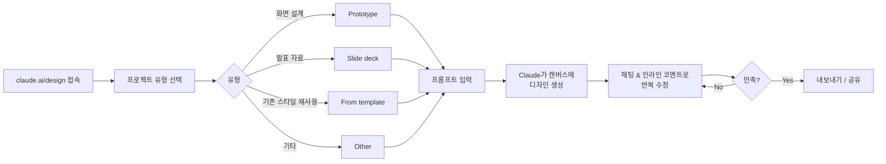
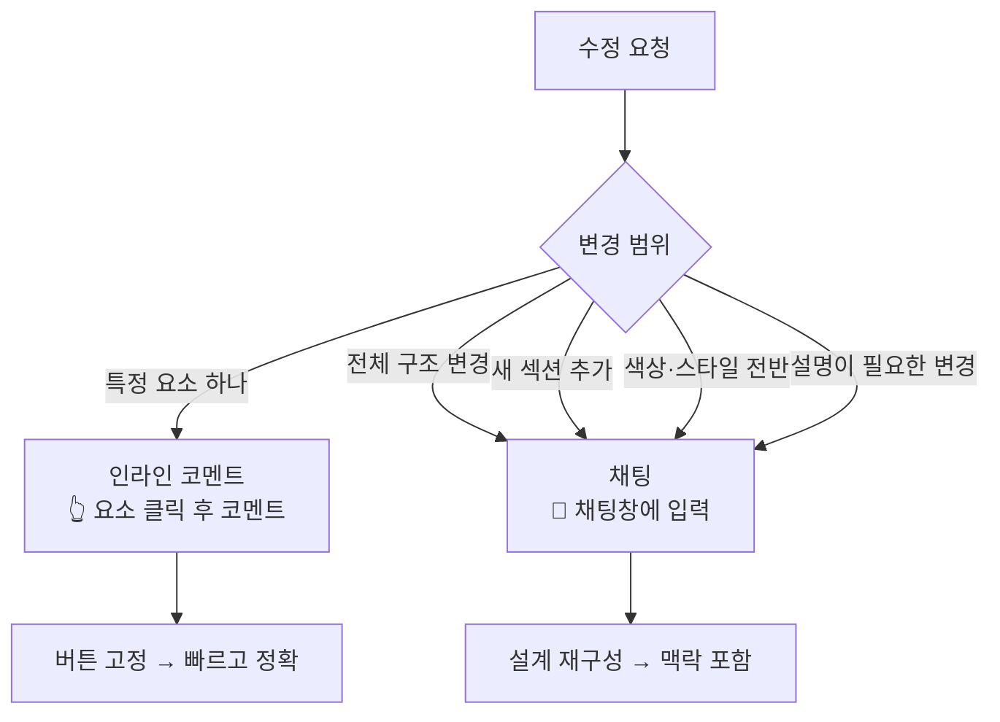
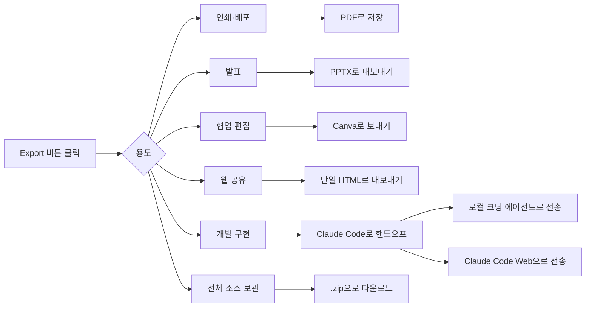
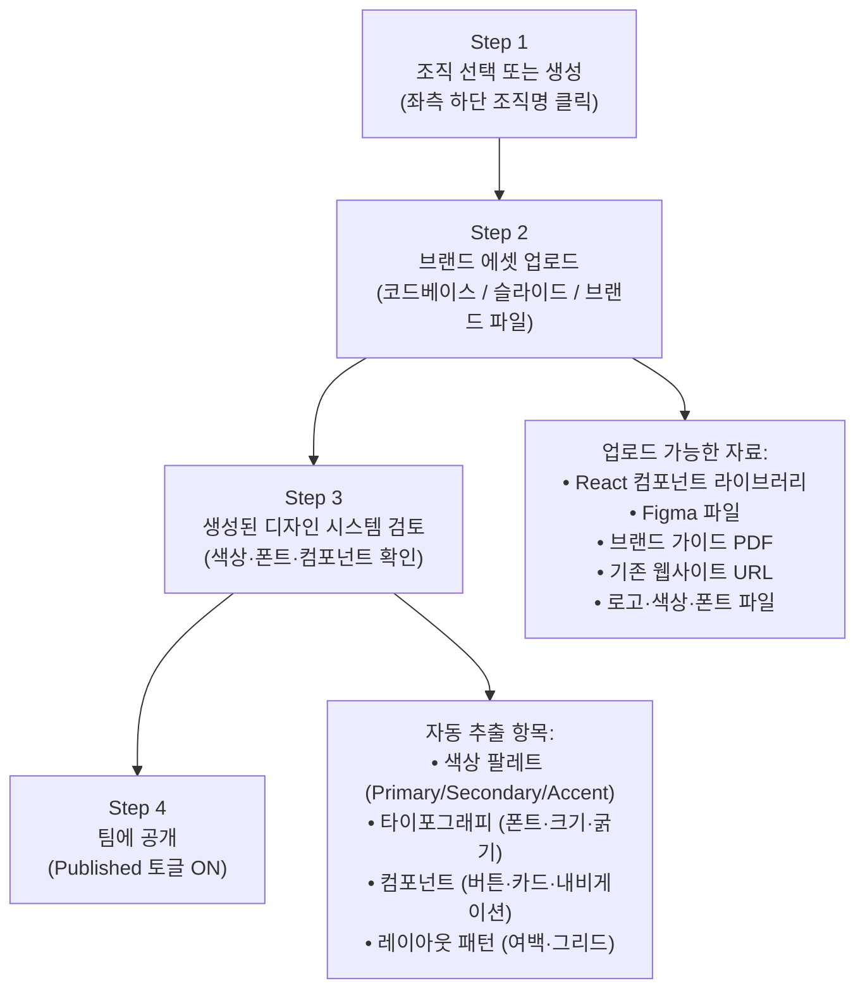

> **출처**: Anthropic 공식 지원 문서 기반 | **버전**: Research Preview (2026년 4월)  
> **접속 주소**: [claude.ai/design](https://claude.ai/design)  
> **지원 플랜**: Pro, Max, Team, Enterprise (무료 플랜 미지원)

---

## 목차

1. [Claude Design 개요](#1-claude-design-개요)
2. [화면 구성 — 인터페이스 완전 해설](#2-화면-구성--인터페이스-완전-해설)
3. [프로젝트 유형 선택](#3-프로젝트-유형-선택)
4. [메인 탭 네비게이션](#4-메인-탭-네비게이션)
5. [첫 번째 프로젝트 만들기](#5-첫-번째-프로젝트-만들기)
6. [컨텍스트 추가하기 — 더 나은 결과를 위한 핵심](#6-컨텍스트-추가하기--더-나은-결과를-위한-핵심)
7. [효과적인 프롬프트 작성법](#7-효과적인-프롬프트-작성법)
8. [디자인 반복 및 수정](#8-디자인-반복-및-수정)
9. [버전 관리 및 되돌리기](#9-버전-관리-및-되돌리기)
10. [내보내기 및 공유](#10-내보내기-및-공유)
11. [디자인 시스템 설정 가이드](#11-디자인-시스템-설정-가이드)
12. [Examples 탭 — 제공 예시 프로젝트 활용법](#12-examples-탭--제공-예시-프로젝트-활용법)
13. [사용량 및 요금](#13-사용량-및-요금)
14. [베스트 프랙티스 — 최고의 결과를 위한 팁](#14-베스트-프랙티스--최고의-결과를-위한-팁)
15. [알려진 한계 및 해결 방법](#15-알려진-한계-및-해결-방법)
16. [Enterprise 관리자 가이드](#16-enterprise-관리자-가이드)

---

## 1. Claude Design 개요

Claude Design은 Anthropic Labs가 출시한 AI 기반 시각 디자인 도구다. 별도의 디자인 도구를 배우거나 코드를 작성하지 않아도, Claude와의 자연어 대화만으로 디자인, 인터랙티브 프로토타입, 프레젠테이션, 랜딩페이지, 대시보드 등 다양한 시각 결과물을 만들어낼 수 있다.

Claude Design의 가장 큰 특징은 **대화형 반복(iterative conversation)** 이다. 한 번의 프롬프트로 완성본을 만드는 것이 아니라, 채팅을 통해 계속 다듬어가는 방식으로 디자인을 완성한다. 마치 AI 디자이너와 함께 작업하는 것처럼, 피드백을 주고받으며 원하는 결과에 수렴해간다.

Claude Design은 현재 **Research Preview** 상태로, Anthropic Labs가 운영한다. Pro, Max, Team, Enterprise 플랜에서 사용할 수 있으며, Enterprise 플랜은 관리자가 기능을 명시적으로 활성화해야 한다.



---

## 2. 화면 구성 — 인터페이스 완전 해설

### 2.1 홈 화면 (claude.ai/design)

Claude Design에 처음 접속하면 좌우 두 영역으로 나뉜 홈 화면이 나타난다.

**좌측 패널 — 프로젝트 생성 영역**

좌측에는 새 프로젝트를 만드는 패널이 위치한다. 상단에는 **Prototype / Slide deck / From template / Other** 네 개의 탭이 있어 만들고자 하는 결과물 유형을 먼저 선택한다. 각 탭을 선택하면 해당 유형에 맞는 입력 폼이 나타난다.

하단에는 **"Set up design system"** 버튼이 별도로 제공되는데, 이것은 조직의 브랜드 가이드라인을 한 번 등록해두면 이후 생성되는 모든 디자인에 자동 적용되는 기능이다. 개인 사용자는 이 버튼을 눌러 자신의 브랜드 색상과 폰트를 등록할 수 있다.

**우측 패널 — 프로젝트 탐색 영역**

우측에는 **Recent / Your designs / Examples / Design systems** 네 개의 탭이 제공된다.

- **Recent**: 최근에 작업한 프로젝트가 카드 형태로 표시된다. 처음 사용하는 경우 "Learn about Claude Design"이라는 퀵 튜토리얼 카드가 표시된다.
- **Your designs**: 지금까지 저장한 모든 디자인 목록이 표시된다. 아직 작업이 없으면 "No designs match" 메시지가 표시된다.
- **Examples**: Anthropic이 미리 만들어 제공하는 예시 프로젝트들을 탐색할 수 있다.
- **Design systems**: 조직의 디자인 시스템과 템플릿을 관리하는 공간이다.

하단 좌측에는 **Docs 링크**와 현재 로그인한 사용자명, 조직명이 표시된다.

### 2.2 프로젝트 작업 화면

프로젝트를 열면 인터페이스가 크게 달라진다.

```
┌──────────────────┬────────────────────────────────┬──────────────┐
│   좌측: 채팅 패널  │        중앙: 캔버스              │ 우측: Tweaks │
│                  │                                │    패널      │
│  Claude와 대화    │   Claude가 생성한 디자인         │  실시간 조정  │
│  하며 수정 요청   │   실시간으로 렌더링              │  슬라이더     │
│                  │                                │              │
│  [프롬프트 입력]   │   [디자인 결과물 미리보기]       │  [색상/폰트]  │
└──────────────────┴────────────────────────────────┴──────────────┘
상단: Design Files 탭 | Comment | Edit | Tweaks 토글 | 100% | Present | Export
```

- **채팅 패널 (좌측)**: 자연어로 디자인 요청을 입력하는 곳이다. 전체적인 방향 변경, 새 섹션 추가, 다른 레이아웃 탐색 등 큰 변화는 여기서 요청한다.
- **캔버스 (중앙)**: Claude가 생성한 디자인이 실시간으로 렌더링된다. 캔버스에서 특정 요소를 직접 클릭해 인라인 코멘트를 남길 수 있다.
- **Tweaks 패널 (우측)**: 색상, 폰트, 간격, 밀도 등을 슬라이더로 실시간 조절한다. Tweaks 토글 버튼으로 켜고 끌 수 있다.
- **상단 툴바**: Design Files(생성된 파일 목록), Comment(인라인 코멘트 모드), Edit(직접 편집), Present(전체화면 프레젠테이션), Export(내보내기) 버튼이 있다.

---

## 3. 프로젝트 유형 선택

좌측 패널 상단의 탭에서 만들고자 하는 결과물의 유형을 선택한다. 유형에 따라 Claude가 다른 방식으로 접근하므로, 처음부터 올바른 탭을 선택하는 것이 중요하다.

### 3.1 Prototype (프로토타입)

앱, 웹사이트, 인터랙티브 UI 화면을 만들 때 선택한다. 두 가지 충실도(Fidelity) 옵션이 제공된다.

- **Wireframe**: 레이아웃 구조와 정보 흐름을 확인하는 저충실도 와이어프레임이다. 색상이나 이미지보다 구조적 배치에 집중하고 싶을 때 적합하다.
- **High fidelity**: 실제 서비스처럼 색상, 폰트, 이미지, 인터랙션이 포함된 고충실도 프로토타입이다. 디자인 시스템이 등록되어 있으면 브랜드 색상과 폰트가 자동으로 적용된다.

> **언제 Prototype을 선택하나?**
> - 모바일 앱 화면 설계
> - 웹 서비스 랜딩페이지
> - 관리자 대시보드 UI
> - 사용자 온보딩 플로우
> - 인터랙티브 폼

### 3.2 Slide deck (슬라이드 덱)

발표용 프레젠테이션을 만들 때 선택한다.

- **Project name**: 프로젝트 이름을 입력한다.
- **Use speaker notes 토글**: 활성화하면 슬라이드 텍스트를 줄이고 발표자 노트에 상세 내용을 배치한다. 실제 발표 상황을 고려해 선택한다.

> **언제 Slide deck을 선택하나?**
> - 투자자 피치덱
> - 팀 내부 보고 자료
> - 학회 발표 슬라이드
> - 고객 제안서
> - 마케팅 프레젠테이션

### 3.3 From template (템플릿에서 시작)

조직에서 미리 만들어둔 템플릿을 기반으로 시작할 때 선택한다. 현재 기본 제공되는 템플릿 유형으로 **Animation(타임라인 기반 모션 디자인)** 이 있으며, 조직 관리자가 추가 템플릿을 생성하면 여기에 표시된다.

직접 템플릿을 만들려면 기존 프로젝트의 Share 메뉴에서 "File type" 옵션을 통해 저장할 수 있다.

### 3.4 Other (기타)

Prototype, Slide deck, Animation 외의 자유 형식 프로젝트를 만들 때 선택한다. 카드뉴스, 포스터, 배너, 인포그래픽 등 정형화된 형태가 없는 작업에 활용한다.

---

## 4. 메인 탭 네비게이션

홈 화면 우측의 네 개 탭을 이해하면 Claude Design을 더 효율적으로 활용할 수 있다.

### 4.1 Recent (최근 작업)

가장 최근에 작업한 프로젝트들이 카드 형태로 표시된다. 처음 접속하면 "Learn about Claude Design" 퀵 튜토리얼 카드가 있어 기본 사용법을 빠르게 익힐 수 있다.

### 4.2 Your designs (내 디자인)

지금까지 저장한 모든 디자인 프로젝트 목록이다. 검색 기능으로 원하는 프로젝트를 찾을 수 있다. 처음 사용하거나 아직 저장된 작업이 없으면 "No designs match" 메시지가 표시된다.

### 4.3 Examples (예시 갤러리)

Anthropic이 Claude Design의 다양한 가능성을 보여주기 위해 미리 제작한 예시 프로젝트들이다. 각 예시에는 해당 결과물을 만든 프롬프트가 함께 제공되며, "Use this prompt" 버튼을 클릭하면 그 프롬프트를 그대로 가져와 새 프로젝트를 시작할 수 있다.

현재 확인할 수 있는 예시로는 다음과 같은 것들이 있다.

- **Iridescent Card** (MONOCHROME · CONTROLS): 홀로그래픽 반짝임 효과의 모노크롬 플레잉 카드. Hue, Iridescence, White Overlay, Glow, Tilt, Noise 등 6개 실시간 슬라이더가 내장되어 있다.
- **Calculator construction kit** (CONSTRUCTION / 12 DIMENSIONS): 수많은 Tweaks 노브가 있는 계산기 UI 빌더.

Examples 갤러리는 "이런 것도 만들 수 있구나"를 파악하는 용도로 활용하면 좋다.

### 4.4 Design systems (디자인 시스템)

조직의 디자인 시스템과 템플릿을 관리하는 공간이다. **Organization settings** 화면에서 다음 두 가지를 관리할 수 있다.

- **DESIGN SYSTEMS**: "Create new design system" 버튼으로 새 디자인 시스템을 만들 수 있다. 생성된 디자인 시스템은 "Claude에게 당신의 브랜드와 제품을 가르쳐주는" 역할을 한다.
- **TEMPLATES**: 조직 구성원이 공유하는 디자인 템플릿을 관리한다. 아직 템플릿이 없으면 "No templates yet. Create one from any project via the Share menu → File type."이라는 안내가 표시된다.

> 조직의 모든 구성원이 이 설정을 볼 수 있지만, 수정은 권한이 있는 관리자만 가능하다.

---

## 5. 첫 번째 프로젝트 만들기

### 5.1 프로젝트 생성 단계

**Step 1**: [claude.ai/design](https://claude.ai/design)에 접속한다.

**Step 2**: 좌측 패널에서 만들고자 하는 유형 탭을 선택한다 (Prototype / Slide deck / From template / Other).

**Step 3**: **Project name** 입력란에 프로젝트 이름을 입력한다. 나중에 "Your designs" 탭에서 찾기 쉬운 이름을 사용하는 것이 좋다.

**Step 4**: Prototype의 경우 Wireframe 또는 High fidelity 중 하나를 선택한다.

**Step 5**: **+ Create** 버튼을 클릭한다. 조직의 디자인 시스템이 설정되어 있으면 자동으로 적용된다.

> **프로젝트는 기본적으로 나만 볼 수 있다.** 좌측 하단의 "Only you can see your project by default." 안내처럼, 생성 직후에는 비공개 상태다. 팀원과 공유하려면 Export 메뉴에서 공유 링크를 생성해야 한다.

### 5.2 첫 프롬프트 입력

프로젝트가 생성되면 좌측 채팅 패널에 첫 번째 프롬프트를 입력한다. 처음부터 완벽하게 만들려고 하지 않아도 된다. Claude는 대화를 통해 지속적으로 발전시켜 나가는 방식으로 작동하므로, 첫 번째 생성물은 출발점으로 생각하면 된다.

---

## 6. 컨텍스트 추가하기 — 더 나은 결과를 위한 핵심

Claude에게 더 많은 맥락 정보를 제공할수록 더 좋은 결과물이 나온다. 컨텍스트는 프로젝트 생성 시 또는 작업 도중 언제든지 첨부할 수 있다.

### 6.1 첨부 가능한 자료 유형

**스크린샷, 이미지, 기존 에셋**

기존 디자인 스크린샷, 경쟁사 제품 화면, 와이어프레임, 시각적 레퍼런스 이미지를 업로드할 수 있다. 기존 슬라이드 덱이나 특정 디자인 스타일이 담긴 문서를 첨부하는 것도 효과적이다. "이것처럼 만들어줘" 스타일의 요청에 특히 유용하다.

**코드베이스 및 기존 디자인 파일**

코드 저장소를 연결하면 Claude가 기존 컴포넌트, 아키텍처, 스타일링 패턴을 이해하고 그에 맞는 디자인을 생성한다. 이렇게 하면 처음부터 프로덕션에 가까운 프로토타입이 나온다. GitHub 저장소 URL을 직접 입력하거나 파일을 업로드할 수 있다.

### 6.2 컨텍스트 첨부 방법

채팅 입력창 하단의 **+ 버튼**을 클릭하면 파일 업로드 옵션이 나타난다. 이미지, PDF, 코드 파일, DOCX, PPTX, XLSX 등 다양한 형식을 지원한다.

> **핵심 팁**: 브랜드 자료를 프로젝트에 한 번 첨부해두면 해당 프로젝트 내 모든 후속 대화에서 재사용된다. 매번 다시 업로드할 필요가 없다.

---

## 7. 효과적인 프롬프트 작성법

디자이너가 아니어도 좋은 결과를 얻을 수 있다. 중요한 것은 **무엇을 만들고, 누구를 위한 것이며, 무엇이 가장 중요한지** 구체적으로 적는 것이다.

### 7.1 좋은 프롬프트의 4가지 요소

| 요소 | 설명 | 예시 |
|---|---|---|
| **Goal (목표)** | 무엇을 만드는가 | "월별 매출 대시보드" |
| **Layout (레이아웃)** | 어떻게 배치할 것인가 | "상단에 요약 지표, 하단에 차트" |
| **Content (내용)** | 어떤 정보를 표시할 것인가 | "지역별, 제품별 필터 포함" |
| **Audience (대상)** | 누가 사용하는가 | "영업팀 내부 도구" |

Claude는 정보가 부족하면 추가 질문을 하기도 한다. 이는 자연스러운 대화 과정이니 충실하게 답변하면 된다.

### 7.2 공식 프롬프트 예시 (Anthropic 제공)

다음은 Anthropic이 직접 제공하는 잘 작동하는 프롬프트 예시들이다. 그대로 사용하거나 자신의 상황에 맞게 수정해서 쓰면 된다.

```
"Create a dashboard showing monthly revenue with filters for region and product line."
(지역별, 제품 라인별 필터가 있는 월별 매출 대시보드를 만들어줘.)

"Design a mobile app onboarding flow with 4 screens that walks users through our core features."
(핵심 기능을 소개하는 4개 화면으로 구성된 모바일 앱 온보딩 플로우를 디자인해줘.)

"Build a landing page for our new API product with a hero section, code examples, and pricing."
(히어로 섹션, 코드 예시, 가격 정보가 포함된 신규 API 제품 랜딩페이지를 만들어줘.)

"Create a form for collecting customer feedback with conditional questions based on category."
(카테고리에 따라 조건부 질문이 달라지는 고객 피드백 수집 폼을 만들어줘.)

"Design an internal tool for our ops team to review and approve content submissions."
(운영팀이 콘텐츠 제출을 검토하고 승인하는 내부 도구를 디자인해줘.)
```

### 7.3 레벨별 한국어 프롬프트 가이드

**초급** — 간단하게 시작하기
```
매달 수익을 보여주는 대시보드 만들어줘.
깔끔하고 현대적인 스타일로.
```

**중급** — 구조와 스타일 지정
```
인스타그램 카드뉴스 7장 만들어줘.
주제: Claude Design 활용법
비율: 4:5 (1080×1350)
톤: 그라디언트 + 모던, 핑크·퍼플 색상 중심
각 슬라이드에 번호와 핵심 키워드 강조 포함
```

**고급** — 전체 구조 명세화
```
B2B SaaS 제품 "TaskFlow"의 투자자 피치덱 12장을 만들어줘.

구성:
- 1~2장: 문제 정의 (시장 페인포인트)
- 3~5장: 솔루션 및 제품 소개 (스크린샷 포함)
- 6~8장: 시장 규모 및 기회 (차트로 시각화)
- 9~10장: 비즈니스 모델 및 트랙션
- 11장: 팀 소개
- 12장: Ask (요청 금액 및 사용 계획)

스타일:
- 다크 네이비(#0D1B2A)와 시안(#00D4FF) 조합
- 각 슬라이드 우하단에 슬라이드 번호 표시
- 데이터가 있는 슬라이드는 반드시 인포그래픽으로
- 발표자 노트 포함
```

---

## 8. 디자인 반복 및 수정

첫 번째 생성 결과물은 시작점이다. Claude Design의 진정한 가치는 반복 수정을 통해 원하는 결과에 근접해가는 과정에 있다. 수정에는 두 가지 주요 방법이 있다.

### 8.1 채팅으로 수정하기

채팅은 **전체적인 방향을 바꾸거나 새로운 섹션을 추가**하는 등 큰 변화에 적합하다. 단순히 특정 요소 하나를 고치는 것보다, 디자인 전체에 영향을 미치는 변경을 요청할 때 사용한다.

**채팅으로 요청하기 좋은 예시:**

```
"색상 체계를 더 어둡고 미니멀하게 바꿔줘."
"대시보드를 재배치해줘. 지표 카드를 상단, 차트를 하단으로."
"우측에 설정 패널을 추가해줘."
"이 페이지의 레이아웃 2~3가지 대안을 보여줘."
"이 디자인의 접근성을 검토해줘."
"왜 이런 디자인 결정을 했는지 설명해줘."
```

Claude는 디자인 결정을 설명하고, 개선점을 제안하며, 접근성 문제를 검토해주는 **디자인 협업자**로도 활용할 수 있다.

### 8.2 인라인 코멘트로 수정하기

인라인 코멘트는 캔버스에서 **특정 요소를 클릭**하고 그 자리에 코멘트를 남기는 방식이다. 어떤 부분을 수정하고 싶은지 위치를 설명할 필요 없이, 직접 그 요소를 클릭하면 되므로 정확하고 빠르다.

**인라인 코멘트로 요청하기 좋은 예시:**

```
"이 버튼 패딩을 더 크게 해줘."
"라디오 버튼 대신 드롭다운으로 바꿔줘."
"여기에 주 브랜드 색상을 적용해줘."
"이 섹션을 접을 수 있게(collapsible) 만들어줘."
"이 헤더 폰트 크기 줄여줘."
"여백 8px로 맞춰줘."
```

### 8.3 채팅 vs 인라인 코멘트: 언제 무엇을 쓸까?



| 상황 | 권장 방법 |
|---|---|
| 특정 버튼 패딩 조정 | 인라인 코멘트 |
| 특정 텍스트 색상 변경 | 인라인 코멘트 |
| 전체 색상 테마 변경 | 채팅 |
| 새로운 섹션 추가 | 채팅 |
| 레이아웃 구조 재배치 | 채팅 |
| 접근성 검토 요청 | 채팅 |
| 대안 레이아웃 2~3개 제안 요청 | 채팅 |

> **⚠️ 알려진 이슈**: 인라인 코멘트가 Claude에게 전달되기 전에 사라지는 간헐적 버그가 있다. 이 경우 코멘트 내용을 채팅창에 직접 붙여넣으면 해결된다.

### 8.4 Tweaks 패널로 실시간 조정

Tweaks 패널은 채팅이나 코멘트를 사용하지 않고 **즉각적인 시각 조정**을 할 때 유용하다. Claude가 생성한 결과물에는 Tweaks용 슬라이더가 포함되는 경우가 많으며, 이를 드래그하면 실시간으로 변화를 확인할 수 있다.

Tweaks 패널에서 조절 가능한 항목 (결과물에 따라 다름):
- 색상 팔레트
- 폰트 크기 (글로벌 적용)
- 여백 및 간격
- 그리드 밀도
- 그림자, 투명도

Claude에게 "특정 속성을 Tweaks로 조절할 수 있게 만들어줘"라고 요청하면 원하는 항목의 슬라이더를 추가해준다.

---

## 9. 버전 관리 및 되돌리기

Claude Design은 현재 별도의 버전 히스토리 패널이 없지만, 대화 기반으로 이전 버전을 보존하는 방법이 있다.

**다른 방향을 탐색하되 현재 작업을 보존하고 싶을 때:**

```
"지금까지의 작업을 저장하고, 완전히 다른 방향으로 시도해줘."
```

이렇게 요청하면 Claude가 현재 프로젝트를 저장하고 저장된 위치를 알려준다. 이후 대화에서 이전 버전을 참조하거나 되돌아갈 수 있다.

**실전 팁**: 크게 달라지는 수정을 하기 전에 현재 상태를 "Design Files" 탭에서 ZIP으로 내보내두면 안전하다. 이렇게 하면 어떤 버전이든 파일로 보존할 수 있다.

---

## 10. 내보내기 및 공유

디자인이 완성되면 우측 상단의 **Export** 버튼을 클릭해 원하는 형식으로 내보낸다.

### 10.1 내보내기 형식 완전 가이드



| 형식 | 특징 | 최적 용도 |
|---|---|---|
| **Download as .zip** | HTML/CSS/JS 코드 전체 패키지 | 소스 코드 보관, 직접 수정 |
| **Export as PDF** | 레이아웃 고정, 인쇄 최적화 | 인쇄, 이메일 첨부, 최종 배포 |
| **Export as PPTX** | PowerPoint에서 추가 편집 가능 | 발표 자료, 텍스트 수정 필요 시 |
| **Send to Canva** | Canva 편집기에서 협업 | 팀 협업, SNS 발행 |
| **Export as standalone HTML** | 브라우저에서 바로 열리는 단일 파일 | 웹 공유, 빠른 미리보기 |
| **Handoff to Claude Code** | Claude Code로 디자인 구현 전달 | 실제 서비스 개발 |

### 10.2 Claude Code 핸드오프 옵션

Claude Code로 핸드오프할 때 두 가지 방법이 있다.

- **Send to local coding agent**: 로컬에 설치된 Claude Code (CLI)로 디자인 파일과 구현 지시를 전달한다.
- **Send to Claude Code Web**: 브라우저 기반 Claude Code 웹 인터페이스로 전달한다.

이 기능은 **디자인에서 실제 코드 구현까지 한 번에** 연결하는 강력한 기능이다. 디자인 의도와 컴포넌트 구조까지 함께 전달되어, Claude Code가 더 정확하게 구현할 수 있다.

### 10.3 조직 내 공유

Export 없이도 조직 내 팀원과 링크로 공유할 수 있다. 공유 시 세 가지 접근 권한을 선택할 수 있다.

- **View-only**: 보기만 가능, 수정 불가
- **Comment**: 인라인 코멘트 추가 가능, 수정 불가
- **Edit**: 전체 편집 권한

---

## 11. 디자인 시스템 설정 가이드

디자인 시스템은 Claude Design의 가장 강력한 팀 기능이다. 한 번 설정하면 조직의 모든 구성원이 만드는 디자인에 브랜드 색상, 폰트, 컴포넌트가 자동으로 적용된다.

> **이 섹션은 디자인 리드 또는 조직 관리자를 위한 내용이다.** 팀원으로서 이미 설정된 디자인 시스템을 사용하는 경우는 이 과정이 필요 없다. 새 프로젝트를 만들면 자동으로 브랜드 스타일이 적용된다.

### 11.1 사전 준비물

디자인 시스템을 설정하려면 다음 중 하나 이상의 자료가 필요하다.

- 디자인 시스템 또는 컴포넌트 라이브러리가 담긴 **코드베이스** (GitHub 저장소 등)
- 브랜드 시각적 정체성이 반영된 **슬라이드 덱 또는 문서**
- 로고, 색상 팔레트, 폰트 사양이 담긴 **브랜드 가이드라인 파일**

여러 자료를 동시에 제공할수록 Claude가 브랜드를 더 잘 이해한다.

### 11.2 설정 4단계



**Step 1 — 조직 선택 또는 생성**

Claude Design 홈 좌측 하단의 현재 조직명을 클릭한다. 원하는 조직을 선택하거나 새 조직을 만들면 온보딩 플로우가 시작된다. 온보딩을 완료하면 디자인 시스템 설정 화면으로 이동한다.

**Step 2 — 브랜드 에셋 업로드**

Claude가 분석할 자료를 업로드한다. 다음과 같은 자료를 활용할 수 있다.

- **코드베이스**: React, Vue 등의 컴포넌트 라이브러리가 있는 저장소. Claude가 컴포넌트 구조와 스타일을 읽어 디자인 시스템에 반영한다.
- **프로토타입**: 스크린샷, 웹 화면 캡처, 기존 디자인 파일.
- **슬라이드 덱 또는 문서**: 브랜드 색상과 레이아웃이 반영된 PowerPoint, PDF도 활용 가능하다. Claude가 색상, 레이아웃 패턴, 타이포그래피를 추출한다.
- **개별 에셋**: 로고 파일, 색상 팔레트, 폰트 견본.

**Step 3 — 생성된 디자인 시스템 검토**

업로드 후 Claude가 자동으로 디자인 시스템을 생성한다. 생성된 시스템은 일반적으로 다음을 포함한다.

- **색상 팔레트**: Primary, Secondary, Accent 색상
- **타이포그래피**: 폰트 패밀리, 크기, 굵기
- **컴포넌트**: 버튼, 카드, 내비게이션 등
- **레이아웃 패턴**: 여백, 그리드 시스템

검증을 위해 테스트 프로젝트를 만들어보는 것을 권장한다.

```
"[제품명]의 랜딩페이지를 만들어줘."
"[관련 지표]를 보여주는 대시보드를 디자인해줘."
"[팀이 자주 발표하는 주제]에 대한 프레젠테이션을 만들어줘."
```

결과물이 브랜드 기대치와 맞지 않으면 추가 에셋을 업로드하거나, 다른 자료를 시도해본다.

**Step 4 — 팀에 공개**

디자인 시스템 품질이 만족스러우면 **"Published" 토글을 ON**으로 설정한다. 이후 조직 내 모든 구성원이 Claude Design 홈에서 새 프로젝트를 만들 때 이 디자인 시스템이 자동으로 적용된다.

### 11.3 디자인 시스템 업데이트

브랜드는 진화한다. 디자인 시스템을 수정하려면 다음 절차를 따른다.

1. Claude Design **Organization settings** → 수정할 디자인 시스템의 **"Open" 버튼** 클릭
2. 우측 상단의 **"Remix" 버튼** 클릭
3. 좌측 채팅 인터페이스에서 Claude와 대화하며 시스템 수정

### 11.4 개인 사용자를 위한 간이 디자인 시스템

팀이 없는 개인 사용자도 간이 디자인 시스템을 텍스트로 정의해 활용할 수 있다. 프롬프트에 다음과 같은 스타일 가이드를 포함하면 된다.

```markdown
# 내 브랜드 스타일 가이드

## 색상
- Primary: #2563EB (브랜드 블루)
- Background: #F8FAFC (오프화이트)
- Text: #0F172A (다크)
- Accent: #F97316 (오렌지 CTA)

## 타이포그래피
- 제목: Pretendard Bold
- 본문: Pretendard Regular
- 영문 보조: Inter

## 스타일 원칙
- 모서리: 12px 라운드
- 그림자: 미니멀 (card shadow만)
- 미니멀하고 신뢰감 있는 톤

위 스타일 가이드를 기준으로 모든 디자인을 만들어줘.
```

---

## 12. Examples 탭 — 제공 예시 프로젝트 활용법

Examples 탭에는 Anthropic이 Claude Design의 가능성을 보여주기 위해 직접 제작한 예시 프로젝트들이 있다. 단순히 감상용이 아니라, 적극적으로 활용할 수 있는 자원이다.

### 12.1 예시 활용법

**방법 1 — "Use this prompt" 버튼**: 각 예시 오른쪽에 있는 이 버튼을 클릭하면 해당 결과물을 만든 프롬프트가 그대로 새 프로젝트에 적용된다. 유사한 결과물을 만들고 싶을 때 출발점으로 활용하면 된다.

**방법 2 — Tweaks 슬라이더 탐색**: 예시 오른쪽에는 해당 디자인에 내장된 Tweaks 슬라이더가 표시된다. 이를 조작하면 실시간으로 디자인이 변화하는 것을 볼 수 있다. "내 결과물에도 이런 슬라이더를 추가해줘"라고 요청하는 아이디어를 얻을 수 있다.

**방법 3 — 프롬프트 구조 분석**: 예시에 표시된 프롬프트 텍스트를 읽으면 어떤 구조로 요청해야 복잡한 결과물이 나오는지 파악할 수 있다.

### 12.2 확인된 예시 목록

| 예시 이름 | 카테고리 | 특징 |
|---|---|---|
| Iridescent Card | MONOCHROME · CONTROLS | 홀로그래픽 효과 플레잉 카드, 6개 실시간 슬라이더 |
| Calculator construction kit | CONSTRUCTION / 12 DIMENSIONS | 12개 차원 조절 가능한 계산기 UI |

예시는 계속 추가될 예정이다.

---

## 13. 사용량 및 요금

Claude Design의 사용량은 기존 Claude 채팅 및 Claude Code와 **완전히 독립적으로 측정**된다. 채팅 메시지를 소모하는 것이 아니라 별도의 쿼터로 운영되므로, 일반 채팅을 많이 사용해도 Claude Design 한도에는 영향이 없다.

| 플랜 | 사용 가능 여부 | 특이사항 |
|---|---|---|
| Free (무료) | ❌ 불가 | 지원 안 됨 |
| Pro | ✅ 가능 | 별도 주간 한도 적용 |
| Max | ✅ 가능 | 더 높은 한도 |
| Team | ✅ 가능 | 조직 공유 디자인 시스템 |
| Enterprise | ✅ 가능 (기본 비활성) | 관리자 활성화 필요, 사용 기반 요금 |

**Enterprise 특별 크레딧**: Enterprise 플랜에서 처음 사용할 때 약 20개의 일반 프롬프트에 해당하는 무료 크레딧이 제공된다. 이 크레딧은 2026년 7월 17일에 만료된다.

> 상세 요금 정책: [Claude Design subscription usage and pricing](https://support.claude.com/en/articles/14667344-claude-design-subscription-usage-and-pricing)

---

## 14. 베스트 프랙티스 — 최고의 결과를 위한 팁

Anthropic이 공식 가이드에서 제시한 팁과 커뮤니티에서 검증된 방법을 종합했다.

### 14.1 단계적으로 복잡성 추가하기

핵심 레이아웃과 콘텐츠부터 시작하고, 그 다음에 인터랙션, 엣지 케이스, 세부 완성도를 추가하라. Claude는 점진적인 요청에 잘 반응한다.

❌ 처음부터 모든 것을 한 번에 요청하기
```
"로그인, 회원가입, 홈, 대시보드, 설정, 프로필 화면 다 만들어줘. 
다크모드도 지원하고, 애니메이션도 있고, 반응형으로..."
```

✅ 핵심부터 시작해 단계적으로 확장하기
```
첫 번째 요청: "로그인 화면을 만들어줘. 이메일, 비밀번호 입력 필드와 로그인 버튼."
두 번째 요청: (로그인 완성 후) "이번엔 홈 화면을 만들어줘."
세 번째 요청: "홈 화면에 다크모드 버전도 추가해줘."
```

### 14.2 구체적인 피드백 주기

"이거 좀 이상한데"는 Claude가 처리하기 어렵다. 정확히 어떤 요소를 어떻게 바꾸고 싶은지 명시하라.

| ❌ 모호한 피드백 | ✅ 구체적인 피드백 |
|---|---|
| "디자인이 이상해" | "폼 필드 간격을 8px로 좁혀줘" |
| "좀 더 예쁘게 해줘" | "배경을 연한 그레이(#F1F5F9)로 바꾸고, 카드에 그림자 추가해줘" |
| "텍스트가 너무 작아" | "본문 폰트 크기를 14px에서 16px로 키워줘" |
| "버튼이 맘에 안 들어" | "버튼 모서리를 더 둥글게 (border-radius: 24px) 하고 색을 Primary 색상으로 바꿔줘" |

### 14.3 디자인 시스템 컴포넌트 이름으로 요청하기

브랜드 디자인 시스템에 등록된 컴포넌트 이름을 알고 있다면, 직접 이름으로 요청하면 더 정확한 결과가 나온다.

```
"Primary Button 컴포넌트를 사용해줘."
"Card Layout 패턴을 적용해줘."
"우리 브랜드의 Heading 1 스타일로 제목을 써줘."
```

### 14.4 반응형 레이아웃을 처음부터 명시하기

나중에 반응형으로 수정하는 것보다 처음부터 명시하는 것이 훨씬 효율적이다.

```
"모바일(375px), 태블릿(768px), 데스크탑(1440px) 세 가지 모두 지원하는
반응형 랜딩페이지를 만들어줘."
```

### 14.5 대안 제시 요청하기

방향이 확실하지 않을 때는 하나의 답을 찾으려 하지 말고, 여러 옵션을 동시에 비교하라.

```
"이 섹션의 레이아웃을 2~3가지 다른 방식으로 보여줘."
"헤더 디자인 스타일 3가지 제안해줘."
```

여러 대안을 비교하는 것이 하나를 계속 수정하는 것보다 훨씬 빠르다.

### 14.6 Claude를 디자인 리뷰어로 활용하기

Claude는 단순히 디자인을 만드는 것뿐만 아니라, 만들어진 디자인을 검토하는 역할도 할 수 있다.

```
"이 디자인의 접근성을 검토해줘. 색상 대비, 정보 위계, 일반적인 사용성 측면에서."
"이 폼의 UX 문제점이 있으면 지적해줘."
"이 레이아웃이 모바일에서 어떻게 보일지 잠재적 문제를 알려줘."
"WCAG AA 기준을 충족하는지 확인해줘."
```

---

## 15. 알려진 한계 및 해결 방법

Claude Design은 아직 Research Preview 단계이므로, 몇 가지 알려진 버그와 한계가 있다. 공식 문서에 명시된 내용을 정리한다.

| 이슈 | 증상 | 해결 방법 |
|---|---|---|
| **코멘트 소실** | 인라인 코멘트가 Claude에게 전달되기 전에 사라짐 | 코멘트 텍스트를 채팅창에 직접 붙여넣기 |
| **Compact 뷰 저장 오류** | 컴팩트 레이아웃 모드에서 저장 오류 발생 | 전체 뷰(Full view)로 전환 후 재시도 |
| **대용량 코드베이스 처리** | 대형 저장소 연결 시 속도 저하 또는 브라우저 오류 | 전체 모노레포 대신 특정 하위 디렉토리 연결 |
| **채팅 업스트림 오류** | "chat upstream error" 메시지 표시 | 같은 프로젝트 내에서 새 채팅 탭 시작 |

---

## 16. Enterprise 관리자 가이드

Team 및 Enterprise 플랜의 관리자는 조직 내 Claude Design 활용을 관리할 수 있다.

**Enterprise 플랜 활성화**

Enterprise 플랜에서 Claude Design은 기본적으로 비활성 상태다. Claude.ai 관리 콘솔에서 기능을 활성화해야 구성원들이 사용할 수 있다. 자세한 내용은 [Claude Design admin guide for Team and Enterprise plans](https://support.claude.com/en/articles/14604406-claude-design-admin-guide-for-team-and-enterprise-plans)를 참고한다.

**조직 디자인 시스템 관리**

관리자는 Design systems 탭의 Organization settings에서 다음을 관리한다.

- 디자인 시스템 생성, 수정, 삭제
- 팀 공유 템플릿 관리
- Published 상태 제어 (조직 전체에 적용 여부)

---

## 부록: 빠른 참조 카드

### 주요 URL

| 용도 | URL |
|---|---|
| Claude Design 홈 | https://claude.ai/design |
| 공식 시작 가이드 | https://support.claude.com/en/articles/14604416 |
| 디자인 시스템 설정 | https://support.claude.com/en/articles/14604397 |
| 요금 정책 | https://support.claude.com/en/articles/14667344 |

### 단축 명령 모음

```
# 방향 전환 (현재 작업 보존)
"지금까지의 작업을 저장하고, 완전히 다른 방향으로 시도해줘."

# 대안 제시 요청
"현재 레이아웃의 2~3가지 대안을 보여줘."

# Tweaks 슬라이더 추가 요청
"[특정 속성]을 Tweaks 슬라이더로 조절할 수 있게 추가해줘."

# 접근성 검토
"이 디자인의 접근성을 WCAG AA 기준으로 검토해줘."

# 디자인 결정 설명 요청
"이 레이아웃을 왜 이렇게 배치했는지 설명해줘."

# 반응형 확인
"이 디자인이 모바일에서 어떻게 보일지 잠재적 문제를 알려줘."
```

### 프로젝트 유형 선택 빠른 가이드

```
앱/웹 UI 화면    → Prototype (High fidelity)
레이아웃 설계    → Prototype (Wireframe)
발표 자료        → Slide deck
애니메이션       → From template (Animation)
카드뉴스·배너    → Other
```

---

*작성일: 2026-04-19*  
*출처: Anthropic 공식 지원 문서 (support.claude.com) 및 직접 스크린샷 분석*
