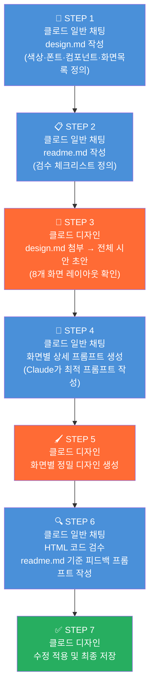
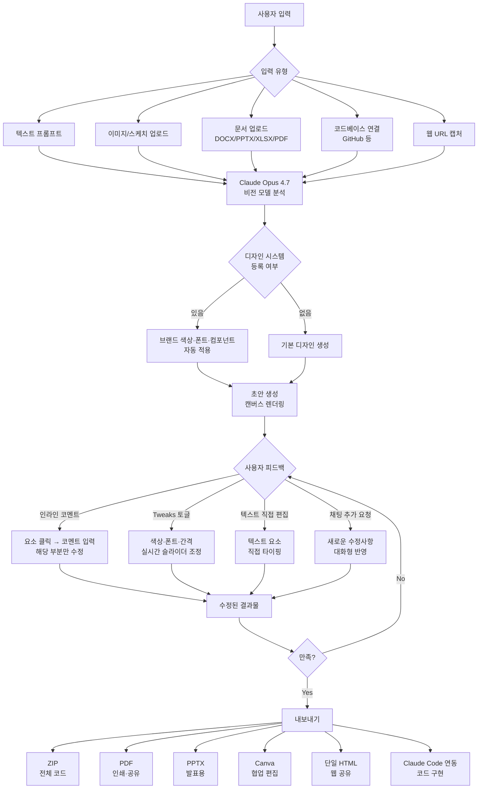
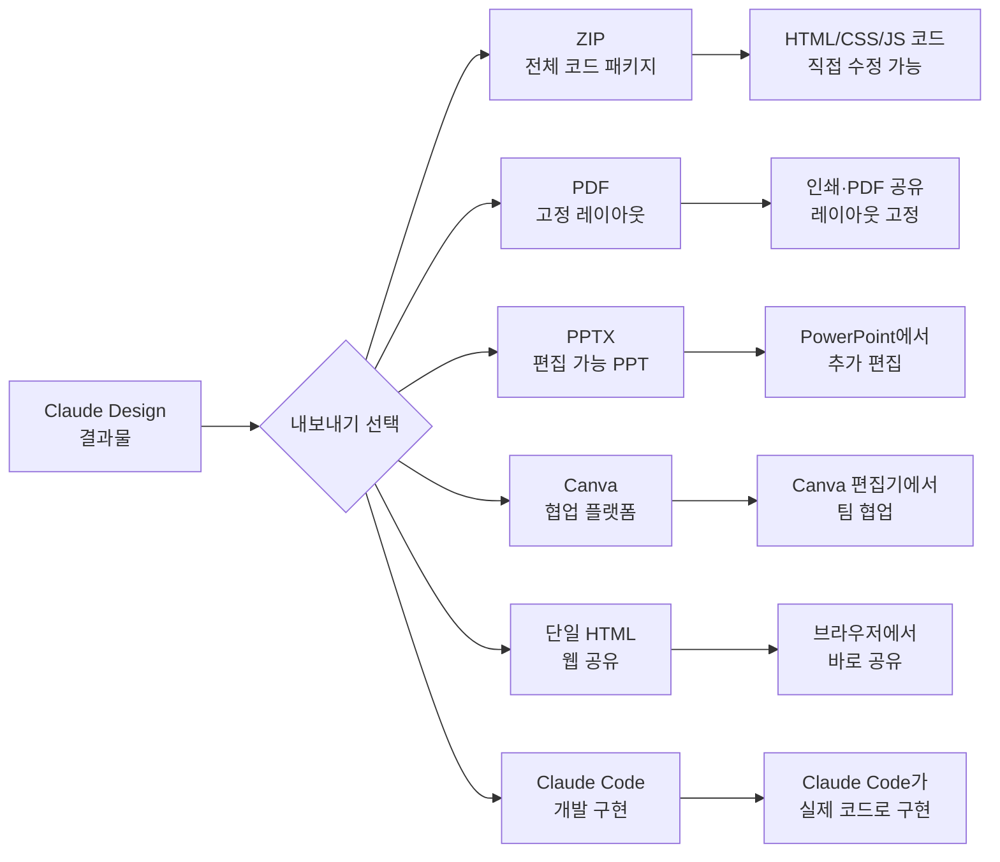
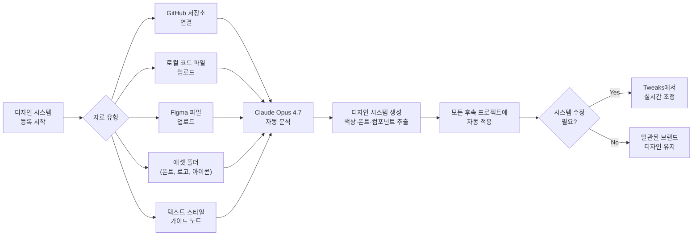
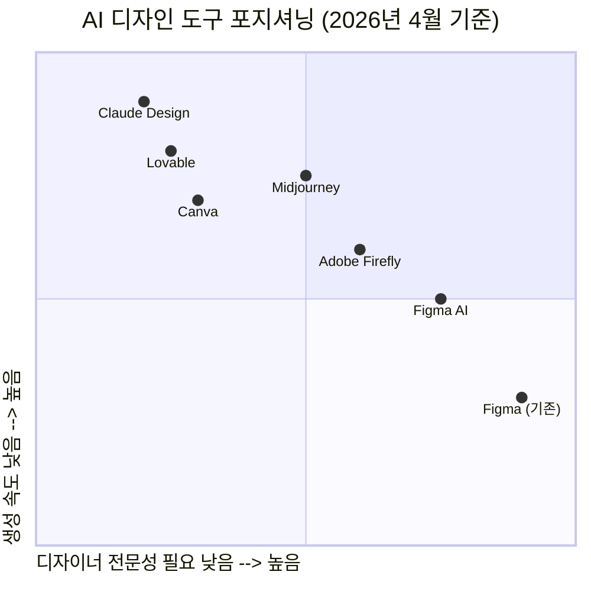
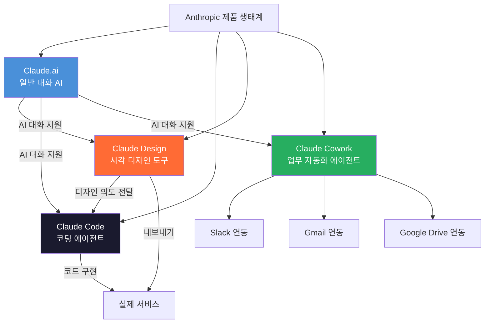

> **출시일**: 2026년 4월 17일 | **모델**: Claude Opus 4.7 | **상태**: Research Preview  
> **대상 플랜**: Pro, Max, Team, Enterprise (무료 플랜 미지원)

---

## 목차
1. [Claude Design이란 무엇인가?](#1-claude-design이란-무엇인가)
2. [왜 지금 이것이 중요한가?](#2-왜-지금-이것이-중요한가)
3. [핵심 기능 상세 분석](#3-핵심-기능-상세-분석)
4. [커뮤니티 실제 활용 사례](#4-커뮤니티-실제-활용-사례)
   - 4.1 학술 논문 → 학회 발표 슬라이드
   - 4.2 맛집 블로그 썸네일
   - 4.3 인스타그램 카드뉴스
   - 4.4 뉴스레터 홈페이지 리디자인
   - 4.5 주식 거래 대시보드
   - 4.6 이메일 마케팅 템플릿
   - 4.7 e-가이드
   - 4.8 일본어 웹 UI 와이어프레임
   - 4.9 윈도우 98 레트로 UI
   - 4.10 손 스케치 → PPT
   - **4.11 Claude + Claude Design 7단계 파이프라인** ⭐️
5. [Claude Design 작동 원리](#5-claude-design-작동-원리)
6. [실전 5단계 제작 가이드](#6-실전-5단계-제작-가이드)
7. [프롬프트 작성 전략](#7-프롬프트-작성-전략)
8. [출력 형식 및 내보내기](#8-출력-형식-및-내보내기)
9. [디자인 시스템 구축하기](#9-디자인-시스템-구축하기)
10. [사용량 및 플랜별 안내](#10-사용량-및-플랜별-안내)
11. [업계 파급 효과](#11-업계-파급-효과)
12. [한계 및 주의사항](#12-한계-및-주의사항)
13. [자주 묻는 질문 FAQ](#13-자주-묻는-질문-faq)

---

## 1. Claude Design이란 무엇인가?

Claude Design은 Anthropic이 2026년 4월 17일 출시한 AI 기반 시각 디자인 도구다. 단순한 텍스트 프롬프트 하나로 프로토타입, 슬라이드 덱, 카드뉴스, 랜딩페이지, 이메일 템플릿, 대시보드 등 다양한 시각 결과물을 만들어낼 수 있다.

기존 AI 이미지 생성 도구(Midjourney, DALL-E 등)와 결정적으로 다른 점은, Claude Design은 **편집 가능한 코드 기반 디자인**을 생성한다는 것이다. 결과물은 단순한 이미지가 아니라 실시간으로 수정·내보내기·인터랙션이 가능한 살아있는 디자인이다.

Claude Design은 Anthropic Labs의 리서치 프리뷰로 출시되었으며, Anthropic의 가장 강력한 비전 모델인 **Claude Opus 4.7**로 구동된다. Opus 4.7은 전작 대비 이미지 해상도를 1,568px에서 2,576px (3.75메가픽셀)로 대폭 향상시켜, 레퍼런스 이미지 분석과 디자인 생성 품질이 비약적으로 개선되었다.

> **핵심 철학**: "디자이너에게는 더 넓은 탐색의 공간을, 비디자이너에게는 시각적 결과물을 만들 수 있는 방법을."  
> — Anthropic 공식 블로그

---

## 2. 왜 지금 이것이 중요한가?

### 디자인 작업의 근본적 변화

기존 디자인 프로세스는 다음과 같았다.

```
아이디어 → 디자이너에게 브리핑 → 초안 제작 (수 일) → 피드백 → 수정 → 완성
```

Claude Design 이후의 프로세스는 이렇게 바뀐다.

```
아이디어 → 프롬프트 입력 → 초안 생성 (수 분) → 실시간 수정 → 완성 → 내보내기
```

### 시장 파급력

Claude Design 출시 당일, Figma 주가는 **약 7% 하락**했다. Anthropic의 최고 제품 책임자 Mike Krieger는 출시 3일 전인 4월 14일 Figma 이사회를 전격 사임했다. 이는 Anthropic이 기존 도구와의 협력에서 경쟁으로 방향을 전환했다는 강력한 신호였다.

Figma가 UI/UX 디자인 분야에서 전 세계 80~90%의 시장 점유율을 보유하고 있다는 점을 고려하면, Claude Design의 등장은 단순한 신제품 출시 이상의 의미를 지닌다.

---

## 3. 핵심 기능 상세 분석

### 3.1 다양한 입력 방식

Claude Design은 다음과 같은 다양한 방식으로 프로젝트를 시작할 수 있다.

| 입력 방식 | 설명 | 활용 예시 |
|---|---|---|
| 텍스트 프롬프트 | 자연어로 원하는 디자인 설명 | "인스타그램용 카드뉴스 만들어줘" |
| 이미지 업로드 | 손 스케치, 레퍼런스 이미지 첨부 | 와이어프레임 스케치 → 완성 UI |
| 문서 업로드 | DOCX, PPTX, XLSX, PDF 업로드 | 논문 PDF → 학회 발표 슬라이드 |
| 코드베이스 연결 | GitHub 저장소 또는 로컬 코드 | 기존 앱의 디자인 시스템 반영 |
| 웹 캡처 도구 | 웹사이트 URL 지정 | 실제 제품과 동일한 색상·폰트 프로토타입 |

### 3.2 실시간 편집 기능

결과물이 생성된 후에는 다음 방법으로 즉시 수정할 수 있다.

- **인라인 코멘트**: 수정하고 싶은 요소를 클릭하고 자연어로 코멘트 남기기 ("이 헤더 좀 더 작게, 여백 줄여줘")
- **Tweaks 토글**: 색상, 폰트, 간격을 실시간 슬라이더로 조정
- **텍스트 직접 편집**: 텍스트 요소 클릭 후 직접 타이핑
- **대화형 수정**: 채팅창에 추가 요청 입력

### 3.3 디자인 시스템 자동화

팀의 브랜드 자산을 한 번 등록해 두면, 이후 모든 프로젝트에 자동으로 브랜드 색상, 폰트, 컴포넌트가 적용된다. 디자인 시스템 등록 방법은 다음과 같다.

- GitHub 저장소 링크
- 로컬 코드 파일
- Figma 파일 업로드
- 폰트, 로고가 담긴 폴더
- 텍스트 스타일 가이드 노트

### 3.4 출력 및 내보내기

| 형식 | 용도 |
|---|---|
| ZIP | 전체 코드 패키지 다운로드 |
| PDF | 인쇄·공유용 |
| PPTX | 발표용, 텍스트 추가 편집 가능 |
| Canva | 협업 및 추가 편집 |
| 단일 HTML | 웹 공유 |
| Claude Code 연동 | 코드 구현으로 직접 전달 |

---

## 4. 커뮤니티 실제 활용 사례

Claude Design이 출시된 지 하루도 채 되지 않아 커뮤니티에는 놀라운 결과물이 쏟아졌다. 이미지에서 확인된 실제 활용 사례들을 분야별로 정리한다. 

>클로드 디자인이 출시된지 하루도 지나지 않아 놀라운 결과물들이 공유되고 있습니다.
>
>이제 스케치 한 장이면 PPT, 랜딩페이지, 인터랙티브 UI까지 한 번에 나오는데요.
>
>이미 커뮤니티에서는 뉴스레터 리디자인, 카드뉴스, 학술, 이메일 템플릿까지 바로 제작된 사례가 쏟아지고 있습니다.
>
>놀라운 활용 사례 모아봤습니다🧵
>
>[**https://www.threads.com/@choi.openai/post/DXRULkZD6F5**]( https://www.threads.com/@choi.openai/post/DXRULkZD6F5)
>

### 4.1 학술 논문 → 학회 발표 슬라이드 전환

연구자에게 가장 반복적이고 지루한 작업 중 하나가 논문을 학회 발표용 슬라이드로 변환하는 것이다. 기존에는 GenSpark, Google NotebookLM의 슬라이드 기능 등을 거쳐왔지만, Claude Design은 이 과정을 완전히 혁신했다.

활용 방법은 다음과 같다. 먼저 자신의 CV 페이지나 디자인 테마(예: IBM Carbon 테마)를 GitHub 저장소에서 임포트해 템플릿을 만들어둔다. 그 다음 논문 PDF 파일을 업로드하면, Claude가 몇 가지 사항을 질문한 뒤 완성된 발표 슬라이드를 생성한다. 생성된 슬라이드는 "Edit" 기능으로 바로 수정까지 가능하다.

> **💬 프롬프트 예시**
> ```
> 첨부한 논문 PDF를 학회 발표용 슬라이드로 변환해줘.
>
> 디자인 템플릿: 아래 GitHub 저장소의 IBM Carbon 테마 기반
> [github.com/myname/my-cv-page]
>
> 슬라이드 구성:
> - 총 12장 내외
> - 1장: 제목 / 저자 / 소속 / 발표일
> - 2~3장: 연구 배경 및 문제 정의
> - 4~6장: 연구 방법론 (그림·도표 포함)
> - 7~9장: 실험 결과 및 분석
> - 10~11장: 결론 및 시사점
> - 12장: Q&A / 감사 인사
>
> 스타일:
> - IBM Carbon Design System 색상 (딥블루, 화이트, 틸)
> - 학술적이고 단정한 톤
> - 데이터 시각화(차트, 표)는 원본 논문 수치 그대로 사용
> - 폰트: IBM Plex Sans
>
> 논문 핵심 주장과 수치를 정확히 반영해줘.
> ```

### 4.2 맛집 블로그 썸네일 카드뉴스

SNS 사용자 @suxnkmnx는 기존에 맛집 블로그를 쓸 때마다 썸네일 수작업이 필수였다고 토로했다. Claude Design으로 음식 사진을 레퍼런스로 업로드하자, "양옥주점 마곡역점"이라는 가게 이름과 어울리는 다양한 스타일의 카드뉴스 썸네일이 즉시 완성되었다. 폰트, 색상, 레이아웃이 각기 다른 여러 버전이 한 번에 생성된다.

> **💬 프롬프트 예시**
> ```
> 첨부한 음식 사진들을 활용해서 맛집 블로그 썸네일 카드뉴스를 만들어줘.
>
> 가게 정보:
> - 가게명: 양옥주점 마곡역점
> - 카테고리: 마곡역 맛집 / 중식
>
> 제작 조건:
> - 네이버 블로그 썸네일 비율 (1:1 또는 3:2)
> - 총 3가지 디자인 스타일로 제작
>   Style A: 깔끔한 화이트 베이스, 레드 포인트
>   Style B: 다크 & 무드있는 톤, 골드 텍스트
>   Style C: 감성적인 크림 계열, 한국식 식당 느낌
>
> 각 썸네일에 반드시 포함할 요소:
> - 가게 이름 (한글 강조)
> - "마곡역점" 서브텍스트
> - 음식 사진 (첨부 이미지 사용)
> - 별점 또는 추천 뱃지 (선택)
>
> 글자는 가독성 최우선으로. 음식이 먹음직스러워 보이게 색감 보정해줘.
> ```

### 4.3 인스타그램 카드뉴스 자동 제작

비개발자를 위한 실무 활용 사례로, 단일 프롬프트만으로 정보성 카드뉴스를 제작하는 방법이 공유되었다. 특히 주목할 점은 단순히 카드뉴스를 만드는 것을 넘어, 실시간 수정 기능이 포함된 **카드뉴스 빌더**를 Claude Design 내에서 만들 수 있다는 것이다. 이 빌더에서는 색감, 글자 크기, 비율 조절이 모두 가능하다.

실제 사용된 프롬프트 구조는 다음과 같다.

```
클로드 인디자인을 활용해 카드뉴스를 만들 거야.
주제는 [주제명].

[레퍼런스 링크 또는 내용]를 보고 만든 거고,
인스타그램용도로 만들어야 해.

니가 할 일:
1. 데이터를 서치하고 카드뉴스 아이디어 잡기
2. 어울리는 카드뉴스 템플릿 2안 선정 (블랙앤화이트 / 브랜드 색감 버전)
3. 디자인 수정 가능한 기능도 추가해서 만들 것
```

> **💬 실전 응용 프롬프트 예시** (위 구조를 실제 주제에 적용한 버전)
> ```
> 클로드 디자인을 활용해 인스타그램 정보성 카드뉴스를 만들어줘.
> 주제: "Claude Design이란 무엇인가 — 2026년 AI 디자인 혁신"
>
> 참고 자료: https://www.anthropic.com/news/claude-design-anthropic-labs
> 인스타그램 피드용으로 만들어야 해.
>
> 네가 할 일:
> 1. 위 링크에서 핵심 정보를 서치하고 카드뉴스 구성 아이디어 잡기
>    (표지 1장 + 본문 5장 + 마무리 1장, 총 7장)
> 2. 카드뉴스 템플릿 2안 선정:
>    - 안 A: 블랙 & 화이트 (미니멀, 텍스트 중심)
>    - 안 B: 클로드 색감 (오렌지·베이지 베이스, 모던 그라디언트)
>    - 두 안 모두 위계 설정 명확하게 (제목 > 소제목 > 본문)
> 3. 실시간 수정 가능한 UI도 함께 만들 것
>    (색상·폰트·텍스트를 바꿀 수 있는 컨트롤 패널 포함)
> 4. 완성 후 인스타그램 비율 4:5 (1080×1350)로 내보내기 가능하게
> ```

### 4.4 뉴스레터 홈페이지 리디자인

해외 사용자 @nahiddotai는 자신의 뉴스레터 홈페이지 URL을 Claude Design에 입력하고 리디자인을 요청했다. 결과물은 기존 레이아웃을 분석해 새로운 시각적 방향을 제안하는 형태로 나왔다. 다만 이 사용자는 "좋은 디자인 시스템과 명확한 방향성을 함께 제공해야 원하는 결과를 얻을 수 있다"고 조언했다. 디자인 방향이 없으면 기대에 미치지 못할 수 있다는 점을 솔직하게 공유한 것이다.

> **💬 프롬프트 예시**
> ```
> 아래 뉴스레터 홈페이지를 리디자인해줘.
> URL: https://nahid.io (예시)
>
> 웹 캡처 도구로 현재 사이트의 색상·폰트·레이아웃 구조를 분석한 다음,
> 아래 방향으로 완전히 새롭게 디자인해줘.
>
> 디자인 방향:
> - 톤: 미니멀하고 신뢰감 있는 테크 뉴스레터 느낌
> - 레이아웃: 히어로 섹션 → 최신 이슈 카드 → 구독 CTA → 아카이브
> - 색상 시스템: 딥그린(#1B4332), 크림화이트(#FAFAF7), 골드 강조(#D4A853)
> - 폰트: 제목 Playfair Display, 본문 Inter
> - 구독 버튼은 시각적으로 강조 (CTA 최우선)
>
> 현재 사이트의 콘텐츠 구조는 그대로 유지하되,
> 비주얼 퀄리티를 프리미엄 미디어 수준으로 높여줘.
> 모바일 반응형 고려해서 작업해줘.
> ```
>
> ⚠️ **주의**: 이 사용자가 직접 조언한 것처럼, 리디자인 요청 시 **"어떤 느낌으로"** 라는 방향성이 없으면 Claude가 임의로 선택하게 되어 기대에 못 미칠 수 있다. 레퍼런스 사이트 URL이나 무드보드를 함께 제공하는 것을 강력 권장한다.

### 4.5 주식 거래 대시보드 (AutoTrade)

이미지 11에서 확인된 사례로, 주식 트레이딩 플랫폼의 복잡한 대시보드가 Claude Design으로 제작되었다. 포트폴리오 NAV, 매수력, 미결 포지션, LLM 분석 신호, 매크로 펄스 등 복잡한 금융 데이터를 시각적으로 표현한 대시보드가 완성되었다. 단순한 UI를 넘어 실제 데이터 연동을 전제한 인터랙티브 인터페이스다.

> **💬 프롬프트 예시**
> ```
> AI 기반 주식 자동매매 플랫폼 "AutoTrade"의 메인 대시보드 UI를 만들어줘.
>
> 표시해야 할 주요 위젯:
> 1. 상단 요약 바
>    - 포트폴리오 NAV (HKD 기준)
>    - 매수 가능 금액 (Buying Power)
>    - 미결 포지션 수 (Open Positions)
>    - 오늘의 플랜 (Today's Plan)
>    - LLM 분석 캐시 수 (LLM Analysis Cached)
>
> 2. 메인 영역 (좌측)
>    - Top LLM 신호 테이블
>      컬럼: Ticker / 종목명 / 방향(BULLISH/BEARISH) / Score / CONF / Last / Chg% / Target / Stop / Model
>    - 미결 포지션 테이블 (Qty, MKT, P&L, Target, Stop 포함)
>    - 실시간 의사결정 스트림 (Live Decision Stream)
>
> 3. 메인 영역 (우측)
>    - Macro Pulse 패널 (시장 지수: SPY, QQQ, VIX, DIXY)
>    - 각 지수의 현재가 / 등락률 / 차트 미니 스파크라인
>
> 디자인 스타일:
> - 다크 테마 (배경: #0A0E1A, 텍스트: #E8EAF0)
> - BULLISH: 녹색(#00C853), BEARISH: 적색(#FF1744)
> - 폰트: JetBrains Mono (숫자), Inter (UI 텍스트)
> - 전문 금융 터미널 느낌 (Bloomberg/Reuters 참고)
> - Tweaks 패널로 색상 테마·밀도 실시간 조절 가능하게 포함
>
> 인터랙티브 기능:
> - 각 포지션 클릭 시 드로어(drawer) 열려서 상세 분석 표시
> - "Run Analysis" / "Execute Plan" 버튼 포함
> ```

### 4.6 이메일 마케팅 템플릿

스포츠 브랜드 "SPORT TEST"를 위한 이메일 마케팅 템플릿이 제작된 사례도 있다. 폰트 시스템(Anton Condensed, Archival Black, Space Grotesk, JetBrains Mono)까지 구체적으로 지정하고, 러닝화 실루엣 SVG 요소와 트랙 레인 구분선이 포함된 레이아웃이 완성되었다.

> **💬 프롬프트 예시**
> ```
> 스포츠/러닝화 브랜드 "SPORT TEST"의 신제품 출시 이메일 마케팅 템플릿을 만들어줘.
>
> 브랜드 방향:
> - 스포티하고 Bold한 펀 타입 시스템
> - 야생적이고 애슬레틱한 에너지
> - 러닝 브랜드 이미지 강화
>
> 폰트 시스템:
> - 빅 헤드라인: Anton Condensed (대문자, 임팩트 있게)
> - 서브 헤드라인: Archival Black
> - 본문: Space Grotesk
> - 메타/캡션: JetBrains Mono (기울임)
>
> 이메일 구조 (600px 고정 폭):
> 1. 히어로 영역: 신제품명 "Axis Pro" 대형 타이포 + 러닝화 제품 이미지
> 2. 브랜드 태그라인 (슬레이브드 패럴렐로그램 브랜드 마크)
> 3. 제품 특징 3가지 (러너 중심 카피: 페이스 트래킹, 슈 실루엣 아이콘)
> 4. CTA 버튼 "Shop Now" (트랙 레인 구분선으로 섹션 분리)
> 5. 푸터 (소셜 링크, 구독 취소 링크)
>
> 디자인 요소:
> - SVG 러닝화 실루엣 일러스트 포함
> - 트랙 레인 구분선 그래픽 사용
> - 파라사이트(경사형) 레이아웃 요소 추가
> - 다크/라이트 모드 모두 지원
> - 첨부한 레퍼런스 이미지 스타일 참고
> ```

### 4.7 e-가이드 (The Creator's Style & Format Guide)

크리에이터를 위한 스타일 및 포맷 가이드 e-북이 제작된 사례다. "The Creator's Style & Format Guide"라는 제목의 시각적으로 세련된 디지털 가이드가 완성되었으며, Tweaks 패널을 통해 팔레트와 타입페이스가 실시간으로 조정되었다.

> **💬 프롬프트 예시**
> ```
> 콘텐츠 크리에이터를 위한 디지털 스타일 & 포맷 가이드 e-북을 만들어줘.
> 제목: "The Creator's Style & Format Guide"
>
> 타겟 독자: 유튜버, 뉴스레터 작가, SNS 크리에이터
> 목적: 글쓰기 스타일, 시각적 정체성, 소셜 미디어 포맷을 일관되게 유지하도록 돕는 실용 가이드
>
> 구성 (총 18페이지):
> 1장: 커버 (제목 + 부제 + 출판사 로고)
> 2~3장: 들어가며 (가이드 사용법)
> 4~6장: 브랜드 보이스 & 톤 설정
> 7~9장: 타이포그래피 시스템 (헤드라인, 본문, 캡션 가이드)
> 10~12장: 색상 팔레트 & 비주얼 아이덴티티
> 13~15장: 플랫폼별 포맷 치트시트 (유튜브 / 인스타 / 뉴스레터)
> 16~17장: 실전 예시 비포·애프터
> 18장: 체크리스트 & 마무리
>
> 디자인 스타일:
> - 출판물 느낌의 고급스러운 레이아웃
> - 색상: 크림(#FAF8F5), 딥브라운(#2C1810), 테라코타 포인트(#C4622D)
> - 폰트: 제목 Playfair Display, 본문 Lora (세리프 계열로 책 느낌)
> - 노란 원형 그래픽 요소, 손글씨 느낌 강조 포인트 포함
> - Tweaks 패널로 팔레트·타입페이스 실시간 교체 가능하게 구성
>
> PDF와 인터랙티브 HTML 두 가지로 내보낼 수 있게 만들어줘.
> ```

### 4.8 일본어 웹 UI 와이어프레임

일본의 AI 수험생 포털 "全統AI·受験者ポータル"의 대시보드 와이어프레임이 Claude Design으로 제작되었다. 다국어 인터페이스와 복잡한 학습 데이터 시각화가 포함된 고품질 와이어프레임이다.

> **💬 프롬프트 예시**
> ```
> 일본 AI 수험생 포털 "全統AI・受験者ポータル"의 대시보드 페이지 와이어프레임을 만들어줘.
> 사이트 URL: zentou-ai.jp/portal/dashboard (예시)
>
> 대시보드 표시 항목:
> - 사용자 인사말: "おかえりなさい, {user_name} さん"
> - 핵심 지표 카드 4개:
>   1. 현재 등급 (기준설정 포함)
>   2. 총 학습 점수
>   3. 다음 시험까지 남은 일수
>   4. 학습 진척률 (%) - 프로그레스 바
> - 성적 추이 차트 (선형 그래프, 과목별 색상 구분)
> - 과목별 학습 시간 바 차트
> - 최근 공지사항 (2건)
> - 다음 할 일 (NextStep 섹션)
>
> 레이아웃:
> - 좌측: 네비게이션 (ダッシュボード, 試験日程, 成績一覧, 練習問題, 学習計画)
> - 우측: 메인 콘텐츠 영역
> - 우하단: Tweaks 패널 (팔레트 변경, 밀도, 색상, 그리드, 손글씨 느낌 슬라이더)
>
> 스타일:
> - Wireframe 느낌 (Low-fidelity, 격자 배경)
> - 색상: 화이트 베이스, 딥레드 포인트 (#CC0000), 격자 그리드
> - 일본어 폰트: Noto Sans JP
> - 날짜: 2026-04-18 기준
> - 반응형 (데스크탑 1440px 기준)
>
> 탭 구조도 포함해줘: A. 整理型(元画面ベース) / B. ダッシュボード(KPI) / C. タイムライン / D. 学習体験型
> ```

### 4.9 윈도우 98 스타일 레트로 UI

커뮤니티에서 흥미로운 실험도 진행되었다. "윈도우 98 느낌"이라는 간단한 지시로 레트로 스타일의 UI가 생성되었고, 이를 보고 "이거 디자인 한 거라고? 클로드가?"라는 반응이 달렸다. Claude Design이 특정 시대적 미학도 재현할 수 있다는 것을 보여주는 사례다.

> **💬 프롬프트 예시**
> ```
> 1990년대 말 Windows 98 운영체제 스타일로
> 태스크 관리 앱 UI를 만들어줘.
>
> 재현할 시각 요소:
> - 회색 그라디언트 타이틀 바 (파란색 활성 창 제목)
> - 클래식 3D 볼록 버튼 (minimize / maximize / close)
> - 점선 테두리의 입력 필드
> - 시스템 폰트: MS Sans Serif 느낌
> - 상단 메뉴바: File / View / Help
> - 좌측 아이콘 사이드바 (픽셀 아트 스타일 아이콘)
> - 하단 상태표시줄 (status bar)
> - 창 안에 창 (MDI 스타일 레이아웃)
>
> 기능 구성:
> - 오늘의 주요 할 일 목록 (체크박스 포함)
> - 경험치 및 레벨 표시 바
> - 사이드 패널: 날짜별 완료 이력
>
> 완성도보다 레트로 미학 재현에 집중해줘.
> 인터랙티브하게 창을 드래그·크기조절 가능하면 더 좋아.
> ```
>
> 💡 **팁**: 단 몇 단어("윈도우 98 느낌")만으로도 대략적인 결과가 나오지만, 위처럼 구체적인 시각 요소를 나열할수록 원하는 레트로 미학에 훨씬 가깝게 재현된다.

### 4.10 손 스케치 → PPT 슬라이드

"그냥 스케치로 아무거나 그렸는데 놀라운 PPT 디자인을 만들어준다"는 반응이 커뮤니티에서 쏟아졌다. 단순한 손그림 스케치를 이미지로 업로드하면, Claude Design이 이를 해석하여 완성된 PPT 슬라이드로 변환한다.

> **💬 프롬프트 예시**
> ```
> 첨부한 손 스케치 이미지를 분석해서
> 완성된 프레젠테이션 슬라이드 덱으로 만들어줘.
>
> 스케치 해석 지침:
> - 박스는 콘텐츠 섹션으로 해석
> - 화살표는 흐름/연결 관계로 해석
> - 원은 강조 포인트 또는 아이콘 자리로 해석
> - 손글씨 텍스트는 슬라이드 제목/소제목으로 사용
>
> 슬라이드 스타일:
> - 총 8장 내외로 구성
> - 테마: 스타트업 피치덱 스타일 (모던, 임팩트 있게)
> - 색상: 다크 네이비(#0D1B2A) 배경, 화이트 텍스트, 시안 포인트(#00D4FF)
> - 각 슬라이드마다 관련 아이콘 또는 일러스트 자동 생성
> - 데이터가 있는 슬라이드는 차트/인포그래픽으로 시각화
>
> 스케치의 레이아웃 의도를 최대한 살리되,
> 프로페셔널한 완성도로 업그레이드해줘.
> PPTX 형식으로 내보낼 수 있게 만들어줘.
> ```
>
> 💡 **팁**: 스케치가 조잡해도 괜찮다. Claude Opus 4.7의 향상된 비전 해상도(2,576px)가 손글씨와 대략적인 도형을 높은 정확도로 인식한다. 스케치에 간단한 라벨(제목, 숫자 등)만 써두면 더 정확한 결과가 나온다.

### 4.11 Claude + Claude Design 통합 파이프라인으로 앱 시안 8개 완성 ⭐️

커뮤니티([@deopbab9039]( https://www.threads.com/@deopbab9039/post/DXQ910Jj7y3))에서 공유된 이 사례는 지금까지 소개된 활용법 중 가장 체계적이고 실전적인 워크플로우다. 단순히 Claude Design에 프롬프트를 입력하는 것이 아니라, **Claude 일반 채팅과 Claude Design을 역할 분리하여 파이프라인으로 연결**한 방식이다. 현재 개발 중인 앱의 화면 시안 8개를 톤앤매너 일관성 있게 완성했으며, 결과물 품질이 단순 프롬프트 방식과 비교해 현저히 높았다고 전했다.

**왜 이 방식이 더 뛰어난가?**

일반적으로 Claude Design을 바로 열어 "앱 화면 만들어줘"라고 입력하면, 각 화면마다 디자인 언어가 미묘하게 달라지고 톤앤매너가 흔들린다. 이 파이프라인은 그 문제를 근본적으로 해결한다. Claude 채팅에서 먼저 `design.md`(디자인 사양서)와 `readme.md`(검수 체크리스트)를 정의해두고, 이 파일들을 Claude Design에 첨부하면 8개 화면 모두가 하나의 디자인 시스템 안에서 일관되게 생성된다.

**핵심 개념**: Claude 채팅은 **기획·명세화·검수**를 담당하고, Claude Design은 **시각 실행**만 담당한다. 두 도구를 역할 분리함으로써 각자의 강점을 최대로 활용하는 것이다.



> 파란 박스는 **Claude 일반 채팅** 담당 / 주황 박스는 **Claude Design** 담당 / 초록 박스는 완료

---

**📄 STEP 1 — Claude 채팅: design.md 작성**

Claude Design을 열기 전, 일반 Claude 채팅에서 프로젝트의 디자인 사양서를 먼저 만든다. 이 파일이 이후 모든 화면 디자인의 기준점이 된다.

> **💬 프롬프트 예시**
> ```
> 우리 앱의 디자인 가이드 문서를 design.md 형태로 작성해줘.
>
> 앱 개요:
> - 앱 이름: [앱 이름]
> - 타겟 사용자: [예: 20~35세 직장인, 생산성 향상이 목적]
> - 앱의 핵심 가치: [예: 단순함, 빠른 실행, 신뢰감]
>
> 반드시 포함할 항목:
> 1. 브랜드 아이덴티티
>    - 톤앤매너 키워드 3~5개 (예: Minimal, Trust, Focused)
>    - 사용자에게 전달할 감성 (예: "복잡하지 않고 즉시 쓸 수 있는 느낌")
>
> 2. 색상 팔레트 (hex 코드 포함)
>    - Primary: 브랜드 주색
>    - Secondary: 보조색
>    - Accent: 강조/CTA용
>    - Background: 배경 (Light / Dark 각각)
>    - Surface: 카드·모달 배경
>    - Text: 제목 / 본문 / 비활성
>    - Error / Success / Warning 상태 색상
>
> 3. 타이포그래피 시스템
>    - 폰트 패밀리 (모바일 최적화 웹폰트 권장)
>    - H1~H4, Body, Caption, Label 각각의 크기·굵기·행간
>
> 4. 컴포넌트 스타일 원칙
>    - 버튼 (Primary / Secondary / Ghost / Disabled 상태)
>    - 카드 (모서리 반경, 그림자, 패딩)
>    - 입력창 (기본 / 포커스 / 에러 상태)
>    - 내비게이션 바 스타일
>    - 아이콘 스타일 (Outlined / Filled 등)
>
> 5. 레이아웃 원칙
>    - 기본 여백 단위 (예: 8px 기반 스케일)
>    - 콘텐츠 최대 폭
>    - 안전 영역(safe area) 처리 방식
>
> 6. 제작할 화면 목록 8개
>    각 화면에 대해: 화면명 / 목적 / 핵심 UI 요소 3~5개 정의
>
> 7. 절대 금지 사항
>    (예: 그라디언트 남용 금지, 3가지 이상 색상 동시 사용 금지 등)
>
> 마크다운으로 체계적으로 작성해줘.
> ```

이렇게 생성된 `design.md`의 예시 구조는 다음과 같다.

```markdown
# [앱 이름] Design Guide v1.0

## Brand Identity
- **Tone & Manner**: Minimal · Trustworthy · Focused · Clean
- **핵심 감성**: "열면 바로 쓸 수 있는, 복잡하지 않은 도구"

## Color Palette
| 역할 | 이름 | HEX |
|---|---|---|
| Primary | Brand Blue | #2563EB |
| Secondary | Soft Navy | #1E3A5F |
| Accent | Action Orange | #F97316 |
| Background Light | Off White | #F8FAFC |
| Surface | Card White | #FFFFFF |
| Text Primary | Near Black | #0F172A |
| Text Secondary | Muted | #64748B |
| Error | Alert Red | #EF4444 |
| Success | Confirm Green | #22C55E |

## Typography
| 역할 | 폰트 | 크기 | 굵기 | 행간 |
|---|---|---|---|---|
| H1 | Pretendard | 28px | 700 | 1.3 |
| H2 | Pretendard | 22px | 600 | 1.4 |
| Body | Pretendard | 16px | 400 | 1.6 |
| Caption | Pretendard | 13px | 400 | 1.5 |

## 화면 목록
1. **홈 (Home)**: 오늘의 요약 카드, 빠른 실행 버튼, 최근 활동
2. **검색 (Search)**: 검색바, 필터 태그, 결과 리스트
3. **상세 (Detail)**: 콘텐츠 뷰어, 액션 버튼, 코멘트 섹션
...
```

---

**📋 STEP 2 — Claude 채팅: readme.md 작성**

`design.md`가 완성되면, 이를 첨부하여 Claude Design 결과물을 검수할 체크리스트 문서를 만든다. STEP 6에서 이 기준으로 HTML 코드를 검토하게 된다.

> **💬 프롬프트 예시**
> ```
> 첨부한 design.md를 바탕으로,
> Claude Design이 생성한 화면을 검수하기 위한 readme.md를 작성해줘.
>
> 다음 내용을 포함해줘:
>
> 1. 화면별 체크리스트 (각 화면의 필수 UI 요소 존재 여부)
> 2. 브랜드 일관성 체크
>    - Primary 색상이 정확한 hex 코드인가?
>    - 폰트 패밀리와 크기가 사양서와 일치하는가?
>    - 컴포넌트 스타일(버튼, 카드)이 가이드를 따르는가?
> 3. 레이아웃 검수
>    - 여백이 8px 단위 기반인가?
>    - 텍스트가 안전 영역을 침범하지 않는가?
>    - 모바일 기준(375px) 정상 렌더링 여부
> 4. 접근성 체크
>    - 텍스트와 배경의 색상 대비 비율 (WCAG AA 기준 4.5:1 이상)
>    - 터치 타겟 최소 크기 (44×44px)
>    - 이미지 대체 텍스트 여부
> 5. 자주 발생하는 오류 패턴 목록
>    (예: 금지된 색상 사용, 폰트 누락, 과도한 그림자 등)
> ```

---

**🎨 STEP 3 — Claude Design: design.md 첨부 → 전체 시안 초안 생성**

`design.md`를 Claude Design에 첨부하고 8개 화면의 레이아웃을 한 번에 요청한다. 이 단계에서는 세부 완성도보다 **전체 톤앤매너의 통일성**을 먼저 확인하는 것이 목적이다.

> **💬 프롬프트 예시**
> ```
> 첨부한 design.md 가이드를 완전히 따라서
> 앱의 주요 화면 8개 레이아웃 초안을 만들어줘.
>
> 화면 목록: [design.md 6번 항목의 화면 목록 그대로]
>
> 이 단계는 전체 톤앤매너 확인용이야.
> 실제 콘텐츠 데이터보다 레이아웃 구조와 색상·폰트 적용이 올바른지에 집중해줘.
> 모든 화면을 하나의 HTML 파일에 스크롤로 이어서 볼 수 있게 만들어줘.
> ```

---

**💬 STEP 4 — Claude 채팅: 화면별 상세 프롬프트 생성**

초기 시안을 확인한 후, 다시 Claude 채팅으로 돌아와 각 화면을 정밀하게 제작하기 위한 **화면별 최적화 프롬프트**를 Claude에게 작성해달라고 한다.

> **💬 프롬프트 예시**
> ```
> 아래 8개 화면을 Claude Design으로 정밀하게 만들기 위한
> 화면별 디자인 프롬프트를 각각 작성해줘.
>
> 공통 기준: 첨부한 design.md
>
> 각 화면 프롬프트에 반드시 포함할 내용:
> - 화면의 목적과 사용자의 핵심 액션
> - 필수 UI 컴포넌트 목록 (버튼, 카드, 입력창 등)
> - 화면 고유의 인터랙션 포인트
> - 빈 상태(Empty State) / 로딩 상태 / 에러 상태 처리 방식
> - 해당 화면에서 특히 주의해야 할 디자인 원칙
>
> 프롬프트는 Claude Design에 그대로 복붙할 수 있도록 작성해줘.
> ```

---

**🖌️ STEP 5 — Claude Design: 화면별 정밀 디자인 생성**

STEP 4에서 Claude가 작성해 준 화면별 프롬프트를 Claude Design에 하나씩 입력하여 각 화면을 정밀하게 생성한다. 각 화면 생성 후 Tweaks 패널로 즉시 세부 조정한다.

---

**🔍 STEP 6 — Claude 채팅: HTML 검수 및 피드백 프롬프트 작성**

Claude Design에서 생성된 HTML 코드를 Claude 일반 채팅에 붙여넣고, `readme.md` 기준으로 검수한 뒤 수정 프롬프트를 작성받는다.

> **💬 프롬프트 예시**
> ```
> 아래 HTML 코드를 검수해줘.
>
> [Claude Design에서 생성한 HTML 코드 붙여넣기]
>
> 검수 기준: 첨부한 readme.md와 design.md
>
> 해줄 일:
> 1. 위 기준으로 문제 항목을 표로 정리해줘
>    (항목 / 현재 상태 / 기준값 / 심각도)
> 2. 각 문제에 대한 수정 방향을 설명해줘
> 3. 이걸 Claude Design에 전달할 통합 수정 프롬프트를 한 번에 작성해줘
>    (Claude Design에 그대로 붙여넣기 가능한 형태로)
> ```

---

**✅ STEP 7 — Claude Design: 수정 적용 및 최종 저장**

Claude 채팅이 작성한 수정 프롬프트를 Claude Design에 입력해 최종 결과물을 완성하고, PPTX 또는 HTML로 내보낸다.

> **💡 이 파이프라인의 핵심 교훈**
>
> `design.md`와 `readme.md`는 마치 Claude Code의 `CLAUDE.md`와 같은 역할을 한다. **한 번 잘 만들어두면 이후 어떤 화면을 추가하거나 디자인을 수정할 때도 일관성이 유지된다.** 앱을 혼자 개발하는 솔로 개발자나 비디자이너 창업자에게 특히 강력한 방법론이다.
>
> 또한 이 구조는 팀 협업에도 적용할 수 있다. `design.md`를 공유 문서로 관리하면, 팀원 누구나 동일한 기준으로 Claude Design을 활용할 수 있다.

---

## 5. Claude Design 작동 원리



---

## 6. 실전 5단계 제작 가이드

이미지들에서 확인된 platformtree_의 5단계 가이드를 실제 작업 맥락과 함께 상세하게 설명한다.

### STEP 01 · ENTER — claude.ai/design 접속 후 디자인 탭 클릭

브라우저에서 [claude.ai/design](https://claude.ai/design)에 접속하거나, Claude 웹 인터페이스 좌측 사이드바에서 **"디자인"** 탭을 누른다. 디자인 전용 워크스페이스로 진입하면 상단에 **카드뉴스, 덱, 프로토타입, 애니메이션** 등 작업 유형 탭이 보인다.

> ⚠️ 주의: 디자인 탭은 Pro, Max, Team, Enterprise 플랜에서만 보인다. 무료 플랜에서는 접근 불가.

**워크스페이스 구조**
- 좌측: 채팅 패널 (프롬프트 입력 및 대화 진행)
- 중앙: 캔버스 (디자인 결과물 미리보기)
- 우측: Tweaks 패널 (실시간 세부 조정)
- 상단: 탭 메뉴 (Design Files, 생성된 파일들)

---

### STEP 02 · ATTACH — 레퍼런스 먼저 첨부하기

프롬프트 입력창의 **+ 버튼 → 파일 업로드**로 레퍼런스 이미지, 로고, 브랜드 가이드를 올린다. **첨부가 있을 때와 없을 때 품질 차이가 매우 크다.**

**첨부 가능한 파일 유형**
- 이미지 (레퍼런스, 스케치, 로고, 제품 사진)
- PDF (브랜드 가이드, 논문, 제품 소개서)
- 코드 파일 (기존 CSS, 컴포넌트 파일)
- DOCX, PPTX, XLSX (기존 문서 자료)

**핵심 팁**: 브랜드 자료는 프로젝트에 저장되므로, 한 번 업로드하면 매 채팅마다 재사용할 수 있다. 브랜드 일관성을 유지하기 위해 첫 프로젝트 시작 시 반드시 브랜드 가이드를 첨부하는 것을 권장한다.

---

### STEP 03 · PROMPT — 프롬프트는 구체적으로

애매한 요청은 애매한 결과물을 낳는다. **포맷, 비율, 스타일, 개수**를 명확하게 적는다.

**기본 프롬프트 템플릿 (그대로 복사해서 쓰세요)**

```
인스타그램 카드뉴스를 만들어줘. [주제]에 대한 내용.
비율은 4:5 (1080×1350), 총 7장으로.
감성은 첨부한 레퍼런스처럼 그라디언트 + 모던하게.
가독성 중요하고, 색은 핑크·퍼플·옐로 중심으로.
```

**프롬프트 작성 3원칙**

1. **포맷 지정**: 카드뉴스 / 덱 / 프로토타입 / 애니메이션 중 명시
2. **비율·장수 지정**: 4:5, 16:9, 9:16 · 슬라이드 개수
3. **톤·컬러 지정**: 레퍼런스 느낌 + 핵심 키워드

**목적별 추가 프롬프트 예시**

| 목적 | 추가 프롬프트 예시 |
|---|---|
| 카드뉴스 | "정보 위계 명확하게, 핵심 키워드 강조, 인용구 스타일 포함" |
| 학회 슬라이드 | "IBM Carbon 테마, 학술적 톤, 데이터 시각화 포함" |
| 랜딩페이지 | "CTA 버튼 강조, 모바일 반응형 레이아웃" |
| 이메일 템플릿 | "600px 고정 폭, 다크/라이트 모드 고려" |
| 대시보드 | "데이터 밀도 높게, 차트 위젯 포함, 좌측 네비게이션" |

---

### STEP 04 · EDIT — 요소 클릭해서 바로 수정

결과물이 생성되면 미리보기 화면에서 **바꾸고 싶은 요소를 클릭**하고 코멘트를 남기면 정확히 그 부분만 고쳐진다. 상단 툴바의 **Tweaks 토글**로 색·폰트도 실시간 조정한다.

**수정 방법별 상세 안내**

**① 인라인 코멘트 방식** (특정 요소만 수정)
```
미리보기에서 요소 클릭 → 말풍선 입력창에 코멘트 작성
예: "이 헤더를 조금 더 작게, 여백 줄여줘"
예: "이 버튼 색상을 #FF5733으로 바꿔줘"
```

**② Tweaks 슬라이더 방식** (전체적 조정)
- 색상 팔레트 변경
- 폰트 크기 조절 (글로벌 적용)
- 여백(spacing) 조정
- 그리드 밀도 변경

**③ 채팅 방식** (복합 수정)
```
"전체적으로 더 어두운 톤으로, 그리고 3번째 슬라이드의 이미지를 더 크게"
"헤더 폰트를 Pretendard로 변경하고, 제목 크기는 48px로"
```

---

### STEP 05 · EXPORT — 내보내기로 원하는 포맷 저장

작업창 우측 상단 **… 메뉴**에서 내보내기를 선택한다.

| 포맷 | 특징 | 추천 용도 |
|---|---|---|
| Save as PDF | 레이아웃 고정, 인쇄 최적화 | 프레젠테이션 인쇄, 공유 |
| Export as PPTX | 텍스트 편집 가능 | 발표자료, 추가 편집 필요 시 |
| Send to Canva | 브랜드 협업 편집 | 팀 협업, SNS 발행 |
| 단일 HTML | 웹에서 바로 열기 가능 | 웹 공유, 개발자 전달 |
| Claude Code 연동 | 코드로 구현 지시 | 실제 서비스 개발 |

---

### 🔥 심화: 5단계를 넘어서 — Claude × Claude Design 7단계 파이프라인

위 5단계가 **단일 산출물을 빠르게 만드는 기본 워크플로우**라면, 앱 화면처럼 **복수의 화면을 일관된 톤앤매너로 만들어야 할 때**는 더 체계적인 파이프라인이 필요하다.

핵심 원칙은 Claude Design을 바로 열지 않고, **먼저 Claude 일반 채팅에서 `design.md`(디자인 사양서)와 `readme.md`(검수 체크리스트)를 만들어 준비하는 것**이다. 이 두 문서가 이후 모든 화면의 기준점이 되어, 8개 화면을 따로 생성해도 디자인 언어가 흔들리지 않는다.

| 단계 | 도구 | 역할 |
|---|---|---|
| 1. design.md 작성 | Claude 채팅 | 색상·폰트·컴포넌트·화면 목록 정의 |
| 2. readme.md 작성 | Claude 채팅 | 검수 체크리스트 작성 |
| 3. 전체 시안 초안 | Claude Design | design.md 첨부 → 레이아웃 초안 확인 |
| 4. 화면별 프롬프트 생성 | Claude 채팅 | 각 화면 최적화 프롬프트 자동 작성 |
| 5. 화면별 정밀 생성 | Claude Design | 화면 하나씩 정밀 생성 |
| 6. HTML 검수 | Claude 채팅 | readme.md 기준 코드 검수 → 수정 프롬프트 생성 |
| 7. 수정 적용 | Claude Design | 수정 반영 후 최종 저장 |

> 📖 **상세 가이드**: 커뮤니티 사례 **4.11**에 각 단계별 프롬프트 템플릿과 `design.md` / `readme.md` 예시 구조가 수록되어 있다.

### 7.1 레벨별 프롬프트 예시

**초급 (처음 시작하는 경우)**
```
인스타그램 카드뉴스 5장 만들어줘.
주제: AI 활용법
디자인: 깔끔하고 현대적으로
```

**중급 (레퍼런스 활용)**
```
첨부한 레퍼런스 이미지 스타일로
뉴스레터 카드뉴스 7장 만들어줘.
비율: 4:5 (1080×1350)
색상: 오렌지, 화이트, 다크 그레이 중심
폰트: 고딕 계열, 가독성 최우선
각 슬라이드에 번호와 소제목 포함
```

**고급 (브랜드 시스템 적용)**
```
업로드한 브랜드 가이드 PDF를 기반으로
[회사명] 제품 소개 피치덱 15장을 만들어줘.

구성:
1-2장: 문제 정의
3-5장: 솔루션 소개
6-8장: 시장 기회 (차트 포함)
9-11장: 팀 소개
12-13장: 비즈니스 모델
14-15장: 다음 단계 및 CTA

디자인 원칙:
- 브랜드 색상 (#1A1A2E, #16213E, #0F3460) 사용
- 슬라이드마다 데이터 시각화 1개 이상
- 애니메이션 효과 포함 (HTML 버전)
```

**전문가 (Claude × Claude Design 파이프라인)**

단일 산출물이 아닌 앱 전체 화면처럼 **복수의 화면을 일관된 디자인 언어로 제작**해야 할 때는 Claude 채팅을 오케스트레이터로 활용하는 파이프라인 방식이 효과적이다. Claude Design을 바로 열지 않고, 먼저 Claude 채팅에서 `design.md`와 `readme.md`를 만들고, 이를 Claude Design에 첨부하여 작업한다. 상세 방법은 커뮤니티 사례 **4.11**을 참고하라.

### 7.2 프롬프트 빌더 만들기

Claude Design 세션에서 아래 프롬프트를 입력하면, 향후 반복 사용할 수 있는 프롬프트 생성기를 직접 만들어준다.

```
여러 디자인을 여러 종류로 만들고 싶은데,
지금 디자인 괜찮거든.
설정할 수 있는 프롬프트 빌더 좀 만들어줘.
```

---

## 8. 출력 형식 및 내보내기



---

## 9. 디자인 시스템 구축하기

### 9.1 팀 디자인 시스템이란?

Claude Design의 가장 강력한 기업용 기능이다. 팀의 브랜드 자산을 한 번 등록해 두면, 이후 생성되는 모든 디자인에 브랜드 색상, 폰트, 컴포넌트, 스타일 가이드가 자동으로 적용된다.

### 9.2 디자인 시스템 등록 방법



### 9.3 개인 사용자를 위한 간이 디자인 시스템 만들기

팀이 아닌 개인 사용자도 간이 디자인 시스템을 활용할 수 있다.

```
# 나만의 디자인 시스템 정의

## 브랜드 색상
- 주색: #FF6B35 (오렌지)
- 보조색: #1A1A2E (딥네이비)
- 배경: #FFFFFF (화이트)
- 강조: #FFD700 (골드)

## 폰트
- 제목: Pretendard Bold
- 본문: Pretendard Regular
- 영문: Inter

## 스타일 원칙
- 둥근 모서리 선호 (border-radius: 12px)
- 그림자 효과 적극 활용
- 미니멀하고 현대적인 레이아웃

위 브랜드 가이드를 기준으로 디자인해줘.
```

---

## 10. 사용량 및 플랜별 안내

Claude Design은 기존 Claude 채팅이나 Claude Code와 **별도의 사용량 한도**를 가진다. 채팅 메시지를 소모하는 것이 아니라 독립적인 쿼터로 운영된다.

| 플랜 | 사용 가능 여부 | 특이사항 |
|---|---|---|
| Free (무료) | ❌ 불가 | |
| Pro | ✅ 가능 | 주간 한도 별도 적용 |
| Max | ✅ 가능 | 더 높은 한도 |
| Team | ✅ 가능 | 팀 공유 디자인 시스템 |
| Enterprise | ✅ 가능 (기본 비활성) | 관리자가 활성화 필요 |

**Enterprise 특별 혜택**: 첫 사용 시 약 20개의 일반 프롬프트를 커버하는 크레딧이 무료로 제공되며, 이 크레딧은 2026년 7월 17일에 만료된다.

---

## 11. 업계 파급 효과

### 11.1 경쟁 구도 변화

Claude Design 출시는 AI 디자인 도구 시장에 큰 지각변동을 일으켰다.



### 11.2 Figma에 대한 영향

Claude Design 출시 당일 Figma 주가는 약 7% 하락했다. Anthropic의 CPO Mike Krieger가 출시 3일 전 Figma 이사회를 사임한 것이 이를 더욱 상징적으로 만들었다.

그러나 Anthropic은 Claude Design이 Figma를 대체하는 것이 아니라 보완하는 도구라는 입장이다. MCP(모델 컨텍스트 프로토콜)를 통한 타사 도구 연동 계획도 발표했다.

현실적으로 보면, Claude Design은 **초안 생성과 탐색** 단계를 담당하고, Figma는 **프로덕션 수준의 정교한 작업**에서 여전히 강점을 보유한다.

### 11.3 Anthropic의 전체 생태계



---

## 12. 한계 및 주의사항

커뮤니티에서 공유된 실제 사용 경험을 바탕으로 Claude Design의 현재 한계를 솔직하게 정리한다.

**현재 확인된 한계**

1. **명확한 디자인 방향 필요**: 레퍼런스나 디자인 방향 없이 사용하면 기대에 미치지 못하는 결과가 나올 수 있다. @nahiddotai의 사례처럼 "디자인 시스템과 명확한 방향을 함께 제공해야 한다"는 것이 공통적인 조언이다.

2. **리서치 프리뷰 단계**: 아직 완전한 제품이 아닌 연구 미리보기 수준으로, 기능이 점진적으로 추가되고 있다.

3. **사용량 한도**: 채팅과 별도이지만 한도가 존재한다. 주간 한도를 초과하면 추가 사용이 제한될 수 있다.

4. **복잡한 인터랙션**: 고도로 복잡한 인터랙티브 기능은 Claude Code와 연동해야 완성도가 높아진다.

5. **한국어 폰트 지원**: 한국어 프로젝트 시 웹 폰트(Pretendard, Noto Sans KR 등)를 명시적으로 지정하는 것이 좋다.

---

## 13. 자주 묻는 질문 FAQ

**Q. 무료 플랜에서 사용할 수 있나요?**  
A. 아니요. Claude Design은 Pro, Max, Team, Enterprise 유료 플랜에서만 사용 가능합니다.

**Q. 기존 Claude 채팅 한도를 소모하나요?**  
A. 아니요. Claude Design은 별도의 독립적인 사용량 한도를 가집니다.

**Q. Figma 파일을 직접 가져올 수 있나요?**  
A. 네, 디자인 시스템 설정 시 Figma 파일을 업로드할 수 있습니다.

**Q. 생성된 코드를 직접 편집할 수 있나요?**  
A. ZIP으로 내보내면 HTML/CSS/JS 코드를 직접 수정할 수 있습니다.

**Q. 한국어 디자인에도 잘 동작하나요?**  
A. 네, 한국어 카드뉴스, 블로그 썸네일 등의 사례가 커뮤니티에서 다수 공유되었습니다. 다만 한국어 폰트를 명시적으로 지정하면 더 좋은 결과를 얻을 수 있습니다.

**Q. Enterprise에서 기본적으로 비활성화되어 있나요?**  
A. 네, Enterprise 플랜에서는 관리자가 명시적으로 활성화해야 합니다.

**Q. Claude Code와 어떻게 연동되나요?**  
A. Claude Design에서 디자인을 완성한 후 "Claude Code 연동" 내보내기를 선택하면, 디자인 의도와 함께 Claude Code로 전달되어 실제 코드로 구현됩니다.

---

## 마무리: Claude Design이 바꾸는 것들

Claude Design의 등장은 단순히 새로운 AI 도구가 하나 더 생긴 것이 아니다. 이것은 **"누가 디자인을 만드는가"라는 질문에 대한 근본적인 재정의**다.

기존에는 아이디어를 가진 사람(기획자, 마케터, 창업자)과 아이디어를 시각화하는 사람(디자이너) 사이에 항상 병목이 존재했다. 의사소통 비용, 시간 지연, 반복 피드백 사이클이 그것이다.

Claude Design은 이 병목을 제거한다. 아이디어를 가진 사람이 직접, 즉시, 수분 내에 시각적 결과물을 만들 수 있다. 디자이너는 반복적인 초안 작업에서 해방되어, 더 높은 수준의 판단과 세련화에 집중할 수 있다.

물론 이 변화가 단기간에 모든 디자인 직군을 대체하지는 않는다. 그러나 **"디자인 없이는 만들 수 없었던 것들"을 만들 수 있게 된 사람들의 범위가 폭발적으로 확장**되는 것은 분명하다.

지금이 바로 Claude Design을 배워야 할 때다.

---

*작성일: 2026-04-19*  
*출처: Anthropic 공식 블로그, TechCrunch, VentureBeat, The Register, 9to5Mac, 커뮤니티 Threads 및 Instagram 게시물*
