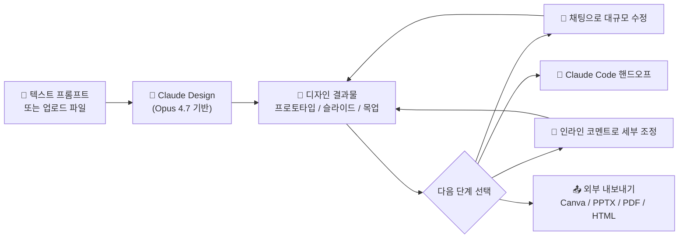
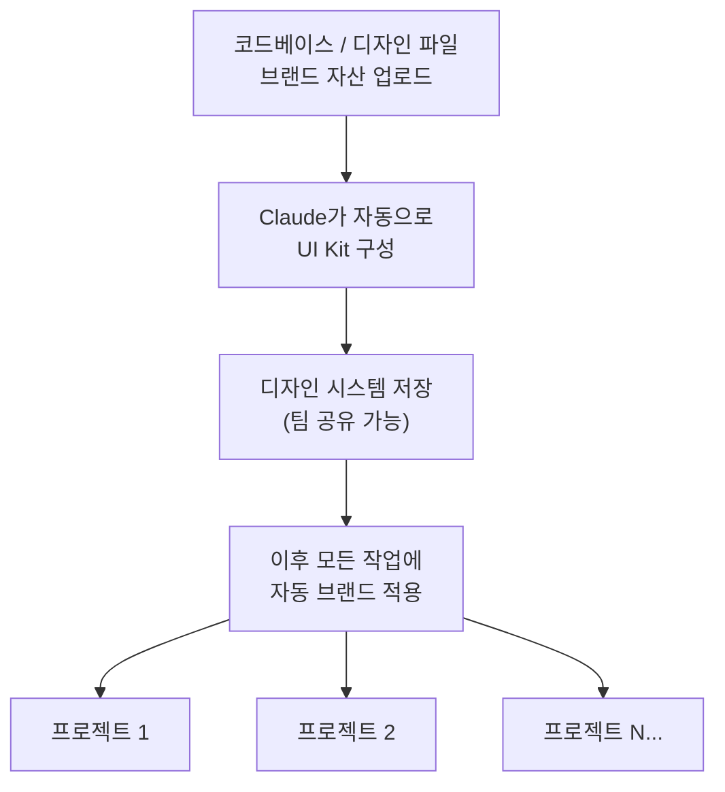
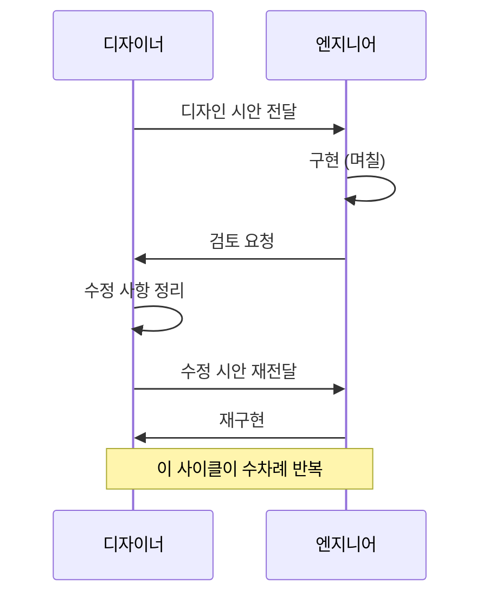
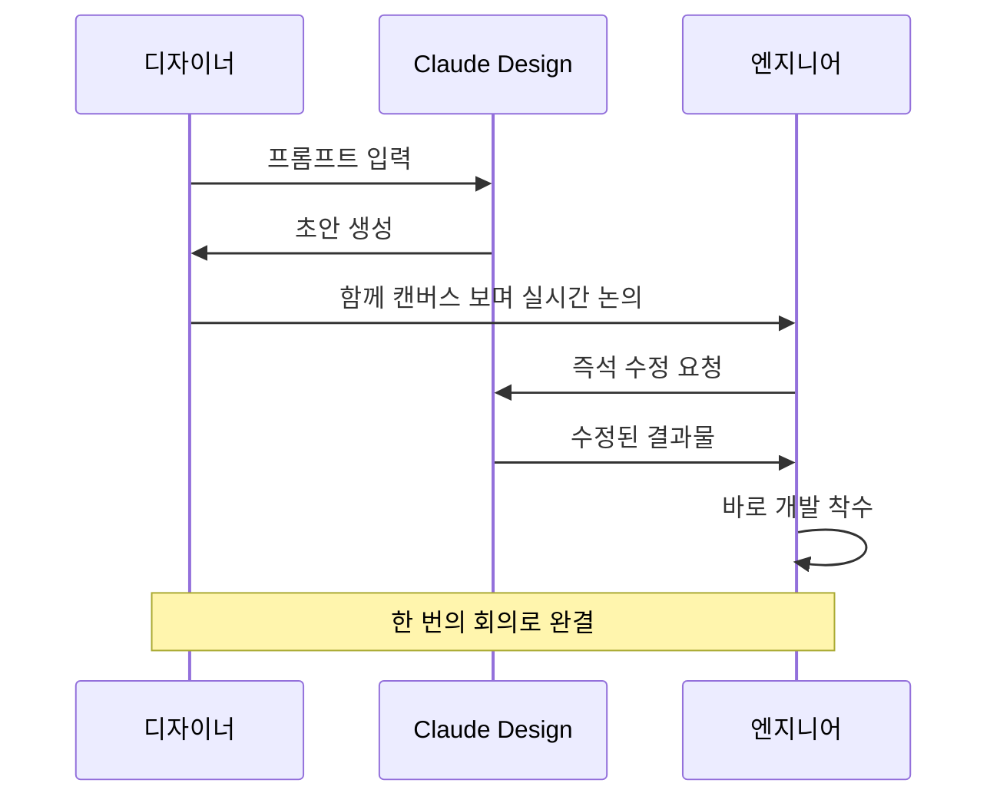
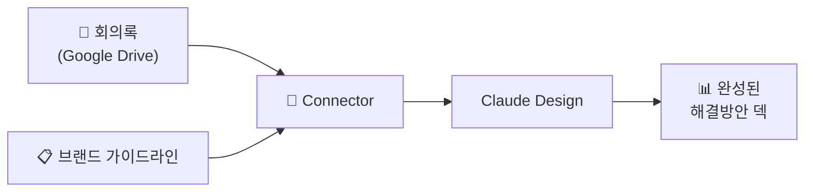
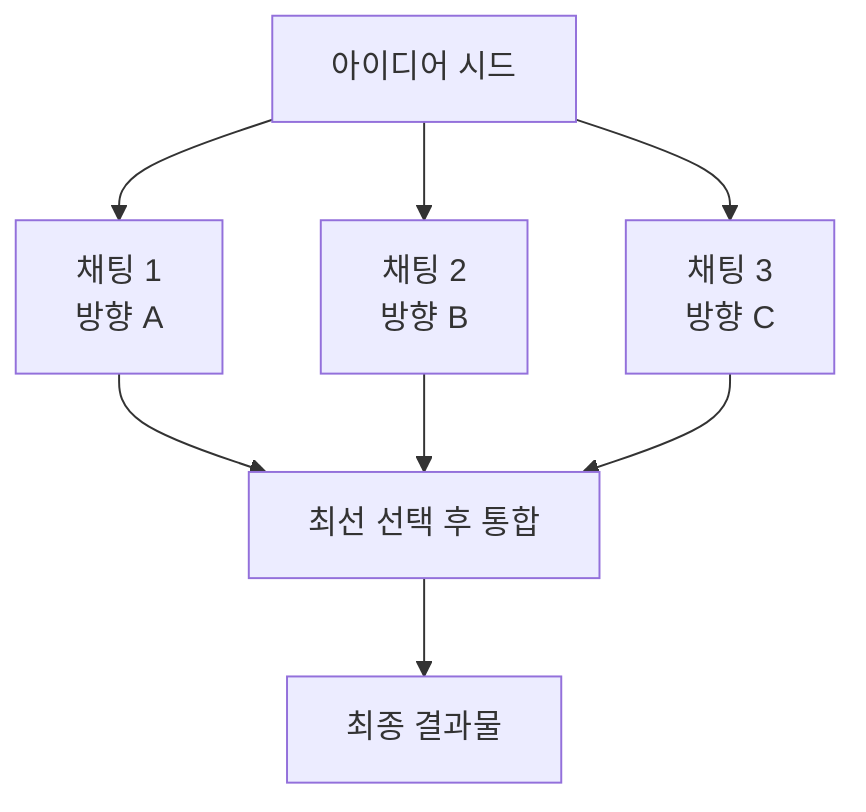
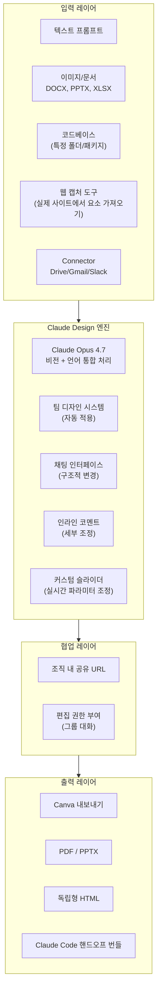
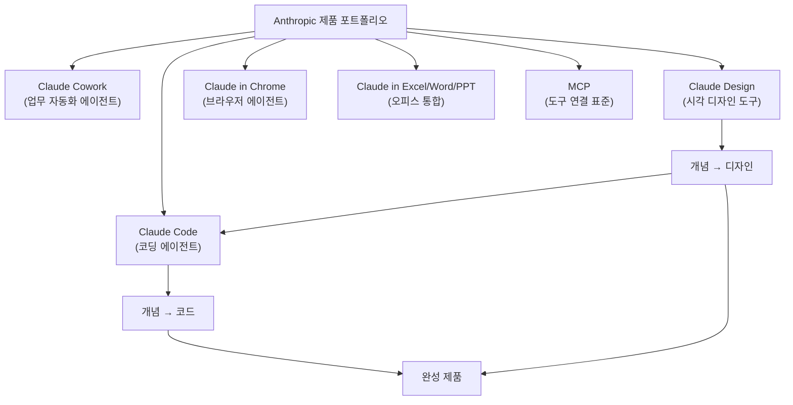

> **작성일**: 2026년 4월 19일  
> **출처**: Ryan Mather ([@Flomerboy](https://x.com/flomerboy/status/2045162321589252458)) X 스레드, Anthropic 공식 발표, 커뮤니티 분석  
> **키워드**: Claude Design, Anthropic Labs, Claude Opus 4.7, Agentic Designing, 디자인 시스템

---

## 1. 무슨 일이 일어났는가 — Claude Design 출시 개요

2026년 4월 17일, Anthropic은 **Claude Design**을 Anthropic Labs의 리서치 프리뷰로 공개했다. 한 줄로 요약하면, "Claude에게 말을 걸어서 디자인을 만드는 도구"이지만, 실제로 그 의미는 훨씬 넓다.

Claude Design은 단순한 이미지 생성기가 아니다. **프로토타입, 슬라이드, 원페이저, UI 목업, 마케팅 자료, 인터랙티브 데모**에 이르는 폭넓은 시각 결과물을 대화 방식으로 만들고, 팀의 디자인 시스템과 연동하며, 최종적으로 Claude Code로 핸드오프까지 이어지는 **닫힌 루프(closed loop)** 를 지향한다.

### 핵심 스펙 요약

| 항목 | 내용 |
|---|---|
| 출시일 | 2026년 4월 17일 |
| 구동 모델 | Claude Opus 4.7 (최신 비전 플래그십) |
| 출시 형태 | Anthropic Labs 리서치 프리뷰 |
| 사용 가능 플랜 | Pro, Max, Team, Enterprise |
| 무료 플랜 | 미지원 |
| 사용량 처리 | 기존 채팅/Claude Code 쿼터와 **별도** 집계 |
| Enterprise 기본값 | 비활성화 (관리자 활성화 필요) |

---

## 2. 누가 이 트윗을 썼는가 — Ryan Mather, Anthropic Verticals 팀

이 트윗의 발신자 **Ryan Mather (@Flomerboy)** 는 평범한 외부 사용자가 아니다. 그는 Anthropic의 **Verticals 팀**에 소속된 내부 디자이너로, 무려 **7개의 서로 다른 제품 라인**을 혼자 담당하고 있다고 밝혔다.

"1인 7역"이라는 이 사실 자체가 Claude Design의 핵심 가치 명제를 압축해서 보여준다. 전통적인 맥락에서라면 7개 제품의 디자인을 소화하려면 최소 수 명의 전담 디자이너가 필요했을 것이다. 하지만 그는 Claude Design을 통해 이것을 가능하게 하고 있다고 증언한다.

이 발언은 단순한 제품 홍보가 아니라, **Agentic Designing이 실무에서 어떤 레버리지를 만들어내는지**에 대한 내부자 증언으로 읽어야 한다.

---

## 3. Ryan Mather의 실전 팁 7가지 — 심층 해설

### 팁 1. 디자인 시스템부터 세팅하라 — "초기 1시간이 복리가 된다"

> *"Set up your design system and your core screens. An hour of setup and refinement here is worth it."*

Claude Design의 온보딩 흐름은 다음과 같다. 팀의 코드베이스, 디자인 파일, 브랜드 자산을 Claude에 제공하면, Claude가 스스로 **UI Kit(디자인 시스템)** 을 구성하고 이를 저장한다. 이후 생성되는 모든 결과물은 이 시스템의 색상, 타이포그래피, 컴포넌트를 자동으로 반영한다.

이 구조의 핵심은 **"선행 투자의 복리 효과"** 다. 초기 1시간을 투자해 시스템을 정밀하게 세팅해두면, 이후 생성되는 모든 결과물이 자동으로 일관된 스타일을 유지한다. 개인이라면 1시간이면 충분하고, 기업 전체에 도입하려면 1~2주를 시스템 정비에 쏟는 것이 합리적이다.

중국 커뮤니티의 한 사용자(@lyt_0106)는 이 구조를 두고 "지식을 먼저 컴파일하는 것"이라 표현했다. 모델이 프로젝트 컨텍스트를 충분히 내면화한 뒤에야, 그것에 부합하는 결과를 생성할 수 있다는 뜻이다. 다만 초기 컴파일 시간이 길 수 있다는 점(경우에 따라 1~2시간)도 솔직하게 언급했다.

**핵심 요점**: 디자인 시스템 없이 Claude Design을 쓰는 것은 컴파일러 없이 코드를 쓰는 것과 같다. 브랜드 일관성의 기반이 없으면 매번 수작업이 반복된다.

---

### 팁 2. 엔지니어와 함께 실시간으로 협업하라 — 릴레이 방식의 종언

과거의 디자인-개발 협업 구조는 이렇게 돌아갔다.

Ryan은 이 모델이 이미 구식이 됐다고 단언한다. 새로운 모델은 다음과 같다.

디자이너와 엔지니어가 같은 캔버스를 보며 Claude에게 함께 지시하고, 그 자리에서 결과물을 확정한 뒤 곧바로 개발에 들어가는 구조다. 미팅 한 번으로 전체 사이클이 끝난다.

중국 커뮤니티(@mrlarus)는 이를 "MVP와 데모를 먼저 시각화하며 탐구하는 새로운 개발 패러다임"이라 불렀다. 과거의 선형 파이프라인 방식이 오히려 느리고 길게 느껴지기 시작했다는 것이다.

---

### 팁 3. 작업 규모에 따라 도구를 다르게 써라 — 채팅 vs. 인라인 코멘트

Claude Design은 두 가지 상호작용 방식을 제공한다.

| 방식 | 적합한 작업 유형 | 예시 |
|---|---|---|
| **채팅 인터페이스** | 구조적·대규모 변경 | 다크 모드 전환, 전체 레이아웃 재구성, 새 설정 패널 추가, 여러 방향 동시 탐색 |
| **인라인 코멘트** | 세부적·정밀 조정 | 버튼 패딩 8px로 변경, 특정 색상 수정, 입력 필드를 드롭다운으로 교체 |

이 구분은 직관적으로 보이지만 실무에서는 쉽게 혼동된다. 큰 방향을 바꾸면서 인라인 코멘트를 남기거나, 작은 조정을 위해 채팅창을 열면 대화가 장황해지고 결과가 예측 불가해진다.

**핵심 원칙**: 생각의 규모와 도구의 규모를 맞춰야 한다.

---

### 팁 4. 피드백은 구체적 수치와 행동으로 — 모호한 감성 피드백은 최악

Anthropic의 공식 튜토리얼이 든 예시는 이 원칙을 가장 잘 설명한다.

> ❌ **최악의 피드백**: "왠지 이상한 것 같아요"  
> ✅ **최고의 피드백**: "폼 필드 사이 간격을 8px로 바꿔주세요"

Claude와 같은 AI 에이전트는 **추상적인 감성을 추론하는 데 약하고, 구체적인 행동 명세를 처리하는 데 강하다.** "느낌이 이상하다"는 말에서 Claude는 무엇을 고쳐야 할지 결정을 내려야 하는데, 그 결정은 사용자의 의도와 빗나갈 가능성이 높다.

반면 "8px", "패딩", "간격"처럼 수치와 속성이 명확한 피드백은 에이전트가 직접 실행 가능한 명령으로 변환된다. 이것은 단지 Claude Design의 팁이 아니라, **Agentic Designing 전반에 적용되는 대화 설계 원칙**이다.

중국 커뮤니티(@mrlarus)는 이를 더 강하게 표현했다. "느낌이 아직도 이상하다는 수준의 저수준 피드백을 내는 사람은 회의실에서 내보내야 한다"는 것이다. AI 시대의 협업 문화에서는 감성적 표현이 아니라 **측정 가능한 언어**가 공용어가 되어야 한다.

---

### 팁 5. Connector를 연결해 맥락을 먹여라 — 회의록이 덱이 된다

Ryan의 가장 인상적인 활용 사례는 이것이다. 제품 불만 공유 회의의 **회의록을 Claude에 입력**한 후 자리를 비웠다가 돌아오니, 완성된 **해결방안 프레젠테이션 덱**이 자동으로 생성되어 있었다는 것이다.

이 흐름을 가능하게 하는 것이 바로 **Connector**다. Google Drive, Gmail, Slack 같은 외부 데이터 소스와 연결하면, Claude는 회의록, 브랜드 가이드라인, 경쟁사 분석 자료 등을 직접 참조하여 결과물을 만든다.

핵심은 **복잡하고 종합적인 지적 작업을 Claude에 위임**하여, 사람은 더 창의적이고 중요한 의사결정에 집중할 수 있다는 것이다.

---

### 팁 6. 핵심 창작물은 여전히 사람이 해야 한다 — Agentic Designing의 예술적 영역

Ryan은 이 팁을 **"Agentic Designing의 예술적 부분"** 이라 불렀다.

새 아이콘 디자인, 핵심 일러스트레이션, 제품명, 브랜드 정체성 — 이런 작업들은 Claude에게 기대지 말라고 그는 조언한다. 이건 Claude가 능력이 부족해서가 아니라, 이 영역이 본질적으로 **개인의 취향과 판단력을 시험하는 영역**이기 때문이다.

AI가 아무리 발전해도, 브랜드의 영혼을 담은 첫 번째 아이콘을 그리는 작업은 여전히 디자이너의 손에 있어야 한다. Claude Design은 그 결과물을 확장하고 변형하는 데 탁월하지만, 출발점 자체의 미적 판단은 사람의 몫이다.

이 구분은 비단 디자인에만 적용되지 않는다. **Agentic Engineering에서도 시스템 아키텍처의 초기 판단, 보안 민감도 결정, 사용자 경험의 철학적 방향**은 여전히 사람이 내려야 하는 결정이다.

---

### 팁 7. 코드 연결은 정확하게 — 전체 monorepo는 독이다

이 팁은 특히 개발자들에게 중요하다. Claude Design(그리고 Claude Code)에 코드베이스를 연결할 때, 전체 모노레포를 그대로 끌어다 넣으면 **브라우저가 다운**되고 모델의 컨텍스트 윈도우가 **관련 없는 정보로 오염**된다.

올바른 접근법:
- ✅ 대상 컴포넌트의 **특정 폴더 또는 패키지만** 연결
- ❌ `.git` 폴더, `node_modules` 반드시 제외
- ✅ 필요한 파일 범위를 최소화하여 컨텍스트 효율 극대화

이는 Claude Design만의 문제가 아니라, **모든 LLM 기반 도구에서 컨텍스트 관리의 기본 원칙**이다. 모델에게 필요한 정보만 깔끔하게 제공하는 것이 결과의 질을 좌우한다.

---

## 4. 공식 발표에 없던 보너스 팁 2가지

### 보너스 팁 1. 여러 채팅을 병렬로 열어 탐색하라

하나의 대화에서 반복해서 수정하는 것보다, **같은 아이디어로 3개의 채팅을 동시에 열고 각각 다른 방향으로 탐색**한 뒤 최선의 결과물을 선택하고 합치는 것이 훨씬 효율적이다.

이는 소프트웨어 개발에서의 **feature branch 전략**과 유사하다. 하나의 메인 라인에서 계속 수정하다 보면 초기의 좋은 아이디어로 돌아가기 어렵지만, 여러 브랜치를 병렬로 실험하면 언제든 병합하거나 선택할 수 있다.

### 보너스 팁 2. 팀 리더는 리뷰 프로세스를 재설계해야 한다

과거: **사람이 만들고 → 사람이 검토하고 → 사람이 수정**  
현재: **Claude가 만들고 → 사람이 검토하고 → 수정은 Claude에게**

이 차이는 생각보다 훨씬 크다. 결과물이 나오는 속도가 극적으로 빨라졌는데 검토 흐름이 그대로라면, **도구의 가치 절반이 낭비**된다. 팀 리더는 검토 빈도, 검토자 역할, 승인 기준을 AI 속도에 맞게 재설계해야 한다.

중국 커뮤니티 사용자(@baibaida)의 말이 이를 잘 요약한다. "1인이 7개 제품 라인을 담당한다는 건 예전엔 상상도 못 할 일이었다. PM이 디자이너 일정을 두고 경쟁해야 했는데, Agentic Designing이 리뷰 단계까지 처리해준다면 PM의 타임라인 자체를 다시 그려야 한다."

---

## 5. Claude Design의 기술적 구조 — 어떻게 작동하는가

### 5-1. Claude Opus 4.7 — 이 제품이 가능해진 이유

Claude Design이 이 시점에 나올 수 있었던 것은 **Claude Opus 4.7**의 출시와 직결된다. Opus 4.7은 Opus 4.6 대비 다음과 같은 능력이 강화됐다.

- **고해상도 비전 처리**: 더 정밀한 이미지 분석 및 생성
- **인터페이스 디자인 감각**: 더 높은 품질의 UI, 슬라이드, 문서 생성
- **복잡한 장기 실행 작업 처리**: 일관성과 정밀한 지시 준수 능력 향상
- **자기 검증**: 결과물을 보고하기 전 스스로 검증하는 기능

VentureBeat는 Datadog의 제품팀이 기존에 브리프, 목업, 리뷰 라운드로 이어지던 **1주일짜리 사이클**을 단 하나의 대화로 압축했다고 보고했다. 교육 기술 기업 Brilliant의 사례에서는 경쟁 도구로 20번 이상의 프롬프트가 필요했던 복잡한 페이지를 Claude Design으로 단 2번에 재현했다.

### 5-2. 전체 워크플로우 아키텍처

### 5-3. 디자인 시스템 구축 흐름

온보딩 시 Claude는 제공된 코드베이스와 디자인 파일을 분석해 팀 고유의 디자인 시스템을 자동 구성한다. 이후 생성되는 모든 산출물에 이 시스템이 자동 적용되며, 시간이 지남에 따라 시스템을 다듬을 수 있고 팀 내 복수의 디자인 시스템을 유지하는 것도 가능하다.

**주의점**: 깔끔한 코드베이스일수록 디자인 시스템 추출 품질이 높다. 지저분한 소스 코드는 지저분한 디자인 시스템을 만든다.

---

## 6. 시장 맥락 — Claude Design은 무엇에 도전하는가

### 6-1. Figma, Canva와의 관계

Anthropic은 Claude Design이 Canva를 대체하는 것이 아니라 **보완**한다고 주장한다. 실제로 Canva로 내보내기 기능을 제공하며, "아이디어에서 시각 결과물로 빠르게 도달하는 것"을 목적으로 한다고 설명한다.

하지만 현실은 조금 복잡하다.

- Anthropic의 CPO **Mike Krieger**가 4월 14일 **Figma 이사회에서 사임**했는데, 같은 날 The Information은 Anthropic의 차기 모델이 Figma의 핵심 기능과 경쟁할 수 있는 디자인 도구를 포함할 것이라 보도했다.
- Claude Design 출시 당일, **Adobe(ADBE)와 Figma 주가**가 하락 압박을 받았다.

Figma가 UI/UX 디자인 시장의 약 80~90%를 점유하고 있다는 점에서, Claude Design은 전문 디자이너를 직접 겨냥하기보다는 **Figma를 쓸 일이 없었던 훨씬 더 큰 집단** — 창업자, PM, 마케터 — 을 타깃으로 한다는 게 지금의 포지셔닝이다.

### 6-2. Anthropic의 Full-Stack 전략

VentureBeat의 분석이 정확히 짚었다. Anthropic은 이제 "모델 제공자"가 아니라 **"아이디어에서 완성 제품까지"의 전체 스택을 소유하려는 풀스택 제품 회사**로 진화하고 있다. Claude Design의 가장 중요한 기능은 디자인 생성 자체가 아니라, **Claude Code로의 핸드오프 번들**이다. 이 기능이 프롬프트 → 디자인 → 코드로 이어지는 닫힌 루프를 완성한다.

### 6-3. 비즈니스 맥락

- Anthropic은 2026년 3월 초 기준 연간 200억 달러의 수익을 달성했으며, 4월 초에는 300억 달러를 넘어섰다.
- Goldman Sachs, JPMorgan, Morgan Stanley와 IPO 초기 논의 중이며, 이르면 2026년 10월 상장 가능성이 있다.

---

## 7. 실무자를 위한 적용 가이드

### 7-1. 역할별 활용 전략

| 역할 | 핵심 활용 방법 |
|---|---|
| **디자이너** | 10가지 방향을 Figma 1개 만드는 시간에 탐색. 당선작을 디자인 툴로 가져가 다듬기 |
| **PM** | 주간 단위였던 기획-목업-리뷰 사이클을 단 하나의 회의로 압축 |
| **창업자** | 디자이너 없이 피치덱을 브랜드에 맞게 분 단위로 완성 |
| **마케터** | 랜딩 페이지, SNS 자산, 원페이저를 디자인 병목 없이 생산 |
| **엔지니어** | 디자인 핸드오프 번들 → Claude Code 한 줄 명령으로 즉시 구현 착수 |

### 7-2. 실전 체크리스트

시작 전:
- [ ] 코드베이스에서 대상 컴포넌트 폴더만 분리했는가? `.git`, `node_modules` 제외했는가?
- [ ] 브랜드 파일(색상, 타이포그래피, 로고)을 준비했는가?
- [ ] 디자인 시스템 온보딩에 1시간을 할애했는가?

작업 중:
- [ ] 구조적 변경은 채팅, 세부 조정은 인라인 코멘트로 구분하여 사용하는가?
- [ ] 피드백에 수치와 구체적 속성을 포함하고 있는가? ("이상해" → "패딩 8px로")
- [ ] 여러 방향을 탐색할 때 병렬 채팅을 활용하고 있는가?

팀 도입:
- [ ] 리뷰 프로세스가 AI 생산 속도에 맞게 재설계됐는가?
- [ ] "Claude가 만든 결과물을 검토하는" 역할이 명확히 정의됐는가?
- [ ] 핵심 브랜드 아이덴티티(첫 아이콘, 제품명)는 사람이 주도하도록 합의됐는가?

---

## 8. 비판적 시각 — 아직 한계는 있다

Claude Design이 강력한 도구임은 분명하지만, 현재 리서치 프리뷰 단계에서의 한계도 직시해야 한다.

- **협업 기능이 기본적임**: 아직 완전한 멀티플레이어 공동 편집을 지원하지 않는다.
- **편집 경험의 거친 부분**: 세부 조정에서 예상치 못한 동작이 발생할 수 있다.
- **정식 출시 일정 미정**: Anthropic은 제품 성숙도와 사용자 피드백에 따라 결정하겠다는 입장이다.
- **전문 디자인 팀 대체 불가**: Figma를 핵심 소스로 운영하는 팀에게는 보조 도구에 그친다.
- **깔끔한 코드베이스 전제**: 디자인 시스템 추출 품질이 소스 품질에 종속된다.

---

## 9. 총평 — Agentic Designing 시대가 시작됐다

이 트윗 하나와 Anthropic의 공식 발표가 함께 보여주는 것은, 디자인이라는 행위 자체의 패러다임이 전환되고 있다는 신호다.

**디자인은 더 이상 전문가 소수만의 영역이 아니다.** 도구를 사용할 줄 아는 능력보다 **무엇을 만들고 싶은지 명확하게 표현하는 능력**이 더 중요해진다. 이는 직무 경계를 흐릴 것이고, 팀 구조를 바꿀 것이며, 결과적으로 "디자이너란 무엇인가"에 대한 정의를 다시 쓸 것이다.

Ryan Mather가 7개 제품 라인을 혼자 담당할 수 있게 됐다는 사실은, 단순히 그가 좋은 도구를 쓰고 있다는 이야기가 아니다. 그것은 **AI가 인간 창의성의 레버리지를 전례 없는 수준으로 끌어올리고 있다**는 구체적인 증거다.

Anthropic의 다음 도전은 이 닫힌 루프 — 아이디어 → Claude Design → Claude Code → 완성 제품 — 를 얼마나 매끄럽고 신뢰 가능하게 만드느냐다. 그것이 완성되는 날, 소프트웨어 개발의 생산성 방정식은 다시 한번 근본적으로 재작성될 것이다.

---

*본 문서는 Ryan Mather(@Flomerboy)의 X 스레드, Anthropic 공식 발표(2026.04.17), TechCrunch, VentureBeat, 9to5Mac, The New Stack 및 중국 커뮤니티 분석(@dotey, [@baibaida](https://x.com/baibaida/status/2045385610471547122), [@lyt_0106](https://x.com/lyt_0106/status/2045345480746672161), [@mrlarus](https://x.com/mrlarus/status/2045450784364462431))을 종합하여 작성되었습니다.*
