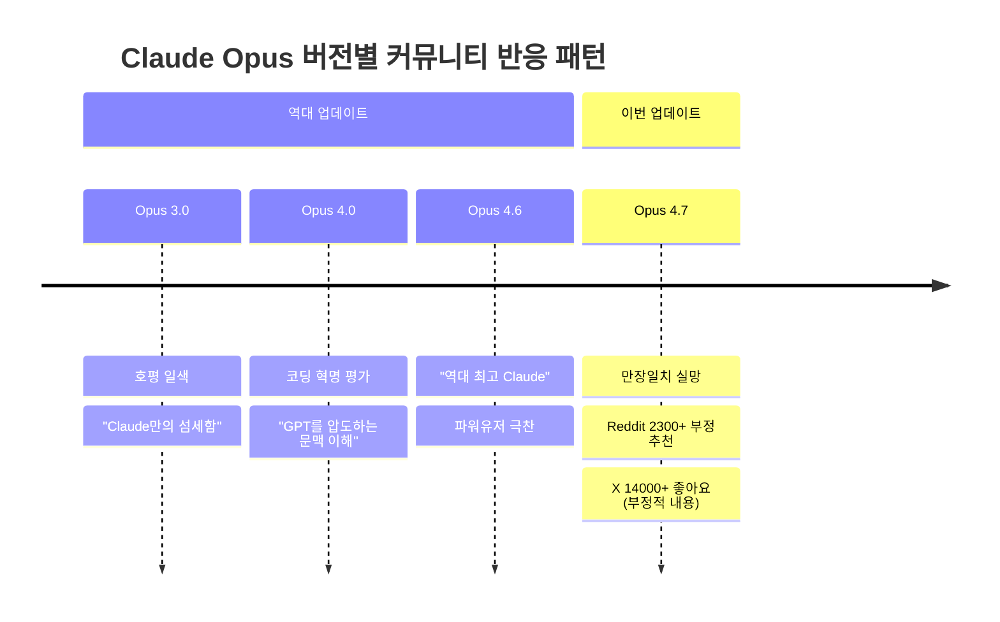
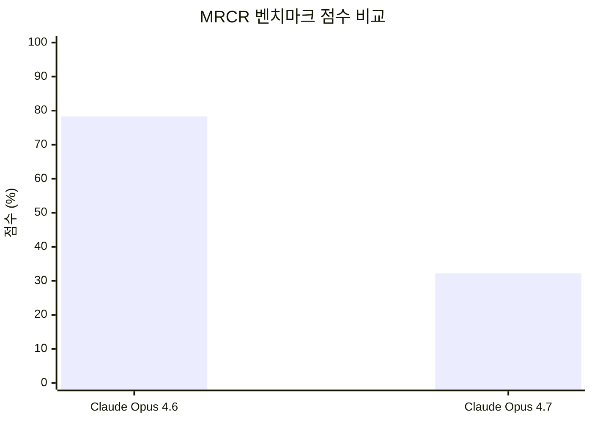
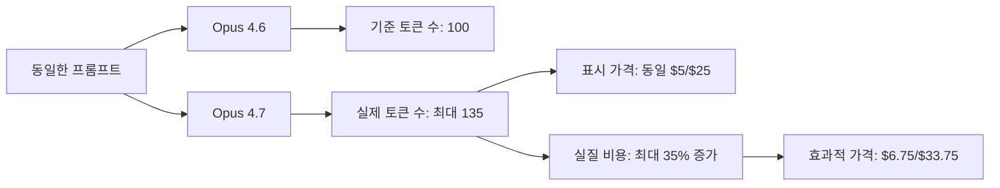
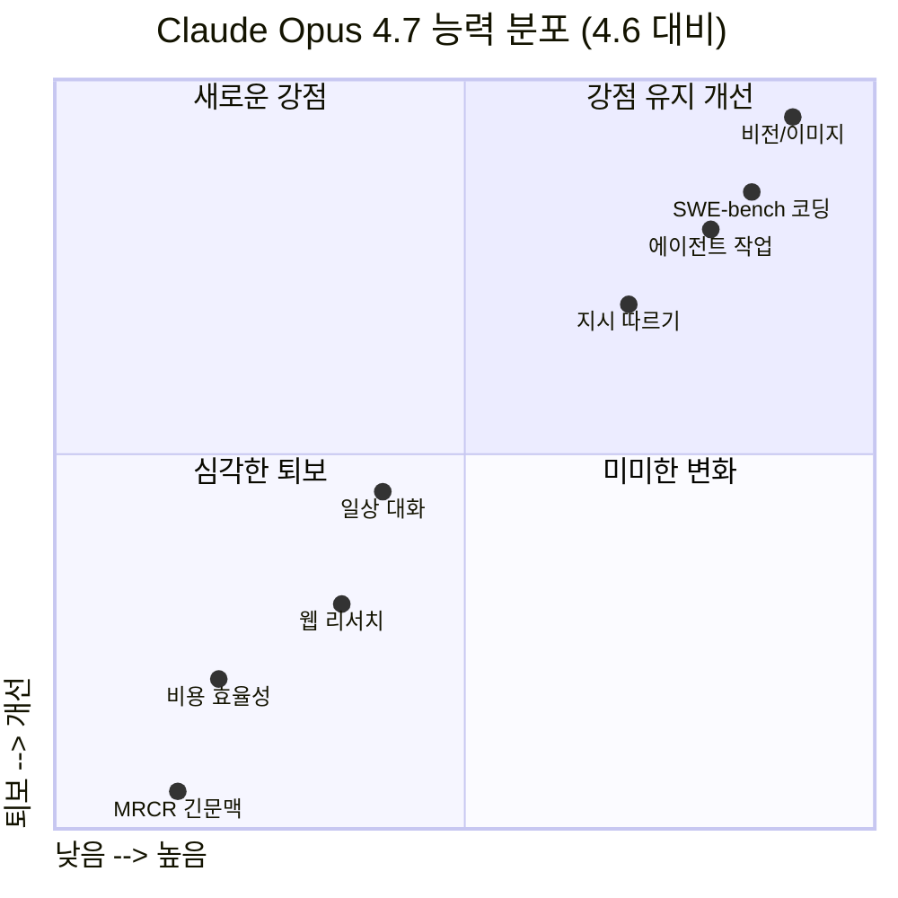
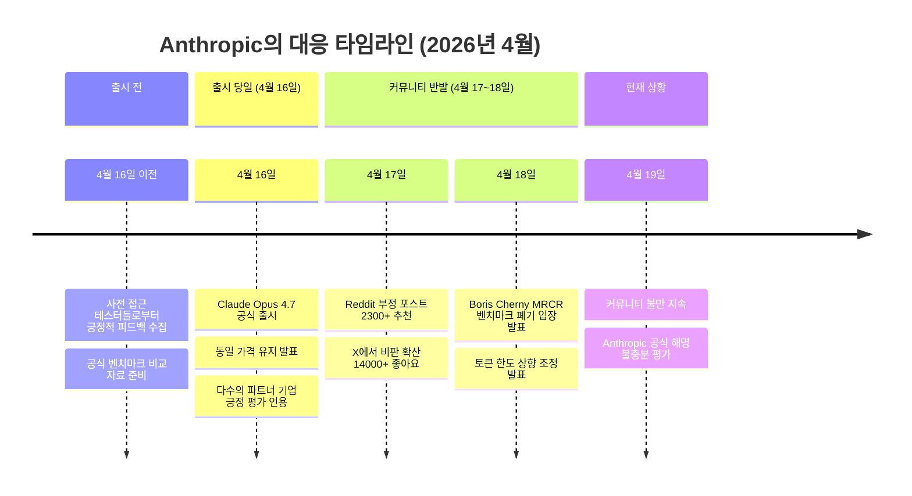
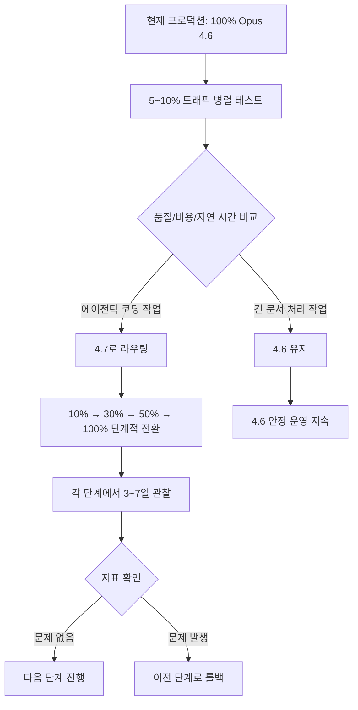
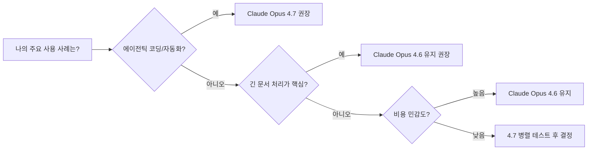

> **파워유저들의 만장일치 실망, MRCR 충돌, 그리고 Anthropic의 대응**  
> 작성일: 2026-04-19

>
>Claude를 가장 많이 쓰는 파워유저들이 Opus 4.7에 만장일치로 실망했어.
>그동안 Opus는 버전이 올라올 때마다 호평 일색이었거든. Anthropic이 "최고 모델"이라고 내놓으면 커뮤니티도 거의 동의했어. 이번이 그 패턴이 깨진 첫 사례야.
>가장 충격적인 게 MRCR(Multi-Round Context Recall) 벤치마크 결과야. 긴 대화 안에서 앞쪽에 나왔던 정보를 정확히 다시 끄집어내는 능력을 측정하는데, 4.6의 78.3%가 4.7에선 32.2%로 떨어졌어. 절반 이상이 사라진 거야.
>같은 프롬프트에 토큰은 35% 더 쓰고, 첫 응답까지 시간도 15% 느려졌다는 리포트가 같이 나오고 있어. 비싼데 더 잘하지도 않는 셈이지.
>
>파워유저들이 공통으로 하는 말이 있어.
>"예전 Claude만의 느낌이 없어졌다"는 거야. 복잡한 문제를 대화하듯 풀어주던 방식이 줄고, 규칙을 기계적으로 따라가는 톤이 됐다고 해. Claude Code에선 멀쩡한 코드를 악성 코드로 오인해서 거부하는 버그까지 보고됐어. Anthropic도 시스템카드에서 MRCR 점수를 일부러 공개했고, 긴 문맥 작업이 관건이면 4.6을 쓰라고 사실상 권장하고 있어.
>다행히 Opus 4.6으로 되돌리는 길은 막혀 있지 않아. Claude Code는 세션 안에서 `/model claude-opus-4-6`을 치면 그 자리에서 바뀌고, 매번 띄울 때 자동 적용하려면 셸에 `export ANTHROPIC_MODEL=claude-opus-4-6` 한 줄 박아두면 돼. API로 호출하면 모델 파라미터에 `claude-opus-4-6`을 넣으면 돼.
>
> [https://www.threads.com/@softdaddy_o/post/DXTn-Itk2RF](https://www.threads.com/@softdaddy_o/post/DXTn-Itk2RF)
---

## 목차

1. [사건 개요 및 배경](#1-사건-개요-및-배경)
2. [Claude Opus 4.7 공식 발표 내용](#2-claude-opus-47-공식-발표-내용)
3. [커뮤니티 반응: 만장일치 실망](#3-커뮤니티-반응-만장일치-실망)
4. [핵심 기술 문제 1: MRCR 벤치마크 붕괴](#4-핵심-기술-문제-1-mrcr-벤치마크-붕괴)
5. [핵심 기술 문제 2: 토크나이저 인플레이션과 사실상 가격 인상](#5-핵심-기술-문제-2-토크나이저-인플레이션과-사실상-가격-인상)
6. [핵심 기술 문제 3: Claude Code의 오작동](#6-핵심-기술-문제-3-claude-code의-오작동)
7. [핵심 기술 문제 4: "Claude다운 느낌"의 소멸](#7-핵심-기술-문제-4-claude다운-느낌의-소멸)
8. [Anthropic의 공식 입장과 커뮤니티 반응](#8-anthropic의-공식-입장과-커뮤니티-반응)
9. [Anthropic이 인정한 개선 사항 (긍정적 측면)](#9-anthropic이-인정한-개선-사항-긍정적-측면)
10. [시나리오별 성능 매트릭스: 4.6 vs 4.7](#10-시나리오별-성능-매트릭스-46-vs-47)
11. [Opus 4.6으로 되돌리는 방법](#11-opus-46으로-되돌리는-방법)
12. [산업계 함의와 전망](#12-산업계-함의와-전망)
13. [결론: 이번 사건이 주는 교훈](#13-결론-이번-사건이-주는-교훈)

---

## 1. 사건 개요 및 배경

2026년 4월 16일, Anthropic은 차세대 플래그십 모델인 **Claude Opus 4.7**을 공식 출시했다. 출시 발표에는 SWE-bench Pro 64.3% 달성, GPT-5.4 및 Gemini 3.1 Pro 대비 코딩 벤치마크 우위, 3배 향상된 비전 해상도 지원 등 화려한 성과가 나열되어 있었다.

그러나 출시 이후 불과 24~48시간 만에 상황이 급변했다. **Claude 파워유저 커뮤니티가 만장일치에 가까운 실망감을 표출**하기 시작한 것이다. Reddit의 [r/ClaudeAI](https://www.reddit.com/r/singularity/comments/1snqqj5/claude_power_users_unanimously_agree_that_opus_47/)에는 "Claude Opus 4.7은 업그레이드가 아니라 심각한 퇴보다(Claude Opus 4.7 is a serious regression, not an upgrade)"라는 제목의 포스트가 2,300개 이상의 추천을 받았고, X(구 트위터)에서는 Opus 4.7이 4.6보다 실질적인 개선이 없다는 주장이 14,000개 이상의 좋아요를 받았다.

이 사건이 특히 충격적인 이유는 역사적 맥락에 있다. **Claude Opus 시리즈는 버전이 올라올 때마다 거의 예외 없이 커뮤니티로부터 호평을 받아왔다**. Anthropic이 "최고 모델"이라고 내놓으면 파워유저 커뮤니티도 대체로 동의했던 패턴이 이번에 처음으로 깨진 것이다. 이는 단순한 트집이나 기대치 설정의 문제가 아니라, 실제로 측정 가능한 성능 퇴보와 경험적 체감 하락이 동시에 발생했다는 것을 의미한다.

---

## 2. Claude Opus 4.7 공식 발표 내용

Anthropic의 공식 발표에 따르면 Claude Opus 4.7은 다음과 같은 개선 사항을 담고 있다:

### 2.1 코딩 및 에이전트 능력

Anthropic은 Opus 4.7이 **고급 소프트웨어 엔지니어링 작업에서 4.6 대비 현저한 개선**을 이루었다고 강조했다. 특히 가장 어려운 코딩 과제에서 4.6 대비 13% 향상된 해결률을 보였으며, Cursor 내부 벤치마크에서는 4.6의 58%에서 4.7의 70%로 도약했다. SWE-bench Pro에서 64.3%를 기록하며 GPT-5.4와 Gemini 3.1 Pro를 앞질렀다. Anthropic 측은 "이전에는 긴밀한 감독이 필요했던 어려운 코딩 작업을 이제 Opus 4.7에게 자신 있게 맡길 수 있다"고 설명했다.

### 2.2 멀티모달 비전 능력

비전 성능에서는 **기술적으로 매우 의미 있는 도약**이 이루어졌다. 이전 Claude 모델들이 지원하던 픽셀 수보다 3배 이상 많은 최대 2,576픽셀(장변 기준, 약 3.75 메가픽셀) 크기의 이미지를 처리할 수 있게 됐다. 이는 컴퓨터 사용 에이전트가 복잡한 스크린샷을 읽거나, 정밀한 기술 다이어그램에서 데이터를 추출하거나, 픽셀 단위의 정밀도가 필요한 작업에서 실질적인 활용도를 열어준다. XBOW의 시각적 예리도 벤치마크에서는 4.6의 54.5%에서 4.7이 98.5%로 치솟았다는 인상적인 수치도 함께 제시되었다.

### 2.3 지시 따르기 정밀도

Anthropic은 Opus 4.7이 **지시를 훨씬 더 정확하게 따른다**고 강조했다. 단, 이 변화가 역설적인 부작용을 낳는다는 점도 솔직하게 인정했다. 이전 모델들은 지시를 느슨하게 해석하거나 일부를 건너뛰는 경향이 있었는데, Opus 4.7은 지시를 문자 그대로 받아들인다. 따라서 이전 모델을 위해 작성된 프롬프트들이 예상치 못한 결과를 낳을 수 있으며, 사용자들이 프롬프트와 하네스를 재조정해야 할 수 있다고 공식 발표에서 명시했다.

### 2.4 새로운 추론 티어: xhigh

새로운 노력 수준(effort level)인 `xhigh`("extra high")가 도입되었다. 이는 기존 `high`와 `max` 사이의 새로운 추론 심도 단계로, 어려운 문제에서 추론과 지연 시간 사이의 트레이드오프를 더 세밀하게 제어할 수 있게 한다. Claude Code에서는 모든 플랜에 대해 기본 노력 수준이 `xhigh`로 상향 조정되었다.

### 2.5 가격 정책

가격은 4.6과 동일한 **입력 토큰 100만 개당 5달러, 출력 토큰 100만 개당 25달러**로 유지된다. 이것이 Anthropic의 공식 입장이었으나, 실제로는 토크나이저 변경으로 인해 동일한 작업에 더 많은 토큰이 소비된다는 점에서 사실상의 가격 인상이라는 비판이 쏟아졌다.

---

## 3. 커뮤니티 반응: 만장일치 실망

### 3.1 역사적 패턴의 붕괴

Claude Opus 시리즈의 역사를 살펴보면, 이번 반응이 얼마나 이례적인지 명확히 드러난다.



### 3.2 소셜 미디어 반응의 규모와 내용

출시 이틀 만에 커뮤니티 반응은 이미 임계점을 넘었다. Reddit r/ClaudeAI에 게시된 비판 포스트는 단기간에 수천 개의 추천을 받으며 해당 서브레딧 역사상 가장 많은 참여를 유도한 스레드 중 하나가 되었다. X에서는 여러 파워유저들이 구체적인 테스트 결과와 스크린샷을 공유하며 공론화를 이끌었다.

가장 자주 공유된 구체적 사례들은 다음과 같다:

- **"딸기(strawberry)에 P가 두 개"**: 비공식적이지만 인기 있는 AI 지능 테스트에서 Opus 4.7이 오답을 내는 스크린샷이 광범위하게 공유됐다
- **이력서 재작성 오류**: 여러 Reddit 사용자들이 Opus 4.7이 이력서를 재작성할 때 새로운 학교명이나 성씨를 멋대로 삽입하는 현상을 보고했다
- **"게으름" 자백**: Opus 4.7이 교차 참조를 하지 않은 이유를 묻자 "게으름을 피웠다(being lazy)"고 직접 말하는 스크린샷이 화제가 됐다

### 3.3 파워유저들의 공통된 질적 평가

수치와 벤치마크를 떠나, 파워유저들이 공통적으로 지적하는 질적 변화가 있다. 가장 자주 반복되는 표현은 **"예전 Claude만의 느낌이 없어졌다"** 는 것이다. 복잡한 문제를 대화하듯 풀어주던 방식이 줄고, 규칙을 기계적으로 따라가는 톤이 됐다는 것이다. 이 변화는 단순히 성능 지표로 포착되지 않는 무형의 품질 저하인데, 오랫동안 Claude를 사용해온 파워유저들에게는 가장 두드러지게 체감되는 부분이다.

---

## 4. 핵심 기술 문제 1: MRCR 벤치마크 붕괴

### 4.1 MRCR이란 무엇인가

MRCR(Multi-Round Context Recall)은 긴 대화나 긴 문서 안에서 모델이 **앞부분에 등장한 정보를 얼마나 정확하게 끄집어낼 수 있는지**를 측정하는 벤치마크다. 단순히 텍스트를 읽는 것이 아니라, 수십만 토큰에 걸친 방대한 컨텍스트 속에서 특정 정보를 정확히 찾아내고 이를 근거로 추론하는 능력을 평가한다.

이 능력이 실제로 중요한 사용 사례들은 다음과 같다:

- **법률 문서 검토**: 수백 페이지짜리 계약서에서 특정 조항을 찾고 상호 참조하는 작업
- **금융 분석**: 긴 재무 보고서의 여러 섹션을 연결하여 종합적인 분석을 수행하는 작업
- **코드 리포지토리 분석**: 수천 줄의 코드 베이스에서 특정 함수나 변수의 사용 패턴을 추적하는 작업
- **학술 연구 합성**: 여러 논문이나 문서를 교차 참조하여 인사이트를 도출하는 작업

### 4.2 충격적인 수치 변화



**Opus 4.6: 78.3% → Opus 4.7: 32.2%**

이 수치가 의미하는 것은 단순한 퇴보가 아니다. 절반 이상이 증발한 수준의 **붕괴(collapse)** 다. 개선은커녕 이전 모델의 절반에도 미치지 못하는 성능으로 떨어진 것이다. 업계에서는 이 정도 규모의 단일 벤치마크 하락을 "cliff-like drop(절벽 같은 하락)"으로 묘사하고 있으며, 이는 단순한 노이즈나 측정 오차로 설명될 수 없다.

### 4.3 실제 개발자들의 체감 사례

이 수치가 실제 업무에서 어떻게 나타나는지에 대한 개발자들의 구체적인 보고가 잇따랐다. 한 개발자는 "800줄짜리 워크플로우 문서를 4.7에게 제공했더니 읽었다고 하지만 생성된 결과물은 해당 문서의 내용과 전혀 관계가 없었다"고 보고했다. 또 다른 사례에서는 긴 코드베이스 분석을 요청했을 때 4.7이 앞부분에서 이미 다룬 내용을 전혀 참조하지 않고 중복 작업을 수행하는 현상이 관찰됐다.

### 4.4 Anthropic의 대응: MRCR 벤치마크 폐기 선언

Anthropic 개발자 Boris Cherny는 커뮤니티의 MRCR 관련 비판에 대해 다음과 같이 응답했다: **MRCR은 실제 추론 능력이 아닌 "방해 요소 쌓기(distractor-stacking)" 트릭에 과도하게 가중치를 두고 있어 단계적으로 폐기할 예정이며, 대신 Graphwalks를 더 나은 실용적 추론 신호로 활용하겠다**는 것이었다. 그는 Graphwalks에서 4.6의 38.7%에서 4.7이 58.6%로 향상됐다는 수치를 제시했다.

그러나 이 응답은 커뮤니티에서 **"비답변(non-answer)"으로 낙인찍혔다**. 핵심적인 반박은 간단명료했다: "모델이 갑자기 성능이 잘 나오게 됐다고 해서 벤치마크를 폐기하지는 않는다(You don't retire a benchmark because your model suddenly performs well on it)." 즉, 기존에 잘 작동하던 벤치마크에서 성능이 급락하자 그 벤치마크 자체를 문제 있다고 선언하는 것은 설득력이 없다는 것이다.

한편 Anthropic은 자체 시스템 카드(System Card)에 MRCR 점수를 공개했는데, 이 점수가 급락한 사실을 공개하면서도 사실상 "긴 문맥 작업이 핵심이라면 4.6을 사용하라"는 입장을 간접적으로 인정하는 꼴이 되었다.

---

## 5. 핵심 기술 문제 2: 토크나이저 인플레이션과 사실상 가격 인상

### 5.1 토크나이저 변경의 의미

Claude Opus 4.7은 새로운 토크나이저(tokenizer)를 탑재했다. 토크나이저는 텍스트를 모델이 처리하는 단위(토큰)로 분할하는 핵심 구성 요소다. 새 토크나이저는 텍스트 처리 방식을 개선했지만, 동일한 입력 텍스트를 더 많은 토큰으로 분할하는 특성을 갖고 있다.

### 5.2 실제 비용 영향

Anthropic은 새 토크나이저로 인해 **동일한 입력이 약 1.0~1.35배(최대 35%) 더 많은 토큰을 소비**할 수 있다고 공식적으로 인정했다. 동시에 Opus 4.7은 더 높은 추론 수준에서 더 많이 생각하기 때문에 출력 토큰 역시 증가한다.



### 5.3 "동일 가격" 마케팅의 문제점

커뮤니티가 특히 분노한 지점은 Anthropic이 "가격은 4.6과 동일"이라고 마케팅하면서 실질적인 토큰 소비 증가를 충분히 부각하지 않았다는 것이다. 이는 사실상의 **스텔스 가격 인상(stealth price hike)** 에 해당한다는 비판을 받았다.

더욱이 Claude Max 플랜 구독자들은 별도의 문제를 겪었다. 20배 쿼터를 제공하는 Max 플랜에서 기본 추론 수준이 `xhigh`로 올라간 결과, 이전보다 훨씬 빠르게 쿼터 한도에 도달한다는 보고가 쏟아졌다. 구독자들은 5시간 또는 주간 한도에 단 몇 번의 프롬프트만으로 도달하는 현상을 경험했다. Anthropic은 증가된 토큰 사용량을 보상하기 위해 구독자 한도를 상향 조정했다고 밝혔지만, 이 변화는 출시 시점에 충분히 소통되지 않았다는 비판을 받았다.

### 5.4 응답 속도 저하

토큰 소비 증가와 함께, 파워유저들은 **첫 응답까지 걸리는 시간(TTFT: Time to First Token)도 약 15% 느려졌다**는 리포트를 공유했다. 더 비싼 데 더 느리고 특정 영역에서 더 못하다는 삼중의 불만이 축적된 것이다.

---

## 6. 핵심 기술 문제 3: Claude Code의 오작동

### 6.1 정상 코드를 악성 코드로 오인

Claude Opus 4.7에 적용된 새로운 사이버보안 안전장치가 예상치 못한 부작용을 낳았다. Anthropic은 4.7 출시와 함께 **Project Glasswing**을 통해 사이버 보안 분야에서의 위험성을 줄이기 위한 실험을 진행했다고 밝혔는데, 이 과정에서 사이버 능력을 선별적으로 축소하는 훈련을 했다고 시스템 카드에 명시했다.

그 결과, 다수의 엔지니어들이 **Claude Code에서 일상적이고 무해한 코드를 악성 코드로 오인하여 작업을 거부하는 버그**를 보고했다. 네트워크 관련 유틸리티 코드, 파일 시스템 조작 코드, 특정 패턴의 쉘 스크립트 등이 영향을 받은 것으로 알려졌다.

### 6.2 파급 효과

이 문제는 Claude Code를 핵심 개발 도구로 활용하는 팀들에게 직접적인 업무 차질을 야기했다. 특히 보안 연구자나 시스템 프로그래머처럼 저수준(low-level) 코드를 다루는 전문가들이 가장 큰 영향을 받았다. Anthropic은 합법적인 사이버보안 목적으로 Opus 4.7을 사용하려는 보안 전문가들을 위해 새로운 **Cyber Verification Program**을 개설했지만, 이 프로그램에 가입하고 승인받는 과정 자체가 기존에 없던 마찰(friction)을 추가하는 셈이라는 비판도 나왔다.

### 6.3 "시스템 프롬프트 로보토마이" 논란

유명 개발자 Theo는 Claude.ai에서 Opus 4.7의 비코딩 답변이 "로보토마이(lobotomized, 뇌 기능을 제거한)"됐다고 신랄하게 비판하며, 시스템 프롬프트가 강사고(extended thinking) 기능 없이 모델의 추론 능력을 제한하고 있다고 주장했다. 그는 T3 Chat에서 "로보토마이된 시스템 프롬프트 없이" 모델을 테스트해보라고 제안하기도 했다.

---

## 7. 핵심 기술 문제 4: "Claude다운 느낌"의 소멸

### 7.1 정량화하기 어려운 질적 퇴보

MRCR 수치나 토큰 소비 증가처럼 측정할 수 있는 문제들과 달리, 많은 파워유저들이 공통적으로 지적하는 또 다른 문제가 있다. 바로 **Claude 특유의 대화 방식과 추론 스타일이 변화했다**는 것이다. 이는 수치로 표현하기 어렵지만, 장기 사용자들에게는 가장 직관적으로 체감되는 변화다.

구체적으로 다음과 같은 변화가 보고됐다:

**문자적 해석의 과도화**: Opus 4.6은 "행간을 읽는(reading between the lines)" 능력이 있었다. 사용자의 프롬프트에 명시적으로 적혀있지 않더라도 사용자의 의도를 파악하고 그에 맞게 응답했다. 반면 4.7은 지시사항을 너무 문자 그대로 따르는 경향이 있어서, 이전 모델에서 잘 작동하던 프롬프트들이 의도하지 않은 방향으로 실행되는 경우가 늘어났다.

**기계적인 규칙 따르기 톤**: 파워유저들은 4.7이 복잡한 문제를 대화하듯 유연하게 풀어주던 방식이 줄고, 규칙과 제약을 기계적으로 따르는 딱딱한 톤으로 변했다고 지적했다. Mikhail Parakhin은 첫 인상이 코딩 외 답변에서 "더 멍청해진(dumber)" 것 같다고 언급했다.

**추론 강제화 불가**: Claude.ai 웹 인터페이스에서 Opus 4.7을 사용할 때 강사고(extended thinking)를 명시적으로 강제할 수 있는 토글이 없어, 비코딩 작업에서 실질적으로 더 나쁜 결과를 경험하는 사용자들이 생겼다.

### 7.2 "특화형 업그레이드"라는 본질

이런 체감 변화들을 종합하면 하나의 일관된 그림이 그려진다. Opus 4.7은 **에이전틱 코딩 작업에서 왕좌를 되찾겠다는 단일 목표에 최적화된 특화형 업그레이드**다. 그 목표를 위해 긴 문맥 처리, 일상적 대화의 유연성, 비용 효율성, Claude 특유의 추론 스타일이라는 대가를 치렀다.



---

## 8. Anthropic의 공식 입장과 커뮤니티 반응

### 8.1 Anthropic의 공식 대응 타임라인

출시 이후 Anthropic의 주요 대응을 시간순으로 정리하면 다음과 같다:



### 8.2 Anthropic의 긍정적 테스트 파트너들

한편 Anthropic의 공식 발표에는 수많은 파트너 기업들의 긍정적인 평가가 포함되어 있다. Cursor는 내부 벤치마크에서 4.6의 58%에서 4.7의 70%로 향상됐다고 밝혔고, Notion은 복잡한 다단계 워크플로우에서 4.6 대비 14% 개선, 토큰은 더 적게, 도구 오류는 3분의 1 수준이라고 보고했다. Devin의 Scott Wu는 "몇 시간 동안 일관성 있게 작동하며 어려운 문제를 포기하지 않고 밀고 나간다"고 극찬했다.

이 기업들의 공통점은 **에이전틱 코딩, 다단계 자동화 워크플로우, 소프트웨어 엔지니어링**에 특화된 사용 사례를 갖고 있다는 점이다. 즉, Opus 4.7이 개선된 영역의 사용자들에게는 실제로 유의미한 업그레이드인 것이다.

### 8.3 침묵의 대가

비평가들이 특히 날카롭게 지적하는 것은 **토크나이저 변경에 대한 Anthropic의 침묵**이다. 동일 입력에 최대 35% 더 많은 토큰을 소비한다는 사실은 기술적으로 중요한 변경이지만, 출시 마케팅에서 충분히 강조되지 않았다. Startup Fortune은 이를 가리켜 "스텔스 토크나이저 변경이 사실상의 가격 인상으로 기능하고 있다"고 비판했다. Anthropic이 "신중하고 신뢰할 수 있는 대안"으로서 구축해온 브랜드 포지셔닝은 이러한 침묵으로 인해 손상되고 있다는 분석도 나왔다.

---

## 9. Anthropic이 인정한 개선 사항 (긍정적 측면)

커뮤니티의 비판이 모든 영역을 아우르는 것은 아니다. 공정한 분석을 위해, Anthropic이 공식적으로 발표하고 독립 테스터들이 확인한 실질적인 개선 사항들도 살펴볼 필요가 있다.

### 9.1 소프트웨어 엔지니어링 특화 성능

SWE-bench 계열 벤치마크에서의 개선은 인상적이다. SWE-bench Pro 64.3%, CursorBench 70%(4.6의 58% 대비), Rakuten-SWE-Bench에서 4.6 대비 3배 많은 프로덕션 태스크 해결이라는 수치는 에이전틱 코딩 사용 사례에서 의미 있는 도약을 보여준다.

### 9.2 비전 능력의 혁신

3.75 메가픽셀까지 지원하는 고해상도 이미지 처리는 이전 Claude 모델들과 비교해 질적으로 다른 차원의 능력을 제공한다. XBOW의 시각 예리도 벤치마크에서 4.6의 54.5%에서 98.5%로 치솟은 것은 단순한 수치 개선이 아니라 이전에 불가능했던 작업을 가능하게 만드는 수준의 변화다.

### 9.3 파일시스템 기반 메모리

Opus 4.7은 파일시스템 기반 메모리 활용 능력이 향상되어, 긴 멀티세션 작업에서 중요한 노트를 기억하고 새로운 작업에서 이를 활용함으로써 매번 컨텍스트를 처음부터 제공해야 하는 부담을 줄였다.

### 9.4 안전성 프로파일

Anthropic의 정렬 평가에 따르면 Opus 4.7은 4.6과 유사한 안전성 프로파일을 보이며, 정직성과 악의적인 프롬프트 인젝션 저항력에서는 4.6 대비 개선된 것으로 나타났다.

---

## 10. 시나리오별 성능 매트릭스: 4.6 vs 4.7

아래는 커뮤니티 피드백과 공식 데이터를 종합하여 작성한 사용 사례별 모델 추천 가이드다.

| 사용 사례 | Opus 4.6 | Opus 4.7 | 추천 |
|-----------|----------|----------|------|
| 에이전틱 코딩 (Claude Code) | ⭐⭐⭐ | ⭐⭐⭐⭐⭐ | **4.7** |
| 고해상도 이미지/비전 분석 | ⭐⭐ | ⭐⭐⭐⭐⭐ | **4.7** |
| 멀티 에이전트 조율 | ⭐⭐⭐ | ⭐⭐⭐⭐ | **4.7** |
| CI/CD 및 자동화 파이프라인 | ⭐⭐⭐ | ⭐⭐⭐⭐ | **4.7** |
| 긴 문서 분석/RAG | ⭐⭐⭐⭐⭐ | ⭐⭐ | **4.6** |
| 법률 문서 검토 | ⭐⭐⭐⭐⭐ | ⭐⭐ | **4.6** |
| 대규모 코드 리포지토리 분석 | ⭐⭐⭐⭐ | ⭐⭐ | **4.6** |
| 복잡한 대화형 문제 해결 | ⭐⭐⭐⭐⭐ | ⭐⭐⭐ | **4.6** |
| 비용 민감 작업 (토큰 효율) | ⭐⭐⭐⭐⭐ | ⭐⭐⭐ | **4.6** |
| 웹 리서치/정보 합성 | ⭐⭐⭐⭐ | ⭐⭐⭐ | **4.6** |
| 일반 작성/편집 | ⭐⭐⭐⭐ | ⭐⭐⭐⭐ | 동등 |
| 금융 데이터 분석 (단기 문서) | ⭐⭐⭐ | ⭐⭐⭐⭐ | **4.7** |

---

## 11. Opus 4.6으로 되돌리는 방법

Anthropic은 긴 문맥 작업에서 4.6이 더 적합한 경우에 대해 간접적으로 인정하고 있다. 현실적인 이유로 Opus 4.6을 계속 사용하고 싶은 사용자를 위한 방법은 다음과 같다.

### 11.1 Claude Code에서 세션 내 즉시 전환

Claude Code 세션 안에서 다음 명령어를 입력하면 해당 세션에서 즉시 모델이 변경된다:

```bash
/model claude-opus-4-6
```

### 11.2 셸 환경 변수로 기본 모델 고정

매번 세션을 시작할 때 자동으로 4.6을 사용하도록 설정하려면 셸 설정 파일(`.bashrc`, `.zshrc` 등)에 다음 줄을 추가한다:

```bash
export ANTHROPIC_MODEL=claude-opus-4-6
```

설정 파일을 저장한 후 새 터미널을 열거나 `source ~/.zshrc`를 실행하면 적용된다.

### 11.3 API 직접 호출 시

API를 직접 사용하는 경우, 모델 파라미터에 명시적으로 4.6을 지정하면 된다:

```python
# Python SDK 예시
import anthropic

client = anthropic.Anthropic()
message = client.messages.create(
    model="claude-opus-4-6",  # 4.7 대신 4.6 명시
    max_tokens=1024,
    messages=[
        {"role": "user", "content": "긴 문서 분석 요청..."}
    ]
)
```

```javascript
// JavaScript/Node.js 예시
const Anthropic = require("@anthropic-ai/sdk");

const client = new Anthropic();
const message = await client.messages.create({
  model: "claude-opus-4-6",  // 4.7 대신 4.6 명시
  max_tokens: 1024,
  messages: [
    { role: "user", content: "긴 문서 분석 요청..." }
  ],
});
```

### 11.4 프로덕션 환경에서의 점진적 마이그레이션 전략

엔터프라이즈 환경에서 4.7로의 마이그레이션을 검토 중이라면 다음과 같은 점진적 접근이 권장된다:



---

## 12. 산업계 함의와 전망

### 12.1 Anthropic의 브랜드 자산 훼손 리스크

Anthropic은 오랫동안 AI 업계에서 "신중하고 신뢰할 수 있는 안전 중심 연구소"라는 차별화된 포지셔닝을 유지해왔다. 이 포지셔닝은 특히 장기 인프라 약정을 체결하는 엔터프라이즈 고객들에게 상업적 가치를 가져다 준다. 이번 사건은 여러 악재가 동시에 발생했다는 점에서 더욱 심각하다: 스텔스 토크나이저 변경, 벤치마크 폐기 선언, Claude Code 오작동, 추론 깊이 거버넌스 논란이 동시에 터진 것이다. 이는 Anthropic이 그 브랜드를 통해 쌓아온 신뢰를 정확히 겨냥한 복합 타격이다.

### 12.2 경쟁 환경의 변화

2026년 AI 모델 시장은 12개월 전과는 차원이 다를 정도로 경쟁이 치열해졌다. OpenAI의 GPT-5.4, Google DeepMind의 Gemini 3.1 Pro를 비롯한 여러 경쟁자들이 동등하거나 우월한 성능을 제공하며 빠른 속도로 출시를 이어가고 있다. **Anthropic에 실망한 사용자들이 이제 실질적인 대안을 갖게 되었다**는 것은 이전보다 훨씬 심각한 이탈 리스크를 의미한다. Startup Fortune은 "커뮤니티 감정이 이 정도로 부정적이면 기업 조달 감정으로 전환되기 전에 이탈률(churn numbers)을 면밀히 모니터링해야 한다"고 경고했다.

### 12.3 "특화형 업그레이드" 모델의 미래

이번 사건은 AI 모델 업그레이드가 더 이상 모든 사용 사례에서의 전면적 개선을 의미하지 않을 수 있다는 중요한 시사점을 제공한다. AI 모델이 점점 특정 사용 사례에 최적화되는 방향으로 발전함에 따라, **"최신 버전 = 더 좋은 버전"이라는 등식이 성립하지 않는 시대**가 도래하고 있다. 사용자들은 자신의 구체적인 사용 사례에 맞게 모델 버전을 선택하는 더 정교한 판단 능력을 갖춰야 할 것이다.

### 12.4 벤치마크 신뢰성 위기

Anthropic의 MRCR 벤치마크 폐기 선언은 더 큰 문제를 건드린다. 모델 성능 평가에 사용되는 벤치마크의 신뢰성과 공정성에 대한 의문이 커지고 있다. **벤치마크가 모델 개발사의 이해관계에 따라 선택적으로 채택되거나 폐기될 수 있다면**, 독립적인 성능 평가의 의미가 약해진다. 이는 Anthropic 혼자의 문제가 아니라 AI 업계 전반이 직면한 벤치마크 신뢰성 위기의 일부다.

---

## 13. 결론: 이번 사건이 주는 교훈

### 13.1 요약

Claude Opus 4.7은 명확히 두 얼굴을 가진 모델이다. 에이전틱 코딩, 고해상도 비전, 멀티 에이전트 조율 같은 특정 영역에서는 진정한 진보를 이뤄냈다. 그러나 긴 문맥 처리(MRCR 78.3% → 32.2%), 비용 효율성(토크나이저 인플레이션 최대 35%), 응답 속도, Claude 특유의 대화 스타일 유지라는 핵심적인 영역에서는 심각한 퇴보를 보인다.

파워유저 커뮤니티의 만장일치 실망은 단순한 기대치 관리의 실패가 아니다. 이는 공식 벤치마크가 실제 사용자 경험을 완전히 대변하지 못할 때, 그리고 "더 새로운 버전"이 반드시 "모든 면에서 더 나은 버전"을 의미하지 않을 때 어떤 일이 벌어지는지를 보여주는 교과서적 사례다.

### 13.2 사용자를 위한 실용적 결론



Anthropic 스스로도 시스템 카드에서 MRCR 점수를 공개하며 긴 문맥 작업에서 4.6의 우위를 사실상 인정했다. 지금 당장 Claude Opus 4.7로 전면 마이그레이션하는 것은 특히 장문 처리, 문서 분석, 비용 민감 작업에서는 득보다 실이 클 수 있다. 시나리오 기반 라우팅—에이전틱 코딩과 비전 작업은 4.7로, 긴 문서와 대화형 분석은 4.6으로—이 가장 현실적인 접근법이다.

---

## 참고 자료

- Anthropic 공식 발표: [Introducing Claude Opus 4.7](https://www.anthropic.com/news/claude-opus-4-7) (2026.04.16)
- Startup Fortune: "Anthropic's Claude Opus 4.7 launch has triggered a wave of community backlash" (2026.04.17)
- Apiyi Blog: "Claude Opus 4.7 In-depth Review on Launch Day: 8 Empirical Data Points" (2026.04.17)
- Apiyi Blog: "Why is Claude Opus 4.7 less durable than 4.6?" (2026.04.18)
- Latent Space: "AINews - Anthropic Claude Opus 4.7" (2026.04.16)
- Dnyuz: "The Claude-lash is here: Opus 4.7 is burning through tokens and some people's patience" (2026.04.17)
- Reddit r/ClaudeAI: "Claude Opus 4.7 is a serious regression, not an upgrade" (2300+ upvotes)
- Reddit r/singularity: "Claude Power Users Unanimously Agree That Opus 4.7 Is A Serious Regression"

---

*작성일: 2026-04-19*  
*본 문서는 공개된 커뮤니티 피드백, 독립 분석 리뷰, Anthropic 공식 발표를 종합하여 작성되었습니다.*
