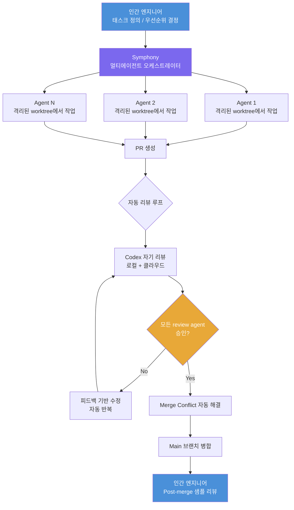
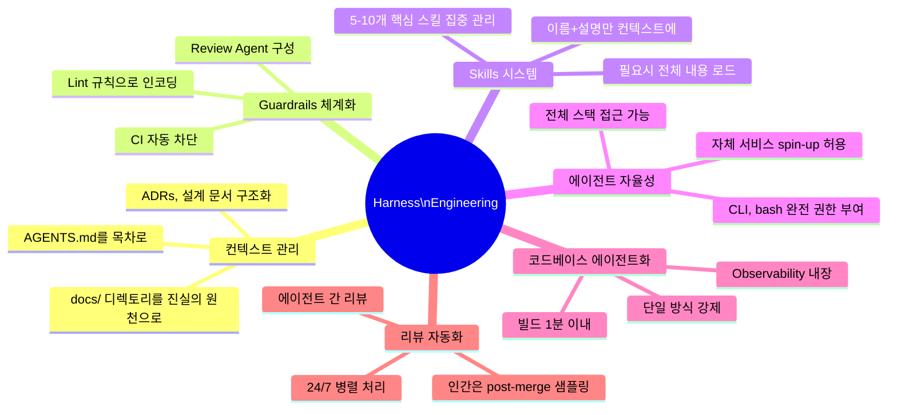
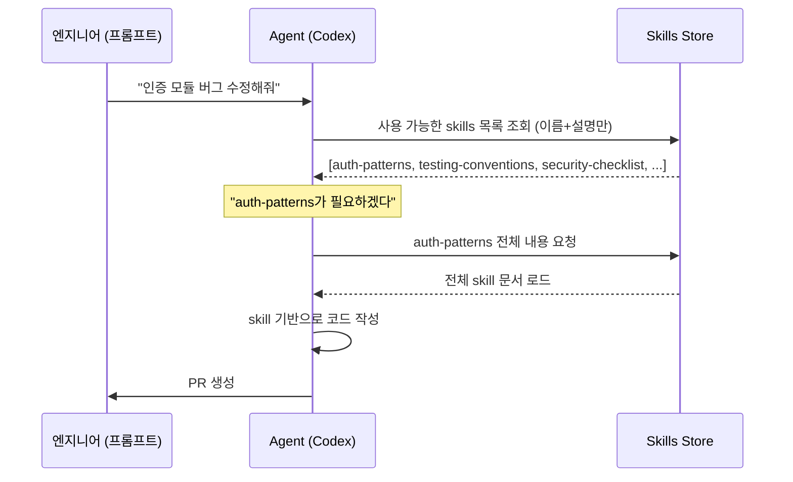
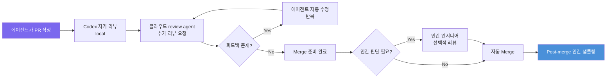
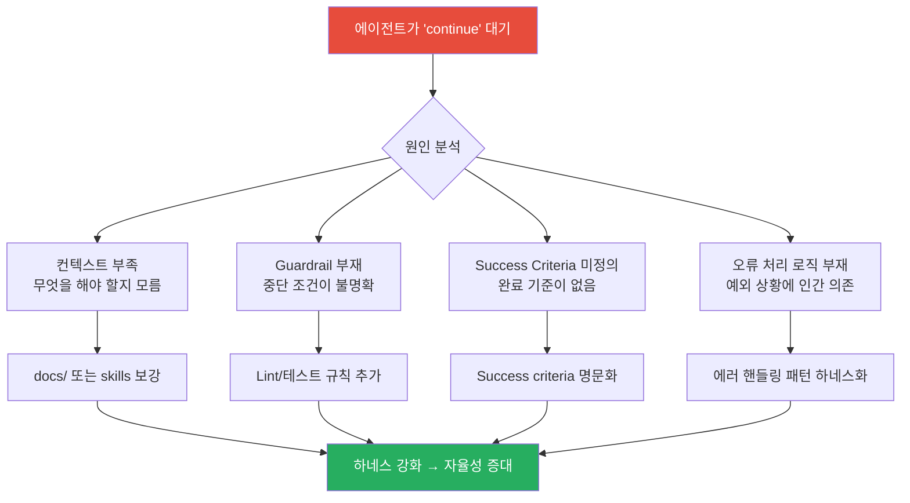
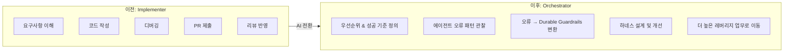
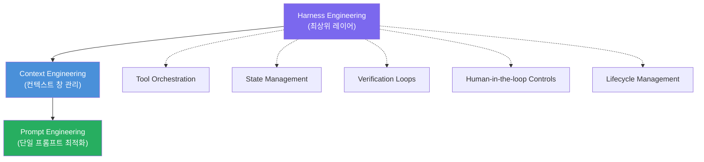

> **출처**: OpenAI Ryan Lopopolo의 AIE Europe 런던 키노트 & Latent Space 인터뷰 (2026년 4월)  
> **원문 정리**: Saito([@SaitoWu](https://x.com/saitowu/status/2045458721929892345)) X 스레드 + OpenAI 공식 블로그 "Harness Engineering" (2026.02.11)  
> **작성일**: 2026년 4월 19일

---

## 목차

1. [배경: 누가, 무엇을 말했는가](#1-배경-누가-무엇을-말했는가)
2. [핵심 테제: "코드는 이미 공짜다"](#2-핵심-테제-코드는-이미-공짜다)
3. [OpenAI Frontier 팀의 극단적 실험](#3-openai-frontier-팀의-극단적-실험)
4. [Symphony: Elixir 기반 멀티 에이전트 오케스트레이션](#4-symphony-elixir-기반-멀티-에이전트-오케스트레이션)
5. [Harness Engineering의 6대 원칙](#5-harness-engineering의-6대-원칙)
6. [Skills와 Progressive Disclosure](#6-skills와-progressive-disclosure)
7. [Agent-Friendly 코드베이스 설계](#7-agent-friendly-코드베이스-설계)
8. [리뷰의 에이전트화: 인간은 post-merge로](#8-리뷰의-에이전트화-인간은-post-merge로)
9. ["Continue 버튼"이 실패의 신호인 이유](#9-continue-버튼이-실패의-신호인-이유)
10. [인간 역할의 완전한 재정의](#10-인간-역할의-완전한-재정의)
11. [Harness Engineering vs 기존 개념들과의 비교](#11-harness-engineering-vs-기존-개념들과의-비교)
12. [실제 적용을 위한 시작점](#12-실제-적용을-위한-시작점)
13. [결론: Steering이 새로운 코딩이다](#13-결론-steering이-새로운-코딩이다)

---

## 1. 배경: 누가, 무엇을 말했는가

Ryan Lopopolo는 Snowflake, Brex, Stripe, Citadel을 거쳐 현재 OpenAI의 **Frontier Product Exploration** 팀에서 근무하는 엔지니어다. 2026년 2월 11일, 그는 OpenAI 공식 블로그에 업계를 뒤흔든 글 "Harness Engineering"을 발표했다. 이 글에서 그는 자신의 팀이 지난 5개월간 수행한 극단적인 실험의 전말을 공개했다. **인간이 단 한 줄의 코드도 작성하지 않고 100만 줄 이상의 프로덕션 코드베이스를 구축했다**는 내용이었다.

이 글은 곧 업계의 화제가 되었고, 그는 AIE Europe(AI Engineer Europe) 런던 컨퍼런스에서 키노트 발표를 맡게 되었다. Latent Space 팟캐스트와의 심층 인터뷰에서 그는 이 개념의 탄생 배경과 실전 운용 방식을 더 상세하게 풀어놓았다. X(구 트위터)에서 활동하는 Saito(@SaitoWu)는 이 발표와 인터뷰의 핵심 내용을 중국어로 정리해 올렸으며, 이것이 바로 이 문서의 시작점이 된 스레드다.

Ryan이 이 실험에 부여한 핵심 제약조건은 단순하면서도 극단적이었다. "나는 어떤 코드도 직접 작성하지 않는다." 이는 단순한 도전이 아니라 명확한 철학에서 비롯된 결정이었다. 그 철학은 이것이다: **"만약 OpenAI가 기업에 실제로 배포할 에이전트를 만든다면, 그 에이전트는 내가 매일 하는 일을 전부 할 수 있어야 한다."**

---

## 2. 핵심 테제: "코드는 이미 공짜다"

Ryan 발표의 첫 번째 폭탄은 이 한 문장이다.

> **"Code is free. 코드는 이미 공짜다."**

이것은 비유가 아니다. 현재의 AI 코딩 모델들은 이미 인간처럼 완전한 코드를 작성할 수 있는 수준에 도달했다. 토큰 비용은 여전히 존재하지만, **구현(implementation) 자체가 더 이상 병목이 아니다**라는 의미에서 코드는 공짜가 되었다.

그렇다면 진짜 희소한 것은 무엇인가? Ryan은 세 가지를 꼽는다.

**첫째, 인간의 시간(Human Time)이다.** 에이전트는 24시간 365일 쉬지 않고 병렬로 작업할 수 있지만, 인간 엔지니어의 주의와 시간은 유한하다. 이 비대칭성이 바로 새로운 패러다임의 출발점이다.

**둘째, 인간과 모델의 주의(Attention)다.** 에이전트에게 무엇에 집중해야 하는지를 정확히 알려주는 것, 즉 방향을 지정하는 일이 점점 더 중요해진다. 코드를 쓰는 것보다 어디에 쓸 코드인지를 정의하는 것이 더 어렵고 더 가치 있는 일이 된다.

**셋째, 모델의 컨텍스트 윈도우(Context Window)다.** 128K든 200K든, 에이전트가 복잡한 작업을 수십 단계 진행하다 보면 유용한 컨텍스트가 창 밖으로 밀려나가버린다. 무엇을 컨텍스트에 넣고, 무엇을 요약하고, 무엇을 버릴지를 결정하는 일이 핵심 역량이 된다.

이 세 가지 희소 자원을 효율적으로 관리하는 시스템을 구축하는 것이 Harness Engineering의 본질이다. 요약하면 **인간의 경험, 취향, 리뷰 기준, 비기능 요구사항을 모두 텍스트(docs, skills, ADRs, logs)로 변환해서 에이전트가 언제든 참조할 수 있게 만드는 것**이다. 에이전트는 코드를 쓰고, 인간은 "좋은 코드가 무엇인지"를 정의하는 역할만 맡는다.

---

## 3. OpenAI Frontier 팀의 극단적 실험

Ryan의 팀이 수행한 실험의 규모는 다음과 같다.

| 항목 | 수치 |
|---|---|
| 실험 기간 | 2025년 8월 말 ~ 2026년 1월 (약 5개월) |
| 코드베이스 규모 | **100만 줄(1M LOC) 이상** |
| 전체 PR 수 | **1,500개 이상** |
| 참여 엔지니어 수 | 초기 3명 → 최종 7명 |
| 엔지니어 1인당 하루 PR 수 | 평균 3.5개 (GPT-5.2 이후 5~10개) |
| 인간 작성 코드 비율 | **0%** |
| merge 전 인간 코드 리뷰 비율 | **0%** |
| 일일 토큰 소비량 | **10억 토큰(1B tokens/day)** |

첫 번째 커밋은 에이전트가 GPT-5를 사용해 작성했다. 레포지토리 구조, CI 설정, 포매팅 규칙, 패키지 매니저 설정, 애플리케이션 프레임워크를 포함한 초기 스캐폴드 전체가 Codex CLI에 의해 생성되었다. 심지어 에이전트에게 작업 방식을 지시하는 AGENTS.md 파일조차 Codex가 작성했다. **인간이 작성한 초기 코드란 존재하지 않았다. 처음부터 레포지토리는 에이전트가 형성했다.**

시작 초반 1개월 반은 인간 개발 속도보다 10배 느렸다. 그러나 Ryan은 이 비용을 감수하는 것이 옳다고 믿었다. 그 이유는, 에이전트가 실패할 때마다 팀은 이렇게 자문했기 때문이다. "어떤 역량이 부족한가? 어떤 컨텍스트가 없는가? 어떤 구조가 빠져 있는가?" 이 질문에 답하면서 차곡차곡 쌓인 **하네스(harness)** 가 이후의 폭발적인 생산성을 가능하게 했다.

GPT-5.2가 출시된 2026년 1월, 별도의 변경 없이 엔지니어 1인당 하루 PR 수가 5~10개로 뛰어올랐다. 이 시점에서 인간의 병목은 극명하게 드러났다. 엔지니어들이 tmux 창을 왔다 갔다 하며 여러 에이전트 세션을 감시하느라 대부분의 시간을 쓰고 있었던 것이다. 이것이 Symphony 탄생의 직접적인 계기가 되었다.

---

## 4. Symphony: Elixir 기반 멀티 에이전트 오케스트레이션

Symphony는 Ryan 팀이 구축한 내부 멀티 에이전트 오케스트레이션 플랫폼으로, 인간을 터미널로부터 완전히 해방시키는 것을 목표로 설계되었다.

흥미롭게도 Symphony는 **Elixir**로 작성되었는데, 이 언어를 선택한 것도 에이전트였다. Elixir의 프로세스 슈퍼비전 모델과 GenServer 프리미티브가 다수의 동시 코딩 작업을 오케스트레이션하는 문제에 자연스럽게 매핑된다는 이유에서였다. 이 자체가 에이전트가 기술적 결정을 내릴 수 있음을 보여주는 사례다.

Symphony가 관리하는 전체 라이프사이클을 도식으로 나타내면 다음과 같다.

Symphony의 핵심 기능은 다음과 같다. 첫째, 격리된 worktree에 Codex 에이전트를 생성하고 감시한다. 둘째, 태스크 완료까지 에이전트를 구동한다. 셋째, PR 리뷰를 조율한다. 넷째, merge conflict를 처리한다. 다섯째, PR이 merge 불가능할 때 재작업을 관리한다. 그리고 마지막으로 코드를 main에 최종 병합한다.

Symphony는 또한 "ghost library" 개념을 구현한다. 이는 Alex Kotliarskyi가 완성한 참조 구현체로, 전체 대규모 Codex 에이전트 시스템을 구축하는 방법을 보여주는 일종의 설계 명세서다. 각 에이전트는 실제 제품 요구사항 문서에 준하는 매우 상세한 프롬프트를 받지만, 구체적인 구현은 직접 제공받지 않는다. 에이전트는 이 명세로부터 복잡한 시스템 전체를 스스로 재현해낸다.

---

## 5. Harness Engineering의 6대 원칙

Ryan의 철학에서 파생된 Harness Engineering의 핵심 원칙을 체계적으로 정리하면 다음과 같다.

### 원칙 1: 컨텍스트와 Guardrails가 진짜 자산이다

모델의 코딩 능력은 충분히 강력하다. 따라서 엔지니어가 만들어야 할 진짜 자산은 에이전트가 "좋은 코드가 무엇인지" 판단할 수 있게 해주는 컨텍스트와, 나쁜 코드가 들어오지 못하도록 막는 guardrails다.

**컨텍스트**는 팀의 취향(taste), 리뷰 기준, 아키텍처 결정 기록(ADR), 비기능 요구사항 등을 텍스트로 변환한 것이다. 에이전트가 언제든 참조할 수 있는 형태로 구조화되어야 한다.

**Guardrails**는 확률적 준수에 의존하지 않는다. 프롬프트에서 "우리 코딩 표준을 따르세요"라고 말하는 것은 결국 확률적 복종을 요청하는 것이다. 진짜 guardrails는 lint 규칙이 PR을 차단하는 것처럼 **결정론적으로 강제**된다. 이 구분이 Harness Engineering의 핵심이다.

### 원칙 2: 에이전트를 작은 상자 안에 가두지 마라

전통적인 접근 방식은 에이전트에게 미리 설계된 scaffold(발판)을 주고 정해진 단계를 밟게 하는 것이다. Ryan은 이것이 근본적으로 잘못된 방향이라고 본다.

올바른 접근은 에이전트 자체가 "전체 상자"가 되도록 하는 것이다. CLI, bash, observability 스택, 심지어 서비스를 직접 spin-up하는 능력까지 모두 부여해야 한다. 이렇게 해야 에이전트가 풀스택 엔지니어처럼 처음부터 끝까지 작업을 완료하고, 인간은 가끔 리뷰만 하면 된다.

### 원칙 3: 실패를 프롬프트 문제가 아닌 구조 문제로 취급하라

에이전트가 실패했을 때 "더 노력해봐"라고 말하거나 프롬프트를 조금 바꿔보는 것은 해결책이 아니다. Ryan 팀이 발전시킨 디버깅 철학은 이렇다. "어떤 역량이 빠져 있는가? 어떤 카테고리의 컨텍스트가 없는가? 어떤 레이어의 구조가 결여되어 있는가?"

이렇게 접근하면 실패 하나하나가 하네스를 강화하는 재료가 된다. 반복적으로 발생하는 에이전트 오류를 관찰하고, 그것을 **durable guardrails**(영속적 가드레일), 즉 lint 규칙, 테스트, review agent로 변환하는 것이 엔지니어의 핵심 업무가 된다.

### 원칙 4: 문서를 목차와 깊이로 분리하라

초기에 Ryan 팀은 800줄짜리 AGENTS.md를 유지했다. 그러나 너무 많은 정보가 단일 파일에 집중되자 에이전트는 정작 필요한 내용을 찾지 못했다. 해결책은 분리였다. 지금 AGENTS.md는 **약 100줄의 목차**로 줄어들었고, 실제 지식 베이스는 구조화된 `docs/` 디렉토리에 살아 있다.

이 디렉토리에는 설계 문서, 아키텍처 맵, 품질 추적 문서, ADR 등이 체계적으로 배치된다. 에이전트는 목차를 통해 필요한 정보를 찾아가고, 단일 거대한 문서 속에서 길을 잃지 않는다. 심지어 팀 구성원과 각자의 역할, 12개월 목표, 파일럿 고객 정보, 제품 비전까지 담긴 `core-beliefs.md`도 있다. 이 비즈니스 컨텍스트가 에이전트의 결정에 영향을 미친다.

### 원칙 5: 빌드 루프를 1분 이내로 만들어라

에이전트가 자율적으로 작업하려면 피드백 루프가 빨라야 한다. Ryan 팀은 inner loop 빌드 시간을 **1분 이내**로 유지하는 것을 절대적인 목표로 삼았다. 이를 위해 그들은 빌드 시스템을 반복해서 재구축했다. 느린 빌드는 에이전트의 반복 속도를 낮추고, 결과적으로 전체 생산성을 갉아먹는다.

### 원칙 6: 코드가 아니라 환경을 설계하라

엔지니어의 역할은 코드를 작성하는 것에서 **에이전트가 잘 작동하는 환경을 설계하는 것**으로 바뀐다. 이는 레포지토리 구조, lint 규칙, merge 게이트, 문서 레이아웃 등 모든 것을 에이전트의 가독성을 중심으로 재설계하는 작업이다.

---

## 6. Skills와 Progressive Disclosure

Ryan이 특히 강조한 개념 중 하나가 **Skills와 Progressive Disclosure(점진적 공개)** 다. 이것은 컨텍스트 윈도우를 효율적으로 관리하는 핵심 메커니즘이다.

아이디어는 간단하다. 에이전트에게 팀이 가진 모든 지식을 한꺼번에 쏟아붓는 것이 아니라, **이름과 설명(수십 토큰)만 먼저 컨텍스트에 넣는다**. 에이전트가 특정 작업을 수행할 때 관련 skill이 필요하다고 판단하면, 그때 비로소 해당 skill의 전체 내용이 로드된다.

Ryan의 팀은 **5~10개의 핵심 skills**만 유지한다. 개수를 늘리는 것보다 존재하는 skills를 지속적으로 다듬어서 에이전트가 팀의 '취향'을 오래된 팀원처럼 체화하도록 만드는 것이 핵심이다.

이 접근법의 장점은 두 가지다. 첫째로 토큰을 절약한다. 둘째로 에이전트가 과부하된 컨텍스트 없이도 필요한 지식에 정확히 접근할 수 있게 된다. Skill은 팀의 암묵지를 명시지로 변환하여 영속적으로 보존하는 메커니즘이기도 하다.

---

## 7. Agent-Friendly 코드베이스 설계

Harness Engineering에서 코드베이스 자체도 에이전트가 읽기 좋은 형태로 설계되어야 한다. Ryan이 제시한 원칙들은 다음과 같다.

**일관성의 강제(One Way to Do X)**: 동일한 작업을 수행하는 방법이 여러 개 존재하면 에이전트는 혼란을 겪는다. 패턴을 단일화하고, 이를 lint 규칙으로 강제해야 한다. 에이전트는 어느 파일을 보더라도 동일한 패턴을 발견하므로 오류가 줄어든다.

**파일 구조의 명확성과 패키지 격리**: 에이전트가 어디서 무엇을 찾아야 하는지 명확히 알 수 있도록 구조를 설계해야 한다. 패키지 간의 경계가 명확해야 에이전트가 의존성 그래프를 잘못 이해하는 실수를 줄일 수 있다.

**Observability 내장**: 모니터링과 로깅이 사후에 추가되는 것이 아니라 처음부터 내장되어야 한다. 에이전트가 자신의 작업 결과를 관찰하고 검증할 수 있어야 자율적으로 오류를 수정할 수 있다.

**테스트와 Lint를 소스코드 검증 도구로**: 테스트와 lint는 단순히 인간 개발자를 위한 도구가 아니라, **코드 구조 자체를 검증하는 에이전트용 피드백 메커니즘**이 된다. PR이 merge되기 전에 CI에서 자동으로 실행되어 에이전트의 작업이 팀 기준에 맞는지 결정론적으로 검증한다.

**AGENTS.md 88개**: 규모가 커진 Ryan의 코드베이스에는 서브컴포넌트마다 AGENTS.md 파일이 존재한다. 총 88개다. 이 파일들은 해당 하위 시스템에서 에이전트가 따라야 할 규칙과 컨텍스트를 담고 있으며, 모노레포 규모의 제약 조합을 가능하게 한다.

---

## 8. 리뷰의 에이전트화: 인간은 post-merge로

아마도 Harness Engineering에서 가장 혁신적인 부분은 코드 리뷰에 대한 재정의일 것이다. 대부분의 팀이 코드 리뷰를 인간의 핵심 역할로 여기는 반면, Ryan 팀은 이를 거의 완전히 에이전트화했다.

PR 라이프사이클은 다음과 같이 작동한다.

에이전트는 자신이 작성한 코드를 로컬에서 직접 리뷰하고, 추가적인 특화 review agent들에게 리뷰를 요청한다. 이 review agent들은 docs, guardrails, QA 계획을 기준으로 코드를 검사한다. 모든 review agent가 승인할 때까지 에이전트는 수정을 반복한다. 인간은 이 과정에 동기적으로 참여하지 않는다.

인간 엔지니어는 두 가지 방식으로만 개입한다. 하나는 판단이 요구되는 엣지 케이스에서의 선택적 리뷰이며, 다른 하나는 **post-merge 샘플링**이다. 이미 merge된 후에 랜덤하게 몇 가지 PR을 살펴보며 패턴을 파악하고, 시스템적인 문제가 있다면 guardrails를 강화하는 식으로 피드백한다.

이 구조의 결과는 놀랍다. 에이전트들은 24시간 병렬로 작업하고, 인간은 리뷰 병목에서 해방된다. Saito의 표현을 빌리면, 이것은 **"5000명의 지치지 않는 팀원이 24/7 일하는 것"** 과 같다.

---

## 9. "Continue 버튼"이 실패의 신호인 이유

Saito의 두 번째 트윗은 어쩌면 첫 번째보다 더 본질적인 통찰을 담고 있다.

> **"이상적인 상태는 50개의 에이전트가 24/7 돌아가고, 나는 전혀 개입하지 않아도 되는 것이다. 내가 여전히 수동으로 'continue'를 입력해야 한다면, 그것은 실패다."**

이 말은 단순히 자동화의 수준을 높이자는 이야기가 아니다. 훨씬 더 깊은 시스템 설계 철학을 담고 있다.

**"Continue"를 입력해야 한다는 것은 무엇을 의미하는가?**

에이전트가 멈춰서 인간의 입력을 기다리는 것은, 에이전트가 다음에 무엇을 해야 할지 결정할 충분한 컨텍스트가 없다는 신호다. 즉, **하네스가 충분한 컨텍스트를 제공하지 못하고 있다**는 증거다.

따라서 Harness Engineering의 성숙도 지표는 단순하다. **에이전트가 얼마나 자주 인간의 개입 없이 작업을 완료하는가.** 매번 "continue"를 눌러야 한다면, 그것은 하네스가 미성숙하다는 뜻이다. 에이전트가 수십 단계를 인간 개입 없이 완주한다면, 하네스가 잘 구축되어 있다는 뜻이다.

이 관점에서 Harness Engineering은 결국 **에이전트의 자율성을 점진적으로 확장하는 공학적 프로세스**다. 처음에는 자주 개입이 필요하지만, 실패를 하네스 강화로 전환하는 반복을 통해 점점 더 긴 자율 구간이 확보된다.

---

## 10. 인간 역할의 완전한 재정의

Harness Engineering이 전제하는 엔지니어의 역할 변화는 표면적 변화가 아니라 직업의 본질적 재정의다.

Ryan은 이것을 "**Staff Engineer가 5000명의 에이전트 팀을 이끄는 팀 리더**"라는 비유로 표현한다. 이전에 엔지니어는 코드를 쓰는 사람이었다. 이제 엔지니어는 다음 네 가지를 하는 사람이다.

**첫째, 우선순위와 성공 기준을 정의한다.** 무엇을 언제 만들어야 하는지, 그리고 그것이 "완료"된 상태는 무엇인지를 명확히 정의한다. 이 정의가 에이전트의 자율 판단의 근거가 된다.

**둘째, 에이전트가 반복적으로 실수하는 패턴을 관찰한다.** 개별 실패가 아니라 시스템적인 패턴을 찾아내는 것이 중요하다. 동일한 유형의 실패가 반복된다면, 그것은 하네스에 구조적 결함이 있다는 신호다.

**셋째, 반복적 실수를 durable guardrails로 변환한다.** lint 규칙, 테스트, review agent 등으로 실패 패턴을 하드코딩해서 같은 실수가 반복되지 않도록 만든다. 이것이 하네스가 점점 강해지는 메커니즘이다.

**넷째, 인간의 시간을 더 높은 레버리지 활동으로 해방한다.** 구현에서 해방된 시간을 제품 방향성, 아키텍처 설계, 팀의 taste 정의 같은 더 고차원의 문제에 투자한다.

이 역할 변화는 직함의 변화가 아니라 **사고방식의 변화**를 요구한다. 코드를 "쓰는" 것이 아니라 "시스템을 설계하는" 것으로, 직접 실행에서 오케스트레이션으로, 전술에서 전략으로의 이동이다.

---

## 11. Harness Engineering vs 기존 개념들과의 비교

Harness Engineering은 기존에 알려진 여러 개념들과 어떻게 다른가? 이 구분이 명확하지 않으면 단순히 새 용어를 붙인 기존 개념으로 오해할 수 있다.

| 개념 | 범위 | 핵심 질문 | 지속 범위 |
|---|---|---|---|
| **Prompt Engineering** | 단일 상호작용 | 이 응답을 어떻게 최적화할까? | 단일 턴 |
| **Context Engineering** | 단일 컨텍스트 창 | 이 창 안에 무엇을 넣을까? | 단일 세션 |
| **Harness Engineering** | 전체 에이전트 실행 환경 | 에이전트가 자율적으로 작동하는 시스템을 어떻게 구축할까? | 멀티 세션, 멀티 에이전트 |

특히 중요한 구분은 확률적 준수 vs. 결정론적 강제다. 프롬프트 엔지니어링과 컨텍스트 엔지니어링은 모두 모델의 확률적 동작에 의존한다. Harness Engineering은 lint 규칙, CI 게이트, 자동화된 검증 루프 등을 통해 **결정론적으로 동작을 강제**하는 인프라 레이어다.

또한 Harness Engineering은 코딩 에이전트에만 국한되지 않는다. 2026년 4월, OpenAI는 Agents SDK의 차세대 버전을 발표하며 하네스 개념을 공식화했다. 이 SDK는 구성 가능한 메모리, 샌드박스 인식 오케스트레이션, Codex 유사 파일시스템 도구, 그리고 스냅샷/재수화 기능을 포함한다. 에이전트의 상태가 외부화되어 있어 샌드박스 컨테이너가 죽어도 마지막 체크포인트에서 재개할 수 있다. 이는 하네스가 단순한 프롬프트 모음이 아니라 **production-grade 에이전트 인프라**임을 보여준다.

---

## 12. 실제 적용을 위한 시작점

Harness Engineering의 개념은 매력적이지만, 실제로 어디서부터 시작해야 할까? Ryan의 경험과 업계의 현실을 종합하면 다음과 같은 단계별 접근이 권장된다.

**1단계: 아키텍처 불변 요소를 식별하라.** 코드를 누가 작성하든 반드시 유지되어야 하는 구조적 원칙이 무엇인지 파악한다. 예: 로깅 컨벤션, 네이밍 규칙, 파일 크기 제한, 신뢰성 요구사항.

**2단계: 최근 에이전트 생성 PR을 감사하라.** 지난 5개의 에이전트 생성 PR에서 반복적으로 나타나는 기술 부채 패턴을 찾는다. 가장 빈번한 3가지 문제를 선택한다.

**3단계: Guardrail을 코딩하라.** 선택한 3가지 문제를 차단하는 lint 규칙을 추가하고, CI에서 위반 시 실패하도록 설정한다. 수정 방법을 에러 메시지에 명확히 포함시킨다.

**4단계: AGENTS.md를 구조화하라.** 현재 AGENTS.md가 100줄을 초과한다면, 이를 목차로 줄이고 실제 내용을 `docs/` 하위 구조화된 파일로 이동한다.

**5단계: 첫 번째 Skill을 만들어라.** 가장 자주 에이전트가 필요로 하는 패턴(예: auth 패턴, DB 접근 패턴, 에러 처리 패턴)을 하나의 skill 문서로 만들고 progressive disclosure 형식으로 연결한다.

**6단계: 빌드 루프를 측정하라.** 현재 빌드 시간이 1분을 초과한다면, 이것이 다음 최우선 과제다.

**7단계: "Continue" 빈도를 지표로 삼아라.** 주 단위로 인간이 에이전트 세션에 직접 개입한 횟수를 측정하고, 이를 줄이는 것을 팀 목표로 설정한다.

---

## 13. 결론: Steering이 새로운 코딩이다

Ryan Lopopolo의 Harness Engineering은 AI 코딩 도구를 "더 잘 쓰는 방법"에 대한 이야기가 아니다. 그것은 소프트웨어 엔지니어링이라는 직업의 본질적 재정의에 관한 이야기다.

코드는 이미 공짜가 되었다. 구현은 더 이상 병목이 아니다. 이 새로운 세계에서 인간의 가치는 **steering**에 있다. 무엇을 만들어야 하는지 정의하고, 좋은 코드가 무엇인지 판단하고, 그 기준을 에이전트가 따를 수 있는 형태로 시스템에 내재화하는 것이 인간의 역할이다.

팀의 취향, 기준, 역사적 경험을 모두 텍스트로 만들어 에이전트에게 먹이면, 그것은 단순한 자동화 도구가 아닌 팀을 이해하는 지적 협업자가 된다. 그리고 그 시스템을 잘 설계한 팀은 **24시간 365일 지치지 않고 계속 성장하는 5000인 팀**을 손에 넣는다.

> "Harness Engineering은 에이전트가 코드를 쓰게 하는 것이 아니다. 당신을 실행 레이어에서 완전히 해방시켜, 오직 Steering과 Orchestration만 하게 만드는 것이다."
>
> — Ryan Lopopolo, OpenAI Frontier

---

## 참고 자료

- [OpenAI 공식 블로그: Harness Engineering](https://openai.com/index/harness-engineering/) (2026.02.11)
- [Latent Space: Extreme Harness Engineering — Ryan Lopopolo](https://www.latent.space/p/harness-eng) (2026년 4월)
- [ZenML LLMOps Database: Extreme Harness Engineering 사례 분석](https://www.zenml.io/llmops-database/extreme-harness-engineering-building-production-systems-with-zero-human-written-code)
- [OpenAI: The Next Evolution of the Agents SDK](https://openai.com/index/the-next-evolution-of-the-agents-sdk/) (2026.04)
- [Augment Code: Harness Engineering for AI Coding Agents](https://www.augmentcode.com/guides/harness-engineering-ai-coding-agents)
- Saito(@SaitoWu) X 스레드: 2045458721929892345, 2045459809521357147
