### 1조 달러 법률 산업의 과금 모델이 흔들리고 있다

> 원문 출처: [오즈의 지식토킹 (Kwangseob, 2026.04.15)]( https://maily.so/oz.talking/posts/2qzp18lez4x) | 작성 일자: 2026-04-19

---

## 목차

1. [들어가며: Harvey라는 이름의 파열음](#1-들어가며)
2. [Harvey의 탄생과 성장 궤적](#2-harvey의-탄생과-성장-궤적)
3. [법률 산업이 AI에 유독 빠르게 반응하는 이유](#3-법률-산업이-ai에-유독-빠르게-반응하는-이유)
4. [빌러블 아워(Billable Hour)란 무엇인가](#4-빌러블-아워란-무엇인가)
5. [생산성-수익 역설: AI가 만들어낸 구조적 딜레마](#5-생산성-수익-역설)
6. [Harvey의 진짜 해자(Moat)는 무엇인가](#6-harvey의-진짜-해자)
7. [경쟁 구도: Harvey vs Legora, 그리고 기존 강자들](#7-경쟁-구도)
8. [가치 기반 과금(Value-Based Pricing)으로의 전환](#8-가치-기반-과금으로의-전환)
9. [한국 리걸테크 시장에 주는 시사점](#9-한국-리걸테크-시장에-주는-시사점)
10. [모든 전문 서비스 산업으로의 확장: 보편적 질문](#10-모든-전문-서비스-산업으로의-확장)
11. [종합 정리 및 핵심 인사이트](#11-종합-정리-및-핵심-인사이트)

---

## 1. 들어가며

2022년, 샌프란시스코의 한 아파트에서 두 사람이 만났다. 한 명은 O'Melveny & Myers 출신의 증권·반독점 소송 변호사 **윈스턴 와인버그(Winston Weinberg)**, 다른 한 명은 구글 딥마인드와 Meta에서 연구 과학자로 일했던 **가브리엘 페레이라(Gabriel Pereyra)** 였다. 이들은 룸메이트였고, 페레이라가 GPT-3라는 텍스트 생성 모델을 와인버그에게 보여줬을 때 와인버그는 즉시 알아챘다. "이걸로 법률 업무를 바꿀 수 있다."

두 사람은 캘리포니아 임대차 분쟁 법률을 기반으로 한 초기 프로토타입을 만들었고, OpenAI의 CEO 샘 올트먼에게 콜드 이메일을 보냈다. 그 이메일이 역사를 바꿨다. OpenAI 스타트업 펀드의 첫 번째 투자가 Harvey에 집행됐고, 그로부터 약 3년 반이 지난 2026년 3월, Harvey의 기업가치는 **110억 달러(약 16조 원)** 에 이르렀다.

이 문서는 단순히 Harvey라는 스타트업 하나의 성공을 다루지 않는다. 이 이야기의 본질은 **1조 달러 규모의 법률 산업이, AI 때문에 자신의 수익 모델을 스스로 해체해야 하는 상황에 내몰렸다**는 것이다. 비효율이 곧 매출이었던 산업에서, 효율화 도구가 들어왔을 때 어떤 일이 벌어지는지를 가장 먼저, 가장 극적으로 보여주고 있는 것이 법률 산업이다.

---

## 2. Harvey의 탄생과 성장 궤적

### 2-1. 이름의 유래

Harvey라는 이름은 미국 드라마 **《수츠(Suits)》** 의 주인공 변호사 **하비 스펙터(Harvey Specter)** 에서 따왔다. 드라마 속 하비 스펙터는 냉철하고 전략적이며 패소를 모르는 최고의 변호사로 묘사된다. 제품명 자체가 브랜딩 전략이다. 2026년 2월에는 드라마 《수츠》에서 하비 스펙터를 연기한 배우 **가브리엘 마흐트(Gabriel Macht)** 와 브랜드 파트너십을 체결하며 인스타그램 페이지를 론칭하기도 했다.

### 2-2. 투자 라운드 타임라인

Harvey의 성장 속도는 단순히 빠른 것을 넘어, 가속도 자체가 비상하다.

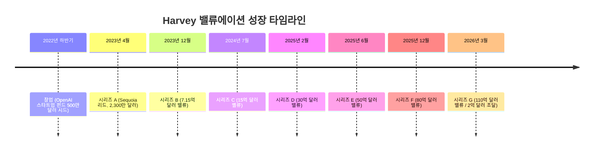

2023년 12월부터 2026년 3월까지, 약 2년 3개월 만에 기업가치가 **7.15억 달러에서 110억 달러로 약 15배** 성장했다. 더 놀라운 것은 ARR(연간 반복 매출)의 성장이다.

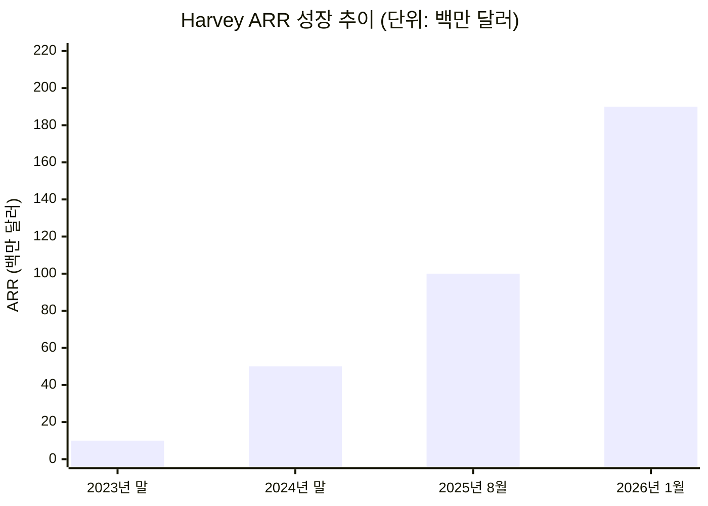

2023년 말 1,000만 달러였던 ARR이 2026년 1월 기준 **1억 9,000만 달러**에 도달했다. 불과 2년여 만에 19배 성장이다.

### 2-3. 고객 현황 (2026년 3월 기준)

Harvey의 고객 구성은 그 자체로 법률 AI 생태계의 현주소를 보여준다.

| 구분 | 수치 |
|---|---|
| 총 사용 변호사 수 | 10만 명 이상 |
| 고객 조직 수 | 1,300개 이상 |
| 진출 국가 | 60개국 |
| 운영 중인 맞춤형 AI 에이전트 | 2만 5,000개 이상 |
| AmLaw 100 로펌 중 고객사 비율 | 과반수 |
| 사내 법무팀 고객 수 | 500개 이상 |
| 자산운용사 고객 수 | 50개 |
| 누적 투자금 | 10억 달러 이상 |

주요 고객으로는 **HSBC, NBCUniversal, DLA Piper International, McCann Fitzgerald** 등이 있으며, 한국의 경우 **법무법인 세종**이 Harvey를 도입해 해외 자문 업무 중심으로 시범 적용을 진행 중이다.

### 2-4. 투자자 구성 및 시각

Harvey의 투자자 라인업은 실리콘밸리 최정상급이다. **Sequoia Capital, Andreessen Horowitz, Kleiner Perkins, Coatue, GIC(싱가포르 국부펀드), OpenAI 스타트업 펀드, Elad Gil, Conviction Partners** 등이 참여하고 있다.

특히 Sequoia는 Harvey의 라운드를 무려 **세 차례** 리드했다. Sequoia 파트너 팻 그레이디(Pat Grady)는 Harvey를 가리켜 "클라우드 전환기에 Salesforce가 했던 역할을, AI 전환기에 Harvey가 하고 있다"고 평가했다. Salesforce가 클라우드를 발명하지 않았지만 그것을 기업이 실제로 쓸 수 있는 형태로 만들어낸 것처럼, Harvey 역시 LLM을 발명하지 않았지만 법률 현장에서 실제로 작동하는 형태로 전환하는 데 성공했다는 의미다.

---

## 3. 법률 산업이 AI에 유독 빠르게 반응하는 이유

### 3-1. AI 도입률의 극적 반전

법률은 전통적으로 디지털 전환이 가장 느린 산업 중 하나였다. 보안과 기밀 유지에 대한 기준이 엄격하고, 실수의 대가가 크기 때문이다. 그런데 지금 이 산업이 AI를 가장 빠르게 흡수하고 있다.

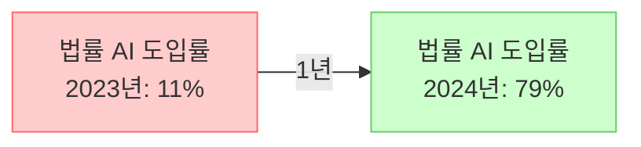

캐나다 리걸테크 기업 Clio의 보고에 따르면, 2023년까지 11%에 불과했던 법률 전문가의 AI 도입률이 2024년에 **79%로 급등**했다. 단 1년 만에 7배 이상의 도약이다. 이런 속도는 어떤 다른 전문 서비스 산업에서도 찾아보기 어렵다.

### 3-2. 세 가지 구조적 이유

법률 산업이 AI를 유독 빠르게 흡수하는 이유는 기술의 우수성 때문이 아니라, 이 산업의 **구조적 특성**이 AI와 완벽하게 맞아떨어지기 때문이다.

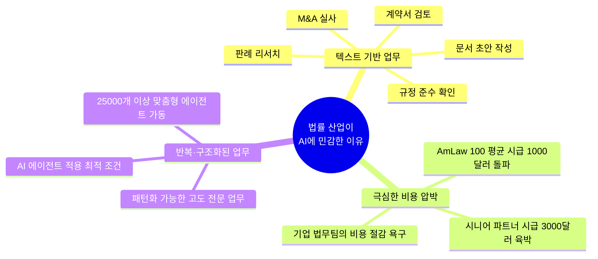

**첫 번째 이유: 텍스트 기반 업무의 압도적 비중**

법률 업무의 본질은 텍스트다. M&A 실사, 계약서 검토, 판례 리서치, 규정 준수 확인 — 이 모든 작업이 방대한 문서를 읽고, 분석하고, 작성하는 일이다. 이것은 대규모 언어 모델(LLM)이 가장 잘하는 영역과 정확히 겹친다. 텍스트 이해와 생성이라는 AI의 핵심 역량이 법률 업무의 핵심 역량과 동일한 것이다.

**두 번째 이유: 극심한 비용 압박**

2025년 기준, AmLaw 100 로펌의 평균 시간당 청구 단가가 **1,000달러를 돌파**했다. 일부 시니어 파트너의 시급은 3,000달러에 육박한다. 기업 법무팀 입장에서는 연간 법무 비용이 수백억 원에 달하는 경우도 흔하다. 이 비용을 줄일 수 있는 수단이라면 뭐든 환영받을 수밖에 없다.

**세 번째 이유: 반복적이고 구조화된 업무의 대규모 존재**

법률 업무의 상당 부분은 높은 전문성이 필요하지만 패턴화가 가능하다. 계약서 초안 작성, 문서 검토, 실사 보고서 생성은 전문 지식이 있어야 하지만, 그 과정은 구조적으로 반복된다. AI 에이전트가 파고들기에 완벽한 조건이다.

### 3-3. 법률 기술 투자의 급증

Thomson Reuters와 조지타운 로스쿨이 공동 발간한 **2026 미국 법률 시장 보고서**에 따르면, 2025년 로펌의 기술 투자 지출은 전년 대비 **9.7% 증가**했다. 이는 법률 산업 역사상 가장 빠른 기술 투자 성장률이다.

---

## 4. 빌러블 아워란 무엇인가

### 4-1. 개념과 역사

**빌러블 아워(Billable Hour)** 란 변호사가 고객을 위해 일한 시간을 기록하고, 그 시간에 시간당 단가를 곱해 청구하는 방식이다. 1950년대에 미국에서 표준화된 이 모델은, 법률 서비스의 가치를 측정하는 가장 간단하고 명확한 방법으로 100년 가까이 법률 산업의 근간이 되어 왔다.

이 모델은 단순하고 예측 가능하다는 장점이 있다. 변호사의 보상이 투명하게 연결되고, 로펌의 매출 예측이 용이하다. 그러나 구조적 결함이 있다. **효율성을 보상하지 않으며, 오히려 느릴수록 더 많은 돈을 버는 역인센티브가 내재되어 있다.**

### 4-2. 레버리지 모델과의 연결

전통적인 로펌의 수익 구조는 **레버리지 모델(Leverage Model)** 에 기반한다. 소수의 시니어 파트너 아래에 다수의 주니어 어소시에이트를 두고, 어소시에이트의 빌러블 아워에서 마진을 창출하는 구조다.

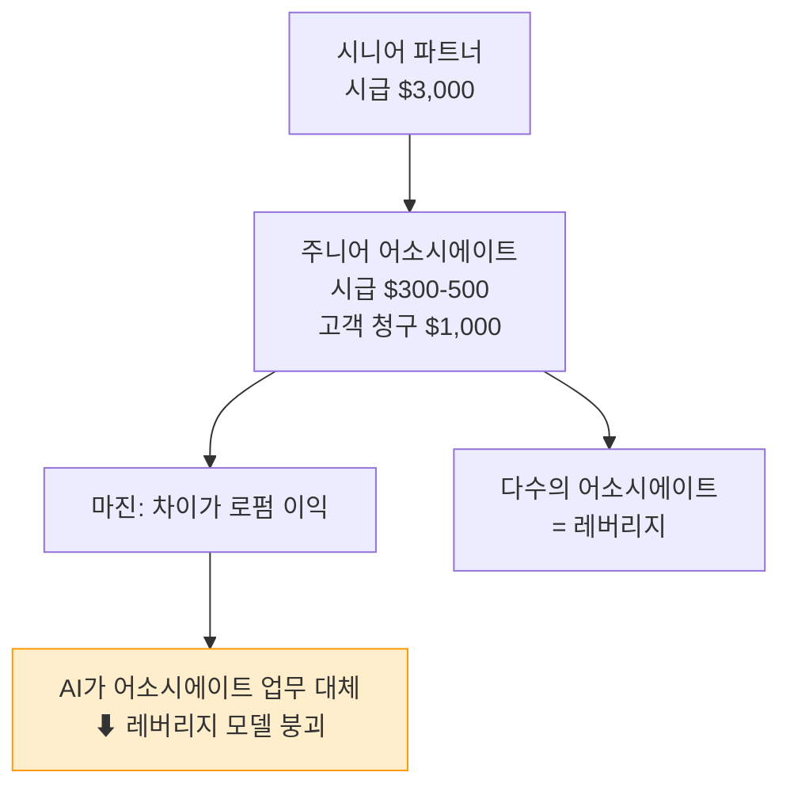

Harvey가 주니어 어소시에이트의 업무를 AI 에이전트로 대체하기 시작하면, 로펌의 레버리지 모델은 직접적인 타격을 받는다. 어소시에이트가 하루에 8시간씩 청구하던 문서 검토 작업을 Harvey가 30분에 처리한다면, 그 차액은 어디로 가는가? 로펌이 가져갈 수 없고, 고객에게 돌려줘야 한다.

---

## 5. 생산성-수익 역설

### 5-1. 딜레마의 구조

Harvey 같은 법률 AI의 급성장이 만들어내는 진짜 긴장은 기술 자체가 아니라 **비즈니스 모델**에 있다.

AI가 업무 시간을 획기적으로 줄이면, 빌러블 아워 모델에서는 매출이 줄어든다. 어소시에이트의 시급을 올려 같은 매출을 유지하려 해도, 고객이 받아들이지 않는다. 이것이 Thomson Reuters 보고서가 명명한 **"생산성-수익 역설(Productivity-Profit Paradox)"** 이다.

구체적인 수치로 들여다보면 이 딜레마가 더욱 선명하다.

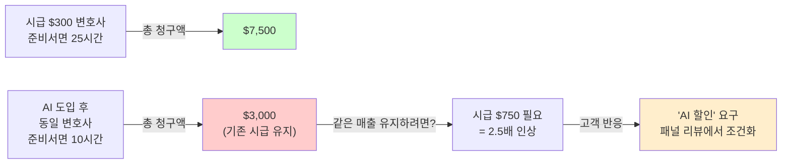

### 5-2. 수치로 보는 자동화 위협

2025 Legal Trends Report에 따르면 로펌의 시간당 청구 업무 중 **74%가 자동화에 노출**되어 있다. 이것은 주변부 업무가 아니다. 로펌 매출의 핵심을 구성하는 업무들이 대규모로 AI 대체 가능 영역에 들어가 있다는 뜻이다.

또한 AI가 NDA 초안 작성 시간을 최대 **70% 단축**한다는 벤치마크가 나오면서, 기업 법무팀들은 2026년 로펌 선정(패널 리뷰) 과정에서 **'AI 할인(AI discount)'**을 공식 요구하기 시작했다. 이제 'AI를 쓰느냐'가 아니라 'AI를 쓴 만큼 왜 할인을 안 해주느냐'를 묻는 시대가 됐다.

기업 법무 책임자(GC, General Counsel)들은 AI 기반 청구서 감사 도구를 도입해, 자동화된 워크플로우와 맞지 않는 시간 청구를 걸러내고 있다. 변호사가 AI로 30분에 끝낸 일을 5시간으로 청구하면, 이제는 알아볼 수 있게 된 것이다.

### 5-3. ABA 윤리 규정과의 충돌

미국 변호사협회(ABA) 모델 규칙 1.5는 법률 수임료가 "합리적(reasonable)"이어야 한다고 규정하고 있다. 수십 년간 로펌은 '더 많은 시간 = 더 많은 정당성'이라는 논리로 이 기준을 충족해왔다. 그러나 생성형 AI가 이 가정을 깨뜨리고 있다. AI로 30분에 끝낼 수 있는 연구 작업을 주니어 어소시에이트가 이틀 동안 한 것처럼 청구하는 것이 '합리적'인가? 법원과 기업 법무팀이 이 질문을 점점 더 적극적으로 던지고 있다.

---

## 6. Harvey의 진짜 해자

### 6-1. 기술이 해자가 될 수 없는 이유

Harvey의 기업가치 110억 달러에는 거품 논쟁의 여지가 있다. ARR 1억 9,000만 달러 기준 매출 대비 밸류에이션 배수는 **약 58배**다. SaaS 기업 기준으로도 상당히 공격적인 숫자다.

그러나 Harvey가 쓰는 기술 — LLM 자체 — 은 해자가 될 수 없다. OpenAI, Anthropic, Google이 범용 모델을 계속 개선하고 있기 때문이다. 실제로 Legora는 주력 모델로 **Anthropic의 Claude**를 사용하고 있고, Harvey도 복수의 파운데이션 모델을 활용한다. LLM 기술 자체는 범용화되고 있으며, 이를 무기로 삼을 수 없다.

### 6-2. 진짜 해자: 임베디드 GTM 전략

Harvey의 진짜 경쟁 우위는 **고객 내부에 심어둔 법률 엔지니어 조직**이다.

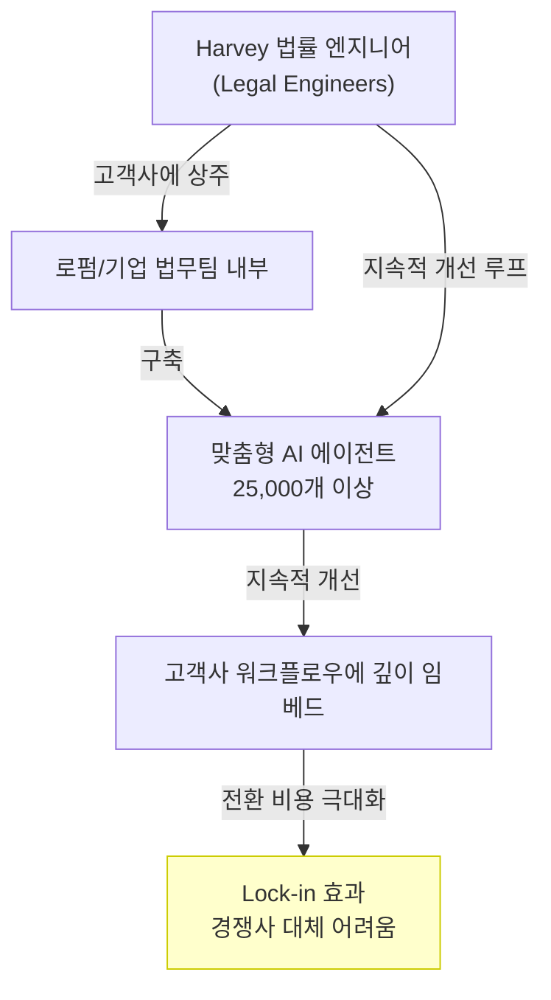

Harvey는 고객사 법무팀 안에 자사 엔지니어를 상주시키면서, 그 팀만을 위한 맞춤형 에이전트를 만들고 지속적으로 개선한다. 이것이 전형적인 **'임베디드 GTM(Go-To-Market)' 전략**이다. 한번 들어가면 빼기 어려운 구조를 만드는 것이다. Salesforce CRM이 기업 내부에 깊숙이 들어가 대체하기 어려워지는 것과 같은 원리다.

이번 시리즈 G 투자금 2억 달러의 사용처가 이를 명확히 보여준다. **"AI 에이전트 확장"과 "임베디드 법률 엔지니어링 팀 글로벌 확대"**가 핵심 용도다. 기술 투자가 아니라 사람과 조직 투자다.

### 6-3. 진짜 경쟁자는 누구인가?

흥미롭게도, Harvey의 진짜 경쟁자는 다른 리걸테크 스타트업이 아니다. Harvey CEO 윈스턴 와인버그는 "우리를 Legora와 비교하는 사람들이 있는데, 실제로 우리는 30개 이상의 다양한 솔루션과 경쟁한다"고 말했다. 그러나 가장 근본적인 차원에서 Harvey가 대체하고 있는 것은 **AmLaw 100 로펌의 시간당 1,000달러짜리 주니어 어소시에이트**다.

Harvey가 어소시에이트의 업무를 AI 에이전트로 대체할수록, 로펌의 전통적 레버리지 모델이 더 큰 압력을 받는다. 그리고 그 압력의 수혜자는 Harvey이면서 동시에 Harvey 고객인 기업 법무팀이기도 하다.

---

## 7. 경쟁 구도

### 7-1. 리걸테크 AI 시장의 양강 구도

2026년 현재, 법률 AI 시장에는 두 개의 거대한 선두주자가 형성되어 있다.

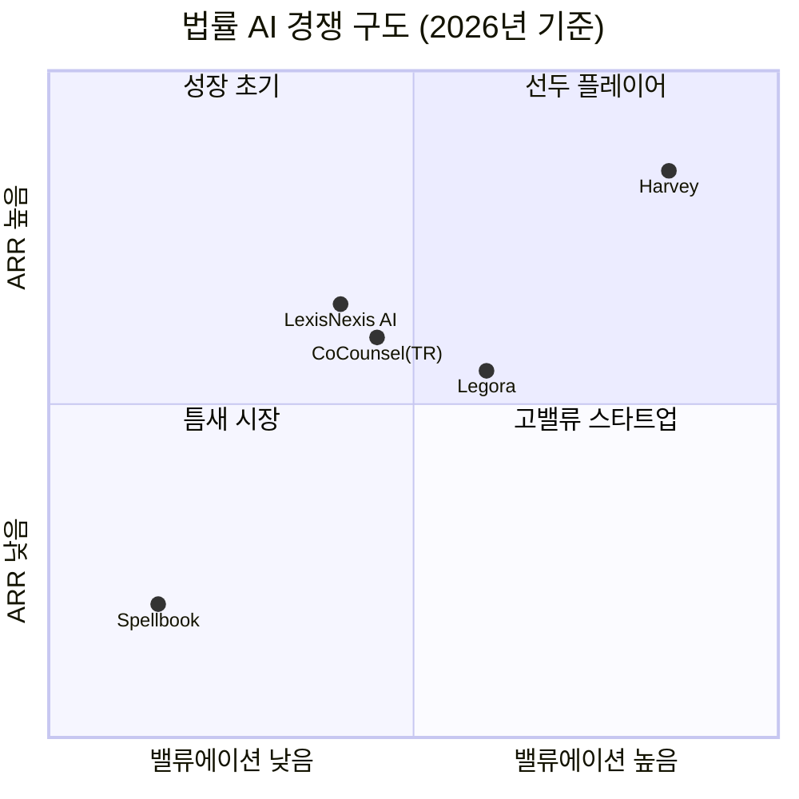

**Harvey (미국, 2022년 창업)**
- 밸류에이션: 110억 달러
- ARR: 1억 9,000만 달러 이상 (2026년 1월 기준)
- 주요 투자자: Sequoia, a16z, Kleiner Perkins, Coatue, GIC
- 강점: 미국 시장 깊은 침투, 임베디드 GTM, 가장 큰 고객 기반

**Legora (스웨덴, 2023년 창업)**
- 밸류에이션: 55억 달러
- ARR: 약 1억 달러 추정
- 주요 투자자: Accel, Benchmark, Bessemer, General Catalyst, ICONIQ
- 강점: 유럽 시장 강세, 더 빠른 성장률, 주력 모델로 Claude 활용
- 특징: 스톡홀름경제대 출신 26세 창업자 막스 유네스트란드(Max Junestrand) 주도

Harvey가 ARR 기준으로 Legora의 약 2배 규모이지만, Legora가 더 빠르게 성장하고 있다는 것이 투자자들의 공통된 평가다. 두 회사는 최근 투자 유치 발표를 거의 동시에 냈다 — Harvey가 110억 달러 라운드를 발표하기 직전, Legora가 55억 달러 밸류에서 5억 5,000만 달러를 조달했다.

### 7-2. 기존 강자들의 반격

기존 법률 정보 플랫폼들도 가만히 있지 않는다.

- **Thomson Reuters**: 2023년 케이스텍스트(Casetext)를 **6억 5,000만 달러**에 인수하며 AI 전환 가속화
- **LexisNexis**: 자체 AI 기능을 기존 플랫폼에 빠르게 통합
- **Wolters Kluwer**: 법률 특화 AI 서비스 출시
- **Microsoft**: Copilot for Legal 등 기존 엔터프라이즈 생태계 활용

마켓앤마켓에 따르면 법률 AI 소프트웨어 시장은 2025년 31억 달러에서 **2030년 108억 달러**로 연평균 28.3% 성장할 전망이다. 2026년 기준 전체 리걸테크 시장은 약 **965억 달러(약 141조 원)** 규모다.

### 7-3. 파운데이션 모델의 위협

가장 근본적인 위협은 OpenAI와 Anthropic으로부터 올 수 있다. Harvey와 Legora 모두 이들의 모델 위에 구축되어 있기 때문이다. OpenAI가 기업향 GPT-4o에 법률 특화 기능을 추가하거나, Anthropic이 Claude 기반 법률 솔루션을 직접 출시한다면? 이것이 일각에서 Harvey와 Legora를 "AI 래퍼(wrapper)" 기업이라고 부르며 장기 지속성에 의문을 제기하는 이유다.

Harvey는 이에 대해 임베디드 조직과 25,000개의 맞춤형 에이전트가 쌓아온 고객 데이터와 워크플로우 통합이 진짜 해자라고 답한다.

---

## 8. 가치 기반 과금으로의 전환

### 8-1. AFA(대안적 수임 구조)의 부상

빌러블 아워의 균열을 메우는 새로운 모델이 부상하고 있다. **AFA(Alternative Fee Arrangement, 대안적 수임 구조)** 다.

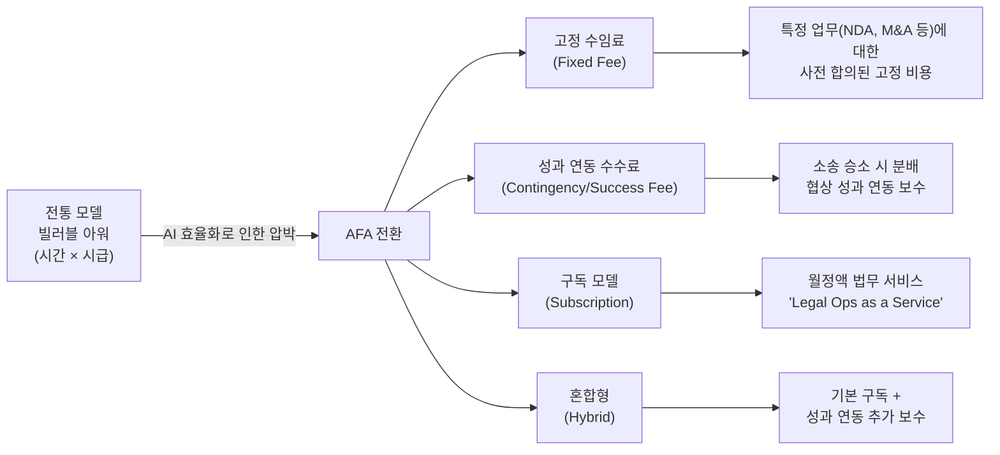

2026년 1분기 ABA 조사에 따르면, AmLaw 100 로펌의 **38%**가 적어도 한 개 실무 분야에서 AFA를 시범 운영하고 있다 (2022년 22%에서 급증). 중소형 로펌에서는 정형 업무(NDA, 법인 설립 등)의 **41%**가 이미 고정 수임료로 전환됐다. 소송·지식재산 분야 성과 연동 수수료는 전년 대비 29% 성장했다.

일부 분석가들은 AFA의 비중이 2023년 로펌 매출의 20%에서 조만간 **70% 이상**으로 올라갈 것이라 전망하고 있다.

### 8-2. 가치 기반 과금의 구조적 어려움

가치 기반 과금(VBP)으로의 전환이 말처럼 쉽지 않은 이유가 있다. 전통적인 빌러블 아워 모델에서는 스코프 관리가 느슨해도 됐다 — 일이 많아지면 청구가 늘면 그만이었다. 그러나 고정 수임료 모델에서는 스코프를 명확히 정의하고, 가정(assumption)을 구체화하고, 단계별 산출물을 명시해야 한다. 이것은 법무 운영의 근본적인 체질 변화를 요구한다.

컬럼비아 비즈니스 스쿨 교수 리타 맥그래스(Rita McGrath)는 이 전환을 이렇게 표현했다. "한때 어렵고 복잡했던 것이 쉬워지고, 한때 비싸고 접근하기 어려웠던 것이 저렴하고 접근 가능해지는 순간, 기존 산업의 기반이 흔들린다." AI는 법률 서비스에서 정확히 이 순간을 앞당기고 있다.

### 8-3. Harvey가 플랫폼을 자처하는 이유

Harvey CEO 윈스턴 와인버그의 발언이 이 전환의 방향을 잘 보여준다. **"AI는 더 이상 변호사를 돕는 게 아니라, 법률 업무가 수행되는 시스템 그 자체가 되고 있습니다."**

이 문장이 중요하다. Harvey는 보조 도구가 아니라, 법무 워크플로우가 실행되는 **인프라 플랫폼**이 되려 한다. 플랫폼이 되면, 과금 방식도 바뀐다. 시간당이 아니라 에이전트 실행 횟수, 처리 문서량, 또는 구독 기반으로 전환할 수 있다. 이것이 Harvey의 장기 비즈니스 모델이 될 것으로 예상된다.

---

## 9. 한국 리걸테크 시장에 주는 시사점

### 9-1. 한국의 리걸테크 현황

한국에는 이미 여러 리걸테크 스타트업이 존재한다.

- **로톡(LawTalk)**: 법률 플랫폼 선두주자. 변호사 매칭, 법률 정보 제공
- **엘박스(LBox)**: 판례 데이터베이스 및 법률 리서치 플랫폼
- **BHSN / 앨리비**: 'AI 계약 리뷰' 상용화, 법무법인 율촌과 협력해 폐쇄형 법률 AI '아이율' 구축 (2026년 1월 완료)
- **법무법인 세종**: Harvey 도입, 해외 자문 업무 시범 적용 중

국내 법조계도 Harvey의 도전에 서서히 눈을 뜨고 있지만, 아직은 실험 단계에 머물러 있다. 변호사 비밀유지 의무, 개인정보보호법, 국내 판례 데이터의 디지털화 수준 등 진입 장벽이 상존한다.

### 9-2. Harvey에서 배울 세 가지 교훈

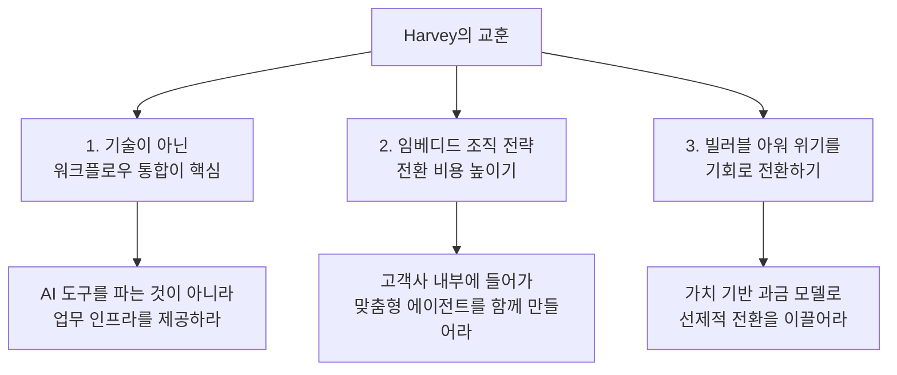

**교훈 1: 기술보다 워크플로우 통합**

Harvey가 성공한 것은 더 나은 LLM을 만들어서가 아니다. 법무 워크플로우 자체를 AI로 재설계하고, 그 안에 자신들이 핵심 인프라로 들어갔기 때문이다. 한국 리걸테크도 "AI 기능을 추가한 법률 도구"가 아니라 "법률 업무가 실행되는 플랫폼"을 지향해야 한다.

**교훈 2: 임베디드 조직 전략**

Harvey는 법률 엔지니어를 고객사에 상주시켜 맞춤형 에이전트를 만든다. 이 전략은 전환 비용을 높이는 동시에, 고객 데이터로부터 지속적으로 학습할 수 있는 기회를 준다. 한국의 주요 로펌이나 기업 법무팀과 이런 깊은 협력 관계를 구축하는 것이 중요하다.

**교훈 3: 과금 모델 전환의 선도**

한국 법조계도 빌러블 아워에 의존하는 구조다. AI 효율화로 인한 압박이 글로벌과 동일하게 적용된다. 이 전환기에 가치 기반 과금 모델을 먼저 제안하고 설계하는 리걸테크 기업이 차별적 지위를 가질 수 있다.

---

## 10. 모든 전문 서비스 산업으로의 확장

### 10-1. 법률이 선두에 서는 이유

법률 산업이 AI 충격을 가장 먼저, 가장 극적으로 경험하는 것은 우연이 아니다. 텍스트 기반, 극심한 비용 압박, 패턴화 가능한 반복 업무 — 이 세 가지 조건이 동시에 충족되는 산업이기 때문이다.

그러나 이 조건은 법률만의 것이 아니다.

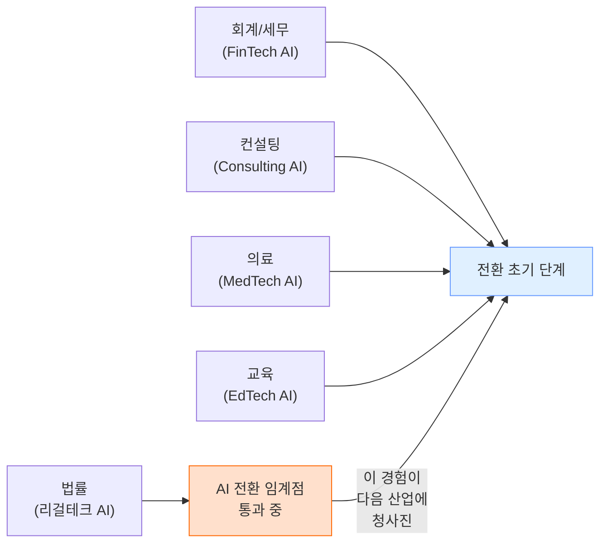

**회계·세무** 산업도 빌러블 아워 구조를 가지고 있으며, 세무 신고와 감사의 상당 부분이 텍스트와 숫자 처리다. **컨설팅** 역시 시간 기반 과금을 하며, 보고서 작성과 데이터 분석은 AI가 빠르게 잠식하고 있다. **의료**에서는 진단 보조, 의무기록 분석, 약물 상호작용 검토 등이 LLM의 영역으로 들어오고 있다.

### 10-2. 모든 전문 서비스 산업이 맞닥뜨릴 질문

법률 산업에서 벌어지고 있는 이 전환은, 모든 전문 서비스 산업이 곧 맞닥뜨릴 근본적인 질문이기도 하다.

> **"시간을 파는 사업에서, AI가 시간을 줄여버리면 무엇을 팔 것인가?"**

이 질문에 대한 가능한 답들:

1. **전문적 판단(Judgment)을 판다** — AI가 할 수 없는 전략적 의사결정, 윤리적 판단, 복잡한 협상
2. **결과(Outcome)를 판다** — 업무 과정이 아니라 달성된 성과에 가격을 매긴다
3. **플랫폼(Platform)을 판다** — AI 워크플로우가 실행되는 인프라 자체를 구독 모델로 공급한다
4. **관계(Relationship)를 판다** — 클라이언트와의 신뢰, 맥락 이해, 장기적 파트너십

Harvey가 택한 것은 세 번째와 네 번째의 결합이다. 임베디드 조직 전략이 관계이고, AI 에이전트 플랫폼이 인프라다.

---

## 11. 종합 정리 및 핵심 인사이트

### 11-1. 핵심 요약

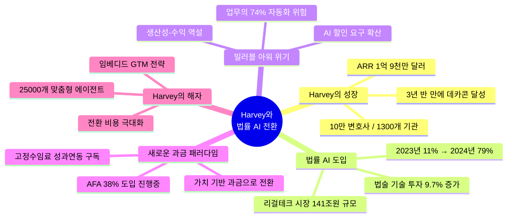

### 11-2. 세 가지 핵심 인사이트

**인사이트 1: 이것은 스타트업 성공담이 아니라 산업 구조 전환의 신호다**

Harvey의 데카콘 달성은 한 스타트업이 잘 만든 결과가 아니다. 1조 달러 규모의 법률 산업이 AI 전환의 임계점을 지나고 있다는 증거다. 비효율이 매출이었던 산업에서 효율화 도구가 들어왔을 때 벌어지는 일을 법률 산업이 가장 먼저, 가장 극적으로 보여주고 있다.

**인사이트 2: 진짜 긴장은 기술이 아니라 비즈니스 모델에 있다**

빌러블 아워라는 100년 된 수익 모델이 AI 효율성과 구조적으로 충돌하고 있다. AI를 도입하면 효율은 올라가지만 매출은 줄어드는 역설. 이 딜레마를 해결하는 방향은 가치 기반 과금으로의 전환이며, 이것이 로펌의 체질을 근본적으로 바꿀 것이다.

**인사이트 3: 해자는 기술이 아니라 조직과 관계에 있다**

Harvey의 경쟁 우위는 LLM 기술이 아니라 고객 내부에 임베드된 법률 엔지니어 조직과 25,000개의 맞춤형 에이전트다. 이 전략이 통한다면, Harvey는 법률 산업의 AI 인프라 표준을 정의하게 된다. 기술 우위는 금방 따라잡히지만, 조직 깊숙이 들어간 플랫폼은 대체하기 어렵다.

### 11-3. 마지막으로

법률 산업에서 벌어지고 있는 일은 이 하나의 산업으로 끝나지 않는다. 회계, 컨설팅, 의료, 교육 — 모든 전문 서비스 산업이 같은 질문을 마주할 것이다.

"**시간을 파는 사업에서, AI가 시간을 줄여버리면 무엇을 팔 것인가?**"

이 질문에 답을 가장 먼저, 가장 명확하게 찾는 산업이 이 시대의 새로운 기준을 만들 것이다. 그 실험이 지금 법률 산업에서 진행되고 있다. 우리는 그 실험의 결과를 눈앞에서 목격하고 있다.

---

## 참고 자료

| 출처 | 내용 |
|---|---|
| CNBC (2026.3.25) | Harvey $200M 투자 유치, $11B 밸류에이션 보도 |
| Harvey 공식 블로그 (2026.3.25) | 시리즈 G 공식 발표문 |
| Thomson Reuters & Georgetown Law (2026.1) | 2026 미국 법률 시장 보고서 |
| Above the Law (2026.1.16) | 빌러블 아워의 구조적 한계와 가치 기반 과금 전환 |
| TechCrunch (2025.12.4) | Harvey $8B 밸류에이션 확인 기사 |
| Newcomer (2026.3) | Harvey vs Legora 경쟁 구도 분석 |
| Tallenxis (2026.1.27) | 2026 법률 청구 모델 변화 분석 |
| ZDNet Korea (2026.2.18) | 한국 리걸테크 시장 현황 |
| Wikipedia: Harvey (software) | Harvey 역사 및 투자 라운드 정리 |
| Clio Legal Trends Report (2024/2025) | 법률 AI 도입률 데이터 |

---

*작성 일자: 2026-04-19*
