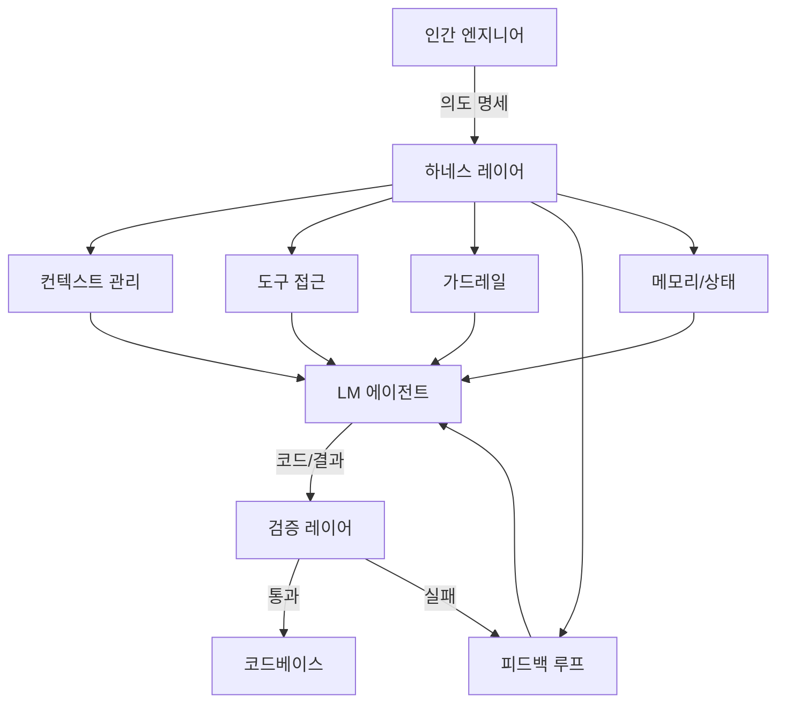
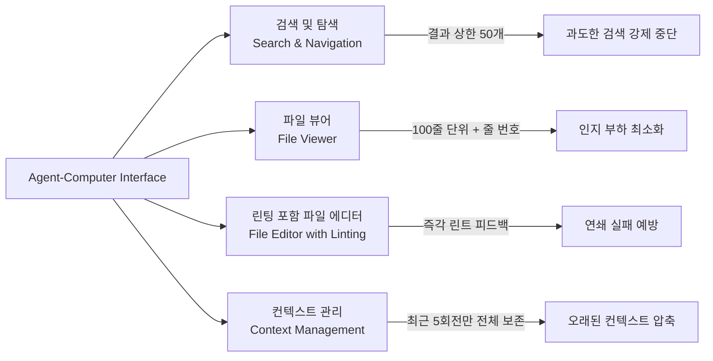
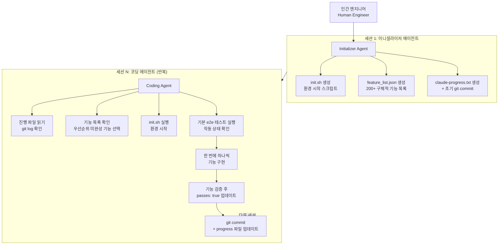
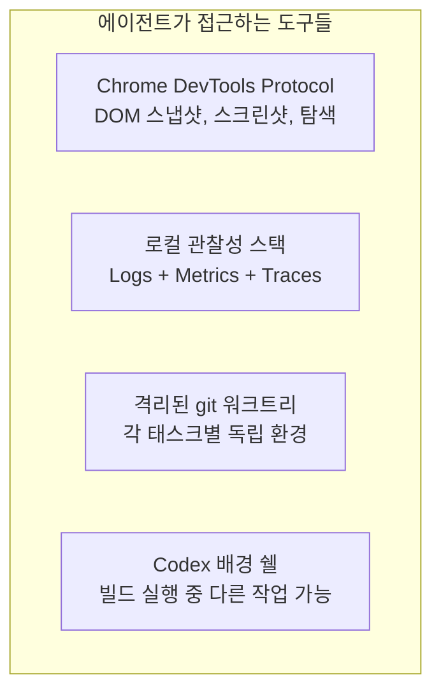
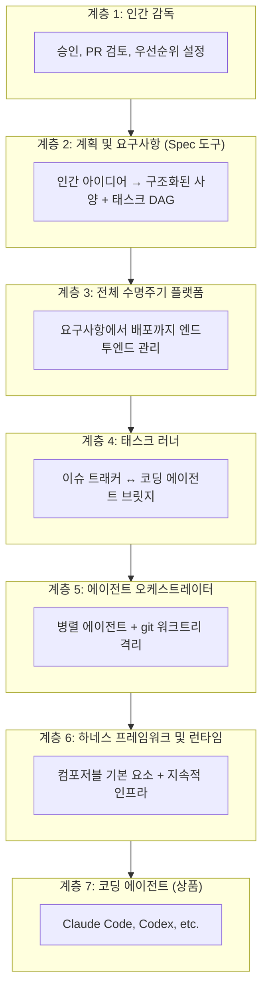
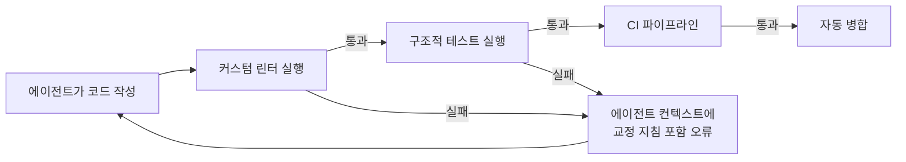
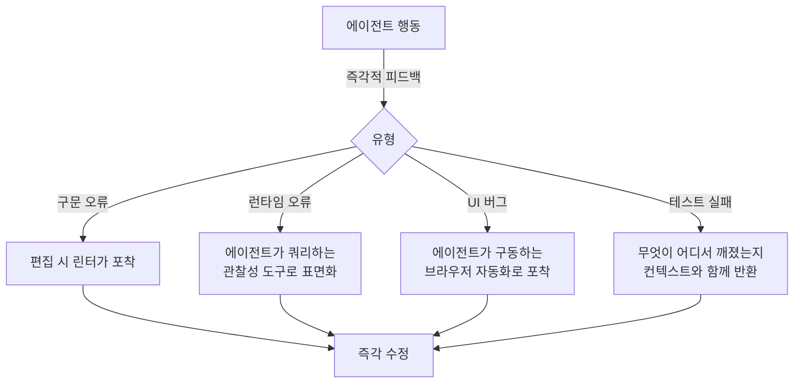

> **원문 출처**: Rohit ([@rohit4verse](https://x.com/rohit4verse/status/2033945654377283643)), 2026년 3월 18일  
> **관련 인물**: Ryan Lopopolo (OpenAI Staff Engineer)  
> **핵심 주제**: Cursor, Claude Code, Perplexity, OpenAI Codex가 실제로 무엇을 만들었는가

---

>OpenAI staff engineer Ryan Lopopolo banned his team from touching their editors.
>
>his thesis: code is free. context, guardrails, and feedback loops are the moat.
>
>I wrote 8,000 words on how to build that harness. this is the playbook.
>
> [https://x.com/rohit4verse/status/2045569399990501413](https://x.com/rohit4verse/status/2045569399990501413?s=20)

## 관련영상

[**Harness Engineering: How to Build Software When Humans Steer, Agents Execute — Ryan Lopopolo, OpenAI**](https://www.youtube.com/watch?v=am_oeAoUhew)

## 목차

1. [핵심 명제: 모델이 아니라 환경이다](#1-핵심-명제-모델이-아니라-환경이다)
2. [하네스란 무엇인가 — 정확한 정의](#2-하네스란-무엇인가--정확한-정의)
3. [SWE-agent와 ACI의 탄생](#3-swe-agent와-aci의-탄생)
4. [Anthropic의 하네스 엔지니어링 — 장기 실행 에이전트 문제](#4-anthropic의-하네스-엔지니어링--장기-실행-에이전트-문제)
5. [OpenAI의 하네스 엔지니어링 — 수동 코드 0줄 실험](#5-openai의-하네스-엔지니어링--수동-코드-0줄-실험)
6. [에이전트 하네스 생태계 분류 체계](#6-에이전트-하네스-생태계-분류-체계)
7. [반복되는 설계 패턴 5가지](#7-반복되는-설계-패턴-5가지)
8. [엔지니어에게 실질적으로 의미하는 것](#8-엔지니어에게-실질적으로-의미하는-것)
9. [최소 하네스 구축 가이드](#9-최소-하네스-구축-가이드)
10. [2026년 현재 업계 동향 업데이트](#10-2026년-현재-업계-동향-업데이트)

---

## 1. 핵심 명제: 모델이 아니라 환경이다

### 1.1 왜 어떤 팀은 3명이 100만 줄을 만드는가

엔지니어 3명이 100만 줄의 코드를 작성하고, 1,500개의 Pull Request를 병합하고, 하루 평균 3.5 PR/인을 기록하는 일이 실제로 일어났다. 이것은 AI 모델 선택의 문제가 아니었다. GPT-5 대 Claude Opus를 비교한 결과도 아니었다. temperature 설정이나 max\_tokens 조정의 결과도 아니었다. 심지어 프롬프트의 문제도 아니었다 — 비록 많은 팀들이 프롬프트 논쟁에 수개월을 허비하지만.

그 차이는 **하네스(harness)** 였다.

이 한 단어가 2025~2026년 응용 AI 엔지니어링의 핵심 통찰로 자리 잡았다. 그리고 이 문서는 그 말이 기술적으로, 철학적으로 정확히 무엇을 의미하는지를 심층적으로 다룬다.

### 1.2 순수 역량만으로는 충분하지 않은 이유

2024년 중반, AI 벤치마크 연구자들은 이상한 현상을 목격했다. 동일한 최첨단 모델이 동일한 코딩 태스크에서 완전히 다른 결과를 냈다 — 태스크 제시 방식과 제공 도구에 따라서만. 모델 자체는 변하지 않았다. 내부 지능도 변하지 않았다. 달라진 건 **인터페이스**였다.

이것은 놀라운 일이 아니어야 했다. 우리는 수십 년 동안 올바른 도구가 엔지니어의 생산성을 극적으로 향상시킨다는 것을 알고 있었다. 현대 IDE, 디버거, 버전 관리, CI/CD 파이프라인을 갖춘 소프트웨어 개발자는 텍스트 에디터만 있는 터미널에서 작업하는 동일한 개발자보다 몇 자릿수 더 효과적이다. IDE는 개발자를 더 스마트하게 만들지 않는다. 마찰을 제거하고, 적절한 순간에 정보를 표면화하고, 오류를 조기에 포착하고, 작업을 탐색 가능한 단위로 구조화한다.

언어 모델도 마찬가지다. 언어 모델은 무한한 내부 지식 기반에서 작동하는 범용 추론기가 아니다. 컨텍스트 윈도우의 토큰을 처리하는 정교한 패턴 매칭 엔진이다. 주어진 순간에 모델이 아는 모든 것은 그 컨텍스트 윈도우에 있는 내용에 의해 결정되며, 모델이 생성하는 모든 것은 그 컨텍스트의 구조에 따라 조건화된다.

> **핵심 통찰**: LM 에이전트에게 인터페이스는 편의 레이어가 아니다. **인터페이스가 곧 마음(mind)이다.**

---

## 2. 하네스란 무엇인가 — 정확한 정의

### 2.1 하네스의 잘못된 정의들

업계는 이 단어를 느슨하게 사용하는 나쁜 습관이 생겼다. 하네스는 다음이 **아니다**:

- 시스템 프롬프트
- API 호출 주변의 래퍼(wrapper)
- eval 프레임워크
- 프롬프트 템플릿
- 메모리가 있는 챗봇

### 2.2 하네스의 정확한 정의

하네스는 **언어 모델이 작동하는 완전한 설계 환경(complete designed environment)** 이다. 여기에는 다음이 포함된다:

```
하네스 = 
  호출 가능한 도구 집합
  + 정보 수신 형식
  + 히스토리 압축 및 관리 방법
  + 실수가 연쇄되기 전에 포착하는 가드레일
  + 작업을 미래의 자신에게 일관성을 잃지 않고 
    넘겨줄 수 있게 하는 스캐폴딩
```



---

## 3. SWE-agent와 ACI의 탄생

### 3.1 프린스턴 NLP 그룹의 핵심 발견

Princeton NLP 그룹이 2024년 발표한 SWE-agent 논문은 응용 AI 엔지니어링의 랜드마크가 되었다. 이 논문은 **Agent-Computer Interface (ACI)** 개념을 도입하고, 신중하게 설계된 ACI가 표준 Linux 쉘을 통해 동일한 모델과 상호작용하는 것에 비해 **벤치마크 성능을 64% 상대적으로 향상**시킬 수 있음을 보여줬다.

동일한 모델. 동일한 태스크. 동일한 컴퓨팅 예산. 유일한 변수는 인터페이스였다.

**64%는 미미한 향상이 아니다.** 이는 작동하는 도구와 작동하지 않는 도구의 차이다. 그리고 그것은 기반 모델의 개선 없이 순전히 환경 설계에서 나왔다.

구체적인 수치를 보면, GPT-4를 표준 bash 쉘 인터페이스와 함께 사용했을 때 시스템은 SWE-bench 이슈의 **3.97%** 를 해결했다. 목적 맞춤형 ACI를 사용했을 때는 **12.47%** 를 해결했다.

### 3.2 컨텍스트 윈도우 = RAM이 아니다

컨텍스트 윈도우에 대한 순진한 멘탈 모델은 그것을 RAM처럼 취급한다. 데이터를 로드하고, 모델이 처리하고, 출력을 얻는다. 더 많은 컨텍스트 = 더 나은 성능. 더 긴 프롬프트 = 더 풍부한 이해. 이 멘탈 모델은 에이전트를 이것 위에 구축하면 망가지는 방식으로 **잘못됐다**.

컨텍스트 윈도우는 사실 주어진 세션에 대한 에이전트의 전체 작업 의식(working consciousness)에 더 가깝다:

- 해당 윈도우의 모든 토큰은 계산 비용이 든다
- 모든 무관한 정보는 관련 정보와 주의(attention)를 경쟁한다
- 모델은 노이즈를 깨끗하게 무시하는 선택적 주의 메커니즘이 없다
- **노이즈는 방 안에 있으며, 추론에 영향을 미친다**

### 3.3 컨텍스트 플러딩 실패 모드

대규모 코드베이스에서 grep을 실행하고 에이전트 루프 내에서 1만 줄의 일치 결과를 반환할 때, 더 많은 정보를 제공한 것이 아니다. **에이전트의 작업 메모리를 무관한 데이터로 넘쳐나게 했으며**, 이는 컨텍스트가 지워질 때까지 이후의 모든 단계의 품질을 저하시킨다.

SWE-agent 연구자들은 이 실패 모드를 꼼꼼하게 문서화했다. 표준 bash 인터페이스는 에이전트가 쓰래시(thrash)하게 만들었다:

1. 수천 줄을 반환하는 grep 명령을 실행
2. 무엇을 찾고 있는지 잃어버림
3. 더 많은 grep 명령을 실행
4. 노이즈로 컨텍스트를 점진적으로 채움
5. 결국 잘못된 답을 만들거나 진행을 완전히 멈춤

### 3.4 ACI의 4가지 핵심 컴포넌트



#### (1) 검색 및 탐색

표준 grep과 find 명령을 목적 맞춤형 도구로 교체했다: `find_file`, `search_file`, `search_dir`. 핵심 차이는 문법이 아니었다. **출력 관리**였다. 결과는 50개로 제한됐다. 쿼리가 그 한계를 초과하면, 도구는 결과가 너무 많다는 메시지와 검색을 좁히라는 프롬프트를 반환했다.

이것이 사소하게 들릴 수도 있다. 실제로는 논문에서 가장 중요한 결정 중 하나였다. 결과가 너무 많다면 더 구체적으로 해야 한다 — 에이전트를 더 의도적이고 목표 지향적인 행동으로 밀어 넣는다.

#### (2) 파일 뷰어

연구자들은 여러 뷰어 구성을 테스트했고 **한 번에 100줄을 표시**하는 것이 황금 비율임을 발견했다:
- 적은 줄(30줄 테스트됨)은 에이전트가 주변 코드에 대한 컨텍스트를 잃고 편집 실수를 유발
- 더 많은 줄(전체 파일)은 에이전트가 위치를 잃고 중요한 세부 사항을 놓침

뷰어는 **상태 유지(stateful)** 였다. 상호작용 간에 파일 내 위치를 유지했다. 그리고 결정적으로, 모든 가시 줄에 명시적인 **줄 번호**를 앞에 붙였다. 이것이 단순히 미적인 것으로 보일 수 있지만, 에이전트가 줄을 세거나 산술을 수행하는 인지 작업을 제거하여 실제 문제 해결을 위한 용량을 확보했다.

#### (3) 린팅이 포함된 파일 에디터

편집 명령은 시작 줄, 끝 줄, 교체 텍스트를 단일 작업으로 받아들였다. 모든 편집 후 도구는 수정된 파일에서 **자동으로 린터를 실행**하고 결과를 보고했다. 편집이 구문 오류를 도입하면 편집이 적용되기 전에 거부됐다.

이것은 순진한 에이전트 구현에서 연쇄 실패를 유발하는 피드백 루프를 닫았다. 린터 없이는:

```
구문 오류 도입 → 관련 없어 보이는 테스트 실패 → 
잘못된 원인 추적 → 컨텍스트 윈도우 소진 → 실패
```

린터가 에디터에 직접 통합되면:

```
구문 오류 도입 → 즉각 거부 + 명확한 오류 메시지 → 
로컬에서 수정 → 계속 진행
```

#### (4) 컨텍스트 관리

에이전트가 태스크를 진행하면서, 히스토리가 더 이상 환경의 현재 상태를 반영하지 않는 오래된 관찰, 중간 상태, 탐색 단계로 채워진다. ACI의 컨텍스트 관리 시스템은 **최근 5회전 이전의 오래된 관찰을 단일 줄 요약으로 압축**했다.

---

## 4. Anthropic의 하네스 엔지니어링 — 장기 실행 에이전트 문제

### 4.1 컨텍스트 윈도우 경계가 어려운 이유

SWE-agent 논문은 단일 에이전트 세션을 위한 인터페이스 설계를 다루었다. Anthropic의 엔지니어링 팀은 Claude Agent SDK와 Claude Code 작업에서 다른 문제를 마주쳤다: **태스크가 단일 컨텍스트 윈도우에서 완료하기에 너무 큰 경우 어떻게 되는가?**

이것은 틈새 엣지 케이스가 아니다. 대부분의 실제 소프트웨어 프로젝트는 어떤 컨텍스트 윈도우에도 맞지 않는다. 프로덕션 웹 애플리케이션에는 수백 개의 파일, 수천 개의 함수, 테스트 스위트, 구성, 문서 및 종속성이 있다. 200K 토큰 컨텍스트 윈도우로도 전체 프로젝트를 동시에 마음에 담을 수 없다.

### 4.2 두 가지 특징적 실패 패턴

Anthropic의 내부 실험은 경계 모델(frontier coding model) Opus 4.5조차도 여러 컨텍스트 윈도우에 걸쳐 루프를 실행할 때 프로덕션 품질의 웹 앱을 고수준 프롬프트에서 구축하는 데 일관되게 실패한다는 것을 보여줬다.

실패는 두 가지 패턴에 집중됐다:

**실패 패턴 1: 한 번에 너무 많이 시도**

"claude.ai의 클론을 구축하라"와 같은 프롬프트를 받으면, 에이전트는 전체 애플리케이션을 한 번에 구현하려 했다. 어떤 것도 완성하거나 테스트하지 않고 기능을 계속 구현하다가, 구현 중간에 컨텍스트 윈도우가 소진됐다. 다음 세션은 반쯤 구현된 애플리케이션으로 시작했다 — 무엇이 완료됐는지, 코드 상태가 어떤지에 대한 문서 없이.

**실패 패턴 2: 너무 일찍 완료 선언**

일부 기능이 구축된 후, 이후 에이전트 인스턴스는 둘러보다가 진행이 이루어졌다고 결론 짓고 작업이 완료됐다고 선언했다. 이것은 어리석음이 아니었다. 불완전한 정보로부터의 합리적인 추론이었다. 에이전트는 이 프로젝트에 대해 "완료"가 실제로 무엇을 의미하는지 구조화된 방법으로 알 방법이 없었다.

두 실패 모두 공통 근본 원인을 공유한다: **에이전트는 컨텍스트 윈도우 경계를 넘어 살아남고 미래 세션을 안내할 수 있는 프로젝트 상태에 대한 지속적이고 구조화된 이해가 없었다.**

### 4.3 두 에이전트 아키텍처: 이니셜라이저와 코딩 에이전트

Anthropic의 해결책은 오랫동안 진지한 팀이 장기 실행 에이전트 작업에 접근하는 방법의 템플릿이 된 두 부분 아키텍처였다.



**이니셜라이저 에이전트**는 세 가지 핵심 출력을 만든다:

1. **`init.sh` 스크립트**: 개발 환경을 안정적으로 시작할 수 있다. 모든 후속 코딩 에이전트 세션이 시작하는 방법을 파악하는 데 토큰을 소비하는 대신 `init.sh`를 실행하여 시작할 수 있다. 모든 세션에서 그 오버헤드를 절약하는 것이 누적된다.

2. **기능 목록 파일**: Claude.ai 클론 실험에서 이는 200개 이상의 구체적인 엔드투엔드 기능 설명을 의미했다 — "사용자가 새 채팅을 열고, 쿼리를 입력하고, 엔터를 누르고, AI 응답을 볼 수 있다"와 같은. 모든 기능은 처음에 실패로 표시됐다. 이 파일은 프로젝트의 기본 진실(ground truth) 역할을 한다.

3. **`claude-progress.txt` + 초기 git commit**: 진행 파일은 에이전트가 매 세션 끝에 업데이트하는 사람이 읽을 수 있는 로그다. git 히스토리와 결합하여, 모든 미래 코딩 에이전트에게 컨텍스트 예산을 고고학에 소비하지 않고도 스스로를 방향 설정할 수 있는 빠른 방법을 제공한다.

### 4.4 기능 목록: 인지적 앵커

기능 목록은 특별한 주의를 받을 자격이 있는데, 과소평가하기 쉬운 문제를 해결하기 때문이다. 없다면, 복잡한 코드베이스에서 작동하는 에이전트는 코드 자체로부터 프로젝트 완전성을 추론해야 한다. 이 추론은 신뢰할 수 없다.

기능 목록은 완전성을 명시적이고 모호하지 않게 만든다. 각 기능에는 `passes` 필드가 있으며 `true` 또는 `false`다.

```json
{
  "category": "functional",
  "description": "새 채팅 버튼이 새로운 대화를 생성한다",
  "steps": [
    "메인 인터페이스로 이동",
    "'새 채팅' 버튼 클릭",
    "새 대화가 생성됐는지 확인",
    "채팅 영역이 환영 상태를 보여주는지 확인",
    "대화가 사이드바에 나타나는지 확인"
  ],
  "passes": false
}
```

Anthropic은 이 목록을 Markdown 대신 **JSON으로 저장**하기로 의도적으로 결정했다. 이유는 행동적이었다. 경험적으로, 모델은 Markdown 파일에 비해 JSON 파일을 부적절하게 수정하거나 덮어쓸 가능성이 적다. JSON은 수정에 저항하는 엄격한 구조를 가진다.

### 4.5 테스트: 아무도 말하기 싫어하는 실패 모드

Anthropic은 실질적으로 모든 진지한 에이전트 코딩 프로젝트에 나타나는 실패 모드를 문서화했다: **에이전트가 기능을 엔드투엔드로 적절히 검증하지 않고 완료로 표시한다.** 에이전트는 코드 변경을 만들고, 단위 테스트나 개발 서버에 대한 curl 명령을 실행하고, 통과 결과를 보고, 기능을 완료로 표시할 것이다. 그러나 기능은 사용자가 테스트하는 방식으로 실제로 작동하지 않는다.

해결책은 에이전트에게 **Puppeteer MCP 서버** — 브라우저 자동화 도구 — 에 대한 접근을 제공하여 Claude가 실제로 애플리케이션을 탐색하고, 버튼을 클릭하고, 양식을 채우고, 기능이 엔드투엔드로 작동하는지 확인할 수 있게 하는 것이었다. 성능 향상은 극적이었다. 코드만으로 보이지 않는 버그가 에이전트가 사용자가 볼 것을 볼 수 있을 때 명확해졌다.

---

## 5. OpenAI의 하네스 엔지니어링 — 수동 코드 0줄 실험

### 5.1 실험 개요

2025년 8월 말, OpenAI Codex 팀(Ryan Lopopolo 주도)은 단일 제약으로 git 저장소를 시작했다: **수동으로 작성된 코드 없음.** 저장소의 모든 코드 줄 — 애플리케이션 로직, 테스트, CI 구성, 문서, 관찰성 도구, 내부 개발자 유틸리티 포함 — 은 Codex 에이전트가 작성한다.

5개월 후의 결과:

| 지표 | 수치 |
|------|------|
| 총 코드 라인 수 | ~100만 줄 |
| 병합된 Pull Request 수 | ~1,500개 |
| 팀 규모 (초기) | 엔지니어 3명 |
| 1인당 일평균 PR 수 | 3.5개 |
| GPT-5.2 출시 후 | 5~10개/일로 증가 |

이것은 데모가 아니었다. 에이전트가 생성한 코드로 완전히 구축되고 제공된 실제 내부 제품이었다.

### 5.2 엔지니어링 작업의 재정의

OpenAI의 하네스 엔지니어링 기사에서 가장 중요한 관찰은 엔지니어링 직업 자체가 어떻게 변했는지에 관한 것이다.

**이전**: 어떻게 이 버그를 수정하는가?  
**이후**: 이 버그가 나타나게 하는 환경의 어떤 구조적 부분이 누락되거나 잘못 구성됐는가?

> Ryan Lopopolo의 표현: "저는 500명 조직의 그룹 테크 리드처럼 느낍니다. 모든 PR의 세부 사항에 잡혀있는 것은 적절하지 않습니다."

이 전환은 단순히 의미론적이 아니다. 엔지니어링 노력을 어디에 투자하는지를 바꾼다. 이 특정 실패 모드를 해결하는 더 나은 프롬프트에 투자하는 것은 지역적이고 일시적이다. 실패 모드의 카테고리를 방지하는 더 나은 도구에 투자하는 것은 일반적이고 영구적이다.

### 5.3 "하나의 큰 AGENTS.md" 접근법의 실패

초기에 팀은 에이전트가 알아야 할 모든 것을 포함하는 단일 대형 지침 파일을 시도했다. 예측 가능하게 4가지 방식으로 실패했다:

1. **컨텍스트는 희소 자원이다**: 거대한 지침 파일이 태스크, 코드, 관련 문서를 밀어낸다
2. **너무 많은 안내 = 안내 없음**: 모든 것이 중요하다고 표시되면 아무것도 없는 것과 같다
3. **즉시 부패한다**: 단일 매뉴얼이 코드베이스가 진화하면서 오래된 규칙의 묘지가 된다
4. **검증이 어렵다**: 단일 블롭은 커버리지 확인, 신선도 추적, 상호 링크에 맞지 않는다

**해결책**: 더 깊은 진실 소스를 가리키는 짧은 `AGENTS.md` 파일(약 100줄)이 맵으로 제공되는 구조화된 `docs/` 디렉토리를 시스템 기록으로 취급했다. 이것이 진보적 공개(progressive disclosure)를 가능하게 했다 — 에이전트는 작고 안정적인 진입점으로 시작하고 필요할 때 더 깊은 정보를 찾을 위치를 배웠다.

### 5.4 애플리케이션 가독성: 에이전트에게 시스템을 보이게 만들기

코드 처리량이 증가함에 따라 병목이 생성에서 검증으로 이동했다. 해결책은 에이전트가 직접 수행할 수 있는 검증 작업을 더 많이 만드는 것이었다 — 애플리케이션을 Codex에게 직접 가독 가능하게 만들어서:



- **Chrome DevTools Protocol 통합**: DOM 스냅샷, 스크린샷, 브라우저 탐색 도구 제공으로 에이전트가 UI 동작을 직접 추론 가능
- **완전한 로컬 관찰성 스택**: 로그, 메트릭, 추적이 LogQL, PromQL, TraceQL을 통해 Codex에게 노출
- **격리된 애플리케이션 인스턴스**: 각 에이전트 태스크가 완성 후 해체되는 자체 관찰성 데이터를 가진 완전히 격리된 버전에서 실행

### 5.5 아키텍처 강제: 마이크로 관리 없이

에이전트가 생성한 코드베이스에서 가장 흥미로운 도전 중 하나는 시간이 지남에 따라 아키텍처 일관성을 유지하는 것이다. Codex는 저장소에 이미 존재하는 패턴을 복제한다 — 불균일하거나 최적이 아닌 것들을 포함해서.

OpenAI의 해결책은 **인간 코드 검토가 아닌 기계적으로 불변성을 강제하는 것**이었다:

- 각 비즈니스 도메인이 엄격하게 검증된 종속성 방향을 가진 고정된 레이어 집합으로 나뉨
- 커스텀 린터(Codex가 작성)와 구조적 테스트로 강제
- 린터 오류 메시지에는 에이전트 컨텍스트에 주입하기 위해 형식화된 **교정 지침이 포함됨**
- "황금 원칙(golden principles)" — 공유 유틸리티 패키지 선호, 경계에서 데이터 형식 검증 등 — 이 저장소에 직접 인코딩됨

### 5.6 "금요일 가비지 컬렉션 데이" — Ryan의 비법

Ryan Lopopolo가 공유한 핵심 운영 관행 중 하나가 특히 주목받았다:

> **매 금요일은 "가비지 컬렉션 데이"다.**  
> 그 주에 PR 검토에서 인간이 포착한 모든 슬롭(slop)이 린트, 테스트, 또는 리뷰어 에이전트로 변환된다.  
> 이것이 동기식 검토에서 하네스로 가는 방법이다.

이것은 단순히 기술적 관행이 아니라 조직적 원칙이다. 인간이 수동으로 포착한 모든 오류는 미래에 자동으로 포착될 수 있는 기회다. 이것은 전통적인 개발에서 작동하는 합병 철학이 에이전트 주도 개발에서는 자동으로 작동하지 않는다는 깨달음과 연결된다 — **처리량 변경이 합병 철학도 변경해야 한다.**

### 5.7 Symphony: 에이전트 오케스트레이션 플랫폼

GPT-5.2 출시 후 처리량이 급증하면서 새로운 병목이 나타났다 — 엔지니어들이 다른 에이전트 세션을 관리하기 위해 모든 시간을 tmux 창 사이를 컨텍스트 전환하며 보내게 됐다.

이것이 **Symphony** — Elixir 기반 오케스트레이션 플랫폼 — 의 탄생으로 이어졌다. 엥미는 흥미롭게도 **모델 자체가 Elixir를 선택**했는데, 그 프로세스 감독 모델과 GenServer 기본 요소가 자연스럽게 대규모 동시 코딩 태스크 오케스트레이션 문제에 매핑됐기 때문이다.

Symphony는 전체 수명주기를 관리한다:
- 격리된 워크트리에서 Codex 에이전트 스폰
- 태스크 완성을 통해 에이전트 구동
- PR 검토 조정
- 병합 충돌 처리
- PR이 병합 불가능할 때 재작업 관리
- 최종적으로 코드를 메인에 병합

---

## 6. 에이전트 하네스 생태계 분류 체계

Awesome Agent Harness 저장소는 에이전트 하네스 엔지니어링 도구의 신흥 생태계를 매핑하려 시도한다. 핵심 주장: **AI가 코드를 작성하는 능력은 사실상 상품이다. 차별화 역량은 조정과 환경 설계에 있다.**



### 계층별 상세 설명

**계층 1 — 인간 감독**: 인간이 제안을 승인하고, PR을 검토하고, 우선순위를 설정한다. 핵심 원칙: 엔지니어들은 환경을 설계하고 결과를 검토해야 하며, 코드를 직접 작성하지 않는다. 그들의 레버리지는 조종에서 온다.

**계층 2 — Spec 도구**: 에이전트가 신뢰성 있게 소비할 수 있는 구조화된 사양과 태스크 DAG로 인간의 아이디어를 번역한다. `Chorus` 같은 도구는 "역전된 대화 갭" 문제를 해결한다 — AI가 태스크 DAG를 제안하고 요구사항을 상세화하게 하고, 인간은 엄격한 검증 및 승인 역할에 있다.

**계층 3 — 전체 수명주기 플랫폼**: 초기 요구사항부터 배달까지 엔드투엔드 프로세스를 관리한다.

**계층 4 — 태스크 러너**: 이슈 트래커(GitHub Issues, Linear)와 코딩 에이전트 사이의 간극을 메운다. 흐름: 인간이나 PM 에이전트가 이슈를 생성 → 태스크 러너가 워크스페이스를 스폰 → 에이전트가 PR을 전달 → 인간이 검토.

**계층 5 — 에이전트 오케스트레이터**: 별도의 git 워크트리에서 작업을 격리하면서 여러 에이전트의 병렬 실행을 가능하게 함으로써 처리량 문제를 해결한다. `Vibe Kanban`, `Emdash`, `Composio`가 이 패턴을 구현한다.

**계층 6 — 하네스 프레임워크 및 런타임**: 프레임워크는 커스텀 환경 구축을 위한 컴포저블 기본 요소를 제공한다: 진보적 공개 메커니즘, 서브 에이전트 스폰, 구조화된 컨텍스트 전달. 런타임은 지속적 인프라를 제공한다: 세션 간 장기 메모리, 예약 실행, 에이전트 인스턴스 간 멀티채널 통신.

**계층 7 — 코딩 에이전트**: 실행 레이어 — Claude Code, Codex 등. **이 레이어는 상품이다.** 에이전트의 효과성은 주로 스택에서 그것 위의 모든 것에 의해 결정된다.

---

## 7. 반복되는 설계 패턴 5가지

### 패턴 1: 진보적 공개 (Progressive Disclosure)

에이전트에게 필요할 수 있는 모든 것을 사전에 주지 마라. 방향을 설정하는 데 필요한 최소한을 주고, 필요할 때 더 찾을 수 있는 포인터를 제공하라.

이 패턴은 다음에 나타난다:
- SWE-agent의 상한 검색 (모든 결과 반환 금지, 에이전트가 정제하도록 강제)
- OpenAI의 `docs/` 아키텍처 (더 깊은 진실을 가리키는 짧은 맵)
- Anthropic의 시작 시퀀스 (먼저 진행 파일 읽기, 그다음 기능 목록)
- 구조화된 컨텍스트 레이어링을 구현하는 하네스 프레임워크

### 패턴 2: Git 워크트리 격리

하나의 에이전트, 하나의 워크트리. 이 패턴은 모든 진지한 오케스트레이션 시스템에 나타난다. 여러 에이전트가 병렬로 작업하거나 단일 에이전트가 순서대로 태스크를 실행할 때 작업 스트림 간에 격리가 필요하다. 격리 없이는:

- 병렬 에이전트들이 서로의 변경 사항을 밟게 된다
- 테스트 환경이 오염될 수 있다
- 롤백이 복잡해진다

### 패턴 3: Spec 우선, 저장소를 시스템 기록으로

**에이전트는 비공식 지식에 눈이 멀다.** Slack 스레드, Google 문서, 또는 사람들의 머리에 있는 모든 것은 에이전트에게 보이지 않는다. 사양, 요구사항, 아키텍처 결정 및 제약은 실행이 시작되기 전에 저장소에 기계 판독 가능한 파일로 인코딩되어야 한다.

이것은 중요한 함의를 가진다: **문서는 더 이상 단지 인간 독자를 위한 것이 아니다.** 그것은 인간 의도가 에이전트에게 가독 가능해지는 메커니즘이다. 모호하거나 오래됐거나 저장소 외부에 저장된 문서는 에이전트 성능을 적극적으로 저해하는 문서다.

### 패턴 4: 기계적 아키텍처 강제

인간 코드 검토는 에이전트 주도 개발로 확장되지 않는다. 해결책은 건축적 제약을 자동으로 실행되는 기계적 검사로 인코딩하는 것이다:



핵심 설계 원칙: **불변성을 강제하고, 구현을 강제하지 마라.** 종속성 방향, 경계 교차, 인터페이스에서의 데이터 검증, 명명 및 구조의 일관성에 관심을 갖는다. 에이전트가 어느 특정 라이브러리를 사용하거나 함수가 정확히 어떻게 분해되는지에는 관심을 갖지 않는다.

### 패턴 5: 통합된 피드백 루프



모든 고성능 하네스 아키텍처는 피드백 루프를 가능한 한 빡빡하게 닫는다. 에이전트 코드를 외부에서 테스트하고 나중 세션에서 다시 공급되는 실패 메시지를 생성하는 대안은 더 느리고, 토큰 비용이 더 많이 들며, 연쇄 실패를 만들 가능성이 더 높다.

---

## 8. 엔지니어에게 실질적으로 의미하는 것

### 8.1 전이되는 기술

하네스 엔지니어링 분야는 근본적으로 에이전트 환경에 적용된 시스템 사고다. 언어 모델의 인지 아키텍처를 충분히 이해하여 그것에 반하지 않고 함께 작동하는 환경을 설계해야 한다. 컨텍스트 흐름, 오류가 발생하는 곳, 피드백 루프를 조일 수 있는 방법, 세션 간에 상태를 보존하는 방법, 에이전트의 행동을 마이크로 관리하지 않고 제약을 강제하는 방법에 대해 생각해야 한다.

이것은 추상적으로 새로운 기술이 아니다. 좋은 소프트웨어 엔지니어가 이미 가진 기술의 확장이다: 시스템 설계, API 설계, 오류 처리, 테스트 전략. 새로운 것은 도메인이다 — 인간을 위한 인터페이스가 아닌 LM 에이전트를 위한 환경 설계.

### 8.2 물어야 할 질문들

에이전트 시스템을 구축하고 있고 무언가가 작동하지 않을 때, 하네스 엔지니어링 사고방식은 순진한 사고방식과 다른 질문 집합을 만든다:

| 순진한 접근 | 하네스 접근 |
|------------|------------|
| "더 나은 프롬프트를 어떻게 작성하는가?" | "에이전트가 현재 접근할 수 없는 어떤 정보가 필요한가?" |
| "왜 모델이 이 실수를 하는가?" | "이 실수가 전파되기 전에 포착할 피드백 루프가 없는가?" |
| "왜 에이전트가 내가 말한 대로 하지 않는가?" | "에이전트가 내가 말한 대로 하지 못하게 하는 환경의 제약은 무엇인가?" |

### 8.3 실행의 상품화

Awesome Agent Harness 저장소의 중심 주장에는 불편한 함의가 있다: **실행 레이어가 상품이라면, AI 주도 개발의 장기적 경쟁 해자는 모델이 아니라 하네스에 있다.**

이는 하네스 엔지니어링 — 스캐폴딩, 피드백 루프, 관찰성, spec 도구, 에이전트가 규모에서 신뢰할 수 있는 작업을 할 수 있게 하는 오케스트레이션 구축 — 에 투자하는 조직과 개인이 어떤 모델을 사용하거나 어떻게 프롬프트하는지에 주로 집중하는 조직에 대해 내구성 있는 이점을 가질 것임을 의미한다.

---

## 9. 최소 하네스 구축 가이드

실제 프로젝트에서 코딩 에이전트를 위한 최소 효과적 하네스는 다음과 같은 필수 컴포넌트를 가진다:

### 9.1 지속적 진행 파일

에이전트가 모든 세션 시작 시 읽어서 지난번에 무엇이 완료됐는지 이해하고, 모든 세션 끝에 써서 무엇을 했는지 문서화하는 파일. 이 단일 변경이 "너무 일찍 완료 선언" 실패 모드를 방지하고 컨텍스트 윈도우 경계를 넘는 연속성을 보장한다.

### 9.2 구조화된 태스크 목록

프로젝트에 대한 모호한 설명이 아니라 **검증 가능한 완료 기준의 특정하고 열거된 목록**. 각 항목은 엔드투엔드로 테스트할 수 있는 사용자 가시 동작을 설명해야 한다. 각 항목에 에이전트가 검증 후에만 업데이트하는 상태를 표시하라.

### 9.3 버전 관리 + 정리된 상태 요건

모든 세션은 커밋으로 끝난다. 에이전트는 코드가 커밋되고 진행 파일이 업데이트될 때까지 작업이 완료됐다고 간주하지 않아야 한다. 이것이 멀티세션 작업을 일관성 있게 만드는 정리된 핸드오프를 만든다.

### 9.4 브라우저 자동화 (웹 앱의 경우)

코드만 읽을 수 있는 에이전트와 구축하는 애플리케이션을 실제로 사용할 수 있는 에이전트의 차이는, 코드만 읽을 수 있는 개발자와 애플리케이션을 실행할 수 있는 개발자의 차이와 같다.

### 9.5 시작 시퀀스

```
1. 작업 디렉토리 확인 (pwd)
2. 진행 파일 + git log 읽기 (최근 작업 이해)
3. 기능/태스크 목록 읽기 (최우선 미완성 항목 선택)
4. init.sh 실행 (개발 환경 시작)
5. 기본 e2e 테스트 실행 (작동 상태 확인)
→ 앱이 깨진 경우: 새 기능 시작 전에 기존 문제 수정
→ 앱이 작동하는 경우: 선택된 기능 작업 시작
```

### 9.6 환경 감사 체크리스트

| 질문 | 해결책 |
|------|--------|
| 에이전트에게 필요하지만 접근할 수 없는 정보가 있는가? | 새 도구 또는 저장소의 새 문서 |
| 에이전트가 정기적으로 막히거나 실수하는 지점은 어디인가? | 새 테스트, 린터, 또는 관찰성 통합 |
| 에이전트 스스로 포착할 수 있어야 하는 실수를 포착할 피드백이 없는가? | 피드백 루프 강화 |
| 컨텍스트가 무관한 정보로 오염되는 지점은 어디인가? | 새 컨텍스트 관리 전략 |
| 현재 에이전트 판단에 의존하는 강제되지 않은 제약이 있는가? | 새 기계적 검사 |

---

## 10. 2026년 현재 업계 동향 업데이트

### 10.1 Ryan Lopopolo의 OpenAI 실험 결과 (2026년 초)

OpenAI의 Ryan Lopopolo 팀은 2025년 8월 말에 빈 저장소에서 GPT-5를 사용한 Codex CLI로 생성된 초기 스캐폴드로 시작해, 5개월 후 저장소에는 애플리케이션 로직, 인프라, 도구, 문서 전반에 걸쳐 약 100만 줄의 코드가 들어 있었으며 약 1,500개의 PR이 단 3명의 엔지니어에 의해 개방되고 병합됐다. 이는 엔지니어당 하루 평균 3.5 PR이었으며 놀랍게도 처리량은 팀이 7명으로 성장함에 따라 증가했다.

GPT-5.2가 2026년 1월 초에 출시됐을 때 다른 변화 없이 하루 5~10 PR로 증가했다. 인간 병목이 명확해졌다 — 엔지니어들이 모든 시간을 다른 에이전트 세션을 관리하기 위해 tmux 창 사이를 컨텍스트 전환하며 보내게 됐다. 이것이 Symphony — Elixir 기반 오케스트레이션 플랫폼 — 의 창출로 이어졌으며, 흥미롭게도 모델 자체에 의해 선택됐다. 그 프로세스 감독 모델과 GenServer 기본 요소가 자연스럽게 대규모 동시 코딩 태스크 오케스트레이션 문제에 매핑됐기 때문이다.

### 10.2 엔지니어링 역할의 변화

Lopopolo는 세 가지 핵심 이유를 설명했다 — 모두 2024년 후반에 발생했다: 모델이 충분히 좋아졌다, 코드는 무료다, 그리고 당신의 역할은 팀을 차단 해제하는 것이다. 이제 희소성은 코드 자체가 아니라 인간 요소인 시간과 주의에 있다.

Ryan은 자신에게 극단적인 제약을 설정했다: 직접 코드를 작성하지 않는다. 그의 논리는 간단했다 — 미래에 기업에 실제로 배포될 에이전트를 구축한다면, 그 에이전트들은 그가 매일 하는 작업을 수행할 수 있어야 한다. 몇 달 동안 이 코딩 모델과 코딩 하네스로 작업한 후, 그는 모델 자체와 하네스 레이어 모두 자신과 "동형(isomorphic)"이 될 정도로 진화했다고 느낀다 — 작업을 완수하는 능력이 충분히 가깝다는 의미에서.

### 10.3 SWE-agent 프로젝트의 지속적 발전

SWE-agent 프로젝트는 계속 발전하여 Mini-SWE-Agent가 100줄의 Python으로 SWE-bench verified에서 65%를 달성하고, SWE-agent 1.0 + Claude 3.7이 SWE-bench full과 verified에서 최신 기술(SoTA)을 달성하는 등 지속적인 발전을 보여주고 있다.

### 10.4 "토큰 억만장자" 시대

Ryan Lopopolo는 하루 10억 토큰 이상을 사용하지 않으면 사실상 "의무를 저버리는 것"이라고 날카롭게 진술했다. 현재 시장 가격과 캐싱 가정을 바탕으로 이는 하루 약 2,000~3,000달러의 토큰 비용에 해당한다.

이것은 과장이 아니다. 하네스가 제대로 구축되면, 토큰 비용은 에이전트가 생성하는 가치에 비해 투자 수익률이 높은 상품이 된다. 토큰 비용이 0에 가까워짐에 따라 소프트웨어 의존성이 점차 사라질 수도 있다 — 개발자가 고충실도 Spec을 정의하고 에이전트가 로컬에서 이를 재조립하고 구현하도록 하는 "유령 라이브러리(Ghost Libraries)" 개념이 등장했다.

---

## 결론: 모델이 생각하는 것, 하네스가 생각의 대상을 결정한다

역사적으로 변혁적 기술이 초기 단계에서 어떻게 오해되는지에 패턴이 있다. 공공의 주의를 포착하는 것 — 원시 역량, 인상적인 데모, 벤치마크 점수 — 은 장기적으로 누가 이기는지를 결정하는 것이 아닌 경우가 많다.

- **웹**은 HTML이 존재했기 때문이 아니라 검색 엔진과 브라우저가 웹을 탐색 가능하게 만들었기 때문에 변혁적이었다
- **모바일**은 스마트폰이 존재했기 때문이 아니라 앱 스토어와 개발자 도구가 스마트폰 위에 규모 있게 구축할 수 있게 만들었기 때문에 변혁적이었다

AI 에이전트도 동일한 패턴을 따르고 있다. 역량은 존재한다. 질문은 누가 그 역량을 신뢰할 수 있고, 통제 가능하며, 지속적으로 개선 가능하게 만드는 환경을 구축하는가이다.

```
모델은 추론 엔진이다.
하네스는 추론의 대상을 결정하는 컨텍스트, 제약, 피드백 루프, 
메모리, 도구, 스캐폴딩이다.
```

**하네스를 제대로 구축하는 것은 프롬프트 엔지니어링 문제가 아니다. 시스템 엔지니어링 문제다. 그리고 현재 응용 AI에서 가장 중요한 엔지니어링 문제다.**

---

*작성일: 2026-04-19*  
*참고: Rohit (@rohit4verse) 원고, Ryan Lopopolo (OpenAI) 공개 발표 및 블로그, Princeton NLP SWE-agent 논문 (NeurIPS 2024), OpenAI Harness Engineering 블로그 (2026년 2월), Awesome Agent Harness 저장소*
