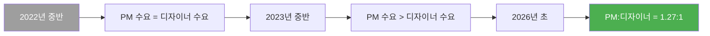
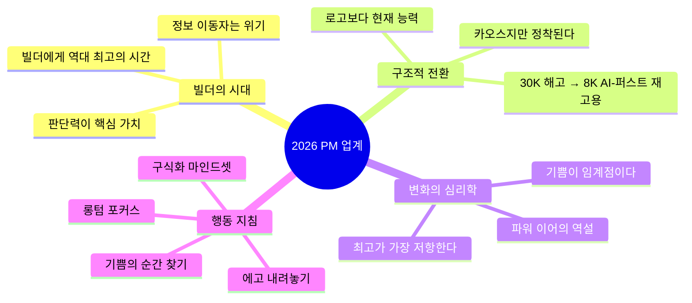

## Lenny's Podcast × Nikhyl Singhal 완전 분석 리포트

> **원본**: *"The state of the PM industry in 2026"* — Lenny's Podcast (2026년 4월 19일 공개)  
> **출연**: Nikhyl Singhal (The Skip 창업자 / 전 Meta·Google·Credit Karma CPO)  
> **YouTube**: https://www.youtube.com/watch?v=yUohoaC8_Hs  
> **작성 기준일**: 2026년 4월 21일

---

## 목차

1. [게스트 소개: Nikhyl Singhal은 누구인가](#1-게스트-소개-nikhyl-singhal은-누구인가)
2. [이 에피소드가 중요한 이유](#2-이-에피소드가-중요한-이유)
3. [빅 픽처: PM에게 무슨 일이 일어나고 있는가](#3-빅-픽처-pm에게-무슨-일이-일어나고-있는가)
4. [정보 이동자의 종말: 빌더 vs 비-빌더 구분선](#4-정보-이동자의-종말-빌더-vs-비-빌더-구분선)
5. [2026년 PM 채용 시장의 실제 데이터](#5-2026년-pm-채용-시장의-실제-데이터)
6. [향후 12~24개월: 대규모 구조조정과 AI-퍼스트 재고용](#6-향후-1224개월-대규모-구조조정과-ai-퍼스트-재고용)
7. [판단력(Judgment)이란 무엇인가](#7-판단력judgment이란-무엇인가)
8. [나쁜 소프트웨어의 종말](#8-나쁜-소프트웨어의-종말)
9. [PM이 코딩을 해야 하는가: Anthropic 성장 책임자의 시각](#9-pm이-코딩을-해야-하는가-anthropic-성장-책임자의-시각)
10. [변화가 왜 이렇게 어려운가: 인간 심리의 장벽](#10-변화가-왜-이렇게-어려운가-인간-심리의-장벽)
11. [동등 실망 알고리즘: 파워 이어의 역설](#11-동등-실망-알고리즘-파워-이어의-역설)
12. [임계점을 넘어라: 두려움에서 기쁨으로](#12-임계점을-넘어라-두려움에서-기쁨으로)
13. [기업과 개인 브랜드의 가치 역전](#13-기업과-개인-브랜드의-가치-역전)
14. [다양성 문제: 아무도 말하지 않는 부작용](#14-다양성-문제-아무도-말하지-않는-부작용)
15. [미래에 존재할 네 가지 직업 유형](#15-미래에-존재할-네-가지-직업-유형)
16. [엔지니어링은 PM보다 더 큰 변화를 겪고 있다](#16-엔지니어링은-pm보다-더-큰-변화를-겪고-있다)
17. [디자인의 정체: 왜 디자이너는 AI 시대에 고전하는가](#17-디자인의-정체-왜-디자이너는-ai-시대에-고전하는가)
18. [Nikhyl의 AI 스택과 사용 방식](#18-nikhyl의-ai-스택과-사용-방식)
19. [구식화(Obsolescence) 마인드셋](#19-구식화obsolescence-마인드셋)
20. [지금 당장 PM이 해야 할 구체적인 행동](#20-지금-당장-pm이-해야-할-구체적인-행동)
21. [카오스는 정착된다: 낙관론의 근거](#21-카오스는-정착된다-낙관론의-근거)
22. [최신 데이터: 2026년 1분기 테크 채용/해고 현황](#22-최신-데이터-2026년-1분기-테크-채용해고-현황)
23. [핵심 메시지 요약](#23-핵심-메시지-요약)
24. [The Skip 커뮤니티 소개](#24-the-skip-커뮤니티-소개)

---

## 1. 게스트 소개: Nikhyl Singhal은 누구인가

Nikhyl Singhal은 현재 시니어 프로덕트 리더들을 위한 커뮤니티 **The Skip**의 창업자이자, 실리콘밸리에서 가장 신뢰받는 커리어 어드바이저 중 한 명이다. 그의 이력은 단순한 이론가가 아닌 현장 운영자임을 증명한다.

- **Credit Karma** CPO (최고 프로덕트 책임자)
- **Meta (Facebook)** 프로덕트 담당 임원
- **Google** 프로덕트 담당 임원
- 4회 창업 경험
- 30년간 소비자 프로덕트 빌딩 경력
- 125명 이상의 현직 Head of Product / CPO가 참여하는 커뮤니티 운영

그가 특별한 이유는 단순히 이력이 화려해서가 아니라, 매달 수백 명의 현직 프로덕트 리더들과 직접 대화하며 **현장의 온도를 실시간으로 감지**하고 있기 때문이다. 이 에피소드의 인사이트는 그 방대한 현장 데이터에서 나온다.

---

## 2. 이 에피소드가 중요한 이유

이 팟캐스트 에피소드는 단순한 커리어 조언이 아니다. 현재 테크 업계에서 벌어지고 있는 **구조적 전환**을 가장 솔직하게, 가장 구체적으로 설명한 콘텐츠 중 하나다.

Nikhyl이 이 대화에서 다루는 핵심 주제들:

- PM의 역할이 어떻게, 왜 근본적으로 바뀌고 있는가
- 누가 생존하고 누가 도태되는가 (그리고 왜)
- AI 시대에 '빌더'가 된다는 것의 의미
- 변화에 저항하는 심리적 장벽을 어떻게 극복하는가
- 지금 당장 무엇을 해야 하는가

Lenny Rachitsky (Lenny's Newsletter 운영자, 전 Airbnb PM)는 이 에피소드를 "모든 프로덕트 사람이 들어야 한다"고 소개했다. 수사가 아니다.

---

## 3. 빅 픽처: PM에게 무슨 일이 일어나고 있는가

### 3.1 ZIRP 시대의 끝에서 시작하는 이야기

2~3년 전, 이른바 **ZIRP(Zero Interest Rate Policy, 제로금리정책)** 시대에 PM들의 일상은 어떠했는가? Nikhyl은 그것을 냉정하게 묘사한다.

> "당시 PM의 하루는 대부분 정보를 이쪽에서 저쪽으로 옮기는 일이었습니다. 우리 팀의 정보를 내 상사에게 적절하게 프레이밍하고, 그 상사는 또 자기 상사에게 프레이밍하고. PM 기능은 권한 없는 책임에 극도로 집중된 구조가 됐습니다. 그게 가장 극심한 형태의 직장 스트레스입니다."

이 묘사는 많은 PM들이 공감할 것이다. 레이어드된 조직 구조 속에서 실제 무언가를 만드는 것이 아니라, 정보의 번역가이자 관료적 중개인 역할을 해야 했던 답답함.

### 3.2 지금은 무엇이 다른가: 르네상스와 탈진의 공존

Nikhyl은 현재를 **"프로덕트 업계의 완전한 르네상스"** 라고 부른다. 동시에 **"업계가 극도로 지쳐있는 상태"** 라고도 표현한다. 이 두 가지는 모순이 아니다.

**르네상스의 증거:**
- PM들이 다시 직접 만드는 즐거움을 찾고 있다
- 아이디어에서 테스트까지의 직접적 연결이 가능해졌다
- 상위 빌더들의 보상이 역대 최고 수준
- 더 많은 취업 오퍼, 창업 기회, C-레벨 진출 가능성
- The Skip 커뮤니티에서 지난 12개월 동안 125명 중 14명이 창업자가 됐다

**탈진의 실체:**
- 3개월 전에 배운 방식이 이미 구식이 된다
- "그거 우리 3개월 전에 그만뒀어요. PRDS? 이제 그거 안 해요."
- 파워 이어(30대)의 삶에 직장 변화까지 겹친 복합적 스트레스
- 예측 불가능한 변화의 속도로 인한 상시 경계 상태

```
현재 PM 업계의 이중 구조

┌─────────────────────────────────────────────────┐
│                 PM 업계 2026                    │
├─────────────────┬───────────────────────────────┤
│   르네상스      │        탈진                   │
│                 │                               │
│ • 빌딩의 기쁨   │ • 3개월마다 갱신되는 요구     │
│ • 역대급 보상   │ • 상시 경계 상태              │
│ • 기회 확대     │ • 파워 이어의 복합 스트레스   │
│ • 자율성 증가   │ • 변화의 끝없는 반복          │
└─────────────────┴───────────────────────────────┘
```

---

## 4. 정보 이동자의 종말: 빌더 vs 비-빌더 구분선

### 4.1 가장 중요한 단층선

Nikhyl이 이 에피소드에서 가장 반복적으로 강조하는 것은 PM 집단 내부의 **단층선**이다.

**빌더(Builder):** 무언가를 만드는 것을 좋아하는 사람. 기술에 끌려 프로덕트 매니지먼트로 들어온 사람. 창업자 정신을 가진 사람.

**정보 이동자(Information Mover):** 소통과 조정이 강점인 사람. 팀 빌딩을 잘하는 사람. 기술보다 커뮤니케이션으로 경력을 쌓아온 사람.

Nikhyl의 진단: 현재 PM 집단의 **약 절반이 정보 이동자** 유형이며, 이 유형은 "디지털 공룡이 될 것"이라고 직접적으로 말한다.

### 4.2 왜 정보 이동자는 위험한가

AI가 대체하고 있는 것은 정확히 정보 이동의 기능이다.

- 상태 보고서 작성: AI가 더 상세하게 자동 생성
- 정보의 계층 간 전달과 프레이밍: AI 에이전트가 대체
- 회의 조율 및 백로그 관리: 자동화
- 스탠드업 운영: 이미 많은 회사가 자동화 완료

반면 빌더에게는 역대 최고의 시간이 찾아왔다. 혼자서도 50명 규모 팀이 하던 작업을 할 수 있게 됐기 때문이다.

### 4.3 빌더의 확장

Nikhyl은 '빌더'의 개념이 PM을 넘어 확장된다고 본다. 엔지니어, 디자이너, 마케터 중에도 빌더가 있다. 그리고 그 빌더들이 PM의 영역을 침범할 것이다. 반대로 PM 빌더들은 CFO, CHRO 등 전혀 다른 기능 영역으로 진출할 것이다. (실제로 The Skip 커뮤니티에서 PM 출신이 CHRO 포지션 인터뷰를 본 사례가 있다.)

---

## 5. 2026년 PM 채용 시장의 실제 데이터

### 5.1 반직관적인 현실

"AI가 PM을 대체한다"는 헤드라인과 달리, 실제 채용 데이터는 다른 이야기를 한다.

**Lenny's Newsletter 2026년 초 데이터 기준:**

- 전 세계 테크 기업 PM 공개 포지션: **7,300개 이상** (3년 만에 최고치)
- 2023년 초 저점 대비 **75% 상승**
- 2026년 초 대비 **이미 20% 증가**
- 엔지니어링 포지션: **전 세계 67,000개 이상** (미국만 26,000개)
- 테크 리크루터 포지션: 2022년 피크 수준에 근접

### 5.2 PM vs 디자이너 수요 비율의 역전

2023년 중반까지는 오히려 디자이너 포지션이 PM보다 많았다. 그러나 그 이후 PM 수요가 디자이너를 추월했고, 현재 PM:디자이너 수요 비율은 **1.27:1**로 PM이 앞서고 있다.

### 5.3 지역 집중화

- 전체 PM 포지션의 **23% 이상이 베이 에어리어** (2022년 대비 50% 증가)
- AI 관련 직종은 베이 에어리어가 전체의 **33%**
- 뉴욕이 세계 2위 테크 허브로 자리잡음
- 원격 근무 기회는 총 채용 증가에도 **감소 추세**

---

## 6. 향후 12~24개월: 대규모 구조조정과 AI-퍼스트 재고용

### 6.1 Nikhyl의 핵심 예측

> "다음 12~24개월 안에 대규모 인력 감축과 대규모 재고용을 동시에 목격할 것입니다. 한 회사가 3만 명을 해고하고 8,000명을 재고용하는 그림을 볼 수 있을 겁니다. 그런데 그 8,000명은 전부 AI-퍼스트입니다."

이것이 단순한 공포 마케팅이 아닌 이유는, 해고의 논리가 이중적이기 때문이다.

**해고의 두 가지 이유:**
1. 지난 5년간 과잉 채용된 인력에서 실제 ROI를 얻지 못했다는 판단
2. AI 도구가 완전히 다른 스킬셋을 요구하기 때문에 기존 인력이 부적합

**재고용의 조건:**
- AI-네이티브 사고방식
- 빌더 정신
- 판단력과 의견을 가진 인재

### 6.2 구글 시절의 회고

Nikhyl은 구글에서 일할 때 팀원들과 나눴던 대화를 공유한다. "구글이 실적을 내는 데 실제로 몇 명이 필요한가?" 대부분의 사람들이 90%는 필요하다고 생각하겠지만, 그의 답은 "아마 9% 정도"라는 것이다. 수만 명 중 약 500명이면 핵심 비즈니스를 유지할 수 있다는 뜻이다. 이것이 오버헤드의 실체이며, AI는 그 오버헤드를 극적으로 줄이고 있다.

### 6.3 실제 데이터: 2026년 1분기

최신 데이터에 따르면 2026년 1분기에만 테크 업계에서 4만 5,000명 이상이 해고됐으며, 그 중 AI 효율화가 직접적 원인으로 지목된 비율이 최소 20%에 달한다. 구체적 사례:

- **Block (Jack Dorsey)**: 전체 인력의 40%인 4,000명 해고. "AI 도구의 역량 확장"을 명시적 이유로 제시
- **Oracle**: 2만~3만 명 해고 (2026년 최대 규모)
- **Atlassian, Dell**: AI 효율화에 따른 예산 재배분 명시

---

## 7. 판단력(Judgment)이란 무엇인가

### 7.1 PM의 핵심 잔존 가치

AI가 가장 잘 못하는 것, 그래서 PM이 가장 집중해야 하는 것이 **판단력**이다. Nikhyl의 정의:

> "판단력이란 우리가 바꾸려는 것이 좋은 것인지 나쁜 것인지 평가하는 것입니다. 한 가지 방식과 다른 방식 중 어느 것으로 제품을 바꿔야 하는지 평가하는 것입니다. 100개의 커스텀 버전을 만들 수는 없습니다. 브랜드와 유지보수성에 영향을 미치니까요."

판단력의 구체적 요소:

- **변경 가치 평가**: 이것을 만들 가치가 있는가? 릴리스할 가치가 있는가?
- **시스템 사고**: 이 변경이 전체 시스템에 어떤 영향을 미치는가?
- **지속가능성 판단**: 이것이 장기적으로 유지 가능한가?
- **차별화 인식**: 이것이 우리를 실제로 차별화하는가?

앞으로 AI 덕분에 제품 변경 속도가 10배, 100배 빨라질 것이다. 그때 판단력은 더욱 핵심적 자산이 된다. 수십, 수백 개의 변경사항 중 무엇을 선택할 것인가를 결정하는 것이 PM의 핵심 역할로 남는다.

---

## 8. 나쁜 소프트웨어의 종말

### 8.1 Nikhyl의 낙관적 예측

> "2년 안에 더 이상 나쁜 소프트웨어는 없을 것입니다. 이건 예측이라기보다 소망에 가깝지만, 진지하게 그렇게 생각합니다."

그의 논거: 현재 세상에는 제대로 작동하지 않는 앱들이 넘쳐난다. 스마트홈 앱, 항공사 마일리지 앱, 각종 서비스 앱들. 이것들이 나쁜 이유는 원래 만든 엔지니어들이 신경을 덜 쓰는 사이드 프로젝트이거나, 회사가 프로덕트 퍼스트가 아니기 때문이다.

이제 모든 회사가 최고의 소프트웨어 엔지니어(Claude Code, Codex 등)에게 영어로 "이것을 더 좋게 만들어줘"라고 요청할 수 있다. 그 결과 전반적인 소프트웨어 품질이 급격히 올라갈 것이다.

### 8.2 COBOL과 메인프레임의 문제

흥미로운 여담으로, Nikhyl은 여전히 세상에는 COBOL로 작성된 레거시 시스템이 방대하게 존재한다고 지적한다. 유나이티드 항공의 마일리지 시스템 같은 것들이 그 예다. 이 시스템들은 원래 개발자들이 이미 세상을 떠난 경우도 많아 아무도 손대고 싶어하지 않는다. AI는 이 문제도 해결할 것이다.

---

## 9. PM이 코딩을 해야 하는가: Anthropic 성장 책임자의 시각

### 9.1 논쟁의 배경

Lenny가 Anthropic 성장 책임자(Head of Growth) Amol Avasare와 나눈 대화에서 흥미로운 관점이 제기됐다.

엔지니어가 매우 빠르게 작업할 수 있게 되면서 PM은 오히려 더 많은 것을 처리해야 한다. 너무 많은 기능, 문서, 아이디어가 밀려오는 상황에서 PM이 직접 코딩하고 배포하는 데 시간을 쓰는 것이 과연 최선인가?

Amol의 주장: PM의 레버리지는 직접 코딩/배포가 아니라 **더 높은 수준의 판단과 정렬(alignment) 작업**에 있다.

### 9.2 Nikhyl의 반박과 정교화

Nikhyl은 이를 단순히 받아들이지 않는다. 그는 두 가지 시나리오를 구분한다.

**시나리오 A (낮은 가치):** 50명의 엔지니어 팀이 있는데, PM이 51번째 엔지니어가 되려 한다면? 그건 엔지니어의 "저렴한 복제품"이 될 뿐이다.

**시나리오 B (높은 가치):** PM이 빌딩하는 것이 50명 팀의 생산성을 높이는 내부 도구라면? 그건 완전히 다른 이야기다.

The Skip 커뮤니티의 CPO들이 보여준 것이 바로 이것이다. 그들이 빌드하는 것들은 외부 제품이 아니라 **자신들의 프로덕트 조직을 자동화하는 도구들**이다. 제품 리뷰 자동화, 스탠드업 자동화, 의사결정 지원 도구 등. 이것이 진정한 PM의 빌딩이다.

---

## 10. 변화가 왜 이렇게 어려운가: 인간 심리의 장벽

### 10.1 우리는 변화하도록 설계되지 않았다

Nikhyl은 변화 저항의 심리를 매우 정확하게 짚는다.

어린 아이는 넘어지는 것을 당연하게 받아들이고, 언어를 두려움 없이 배우고, 끊임없이 새로운 방식을 시도한다. 하지만 어른이 될수록 우리는 점점 더 변화를 피하도록 훈련된다.

> "파트너를 찾고, 정착하고, 좋은 직장을 유지하려 하고, 이직은 실패라는 인식이 생깁니다. 이것이 우리의 전체 모델입니다."

### 10.2 "그게 약속이 아니었어요"의 심리

변화 저항의 가장 깊은 층에는 이런 감정이 있다.

> "나는 해야 할 것들을 다 했습니다. 학교를 다녔고, 열심히 일했고, 좋은 직장을 얻었고, 브랜드를 쌓았고, 관리자가 됐고, 좋은 수입을 올리고 있습니다. 그런데 지금 와서 다시 시작하라고요?"

이것은 배신감이다. 시스템이 약속을 지키지 않았다는 느낌. Nikhyl은 이 감정에 공감하면서도, 현실은 그 감정을 기다려주지 않는다고 말한다.

### 10.3 최고가 변화하기 가장 어렵다

역설적이게도, **이전 시스템을 가장 잘 마스터한 사람이 새로운 시스템으로의 전환에 가장 저항한다.** Nikhyl은 이것을 "그림자 초능력(Shadow Superpower)"이라 부른다.

당신의 세계 전체가 "이 방식이 효과적이다"를 증명하고 있을 때, 새로운 방식을 받아들이는 것은 인지 부조화를 요구한다. 반면 기존 방식으로 성과를 내지 못하던 사람들은 오히려 변화를 더 빨리 받아들인다. 잃을 것이 없기 때문에.

---

## 11. 동등 실망 알고리즘: 파워 이어의 역설

### 11.1 30대의 잔인한 현실

Nikhyl이 "파워 이어(Power Years)"라고 부르는 30대는 커리어와 개인 삶이 동시에 절정을 맞이하는 시기다.

```
파워 이어(30대)의 수요 vs 공급

총 가용 시간: 6~12시간/일

수요:
  ├── 노부모 케어 (새로운 관계 재정립)
  ├── 어린 자녀 양육
  ├── 파트너십 유지
  ├── 건강 관리 (식단, 운동)
  ├── 친구 관계
  ├── 직장 업무 (끊임없이 변화)
  └── 자기 재교육

공급: 턱없이 부족
```

### 11.2 동등 실망의 원리

> "이 나이에 목표는 내 삶의 모든 사람을 동등하게 실망시키는 겁니다. 6~12시간을 줄 수 있는데, 수요는 20시간입니다. 내 부모가 내 아이보다 더 실망하면 안 되고, 내 건강이 내 직장보다 더 실망하면 안 됩니다."

이 상황에서 "자기 재발명"을 요구받는 것이 얼마나 가혹한지 Nikhyl은 인정한다. 그러면서도 선택지가 없다는 것도 명확히 한다.

---

## 12. 임계점을 넘어라: 두려움에서 기쁨으로

### 12.1 기쁨(Joy)이 변화의 열쇠

Nikhyl이 발견한 가장 중요한 패턴: **변화에 성공한 사람들은 모두 '기쁨의 순간'을 경험했다.**

이 기쁨의 순간은 매우 개인적이다. 누군가에겐 아내와 함께 쓰는 앱을 직접 만든 순간일 수 있고, 받은 편지함을 관리하는 AI 비서를 만든 순간일 수 있고, 집의 스마트 조명을 직접 제어하는 시스템을 만든 순간일 수 있다.

> "사소한 것이어도 됩니다. 보통 밤을 새웠다거나, 친구들과 시간을 보내며 해킹했다거나, 클로드와 대화를 나눴다는 이야기와 함께 옵니다. 그 순간이 두려움에서 기쁨으로 넘어가는 임계점입니다."

### 12.2 기쁨이 번아웃의 해독제인 이유

- 기쁨을 느끼면 그것이 더 이상 '일'처럼 느껴지지 않는다
- '기쁨의 순간'이 오면 인간 심리가 자동으로 시간을 만들어낸다
- 에너지가 소비되지 않고 생성된다
- PM 일의 모노토니(단조로움)에서 오는 탈진이 해소된다

### 12.3 기쁨의 임계점을 넘기 위한 실용적 접근

Nikhyl의 조언: 자신의 일상에서 직접 겪는 불편함을 찾아 AI 도구로 해결해보라. Lovable, Claude Code, Codex 중 어떤 것이든 상관없다. 영어로 "나는 이런 것을 만들고 싶다"고 말하면 된다.

Lenny의 예시: Sonos 스피커를 제어하는 대시보드를 만들고 싶다면, Claude Code에 그냥 그렇게 말하면 된다. 엔지니어일 필요가 없다.

---

## 13. 기업과 개인 브랜드의 가치 역전

### 13.1 화려한 로고가 오히려 불리할 수 있다

이전 10년간 PM 커리어 조언의 핵심은 "좋은 브랜드에서 경력을 쌓아라"였다. Google, Meta, Apple, Amazon. 이것이 마치 실력의 증거처럼 통용됐다.

Nikhyl의 새로운 관찰:

> "지금은 면접에서 다른 질문을 합니다. '어떤 툴을 쓰나요? 판단 기준은 무엇인가요? 어떻게 사고하나요?' 5년 전에 무엇을 출시했느냐가 아니라."

### 13.2 왜 로고가 오히려 방해가 되는가

1. **최신성 문제**: 메이저 테크 기업들이 구시대 방식으로 일하고 있다면, 그곳에서 6년을 보낸 사람은 완전히 다른 세계에서 나온 것처럼 보일 수 있다.

2. **스토리텔링의 어려움**: 대기업에서의 기여는 설명하기 어렵다. "이 알고리즘의 이 부분을 조금 빠르게 만들었는데, 대단히 어려운 정치적 과정이었다"는 말이 AI-네이티브 스타트업 인터뷰어에게 울림을 주지 못한다.

3. **현재 능력이 과거 경험보다 중요**: 지금 무엇을 만들 수 있는가, 지금 어떤 도구를 쓰는가, 지금 어떻게 생각하는가가 핵심 평가 기준이 됐다.

---

## 14. 다양성 문제: 아무도 말하지 않는 부작용

### 14.1 AI 전환이 만드는 다양성 퇴행

Nikhyl은 이 주제를 다루며 "개인적으로 가장 걱정하는 부분"이라고 밝힌다.

> "이것은 의도적인 것이 아닙니다. 하지만 현실적으로 일어나고 있습니다."

AI 전환이 만드는 다양성 문제:

- **지리적 집중**: AI 혁명이 베이 에어리어 중심이고, 채용이 그곳으로 집중되면서 다양한 배경의 인재가 줄어든다
- **연령 차별**: "최신 기술에 올라타야 한다"는 압박이 특정 나이대를 배제한다
- **성별 격차**: 파워 이어의 여성은 육아와 커리어를 동시에 해결해야 하는 상황에서 밤과 주말에 Claude Code를 배울 여유가 없다
- **소수집단 후퇴**: 빠른 채용 pace에서 기업들은 "자신과 비슷한 사람"을 뽑는 경향이 강해진다

### 14.2 구조적 문제의 인정

Nikhyl은 이것이 개인의 나쁜 의도에서 비롯된 것이 아님을 인정하면서도, 그 결과가 실질적인 다양성 후퇴라는 점을 분명히 한다. 이 문제는 업계 전체가 의식적으로 다뤄야 하지만, 지금은 아무도 큰 소리로 말하지 않고 있다.

---

## 15. 미래에 존재할 네 가지 직업 유형

### 15.1 @yrechtman의 트윗

에피소드에서 Lenny가 소개한 트윗이 커뮤니티에서 화제가 됐다. "미래에 존재할 네 가지 직업"의 틀이다.

```
미래의 4가지 직업 유형

┌────────────────────────────────────────────────────────────┐
│                                                            │
│  1. 프로덕트 엔지니어 / 바이브 코더                        │
│     ├── PM + 코더의 결합                                   │
│     └── 직접 빌드하고 배포하는 사람                        │
│                                                            │
│  2. 보안 / 인프라 전문가                                   │
│     ├── AI가 대체하기 어려운 깊은 기술 전문성              │
│     └── 시스템의 안전과 운영 담당                          │
│                                                            │
│  3. 핫 피플 (Hot People)                                   │
│     ├── 고객 대면 역할                                     │
│     ├── 쉬운 UX를 세상에 제시하는 역할                    │
│     └── 관계와 신뢰를 만드는 역할                          │
│                                                            │
│  4. 어른 (Grown-ups)                                       │
│     ├── 경험과 지혜를 가진 시니어 리더                    │
│     ├── 창업자와 소통할 수 있는 무게감                    │
│     └── 변화 방향을 결정하는 판단력 보유자                 │
│                                                            │
└────────────────────────────────────────────────────────────┘
```

### 15.2 Nikhyl의 해석

Nikhyl은 이 프레임에 동의하면서, 특히 "어른"의 중요성을 강조한다. AI가 많은 것을 보완할 수 있지만, 판단력은 경험과 지혜의 조합에서 나온다. 창업자와 동등한 언어로 대화하고, 그 방향이 잘못됐을 때 "아니오"라고 말할 수 있는 무게를 가진 사람은 여전히 필요하다.

"핫 피플"은 단순히 외모가 아니라, 커뮤니케이션과 영향력을 통해 변화를 이끄는 사람을 뜻한다. 이 역시 The Skip 커뮤니티의 행동하는 CPO들이 갖춘 역량이다.

---

## 16. 엔지니어링은 PM보다 더 큰 변화를 겪고 있다

### 16.1 엔지니어의 역할 전환

PM들이 변화를 겪고 있다면, 엔지니어의 변화는 더욱 근본적이다.

> "코딩의 영역은 이제 해결됩니다. 남는 것은 무엇을 만들 것인가, 이것이 훌륭한가, 방향이 맞는가, 성공이 어떤 모습인가입니다."

코딩을 잘 하는 것이 엔지니어의 핵심 가치였다면, 그 핵심 가치의 상당 부분이 AI로 이동하는 것이다. 그 결과 엔지니어는 점점 PM처럼 생각해야 한다.

### 16.2 엔지니어의 강점이 남는 이유

그렇다고 엔지니어가 PM에게 완전히 흡수되는 것은 아니다. Nikhyl은 엔지니어만의 강점을 인정한다.

- **시스템 사고**: 이 변경이 전체 시스템에 지속가능한가를 자연스럽게 생각한다
- **구식화(Obsolescence) 사고**: "이것을 더 자동화할 수 있을까?"를 먼저 생각한다
- **기술적 트레이드오프 감각**: PM보다 구현의 복잡성을 더 잘 이해한다

결론: PM은 판단과 소통에서, 엔지니어는 시스템과 구현에서, 디자이너는 취향(taste)에서 각각의 강점을 가져간다. 이 세 가지 모두를 가진 사람이 가장 유리하다.

---

## 17. 디자인의 정체: 왜 디자이너는 AI 시대에 고전하는가

### 17.1 데이터가 말하는 디자인의 위기

채용 데이터는 PM과 엔지니어링이 증가하는 동안 **디자이너 포지션이 정체(plateau)** 되고 있음을 보여준다. 직관적으로는 이해하기 어렵다. AI 시대에 수많은 제품이 쏟아질수록 디자인이 차별화 요소가 되어야 하지 않을까?

### 17.2 가능한 이유들

Nikhyl과 Lenny의 분석:

**첫 번째 이유: 엔지니어링 속도와의 불일치**
엔지니어가 매우 빠르게 작업할 수 있게 되면서, 전통적인 디자인 프로세스(연구 → 와이어프레임 → 목업 → 프로토타입 → 사용자 테스트 → 디자인 수정)가 병목이 된다. 팀들이 디자인 없이 직접 빌드하는 것을 선택한다.

**두 번째 이유: 픽셀 제너레이터 vs 취향 제조자의 혼동**
Nikhyl의 핵심 통찰:

> "디자인에는 픽셀 제너레이터와 취향 제조자가 있습니다. 많은 기업들이 디자이너를 고용할 때 취향 제조자가 필요한데 제너레이터를 고용합니다. AI가 픽셀 제너레이터 역할을 대체하면서, 취향 제조자의 수요는 여전하지만 전통적 디자이너 채용은 줄고 있습니다."

**Lenny의 보충**: "나는 AI를 써도 훌륭한 디자이너가 될 수 없다. PM은 AI로 더 좋은 PM이 될 수 있지만, 디자이너는 AI로 더 좋은 디자이너가 되는 것이 그렇게 명확하지 않다."

---

## 18. Nikhyl의 AI 스택과 사용 방식

### 18.1 현재 스택

> "지난 3개월간 Claude에 올인하고 있습니다. 전에는 한 달 정도 Codex를 적극적으로 썼는데, 고수준 추론에서 상당히 앞선 면이 있었습니다. 하지만 툴을 전환하기가 어렵습니다."

### 18.2 구체적으로 만든 것들

Nikhyl이 The Skip 커뮤니티를 위해 직접 빌드한 것들:

**멤버 매칭 에이전트**
- 100명이 서로 99명을 만날 수 없는 문제를 해결
- 누가 누구를 아직 못 만났는지 추적
- 서로의 필요(haves/wants)를 고려한 최적 매칭 자동화

**채용 매칭 시스템**
- 커뮤니티 내 Head of Product들이 채용 중인 포지션 자동 취합
- 관심 있는 멤버들에게 자동 알림 및 매칭

**콘텐츠 피드백 루프**
- 사람들의 질문을 AI가 수집
- 자신의 콘텐츠를 학습시킨 AI가 답변 생성
- Nikhyl이 그 질문들을 검토하며 AI와 자신이 의견이 다른 지점을 찾아 새로운 콘텐츠로 발전

### 18.3 바이브 코딩 팁

> "아마존 프라임 쇼들이 바이브 코딩에 좋습니다. 책을 원작으로 한 구조화된 스토리라서요. 24 시즌을 다시 봤는데, 줄거리를 알지만 바이브 코딩하면서 봤습니다."

판단 기준: 눈을 떼면 안 되는 콘텐츠 = 훌륭한 콘텐츠. Paradise, Lioness는 그 기준을 통과.

---

## 19. 구식화(Obsolescence) 마인드셋

### 19.1 위대한 엔지니어의 정의

Nikhyl이 첫 직장에서 만난 최고의 엔지니어에게 물었다. "위대한 엔지니어란 무엇인가요?"

예상했던 답(학위, 기술 스택 등)이 아니라 돌아온 대답:

> "제 아버지가 제가 아는 가장 위대한 엔지니어입니다. 아버지의 정의는 이것입니다: 엔지니어란 자신이 하는 모든 일에서 스스로를 구식화(obsolete)하는 사람입니다."

### 19.2 AI가 이 원칙을 가속화하다

이 구식화 원칙을 모든 직업에 적용하던 Nikhyl에게, AI는 이것을 무한히 가속화하는 도구가 됐다.

> "AI에게 '이것을 자동화해줘'라고 말하면 자동화됩니다. 왜 내가 내 일을 구식화시켜야 하냐고요? 더 좋은 일이 생기기 때문입니다."

모순적으로 들리지만, 자신의 역할을 끊임없이 구식화하는 사람이 결국 가장 높은 자리에 올라간다. 구식화할 수 없는 부분, 즉 판단력과 지혜가 그 자리를 차지하기 때문이다.

---

## 20. 지금 당장 PM이 해야 할 구체적인 행동

### 20.1 Nikhyl의 구체적 조언 목록

**1단계: 기쁨의 순간 찾기**
- 자신의 일상에서 불편한 것 하나를 찾아 AI 도구로 해결해보라
- 완벽하지 않아도 된다. 사소해도 된다.
- 일단 그 기쁨을 경험하면 나머지는 따라온다

**2단계: 구식화 마인드셋 적용**
- 내가 오늘 하는 일 중 AI로 대체할 수 있는 것은 무엇인가?
- 덜 즐거운 일들을 먼저 구식화 대상으로 삼아라
- 내부 도구 빌딩을 시작하라

**3단계: 속도 높이기**
- 새로운 관계를 시작할 때처럼 에너지를 쏟아라
- 지금은 "배우는 시간"이다. Year 1처럼 임하라
- 다른 것들을 전략적으로 양보해야 할 수도 있다

**4단계: 에고 내려놓기**
- 이전 레벨보다 낮은 포지션도 고려하라
- 브랜드가 아닌 현재 능력으로 평가받는 것을 두려워하지 마라
- 장기적으로 생각하라. 지금의 레벨 다운이 5년 후 레벨 업이 된다

**5단계: 롱텀 포커스**
- The Skip의 핵심 원칙: "다음 기회가 아닌, 그 다음 기회를 생각하라"
- 지금 AI-퍼스트 보트에 타는 것이 미래의 프리미엄 포지션을 위한 투자다

### 20.2 리더라면 추가로 할 것

리더십 포지션에 있는 PM이라면, 팀 내 **기쁨의 순간을 찾아주는 것**이 핵심 역할이 된다. 한 사람이 경험한 기쁨은 팀 전체로 전염된다.

---

## 21. 카오스는 정착된다: 낙관론의 근거

### 21.1 역사적 선례: 인터넷 시대의 PM 혁명

HP, Cisco, AMD 등이 하드웨어 중심이던 시절의 프로덕트 매니지먼트는 긴 엔지니어링 사이클, 엄격한 구조를 가진 완전히 다른 형태였다.

인터넷 기업들이 등장했을 때, 구글은 APM(Associate Product Manager) 프로그램을 만들었다. 시장의 기존 PM이 자신들이 필요로 하는 것과 맞지 않았기 때문이다. 그 프로그램이 현재 대부분의 시니어 PM들을 만들어냈다.

처음 몇 년간은 완전한 혼란이었다. 경계가 모호하고, 기준이 없고, 맞는 사람도 틀린 사람도 불확실했다. 하지만 몇 년이 지나자 패턴이 생겼다.

### 21.2 지금도 같은 일이 반복된다

> "지금 우리가 겪는 것도 같습니다. 앞으로 12~24개월은 3개월마다 새로운 방식이 나타날 겁니다. 하지만 몇 년이 지나면 정착됩니다. 새 직장도 이전 직장처럼 느껴지게 됩니다. 그 최적화 단계에 이르면 새로운 루틴이 형성됩니다."

이것이 "30년 내내 이 메리고라운드를 타야 한다"는 뜻이 아니다. 지금은 격변의 시간이다. 하지만 이 터널을 지나면 출구가 있다.

### 21.3 "미소 짓는 탈진(Smiling Exhaustion)"

Nikhyl이 현재 커뮤니티에서 목격하는 상태:

> "이전에는 그냥 탈진이었습니다. 지금은 '미소 짓는 탈진'을 봅니다. 여전히 지치지만, 미소가 있습니다. 나는 탈진보다 미소 짓는 탈진을 택하겠습니다."

---

## 22. 최신 데이터: 2026년 1분기 테크 채용/해고 현황

### 22.1 양면의 진실

2026년 현재 테크 업계는 정반대되는 두 가지 현상이 동시에 진행 중이다.

**해고 현황:**

2026년 1분기에만 테크 업계에서 4만 5,000명 이상이 해고됐으며, AI가 직접적 원인으로 지목된 비율이 최소 20%(약 9,238명)에 달한다. Block의 잭 도시는 전체 인력의 40%인 4,000명을 감원하며 "AI 도구의 역량 확장"을 명시적 이유로 제시했고, 이는 AI 귀속 해고 사건 중 역대 최대 규모다. Oracle은 미국·캐나다·유럽 전역에서 2만~3만 명을 해고했다.

**채용 현황:**

PM 오픈 포지션은 전 세계적으로 7,300개를 넘어 3년 만에 최고치를 기록했으며, 이는 2023년 초 저점 대비 75% 상승이고 2026년 초 대비 이미 20% 증가한 수치다. 엔지니어링 포지션은 전 세계 67,000개 이상으로, 미국에만 26,000개가 있다.

### 22.2 패턴의 의미

테크 리크루터 포지션 수요도 2022년 피크 수준에 근접하며 채용 증가세가 실질적임을 확인해준다. AI 관련 직종은 OpenAI, Anthropic, Cursor 같은 회사에서 하키스틱 성장 중이다.

75%의 직장인이 이미 업무에 AI를 사용하고 있으며, 경영진의 3분의 2는 AI 스킬 없는 사람은 채용하지 않겠다고 밝혔다. 더 나아가 71%는 경험이 많지만 AI 스킬이 없는 후보자보다 경험은 적어도 AI 스킬이 강한 후보자를 선택하겠다고 답했다.

### 22.3 디자인 vs PM 수요 역전 (Mermaid 차트)



---

## 23. 핵심 메시지 요약

### 23.1 Nikhyl이 이 에피소드에서 전달한 핵심



### 23.2 한 문장으로 요약한다면

> **"빌더가 돼라. 판단력을 키워라. 지금이 임계점을 넘어야 할 시간이다. 그리고 이 카오스는 결국 정착된다."**

---

## 24. The Skip 커뮤니티 소개

### 24.1 무엇인가

Nikhyl이 5년 전 시작한 운영자 중심의 커뮤니티로, 현직 Head of Product과 CPO들이 서로의 지혜를 나누는 공간이다.

- **Skip Community**: 125명 이상의 시니어 프로덕트 리더 (엄선, 대기자 명단 존재)
- **Skip Coach**: 더 넓은 기술 전문가 커뮤니티 (뉴스레터/팟캐스트)
- **Skip Show**: 팟캐스트 & 뉴스레터
- **Skip.help** (신규 론칭): 50명의 커뮤니티 리더들의 지혜를 학습한 AI 에이전트에게 커리어 질문

Skip.help는 Supermemory 스타트업과의 협력으로 구축됐으며, 인터뷰 준비, 현재 환경 내비게이션, 수석 비서 앱 빌딩 방법 등을 단 한 명의 의견이 아닌 50명의 운영자 지혜로 답변한다.

### 24.2 커뮤니티의 변화: 창업자 폭증

창업 3~4년 차까지 125명 중 창업자가 단 1명이었던 것이, 최근 12개월 사이에 **14명**으로 증가했다. PM 역할이 확장되고 있음을 가장 직접적으로 보여주는 데이터다.

---

## 참고 링크

| 리소스 | 링크 |
|--------|------|
| 원본 팟캐스트 (YouTube) | https://www.youtube.com/watch?v=yUohoaC8_Hs |
| Lenny's Newsletter | https://www.lennysnewsletter.com |
| The Skip (팟캐스트/뉴스레터) | https://skip.show |
| Skip Community | https://skip.community |
| Skip Coach | https://skip.coach |
| Skip.help (신규) | https://skip.help |
| PM 채용 시장 리포트 (2026 초) | https://www.lennysnewsletter.com/p/state-of-the-product-job-market-in-ee9 |
| Nikhyl LinkedIn | https://www.linkedin.com/in/nikhyl |

---

*이 문서는 Lenny's Podcast 에피소드 "The state of the PM industry in 2026" (2026년 4월 19일)을 기반으로 최신 채용/해고 데이터를 추가하여 작성된 분석 리포트입니다.*
