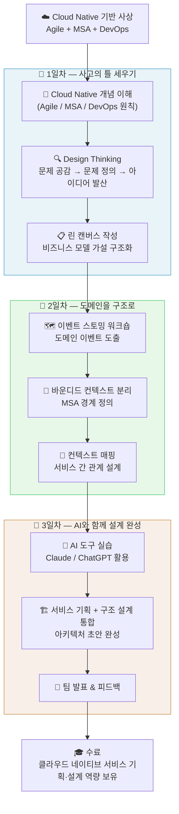

## 교육 과정 완전 정복 가이드

> **교육 일정**: 2026년 4월 27일(월) ~ 4월 29일(수), 3일간 21시간  
> **분류**: Infra / Cloud | **수준**: 중급 | **형태**: 정규집합(사외) | **차수**: 1차수

---

## 목차

1. [이 교육이 탄생한 배경](#1-이-교육이-탄생한-배경)
2. [교육 과정 개요](#2-교육-과정-개요)
3. [수강 대상 및 사전 조건](#3-수강-대상-및-사전-조건)
4. [교육 목표](#4-교육-목표)
5. [핵심 커리큘럼 상세 해설](#5-핵심-커리큘럼-상세-해설)
   - 5-1. Agile / MSA / DevOps 기반 클라우드 네이티브 개념
   - 5-2. Design Thinking 기반 문제 정의 및 솔루션 도출
   - 5-3. 린 캔버스(Lean Canvas) 기반 비즈니스 모델 설계
   - 5-4. 이벤트 스토밍 기반 도메인 모델링
   - 5-5. AI 도구를 활용한 서비스 기획 및 구조 설계
6. [전체 학습 흐름 다이어그램](#6-전체-학습-흐름-다이어그램)
7. [왜 지금 이 교육인가? — 2026년 맥락](#7-왜-지금-이-교육인가--2026년-맥락)
8. [교육 수료 후 기대 역량](#8-교육-수료-후-기대-역량)
9. [THINK라는 이름이 의미하는 것](#9-think라는-이름이-의미하는-것)
10. [수강 전 알아두면 좋은 배경 지식](#10-수강-전-알아두면-좋은-배경-지식)

---

## 1. 이 교육이 탄생한 배경

클라우드 전환은 이제 인프라의 문제가 아니다. 서비스를 **어떻게 생각하고**, **어떻게 쪼개고**, **어떻게 설계하느냐**의 문제로 넘어온 지 오래다.

많은 기업이 Kubernetes를 도입하고 Docker로 컨테이너화를 마쳤지만, 정작 서비스 자체의 구조는 여전히 모놀리식(Monolithic)한 사고방식에 머물러 있는 경우가 많다. 기술 스택은 클라우드 네이티브인데, 서비스 설계 방법론은 10년 전 방식 그대로인 것이다. 이런 간극을 메우기 위해 등장한 것이 바로 이 과정의 핵심 주제다.

**Cloud Native Application THINK**는 단순히 기술을 배우는 과정이 아니다. "어떻게 생각해야 클라우드 네이티브한 서비스를 제대로 만들 수 있는가"라는 **사고 방식(Thinking)** 의 전환을 목표로 한다. 과정명에 THINK가 붙은 이유도 여기에 있다.

2026년 현재, 클라우드 네이티브 생태계는 MSA(마이크로서비스 아키텍처), 이벤트 드리븐 아키텍처, AI 도구 통합이 한데 어우러지는 방향으로 급속히 진화하고 있다. 컨테이너 플랫폼과 클라우드 네이티브 데이터베이스가 보편적 인프라 요소로 자리 잡고 있으며, 기존 시스템도 API와 마이크로서비스를 통해 지속적으로 현대화되는 흐름이다. 이 과정은 바로 그 흐름의 한가운데에 놓인 실무자들을 위한 교육이다.

---

## 2. 교육 과정 개요

| 항목 | 내용 |
|------|------|
| **과정명** | [Cloud College] Cloud Native Application THINK |
| **과정 분류** | Infra / Cloud |
| **교육 단계** | 중급 |
| **교육 형태** | 정규집합 |
| **사내외 구분** | 사외 교육 |
| **교육 유형** | 신청 |
| **교육 일정** | 2026-04-27 (월) ~ 2026-04-29 (수) |
| **교육 기간** | 3일, 총 21시간 |
| **차수** | 1차수 |

이 과정은 **Cloud College** 소속 교육 프로그램으로, 클라우드 네이티브 환경에서의 서비스 기획과 아키텍처 설계 역량을 집중적으로 다룬다. 3일이라는 비교적 짧은 기간 안에 21시간을 소화하므로, 하루 평균 약 7시간의 고밀도 학습이 진행된다. 단순 강의가 아니라 워크숍 형태의 실습이 중심이 될 가능성이 높고, 팀 단위 활동이 포함될 수 있다.

---

## 3. 수강 대상 및 사전 조건

이 과정의 수강 대상은 다음과 같다.

- **서비스 기획자**: 클라우드 환경에서 서비스를 구상하고 기획하는 역할을 담당하는 사람
- **백엔드 개발자**: 서버 사이드 로직을 다루며, 마이크로서비스 구조로의 전환을 고민하는 개발자
- **프론트엔드 개발자**: UI/UX 관점에서 클라우드 기반 서비스 구조를 이해하고자 하는 개발자
- **클라우드 기반 서비스 설계 및 개발에 관심 있는 엔지니어**: 특정 직군에 한정하지 않고, 클라우드 네이티브 전환에 참여하거나 관심 있는 모든 기술 직군

주목할 점은 이 과정이 **개발자에게만 국한되지 않는다**는 것이다. 서비스 기획자도 명시적인 수강 대상으로 포함되어 있다는 사실은, 이 과정이 기술 구현보다 **서비스 사고 방식과 도메인 설계**에 방점을 두고 있음을 보여준다.

별도로 표기된 선수 과목(선수과목지식)은 이미지상 비어 있거나 절단되어 있으나, 중급 과정임을 감안하면 다음 정도의 기본 이해는 갖추고 있는 것이 좋다.

- 클라우드 서비스(AWS, GCP, Azure 등) 기본 개념
- 소프트웨어 개발 생명주기 이해
- Agile 또는 스프린트 방식 업무 경험

---

## 4. 교육 목표

이미지에서 교육 목표는 일부 잘렸지만, 확인 가능한 내용은 다음과 같다.

> *"클라우드 네이티브 환경에서 서비스 기획 및 문제 정의 방법을 이해하고, Design Thinking과 도메인 모델링을 기반으로 AI 도구를 활용한 서비스 아이디어..."*

전체 맥락을 종합하면, 이 과정의 완전한 교육 목표는 다음과 같이 구성된다.

1. 클라우드 네이티브 패러다임(Agile, MSA, DevOps)의 철학적 배경과 실무 적용 원칙을 이해한다.
2. Design Thinking 프레임워크를 통해 사용자 중심의 문제 정의 능력을 체득한다.
3. 린 캔버스(Lean Canvas)를 사용해 비즈니스 모델을 빠르게 구조화하는 능력을 갖춘다.
4. 이벤트 스토밍(Event Storming)을 통해 도메인을 분석하고, 마이크로서비스 경계를 도출하는 역량을 기른다.
5. 생성형 AI 도구(ChatGPT, Claude 등)를 서비스 기획과 구조 설계에 실질적으로 활용하는 방법을 습득한다.

한마디로, **"아이디어에서 도메인 모델까지, AI와 함께 빠르게 구조화하는 법"** 을 배우는 과정이다.

---

## 5. 핵심 커리큘럼 상세 해설

### 5-1. Agile, MSA, DevOps 기반 클라우드 네이티브 개념 이해

클라우드 네이티브 애플리케이션 개발의 세 가지 기반 사상은 서로 독립적이지 않고 상호 보완적으로 얽혀 있다.

**Agile**은 변화에 빠르게 대응하는 개발 문화와 프로세스다. 고정된 요구사항 명세서 대신 짧은 스프린트 주기로 동작하는 소프트웨어를 지속적으로 제공하며, 팀 간 소통과 고객 피드백을 핵심 가치로 삼는다. 클라우드 네이티브 환경에서 Agile은 단순한 개발 방법론이 아니라 **조직 설계 원칙**으로까지 확장된다. 팀을 수직(Vertical) 구조로 재편해 하나의 팀이 서비스의 기획-개발-운영까지 책임지는 방식이 이상적인 형태로 제시된다.

**MSA(마이크로서비스 아키텍처)** 는 대규모 모놀리식 애플리케이션을 기능 단위의 독립적인 서비스들로 분해하는 아키텍처 패턴이다. 각 서비스는 독립적으로 개발, 배포, 확장이 가능하며, 서비스 간 통신은 API나 이벤트 메시징으로 이루어진다. 아마존이 2001년 '피자 두 판 팀(Two-pizza team)' 원칙으로 내부 조직을 재편하고 서비스 단위의 API 게이트웨이를 구축한 사례, 넷플릭스가 수억 명의 동시 스트리밍을 위해 수백 개의 마이크로서비스로 시스템을 분해한 사례가 대표적이다. 모놀리식 구조에서는 UI 하나를 변경해도 다른 개발자들과 끝없는 의사결정이 필요했다면, MSA 구조에서는 해당 서비스 팀이 독립적으로 배포할 수 있다.

**DevOps**는 개발(Dev)과 운영(Ops)의 사일로를 허물고 CI/CD 파이프라인을 통해 코드가 자동으로 빌드·테스트·배포되는 문화와 기술 체계다. 클라우드 네이티브에서 DevOps는 Kubernetes, Helm, GitOps 등의 도구와 맞닿아 있으며, 변경 사항이 프로덕션에 반영되는 리드 타임을 수 주에서 수 시간으로 단축시키는 핵심 동력이다.

이 세 개념이 결합될 때 비로소 진정한 클라우드 네이티브 애플리케이션 개발이 가능해진다. 이 섹션은 그 철학적 기반을 수강생에게 공유된 언어로 정립하는 역할을 한다.

---

### 5-2. Design Thinking 기반 문제 정의 및 솔루션 도출

Design Thinking은 Stanford d.school에서 체계화한 혁신 방법론으로, 기술 중심이 아닌 **인간(사용자) 중심**으로 문제를 정의하고 해결책을 도출하는 접근법이다. 클라우드 네이티브 개발 맥락에서 Design Thinking이 중요한 이유는, 아무리 정교한 MSA 아키텍처를 갖춰도 **잘못된 문제를 해결하고 있다면 의미가 없기 때문**이다.

Design Thinking의 5단계 프로세스는 다음과 같다.

```
공감(Empathize) → 문제 정의(Define) → 아이디어 발산(Ideate) → 프로토타입(Prototype) → 테스트(Test)
```

**공감(Empathize)** 단계에서는 사용자 인터뷰, 관찰, 설문 등을 통해 실제 사용자가 느끼는 불편함과 니즈를 파악한다. 서비스 기획자나 개발자의 가정이 아닌, 실제 사용자의 맥락(Context)을 이해하는 것이 핵심이다.

**문제 정의(Define)** 단계에서는 공감 단계에서 수집된 인사이트를 종합해 핵심 문제 문장(Problem Statement)을 도출한다. "우리는 [특정 사용자]가 [특정 상황]에서 [어떤 필요]를 충족시킬 방법이 필요하다"는 형식의 HMW(How Might We) 질문으로 표현되기도 한다.

**아이디어 발산(Ideate)** 단계에서는 도출된 문제를 해결하기 위한 다양한 아이디어를 제약 없이 생성한다. 브레인스토밍, 마인드맵, 6 Thinking Hats 등의 기법이 활용된다. 이 과정에서 AI 도구(이 교육의 5번째 주제와 연계)를 활용하면 아이디어 생성 속도와 다양성을 비약적으로 높일 수 있다.

**프로토타입(Prototype)** 단계에서는 선별된 아이디어를 빠르게 구체화한다. 종이 스케치, 와이어프레임, 간단한 목업이 이 단계의 산출물이다. 클라우드 네이티브 맥락에서는 서비스 구조도(Architecture Diagram) 초안이 이 단계에서 등장한다.

이 교육에서 Design Thinking은 이후 린 캔버스와 이벤트 스토밍으로 자연스럽게 이어지는 **"문제 → 솔루션 → 구조화"** 파이프라인의 시작점 역할을 한다.

---

### 5-3. 린 캔버스(Lean Canvas) 기반 비즈니스 모델 설계

린 캔버스는 Ash Maurya가 Alexander Osterwalder의 비즈니스 모델 캔버스를 린 스타트업(Lean Startup) 철학에 맞게 재설계한 도구다. 아직 검증되지 않은 가설이 많은 초기 단계의 서비스 아이디어를 **한 장의 시트**에 구조화하는 데 최적화되어 있다.

린 캔버스의 9개 블록은 다음과 같다.

| 블록 | 설명 |
|------|------|
| **문제(Problem)** | 해결하려는 Top 3 문제와 현재 대안 |
| **고객 세그먼트(Customer Segments)** | 얼리어답터를 포함한 타깃 고객 정의 |
| **고유가치제안(Unique Value Proposition)** | 왜 우리 서비스여야 하는가? |
| **해결책(Solution)** | 문제에 대한 핵심 기능 Top 3 |
| **채널(Channels)** | 고객에게 어떻게 도달할 것인가 |
| **수익 구조(Revenue Streams)** | 수익 모델 |
| **비용 구조(Cost Structure)** | 주요 고정비·변동비 |
| **핵심 지표(Key Metrics)** | 성공을 측정하는 핵심 수치 |
| **경쟁 우위(Unfair Advantage)** | 복제 불가능한 차별점 |

클라우드 네이티브 서비스 개발 맥락에서 린 캔버스가 유용한 이유는, MSA 설계 이전에 **서비스의 비즈니스 논리**를 먼저 명확히 해야 하기 때문이다. "어떤 문제를 해결하는 서비스인가", "핵심 기능은 무엇인가"가 불분명한 상태에서 도메인을 분해하려 하면, 경계가 흐릿하고 책임이 겹치는 마이크로서비스 구조가 나온다.

린 캔버스는 Design Thinking에서 도출된 문제 정의를 받아, **비즈니스 가설**의 형태로 구체화하는 역할을 한다. 이후 이벤트 스토밍에서 이 가설을 도메인 모델로 전환하는 흐름이 이어진다.

---

### 5-4. 이벤트 스토밍 기반 도메인 모델링

이벤트 스토밍은 Alberto Brandolini가 DDD(Domain-Driven Design) 맥락에서 창안한 워크숍 방법론이다. 복잡한 도메인 지식을 도메인 전문가와 개발자가 **함께**, **빠르게** 시각화하는 도구로, 마이크로서비스 경계를 도출하는 데 특히 강력한 효과를 발휘한다.

이벤트 스토밍의 핵심 구성 요소 7가지는 포스트잇 색깔로 구분된다.

```
🟠 도메인 이벤트(Domain Event): 과거형으로 표현된 비즈니스 사건 (예: 주문이 생성됨)
🔵 커맨드(Command): 이벤트를 유발하는 사용자 의도 (예: 주문 생성)
🟡 어그리게잇(Aggregate): 커맨드와 이벤트를 처리하는 도메인 객체 묶음
🟣 폴리시(Policy): 이벤트 발생 시 자동으로 실행되는 비즈니스 규칙
🟢 읽기 모델(Read Model): 사용자에게 표시되는 뷰 데이터
🩷 외부 시스템(External System): 도메인 외부와의 인터페이스
👤 액터(Actor): 커맨드를 실행하는 사람 또는 시스템
```

이벤트 스토밍 진행 흐름은 대략 다음과 같다.

1. **도메인 이벤트 도출**: 비즈니스 프로세스에서 일어나는 모든 사건을 과거형으로 쏟아낸다. "주문이 생성됨", "결제가 완료됨", "재고가 차감됨" 같은 이벤트들이 타임라인 위에 배열된다.
2. **커맨드 연결**: 각 이벤트를 유발하는 사용자의 행위(커맨드)를 붙인다.
3. **어그리게잇 정의**: 관련된 커맨드와 이벤트를 묶어 응집력 있는 도메인 객체 단위(어그리게잇)를 정의한다.
4. **바운디드 컨텍스트 분리**: 자연스럽게 경계가 형성되는 영역들을 구분한다. 이것이 곧 마이크로서비스의 경계(Bounded Context)가 된다.
5. **컨텍스트 매핑**: 분리된 바운디드 컨텍스트 간의 관계와 통신 방식을 정의한다.

이벤트 스토밍의 강점은 **비개발자도 참여 가능**하다는 것이다. 도메인 전문가(기획자, 업무 담당자)와 개발자가 같은 언어로 같은 화이트보드 앞에 서서 시스템을 설계한다. 이 과정에서 "기획자가 생각한 것"과 "개발자가 만든 것"의 간극이 줄어든다.

현업에서 검증된 이벤트 스토밍은 아래 워크숍 결과물과 연결된다.

```
이벤트 스토밍 결과
      ↓
도메인 모델 (어그리게잇, Bounded Context)
      ↓
마이크로서비스 경계 정의
      ↓
헥사고날 아키텍처로 매핑
      ↓
서비스 구현 (Spring Boot, JPA 등)
```

---

### 5-5. AI 도구를 활용한 서비스 기획 및 구조 설계

2026년 현재, 생성형 AI는 서비스 기획과 아키텍처 설계의 보조 도구로 빠르게 자리 잡고 있다. 이 교육의 마지막 주제는 앞서 배운 모든 방법론에 AI를 접목하는 실습이다.

**AI가 실제로 활용되는 영역**은 다음과 같다.

**1. 문제 정의 단계 (Design Thinking과 연계)**
LLM(Claude, ChatGPT 등)에 사용자 인터뷰 원문을 입력하고, 핵심 고통점(Pain Point)과 잠재 니즈를 추출하도록 프롬프트를 설계한다. 인간이 수작업으로 인터뷰 수십 건을 분석하던 시간을 수 분으로 단축할 수 있다.

**2. 린 캔버스 초안 생성**
서비스 아이디어와 타깃 고객을 설명하면, AI가 린 캔버스의 9개 블록을 채워주는 초안을 제시한다. 팀은 이 초안을 비판적으로 검토하고 수정하면서 훨씬 빠르게 비즈니스 모델 가설을 수렴시킬 수 있다.

**3. 이벤트 스토밍 보조**
비즈니스 시나리오를 텍스트로 제공하면, AI가 도메인 이벤트 후보 목록을 생성해 준다. 참가자들은 AI가 제안한 이벤트 목록을 출발점 삼아 워크숍을 더 빠르게 진행할 수 있다.

**4. 아키텍처 구조도 생성**
이벤트 스토밍 결과물을 텍스트로 정리해 AI에 입력하면, 마이크로서비스 구조도나 시퀀스 다이어그램 초안이 Mermaid 코드나 PlantUML 형태로 출력된다.

**5. API 설계 자동화**
바운디드 컨텍스트와 어그리게잇이 정의되면, AI가 REST API 엔드포인트 설계 초안(OpenAPI 명세)을 제안한다.

이 교육이 흥미로운 이유 중 하나는, AI를 단순히 "코드를 작성해주는 도구"로 보지 않고, **서비스 기획의 전 과정에서 사고를 가속시키는 협업 파트너**로 활용한다는 점이다.

---

## 6. 전체 학습 흐름 다이어그램

아래 다이어그램은 이 교육 과정의 3일간 학습 흐름을 시각화한 것이다.



---

## 7. 왜 지금 이 교육인가? — 2026년 맥락

2026년은 클라우드 네이티브 전환이 선택이 아닌 생존의 문제가 된 해다. 주요 맥락을 짚어보면 다음과 같다.

### 클라우드 네이티브 인프라의 보편화

컨테이너 플랫폼과 클라우드 네이티브 데이터베이스가 이미 보편적인 인프라 요소로 자리 잡았다. 기존 레거시 시스템도 API와 마이크로서비스를 통해 지속적으로 현대화되는 추세이며, 이 흐름에서 뒤처지는 조직은 경쟁력을 잃을 수밖에 없다.

### AI와 클라우드 네이티브의 결합

AI 기반 서비스가 클라우드 네이티브 아키텍처 위에서 구동되는 것이 표준이 되고 있다. 이는 서비스 기획자와 개발자 모두에게 새로운 역량을 요구한다. 이벤트 드리븐 아키텍처와 AI 에이전트의 결합, LLM API를 하나의 마이크로서비스로 통합하는 패턴 등이 실무에 등장하고 있다.

### MSA 전환 실패의 교훈

많은 기업이 기술 스택만 마이크로서비스로 전환하고, 설계 방법론은 모놀리식 사고에 머물러 결국 "분산 모놀리스(Distributed Monolith)"를 만들었다. 이를 방지하기 위해 Domain-Driven Design, 이벤트 스토밍, 바운디드 컨텍스트와 같은 **설계 방법론의 중요성**이 재조명되고 있다.

### 기획자와 개발자의 공통 언어 필요성

Agile과 DevOps의 확산으로 기획자와 개발자가 같은 팀에서 밀접하게 협업하는 구조가 일반화됐다. 이 과정에서 양쪽이 공유할 수 있는 **시각적 모델링 언어**(이벤트 스토밍, 린 캔버스)의 필요성이 높아지고 있다.

---

## 8. 교육 수료 후 기대 역량

이 교육을 이수하고 나면 수강생은 다음 역량을 갖추게 된다.

### 개념 이해 역량
- Agile, MSA, DevOps의 철학적 배경과 상호 관계를 설명할 수 있다.
- 클라우드 네이티브 애플리케이션의 특성과 구현 원칙을 내재화한다.

### 서비스 기획 역량
- Design Thinking 5단계를 실제 서비스 기획 프로젝트에 적용할 수 있다.
- 린 캔버스를 활용해 서비스 비즈니스 모델을 한 장으로 구조화할 수 있다.

### 도메인 설계 역량
- 이벤트 스토밍 워크숍을 퍼실리테이션하거나 참여할 수 있다.
- 도메인 이벤트를 도출하고, 바운디드 컨텍스트를 분리하며, 이를 MSA 서비스 경계로 연결할 수 있다.

### AI 활용 역량
- 서비스 기획 전 과정에 생성형 AI 도구를 실질적으로 접목할 수 있다.
- AI와 협업해 아키텍처 설계 속도를 높이는 프롬프트 엔지니어링을 이해한다.

---

## 9. THINK라는 이름이 의미하는 것

과정명의 "THINK"는 단순한 마케팅 용어가 아니다. 이 교육이 지향하는 바를 압축한 단어다.

- **T**ransform: 모놀리식 사고를 클라우드 네이티브 사고로 전환한다.
- **H**uman-centered: Design Thinking이 강조하듯, 기술이 아닌 사람 중심으로 문제를 정의한다.
- **I**terate: 린 캔버스와 Agile이 강조하듯, 빠른 가설 검증과 반복이 핵심이다.
- **N**avigate: 복잡한 도메인을 이벤트 스토밍으로 탐색하고 경계를 찾는다.
- **K**nowledge: 도메인 전문 지식을 모델로 변환하고 코드로 구현하는 능력을 기른다.

---

## 10. 수강 전 알아두면 좋은 배경 지식

이 교육은 중급 과정으로, 아래 개념들을 미리 숙지해두면 훨씬 풍부하게 수강할 수 있다.

**기술 개념**
- **API(REST)** 의 기본 동작 원리 (HTTP Method, Endpoint, Status Code)
- **컨테이너(Docker)** 의 개념: 이미지, 컨테이너, 레지스트리
- **마이크로서비스**가 모놀리스와 다른 이유

**방법론 개념**
- **DDD(Domain-Driven Design)** 의 Ubiquitous Language, Aggregate, Bounded Context 개념
- **Agile/Scrum**의 스프린트, 백로그, 리뷰 개념

**비즈니스 개념**
- **린 스타트업(Lean Startup)** 의 Build-Measure-Learn 루프
- **MVP(Minimum Viable Product)** 의 의미와 목적

---

## 참고 연계 학습 자료

| 분류 | 자료 |
|------|------|
| 도서 | *Domain-Driven Design* (Eric Evans) |
| 도서 | *Lean Startup* (Eric Ries) |
| 도서 | *Designing Distributed Systems* (Brendan Burns) |
| 온라인 | MSA School (msaschool.io) — 이벤트 스토밍 실습 |
| 온라인 | CNCF (cncf.io) — Cloud Native Landscape |
| 도구 | Miro / Mural — 이벤트 스토밍 온라인 워크숍 |
| 도구 | MSAez (msaez.io) — 이벤트 스토밍 → 코드 자동 생성 |
| AI 도구 | Claude / ChatGPT — 서비스 기획 가속 |

---

> **작성일**: 2026년 4월 21일  
> **기반 자료**: 교육 신청 화면, 클라우드 네이티브 커리큘럼 공개 자료, 2026 IT 트렌드 리포트  
> *본 문서는 사진 속 교육 신청서와 검색 정보를 종합하여 작성된 비공식 분석 문서입니다.*
