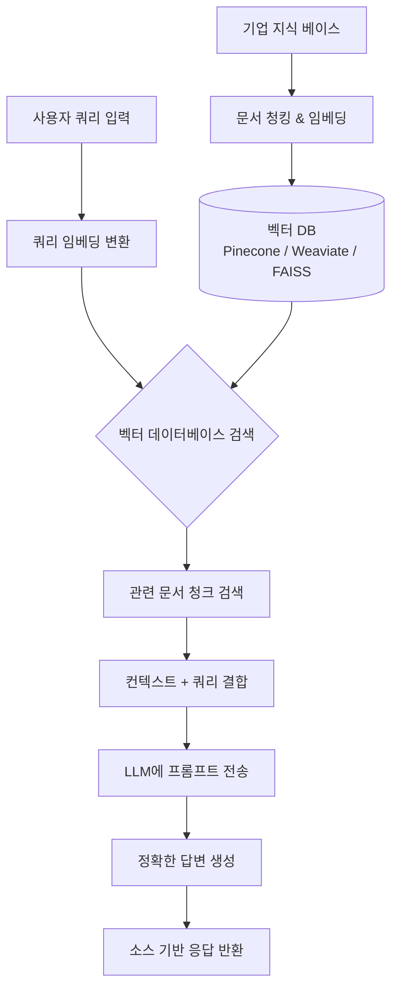
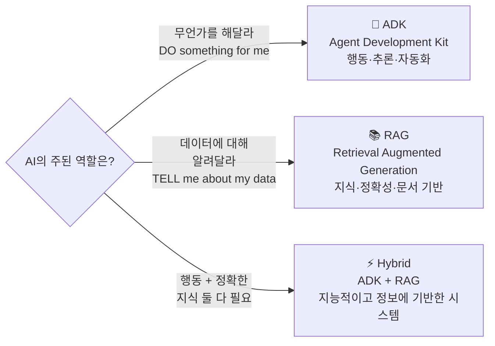
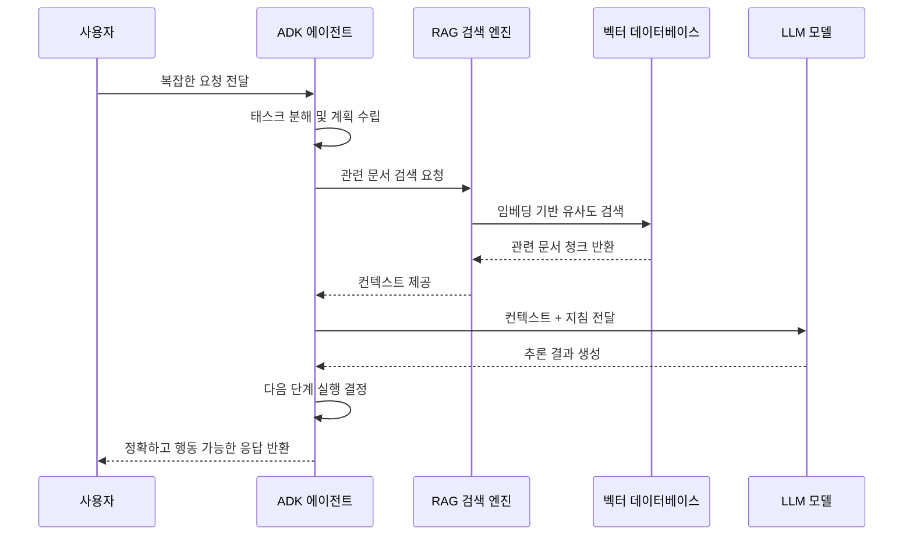
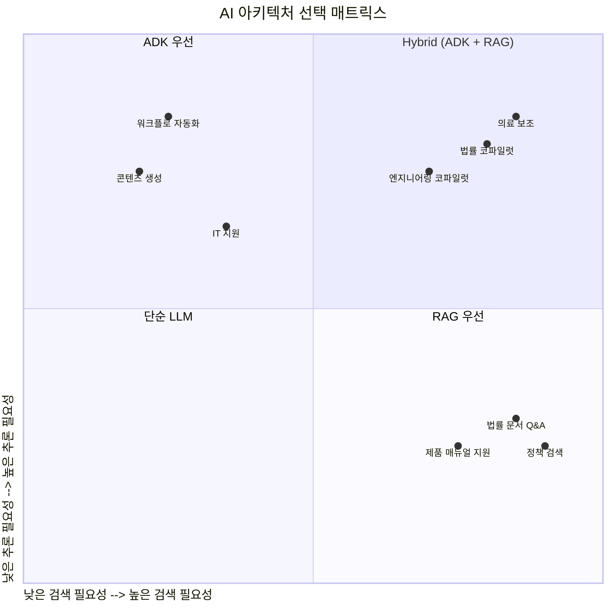
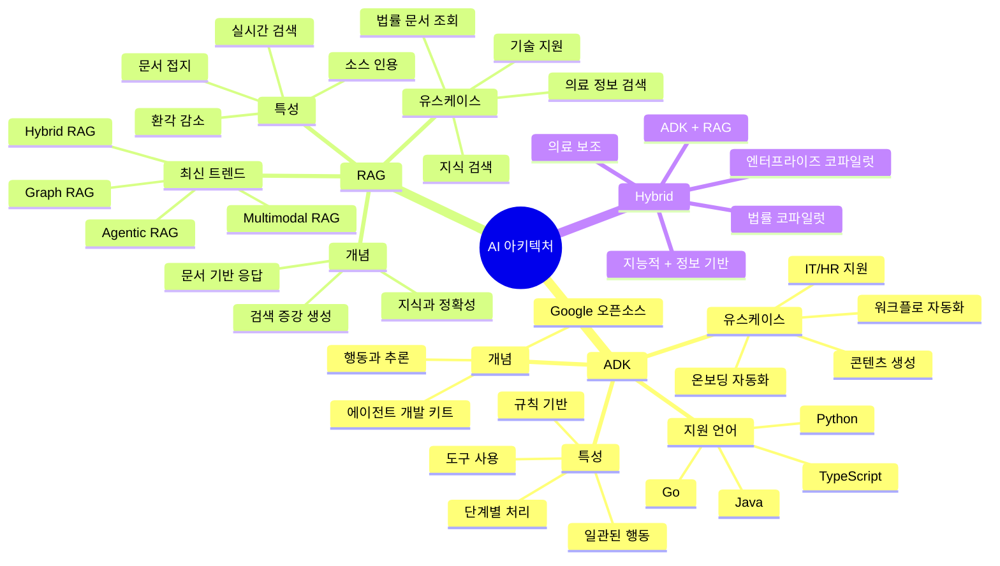

> IBM Technology 영상 해설 및 최신 기술 동향 분석  
> 원본 영상: [ADK vs RAG: How to Choose the Right AI Stack](https://www.youtube.com/watch?v=7HSSR1n8dgc)  
> 발표자: Katie McDonald (IBM Technology)  
> 작성 일자: 2026-04-21

---

## 들어가며: 철물점 비유로 이해하는 AI 아키텍처

영상은 매우 직관적인 비유로 시작된다. 철물점(hardware store)에 프로젝트를 들고 들어가는 장면을 상상해보라. 책장을 만들거나 집안의 무언가를 수리하러 갔을 때, 우리는 두 개의 큰 통로를 마주하게 된다.

**첫 번째 통로 — 도구(Tools) 코너:** 드릴, 톱, 샌더 같은 도구들이 진열되어 있다. 이 도구들은 *작업을 직접 수행*한다. 대상을 향해 겨누면 실제로 일이 일어난다.

**두 번째 통로 — 참고 자료(Reference) 코너:** 책, 도면, 매뉴얼이 가득하다. 이 자료들은 작업을 대신 해주지 않는다. 하지만 작업을 올바르게 수행하기 위해 필요한 *정보*를 제공한다.

AI 시스템을 설계할 때도 동일한 선택에 직면한다. 도구처럼 *행동하는* AI가 필요한가, 아니면 참고 자료처럼 *알고 있는* AI가 필요한가? 이 질문에 대한 답이 곧 **ADK**와 **RAG** 중 무엇을 선택할지를 결정한다.

---

## 1부: ADK — Agent Development Kit (에이전트 개발 키트)

### ADK란 무엇인가?

ADK는 Google이 2025년 Google Cloud NEXT에서 공개한 오픈소스 프레임워크로, AI 에이전트의 빌드·배포·오케스트레이션을 단순화하도록 설계되었다. 영상의 표현을 빌리자면, ADK는 **행동과 추론(Action & Reasoning)** 에 관한 것이다.

ADK 기반 시스템에서 AI 에이전트는 다단계 작업(multi-step tasks)을 수행한다. 워크플로를 호출하고, 도구를 사용하며, 지침을 따르고, 결정을 내린다. 이는 단순한 질문-응답 교환이 아니라, 목표를 향해 자율적으로 진행되는 체계적인 절차다.

### ADK의 핵심 특성

영상에서 화이트보드 왼쪽에 보라색으로 표기된 ADK의 핵심 체크리스트를 정리하면:

| 특성 | 설명 |
|------|------|
| **Step (단계별 추론)** | AI가 순서에 따라 단계를 밟아 나간다 |
| **Tools (도구 사용)** | 외부 시스템, API, 함수 등을 호출할 수 있다 |
| **Rules (규칙 기반)** | 프로세스나 논리를 따라 예측 가능하게 동작한다 |
| **Cons. (일관성)** | 동일한 로직을 반복적으로 신뢰할 수 있게 수행한다 |

이 네 가지 특성이 합쳐지면 ADK 에이전트는 한 번 설정한 후 최소한의 인간 개입으로 자율적으로 작동할 수 있는 시스템이 된다.

### 2026년 기준 ADK의 실제 모습

현재 Google ADK는 Python, Go, Java, TypeScript 등 4개 언어를 지원하며, Gemini 모델에 최적화되어 있지만 모델 불가지론적(model-agnostic)으로 Anthropic, Meta, Mistral 등 다양한 모델과 연동이 가능하다.

ADK의 주요 구성 요소는 다음과 같다:

- **LlmAgent:** LLM 기반의 추론 엔진
- **Tools:** 웹 검색, 코드 실행, MCP(Model Context Protocol) 도구, 외부 API
- **Plugins:** 복잡한 서드파티 서비스를 에이전트 워크플로에 통합
- **ParallelAgent:** 독립적인 작업을 동시에 실행해 처리 속도를 높임
- **Skills:** 컨텍스트 윈도우 한계 내에서 효율적으로 작동하는 사전 구축 능력

ADK는 Vertex AI Agent Engine Runtime이라는 완전 관리형 클라우드 서비스에 배포하거나, 컨테이너화해 어디서든 실행할 수 있는 유연성을 제공한다.

### ADK를 선택해야 할 때

영상에서 Katie McDonald는 ADK를 선택해야 하는 세 가지 핵심 기준을 제시한다:

**① AI가 절차적(procedural)이어야 할 때**
AI가 단순히 정보를 회수하는 것이 아니라, 결정을 내리며 진행해야 하는 경우다. 기억에서 정보를 꺼내는 것이 아니라 *추론을 통해 결정*하는 것이 가치의 원천이다.

**② 신뢰할 수 있고 일관된 행동이 필요할 때**
에이전트가 매번 동일한 논리를 따르면, 평가가 단순해진다. 예외 처리나 비정형 응답에 대한 걱정 없이 예측 가능한 출력을 기대할 수 있다.

**③ 반복적이고 자동화 가능한 태스크일 때**
인간이 일일이 개입하지 않고 AI가 독립적으로 완료할 수 있는 워크플로가 있는 경우다.

### ADK의 적합한 유스케이스

영상에서 언급된 대표적인 유스케이스를 확장하면:

```
- 멀티스텝 워크플로 (Multi-step Workflows)
  └ 여러 단계를 순서대로 처리해야 하는 복잡한 업무 자동화

- 콘텐츠 초안 및 변환 (Content Drafting & Transformation)
  └ 입력 데이터를 받아 특정 형식으로 재구성하거나 새로운 콘텐츠 생성

- IT/HR 지원 (IT/HR Assistance)
  └ 티켓 트리아지, 자동 응답, 직원 온보딩 프로세스 자동화

- 태스크 코디네이션 및 트리아지 (Task Coordination & Triage)
  └ 수신된 요청을 분류하고 적절한 담당자나 시스템에 라우팅

- 폼 작성 자동화 (Form Completion)
  └ 데이터를 수집해 정해진 양식에 자동으로 채워 넣기

- 운영 트리아지 (Operational Triage)
  └ 이상 징후 감지 및 우선순위 설정 자동화
```

---

## 2부: RAG — Retrieval Augmented Generation (검색 증강 생성)

### RAG란 무엇인가?

RAG는 영상에서 **지식과 정확성(Knowledge & Accuracy)** 의 영역으로 정의된다. 모델이 응답하기 전에 문서에 연결하여 필요한 정보를 먼저 검색(retrieve)하는 방식이다.

전통적인 LLM은 학습 데이터라는 정적인 기억에만 의존한다. 규정이 바뀌거나, 새로운 제품 매뉴얼이 출시되거나, 내부 정책이 업데이트되어도 모델은 이를 알지 못한다. RAG는 이 근본적인 한계를 해소한다. 사용자의 쿼리를 받으면, 승인된 지식 저장소에서 가장 관련성 높은 문서를 검색하고, 그 문서를 컨텍스트로 삼아 LLM이 답변을 생성하게 한다.

이를 "오픈 북 시험(open book exam)"에 비유할 수 있다. 모델이 무엇을 기억하고 있는지에 답이 달려 있는 것이 아니라, 응답하기 전에 관련 자료를 *읽고* 나서 답변을 작성하는 방식이다.

### RAG의 작동 원리



### RAG를 선택해야 할 때

영상에서 제시하는 RAG 선택 기준은 명확하다:

**① 데이터 자체가 진실의 원천일 때**
정확성이 반드시 문서에서 직접 나와야 한다. 모델의 내부 추측(guesswork)에 의존해서는 안 되는 경우다.

**② 인간이 기억할 수 없는 정보량을 다룰 때**
대용량, 고세밀도, 지속적으로 변화하는 정보를 처리해야 할 때 RAG가 빛을 발한다.

**③ 질문의 유형이 다양할 때**
"이 주제는 어디에 언급되어 있는가?", "이 보고서는 무엇을 말하는가?", "관련 섹션을 요약해달라"처럼 범위와 형태가 다양한 질문에 유연하게 대응해야 하는 경우다.

### RAG에 적합한 데이터 유형

영상 화이트보드 오른쪽에 주황색으로 표기된 RAG 적합 데이터 목록:

| 데이터 유형 | 설명 및 예시 |
|-------------|-------------|
| **PDFs** | 보고서, 계약서, 논문 등 정형화된 문서 |
| **Policies/Regulations** | 규정, 정책 문서, 컴플라이언스 자료 |
| **Technical Docs** | API 문서, 엔지니어링 가이드, 시스템 매뉴얼 |
| **Product Manuals** | 제품 설명서, 사용 가이드, 트러블슈팅 가이드 |
| **Knowledge Bases** | 내부 위키, FAQ, 학습 자료 등 장문형 지식 저장소 |

### RAG의 적합한 유스케이스

```
- 지식 검색 (Knowledge Search)
  └ "이 약관에서 환불 정책이 어디에 있나?" 같은 문서 내 정보 탐색

- 연구 보조 (Research Assistance)
  └ 방대한 학술 자료나 기업 리포트에서 인사이트 추출

- 법률/의료 문서 조회 (Legal/Medical Document Lookup)
  └ 최신 판례, 규정, 임상 가이드라인에 기반한 정확한 응답

- 문서 기반 기술 지원 (Tech Support Grounded in Documentation)
  └ 제품 문서를 실시간으로 참조하는 고객 지원 시스템
```

### 2026년 RAG 기술 트렌드

최신 자료를 바탕으로 2026년 현재의 엔터프라이즈 RAG 트렌드를 정리하면:

**① 하이브리드 검색(Hybrid Retrieval)**
시맨틱 검색(벡터 기반)과 키워드 검색(BM25)을 결합해 노이즈가 많은 기업 데이터셋에서도 정확도를 높이는 방식이 표준으로 자리잡았다.

**② Graph RAG**
Microsoft의 GraphRAG 등에서 발전한 기술로, 지식 그래프를 활용해 엔티티 간 관계를 보존하면서 검색한다. "이 보고서 전체에서 어떤 테마가 나타나는가?"처럼 전역적 질문에 강하다.

**③ 멀티모달 RAG(Multimodal RAG)**
텍스트뿐 아니라 그래픽, 오디오, 테이블, 비디오 임베딩까지 통합해 더 풍부한 추론이 가능해졌다.

**④ Agentic RAG**
단순한 단일 홉 검색이 아니라, 에이전트가 여러 검색 단계를 계획하고, 도구를 선택하며, 중간 결과를 반성해 복잡한 과제에 대응하는 방식이다.

**⑤ Self-RAG**
모델이 언제 검색할지 스스로 결정하고, 검색된 내용의 관련성을 평가하며, 자신의 출력을 비평하는 자기 반성 메커니즘을 갖춘 고급 RAG 프레임워크다.

RAG 시장 규모는 2024년 기준 18.5억 달러에 달하며, 49% CAGR로 성장 중이다.

---

## 3부: 핵심 판단 기준 — 행동인가, 기억인가?

영상 전체를 관통하는 핵심 질문은 단 하나다:

> **"당신의 AI는 행동(Act)하도록 설계되어야 하는가, 아니면 기억(Recall)하도록 설계되어야 하는가?"**

이 질문에 대한 대답이 아키텍처 선택의 나침반이 된다.



---

## 4부: 하이브리드 접근법 — ADK + RAG

### 왜 대부분의 실제 시스템은 둘 다 사용하는가?

영상에서 화이트보드 중앙에 원으로 강조된 "Hybrid"는 현실 세계 AI 시스템의 진실을 담고 있다. 대부분의 실제 기업용 AI 시스템은 ADK와 RAG를 엄격하게 구분하여 선택하지 않는다. 두 가지를 함께 사용한다.

하이브리드 시스템에서의 역할 분담:

- **ADK → 태스크 흐름 담당:** 어떤 단계를 어떤 순서로 실행할지, 어떤 도구를 언제 호출할지, 어떤 판단을 내릴지를 관장한다.
- **RAG → 정확한 정보 공급:** 에이전트가 의사결정을 내릴 때 필요한 근거 자료를 문서에서 검색해 제공한다.

이 결합이 만들어내는 시스템의 특성을 영상 화이트보드의 표현으로 정리하면:

> **"Intelligent(지능적) + Well-informed(충분한 정보를 가진) = Hybrid"**

### 하이브리드 시스템의 동작 흐름



### 하이브리드 시스템의 유스케이스

**법률/엔지니어링 코파일럿 (Legal/Engineering Co-pilots)**
엔지니어가 설계 문서를 검토하고 수정을 제안할 때, RAG는 최신 표준과 규정을 검색하고, ADK는 수정 프로세스를 단계적으로 안내한다.

**의료 보조 시스템 (Healthcare Assistants)**
환자 증상을 입력받아, RAG는 최신 임상 가이드라인과 연구를 검색하고, ADK는 진단 프로세스를 구조화하여 의사의 의사결정을 지원한다.

**엔터프라이즈 태스크 코파일럿 (Enterprise Task Co-pilots)**
복잡한 비즈니스 프로세스에서 도메인 지식이 필요할 때, ADK가 워크플로를 조율하고 RAG가 그 시점에 필요한 정책이나 가이드라인을 실시간으로 제공한다.

**도메인 전문가 코파일럿 (Domain Expert Co-pilots)**
깊은 검색(Deep Retrieval)과 복잡한 추론(Complex Reasoning)이 동시에 필요한 경우, 예를 들어 금융 리스크 분석이나 공급망 최적화 같은 업무에서 강력한 성능을 발휘한다.

---

## 5부: 아키텍처 선택 매트릭스

다음 매트릭스를 활용하면 아키텍처 선택이 더욱 명확해진다:



### 유스케이스별 빠른 참조표

| 유스케이스 | 추론 필요도 | 검색 필요도 | 권장 아키텍처 |
|------------|-----------|-----------|--------------|
| 콘텐츠 생성 | 높음 | 낮음 | ADK |
| 워크플로 자동화 | 높음 | 낮음 | ADK |
| IT/HR 지원 | 중간 | 낮음 | ADK |
| 멀티스텝 프로세스 | 높음 | 낮음 | ADK |
| 내부 문서 검색 | 낮음 | 높음 | RAG |
| 정책/규정 Q&A | 낮음 | 높음 | RAG |
| 기술 지원(문서 기반) | 낮음 | 높음 | RAG |
| 연구 보조 | 중간 | 높음 | RAG |
| 법률/엔지니어링 코파일럿 | 높음 | 높음 | **Hybrid** |
| 의료 보조 시스템 | 높음 | 높음 | **Hybrid** |
| 도메인 전문가 코파일럿 | 높음 | 높음 | **Hybrid** |
| 엔터프라이즈 태스크 코파일럿 | 높음 | 높음 | **Hybrid** |

---

## 6부: 철물점 비유의 귀환 — 완전한 그림

영상은 시작과 같은 철물점 비유로 마무리된다. 이제 이 비유의 의미가 훨씬 더 풍부하게 다가온다.

> **ADK는 도구 코너다.** 단계를 수행하고, 행동하며, 만든다.  
> **RAG는 참고 자료 코너다.** 정보를 제공하고, 작업의 근거를 사실에 두게 한다.  
> **성공적인 프로젝트 대부분은 두 코너를 모두 활용한다.** 도구로 만들고, 가이드로 올바르게 만든다.

그리고 이것이 바로 AI 스택 선택의 본질이다:

> **"당신의 AI는 행동해야 하는가, 알아야 하는가, 아니면 둘 다인가? 이 질문에 답할 수 있다면 아키텍처는 명확해진다."**

---

## 7부: ADK vs RAG 최종 비교 요약



ADK와 RAG는 서로 경쟁하는 기술이 아니라, 각자 다른 문제를 해결하기 위해 설계된 상호 보완적인 아키텍처다.

**ADK**는 AI가 무언가를 *수행*해야 할 때 선택한다. 에이전트가 단계별로 추론하고, 외부 도구를 호출하며, 규칙에 따라 일관된 결과를 만들어내는 것이 핵심 강점이다. 가치의 원천은 정보의 보유가 아니라 *추론 능력* 그 자체에 있다. 워크플로 자동화, 콘텐츠 변환, IT·HR 지원처럼 반복 가능하고 예측 가능한 절차가 필요한 업무에 탁월하다. Google이 2025년 공개한 오픈소스 프레임워크로, Python·TypeScript·Java·Go 네 가지 언어를 지원하며 Gemini를 포함한 다양한 LLM과 연동된다.

**RAG**는 AI가 무언가를 *정확히 알아야* 할 때 선택한다. 모델의 정적인 학습 데이터에 의존하지 않고, 응답 시점에 실제 문서를 검색해 그 내용을 근거로 답변을 생성한다. 환각(hallucination)을 줄이고 출처를 명확히 제시할 수 있다는 점에서 컴플라이언스와 정확성이 중요한 기업 환경에 적합하다. PDF, 정책 문서, 기술 매뉴얼, 내부 지식 베이스처럼 방대하고 지속적으로 변화하는 데이터를 다루는 지식 검색, 법률·의료 문서 조회, 문서 기반 기술 지원 등의 유스케이스에서 강점을 발휘한다.

**Hybrid(ADK + RAG)** 는 현실 세계 대부분의 엔터프라이즈 AI 시스템이 선택하는 방향이다. ADK가 태스크의 흐름과 의사결정을 관장하고, RAG가 그 과정에서 필요한 정확한 지식을 실시간으로 공급한다. 단순히 지능적인 것도, 단순히 정보가 풍부한 것도 아닌, *지능적이면서 동시에 충분한 정보를 갖춘* 시스템을 만드는 것이 하이브리드 접근법의 목표다. 법률·엔지니어링 코파일럿, 의료 보조 시스템, 도메인 전문가 코파일럿처럼 깊은 추론과 정밀한 검색이 동시에 요구되는 고난도 유스케이스에서 가장 큰 위력을 발휘한다.

결국 아키텍처 선택은 한 가지 질문으로 귀결된다. AI가 *행동*해야 하는가, *알아야* 하는가, 아니면 *둘 다*인가. 이 질문에 답할 수 있다면 최적의 아키텍처는 자연스럽게 드러난다.

---

## 참고 자료

- IBM Technology YouTube 채널: [ADK vs RAG 영상](https://www.youtube.com/watch?v=7HSSR1n8dgc)
- Google ADK 공식 문서: [google.github.io/adk-docs](https://google.github.io/adk-docs)
- Google ADK GitHub (Python): [github.com/google/adk-python](https://github.com/google/adk-python)
- Vertex AI Agent Engine: [Google Cloud Documentation](https://docs.cloud.google.com/agent-builder/agent-development-kit/overview)
- RAG 엔터프라이즈 가이드 2026: Techment, Squirro, DataNucleus
- IBM AI Stacks 추가 학습: [ibm.biz/Bdpm3A](https://ibm.biz/Bdpm3A)

---

*작성 일자: 2026-04-21*
