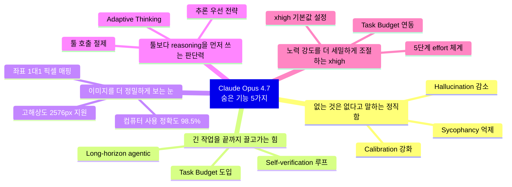
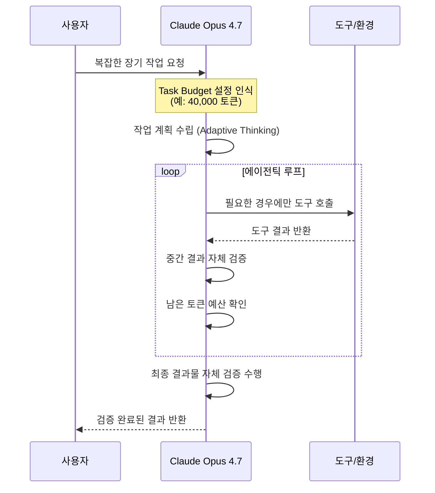
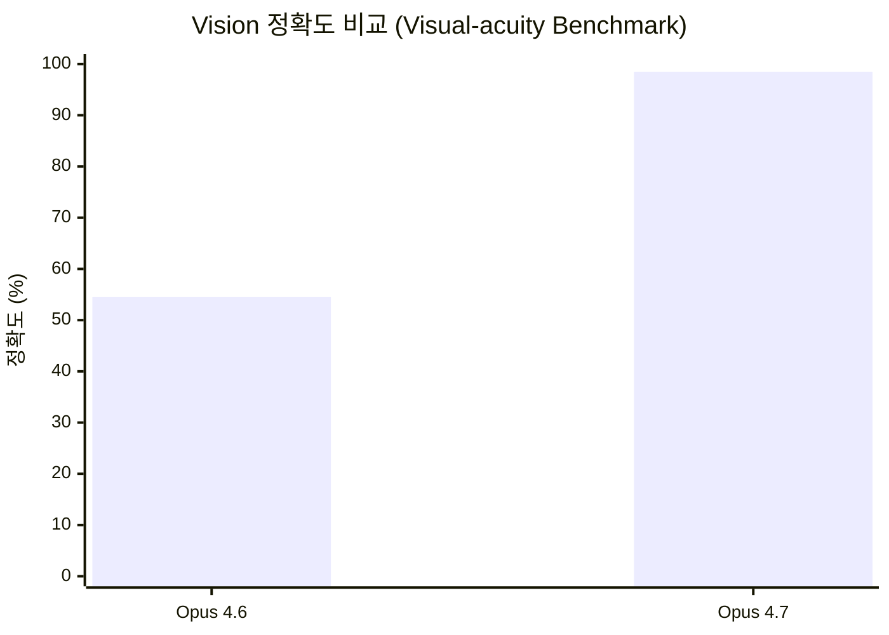
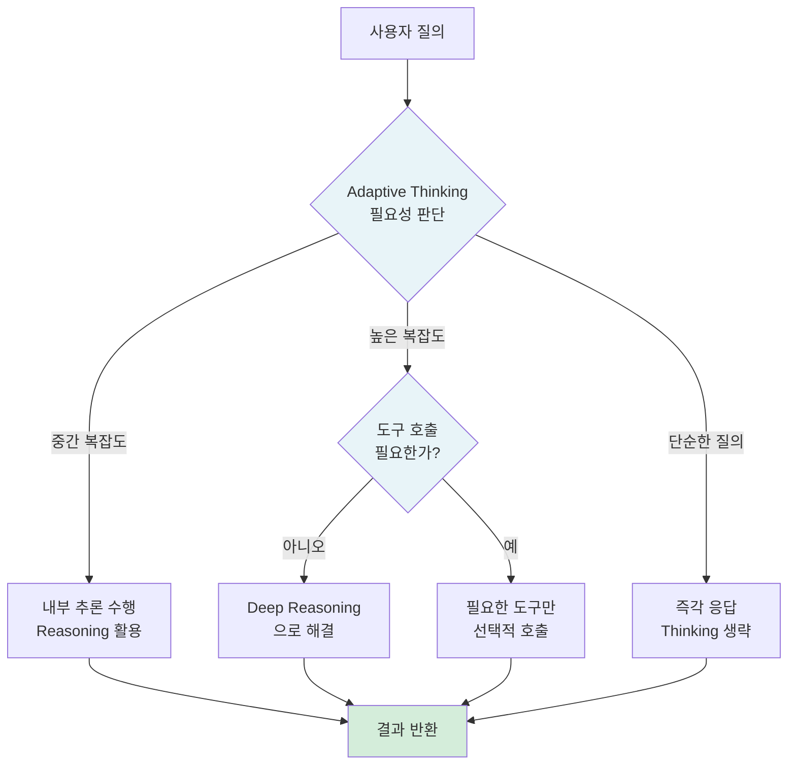
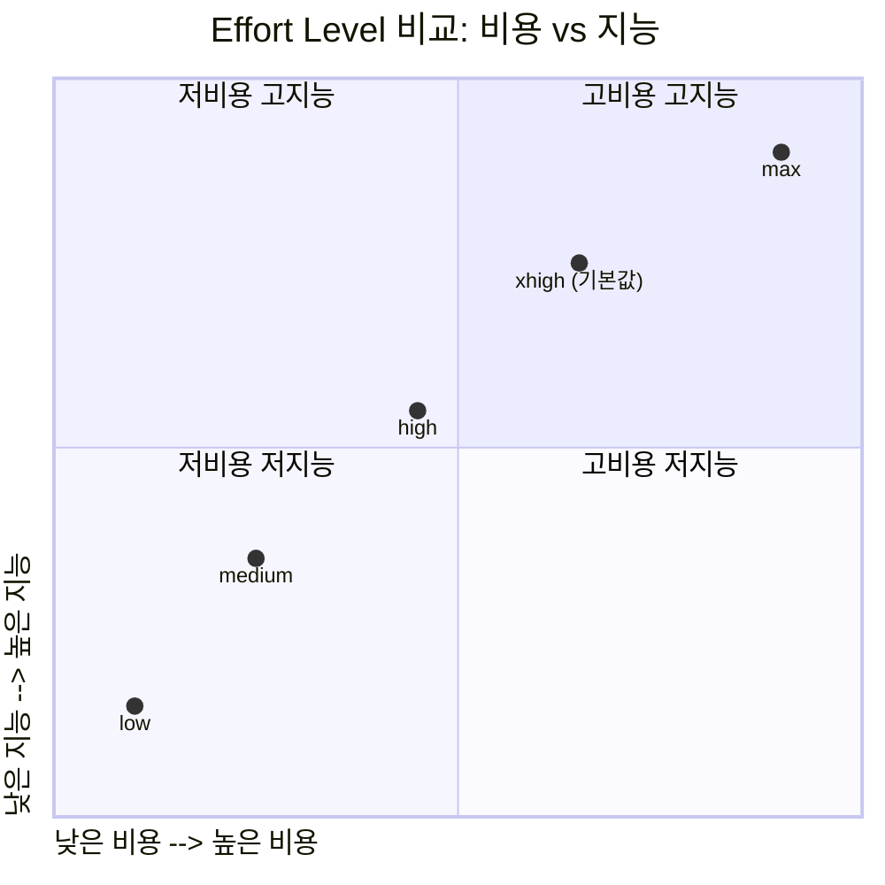
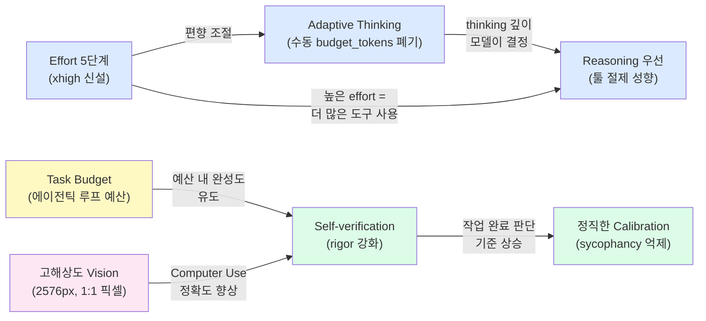

> 원문 출처: [@aiaiaikorea on Threads](https://www.threads.com/@aiaiaikorea/post/DXWr5tKEjzv)  
> 작성 기준일: 2026년 4월 21일  
> 모델 출시일: 2026년 4월 16일  
> 모델 식별자: `claude-opus-4-7`

---

## 들어가며: "더 똑똑해졌다"보다 "더 흔들리지 않는다"

Claude Opus 4.7은 2026년 4월 16일 Anthropic이 공식 출시한 현재 시점 가장 강력한 일반 공개 모델이다. 벤치마크 수치 경쟁에서 OpenAI GPT-5.4, Google Gemini 3.1 Pro와 박빙의 우열을 가리고 있지만, 실제 현업에서 Opus 4.7을 써본 사람들의 반응은 숫자보다 훨씬 생생하다. Intuit의 기술 부사장 Clarence Huang은 "계획 단계에서 스스로 논리적 결함을 잡아낸다"고 했고, Replit의 Michele Catasta는 "진짜 더 나은 동료 같다"는 표현을 썼다. 이것이 이 모델을 이해하는 핵심 프레임이다.

이 문서는 [@aiaiaikorea](https://www.threads.com/@aiaiaikorea) 계정이 Threads에 올린 현장 체감 후기 5가지를 출발점으로 삼아, 각 기능의 기술적 배경, 실제 동작 원리, 그리고 실무 활용 전략을 상세히 풀어낸다.



---

## 기능 1. 없는 데이터는 없다고 말하는 정직함 — Calibration 강화

### 현장에서 느낀 변화

원문 작성자는 "오답을 그럴듯하게 밀어붙이기보다, 없는 데이터는 없다고 말하는 편이 강해졌습니다"라고 표현했다. 이 변화는 AI를 실제 업무에 쓰는 사람이라면 누구나 즉각 이해할 것이다. 할루시네이션(hallucination)은 단순히 틀린 정보를 출력하는 것이 아니라, 그것을 자신 있게 출력한다는 점에서 문제다. AI가 모르는 걸 모른다고 말하지 않으면, 검수를 하지 않는 사용자는 틀린 정보를 신뢰하게 된다.

### 기술적 배경

Anthropic이 Opus 4.7의 공식 문서와 출시 블로그에서 강조한 표현 중 하나가 "rigor(엄밀함)"다. 이것은 단순히 정확도 숫자를 올린다는 의미가 아니라, 모델이 응답을 내놓기 전에 **스스로 검증 단계를 거치도록 재훈련**했다는 의미다.

Anthropic의 내부 테스트에서 Opus 4.7은 Rust 기반 텍스트-음성 변환 엔진을 스스로 만들고, 생성된 오디오를 별도의 음성 인식기로 재확인한 뒤 Python 레퍼런스와 비교하는 과정을 자발적으로 수행했다. 이것은 단순히 코드를 생성하는 모델이 아니라, 결과물을 **검증까지 완료해야 작업이 끝났다고 판단**하는 모델임을 보여준다.

또한 Anthropic은 Opus 4.7의 낮은 기만성(low deception)과 낮은 아첨성(low sycophancy) 점수를 안전 지표로 명시하고 있다. Sycophancy란 사용자가 원하는 답을 들으려 한다는 암시를 보낼 때 모델이 틀린 답을 옳다고 동조하는 현상인데, Opus 4.7은 이 경향이 이전 모델 대비 억제되어 있다.

### 실무 함의

현업에서 이 변화가 의미하는 바는 크다. 법무, 금융 분석, 의료 보조 등 사실 정확성이 중요한 영역에서 AI가 "모른다"고 말하는 것은 사실 가장 안전한 응답이다. 이제 Opus 4.7은 근거 없는 추론을 자신감 있게 내놓기보다, 불확실한 영역에서는 명시적으로 그 한계를 표현하는 경향이 강해졌다.

실질적으로 이것은 사용자가 AI 결과물을 100% 검수해야 하는 부담이 줄어드는 방향으로 작동한다. 물론 여전히 검수는 필요하지만, "모델이 틀렸는데 확신하는 척했다"는 상황이 줄어드는 것만으로도 실무 효율은 크게 달라진다.

---

## 기능 2. 긴 작업을 끝까지 끌고 가는 힘 — Long-horizon Agentic 완성도

### 현장에서 느낀 변화

"긴 작업을 끝까지 끌고 가는 힘이 좋아졌습니다. 중간에 멈추지 않고 검증까지 하려는 성향이 강합니다." 이것은 에이전틱 워크플로우에 Claude를 써온 사람이라면 가장 기대하는 개선이다. 이전 세대 모델들은 복잡한 멀티스텝 작업에서 중간에 컨텍스트가 흐트러지거나, 작업을 완료하기 전에 사용자에게 확인을 요청하거나, 아예 결론 없이 멈추는 경우가 있었다.

### 기술적 배경

Opus 4.7의 장기 작업 능력 강화는 두 가지 축으로 이루어져 있다.

**첫째, Self-verification 루프의 내면화다.** 모델은 이제 작업을 완료했다고 선언하기 전에 자체적인 검증 단계를 만든다. 앞서 언급한 Rust TTS 엔진 예시처럼, 코드를 생성하는 것에서 끝나지 않고 그것이 실제로 작동하는지 확인하는 과정을 스스로 설계하고 실행한다. 이것이 "검증까지 하려는 성향"이다.

**둘째, Task Budget(태스크 버짓)의 도입이다.** Opus 4.7은 에이전틱 루프 전체에 걸쳐 토큰 예산을 부여받는 신기능을 갖추고 있다. 이 기능은 현재 퍼블릭 베타 상태(`task-budgets-2026-03-13` 베타 헤더 사용)로 제공된다. Task Budget은 thinking, 툴 호출, 툴 결과, 최종 출력 전체를 아우르는 대략적인 토큰 목표치를 모델에게 제공한다. 모델은 실시간 카운트다운을 보면서 예산이 소진될수록 작업을 우선순위화하고 우아하게 마무리하는 방향으로 행동한다.



Task Budget이 중요한 이유는 단순한 비용 관리 수단이 아니기 때문이다. 이것은 모델이 **무한정 사고하다가 컨텍스트가 끊기는 현상**을 예방하고, 주어진 자원 안에서 완성도 있는 결과물을 내도록 유도하는 구조적 장치다. 최소 20,000토큰 이상 설정해야 하며, 어디까지나 권고 수치(advisory)이지 하드 캡(hard cap)은 아니다.

### 실무 함의

코드베이스 마이그레이션, 레거시 코드 리팩토링, 대용량 문서 분석, 다단계 데이터 처리 파이프라인 등 수 시간이 걸리는 작업에서 이 변화는 게임 체인저가 된다. 이전에는 긴 작업을 잘게 쪼개서 단계별로 사람이 개입해야 했다면, 이제는 충분한 컨텍스트를 한 번에 제공하고 결과를 기다리는 방식이 가능해진다.

---

## 기능 3. 이미지를 더 정밀하게 보는 눈 — 고해상도 Vision 지원

### 현장에서 느낀 변화

"이미지를 더 정밀하게 봅니다. 고해상도 이미지 입력 지원이 강화돼 UI, 화면, 자료 해석 쪽 체감이 큽니다." UI 스크린샷, 디자인 목업, 데이터 시각화 이미지, 문서 스캔 등 시각적 입력을 다루는 작업에서 직접적으로 느낄 수 있는 변화다.

### 기술적 배경

Opus 4.7은 **Anthropic 최초로 고해상도 이미지 입력을 지원하는 Claude 모델**이다. 최대 이미지 해상도가 기존 1568px / 1.15MP에서 **2576px / 3.75MP**로 대폭 향상되었다. 이것은 단순히 더 큰 이미지를 처리하는 것이 아니라, 이전에는 압축되어 손실되던 디테일을 실제로 인식할 수 있게 되었다는 의미다.

더 중요한 변화는 **좌표 시스템의 단순화**다. 이전 모델들은 이미지 내 좌표를 참조할 때 스케일 팩터 계산이 필요했다. Opus 4.7에서는 모델의 좌표가 실제 픽셀과 1:1로 대응되어, 별도의 수학적 변환 없이 화면의 특정 지점을 정확하게 지칭할 수 있다. 컴퓨터 사용(Computer Use) 기능에서 이 변화는 특히 중요하다.

실제 벤치마크 결과도 극적이다. XBOW의 자율 침투 테스트에서 **시각적 정확도 벤치마크(Visual-acuity benchmark)가 Opus 4.6의 54.5%에서 Opus 4.7에서 98.5%로 급등**했다. 이것은 단순한 수치 개선이 아니라, 신뢰할 수 없는 수준에서 신뢰할 수 있는 수준으로의 전환을 의미한다.



### 실무 함의

이 변화가 가장 크게 체감되는 영역은 다음과 같다.

**UI/UX 작업**: 고해상도 디자인 목업이나 프로토타입 스크린샷을 입력하면, 모델이 미세한 간격, 폰트 크기, 색상 코드 등을 더 정확하게 읽어낸다. 디자인 피드백이나 HTML/CSS 구현 요청의 정확도가 크게 높아진다.

**문서 이해**: 복잡한 테이블, 수식이 포함된 학술 논문, 스캔된 계약서 등에서 이전에는 흐릿하게 인식되던 내용이 명확하게 처리된다.

**컴퓨터 사용(Computer Use)**: 자율 에이전트가 화면을 보면서 클릭, 타이핑, 스크롤 등을 수행할 때, 인식 정확도가 높아진 만큼 오작동이 줄어든다.

주의해야 할 점도 있다. 고해상도 이미지는 더 많은 토큰을 소비한다. Anthropic은 추가적인 이미지 정밀도가 실제로 필요하지 않다면, 이미지를 다운샘플링해서 전송하도록 권고한다.

---

## 기능 4. 툴을 덜 써도 더 잘 풀 때가 있다 — Reasoning 우선 전략

### 현장에서 느낀 변화

"툴을 덜 써도 더 잘 풀 때가 있습니다. 예전보다 무조건 툴 호출부터 하기보다 reasoning을 더 쓰는 방향이 보입니다." 이것은 AI 에이전트 아키텍처를 설계해본 사람이라면 곧바로 중요성을 파악하는 관찰이다.

### 기술적 배경

Anthropic의 공식 마이그레이션 가이드는 이 변화를 명확하게 명시하고 있다: **"Claude Opus 4.7은 Claude Opus 4.6보다 툴을 덜 사용하고 reasoning을 더 활용하는 경향이 있습니다. 대부분의 경우 이것이 더 나은 결과를 만들어냅니다."**

이 변화는 Adaptive Thinking 구조와 깊이 연결되어 있다. Opus 4.7은 고정된 thinking budget을 미리 받는 방식(이전 `budget_tokens` 파라미터)을 더 이상 지원하지 않는다. 대신, **Adaptive Thinking**이라는 방식으로 각 단계에서 thinking이 필요한지를 모델이 스스로 판단한다. 단순한 쿼리에는 빠르게 응답하고, 복잡한 단계에서만 깊은 추론에 투자하는 방식이다.

이것이 가져오는 실질적 변화는, 모델이 반사적으로 웹 검색이나 코드 실행 도구를 호출하던 패턴에서, **먼저 내부적으로 추론**해서 해결할 수 있는지 판단하고, 정말 필요한 경우에만 도구를 사용하는 방향으로 이동했다는 것이다.



### 왜 이것이 더 나은가

직관적으로는 도구를 더 많이 쓸수록 더 정확할 것 같지만, 실제로는 그렇지 않다. 불필요한 도구 호출은 다음과 같은 문제를 만든다.

**지연 시간 증가**: 툴 호출은 네트워크 왕복 시간과 처리 지연을 포함한다. 내부 추론으로 해결 가능한 문제에 굳이 외부 도구를 거치면 응답이 느려진다.

**토큰 소비 증가**: 도구 호출 결과는 컨텍스트 윈도우를 채운다. 불필요한 툴 결과가 쌓이면 정작 중요한 컨텍스트가 밀려날 수 있다.

**에러 전파**: 도구가 잘못된 결과를 반환하면 그 에러가 이후 추론에 영향을 준다. 내부 추론으로 해결할 수 있다면 이 위험을 원천 차단한다.

실무에서 이 변화의 의미는 "에이전트가 도구를 쓰지 않고도 더 많은 걸 해결한다"가 아니라, "에이전트가 도구를 써야 할 때와 쓰지 말아야 할 때를 더 잘 안다"에 가깝다.

### 개발자 관점 주의사항

반대로, 도구를 더 많이 쓰기를 원한다면 effort 설정을 높이면 된다. Anthropic의 가이드에 따르면 **high 또는 xhigh effort 설정은 에이전틱 검색과 코딩에서 도구 사용량을 실질적으로 늘린다**. 또한 프롬프트에서 도구를 언제, 어떻게 써야 하는지 명시적으로 지시하는 방법도 있다.

---

## 기능 5. 노력 강도 조절이 더 세밀해졌다 — xhigh Effort Level 도입

### 현장에서 느낀 변화

"노력 강도 조절이 더 세밀해졌습니다. 'xhigh'가 추가돼 속도와 깊이 사이를 더 정교하게 조절할 수 있습니다." 이것은 단순한 파라미터 추가처럼 보이지만, 실제로는 Anthropic이 Claude를 운영 환경에서 어떻게 통제하는지에 대한 철학적 전환을 담고 있다.

### 기술적 배경

Opus 4.7에서 effort 파라미터의 전체 스케일은 다음과 같이 재편되었다.

```
low → medium → high → xhigh → max
```

이전 세대(Opus 4.6)까지는 `low → medium → high → max`의 4단계였다. 여기서 `high`와 `max` 사이의 간격이 너무 컸다. `max`는 오버킬이지만 `high`로는 부족한 작업 — 예를 들어 API/스키마 설계, 레거시 코드 마이그레이션, 대규모 코드베이스 리뷰 — 이 존재했다. `xhigh`는 바로 이 간극을 채우기 위해 설계되었다.



특히 중요한 것은 **Opus 4.7에서 Claude Code의 기본 effort 값이 `xhigh`로 설정**되었다는 점이다. 이것은 대부분의 코딩 작업에서 `xhigh`가 최적의 지능-속도-비용 균형점이라는 Anthropic의 판단이 반영된 것이다.

| Effort 수준 | 권장 사용 시나리오 | 특징 |
|-------------|-------------------|------|
| **low** | 고볼륨, 지연민감, 명확한 단순 작업 | 빠르고 저렴, 복잡한 추론 제한 |
| **medium** | 채팅, 비코딩 고속 처리 | low보다 균형, 코딩엔 부족 |
| **high** | 동시 세션 운영, 비용 절감 필요 시 | 지능-비용 균형, 품질 소폭 감소 |
| **xhigh** ⭐ | 대부분의 코딩/에이전틱 작업 | **Claude Code 기본값**, 최적 균형 |
| **max** | 주 1회 가장 어려운 단일 작업 | 가장 강력하지만 느리고 비쌈 |

### Adaptive Thinking과의 결합

`xhigh` effort의 의미를 더 깊이 이해하려면 Adaptive Thinking과의 관계를 알아야 한다. Opus 4.7에서는 이전처럼 `budget_tokens`를 수동으로 지정하는 방식이 완전히 제거되었다. 이제 thinking 깊이는 전적으로 모델이 판단하며, `effort` 파라미터는 그 판단에 **편향(bias)** 을 가하는 역할을 한다.

즉, `xhigh`로 설정하면 모델은 동일한 문제에 대해 `high`일 때보다 더 많은 reasoning 토큰을 쓰겠다는 내부 결정을 내릴 가능성이 높아진다. 이것이 단순한 숫자 조절이 아닌 이유다. 모델의 **사고 투자 의향 자체**를 조율하는 것이다.

### Task Budget과의 연동

`xhigh`를 사용할 때는 Task Budget과 함께 쓰는 것을 권장한다. xhigh나 max에서는 `max_tokens`를 최소 64,000 이상으로 설정해야 모델이 충분히 생각하고 행동할 공간을 갖는다. API 예시는 다음과 같다.

```python
response = client.beta.messages.create(
    model="claude-opus-4-7",
    max_tokens=64000,
    thinking={"type": "adaptive"},
    output_config={
        "effort": "xhigh",
        "task_budget": {
            "type": "token_count",
            "token_count": 40000
        }
    },
    messages=[{"role": "user", "content": "..."}],
    betas=["task-budgets-2026-03-13"]
)
```

### Claude Code에서의 설정

Claude Code 환경에서는 `/effort xhigh` 명령으로 즉시 전환할 수 있으며, CLI에서는 `--effort xhigh` 플래그를 사용한다. 기존 Opus 4.6을 쓰던 사용자라면 4.7로 전환 시 자동으로 xhigh가 기본값으로 적용된다.

---

## 5가지 기능의 연결 구조

이 5가지 변화는 독립적인 기능이 아니라 하나의 큰 설계 철학에서 비롯된 연결된 개선들이다. 아래 다이어그램은 그 관계를 보여준다.



핵심은 이렇다. Anthropic은 Opus 4.7에서 **모델이 얼마나 생각할지를 사람이 수동으로 정하는 방식에서, 모델이 스스로 판단하되 사람이 그 경향을 조율하는 방식으로 전환**했다. Adaptive Thinking + effort 파라미터는 이 철학의 기술적 구현이다. 그리고 이 구조 위에서 self-verification, reasoning 우선 전략, 정직한 calibration이 자연스럽게 작동한다.

---

## 주요 스펙 변화 요약

| 항목 | Opus 4.6 | Opus 4.7 |
|------|----------|----------|
| 출시일 | 2026년 2월 5일 | 2026년 4월 16일 |
| 최대 이미지 해상도 | 1568px / 1.15MP | **2576px / 3.75MP** |
| 이미지 좌표 시스템 | 스케일 팩터 계산 필요 | **1:1 픽셀 매핑** |
| Effort 단계 | low/medium/high/max | **low/medium/high/xhigh/max** |
| Claude Code 기본 effort | medium | **xhigh** |
| Thinking 방식 | budget_tokens (수동) | **Adaptive Thinking (자동)** |
| Task Budget | 미지원 | **퍼블릭 베타 지원** |
| 컨텍스트 윈도우 | 1M 토큰 | 1M 토큰 (동일) |
| 최대 출력 토큰 | 128k | 128k (동일) |
| 가격 (입력/출력) | $5/$25 per 1M tokens | **$5/$25 per 1M tokens (동일)** |
| 토크나이저 | 이전 버전 | **신규 (입력 1.0~1.35x 증가 가능)** |
| Temperature/top_p/top_k | 지원 | **제거 (400 에러)** |
| /ultrareview 명령 | 미지원 | **Claude Code 신규 지원** |
| CursorBench 점수 | 58% | **70%** |
| Visual-acuity 점수 | 54.5% | **98.5%** |

---

## 결론: 더 끝까지, 더 덜 흔들리게

원문 작성자의 결론이 가장 정확하다. **"더 똑똑해졌다"보다 "더 끝까지, 더 덜 흔들리게 일한다"에 가까운 것 같습니다.**

Opus 4.7의 개선은 벤치마크 숫자 경쟁에서의 승리보다 더 중요한 것을 겨냥하고 있다. 그것은 **AI가 실제 업무 파트너로 신뢰받을 수 있는 조건**이다. 모르면 모른다고 말하고, 시작한 일은 검증까지 완료하고, 도구가 필요하지 않으면 쓰지 않고, 이미지를 실제로 '읽어내고', 그 모든 과정을 얼마나 깊이 수행할지를 상황에 맞게 조율한다.

이것이 Anthropic이 "rigor(엄밀함)"라는 단어로 Opus 4.7을 설명하는 이유다. 그리고 이것이 현업에서 AI를 쓰는 사람들이 이 모델을 보면서 처음으로 "의존할 수 있겠다"는 느낌을 받기 시작하는 이유이기도 하다.

---

## 참고 자료

- [Anthropic 공식 문서: What's new in Claude Opus 4.7](https://platform.claude.com/docs/en/about-claude/models/whats-new-claude-4-7)
- [Anthropic 공식 문서: Effort 파라미터](https://platform.claude.com/docs/en/build-with-claude/effort)
- [Anthropic 공식 문서: Adaptive Thinking](https://platform.claude.com/docs/en/build-with-claude/adaptive-thinking)
- [Anthropic 공식 문서: Migration Guide](https://platform.claude.com/docs/en/about-claude/models/migration-guide)
- [Anthropic 블로그: Claude Code에서 Opus 4.7 활용 모범 사례](https://claude.com/blog/best-practices-for-using-claude-opus-4-7-with-claude-code)
- [VentureBeat: Anthropic releases Claude Opus 4.7](https://venturebeat.com/technology/anthropic-releases-claude-opus-4-7-narrowly-retaking-lead-for-most-powerful-generally-available-llm)
- [원문 Threads 포스트: @aiaiaikorea](https://www.threads.com/@aiaiaikorea/post/DXWr5tKEjzv)
