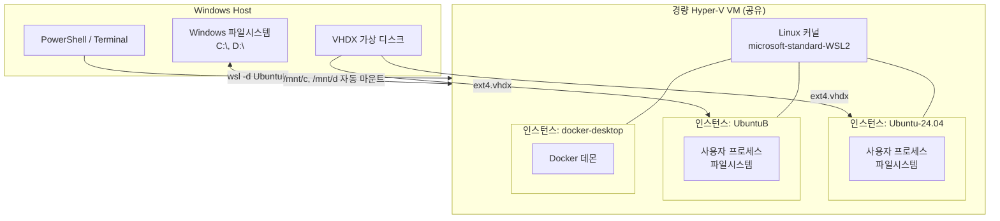
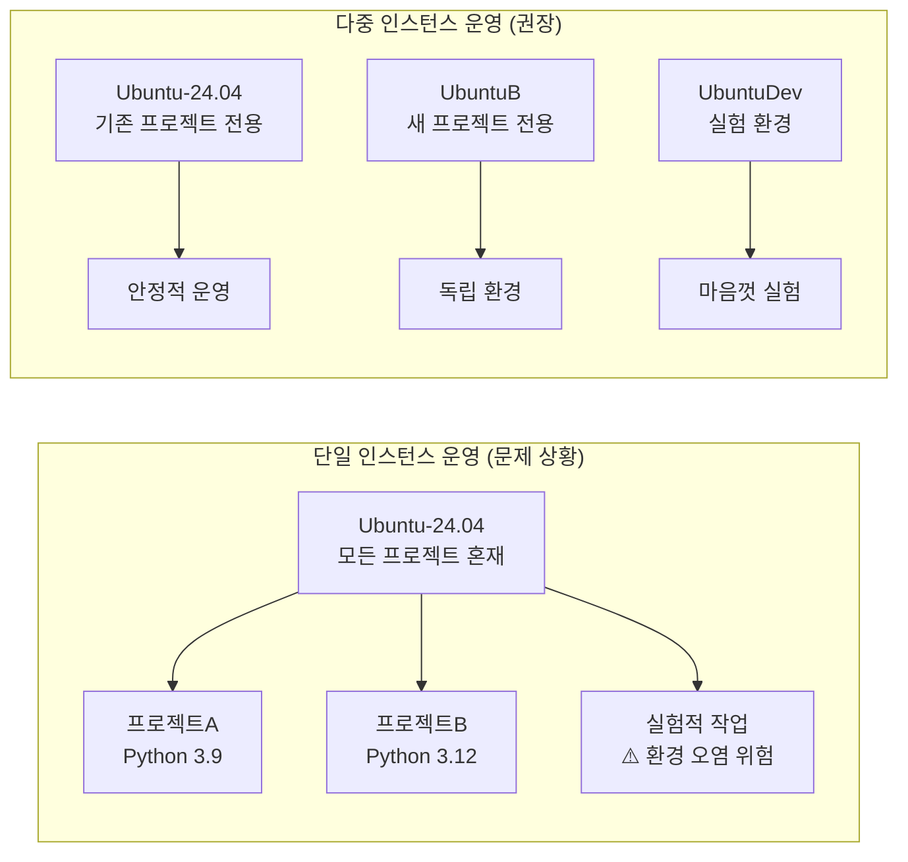
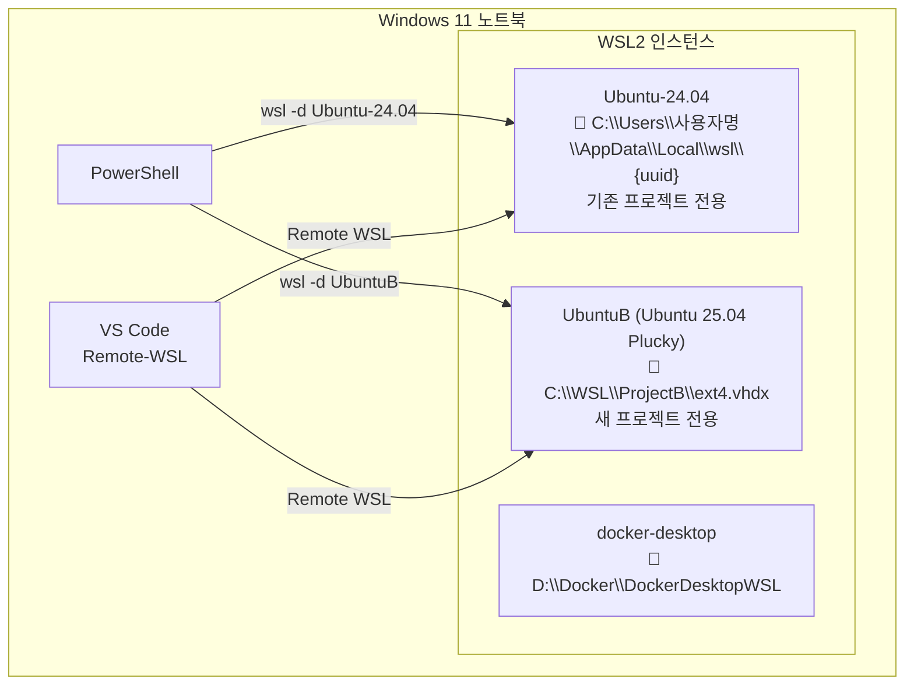
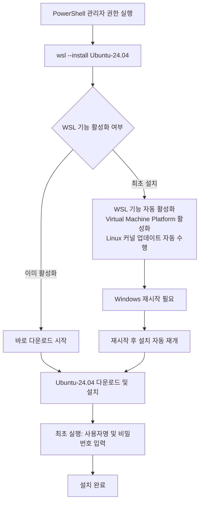

> **작성일:** 2026-04-21  
> **대상 환경:** Windows 10/11 + WSL2  
> **검증 환경:** Windows 11, Ubuntu-24.04 기설치, UbuntuB(Ubuntu 25.04 Plucky Puffin) 추가 구성

---

## 목차

1. [WSL2란 무엇인가](#1-wsl2란-무엇인가)
2. [다중 인스턴스가 필요한 이유](#2-다중-인스턴스가-필요한-이유)
3. [인스턴스 추가 방법 비교](#3-인스턴스-추가-방법-비교)
4. [실전: rootfs 다운로드 후 Import](#4-실전-rootfs-다운로드-후-import)
5. [초기 사용자 설정](#5-초기-사용자-설정)
6. [전역 성능 설정 (.wslconfig)](#6-전역-성능-설정-wslconfig)
7. [인스턴스별 설정 (wsl.conf)](#7-인스턴스별-설정-wslconf)
8. [인스턴스 관리 명령어 레퍼런스](#8-인스턴스-관리-명령어-레퍼런스)
9. [VS Code 연동](#9-vs-code-연동)
10. [인스턴스 간 파일 공유](#10-인스턴스-간-파일-공유)
11. [백업과 복원](#11-백업과-복원)
12. [트러블슈팅](#12-트러블슈팅)

---

## 1. WSL2란 무엇인가

WSL(Windows Subsystem for Linux)은 Windows 위에서 Linux 환경을 실행할 수 있도록 Microsoft가 제공하는 호환성 레이어다. 초기 버전인 WSL1이 Linux 시스템 콜을 Windows API로 변환하는 에뮬레이션 방식이었다면, WSL2는 경량 Hyper-V 가상머신 위에서 실제 Linux 커널을 구동하는 방식으로 완전히 다시 설계됐다. 덕분에 완전한 Linux 커널 호환성, 훨씬 빠른 파일 I/O 속도, Docker Desktop 통합 등이 가능해졌다.

WSL2는 단순한 터미널 환경이 아니다. systemd 지원(WSL 버전 0.67.6 이상), GPU 가속(CUDA/DirectML), Windows 파일시스템과의 양방향 마운트, X11/Wayland GUI 앱 실행(WSLg) 등 현대적인 개발 워크플로우에 필요한 거의 모든 기능을 제공한다.



중요한 점은 모든 WSL2 인스턴스가 **하나의 Linux 커널을 공유**한다는 것이다. 즉, 각 인스턴스는 독립된 파일시스템과 프로세스 공간을 갖지만 커널 자체는 공통으로 사용한다. 이것이 WSL2가 전통적인 가상머신보다 훨씬 가볍고 빠른 이유다.

---

## 2. 다중 인스턴스가 필요한 이유

하나의 WSL2 인스턴스만으로 모든 프로젝트를 처리할 수도 있지만, 프로젝트가 많아지거나 환경 간 충돌이 발생하면 인스턴스를 분리하는 것이 훨씬 효율적이다.

가장 흔한 시나리오는 Python 버전 충돌이다. 프로젝트 A가 Python 3.9를 요구하고 프로젝트 B가 Python 3.12를 요구하는 경우, 하나의 시스템 환경에서 venv나 pyenv로 관리할 수 있지만 Node.js 버전, 시스템 라이브러리(glibc 버전 등), 서비스 포트 충돌까지 겹치면 관리가 복잡해진다. 또한 실험적인 작업을 할 때 기존 프로젝트 환경이 오염되는 위험도 있다.

다중 인스턴스를 사용하면 각 프로젝트가 완전히 독립된 파일시스템과 패키지 환경을 갖기 때문에 이러한 문제가 근본적으로 해소된다. 한 인스턴스를 실수로 망가뜨려도 다른 인스턴스에는 전혀 영향이 없으며, 불필요해진 인스턴스는 `wsl --unregister` 명령 하나로 깔끔하게 제거할 수 있다.



---

## 3. 인스턴스 추가 방법 비교

WSL2에 새 인스턴스를 추가하는 방법은 크게 세 가지다. 각각 장단점이 있어 상황에 따라 선택이 달라진다.

### 방법 A: `wsl --install` (다른 배포판)

`wsl --list --online`으로 확인되는 목록에서 아직 설치되지 않은 배포판은 명령어 하나로 설치할 수 있다. Ubuntu-22.04나 Debian처럼 이미 설치된 것과 다른 배포판을 선택하면 충돌 없이 바로 독립 인스턴스가 만들어진다. 가장 간단한 방법이지만 이미 설치된 배포판과 동일한 버전을 다른 이름으로 만들 수는 없다는 한계가 있다.

### 방법 B: rootfs 다운로드 후 Import (권장 ⭐)

Ubuntu 공식 클라우드 이미지 서버에서 rootfs tar 파일을 받아 `wsl --import`로 새 인스턴스를 만드는 방법이다. 기존 설치본과 전혀 무관하게 완전한 새 환경을 구성할 수 있고, 원하는 이름을 자유롭게 지정할 수 있다. 회사 방화벽 등으로 외부 다운로드가 제한된 경우 `Invoke-WebRequest`(Windows 시스템 프록시 사용)를 활용하면 `curl.exe`보다 성공 확률이 높다.

### 방법 C: 기존 인스턴스 Export 후 Import

이미 설치된 인스턴스를 tar 파일로 백업한 뒤 다른 이름으로 Import하는 방식이다. 기존 환경의 설정과 패키지를 그대로 복제할 때 유용하지만, 기존 인스턴스 크기가 수십~수백 GB에 달하면 Export 시간이 매우 오래 걸리고 디스크 공간도 많이 필요하다.

| 구분 | 방법 A | 방법 B | 방법 C |
|---|---|---|---|
| 난이도 | 매우 쉬움 | 보통 | 보통 |
| 기존 설치본 필요 | 불필요 | 불필요 | 필요 |
| 동일 배포판 중복 가능 | ❌ | ✅ | ✅ |
| 완전 새 환경 | ✅ | ✅ | ❌ (복제본) |
| 디스크 사용량 | 최소 | 최소 | 기존의 2배 |

---

## 4. 실전: rootfs 다운로드 후 Import

이 가이드에서는 방법 B를 기준으로 실제 설치 과정을 상세히 설명한다. Ubuntu 25.04 (Plucky Puffin)를 `UbuntuB`라는 이름의 새 인스턴스로 구성하는 과정이다.

### 4.1 설치 대상 폴더 생성

`wsl --import` 명령은 지정한 폴더가 미리 존재해야 한다. PowerShell에서 다음과 같이 생성한다.

```powershell
mkdir C:\WSL\ProjectB
```

### 4.2 Ubuntu rootfs 이미지 다운로드

Ubuntu 클라우드 이미지 서버는 배포판별로 WSL 전용 이미지를 제공한다. 경로 구조를 이해하는 것이 중요한데, `/wsl/` 하위에 코드네임별 디렉터리가 있고 그 안에 `current/` 폴더에 최신 이미지가 들어있다. 24.04(Noble)의 경우 `/wsl/noble/current/`가 올바른 경로다.

**Ubuntu 24.04 LTS (Noble Numbat) — 약 340MB:**
```powershell
Invoke-WebRequest `
  -Uri "https://cloud-images.ubuntu.com/wsl/noble/current/ubuntu-noble-wsl-amd64-wsl.rootfs.tar.gz" `
  -OutFile "D:\Downloads\ubuntu2404-base.tar.gz" `
  -UseBasicParsing
```

**Ubuntu 25.04 (Plucky Puffin) — 약 233MB:**  
25.04는 `/wsl/` 전용 이미지가 아직 없어 범용 root 이미지를 사용한다.
```powershell
Invoke-WebRequest `
  -Uri "https://cloud-images.ubuntu.com/releases/plucky/release/ubuntu-25.04-server-cloudimg-amd64-root.tar.xz" `
  -OutFile "D:\Downloads\ubuntu2504-base.tar.xz" `
  -UseBasicParsing
```

> **팁:** `curl.exe`는 Windows 시스템 프록시를 무시하는 경우가 있어 회사 환경에서 실패하기 쉽다. PowerShell의 `Invoke-WebRequest`는 시스템 프록시 설정을 그대로 따르므로 더 안정적이다.

다운로드 후 파일 크기를 반드시 확인해 정상적으로 받아졌는지 점검한다.

```powershell
Get-Item D:\Downloads\ubuntu2504-base.tar.xz |
  Select-Object Name, @{N='Size(MB)';E={[math]::Round($_.Length/1MB,1)}}
```

### 4.3 새 인스턴스 Import

```powershell
wsl --import UbuntuB C:\WSL\ProjectB D:\Downloads\ubuntu2504-base.tar.xz
```

명령의 세 인수는 각각 **인스턴스 이름**, **가상 디스크 저장 위치**, **rootfs 파일 경로**다. Import가 완료되면 `C:\WSL\ProjectB\` 안에 `ext4.vhdx` 파일이 생성된다. 이 파일이 해당 인스턴스의 전체 Linux 파일시스템을 담고 있는 가상 디스크다.

```powershell
# 설치 확인
wsl --list --verbose
```

```
  NAME              STATE           VERSION
* Ubuntu-24.04      Running         2
  UbuntuB           Stopped         2
  docker-desktop    Running         2
```

### 4.4 인스턴스 접속

```powershell
wsl -d UbuntuB
```

Import 직후에는 root 계정으로 자동 로그인된다. 다음 섹션에서 일반 사용자 계정을 만들고 기본 로그인 설정을 변경한다.

---

## 5. 초기 사용자 설정

### 5.1 사용자 계정 생성

Import 방식으로 만든 인스턴스는 root로 시작하므로 일반 사용자 계정을 만들어야 한다. WSL 내부에서 다음 명령을 실행한다.

```bash
# 사용자 생성 (-m: 홈 디렉터리 생성, -s: 기본 쉘 지정)
useradd -m -s /bin/bash myuser

# 비밀번호 설정
passwd myuser

# sudo 권한 부여
usermod -aG sudo myuser
```

### 5.2 기본 로그인 사용자 설정

`/etc/wsl.conf` 파일로 이 인스턴스의 기본 로그인 계정을 지정한다. 이 파일은 인스턴스별로 독립적으로 적용되므로 다른 인스턴스에 영향을 주지 않는다.

```bash
echo -e "[user]\ndefault=myuser" > /etc/wsl.conf
```

설정을 적용하려면 인스턴스를 완전히 종료한 뒤 재시작해야 한다. PowerShell에서 실행한다.

```powershell
wsl --terminate UbuntuB
wsl -d UbuntuB
# 이제 myuser 계정으로 자동 로그인
```

### 5.3 패키지 업데이트

새 인스턴스에 접속한 뒤 가장 먼저 패키지 목록을 최신 상태로 업데이트한다.

```bash
sudo apt update && sudo apt upgrade -y
```

---

## 6. 전역 성능 설정 (.wslconfig)

`.wslconfig` 파일은 Windows 사용자 홈 디렉터리(`C:\Users\사용자명\`)에 저장되며, 해당 사용자의 모든 WSL2 인스턴스에 전역으로 적용되는 가상머신 수준의 설정을 담는다. 기본적으로 이 파일은 존재하지 않으므로 필요에 따라 직접 생성해야 한다.

WSL2는 기본적으로 시스템 메모리의 최대 80%까지 사용할 수 있어, 여러 인스턴스를 동시에 실행하거나 무거운 빌드 작업을 할 때 Windows 측 메모리 부족이 발생할 수 있다. 이를 방지하기 위해 명시적으로 메모리와 CPU 한도를 설정하는 것이 좋다.

```powershell
# 파일 생성 (Windows 탐색기에서 %UserProfile% 경로에 생성해도 됨)
notepad $env:USERPROFILE\.wslconfig
```

권장 설정 예시:

```ini
[wsl2]
# 메모리 상한 설정 (시스템 RAM의 50% 정도가 적당)
memory=8GB

# 가상 CPU 코어 수 (물리 코어 수 이하로 설정)
processors=4

# WSL 종료 시 메모리를 점진적으로 Windows에 반환
autoMemoryReclaim=gradual

# 네트워크 미러링 모드 (Windows 11 22H2 이상, VPN 환경에서 유용)
# NAT 모드 대비 localhost 접근이 더 자연스러워짐
networkingMode=mirrored

# DNS 터널링 (mirrored 모드와 함께 VPN 환경 호환성 향상)
dnsTunneling=true

# Windows HTTP 프록시 설정을 WSL에 자동 적용
autoProxy=true
```

> **주의:** `.wslconfig` 변경 사항은 `wsl --shutdown`으로 전체 WSL VM을 재시작해야 적용된다. 단순히 인스턴스를 terminate하는 것으로는 부족하다.

```powershell
wsl --shutdown
# 잠시 후 (약 8초) 재시작
wsl -d UbuntuB
```

---

## 7. 인스턴스별 설정 (wsl.conf)

`/etc/wsl.conf`는 각 인스턴스 내부에 위치하며 해당 인스턴스에만 적용되는 로컬 설정을 담는다. `.wslconfig`가 VM 수준의 전역 설정이라면, `wsl.conf`는 배포판 수준의 개별 설정이라고 이해하면 된다.

주요 설정 섹션과 옵션을 설명한다.

```ini
# /etc/wsl.conf

[user]
# 기본 로그인 사용자 지정
default=myuser

[boot]
# systemd 활성화 (Ubuntu 등 많은 배포판에서 기본 지원)
# 활성화하면 systemctl, journalctl 등 사용 가능
systemd=true

[automount]
# Windows 드라이브 자동 마운트 여부 (기본: true)
enabled=true
# 마운트 옵션 (파일 권한 설정)
options="metadata,umask=22,fmask=11"

[network]
# /etc/hostname 자동 생성 여부
generateHosts=true
# /etc/resolv.conf 자동 생성 여부
generateResolvConf=true

[interop]
# Windows 프로세스 실행 허용 여부 (예: explorer.exe .)
enabled=true
# Windows PATH를 Linux PATH에 자동 추가
appendWindowsPath=true
```

systemd를 활성화하면 `systemctl` 명령으로 서비스를 제어할 수 있어 실제 Linux 서버와 훨씬 유사한 환경이 된다. 다만 WSL 버전 0.67.6 이상이 필요하다(`wsl --version`으로 확인).

---

## 8. 인스턴스 관리 명령어 레퍼런스

WSL2 인스턴스를 운영하면서 자주 쓰는 명령어를 정리한다.

### 조회

```powershell
# 설치된 인스턴스 목록과 상태 확인
wsl --list --verbose
wsl -l -v  # 단축형

# 설치 가능한 배포판 목록
wsl --list --online

# WSL 버전 확인
wsl --version
```

### 실행 및 종료

```powershell
# 특정 인스턴스 접속
wsl -d UbuntuB

# 특정 인스턴스에서 명령 실행 (접속 없이)
wsl -d UbuntuB -- ls -la /home

# 특정 인스턴스 종료
wsl --terminate UbuntuB

# 전체 WSL VM 종료 (모든 인스턴스 종료)
wsl --shutdown
```

### 기본 인스턴스 설정

```powershell
# 기본 인스턴스 변경 (wsl 명령만 치면 이 인스턴스로 접속)
wsl --set-default UbuntuB
```

### 설치 위치 확인

```powershell
# 레지스트리에서 각 인스턴스의 설치 경로 조회
Get-ChildItem "HKCU:\SOFTWARE\Microsoft\Windows\CurrentVersion\Lxss" |
  ForEach-Object { Get-ItemProperty $_.PSPath } |
  Select-Object DistributionName, BasePath
```

### 인스턴스 제거

```powershell
# 인스턴스 등록 해제 및 삭제 (복구 불가, 주의!)
wsl --unregister UbuntuB
```

---

## 9. VS Code 연동

Visual Studio Code는 Remote-WSL 확장(또는 최신 버전에서는 WSL 확장)을 통해 WSL 인스턴스 내부의 코드를 네이티브처럼 편집할 수 있다.

### 확장 설치

VS Code에서 `Remote - WSL` 또는 `WSL` 확장을 설치한다.

### 특정 인스턴스로 VS Code 열기

인스턴스 내부 터미널에서 다음 명령을 실행하면 해당 인스턴스의 파일시스템을 기반으로 VS Code가 열린다.

```bash
# UbuntuB 내부 터미널에서
code .
```

또는 PowerShell에서 직접 지정할 수도 있다.

```powershell
# 특정 인스턴스와 경로를 지정해서 VS Code 열기
wsl -d UbuntuB -- code /home/myuser/myproject
```

여러 인스턴스를 운용할 때 VS Code 하단 상태바의 초록색 영역을 클릭하면 연결할 WSL 인스턴스를 선택할 수 있다. 각 인스턴스는 별도의 VS Code 창으로 운영하는 것이 혼란을 줄이는 데 도움이 된다.

---

## 10. 인스턴스 간 파일 공유

WSL2 인스턴스들은 서로 파일시스템이 격리되어 있지만, Windows 파일시스템을 매개로 하거나 직접 마운트하는 방식으로 데이터를 공유할 수 있다.

### 방법 1: Windows 파일시스템 경유 (가장 간단)

모든 인스턴스는 Windows 드라이브를 `/mnt/c/`, `/mnt/d/` 등으로 마운트하고 있다. Windows 드라이브의 특정 폴더를 공유 공간으로 활용하면 인스턴스 간 파일 공유가 쉽다.

```bash
# Ubuntu-24.04에서
cp /home/myuser/project/output.csv /mnt/d/shared/

# UbuntuB에서
cp /mnt/d/shared/output.csv /home/myuser/
```

### 방법 2: UNC 경로로 다른 인스턴스 접근

WSL2는 `\\wsl.localhost\` UNC 경로를 통해 Windows에서 각 인스턴스의 파일시스템에 접근할 수 있다. 이를 Linux 인스턴스에서도 활용할 수 있다.

```bash
# UbuntuB에서 Ubuntu-24.04의 파일 접근
ls /mnt/wsl/   # WSL 내부 마운트 경로 확인

# 또는 rsync/scp를 활용한 직접 전송
rsync -av /home/myuser/source/ /mnt/d/temp/
```

### 방법 3: 다른 인스턴스의 VHDX 마운트 (고급)

한 인스턴스의 VHDX 파일을 다른 인스턴스에서 직접 마운트하는 방법도 있다. 데이터 이동이 많거나 성능이 중요한 경우에 사용하지만 설정이 복잡하고 동시 마운트 시 데이터 손상 위험이 있어 주의가 필요하다.

---

## 11. 백업과 복원

WSL2 인스턴스는 `wsl --export`와 `wsl --import`를 활용해 언제든 스냅샷처럼 백업하고 복원할 수 있다. 중요한 작업 전이나 환경 변경 전에 미리 백업해 두는 습관을 들이면 좋다.

### 백업 (Export)

```powershell
# 현재 상태를 tar 파일로 백업
wsl --export UbuntuB D:\WSL-Backup\UbuntuB-20260421.tar
```

Export된 파일은 압축되지 않은 tar 아카이브로, 인스턴스의 실제 사용량만큼 크기를 차지한다.

### 복원 (Import)

```powershell
# 백업에서 복원 (새 이름과 새 위치 지정 가능)
wsl --import UbuntuB-Restored C:\WSL\RestoredB D:\WSL-Backup\UbuntuB-20260421.tar
```

복원 후에는 기본 로그인 사용자 설정(`/etc/wsl.conf`)이 초기화될 수 있으므로 재확인이 필요하다.

### 정기 백업 자동화

PowerShell 스크립트를 작업 스케줄러에 등록하면 정기적인 자동 백업이 가능하다.

```powershell
# backup-wsl.ps1
$date = Get-Date -Format "yyyyMMdd"
$backupPath = "D:\WSL-Backup\UbuntuB-$date.tar"
wsl --export UbuntuB $backupPath
Write-Host "백업 완료: $backupPath"
```

---

## 12. 트러블슈팅

### 문제 1: rootfs 다운로드가 수백 바이트만 받히는 경우

`curl.exe`로 다운로드 시 실제 파일 대신 HTML 리다이렉트 페이지만 받히는 현상이다. 회사 네트워크의 프록시나 방화벽이 원인인 경우가 많다. `Invoke-WebRequest`로 전환하면 Windows 시스템 프록시 설정을 따르므로 해결되는 경우가 많다.

```powershell
# curl.exe 대신 Invoke-WebRequest 사용
Invoke-WebRequest -Uri "URL" -OutFile "파일명" -UseBasicParsing
```

### 문제 2: Import 후 root로만 접속되는 경우

Import 방식으로 설치한 인스턴스는 `/etc/wsl.conf`의 `[user]` 섹션 설정이 없으면 항상 root로 로그인된다. 일반 사용자를 만들고 `/etc/wsl.conf`에 `default=사용자명`을 추가한 뒤 인스턴스를 재시작하면 해결된다.

### 문제 3: 스파스 VHD 경고 메시지

```
wsl: 데이터 손상 가능성으로 인해 스파스 VHD 지원은 현재 비활성화되어 있습니다.
```

이 경고는 Import 시 종종 나타나지만 실제 운영에 영향을 주지 않는다. 무시하고 계속 사용해도 무방하다. 스파스 VHD는 실제 사용된 블록만 디스크를 점유하는 최적화 기능인데, WSL이 이를 안전하지 않다고 판단해 비활성화한 것이다.

### 문제 4: `wsl --install`로 동일 배포판 재설치 시도 오류

이미 설치된 배포판을 `wsl --install`로 다시 설치하면 "이미 설치됨" 오류가 발생한다. `wsl --install`에는 인스턴스 이름을 지정하는 옵션이 없다. 동일 배포판의 새 인스턴스가 필요하다면 반드시 rootfs 다운로드 후 `wsl --import` 방식을 사용해야 한다.

### 문제 5: `apt update`에서 권한 오류

Import 후 root가 아닌 일반 사용자로 접속한 상태에서 `apt update`를 실행하면 권한 오류가 발생한다. 항상 `sudo`를 앞에 붙여야 한다.

```bash
sudo apt update && sudo apt upgrade -y
```

### 문제 6: .wslconfig 변경이 적용되지 않는 경우

`.wslconfig`는 WSL VM이 시작될 때 읽히므로, 변경 후 단순히 인스턴스를 재시작하는 것으로는 적용되지 않는다. 반드시 `wsl --shutdown`으로 전체 VM을 종료한 후 재시작해야 한다.

```powershell
wsl --shutdown
# 8초 대기 후
wsl -d UbuntuB
```

---

## 부록: 현재 구성 요약

이 가이드를 완료하면 다음과 같은 환경이 구성된다.



| 인스턴스 | 버전 | 위치 | 용도 |
|---|---|---|---|
| Ubuntu-24.04 | 24.04 LTS Noble | AppData/Local/wsl/{uuid} | 기존 프로젝트 |
| UbuntuB | 25.04 Plucky Puffin | C:\WSL\ProjectB | 신규 프로젝트 |
| docker-desktop | — | D:\Docker\... | Docker 런타임 |

---

*이 문서는 실제 Windows 11 환경에서 직접 수행한 과정을 바탕으로 작성되었습니다.*  
*참고: [Microsoft WSL 공식 문서](https://learn.microsoft.com/ko-kr/windows/wsl/), [Ubuntu Cloud Images](https://cloud-images.ubuntu.com/)*

---

## 별첨: `wsl --install`을 이용한 Ubuntu-24.04 최초 설치 방법

본 가이드 본문은 이미 WSL2와 Ubuntu-24.04가 설치된 환경에서 추가 인스턴스를 구성하는 내용을 다뤘다. 이 별첨에서는 WSL 자체가 아직 설치되지 않은 **새 Windows 환경에서 Ubuntu-24.04를 처음으로 설치**하는 전체 과정을 안내한다.

### 사전 요구사항

- Windows 10 버전 2004 이상 (빌드 19041) 또는 Windows 11
- BIOS에서 가상화(Virtualization) 기능 활성화
- 관리자 권한의 PowerShell 실행 가능

### 설치 흐름



### Step 1 — PowerShell 관리자 권한으로 실행

Windows 검색창에 `PowerShell`을 입력하고 **"관리자 권한으로 실행"** 을 선택한다. 이 단계가 중요한 이유는 WSL 기능 자체를 Windows에 활성화하는 작업이 관리자 권한을 필요로 하기 때문이다.

### Step 2 — WSL 및 Ubuntu-24.04 설치

```powershell
wsl --install Ubuntu-24.04
```

이 명령 하나가 다음 작업을 자동으로 수행한다.

- Windows 선택적 기능 "Linux용 Windows 하위 시스템" 활성화
- Windows 선택적 기능 "Virtual Machine Platform" 활성화
- WSL2용 Linux 커널 업데이트 패키지 설치
- Microsoft Store에서 Ubuntu-24.04 배포판 다운로드 및 설치

WSL이 처음 설치되는 환경이라면 위 과정 후 **Windows 재시작이 필요**하다. 재시작 후 Ubuntu-24.04 설치가 자동으로 이어서 진행된다.

> **참고:** WSL이 이미 활성화된 환경(예: docker-desktop이 설치된 경우)이라면 재시작 없이 바로 다운로드가 시작된다.

### Step 3 — 설치 가능한 배포판 목록 확인 (선택)

Ubuntu-24.04가 아닌 다른 버전이나 배포판을 설치하려면 먼저 목록을 확인한다.

```powershell
wsl --list --online
```

원하는 배포판 이름을 확인한 뒤 동일한 방식으로 설치한다.

```powershell
wsl --install Ubuntu-22.04
wsl --install Debian
```

### Step 4 — 최초 실행 및 사용자 설정

설치가 완료되면 Ubuntu-24.04 터미널이 자동으로 열리며 사용자 계정 생성을 요청한다.

```
Installing, this may take a few minutes...
Please create a default UNIX user account. The username does not need to match
your Windows username.
Enter new UNIX username: myuser
New password:
Retype new password:
passwd: password updated successfully
```

여기서 입력한 사용자명이 이후 이 인스턴스의 기본 로그인 계정이 된다. 이 계정에는 자동으로 `sudo` 권한이 부여된다.

### Step 5 — 설치 확인

```powershell
wsl --list --verbose
```

```
  NAME          STATE           VERSION
* Ubuntu-24.04  Running         2
```

`VERSION` 열이 `2`로 표시되면 WSL2로 정상 설치된 것이다. 만약 `1`로 표시된다면 다음 명령으로 WSL2로 전환한다.

```powershell
wsl --set-version Ubuntu-24.04 2
```

### Step 6 — 패키지 최신화

설치 직후 Ubuntu 내부에서 패키지 목록을 업데이트한다.

```bash
sudo apt update && sudo apt upgrade -y
```

### `wsl --install` 방식의 특징과 한계

`wsl --install`은 Microsoft Store를 통해 배포판을 설치하므로 매우 간편하지만 몇 가지 한계가 있다.

첫째, **동일 배포판을 여러 인스턴스로 만들 수 없다.** Ubuntu-24.04가 이미 설치된 상태에서 `wsl --install Ubuntu-24.04`를 다시 실행하면 "이미 설치됨" 오류가 발생한다. 동일 배포판의 추가 인스턴스가 필요하면 본문 4장의 rootfs Import 방식을 사용해야 한다.

둘째, **인스턴스 이름을 지정할 수 없다.** 설치되는 인스턴스 이름은 배포판 이름(예: `Ubuntu-24.04`)으로 고정된다.

셋째, **설치 위치를 지정할 수 없다.** 가상 디스크(`ext4.vhdx`)는 항상 `C:\Users\사용자명\AppData\Local\wsl\` 하위에 생성된다. 다른 드라이브에 설치하려면 역시 Import 방식을 활용해야 한다.

| 구분 | `wsl --install` | rootfs Import |
|---|---|---|
| 난이도 | 매우 쉬움 | 보통 |
| 인스턴스 이름 지정 | ❌ (배포판명 고정) | ✅ 자유롭게 지정 |
| 설치 위치 지정 | ❌ (AppData 고정) | ✅ 원하는 드라이브/경로 |
| 동일 배포판 중복 설치 | ❌ | ✅ |
| 사용자 계정 초기 설정 | ✅ 자동 안내 | ❌ 수동 설정 필요 |
| 인터넷 연결 | Microsoft Store 필요 | 직접 URL 지정 가능 |
