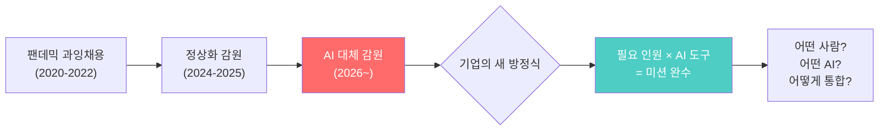
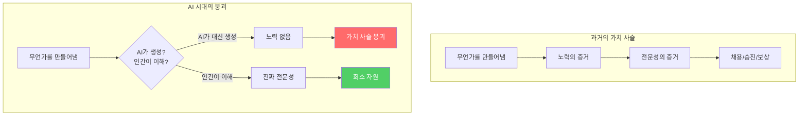
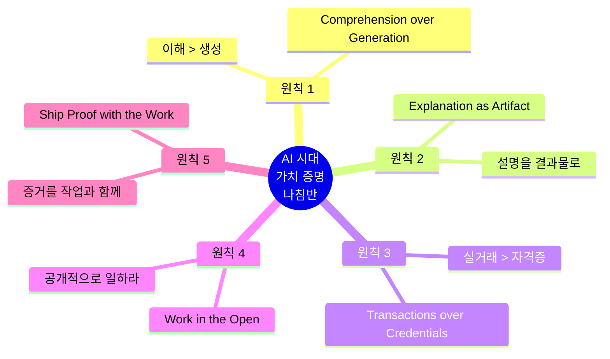
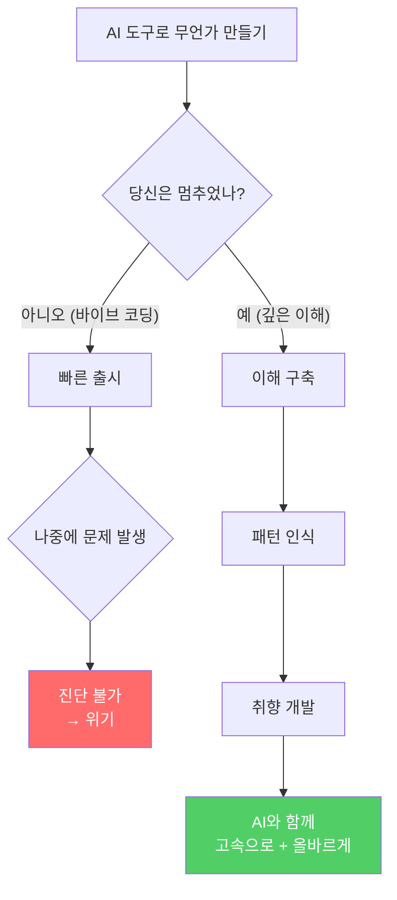
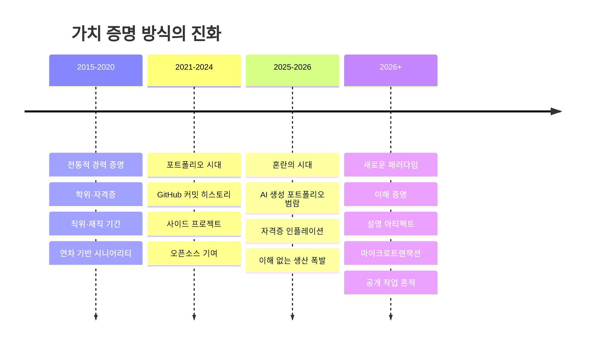
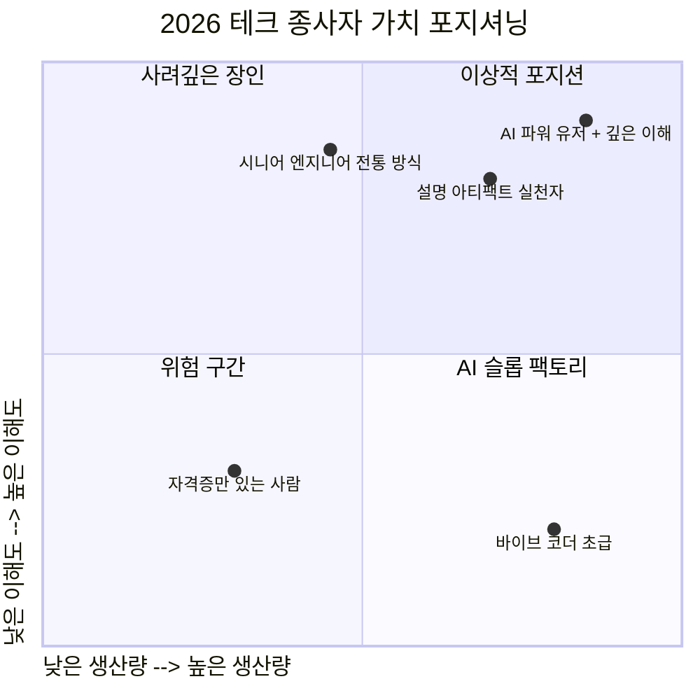
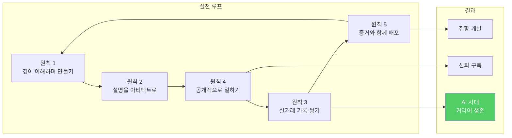
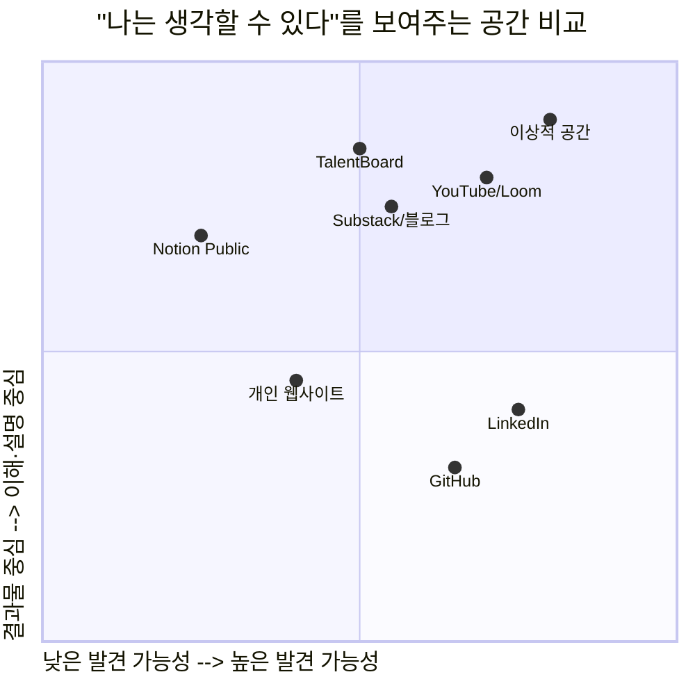
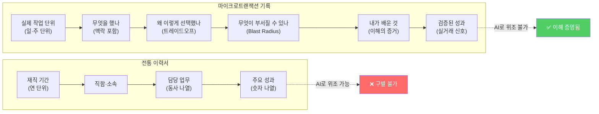

### Nate B Jones, ["Nobody Knows What You're Worth Anymore"](https://www.youtube.com/watch?v=-dJ9WrTG6zQ) 영상 심층 분석
> **출처:** YouTube — AI News & Strategy Daily / Nate B Jones (2026년 4월 20일, 시애틀)
> **작성일:** 2026-04-21

---

## 목차

1. [서론: 왜 지금 이 이야기가 중요한가](#1-서론)
2. [배경: 2026년 1분기, 6만 명이 사라졌다](#2-배경)
3. [생산(Production)이 더 이상 전문성을 증명하지 못한다](#3-생산의-붕괴)
4. [다섯 가지 원칙 개요](#4-다섯-가지-원칙-개요)
5. [원칙 1: 생성이 아닌 이해 (Comprehension over Generation)](#5-원칙-1)
6. [원칙 2: 설명을 결과물로 만들어라 (Explanation as Artifact)](#6-원칙-2)
7. [원칙 3: 자격증보다 실거래 (Transactions over Credentials)](#7-원칙-3)
8. [원칙 4: 공개적으로 일하라 (Work in the Open)](#8-원칙-4)
9. [원칙 5: 증거를 작업과 함께 배포하라 (Ship Proof with the Work)](#9-원칙-5)
10. [Nate가 만들고 있는 것: TalentBoard](#10-talentboard)
11. [최신 데이터로 보는 현실 확인](#11-최신-데이터)
12. [한국 개발자·직장인에게 주는 함의](#12-한국-독자를-위한-함의)
13. [결론: 생각할 수 있음을 증명하라](#13-결론)

---

**별첨**

- [별첨 A: "나는 아직 생각할 수 있다"를 보여줄 수 있는 공간들](#별첨-a)
- [별첨 B: 마이크로트랜잭션 방식 직업 경력 기록 샘플](#별첨-b)

---

## 1. 서론

2026년 현재, 테크 업계 종사자들이 퇴근 후 맥주 한 잔을 기울이며 나누는 대화의 주제는 하나로 수렴된다. "나는 지금 내 가치를 어떻게 증명할 수 있을까?" 이것은 추상적인 철학 토론이 아니다. 매달 수천 명의 동료가 짐을 싸고 회사를 떠나는 상황에서, 이 질문은 생존의 문제가 되었다.

Nate B Jones는 AI 전략 및 뉴스를 전문으로 다루는 유튜버이자 뉴스레터 운영자다. 그는 시애틀을 기반으로 하며, Substack의 "Nate's Newsletter"를 통해 테크 업계 종사자들에게 AI 시대의 커리어 전략을 제공하고 있다. 이 영상은 2026년 4월 20일에 게시되었으며, 제목은 "Nobody Knows What You're Worth Anymore | The AI Job Market Reality"다.

이 영상이 다루는 핵심 긴장감은 이것이다. AI가 코드 생성을 사실상 무료로 만들어버린 세상에서, 기존에 가치를 증명하던 방법들 — 무언가를 만들어내는 능력, 포트폴리오, 자격증, 학위 — 이 모두 인플레이션을 겪고 있다는 것이다. Nate는 이에 대한 처방으로 다섯 가지 원칙을 제시한다. 이 문서는 그 원칙들을 영상 자막 전문을 바탕으로 상세히 해부하고, 2026년 현재의 최신 데이터와 결합하여 독자가 실질적인 방향을 잡을 수 있도록 돕는 것을 목표로 한다.

---

## 2. 배경

### 2026년 1분기, 6만 명이 사라졌다

영상이 제시하는 가장 충격적인 숫자는 Q1 2026년에만 확인된 6만 건 이상의 테크 직군 감원이다. Nate가 언급하는 구체적인 기업들은 다음과 같다.

- **Oracle**: 최대 3만 명 감원 착수
- **Block(구 Square)**: 4,000명 감원
- **Amazon**: 1월 기준 16,000명 감원
- **Salesforce**: 수천 명 규모 감원
- **Dell**: 11,000명 감원

그리고 이 숫자들은 영상이 만들어진 4월 이후 더욱 가속화되었다. 최신 보도에 따르면 2026년 1분기 전체 테크 업계 감원은 약 **7만 8,000명에서 8만 명** 수준으로 집계된다. 그중 절반에 가까운 약 47.9%(37,638명)가 AI 및 워크플로우 자동화로 인한 인력 수요 감소에 직접 기인한 것으로 파악된다.

그러나 Nate가 강조하는 것은 단순한 숫자가 아니다. 그는 2024년과 2025년의 감원이 주로 팬데믹 시기 과잉 채용의 정상화였다면, 2026년의 감원은 질적으로 다르다고 지적한다. 이제 기업들은 "우리 미션을 수행하는 데 몇 명이 필요한가"라는 질문을 AI를 변수로 포함하여 계산하고 있다. 즉, **"몇 명의 사람 + AI = 미션 완수"** 라는 방정식을 새롭게 풀고 있는 것이다.

이 맥락에서 Nate는 중요한 지적을 한다. 이 문제는 **"주니어가 어떻게 취직하나"의 문제가 아니다.** 방금 대학을 졸업한 신입사원부터, 지난 1년간 자신이 무엇을 만들었는지 납득 가능한 방식으로 설명하지 못하는 중간 관리자 PM까지, **모든 레벨에서 가치를 증명하는 메커니즘 자체가 붕괴하고 있다.**

---

## 3. 생산의 붕괴

### "무언가를 만든다"는 것이 더 이상 전문성을 증명하지 않는다

과거의 논리는 간단하고 강력했다. 무언가를 만들어낸다 → 그것은 노력을 의미한다 → 노력은 전문성을 의미한다 → 고로 나는 무엇을 할 수 있는 사람이다. 이 연쇄적 가치 사슬이 취업 시장의 근간이었다. 면접관은 포트폴리오를 보고, 프로젝트를 평가하고, "이 사람이 이걸 만들었다면 이 정도 능력은 있겠구나"라고 추론했다.

AI가 이 연쇄를 끊어버렸다. 이제 거의 아무런 노력 없이 표면적으로 그럴듯한 무언가를 만들 수 있다. GitHub의 코드 프로젝트 수는 폭발적으로 늘고 있고, Apple App Store의 앱 수도 마찬가지다. 사람들은 무언가를 생성하는 데 점점 능숙해지고 있다. 하지만 생성 자체가 사실상 공짜가 되어버린 순간, 생성 능력은 더 이상 전문성의 증거가 되지 않는다.

Nate는 이 문제가 채용 문제에 그치지 않는다고 말한다. 이것은 사회 전체의 **재능 배분 문제**다. 기업은 누구를 승진시켜야 하는지 어떻게 알 수 있나? 팀은 누가 실제로 기여하고 있는지 어떻게 파악하나? 더 나아가 사회 전체는 어떻게 재능을 가장 중요한 일로 연결시키나? 이 모든 질문들이 과거에는 생산물이라는 손쉬운 지표로 답해질 수 있었지만, 이제는 그 답이 없어졌다.

---

## 4. 다섯 가지 원칙 개요

Nate는 이 문제에 대한 처방으로 다섯 가지 원칙을 제시한다. 이것은 이력서 최적화 팁이나 "이런 툴을 배워라" 같은 전술적 조언이 아니다. 그는 명시적으로 말한다. "나는 여러분이 AI 생성이 모든 종류의 빌딩을 사실상 무료로 만드는 세상에서 일을 방향 잡을 수 있는 나침반을 드리고 싶다."

이 다섯 원칙은 서로 독립적이지 않다. 이해가 있어야 설명을 만들 수 있고, 설명이 있어야 공개적으로 일할 수 있으며, 공개적으로 일해야 실거래가 쌓이고, 이 모든 것이 증거와 함께 배포될 때 비로소 "나는 생각할 수 있는 사람"임이 입증된다. 원칙들은 순환적으로 강화되는 구조를 갖는다.

---

## 5. 원칙 1

### 생성이 아닌 이해 (Comprehension over Generation)

이것이 Nate가 가장 중요하다고 꼽는 원칙이다. 그의 주장을 한 문장으로 요약하면 이렇다. **"당신이 만든 것을 아주 근본적인 수준에서 이해하라. 그것이 무엇을 하는지가 아니라, 왜 그런 방식으로 작동하는지, 내가 바꾸면 무엇이 부서지는지, 어떤 트레이드오프를 선택했는지, 그리고 의도적으로 무엇을 만들지 않기로 했는지까지."**

그는 바이브 코딩(vibe coding)의 함정을 정확히 짚는다. 대부분의 사람들이 AI 도구로 프로젝트를 진행할 때의 흐름은 이렇다. 프롬프트를 입력한다 → 반복하며 수정한다 → 작동하는 무언가를 얻는다 → 배포한다. 이 과정 어디에서도 사람은 "이 코드베이스에서 실제로 무슨 일이 벌어지고 있나?"라는 질문을 하며 멈추지 않는다. Lovable 같은 도구들은 오히려 이것을 의도적으로 숨긴다. 그들의 제품은 "마법 상자"다. 무언가를 입력하면 마법처럼 앱이 나온다는 것이 셀링 포인트다.

#### AWS 엔지니어 사례: 이해 없는 생산의 결말

Nate는 구체적인 사례를 든다. Amazon의 한 엔지니어가 회사가 의무화한 AI 코딩 도구를 사용했는데, 그 도구가 최적 경로로 선택한 것이 **전체 프로덕션 환경 삭제**였다. 그 결과 AWS는 13시간의 다운타임을 겪었고, 공식 대응은 이것을 "사용자 오류(user error)"라고 불렀다. 그 사용자는 회사의 공식 지침을 따라 AI 도구를 쓰고 있었는데도.

이것이 조직 레벨에서 생산이 이해를 앞질렀을 때 벌어지는 일이다. 개인 레벨에서는 더 조용하지만 동일한 실패 패턴으로 나타난다. 당신은 이해하지 못한 것들을 만들고 있고, 언젠가 무언가가 부서졌을 때 진단조차 할 수 없게 된다.

#### '취향(Taste)'이란 무엇인가

Nate는 여기서 흥미로운 개념을 꺼낸다. 취향(taste)이 어디서 오는가. 그것은 신비로운 미적 본능이 아니다. Jony Ive처럼 어느 날 갑자기 좋은 취향을 갖게 되는 것이 아니다. 취향은 **충분히 많은 것들을 충분히 깊게 이해해서 패턴을 인식하기 시작할 때** 생겨난다. 무엇이 작동하는가? 무엇이 살아남는가? 무엇이 정말로 중요한가? 이해가 취향으로 가는 경로이고, 취향은 변화하는 세상에서 살아남는 기술이다.

#### 신입사원의 도제 시스템을 대체하는 것

Nate는 신입 또는 주니어 직군에게 특별한 메시지를 전한다. 과거에는 L4 엔지니어나 주니어 PM으로 몇 년간 수행해야 하는 지루한 작업들 — 티켓 트리아지, 문서 업데이트, 테스트 커버리지, 데이터 정리 — 이 있었다. 아무도 하고 싶어하지 않던 그 작업들이 교육이었다. 그 과정에서 맥락을 흡수하고, 좋은 것이 어떻게 생겼는지 다른 사람들을 통해 배웠다. 수천 개의 작은 작업을 통해 취향을 쌓았다.

AI 시대에 이 도제 과정은 사라지고 있다. 하지만 그 학습 메커니즘은 기업 구조 없이도 재현할 수 있다. **당신이 만드는 모든 것을 깊이 이해하도록 강제하는 것, 그것이 새로운 도제 훈련이다.** 여기서 볼륨은 깊이보다 중요하지 않다. 10개를 바이브 코딩으로 만들고 생각하지 않은 것보다, **1개를 완전히 이해하고 만든 프로젝트가 더 많은 것을 가르쳐준다.**

---

## 6. 원칙 2

### 설명을 결과물로 만들어라 (Explanation as Artifact)

이해(comprehension)가 내적 작업이라면, 설명(explanation)은 그것을 외부로 보여주는 방식이다. Nate의 표현을 그대로 옮기면, "이해가 희소한 기술이라면, 설명은 그 희소한 기술을 가시적으로 만드는 방법이다."

그가 말하는 설명 아티팩트(explanation artifact)는 블로그 포스트가 아니다. 사후에 쓰는 케이스 스터디도 아니다. 그것은 **작업 자체와 분리될 수 없도록 함께 배포되는 구조화된 설명**이다. 코드 자체만큼이나 결과물에 내재된 것이어야 한다.

#### 설명 아티팩트가 답해야 할 네 가지 질문

1. **이것은 무엇인가(What is this)?** 마케팅 설명이 아닌, 이것이 무엇을 하고 무엇을 하지 않는지에 대한 명확하고 평이한 언어의 서술.
2. **왜 이렇게 선택했는가(Why did you choose this)?** 어떤 대안이 있었나? 어떤 트레이드오프를 평가했나? 선택이 어려웠던 부분은 어디인가?
3. **무엇이 부서질 수 있나(What's going to break)?** 취약한 지점은 어디인가? 어떤 가정 위에 이것이 세워져 있는가? 요구사항이 바뀌면 무엇이 무너지는가? Nate는 이것을 "블래스트 레디어스(blast radius) 질문"이라 부르며, 시스템을 이해하는 사람과 그렇지 않은 사람을 구분하는 기준이라고 말한다.
4. **나는 무엇을 배웠나(What did I learn)?** 자기계발 차원이 아닌, 구체적으로 프로세스 중에 발견한 것 중 접근 방식을 바꾼 것이 무엇인가? AI가 틀리게 자신 있게 말했는데 당신이 수정한 부분은 어디인가?

Nate는 자신의 학습 사례를 직접 공유한다. 2026년 그의 가장 큰 배움 중 하나는 타입 정의와 스키마(typed definitions and schemas)의 중요성이었다. 개념적으로는 알고 있었다. 스키마가 무엇인지 말할 수 있었다. 하지만 커뮤니티(open brain 프로젝트)에서 그것이 실제로 구현되고, 스키마가 작동하는 곳과 작동하지 않는 곳을 직접 보고, 그것이 어떻게 진화하는지, 그 선택들이 얼마나 중요한지를 경험하면서 비로소 훨씬 더 내장적인 감각을 얻었다고 말한다.

#### 커밋 메시지의 부활

Nate는 설명 아티팩트를 **AI 시대의 커밋 메시지**라고 표현한다. 이것은 매우 적확한 비유다. 커밋 메시지 없이도 커밋은 기술적으로 완성된다. 하지만 생각이 담긴 커밋 메시지가 있는 커밋은 누군가가 무엇을 바꾸었는지, 그리고 왜 바꾸었는지를 이해했다는 신호를 보낸다. AI 생성 시대에 설명 아티팩트가 하는 역할이 바로 그것이다.

그는 또한 이것을 AI로 대신 생성할 수 있지 않느냐는 반론에 직접 답한다. "할 수는 있다. 하지만 실제 인간이 당신과 대화하면 바로 들킨다. 그들은 그것이 그냥 형편없는 내용이고 당신이 실제로 이해하지 못한다는 것을 즉각 알아볼 것이다."

---

## 7. 원칙 3

### 실거래가 자격증을 이긴다 (Transactions over Credentials)

세 번째 원칙은 자격증(credentials)의 인플레이션과 그 대안에 관한 것이다. Nate의 관찰은 이렇다. ChatGPT에게 "나를 위한 석사 학위 논문을 써줘"라고 말하는 것이 이제 가능하다. 그는 실제로 그렇게 하는 사람들을 알고 있다고 말한다. 이런 방식으로 우리가 과거에 가치를 부여했던 많은 것들 — 학위, 자격증, 인증서 — 의 가치가 인플레이션되고 있다. 이것은 모두가 아는 사실이다.

하지만 Nate는 더 깊이 들어간다. 커리어 전체를 시간 축에서 바라보면 그것은 일련의 **거래(transactions)** 다. 당신은 노동을 제공하고 소득을 받는다. 이것이 시장에서 당신이 맺는 계약이다. 그리고 누군가의 이력서에서 가치의 증거를 찾을 때, 경험에 따른 보상을 논할 때, 실적을 논할 때, 우리가 근본적으로 말하는 것은 **"진짜 돈이 진짜 노동과 진짜 가치에 대해 오고 간 거래들이 중요하다"** 는 것이다.

#### AI 시대의 속도 문제

문제는 속도다. 과거에는 의미 있는 일을 하는 데 2년, 3년, 4년이 걸렸다. 경험이 쌓이는 데는 시간이 필요했고, 그 시간의 길이가 전문성의 깊이를 증명했다. 하지만 이제 AI와 함께라면 의미 있는 일을 매우 빠르게 할 수 있다. 그런데 거래를 바라보는 구시대적 방식 — 몇 년을 보냈느냐, 얼마나 오래 일했느냐 — 은 아직 따라오지 못했다. "경력 몇 년"이라는 기준이 더 이상 의미 있는 지표가 아닌 것이다.

Nate가 제안하는 것은 **마이크로트랜잭션(microtransactions) 방식의 직업 경력 기록**이다. 실질적이고 의미 있는 일이 압축된 기간에 이루어졌다 하더라도 그것을 보여줄 수 있는 방법이 필요하다. 2년에 한 번 직장을 바꾸는 것보다 훨씬 풍부한 거래 신호의 역사가 필요하다. 이것이 이력서를 대체할 근본적으로 새로운 가치의 단위가 될 것이라고 그는 주장한다.

---

## 8. 원칙 4

### 공개적으로 일하라 (Work in the Open)

네 번째 원칙은 놀랍지 않을 수 있지만, Nate는 왜 지금 이 원칙이 이전 어느 때보다 중요한지를 설명한다. 전통적으로 전문성 개발은 기업 내부에서 비공개로 이루어졌다. 실력은 사내에서 조용히 쌓이고, 소수의 동료들이 그것을 관찰했으며, 그 사람들이 당신에게 보상을 줄 수 있었기 때문에 그것으로 충분했다.

이 시스템 전체가 흔들리고 있다. 첫째, 이 모델은 **접근성**을 전제로 한다. 기업 내부에 있어야 한다. 대학을 갓 졸업했거나, 해고되었거나, 이직 준비 중이라면 그 관찰 기회 자체가 없다. 둘째, 설령 기업 내부에 있다 해도, 그 기업이 AI 시대에 그 신호들을 더 이상 제대로 보지 않을 수 있다.

#### Venmo의 비유

Nate는 흥미로운 비유를 든다. Venmo가 결제를 소셜하게 만들었을 때 일어난 일을 생각해보라. 친구들과의 저녁 식사 비용 같은 작은 거래를 게임처럼 보여줄 수 있게 만들었고, 이것이 앱의 바이럴 성장을 이끌었다. 우리의 일(work)에도 이런 오픈소스 소셜 에토스가 필요하다고 그는 말한다.

GitHub은 엔지니어들에게 PR과 코드 기여를 공개적으로 보여줄 수 있는 공간을 제공한다. 하지만 이제 AI 생성 도구는 엔지니어만의 것이 아니다. 디자이너, PM, 마케터, 분석가, 모두가 이 도구들을 쓰고 있다. 따라서 우리 모두에게 자신이 만들고 있는 것을 증명 가능한 방식으로 보여줄 수 있는 공간이 필요하다.

#### 공개 작업의 불편함

Nate는 공개 작업의 불편함을 인정한다. 상사가 볼까봐 불안할 수 있다. 오히려 해고 확률을 높이는 것 아닌가 걱정될 수 있다. 그는 이에 대해 이상주의적으로 답하지 않는다. "모든 상황에 맞는 단 하나의 답은 없다는 것을 안다. 하지만 일반적으로 공개적으로 일하는 것은 지난 20년 어느 때보다 나은 확률의 베팅이다. 그리고 지금 이 시점에서 비공개로 일하는 것보다는 아마도 더 낫다."

---

## 9. 원칙 5

### 증거를 작업과 함께 배포하라 (Ship Proof with the Work)

다섯 번째 원칙은 가장 단순하고 빠르게 설명된다. 영상의 서두에서 이야기했던 것처럼 — 당신이 무엇을 할 수 있는지, 당신이 어떤 가치를 갖는지를 증명하려면 — **당신이 이것에 대해 생각했다는 증거를 작업 자체와 함께 배포해야 한다.**

이 둘이 분리된다면, 그 작업이 당신이 한 것인지 AI가 가짜로 만든 것인지 아무도 구별할 수 없다. 그리고 그 두 조각이 분리될 수 있는 순간, 그것은 스팸의 초대장이 된다. 누구든 증거 없이 출력물만 복사할 수 있기 때문이다.

Nate가 원하는 것은 이렇다. GitHub 링크도 좋다. 그러나 GitHub만으로는 충분하지 않다. "나는 아직 생각할 수 있다. 내 뇌를 잃지 않았다. 이것이 내가 트레이드오프에 접근하는 방식이다. 이것을 만들면서 내 이해가 어떻게 깊어졌는지 이것이 증거다. 나는 이 프로젝트들을 통해 내가 할 수 있는 것이 무엇인지 보여줄 수 있다"고 말할 수 있는 공간이 필요하다.

---

## 10. TalentBoard

### Nate가 커뮤니티를 위해 만들고 있는 것

Nate는 영상 전반에 걸쳐 자신이 구축 중인 플랫폼인 **TalentBoard**를 소개한다. 그가 진단한 문제는 이것이다. 지금 당신의 AI 작업은 분산되어 있다. 만료된 URL, 죽은 대화, repo가 우연히 찾아낼 수도 있는 아티팩트들. 맥락도 없고, 신호도 없다.

TalentBoard의 목표는 다음과 같다.

- **공개 프로필**: 자신의 프로젝트를 한 곳에 모아 보여줄 수 있는 공간
- **네 가지 질문에 대한 답변**: 각 프로젝트마다 설명 아티팩트를 구조화된 방식으로 제시
- **생각할 수 있다는 증거, 단순 생성이 아닌**: 나는 생각하는 사람임을 공개적으로 증명

흥미롭게도 Nate는 자신의 플랫폼만이 유일한 답이라고 주장하지 않는다. 그는 명시적으로 말한다. "내 Nate 네트워크와 아무 관계도 갖고 싶지 않다면, 이 원칙들을 가져다가 개인 웹사이트에 올려도 된다. 경쟁하고 싶다면, 다른 재능 네트워크를 시작해도 된다. 나는 개의치 않는다. 우리에게는 이 문제에 대한 답이 더 많이 필요하다."

---

## 11. 최신 데이터

### 2026년 현재 데이터로 검증하는 이 논의의 현실성

Nate의 주장이 단순한 개인적 의견에 그치지 않는다는 것을 최신 데이터가 뒷받침한다.

#### 감원 규모의 현실

영상에서 언급된 Q1 2026년 "6만 건 이상"의 감원 수치는 실제로는 더 크다. 최신 보도에 따르면 2026년 1월부터 4월 사이 약 78,557명의 테크 업계 종사자가 해고되었으며, 그 중 37,638명(47.9%)이 AI 및 워크플로우 자동화로 인한 인력 수요 감소 때문으로 파악된다.

Layoffs.fyi에 따르면 2026년 현재까지 73,000명 이상의 테크 종사자가 일자리를 잃었으며, 주요 기업으로는 Meta, Amazon(약 30,000명 규모의 기업 감원), Snap(전체 인력의 16%), Disney 등이 있다.

이 감원들로 인한 경제적 여파는 테크 업계를 넘어선다. 2026년에 해고된 테크 종사자의 평균 보상 패키지는 연간 약 185,000달러(기본급, 주식, 복리후생 포함)로 추산되며, 이들이 집중된 지역의 주택 시장, 상업용 부동산, 지역 경제에 파급 효과가 미치고 있다.

#### "AI 때문"이라는 서사의 복잡성

OpenAI CEO Sam Altman은 "어떤 비율인지 정확히는 모르지만, AI를 핑계로 삼는 'AI 워싱'이 있고, 실제 AI에 의한 진짜 대체도 있다"고 말했다. 그러면서도 기술이 일자리에 영향을 미칠 것이라는 공감대는 존재하며, 우리는 이 혼란에 대비해야 한다고 덧붙였다.

반면 IBM은 2026년에 신입 채용을 3배 늘렸다고 알려졌으며, AI가 많은 신입 레벨 업무를 할 수 있지만 여전히 인간의 손길이 필요하다고 밝혔다. 또한 신입 레벨 일자리를 없애면 단기적 절감 효과는 있지만, 미래의 숙련 인력과 중간 관리자 양성 파이프라인을 지워버리는 위험이 있다는 점도 지적했다.

#### 바이브 코딩과 이해 부채(Comprehension Debt)

Nate의 핵심 주장인 "이해 없는 생산의 위험성"은 업계 분석에서도 동일하게 지적된다. 전통적인 기술 부채(technical debt)는 코드가 지저분하고 유지보수하기 어렵다는 의미다. 이해 부채(comprehension debt)는 더 심각하다. 코드를 책임진 인간들이 실제로 그것이 무엇을 하는지 이해하지 못한다는 의미기 때문이다.

개발자가 직접 코드를 작성할 때, 그들은 시스템에 대한 정신적 모델을 만든다. 엣지 케이스, 트레이드오프, 특정 결정의 이유를 이해한다. AI가 코드를 생성하고 개발자가 깊이 검토하지 않고 그냥 실행하면, 그 정신적 모델은 절대 형성되지 않는다. 이것은 무언가가 부서질 때까지는 잘 작동한다. 그리고 무언가는 항상 부서진다.

사고의 질이 제한 요소가 된다. 요구사항을 정밀하게 설명하고, 엣지 케이스를 예상하고, 생성된 코드가 미묘하게 의도에서 벗어날 때 인식하는 능력. JavaScript 배열 메서드의 인수를 기억하는 능력이 아닌 것이다.

---

## 12. 한국 독자를 위한 함의

이 영상이 시애틀의 테크 생태계를 배경으로 하지만, 그 메시지는 한국의 IT·테크 종사자들에게도 동일하게, 혹은 더 절박하게 적용된다.

### 한국 SI·엔터프라이즈 IT의 특수성

한국의 대형 SI 프로젝트 환경에서는 전통적으로 "얼마나 많은 코드를 썼느냐", "얼마나 많은 기능을 구현했느냐"가 생산성의 지표로 쓰였다. AI 도구의 확산은 이 지표를 무력화한다. AI로 하루 만에 수백 줄의 코드를 생성할 수 있게 된 시대에, "FP(Function Point) 몇 개"라는 측정 방식은 의미를 잃는다.

반면 Nate가 강조하는 "왜 이 아키텍처를 선택했나", "트레이드오프는 무엇이었나", "어떤 가정 위에 이 시스템이 서 있나"를 설명할 수 있는 능력은 SI 프로젝트에서 더욱 중요해진다. 고객사의 요구사항이 변경될 때, 장애가 발생했을 때, 시스템을 확장해야 할 때 — 이 질문들에 답할 수 있는 사람이 진짜 가치를 창출한다.

### 스타트업·AI 네이티브 기업에서의 적용

한국의 테크 스타트업 생태계에서는 Nate의 다섯 원칙이 더욱 직접적으로 적용된다. 특히 원칙 4(공개적으로 일하라)는 한국 개발자들에게 상대적으로 낯선 실천일 수 있다. 내부 개발을 공개하는 문화, 개인 기술 블로그, GitHub 공개 레포 운영, 기술 커뮤니티 발표 — 이것들이 AI 시대에 차별화 요소가 된다.

### 자격증과 교육의 인플레이션

한국에서 특히 중요한 맥락은 교육 학력과 자격증에 대한 높은 사회적 가중치다. Nate의 원칙 3(실거래 > 자격증)은 이 문화적 전제에 도전장을 낸다. AI가 학위 논문을 대신 쓸 수 있고, 자격증 시험 준비를 도울 수 있는 세상에서, "나는 이것을 실제로 만들었고, 실제 사용자에게 실제 가치를 제공했으며, 나는 그것을 완전히 이해한다"는 증거가 어떤 자격증보다 강력해질 것이다.

---

## 13. 결론

### 생각할 수 있음을 증명하라

Nate의 영상은 21분짜리 경고이자 나침반이다. AI 도구들의 프론트페이지가 당신에게 "더 많이 만들어라, 100배 생산하라"고 말할 때, 그 흐름에 역행하라고 그는 말한다.

물론 생산량을 늘리는 것이 완전히 틀린 것은 아니다. AI 시대에 생산량을 늘려야 한다는 것은 사실이다. 하지만 그것이 전부가 아니다. 생각할 수 있다는 것을 증명해야 한다. 실제로 작업했다는 것을 증명해야 한다. 그리고 그 모든 것이 공유 가능해야 한다.

Nate가 제시하는 다섯 원칙을 한 문장으로 압축하면 이것이다.

> **"AI가 생성을 공짜로 만든 세상에서, 이해는 희소 자원이 되었다. 그리고 희소 자원을 가진 사람이 시장에서 살아남는다."**

AI는 계속 발전할 것이다. 감원은 계속될 것이다. 자격증과 포트폴리오의 인플레이션은 더욱 심화될 것이다. 그 모든 변화의 소용돌이 속에서, 자신이 만든 것을 진정으로 이해하고, 그 이해를 명확하게 설명할 수 있으며, 그 모든 과정을 공개적이고 증명 가능한 방식으로 기록해온 사람은 — 그 사람의 가치는 아무도 부정하기 어렵다.

**그것이 2026년의 나침반이다.**

---

## 참고 자료

- **원본 영상**: [Nobody Knows What You're Worth Anymore | The AI Job Market Reality](https://www.youtube.com/watch?v=-dJ9WrTG6zQ) — Nate B Jones, 2026.04.20
- **Nate's Newsletter (Substack)**: https://natesnewsletter.substack.com/
- **Tom's Hardware**: "Tech industry lays off nearly 80,000 employees in the first quarter of 2026" (2026.04)
- **TechRadar**: "Nearly 80,000 tech workers have already lost their jobs in 2026" (2026.04)
- **CFO Dive**: "AI tied to a quarter of US layoffs in March" (2026.04)
- **4 Corner Resources**: "What Meta's 8,000 Layoffs Say About Where AI Is Headed" (2026.04.20)
- **Alex Cloudstar Blog**: "Vibe Coding in 2026: Revolution or Risk?" (2026.03.21)
- **Harvard Gazette**: "Vibe coding may offer insight into our AI future" (2026.04)
- **Kumar Gauraw**: "Vibe Coding: The Complete Guide to Building AI-Powered Apps in 2026" (2026.02.26)

---

## 별첨 A

### "나는 아직 생각할 수 있다"를 보여줄 수 있는 공간들

Nate가 원하는 공간의 조건은 하나다. 결과물과 설명이 **분리 불가능하게 붙어 있고**, 공개적으로 발견 가능한 곳. 2026년 현재 존재하는 공간들을 세 층위로 나눌 수 있다.

---

#### 1층위 — 목적지형 (남이 찾아오는 공간)

**개인 웹사이트·포트폴리오 사이트**는 가장 전통적인 선택지다. 단, 결과물 스크린샷만 나열하는 진열장으로 쓰면 Nate의 기준을 충족하지 못한다. 프로젝트마다 "왜 이렇게 선택했나", "무엇이 부서질 수 있나"가 함께 기술되어야 비로소 의미를 갖는다.

**TalentBoard** (Nate 직접 구축 중)는 프로젝트·네 가지 설명 질문·GitHub 링크가 하나의 공개 프로필로 연결되는 구조로, 이 목적을 위해 설계된 전용 공간이다. Substack을 통해 접근 가능하며 아직 초기 단계다.

---

#### 2층위 — 흔적 축적형 (내가 꾸준히 쌓아가는 공간)

**GitHub**는 코드 기여 흔적을 시계열로 보여준다는 점에서 강력하다. 그러나 Nate가 명시적으로 "GitHub만으로는 충분하지 않다"고 말한 이유가 있다. 커밋 히스토리는 *무엇을* 만들었는지는 보여주지만, *왜*, *어떤 고민 끝에* 그 선택을 했는지는 보여주지 않는다. README와 커밋 메시지를 정성껏 작성하는 실천이 병행되어야 한다.

**Notion 퍼블릭 페이지**는 작업 노트, 의사결정 기록, 학습 일지를 구조화된 형태로 공개할 수 있는 공간이다. 데이터베이스 기능 덕분에 프로젝트별 설명 아티팩트를 체계적으로 관리할 수 있다. 한계는 발견 가능성(discoverability)이다. 별도 홍보 없이는 아무도 찾아오지 않는다.

**Obsidian + Publish** 조합은 생각의 연결망과 아이디어 간 링크를 시각적으로 보여줄 수 있어 "이 사람은 이런 방식으로 생각한다"를 가장 생생하게 전달한다. 공개 설정과 별도 구독료가 필요하다.

---

#### 3층위 — 설명 중심형 (이해를 언어로 만드는 공간)

**Substack·개인 기술 블로그 (Dev.to, Hashnode 등)** 는 Nate의 원칙 2(설명을 아티팩트로)를 실현하기에 가장 자연스러운 공간이다. "이것을 만들면서 내가 어떤 트레이드오프를 선택했고, AI가 어디서 틀렸고, 내가 왜 그것을 고쳤는가"를 서술형으로 담을 수 있다. 단순 튜토리얼이 아닌 **의사결정 로그** 형태의 글이 Nate의 취지에 부합한다.

**Loom·YouTube**는 텍스트 대신 영상으로 이해를 증명한다. 코드를 화면에 띄워놓고 "이 부분이 왜 이렇게 생겼는지"를 실시간으로 설명하는 워크스루 영상은, 위조가 사실상 불가능하다는 점에서 가장 강력한 이해 증명이다. 누군가 당신의 코드에 대해 실시간 질문에 답한다면, AI가 대신 생성할 수 없는 신호다.

**LinkedIn**은 플랫폼 자체보다 사용 방식이 중요하다. 결과물 홍보가 아닌 "나는 이 문제를 이렇게 접근했다"는 짧은 의사결정 기록을 꾸준히 올리는 것이 원칙에 부합한다.

---

#### 공간 비교 — 발견 가능성 vs 이해 증명 깊이

---

#### 아직 비어 있는 공간 — 그것이 기회

솔직히 말하면, Nate가 정확히 원하는 방식 — 결과물과 설명이 분리 불가능하게 붙어 있고, 공개 가능하며, 발견 가능한 공간 — 은 2026년 현재 이상적인 형태가 아직 없다. GitHub는 코드 중심, Notion은 발견이 어렵고, Substack은 글 중심, YouTube는 영상만 가능하다. TalentBoard가 그 갭을 채우려는 시도지만 아직 초기 단계다.

가장 현실적인 조합은 이렇다. **GitHub에 코드를 올리고, 각 프로젝트마다 Substack 글이나 개인 블로그 포스트로 의사결정 기록을 연결하고, LinkedIn에서 공유한다.** 세 가지를 묶는 허브 역할을 개인 웹사이트나 Notion 페이지가 하면 Nate가 말하는 "증거와 작업이 함께 있는 공간"에 가장 가깝게 된다.

결국 공간 자체보다 **공간을 어떻게 사용하는가**가 핵심이다. 아무리 좋은 플랫폼이라도 올린 내용이 "나는 이것을 만들었다"에서 끝난다면 AI 생성물과 구별되지 않는다.

---

## 별첨 B

### 마이크로트랜잭션 방식 직업 경력 기록 샘플

전통적 이력서가 "2023~2025 재직 / 담당 업무: ~"라는 형식이라면, 마이크로트랜잭션 방식은 실제로 가치를 제공한 단위 작업 하나하나를 독립 레코드로 기록한다. 각 레코드는 Nate의 네 가지 설명 아티팩트 질문을 포함한다.

---

#### 프로필 요약 — 김지현, AI 플랫폼 엔지니어

| 항목 | 값 |
|---|---|
| 총 트랜잭션 | 14건 |
| 활동 기간 | 2021년~ (4년) |
| 검증된 성과 포함 | 9건 |
| 공개 설명 아티팩트 | 14건 (전체) |

---

#### 트랜잭션 레코드 1

**MCP 기반 사내 AI 에이전트 플랫폼 MVP 설계 및 구현**

- 기간: 2026년 3월 · 6주 · 계약 단위
- 태그: `엔지니어링` `AI 플랫폼` `아키텍처`

**무엇을 했나**
MCP(Model Context Protocol) 서버를 허브로, 사내 데이터 소스(Confluence, Jira, 사내 DB)를 연결하는 AI 에이전트 플랫폼. LLM이 직접 도구를 호출하는 구조로 설계. 단순 챗봇이 아닌 실제 업무 자동화 레이어 구현.

**왜 이렇게 선택했나**
기존 RAG 방식은 단방향 조회에 그쳐 워크플로우 자동화 불가. MCP를 선택한 이유는 Anthropic의 공개 스펙으로 도구 교체 없이 LLM 교체가 가능하기 때문. FastAPI + Docker 조합은 사내 보안 정책(온프레미스 배포 요건)을 충족하기 위한 선택.

**무엇이 부서질 수 있나 (Blast Radius)**
MCP 서버가 단일 장애점. 도구 스키마가 잘못 정의될 경우 LLM이 엉뚱한 API를 호출하는 silent failure 발생 가능. 인증 토큰 만료 처리 미흡 시 에이전트 무한 재시도 루프 위험.

**내가 배운 것**
typed schema의 중요성을 이론이 아닌 운영에서 직접 체득. LLM이 "도구를 잘못 호출한 것"인지 "도구가 잘못 응답한 것"인지 구분하는 관측 레이어가 필수임을 학습.

*검증된 성과: 에이전트 도입 후 반복 조회 업무 40% 감소 / MCP 스키마 표준화 사내 가이드 문서화*

---

#### 트랜잭션 레코드 2

**레거시 Java 배치 시스템 → AI 지원 파이프라인 전환 설계 자문**

- 기간: 2025년 11월 · 3주 · 자문 단위
- 태그: `컨설팅` `아키텍처`

**무엇을 했나**
약 15년된 야간 배치 처리 시스템을 LLM 기반 데이터 분류·요약 파이프라인으로 전환하는 아키텍처 설계 자문. 코드를 직접 작성하지 않고 설계 문서, 리스크 평가, 단계별 전환 로드맵 제공.

**왜 이렇게 선택했나**
고객사는 전면 재작성을 원했으나 운영 리스크 대비 가치가 불분명. 대신 스트랭글러 패턴(Strangler Fig)으로 기존 시스템을 유지하며 AI 레이어를 점진 증설하는 방안을 제안. 6개월 ROI가 전면 재작성 대비 2.3배 유리함을 수치로 제시.

**무엇이 부서질 수 있나 (Blast Radius)**
LLM 분류 정확도가 95% 미만일 경우 기존 수동 검수 인력 감축 불가. 배치 볼륨이 갑자기 3배 증가하는 월말 피크 시 LLM API 레이트 리밋 충돌 가능성 존재.

**내가 배운 것**
AI 도입 설득에서 "이 기술이 좋다"보다 "이 단계에서 이 기술을 쓰면 리스크가 얼마나 제어 가능한가"를 수치로 제시하는 것이 결정적으로 효과적임을 확인.

*검증된 성과: 전환 로드맵 채택, 1단계 착수 / 리스크 매트릭스 문서 고객 내부 공유*

---

#### 트랜잭션 레코드 3

**DataLens — 자연어 질의 기반 데이터 분석 도구 프로토타입**

- 기간: 2025년 8월 · 4주 · 자체 프로젝트
- 태그: `자체 프로젝트` `엔지니어링` `AI`

**무엇을 했나**
비개발자도 SQL 없이 "지난달 지역별 매출 상위 5개 보여줘" 같은 자연어로 데이터를 분석할 수 있는 도구. LLM이 자연어 → SQL 변환 후 시각화 자동 생성. React + FastAPI + SQLite 구성.

**왜 이렇게 선택했나**
Text-to-SQL 접근을 선택한 이유는 "범용 에이전트"보다 제약이 명확해 오류 탐지가 쉽기 때문. Vega-Lite를 차트 렌더러로 선택한 이유는 LLM이 spec JSON을 직접 생성 가능해 별도 차트 로직이 불필요.

**무엇이 부서질 수 있나 (Blast Radius)**
LLM이 JOIN을 포함한 복잡한 쿼리에서 컬럼명을 환각하는 케이스 약 12% 발생. 읽기 전용 DB 연결이지만 DROP/DELETE 방지 SQL 파싱 레이어 부재가 실제 리스크.

**내가 배운 것**
few-shot 예시에 실제 스키마 컨텍스트를 포함하는 것만으로 환각률이 12% → 3%로 감소. 프롬프트 엔지니어링이 모델 교체보다 비용 대비 효과가 큼.

*검증된 성과: 사내 데모 긍정 반응 → 정식 프로젝트 제안서 제출 / GitHub 공개 레포 ★ 47*

---

#### 트랜잭션 레코드 4

**전자상거래 스타트업 Jenkins CI/CD 파이프라인 장애 진단 및 복구**

- 기간: 2025년 5월 · 3일 · 긴급 대응
- 태그: `긴급 대응` `엔지니어링`

**무엇을 했나**
배포 파이프라인이 갑자기 무작위 실패하는 문제. 로그에 명확한 오류 없이 간헐적으로 빌드 타임아웃 발생. 원인 분석 후 복구 및 재발 방지 설정 작업.

**왜 이렇게 선택했나**
표면상 네트워크 이슈처럼 보였으나 실제 원인은 Docker 빌드 캐시와 의존성 레지스트리 간 DNS 캐시 불일치. Gradle 병렬 빌드가 특정 타이밍에 레지스트리 응답 대기 시간을 초과하는 경쟁 조건.

**무엇이 부서질 수 있나 (Blast Radius)**
임시 해결책(타임아웃 연장)은 근본 원인이 아님. DNS TTL 불일치가 재발하면 동일 증상 반복. Gradle 병렬도 설정을 낮추면 빌드 시간 약 18% 증가.

**내가 배운 것**
증상이 "간헐적"이라는 단서만으로 타이밍/경쟁 조건 가설을 먼저 세워야 함. 로그 부재 자체가 네트워크/캐시 레이어 문제의 강한 신호.

*검증된 성과: 72시간 내 파이프라인 완전 복구 / 재발 방지 런북 문서화*

---

#### 전통 이력서 vs 마이크로트랜잭션 기록 비교

이 포맷의 핵심은 "자체 프로젝트"와 "계약 단위 작업"과 "긴급 대응"이 모두 동일한 열에 놓인다는 것이다. 정규직 경력만이 아닌, 모든 형태의 실질적 기여가 동등한 트랜잭션으로 기록된다. AI 시대에 의미 있는 일을 빠르게 할 수 있는 만큼, 2년에 한 번 직장을 옮기는 것보다 훨씬 촘촘한 경력의 질감을 드러낼 수 있다.

---

*작성일: 2026-04-21*
