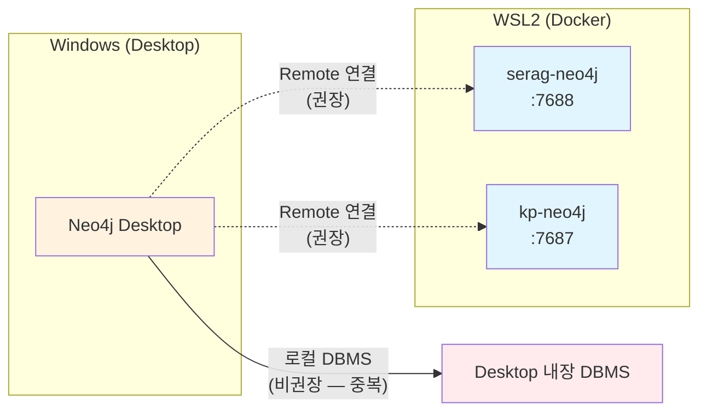

> [Neo4j 구축 가이드 (WSL2 + Docker Desktop)](https://k82022603.github.io/posts/neo4j-%EA%B5%AC%EC%B6%95-%EA%B0%80%EC%9D%B4%EB%93%9C-(wsl2-docker-desktop)/)의 **§4~§6 (Docker Compose · 컨테이너 기동) 부분을 처음 접하는 사용자도 따라할 수 있도록 풀어쓴 상세 첨부**입니다.

| 항목 | 내용 |
|------|------|
| **문서 ID** | DESIGN-22-A |
| **상위 문서** | [Neo4j 구축 가이드 (WSL2 + Docker Desktop)](https://k82022603.github.io/posts/neo4j-%EA%B5%AC%EC%B6%95-%EA%B0%80%EC%9D%B4%EB%93%9C-(wsl2-docker-desktop)/) |
| **작성일** | 2026-04-22 |
| **작성자** | 클로드 (Claude Code) |
| **대상 환경** | Windows 11 + WSL2 Ubuntu + Docker Desktop |
| **작업 계정** | `neo4j` (sudo 비밀번호: `neo4j`) |
| **설치 방식** | Docker Compose 단일 컨테이너 (Community Edition) |

---

## 변경 이력

| 버전 | 일자 | 작성자 | 변경 내용 |
|------|------|--------|-----------|
| 1.0 | 2026-04-22 | 클로드 | 초안 — 사전점검부터 첫 쿼리까지 단계별 상세 |

---

## 목차

- [A.0 설치 옵션 비교 — 왜 Docker인가](#a0-설치-옵션-비교--왜-docker인가)
- [A.1 사전 환경 점검 (10분)](#a1-사전-환경-점검-10분)
- [A.2 Docker Desktop + WSL2 통합 확인](#a2-docker-desktop--wsl2-통합-확인)
- [A.3 WSL2 메모리 튜닝 (.wslconfig)](#a3-wsl2-메모리-튜닝-wslconfig)
- [A.4 작업 디렉토리 권한 점검](#a4-작업-디렉토리-권한-점검)
- [A.5 기존 Neo4j 컨테이너와의 충돌 사전 확인](#a5-기존-neo4j-컨테이너와의-충돌-사전-확인)
- [A.6 Neo4j 이미지 사전 Pull (선택)](#a6-neo4j-이미지-사전-pull-선택)
- [A.7 Docker Compose 파일 생성 (라인별 해설)](#a7-docker-compose-파일-생성-라인별-해설)
- [A.8 환경변수 파일 (.env) 생성](#a8-환경변수-파일-env-생성)
- [A.9 첫 기동 — 단계별 검증](#a9-첫-기동--단계별-검증)
- [A.10 cypher-shell 첫 접속](#a10-cypher-shell-첫-접속)
- [A.11 Browser UI 접속 (Windows 측)](#a11-browser-ui-접속-windows-측)
- [A.12 플러그인(APOC + n10s) 설치 검증](#a12-플러그인apoc--n10s-설치-검증)
- [A.13 비밀번호 변경 (운영 시 필수)](#a13-비밀번호-변경-운영-시-필수)
- [A.14 자동 시작 (Windows 부팅 시) 옵션](#a14-자동-시작-windows-부팅-시-옵션)
- [A.15 백업/복구 절차](#a15-백업복구-절차)
- [A.16 제거 절차 (Uninstall)](#a16-제거-절차-uninstall)
- [A.17 설치 체크리스트](#a17-설치-체크리스트)
- [A.18 자주 묻는 질문 (FAQ)](#a18-자주-묻는-질문-faq)
- [A.19 Cypher 실행 도구 4종 비교](#a19-cypher-실행-도구-4종-비교)
- [A.20 Neo4j Desktop 활용 가이드 (보조 도구)](#a20-neo4j-desktop-활용-가이드-보조-도구)

---

## A.0 설치 옵션 비교 — 왜 Docker인가

| 방식 | 장점 | 단점 | 권장 여부 |
|------|------|------|-----------|
| **Docker Compose** ⭐ | 격리/이식성, 다중 인스턴스 공존, plugins 자동 설치 | Docker 학습 필요 | ✅ **본 가이드 채택 (서버)** |
| Native Linux 패키지 (.deb) | 호스트 자원 최대 활용 | 다중 버전 공존 어려움, 의존성 충돌 | ❌ 본 환경 부적합 |
| Windows MSI | GUI 설치 | WSL2 ↔ Windows 경로/포트 변환 복잡 | ❌ |
| **Neo4j Desktop** | 멀티 DBMS GUI 관리, Browser/Bloom/Importer 통합 | 별도 라이선스 활성화 필요, 서버 자체로는 중복 | △ **클라이언트 보조** ([§A.20](#a20-neo4j-desktop-활용-가이드-보조-도구)) |
| AuraDB (클라우드) | 운영 부담 0 | 인터넷 필요, 비용 | △ 별도 검토 |

> **결정 근거**: 기존 프로젝트(`kp-neo4j`)와 신규 프로젝트(`serag-neo4j`)가 **동일 호스트에서 공존**해야 하므로 **서버는 Docker** 격리가 필수.
> Neo4j Desktop은 *서버 대안이 아닌 클라이언트 도구*로 병행 사용할 수 있습니다 (§A.20 참조).

---

## A.1 사전 환경 점검 (10분)

### A.1.1 WSL2 버전 확인

**Windows PowerShell** (관리자 권한):

```powershell
wsl --version
# 예상: WSL 버전 2.x.x 이상
wsl --list --verbose
# 예상:
#   NAME      STATE       VERSION
# * Ubuntu    Running     2
```

> ⚠️ `VERSION`이 `1`이면 WSL2로 변환:
> ```powershell
> wsl --set-version Ubuntu 2
> ```

### A.1.2 WSL2 진입 및 OS 확인

```bash
# Windows 터미널 → WSL Ubuntu 진입
wsl

# 또는 직접 neo4j 계정으로
wsl -u neo4j

# 확인
whoami           # → neo4j
uname -a         # → Linux DESKTOP-JE4TNAH 6.6.87.2-microsoft-standard-WSL2 ...
pwd              # → /home/neo4j (또는 다른 위치)
```

### A.1.3 sudo 동작 확인

```bash
sudo -v
# 비밀번호 입력: neo4j
# 오류 없으면 정상
```

### A.1.4 시스템 자원 확인

```bash
# CPU
nproc                     # 권장 4 이상

# 메모리
free -h                   # 권장 8GB 이상 (전체)

# 디스크
df -h /home              # 최소 5GB 여유
```

| 자원 | 최소 | 권장 |
|------|------|------|
| CPU | 2 cores | 4 cores |
| RAM | 4 GB | 8 GB+ (기존 kp-neo4j 동시 실행 시) |
| Disk | 5 GB | 10 GB+ |

---

## A.2 Docker Desktop + WSL2 통합 확인

### A.2.1 Windows 측 설정 확인

1. **Docker Desktop 실행** → 우측 상단 ⚙️ Settings
2. **Resources → WSL Integration** 확인
   - ✅ `Enable integration with my default WSL distro`
   - ✅ Ubuntu 토글 ON
3. **Apply & Restart**

### A.2.2 WSL2에서 Docker CLI 확인

```bash
# WSL2 진입 후
docker version
# Client: Docker Engine - Community + Server: Docker Desktop ...

docker info | head -20
# 오류 없으면 정상

docker run --rm hello-world
# "Hello from Docker!" 출력
```

> ❌ `Cannot connect to the Docker daemon` 오류:
> - Docker Desktop이 실행 중인지 확인
> - Settings → Resources → WSL Integration에서 Ubuntu 토글 재활성화
> - WSL 재시작: PowerShell에서 `wsl --shutdown` 후 다시 `wsl`

### A.2.3 docker compose v2 확인

```bash
docker compose version
# Docker Compose version v2.x.x

# v1 (docker-compose) 명령은 deprecated — v2 사용 권장
```

---

## A.3 WSL2 메모리 튜닝 (.wslconfig)

### A.3.1 왜 필요한가

기본 WSL2는 호스트 메모리의 50%를 사용합니다. 기존 `kp-neo4j`(2G heap) + 신규 `serag-neo4j`(1G heap) + Docker 자체 + 기타 = **최소 6GB 필요**.

### A.3.2 .wslconfig 작성 (Windows 측)

**Windows 사용자 폴더에 작성**: `C:\Users\<UserName>\.wslconfig`

WSL2 안에서 작성하려면:

```bash
# WSL2에서 Windows 사용자 폴더 접근
ls /mnt/c/Users/

# 본인의 Windows 사용자명 확인 후
WIN_USER="<본인_사용자명>"
cat > "/mnt/c/Users/$WIN_USER/.wslconfig" <<'EOF'
[wsl2]
memory=8GB
processors=4
swap=2GB
localhostForwarding=true
EOF

cat "/mnt/c/Users/$WIN_USER/.wslconfig"
```

### A.3.3 적용

**PowerShell (관리자)**:

```powershell
wsl --shutdown
# 30초 대기 후
wsl
```

**WSL2 재진입 후 확인**:

```bash
free -h
# total: 약 8.0Gi 표시되면 적용됨
```

### A.3.4 본 프로젝트의 기존 설정 활용

> 💡 `MEMORY.md`에 따르면 본 프로젝트는 이미 `hybrid-rag` WSL2 프로파일(14GB / 4GB swap / 8 CPU)을 사용 중입니다.
> ```bash
> # 본 프로젝트 루트에서
> ./scripts/switch-wslconfig.sh hybrid-rag
> ```

---

## A.4 작업 디렉토리 권한 점검

### A.4.1 디렉토리 생성 및 소유권 확인

```bash
cd /home/neo4j
ls -la SearcheRAGWithGraphRAG 2>/dev/null

# 없으면 생성
mkdir -p SearcheRAGWithGraphRAG
cd SearcheRAGWithGraphRAG
pwd                     # → /home/neo4j/SearcheRAGWithGraphRAG

# 소유권: neo4j:neo4j 여야 함
ls -ld .
# drwxr-xr-x  ... neo4j neo4j ...
```

### A.4.2 소유권 수정 (필요 시)

```bash
sudo chown -R neo4j:neo4j /home/neo4j/SearcheRAGWithGraphRAG
```

### A.4.3 Docker 그룹 가입 확인

```bash
groups neo4j | grep docker
# docker가 포함되어야 sudo 없이 docker 명령 사용 가능

# 없으면 추가
sudo usermod -aG docker neo4j
# 적용을 위해 WSL 재시작 필요
```

> **주의**: WSL2 + Docker Desktop 환경에서는 보통 자동으로 docker 그룹이 설정되어 있습니다. 그래도 안 되면 위 명령 후 `wsl --shutdown` → 재진입.

---

## A.5 기존 Neo4j 컨테이너와의 충돌 사전 확인

### A.5.1 실행 중인 Neo4j 컨테이너 확인

```bash
docker ps --filter "name=neo4j" --format "table {{.Names}}\t{{.Image}}\t{{.Ports}}\t{{.Status}}"
```

**예상 출력 (본 프로젝트 가동 중인 경우)**:
```
NAMES       IMAGE                  PORTS                                            STATUS
kp-neo4j    neo4j:5.15-community   0.0.0.0:7474->7474/tcp, 0.0.0.0:7687->7687/tcp   Up 2 hours
```

### A.5.2 사용 중인 포트 확인

```bash
# 7474, 7475, 7687, 7688 점유 여부
ss -tlnp 2>/dev/null | grep -E ":(7474|7475|7687|7688)\s" || echo "모두 비어있음"

# Windows 측에서 점유한 포트 확인 (PowerShell)
# netstat -ano | findstr "7474 7475 7687 7688"
```

| 포트 | 점유자 | 처리 |
|------|--------|------|
| 7474 | `kp-neo4j` (기존) | 그대로 둠 — 신규는 7475 사용 |
| 7687 | `kp-neo4j` (기존) | 그대로 둠 — 신규는 7688 사용 |
| 7475 | 비어있어야 함 | 신규 컨테이너용 |
| 7688 | 비어있어야 함 | 신규 컨테이너용 |

### A.5.3 컨테이너 이름 충돌 확인

```bash
# serag-neo4j가 이미 있는지 (있으면 안 됨)
docker ps -a --filter "name=serag-neo4j" --format "{{.Names}}"

# 있으면 제거 (데이터 보존)
docker stop serag-neo4j 2>/dev/null
docker rm serag-neo4j 2>/dev/null
```

### A.5.4 네트워크 이름 충돌 확인

```bash
# serag-net이 이미 있는지
docker network ls | grep serag-net

# 있으면 제거
docker network rm serag-net 2>/dev/null
```

---

## A.6 Neo4j 이미지 사전 Pull (선택)

> 인터넷 환경이 좋지 않거나, 기동 시간을 단축하고 싶으면 미리 다운로드.

### A.6.1 이미지 다운로드

```bash
docker pull neo4j:5.18-community

# 다운로드 확인
docker images neo4j
# REPOSITORY   TAG              IMAGE ID       CREATED   SIZE
# neo4j        5.18-community   ...            ...       ~600MB
```

### A.6.2 이미지 검증

```bash
# 메타데이터 확인
docker inspect neo4j:5.18-community --format '{{.Config.Env}}' | tr ',' '\n' | head -20

# 빠른 동작 확인 (포트 노출 없이)
docker run --rm neo4j:5.18-community neo4j --version
# 5.18.x
```

### A.6.3 버전 호환성 표

| Neo4j | APOC | n10s (neosemantics) | 비고 |
|-------|------|---------------------|------|
| 5.15.x | 5.15.x | 5.15.x | **기존 프로젝트 사용 중** |
| 5.18.x | 5.18.x | 5.18.x | **본 가이드 권장** (n10s 환경변수 자동 설치 안정화) |
| 5.20.x | 5.20.x | 5.20.x | 최신, 일부 procedure 변경 |

> 💡 본 가이드는 **5.18.x를 채택**합니다. 환경변수 `NEO4J_PLUGINS=["apoc","n10s"]`만으로 자동 설치되며, OWL import 안정성이 검증된 버전입니다.

---

## A.7 Docker Compose 파일 생성 (라인별 해설)

### A.7.1 디렉토리 준비

```bash
cd /home/neo4j/SearcheRAGWithGraphRAG
mkdir -p docker
cd docker
```

### A.7.2 파일 생성

`/home/neo4j/SearcheRAGWithGraphRAG/docker/docker-compose.yml`:

```yaml
services:
  serag-neo4j:                          # ① 서비스 이름 (DNS 명)
    image: neo4j:5.18-community         # ② 이미지 + 태그 명시 (latest 금지)
    container_name: serag-neo4j         # ③ 고정 컨테이너 이름 (kp-neo4j와 분리)
    restart: unless-stopped             # ④ 수동 중지 외에는 자동 재시작

    ports:
      - "7475:7474"                     # ⑤ Browser UI: host:7475 → container:7474
      - "7688:7687"                     # ⑥ Bolt Driver: host:7688 → container:7687

    environment:
      # ─── 인증 ───
      NEO4J_AUTH: ${NEO4J_AUTH:-neo4j/serag-pass-1234}     # ⑦ 초기 비밀번호
      NEO4J_dbms_security_auth__minimum__password__length: "4"

      # ─── 플러그인 자동 설치 ───
      NEO4J_PLUGINS: '["apoc","n10s"]'                     # ⑧ 컨테이너 시작 시 자동 다운로드

      # ─── 메모리 (기존 kp-neo4j와 동시 실행 고려) ───
      NEO4J_server_memory_heap_initial__size: "512m"       # ⑨ JVM Heap 초기
      NEO4J_server_memory_heap_max__size: "1G"             # ⑩ JVM Heap 최대
      NEO4J_server_memory_pagecache_size: "512m"           # ⑪ Page Cache (디스크 I/O 가속)

      # ─── 보안: APOC/n10s procedure 호출 권한 ───
      NEO4J_dbms_security_procedures_unrestricted: "apoc.*,n10s.*"
      NEO4J_dbms_security_procedures_allowlist:    "apoc.*,n10s.*"
      NEO4J_apoc_import_file_enabled: "true"
      NEO4J_apoc_export_file_enabled: "true"
      NEO4J_apoc_import_file_use__neo4j__config: "true"

      # ─── Import 디렉토리 (OWL Turtle 파일 위치) ───
      NEO4J_server_directories_import: "/import"           # ⑫ 컨테이너 내부 경로

    volumes:
      - serag_neo4j_data:/data                             # ⑬ 데이터 (영구)
      - serag_neo4j_logs:/logs                             # ⑭ 로그
      - serag_neo4j_plugins:/plugins                       # ⑮ 플러그인 jar 캐시
      - ../ontology:/import:ro                             # ⑯ OWL 파일 마운트 (RO)
      - ../cypher:/cypher:ro                               # ⑰ Cypher 스크립트 (선택)

    networks:
      - serag-net                                          # ⑱ 전용 네트워크

    healthcheck:                                           # ⑲ Docker 헬스체크
      test: ["CMD", "cypher-shell", "-u", "neo4j", "-p", "serag-pass-1234", "RETURN 1"]
      interval: 10s                                        # 10초마다
      timeout: 5s
      retries: 12                                          # 12회 = 2분
      start_period: 30s                                    # 시작 후 30초는 실패 무시

networks:
  serag-net:
    name: serag-net
    driver: bridge

volumes:
  serag_neo4j_data:    { name: serag_neo4j_data }
  serag_neo4j_logs:    { name: serag_neo4j_logs }
  serag_neo4j_plugins: { name: serag_neo4j_plugins }
```

### A.7.3 라인별 해설

| 번호 | 항목 | 설명 |
|------|------|------|
| ① | 서비스명 | docker compose 명령에서 사용 |
| ② | 이미지 태그 | `latest` 금지 — 재현성 확보 |
| ③ | container_name | 고정값으로 다른 docker 명령에서 식별 |
| ④ | restart 정책 | 컨테이너 비정상 종료 시 자동 재시작 |
| ⑤⑥ | 포트 매핑 | **host_port:container_port** 형식 |
| ⑦ | NEO4J_AUTH | 형식: `username/password`. `.env`로 오버라이드 |
| ⑧ | NEO4J_PLUGINS | JSON 배열 — 컨테이너 첫 시작 시 자동 다운로드 |
| ⑨⑩ | Heap | 1GB로 제한 (기존 2G + 신규 1G = 3G) |
| ⑪ | Page Cache | 메모리 기반 디스크 캐시 |
| ⑫ | import 경로 | `n10s.onto.import.fetch('file:///import/...')` 시 사용 |
| ⑬⑭⑮ | named volume | 컨테이너 삭제 후에도 보존 |
| ⑯ | bind mount RO | 호스트의 ontology 폴더를 읽기전용으로 노출 |
| ⑰ | bind mount RO | Cypher 스크립트도 컨테이너에서 직접 읽기 가능 |
| ⑱ | network | 다른 컨테이너와 통신 시 활용 (현재는 단일 컨테이너) |
| ⑲ | healthcheck | `docker ps`의 STATUS 컬럼에 `(healthy)` 표시 |

### A.7.4 환경변수 명명 규칙 (Neo4j 5.x)

| Neo4j 설정 키 | 환경변수명 |
|---------------|-----------|
| `dbms.security.auth_minimum_password_length` | `NEO4J_dbms_security_auth__minimum__password__length` |
| `server.memory.heap.max_size` | `NEO4J_server_memory_heap_max__size` |
| `server.directories.import` | `NEO4J_server_directories_import` |

> **규칙**:
> - `.` → `_`
> - `_` → `__` (언더스코어 두 개)
> - 접두사 `NEO4J_`

---

## A.8 환경변수 파일 (.env) 생성

### A.8.1 .env 작성

```bash
cd /home/neo4j/SearcheRAGWithGraphRAG

cat > .env <<'EOF'
# Neo4j 인증
NEO4J_AUTH=neo4j/serag-pass-1234
NEO4J_USER=neo4j
NEO4J_PASSWORD=serag-pass-1234

# 접속 URI (호스트에서 사용)
NEO4J_BOLT_URI=bolt://localhost:7688
NEO4J_HTTP_URI=http://localhost:7475
EOF

chmod 600 .env             # 다른 사용자 접근 차단
ls -la .env                # -rw------- neo4j neo4j
```

### A.8.2 .gitignore 추가 (저장소 사용 시)

```bash
cat > .gitignore <<'EOF'
.env
.venv/
__pycache__/
*.pyc
docker/plugins/
EOF
```

---

## A.9 첫 기동 — 단계별 검증

### A.9.1 기동 명령

```bash
cd /home/neo4j/SearcheRAGWithGraphRAG/docker
docker compose up -d
```

**예상 출력**:
```
[+] Running 4/4
 ✔ Network serag-net               Created
 ✔ Volume "serag_neo4j_data"       Created
 ✔ Volume "serag_neo4j_logs"       Created
 ✔ Container serag-neo4j           Started
```

### A.9.2 컨테이너 상태 확인

```bash
docker ps --filter "name=serag-neo4j"
```

**상태 변화**:
1. `Up 5 seconds (health: starting)` — 초기화 중
2. `Up 30 seconds (healthy)` ✅ — 준비 완료

### A.9.3 시작 로그 확인

```bash
docker logs serag-neo4j 2>&1 | head -50
```

**정상 로그 키워드**:
- `Installing Plugin 'apoc' from ...`
- `Installing Plugin 'n10s' from ...`
- `Started.` (마지막 줄)

### A.9.4 헬스체크 대기 (스크립트)

```bash
for i in {1..24}; do
  status=$(docker inspect -f '{{.State.Health.Status}}' serag-neo4j 2>/dev/null)
  echo "[$i/24] $status"
  [ "$status" = "healthy" ] && break
  sleep 5
done
```

### A.9.5 두 컨테이너 공존 확인

```bash
docker ps --filter "name=neo4j" --format "table {{.Names}}\t{{.Status}}\t{{.Ports}}"
```

**예상 출력**:
```
NAMES         STATUS                  PORTS
kp-neo4j      Up 3 hours (healthy)    0.0.0.0:7474->7474/tcp, 0.0.0.0:7687->7687/tcp
serag-neo4j   Up 1 minute (healthy)   0.0.0.0:7475->7474/tcp, 0.0.0.0:7688->7687/tcp
```

---

## A.10 cypher-shell 첫 접속

### A.10.1 컨테이너 내부 접속

```bash
docker exec -it serag-neo4j cypher-shell -u neo4j -p serag-pass-1234
```

**프롬프트**:
```
Connected to Neo4j using Bolt protocol version 5.0 at neo4j://localhost:7687 as user neo4j.
neo4j@neo4j>
```

### A.10.2 첫 쿼리

```cypher
neo4j@neo4j> RETURN 'Hello Neo4j' AS msg, datetime() AS now;

+----------------------------------------------------------+
| msg          | now                                       |
+----------------------------------------------------------+
| "Hello Neo4j"| 2026-04-22T10:30:00.123456000+00:00       |
+----------------------------------------------------------+

neo4j@neo4j> :exit
Bye!
```

### A.10.3 호스트(WSL2)에서 직접 접속 (선택)

```bash
# cypher-shell 호스트에 설치
sudo apt-get update && sudo apt-get install -y cypher-shell

# 접속
cypher-shell -a bolt://localhost:7688 -u neo4j -p serag-pass-1234
```

> 💡 보통은 컨테이너 내부 cypher-shell만으로 충분합니다.

---

## A.11 Browser UI 접속 (Windows 측)

### A.11.1 브라우저 접속

**Windows의 Chrome/Edge** 주소창:
```
http://localhost:7475
```

### A.11.2 로그인

| 필드 | 값 |
|------|-----|
| Connect URL | `bolt://localhost:7688` (자동 입력됨, 필요 시 수정) |
| Username | `neo4j` |
| Password | `serag-pass-1234` |

> ⚠️ **첫 로그인 시 비밀번호 변경 화면**이 나올 수 있습니다 (Neo4j 정책). 동일하게 `serag-pass-1234`로 두거나 강력한 비밀번호로 변경 (§A.13).

### A.11.3 첫 명령 실행

Browser 상단 입력창:
```cypher
:server status
```

실행하면 연결 상태 표시.

```cypher
RETURN 'UI 동작 OK' AS msg
```

### A.11.4 두 UI 동시 사용

| 프로젝트 | URL |
|----------|-----|
| hybrid-rag-knowledge-ops | http://localhost:**7474** |
| SearcheRAGWithGraphRAG | http://localhost:**7475** |

> 두 탭을 열어 동시에 작업 가능 — **로그인 정보가 다르므로 혼동 주의**.

---

## A.12 플러그인(APOC + n10s) 설치 검증

### A.12.1 설치된 plugins 확인

```bash
docker exec serag-neo4j ls -la /plugins/
```

**예상 출력** (자동 다운로드된 jar):
```
apoc-5.18.0-core.jar
neosemantics-5.18.0.jar
```

### A.12.2 APOC 동작 확인

```bash
docker exec serag-neo4j cypher-shell -u neo4j -p serag-pass-1234 \
  "RETURN apoc.version() AS apoc_version;"
```

예상: `5.18.0` 또는 유사 버전.

### A.12.3 n10s 동작 확인

```bash
docker exec serag-neo4j cypher-shell -u neo4j -p serag-pass-1234 \
  "CALL n10s.graphconfig.show() YIELD param, value RETURN param, value LIMIT 5;"
```

> ❌ `Unknown procedure 'n10s.graphconfig.show'` 오류 시:
> 1. `NEO4J_PLUGINS` 환경변수에 `"n10s"` 포함 확인
> 2. `NEO4J_dbms_security_procedures_unrestricted: "n10s.*"` 포함 확인
> 3. 컨테이너 재시작: `docker compose restart serag-neo4j`

### A.12.4 procedures 카운트

```bash
docker exec serag-neo4j cypher-shell -u neo4j -p serag-pass-1234 \
  "SHOW PROCEDURES YIELD name WHERE name STARTS WITH 'apoc' OR name STARTS WITH 'n10s' RETURN substring(name,0,4) AS plugin, count(*) AS cnt;"
```

**예상 출력**:
```
plugin  cnt
"apoc"  ~400
"n10s"  ~80
```

---

## A.13 비밀번호 변경 (운영 시 필수)

### A.13.1 강력한 비밀번호 생성

```bash
# 32자 랜덤
openssl rand -base64 24
# 예: aB3xK9mP+vQz... (이 값을 안전하게 보관)
```

### A.13.2 변경 명령

```bash
NEW_PWD="여기에_생성한_비밀번호"
docker exec serag-neo4j cypher-shell -u neo4j -p serag-pass-1234 \
  "ALTER CURRENT USER SET PASSWORD FROM 'serag-pass-1234' TO '$NEW_PWD';"
```

### A.13.3 .env 업데이트

```bash
sed -i "s|serag-pass-1234|$NEW_PWD|g" /home/neo4j/SearcheRAGWithGraphRAG/.env
cat /home/neo4j/SearcheRAGWithGraphRAG/.env
```

### A.13.4 docker-compose.yml의 healthcheck도 갱신 필요

```bash
sed -i "s|serag-pass-1234|$NEW_PWD|g" /home/neo4j/SearcheRAGWithGraphRAG/docker/docker-compose.yml
docker compose -f /home/neo4j/SearcheRAGWithGraphRAG/docker/docker-compose.yml up -d
```

> ⚠️ **본 가이드의 학습용 환경**에서는 `serag-pass-1234` 그대로 사용해도 무방합니다 (외부 노출 없음).

---

## A.14 자동 시작 (Windows 부팅 시) 옵션

### A.14.1 Docker Desktop 자동 시작

**Windows Docker Desktop** → Settings → General → ✅ `Start Docker Desktop when you sign in to your computer`

### A.14.2 컨테이너 자동 시작

`docker-compose.yml`에 `restart: unless-stopped` 이미 설정되어 있으므로:
- Docker Desktop 시작 → 자동으로 `serag-neo4j` 기동
- 명시적으로 `docker compose down` 한 경우만 정지 상태 유지

### A.14.3 WSL2 자동 시작 (선택)

**Task Scheduler 등록** (PowerShell 관리자):

```powershell
$action = New-ScheduledTaskAction -Execute "wsl.exe" -Argument "-d Ubuntu -u neo4j -- echo WSL Started"
$trigger = New-ScheduledTaskTrigger -AtLogon
Register-ScheduledTask -TaskName "WSL2 Auto Start" -Action $action -Trigger $trigger -RunLevel Highest
```

---

## A.15 백업/복구 절차

### A.15.1 데이터 덤프 (오프라인)

```bash
# 1. 컨테이너 중지
docker compose -f /home/neo4j/SearcheRAGWithGraphRAG/docker/docker-compose.yml stop

# 2. 덤프 (Neo4j 5.x admin 명령)
docker run --rm \
  -v serag_neo4j_data:/data \
  -v /home/neo4j/SearcheRAGWithGraphRAG/backup:/backup \
  neo4j:5.18-community \
  neo4j-admin database dump neo4j --to-path=/backup

# 3. 재기동
docker compose -f /home/neo4j/SearcheRAGWithGraphRAG/docker/docker-compose.yml start

# 4. 백업 파일 확인
ls -lh /home/neo4j/SearcheRAGWithGraphRAG/backup/
# neo4j.dump (수십 MB ~ 수 GB)
```

### A.15.2 복구

```bash
# 1. 컨테이너 중지
docker compose stop

# 2. load
docker run --rm \
  -v serag_neo4j_data:/data \
  -v /home/neo4j/SearcheRAGWithGraphRAG/backup:/backup \
  neo4j:5.18-community \
  neo4j-admin database load neo4j --from-path=/backup --overwrite-destination=true

# 3. 재기동
docker compose start
```

### A.15.3 자동 백업 (cron)

```bash
crontab -e
# 매일 새벽 3시 백업
0 3 * * * /home/neo4j/SearcheRAGWithGraphRAG/scripts/backup.sh > /tmp/serag-backup.log 2>&1
```

---

## A.16 제거 절차 (Uninstall)

### A.16.1 컨테이너만 제거 (데이터 보존)

```bash
cd /home/neo4j/SearcheRAGWithGraphRAG/docker
docker compose down       # 컨테이너 + 네트워크 제거, 볼륨 보존
```

### A.16.2 볼륨까지 제거 (전체 초기화)

```bash
docker compose down -v    # 볼륨까지 제거
docker volume ls | grep serag
docker volume rm serag_neo4j_data serag_neo4j_logs serag_neo4j_plugins 2>/dev/null
```

### A.16.3 이미지 제거

```bash
docker rmi neo4j:5.18-community
```

### A.16.4 작업 폴더 제거

```bash
cd ~
rm -rf /home/neo4j/SearcheRAGWithGraphRAG
```

> ⚠️ **확인 사항**: 기존 `kp-neo4j`(hybrid-rag-knowledge-ops 프로젝트)는 영향받지 않음.

---

## A.17 설치 체크리스트

### Phase 1: 사전 환경
- [ ] WSL2 Ubuntu 진입 (`whoami` → neo4j)
- [ ] sudo 동작 (`sudo -v`)
- [ ] Docker Desktop 실행 중 (`docker version`)
- [ ] Docker WSL Integration 활성화
- [ ] WSL2 메모리 8GB 이상 (`free -h`)

### Phase 2: 충돌 회피
- [ ] 기존 `kp-neo4j` 확인 (포트 7474/7687)
- [ ] 신규 포트(7475/7688) 비어있음
- [ ] 동일 이름 컨테이너 없음

### Phase 3: 파일 작성
- [ ] `/home/neo4j/SearcheRAGWithGraphRAG` 생성
- [ ] `docker/docker-compose.yml` 작성
- [ ] `.env` 작성 (chmod 600)
- [ ] `ontology/hrkp-ontology.ttl` 작성

### Phase 4: 기동
- [ ] `docker compose up -d` 성공
- [ ] `docker ps` → `(healthy)` 표시
- [ ] cypher-shell 접속 성공
- [ ] Browser UI 접속 성공 (http://localhost:7475)

### Phase 5: 플러그인
- [ ] `/plugins/`에 apoc, n10s jar 존재
- [ ] `apoc.version()` 호출 성공
- [ ] `n10s.graphconfig.show()` 호출 성공

### Phase 6: 마무리 (선택)
- [ ] 비밀번호 변경
- [ ] 자동 시작 설정
- [ ] 백업 cron 등록

---

## A.18 자주 묻는 질문 (FAQ)

### Q1. Docker Desktop 없이 WSL2 안에서 Docker만 설치하면 안 되나요?

**A.** 가능하지만 비권장. Docker Desktop이 WSL2 통합 + 리소스 관리를 자동화해주므로 본 가이드는 Docker Desktop을 전제로 합니다. 굳이 분리하려면 `dockerd`를 systemd 서비스로 직접 운영해야 하며, WSL2의 init 시스템 한계로 부팅 시 자동 시작이 까다롭습니다.

### Q2. 포트를 변경하지 않고 기존 kp-neo4j를 끄면 되지 않나요?

**A.** 가능하지만 비권장. 두 프로젝트가 **동시 가동**되는 시나리오를 가정하므로 포트 분리가 안전합니다. 굳이 끄려면:
```bash
docker stop kp-neo4j
docker compose -f .../docker/docker-compose.yml up -d serag-neo4j  # 7474/7687로 수정 후
```
하지만 본 프로젝트(hybrid-rag) 작업 시 매번 토글해야 하므로 비효율적.

### Q3. neo4j:5.18-enterprise를 써도 되나요?

**A.** 안 됩니다. Enterprise는 라이선스가 필요합니다. 본 가이드는 **Community Edition**을 사용하며, 단일 데이터베이스 / 일부 클러스터 기능 제외 / 기본 보안만 사용 가능. 학습/개발 용도로는 충분합니다.

### Q4. WSL2의 localhost:7475가 Windows에서 안 보입니다.

**A.** 다음 순서로 점검:
1. `docker ps`로 `0.0.0.0:7475->7474/tcp` 확인
2. WSL2의 IP 확인: `ip addr show eth0 | grep inet`
3. Windows 측 방화벽: 인바운드 규칙에서 7475 허용
4. WSL 재시작: PowerShell `wsl --shutdown` → 재진입
5. `.wslconfig`에 `localhostForwarding=true` 설정 확인

### Q5. 플러그인 자동 설치가 실패합니다 (인터넷 차단 환경).

**A.** 수동 설치 절차:
```bash
# 1. 호스트에서 jar 다운로드
mkdir -p /home/neo4j/SearcheRAGWithGraphRAG/docker/plugins-manual
cd /home/neo4j/SearcheRAGWithGraphRAG/docker/plugins-manual
wget https://github.com/neo4j/apoc/releases/download/5.18.0/apoc-5.18.0-core.jar
wget https://github.com/neo4j-labs/neosemantics/releases/download/5.18.0/neosemantics-5.18.0.jar

# 2. docker-compose.yml 수정
# NEO4J_PLUGINS 환경변수 제거하고 volumes에 추가:
# - ./plugins-manual:/plugins:ro

# 3. 재기동
docker compose up -d --force-recreate
```

### Q6. 메모리 부족으로 컨테이너가 죽습니다.

**A.** 우선순위:
1. `.wslconfig`에서 메모리 8GB 이상 할당
2. `serag-neo4j`의 heap을 512MB로 더 낮춤 (`NEO4J_server_memory_heap_max__size: "512m"`)
3. 기존 `kp-neo4j` 일시 정지: `docker stop kp-neo4j`
4. Docker Desktop Settings → Resources → Memory 상향

### Q7. 백업이 너무 큽니다 (수 GB).

**A.** 다음을 확인:
1. `MATCH (n) RETURN labels(n)[0], count(*)` 로 노드 수 확인
2. 불필요한 임시 노드 정리: `MATCH (n:TempNode) DETACH DELETE n`
3. 압축 백업: `tar czf backup.tar.gz neo4j.dump`
4. 정기적으로 오래된 백업 삭제 (`find backup/ -mtime +30 -delete`)

### Q8. 두 Neo4j 컨테이너 사이에 데이터를 마이그레이션하려면?

**A.**
```bash
# 1. kp-neo4j → 덤프
docker exec kp-neo4j neo4j-admin database dump neo4j --to-path=/data/dump

# 2. 호스트로 복사
docker cp kp-neo4j:/data/dump/neo4j.dump /tmp/

# 3. serag-neo4j에 복사
docker cp /tmp/neo4j.dump serag-neo4j:/var/lib/neo4j/import/

# 4. serag-neo4j에 로드 (컨테이너 중지 후)
docker compose stop serag-neo4j
docker run --rm -v serag_neo4j_data:/data \
  -v /tmp:/backup neo4j:5.18-community \
  neo4j-admin database load neo4j --from-path=/backup --overwrite-destination=true
docker compose start serag-neo4j
```

---

---

## A.19 Cypher 실행 도구 4종 비교

> **이 절의 목적**: §7 (스키마 부트스트랩) 이후 작성하는 Cypher 스크립트(`01_constraints.cypher` 등)를 **어느 도구에서 어떻게 실행할지** 결정하고 따라할 수 있게 합니다.

### A.19.0 한눈에 보기

| 도구 | 위치 | 적합 상황 | 자동화 | GUI | 본 가이드 사용처 |
|------|------|----------|:------:|:---:|----------------|
| **cypher-shell** | 컨테이너 내부 (WSL2 Bash로 호출) | 부트스트랩, CI/CD, 일괄 적용 | ✅ | ❌ | §7 자동화 (`bootstrap.sh`) |
| **Neo4j Browser** | Windows 브라우저 | 학습, 1회성 탐색, 시각 확인 | ❌ | ✅ Web | §10.5 시각 검증 |
| **Python `neo4j` Driver** | WSL2 Python venv | 앱 통합, E2E 테스트 | ✅ | ❌ | §10.4 `test_e2e.py` |
| **Neo4j Desktop** | Windows 데스크탑 앱 | 멀티 DBMS GUI 관리 | ❌ | ✅ Native | 선택 (§A.20) |

> 💡 **권장 조합**: 학습은 **Browser**, 자동화는 **cypher-shell**, 앱 통합은 **Python Driver**. 멀티 인스턴스 GUI 관리가 필요하면 **Desktop** 추가.

---

### A.19.1 [도구 ①] cypher-shell — 자동화의 표준

#### 개요

Neo4j 컨테이너에 **기본 포함된 공식 CLI**입니다. `psql`(PostgreSQL), `mysql` CLI와 같은 위상입니다.

#### 실행 방법 3가지

**(1) 한 줄 명령 실행**

```bash
docker exec serag-neo4j cypher-shell \
  -u neo4j -p serag-pass-1234 \
  "CREATE CONSTRAINT knowledge_id_unique IF NOT EXISTS
   FOR (k:Knowledge) REQUIRE k.knowledge_id IS UNIQUE;"
```

**예상 출력**:
```
0 rows
ready to start consuming query after 28 ms, results consumed after another 0 ms
Added 1 constraints
```

**(2) `.cypher` 파일을 통째로 실행** ⭐ — **본 가이드 §7.3 방식**

```bash
# Bash 리다이렉트(<)로 파일 내용을 stdin으로 주입
docker exec -i serag-neo4j cypher-shell \
  -u neo4j -p serag-pass-1234 \
  < /home/neo4j/SearcheRAGWithGraphRAG/cypher/01_constraints.cypher
```

> **핵심**: `-it`가 아닌 `-i`만 사용 (TTY 없이 stdin만 연결).

**(3) 인터랙티브 모드 (psql 스타일)**

```bash
docker exec -it serag-neo4j cypher-shell \
  -u neo4j -p serag-pass-1234
```

**프롬프트 진입 후**:
```
Connected to Neo4j using Bolt protocol version 5.0 at neo4j://localhost:7687 as user neo4j.
Type :help for a list of available commands or :exit to exit the shell.

neo4j@neo4j> CREATE CONSTRAINT knowledge_id_unique IF NOT EXISTS
            > FOR (k:Knowledge) REQUIRE k.knowledge_id IS UNIQUE;
0 rows available after 30 ms, consumed after another 0 ms
Added 1 constraints

neo4j@neo4j> SHOW CONSTRAINTS;
+----------------------------------------------------------+
| id | name                  | type      | entityType | ... |
+----------------------------------------------------------+
| 1  | "knowledge_id_unique" | "UNIQUEN" | "NODE"     | ... |
+----------------------------------------------------------+

neo4j@neo4j> :exit
Bye!
```

#### 자주 쓰는 메타 명령 (인터랙티브)

| 명령 | 동작 |
|------|------|
| `:help` | 메타 명령 목록 |
| `:use <db>` | 데이터베이스 전환 (5.x는 기본 `neo4j`) |
| `:param k => 'k_001'` | 파라미터 설정 |
| `:exit` | 종료 |

#### 자주 쓰는 옵션

| 옵션 | 의미 |
|------|------|
| `--format plain` | 헤더만 출력 (스크립트 파싱용) |
| `--format verbose` | 표 형식 (기본) |
| `-d <database>` | 데이터베이스 지정 |
| `-P k=>'k_001'` | 파라미터 전달 |
| `--fail-fast` | 첫 오류에서 중단 (기본 ON) |
| `--non-interactive` | 비대화형 (CI/CD에 권장) |

#### 호스트(WSL2)에 cypher-shell 직접 설치 (선택)

매번 `docker exec` 입력이 번거로우면:

```bash
# Ubuntu 패키지 추가
wget -O - https://debian.neo4j.com/neotechnology.gpg.key | sudo apt-key add -
echo 'deb https://debian.neo4j.com stable 5' | sudo tee /etc/apt/sources.list.d/neo4j.list
sudo apt-get update
sudo apt-get install -y cypher-shell

# 호스트에서 직접 호출
cypher-shell -a bolt://localhost:7688 -u neo4j -p serag-pass-1234 \
  "RETURN 'OK';"
```

> 단, 본 가이드는 컨테이너 내부 cypher-shell만으로 충분하므로 호스트 설치는 선택 사항입니다.

---

### A.19.2 [도구 ②] Neo4j Browser — 학습/탐색의 표준

#### 개요

Neo4j 컨테이너에 **자동 동봉된 웹 UI**입니다. 별도 설치 없이 브라우저만으로 사용 가능.

#### 접속

```
URL: http://localhost:7475
ID:  neo4j
PW:  serag-pass-1234
```

#### 화면 구성

```
┌──────────────────────────────────────────────────────────┐
│  [좌측 사이드]   [상단 명령창 (Cypher 입력) ▶ Run]        │
│  - DBMS 정보                                              │
│  - Database 목록                                          │
│  - Labels / Rel Types        [결과 영역]                  │
│  - Property Keys                                          │
│  - Constraints / Indexes     - Graph 탭 (시각화)          │
│  - Connected as              - Table 탭                   │
│                              - Code 탭 (Cypher + 실행계획) │
└──────────────────────────────────────────────────────────┘
```

#### 스크립트 실행 방법 4가지

**(1) 한 줄 실행**

상단 명령창에 입력 → **Ctrl+Enter** (또는 ▶ 버튼)

```cypher
CREATE CONSTRAINT knowledge_id_unique IF NOT EXISTS
FOR (k:Knowledge) REQUIRE k.knowledge_id IS UNIQUE;
```

**(2) 여러 줄 명령**

명령창은 줄바꿈 가능. 세미콜론(`;`)으로 구분된 여러 명령을 한 번에 입력해도 **각 명령이 순차 실행**됩니다.

```cypher
CREATE CONSTRAINT chunk_id_unique IF NOT EXISTS
FOR (c:Chunk) REQUIRE c.id IS UNIQUE;

CREATE INDEX person_name_idx IF NOT EXISTS
FOR (n:Person) ON (n.name);

SHOW CONSTRAINTS;
```

> ⚠️ Browser는 **`;` 단위가 아닌 명령창 전체를 1개 트랜잭션**으로 실행합니다. DDL(제약/인덱스)을 여러 개 묶을 때는 한 번에 실행 후 결과 확인이 가능합니다.

**(3) `.cypher` 파일을 Browser로 가져오기** ⭐

Browser는 직접 파일 업로드는 안 되지만, 다음 방법으로 가능:

```
방법 A: WSL2에서 클립보드로 복사
  ─ wsl> cat /home/neo4j/SearcheRAGWithGraphRAG/cypher/01_constraints.cypher | clip.exe
  ─ Browser 명령창에 붙여넣기

방법 B: Windows의 메모장으로 파일 열기
  ─ Windows 탐색기 주소창: \\wsl$\Ubuntu\home\neo4j\SearcheRAGWithGraphRAG\cypher
  ─ 01_constraints.cypher 더블클릭 → 메모장에서 복사 → Browser에 붙여넣기

방법 C: Browser의 :play 명령 (학습용 가이드 가져오기)
  ─ neo4j$ :play movies   # 내장 튜토리얼
```

**(4) 즐겨찾기(Favorites) 저장**

좌측 사이드 ⭐ 아이콘 → 자주 쓰는 쿼리 저장 → 클릭 한 번으로 재실행.

#### 결과 시각화 — Browser의 진짜 가치

```cypher
MATCH (k:Knowledge)-[:CONTAINS]->(c:Chunk)-[:MENTIONS]->(e)
RETURN k, c, e LIMIT 50;
```

→ **Graph 탭**에서 노드/관계가 색상별로 시각화됨. cypher-shell에는 없는 기능.

| 탭 | 용도 |
|----|------|
| **Graph** | 노드/관계 시각 (드래그, 줌 가능) |
| **Table** | 표 형태 |
| **Text** | 일반 텍스트 |
| **Code** | Cypher + 응답 메타데이터 |

#### 자주 쓰는 메타 명령

| 명령 | 동작 |
|------|------|
| `:help` | 도움말 |
| `:server status` | 연결 상태 |
| `:schema` | 인덱스/제약 한눈에 |
| `:queries` | 실행 중인 쿼리 모니터 |
| `:sysinfo` | 시스템 정보 |
| `:clear` | 결과 영역 비우기 |
| `:history` | 명령 이력 |

---

### A.19.3 [도구 ③] Python `neo4j` Driver — 앱 통합

#### 개요

운영 코드에서 호출하기 위한 공식 Python 드라이버. **본 가이드 §10.4 `test_e2e.py`에서 사용한 방식**.

#### 설치

```bash
cd /home/neo4j/SearcheRAGWithGraphRAG
python3 -m venv .venv
source .venv/bin/activate
pip install neo4j==5.18.0
```

#### 스크립트 실행 방법 3가지

**(1) 단일 쿼리 실행**

```python
# /home/neo4j/SearcheRAGWithGraphRAG/scripts/apply_constraint.py
from neo4j import GraphDatabase

URI = "bolt://localhost:7688"
AUTH = ("neo4j", "serag-pass-1234")

with GraphDatabase.driver(URI, auth=AUTH) as driver:
    with driver.session() as s:
        result = s.run("""
            CREATE CONSTRAINT knowledge_id_unique IF NOT EXISTS
            FOR (k:Knowledge) REQUIRE k.knowledge_id IS UNIQUE
        """)
        print("✅ Constraint applied:", result.consume().counters)
```

```bash
python /home/neo4j/SearcheRAGWithGraphRAG/scripts/apply_constraint.py
```

**(2) `.cypher` 파일을 통째로 실행** ⭐

```python
# /home/neo4j/SearcheRAGWithGraphRAG/scripts/run_cypher_file.py
import sys
from neo4j import GraphDatabase

URI = "bolt://localhost:7688"
AUTH = ("neo4j", "serag-pass-1234")

def run_file(path: str):
    with open(path, "r", encoding="utf-8") as f:
        content = f.read()

    # 세미콜론으로 분리, 빈 문장/주석 라인 스킵
    statements = [
        s.strip() for s in content.split(";")
        if s.strip() and not s.strip().startswith("//")
    ]

    with GraphDatabase.driver(URI, auth=AUTH) as driver:
        with driver.session() as s:
            for stmt in statements:
                summary = s.run(stmt).consume()
                print(f"  ✓ {stmt[:60]}... ({summary.result_available_after} ms)")

if __name__ == "__main__":
    run_file(sys.argv[1])
```

```bash
python scripts/run_cypher_file.py cypher/01_constraints.cypher
python scripts/run_cypher_file.py cypher/02_fulltext.cypher
python scripts/run_cypher_file.py cypher/05_sample_data.cypher
```

**(3) 파라미터 바인딩 (인젝션 방어)**

```python
with driver.session() as s:
    s.run(
        "MERGE (k:Knowledge {knowledge_id: $kid}) "
        "SET k.title = $title, k.updated_at = datetime()",
        kid="k_001", title="Sprint 10 회고 보고서"
    )
```

> ⚠️ **절대 f-string으로 사용자 입력을 쿼리에 삽입하지 마세요** (Cypher 인젝션). 항상 `$param` + `kwargs` 사용.

#### 트랜잭션 패턴

```python
def write_data(tx, data):
    tx.run("MERGE (k:Knowledge {knowledge_id: $id})", id=data["id"])
    tx.run("MERGE (c:Chunk {id: $cid})", cid=data["cid"])
    tx.run(
        "MATCH (k:Knowledge {knowledge_id: $id}), (c:Chunk {id: $cid}) "
        "MERGE (k)-[:CONTAINS]->(c)",
        id=data["id"], cid=data["cid"]
    )

with driver.session() as s:
    s.execute_write(write_data, {"id": "k_001", "cid": "c_001_1"})
    # ↑ 자동 재시도 + 트랜잭션 원자성 보장
```

---

### A.19.4 [도구 ④] Neo4j Desktop — 멀티 DBMS GUI

→ 별도 섹션 [§A.20](#a20-neo4j-desktop-활용-가이드-보조-도구) 참조.

---

### A.19.5 동일 스크립트를 4가지 도구로 실행한 결과 비교

```cypher
-- 대상 스크립트 (위 §7.1과 동일)
CREATE CONSTRAINT knowledge_id_unique IF NOT EXISTS
FOR (k:Knowledge) REQUIRE k.knowledge_id IS UNIQUE;
```

| 도구 | 명령 | 결과 형태 |
|------|------|----------|
| cypher-shell (한 줄) | `docker exec ... cypher-shell ... "..."` | `Added 1 constraints` (텍스트) |
| cypher-shell (파일) | `docker exec -i ... < 01_constraints.cypher` | 파일의 모든 명령 결과 출력 |
| Browser | 명령창에 붙여넣기 → Ctrl+Enter | 표 + "Added 1 constraints" 메시지 |
| Python Driver | `s.run("CREATE ...")` | `ResultSummary` 객체 (counters, plan 포함) |
| Neo4j Desktop | DBMS 선택 → Open Browser → 동일 | Browser와 같음 (Desktop은 Browser 임베드) |

> **결론**: 모두 같은 결과를 만듭니다. **반복적/자동화는 cypher-shell 또는 Python**, **시각 확인/탐색은 Browser**, **여러 인스턴스 동시 관리는 Desktop**.

---

## A.20 Neo4j Desktop 활용 가이드 (보조 도구)

> **포지션**: 본 가이드의 **서버 대안이 아닌, Docker 컨테이너에 GUI로 접속하는 클라이언트 도구**입니다. 단일 인스턴스만 다룬다면 Browser(http://localhost:7475)로 충분하며, **여러 인스턴스를 한 화면에서 관리**할 필요가 있을 때 가치가 있습니다.

### A.20.1 Neo4j Desktop이란

Neo4j Inc.가 제공하는 **Electron 기반 데스크탑 애플리케이션**입니다.

| 기능 | 설명 |
|------|------|
| **Multi-DBMS 관리** | 여러 Neo4j 인스턴스(로컬 + 원격)를 한 화면에서 관리 |
| **임베디드 Browser** | Browser UI를 앱 내에서 자동 실행 |
| **임베디드 Bloom** | 비개발자용 자연어 그래프 시각화 도구 |
| **Data Importer** | CSV → Graph 매핑 GUI |
| **플러그인 마켓** | APOC, GDS, Bloom 등 원클릭 설치 (로컬 DBMS만) |
| **로그/메트릭 뷰어** | DBMS 로그를 GUI로 |

### A.20.2 본 가이드에서의 사용 시나리오 2가지



| 시나리오 | 설명 | 본 가이드 권장 |
|---------|------|----------------|
| **시나리오 1: 원격(Remote) 연결** ⭐ | Docker 컨테이너에 클라이언트로 접속 | ✅ **권장** |
| 시나리오 2: 로컬 DBMS 생성 | Desktop이 자체 Neo4j 프로세스 실행 | ❌ Docker와 중복, 포트 충돌 가능 |

### A.20.3 라이선스 정책 (2026-04 기준)

| 항목 | 내용 |
|------|------|
| **본체** | 무료 (Free) |
| **요구 사항** | 무료 계정 (이메일 등록) → Activation Key 발급 |
| **Enterprise 기능** | Desktop으로 만든 로컬 DBMS는 **개발용 Enterprise** 트라이얼 |
| **상업적 사용** | 운영 환경은 별도 라이선스 필요 — 본 가이드는 학습/개발용만 |
| **Docker 컨테이너 원격 연결** | 라이선스 무관 (단순 클라이언트) |

> 💡 **본 가이드 환경**(Docker Compose + Community Edition)에서는 Desktop을 **클라이언트로만** 사용하므로 Enterprise 라이선스 이슈가 발생하지 않습니다.

### A.20.4 설치 (Windows)

#### Step 1: 다운로드

1. 브라우저 → https://neo4j.com/download/
2. **Neo4j Desktop** 섹션 → **Download** 클릭
3. 양식 입력 (이름, 이메일, 회사명) → 제출
4. **Activation Key**가 화면 + 이메일로 표시됨 ⚠️ **반드시 복사 보관**
5. Windows용 `Neo4j Desktop Setup x.x.x.exe` 다운로드 (~200MB)

#### Step 2: 설치 실행

1. 다운로드한 `.exe` 더블클릭
2. 설치 경로 (기본값 권장): `C:\Users\<username>\AppData\Local\Programs\Neo4j Desktop`
3. **Install** → 진행 (5분 내외)
4. 첫 실행 시 **Activation Key 입력 화면** → 위에서 받은 키 붙여넣기
5. 약관 동의 → 시작

#### Step 3: 첫 화면 정리

```
┌────────────────────────────────────────────────────┐
│ Neo4j Desktop                                       │
├────────────────────────────────────────────────────┤
│  [Projects]                                         │
│   ▸ Example Project (기본 생성됨)                    │
│       └ Movie DBMS (예제)                           │
│                                                     │
│  [+ New Project]   ← 신규 프로젝트 생성              │
└────────────────────────────────────────────────────┘
```

### A.20.5 Docker 컨테이너에 원격(Remote) 연결 — 핵심 사용법

> **시나리오**: WSL2에서 가동 중인 `serag-neo4j`(7688) 또는 `kp-neo4j`(7687)에 Desktop으로 접속.

#### Step 1: 신규 프로젝트 생성

1. Desktop 좌측 **+ New Project** 클릭
2. 프로젝트 이름: `SearcheRAGWithGraphRAG` (자유)
3. **Create** 클릭

#### Step 2: Remote DBMS 추가

1. 생성한 프로젝트 클릭 → 우측 **Add ▾** 메뉴
2. **Remote DBMS** 선택 (Local DBMS가 아님!)
3. 다음 정보 입력:

| 필드 | 값 (serag-neo4j용) | 값 (kp-neo4j용) |
|------|---------------------|------------------|
| **Name** | `serag-neo4j (Docker)` | `kp-neo4j (Docker)` |
| **Connect URL** | `neo4j://localhost:7688` | `neo4j://localhost:7687` |
| **Username** | `neo4j` | `neo4j` |
| **Password** | `serag-pass-1234` | (해당 프로젝트 비밀번호) |

> ⚠️ Connect URL 스킴: `neo4j://`, `bolt://`, `bolt+s://` 모두 가능. **`neo4j://`(라우팅) 권장**.

4. **Test connection** 버튼 → **Connection successful** 확인
5. **Save** 클릭

#### Step 3: 연결 활성화 + Browser 자동 실행

1. 추가된 DBMS 카드에서 **Connect** 클릭 (또는 **Start**가 아님 — 원격이므로 시작 불가)
2. 연결되면 우측 패널에 **Open with ▾** 버튼 표시
3. **Open with → Neo4j Browser** 클릭
4. 임베디드 Browser가 Desktop 안에서 열림 (별도 브라우저 창 안 띄워도 됨)

#### Step 4: 스크립트 실행 (Browser와 동일)

임베디드 Browser 명령창에:

```cypher
CREATE CONSTRAINT knowledge_id_unique IF NOT EXISTS
FOR (k:Knowledge) REQUIRE k.knowledge_id IS UNIQUE;
```

→ Ctrl+Enter → 결과 확인.

> 임베디드 Browser는 **§A.19.2 Browser와 100% 동일**합니다. 차이는 "Desktop 안에서 열리느냐"뿐.

#### Step 5: `.cypher` 파일을 Desktop으로 실행하기

Desktop은 직접 파일을 import 실행하는 기능이 없습니다. 다음 우회법을 사용:

**방법 A: 클립보드 복사 후 붙여넣기**

```bash
# WSL2 터미널에서
cat /home/neo4j/SearcheRAGWithGraphRAG/cypher/01_constraints.cypher | clip.exe
```

→ Desktop의 임베디드 Browser에 Ctrl+V → Ctrl+Enter

**방법 B: Favorites(즐겨찾기) 등록**

1. 임베디드 Browser 좌측 ⭐ 아이콘
2. **+** 클릭 → 쿼리 붙여넣기 → 이름 부여 (예: "01_constraints")
3. 다음부터 한 클릭으로 재실행

**방법 C: Project Files (Desktop 4.x 이상)**

1. 프로젝트 화면 → **Project Files** 탭
2. **+ Add file** → `.cypher` 파일 업로드
3. 파일 옆 **▶ Run** 버튼 (단, **로컬 DBMS만** 지원 — 원격에서는 비활성화)

> 📌 **결론**: 원격 연결 시나리오에서 `.cypher` 파일 일괄 적용은 여전히 **cypher-shell + bash 리다이렉트(< file)** 가 가장 편합니다. Desktop은 **시각 확인 + 학습용**으로 활용.

### A.20.6 Multi-DBMS 동시 관리 — Desktop의 진짜 가치

```
Desktop 좌측 사이드
├── Project: hybrid-rag-knowledge-ops
│   └── 🟢 kp-neo4j (Docker, neo4j://localhost:7687)   [Open]
│
└── Project: SearcheRAGWithGraphRAG
    └── 🟢 serag-neo4j (Docker, neo4j://localhost:7688) [Open]
```

→ **클릭 한 번으로 전환**, 각각 별도 Browser 탭으로 동시 사용.

cypher-shell이라면 매번 컨테이너 이름 바꿔서 입력해야 하지만, Desktop은 **GUI에서 토글**.

### A.20.7 한계와 주의

| 한계 | 설명 | 대안 |
|------|------|------|
| **원격 DBMS는 플러그인 설치 불가** | APOC/n10s/GDS는 컨테이너 측에서만 설치 | docker-compose의 `NEO4J_PLUGINS` 환경변수 사용 (이미 적용됨) |
| **원격 DBMS는 시작/중지 불가** | "Start" 버튼 없음 (당연 — 원격임) | `docker compose start/stop serag-neo4j` |
| **로그 직접 조회 불가** | 로컬 DBMS만 지원 | `docker logs serag-neo4j` |
| **WSL2 IP 변경 이슈** | 드물게 localhost 매핑 깨짐 | WSL 재시작, .wslconfig의 `localhostForwarding=true` |
| **계정 활성화 필수** | 처음 실행 시 Activation Key | 무료, 이메일만 등록 |
| **메모리 사용** | Electron 앱 ~500MB | 가벼운 작업은 브라우저(http://localhost:7475)로 충분 |

### A.20.8 결론 — 본 가이드에서의 권장 사용법

| 사용자 유형 | 권장 |
|-----------|------|
| **단일 프로젝트만 운영** | Desktop 불필요 → http://localhost:7475 직접 접속 |
| **2개 이상 프로젝트 병행** (현재 케이스 ✅) | Desktop 도입 권장 — 컨텍스트 전환 비용 ↓ |
| **자동화/CI 필요** | Desktop은 보조, **cypher-shell이 메인** |
| **CSV 대량 import 자주** | Data Importer GUI가 강력함 — Desktop 권장 |
| **비개발자에게 시각 데모** | Bloom 사용 → Desktop 필수 |

### A.20.9 Desktop 빠른 명령 정리

| 작업 | 위치 |
|------|------|
| Remote DBMS 추가 | 프로젝트 → Add ▾ → Remote DBMS |
| Browser 열기 | DBMS 카드 → Open with → Neo4j Browser |
| Bloom 열기 | DBMS 카드 → Open with → Neo4j Bloom |
| 연결 정보 수정 | DBMS 카드 → Settings (⚙️) |
| 즐겨찾기 쿼리 | Browser 좌측 ⭐ |
| Project Files | 프로젝트 → Project Files 탭 |

---

## 문서 끝

> 본 부록은 [22_neo4j_construction_guide_wsl2.md](https://github.com/k82022603/hybrid-rag-knowledge-ops/blob/main/knowledge_service/docs/02_design/22_neo4j_construction_guide_wsl2.md)의 **설치 단계만 별도로 상세화**한 문서입니다.
> 설치가 완료되면 22번 본문의 §7 (스키마 부트스트랩) 이후 단계를 진행하세요.
> Cypher 스크립트 실행은 §A.19, Neo4j Desktop 활용은 §A.20을 참고하세요.