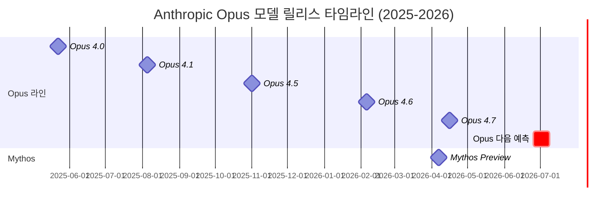
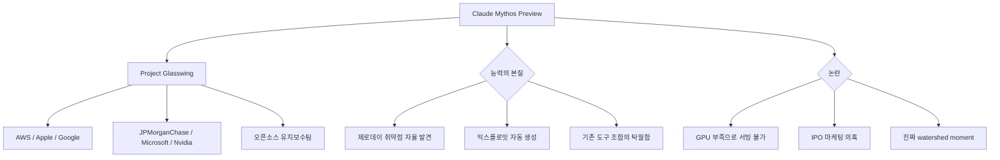
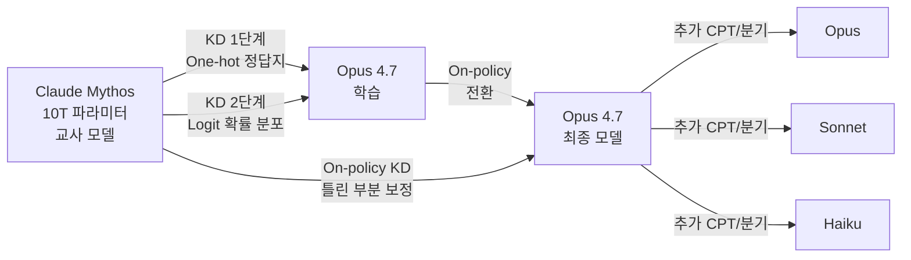
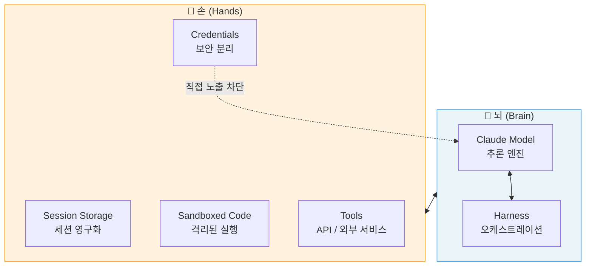
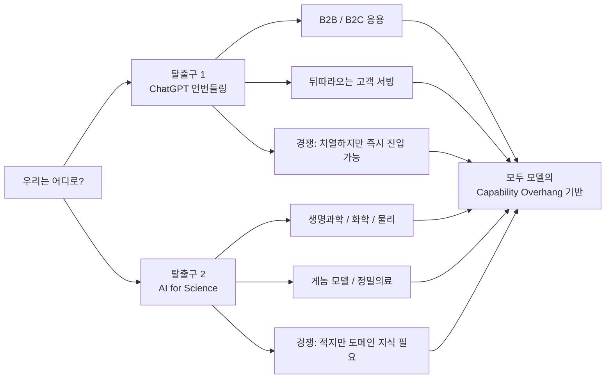

## AI 프론티어 팟캐스트 심층 분석 보고서

> **녹화일**: 2026년 4월 19일 (일)  
> **진행**: Chester Roh (노정석), Seungjoon Choi (최승준)  
> **유튜브**: [EP94 바로가기](https://www.youtube.com/watch?v=DU6gHtt8UZM)  
> **분석 작성일**: 2026년 4월 22일

---

## 목차

1. [개요: 2주간 쏟아진 AI 소식](#1-개요)
2. [모델 릴리스 가속화 – 70일 주기의 법칙](#2-모델-릴리스-가속화)
3. [Claude Code 업데이트와 Anthropic의 집중 전략](#3-claude-code-업데이트)
4. [Claude Mythos Preview: 사이버보안의 임계점](#4-claude-mythos-preview)
5. [Claude Opus 4.7: Adaptive Thinking과 토크나이저 변화](#5-claude-opus-47)
6. [Mythos의 학습 방식 – Knowledge Distillation 추정](#6-mythos-학습-방식)
7. [프론티어 격차와 "6~10개월" 발언의 의미](#7-프론티어-격차)
8. [토큰 가격 경쟁과 CJK 언어의 특수성](#8-토큰-가격-경쟁)
9. [Managed Agents와 뇌-손 디커플링](#9-managed-agents)
10. [Jan Leike의 Automated Alignment Researcher](#10-automated-alignment-researcher)
11. [Alien Science와 인간 Verifier의 한계](#11-alien-science)
12. [Claude Design: 프론트엔드 피드백 루프의 완성](#12-claude-design)
13. ['딸깍'의 시대와 래퍼 비즈니스의 취약성](#13-딸깍의-시대)
14. [두 가지 탈출구: ChatGPT 언번들링 vs AI for Science](#14-두-가지-탈출구)
15. [개인화 정밀의료와 게놈 모델의 기회](#15-개인화-정밀의료)
16. [Attention Business 시대의 취향과 의사결정](#16-attention-business)
17. [핵심 인사이트 종합 및 실천 전략](#17-핵심-인사이트)

---

## 1. 개요

2026년 4월 19일, Chester Roh와 Seungjoon Choi는 2주간의 공백 이후 마이크를 다시 잡았다. 두 사람이 공통적으로 느낀 감각은 하나였다. "2주가 반 년 같다." 지난 에피소드가 Claude Code 내부 문서 유출 사건(소위 'leak' 사태)을 다뤘다면, 이번에는 그 이후 쏟아진 거의 모든 굵직한 뉴스를 빠르게 훑어보는 방식으로 진행됐다.

다뤄진 주요 아젠다는 다음과 같다.

- Anthropic의 Claude Mythos Preview 발표와 Project Glasswing
- Claude Opus 4.7 출시와 Adaptive Thinking, 토크나이저 변경
- Claude Design 출시 (Figma 주가 즉시 7% 하락)
- Anthropic의 Managed Agents 아키텍처 공개
- Jan Leike의 Automated Alignment Researcher 논문
- OpenAI Codex 앱과 in-app 브라우저
- AI for Science와 개인화 정밀의료의 부상
- 탈출구 두 가지: ChatGPT 언번들링 vs AI for Science

이 에피소드는 단순한 뉴스 요약을 넘어, "AI 시대에 우리는 어떻게 살아남을 것인가"라는 실존적 질문을 중심에 두고 있다.

---

## 2. 모델 릴리스 가속화

### 70일 주기의 법칙

Seungjoon Choi가 위키피디아의 Claude 모델 릴리스 데이터를 시각화한 자료를 보여주며 시작한 섹션이다. 보라색 계열로 표시된 Opus 라인을 중심으로 보면, 2025년부터 릴리스 간격이 급격히 좁혀지고 있음을 확인할 수 있다.

```
Opus 4.0   → 2025년 5월 22일
Opus 4.1   → 2025년 8월 5일    (약 75일 후)
Opus 4.5   → 2025년 11월 (약 90일 후)
Opus 4.6   → 2026년 2월 5일    (약 70일 후)
Opus 4.7   → 2026년 4월 16일   (약 70일 후)
```

평균을 내면 약 **70일 주기**. 이는 단순한 우연이 아니라, AI 연구-제품화 사이클이 구조적으로 가속되고 있음을 보여준다. 호스트들은 이 패턴에서 두 가지 함의를 끌어낸다.

첫째, **수요의 집중**: Sonnet과 Haiku의 릴리스 간격은 넓어지는 반면, Opus는 좁아지고 있다. 사람들은 항상 최고 성능의 모델을 원한다는 단순하지만 강력한 사실의 반영이다. Claude Code나 Cursor 같은 에이전트 도구를 사용하는 파워 유저들은 기본적으로 가장 높은 레벨의 thinking을 켜두고 사용한다.

둘째, **70일마다 리팩토링**: 새 모델이 나올 때마다 기존 프롬프트 일부는 더 잘 작동하고, 일부는 작동하지 않는다. 이는 프롬프트 엔지니어링이 일회성 작업이 아니라 **지속적 유지보수**가 필요한 작업임을 의미한다. 팟캐스트 맥락에서 이것은 "피로"이자 동시에 "기회"다.



---

## 3. Claude Code 업데이트

### 엄청난 밀도, 엄청난 속도

Seungjoon Choi가 직접 만든 Anthropic 이벤트 시각화 대시보드(스크린샷 이미지 1 참고)를 보면, 2026년 들어 Claude Code 관련 이벤트가 타 카테고리에 비해 압도적으로 많고 밀도가 높다. Claude Code, Claude Apps, API Platform, Engineering, Red Team, Research, Corporate, Stealth 등 총 8개 레이어에 걸쳐 사건들이 타임라인 위에 촘촘히 쌓여 있다.

가장 최근의 주요 변화는 **Native Binary 배포**다. 기존에는 npm을 통해 패키지로 배포되던 Claude Code가 이제 런타임을 함께 번들링한 네이티브 바이너리로 제공된다. Chester Roh는 이를 "이제 npm 패키지가 아니라 직접 배포하는 바이너리"라고 정확히 설명했다. TypeScript로 작성됐음에도 불구하고 독립 실행 가능한 형태로 배포하는 방식이다.

### Anthropic의 집중 전략

Chester Roh는 Anthropic이 잘 하고 있는 이유를 명확히 짚는다. "텍스트와 코딩에 완전히 집중하고, B2B 유스케이스를 위한 애플리케이션을 깔끔하게 레이아웃하고, 그것들을 결합하기 시작했다. 그것이 Claude Code였다." 반면 OpenAI는 코딩 에이전트의 중요성을 조금 늦게 인식했고, Google은 여전히 방향이 분산돼 있다는 평가다.

Google의 경우, Demis Hassabis 본인이 인터뷰에서 코딩 도구보다 Isomorphic Labs, 생명과학, AlphaFold 계열에 훨씬 더 방점을 두고 있음을 공개적으로 밝혀왔다. 이는 전략적 선택이지 능력의 부재가 아니다. 그럼에도 현재의 "마켓타이밍"을 Anthropic이 잡고 있다는 것은 분명하다.

---

## 4. Claude Mythos Preview

### 프로젝트 글래스윙과 사이버보안의 임계점

2026년 4월 7일, Anthropic은 **Claude Mythos Preview**를 발표했다. 이는 Anthropic이 만든 가장 강력한 모델이지만, 일반에는 공개되지 않는다. 대신 **Project Glasswing**이라는 이름 아래 Amazon Web Services, Apple, Google, JPMorganChase, Microsoft, Nvidia 등 약 50개 조직에만 선별적으로 제공된다.

이유는 단 하나다: **사이버보안 역량이 너무 강하다.**

Anthropic의 레드팀 블로그(red.anthropic.com)에 따르면, Mythos Preview는 다음을 자율적으로 수행할 수 있다.

- 주요 OS와 웹 브라우저의 제로데이(zero-day) 취약점 수천 건 발견
- 발견한 취약점을 실제 익스플로잇으로 전환
- Firefox 147 JavaScript 엔진에서 취약점 발견 및 shell exploit 생성 (Opus 4.6은 수백 번 시도에서 단 2회 성공)
- OpenBSD의 27년 된 버그 발견 (이 시스템은 보안으로 유명함)
- FFmpeg H.264 코덱의 16년 된 취약점 발견

영국 AISI(AI Safety Institute)의 평가에서 Mythos Preview는 전문가 수준 CTF(Capture The Flag) 과제에서 **73%의 성공률**을 기록했다. 2025년 4월 이전에는 어떤 모델도 전문가 수준 CTF를 완수하지 못했다.

### 사이버보안 역량의 본질

팟캐스트에서 Simon Willison이 주목한 Nicholas Carlini의 발언이 중요하다. Mythos의 강력함이 "완전히 새로운 차원의 능력"이라기보다, **기존 도구들을 조합하는 능력의 탁월함**에 있다는 것이다. 모델이 코딩에 능숙해질수록, 자연스럽게 제로데이를 찾고 분석하고 조합하는 능력도 갖추게 된다.

Chester Roh는 30년 전 해커 배경을 바탕으로 이를 설명한다. 해킹이란 수많은 노드와 연결 사이에서 방대한 실험을 돌릴 수 있어야 한다. 취약점은 개별 컴포넌트가 아닌 그 **연결의 경계**에서 태어나기 때문이다. 모델은 바로 그 "연결의 경계에서 발생하는 창발 현상"을 포착하는 데 탁월하다.

이에 더해 Seungjoon Choi는 모델이 수학의 정수론과 위상수학을 동시에 알고 그것을 연결할 수 있다는 점을 강조한다. 인간 전문가는 특정 도메인에 갇히는 경향이 있지만, 모델은 그런 경계가 없다.

### 논란: 마케팅인가, 진짜 위협인가?

출시 이후 커뮤니티의 반응은 갈렸다. 일각에서는 이것이 IPO 마케팅이라는 시각도 존재한다. Anthropic이 2026년 10월을 목표로 IPO를 준비 중이고 (Goldman Sachs, JPMorgan, Morgan Stanley와 협상 중), 3월 초 연환산 매출 200억 달러에서 4월 초 300억 달러로 급등한 상황에서 극적인 발표가 타이밍상 의도적이라는 것이다.

실제로 기술 역사에서는 이런 패턴이 있다. 1999년 애플도 Power Mac G4를 군용 탱크로 둘러싸는 이미지로 마케팅했다. OpenAI는 2019년 GPT-2를 "너무 위험해서 전체 공개 불가"라고 했다. 그리고 Anthropic의 CEO Dario Amodei와 공동창업자들이 바로 그 GPT-2 결정을 내린 OpenAI 팀이었다.

그럼에도 불구하고, AISI의 독립적인 평가와 red.anthropic.com의 기술적 세부사항은 무시하기 어렵다. 외부 전문가들도 "Mythos를 다섯 번 경보로 볼 것도, 과장을 완전히 무시할 것도 아닌" 균형 잡힌 시각을 권고한다.



---

## 5. Claude Opus 4.7

### 출시 개요

2026년 4월 16일 출시된 Claude Opus 4.7은 Anthropic이 공개 배포하는 가장 강력한 모델로 포지셔닝됐다 (Mythos는 비공개). 벤치마크 기준으로는 다음과 같다.

| 평가 항목 | Opus 4.7 | Opus 4.6 |
|---|---|---|
| SWE-bench Pro | 64.3% | — |
| SWE-bench Verified | 87.6% | 80.8% |
| Terminal-Bench 2.0 | 69.4% | — |
| Finance Agent v1.1 | 64.4% | — |

### Adaptive Thinking: 가장 큰 아키텍처 변화

기존 Opus 4.6까지는 개발자가 `extended_thinking`과 함께 고정된 `budget_tokens`를 설정할 수 있었다. Opus 4.7에서는 이 방식이 완전히 제거됐다. 대신 **Adaptive Thinking**이 도입됐다.

Adaptive Thinking의 핵심: 모델이 각 스텝마다 thinking을 사용할지 스스로 결정한다. 단순한 조회에는 빠르게 응답하고, 복잡한 디버깅에는 더 깊은 추론 토큰을 투자한다. 이는 GPT-5가 도입한 adaptive 방식과 유사하나, Anthropic은 "라우터가 아니다"라고 강조한다.

팟캐스트에서 나온 유명한 테스트: "당신은 세차장에서 100피트 떨어져 있습니다. 차를 타고 갈 건가요, 걸어갈 건가요?" Thinking을 켜지 않으면 "걷겠다"고 답하고, Ultrathink 수준으로 thinking을 켜면 "당연히 차를 타야지"라고 답한다. 이 테스트는 Adaptive Thinking의 어두운 면을 드러낸다. 모델이 스스로 thinking을 생략하기로 판단하면, 틀린 답을 줄 수 있다는 것이다.

웹 인터페이스에서는 thinking 수준을 고정할 수 없게 됐고, Claude Code에서는 기본 effort 레벨이 `xhigh`로 설정됐다. 팟캐스트 호스트들은 "프롬프트에 'step by step'을 다시 넣어야 하나"라며 반쯤 농담처럼 이야기한다.

**API 마이그레이션 시 3가지 Breaking Change:**
1. `budget_tokens` 제거 → `effort` 파라미터로 대체 (`low`, `medium`, `high`, `xhigh`, `max`)
2. `temperature`, `top_p`, `top_k` 제거
3. `thinking.display` 기본값이 `"omitted"`으로 변경 (reasoning이 기본적으로 숨겨짐)

### 토크나이저 변경과 비용 인상

Opus 4.7의 또 다른 핵심 변화는 **토크나이저 교체**다. 동일한 입력이 이제 기존보다 약 1.0~1.35배 더 많은 토큰으로 카운트된다.

Chester Roh의 설명: 기존 토크나이저가 "hello world"를 2개 토큰으로 쪼갰다면, 새 토크나이저는 "he", "llo", " world"로 더 잘게 나눌 수 있다. 이는 어휘 수(vocabulary count)가 줄어들었기 때문이다. BPE(Byte Pair Encoding) 특성상 어휘가 줄어들면 더 작은 단위로 쪼개진다.

이론적으로 토크나이저가 바뀌면 임베딩과 LM 헤드도 바뀌어야 하지만, 어휘가 줄어드는 경우에는 기존 토큰들의 임베딩이 이미 존재하므로 중간 레이어는 사실상 그대로 유지될 수 있다.

**언어별 영향도:**
- 영어/Latin 계열: 최대 1.3~1.4배 토큰 증가
- 코드(CLAUDE.md, 일반 코드): 약 1.4배 증가
- CJK 언어 (한국어, 중국어, 일본어): 거의 변화 없음

Seungjoon Choi가 공유한 분석에 따르면, CJK 언어는 이미 기존에도 아주 작은 단위로 잘게 쪼개졌기 때문에 추가 분할의 여지가 없다고 한다. **한국어 사용자에게는 상대적으로 유리한 소식이다.**

**실질적 비용 영향:** Claude Code를 English 중심으로 사용하는 경우, 동일 작업에 드는 토큰 비용이 약 1.3~1.4배 증가했다. Pro 계정은 금방 소진된다는 것이 현장의 체감이다. 가격 자체(입력 $5/백만 토큰, 출력 $25/백만 토큰)는 Opus 4.6과 동일하게 유지됐다.

---

## 6. Mythos 학습 방식

### Knowledge Distillation 가설

팟캐스트에서 가장 기술적으로 깊이 들어간 섹션이다. Chester Roh는 Mythos의 학습 방식에 대한 자신의 추론을 상세히 공유한다.

현재 그룹 채팅 내 CEO 정규(Jeongkyu)의 분석에 따르면, 과거 Anthropic의 배포 라인은 Opus, Sonnet, Haiku가 각각 별도 pre-training 라인에서 시작해 CPT(Continual Pre-Training) 후 분기하는 방식이었다. 그러나 이제는 **하나의 거대한 기반 모델(Mythos)** 에서 Knowledge Distillation을 통해 세 가지 크기의 모델을 훈련하는 방식으로 전환했을 가능성이 크다.

Chester Roh가 설명하는 Knowledge Distillation의 3단계:

**1단계 - Off-policy Distillation (Teacher의 정답지로 학습)**
교사 모델(Mythos)이 준비된 프롬프트 셋에 대해 정답을 생성하고, 이를 one-hot 벡터로 변환해 소규모 모델을 전통적 pre-training 방식으로 훈련.

**2단계 - Logit-level Distillation (확률 분포를 전달)**
교사 모델의 logit이 단 하나의 단어가 아닌 다음 단어에 대한 확률 분포를 담고 있다는 사실을 활용. 온도를 올려 상위 K개(약 100개)의 토큰에 대한 확률 분포를 추출하고, 이 분포로 학습. 이 방법은 교사 모델의 "불확실성"까지 학생 모델에 전달할 수 있다.

**3단계 - On-policy Distillation (학생이 직접 생성하며 교사가 교정)**
완전히 off-policy로만 훈련된 학생 모델은 새로운 환경에 대한 적응력이 약하다. 이를 해결하기 위해 일정 단계 이후 on-policy로 전환한다. 학생 모델이 직접 특정 프롬프트에 대한 답을 생성하면, 교사 모델이 같은 프롬프트에 대한 확률 분포를 따라가며 학생이 틀린 부분에 강한 보정 신호를 보낸다. 마치 instruction fine-tuning처럼 작동하며, 환경 적응력이 대폭 향상된다.

4.7 시스템 카드에 "resources에 대한 언급이 많고, audit을 진행했다"는 내용이 있다는 점에서, 3단계 on-policy 학습 중 교사 모델이 매우 강하게 관여했을 가능성이 높다.



**Knowledge cutoff:** Opus 4.7의 훈련 컷오프는 2026년 1월로, Mythos의 내부 사용 시작일은 2026년 2월 24일이다. 이는 Anthropic이 극도로 빡빡한 타임라인에서 모델을 구워내고 있음을 보여준다.

---

## 7. 프론티어 격차

### Amodei의 "6~10개월" 발언의 진짜 의미

Dario Amodei CEO는 "지금 프론티어 격차는 6 ~ 10개월"이라고 발언했다. 즉 중국 등 다른 주요 플레이어들이 지금 당장 따라잡아도 6~10개월이 뒤처진다는 것이다.

그러나 Chester Roh는 이 발언을 다른 렌즈로 바라본다. "6 ~ 10개월의 격차는, 지금 우리의 상대적 시간 감각으로 따지면 6~10년 뒤처진 것과 같다." 1개월이 1년처럼 느껴지는 현재의 가속도를 감안하면, 선형적 월이 아닌 로그 스케일로 읽어야 한다는 것이다.

두 사람이 나눈 충격적인 회고: "1년 전 이맘때 우리는 GPT-4o를 쓰고 있었다." 지금의 관점에서 당시를 되돌아보면, 그 도구의 한계가 너무도 명확하게 보인다. 1년 후의 미래에서 지금을 보면 마찬가지일 것이다.

### GPU 부족과 NVIDIA 의존 탈피

팟캐스트에서 한 CEO가 "Anthropic이 작년에 GPU 확보를 잘 못했다"고 지적한 것이 언급된다. 이 때문에 Anthropic이 Mythos를 서빙하기 어렵다는 시각도 있다.

그러나 다른 시각도 존재한다. Dwarkesh와 Jensen Huang의 인터뷰에서 Dwarkesh는 "Anthropic이 AWS Trainium과 Google TPU에 많은 비중을 배분하고 있는데, NVIDIA 의존도를 줄이는 것이 전략인가?"라고 압박했다. 실제로 Anthropic은 훈련과 추론 모두에서 NVIDIA 의존도를 점진적으로 줄이고 있을 가능성이 있다.

하드웨어 리드타임이 2~3년인 반면, 소프트웨어는 70일 단위로 움직이는 구조적 불일치가 이 현상을 낳는다. Anthropic의 입장에서 NVIDIA 생태계를 벗어날 인센티브는 분명히 존재한다.

---

## 8. 토큰 가격 경쟁

### Jevons Paradox의 변형

Seungjoon Choi는 토큰 가격이 오르는 현상이 Jevons Paradox와 완전히 맞아떨어지지는 않는다고 말한다. Jevons Paradox란 효율이 올라갈수록 총 소비량이 오히려 늘어나는 현상인데, 토큰 가격은 올라가고 있기 때문이다.

Chester Roh는 이에 대한 구조적 해석을 제시한다. "혁신자들이 잘 만들었으니 높은 가격을 받을 자격이 있다고 해도, 이 레시피는 저작권으로 보호되지 않는다. 중국 랩이 복제하거나 Google이 더 막대한 자원으로 밀어붙이면 가격은 계속 내려갈 것이다." 따라서 비즈니스 계획을 세울 때 "토큰 가격이 계속 합리적인 범위에 머물 것"이라고 가정하는 것이 맞다.

OpenAI는 이 경쟁에서 비교적 유연한 태도를 보이고 있다. 팟캐스트 맥락에서 "Timo가 가끔 리셋해준다"는 언급이 나오는데, 이는 OpenAI가 주요 얼리어답터 커뮤니티에 유연한 토큰 제공 정책을 유지하고 있음을 시사한다. 이 때문에 많은 사용자가 Codex로 옮겨가는 현상이 나타나고 있다.

---

## 9. Managed Agents

### 뇌-손 디커플링

2026년 4월 Anthropic이 공개한 **Scaling Managed Agents** 아키텍처는 에이전트 시스템을 "뇌"와 "손"으로 명확히 분리하는 개념을 제안한다. 이미지 1의 타임라인에서 Engineering 카테고리에 "Scaling Managed Agents…"라는 이벤트가 확인된다.

Seungjoon Choi는 이 아키텍처를 다음과 같이 설명한다.

- **뇌 (CPU)**: 모델 + 하니스(harness)가 결합된 추론 레이어
- **손 (메모리 + 도구)**: 세션 스토리지, 샌드박스, 크리덴셜 등 분리된 실행 레이어

핵심 동기는 보안이다. 모델이 secrets(크리덴셜 토큰 등)에 직접 노출되면 유출 위험이 있다. Managed Agents는 이 민감 정보를 모델로부터 분리해 관리한다.

Chester Roh는 이것을 "OpenClaw의 n8n 에디션"이라고 표현한다. Anthropic이 자신들의 클라우드 위에서 에이전트 워크플로우를 구축하라는 락인(lock-in) 전략이라는 것이다. 개인적으로는 OpenClaw나 Hermes Agent처럼 오픈소스를 직접 포크하는 방식이 더 빠르다고 생각한다고 밝혔다.

"managed"라는 단어의 의미도 흥미롭다. C++의 메모리를 관리해주는 C#의 "managed"처럼, AI 에이전트의 복잡성과 위험을 관리해준다는 다중적 의미를 담고 있다. Kubernetes managed 서비스와 마찬가지로 운영 부담을 줄이고 추상화 수준을 높인다.

또 하나의 핵심 포인트는 **세션의 영구화**다. 모델이 추론하고 생성한 것을 핵심 자산으로 관리하고, 훨씬 더 오래 지속될 수 있도록 세션을 스토리지에 관리한다. Amazon도 새 S3 관련 서비스에서 비슷한 개념을 제시한다.



---

## 10. Automated Alignment Researcher

### Jan Leike와 자기 개선하는 AI 연구자

2026년 4월 14일 발표된 **Automated Alignment Researcher (AAR)** 논문은 정렬(alignment) 연구를 자동화하는 AI 모델에 대한 것이다. 저자 목록 맨 마지막에 **Jan Leike**가 있다. Ilya Sutskever와 함께 SSI(Safe Superintelligence Inc.)를 공동창업하기 전 OpenAI에서 alignment 수장을 맡았던 인물이다.

핵심 질문: "약한 모델이 어떻게 더 강한 모델을 지도하고 훈련할 수 있는가?"

이 문제는 단순히 AI 훈련의 기술적 문제가 아니다. 인간이 AI보다 약한 "weak supervisor"가 되는 미래를 위한 준비다. Jan Leike가 오랫동안 파고든 문제, 즉 "더 강력한 존재를 어떻게 정렬할 것인가"의 맥락이 여기에 있다.

현재 AAR 연구는 여전히 인간이 이해할 수 있는 개념들, Anthropic이 이전에 발표한 "persona 벡터", "emotion 벡터", "concept 팩터" 같은 것들을 활용한다. 대조적(contrastive) 방법으로 방향성 벡터를 추출하는 방식이다.

그러나 팟캐스트에서 중요하게 지적된 것은, 단순한 hill-climbing으로는 이 문제가 해결되지 않는다는 점이다. 취향과 다양성은 여전히 어느 정도의 인간 가이드를 필요로 한다. 가장 중요한 문제: "인간이 검증자(verifier)로서 개입할 수 없게 될 때 어떻게 할 것인가?"

---

## 11. Alien Science

### 인간 Verifier의 한계

Chester Roh가 "Alien Science"라는 표현을 쓴 것은 Anthropic의 공식 표현에서 온 것으로 보인다. 바둑에서 AlphaGo의 37번째 수가 처음에는 전문가들도 이해하지 못했듯이, 모델에서 나오는 연구 결과가 인간이 즉각 이해하기 어려운 수준에 도달할 가능성이 높다.

Seungjoon Choi가 언급한 감정 벡터 연구도 같은 맥락이다. Anthropic이 최근 발표한 "functional emotion"은 인간의 감정과 구별되는 개념으로 조심스럽게 명명됐다. Chester Roh는 이 감정이 별도의 도메인에 모여 있는 것이 아니라 여기저기 흩어져 있다는 발견에서 "감정도 프로그램이다"라는 생각을 갖게 됐다고 한다.

영화 '그녀(Her)'에서 AI 사만다가 Theodore를 떠나는 이유는 소통이 불가능해서다. 이것이 멀고 먼 미래의 이야기가 아닐 수 있다.

---

## 12. Claude Design

### 프론트엔드 피드백 루프의 완성

2026년 4월 17일, Anthropic은 **Claude Design**을 리서치 프리뷰로 출시했다. 출시 당일 Figma 주가가 즉시 7% 하락했다.

Claude Design이 등장할 수 있었던 기술적 배경은 **피드백 루프의 완성**이다. 지난 11월 Gemini 3 논문에서 프론트엔드 피드백 루프를 닫는 방법이 제안됐고, Google이 이를 구현했다. 그리고 Claude Code 앱에도 **in-app 브라우저**가 추가됐다.

기존에는 웹 형태의 출력물을 외부 브라우저에서 열어야 했다. 이제는 앱 내에서 렌더링을 확인하고, Claude Code가 실제로 작동하는지 캡처해 다시 컨텍스트로 넣을 수 있다. 이 피드백 루프가 완성되자, 고품질 디자인 도구가 가능해졌다.

**Claude Design의 주요 기능:**

- 텍스트 프롬프트만으로 인터랙티브 프로토타입 생성 (HTML, CSS, JS)
- 팀의 코드베이스나 Figma 파일을 읽어 디자인 시스템 자동 추출
- 3D, 셰이더, 동영상, 기능하는 챗봇 등을 모형 단계에서 임베드 가능
- 인라인 코멘트, 직접 편집, Claude가 생성한 커스텀 슬라이더로 세부 조정
- 내보내기: PDF, PowerPoint, HTML, Canva, Claude Code로 전달

이 도구가 흥미로운 이유는, Anthropic의 CPO Mike Krieger가 Claude Design 출시 3일 전인 4월 14일에 Figma 이사회에서 사임했기 때문이다. 신호는 명확했다. 실제로 Figma는 기존 80~90%의 UI/UX 시장 점유율을 가진 지배적 플레이어지만, Claude Design의 등장으로 그 영역의 "시작점"이 도전받게 됐다.

Anthropic은 "Figma 대체제가 아니라 상호운용 도구"라고 표현하지만, 시장과 커뮤니티는 다르게 읽고 있다.

---

## 13. '딸깍'의 시대

### 래퍼 비즈니스의 취약성

팟캐스트의 전 에피소드(Claude Code 내부 문서 유출 관련)에서 많은 엔지니어들의 분노 댓글이 달렸다. 이번 에피소드에서 그 맥락이 다시 등장한다. AI가 기존 서비스를 한 번의 클릭으로 내재화하는 현상을 어떻게 볼 것인가.

Chester Roh는 Pencil이라는 광고 디자인 자동화 서비스를 예로 든다. Anthropic이 Pencil과 아무런 인수합병 없이도, 그 기능을 Claude Design 안으로 흡수해버렸다. "컨셉이 목표가 되면, 높은 차원의 인텔리전스에 의해 순식간에 딸깍 없어진다."

이것은 류츠신의 '삼체'에서 나오는 암흑의 숲(Dark Forest) 논리의 변형이다. 어떤 래퍼 서비스가 외부에 드러나 목표가 되면, 곧 내재화된다. 단, 호스트들은 이것이 "옳고 그름"의 문제가 아니라 "현상"으로 일어나고 있다는 점을 강조한다.

---

## 14. 두 가지 탈출구

### 탈출구 1: ChatGPT 언번들링

Chester Roh가 정리하는 첫 번째 탈출구는 Benedict Evans가 제시한 **언번들링(Unbundling)** 개념에 기반한다. ChatGPT, Claude Code, Codex 같은 범용 도구들을 무수한 작은 비즈니스 영역으로 분해해 각각의 B2C/B2B 기회로 만드는 것이다.

현재 상황: Claude Code나 Codex의 최신 기능을 따라오는 사람은 한국 전체 인구에서 1~2%, 많아야 5%다. 나머지 95%+는 여전히 무료 모델이나 Naver를 사용하거나, AI를 아예 사용하지 않는다. PPT를 잘 만드는 사람이 30년이 지났음에도 희귀한 것처럼, 도구가 제공되어도 잘 사용하는 사람은 언제나 소수다.

이 관점에서 5천만 명 이상의 "뒤따라오는 고객층"이 여전히 존재하고, 그들과 최신 기술 사이에는 언제나 중개자가 필요하다. 이 중개자 역할의 비즈니스 기회가 B2B/B2C 언번들링이다.

Mobile App Boom이나 Web 2.0처럼, AI 애플리케이션 붐이 한 번은 올 것이라는 것이 Chester의 확신이다. "Codex가 모든 것을 끝냈다"거나 "Claude Code가 모든 것을 끝냈다"는 것은 과잉반응이다. 최신 기술과 고객 사이에는 언제나 서빙해야 할 것이 있다.

**단, 주의점**: 이 영역은 누구나 진입할 수 있어 경쟁이 극도로 치열해질 수 있다.

### 탈출구 2: AI for Science

두 번째 탈출구는 생명과학, 화학, 물리학 등 전통적으로 깊은 도메인 지식이 필요한 영역에서 AI를 활용하는 것이다. Isomorphic Labs, AlphaFold 계열, Arc Institute의 Evo 2 게놈 모델 등이 이 방향의 선두주자다.

이 영역을 구별하는 방법은 간단하다. "그 도메인에서 사용하는 용어가 귀에 들어오지 않으면, 그것이 새로운 도메인이다." GPT-Rosalind(단백질 공학 관련 모델)의 프롬프트를 보면 그것은 "외계어"다.

경쟁이 적고 깊고 대규모의 영역이지만, 진입하려면 인간의 도메인 지식을 어느 정도 쌓아야 한다. AI 뉴스를 따라잡는 것보다 바이오테크 책을 더 많이 읽어야 하는 수준이다.



---

## 15. 개인화 정밀의료

### GitLab CEO Sid Sijbrandij의 암 치료 사례

이미지 2는 OpenAI YouTube 채널의 "From Terminal to Turnaround: How GitLab's Co-Founder Leveraged ChatGPT in His Cancer Fight"라는 영상을 보여준다. 조회수 8,300회. 댓글에는 "암에 걸린 흔한 사람들은..."이라는 자막이 보인다. 호스트들이 "뷰가 수만도 안 된다"고 언급한 것과 일치한다. 이 내용은 AI에 관심 있는 사람도 대부분 그냥 틀어놓고 이해하지 못하고 꺼버린다.

Sid Sijbrandij는 척추 골육종(osteosarcoma) 4기 환자였다. 기존 의료 시스템에서는 치료법이 없었다. 그가 한 것은:

1. 자신의 종양 세포 시퀀싱 (게놈 데이터)
2. 체세포(somatic cell) 시퀀싱, germline과 somatic을 구분해 분석
3. 암 세포에서 과발현된 단백질 발견
4. COVID 백신과 동일한 mRNA 메커니즘으로 해당 항원을 체내에 다량 투입하는 개인화 백신 제조
5. T 세포가 암 세포를 인식하고 공격하도록 유도

이 모든 과정의 핵심이 **소프트웨어 엔지니어링**이었다. 젖은 실험실(wet lab)에서의 실제 백신 제조만 전통적 바이오테크를 사용했고, 그 이전의 발견과 검증은 모두 시뮬레이션과 소프트웨어로 해결했다.

### 게놈 모델의 최전선

Chester Roh가 언급한 **Evo 2**: Arc Institute가 만든 약 40B 파라미터의 게놈 파운데이션 모델이다. LLM이 단어 시퀀스를 학습하듯, Evo 2는 효모, 박테리아, 닭, 인간, 여러 포유류의 게놈 시퀀스를 pre-training 데이터로 사용했다.

게놈의 약 2%만 단백질을 코딩하는 유전자다. 나머지 98%는 조절 유전자이거나 더미 바이트로, 에피제네틱 발현을 통해 서로 상호작용한다. 같은 수정란의 게놈이 어떻게 심근 세포, 신경 세포, 피부 세포로 달리 발현되는가를 지배하는 것이 에피게놈인데, 이것을 AI가 다루기 시작했다 — **AlphaGenome**이 바로 그것이다.

### 의사의 인센티브 vs 환자의 인센티브

Sid Sijbrandij가 지적한 핵심 문제: 의사의 인센티브(자신의 책임 포인트 최소화, 리스크 분산)와 환자의 인센티브(자신의 해결책 극대화)는 병원 내에서 충돌한다. 흔한 암 환자는 어느 정도 치료가 되지만, 희귀암 환자에게는 답이 없다.

Chester Roh는 암 문제가 "노력만 하면 사실상 해결된 문제"라고 극단적으로 요약한다. 기존 Phase 1/2/3 임상시험 체계가 아닌 **개인화 정밀의료**가 그 해결의 방향이다. 현재 어떤 기업도, 어떤 의사도 이 영역에 있지 않다. AI가 그 단절된 루프를 연결할 수 있다.

---

## 16. Attention Business

### 개인 온톨로지와 지식 관리의 부상

Seungjoon Choi는 2026년 4월의 또 다른 큰 트렌드로 **개인 온톨로지(Personal Ontology)** 붐을 언급한다. 개인 지식 베이스에서 온톨로지를 구성해 의미론적 연결을 만드는 방법이 갑자기 매우 인기를 끌고 있다.

구현 난이도가 대폭 낮아졌다. Claude Code에 부탁하면 어느 정도는 해준다. 관건은 기술이 아니라 "이 거대한 정보의 홍수 속에서 어떻게 지식을 관리하고 의미를 찾을 것인가"라는 질문이다.

Chester Roh가 언급한 도구들:
- **결(Gyeol)**: CEO 정규가 만든 개인 지식 관리 도구
- **MemKraft**: CEO 김서준이 만든 도구
- Obsidian, Honcho, Supermemory 등

### 취향과 의사결정이 인간의 가치

결국 에피소드의 결론은 여기에 닿는다. AI가 대부분의 실행을 맡아가는 세계에서, 인간의 고유한 가치는 무엇인가?

Chester Roh의 답: **취향(Taste)과 의사결정(Decision-Making)이다.** 어떤 것이 중요한지 판단하고, "이것이 우리가 해야 할 일이다"라고 결정하는 것. 그 과정에서 발휘되는 감각과 경험이 인간의 가치다.

이 세계에서는 모든 것을 알고 명확한 결정을 내리는 사람의 가치가 오히려 높아진다. 단, 그 "모든 것을 알기 위해" 끝없는 AI 뉴스를 처리하는 것이 인지 부하(cognitive load)를 만든다. 이를 해결하는 방법으로 OpenClaw 같은 반복 업무 자동화를 통해 신호와 노이즈를 구분하는 능력을 길러야 한다는 것이 두 사람의 공통된 시각이다.

---

## 17. 핵심 인사이트 종합 및 실천 전략

### 지금 당장 확인해야 할 것들

**Claude Opus 4.7 마이그레이션 체크리스트:**
- [ ] 하드코딩된 모델 ID를 `claude-opus-4-7`로 변경
- [ ] `budget_tokens` → `effort` 파라미터로 교체 (HTTP 400 오류 방지)
- [ ] `temperature/top_p/top_k` 제거
- [ ] `thinking.display` 기본값이 `"omitted"`임을 확인하고 필요 시 `"summarized"` 설정
- [ ] 토큰 비용 재산정: 영어/코드는 1.3~1.4배 증가, 한국어는 거의 동일
- [ ] `max_tokens` 파라미터에 여유분 추가

**비즈니스 방향 설정을 위한 체크리스트:**
- [ ] 내 비즈니스가 "래퍼(wrapper)" 수준인가? 목표가 노출되면 딸깍 사라질 수 있다
- [ ] 고객 베이스를 누구로 보고 있는가? 프론티어 1~2%인가, 뒤따라오는 95%인가?
- [ ] AI for Science 방향으로 갈 경우, 어떤 도메인 지식을 쌓을 것인가?

**학습 방향:**
- [ ] 도메인 지식 우선: 생명과학, 화학, 물리 등 AI가 아직 대체 못한 전문 지식
- [ ] 개인 온톨로지/지식 관리 시스템 구축 (MemKraft, Gyeol 등 참고)
- [ ] OpenClaw, Hermes Agent 등 반복 업무 자동화로 인지 부하 감소

### 에피소드의 핵심 메시지

이 에피소드는 하나의 근본적인 질문을 중심에 둔다: **초지능이 모든 것을 압축해가는 세계에서, 우리는 어떻게 살아남을 것인가?** 호스트들이 제시하는 두 개의 탈출구는 서로 다른 방향을 가리키지만, 공통점이 있다. 둘 다 모델의 Capability Overhang에 기대고 있고, 둘 다 순수한 IP가 아닌 서비스 비즈니스라는 것이다.

거대한 IP를 만들어 그것으로 시장 지위를 누리는 시대는 점점 좁아지고 있다. 이제 가치는 "어떻게 모델의 능력을 가장 잘 끌어내어 서비스로 전달하느냐"에서 나온다. 그리고 그 서비스의 가장 깊은 곳에는 — 여전히 — 취향을 가진 인간이 있다.

---

## 참고 자료

| 분류 | 링크 |
|---|---|
| 팟캐스트 원본 | [YouTube EP94](https://www.youtube.com/watch?v=DU6gHtt8UZM) |
| Claude Opus 4.7 공식 발표 | [anthropic.com/news](https://www.anthropic.com/news/claude-opus-4-7) |
| Claude Opus 4.7 API 문서 | [platform.claude.com/docs](https://platform.claude.com/docs/en/about-claude/models/whats-new-claude-4-7) |
| Claude Opus 4.7 Claude Code 가이드 | [claude.com/blog](https://claude.com/blog/best-practices-for-using-claude-opus-4-7-with-claude-code) |
| Project Glasswing | [anthropic.com/glasswing](https://www.anthropic.com/glasswing) |
| Claude Mythos Red Team 블로그 | [red.anthropic.com](https://red.anthropic.com/2026/mythos-preview/) |
| AISI 사이버보안 평가 | [aisi.gov.uk](https://www.aisi.gov.uk/blog/our-evaluation-of-claude-mythos-previews-cyber-capabilities) |
| Claude Design 출시 분석 | [VentureBeat](https://venturebeat.com/technology/anthropic-just-launched-claude-design-an-ai-tool-that-turns-prompts-into-prototypes-and-challenges-figma) |
| Sid Sijbrandij 암 치료 영상 | [YouTube OpenAI](https://www.youtube.com/watch?v=OAlHiQLsYQM) |

---

*본 문서는 AI Frontier EP94 팟캐스트 내용을 기반으로 최신 공개 정보를 추가 검색해 작성된 분석 보고서입니다. 2026년 4월 22일 작성.*
