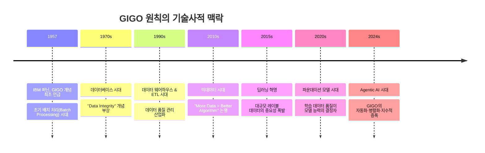
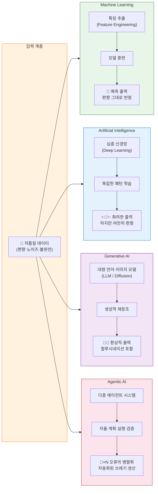
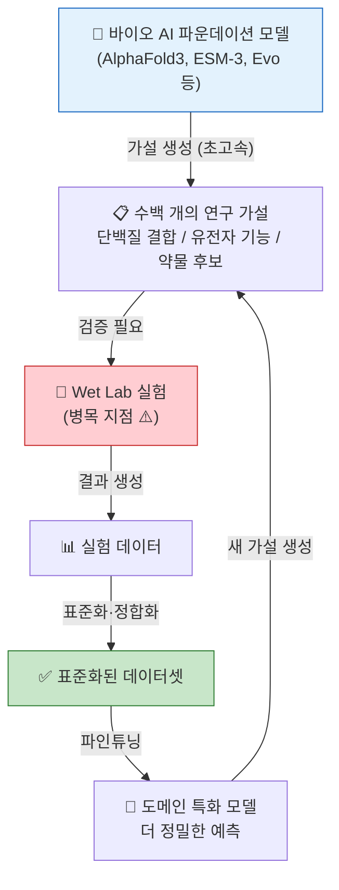
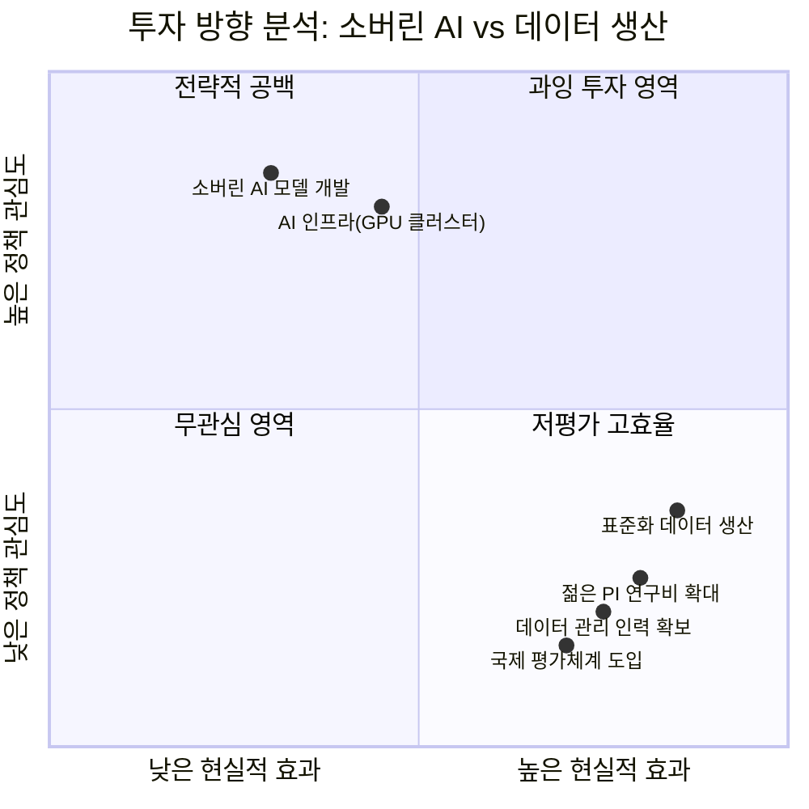
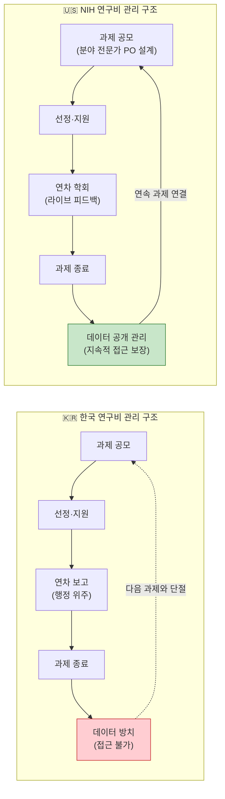
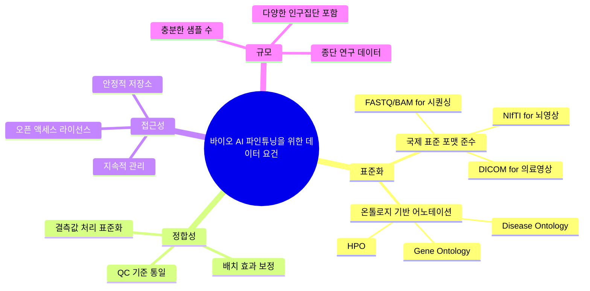
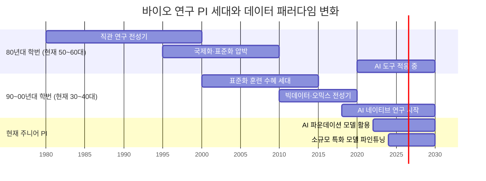
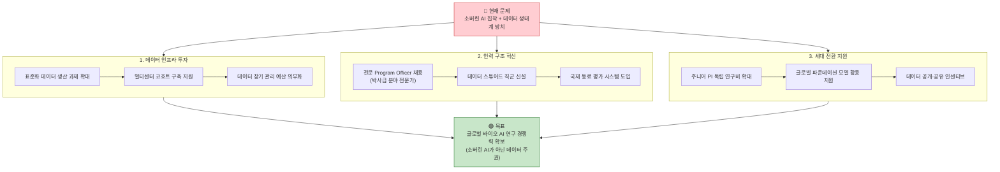

> **이미지 출처:** @bioaio (Threads) / 한국 바이오 AI 연구 커뮤니티 토론 종합 분석  
> **작성일:** 2026년 4월 22일  
> **키워드:** #데이터품질 #소버린AI #바이오AI #GIGO #한국연구생태계

---

## 목차

1. [밈(Meme) 해설 — "💩 + AI = 더 화려한 💩"](#1-밈meme-해설)
2. [GIGO 원칙의 역사와 의미](#2-gigo-원칙의-역사와-의미)
3. [AI 기술 단계별 분석: ML → AI → GenAI → Agentic AI](#3-ai-기술-단계별-분석)
4. [한국 바이오 연구 커뮤니티의 진단](#4-한국-바이오-연구-커뮤니티의-진단)
5. [소버린 AI 집착과 데이터 생산의 역설](#5-소버린-ai-집착과-데이터-생산의-역설)
6. [NIH vs 한국 연구비 관리 체계 비교](#6-nih-vs-한국-연구비-관리-체계-비교)
7. [바이오 AI 파운데이션 모델의 현실](#7-바이오-ai-파운데이션-모델의-현실)
8. [데이터 주권과 연구 데이터의 공개성 딜레마](#8-데이터-주권과-연구-데이터의-공개성-딜레마)
9. [세대론: 젊은 PI들이 열쇠를 쥔 이유](#9-세대론-젊은-pi들이-열쇠를-쥔-이유)
10. [제언: 한국 바이오 AI 생태계가 나아갈 방향](#10-제언-한국-바이오-ai-생태계가-나아갈-방향)

---

## 1. 밈(Meme) 해설

이 이미지는 데이터 과학 커뮤니티에서 오래도록 회자되는 **"쓰레기 입력 → 쓰레기 출력(Garbage In, Garbage Out)"** 원칙을 AI 기술 진화의 역사에 유머러스하게 대입한 밈이다. @bioaio 계정의 발표 자료에서 차용된 이 이미지는, 한국 바이오 연구 커뮤니티에서 소버린 AI와 데이터 생산 투자를 둘러싼 논쟁을 촉발한 핵심 시각 자료이기도 하다.

### 1-1. 이미지 구조 분석

밈은 동일한 공식을 네 번 반복한다: **Data(데이터) + [기술] = [결과물]**

그런데 데이터 아이콘에는 매번 💩 이모지가 붙어 있다. 즉, 데이터의 질이 나쁜 상태라는 전제가 고정된 채로 기술만 바뀐다.

| 행 | 기술 | 결과 | 해석 |
|----|------|------|------|
| 1행 | Machine Learning | 💩 (그냥 똥) | ML은 입력 그대로 반환한다 |
| 2행 | Artificial Intelligence | ✨💩✨ (반짝이는 똥) | AI는 포장은 화려해졌지만 본질은 같다 |
| 3행 | Generative AI | 🦄💩 (유니콘 똥) | GenAI는 환상적·창의적으로 보이지만 내용은 똑같다 |
| 4행 | Agentic AI | 💩💩💩... (수십 개의 다양한 똥) | 에이전트 AI는 동시다발적으로 증식·확산된다 |

### 1-2. 단계별 은유의 깊이

**1행 — Machine Learning: 그냥 똥**  
ML 모델은 훈련 데이터를 기반으로 패턴을 학습한다. 입력 데이터가 편향되거나 노이즈가 많으면 출력도 그대로 편향된다. 아무런 분식 없이 있는 그대로 내뱉는 직관적인 GIGO의 구현이다. 화려한 포장지도 없다.

**2행 — Artificial Intelligence: 반짝이는 똥**  
더 복잡한 AI 시스템(딥러닝, 신경망 기반)은 결과물에 "인텔리전스"라는 광채를 더한다. 발표 자료가 그럴싸해지고, 논문 초록이 정교해진다. 하지만 학습 데이터가 나쁘다면 모든 정교함은 장식에 불과하다. 오히려 전문가가 아닌 청중에게는 더 설득력 있어 보이기 때문에 위험성이 높다.

**3행 — Generative AI: 유니콘 똥**  
GPT류의 생성형 AI는 결과물을 완전히 새로운 형태로 재창조해낸다. 화려한 색채, 유니콘 뿔, 반짝이는 꼬리까지 붙었다. 있지도 않은 참고문헌을 그럴싸하게 생성하고(할루시네이션), 없는 실험 결과를 문학적으로 묘사할 수도 있다. "창의적으로 보이는 오류"가 만들어지는 단계다. 데이터 품질 문제가 창의성이라는 이름으로 포장된다.

**4행 — Agentic AI: 증식하는 💩 군집**  
에이전트 AI는 여러 AI가 서로 연결되어 자율적으로 작업을 분할하고 병렬로 실행한다. 한 에이전트가 잘못된 데이터를 기반으로 틀린 가설을 세우면, 다음 에이전트는 그 가설을 검증하기 위한 실험 계획을 수립하고, 또 다른 에이전트는 그 계획에 맞는 논문을 검색한다. 오류가 자동화되고 병렬화되며 시스템 전체에 퍼진다. 작은 💩 하나가 수십 개의 💩으로 증식하는 것이 이 행의 핵심이다. 에이전틱 AI 시대에 데이터 품질 문제는 선형이 아니라 지수적으로 악화될 수 있다.

---

## 2. GIGO 원칙의 역사와 의미

**GIGO(Garbage In, Garbage Out)** 는 컴퓨터 과학의 가장 오래된 격언 중 하나다.

1957년 IBM의 프로그래머 조지 퍼닌(George Fuechsel)이 처음 사용한 것으로 알려져 있으며, 초기 컴퓨팅 시대부터 지금까지 단 한 번도 그 유효성이 사라진 적이 없다. AI의 시대에 오히려 이 원칙은 더욱 강력하게 작동한다.

핵심은 기술이 발전할수록 GIGO의 **증폭 계수(amplification factor)** 가 커진다는 점이다. 손 계산기 시대에는 잘못된 숫자 하나가 잘못된 답 하나를 만들었다. 에이전틱 AI 시대에는 잘못된 데이터 하나가 수십 개의 잘못된 의사결정, 문서, 실험 계획, 논문 초안을 자동 생성할 수 있다.

---

## 3. AI 기술 단계별 분석

### 3-1. 데이터 → 결과물 변환 흐름

### 3-2. 위험성 지수: 기술 단계별 비교

| 기술 단계 | 오류 감지 난이도 | 오류 확산 속도 | 사회적 신뢰도 | 위험 지수 |
|-----------|----------------|--------------|--------------|----------|
| ML | 낮음 (명시적 오류) | 느림 | 낮음 | ★★☆☆☆ |
| AI | 중간 (복잡한 패턴) | 중간 | 중간 | ★★★☆☆ |
| Generative AI | 높음 (그럴싸한 허구) | 빠름 | 높음 | ★★★★☆ |
| Agentic AI | 매우 높음 (자율 결정) | 매우 빠름 | 매우 높음 | ★★★★★ |

---

## 4. 한국 바이오 연구 커뮤니티의 진단

Threads의 [@humangenomicslab](https://www.threads.com/@humangenomicslab/post/DXXwiGwkr5m), [@spring.sleep.joy](https://www.threads.com/@spring.sleep.joy/post/DXX3akHjPzi), [@bioaio](https://www.threads.com/@bioaio/post/DXX9NdDE8uk) 세 계정이 연속으로 펼친 이 논쟁은, 한국 바이오-AI 연구 생태계의 구조적 문제를 날카롭게 짚어낸다.

### 4-1. 핵심 진단: "소버린 AI에 미쳐있는" 연구 환경

이 주장의 논거는 이렇다:

> "당장 1년 정도만 지나도, AI 1도 모르는 분들도 자기 연구에서 쓰고 있을 것. 그래서 돈을 풀려면, 데이터 생산에 돈을 써야 함."

이는 AI 도구의 민주화(democratization)가 이미 진행 중임을 전제한다. ChatGPT, Claude, Gemini 등의 서비스는 이미 전문 지식 없이도 사용 가능한 수준이다. 바이오 연구자가 파이썬을 모르더라도 AI 보조 도구로 유전체 데이터를 분석하는 시대는 이미 왔다. 이 맥락에서 국산 AI 모델을 만드는 것보다 **모델이 학습하고 검증할 고품질 데이터를 생산하는 것**이 훨씬 더 전략적인 투자라는 주장이다.

### 4-2. 바이오 AI의 병목: 실험(Wet Lab)

**제로샷(Zero-shot) 모델의 등장**  
이미 2024년부터 파인튜닝 없이 그대로 사용할 수 있는(제로샷) 바이오 파운데이션 모델들이 다수 등장했다. AlphaFold3, ESM-3, Evo 등이 대표적이다. 이런 모델들은 단백질 구조 예측, 유전자 기능 추론, 약물 결합 예측 등을 수행할 수 있다.

**병목점(Bottleneck)의 이동**  
AI가 예측한 가설을 **실제로 검증하는 wet lab 실험**이 이제 병목이 되었다. 이전에는 가설 생성이 느렸다면, 이제는 AI가 가설을 쏟아내는 속도를 실험실이 따라잡지 못한다.

**파인튜닝 가능 모델의 시대**  
파인튜닝을 할 수 있는 모델은 더욱 강력하다. 소규모 도메인 특화 데이터로 파인튜닝된 모델은 특정 연구 질문을 직접 해결할 수 있다. 그러나 파인튜닝을 위해서는 **표준화되고 정합성 있는 데이터**가 필수다.

---

## 5. 소버린 AI 집착과 데이터 생산의 역설

### 5-1. 소버린 AI란 무엇인가

소버린 AI(Sovereign AI)는 국가가 자국의 언어·문화·데이터로 훈련된 AI 인프라를 직접 보유하고 통제하는 전략이다. 엔비디아의 젠슨 황이 2023-2024년에 강조하면서 전 세계 정부의 정책 키워드가 되었다.

**소버린 AI의 정당한 근거들:**
- 국가 안보와 데이터 주권
- 언어·문화적 특수성 반영
- 외국 기업 의존도 탈피
- 전략 산업 육성

**그러나 한국 바이오 연구 맥락에서의 문제:**
- 바이오 연구는 이미 글로벌하게 표준화된 파운데이션 모델을 쓰게 되어 있음
- 몇 가지 대표 모델(AlphaFold, ESM 등)이 de facto 표준이 되어버림
- 한국 단독으로 이 모델들을 대체할 자원이 현실적으로 부족
- 정작 필요한 것은 이 글로벌 모델들이 학습하거나 검증할 수 있는 **한국 특이적 고품질 생물의학 데이터**

### 5-2. 역설 구조

현재 한국 정책은 **과잉 투자 영역**(소버린 AI, GPU 인프라)에 집중하면서 **저평가 고효율 영역**(데이터 생산, 젊은 PI 지원)을 방치하고 있다는 것이 이 커뮤니티의 진단이다.

### 5-3. 예측: 소버린 AI의 해프닝화

> "시간이 지나고 결국 각자 알아서 답을 찾을듯. 데이터는 해외에도 많이 공개되었고, 각자의 연구 질문을 풀기 위해 자체적으로 해외의 모델을 사용할 것이고. 소버린 AI는 이도저도 아닌 해프닝으로 끝날 것."

이 예측은 근거가 있다. 한국 연구자들은 이미 BioRxiv, dbGaP, GTEx, UK Biobank 등의 해외 공개 데이터와 Hugging Face에 공개된 글로벌 모델들을 활발히 사용하고 있다. 정책이 현실을 따라가지 못하면, 연구자들은 정책 없이 각자도생한다. 그것이 이 커뮤니티가 목격하고 있는 현상이다.

---

## 6. NIH vs 한국 연구비 관리 체계 비교

### 6-1. NIH 모델의 특징

미국 NIH(National Institutes of Health)의 Extramural Grant 시스템은 다음의 특징을 갖는다:

**Program Officer(PO) 제도:**  
과제를 관리하는 Program Officer는 단순 행정가가 아니라 해당 분야의 전문가다. @humangenomicslab이 언급한 PsychENCODE 과제의 PO는 *Nature Neuroscience* 에디터 출신이었다. 즉, 분야의 최전선 연구자 수준의 전문성을 갖춘 사람이 과제를 관리한다.

**연차 학회 피드백 시스템:**  
매년 연차 보고를 단순 서류로 처리하지 않는다. 연구자들이 학회에 모여 라이브로 피드백을 교환한다. PO가 직접 참석해 현장에서 방향을 조율한다.

**장기적 Follow-up:**  
단발성 과제가 아니라 과제 종료 후에도 연속성이 유지된다. 데이터 관리, 다음 과제로의 연결, 데이터 공개 관리 등이 체계적으로 이루어진다.

**국제 평가:**  
이스라엘, 영국, 스페인 등 여러 국가에서는 특정 분야 연구자를 국제적으로 파악하고 해외 전문가에게 과제 평가를 맡기는 시스템이 운영된다.

### 6-2. 한국 모델의 구조적 한계

**핵심 차이: 인력**  

더 근본적으로는: "한국은 사람이 중요하지 않기 때문에."  
이것은 단순한 냉소가 아니다. 시스템의 구조를 드러내는 관찰이다. 하드웨어(서버, GPU, 연구시설)에 대한 투자는 가시적이고 정치적으로 어필할 수 있다. 하지만 **전문 인력에 대한 투자**는 그 효과가 장기적이고 비가시적이라 예산 심의를 통과하기 어렵다.

### 6-3. 데이터 접근성 문제의 실례

---

## 7. 바이오 AI 파운데이션 모델의 현실

### 7-1. 주요 바이오 파운데이션 모델 현황

현재 바이오 연구에서 실제로 사용되는 주요 파운데이션 모델들을 정리하면 다음과 같다:

| 모델 | 개발사/기관 | 도메인 | 특징 |
|------|-----------|--------|------|
| AlphaFold3 | Google DeepMind | 단백질 구조 | 다분자 복합체 예측, 제로샷 |
| ESM-3 | Meta AI | 단백질 시퀀스·구조 | 멀티모달, 파인튜닝 가능 |
| Evo | Arc Institute | 유전체 | DNA 수준의 파운데이션 모델 |
| GeneFormer | NIH/Broad | 단세포 전사체 | scRNA-seq 전문 |
| BioMedGPT | 다수 | 의생명 문헌 | 임상-연구 융합 |
| scGPT | 다수 기관 | 단세포 생물학 | 세포 유형 예측·임베딩 |

### 7-2. 2025-2026년 트렌드: 소규모 특화 모델의 부상

대형 파운데이션 모델이 광범위한 능력을 제공하는 반면, 특정 연구실의 특정 실험 조건에 최적화된 소규모 모델들이 실제 연구 현장에서 더 유용할 수 있다. 이런 모델을 파인튜닝하기 위해서는 **해당 도메인의 표준화된 데이터**가 결정적이다.

### 7-3. 파인튜닝을 위한 데이터 요구사항

---

## 8. 데이터 주권과 연구 데이터의 공개성 딜레마

### 8-1. @bioaio의 핵심 비판

> "그냥 무조건 환자수 많이 QC 기준만 통과시킨 데이터들 엄청난 연구비 쏟아부어서 결국 나중엔 폐쇄적인 서버안에 가둬놓고 쓰기도 어렵게 하면서 무슨 좋은 연구 성과를 기대하는게 참 어불성설이죠"

이 문장 하나가 한국 임상 데이터 생태계의 문제를 모두 담고 있다:

1. **양 위주의 데이터 수집**: QC 기준만 통과하면 되는 저품질 대량 수집
2. **폐쇄적 보관**: 수집 후 접근 불가능한 서버에 방치
3. **투자 대비 성과 없음**: 대규모 연구비 투입 → 활용 불가능

### 8-2. 공개성과 보안의 긴장

바이오 데이터, 특히 임상 데이터는 개인정보 보호와 공개적 활용 사이의 긴장을 항상 안고 있다. 하지만 이 긴장을 핑계로 데이터를 완전히 봉인하는 것은 다른 문제다.

**국제 모범 사례:**
- **UK Biobank**: 50만 명 코호트, 세계 어디서든 신청 후 접근 가능
- **dbGaP (NIH)**: 통제 접근(Controlled Access) 제도로 연구자 검증 후 공개
- **ENCODE Project**: 전사체·후성유전체 데이터 완전 공개
- **PsychENCODE**: 뇌 전사체·후성유전체 데이터, NIH PO 관리하에 공개

**한국의 현실:**  
Korea Biobank 등이 구축되어 있으나, 접근 절차의 복잡성, 응답 지연, 지속적 관리 부재 등으로 실제 활용율이 낮다.

---

## 9. 세대론: 젊은 PI들이 열쇠를 쥔 이유

### 9-1. 세대 구분의 핵심

**80년대 학번 교수 세대 (직관 연구):**  
표준화보다 직관과 경험이 중심. 실험 결과의 재현성보다 발견 자체가 우선. 데이터 공유와 표준화는 관행이 아니었다.

**최근 10년 내 트레이닝 PI 세대 (데이터 표준화 연구):**  
국제 학술지의 데이터 공유 요구, FAIR 원칙(Findable, Accessible, Interoperable, Reusable), 재현성 위기에 대한 대응으로 **표준화된 데이터 생산이 기본 훈련**에 포함된 세대. "wet lab 100%"라도 데이터를 표준화된 형태로 기록하고 공유하는 것이 당연한 세대다.

### 9-2. "키트를 사서 실험하는 세대"라는 비판의 역설

일부에서는 젊은 세대를 "프로토콜 키트를 사서 그대로 실험하는 세대"라고 비판한다. 직접 버퍼를 조제하고 프로토콜을 개발하던 이전 세대의 관점에서 보면 그럴 수 있다.

그러나 AI 데이터 생산의 맥락에서 이것은 **표준화의 강점**이 된다. 키트 기반 실험은 배치 간 변이가 적고, 결과가 재현 가능하며, 다른 연구실과 직접 비교 가능하다. 이는 AI 파인튜닝 데이터의 핵심 요건이다.

### 9-3. 연구비 배분의 구조적 역설

젊은 PI들이 AI 시대에 적합한 데이터를 생산할 수 있는 세대임에도, 연구비 배분은 시니어 교수들에게 집중되어 있다. 이것이 @humangenomicslab이 "젊은 세대 PI들에게 연구비를 더 줘야 한다"고 주장하는 이유다.

---

## 10. 제언: 한국 바이오 AI 생태계가 나아갈 방향

이상의 분석을 종합하여, Threads 커뮤니티의 논의가 암묵적으로 제안하는 정책 방향을 구조화하면 다음과 같다.

### 10-1. 투자 우선순위 재편

### 10-2. 진정한 데이터 주권의 의미

역설적으로, 데이터 주권을 확보하는 가장 실효적인 방법은 소버린 AI 모델을 만드는 것이 아니라 **한국 특이적 데이터를 국제 표준으로 생산하고 관리하는 것**이다.

한국인 유전체 데이터, 한국 환자 임상 데이터, 한국 식품·환경 노출 데이터가 잘 정비되어 있다면:
- 글로벌 파운데이션 모델의 파인튜닝 레버리지를 가질 수 있다
- 국제 공동 연구에서 한국의 협상력이 높아진다
- 한국 연구자들이 글로벌 모델에 대한 실질적 영향력을 행사할 수 있다

이것이 진정한 AI 주권이다.

### 10-3. 밈이 전하는 최종 메시지

처음의 밈으로 돌아가자. Agentic AI 시대의 💩 군집은 공포스럽지만, 동시에 희망의 역상(逆像)이기도 하다.

같은 논리로:

> **Good Data + Agentic AI = 연구 성과의 지수적 증폭**

좋은 데이터에 에이전틱 AI를 더하면, 수십 명의 연구자가 평생 걸릴 가설 검증을 자동화할 수 있다. 밈이 경고하는 것은 기술이 아니라 **데이터에 대한 태도**다.

"좋은 요리는 좋은 재료에서부터 시작한다"는 @bioaio의 비유처럼, AI 시대의 경쟁력은 결국 데이터라는 재료로 결정된다.

---

## 부록: 참고 스레드 및 자료

| 출처 | 작성자 | 핵심 주제 |
|------|--------|----------|
| Threads @humangenomicslab | 바이오 AI 연구자 | 소버린 AI vs 데이터 생산 투자 |
| Threads @spring.sleep.joy | 바이오 연구자 | NIH vs 한국 연구비 관리 비교 |
| Threads @bioaio | 바이오 AI 연구자 | 데이터 품질과 AI 연구 성과의 관계 |
| @bioaio 발표 자료 | — | 본 문서의 핵심 밈 이미지 원출처 |

---

## 핵심 용어 정리

| 용어 | 설명 |
|------|------|
| GIGO | Garbage In, Garbage Out. 나쁜 입력은 나쁜 출력을 낳는다는 컴퓨터 과학의 원칙 |
| 소버린 AI | 국가 주도로 자국 언어·문화·데이터 기반 AI 인프라를 보유하는 전략 |
| 파운데이션 모델 | 대규모 데이터로 사전 훈련된 대형 AI 모델. 파인튜닝을 통해 특화 가능 |
| 제로샷(Zero-shot) | 파인튜닝 없이 사전 훈련 상태 그대로 새로운 작업에 적용 |
| 파인튜닝 | 사전 훈련된 모델을 특정 도메인 데이터로 추가 학습 |
| Wet Lab | 실제 생물·화학 실험을 수행하는 실험실. In silico(계산) 연구의 대비 개념 |
| Program Officer (PO) | NIH 등에서 과제를 관리하는 분야 전문가 |
| FAIR 원칙 | Findable, Accessible, Interoperable, Reusable. 과학 데이터 공개 표준 |
| PI | Principal Investigator. 연구책임자 |
| Agentic AI | 자율적으로 계획-실행-검증을 수행하는 다중 AI 에이전트 시스템 |

---

*이 문서는 2026년 4월 22일 기준, Threads 한국 바이오 AI 연구 커뮤니티의 공개 토론과 밈 이미지를 분석하여 작성된 참고 자료입니다. 인용된 Threads 게시물의 저작권은 원저자에게 있습니다.*
