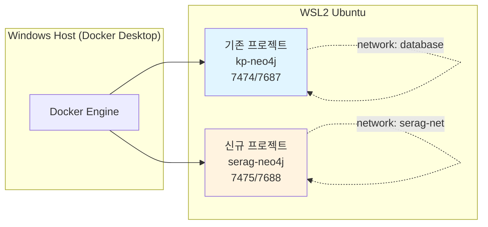

> [OWL 온톨로지 기반 Graph 설계 가이드](https://k82022603.github.io/posts/owl-%EC%98%A8%ED%86%A8%EB%A1%9C%EC%A7%80-%EA%B8%B0%EB%B0%98-graph-%EC%84%A4%EA%B3%84-%EA%B0%80%EC%9D%B4%EB%93%9C/)에서 정의한 OWL 온톨로지를 **신규 WSL2 환경**에 Neo4j로 구축하는 단계별 가이드입니다.

| 항목 | 내용 |
|------|------|
| **문서 ID** | DESIGN-22 |
| **문서명** | Neo4j 구축 가이드 (WSL2 + Docker Desktop) |
| **버전** | 1.0 |
| **작성일** | 2026-04-22 |
| **작성자** | 클로드 (Claude Code) |
| **상위 문서** | [OWL 온톨로지 기반 Graph 설계 가이드](https://k82022603.github.io/posts/owl-%EC%98%A8%ED%86%A8%EB%A1%9C%EC%A7%80-%EA%B8%B0%EB%B0%98-graph-%EC%84%A4%EA%B3%84-%EA%B0%80%EC%9D%B4%EB%93%9C/) |
| **대상 환경** | WSL2 Ubuntu + Docker Desktop (Windows host) |
| **작업 경로** | `/home/neo4j/SearcheRAGWithGraphRAG` |

---

## 변경 이력

| 버전 | 일자 | 작성자 | 변경 내용 |
|------|------|--------|-----------|
| 1.0 | 2026-04-22 | 클로드 | 초안 — WSL2/Docker Desktop 환경 + 기존 프로젝트와 포트 충돌 회피 + OWL n10s import 포함 |

---

## 목차

1. [사전 점검](#1-사전-점검)
2. [기존 프로젝트와의 충돌 회피 전략](#2-기존-프로젝트와의-충돌-회피-전략)
3. [프로젝트 디렉토리 구성](#3-프로젝트-디렉토리-구성)
4. [Docker Compose 작성](#4-docker-compose-작성)
5. [환경변수 및 OWL 온톨로지 파일](#5-환경변수-및-owl-온톨로지-파일)
6. [컨테이너 기동 및 헬스체크](#6-컨테이너-기동-및-헬스체크)
7. [스키마 부트스트랩](#7-스키마-부트스트랩)
8. [OWL 온톨로지 Import (n10s)](#8-owl-온톨로지-import-n10s)
9. [샘플 데이터 적재](#9-샘플-데이터-적재)
10. [테스트 방법 (4단계)](#10-테스트-방법-4단계)
11. [트러블슈팅](#11-트러블슈팅)
12. [부록 — 단축 명령](#12-부록--단축-명령)

---

## 1. 사전 점검

### 1.1 환경 정보

| 항목 | 값 |
|------|-----|
| **OS** | WSL2 Ubuntu (`Linux DESKTOP-JE4TNAH 6.6.87.2-microsoft-standard-WSL2`) |
| **계정** | `neo4j` (sudo 비밀번호: `neo4j`) |
| **작업 경로** | `/home/neo4j/SearcheRAGWithGraphRAG` |
| **Docker** | Docker Desktop (Windows host) |
| **상시 실행 중** | hybrid-rag-knowledge-ops 프로젝트의 `kp-neo4j` (포트 7474/7687) |

### 1.2 사전 확인 명령

```bash
# WSL2 진입 후 작업 디렉토리 이동
cd /home/neo4j/SearcheRAGWithGraphRAG
pwd  # → /home/neo4j/SearcheRAGWithGraphRAG

# Docker 동작 확인
docker version
docker ps

# 기존 Neo4j (kp-neo4j) 상태 확인 (충돌 방지 목적)
docker ps --filter "name=neo4j" --format "table {{.Names}}\t{{.Status}}\t{{.Ports}}"

# 사용 중인 포트 확인
ss -tlnp 2>/dev/null | grep -E "7474|7475|7687|7688" || echo "포트 비어있음"
```

> ⚠️ **중요**: `kp-neo4j`가 7474/7687을 점유 중이면 **신규 컨테이너는 7475/7688로 분리**합니다 (§2 참조).

### 1.3 디스크 공간 점검

```bash
# WSL2 가용 공간 (최소 5GB 권장)
df -h /home

# Docker 사용량
docker system df
```

---

## 2. 기존 프로젝트와의 충돌 회피 전략

### 2.1 분리 매트릭스

| 자원 | hybrid-rag-knowledge-ops (기존) | SearcheRAGWithGraphRAG (신규) |
|------|--------------------------------|------------------------------|
| **컨테이너 이름** | `kp-neo4j` | `serag-neo4j` |
| **Docker 네트워크** | `database` (외부 정의) | `serag-net` (전용) |
| **HTTP 포트 (Browser)** | 7474 | **7475** |
| **Bolt 포트 (Driver)** | 7687 | **7688** |
| **HTTPS 포트** | 7473 (미사용) | 7476 (미사용) |
| **데이터 볼륨** | `neo4j_data` | `serag_neo4j_data` |
| **APOC 플러그인** | ✅ | ✅ |
| **Neosemantics(n10s)** | ❌ | ✅ (OWL import용) |
| **Heap** | 2G | 1G (동시 실행 부하 고려) |

### 2.2 분리 원칙



> 📌 **원칙**: 컨테이너 이름·네트워크·볼륨·포트를 **모두 prefix(`serag-`)로 격리**해야 두 프로젝트가 안전하게 공존합니다.

---

## 3. 프로젝트 디렉토리 구성

### 3.1 권장 구조

```
/home/neo4j/SearcheRAGWithGraphRAG/
├── docker/
│   ├── docker-compose.yml          # Neo4j 단일 서비스
│   └── plugins/                    # n10s jar 보관 (런타임 다운로드 캐시)
├── ontology/
│   └── hrkp-ontology.ttl           # OWL Turtle 정의
├── cypher/
│   ├── 01_constraints.cypher       # UNIQUE/INDEX
│   ├── 02_fulltext.cypher          # Full-Text Index
│   ├── 03_n10s_init.cypher         # neosemantics 초기화
│   ├── 04_owl_import.cypher        # OWL Import
│   ├── 05_sample_data.cypher       # 샘플 인스턴스
│   └── 99_teardown.cypher          # 전체 삭제 (테스트용)
├── scripts/
│   ├── start.sh                    # 기동 스크립트
│   ├── stop.sh                     # 중지 스크립트
│   ├── bootstrap.sh                # 스키마 + OWL + 샘플 적재
│   └── healthcheck.sh              # 상태 확인
├── tests/
│   ├── test_smoke.sh               # cypher-shell 스모크
│   ├── test_consistency.cypher     # OWL 무결성 검사
│   └── test_e2e.py                 # Python 드라이버 E2E
├── .env                            # 비밀번호 등
└── README.md
```

### 3.2 디렉토리 생성

```bash
cd /home/neo4j/SearcheRAGWithGraphRAG

mkdir -p docker/plugins ontology cypher scripts tests
ls -la
```

---

## 4. Docker Compose 작성

### 4.1 `docker/docker-compose.yml`

```yaml
# /home/neo4j/SearcheRAGWithGraphRAG/docker/docker-compose.yml
services:
  serag-neo4j:
    image: neo4j:5.18-community
    container_name: serag-neo4j
    restart: unless-stopped

    ports:
      # 기존 kp-neo4j(7474/7687)와 충돌 방지를 위해 7475/7688 사용
      - "7475:7474"   # Browser UI
      - "7688:7687"   # Bolt Driver

    environment:
      # ─── 인증 ───
      NEO4J_AUTH: ${NEO4J_AUTH:-neo4j/serag-pass-1234}
      NEO4J_dbms_security_auth__minimum__password__length: "4"

      # ─── 플러그인: APOC + Neosemantics(n10s) ───
      # n10s 5.18.x는 Neo4j 5.18.x와 호환
      NEO4J_PLUGINS: '["apoc","n10s"]'

      # ─── 메모리 (기존 프로젝트와 동시 실행 고려) ───
      NEO4J_server_memory_heap_initial__size: "512m"
      NEO4J_server_memory_heap_max__size: "1G"
      NEO4J_server_memory_pagecache_size: "512m"

      # ─── APOC / n10s 권한 ───
      NEO4J_dbms_security_procedures_unrestricted: "apoc.*,n10s.*"
      NEO4J_dbms_security_procedures_allowlist: "apoc.*,n10s.*"
      NEO4J_apoc_import_file_enabled: "true"
      NEO4J_apoc_export_file_enabled: "true"
      NEO4J_apoc_import_file_use__neo4j__config: "true"

      # ─── 파일 import 디렉토리 (Turtle 파일 위치) ───
      NEO4J_server_directories_import: "/import"

    volumes:
      - serag_neo4j_data:/data
      - serag_neo4j_logs:/logs
      - serag_neo4j_plugins:/plugins
      - ../ontology:/import:ro            # OWL 파일 마운트 (읽기전용)
      - ../cypher:/cypher:ro              # 부트스트랩 스크립트 마운트

    networks:
      - serag-net

    healthcheck:
      test: ["CMD", "cypher-shell", "-u", "neo4j", "-p", "serag-pass-1234", "RETURN 1"]
      interval: 10s
      timeout: 5s
      retries: 12
      start_period: 30s

networks:
  serag-net:
    name: serag-net
    driver: bridge

volumes:
  serag_neo4j_data:
    name: serag_neo4j_data
  serag_neo4j_logs:
    name: serag_neo4j_logs
  serag_neo4j_plugins:
    name: serag_neo4j_plugins
```

### 4.2 핵심 포인트

| 설정 | 이유 |
|------|------|
| `NEO4J_PLUGINS: '["apoc","n10s"]'` | Neo4j 5.x는 환경변수만으로 자동 설치 (수동 jar 다운로드 불필요) |
| `7475:7474`, `7688:7687` | 기존 `kp-neo4j` 충돌 회피 |
| `serag_neo4j_*` 볼륨 | 기존 `neo4j_data`와 분리 |
| `NEO4J_server_directories_import: /import` | n10s가 Turtle 파일을 읽을 경로 |
| `dbms_security_procedures_unrestricted` | n10s 프로시저 호출 권한 부여 (필수) |

---

## 5. 환경변수 및 OWL 온톨로지 파일

### 5.1 `.env`

```bash
cat > /home/neo4j/SearcheRAGWithGraphRAG/.env <<'EOF'
NEO4J_AUTH=neo4j/serag-pass-1234
NEO4J_USER=neo4j
NEO4J_PASSWORD=serag-pass-1234
NEO4J_BOLT_URI=bolt://localhost:7688
NEO4J_HTTP_URI=http://localhost:7475
EOF

chmod 600 /home/neo4j/SearcheRAGWithGraphRAG/.env
```

### 5.2 OWL 온톨로지 파일 작성

[21번 가이드 §4.5](./21_owl_ontology_graph_design_guide.md#45-전체-turtle-정의)의 Turtle 정의를 그대로 복사합니다.

```bash
cat > /home/neo4j/SearcheRAGWithGraphRAG/ontology/hrkp-ontology.ttl <<'EOF'

<http://hrkp.local/ontology>
    a owl:Ontology ;
    rdfs:label "Hybrid RAG Knowledge Platform Ontology"@en ;
    rdfs:label "하이브리드 RAG 지식 플랫폼 온톨로지"@ko ;
    owl:versionInfo "1.0" .

# ─── 1. Class Hierarchy ───
:Document    a owl:Class ; rdfs:label "문서"@ko, "Document"@en .
:Knowledge   a owl:Class ; rdfs:subClassOf :Document ;
             rdfs:label "검색 가능 지식"@ko, "Knowledge"@en .
:Chunk       a owl:Class ; rdfs:label "청크"@ko, "Chunk"@en .

:Entity      a owl:Class ; rdfs:label "엔티티"@ko, "Entity"@en .
:Person      a owl:Class ; rdfs:subClassOf :Entity ;
             rdfs:label "인물/조직"@ko, "Person"@en .
:Technology  a owl:Class ; rdfs:subClassOf :Entity ;
             rdfs:label "기술"@ko, "Technology"@en .
:Topic       a owl:Class ; rdfs:subClassOf :Entity ;
             rdfs:label "프로젝트/개념"@ko, "Topic"@en .
:Keyword     a owl:Class ; rdfs:subClassOf :Entity ;
             rdfs:label "키워드"@ko, "Keyword"@en .

# ─── 2. Disjoint Axioms ───
[] a owl:AllDisjointClasses ;
   owl:members ( :Document :Chunk :Entity ) .
[] a owl:AllDisjointClasses ;
   owl:members ( :Person :Technology :Topic ) .

# ─── 3. Object Properties ───
:contains    a owl:ObjectProperty ;
             rdfs:domain :Knowledge ; rdfs:range :Chunk ;
             owl:inverseOf :partOf .
:partOf      a owl:ObjectProperty ;
             rdfs:domain :Chunk ; rdfs:range :Knowledge .
:mentions    a owl:ObjectProperty ;
             rdfs:domain :Chunk ; rdfs:range :Entity ;
             owl:inverseOf :mentionedIn .
:mentionedIn a owl:ObjectProperty ;
             rdfs:domain :Entity ; rdfs:range :Knowledge .
:relatedTo   a owl:ObjectProperty , owl:SymmetricProperty ;
             rdfs:domain :Entity ; rdfs:range :Entity .

# ─── 4. Datatype Properties ───
:knowledgeId  a owl:DatatypeProperty , owl:FunctionalProperty ;
              rdfs:domain :Knowledge ; rdfs:range xsd:string .
:chunkId      a owl:DatatypeProperty , owl:FunctionalProperty ;
              rdfs:domain :Chunk ; rdfs:range xsd:string .
:title        a owl:DatatypeProperty ;
              rdfs:domain :Knowledge ; rdfs:range xsd:string .
:documentType a owl:DatatypeProperty ;
              rdfs:domain :Knowledge ; rdfs:range xsd:string .
:name         a owl:DatatypeProperty ;
              rdfs:domain :Entity ; rdfs:range xsd:string .
:value        a owl:DatatypeProperty ;
              rdfs:domain :Keyword ; rdfs:range xsd:string .
EOF

ls -la /home/neo4j/SearcheRAGWithGraphRAG/ontology/
```

---

## 6. 컨테이너 기동 및 헬스체크

### 6.1 `scripts/start.sh`

```bash
cat > /home/neo4j/SearcheRAGWithGraphRAG/scripts/start.sh <<'EOF'
#!/bin/bash
set -e
cd "$(dirname "$0")/../docker"

echo "▶ serag-neo4j 컨테이너 기동..."
docker compose up -d

echo "▶ Healthy 상태까지 대기 (최대 2분)..."
for i in $(seq 1 24); do
  status=$(docker inspect -f '{{.State.Health.Status}}' serag-neo4j 2>/dev/null || echo "starting")
  echo "  [$i/24] status=$status"
  if [ "$status" = "healthy" ]; then
    echo "✅ serag-neo4j 가동 완료"
    docker ps --filter "name=serag-neo4j" --format "table {{.Names}}\t{{.Status}}\t{{.Ports}}"
    exit 0
  fi
  sleep 5
done

echo "❌ Healthy 상태 도달 실패 — 로그 확인:"
docker logs --tail 50 serag-neo4j
exit 1
EOF

chmod +x /home/neo4j/SearcheRAGWithGraphRAG/scripts/start.sh
```

### 6.2 `scripts/stop.sh`

```bash
cat > /home/neo4j/SearcheRAGWithGraphRAG/scripts/stop.sh <<'EOF'
#!/bin/bash
cd "$(dirname "$0")/../docker"
docker compose down
echo "✅ serag-neo4j 중지됨 (볼륨은 보존)"
EOF

chmod +x /home/neo4j/SearcheRAGWithGraphRAG/scripts/stop.sh
```

### 6.3 첫 기동

```bash
cd /home/neo4j/SearcheRAGWithGraphRAG
./scripts/start.sh

# 기존 프로젝트 컨테이너와 공존 확인
docker ps --filter "name=neo4j" --format "table {{.Names}}\t{{.Status}}\t{{.Ports}}"
# 예상 결과:
# kp-neo4j      Up    0.0.0.0:7474->7474/tcp, 0.0.0.0:7687->7687/tcp
# serag-neo4j   Up    0.0.0.0:7475->7474/tcp, 0.0.0.0:7688->7687/tcp
```

### 6.4 플러그인 설치 검증

```bash
docker exec serag-neo4j cypher-shell -u neo4j -p serag-pass-1234 \
  "CALL dbms.procedures() YIELD name WHERE name STARTS WITH 'apoc' OR name STARTS WITH 'n10s' RETURN count(*) AS plugin_procs;"
```

> 결과가 `100` 이상이면 APOC + n10s 정상 설치됨.

---

## 7. 스키마 부트스트랩

### 7.1 `cypher/01_constraints.cypher`

```cypher
// /cypher/01_constraints.cypher
// owl:FunctionalProperty → UNIQUE 제약
CREATE CONSTRAINT knowledge_id_unique IF NOT EXISTS
FOR (k:Knowledge) REQUIRE k.knowledge_id IS UNIQUE;

CREATE CONSTRAINT chunk_id_unique IF NOT EXISTS
FOR (c:Chunk) REQUIRE c.id IS UNIQUE;

// 일반 검색 인덱스
CREATE INDEX person_name_idx IF NOT EXISTS
FOR (n:Person) ON (n.name);

CREATE INDEX technology_name_idx IF NOT EXISTS
FOR (n:Technology) ON (n.name);

CREATE INDEX topic_name_idx IF NOT EXISTS
FOR (n:Topic) ON (n.name);

CREATE INDEX keyword_value_idx IF NOT EXISTS
FOR (n:Keyword) ON (n.value);
```

### 7.2 `cypher/02_fulltext.cypher`

```cypher
// /cypher/02_fulltext.cypher
CREATE FULLTEXT INDEX entity_fulltext_idx IF NOT EXISTS
FOR (n:Person|Technology|Topic|Keyword|Knowledge|Chunk)
ON EACH [n.name, n.value, n.title]
OPTIONS { indexConfig: {
  `fulltext.analyzer`: 'standard-no-stop-words',
  `fulltext.eventually_consistent`: false
}};
```

### 7.3 적용 명령

```bash
docker exec -i serag-neo4j cypher-shell -u neo4j -p serag-pass-1234 \
  < /home/neo4j/SearcheRAGWithGraphRAG/cypher/01_constraints.cypher

docker exec -i serag-neo4j cypher-shell -u neo4j -p serag-pass-1234 \
  < /home/neo4j/SearcheRAGWithGraphRAG/cypher/02_fulltext.cypher

# 검증
docker exec serag-neo4j cypher-shell -u neo4j -p serag-pass-1234 "SHOW CONSTRAINTS;"
docker exec serag-neo4j cypher-shell -u neo4j -p serag-pass-1234 "SHOW INDEXES;"
```

---

## 8. OWL 온톨로지 Import (n10s)

### 8.1 `cypher/03_n10s_init.cypher`

```cypher
// /cypher/03_n10s_init.cypher
// neosemantics 초기 설정 — 1회만 실행
CALL n10s.graphconfig.init({
  handleVocabUris: 'IGNORE',          // URI 단순화
  handleMultival: 'OVERWRITE',
  keepLangTag: false,
  applyNeo4jNaming: true              // owl:Class → :Class 레이블 자동 변환
});

// 필수 제약: n10s가 RDF 노드 식별자로 사용
CREATE CONSTRAINT n10s_unique_uri IF NOT EXISTS
FOR (r:Resource) REQUIRE r.uri IS UNIQUE;
```

### 8.2 `cypher/04_owl_import.cypher`

```cypher
// /cypher/04_owl_import.cypher
// /import 디렉토리는 docker-compose에서 ../ontology로 마운트됨
CALL n10s.onto.import.fetch(
  'file:///import/hrkp-ontology.ttl',
  'Turtle'
)
YIELD terminationStatus, triplesLoaded, namespaces
RETURN terminationStatus, triplesLoaded;
```

### 8.3 적용 및 검증

```bash
# n10s 초기화
docker exec -i serag-neo4j cypher-shell -u neo4j -p serag-pass-1234 \
  < /home/neo4j/SearcheRAGWithGraphRAG/cypher/03_n10s_init.cypher

# OWL Import
docker exec -i serag-neo4j cypher-shell -u neo4j -p serag-pass-1234 \
  < /home/neo4j/SearcheRAGWithGraphRAG/cypher/04_owl_import.cypher

# 결과 확인 — Class 노드들이 생성되어야 함
docker exec serag-neo4j cypher-shell -u neo4j -p serag-pass-1234 \
  "MATCH (c:Class) RETURN c.name AS class ORDER BY class;"
```

> 예상 출력: `Chunk, Document, Entity, Keyword, Knowledge, Person, Technology, Topic` (8개)

---

## 9. 샘플 데이터 적재

### 9.1 `cypher/05_sample_data.cypher`

```cypher
// /cypher/05_sample_data.cypher
// ─── Knowledge + Chunk ───
MERGE (k1:Knowledge {knowledge_id: 'k_001'})
  SET k1.title = 'Sprint 10 회고 보고서',
      k1.document_type = '회고록',
      k1.created_at = datetime();

MERGE (k2:Knowledge {knowledge_id: 'k_002'})
  SET k2.title = 'Hybrid RAG 아키텍처 가이드',
      k2.document_type = '기술문서',
      k2.created_at = datetime();

MERGE (c1:Chunk {id: 'c_001_1'})
  SET c1.knowledge_id = 'k_001', c1.chunk_index = 1;
MERGE (c2:Chunk {id: 'c_001_2'})
  SET c2.knowledge_id = 'k_001', c2.chunk_index = 2;
MERGE (c3:Chunk {id: 'c_002_1'})
  SET c3.knowledge_id = 'k_002', c3.chunk_index = 1;

MERGE (k1)-[:CONTAINS]->(c1);
MERGE (k1)-[:CONTAINS]->(c2);
MERGE (k2)-[:CONTAINS]->(c3);

// ─── Entities ───
MERGE (p1:Person {name: '홍길동'})    SET p1.title = '시니어 엔지니어';
MERGE (p2:Person {name: '김유신'})    SET p2.title = 'PM';
MERGE (t1:Technology {name: 'FastAPI'});
MERGE (t2:Technology {name: 'Neo4j'});
MERGE (t3:Technology {name: 'BGE-M3'});
MERGE (tp1:Topic {name: 'Hybrid RAG'});
MERGE (tp2:Topic {name: 'GraphRAG'});
MERGE (kw1:Keyword {value: '2026-04-22'});

// ─── MENTIONS / MENTIONED_IN ───
MERGE (c1)-[:MENTIONS]->(p1);
MERGE (c1)-[:MENTIONS]->(t1);
MERGE (c2)-[:MENTIONS]->(p2);
MERGE (c2)-[:MENTIONS]->(tp1);
MERGE (c3)-[:MENTIONS]->(t2);
MERGE (c3)-[:MENTIONS]->(t3);
MERGE (c3)-[:MENTIONS]->(tp1);

MERGE (p1)-[:MENTIONED_IN]->(k1);
MERGE (p2)-[:MENTIONED_IN]->(k1);
MERGE (t1)-[:MENTIONED_IN]->(k1);
MERGE (tp1)-[:MENTIONED_IN]->(k1);
MERGE (t2)-[:MENTIONED_IN]->(k2);
MERGE (t3)-[:MENTIONED_IN]->(k2);
MERGE (tp1)-[:MENTIONED_IN]->(k2);

// ─── RELATED_TO (가중치) ───
MERGE (p1)-[r1:RELATED_TO {type: 'COLLABORATED_WITH'}]->(p2)
  SET r1.weight = 0.8;
MERGE (t2)-[r2:RELATED_TO {type: 'PART_OF'}]->(tp1)
  SET r2.weight = 0.95;
MERGE (t3)-[r3:RELATED_TO {type: 'PART_OF'}]->(tp1)
  SET r3.weight = 0.9;
```

### 9.2 적재 실행

```bash
docker exec -i serag-neo4j cypher-shell -u neo4j -p serag-pass-1234 \
  < /home/neo4j/SearcheRAGWithGraphRAG/cypher/05_sample_data.cypher

# 노드/관계 카운트 확인
docker exec serag-neo4j cypher-shell -u neo4j -p serag-pass-1234 \
  "MATCH (n) RETURN labels(n)[0] AS label, count(*) AS cnt ORDER BY cnt DESC;"
```

### 9.3 통합 부트스트랩 스크립트

```bash
cat > /home/neo4j/SearcheRAGWithGraphRAG/scripts/bootstrap.sh <<'EOF'
#!/bin/bash
set -e
DC="docker exec -i serag-neo4j cypher-shell -u neo4j -p serag-pass-1234"
ROOT="/home/neo4j/SearcheRAGWithGraphRAG"

echo "1️⃣  Constraints + Indexes..."
$DC < "$ROOT/cypher/01_constraints.cypher"

echo "2️⃣  Full-Text Index..."
$DC < "$ROOT/cypher/02_fulltext.cypher"

echo "3️⃣  n10s 초기화..."
$DC < "$ROOT/cypher/03_n10s_init.cypher"

echo "4️⃣  OWL Import..."
$DC < "$ROOT/cypher/04_owl_import.cypher"

echo "5️⃣  Sample Data..."
$DC < "$ROOT/cypher/05_sample_data.cypher"

echo "✅ Bootstrap 완료"
EOF

chmod +x /home/neo4j/SearcheRAGWithGraphRAG/scripts/bootstrap.sh

# 일괄 실행
./scripts/bootstrap.sh
```

---

## 10. 테스트 방법 (4단계)

### 10.1 [Test 1] cypher-shell 스모크 테스트

`tests/test_smoke.sh`:

```bash
cat > /home/neo4j/SearcheRAGWithGraphRAG/tests/test_smoke.sh <<'EOF'
#!/bin/bash
set -e
DC="docker exec -i serag-neo4j cypher-shell -u neo4j -p serag-pass-1234 --format plain"

pass=0; fail=0
check() {
  local name="$1"; local query="$2"; local expect="$3"
  local result
  result=$(echo "$query" | $DC | tail -n +2 | tr -d ' ' | head -1)
  if [ "$result" = "$expect" ]; then
    echo "  ✅ $name (got: $result)"
    pass=$((pass+1))
  else
    echo "  ❌ $name (expected: $expect, got: $result)"
    fail=$((fail+1))
  fi
}

echo "▶ 노드 카운트 검증"
check "Knowledge 2개"   "MATCH (n:Knowledge) RETURN count(n);"   "2"
check "Chunk 3개"       "MATCH (n:Chunk) RETURN count(n);"       "3"
check "Person 2명"      "MATCH (n:Person) RETURN count(n);"      "2"
check "Technology 3개"  "MATCH (n:Technology) RETURN count(n);"  "3"
check "Topic 1개"       "MATCH (n:Topic) RETURN count(n);"       "1"

echo "▶ 관계 카운트 검증"
check "CONTAINS 3개"    "MATCH ()-[r:CONTAINS]->() RETURN count(r);"   "3"
check "MENTIONS 7개"    "MATCH ()-[r:MENTIONS]->() RETURN count(r);"   "7"
check "RELATED_TO 3개"  "MATCH ()-[r:RELATED_TO]->() RETURN count(r);" "3"

echo "▶ Full-Text Index 동작"
check "FastAPI 검색"    "CALL db.index.fulltext.queryNodes('entity_fulltext_idx','FastAPI') YIELD node RETURN count(node);" "1"

echo ""
echo "─────────────────────────────"
echo " 결과: PASS=$pass / FAIL=$fail"
echo "─────────────────────────────"
[ $fail -eq 0 ]
EOF

chmod +x /home/neo4j/SearcheRAGWithGraphRAG/tests/test_smoke.sh
./tests/test_smoke.sh
```

### 10.2 [Test 2] OWL 무결성 검사

`tests/test_consistency.cypher`:

```cypher
// /tests/test_consistency.cypher
// 위반 건수가 모두 0이어야 통과

// 1. Person ⊕ Technology disjoint 위반
MATCH (n:Person) WHERE n:Technology
RETURN 'person_technology_disjoint' AS check, count(n) AS violations
UNION ALL

// 2. Knowledge ⊕ Chunk disjoint 위반
MATCH (n:Knowledge) WHERE n:Chunk
RETURN 'knowledge_chunk_disjoint' AS check, count(n) AS violations
UNION ALL

// 3. knowledge_id Functional 위반
MATCH (k:Knowledge)
WITH k.knowledge_id AS kid, count(*) AS c
WHERE c > 1
RETURN 'knowledge_id_unique' AS check, count(*) AS violations
UNION ALL

// 4. Chunk가 Knowledge에 소속되지 않은 orphan
MATCH (c:Chunk) WHERE NOT (c)<-[:CONTAINS]-(:Knowledge)
RETURN 'orphan_chunk' AS check, count(c) AS violations
UNION ALL

// 5. relatedTo가 Entity끼리만 연결되었는지
MATCH (a)-[:RELATED_TO]->(b)
WHERE NOT (a:Person OR a:Technology OR a:Topic OR a:Keyword)
   OR NOT (b:Person OR b:Technology OR b:Topic OR b:Keyword)
RETURN 'relatedto_domain_violation' AS check, count(*) AS violations;
```

```bash
docker exec -i serag-neo4j cypher-shell -u neo4j -p serag-pass-1234 \
  < /home/neo4j/SearcheRAGWithGraphRAG/tests/test_consistency.cypher
```

> ✅ 모든 행의 `violations`가 `0`이면 통과.

### 10.3 [Test 3] 추론 쿼리 (블로그 가이드 패턴 적용)

```bash
docker exec serag-neo4j cypher-shell -u neo4j -p serag-pass-1234 <<'EOF'
// 추론 1: 같은 Knowledge에서 함께 언급된 Person 쌍 (협업 후보)
MATCH (p1:Person)<-[:MENTIONS]-(:Chunk)<-[:CONTAINS]-(k:Knowledge)
      -[:CONTAINS]->(:Chunk)-[:MENTIONS]->(p2:Person)
WHERE id(p1) < id(p2)
RETURN p1.name, p2.name, count(DISTINCT k) AS shared_docs
ORDER BY shared_docs DESC;

// 추론 2: Hybrid RAG 토픽과 연관된 기술 클러스터
MATCH (t:Technology)<-[:MENTIONS]-(:Chunk)-[:MENTIONS]->(tp:Topic {name:'Hybrid RAG'})
RETURN t.name, count(*) AS support
ORDER BY support DESC;

// 추론 3: 최단 경로 (홍길동 → BGE-M3)
MATCH path = shortestPath(
  (a:Person {name:'홍길동'})-[:RELATED_TO|MENTIONS|MENTIONED_IN|CONTAINS*..6]-(b:Technology {name:'BGE-M3'})
)
RETURN [n IN nodes(path) | coalesce(n.name, n.value, n.title)] AS hops, length(path) AS hop_count;
EOF
```

### 10.4 [Test 4] Python 드라이버 E2E

```bash
# WSL2에 Python venv 생성 (없다면)
sudo apt-get install -y python3-venv 2>/dev/null
python3 -m venv /home/neo4j/SearcheRAGWithGraphRAG/.venv
source /home/neo4j/SearcheRAGWithGraphRAG/.venv/bin/activate
pip install neo4j==5.18.0
```

`tests/test_e2e.py`:

```python
# /tests/test_e2e.py
"""serag-neo4j E2E 테스트 — OWL 온톨로지 무결성 + 도메인 쿼리"""
import sys
from neo4j import GraphDatabase

URI = "bolt://localhost:7688"
AUTH = ("neo4j", "serag-pass-1234")

CONSISTENCY_QUERIES = {
    "person_technology_disjoint": """
        MATCH (n:Person) WHERE n:Technology RETURN count(n) AS v
    """,
    "knowledge_chunk_disjoint": """
        MATCH (n:Knowledge) WHERE n:Chunk RETURN count(n) AS v
    """,
    "knowledge_id_functional": """
        MATCH (k:Knowledge) WITH k.knowledge_id AS kid, count(*) AS c
        WHERE c > 1 RETURN count(*) AS v
    """,
    "orphan_chunk": """
        MATCH (c:Chunk) WHERE NOT (c)<-[:CONTAINS]-(:Knowledge)
        RETURN count(c) AS v
    """,
}

DOMAIN_QUERIES = {
    "fulltext_search": (
        "CALL db.index.fulltext.queryNodes('entity_fulltext_idx', $q) "
        "YIELD node, score RETURN count(node) AS v",
        {"q": "FastAPI"}, lambda v: v >= 1
    ),
    "shortest_path_exists": (
        "MATCH p = shortestPath((a:Person {name:'홍길동'})"
        "-[:RELATED_TO|MENTIONS|MENTIONED_IN|CONTAINS*..6]-"
        "(b:Technology {name:'BGE-M3'})) RETURN length(p) AS v",
        {}, lambda v: v is not None and v > 0
    ),
}

def main():
    driver = GraphDatabase.driver(URI, auth=AUTH)
    pass_cnt, fail_cnt = 0, 0

    with driver.session() as session:
        print("▶ OWL 무결성 검사 (위반 건수=0이어야 통과)")
        for name, q in CONSISTENCY_QUERIES.items():
            v = session.run(q).single()["v"]
            ok = (v == 0)
            mark = "✅" if ok else "❌"
            print(f"  {mark} {name}: {v}")
            pass_cnt += ok; fail_cnt += (not ok)

        print("\n▶ 도메인 쿼리 검증")
        for name, (q, params, validator) in DOMAIN_QUERIES.items():
            row = session.run(q, **params).single()
            v = row["v"] if row else None
            ok = validator(v)
            mark = "✅" if ok else "❌"
            print(f"  {mark} {name}: {v}")
            pass_cnt += ok; fail_cnt += (not ok)

    driver.close()

    print(f"\n{'─'*40}\n PASS={pass_cnt} / FAIL={fail_cnt}\n{'─'*40}")
    sys.exit(0 if fail_cnt == 0 else 1)

if __name__ == "__main__":
    main()
```

```bash
python /home/neo4j/SearcheRAGWithGraphRAG/tests/test_e2e.py
```

### 10.5 [Test 5] Browser UI 시각 검증 (수동)

1. **Windows 브라우저에서 접속**: http://localhost:7475
2. **로그인**: `neo4j` / `serag-pass-1234`
3. **확인 쿼리**:

```cypher
// 전체 그래프 시각화 (50개 제한)
MATCH (n)-[r]-(m) RETURN n, r, m LIMIT 50;

// 특정 Topic 중심 서브그래프
MATCH (tp:Topic {name:'Hybrid RAG'})-[r*1..2]-(neighbor)
RETURN tp, r, neighbor;
```

> ✅ 노드 색상별로 클래스가 구분되고, `Knowledge → Chunk → Entity` 흐름이 시각적으로 확인되면 통과.

---

## 11. 트러블슈팅

### 11.1 자주 발생하는 문제

| 증상 | 원인 | 해결 |
|------|------|------|
| `port is already allocated` | 7474/7687을 다른 컨테이너가 점유 | 본 가이드는 7475/7688 사용 — `docker ps`로 재확인 |
| `n10s.graphconfig.init` 권한 오류 | `dbms_security_procedures_unrestricted` 누락 | docker-compose 환경변수 추가 후 재기동 |
| `Could not load file:///import/...` | `/import` 디렉토리 마운트 누락 또는 파일 권한 | `docker exec serag-neo4j ls /import`로 확인 |
| `Healthy` 도달 실패 | WSL2 메모리 부족 | `.wslconfig`에서 메모리 8GB 이상 할당 |
| 한글 검색 안 됨 | `standard-no-stop-words`는 형태소 미지원 | Alias 속성 또는 외부 형태소 분석 (가이드 §8.4 참조) |
| 컨테이너 재시작 시 데이터 사라짐 | named volume 미사용 | `serag_neo4j_data` 볼륨 사용 확인 |

### 11.2 로그 확인

```bash
# 실시간 로그
docker logs -f serag-neo4j

# 최근 100줄
docker logs --tail 100 serag-neo4j

# 특정 시간 이후
docker logs --since 5m serag-neo4j
```

### 11.3 완전 초기화 (테스트 환경)

```bash
# ⚠️ 모든 데이터 삭제됨 — 신중히 실행
cd /home/neo4j/SearcheRAGWithGraphRAG/docker
docker compose down -v          # -v: 볼륨까지 삭제
docker volume rm serag_neo4j_data serag_neo4j_logs serag_neo4j_plugins 2>/dev/null
./scripts/start.sh
./scripts/bootstrap.sh
```

### 11.4 데이터만 삭제 (스키마 보존)

```bash
docker exec serag-neo4j cypher-shell -u neo4j -p serag-pass-1234 \
  "MATCH (n) DETACH DELETE n;"
```

### 11.5 WSL2 + Docker Desktop 메모리 점검

```bash
# WSL2 가용 메모리
free -h

# Docker 컨테이너별 사용량
docker stats --no-stream
```

> 기존 `kp-neo4j`(2G heap) + 신규 `serag-neo4j`(1G heap) 동시 실행 시 **호스트에 최소 6GB 여유** 권장.

---

## 12. 부록 — 단축 명령

### 12.1 자주 쓰는 한 줄 명령

```bash
# 별칭 등록 (~/.bashrc에 추가 권장)
alias serag-cypher='docker exec -it serag-neo4j cypher-shell -u neo4j -p serag-pass-1234'
alias serag-logs='docker logs -f serag-neo4j'
alias serag-up='cd /home/neo4j/SearcheRAGWithGraphRAG && ./scripts/start.sh'
alias serag-down='cd /home/neo4j/SearcheRAGWithGraphRAG && ./scripts/stop.sh'
alias serag-test='cd /home/neo4j/SearcheRAGWithGraphRAG && ./tests/test_smoke.sh'

# 적용
source ~/.bashrc

# 사용 예
serag-up
serag-cypher
> MATCH (n) RETURN count(n);
> :exit
```

### 12.2 healthcheck 스크립트

```bash
cat > /home/neo4j/SearcheRAGWithGraphRAG/scripts/healthcheck.sh <<'EOF'
#!/bin/bash
echo "▶ 컨테이너 상태"
docker ps --filter "name=serag-neo4j" --format "table {{.Names}}\t{{.Status}}\t{{.Ports}}"

echo ""
echo "▶ Bolt 연결"
docker exec serag-neo4j cypher-shell -u neo4j -p serag-pass-1234 \
  "RETURN 'OK' AS bolt;" 2>&1 | tail -2

echo ""
echo "▶ 노드 통계"
docker exec serag-neo4j cypher-shell -u neo4j -p serag-pass-1234 \
  "MATCH (n) RETURN labels(n)[0] AS label, count(*) AS cnt ORDER BY cnt DESC;"

echo ""
echo "▶ 플러그인 동작"
docker exec serag-neo4j cypher-shell -u neo4j -p serag-pass-1234 \
  "CALL dbms.procedures() YIELD name WHERE name STARTS WITH 'n10s' RETURN count(*) AS n10s_procs;"
EOF

chmod +x /home/neo4j/SearcheRAGWithGraphRAG/scripts/healthcheck.sh
```

### 12.3 전체 흐름 요약

```bash
# ─── 0. 사전 확인 ───
cd /home/neo4j/SearcheRAGWithGraphRAG
docker ps                      # kp-neo4j 확인 (충돌 회피 목적)

# ─── 1. 디렉토리 + 파일 생성 (§3, §4, §5 참조) ───
mkdir -p docker ontology cypher scripts tests
# (각 파일 작성 — 본문 cat 명령 그대로 실행)

# ─── 2. 컨테이너 기동 ───
./scripts/start.sh

# ─── 3. 부트스트랩 (스키마 + OWL + 샘플) ───
./scripts/bootstrap.sh

# ─── 4. 테스트 ───
./tests/test_smoke.sh                              # Test 1
docker exec -i serag-neo4j cypher-shell ...        # Test 2 (consistency)
python tests/test_e2e.py                           # Test 4 (E2E)

# ─── 5. 시각 확인 ───
# Windows 브라우저: http://localhost:7475
```

---

## 문서 끝

> 본 가이드는 [21번 OWL 온톨로지 가이드](https://github.com/k82022603/hybrid-rag-knowledge-ops/blob/main/knowledge_service/docs/02_design/21_owl_ontology_graph_design_guide.md)와 짝을 이루는 실행 가이드입니다.
> 운영 중 스키마 변경 시 21번 문서의 §8.2 (스키마 진화 원칙)를 따르고, 본 문서의 `bootstrap.sh`도 함께 갱신해야 합니다.