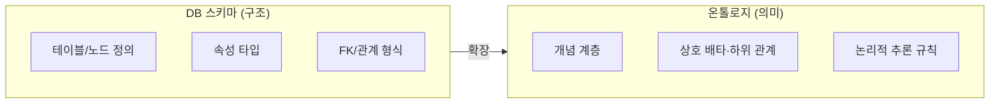
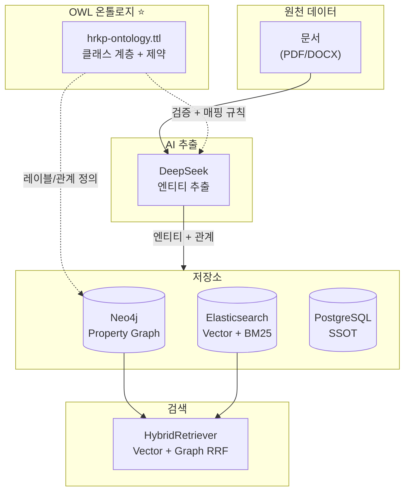
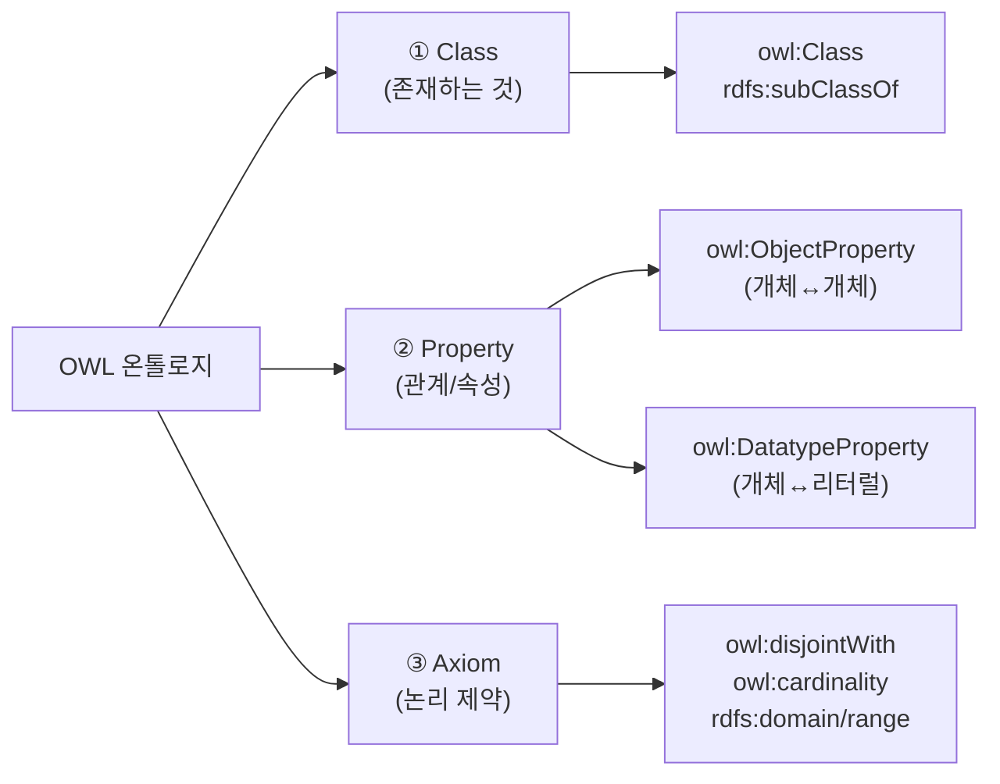
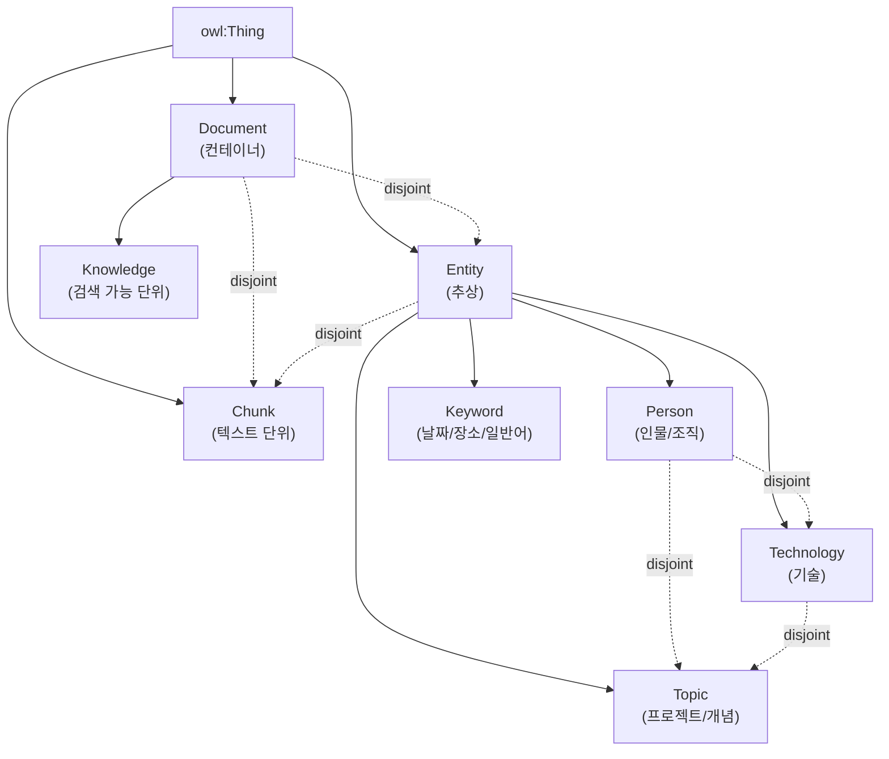
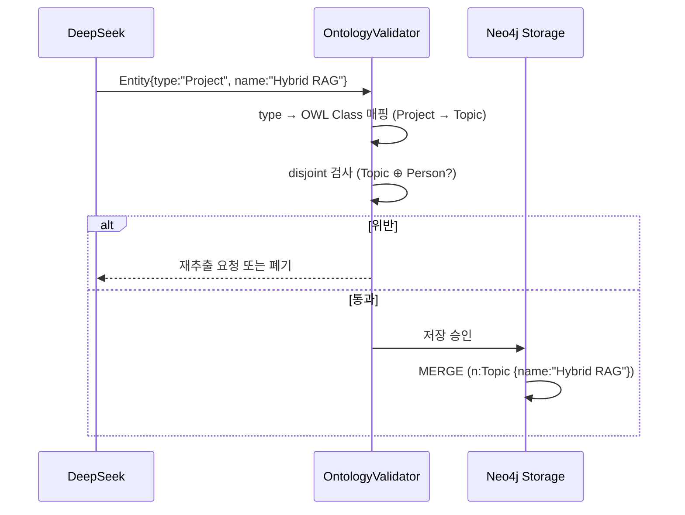

> Hybrid RAG Knowledge Platform의 Knowledge Graph를 **OWL 2 온톨로지**로 형식화하고, 이를 **Neo4j Property Graph**에 매핑하는 표준 가이드입니다.

| 항목 | 내용 |
|------|------|
| **문서 ID** | DESIGN-21 |
| **문서명** | OWL 온톨로지 기반 Graph 설계 가이드 |
| **버전** | 1.0 |
| **작성일** | 2026-04-22 |
| **작성자** | 클로드 (Claude Code) |
| **상태** | 초안 (Draft) |
| **상위 문서** | [01_hybrid_rag_platform_detailed_design.md §4.2](https://github.com/k82022603/hybrid-rag-knowledge-ops/blob/main/knowledge_service/docs/02_design/01_hybrid_rag_platform_detailed_design.md) |
| **관련 ADR** | [05_neo4j_subgraph_query_optimization.md](https://github.com/k82022603/hybrid-rag-knowledge-ops/blob/main/knowledge_service/docs/02_design/technical_assessment/05_neo4j_subgraph_query_optimization.md) |

---

## 변경 이력

| 버전 | 일자 | 작성자 | 변경 내용 |
|------|------|--------|-----------|
| 1.0 | 2026-04-22 | 클로드 | 초안 작성 — OWL 클래스/프로퍼티 정의, Neo4j 매핑, 추론 운영 가이드 포함 |

---

## 목차

1. [개요](#1-개요)
2. [왜 OWL 온톨로지인가](#2-왜-owl-온톨로지인가)
3. [OWL 온톨로지 기초 — 30분 핵심 정리](#3-owl-온톨로지-기초--30분-핵심-정리)
4. [Hybrid RAG 도메인 온톨로지 설계](#4-hybrid-rag-도메인-온톨로지-설계)
5. [OWL → Neo4j 매핑 전략](#5-owl--neo4j-매핑-전략)
6. [Cypher 구현 패턴](#6-cypher-구현-패턴)
7. [추론(Reasoning) 운영 가이드](#7-추론reasoning-운영-가이드)
8. [운영 노하우](#8-운영-노하우)
9. [RAG 파이프라인과의 통합](#9-rag-파이프라인과의-통합)
10. [구현 체크리스트](#10-구현-체크리스트)
11. [참고 자료](#11-참고-자료)

---

## 1. 개요

### 1.1 문서 목적

본 문서는 다음 세 가지 질문에 답합니다.

1. **왜** Hybrid RAG에 OWL 온톨로지가 필요한가?
2. **무엇을** 클래스/프로퍼티/제약으로 형식화할 것인가?
3. **어떻게** OWL 정의를 Neo4j에 매핑하고, 추론을 운영할 것인가?

### 1.2 적용 범위

| 구분 | 범위 |
|------|------|
| **포함** | Knowledge Graph 스키마, OWL Turtle 정의, Neo4j Cypher 매핑, 추론 쿼리, 운영 절차 |
| **제외** | RAG 검색 알고리즘 (→ [§6.4 검색 구현](https://github.com/k82022603/hybrid-rag-knowledge-ops/blob/main/knowledge_service/docs/02_design/01_hybrid_rag_platform_detailed_design.md#64-hybrid-%EA%B2%80%EC%83%89-%EA%B5%AC%ED%98%84)), ETL 파이프라인 (→ [ETL 배치 설계서](https://github.com/k82022603/hybrid-rag-knowledge-ops/blob/main/knowledge_service/docs/03_implementation/etl_batch_pipeline_design.md)) |

### 1.3 독자 대상

- **RAG/Graph Engineer**: 엔티티 추출 결과를 의미적으로 정합한 그래프로 저장하려는 엔지니어
- **Software Architect**: 도메인 어휘를 표준화·재사용 가능하게 만들려는 설계자
- **DB Designer**: Neo4j 레이블/관계 설계의 기준을 OWL로 검증하려는 DBA

### 1.4 참고 출처

- [01_hybrid_rag_platform_detailed_design.md §4.2](https://github.com/k82022603/hybrid-rag-knowledge-ops/blob/main/knowledge_service/docs/02_design/01_hybrid_rag_platform_detailed_design.md) — 현행 Neo4j 스키마
- [technical_assessment/05_neo4j_subgraph_query_optimization.md](https://github.com/k82022603/hybrid-rag-knowledge-ops/blob/main/knowledge_service/docs/02_design/technical_assessment/05_neo4j_subgraph_query_optimization.md) — Full-Text Index 전략
- [20_ai_metadata_extraction_design.md](https://github.com/k82022603/hybrid-rag-knowledge-ops/blob/main/knowledge_service/docs/02_design/20_ai_metadata_extraction_design.md) — AI 기반 엔티티 추출
- [수사 온톨로지 기반 지식 그래프 시스템 구축 가이드](https://k82022603.github.io/posts/%EC%88%98%EC%82%AC-%EC%98%A8%ED%86%A8%EB%A1%9C%EC%A7%80-%EA%B8%B0%EB%B0%98-%EC%A7%80%EC%8B%9D-%EA%B7%B8%EB%9E%98%ED%94%84-%EC%8B%9C%EC%8A%A4%ED%85%9C-%EA%B5%AC%EC%B6%95-%EA%B0%80%EC%9D%B4%EB%93%9C/) (외부 블로그)
- [W3C OWL 2 Web Ontology Language Primer](https://www.w3.org/TR/owl2-primer/)

---

## 2. 왜 OWL 온톨로지인가

### 2.1 Schema vs Ontology — 무엇이 다른가



| 관점 | DB 스키마 | OWL 온톨로지 |
|------|-----------|---------------|
| **목적** | 데이터를 저장·조회하기 위한 **구조** | 데이터의 **의미**를 컴퓨터가 이해하도록 정의 |
| **표현력** | 타입, 키, 인덱스 | 클래스 계층, 프로퍼티 도메인/레인지, 상호 배타, 카디널리티 |
| **추론** | 불가 (쿼리만) | 자동 추론 (Reasoner가 새 사실 도출) |
| **재사용** | DB 종속 | RDF/Turtle로 표준화, 도메인 간 공유 |

> 💡 **핵심**: 스키마는 "어떻게 저장할까", 온톨로지는 "이것이 무엇을 의미하는가"를 답한다.

### 2.2 Hybrid RAG에서 OWL이 주는 이점

| 이점 | 설명 | 실제 효과 |
|------|------|----------|
| **엔티티 정합성** | LLM이 추출한 `Person/Technology/Topic` 레이블이 의미적으로 충돌하지 않음을 보장 | Recall 손실 없는 정규화 |
| **도메인 공유 어휘** | 부서 간 용어 불일치를 온톨로지로 통일 | 검색 신뢰도 ↑ |
| **추론 기반 Recall 향상** | "A가 B의 멤버이고, B가 C에 속하면 A는 C와 연결" 같은 간접 사실 자동 도출 | Graph RRF 후보 풀 확장 |
| **무결성 검증** | `disjointWith` 위반(예: `Person`이 동시에 `Document`인 경우) 자동 탐지 | 데이터 품질 게이트 |
| **변경에 강함** | Turtle 문서에서 합의 → 코드는 매핑만 수정 | 스키마 진화 비용 ↓ |

### 2.3 본 프로젝트에서의 위치



> OWL 온톨로지는 **추출 단계 검증 규칙**과 **저장 단계 스키마 정의** 양쪽에 영향을 주는 단일 진실원(Single Source of Truth) 역할을 합니다.

---

## 3. OWL 온톨로지 기초 — 30분 핵심 정리

### 3.1 3가지 설계 요소



### 3.2 Turtle 문법 — 4가지 기호만 알면 끝

| 기호 | 의미 | 예시 |
|------|------|------|
| `a` | `rdf:type`의 축약 | `:Person a owl:Class` |
| `;` | 같은 주어가 계속됨 (쉬어가기) | `:Suspect a owl:Class ; rdfs:subClassOf :Person` |
| `,` | 같은 주어·술어, 목적어 나열 | `:knows rdfs:domain :Person, :Organization` |
| `.` | 문장 종료 | `:Person a owl:Class .` |

### 3.3 핵심 술어 6종

```turtle

# ① 클래스 정의
:Person a owl:Class .

# ② 하위 클래스 (계층)
:Engineer rdfs:subClassOf :Person .

# ③ 객체 프로퍼티 (개체-개체 관계)
:knows a owl:ObjectProperty ;
       rdfs:domain :Person ;
       rdfs:range  :Person .

# ④ 데이터 프로퍼티 (개체-리터럴 속성)
:hasName a owl:DatatypeProperty ;
         rdfs:domain :Person ;
         rdfs:range xsd:string .

# ⑤ 상호 배타 제약
:Person owl:disjointWith :Document .

# ⑥ 카디널리티 (선택)
:hasName rdf:type owl:FunctionalProperty .   # 1개만 허용
```

> 이 6가지로 본 프로젝트 온톨로지의 **95%를 표현**할 수 있습니다.

---

## 4. Hybrid RAG 도메인 온톨로지 설계

### 4.1 클래스 계층

현행 Neo4j 스키마([§4.2](https://github.com/k82022603/hybrid-rag-knowledge-ops/blob/main/knowledge_service/docs/02_design/01_hybrid_rag_platform_detailed_design.md#42-neo4j-그래프-스키마))를 OWL로 형식화한 결과입니다.



| 클래스 | 정의 | 인스턴스 예시 |
|--------|------|---------------|
| `Knowledge` | 검색·인용 가능한 최상위 문서 단위 (PDF, DOCX, MD) | "Sprint 10 회고 보고서" |
| `Chunk` | Knowledge를 분할한 텍스트 단위 (검색의 최소 단위) | "회고 4번째 청크" |
| `Person` | 인물 또는 조직 (현재 구현은 두 개념을 한 노드에 통합) | "홍길동", "AI팀" |
| `Technology` | 도구·언어·프레임워크·라이브러리 | "FastAPI", "Neo4j", "BGE-M3" |
| `Topic` | 프로젝트·개념·아키텍처 패턴 | "Hybrid RAG", "GraphRAG" |
| `Keyword` | 날짜·장소·일반 키워드 | "2026-04-22", "서울", "마감" |

### 4.2 ObjectProperty (관계 정의)

| Property | Domain | Range | 의미 | Cypher 관계 |
|----------|--------|-------|------|-------------|
| `:contains` | `Knowledge` | `Chunk` | Knowledge가 Chunk를 포함 | `[:CONTAINS]` |
| `:mentions` | `Chunk` | `Entity` | Chunk가 Entity를 언급 | `[:MENTIONS]` |
| `:mentionedIn` | `Entity` | `Knowledge` | Entity가 Knowledge에 등장 (역방향 단축) | `[:MENTIONED_IN]` |
| `:relatedTo` | `Entity` | `Entity` | 두 Entity 간 일반 관계 | `[:RELATED_TO {type, weight}]` |

> ⚠️ `mentionedIn`은 `mentions`의 역(`owl:inverseOf`)이지만, 검색 성능을 위해 **물리적으로 양쪽 모두 저장**합니다. 정합성은 ETL이 보장합니다.

### 4.3 DatatypeProperty (노드 속성)

```turtle
:knowledgeId a owl:DatatypeProperty ;
             rdfs:domain :Knowledge ;
             rdfs:range  xsd:string ;
             a owl:FunctionalProperty .   # UNIQUE

:title       a owl:DatatypeProperty ;
             rdfs:domain :Knowledge ;
             rdfs:range  xsd:string .

:documentType a owl:DatatypeProperty ;
              rdfs:domain :Knowledge ;
              rdfs:range  xsd:string .   # 보고서|회의록|기술문서|...

:chunkId     a owl:DatatypeProperty ;
             rdfs:domain :Chunk ;
             rdfs:range  xsd:string ;
             a owl:FunctionalProperty .

:name        a owl:DatatypeProperty ;
             rdfs:domain :Entity ;
             rdfs:range  xsd:string .

:value       a owl:DatatypeProperty ;
             rdfs:domain :Keyword ;
             rdfs:range  xsd:string .

:weight      a owl:DatatypeProperty ;
             rdfs:domain :relatedTo ;     # 관계의 속성 (RDF reification)
             rdfs:range  xsd:float .
```

### 4.4 논리 제약 (Axiom)

| 제약 | 정의 | 위반 사례 |
|------|------|----------|
| `Person ⊕ Technology` | 사람과 기술은 동시에 될 수 없음 | "FastAPI"가 `Person`으로 분류됨 |
| `Knowledge ⊕ Chunk` | 문서와 청크는 동시에 될 수 없음 | 청크 노드가 `Knowledge` 레이블을 가짐 |
| `Knowledge ⊕ Entity` | 문서와 엔티티는 다른 차원의 개념 | 보고서가 `Person`으로 분류됨 |
| `:knowledgeId` Functional | 한 Knowledge는 하나의 ID만 보유 | 동일 ID를 가진 두 노드 |

### 4.5 전체 Turtle 정의

> **저장 위치 권장**: `knowledge_service/src/app/ontology/hrkp-ontology.ttl`

```turtle

# ============================================================
# Ontology Header
# ============================================================
<http://hrkp.local/ontology>
    a owl:Ontology ;
    rdfs:label "Hybrid RAG Knowledge Platform Ontology"@en ;
    rdfs:label "하이브리드 RAG 지식 플랫폼 온톨로지"@ko ;
    owl:versionInfo "1.0" .

# ============================================================
# 1. Class Hierarchy
# ============================================================

# 1.1 Container Layer
:Document    a owl:Class ;
             rdfs:label "문서"@ko, "Document"@en .

:Knowledge   a owl:Class ;
             rdfs:subClassOf :Document ;
             rdfs:label "검색 가능 지식"@ko, "Knowledge"@en .

:Chunk       a owl:Class ;
             rdfs:label "청크"@ko, "Chunk"@en .

# 1.2 Entity Layer
:Entity      a owl:Class ;
             rdfs:label "엔티티"@ko, "Entity"@en .

:Person      a owl:Class ;
             rdfs:subClassOf :Entity ;
             rdfs:label "인물/조직"@ko, "Person"@en .

:Technology  a owl:Class ;
             rdfs:subClassOf :Entity ;
             rdfs:label "기술"@ko, "Technology"@en .

:Topic       a owl:Class ;
             rdfs:subClassOf :Entity ;
             rdfs:label "프로젝트/개념"@ko, "Topic"@en .

:Keyword     a owl:Class ;
             rdfs:subClassOf :Entity ;
             rdfs:label "키워드"@ko, "Keyword"@en .

# ============================================================
# 2. Disjoint Axioms (상호 배타)
# ============================================================
[] a owl:AllDisjointClasses ;
   owl:members ( :Document :Chunk :Entity ) .

[] a owl:AllDisjointClasses ;
   owl:members ( :Person :Technology :Topic ) .

# Keyword는 일반 어휘이므로 다른 Entity와 부분 중첩 허용
# (예: "BGE-M3"가 Technology이면서 Keyword일 수 있음)

# ============================================================
# 3. Object Properties (관계)
# ============================================================
:contains a owl:ObjectProperty ;
          rdfs:label "포함한다"@ko, "contains"@en ;
          rdfs:domain :Knowledge ;
          rdfs:range  :Chunk ;
          owl:inverseOf :partOf .

:partOf   a owl:ObjectProperty ;
          rdfs:label "포함된다"@ko, "partOf"@en ;
          rdfs:domain :Chunk ;
          rdfs:range  :Knowledge .

:mentions a owl:ObjectProperty ;
          rdfs:label "언급한다"@ko, "mentions"@en ;
          rdfs:domain :Chunk ;
          rdfs:range  :Entity ;
          owl:inverseOf :mentionedIn .

:mentionedIn a owl:ObjectProperty ;
             rdfs:label "언급된다"@ko, "mentionedIn"@en ;
             rdfs:domain :Entity ;
             rdfs:range  :Knowledge .

:relatedTo a owl:ObjectProperty , owl:SymmetricProperty ;
           rdfs:label "관련된다"@ko, "relatedTo"@en ;
           rdfs:domain :Entity ;
           rdfs:range  :Entity .

# ============================================================
# 4. Datatype Properties
# ============================================================
:knowledgeId a owl:DatatypeProperty , owl:FunctionalProperty ;
             rdfs:domain :Knowledge ;
             rdfs:range  xsd:string .

:chunkId     a owl:DatatypeProperty , owl:FunctionalProperty ;
             rdfs:domain :Chunk ;
             rdfs:range  xsd:string .

:title       a owl:DatatypeProperty ;
             rdfs:domain :Knowledge ;
             rdfs:range  xsd:string .

:documentType a owl:DatatypeProperty ;
              rdfs:domain :Knowledge ;
              rdfs:range  xsd:string .

:name        a owl:DatatypeProperty ;
             rdfs:domain :Entity ;
             rdfs:range  xsd:string .

:value       a owl:DatatypeProperty ;
             rdfs:domain :Keyword ;
             rdfs:range  xsd:string .

# ============================================================
# 5. Reified Relationship (관계의 속성)
# ============================================================
# Neo4j는 관계에 속성을 둘 수 있지만 OWL은 reification 필요
:Relationship a owl:Class ;
              rdfs:label "관계 인스턴스"@ko .

:hasWeight   a owl:DatatypeProperty ;
             rdfs:domain :Relationship ;
             rdfs:range  xsd:float .

:hasRelType  a owl:DatatypeProperty ;
             rdfs:domain :Relationship ;
             rdfs:range  xsd:string .   # CREATED|USES|BELONGS_TO|...
```

### 4.6 인스턴스 예시 (Turtle)

```turtle
:k_001 a :Knowledge ;
       :knowledgeId "k_001" ;
       :title "Sprint 10 회고 보고서" ;
       :documentType "회고록" .

:c_001_3 a :Chunk ;
         :chunkId "c_001_3" ;
         :partOf :k_001 .

:hong_gildong a :Person ;
              :name "홍길동" .

:fastapi a :Technology ;
         :name "FastAPI" .

:c_001_3 :mentions :hong_gildong , :fastapi .
:hong_gildong :relatedTo :fastapi .   # 협업 관계
```

---

## 5. OWL → Neo4j 매핑 전략

### 5.1 매핑 원칙 표

| OWL 구성 요소 | Neo4j 표현 | 비고 |
|---------------|-----------|------|
| `owl:Class` | **Label** | `:Knowledge`, `:Person` 등 |
| `rdfs:subClassOf` | **다중 Label** | `:Person:Engineer` 동시 부여 |
| `owl:ObjectProperty` | **Relationship Type** | `[:MENTIONS]`, `[:RELATED_TO]` |
| `owl:DatatypeProperty` | **노드 Property** | `name`, `title`, `documentType` |
| `owl:FunctionalProperty` | **UNIQUE Constraint** | `CREATE CONSTRAINT ... IS UNIQUE` |
| `owl:inverseOf` | **양방향 저장** 또는 **단방향 + 역탐색** | 본 프로젝트는 양방향 저장 |
| `owl:SymmetricProperty` | **단방향 저장 + 양쪽 매칭** | `MATCH (a)-[r]-(b)` |
| `owl:disjointWith` | **앱 레이어 검증 쿼리** | Reasoner 미사용 시 수동 |
| `owl:AllDisjointClasses` | **앱 레이어 검증 쿼리** | 위와 동일 |

### 5.2 다중 레이블로 subClassOf 구현

```cypher
-- OWL: :Engineer rdfs:subClassOf :Person
-- Neo4j: 두 레이블을 함께 부여
MERGE (p:Person:Engineer {name: '홍길동'})
SET p.title = '시니어 엔지니어'
```

조회 시 상위 클래스로도, 하위 클래스로도 매칭 가능합니다.

```cypher
MATCH (p:Person)      RETURN count(p);   -- 모든 Person (Engineer 포함)
MATCH (p:Engineer)    RETURN count(p);   -- Engineer만
```

### 5.3 현행 구현과의 매핑

[`neo4j_storage.py`](https://github.com/k82022603/hybrid-rag-knowledge-ops/blob/main/knowledge_service/src/app/storage/neo4j_storage.py)의 `_ENTITY_TYPE_LABEL_MAP`은 LLM 추출 결과를 OWL 클래스로 정규화하는 매핑 테이블입니다.

| LLM 추출 type | OWL Class | Neo4j Label | 비고 |
|---------------|-----------|-------------|------|
| `Person` | `:Person` | `Person` | 직접 매핑 |
| `Organization` | `:Person` | `Person` | 단일 노드 통합 (현행 단순화) |
| `Technology` | `:Technology` | `Technology` | 직접 매핑 |
| `Project` | `:Topic` | `Topic` | Topic의 인스턴스로 일반화 |
| `Concept` | `:Topic` | `Topic` | Topic의 인스턴스로 일반화 |
| `Date` | `:Keyword` | `Keyword` | 의미적 약화 (개선 여지) |
| `Location` | `:Keyword` | `Keyword` | 의미적 약화 (개선 여지) |

> 📌 **개선 제안**: `Organization`, `Date`, `Location`을 별도 OWL 서브클래스로 승격하면 추론 정확도가 향상됩니다.

```turtle
:Organization rdfs:subClassOf :Person .  # 또는 별도 클래스
:Date         rdfs:subClassOf :Keyword .
:Location     rdfs:subClassOf :Keyword .
```

---

## 6. Cypher 구현 패턴

### 6.1 제약 및 인덱스

```cypher
-- ① UNIQUE 제약 (owl:FunctionalProperty)
CREATE CONSTRAINT knowledge_id_unique IF NOT EXISTS
FOR (k:Knowledge) REQUIRE k.knowledge_id IS UNIQUE;

CREATE CONSTRAINT chunk_id_unique IF NOT EXISTS
FOR (c:Chunk) REQUIRE c.id IS UNIQUE;

-- ② 검색 인덱스
CREATE INDEX entity_name_idx IF NOT EXISTS
FOR (n:Person|Technology|Topic) ON (n.name);

CREATE INDEX keyword_value_idx IF NOT EXISTS
FOR (k:Keyword) ON (k.value);

-- ③ Full-Text Index (Subgraph 검색용)
-- 출처: technical_assessment/05_neo4j_subgraph_query_optimization.md
CREATE FULLTEXT INDEX entity_fulltext_idx IF NOT EXISTS
FOR (n:Person|Technology|Topic|Keyword|Knowledge|Chunk)
ON EACH [n.name, n.value, n.title]
OPTIONS { indexConfig: {
  `fulltext.analyzer`: 'standard-no-stop-words',
  `fulltext.eventually_consistent`: false
}};
```

### 6.2 노드 및 관계 생성 (UNWIND + MERGE)

```cypher
-- 1. Knowledge 노드 (문서 단위)
MERGE (k:Knowledge {knowledge_id: $knowledge_id})
SET k.title = $title,
    k.document_type = $document_type,
    k.updated_at = datetime();

-- 2. Chunk 벌크 생성 + CONTAINS 관계
UNWIND $chunks AS chunk
MATCH (k:Knowledge {knowledge_id: $knowledge_id})
MERGE (c:Chunk {id: chunk.chunk_id})
SET c.knowledge_id = $knowledge_id,
    c.chunk_index = chunk.index
MERGE (k)-[:CONTAINS]->(c);

-- 3. 엔티티 벌크 생성 (Person 예시)
UNWIND $entities AS ent
MERGE (n:Person {name: ent.name})
SET n.description = ent.description,
    n.updated_at = datetime();

-- 4. MENTIONS / MENTIONED_IN 관계 (양방향)
UNWIND $mentions AS m
MATCH (c:Chunk {id: m.chunk_id})
MATCH (n) WHERE n.name = m.entity_name OR n.value = m.entity_name
MERGE (c)-[:MENTIONS]->(n);

UNWIND $mentions AS m
MATCH (k:Knowledge {knowledge_id: m.knowledge_id})
MATCH (n) WHERE n.name = m.entity_name OR n.value = m.entity_name
MERGE (n)-[:MENTIONED_IN]->(k);

-- 5. RELATED_TO (가중치 + 타입 속성)
UNWIND $relations AS rel
MATCH (s) WHERE s.name = rel.source
MATCH (t) WHERE t.name = rel.target
MERGE (s)-[r:RELATED_TO {type: rel.rel_type}]->(t)
SET r.weight = rel.weight,
    r.source_document_id = rel.doc_id;
```

### 6.3 도메인 쿼리 패턴 6종

#### ① 클래스별 조회

```cypher
-- 모든 Technology 엔티티
MATCH (t:Technology) RETURN t.name ORDER BY t.name LIMIT 50;
```

#### ② 1단계 관계 탐색

```cypher
-- "FastAPI"와 직접 연결된 엔티티
MATCH (t:Technology {name: 'FastAPI'})-[:RELATED_TO]-(other)
RETURN other.name, labels(other)[0] AS type;
```

#### ③ 다단계 경로 (최단 경로)

```cypher
-- "홍길동"과 "BGE-M3" 사이의 최단 의미적 경로
MATCH path = shortestPath(
  (a:Person {name: '홍길동'})-[:RELATED_TO|MENTIONS|MENTIONED_IN*..6]-(b:Technology {name: 'BGE-M3'})
)
RETURN [n IN nodes(path) | coalesce(n.name, n.title)] AS hops;
```

#### ④ Subgraph 검색 (Full-Text + 확장)

```cypher
-- entity_name으로 중심 노드 찾고 1~2 hop 확장
CALL db.index.fulltext.queryNodes('entity_fulltext_idx', $entity_name)
YIELD node, score
WITH node AS center, score ORDER BY score DESC LIMIT 1
MATCH (center)-[r:RELATED_TO|MENTIONS|MENTIONED_IN*1..2]-(neighbor)
RETURN center, collect(DISTINCT neighbor)[..20] AS neighbors;
```

#### ⑤ 계층 활용 조회 (Knowledge 모집단)

```cypher
-- Knowledge 안에서 어떤 Technology가 가장 많이 언급되었나
MATCH (k:Knowledge)-[:CONTAINS]->(:Chunk)-[:MENTIONS]->(t:Technology)
WHERE k.document_type = '기술문서'
RETURN t.name, count(*) AS mentions
ORDER BY mentions DESC LIMIT 10;
```

#### ⑥ 무결성 검사 (disjoint 위반)

```cypher
-- Person이면서 Technology인 노드 (있으면 안 됨)
MATCH (n:Person) WHERE n:Technology
RETURN n.name AS violator, labels(n) AS labels;

-- Knowledge이면서 Chunk인 노드
MATCH (n:Knowledge) WHERE n:Chunk
RETURN id(n), labels(n);

-- knowledgeId 중복 (Functional 위반)
MATCH (k:Knowledge)
WITH k.knowledge_id AS kid, count(*) AS c
WHERE c > 1
RETURN kid, c;
```

### 6.4 추론 흉내내기 (Implicit Inference)

OWL Reasoner 없이도 **간접 관계**를 도출할 수 있습니다.

```cypher
-- 추론 1: 같은 Knowledge에 함께 언급된 두 Person은 연관 가능성 ↑
MATCH (p1:Person)<-[:MENTIONS]-(:Chunk)<-[:CONTAINS]-(k:Knowledge)
      -[:CONTAINS]->(:Chunk)-[:MENTIONS]->(p2:Person)
WHERE p1 <> p2
WITH p1, p2, count(DISTINCT k) AS shared_docs
WHERE shared_docs >= 3
RETURN p1.name, p2.name, shared_docs
ORDER BY shared_docs DESC;

-- 추론 2: 동일 Topic을 다루는 Technology 클러스터
MATCH (tech:Technology)<-[:MENTIONS]-(c:Chunk)-[:MENTIONS]->(topic:Topic {name: 'Hybrid RAG'})
RETURN tech.name, count(DISTINCT c) AS support
ORDER BY support DESC;

-- 추론 3: 전이적 협업 (A↔B↔C → A↔C 후보)
MATCH (a:Person)-[:RELATED_TO]-(b:Person)-[:RELATED_TO]-(c:Person)
WHERE a <> c
  AND NOT (a)-[:RELATED_TO]-(c)
RETURN a.name, c.name, b.name AS via;
```

---

## 7. 추론(Reasoning) 운영 가이드

### 7.1 OWL Reasoner vs Neo4j 수동 검사

| 비교 | OWL Reasoner (HermiT, Pellet) | Neo4j 쿼리 기반 |
|------|------------------------------|-----------------|
| **자동 분류** | ✅ subClassOf 자동 전파 | ❌ 다중 레이블 수동 부여 |
| **일관성 검증** | ✅ disjoint 위반 즉시 탐지 | ⚠️ 정기 쿼리 실행 필요 |
| **새 사실 도출** | ✅ 규칙 기반 추론 | ⚠️ Cypher로 패턴 작성 |
| **성능** | ⚠️ 대용량에서 느림 | ✅ 인덱스 활용 시 빠름 |
| **운영 단순성** | ⚠️ 별도 엔진 필요 | ✅ 단일 DB |

> 📌 **본 프로젝트 정책**: 데이터 규모(수만~수십만 노드)와 운영 단순성 우선 → **Neo4j 쿼리 기반 검증**을 채택합니다. 향후 대규모 확장 시 `neosemantics(n10s)` 또는 외부 Reasoner를 검토합니다.

### 7.2 무결성 검사 자동화

```python
# knowledge_service/src/app/services/ontology_validator.py (제안)

CONSISTENCY_QUERIES = {
    "person_technology_disjoint": """
        MATCH (n:Person) WHERE n:Technology
        RETURN count(n) AS violations
    """,
    "knowledge_chunk_disjoint": """
        MATCH (n:Knowledge) WHERE n:Chunk
        RETURN count(n) AS violations
    """,
    "knowledge_id_unique": """
        MATCH (k:Knowledge)
        WITH k.knowledge_id AS kid, count(*) AS c
        WHERE c > 1
        RETURN count(*) AS violations
    """,
    "orphan_chunk": """
        MATCH (c:Chunk)
        WHERE NOT (c)<-[:CONTAINS]-(:Knowledge)
        RETURN count(c) AS violations
    """,
}

async def run_ontology_check(driver) -> dict:
    """일일 배치로 실행 권장"""
    results = {}
    async with driver.session() as session:
        for name, query in CONSISTENCY_QUERIES.items():
            r = await session.run(query)
            row = await r.single()
            results[name] = row["violations"]
    return results
```

### 7.3 neosemantics(n10s) 도입 옵션

Neo4j에 OWL을 직접 import하려면 [`neosemantics`](https://neo4j.com/labs/neosemantics/) 플러그인을 사용할 수 있습니다.

```cypher
-- 플러그인 초기화
CALL n10s.graphconfig.init();

-- Turtle 파일 import
CALL n10s.onto.import.fetch(
  'file:///ontology/hrkp-ontology.ttl',
  'Turtle'
);

-- subClassOf를 따라 다중 레이블 자동 부여
CALL n10s.inference.classify();
```

| 도입 시점 | 판단 기준 |
|----------|----------|
| **즉시** | 도메인 어휘를 외부와 공유해야 할 때 (정부 표준, 산업 표준 RDF) |
| **확장 단계** | 노드가 100만 건 이상으로 늘어 자동 분류가 필요할 때 |
| **불필요** | 현재처럼 수만 노드 + 단일 도메인이면 수동 매핑이 충분 |

---

## 8. 운영 노하우

### 8.1 인프라 검증 원칙 적용

> [CLAUDE.md §인프라 설정 검증 원칙](https://github.com/k82022603/hybrid-rag-knowledge-ops/blob/main/CLAUDE.md)에 따라, 본 가이드에 정의된 모든 제약은 **실동작 검증**까지 완료해야 합니다.

| 검증 항목 | 명령 |
|----------|------|
| Constraint 존재 | `SHOW CONSTRAINTS` |
| Index 활성화 | `SHOW INDEXES` |
| Full-Text 동작 | `CALL db.index.fulltext.queryNodes('entity_fulltext_idx', 'MSA')` |
| disjoint 위반 0건 | `ontology_validator.py` 정기 실행 |

### 8.2 스키마 진화 — "추가만, 삭제 안 함"

[§4.2.3 스키마 진화 Workaround](https://github.com/k82022603/hybrid-rag-knowledge-ops/blob/main/knowledge_service/docs/02_design/01_hybrid_rag_platform_detailed_design.md#423-스키마-진화-workaround)와 동일한 원칙을 OWL에도 적용합니다.

| 변경 유형 | OWL 처리 | Neo4j 처리 | 다운타임 |
|----------|---------|-----------|----------|
| **클래스 추가** | 새 `owl:Class` + `rdfs:subClassOf` | 새 Label 추가 | 없음 |
| **속성 추가** | 새 `owl:DatatypeProperty` | 새 노드 속성 | 없음 |
| **관계 타입 추가** | 새 `owl:ObjectProperty` | 새 Relationship Type | 없음 |
| **클래스 삭제** | `owl:deprecated true` 표기 | 레이블만 유지 | 없음 |
| **이름 변경** | 신규 정의 + `owl:equivalentClass` | 듀얼 라이트 | 없음 |
| **disjoint 강화** | 새 `owl:disjointWith` | 검증 쿼리 추가 | 데이터 정리 필요 |

### 8.3 다중 레이블의 가시성 함정

```cypher
-- ❌ 의도와 다른 결과: Person이면서 Engineer를 따로 카운트
MATCH (p:Person) RETURN count(p);     -- Engineer 포함됨!

-- ✅ 의도 명확화
MATCH (p:Person) WHERE NOT p:Engineer RETURN count(p);
```

> **운영 원칙**: 하위 클래스를 만들 때는 항상 "상위 클래스 쿼리에 영향을 주는가"를 점검하라.

### 8.4 한글 Full-Text Index의 한계

`standard-no-stop-words` analyzer는 공백 분리만 수행합니다. ES Nori처럼 한국어 형태소 분석은 불가능합니다.

| 대안 | 장단점 |
|------|--------|
| **CONTAINS** (현행) | ✅ 단순, ⚠️ 노드 증가 시 선형 저하 |
| **Alias 속성** | ✅ 정확도 ↑, ⚠️ ETL 복잡 |
| **외부 형태소 + Alias 사전 구축** | ✅ 최고 정확도, ⚠️ 운영 비용 ↑ |

자세한 내용은 [05_neo4j_subgraph_query_optimization.md](https://github.com/k82022603/hybrid-rag-knowledge-ops/blob/main/knowledge_service/docs/02_design/technical_assessment/05_neo4j_subgraph_query_optimization.md)를 참고하세요.

---

## 9. RAG 파이프라인과의 통합

### 9.1 엔티티 추출 → 온톨로지 검증



### 9.2 Graph Search Recall 향상

OWL의 `rdfs:subClassOf`를 활용하면 Recall이 향상됩니다.

```cypher
-- 사용자가 "엔지니어" 검색 시
-- 단순 매칭: name='엔지니어' → 0건
-- 온톨로지 활용: Person 하위 클래스 모두 매칭

CALL db.index.fulltext.queryNodes('entity_fulltext_idx', '엔지니어')
YIELD node, score
WHERE node:Person   -- 하위 클래스(Engineer, Manager 등) 자동 포함
RETURN node, score;
```

### 9.3 HybridRetriever와의 연동

[`HybridRetriever`](https://github.com/k82022603/hybrid-rag-knowledge-ops/blob/main/knowledge_service/src/app/rag/retriever.py)의 Graph 검색 단계에서 온톨로지 기반 확장을 활용합니다.

```python
# 의사 코드
def graph_expand(query_entities: list[str]) -> list[Chunk]:
    # 1. Full-Text로 중심 노드 식별
    centers = neo4j.fulltext_search(query_entities)

    # 2. 온톨로지 기반 1~2 hop 확장
    #    (RELATED_TO + MENTIONS 모두 따라감)
    neighbors = neo4j.expand(centers, max_depth=2)

    # 3. 신호 강도 = OWL 클래스 거리 + 관계 가중치
    #    예: 같은 Topic 하위는 가까움, 다른 분기는 멀음
    return rank_by_ontology_distance(neighbors)
```

### 9.4 측정 지표

| 지표 | 측정 방법 | 목표 |
|------|----------|------|
| **온톨로지 일관성** | 무결성 검사 위반 0건 | 100% |
| **추론 Recall 기여** | A/B 테스트 (온톨로지 확장 ON/OFF) | +5%p 이상 |
| **검증 응답 시간** | 일일 배치 실행 시간 | <30초 |

---

## 10. 구현 체크리스트

### 10.1 설계 단계

- [ ] 도메인 클래스 식별 (현행: 6개)
- [ ] ObjectProperty 정의 (현행: 4개)
- [ ] disjoint 제약 명세
- [ ] FunctionalProperty 식별 (UNIQUE 후보)
- [ ] Turtle 파일 작성 — `src/app/ontology/hrkp-ontology.ttl`

### 10.2 구현 단계

- [ ] Cypher CONSTRAINT/INDEX 스크립트 작성
- [ ] FULLTEXT INDEX 생성
- [ ] `OntologyValidator` 클래스 구현
- [ ] 엔티티 추출 시 매핑 테이블 적용
- [ ] 다중 레이블 부여 로직 (subClassOf)

### 10.3 검증 단계

- [ ] 무결성 쿼리 4종 실행 결과 0건
- [ ] Full-Text Index `_analyze`로 토큰화 확인
- [ ] 추론 쿼리 샘플 실행 (3종)
- [ ] HybridRetriever A/B 비교

### 10.4 운영 단계

- [ ] 일일 배치에 무결성 검사 등록
- [ ] 위반 발생 시 Slack `#alerts` 알림 (`C0A9WGEVB97`)
- [ ] 분기별 온톨로지 리뷰 (도메인 어휘 정합성)

---

## 11. 참고 자료

### 11.1 내부 문서

| 문서 | 위치 |
|------|------|
| Hybrid RAG 상세 설계서 v2.4 | [01_hybrid_rag_platform_detailed_design.md](https://github.com/k82022603/hybrid-rag-knowledge-ops/blob/main/knowledge_service/docs/02_design/01_hybrid_rag_platform_detailed_design.md) |
| Neo4j Subgraph 쿼리 최적화 | [technical_assessment/05_neo4j_subgraph_query_optimization.md](https://github.com/k82022603/hybrid-rag-knowledge-ops/blob/main/knowledge_service/docs/02_design/technical_assessment/05_neo4j_subgraph_query_optimization.md) |
| Gleaning 기반 KG 품질 향상 검토 | [technical_assessment/03_gleaning_knowledge_graph_quality_assessment.md](https://github.com/k82022603/hybrid-rag-knowledge-ops/blob/main/knowledge_service/docs/02_design/technical_assessment/03_gleaning_knowledge_graph_quality_assessment.md) |
| AI 메타데이터 추출 설계 | [20_ai_metadata_extraction_design.md](https://github.com/k82022603/hybrid-rag-knowledge-ops/blob/main/knowledge_service/docs/02_design/20_ai_metadata_extraction_design.md) |
| Neo4j 저장 구현 | [`src/app/storage/neo4j_storage.py`](https://github.com/k82022603/hybrid-rag-knowledge-ops/blob/main/knowledge_service/src/app/storage/neo4j_storage.py) |
| Hybrid Retriever | [`src/app/rag/retriever.py`](https://github.com/k82022603/hybrid-rag-knowledge-ops/blob/main/knowledge_service/src/app/rag/retriever.py) |

### 11.2 외부 자료

| 자료 | URL |
|------|-----|
| 수사 온톨로지 기반 KG 시스템 구축 가이드 (블로그) | [수사 온톨로지 기반 지식 그래프 시스템 구축 가이드](https://k82022603.github.io/posts/%EC%88%98%EC%82%AC-%EC%98%A8%ED%86%A8%EB%A1%9C%EC%A7%80-%EA%B8%B0%EB%B0%98-%EC%A7%80%EC%8B%9D-%EA%B7%B8%EB%9E%98%ED%94%84-%EC%8B%9C%EC%8A%A4%ED%85%9C-%EA%B5%AC%EC%B6%95-%EA%B0%80%EC%9D%B4%EB%93%9C/) |
| W3C OWL 2 Primer | https://www.w3.org/TR/owl2-primer/ |
| Turtle 1.1 Specification | https://www.w3.org/TR/turtle/ |
| Neo4j Cypher Manual | https://neo4j.com/docs/cypher-manual/ |
| neosemantics (n10s) | https://neo4j.com/labs/neosemantics/ |
| Microsoft GraphRAG | https://github.com/microsoft/graphrag |
| Protégé (OWL 편집기) | https://protege.stanford.edu/ |

### 11.3 추천 도구

| 도구 | 용도 |
|------|------|
| **Protégé** | OWL 온톨로지 시각 편집 |
| **rdflib (Python)** | Turtle 파싱 및 검증 |
| **WebVOWL** | 온라인 온톨로지 시각화 |
| **HermiT / Pellet** | OWL Reasoner |

---

## 문서 끝

> 본 가이드는 [Hybrid RAG Knowledge Platform](https://github.com/k82022603/hybrid-rag-knowledge-ops)의 Graph 설계 표준 문서입니다.
