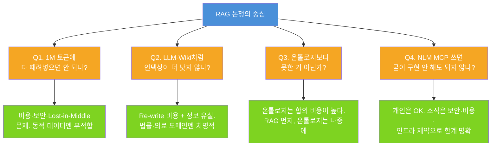
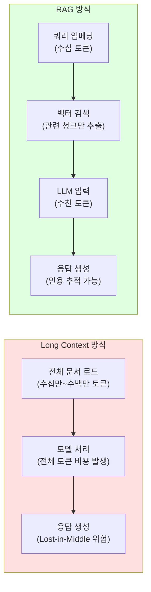
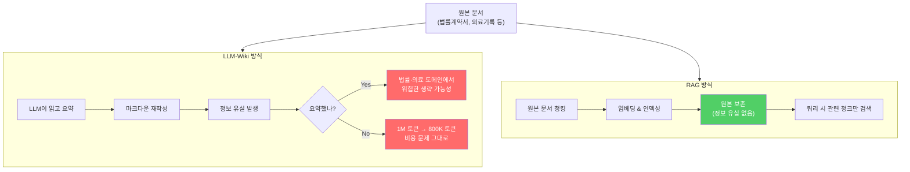
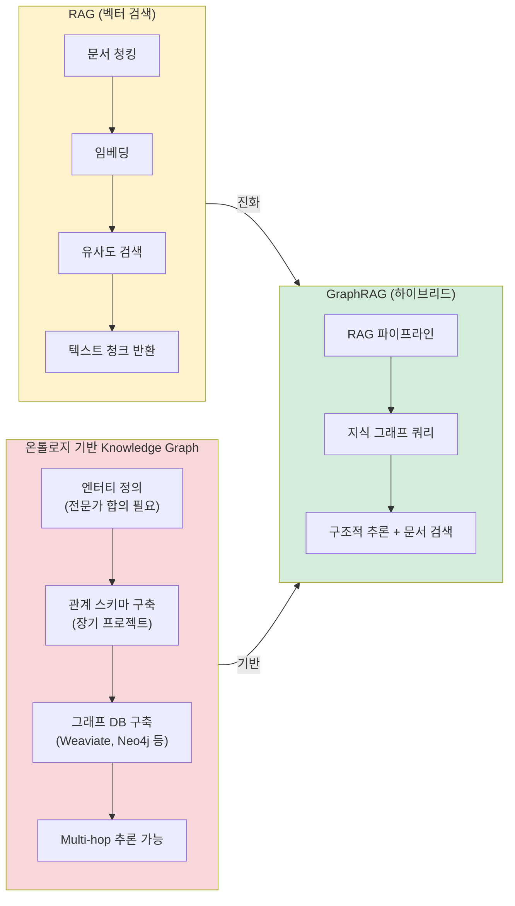
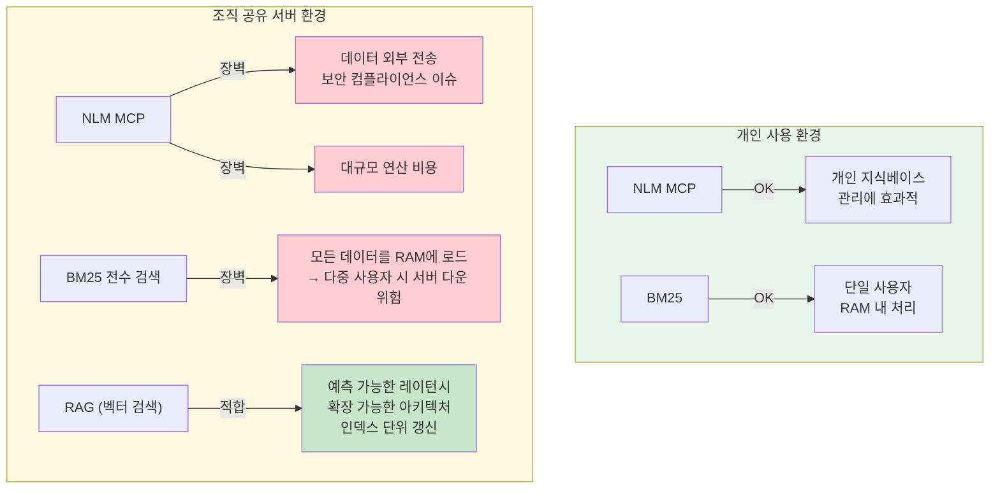
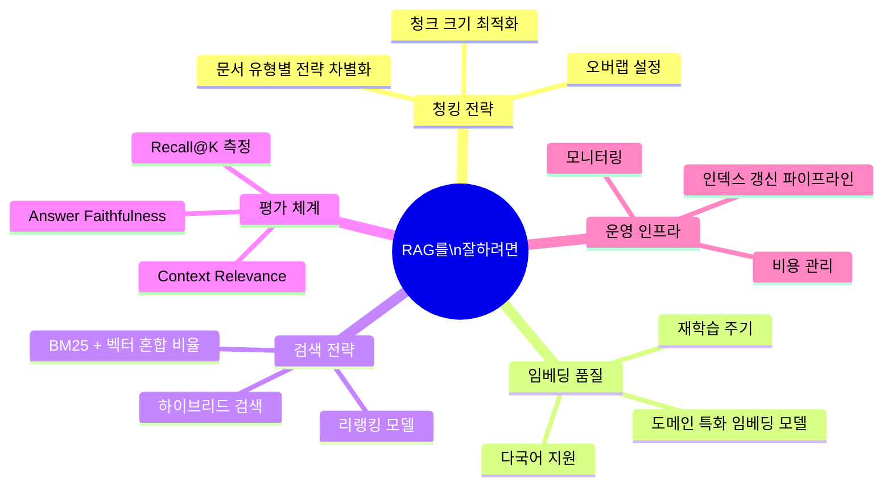

> **원문 출처**: Threads [@catlovessubakba](https://www.threads.com/@catlovessubakba/post/DXYgvcpEqD4)  
> **작성일**: 2025년 (원문 기준) | **분석 보강**: 2026년 4월  
> **주제**: RAG(Retrieval-Augmented Generation)의 조직 내 실제 사용 가능성에 대한 4가지 핵심 반론과 그 해답

---

## 들어가며: RAG 논쟁은 왜 식지 않는가

AI 기술 도입을 논의하는 자리에서 RAG(Retrieval-Augmented Generation)만큼 반복적으로 "이거 굳이 해야 해?" 라는 질문이 쏟아지는 기술도 드물다. RAG가 혁신으로 불리던 시절이 있었지만, 이제는 하이프(hype)가 상당히 가라앉은 상태다. 왜냐면 제대로 된, 강력한 경험을 만들기가 생각보다 훨씬 어려웠기 때문이다.

그럼에도 RAG를 향한 논쟁은 계속된다. 2025년 기준으로도 기업들의 공통된 모순이 하나 있다: **"RAG 없이는 못 살겠는데, 막상 써보면 만족스럽지 않다."** RAG는 사내 지식 접근의 장벽을 낮춰주지만, 복잡한 쿼리에서 안정적이고 정확한 결과를 내려면 상당한 튜닝이 필요하다. 이 간극이 끊임없는 의문을 낳는다.

원문의 저자는 이 논쟁을 네 가지 전형적인 반론으로 정리하고, 각각에 대해 **개인 사용이 아닌 조직·그룹 관점**에서 답한다. 이 분석은 그 네 가지 질문을 하나씩 풀어내면서, 2025~2026년의 최신 연구와 산업 동향을 함께 엮어 더 깊이 살펴본다.

---

## 전체 논의 구조 한눈에 보기

---

## Q1. "그거 1M 토큰에 다 때려넣으면 안 되나요?"

### 질문의 배경

이 질문은 최근 몇 년 사이 급격히 늘어난 LLM 컨텍스트 윈도우 크기에서 비롯된다. Gemini 1.5 Pro가 200만 토큰을, Claude가 확장 컨텍스트 티어를 지원하면서 "RAG처럼 복잡한 걸 왜 만드느냐, 그냥 문서를 전부 넣어버리면 되지 않느냐"는 생각이 생겨났다. 표면적으로는 매우 매력적인 접근이다. 복잡한 청킹(chunking)이나 임베딩 파이프라인 없이 모델이 알아서 필요한 정보를 찾아준다면 얼마나 편할까.

### 원문의 답: 암묵적 비용 문제

원문은 이에 대해 직접 반론을 서술하지 않고, Q2 논의 속에서 간접적으로 언급한다. 핵심은 비용이다. 1M 토큰을 태우는 비용이 현실적이지 않고, 800K 토큰을 뱉어내는 결과를 얻는다면 그 효율은 더더욱 낮다는 것이다.

### 최신 연구가 말하는 것

**Long Context의 실제 한계는 크게 세 가지다.**

첫째, **비용**이다. RAG는 임베딩 쿼리, 관련 청크 검색, 그 청크로 응답을 생성하는 과정에서 수천 토큰만을 사용한다. 반면 Long Context 방식은 컨텍스트 윈도우에 들어있는 모든 토큰에 대해 비용이 부과된다. 10만 토큰 규모의 컨텍스트를 매번 사용한다면, 대부분의 토큰은 실제 쿼리에 쓰이지 않음에도 요금이 청구된다. 규모가 커질수록 이 격차는 기하급수적으로 벌어진다.

둘째, **Lost-in-the-Middle 문제**다. 연구들은 LLM이 긴 컨텍스트에서 중간 부분에 위치한 정보를 잘 활용하지 못한다는 사실을 일관되게 보여준다. 즉, 1M 토큰에 문서를 쏟아부어도 모델이 "가운데 있는 중요한 정보"를 놓칠 가능성이 높다.

셋째, **동적 데이터 문제**다. Long Context는 정적 스냅숏이다. 오늘 문서를 로드하고 세션이 끝나면 내일 추가된 1만 건의 신규 문서는 반영되지 않는다. 반면 RAG 기반 벡터 데이터베이스는 새 문서가 임베딩되어 인덱싱되면 거의 실시간으로 검색에 반영된다. 금융, 의료, 법무처럼 최신 정보가 경쟁력인 영역에서 이는 치명적인 아키텍처 불일치다.

흥미로운 것은 2025년 Gartner 조사에서 "컨텍스트 스터핑(context-stuffing)" 방식만으로 시작한 기업의 71%가 12개월 이내에 벡터 검색 레이어를 별도로 추가했다는 점이다. 결국 RAG를 조악하게 재발명하는 꼴이 된 것이다.

**결론**: 1M 토큰에 때려넣는 방식은 개인의 단일 세션, 정적 문서, 비용에 민감하지 않은 환경에서는 유효하다. 그러나 조직 단위의 지식베이스, 실시간 갱신이 필요한 데이터, 수천 명의 사용자가 동시에 접근하는 서버 환경에서는 RAG가 여전히 비교할 수 없이 우월하다.

---

## Q2. "그거 LLM-Wiki처럼 인덱싱 시키는 게 더 나은 거 아님?"

### LLM-Wiki란 무엇인가

LLM-Wiki는 기존 문서를 LLM이 읽고 마크다운 형식의 요약본으로 "재작성(re-write)"하여 별도로 저장해두는 방식의 개인 지식 관리 아키텍처다. 문서를 LLM이 소화할 수 있는 형태로 사전 가공해두면, 나중에 질의할 때 토큰 소모를 줄일 수 있다는 아이디어다.

### 원문의 핵심 비판: Re-write의 구조적 한계

원문은 LLM-Wiki 방식에 대해 매우 명확한 비판을 제시한다. **LLM-Wiki는 결국 re-write다.** 하나하나 다 읽고, 내용 유실을 감수하고, 마크다운으로 요약본을 작성할지 선택해야 한다. 압축을 하지 않으면 1M 토큰을 들여 800K 토큰을 뱉는 상황이 생기는데, 이 자체가 이미 비용 문제다.

그런데 요약(압축)을 한다면 더 심각한 문제가 생긴다. **법률, 세무, 노무, 감리, 의료 영역에서는 요약본 자체가 위험하다.** 이 분야들은 단어 하나, 조항 하나가 결론을 완전히 뒤집는 도메인이다. 요약 과정에서 어떤 단어가 빠졌는지, 어떤 맥락이 생략됐는지를 일일이 다시 확인해야 한다면, 결국 원본을 다시 읽는 것과 다름이 없다. 이 작업을 반복하려면 왜 굳이 LLM-Wiki를 쓰는가 하는 근본적인 의문이 생긴다.

### 조직 차원의 운영 비용 문제

원문이 지적하는 또 하나의 핵심 포인트는 **서버 운영 맥락에서의 비용**이다. 서버에 올린 챗봇이 LLM-Wiki에 가서 읽고 분석한 뒤 CS(고객 서비스) 응답을 한다면, 그 과정 자체에 에이전트(Agent)가 개입해야 한다. 에이전트를 투입하는 순간 비용과 복잡도가 기하급수적으로 높아진다.

LLM-Wiki 방식이 효과적인 경우는 개인이 자신의 컴퓨터에서 자신의 지식베이스를 관리할 때다. 조직 단위, 특히 다수의 사용자가 공유하는 서버 환경에서는 이 방식의 비용 구조가 완전히 달라진다.

### 목차 효과는 실재한다, 하지만…

원문은 LLM-Wiki의 한 가지 긍정적인 면도 인정한다. 압축을 하지 않더라도 목차(index)가 생기면 검색 시 토큰이 덜 들어간다는 점이다. 이는 사실이다. 계층적 인덱싱은 검색 효율을 높인다. 그러나 이 장점만으로 re-write의 비용과 정보 유실 위험을 정당화하기 어렵다.

---

## Q3. "그거 온톨로지보다 못한 거 아님?"

### 온톨로지(Ontology)란 무엇인가

온톨로지는 특정 도메인 내의 개념(entity)과 그 개념들 사이의 관계(relation)를 형식적으로 정의한 구조다. 예를 들어 의료 온톨로지라면 "질병", "약물", "치료법" 같은 개념과 "질병은 약물로 치료된다", "약물은 부작용을 갖는다" 같은 관계를 명시적으로 스키마로 정의한다. 이를 통해 단순한 텍스트 유사도 검색이 아니라 개념 간의 논리적 추론(multi-hop reasoning)이 가능해진다.

지식 그래프(Knowledge Graph)는 이 온톨로지를 기반으로 데이터를 채워 넣은 실제 데이터베이스다. GraphRAG는 이 지식 그래프를 RAG 파이프라인에 결합한 아키텍처다.

### 원문의 핵심 주장: 온톨로지는 합의 비용이 있다

원문은 온톨로지라는 단어 자체를 좋아하지 않는다고 솔직하게 밝힌다. 그 이유는 명확하다. **온톨로지가 실효성을 가지려면 해당 분야 전문가들이 "이 스키마로 가면 된다"고 합의한 수준에 도달해야 한다.** 개인이 만든 온톨로지는 개인에게 유용할 수 있지만, 그룹 내에서 사용하기엔 그 합의 비용이 엄청나다.

그뿐 아니라 온톨로지를 실제로 적용하는 데에는 또 다른 결정이 필요하다. 문서 내부에 온톨로지를 적용할 것인지, 아니면 문서 간의 관계에 온톨로지를 적용할 것인지의 문제다.

문서 내부에 온톨로지를 적용하려면 문서를 추론을 덧붙여 다시 쓰는 것과 다름이 없다. 이는 LLM-Wiki 방식의 한계와 동일한 문제, 즉 엄청난 재작성 비용이 발생한다. 반면 문서 외부의 관계에만 온톨로지를 구축한다면, 그냥 인덱싱만 개선하는 것이 더 낫다.

### 최신 연구가 말하는 온톨로지의 진짜 위상

최신 연구는 온톨로지가 나쁘다는 것이 아니라, 적절히 쓰이면 RAG보다 강력하다는 것을 보여준다. 온톨로지 기반 지식 그래프를 활용한 RAG 시스템은 순수 벡터 검색 기반 RAG를 크게 능가한다. 그 이유는 여러 홉(hop)에 걸친 추론이 가능하기 때문이다.

예를 들어, RAG는 "A 프로젝트 담당자가 누구야?"는 답할 수 있어도, "A 프로젝트 담당자의 전결 권한이 얼마야, 그래서 이 구매 건이 누구 결재를 받아야 해?"는 답하지 못한다. 지식 그래프는 이런 다단계 추론을 가능하게 한다.

그러나 이런 능력은 **먼저 온톨로지가 잘 구축되어야 한다는 조건** 아래서만 실현된다. 온톨로지 구축은 도메인 전문가의 깊은 참여, 엔터티 타입 결정, 관계 설계, 그리고 지속적인 유지보수가 필요하다. 이 모든 것이 비용이다.

### 온톨로지 도입의 올바른 순서

원문이 제시하는 실용적인 로드맵은 다음과 같다.

1. **먼저 단일 부서의 데이터로 RAG를 시험 도입한다.** 그 부서의 특정 업무 효율을 위해 RAG를 써본다.
2. **거기서 나온 규칙과 경험을 기반으로** 그 부서의 특정 목적을 위한 온톨로지를 소규모로 구축한다.
3. 이 스텝 바이 스텝 없이 처음부터 전사적 RAG나 전사적 온톨로지를 도입하면, 아무 의미 없이 토큰을 헌납하는 일이 된다.

이것은 기술적으로도, 조직 변화 관리 측면에서도 매우 타당한 접근이다. 온톨로지는 한번 만들어 놓으면 변경 비용이 매우 크다. 도메인에 대한 충분한 이해 없이 성급하게 스키마를 확정하면, 이후 사용할수록 제약이 된다.

```mermaid
gantt
    title 조직 내 RAG → 온톨로지 도입 로드맵
    dateFormat  X
    axisFormat  %s단계

    section 1단계: 파일럿
    단일 부서 RAG 파일럿       :a1, 0, 3
    데이터 패턴 및 쿼리 분석   :a2, 1, 4

    section 2단계: 소규모 온톨로지
    파일럿 결과 기반 스키마 설계   :b1, 3, 6
    부서 내 소규모 KG 구축         :b2, 4, 7

    section 3단계: 확장
    타 부서 확장 검토           :c1, 6, 9
    전사 표준 온톨로지 수립     :c2, 7, 10
```

---

## Q4. "그거 굳이 구현하느니 NLM MCP 쓰면 안 됨?"

### NLM MCP란 무엇인가

NLM(Neural Language Model) MCP(Model Context Protocol)는 외부 도구나 데이터 소스를 LLM에 연결하는 프로토콜 기반의 접근 방식이다. NLM 기반의 검색은 청크 단위로 문서를 구성하고, 그 청크들 중 쿼리와 관련성이 높은 것들을 대규모 연산을 통해 찾아낸다. 원문은 이를 "다중 분신술을 하고, 찾아서, 기억을 합쳐서 걸러내는 방식"이라고 직관적으로 설명한다.

### 원문의 판단: 개인에게는 OK, 조직에서는 두 가지 장벽

원문은 이 질문에 대해 상당히 솔직하다. **개인의 경우, 그리고 회사에서 데이터 관리 기준이 없다면 NLM MCP도 괜찮다.** 그러나 조직 환경에서는 두 가지 핵심 장벽이 존재한다.

첫 번째는 **데이터 보안 기준**이다. 외부 서비스에 기업 데이터를 넘기는 것에 대한 컴플라이언스 기준이 점점 엄격해지고 있다. 회사의 내부 문서, 고객 데이터, 계약 정보를 외부 NLM 서비스로 전송하는 것은 대부분의 기업에서 리스크 관리 대상이다.

두 번째는 **연산 비용**이다. NLM은 청크 단위로 문서를 만들고, 그것을 어마어마한 연산력(비용)을 태워서 찾는다. 실생활 규모에서는 부적합할 수 있다.

### BM25 전수 검색에 대한 비판

원문은 또 하나의 "간단한 대안"으로 종종 언급되는 BM25 전수 검색에 대해서도 분명한 한계를 지적한다. BM25는 모든 문서를 메모리에 올려놓고 한 번에 다 읽는 방식이라 성능은 확실하다. 문제는 이것을 서버 환경에서 운영할 때다.

회사의 모든 텍스트 데이터를 RAM에 올려놓고, 동시에 여러 사용자의 검색 요청을 처리하면 어떻게 될까. 서버에는 사양의 한계가 있다. RAM이 포화되면 서버가 내려간다. 이는 공유 인프라에서 결코 권장할 수 없는 구조다.

물론 BM25를 얼마나 청크 단위로 순차 적용하느냐, RAG와 얼마나 적절히 혼합하느냐 같은 세부 튜닝은 경험에 달린 영역이다. 하지만 BM25 단독으로 조직 규모의 서버 환경을 구축하는 것은 별도로 고려해야 할 아키텍처 설계가 필요하다.

---

## 핵심 통찰: RAG는 "구현은 쉽고, 잘하기는 어렵다"

원문의 가장 강력한 문장은 여기에 있다. **RAG는 구현은 쉬우나, 잘하기가 어렵습니다.** 그리고 RAG보다 어려운 것이 온톨로지입니다.

이 두 문장은 단순해 보이지만 기술 도입의 철학을 담고 있다. 많은 조직이 RAG를 "구현 완료"한 뒤 실망하는 이유는, 구현의 완료와 제대로 작동함의 사이에 있는 거대한 간극을 인식하지 못하기 때문이다.

잘 작동하는 RAG 시스템을 만들려면 다음과 같은 요소들을 지속적으로 최적화해야 한다.

### 2025~2026년의 현실: RAG는 "핵심 인프라"로 자리잡았다

2025년 말 기준으로, RAG를 둘러싼 논쟁이 계속되는 와중에도 실제 기업 AI 도입에서 RAG의 위상은 흔들리지 않았다. 오히려 강화됐다. AI 에이전트의 부상과 함께 RAG는 "에이전트가 외부 지식에 접근하는 핵심 도구"로 재정의됐다. Agentic RAG, 즉 에이전트가 계획(planning)과 반성(reflection)을 통해 RAG 프로세스 자체를 개선하는 방식이 2025년의 주된 흐름이었다.

벡터 데이터베이스 시장도 마찬가지다. Pinecone이 2025년 4분기에 전년 대비 340% 매출 성장을 기록했고, Weaviate는 1억 6300만 달러 규모의 Series C를 마무리했다. 이른바 "죽었다"는 카테고리에 2025년 한 해에만 8억 달러 이상의 벤처 투자가 몰렸다.

---

## 전체 비교 요약

| 방식 | 개인 사용 | 조직 사용 | 주요 장벽 | 적합 도메인 |
|---|---|---|---|---|
| **Long Context (1M 토큰)** | ✅ 유용 | ⚠️ 제한적 | 비용, 동적 데이터 미지원 | 정적 문서 분석, 계약서 검토 |
| **LLM-Wiki (Re-write)** | ✅ 효과적 | ❌ 비효율 | 정보 유실, 운영 비용 | 개인 지식베이스 |
| **온톨로지 / KG** | ⚠️ 복잡 | ✅ 강력 (단, 구축 후) | 합의 비용, 구축 시간 | 법률, 의료, 규정 준수 |
| **NLM MCP** | ✅ 편리 | ⚠️ 제한적 | 데이터 보안, 연산 비용 | 개인 리서치, 소규모 팀 |
| **BM25 전수 검색** | ✅ 빠름 | ❌ 위험 | RAM 한계, 서버 다운 위험 | 소규모 로컬 검색 |
| **RAG (벡터 검색)** | ✅ 가능 | ✅ 권장 | 튜닝 복잡도 | 동적 지식베이스, 대규모 조직 |

---

## 마치며: "전사적"이라는 말이 주는 환상

원문의 마지막 경고는 명확하다. **처음부터 전사적 RAG, 전사적 온톨로지는 아무 의미 없이 토큰을 헌납하는 일이다.**

이것은 기술적 판단이기도 하지만, 조직론적 판단이기도 하다. "전사"라는 단어가 붙는 순간, 모든 부서의 다양한 데이터 구조와 사용 패턴을 하나의 아키텍처로 수용해야 한다는 압박이 생긴다. 이 압박이 과도한 일반화를 낳고, 결국 어느 부서에도 제대로 맞지 않는 시스템이 탄생한다.

실용적인 AI 지식 인프라는 작게 시작해서, 경험으로 배우고, 검증된 패턴을 확장하는 방식으로 구축된다. 이것이 RAG의 올바른 도입 철학이고, 더 나아가 조직 내 AI 전환 전략의 핵심 원칙이기도 하다.

---

## 참고 자료

- RAGFlow Blog — "From RAG to Context: A 2025 Year-End Review" (2025.12)
- Meilisearch Blog — "RAG vs. Long-Context LLMs: A Side-by-Side Comparison" (2025.11)
- Redis Engineering Blog — "RAG vs Large Context Window: Real Trade-offs for AI Apps" (2026.02)
- NStarX Inc. — "The Next Frontier of RAG: How Enterprise Knowledge Systems Will Evolve 2026-2030" (2025.12)
- Markaicode — "RAG vs Long Context: Do Vector Databases Still Matter in 2026?" (2026.03)
- arXiv:2511.05991 — "Ontology Learning and Knowledge Graph Construction: A Comparison of Approaches and Their Impact on RAG Performance" (2025.11)
- Phyvant Blog — "RAG vs. Knowledge Graphs for Enterprise AI: What Actually Works" (2026.01)
- Techment Blog — "RAG vs Knowledge Graphs: Which Performs Better for Enterprise AI?" (2026.04)

---

*본 문서는 Threads @catlovessubakba의 원문 게시물을 기반으로, 최신 연구 자료와 산업 동향을 추가하여 심층 분석한 자료입니다.*
