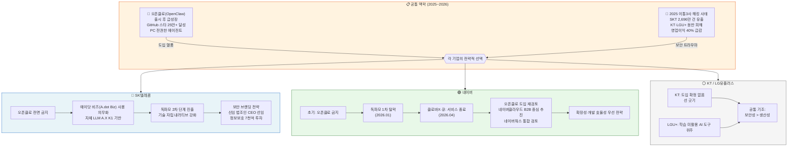

## — 보안 트라우마와 기술 생존 전략의 갈림길에서 —

> 출처: 딜사이트(2026.04.22) | 작성일: 2026-04-23  
> 원문: https://dealsite.co.kr/articles/160094

---

## 목차

1. [기사 개요](#1-기사-개요)
2. [오픈클로(OpenClaw)란 무엇인가](#2-오픈클로openclaw란-무엇인가)
3. [SKT의 선택: 오픈클로 전면 금지](#3-skt의-선택-오픈클로-전면-금지)
4. [SKT 해킹 사태: 결정의 배경](#4-skt-해킹-사태-결정의-배경)
5. [네이버의 선택: 도입 금지에서 재검토로 반전](#5-네이버의-선택-도입-금지에서-재검토로-반전)
6. [네이버의 위기: 독파모 탈락과 클로바X 서비스 종료](#6-네이버의-위기-독파모-탈락과-클로바x-서비스-종료)
7. [통신 3사의 공통 입장](#7-통신-3사의-공통-입장)
8. [기업별 전략 비교 구조도](#8-기업별-전략-비교-구조도)
9. [전문가 분석과 업계 시각](#9-전문가-분석과-업계-시각)
10. [종합 평가 및 시사점](#10-종합-평가-및-시사점)
11. [결론](#11-결론)

---

## 1. 기사 개요

딜사이트가 2026년 4월 22일 보도한 이 기사는 국내 빅테크·통신 기업들이 오픈소스 AI 에이전트 프레임워크인 오픈클로(OpenClaw) 도입을 놓고 서로 상반된 노선을 선택하고 있음을 집중 조명한다. 핵심 대립 구도는 SK텔레콤(SKT)의 '전면 금지' 대 네이버의 '재검토로의 전환'이다.

표면적으로는 단순한 오픈소스 도구 채택 여부처럼 보이지만, 그 이면에는 SKT의 2025년 대규모 해킹 사태가 남긴 깊은 보안 트라우마, 네이버의 국가 AI 프로젝트(독파모) 탈락이라는 굴욕, 그리고 AI 에이전트 시대에 국내 기업들이 어떻게 기술 주권과 경쟁력을 동시에 확보할 것인지의 문제가 복잡하게 얽혀 있다. 이 문서는 기사의 배경 맥락을 추적하고, 최신 정보를 보완하며, 각 기업의 전략적 선택이 갖는 의미를 종합적으로 분석한다.

---

## 2. 오픈클로(OpenClaw)란 무엇인가

### 탄생과 성장

오픈클로는 오스트리아 빈 출신의 소프트웨어 엔지니어 페터 슈타인베르거(Peter Steinberger)가 2025년 11월 처음 공개한 자율형 AI 에이전트 오픈소스 프로젝트다. 초기에는 Clawdbot이라는 이름으로 출시되었으나, Anthropic의 Claude(클로드)와 이름이 유사하다는 이유로 Anthropic 법무팀의 연락을 받아 Moltbot으로 변경하는 과정에서 기존 계정이 탈취되는 사고까지 겪었다. 이후 현재의 OpenClaw라는 이름으로 정착했다.

출시 후 불과 몇 달 만에 GitHub 스타 25만 개를 돌파하며 React, Linux를 뛰어넘는 전례 없는 성장을 기록했다. 2026년 2월에는 창시자 슈타인베르거가 OpenAI의 샘 알트만의 초대를 받아 합류하면서, 오픈클로 프로젝트는 독립 오픈소스 재단으로 이전되어 운영되고 있다.

### 핵심 기술 특성

오픈클로는 기존 챗봇과 본질적으로 다른 위상을 가진다. 기존 AI가 브라우저 탭에 머물며 사용자의 프롬프트를 기다리는 수동적 존재였다면, 오픈클로는 사용자의 로컬 하드웨어(Mac, Windows, Linux) 또는 VPS(가상 서버)에 상주하며 24시간 연중무휴로 작동하는 디지털 직원 역할을 수행한다. WhatsApp, Telegram, Slack, Discord 등 사용자가 이미 익숙한 메신저 채널을 통해 명령을 내리면, 에이전트는 터미널 접근, 브라우저 자동화, 파일 읽기·쓰기 권한을 활용해 자율적으로 작업을 수행한다.

- **하트비트(Heartbeat) 기능**: 사용자가 명령을 내리지 않아도 설정된 주기마다 에이전트가 깨어나 예정된 작업을 수행하고, 중요한 변경 사항이 있을 때 먼저 메시지를 보낸다.
- **스킬(Skills) 시스템**: 마크다운(SKILL.md)과 YAML 파일로 정의된 스킬을 ClawHub 공유 저장소에서 5,000개 이상 즉시 설치 가능하다.
- **영구 메모리(Persistent Memory)**: 사용자의 선호도, 과거 대화 내역, 진행 중인 프로젝트 맥락을 로컬 마크다운 파일 형태로 저장하고 RAG 방식으로 불러온다.
- **모델 불가지론(Model-agnostic) 설계**: Claude, GPT, Gemini뿐 아니라 로컬 오픈소스 모델까지 자유롭게 선택해 사용 가능하다.
- **MCP(Model Context Protocol) 활용**: 파일 시스템, 브라우저, 외부 API와 긴밀하게 소통한다.

### 오픈클로의 보안 리스크

오픈클로가 인기를 얻는 만큼 보안 우려도 상당하다. 오픈클로는 PC 운영체제의 거의 모든 권한을 요구한다. 파일, 브라우저 기록, 이메일, 비밀번호 관리자, 시스템 명령에 대한 전체 접근 권한을 LLM에게 위임하는 구조이기 때문에, 악의적인 이메일 하나만으로도 사용자 몰래 개인정보가 외부로 유출될 수 있다. 실제로 퍼블릭 인터넷에 노출된 오픈클로 인스턴스 중 93.4%가 인증 없이 동작하는 취약한 상태라는 조사 결과도 있으며, API 키를 평문으로 저장하는 구조 때문에 8.8등급(CVSS 기준)의 고위험 취약점(CVE-2026-25253)이 보고된 바 있다.

---

## 3. SKT의 선택: 오픈클로 전면 금지

### 내부 지침과 대안

2026년 4월, SKT는 회사 내부적으로 오픈클로 사용을 전면 금지하는 가이드라인을 내려보냈다. 그 대신 임직원들에게 자사의 독자 AI 파운데이션 모델 A.X K1과 결합한 '에이닷 비즈(A.dot Biz)'를 사용하도록 지시했다. 에이닷 비즈는 채팅창에 자연어로 업무 내용을 입력하면 답변과 함께 관련 업무를 직접 실행해주는 기업용 AI 에이전트로, 자체 거대언어모델 A.X K1과 SK AX의 산업 특화 AI 기술을 결합해 보안성을 담보했다는 것이 SKT 측의 설명이다.

SKT 관계자는 구체적인 우려 사항으로 "사용자가 모르는 상태에서 AI가 메일을 보내는 식의 보안 문제"를 들었다. 이는 오픈클로의 프롬프트 인젝션 취약점 — 즉, 외부에서 들어온 악의적인 텍스트를 에이전트가 실제 명령으로 인식해 실행해버리는 위험 — 을 정확히 짚은 것이다.

### 전략적 의도

중앙대학교 이재성 AI학과 교수는 SKT의 결정을 경영·브랜드 양면에서 분석했다. 그는 "아무리 뛰어난 기술이라도 고객이 실제로 사용해야 의미가 있다"고 전제하면서, "SKT는 비즈니스적 관점에서도 브랜드 이미지 관점에서도 외부 오픈소스를 도입할 이유가 없다"고 평가했다. 여기에는 두 가지 축이 있다.

첫째, **기술 자립의 내러티브다.** SKT는 현재 정부 주도 독자 AI 파운데이션 모델(독파모) 프로젝트의 2차 단계에 진출한 당사자다. 반도체(리벨리온), 게임(크래프톤), 모빌리티(포티투닷), 서비스(라이너), 데이터(셀렉트스타) 등 파트너들과 풀스택 AI 역량을 구축하고 있는 상황에서, 경쟁사 오픈소스를 사내에 도입한다는 것은 스스로의 기술력 서사와 충돌한다.

둘째, **보안 브랜딩이다.** 2025년 4월의 대규모 해킹 사태 이후, SKT는 고객 신뢰 회복을 최우선 과제로 설정했다. 외부 오픈소스 에이전트를 도입했다가 보안 문제가 재발한다면 회사가 감당해야 할 사회적·재무적 타격은 상상하기 어렵다. 따라서 오픈클로 금지는 보안 위험 관리인 동시에, '우리는 자체 기술로만 운영한다'는 메시지를 시장에 전달하는 전략적 행위이기도 하다.

---

## 4. SKT 해킹 사태: 결정의 배경

### 사건의 전말

SKT의 오픈클로 금지 결정을 이해하려면 2025년 4월의 해킹 사태를 반드시 짚어야 한다. 2025년 4월 18일, SKT 홈가입자서버(HSS)가 BPFdoor 악성코드에 감염되어 고객의 유심(USIM) 관련 정보가 대규모로 유출되었다. 유출된 정보는 IMSI(가입자식별번호), ICCID, 유심 인증키(Ki값) 등 유심 복제에 활용될 수 있는 핵심 정보 4종과 관리용 정보 21종을 포함해 총 25종, 약 2,696만 건에 달했다. 이는 국내 통신 역사상 최대 규모의 개인정보 침해 사례로 기록되었다.

사태의 심각성은 정보 유출 규모에 그치지 않았다. 악성코드가 2022년 6월부터 잠복해 있었음이 드러나면서, 그 공백 기간 동안 추가 유출이 있었는지 확인할 방법 자체가 없다는 점이 더 큰 충격이었다. 집단소송 참여자가 3만 명을 넘어섰고, 주가는 해킹 사태 이후 약 2.5% 하락하며 시가총액이 약 5,800억 원 줄어들었다. 법조인 출신의 정재헌 신임 CEO가 선임되고, 임원진 30%를 감축하는 강도 높은 구조조정이 뒤따랐다.

### 사후 대응과 약속

SKT는 향후 5년간 7,000억 원을 정보보호에 투자하는 '정보보호혁신안'을 발표하고, 8월 요금 50% 할인, 5,000억 원 규모의 '고객 감사 패키지'를 마련하는 등 전방위적인 신뢰 회복 프로그램을 가동했다. 이러한 맥락에서 오픈클로 금지는 단순한 보안 정책이 아니라, SKT가 '보안에 진심'이라는 것을 내외부에 증명하려는 제스처이기도 하다.

---

## 5. 네이버의 선택: 도입 금지에서 재검토로 반전

### 입장 전환의 경위

흥미롭게도 네이버는 SKT와 정반대의 방향으로 움직이고 있다. 올해 초 오픈클로 도입을 금지했던 네이버가 불과 몇 달 만에 도입 재검토로 입장을 뒤집은 것이다. 실제로 네이버의 자회사인 네이버클라우드는 B2B 서비스를 중심으로 오픈클로 도입을 검토 중이며, 네이버웍스 등 협업 플랫폼에 이를 통합해 에이전트 활용 범위를 넓히겠다는 취지다. 다만 네이버클라우드 관계자는 "아직 논의 중인 상태로 보안 관련해서도 검토 중"이라며 확정적인 언급을 피했다.

### 전략적 필요성: 확장성 확보

네이버의 이러한 전환은 기술 전략의 절박한 현실 인식에서 비롯된 것으로 해석된다. 자체 기술력에만 의존하는 폐쇄적 접근이 오히려 경쟁력을 깎아먹는 상황이 도래했기 때문이다. 업계 관계자는 "네이버는 하이퍼클로바 X를 중단하는 등의 어려움이 있어 확장성 때문에 오픈클로 도입을 검토하는 것"이라고 분석했다. 또한 "오픈클로의 보안 문제는 방화벽이나 권한 통제 등의 보완으로 추후에도 가능하다"고 덧붙였다.

---

## 6. 네이버의 위기: 독파모 탈락과 클로바X 서비스 종료

### 독파모 1차 평가 탈락

네이버의 입장 전환을 이해하려면 2026년 1월 15일의 사건을 먼저 알아야 한다. 정부가 주도하는 '독자 AI 파운데이션 모델(독파모)' 프로젝트 1차 단계평가에서 네이버클라우드가 탈락한 것이다. 5개 정예팀 가운데 LG AI연구원, SK텔레콤, 업스테이지 3팀이 2차 단계에 진출하고 네이버클라우드와 NC AI는 고배를 마셨다.

탈락 이유는 충격적이었다. 네이버의 HyperCLOVA X SEED 32B THINK 모델은 성능 자체는 우수했지만, 비전 인코더 등 핵심 모듈의 가중치를 중국 알리바바의 Qwen 모델에서 그대로 차용했다는 점이 '독자적 기술 확보'라는 사업 취지에 어긋난다는 판정을 받았다. 네이버클라우드 측은 "자체 개발한 인코더로 충분히 교체할 수 있다"고 항변했지만, 정부는 사전에 명시된 기준을 철저히 적용했다. 최수연 네이버 CEO는 "정부의 판단을 존중하며, 이 부분이 네이버 기술력에 대한 방증은 아니다"라는 입장을 밝혔지만, 재도전은 고려하지 않겠다고 선을 그었다.

### 클로바X와 큐(Cue:) 서비스 종료

설상가상으로 2026년 2월 25일, 네이버는 자사의 생성형 AI 서비스 클로바 X(CLOVA X)와 AI 검색 서비스 큐:(Cue:)를 2026년 4월 9일부로 종료한다고 발표했다. 2023년 하반기 야심차게 출시한 지 약 3년 만의 일이다. 네이버는 이 결정에 대해 "실험적 서비스를 통해 다양한 활용 가능성을 확인하고 풍부한 기술적 경험을 쌓아왔다"고 설명했지만, 사실상 소비자 대상 AI 챗봇 경쟁에서 한 발 물러서 B2B·인프라 중심으로 전략을 재편한다는 신호로 해석된다.

---

## 7. 통신 3사의 공통 입장

오픈클로에 신중한 것은 SKT만이 아니다. LG유플러스는 "학습에 활용되지 않는 AI 도구를 주로 사용하고 있다"는 입장을 밝혔으며, KT는 "오픈클로 도입에 대해 확정된 바 없다"고 선을 그었다. 업계에서는 통신 3사의 이러한 공통 대응이 생산성보다 보안성을 우위에 두는 판단의 결과라고 분석한다. 2025년에는 SKT뿐 아니라 KT와 LG유플러스도 해킹 피해를 입어, 국내 이통 3사 모두 해킹 트라우마를 공유하고 있기 때문이다. 이통 3사의 2025년 영업이익은 해킹 사태의 여파로 40% 가까이 급감했다는 분석도 있어, 보안에 대한 민감도가 더욱 높아진 상태다.

---

## 8. 기업별 전략 비교 구조도

---

## 9. 전문가 분석과 업계 시각

### 해킹 트라우마의 비대칭성

전문가들은 통신 3사와 네이버의 다른 행보를 갈라놓는 핵심 요인으로 '보안 트라우마의 비대칭성'을 꼽는다. 업계 한 관계자는 "SKT가 오픈클로를 쓴다는 표현이 나오면 해킹 전례 때문에 보안 트라우마가 생길 수 있다"고 직언했다. 오픈클로는 PC 작동 권한이 있어 사용자 승인 없이 정보를 유출하는 등 보안 위험성이 있다. SKT가 이를 도입했다가 또 사고가 난다면 브랜드 회복은 사실상 불가능에 가까울 것이다.

반면 네이버는 다른 종류의 압박에 놓여 있다. 독파모 탈락으로 국가 지원을 잃었고, 자체 AI 챗봇 서비스도 종료했으며, 확장성을 높이지 않으면 B2B 시장에서의 경쟁력도 위태롭다. 오픈클로의 보안 문제가 방화벽이나 권한 통제로 해결 가능한 기술적 문제라면, 확장성 결핍은 시장 기회를 영구적으로 잃을 수 있는 전략적 문제다. 네이버의 입장에서는 기술적 리스크를 감수하고 실용적 확장성을 택하는 것이 합리적인 선택일 수 있다.

### AI 에이전트 시장의 방향성

이재성 중앙대학교 AI학과 교수는 SKT의 결정을 "경영적 측면에서 외부 오픈소스 모델 도입이 손해"라는 판단이라고 해석했다. 그러나 거시적으로는 바이두·텐센트 등 중국의 빅테크들이 오픈클로 같은 외부 기술을 통해 이미 에이전트 서비스를 출시하고 있다는 사실을 간과해서는 안 된다. AI 에이전트 소프트웨어 시장은 2024년 약 300~400억 달러에서 2029년 2,000억 달러 이상으로 성장할 것으로 전망된다. 이 시장에서 '보안'이라는 이름 아래 폐쇄적 전략만을 고수한다면, 중장기적으로 시장 기회를 놓칠 수 있다는 경고도 유효하다.

---

## 10. 종합 평가 및 시사점

### SKT 전략 평가

SKT의 오픈클로 금지 결정은 단기적으로 매우 합리적이다. 해킹 사태로 이미 최대 5,000억 원대의 과징금이 예상되는 상황에서, 또 다른 보안 구멍을 스스로 뚫는 것은 자해에 가깝다. 에이닷 비즈를 통해 자체 LLM 기반의 AI 에이전트를 운영하면서 기술 자립·보안·브랜드 신뢰를 동시에 강화하는 전략은 현재 국면에서는 최선의 선택이라고 볼 수 있다.

다만 중장기적 관점에서는 몇 가지 우려가 남는다. 오픈소스 생태계의 혁신 속도는 사내 개발팀의 속도보다 훨씬 빠르다. 오픈클로는 출시 몇 달 만에 GitHub 스타 25만 개를 달성했고, 보안 강화 버전(NemoClaw, NanoClaw, ZeroClaw 등)도 빠르게 등장하고 있다. 오픈소스를 완전히 배제하는 전략은 장기적으로 기술적 고립을 초래할 수 있다. '보안된 오픈소스 에이전트 운영 방식'을 연구하는 것이 오히려 더 미래지향적인 접근일 수 있다.

### 네이버 전략 평가

네이버의 재검토 방향 전환은 실용주의적 전략의 발현이다. 자체 기술력(하이퍼클로바X, 클로바X)이 시장과 정부 모두에게 충분하지 않다는 현실을 인정하고, 외부 오픈소스를 활용해 B2B 확장성을 확보하려는 움직임은 논리적이다. 특히 오픈클로의 보안 리스크가 기술적 통제(방화벽, 권한 관리, 샌드박스)로 일정 부분 완화 가능하다는 점은 도입 재검토를 정당화하는 근거가 된다.

그러나 네이버클라우드의 B2B 고객들이 오픈클로 기반 에이전트의 보안 리스크를 어떻게 평가할지는 또 다른 문제다. 엔터프라이즈 환경에서의 AI 에이전트 도입은 개인이 맥미니에서 오픈클로를 돌리는 것과 전혀 다른 수준의 거버넌스와 컴플라이언스를 요구한다. 따라서 네이버클라우드가 단순히 오픈클로를 가져다 쓰는 것이 아니라, 이를 안전하게 래핑(wrapping)하고 감사 가능하게 운영하는 엔터프라이즈급 거버넌스 레이어를 구축할 수 있는지가 성패를 가를 것이다.

### 한국 기업들에게 던지는 시사점

이 기사가 드러내는 핵심 딜레마는 AI 기술 시대의 '보안 vs 확장성' 트레이드오프다. 그러나 이를 이분법으로 바라보는 시각 자체가 위험할 수 있다. 실제로 오픈클로 생태계 내에서도 보안에 특화된 포크(fork) 프로젝트들이 등장하고 있다. NemoClaw는 커널 샌드박스와 YAML 정책을 도입했고, NanoClaw는 컨테이너 격리와 감사 로그를 갖추고 있으며, ZeroClaw는 Rust 기반으로 기본 거부 원칙과 암호화 비밀 관리를 채택했다. 이처럼 '보안이 강화된 오픈소스 에이전트'를 선별적으로 활용하는 제3의 길도 존재한다.

국내 기업들이 직면한 진짜 과제는 오픈클로를 쓸 것인가 말 것인가의 이분법적 선택이 아니라, 에이전틱 AI 시대에 기업의 AI 거버넌스 체계를 어떻게 구축할 것인지의 문제다. 어떤 AI 에이전트가 어떤 권한 범위 내에서 어떤 작업을 수행할 수 있는지를 명확히 정의하고, 이를 감사·통제할 수 있는 인프라를 갖추는 것이 핵심이다.

---

## 11. 결론

SKT의 오픈클로 금지와 네이버의 도입 재검토라는 두 가지 상반된 선택은, 각 기업이 처한 맥락의 차이를 선명하게 반영한다. SKT에게 2025년 해킹 사태는 단순한 보안 사고가 아니라 경영 전반을 뒤흔든 실존적 위기였고, 그 기억이 살아 있는 한 오픈소스 에이전트의 도입은 감수하기 어려운 리스크다. 반면 네이버는 자체 기술력이 국가 기준조차 충족하지 못한다는 냉혹한 평가를 받았고, 생존을 위해 외부 기술과의 연대가 불가피한 상황이다.

흥미로운 점은 두 기업의 전략이 미래에 어떻게 수렴할 것인지다. AI 에이전트 시대가 본격화될수록 오픈소스 생태계의 혁신 속도와 그것이 만들어내는 시장 기회는 더욱 가팔라질 것이다. SKT가 자체 에이닷 비즈를 고도화해 오픈클로를 대체하는 생태계를 구축할 수 있다면 현재 전략이 빛을 발할 것이다. 그러나 그 과정이 지연된다면, 결국 SKT도 어떤 형태로든 외부 오픈소스의 문을 두드려야 하는 시점이 올 수 있다. 네이버 역시 오픈클로 도입 재검토가 단순한 외부 의존으로 귀결되지 않고, 이를 자사 플랫폼(네이버웍스, 네이버클라우드)과 깊이 통합하는 차별화된 가치를 만들어낼 수 있을 때 비로소 전략적 전환이 완성된다고 볼 수 있다.

결국 이 기사가 포착한 것은 AI 에이전트 도입을 둘러싼 개별 기업의 선택이 아니라, 한국 IT 산업 전반이 '기술 자립'과 '생태계 연대' 사이에서 최적 균형점을 찾아가는 과정 자체다. 그 답은 아직 쓰이고 있는 중이다.

---

*작성일: 2026-04-23*  
*참고 출처: 딜사이트, 나무위키(OpenClaw), 나무위키(HyperCLOVA), ZDNet Korea, 보안뉴스, SKT 뉴스룸, 한국경제*
