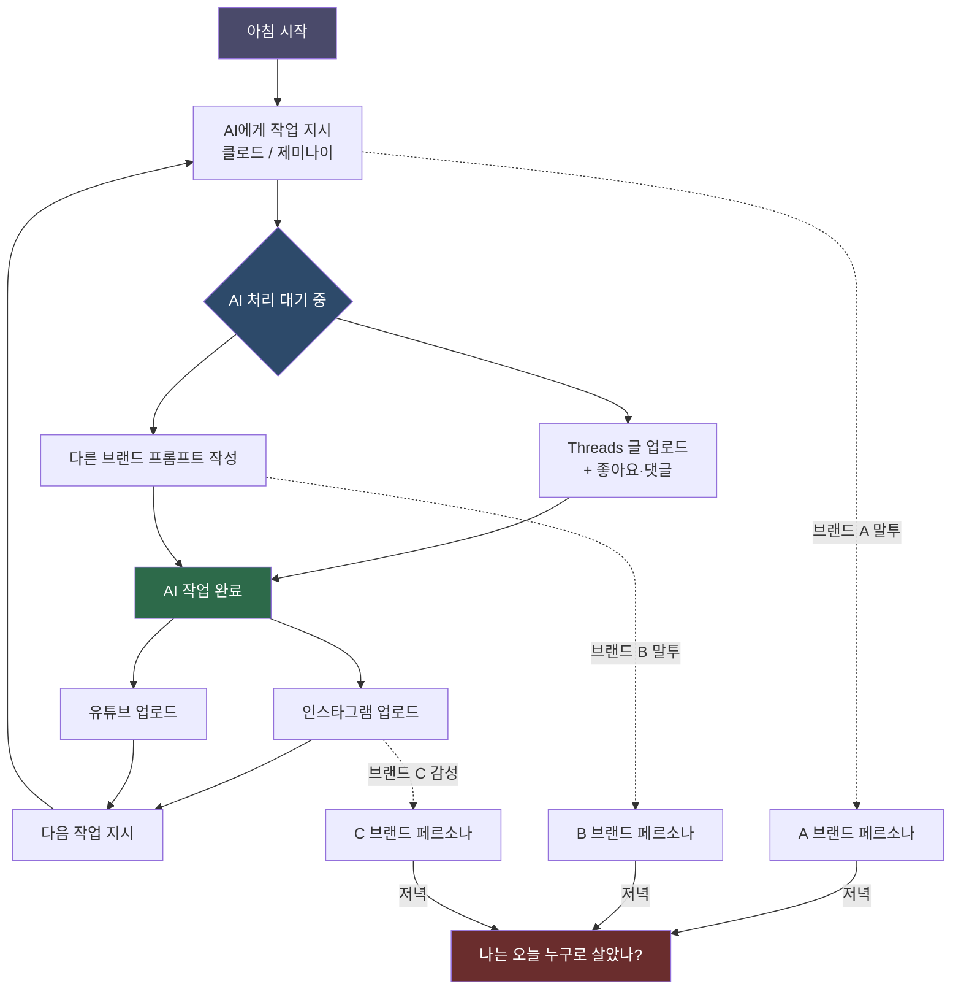
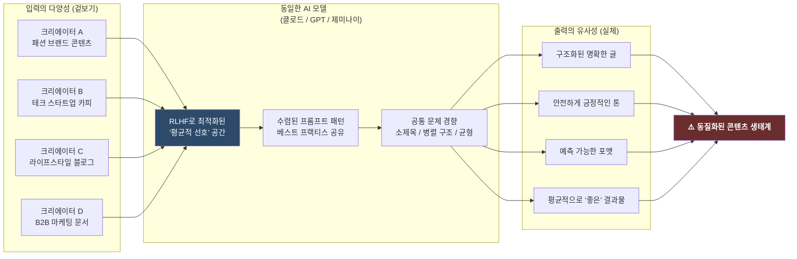
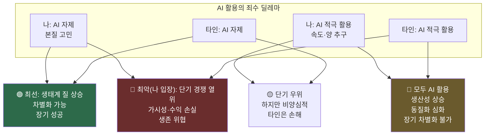
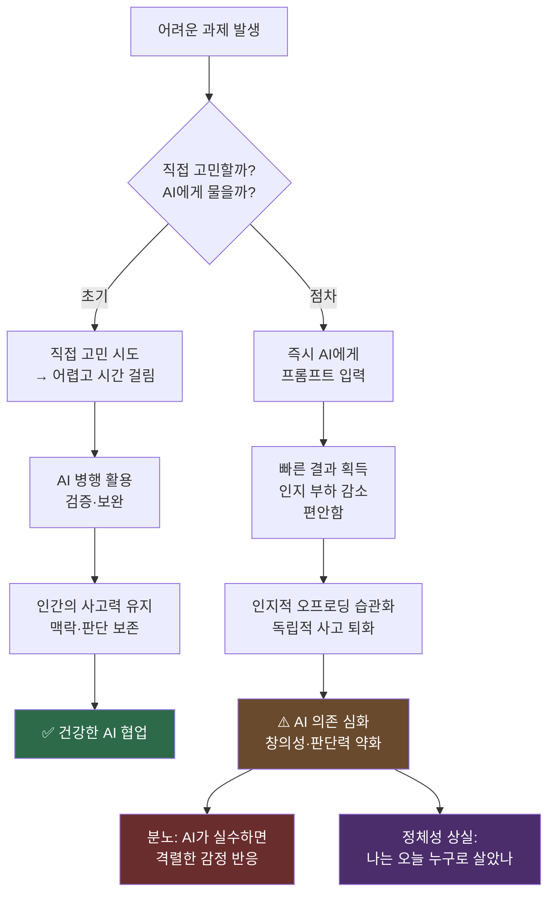

### [@eb.department](https://www.threads.com/@eb.department/post/DXZZXdJiWBf)의 Threads 포스트를 둘러싼 AI 시대의 창작 정체성 위기

> *"AI가 무조건 정답이 아닌 걸 알고, 맹신하면 안 된다고 생각은 하지만 나도 모르게 일을 하다 보면 AI에게 화를 내는 모습을 보고 이미 중독 상태가 심한 거 같다는 생각이 든다."*
> — @eb.department, Threads 포스트 중

---

## 들어가며: 이 포스트가 왜 중요한가

이 짧은 Threads 포스트는 표면적으로는 한 크리에이터의 일상 고백처럼 보인다. 하루 12시간을 AI와 함께 보내고, 사람과는 거의 말을 안 하고, 집에 누우면 "나는 하루 종일 누구로 산 건지" 모르겠다는 이야기. 그런데 이 고백 안에는 2024~2025년을 살아가는 AI 활용 크리에이터, 마케터, 개발자, 지식 노동자 모두가 언젠가 한 번쯤 스치는 실존적 질문들이 밀도 높게 압축되어 있다.

**AI는 우리를 더 독특하게 만드는가, 아니면 더 똑같게 만드는가?**
**도구를 빠르게 많이 쓰는 사람이 이기는가, 아니면 도구를 쓰지 않고 본질을 고민하는 사람이 이기는가?**
**AI 중독이란 무엇이며, 우리는 이미 그 안에 있는가?**

이 글은 그 질문들을 하나씩 펼쳐보는 해설이자 분석이다.

---

## 1부: 하루 12시간, AI와의 공생 또는 공의존

### 1.1 묘사된 하루의 구조

포스트의 첫 문단은 한 인물의 하루를 매우 구체적으로 그려낸다. 클로드나 제미나이에게 일을 시켜놓고, 그 대기 시간에 Threads에 글을 올리고, 좋아요와 댓글을 처리하고, 작업이 끝나면 인스타그램과 유튜브에 업로드한다. 이 과정이 일주일 내내 반복된다.

이것은 단순히 "AI를 잘 활용하는 크리에이터의 효율적인 하루"가 아니다. 이 구조를 가만히 들여다보면, **인간의 의식과 집중력이 AI의 처리 속도에 종속되어 있다**는 사실이 보인다. AI가 생성하는 시간이 곧 인간의 자유 시간이 되고, AI가 완료하면 인간이 다시 업로드 작업을 위해 대기 상태에서 깨어난다. 인간이 AI를 부리는 게 아니라, AI의 사이클에 인간이 맞춰 살아가는 역전된 구조다.

이 패턴은 경제학에서 말하는 **"보완적 노동(complementary labor)"** 의 극단적 형태와 닮아 있다. AI가 고난도 생성 작업을 담당하고, 인간은 업로드·모니터링·소통이라는 저급 반복 작업을 채운다. 표면적으로는 생산성이 올라간 것처럼 보이지만, 실제로는 인간이 수행하는 작업의 질이 떨어진 것일 수 있다.

### 1.2 브랜드 페르소나 다중 분열과 정체성의 희석

더 심각한 문제는 "브랜드마다 말투나 콘셉트가 다 다르기 때문에" 나타나는 자아 분열이다. 현대 디지털 마케터나 프리랜서 크리에이터는 종종 여러 브랜드의 목소리를 동시에 운영한다. A 브랜드는 친근하고 유머러스한 MZ 감성, B 브랜드는 고급스럽고 절제된 럭셔리 톤, C 브랜드는 정보 중심의 전문가적 어조.

과거에는 이 전환이 어느 정도 시간과 노력을 요구했기 때문에 자연스러운 "모드 전환" 시간이 있었다. 그런데 AI는 이 전환을 즉각적으로 가능하게 만들었다. 프롬프트 하나로 말투를 바꾸고, 프롬프트 하나로 브랜드를 교체한다. 이 속도는 **자아가 하나의 페르소나에 정착하고 소화할 시간 자체를 박탈한다.**

"집에 누우면 현타가 올 때도 있다. 나는 하루 종일 누구로 산 건지도 모르겠다"는 고백은 임상 심리학에서 말하는 **역할 과부하(role overload)** 와 **자아 고갈(ego depletion)** 의 증상과 정확히 맞닿는다. 자아는 무한히 유연하지 않다. 여러 목소리를 동시에 수행하면서도 자신의 목소리를 유지하려면 엄청난 내면의 에너지가 소모된다. AI가 생산성은 높였지만, 그 생산성의 대가를 치르고 있는 것은 인간의 자아다.

---

## 2부: 동질화의 역설 — 모두가 클로드를 쓰면 결국 다 똑같아지는가

### 2.1 포스트의 핵심 질문

이 포스트에서 가장 날카롭고 철학적인 지점은 공유 오피스 장면이다. "공유 오피스에 출근하면 사람들 모두 다 클로드로 작업하는 모습을 보는데, 각자 다른 걸 하고 있고, 만들어내는 것도 다르겠지만 결국 세상을 돌고 돌아 어딘가 모인다고 가정해보면 모두가 다 똑똑한 척을 하면서 다 똑같은 걸 만들고 있지 않을까."

이것은 단순한 불안이 아니라 매우 정교하게 구성된 통찰이다. **입력의 다양성이 출력의 다양성을 보장하지 않는다**는 명제를 경험으로부터 귀납한 것이다.

### 2.2 왜 AI는 동질화를 촉진하는가: 구조적 분석

#### 2.2.1 RLHF와 평균적 선호의 수렴

클로드, GPT-4o, 제미나이 같은 대형 언어 모델은 인간 피드백 강화학습(RLHF, Reinforcement Learning from Human Feedback)으로 훈련된다. 이 과정에서 모델은 인간 평가자들이 "좋다"고 평가한 응답 방향으로 계속 조정된다. 문제는 이 평가자들의 선호 자체가 특정 문화권, 특정 교육 배경, 특정 미적 기준에 편향되어 있다는 것이다.

결과적으로 AI는 **"인간이 평균적으로 좋아하는 것"** 을 잘 생성하도록 최적화된다. 이것은 창의성의 정의 — 예상을 벗어나는 것, 기존 범주를 파괴하는 것 — 와 근본적으로 충돌한다. AI가 생성하는 콘텐츠는 대체로 읽기 편하고, 구조가 명확하고, 위협적이지 않다. 즉, **안전하게 평균적이다.**

#### 2.2.2 프롬프트 수렴 현상

같은 도구를 쓰는 사람들은 점차 비슷한 프롬프트 패턴을 수렴하게 된다. "~처럼 써줘", "~톤으로", "~형식으로" 같은 표준화된 지시어들이 커뮤니티에서 공유되고, 좋은 프롬프트가 바이럴되면서 많은 사람들이 동일한 프롬프트 구조를 사용한다. 동일한 모델 + 동일한 프롬프트 패턴 = 통계적으로 유사한 출력이라는 결론은 거의 필연적이다.

#### 2.2.3 문체의 AI화(AIification of Style)

AI가 생성한 텍스트에는 특유의 문체적 패턴이 있다. 과도한 소제목 사용, 3~5개의 핵심 포인트 구조, "결론적으로", "이러한 맥락에서", "중요한 것은" 같은 전환 표현들, 균형 잡힌 긍부정 병렬 구조. 이 패턴들이 대량의 콘텐츠에 침투하면서 인터넷 전체의 텍스트 스타일이 AI적으로 수렴하는 현상이 관찰되고 있다.

학계에서는 이를 **"모델 붕괴(Model Collapse)"** 라고 부르기도 한다. AI가 생성한 데이터로 다음 세대 AI를 훈련시키면 점점 다양성이 줄어들고 평균화된다는 이론이다. 이 메커니즘은 콘텐츠 생태계 전반에도 적용될 수 있다.

### 2.3 반론: AI도 차별화를 가능하게 한다

그러나 동질화론이 완전하지는 않다. 다른 관점도 존재한다.

**차별화는 프롬프트 너머에 있다.** AI가 출력하는 것은 재료(raw material)이고, 최종 결과물의 차별성은 그것을 어떻게 편집하고, 어떤 맥락에 배치하고, 어떤 경험과 연결시키느냐에 달려 있다. 레시피가 같아도 셰프마다 음식이 다른 것처럼, AI 출력이 같아도 최종 결과물은 다를 수 있다.

**그러나 현실에서는?** 포스트의 작성자가 정확히 포착한 것은 이 "편집"과 "맥락 설정" 단계도 AI에게 위임되고 있다는 사실이다. 프롬프트에 "이걸 어떤 맥락에 써야 해?" 라고 물어보고, "이거 어떻게 편집하면 좋아?"라고 물어본다면, 차별화의 마지막 보루마저 AI에게 넘겨주는 셈이다.

---

## 3부: 속도 대 본질 — 누가 결국 살아남는가

### 3.1 패러다임의 전환을 감지한 직관

"작년부터 너도나도 AI를 외칠 때는 빠르게, 많이 쓰는 사람이 성공할 거라고 생각했는데, 오히려 지금은 AI를 안 쓰고 오래 걸려도 본질에 대해 고민을 하는 사람이 더 빨리, 그리고 유일하게 성공하지 않을까 생각이 든다."

이 문장은 2024년 초의 AI 붐 담론과 2025년 초의 성숙 담론 사이의 전환을 정확히 포착하고 있다. 초기에는 AI 도구를 얼마나 빨리 채택하느냐가 경쟁 우위처럼 보였다. 그런데 모두가 동일한 도구에 접근 가능해진 순간, 도구 자체는 더 이상 경쟁 우위가 아니다. **도구가 상품화(commoditized)되면, 경쟁 우위는 다시 도구 사용자의 본질로 이동한다.**

### 3.2 경제학적 관점: 희소성의 역전

경제학에서 경쟁 우위는 희소한 자원에서 나온다. AI가 글쓰기, 코딩, 이미지 생성, 마케팅 카피 작성을 무한대로 공급하게 되면, 이것들의 희소성은 0에 수렴한다. 수요공급 법칙에 따르면 희소성이 없으면 가격도 없다.

그렇다면 AI 시대에 진정으로 희소한 것은 무엇인가?

- **진짜 경험에서 나온 관점**: AI는 경험하지 못한다. 고통, 실패, 성공, 관계, 질감 있는 삶의 순간들.
- **비선형적 통찰**: 논리적으로 연결되지 않는 두 개의 개념을 연결하는 창의적 도약. AI는 학습 데이터의 패턴 안에서 움직이기 때문에 진정한 비선형 도약은 어렵다.
- **신뢰와 관계**: 수년간 쌓아온 인간과 인간 사이의 신뢰는 AI가 생성할 수 없다.
- **맥락 특수한 판단**: 특정 조직, 특정 문화, 특정 관계에서만 의미 있는 판단.

포스트의 작성자가 직감적으로 느끼는 것은 바로 이것이다. "본질에 대한 고민"은 AI가 공급하지 못하는 것이고, 그것이 점점 더 가치 있어진다는 것.

### 3.3 그러나 "느리게 가는 것"의 실제적 어려움

이 통찰이 옳다 하더라도, 현실에서 AI를 쓰지 않는다는 결정은 엄청난 기회비용을 수반한다. 당장의 생산량, 당장의 가시성, 당장의 수익 면에서 AI 활용자에게 뒤처질 수 있다. "본질을 고민하는 사람이 결국 이긴다"는 명제는 장기적으로는 옳을 수 있지만, 장기가 오기 전에 시장에서 밀려날 수도 있다.

이것은 **"죄수의 딜레마(Prisoner's Dilemma)"** 의 변형이다. 모두가 AI를 자제하고 본질에 집중하면 콘텐츠 생태계 전체의 질이 올라가지만, 나 혼자 그렇게 하면 나만 손해다. 그래서 모두가 AI에 달려간다. 그 결과가 포스트가 묘사하는 공유 오피스 풍경이다.

---

## 4부: AI 중독 — 새로운 시대의 새로운 병리

### 4.1 "AI에게 화를 낸다"는 것의 의미

"AI가 실수하면 그렇게 화가 날 수 없다. 분명 편하고 내가 못하는 일들도 쉽게 해줘서 좋은데..."

이 부분은 단순한 불편함의 토로가 아니다. 이 현상을 해석하는 데는 두 가지 심리학적 프레임이 유용하다.

**첫째, 기대 불일치 이론(Expectation Disconfirmation Theory).** 우리는 도구에 대한 기대 수준을 경험을 통해 계속 조정한다. AI가 처음에는 놀라웠기 때문에 실수해도 "어쩔 수 없지"라는 관용이 있었다. 그러나 오래 쓸수록 기대 수준이 올라가고, 그 기대를 충족시키지 못하면 실망과 분노가 커진다. 이것은 AI에 대한 **의존도가 높아졌다는 직접적인 신호**다.

**둘째, 도구의 의인화(Anthropomorphization).** "사람한테는 기대가 없어서 화도 안 나지만 AI가 실수하면 화가 난다"는 문장은 매우 중요한 심리적 역전을 보여준다. AI에게는 화를 내는데 사람에게는 화를 안 낸다면, 인간은 이미 AI를 하나의 관계 대상으로 인식하기 시작한 것이다. AI에게 감정적으로 투자하고 있는 것이다.

### 4.2 AI 중독의 구조적 특성

일반적인 기술 중독 — 소셜미디어, 게임, 스마트폰 — 과 AI 중독의 차이는 무엇인가?

기존 기술 중독은 주로 **도파민 보상 메커니즘**을 활용한다. 좋아요, 알림, 레벨업. 이것들은 간헐적 강화(intermittent reinforcement)로 설계된 중독 패턴이다.

AI 중독은 다르다. AI는 **인지적 오프로딩(cognitive offloading)** 을 제공한다. 어려운 생각, 복잡한 글쓰기, 코드 작성, 의사결정을 AI에게 넘기는 순간, 뇌는 그 부하를 덜고 편안해진다. 이 편안함이 반복되면, 뇌는 점점 더 그 부하를 스스로 감당하는 능력을 잃어간다. **쓰지 않으면 퇴화한다(use it or lose it)** 는 신경학적 원리가 여기에 적용된다.

포스트에서 "고민을 하지 않고 무작정 프롬프트에 뭐라도 적고 빨리 만들어내는 모습이 이게 맞나 싶다"는 자기 비판이 바로 이 인지적 오프로딩의 자각이다. 생각이 필요한 순간에 생각을 하지 않고 즉각 AI에게 넘기는 패턴이 고착화되고 있음을 느끼는 것이다.

### 4.3 "이미 중독 상태가 심한 것 같다"는 자기 진단의 아이러니

흥미로운 것은, 작성자가 이 모든 것을 인식하고 있다는 점이다. 중독과 자각이 동시에 존재한다. 이것은 중독의 일반적인 특성이기도 하다 — 술이 문제인 줄 알면서도 마시는 것처럼.

그런데 여기에는 한 층의 아이러니가 더 있다. **이 글을 쓰는 것도, 이 글을 읽고 분석하는 것도, 어쩌면 AI의 도움을 받았을 수 있다.** AI에 대한 비판을 AI로 정리하고, AI 중독에 대한 고민을 AI에게 털어놓는 구조. 이것이 포스트 마지막 문장이 말하는 "참으로 아이러니한 세상"의 핵심이다.

---

## 5부: 더 넓은 맥락 — 사회적·철학적 함의

### 5.1 창작 생태계의 구조 변화

이 포스트가 제기하는 문제는 개인의 심리적 문제를 넘어 창작 생태계 전체의 구조 변화와 연결된다.

콘텐츠 시장은 오랫동안 **공급이 수요를 초과하는 시장**이었다. AI는 이 공급 과잉을 극단으로 밀어붙이고 있다. 하루에 생성되는 텍스트, 이미지, 비디오의 양이 기하급수적으로 늘어나면서, 소비자의 주의(attention)는 점점 더 희소한 자원이 된다.

이 상황에서 살아남는 콘텐츠는 두 가지 극단에 위치할 가능성이 높다.

**극단 1: 완전한 자동화 콘텐츠.** 완벽하게 최적화되고, A/B 테스트로 검증되고, 알고리즘에 최대화된 콘텐츠. 인간이 없어도 생산되고 소비되는 콘텐츠.

**극단 2: 완전히 인간적인 콘텐츠.** 작가의 고유한 경험, 실수, 취약성, 비선형적 사고, 살아있는 관계에서 나온 콘텐츠. AI가 흉내 낼 수 없는 진정성.

중간 지점 — AI로 빠르게 만들었지만 "그래도 약간 다르게" — 은 점점 경쟁이 어려워질 것이다. 이것이 포스트가 직감하는 "본질을 고민하는 사람이 유일하게 성공한다"는 명제의 구조적 근거다.

### 5.2 사람과의 대화 단절: 사회적 자본의 침식

"주중에는 사람이랑 대화를 안 하는 거 같다. 대화도 아니고 말 자체를 안 하는 거 같다."

이 문장은 생산성 이야기가 아니다. 이것은 **사회적 자본(social capital)** 의 이야기다. 인간은 언어적 사회적 동물이다. 대화를 통해 사고를 조율하고, 감정을 조절하고, 현실 감각을 유지한다. AI와의 대화는 이 기능을 어느 정도 대체할 수 있지만, 완전히 대체할 수는 없다.

AI와의 대화에는 결정적으로 부재하는 것이 있다. **상호 취약성(mutual vulnerability)** 이다. 인간 대화에서 상대방도 실수하고, 감정을 드러내고, 예상치 못한 방향으로 흘러간다. 이 불확실성이 진짜 관계를 만든다. AI는 항상 대답하고, 항상 도움이 되려 하고, 절대 먼저 지치지 않는다. 이것은 편리하지만 동시에 **진짜 관계의 마찰을 제거해버린다.**

장기적으로 사람과의 대화 단절은 공감 능력, 사회적 직관, 비언어적 소통 능력의 퇴화로 이어질 수 있다. 이것은 AI 시대의 새로운 사회적 위험이다.

### 5.3 "현실인지 가상인지 구분이 안 갈 지경"의 철학적 함의

이 표현은 흥미롭게도 철학적 전통과 연결된다. 장자의 호접지몽(胡蝶之夢) — 나비 꿈을 꾸는 것인지, 나비가 인간 꿈을 꾸는 것인지 모르는 상태. 보드리야르의 시뮬라크르(Simulacra) — 실재보다 더 실재 같은 가상이 실재를 대체하는 현상.

AI와 함께하는 하루는 점점 AI가 만들어내는 출력물의 세계 속에서 진행된다. 브랜드의 세계, 콘텐츠의 세계, 알고리즘의 세계. 그 속에서 "나"의 실제 경험과 감각은 점점 얇아진다. 현실과 가상의 경계가 흐릿해지는 것은 과장이 아니라 이 구조가 만들어내는 자연스러운 결과다.

---

## 6부: 무엇을 해야 하는가 — 실천적 제언

포스트는 질문을 제기하지 해답을 제시하지는 않는다. 그것이 이 글의 솔직함이다. 그렇다면 이 상황에서 어떤 대응이 가능한가?

### 6.1 AI 사용의 의도적 구조화

무의식적 AI 사용을 의식적 AI 사용으로 전환하는 것이 첫 번째 단계다. 이것은 AI를 덜 쓰는 게 아니라, **어떤 작업에 AI를 쓰고 어떤 작업은 직접 하는지를 명시적으로 설계하는 것**이다.

예를 들어, "아이디어 발상 단계는 반드시 종이에 직접 쓴다. AI는 발상 이후 정제 단계에만 투입한다"는 식의 워크플로우 설계. 또는 "한 주에 하루는 AI 없이 작업하는 날로 설정한다"는 식의 의도적 단절.

### 6.2 고유 경험의 적극적 수집

AI가 공급하지 못하는 것을 의식적으로 쌓는 것이다. 직접 경험, 실패, 비효율적인 탐색, 사람과의 진짜 대화. 이것들이 AI로 만든 콘텐츠를 차별화하는 원천이 된다. 생산성보다 경험 밀도를 높이는 방향으로의 의도적 투자.

### 6.3 페르소나 전환 사이의 의례(Ritual) 설계

브랜드 간 전환 시 짧더라도 자신만의 "모드 전환 의례"를 두는 것이 정체성 유지에 도움이 된다. 예를 들어 5분의 독서, 짧은 산책, 물 한 잔, 일기 한 줄. 자아가 정착하고 숨 쉴 수 있는 작은 공간을 만드는 것이다.

### 6.4 AI와의 관계를 도구 관계로 재정의

AI에게 분노한다는 것은 AI와의 관계가 도구-사용자 관계를 넘어섰다는 신호다. "AI는 도구이고 도구는 실수할 수 있다"는 인식을 의식적으로 유지하는 것이 필요하다. 동시에, AI가 실수할 때 그 실수를 어떻게 수정할 것인지를 자신이 직접 판단하는 능력을 유지하는 것이 중요하다.

---

## 결론: 아이러니를 인식하는 것 자체가 출발점

포스트의 마지막 문장 — "참으로 아이러니한 세상" — 은 냉소적이지 않다. 오히려 이 아이러니를 직시하고 언어로 표현할 수 있다는 것 자체가, 아직 인간으로서의 성찰 능력이 살아있다는 증거다.

AI가 만들어내는 동질화, AI 중독, 정체성의 희석, 사람과의 대화 단절 — 이 모든 것은 AI 기술 자체의 문제가 아니다. 이것은 강력한 도구를 손에 넣은 인간이, 그 도구를 어떻게 다루어야 할지 아직 사회적·개인적 지혜를 충분히 쌓지 못한 상태에서 겪는 성장통이다.

AI 시대에 살아남는 것은 AI를 가장 많이 쓰는 사람도 아니고, AI를 전혀 안 쓰는 사람도 아닐 것이다. **AI와의 관계를 가장 의식적으로 설계하는 사람**이 살아남을 것이다.

그것은 언제 AI를 믿고, 언제 AI를 의심하고, 언제 AI를 끄고 자신의 뇌로 생각해야 하는지를 아는 것이다. 그리고 그 지혜는 AI가 줄 수 없다. 인간이 직접 경험으로 쌓아야 한다.

---

## 참고: 관련 개념 용어 정리

| 개념 | 설명 |
|------|------|
| **RLHF** (Reinforcement Learning from Human Feedback) | 인간 평가자의 선호로 AI를 훈련시키는 방법. 평균적 선호로의 수렴을 유발할 수 있음 |
| **모델 붕괴 (Model Collapse)** | AI 생성 데이터로 다음 세대 AI를 훈련할 때 다양성이 줄어드는 현상 |
| **인지적 오프로딩 (Cognitive Offloading)** | 인지 작업을 외부 도구(AI 포함)에 위임하는 행동. 반복 시 자립적 사고력 저하 위험 |
| **자아 고갈 (Ego Depletion)** | 자기 조절 에너지가 소진되는 상태. 다중 페르소나 운영 시 가속화 |
| **역할 과부하 (Role Overload)** | 요구되는 역할이 개인이 감당할 수 있는 수준을 초과하는 상태 |
| **사회적 자본 (Social Capital)** | 사회적 관계와 신뢰에서 생성되는 자원. AI 의존 심화 시 침식 위험 |
| **시뮬라크르 (Simulacra)** | 원본 없는 복사본, 또는 실재를 대체하는 가상. 보드리야르의 개념 |
| **죄수의 딜레마** | 개인 합리성이 집단 최선을 달성하지 못하는 게임 이론적 상황 |

---

*작성: Claude AI (Anthropic) — 분석 기반: @eb.department의 Threads 포스트*
*작성일: 2026년 4월 22일*
