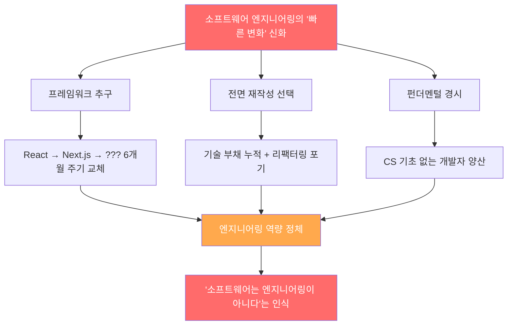
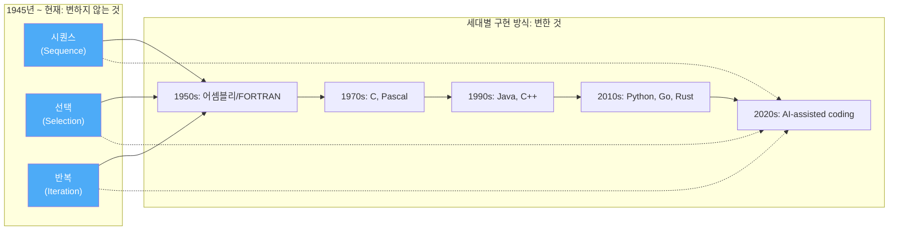
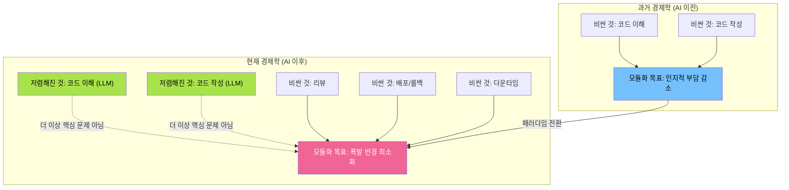
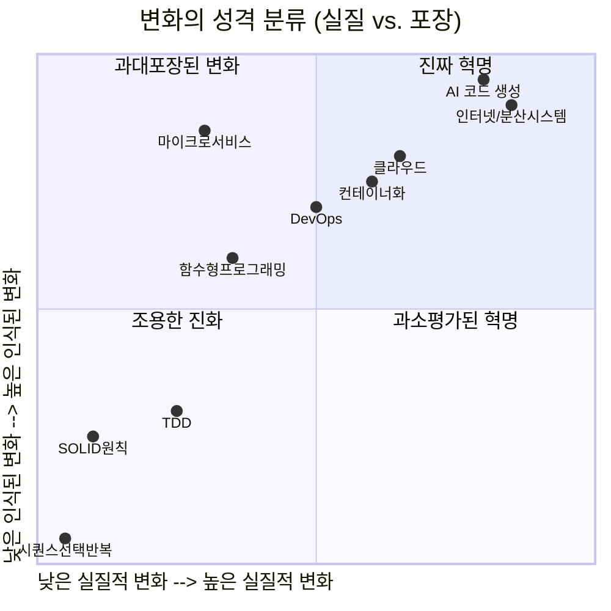
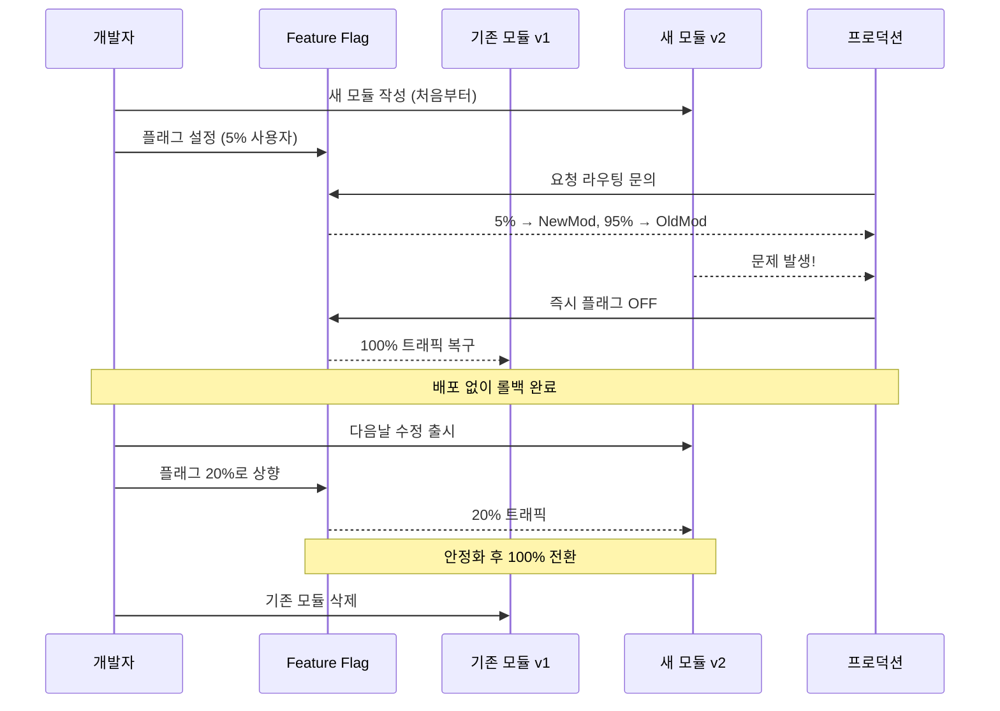
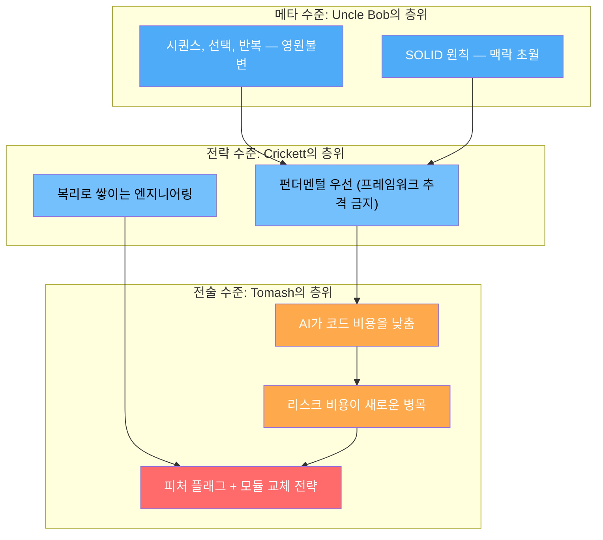

### — John Crickett, Uncle Bob Martin, Tomash의 트위터 논쟁 심층 분석

> **원본 스레드 날짜**: 2026년 4월 20일 전후  
> **참여자**: John Crickett ([@johncrickett](https://x.com/johncrickett/status/2046204735834013810)), Tomash ([@_tomash](https://x.com/_tomash/status/2046306417641181193)), Uncle Bob Martin ([@unclebobmartin](https://x.com/unclebobmartin/status/2046566984238731723))  
> **문서 작성일**: 2026-04-23

---

## 목차

1. [스레드 개요: 논쟁의 불씨](#1-스레드-개요-논쟁의-불씨)
2. [John Crickett의 도발적 주장: "소프트웨어 엔지니어링은 변하지 않는다"](#2-john-crickett의-도발적-주장)
3. [Uncle Bob Martin의 답변: "혁명 없는 점진적 진화"](#3-uncle-bob-martin의-답변)
4. [Tomash의 반론: "AI 시대, 모듈화의 지각 변동"](#4-tomash의-반론)
5. [소프트웨어 엔지니어링의 불변 원칙들](#5-소프트웨어-엔지니어링의-불변-원칙들)
6. [실제로 변한 것 vs. 리브랜딩된 것](#6-실제로-변한-것-vs-리브랜딩된-것)
7. [AI 시대의 모듈화 철학 — Tomash 블로그 상세 분석](#7-ai-시대의-모듈화-철학)
8. [세 관점의 종합: 무엇이 진실인가?](#8-세-관점의-종합)
9. [한국 소프트웨어 업계에 주는 함의](#9-한국-소프트웨어-업계에-주는-함의)
10. [결론](#10-결론)

---

## 1. 스레드 개요: 논쟁의 불씨

2026년 4월 20일, 소프트웨어 엔지니어링 커뮤니티에서 오래전부터 암묵적으로 공유되어 왔지만 공개적으로 말하기를 꺼렸던 불편한 진실 하나가 수면 위로 올라왔다. John Crickett이라는 개발자가 X(구 트위터)에 올린 한 문장이 발단이었다.

> *"소프트웨어 엔지니어링에서 가장 큰 거짓말은, 이 분야가 빠르게 변한다는 것이다. 나는 30년 동안 그것이 같은 자리에 머물러 있는 것을 지켜봤다."*

이 발언은 단순한 개인적 하소연이 아니었다. 수십 년의 현장 경험을 바탕으로 한 날카로운 관찰이었고, 소프트웨어 업계 전반이 공유하는 집단적 자기기만을 정면으로 겨냥한 것이었다. 이 트윗은 이후 Uncle Bob Martin(로버트 C. 마틴)과 Tomash라는 엔지니어의 반응을 이끌어내며 세 방향의 흥미로운 지적 대화를 만들어냈다.

이 문서는 그 대화를 중심으로, 소프트웨어 엔지니어링의 본질적 불변성과 진짜 변화, 그리고 AI 시대를 맞이한 업계의 패러다임 전환을 깊이 있게 분석한다.

---

## 2. John Crickett의 도발적 주장

### 2.1 인물 소개

John Crickett은 27년 이상의 소프트웨어 개발 경험을 보유한 엔지니어로, "실제 애플리케이션을 만들면서 소프트웨어 엔지니어를 더 나은 개발자로 성장시키는 것"을 미션으로 하는 Coding Challenges 뉴스레터를 운영하고 있다. 그는 개발자로서, 때로는 관리자로서, 때로는 창업가로서 다양한 역할을 수행해왔으며, 소프트웨어 엔지니어링의 현실을 냉철하게 바라보는 시각으로 잘 알려져 있다.

그가 이전에 LinkedIn에서도 유사한 발언을 한 적이 있다는 점은 주목할 만하다. "좋은 관행이 확인된 이후 그것이 주류가 되기까지는 20~40년의 지연이 있는 것 같다"는 그의 발언은 당시에도 상당한 공감을 얻었다.

### 2.2 핵심 주장의 구조

Crickett의 트윗 원문을 분해해 보면 다음과 같은 논리 구조가 드러난다.

**첫째, 실증적 관찰**: 수십 년 전에 나온 언어와 알고리즘을 우리는 여전히 사용하고 있다. 90년대에 이미 좋다고 알려졌던 관행들을 아직도 많은 팀이 채택하지 않고 있다. 심지어 AI를 구현하는 데에도 80년대 아이디어를 사용하고 있다.

**둘째, 신화의 해악성 고발**: "6개월마다 모든 것이 바뀐다"는 믿음은 단순히 틀린 것에 그치지 않고 실질적인 해악을 끼친다고 Crickett은 주장한다. 이 믿음 때문에 엔지니어들은 펀더멘털 대신 프레임워크를 쫓고, 팀은 리팩터링 대신 전면 재작성을 선택하며, 소프트웨어 개발이 진정한 "엔지니어링"이라는 주장 자체가 약화된다는 것이다.

**셋째, 대안적 관점 제시**: 진정한 엔지니어링은 "복리로 쌓인다". 과거 위에 새로운 것을 쌓아올리는 방식으로 발전하는 것이 공학의 본질이라는 주장이다. 그는 마지막으로 "지난 30년 동안 실제로 변한 것은 무엇이고, 그냥 리브랜딩된 것은 무엇인가?"라는 질문을 던진다.

### 2.3 이 주장이 설득력 있는 이유

Crickett의 주장이 공감을 얻는 이유는 관찰 자체가 사실에 기반하기 때문이다. C 언어는 1972년에 탄생했지만 여전히 임베디드 시스템, 운영체제, 고성능 컴퓨팅의 핵심이다. SQL은 1974년 개념이 정립되었지만 반세기가 지난 지금도 데이터 관리의 표준이다. TDD(테스트 주도 개발)는 1990년대에 확립된 개념이지만 대부분의 팀이 아직도 제대로 실천하지 않는다. SOLID 원칙은 2000년대 초 정리되었지만 여전히 "새로 배워야 할 것"으로 소개된다.

---

## 3. Uncle Bob Martin의 답변

### 3.1 인물 소개

로버트 C. 마틴, 흔히 "Uncle Bob"이라 불리는 그는 1952년생으로, 17세부터 소프트웨어 업계에 입문한 살아있는 전설이다. 애자일 선언문의 공동 저자이자, Clean Code, Clean Architecture, The Clean Coder 등 소프트웨어 공학의 고전을 여러 권 저술했다. 그의 관점은 반세기가 넘는 실제 경험에서 나온 것으로, 소프트웨어 펀더멘털에 대한 그의 집착은 이 스레드에서도 여실히 드러난다.

### 3.2 Uncle Bob의 답변 원문과 분석

Uncle Bob은 Crickett의 트윗에 이렇게 답했다.

> *"매우 사실입니다. 도구는 혁명적인 방식으로 변했지만, 소프트웨어 엔지니어링은 혁명 없이 학문으로서 점진적으로 진화해 왔습니다. 소프트웨어 설계와 소프트웨어 아키텍처의 원칙은 시대, 플랫폼, 응용 프로그램, 하드웨어에 관계없이 동일합니다. 그리고 그것은 결국, 소프트웨어가 시퀀스(sequence), 선택(selection), 반복(iteration) 그 이상도 이하도 아니기 때문입니다."*

이 답변의 핵심은 명확한 이분법이다. Uncle Bob은 **도구(Tools)** 와 **학문(Discipline)** 을 구별한다. 도구는 혁명적으로 변했다는 것을 인정하되, 소프트웨어 엔지니어링이라는 학문의 원칙은 그대로라는 것이다.

### 3.3 "시퀀스, 선택, 반복"의 철학적 함의

Uncle Bob이 즐겨 인용하는 이 세 가지 개념은 단순한 프로그래밍 기초를 넘어 소프트웨어의 존재론적 본질을 지시한다. 이 개념의 뿌리는 1945년 앨런 튜링의 이론까지 거슬러 올라가며, 80년 가까이 지난 지금도 유효하다.

그의 블로그에서 그는 반복적으로 같은 주장을 한다. "소프트웨어 펀더멘털은 1945년 이래 변하지 않았다 — 여전히 시퀀스, 선택, 반복이다." SOLID 원칙이 구식이라는 비판에 대해서도 그는 같은 논리로 반박한다. 각 세대는 자신의 기술적 맥락이 선대와 근본적으로 다르다고 착각하지만, 그것은 착각일 뿐이라는 것이다.

Uncle Bob의 관점에서 보면, JavaScript가 TypeScript가 되고, 모놀리스가 마이크로서비스가 되고, REST가 GraphQL이 되는 모든 변화는 본질적으로 같은 세 가지 원소의 새로운 포장일 뿐이다.

### 3.4 SOLID 원칙의 시간적 불변성

Uncle Bob은 SOLID 원칙이 마이크로서비스 시대에도, 함수형 프로그래밍 시대에도, 그리고 AI 코드 생성 시대에도 여전히 유효하다고 주장한다. Clean Code Fundamentals 시리즈는 2026년 4월에도 업데이트되어 계속 발행되고 있다는 사실이 이 주장의 실증적 증거이기도 하다.

그가 특히 강조하는 것은, 마이크로서비스의 등장이 OOP를 무력화하지 않는다는 점이다. 상속의 사용이 줄었다는 것이 객체지향의 원칙 자체가 틀렸다는 의미가 아니며, 함수형 언어에서도 코드의 응집성(cohesion)이라는 원칙은 동일하게 적용된다는 논리다.

---

## 4. Tomash의 반론

### 4.1 인물 소개와 맥락

Tomash(@_tomash)는 EverAI에서 일하는 엔지니어로, 폴란드 브로츠와프 기반이다. 그는 이 트위터 논쟁을 보고 전날 자신이 작성한 블로그 포스트를 공유했다. 제목은 **"Let It Slop: A New Approach to Modularity in the Age of AI Code Generation"** — AI 코드 생성 시대에 맞는 모듈화의 새로운 접근법이었다.

Tomash의 입장은 Crickett이나 Uncle Bob처럼 "소프트웨어 엔지니어링의 본질은 변하지 않는다"는 것도, 반대로 "모든 것이 빠르게 변한다"는 것도 아니다. 그는 훨씬 더 구체적이고 흥미로운 주장을 한다. **AI로 인해 소프트웨어 공학의 경제학적 전제가 뒤집혔으며, 이것이 모듈화 철학의 근본적 변화를 요구한다**는 것이다.

### 4.2 Tomash의 핵심 주장: 경제학의 역전

Tomash의 논문은 다음과 같은 관찰에서 시작한다.

대부분의 엔지니어링 팀에는 현재 큰 인지 부조화가 존재한다. 한편으로는 거의 모든 사람이 LLM을 사용해 이전보다 빠르게 코드를 작성하고 있다. 다른 한편으로, 그 코드를 구조화하는 방식 — 모듈화 철학, 좋은 설계에 대한 직관 — 은 움직이지 않고 있다. 우리는 특정한 제약과 경제학 속에서 발전된 사고방식을 완전히 다른 제약과 경제학의 세계에 적용하려 하고 있다는 것이다.

**70년간의 모듈화 역사를 관통하는 공통 질문**은 언제나 두 가지였다.

- *어떻게 코드를 이해하는 비용을 낮출 것인가?*
- *어떻게 코드를 작성하는 비용을 낮출 것인가?*

그런데 Tomash의 핵심 주장은 이것이다. **이 두 가지가 이제 더 이상 비싸지 않다.** LLM은 패턴 인식(코드 읽기와 이해)과 패턴 재현(코드 쓰기)을 매우 잘 한다. 이것이 7십 년에 걸친 소프트웨어 엔지니어링 혁신을 이끌어온 두 가지 인지적 과업이 이제 사실상 공짜가 되었다는 의미다.

**그렇다면 지금 비싼 것은 무엇인가?**

Tomash는 네 가지를 꼽는다.

1. **리뷰(Reviewing)**: 인간이 코드를 보고 출시해도 안전한지 판단하는 것. 시간과 집중력이 필요하다.
2. **배포(Shipping)**: 배포 파이프라인, 조율, 타이밍, 위험 관리.
3. **롤백(Reverting)**: 프로덕션에서 문제가 생겼을 때 변경사항을 되돌리는 것. 특히 변경이 복잡하게 얽혀 있으면 매우 비싸다.
4. **다운타임(Downtime)**: 이것이 가장 크다. 프로덕션 장애는 엔지니어 시간뿐 아니라 사용자 영향, 신뢰, 수익에까지 직결된다.

---

## 5. 소프트웨어 엔지니어링의 불변 원칙들

Uncle Bob과 Crickett의 논의를 바탕으로, 지난 수십 년간 실제로 변하지 않은 것들을 체계적으로 정리해보자.

### 5.1 70년간 변하지 않은 모듈화의 역사

Tomash는 그의 블로그에서 모듈화의 역사를 명쾌하게 정리한다. 이것은 변하지 않는 것의 증거이기도 하고, 동시에 지금 변화가 시작되고 있다는 주장의 근거이기도 하다.

**1950~60년대, 서브루틴과 라이브러리**: 매크로 어셈블러부터 FORTRAN, COBOL에 이르기까지, 우리는 논리의 단위에 이름을 붙이고 호출하는 법을 배웠다. 서브루틴이 최초의 "블랙박스"였다.

**1960년대 후반, 구조적 프로그래밍**: 다이크스트라의 GOTO 반대 논쟁은 본질적으로 가독성에 관한 것이었다. 인간의 뇌가 따라갈 수 있는 코드 흐름이 인간의 뇌가 추론할 수 있는 코드다.

**1970년대, 정보 은닉(Information Hiding)**: 데이비드 파르나스는 아직도 저평가된 무언가를 명확히 했다. 모듈의 올바른 경계는 그것이 무엇을 하느냐가 아니라 무엇을 숨기느냐에 있다는 것이다.

**1970~80년대, 추상 데이터 타입과 객체**: 리스코프, 스몰토크, C++. 우리는 데이터와 행동을 현실 세계 개념에 매핑되는 인지적 단위로 묶었다.

**1990~2000년대, 인터페이스, 패턴, 패키지 매니저**: 시스템 부품들 간의 계약, 재사용 가능한 솔루션 모양, 그리고 오픈소스를 통한 문명적 규모의 모듈화.

**2010년대~현재, 마이크로서비스와 현대 모듈 시스템**: 엄격한 경계 강화, 명시적 내보내기와 가져오기, 기술적 격리 위의 조직적 격리.

이 모든 것을 관통하는 것은 언제나 같은 두 가지 질문이었다. "어떻게 코드를 더 싸게 이해할 것인가? 어떻게 코드를 더 싸게 쓸 것인가?"

### 5.2 Uncle Bob의 "1945년 이래 변하지 않은 것"

Uncle Bob은 더 나아가 소프트웨어의 본질적 토대 자체가 1945년 이래 변하지 않았다고 주장한다.

- **시퀀스(Sequence)**: 명령들이 순서대로 실행된다.
- **선택(Selection)**: 조건에 따라 다른 경로를 택한다.
- **반복(Iteration)**: 조건이 충족될 때까지 같은 일을 반복한다.

어셈블리에서도, C에서도, Java에서도, Python에서도, 그리고 AI가 생성한 코드에서도, 이 세 가지는 항상 존재한다. 인터넷이 생겨도, 클라우드가 생겨도, 모바일이 생겨도, LLM이 생겨도, 소프트웨어의 원자는 이 셋이다.

### 5.3 90년대에 알았지만 아직 안 하는 것들

Crickett이 지적한 "90년대에 이미 좋다고 알았던 관행들"을 구체적으로 나열해보면 다음과 같다.

TDD(테스트 주도 개발)는 켄트 벡이 1990년대에 개념화하고 2002년 책으로 정리했지만, 여전히 대부분의 팀이 반쪽짜리로만 실천하거나 아예 하지 않는다. 지속적 통합(CI)은 2000년대 초 애자일 운동과 함께 강조되었지만, "CI 도구는 있지만 CI 문화는 없는" 팀이 아직도 많다. 코드 리뷰는 오래전부터 효과가 검증되었지만, 형식적 체크박스 용도로만 하는 팀이 여전히 다수다. 페어 프로그래밍은 XP(익스트림 프로그래밍)에서 강조되었지만 "시간 낭비"라는 인식이 여전히 팽배하다.

---

## 6. 실제로 변한 것 vs. 리브랜딩된 것

Crickett의 마지막 질문 — "지난 30년 동안 실제로 변한 것은 무엇이고, 리브랜딩된 것은 무엇인가?" — 에 답해보자.

### 6.1 진짜 변한 것들

**하드웨어 성능**: 무어의 법칙에 따라 컴퓨팅 파워는 기하급수적으로 증가했다. 이는 이전에는 불가능했던 소프트웨어를 가능하게 했다.

**네트워크와 분산 시스템**: 인터넷의 보급은 소프트웨어 아키텍처에 진정한 혁명을 일으켰다. CAP 정리, 분산 트랜잭션, 결과적 일관성(Eventual Consistency) 등은 이전에 없던 새로운 문제들이다.

**오픈소스 생태계의 규모**: 패키지 매니저(npm, pip, Maven)를 통한 코드 재사용의 규모는 전례가 없다.

**AI 보조 개발**: LLM이 코드를 생성하는 시대는 진정한 새로움이다. 이것이 Tomash가 분석하는 핵심이다.

**DevOps 문화**: CI/CD 파이프라인의 자동화, 인프라 코드화(IaC), 컨테이너화는 배포의 본질을 바꿔놓았다.

### 6.2 리브랜딩된 것들

**마이크로서비스 = 컴포넌트 기반 설계**: 마이크로서비스는 1990년대부터 논의된 컴포넌트 기반 설계의 현대적 버전에 가깝다. "서비스를 작게 나눠라"는 원칙은 UNIX 철학("하나의 일을 잘 하라")과 본질적으로 같다.

**DevOps = 협업 문화**: DevOps의 근간은 개발과 운영의 협업인데, 이는 애자일 선언문에서 이미 강조했던 것이다.

**리액티브 프로그래밍 = 이벤트 드리븐 설계**: 이벤트 중심 아키텍처는 GUI 프로그래밍에서 1980년대부터 있었던 패턴이다.

**NoSQL = 다형적 데이터 저장**: "스키마 없는" 데이터베이스는 새롭지만, 다양한 데이터 구조를 다루는 문제 자체는 오래된 것이다.

**클라우드 네이티브 = 분산 시스템 + SaaS**: 클라우드가 제공하는 것들은 대부분 이전에도 존재했던 것들의 서비스화(as-a-Service)다.

---

## 7. AI 시대의 모듈화 철학

Tomash의 블로그 포스트는 이 토론에서 가장 실천적이고 구체적인 주장을 담고 있다. 그는 AI 시대에 모듈화가 어떻게 달라져야 하는지를 실제 팀 경험(EverAI, 15명의 엔지니어, Rails 앱)을 바탕으로 제안한다.

### 7.1 새로운 모듈화 철학의 핵심 원칙

**원칙 1: 런타임 코드 경로 제어 (비타협적 요소)**

새로운 모듈화의 토대는 "어느 코드 경로로 진입할지 — 어느 버전의 모듈을 실행할지 — 는 배포 시점이 아니라 런타임에 결정된다"는 것이다. 이를 위한 도구가 피처 플래그(Feature Flag)다.

배포하지 않고 모듈을 끌 수 있다면, 그 모듈을 출시하는 것은 더 이상 두려운 사건이 아니다. "되돌리기의 비용"이 단순히 플래그 하나를 내리는 것으로 줄어든다. 되돌리기가 싸지면 더 빨리 출시할 수 있고, 더 빨리 출시하면 피드백을 더 빨리 얻는다.

**원칙 2: 업데이트가 아닌 새 모듈 작성**

전통적 엔지니어링 본능은 요구사항이 바뀌면 기존 모듈로 들어가 수정하고, 리팩터링하고, 추상화를 개선하는 것이었다. Tomash는 정반대를 제안한다. 요구사항이 충분히 바뀌면, 모듈을 처음부터 새로 작성하라는 것이다.

새 버전은 기존 버전과 나란히 존재한다. 런타임 코드 경로가 사용자를 새 버전으로 점진적으로 라우팅한다(처음에 5%, 그다음 20%, 그다음 전체). 자신감이 생기면, 기존 것을 삭제한다. 기존 모듈은 개선되지 않는다. 교체된다.

**원칙 3: 모듈 간 내부 공유 금지**

모듈들이 공통 헬퍼를 공유하면 결합도가 다시 생긴다. 모든 공유 추상화는 의존성이며, 두 모듈이 같은 헬퍼를 임포트하면 그 헬퍼를 바꿀 때 두 모듈 모두 바뀐다. 모듈 간의 중복은 독립적 교체 가능성의 대가이며, 오늘날 코드 작성 비용을 고려하면 저렴한 대가다.

**원칙 4: 리뷰 질문의 단순화**

리뷰 시 질문이 달라진다. "이 코드가 잘 만들어졌는가?" 대신 "이것이 망가지면, 다른 것을 건드리지 않고 끌 수 있는가?"

### 7.2 Erlang 철학과의 연결

Tomash가 자신의 접근법의 선례로 꼽는 것이 Erlang이다. 1980년대 후반 에릭슨에서 통신 인프라를 위해 설계된 Erlang은 전혀 다른 제약 조건에서 유사한 결론에 도달했다.

Erlang 철학의 핵심 요소들은 다음과 같다.

"크래시되게 두어라(Let it crash)": 모든 가능한 실패 상태에서 복구하려는 방어적 코드를 쓰지 말라. 실패하게 두되, 실패를 저렴하게 만들어라. 이것이 경솔해 보이지만 극히 현실적이다.

모듈은 런타임에 교체 가능하다. Erlang은 VM에 핫 코드 로딩이 내장되어 있다. 시스템이 실행되는 동안 모듈을 교체할 수 있다. 우리는 피처 플래그로 이것을 근사하고 있지만 원칙은 동일하다.

추상화보다 재작성을 선호하라. 오래 유지보수할 것이라는 가정 하에 일반화하고 추상화하는 본능이 생긴다. 유지보수하지 않고 교체할 것이라면, 그 추상화는 불필요한 오버헤드다.

에릭슨은 통신 시스템이 다운타임을 감당할 수 없었기 때문에 이런 결론에 이르렀다. Tomash의 팀은 AI가 재작성을 저렴하게 만들었기 때문에 비슷한 결론에 이른다. 출발점은 다르지만, 목적지는 닮아 있다.

### 7.3 불편한 결론들

Tomash는 자신의 철학이 초래하는 불편한 귀결들을 솔직하게 인정한다.

**리팩터링 본능이 안티패턴이 된다**: 좋은 엔지니어의 표식으로 여겨지던 것 — 기존 코드를 개선하고, 올바른 추상화를 추출하고, 더 깔끔하게 만드는 것 — 이 이 모델에서는 대개 잘못된 선택이다. 이것은 좋은 엔지니어에게 리팩터링을 멈추라고 요청하는 것인데, 목수에게 사포질을 멈추라고 말하는 것과 같다.

**자랑스럽지 않은 코드에 안전성을 지불한다**: AI가 생성한 코드는 종종 장황하고 반복적이며 약간 우아하지 않다. "슬롭(slop)을 받아들여라"는 것은 축하가 아니라 시간과 위험이 실제로 어디에 있는지에 대한 솔직한 회계다.

**모듈은 프로덕션에서 깨질 것이다**: 이것이 이 접근법의 실패가 아니라, 설계대로 작동하는 것이다. 플래그가 내려가고, 기존 버전이 인계받고, 다음 날 수정을 출시한다.

---

## 8. 세 관점의 종합

### 8.1 관점의 충돌과 보완

세 사람의 관점을 한 틀에 놓으면 흥미로운 그림이 나온다.

John Crickett은 "변화한다는 신화의 해악"에 초점을 맞추고 있다. 그는 프레임워크 추격이 아니라 펀더멘털로 돌아가야 한다고 주장한다. 그의 관점은 진단적이다.

Uncle Bob Martin은 "소프트웨어의 존재론적 불변성"을 강조한다. 도구는 변해도 원칙은 변하지 않는다는 것이다. 그의 관점은 철학적이고 규범적이다.

Tomash는 "AI가 경제학을 바꿨으며, 이것이 실천적 함의를 갖는다"고 주장한다. 그의 관점은 경험적이고 실용적이다.

이 세 관점이 서로 모순되는가? 반드시 그렇지는 않다.

Uncle Bob의 "시퀀스, 선택, 반복은 불변"이라는 주장과 Tomash의 "모듈화 경제학이 바뀌었다"는 주장은 서로 다른 층위를 이야기하고 있다. 전자는 소프트웨어의 원자론적 본질에 관한 것이고, 후자는 그 원자들을 어떻게 조합하는 것이 현명한가에 관한 것이다.

Crickett의 "펀더멘털로 돌아가라"는 주장과 Tomash의 "새 버전을 짜고 버려라"는 주장도 얼핏 충돌처럼 보이지만, 사실 Tomash의 접근법은 Erlang이라는 수십 년 된 펀더멘털에 뿌리를 두고 있다.

### 8.2 진짜 질문은 무엇인가?

이 논쟁이 우리에게 던지는 진짜 질문은 다음과 같이 정리할 수 있다.

**Q1. "소프트웨어 엔지니어링은 변하는가?"**

답: 본질적 원칙은 변하지 않는다. 도구, 경제학, 조직 패턴은 변한다. 이 두 가지를 혼동하는 것이 문제다.

**Q2. "AI가 소프트웨어 엔지니어링을 바꾸는가?"**

답: AI는 소프트웨어를 작성하고 이해하는 비용을 극적으로 낮춘다. 이것은 모듈화 철학의 경제적 토대를 바꾼다. 그러나 소프트웨어의 근본(시퀀스, 선택, 반복)은 바꾸지 않는다.

**Q3. "그렇다면 엔지니어로서 무엇을 배워야 하는가?"**

답: 펀더멘털(자료구조, 알고리즘, 설계 원칙, 분산 시스템)은 더욱 중요해진다. 동시에, AI가 만든 새로운 경제학 속에서의 리스크 관리, 피처 플래그 운영, 롤백 전략 같은 새로운 실천도 필요하다.

---

## 9. 한국 소프트웨어 업계에 주는 함의

### 9.1 "빠른 변화" 신화의 한국적 맥락

한국 소프트웨어 업계에서 "기술 스택의 빠른 변화"를 따라가야 한다는 압력은 특히 강하게 작동한다. 채용 공고는 "최신 기술 스택 필수"를 요구하고, 개발자들은 6개월짜리 부트캠프에서 React를 배우고, 회사들은 검증된 레거시 시스템을 "구식"이라는 이유로 전면 재작성하는 사례가 빈번하다.

Crickett의 분석을 한국 맥락에 적용하면, 한국의 대규모 SI 프로젝트들이 반복적으로 실패하는 이유 중 하나가 바로 이 "재작성 vs. 리팩터링" 문제다. 기존 시스템을 깊이 이해하고 점진적으로 개선하는 대신, 새로운 기술 스택으로 전면 재작성하는 방식은 Uncle Bob이 비판하는 패턴과 정확히 일치한다.

### 9.2 AI 도입 시 한국 팀들이 고려해야 할 것

Tomash의 분석은 AI 코딩 도구를 도입하는 한국 개발팀들에게 중요한 시사점을 준다.

LLM이 코드 작성 속도를 높인다고 해서 리뷰와 리스크 관리도 자동으로 빨라지는 것은 아니다. 오히려 코드 생성이 빨라질수록 코드 리뷰와 안전한 배포 전략의 중요성은 커진다. 피처 플래그 인프라 없이 AI 코딩 도구만 도입하는 것은 생산성보다 위험을 더 빠르게 쌓는 결과를 낳을 수 있다.

또한 "슬롭을 받아들여라(Embrace the slop)"는 Tomash의 조언은 코드 품질을 포기하라는 것이 아니다. 모듈 내부의 미적 완성도보다 인터페이스의 안정성, 테스트의 충실함, 롤백 전략의 견고함에 크래프트를 집중하라는 것이다.

### 9.3 엔지니어 개인에게 주는 메시지

지금 이 논쟁이 소프트웨어 엔지니어 개인에게 주는 메시지를 요약하면 이렇다.

프레임워크의 최신 버전을 따라가는 데 에너지를 소진하지 말라. 컴퓨터 과학의 기초, 분산 시스템 이론, 소프트웨어 설계 원칙은 30년 전에도 중요했고 30년 후에도 중요할 것이다. John Crickett이 27년의 경험 끝에 "직접 만들어보지 않으면 이해한 것이 아니다"라고 말하는 것은, 도구가 아니라 원리를 이해하라는 촉구다.

동시에, AI가 만들어내는 새로운 경제학을 외면하지 말라. Tomash가 제안하는 것처럼, 코드를 소중히 여기기보다 시스템의 회복력을 소중히 여기는 사고방식은 AI 시대의 엔지니어에게 점점 더 중요해질 것이다.

---

## 10. 결론

이 세 사람의 대화가 우리에게 남기는 것은 간단하지 않다. 세상은 "소프트웨어는 빠르게 변한다"는 진영과 "소프트웨어는 사실 변하지 않는다"는 진영으로 단순하게 나뉘지 않는다.

진실은 더 미묘하고 더 흥미롭다.

소프트웨어의 원자 — 시퀀스, 선택, 반복 — 는 앨런 튜링의 시대부터 변하지 않았고, 앞으로도 변하지 않을 것이다. 좋은 설계 원칙들 — 응집성, 결합도 최소화, 정보 은닉, 단일 책임 — 은 시대를 초월한다. 이것이 Uncle Bob의 주장이고, Crickett이 "펀더멘털"이라고 부르는 것이다.

그러나 그 원칙들을 어떻게 구현하는 것이 현명한가는 경제적 조건에 따라 달라진다. AI가 코드 이해와 작성의 비용을 극적으로 낮춘 지금, 모듈화의 목표는 "인지적 부담 감소"에서 "폭발 반경 최소화"로 이동하고 있다. 이것이 Tomash의 통찰이다.

그리고 Crickett의 경고는 이 모든 논의의 전제 조건이다. 펀더멘털을 모르면서 AI 도구를 쓰는 것은, 이론 없이 실험하는 것과 같다. 원칙을 모르면서 패턴을 따르는 것은, 왜 그런지 모르고 하는 의식과 같다. 프레임워크를 교체하는 속도가 아니라, 원칙을 깊이 이해하는 깊이가 좋은 엔지니어를 만든다.

결국, 이 논쟁의 진정한 결론은 이것이다.

> **도구는 혁명적으로 변한다. 원칙은 점진적으로 깊어진다. 그리고 경제학이 바뀌면 원칙을 구현하는 지혜도 바뀐다. 세 가지를 혼동하지 않는 것이 좋은 엔지니어의 첫 번째 조건이다.**

---

## 참고 자료

- John Crickett (@johncrickett) X 포스트, 2026년 4월 20일 — [원문](https://x.com/johncrickett/status/2046204735834013810)
- Uncle Bob Martin (@unclebobmartin) X 답변, 2026년 4월 21일 — [원문](https://x.com/unclebobmartin/status/2046566984238731723)
- Tomash, "Let It Slop: A New Approach to Modularity in the Age of AI Code Generation", 2026년 4월 19일 — [원문](https://tomash.wrug.eu/blog/2026/04/19/new-modularity/)
- Robert C. Martin, *Clean Architecture*, Prentice Hall, 2017
- Robert C. Martin, *Clean Code*, Prentice Hall, 2008
- John Crickett, Coding Challenges Newsletter — [Substack](https://codingchallenges.substack.com)
- Charity Majors, "Shipping Software Should Not Be Scary", 2018

---

*작성일: 2026-04-23*
