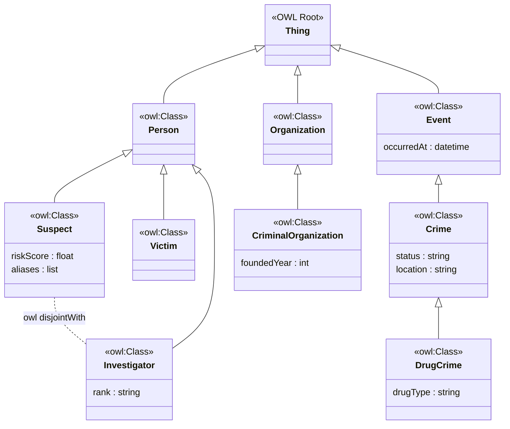
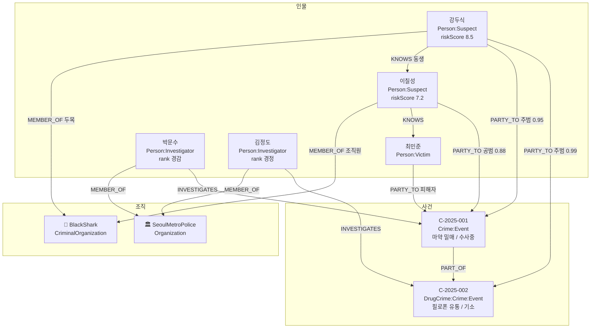
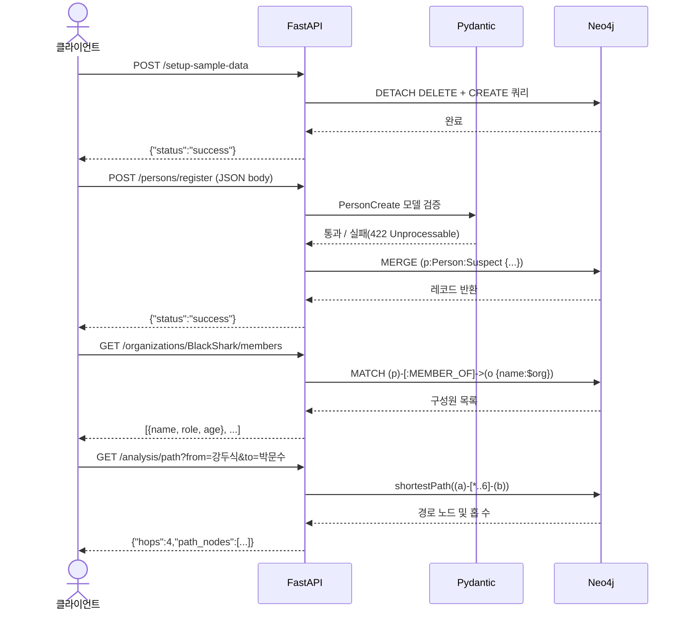
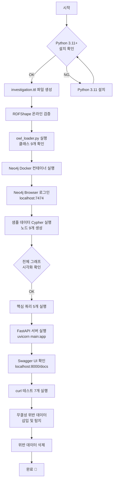

> **참고 원문**: [수사 온톨로지 기반 지식 그래프 시스템 구축 가이드](https://k82022603.github.io/posts/%EC%88%98%EC%82%AC-%EC%98%A8%ED%86%A8%EB%A1%9C%EC%A7%80-%EA%B8%B0%EB%B0%98-%EC%A7%80%EC%8B%9D-%EA%B7%B8%EB%9E%98%ED%94%84-%EC%8B%9C%EC%8A%A4%ED%85%9C-%EA%B5%AC%EC%B6%95-%EA%B0%80%EC%9D%B4%EB%93%9C/)  
> **대상**: Python 기초 이상, 실습 우선 입문자  
> **목표**: OWL 온톨로지 → Neo4j → FastAPI 전체 스택을 직접 손으로 실행하고 검증한다

---

## 목차

1. [테스트 환경 준비](#1-테스트-환경-준비)
2. [PHASE 1 — OWL 온톨로지 검증](#2-phase-1--owl-온톨로지-검증)
3. [PHASE 2 — Neo4j 그래프 구축 및 쿼리 테스트](#3-phase-2--neo4j-그래프-구축-및-쿼리-테스트)
4. [PHASE 3 — FastAPI 애플리케이션 실행](#4-phase-3--fastapi-애플리케이션-실행)
5. [PHASE 4 — 통합 시나리오 테스트](#5-phase-4--통합-시나리오-테스트)
6. [PHASE 5 — 무결성 검증 (disjoint 제약)](#6-phase-5--무결성-검증-disjoint-제약)
7. [트러블슈팅](#7-트러블슈팅)
8. [테스트 체크리스트](#8-테스트-체크리스트)

---

## 1. 테스트 환경 준비

### 1.1 전제 조건

본 가이드를 실습하려면 세 가지 도구가 필요하다. **Python 3.11 이상**, **Docker Desktop**, **curl 또는 웹 브라우저**다. Neo4j는 별도 설치 없이 Docker로 실행하므로 Docker만 있으면 충분하다.

Python 버전 확인부터 시작한다.

```bash
python --version     # 3.11.x 이상이어야 한다
docker --version     # 20.x 이상 권장
docker compose version
```

### 1.2 프로젝트 디렉토리 구성

작업 디렉토리를 만들고 필요한 파일들을 생성한다. 아래 구조를 그대로 따르면 이후 모든 명령어가 오류 없이 동작한다.

```
investigation-api/
├── investigation.ttl    ← OWL 온톨로지 파일
├── owl_loader.py        ← rdflib 테스트 스크립트
├── database.py          ← Neo4j 드라이버 설정
├── models.py            ← Pydantic 데이터 모델
├── main.py              ← FastAPI 메인 앱
├── requirements.txt     ← 의존성 목록
└── docker-compose.yml   ← 전체 환경 구성
```

```bash
mkdir investigation-api
cd investigation-api
```

### 1.3 의존성 설치

가상환경을 먼저 만드는 것이 좋다. 가상환경 없이 설치하면 다른 프로젝트의 패키지와 충돌할 수 있다.

```bash
python -m venv .venv
source .venv/bin/activate       # macOS / Linux
# .venv\Scripts\activate        # Windows PowerShell
```

활성화가 되면 터미널 프롬프트 앞에 `(.venv)`가 붙는다. 이 상태에서 패키지를 설치한다.

```bash
pip install fastapi "uvicorn[standard]" "neo4j>=5.0,<6.0" "pydantic>=2.0" rdflib
```

`requirements.txt`도 함께 만들어 두면 나중에 Docker 빌드에서 사용된다.

```
# requirements.txt
fastapi>=0.111.0
uvicorn[standard]>=0.29.0
neo4j>=5.0,<6.0
pydantic>=2.0
rdflib>=6.3.0
```

---

## 2. PHASE 1 — OWL 온톨로지 검증

OWL 코드를 실행하기 전에, 먼저 파일로 저장하고 두 가지 방법으로 검증한다. 첫 번째는 온라인 도구를 이용한 문법 검사이고, 두 번째는 Python `rdflib`를 이용한 프로그래밍 방식 검사다.

### 2.1 온톨로지 파일 생성

아래 내용을 `investigation.ttl` 파일로 저장한다. Turtle 형식에서 들여쓰기는 의미가 없지만, 세미콜론(`;`)과 마침표(`.`)의 위치가 중요하다.

```turtle

# ─────────────────────────────────────────────
# 클래스(Class) 정의 — "어떤 종류의 존재가 있는가"
# ─────────────────────────────────────────────

:Person a owl:Class .

:Suspect a owl:Class ;
    rdfs:subClassOf :Person .

:Victim a owl:Class ;
    rdfs:subClassOf :Person .

:Investigator a owl:Class ;
    rdfs:subClassOf :Person .

:Organization a owl:Class .

:CriminalOrganization a owl:Class ;
    rdfs:subClassOf :Organization .

:Event a owl:Class .

:Crime a owl:Class ;
    rdfs:subClassOf :Event .

:DrugCrime a owl:Class ;
    rdfs:subClassOf :Crime .

# ─────────────────────────────────────────────
# 프로퍼티(Property) 정의 — "어떤 관계가 있는가"
# ─────────────────────────────────────────────

:knows a owl:ObjectProperty ;
    rdfs:domain :Person ;
    rdfs:range  :Person .

:memberOf a owl:ObjectProperty ;
    rdfs:domain :Person ;
    rdfs:range  :Organization .

:partOf a owl:ObjectProperty ;
    rdfs:domain :Event ;
    rdfs:range  :Event .

# ─────────────────────────────────────────────
# 논리적 제약 (Constraint)
# ─────────────────────────────────────────────

:Investigator owl:disjointWith :Suspect .
```

> ⚠️ **주의**: 파일 상단의 `@prefix` 선언이 없으면 `:`로 시작하는 모든 식별자가 오류가 된다. 원문 코드를 복붙할 때 prefix 선언을 빠뜨리기 쉬우므로 반드시 포함시킨다.

### 2.2 온라인 문법 검증 (설치 없이)

브라우저에서 [RDFShape](https://rdfshape.weso.es/)에 접속한다. 사이트 좌측 패널에 위 Turtle 코드를 붙여넣고, Format 드롭다운에서 `Turtle`을 선택한 뒤 **Validate** 버튼을 누른다. 오류가 없으면 초록색 체크마크와 함께 트리플(Triple) 수가 표시된다.

정상 결과 예시:
```
✅ Valid RDF document
Triples found: 18
Format: Turtle
```

### 2.3 Python rdflib로 프로그래밍 방식 검증

아래 스크립트를 `owl_loader.py`로 저장하고 실행한다. 이 스크립트는 온톨로지 파일을 파싱하여 클래스 목록, 상속 관계, disjoint 제약을 출력한다.

```python
# owl_loader.py
from rdflib import Graph, Namespace, RDF, RDFS, OWL

# 온톨로지 파일 로드
g = Graph()
g.parse("investigation.ttl", format="turtle")

print(f"✅ 온톨로지 로드 완료 — 총 트리플(Triple) 수: {len(g)}")
print()

# ─── 예시 1: 모든 OWL 클래스 출력 ───
print("=== 정의된 클래스 목록 ===")
for cls in g.subjects(RDF.type, OWL.Class):
    local = str(cls).split("#")[-1]
    print(f"  클래스: {local}")

# ─── 예시 2: 상속 관계(subClassOf) 조회 ───
print("\n=== 상속(subClassOf) 관계 ===")
for child, _, parent in g.triples((None, RDFS.subClassOf, None)):
    child_name  = str(child).split("#")[-1]
    parent_name = str(parent).split("#")[-1]
    print(f"  {child_name}  →  subClassOf  →  {parent_name}")

# ─── 예시 3: disjoint 관계 확인 ───
print("\n=== Disjoint(상호 배타) 관계 ===")
for s, _, o in g.triples((None, OWL.disjointWith, None)):
    s_name = str(s).split("#")[-1]
    o_name = str(o).split("#")[-1]
    print(f"  {s_name}  ⊕  {o_name}  (동시에 속할 수 없음)")

# ─── 예시 4: ObjectProperty(관계) 목록 ───
print("\n=== ObjectProperty (관계 정의) ===")
for prop in g.subjects(RDF.type, OWL.ObjectProperty):
    prop_name = str(prop).split("#")[-1]
    domains = list(g.objects(prop, RDFS.domain))
    ranges  = list(g.objects(prop, RDFS.range))
    d = str(domains[0]).split("#")[-1] if domains else "?"
    r = str(ranges[0]).split("#")[-1] if ranges else "?"
    print(f"  :{prop_name}  ({d} → {r})")
```

실행한다.

```bash
python owl_loader.py
```

정상 출력 예시:

```
✅ 온톨로지 로드 완료 — 총 트리플(Triple) 수: 18

=== 정의된 클래스 목록 ===
  클래스: Person
  클래스: Suspect
  클래스: Victim
  클래스: Investigator
  클래스: Organization
  클래스: CriminalOrganization
  클래스: Event
  클래스: Crime
  클래스: DrugCrime

=== 상속(subClassOf) 관계 ===
  Suspect        →  subClassOf  →  Person
  Victim         →  subClassOf  →  Person
  Investigator   →  subClassOf  →  Person
  CriminalOrganization  →  subClassOf  →  Organization
  Crime          →  subClassOf  →  Event
  DrugCrime      →  subClassOf  →  Crime

=== Disjoint(상호 배타) 관계 ===
  Investigator  ⊕  Suspect  (동시에 속할 수 없음)

=== ObjectProperty (관계 정의) ===
  :knows     (Person → Person)
  :memberOf  (Person → Organization)
  :partOf    (Event → Event)
```

클래스가 9개, 상속 관계가 6개, disjoint가 1개, 프로퍼티가 3개 출력되면 온톨로지가 정확히 파싱된 것이다.

### 2.4 온톨로지 구조 다이어그램

이 시스템의 클래스 계층 구조를 한눈에 파악하면 이후 Neo4j 구현 단계가 훨씬 쉬워진다.



---

## 3. PHASE 2 — Neo4j 그래프 구축 및 쿼리 테스트

### 3.1 Neo4j 컨테이너 실행

Neo4j를 Docker로 실행한다. `NEO4J_AUTH` 환경 변수로 초기 비밀번호를 설정한다. 비밀번호는 최소 8자 이상이어야 한다.

```bash
docker run -d \
  --name investigation-neo4j \
  -p 7474:7474 \
  -p 7687:7687 \
  -e NEO4J_AUTH=neo4j/password1234! \
  neo4j:5.18-community
```

컨테이너 상태를 확인한다.

```bash
docker ps
# investigation-neo4j 컨테이너가 Up 상태이어야 한다
```

30초 정도 기다린 후 브라우저에서 `http://localhost:7474`를 연다. 로그인 화면이 나타나면 다음 정보로 로그인한다.

- **Username**: `neo4j`  
- **Password**: `password1234!`

> 💡 최초 로그인 시 비밀번호 변경을 요구하는 경우, 동일한 값(`password1234!`)을 새 비밀번호로 입력하면 된다.

### 3.2 샘플 데이터 생성

Neo4j Browser 상단의 Cypher 입력창에 아래 쿼리를 순서대로 붙여넣고 실행한다. 하나의 쿼리 블록을 실행한 후 다음으로 넘어간다.

**Step 1: 기존 데이터 초기화**

```cypher
MATCH (n) DETACH DELETE n;
```

실행 후 `Deleted X nodes, deleted Y relationships` 메시지가 나타나면 성공이다.

**Step 2: 조직 노드 생성**

OWL에서 `:CriminalOrganization rdfs:subClassOf :Organization`으로 정의한 계층을, Neo4j에서는 다중 레이블 `:CriminalOrganization:Organization`으로 표현한다.

```cypher
CREATE (o1:CriminalOrganization:Organization {name: 'BlackShark', foundedYear: 2010})
CREATE (o2:Organization {name: 'SeoulMetroPolice'});
```

**Step 3: 인물 노드 생성**

`:Person:Suspect`처럼 다중 레이블을 부여하여 OWL의 `subClassOf` 관계를 물리적으로 표현한다.

```cypher
MATCH (o1:CriminalOrganization {name: 'BlackShark'})
MATCH (o2:Organization {name: 'SeoulMetroPolice'})

CREATE (p1:Person:Suspect {name: '강두식', age: 45, nationality: 'KR', riskScore: 8.5})
CREATE (p2:Person:Suspect {name: '이칠성', age: 38, nationality: 'KR', riskScore: 7.2})
CREATE (p3:Person:Victim   {name: '최민준', age: 29, nationality: 'KR'})
CREATE (p4:Person:Investigator {name: '박문수', age: 32, rank: '경감'})
CREATE (p5:Person:Investigator {name: '김정도', age: 41, rank: '경정'})

CREATE (p1)-[:MEMBER_OF {joinedAt: date('2018-03-01'), rank: '두목'}]->(o1)
CREATE (p2)-[:MEMBER_OF {joinedAt: date('2020-06-15'), rank: '조직원'}]->(o1)
CREATE (p4)-[:MEMBER_OF {assignedAt: date('2024-01-01')}]->(o2)
CREATE (p5)-[:MEMBER_OF {assignedAt: date('2022-05-01')}]->(o2);
```

**Step 4: 사건 노드 및 관계 생성**

```cypher
MATCH (p1:Suspect {name: '강두식'})
MATCH (p2:Suspect {name: '이칠성'})
MATCH (p3:Victim  {name: '최민준'})
MATCH (p4:Investigator {name: '박문수'})
MATCH (p5:Investigator {name: '김정도'})

CREATE (c1:Crime:Event {
    id: 'C-2025-001',
    type: '마약 밀매',
    occurredAt: datetime('2025-08-15T22:30:00'),
    status: '수사중',
    location: '서울 마포구'
})
CREATE (c2:DrugCrime:Crime:Event {
    id: 'C-2025-002',
    type: '필로폰 유통',
    occurredAt: datetime('2025-09-01T03:00:00'),
    status: '기소',
    location: '인천 남동구'
})

CREATE (p1)-[:KNOWS {since: date('2015-01-01'), relationshipType: '동생'}]->(p2)
CREATE (p2)-[:KNOWS {since: date('2023-06-01'), relationshipType: '알게 된 사이'}]->(p3)

CREATE (p1)-[:PARTY_TO {role: '주범', confidence: 0.95}]->(c1)
CREATE (p2)-[:PARTY_TO {role: '공범', confidence: 0.88}]->(c1)
CREATE (p1)-[:PARTY_TO {role: '주범', confidence: 0.99}]->(c2)
CREATE (p3)-[:PARTY_TO {role: '피해자', confidence: 1.0}]->(c1)

CREATE (p4)-[:INVESTIGATES {assignedAt: date('2025-08-16')}]->(c1)
CREATE (p5)-[:INVESTIGATES {assignedAt: date('2025-09-02')}]->(c2)

CREATE (c1)-[:PART_OF]->(c2);
```

**Step 5: 전체 그래프 시각화 확인**

```cypher
MATCH (n)-[r]-(m) RETURN n, r, m LIMIT 50;
```

브라우저에 노드 9개(인물 5명 + 조직 2개 + 사건 2개)와 관계들이 그래프로 표시되면 데이터 구축이 완료된 것이다.

### 3.3 핵심 Cypher 쿼리 테스트

데이터가 준비되었으니 이제 온톨로지에서 설계한 관계들을 실제로 조회해본다.

**테스트 1: 피의자 전체 조회 (위험도 순)**

```cypher
MATCH (s:Suspect)
RETURN s.name AS 이름, s.age AS 나이, s.riskScore AS 위험도점수
ORDER BY s.riskScore DESC;
```

기대 결과:
```
이름    | 나이 | 위험도점수
강두식  |  45  |   8.5
이칠성  |  38  |   7.2
```

**테스트 2: 특정 인물의 지인 네트워크**

```cypher
MATCH (s:Suspect {name: '강두식'})-[:KNOWS]->(connected)
RETURN s.name AS 기준인물, labels(connected) AS 역할, connected.name AS 연결인물;
```

기대 결과: `강두식 → [Person, Suspect] → 이칠성`

**테스트 3: 조직 구성원 조회**

```cypher
MATCH (p:Person)-[:MEMBER_OF]->(o:Organization {name: 'BlackShark'})
RETURN p.name AS 구성원, [lbl IN labels(p) WHERE lbl <> 'Person'][0] AS 역할, p.riskScore AS 위험도;
```

기대 결과: 강두식(Suspect, 8.5)과 이칠성(Suspect, 7.2)이 반환된다.

**테스트 4: 두 인물 간 최단 경로 탐색**

이것이 그래프 DB의 핵심 기능이다. 강두식(피의자)에서 박문수(수사관)까지의 연결 고리를 최대 6단계 이내에서 찾는다.

```cypher
MATCH path = shortestPath(
    (a:Person {name: '강두식'})-[*..6]-(b:Person {name: '박문수'})
)
RETURN path, length(path) AS 거리;
```

기대 결과: 경로가 4~5단계 안에 발견된다. 강두식 → 이칠성 → 최민준 → ... → 박문수 형태의 연결 경로가 시각화된다.

**테스트 5: 범죄 계층 구조 활용 (다중 레이블 조회)**

OWL에서 `DrugCrime subClassOf Crime`이므로, `:Crime` 레이블로 조회하면 DrugCrime 사건도 함께 잡힌다.

```cypher
MATCH (p:Person)-[:PARTY_TO]->(c:Crime)
RETURN p.name AS 연루인물,
       labels(c) AS 사건유형,
       c.type AS 사건명,
       c.status AS 상태
ORDER BY c.occurredAt;
```

DrugCrime은 `:DrugCrime:Crime:Event` 레이블을 가지므로, `:Crime`으로 조회해도 결과에 포함된다. 이것이 다중 레이블로 OWL 상속 관계를 표현하는 실질적 이점이다.

### 3.4 데이터 관계 구조 다이어그램



---

## 4. PHASE 3 — FastAPI 애플리케이션 실행

### 4.1 소스 파일 작성

**`database.py`** — Neo4j 드라이버 설정

```python
# database.py
from neo4j import AsyncGraphDatabase, AsyncDriver

NEO4J_URI  = "bolt://localhost:7687"
NEO4J_USER = "neo4j"
NEO4J_PASS = "password1234!"

def create_driver() -> AsyncDriver:
    return AsyncGraphDatabase.driver(
        NEO4J_URI,
        auth=(NEO4J_USER, NEO4J_PASS),
        max_connection_pool_size=50,
    )
```

> 💡 **2025년 모범 사례**: 비밀번호를 코드에 직접 쓰지 않고 환경 변수로 관리하는 것이 권장된다. 프로덕션에서는 `os.getenv("NEO4J_PASS")` 형태로 교체한다.

**`models.py`** — Pydantic 데이터 모델

```python
# models.py
from pydantic import BaseModel, Field, field_validator
from typing import Optional, List
from enum import Enum

class PersonRole(str, Enum):
    SUSPECT      = "Suspect"
    VICTIM       = "Victim"
    INVESTIGATOR = "Investigator"

class PersonCreate(BaseModel):
    name:         str             = Field(..., min_length=1, max_length=50)
    role:         PersonRole      = Field(...)
    age:          Optional[int]   = Field(None, ge=0, le=150)
    rank:         Optional[str]   = None
    risk_score:   Optional[float] = Field(None, ge=0.0, le=10.0)
    organization: Optional[str]   = None

class PersonResponse(BaseModel):
    name:       str
    role:       str
    age:        Optional[int]   = None
    rank:       Optional[str]   = None
    risk_score: Optional[float] = None

class OrganizationMember(BaseModel):
    name: str
    role: str
    age:  Optional[int] = None

class RelationCreate(BaseModel):
    from_name:         str            = Field(...)
    to_name:           str            = Field(...)
    relationship_type: str            = Field(...)
    metadata:          Optional[dict] = Field(default_factory=dict)

class PathResult(BaseModel):
    source:     str
    target:     str
    hops:       int
    path_nodes: List[str]
```

**`main.py`** — FastAPI 메인 애플리케이션

```python
# main.py
from contextlib import asynccontextmanager
from typing import List
from fastapi import FastAPI, HTTPException, Depends, Request
from neo4j import AsyncSession

from database import create_driver
from models import (
    PersonCreate, PersonResponse,
    OrganizationMember, RelationCreate, PathResult
)

VALID_ROLES     = {"Suspect", "Victim", "Investigator"}
VALID_RELATIONS = {"KNOWS", "PARTY_TO", "INVESTIGATES"}

# ── 라이프스팬: 앱 시작/종료 시 드라이버 관리 ──
async def lifespan(app: FastAPI):
    driver = create_driver()
    app.state.driver = driver
    print("✅ Neo4j 드라이버 연결 완료")
    yield
    await driver.close()
    print("🔒 Neo4j 드라이버 종료 완료")

app = FastAPI(
    title="수사 인텔리전스 시스템",
    description="OWL 온톨로지 기반 수사 프로파일링 REST API",
    version="1.0.0",
    lifespan=lifespan,
)

# ── 세션 의존성 주입 ──
async def get_session(request: Request) -> AsyncSession:
    async with request.app.state.driver.session() as session:
        yield session

# ── /setup-sample-data ──
async def setup_sample_data(session: AsyncSession = Depends(get_session)):
    await session.run("MATCH (n) DETACH DELETE n")
    data_query = """
    CREATE (o1:CriminalOrganization:Organization {name:'BlackShark', foundedYear:2010})
    CREATE (o2:Organization {name:'SeoulMetroPolice'})
    CREATE (p1:Person:Suspect {name:'강두식', age:45, riskScore:8.5})
    CREATE (p2:Person:Suspect {name:'이칠성', age:38, riskScore:7.2})
    CREATE (p3:Person:Victim  {name:'최민준', age:29})
    CREATE (p4:Person:Investigator {name:'박문수', age:32, rank:'경감'})
    CREATE (p5:Person:Investigator {name:'김정도', age:41, rank:'경정'})
    CREATE (c1:Crime:Event {id:'C-001', type:'마약 밀매',   status:'수사중'})
    CREATE (c2:DrugCrime:Crime:Event {id:'C-002', type:'필로폰 유통', status:'기소'})
    CREATE (p1)-[:MEMBER_OF {rank:'두목'}]->(o1)
    CREATE (p2)-[:MEMBER_OF {rank:'조직원'}]->(o1)
    CREATE (p4)-[:MEMBER_OF]->(o2)
    CREATE (p5)-[:MEMBER_OF]->(o2)
    CREATE (p1)-[:KNOWS {relationshipType:'동생'}]->(p2)
    CREATE (p2)-[:KNOWS]->(p3)
    CREATE (p1)-[:PARTY_TO {role:'주범', confidence:0.95}]->(c1)
    CREATE (p2)-[:PARTY_TO {role:'공범', confidence:0.88}]->(c1)
    CREATE (p3)-[:PARTY_TO {role:'피해자'}]->(c1)
    CREATE (p1)-[:PARTY_TO {role:'주범', confidence:0.99}]->(c2)
    CREATE (p4)-[:INVESTIGATES]->(c1)
    CREATE (p5)-[:INVESTIGATES]->(c2)
    CREATE (c1)-[:PART_OF]->(c2)
    """
    await session.run(data_query)
    return {"status": "success", "message": "샘플 데이터 생성 완료"}

# ── /persons/register ──
async def register_person(
    person: PersonCreate,
    session: AsyncSession = Depends(get_session),
):
    if person.role.value not in VALID_ROLES:
        raise HTTPException(status_code=400, detail=f"허용 역할: {VALID_ROLES}")
    role_label = person.role.value
    query = f"""
    MERGE (p:Person:{role_label} {{name: $name}})
    SET p.age       = $age,
        p.riskScore = $risk_score,
        p.rank      = $rank
    WITH p
    FOREACH (_ IN CASE WHEN $org IS NOT NULL THEN [1] ELSE [] END |
        MERGE (o:Organization {{name: $org}})
        MERGE (p)-[:MEMBER_OF]->(o)
    )
    RETURN p.name AS name
    """
    try:
        result = await session.run(
            query,
            name=person.name, age=person.age,
            risk_score=person.risk_score, rank=person.rank,
            org=person.organization,
        )
        record = await result.single()
        return {"status": "success", "message": f"'{person.name}' 등록 완료"}
    except Exception as e:
        raise HTTPException(status_code=500, detail=str(e))

# ── /persons/{name} ──
async def get_person(name: str, session: AsyncSession = Depends(get_session)):
    query = """
    MATCH (p:Person {name: $name})
    RETURN p.name AS name, p.age AS age, p.rank AS rank,
           p.riskScore AS risk_score,
           [lbl IN labels(p) WHERE lbl <> 'Person'][0] AS role
    """
    result = await session.run(query, name=name)
    record = await result.single()
    if not record:
        raise HTTPException(status_code=404, detail=f"'{name}' 인물 없음")
    return PersonResponse(
        name=record["name"], role=record["role"] or "Unknown",
        age=record["age"], rank=record["rank"], risk_score=record["risk_score"],
    )

# ── /suspects ──
async def list_suspects(session: AsyncSession = Depends(get_session)):
    query = """
    MATCH (s:Suspect)
    RETURN s.name AS name, s.age AS age, s.riskScore AS risk_score, 'Suspect' AS role
    ORDER BY s.riskScore DESC
    """
    result = await session.run(query)
    return [
        PersonResponse(name=r["name"], role=r["role"], age=r["age"], risk_score=r["risk_score"])
        async for r in result
    ]

# ── /organizations/{org_name}/members ──
         response_model=List[OrganizationMember], tags=["조직"])
async def get_organization_chart(org_name: str, session: AsyncSession = Depends(get_session)):
    query = """
    MATCH (p:Person)-[:MEMBER_OF]->(o:Organization {name: $org_name})
    RETURN p.name AS name, p.age AS age,
           [lbl IN labels(p) WHERE lbl <> 'Person'][0] AS role
    ORDER BY p.name
    """
    result = await session.run(query, org_name=org_name)
    members = [
        OrganizationMember(name=r["name"], role=r["role"] or "Unknown", age=r["age"])
        async for r in result
    ]
    if not members:
        raise HTTPException(status_code=404, detail=f"'{org_name}' 조직 없음")
    return members

# ── /analysis/path ──
async def find_path(
    from_name: str, to_name: str,
    max_hops: int = 6,
    session: AsyncSession = Depends(get_session),
):
    if not (1 <= max_hops <= 10):
        raise HTTPException(status_code=400, detail="max_hops는 1~10 사이")
    query = f"""
    MATCH (a:Person {{name: $from_name}}), (b:Person {{name: $to_name}})
    MATCH path = shortestPath((a)-[*..{max_hops}]-(b))
    RETURN [n IN nodes(path) | coalesce(n.name, n.id, 'unknown')] AS path_nodes,
           length(path) AS hops
    LIMIT 1
    """
    result = await session.run(query, from_name=from_name, to_name=to_name)
    record = await result.single()
    if not record:
        return {"status": "not_found", "message": f"{max_hops}단계 이내 경로 없음"}
    return {"status": "found", "from": from_name, "to": to_name,
            "hops": record["hops"], "path_nodes": record["path_nodes"]}

# ── /analysis/integrity ──
async def check_integrity(session: AsyncSession = Depends(get_session)):
    query = """
    MATCH (n:Investigator) WHERE n:Suspect
    RETURN n.name AS name, labels(n) AS labels, '논리 위반 (disjointWith)' AS violation
    """
    result = await session.run(query)
    violations = [
        {"name": r["name"], "labels": r["labels"], "violation": r["violation"]}
        async for r in result
    ]
    return {"status": "ok" if not violations else "violations_found",
            "violations": violations, "count": len(violations)}
```

### 4.2 FastAPI 서버 실행

```bash
uvicorn main:app --reload
```

터미널에 아래 메시지가 나타나면 서버가 정상 기동된 것이다.

```
✅ Neo4j 드라이버 연결 완료
INFO:     Application startup complete.
INFO:     Uvicorn running on http://127.0.0.1:8000 (Press CTRL+C to quit)
```

브라우저에서 `http://localhost:8000/docs`를 열면 Swagger UI가 나타난다. 모든 엔드포인트가 문서화되어 있으며, 각 엔드포인트를 직접 실행해볼 수 있다.

---

## 5. PHASE 4 — 통합 시나리오 테스트

서버가 실행 중인 상태에서 별도 터미널을 열고 아래 curl 명령어들을 순서대로 실행한다. Swagger UI(`http://localhost:8000/docs`)를 이용해 GUI로 테스트해도 동일하다.

### 5.1 API 요청 흐름 다이어그램



### 5.2 curl 명령어 테스트

**① 샘플 데이터 초기화**

```bash
curl -X POST http://localhost:8000/setup-sample-data
```

예상 응답:
```json
{"status":"success","message":"샘플 데이터 생성 완료"}
```

**② 새 인물 등록**

```bash
curl -X POST http://localhost:8000/persons/register \
  -H "Content-Type: application/json" \
  -d '{
    "name": "홍길동",
    "role": "Suspect",
    "age": 35,
    "risk_score": 6.5,
    "organization": "BlackShark"
  }'
```

예상 응답:
```json
{"status":"success","message":"'홍길동' 등록 완료"}
```

**③ 잘못된 역할로 등록 시도 (에러 케이스)**

```bash
curl -X POST http://localhost:8000/persons/register \
  -H "Content-Type: application/json" \
  -d '{"name": "테스트", "role": "Criminal"}'
```

예상 응답: HTTP 422 Unprocessable Entity (Pydantic 검증 실패)

**④ 조직 구성원 조회**

```bash
curl http://localhost:8000/organizations/BlackShark/members
```

예상 응답:
```json
[
  {"name":"강두식","role":"Suspect","age":45},
  {"name":"이칠성","role":"Suspect","age":38},
  {"name":"홍길동","role":"Suspect","age":35}
]
```

**⑤ 피의자 전체 목록 (위험도 순)**

```bash
curl http://localhost:8000/suspects
```

**⑥ 특정 인물 조회**

```bash
curl http://localhost:8000/persons/강두식
```

예상 응답:
```json
{"name":"강두식","role":"Suspect","age":45,"rank":null,"risk_score":8.5}
```

**⑦ 인물 간 경로 분석**

```bash
curl "http://localhost:8000/analysis/path?from_name=강두식&to_name=박문수&max_hops=6"
```

예상 응답:
```json
{
  "status": "found",
  "from": "강두식",
  "to": "박문수",
  "hops": 4,
  "path_nodes": ["강두식", "이칠성", "최민준", "...중간경로...", "박문수"]
}
```

---

## 6. PHASE 5 — 무결성 검증 (disjoint 제약)

이 단계가 이 시스템에서 가장 핵심적인 온톨로지 개념을 검증하는 부분이다. OWL에서 `:Investigator owl:disjointWith :Suspect`로 정의한 제약이 실제로 동작하는지 확인한다.

### 6.1 정상 상태 확인

먼저 현재 데이터가 무결한지 확인한다.

```bash
curl http://localhost:8000/analysis/integrity
```

예상 응답:
```json
{"status":"ok","violations":[],"count":0}
```

### 6.2 의도적 위반 데이터 삽입

Neo4j Browser(`http://localhost:7474`)에서 아래 쿼리를 실행하여 규칙 위반 노드를 만든다. 이 노드는 수사관이면서 동시에 피의자인, 논리적으로 불가능한 존재다.

```cypher
CREATE (:Person:Investigator:Suspect {name: '오류인물_테스트', age: 99});
```

### 6.3 위반 탐지 확인

다시 무결성 검사 API를 호출한다.

```bash
curl http://localhost:8000/analysis/integrity
```

예상 응답:
```json
{
  "status": "violations_found",
  "violations": [
    {
      "name": "오류인물_테스트",
      "labels": ["Person","Investigator","Suspect"],
      "violation": "논리 위반 (disjointWith)"
    }
  ],
  "count": 1
}
```

### 6.4 위반 데이터 정리

테스트가 끝나면 반드시 위반 데이터를 삭제한다.

```cypher
MATCH (n {name: '오류인물_테스트'}) DETACH DELETE n;
```

### 6.5 OWL 추론 vs. 애플리케이션 수동 검사 비교

| 항목 | OWL + Reasoner (Protégé) | 이 시스템 (FastAPI + Cypher) |
|------|--------------------------|------------------------------|
| disjoint 위반 감지 | 자동 (추론 엔진이 즉시 감지) | 수동 (`/analysis/integrity` API 호출) |
| 위반 시 동작 | "Ontology is inconsistent" 오류 | 위반 노드 목록 반환 (삭제는 수동) |
| 적합 환경 | 설계·검증 단계 | 운영 환경 모니터링 |

이 차이가 "OWL 온톨로지를 Neo4j로 구현한다"는 표현이 절반만 맞는 이유다. OWL의 논리적 강제력은 Neo4j로 이전되지 않는다. 대신 API 레이어에서 명시적으로 검사해야 한다.

---

## 7. 트러블슈팅

실습 중 자주 발생하는 문제와 해결 방법을 정리했다.

### 7.1 Neo4j 연결 오류

```
ServiceUnavailable: Failed to establish connection to ('localhost', 7687)
```

Neo4j 컨테이너가 완전히 시작되지 않았을 가능성이 높다. 아래 명령어로 로그를 확인한다.

```bash
docker logs investigation-neo4j | tail -20
```

`Started` 메시지가 보일 때까지 기다린 후 재시도한다. 보통 30~60초가 소요된다.

### 7.2 인증 오류

```
AuthError: The client is unauthorized due to authentication failure
```

비밀번호가 다르다. `database.py`의 `NEO4J_PASS`가 Docker 실행 시 설정한 `NEO4J_AUTH` 값과 일치하는지 확인한다.

```bash
# 현재 컨테이너 환경 변수 확인
docker inspect investigation-neo4j | grep NEO4J_AUTH
```

### 7.3 Turtle 파싱 오류

```
rdflib.exceptions.ParserError: ...
```

`@prefix` 선언이 누락되었거나 세미콜론/마침표가 잘못된 경우다. RDFShape 온라인 도구로 먼저 문법을 검증한 후 Python으로 실행한다.

### 7.4 Cypher 레이블 파라미터 오류

Neo4j에서 레이블이나 관계 유형은 `$param`으로 전달할 수 없다. 이것은 Neo4j의 설계 제약이다.

```cypher
-- ❌ 동작하지 않음
MERGE (p:$role {name: $name})

-- ✅ 화이트리스트 검증 후 f-string으로 삽입
-- Python: query = f"MERGE (p:Person:{role_label} {{name: $name}})"
```

`main.py`의 `register_person` 함수가 이 방식을 사용하는 이유다. `VALID_ROLES` 화이트리스트로 인젝션을 방어한다.

### 7.5 async/await 관련 경고

FastAPI 0.95.0 이전 방식인 `@app.on_event("startup")`을 사용하면 다음과 같은 경고가 나타난다.

```
DeprecationWarning: on_event is deprecated, use lifespan event handlers instead.
```

`main.py`에서 `lifespan` 방식을 사용하면 이 경고가 사라진다. 본 가이드의 코드는 이미 최신 방식을 적용하고 있다.

---

## 8. 테스트 체크리스트

전체 실습을 마치면 아래 항목들을 확인한다.



| # | 항목 | 예상 결과 | 완료 |
|---|------|-----------|------|
| 1 | `investigation.ttl` 파싱 성공 | 트리플 18개 | ☐ |
| 2 | `owl_loader.py` 출력 | 클래스 9개, subClassOf 6개, disjoint 1개 | ☐ |
| 3 | Neo4j 컨테이너 실행 | `localhost:7474` 접속 성공 | ☐ |
| 4 | 샘플 데이터 생성 | 노드 9개, 관계 14개 | ☐ |
| 5 | 피의자 조회 쿼리 | 강두식(8.5), 이칠성(7.2) 순서 | ☐ |
| 6 | 최단 경로 쿼리 | 강두식→박문수 경로 발견 | ☐ |
| 7 | FastAPI 서버 실행 | Swagger UI 표시 | ☐ |
| 8 | `POST /setup-sample-data` | `"status":"success"` | ☐ |
| 9 | `POST /persons/register` | 정상 등록 + 조직 소속 | ☐ |
| 10 | `GET /organizations/BlackShark/members` | 3명 반환 | ☐ |
| 11 | `GET /analysis/path` | hops와 path_nodes 반환 | ☐ |
| 12 | 무결성 정상 상태 | `"status":"ok"` | ☐ |
| 13 | 위반 데이터 삽입 후 재검사 | `"status":"violations_found"` | ☐ |
| 14 | 위반 데이터 삭제 후 재검사 | `"status":"ok"` | ☐ |

---

## 부록 A — Docker Compose로 한번에 실행

로컬 개발 시 Neo4j와 FastAPI를 함께 띄우려면 Docker Compose를 사용하는 것이 편하다.

```yaml
# docker-compose.yml
version: "3.9"

services:
  neo4j:
    image: neo4j:5.18-community
    container_name: investigation-neo4j
    environment:
      - NEO4J_AUTH=neo4j/password1234!
      - NEO4J_server_memory_heap_initial__size=512m
      - NEO4J_server_memory_heap_max__size=1g
    ports:
      - "7474:7474"
      - "7687:7687"
    volumes:
      - neo4j_data:/data
    healthcheck:
      test: ["CMD", "cypher-shell", "-u", "neo4j", "-p", "password1234!", "RETURN 1"]
      interval: 15s
      timeout: 10s
      retries: 5

  fastapi:
    build: .
    container_name: investigation-api
    environment:
      - NEO4J_URI=bolt://neo4j:7687
      - NEO4J_USER=neo4j
      - NEO4J_PASS=password1234!
    ports:
      - "8000:8000"
    depends_on:
      neo4j:
        condition: service_healthy
    volumes:
      - .:/app
    command: uvicorn main:app --host 0.0.0.0 --port 8000 --reload

volumes:
  neo4j_data:
```

```dockerfile
# Dockerfile
FROM python:3.11-slim
WORKDIR /app
COPY requirements.txt .
RUN pip install --no-cache-dir -r requirements.txt
COPY . .
CMD ["uvicorn", "main:app", "--host", "0.0.0.0", "--port", "8000"]
```

```bash
# 전체 환경 시작
docker compose up -d

# 로그 확인
docker compose logs -f fastapi

# 전체 종료
docker compose down
```

> 💡 `database.py`에서 `NEO4J_URI = "bolt://localhost:7687"`을 `bolt://neo4j:7687`로 변경해야 Docker 컨테이너 간 통신이 된다. Docker Compose 사용 시 서비스 이름(`neo4j`)이 호스트 이름이 된다.

## 부록 B — Cypher 주요 패턴 참조

| 패턴 | 설명 | 예시 |
|------|------|------|
| `MERGE` | 없으면 생성, 있으면 그대로 | `MERGE (p:Person {name: $name})` |
| `DETACH DELETE` | 노드와 연결 관계 모두 삭제 | `MATCH (n) DETACH DELETE n` |
| `shortestPath()` | 두 노드 간 최단 경로 탐색 | `shortestPath((a)-[*..6]-(b))` |
| `labels(n)` | 노드의 레이블 목록 반환 | `[l IN labels(n) WHERE l <> 'Person'][0]` |
| `FOREACH...IN CASE` | 조건부 실행 (Neo4j의 IF/ELSE) | `FOREACH (_ IN CASE WHEN $x IS NOT NULL THEN [1] ELSE [] END \| ...)` |
| `coalesce(a, b)` | null 대신 기본값 반환 | `coalesce(n.name, 'unknown')` |
| `collect()` | 여러 값을 리스트로 집계 | `collect(c.type) AS 사건목록` |

---

*작성 기준일: 2026-04-22*  
*원문: [BLUEBUG'S BLOG — 수사 온톨로지 기반 지식 그래프 시스템 구축 가이드](https://k82022603.github.io/posts/%EC%88%98%EC%82%AC-%EC%98%A8%ED%86%A8%EB%A1%9C%EC%A7%80-%EA%B8%B0%EB%B0%98-%EC%A7%80%EC%8B%9D-%EA%B7%B8%EB%9E%98%ED%94%84-%EC%8B%9C%EC%8A%A4%ED%85%9C-%EA%B5%AC%EC%B6%95-%EA%B0%80%EC%9D%B4%EB%93%9C/)*
