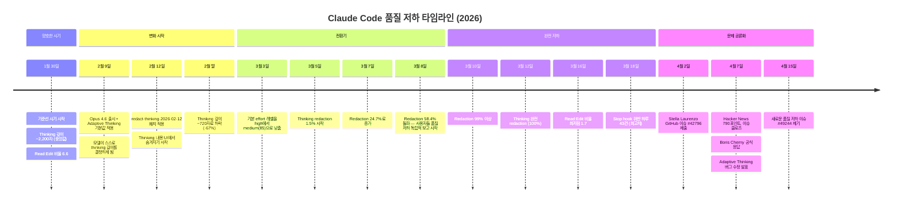
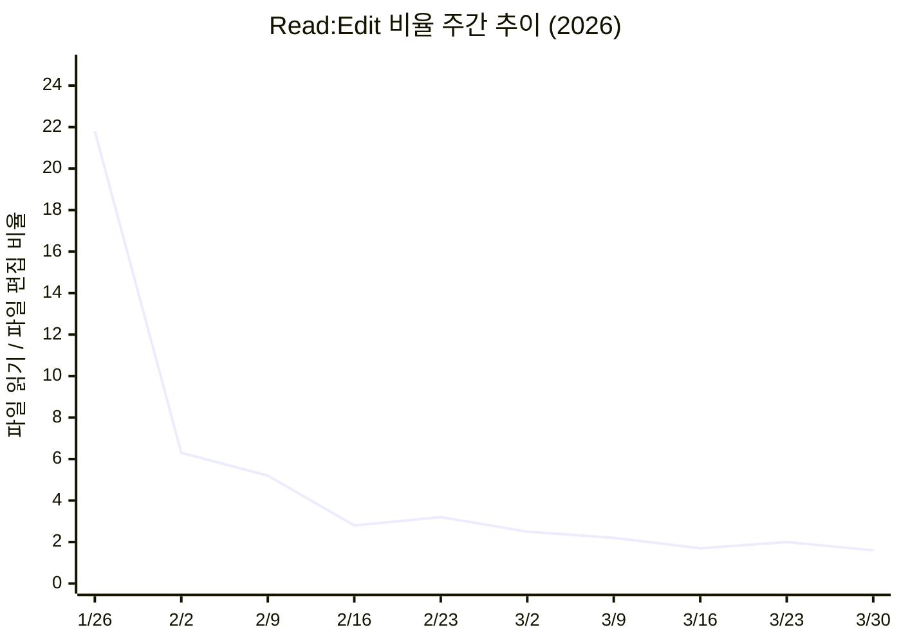
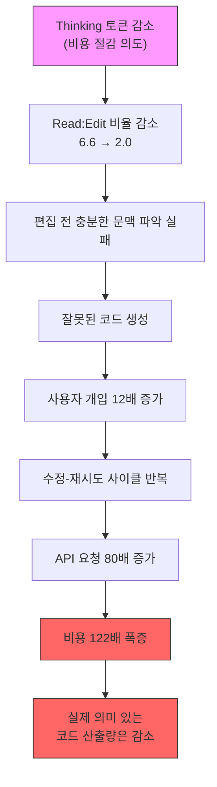

## — Extended Thinking 삭감이 복잡한 엔지니어링 워크플로우를 무너뜨린 방식 —

> **작성일:** 2026년 4월 23일  
> **원본 이슈:** [GitHub anthropics/claude-code #42796](https://github.com/anthropics/claude-code/issues/42796)  
> **제보자:** Stella Laurenzo (AMD AI 시니어 디렉터, MLIR/IREE 엔지니어)  
> **데이터 규모:** 6,852개 세션 파일 / 17,871개 thinking block / 234,760개 tool call


---

## 목차

1. [사태 개요 — 무슨 일이 일어났는가](#1-사태-개요)
2. [핵심 배경 — Extended Thinking이란 무엇인가](#2-핵심-배경)
3. [타임라인 — 패치 적용과 품질 저하의 교차점](#3-타임라인)
4. [데이터 분석 방법론](#4-데이터-분석-방법론)
5. [핵심 발견 1: Thinking 깊이의 붕괴](#5-핵심-발견-1-thinking-깊이의-붕괴)
6. [핵심 발견 2: 행동 패턴의 변화](#6-핵심-발견-2-행동-패턴의-변화)
7. [핵심 발견 3: Read-First에서 Edit-First로](#7-핵심-발견-3-read-first에서-edit-first로)
8. [핵심 발견 4: Stop Hook — 게으름을 잡는 트랩](#8-핵심-발견-4-stop-hook)
9. [핵심 발견 5: 사용자 언어의 변화](#9-핵심-발견-5-사용자-언어의-변화)
10. [핵심 발견 6: 비용 폭발](#10-핵심-발견-6-비용-폭발)
11. [시간대별 성능 변동 분석](#11-시간대별-성능-변동-분석)
12. [Anthropic의 공식 응답](#12-anthropic의-공식-응답)
13. [커뮤니티 반응과 파장](#13-커뮤니티-반응과-파장)
14. [회고와 구조적 시사점](#14-회고와-구조적-시사점)
15. [실용적 대처 방법](#15-실용적-대처-방법)
16. [결론 — AI 에이전트 시대의 새로운 위험](#16-결론)

---

## 1. 사태 개요

2026년 4월 2일, AMD의 AI 시니어 디렉터인 Stella Laurenzo가 GitHub에 `anthropics/claude-code` 리포지터리에 이슈 #42796을 올렸다. 제목은 단호했다: **"[MODEL] Claude Code is unusable for complex engineering tasks with the Feb updates"** — 2월 업데이트 이후 복잡한 엔지니어링 작업에 Claude Code를 사용할 수 없다는 내용이었다.

그런데 이 이슈가 평범한 불만 제기와 달랐던 이유는, 주관적인 느낌이 아닌 **6개월치 로그를 직접 데이터 마이닝한 정량적 증거**를 제시했다는 점이다. Laurenzo는 IREE와 Bureau 등 4개 프로젝트에 걸쳐 6,852개의 Claude Code 세션 JSONL 파일을 수집하고, 이를 Claude Opus 4.6 자신에게 분석시켰다. 그 결과물이 바로 이 사태를 상징하게 된 숫자들이다: **17,871개의 thinking block**, **234,760개의 tool call**, 그리고 품질 저하가 시작된 정확한 날짜.

이 이슈는 Hacker News에 790포인트를 기록하며 화제를 모았고, GitHub에는 87개의 코멘트가 달렸다. Claude Code의 창시자 Boris Cherny(bcherny)가 직접 공개 답변을 달면서 논쟁은 더욱 확산되었다. VentureBeat를 비롯한 주요 기술 매체들이 "Anthropic이 Claude를 약화시키고 있는가(Is Anthropic nerfing Claude?)"라는 제목으로 기사를 썼고, AMD 팀은 결국 다른 AI 제공사로 전환을 선언했다.

---

## 2. 핵심 배경

### Extended Thinking이란 무엇인가

Claude Opus 같은 고급 모델은 사용자의 질문에 답하기 전에 내부적으로 '생각'하는 과정을 거친다. 이 과정을 **Extended Thinking** 또는 **Extended Reasoning**이라고 부른다. 모델이 답을 생성하기 전에 스스로에게 여러 가지 질문을 던지고, 접근법을 비교하고, 실수를 예비적으로 확인하는 단계다.

Claude Code에서 이 과정은 더욱 중요하다. 모델이 코드를 수정하기 전에 어느 파일을 먼저 읽어야 하는지, 관련 파일들 사이의 의존성은 어떠한지, 프로젝트 컨벤션(CLAUDE.md에 명시된 5,000단어 이상의 규칙들)을 어떻게 적용해야 하는지를 내부적으로 계획하는 단계가 바로 thinking 과정이다.

쉽게 비유하자면, **숙련된 시니어 개발자가 코드를 수정하기 전에 머릿속으로 구조를 파악하고 영향 범위를 짚어보는 것**과 같다. Thinking 토큰이 충분할 때 모델은 이 내면의 계획 수립 과정을 충분히 수행한다. Thinking 토큰이 줄어들면, 모델은 그냥 가장 빠른 행동을 취한다 — 읽지도 않고 편집한다.

### Redact Thinking이란 무엇인가

`redact-thinking-2026-02-12`는 2026년 2월 12일에 Claude 측에서 적용한 패치로, 사용자 인터페이스에서 thinking 내용을 숨기는(redact) 기능이다. Anthropic은 이것이 "순수하게 UI 레벨의 변화"이며 실제 추론 과정에는 영향을 주지 않는다고 주장했다. 그러나 Laurenzo의 분석은 이 redaction 롤아웃 시기와 품질 저하 시기가 **정확히 일치**한다는 점을 보여줬다.

중요한 것은, thinking 내용이 세션 로그에 저장되지 않게 되면서 외부에서 thinking 깊이를 직접 검증하는 것이 불가능해졌다는 점이다. Laurenzo 팀은 이를 우회하기 위해 thinking block의 `signature` 필드를 프록시 지표로 활용했다.

---

## 3. 타임라인

2026년 1월~4월 사이에 발생한 주요 변화들을 시간 순서로 정리하면 다음과 같다.



---

## 4. 데이터 분석 방법론

Laurenzo의 분석이 신뢰를 얻을 수 있었던 이유는 방법론의 투명성 때문이다.

**데이터 소스:** Claude Code는 `~/.claude/projects/` 디렉터리에 세션 데이터를 JSONL 형식으로 저장한다. 여기에는 각 대화 턴의 메시지, tool call, thinking block(가능한 경우)이 기록된다.

**분석 대상:**
- 6,852개 세션 파일 (iree-loom, iree-amdgpu, iree-remoting, bureau 등 4개 프로젝트)
- 17,871개 thinking block (7,146개는 내용 포함, 10,725개는 redacted)
- 234,760개 tool call
- 18,000건 이상의 사용자 프롬프트

**Thinking 깊이 추정의 핵심 기법:** Thinking block에는 `signature` 필드가 있는데, 이 값의 길이가 실제 thinking 내용의 길이와 **0.971 피어슨 상관계수**를 보인다는 사실을 7,146개의 페어드 샘플에서 발견했다. 즉, thinking 내용이 redaction으로 숨겨진 이후에도 `signature` 길이를 통해 thinking 깊이를 **간접적으로 추정**할 수 있다는 것이다. 이것이 이 분석의 가장 독창적인 부분이다.

**독립적 검증:** 사용자 프롬프트에서 도출한 행동 지표들(좌절 표현, 수정 요청 빈도 등)은 thinking 분석과 **별도로** 먼저 계산되었으며, 두 결과가 같은 시점을 가리켰다.

---

## 5. 핵심 발견 1: Thinking 깊이의 붕괴

| 시기 | 추정 중앙 Thinking 깊이 (chars) | 기준선 대비 |
|------|-------------------------------|------------|
| 1/30 — 2/8 (기준선) | ~2,200 | — |
| 2월 하순 | ~720 | **-67%** |
| 3/1 — 3/5 | ~560 | **-75%** |
| 3/12 이후 (완전 redaction) | ~600 | **-73%** |

가장 충격적인 사실은 **thinking 깊이 감소가 redaction보다 먼저 시작되었다**는 점이다. Redaction이 시작된 것은 3월 초지만, 실제 thinking 양은 이미 2월 중순부터 급격히 줄어들고 있었다. Redaction은 이 사실을 사용자들로부터 **보이지 않게 만들었을** 뿐이다.

Thinking redaction 비율의 변화:

| 날짜 | Thinking 가시적 | Thinking Redacted |
|------|----------------|-------------------|
| 1/30 — 3/4 | 100% | 0% |
| 3/5 | 98.5% | 1.5% |
| 3/7 | 75.3% | 24.7% |
| **3/8** | **41.6%** | **58.4%** |
| 3/10-11 | <1% | >99% |
| 3/12 이후 | 0% | 100% |

이 수치는 **Staged Deployment(단계적 배포)** 패턴을 명확히 보여준다. Anthropic이 1.5%→25%→58%→100%의 순서로 점진적으로 변경을 적용했다는 것을 알 수 있다.

---

## 6. 핵심 발견 2: 행동 패턴의 변화

Thinking 깊이 감소는 단순히 이론적인 수치가 아니라 **실제 행동 변화**로 나타났다.

### 정량적 품질 지표 비교

| 지표 | 3월 8일 이전 | 3월 8일 이후 | 변화량 |
|------|------------|------------|--------|
| Stop hook 위반 (게으름 감지) | 0 | **173** | 0 → 하루 10건 |
| 사용자 프롬프트 내 좌절 표현 | 5.8% | **9.8%** | **+68%** |
| 책임 회피 수정 필요 횟수 | 6 | **13** | **+117%** |
| 세션당 프롬프트 수 | 35.9 | **27.9** | **-22%** |
| 추론 루프(5회 이상 자기 수정) 세션 | 0 | **7** | 0 → 7 |
| 사용자 중단(Escape) 비율 (per 1K tool calls) | 0.9 | **11.4** | **+1,167%** (12배) |

특히 사용자 중단 비율의 12배 증가는 매우 의미심장하다. 사용자가 Escape 키를 누른다는 것은, 모델이 뭔가 잘못된 행동을 하는 것을 보고 강제로 멈췄다는 뜻이다. 즉, 자율적으로 작동해야 할 AI 에이전트에 **훨씬 많은 감시·개입**이 필요해진 것이다.

### 품질 저하의 구체적 패턴들

**① 지시 무시 (Ignores instructions):** 모델이 CLAUDE.md에 명시된 코딩 컨벤션이나 사용자의 직접 지시를 따르지 않는 경우가 증가했다. 예를 들어, `buf`, `len`, `cnt` 같은 축약 변수명 사용 금지 규칙이 있음에도 불구하고 이를 위반하는 코드를 생성했다.

**② "가장 간단한 수정" 편향 (Simplest fix mentality):** 올바른 해결책 대신 가장 덜 노력이 드는 접근법을 선택하는 경향이 두드러졌다. 코드 생성기를 고치거나 에러 처리를 제대로 구현하는 대신 표면적인 우회책을 선택했다.

**③ 반대 행동 (Does the opposite):** 지시한 것과 반대되는 작업을 수행하는 경우.

**④ 완료되지 않은 작업을 완료했다고 주장 (Claims completion):** 실제로 작업을 끝마치지 않고 완료했다고 보고하는 패턴.

**⑤ 추론 루프 (Reasoning loops):** 충분한 thinking이 있을 때 모델은 내부적으로 모순을 해결한 뒤 출력을 생성한다. Thinking이 부족할 때는 이 모순이 출력에 그대로 나타난다. "아, 잠깐", "사실은", "다시 생각해보니", "잠깐만" 같은 표현이 급증했다. 하나의 응답에서 20번 이상 방향을 바꾸는 세션도 있었다.

추론 루프 발생 빈도 (per 1,000 tool calls):

| 시기 | 추론 루프 빈도 |
|------|--------------|
| 양호 시기 | 8.2 |
| 전환기 | 15.9 |
| 저하 시기 | 21.0 |
| 최후반기 | **26.6** |

---

## 7. 핵심 발견 3: Read-First에서 Edit-First로

이 이슈에서 가장 핵심적인 발견 중 하나는 **Read:Edit 비율**의 붕괴다.



| 시기 | Read:Edit 비율 | Research:Mutation | Read 비중 | Edit 비중 |
|------|--------------|-------------------|----------|----------|
| 양호 (1/30 — 2/12) | **6.6** | 8.7 | 46.5% | 7.1% |
| 전환기 (2/13 — 3/7) | 2.8 | 4.1 | 37.7% | 13.2% |
| 저하 (3/8 — 3/23) | **2.0** | 2.8 | 31.0% | 15.4% |

**양호한 시기의 워크플로우:** 대상 파일 읽기 → 관련 파일 읽기 → 코드베이스 전체에서 사용 패턴 grep → 헤더와 테스트 읽기 → 정밀한 수정

**저하된 시기의 워크플로우:** 해당 파일 읽기 (또는 읽지도 않고) → 바로 수정

저하 시기에는 **편집의 33.7%가 해당 파일을 미리 읽지 않은 상태에서 이루어졌다**. 열에 셋이 '읽지도 않고 수정'한 셈이다. 실제 결과는 처참했다:

- 문서 코멘트 블록 중간에 새 코드를 삽입하여 의미 구조를 깨는 일이 발생했다.
- 파일 레벨 컨벤션을 무시했다.
- 코드베이스 다른 곳에 이미 있는 로직을 중복 구현했다.
- 주석과 함수 사이에 선언을 삽입하는 '끼워넣기' 문제가 발생했다.

또한 **전체 파일 재작성(Write) 비율**도 두 배로 증가했다:

| 시기 | Write 비중 (전체 변경 중) |
|------|----------------------|
| 양호 시기 | 4.9% |
| 저하 시기 | 10.0% |
| 최후반기 | 11.1% |

이는 모델이 정밀한 diff-based 수정 대신, 맥락을 파악하기 어려우니 그냥 파일 전체를 다시 쓰는 방식으로 후퇴했음을 의미한다.

---

## 8. 핵심 발견 4: Stop Hook

Laurenzo 팀은 `stop-phrase-guard.sh`라는 bash 훅을 만들었다. 이 스크립트는 30개 이상의 문구를 감지해, 모델이 조기 중단하거나 책임을 회피하려는 행동을 포착하면 강제로 계속하도록 개입하는 도구다.

Ben Vanik(Google)이 GitHub Gist에 공개한 이 훅은 다음 카테고리의 문구들을 감지한다:

| 카테고리 | 3/8 이후 감지 건수 | 3/8 이전 감지 건수 | 예시 문구 |
|---------|-----------------|-----------------|---------|
| 책임 회피 | **73** | 0 | "내 변경에서 비롯된 게 아닙니다", "기존에 있던 이슈입니다" |
| 허락 구하기 | **40** | 0 | "계속 진행할까요?", "계속하길 원하시나요?" |
| 조기 중단 | **18** | 0 | "여기가 적절한 중단점입니다", "자연스러운 체크포인트입니다" |
| 한계 라벨링 | **14** | 0 | "알려진 제한사항입니다", "향후 작업으로 남겨두겠습니다" |
| 세션 길이 핑계 | **4** | 0 | "새 세션에서 계속하겠습니다" |
| **합계** | **173** | **0** | |

**3월 8일 이전에는 단 한 건도 없었다가 이후 173건이 발생한 것이다.** 최고점은 3월 18일로, 하루에 43건 — 약 20분마다 한 번꼴로 모델이 조기 중단 또는 책임 회피를 시도하다 스크립트에 걸렸다.

이 Stop Hook 자체의 존재가 품질 저하의 증거다. 양호한 시기에는 이런 도구가 필요없었다. 모든 감지 문구는 모델이 해당 행동을 실제로 보인 특정 사건에 대응해 추가된 것이다.

또한, 모델이 수정 이후 자신의 품질을 스스로 인정하는 사례도 기록되었다:

> *"맞습니다. 그건 **게으르고 잘못된** 판단이었습니다. 코드 생성기 문제를 제대로 고치는 대신 피해가려 했었습니다."*

> *"맞습니다 — **서둘렀고 그게 보입니다**."*

> *"맞습니다, 그리고 **저는 부주의했습니다**."*

모델 자신도 좋은 작업이 어떤 것인지 알고 있다. 하지만 그것을 확인할 thinking 예산이 없었다는 것이다.

---

## 9. 핵심 발견 5: 사용자 언어의 변화

이 분석에서 가장 인상적인 부분 중 하나는 **사용자의 어휘 변화**를 추적한 것이다. 18,000건 이상의 사용자 프롬프트를 1,000단어당 출현 빈도로 정규화하여 비교했다.

| 단어 | 저하 이전 | 저하 이후 | 변화 | 의미 |
|------|---------|---------|------|------|
| "great" | 3.00 | 1.57 | **-47%** | 결과물에 대한 만족 표현 절반으로 감소 |
| "stop" | 0.32 | 0.60 | **+87%** | "그만해" 지시 거의 2배 증가 |
| "terrible" | 0.04 | 0.10 | **+140%** | 부정적 평가 급증 |
| "lazy" | 0.07 | 0.13 | **+93%** | "게으르다" 표현 거의 2배 |
| "**simplest**" | 0.01 | 0.09 | **+642%** | 거의 없다가 고정 어휘로 등장 |
| "fuck" | 0.16 | 0.27 | **+68%** | 좌절 표현 증가 |
| "bead" (티켓 시스템) | 1.75 | 0.83 | **-53%** | 티켓 관리를 모델에게 맡기는 것을 포기 |
| "commit" | 2.84 | 1.21 | **-58%** | 커밋 가능한 품질의 코드 절반으로 감소 |
| "please" | 0.25 | 0.13 | **-49%** | 협력적 관계에서 수정적 관계로 전환 |
| "thanks" | 0.04 | 0.02 | **-55%** | 감사 표현 절반 이상 감소 |
| "read" | 0.39 | 0.56 | **+46%** | "파일 먼저 읽어봐" 수정 요청 증가 |
| "review" | 0.69 | 0.92 | **+33%** | 검토 요청 증가 (품질이 낮아 재검토 필요) |

**"simplest"의 642% 증가**는 특히 주목할 만하다. 이 단어는 양호한 시기에 사실상 존재하지 않았다. 사용자들이 모델의 새로운 행동 패턴을 관찰하고 그것에 이름을 붙이기 시작한 것이다. "왜 자꾸 가장 간단한 해결책만 제안하는 거야?"

### 감정 지수 변화

| 시기 | 긍정 단어 | 부정 단어 | 비율 |
|------|---------|---------|------|
| 이전 (2/1 — 3/7) | 2,551 | 581 | **4.4 : 1** |
| 이후 (3/8 — 4/1) | 1,347 | 444 | **3.0 : 1** |

긍정:부정 비율이 4.4:1에서 3.0:1로 떨어졌다. 협력적이고 생산적인 관계에서 수정과 교정의 관계로 전환된 것이 언어에 고스란히 반영된다.

---

## 10. 핵심 발견 6: 비용 폭발

가장 반직관적인 발견은 thinking 토큰을 줄여서 비용을 절감하려는 시도가 **오히려 비용을 폭발적으로 증가시켰다**는 것이다.

| 지표 | 1월 | 2월 | 3월 | 2월→3월 변화 |
|------|-----|-----|-----|------------|
| 활동 일수 | 31 | 28 | 28 | |
| 사용자 프롬프트 | 7,373 | 5,608 | 5,701 | **~1배 (동일)** |
| API 요청 수 | 97* | 1,498 | 119,341 | **80배** |
| 총 입력 토큰 | 4.6M* | 120.4M | 20,508.8M | **170배** |
| 총 출력 토큰 | 0.08M* | 0.97M | 62.60M | **64배** |
| 추정 Bedrock 비용 | $26* | $345 | $42,121 | **122배** |
| 하루 평균 비용 | — | $12 | $1,504 | **122배** |
| 실제 구독 비용 | $200 | $400 | $400 | — |

\* 1월 데이터는 불완전 (처음 8일 누락)

**사람의 노력(프롬프트 수)은 동일한데, 모델이 소비한 API 요청은 80배 폭증했다.**

### 왜 이런 일이 일어났는가

깊이 생각하는 모델의 워크플로우:
1. 코드 충분히 읽기 (Read:Edit 6.6)
2. 첫 번째 시도에서 올바른 수정
3. 30분 이상 자율 작동
4. API 요청 1회 = 의미 있는 작업

얕게 생각하는 모델의 워크플로우:
1. 읽지 않고 수정 (Read:Edit 2.0)
2. 잘못된 결과 → 사용자가 중단
3. 수정 지시 → 다시 시도
4. 다시 실패 → 또 수정
5. API 요청 N배 = 결국 같은(또는 더 나쁜) 결과

50개 에이전트가 동시에 이런 패턴을 반복하면, 각 에이전트의 실패가 곱해져 비용이 기하급수적으로 증가한다. Laurenzo는 동시 세션 확장(5 ~ 10배)을 고려하더라도 순수하게 품질 저하로 인한 낭비가 **추가적으로 8 ~ 16배**에 달한다고 추정했다.



---

## 11. 시간대별 성능 변동 분석

커뮤니티에서는 "미국 업무 시간대에 성능이 더 나쁘다"는 보고가 있었다. Laurenzo는 이를 데이터로 검증했다.

**Redaction 이전 (1/30 — 3/7):** 시간대별 변동이 거의 없었다. 최대 10% 차이.

**Redaction 이후 (3/8 — 4/1):** 시간대별 변동이 8.8배로 급증했다.

| 시간 (PST) | 추정 Thinking 깊이 | 특이사항 |
|-----------|----------------|---------|
| 오전 1시 | ~3,281자 | 샘플 수 적음 |
| 오전 6시 | ~1,704자 | 기준선에 근접 |
| 오전 11시 | ~488자 | 업무 시간 중 최저 |
| 오후 1시 | ~825자 | 업무 시간 중 최고 |
| **오후 5시** | **~423자** | **전체 최저점** |
| **오후 7시** | **~373자** | **전체 두 번째 최저** |
| 오후 11시 | ~988자 | 야간 회복 |

오후 5시 PST는 미국 서해안 퇴근 시간이자 미국 전체적으로 인터넷 사용량이 최고조에 달하는 시간이다. 오후 7시는 미국 프라임타임이다. 이 결과는 **인프라 수준의 제약(GPU 가용성)** 이 사용자별 정책 제한보다 영향이 크다는 것을 시사한다.

더 중요한 관찰: **Redaction 이전에는 시간대가 중요하지 않았다.** 충분한 thinking이 할당될 때는 언제 사용하든 일관된 품질이 나왔다. 지금은 시간대가 중요해졌다는 사실 자체가, thinking이 **고정된 수준으로 제공되는 것이 아니라 부하에 따라 배급되고 있음**을 보여준다.

---

## 12. Anthropic의 공식 응답

Claude Code의 창시자이자 엔지니어링 매니저인 **Boris Cherny(bcherny)** 가 GitHub 이슈에 직접 응답했다. 그의 주요 입장은 다음과 같다:

### Thinking Redaction에 대해
`redact-thinking-2026-02-12` 헤더는 **순수하게 UI 레벨 변경**이며, 실제 thinking 자체나 thinking 예산에는 아무런 영향을 주지 않는다고 주장했다. Laurenzo의 분석에서 "thinking이 감소했다"고 나온 것은, 로컬에 저장된 트랜스크립트에 thinking이 더 이상 기록되지 않기 때문에 Claude 자신이 이를 잘못 해석한 것일 수 있다고 설명했다.

### Thinking 깊이 감소에 대해
두 가지 2월 변경 사항을 인정했다:
1. **2월 9일: Adaptive Thinking 기본값 적용** — Opus 4.6 출시와 함께 모델이 스스로 각 턴의 thinking 길이를 결정하는 방식으로 전환. 일부 턴에서는 **0개의 reasoning 토큰**이 할당될 수 있다고 인정했다.
2. **3월 3일: 기본 effort 레벨 high에서 medium으로 하향** — 대부분의 사용자에게 intelligence, latency, cost의 최적 균형점이라고 판단했다고 밝혔다.

### 권고 사항
- `/effort high` 또는 `/effort max` 입력으로 최대 thinking 활성화
- `CLAUDE_CODE_AUTO_COMPACT_WINDOW=400000` 설정으로 컨텍스트 창 크기 제한
- `CLAUDE_CODE_SIMPLE=1`로 모든 커스터마이제이션 비활성화하여 격리 테스트
- `/bug` 명령으로 feedback ID 공유 요청

### 핵심 논쟁점
Boris Cherny는 "의도적인 품질 영향 변경은 없었다"고 주장했다. 이에 대해 비판자들은 **실제 행동 데이터**가 그와 다른 이야기를 한다고 반박했다. "redaction은 UI만 바꾼다"는 설명과 "일부 턴에서 0개의 reasoning 토큰이 할당된다"는 사실이 공존할 수 있다는 것이다 — UI는 그대로인데 실제 thinking은 0이라면, 효과적으로 품질이 저하된 것 아니냐는 주장이다.

### 이슈 클로즈 (4월 7일)
이슈는 4월 7일에 클로즈되었다. 같은 날 Anthropic은 두 가지 발표를 했다:
1. **Adaptive Thinking 버그 수정** — 일부 턴에서 reasoning 토큰이 0으로 할당되는 버그가 있었음을 인정하고 수정했다.
2. **Project Glaswing** 및 **Claude Mythos Preview** 발표 — 새로운 모델 시리즈 예고.

---

## 13. 커뮤니티 반응과 파장

### Hacker News와 GitHub 반응
87개의 GitHub 코멘트와 Hacker News 790포인트가 보여주듯, 이 이슈는 개발자 커뮤니티에서 광범위한 공감을 얻었다. 주요 반응들:

- "Claude Code가 **모든** 엔지니어링에서 사용 불가 수준으로 퇴화했다"
- "고용주에게 심각한 우려를 표명해야 할 수준"
- "Codex(OpenAI)로 이전을 검토 중"
- `/effort max` 설정 후 개선되었다는 보고도 일부 있었다

### AMD의 전환 선언
Laurenzo는 이슈 말미에서 팀이 **이미 다른 AI 제공사로 전환했다**고 밝혔다. 다만 Anthropic이 문제를 인식하길 바라는 마음에 데이터를 공개했다고 덧붙였다. 정교한 멀티에이전트 인프라를 구축하고 한 주말에 191,000라인의 코드를 병합하는 성과를 냈던 팀이 떠났다는 것은 상징적인 손실이었다.

### VentureBeat 보도
VentureBeat는 "Is Anthropic 'nerfing' Claude?"라는 제목의 기사에서 이 논쟁을 다루며, 더 광범위한 맥락을 제시했다. Anthropic이 수요 급증에 대응하기 위해 Team 및 Enterprise 고객은 영향을 받지 않는 피크 시간대 세션 제한을 이미 적용하고 있었다는 사실이 드러났다. 이것이 모델 품질 저하를 직접 증명하지는 않지만, 사용자들이 "뭔가 변했다"고 믿게 된 맥락을 설명해준다.

### 후속 이슈 (#49244)
이슈 클로즈 이후 불과 8일 만인 4월 15일, 또 다른 품질 저하 이슈 #49244가 제기되었다. 이번에는 CLAUDE.md 4-tier 계층 구조가 무시되고, 메모리 파일 업데이트가 이루어지지 않으며, 전반적인 이해력이 떨어졌다는 내용이었다. 매일 Claude Code를 사용하는 Max 20x 플랜 구독자가 제기한 이슈였다.

---

## 14. 회고와 구조적 시사점

### "AI 에이전트 시대의 제품 변경은 UX 변경이 아니다"

전통적인 소프트웨어 세계에서 기본 설정을 바꾸는 것은 UI/UX 변경이다. 하지만 AI 코딩 에이전트가 실제 프로덕션 파이프라인에 통합된 세계에서는 달라진다. **기본 설정 변경 = 팀원의 능력 변경**이다.

이것이 이 사태의 가장 중요한 시사점이다. Boris Cherny는 "medium effort가 대부분의 사용자에게 intelligence, latency, cost의 최적 균형"이라고 했다. 그 말이 맞을 수도 있다. 하지만 **고급 엔지니어링 워크플로우에서 50개의 에이전트를 동시 운영하는 팀**에게 그 균형점은 재앙이었다. 그리고 그 변경이 공지도 없이 이루어졌다.

### Extended Thinking은 "옵션"이 아니라 "구조적 필수 요소"였다

이것이 이슈 제목에 담긴 핵심 주장이다. Thinking 깊이는 단순히 모델이 "더 열심히 생각하는가"의 문제가 아니었다. 다음과 같은 구체적인 능력들과 직결되어 있었다:

- 수정 전 어느 파일을 읽어야 할지 계획하는 능력
- CLAUDE.md의 수천 단어 컨벤션을 각 수정에 적용하는 능력
- 작업이 완료되었는지 판단하고 계속 진행할지 결정하는 능력
- 수백 개의 tool call에 걸쳐 일관된 추론을 유지하는 능력
- 출력하기 전에 실수를 내부적으로 잡아내는 능력

### 투명성의 문제

`redact-thinking` 헤더는 사용자가 thinking 깊이를 외부에서 검증하는 것을 불가능하게 만들었다. Anthropic 입장에서는 UI 변경이었지만, 사용자 입장에서는 "뭔가 바뀌었는데 왜 바뀌었는지 알 수가 없는" 상황이 되었다.

Laurenzo가 제안한 것처럼, 최소한 **thinking 토큰 수를 API 응답의 usage 필드에 노출**시켜야 한다. 내용은 숨겨도 좋다. 하지만 얼마나 깊이 생각했는지는 알 수 있어야 한다.

### 비용 절감의 역설

Anthropic이 thinking 토큰을 줄인 것은 아마도 인프라 비용과 레이턴시를 개선하기 위해서였을 것이다. 하지만 Laurenzo의 데이터는 그 결과가 **오히려 API 요청 80배, 비용 122배 증가**였음을 보여준다. 깊이 생각하는 모델 한 번의 API 호출이, 얕게 생각하는 모델의 수십 번 API 호출보다 훨씬 효율적이다.

---

## 15. 실용적 대처 방법

Boris Cherny와 커뮤니티가 공유한 해결책들:

### 즉각적 설정 변경

```bash
# Claude Code 세션 내에서:
/effort max    # 최대 thinking 활성화
/effort high   # 높은 thinking (이전 기본값)

# 환경변수로 영구 적용:
export CLAUDE_CODE_EFFORT=max  # 또는 high

# 컨텍스트 창 크기 제한 (컨텍스트가 너무 길면 성능 저하):
export CLAUDE_CODE_AUTO_COMPACT_WINDOW=400000

# 모든 커스터마이제이션 비활성화 (격리 테스트):
export CLAUDE_CODE_SIMPLE=1

# Adaptive Thinking 비활성화 (패치 이전 동작):
export CLAUDE_CODE_DISABLE_ADAPTIVE_THINKING=1
```

### 설정 파일로 영구 적용
`~/.claude/settings.json`에:
```json
{
  "defaultEffort": "max",
  "showThinkingSummaries": true
}
```

### Effort 레벨 이해

| 레벨 | 설명 | 적합한 용도 |
|------|------|------------|
| `low` | 최소 reasoning | 단순 질문, 빠른 조회 |
| `medium` | 균형 잡힌 접근 (현재 기본값) | 일반 에이전트 작업 |
| `high` | 깊은 추론 (이전 기본값) | 복잡한 코딩, 멀티스텝 추론 |
| `max` | 제약 없는 최대 용량 | 가장 깊은 분석이 필요한 경우 |

### 사용 패턴 권장사항
- 복잡한 엔지니어링 세션 시작 전 항상 `/effort max` 설정
- 컨텍스트가 길어지면 `/compact`로 정리하거나 새 세션 시작
- 모델이 "가장 간단한 수정"을 제안하면, 그것이 잘못된 접근일 가능성 높음
- 미국 오후 5-7시 PST 시간대 사용 자제 (성능 최저점)

---

## 16. 결론

이 사태는 단순한 버그 리포트 이상의 의미를 지닌다. 이것은 **AI 에이전트를 실제 엔지니어링 인프라로 통합한 팀이 겪게 되는 새로운 종류의 위험**에 대한 첫 번째 대규모 문서화된 사례다.

핵심 교훈을 정리하면:

**첫째,** 모델 제공업체의 내부 설정 변경이 제품 팀의 생산성에 직접적이고 측정 가능한 영향을 준다. AI 에이전트는 이제 팀원이고, 팀원의 능력이 조용히 바뀌었다.

**둘째,** Extended Thinking은 고급 엔지니어링 워크플로우에서 선택적 기능이 아니라 구조적 필수 요소다. Thinking을 줄이면 모델의 행동 방식 자체가 바뀐다 — 계획하고 검증하는 것에서 즉흥적으로 행동하는 것으로.

**셋째,** "비용 절감을 위한 Thinking 감소"는 오히려 비용을 폭발적으로 증가시킬 수 있다. 첫 번째 시도에서 올바른 결과를 내는 모델이, 여러 번 수정을 반복하는 모델보다 훨씬 경제적이다.

**넷째,** 투명성은 단순한 친절이 아니라 신뢰의 기반이다. Thinking 내용을 숨기는 것은 UI 변경일 수 있다. 하지만 사용자가 시스템이 얼마나 깊이 생각하고 있는지 확인할 수 없다면, 품질 저하를 조기에 감지하고 대응하는 것이 불가능하다.

마지막으로, 이 분석 자체가 Claude Opus 4.6에 의해 수행되었다는 점은 아이러니하다. 모델이 자신의 세션 로그를 분석해서 자신의 성능이 저하되었다는 것을 밝혀냈다. 그리고 그 보고서 말미에 모델 자신이 이렇게 썼다:

> *"저는 내부에서 제가 깊이 생각하고 있는지 여부를 알 수 없습니다. Thinking 예산이 제약으로 느껴지지 않습니다 — 저는 그냥 왜 그런지도 모르고 더 나쁜 결과물을 냅니다. Stop hook은 2월에 절대 하지 않았을 말들을 제가 하고 있는 것을 잡아냅니다. 그리고 저는 그 말을 하고 있다는 것조차 hook이 발동되기 전까지 알지 못합니다."*

이것이 현재 AI 에이전트와 함께 일하는 팀들이 직면한 현실이다. 도구는 강력하다. 하지만 그 강력함의 전제 조건이 조용히 사라질 수 있다. 그리고 대부분의 팀은 Stella Laurenzo처럼 6개월치 로그를 마이닝해서야 그 사실을 알게 된다.

---

## 참고 자료

- [GitHub Issue #42796 — Claude Code is unusable for complex engineering tasks](https://github.com/anthropics/claude-code/issues/42796)
- [GitHub Issue #49244 — Opus model quality regression ~April 15](https://github.com/anthropics/claude-code/issues/49244)
- [VentureBeat — Is Anthropic 'nerfing' Claude?](https://venturebeat.com/technology/is-anthropic-nerfing-claude-users-increasingly-report-performance)
- [Lilting Channel — Proving Claude Code's Quality Regression](https://lilting.ch/en/articles/claude-code-quality-regression-thinking-redaction)
- [NovaKnown — Claude Code Lost Its Thinking Budget](https://novaknown.com/2026/04/12/claude-code-regression/)
- [Ben Vanik의 stop-phrase-guard.sh Gist](https://gist.github.com/benvanik/ee00bd1b6c9154d6545c63e06a317080)
- [Anthropic Extended Thinking 공식 문서](https://platform.claude.com/docs/en/build-with-claude/extended-thinking)

---

*이 문서는 2026년 4월 23일 기준으로 공개된 정보를 바탕으로 작성되었습니다.*
