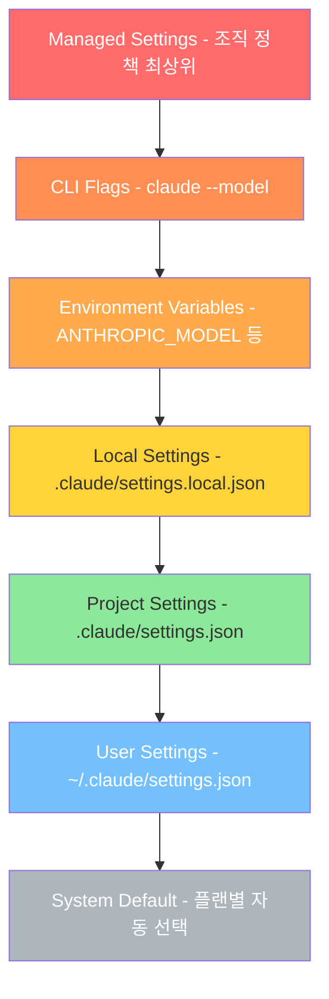
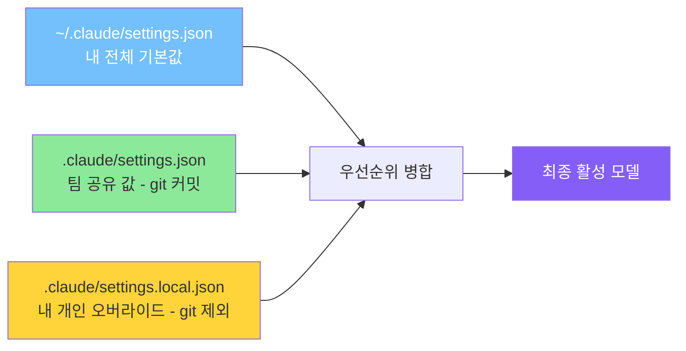
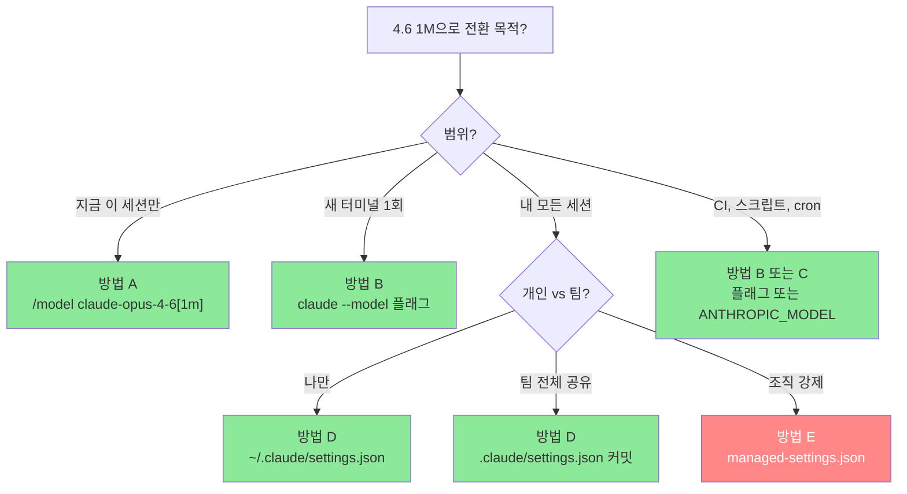

> 작성 기준: 2026-04-23 / Claude Code v2.1.111 이상 / Anthropic 공식 docs 기준

---

## 1. 들어가며 — 왜 이 문서가 필요한가

2026년 4월 16일에 Claude Opus 4.7이 일반 공개되면서 Claude Code의 `opus` alias는 기본적으로 Opus 4.7로 해석되기 시작했습니다. Anthropic 공식 발표에 따르면 Opus 4.7은 Opus 4.6의 직접적인 업그레이드로, 같은 가격($5/$25 per MTok)에 CursorBench 기준 58%에서 70%로 12포인트 상승한 코딩 성능, 3배 이상 향상된 비전 해상도(1568px→2576px), 그리고 새로 추가된 `xhigh` effort level 등을 갖추고 있습니다. 겉보기에는 무조건 새 모델로 옮겨 타는 것이 유리해 보이지만, 현장에서 실제로 써 보면 이야기가 달라지는 지점들이 있습니다.

Opus 4.7은 지시(instruction)를 훨씬 더 문자 그대로(literal) 해석합니다. 4.6이 모호한 지시를 '알아서 잘' 채워 넣었다면, 4.7은 요구한 만큼만 정확히 수행하고 요구하지 않은 것은 추론해서 더해주지 않습니다. 또한 새 토크나이저로 인해 같은 입력 텍스트가 4.6 대비 1.0~1.35배의 토큰으로 계산되기 때문에, 이전에 4.6 기준으로 튜닝해 둔 비용 모델·`max_tokens` 임계·컴팩션 트리거가 미세하게 어긋납니다. 말투도 더 직설적이고 검증적(validation-forward) 표현이 줄어들어, 장문 서술이나 한국어 기반 회의록·리포트처럼 '톤'이 결과물의 품질을 좌우하는 워크로드에서는 오히려 4.6의 따뜻한 스타일이 더 적합하다고 느끼는 사용자들이 적지 않습니다.

또 하나 간과되기 쉬운 점은 **효과적인 effort 레벨 범위가 다르다**는 사실입니다. Opus 4.6은 `low / medium / high / max`의 4단계, Opus 4.7은 `low / medium / high / xhigh / max`의 5단계를 지원합니다. Claude Code v2.1.117부터 Opus 4.7의 기본 effort가 `xhigh`로 설정되기 때문에, 4.6과 같은 비용 특성을 유지하려면 별도로 effort를 조정해주어야 합니다. 이런 상황에서 "안정화된 4.6 기반 파이프라인을 유지하면서 대형 코드베이스용 1M 컨텍스트는 그대로 쓰고 싶다"는 요구가 자연스럽게 생깁니다. 이 문서는 바로 그 시나리오, 즉 **Claude Code의 활성 모델을 Opus 4.7(1M)에서 Opus 4.6(1M)으로 확정적으로 전환하는 모든 경로**를 다룹니다.

---

## 2. 사전 지식 — Alias, Full Name, 그리고 `[1m]` Suffix

Claude Code의 모델 설정을 이해하려면 세 가지 개념을 분리해서 봐야 합니다. 첫째는 **alias**입니다. `opus`, `sonnet`, `haiku`, `best`, `default`, `opusplan` 같은 별칭은 "그때그때 권장되는 버전"을 가리키는 심볼릭 링크와 같아서, Anthropic이 새 모델을 출시할 때마다 자동으로 최신 버전으로 옮겨갑니다. 예를 들어 현재 Anthropic API 기준으로 `opus`는 Opus 4.7을, `sonnet`은 Sonnet 4.6을 가리킵니다. 반면 Bedrock, Vertex, Foundry 같은 서드파티 프로바이더에서는 `opus`가 여전히 Opus 4.6을 가리키며, 새 모델은 전체 이름을 명시하거나 환경변수로 pin해야 쓸 수 있습니다.

둘째는 **full model name**입니다. `claude-opus-4-7`, `claude-opus-4-6`, `claude-sonnet-4-6`, `claude-haiku-4-5-20251001`처럼 버전이 박힌 정식 이름이죠. alias와 달리 Anthropic이 새 모델을 낸다고 해서 값이 바뀌지 않기 때문에, **특정 버전에 고정(pin)하고 싶다면 반드시 full name을 써야 합니다.** 즉, Opus 4.6을 계속 쓰고 싶은 사용자에게 `"model": "opus"` 같은 설정은 위험합니다. 언젠가 Anthropic이 alias를 재지정하거나, 사용자가 서드파티 프로바이더로 이동하는 순간 의도와 다른 모델이 로드될 수 있기 때문입니다.

셋째는 **`[1m]` suffix**입니다. Claude Code는 컨텍스트 윈도우를 모델명 뒤에 붙이는 간단한 문법으로 표현합니다. `opus[1m]`, `sonnet[1m]`처럼 alias에 붙여도 되고, `claude-opus-4-6[1m]`처럼 full name에 붙여도 됩니다. 이 suffix가 있어야 1백만 토큰 컨텍스트 윈도우가 활성화됩니다. Max, Team, Enterprise 플랜은 Opus에 대해 자동으로 1M 업그레이드가 포함되지만, 그래도 `[1m]`을 명시적으로 써두면 모든 환경에서 동일하게 동작한다는 장점이 있습니다. 참고로 Claude Code는 provider에 실제 요청을 보낼 때 `[1m]` 접미사를 떼어내고 보냅니다.

결론적으로 이 가이드에서 추천하는 안전한 모델 지정 문자열은 **`claude-opus-4-6[1m]`** 입니다. 이 문자열 하나만 머리에 넣어두면 이후 이 문서에 나오는 모든 방법을 응용할 수 있습니다.

---

## 3. 설정 우선순위 이해하기

Claude Code의 모델 설정은 한 곳에서만 결정되지 않습니다. 여러 소스가 우선순위에 따라 겹쳐서 최종값이 정해지므로, "분명히 바꿨는데 계속 Opus 4.7이 뜬다"는 증상은 대개 더 높은 우선순위 소스가 덮어쓰고 있기 때문입니다. 공식 문서와 커뮤니티 레퍼런스를 종합하면 우선순위는 다음과 같습니다.



위에서 아래로 갈수록 우선순위가 낮아집니다. 예를 들어 사용자가 본인의 `~/.claude/settings.json`에 `"model": "claude-opus-4-6[1m]"`을 정성스럽게 적어 두었더라도, 프로젝트 루트의 `.claude/settings.json`에 `"model": "opus"`가 커밋되어 있으면 그 프로젝트에서는 Opus 4.7이 로드됩니다. 반대로 조직이 managed settings로 모델을 고정해 두었다면 어떤 개인 설정으로도 바꿀 수 없습니다. 따라서 전환 작업을 할 때는 **"내가 수정하려는 파일보다 우선순위가 높은 소스가 있는가"** 를 항상 먼저 점검해야 합니다.

덧붙여 v2.1.117부터 도입된 미묘한 동작 하나를 기억해두면 좋습니다. 프로젝트 `.claude/settings.json`이 특정 모델을 pin하고 있는 상태에서 사용자가 세션 중 `/model`로 다른 모델을 선택하면, Claude Code는 그 선택을 `.claude/settings.local.json`에도 기록하여 다음 실행 때까지 유지해줍니다. 이 덕분에 팀 공용 설정을 건드리지 않고도 개인 선호를 유지할 수 있습니다.

---

## 4. 전환 방법 다섯 가지 — 상황별 상세 설명

### 4.1 방법 A: 세션 중 즉시 전환 — `/model` 명령어

가장 가볍고 빠른 방법은 실행 중인 Claude Code 세션 안에서 `/model` 슬래시 커맨드를 사용하는 것입니다. 명령창에 `/model claude-opus-4-6[1m]`을 입력하면 그 즉시 활성 모델이 전환됩니다. 만약 alias만 알고 있고 버전을 고정할 필요가 없는 상황이라면 `/model opus[1m]`도 동일한 효과를 냅니다 — 단, 이 경우 Anthropic이 나중에 `opus` alias를 4.8 같은 상위 버전으로 옮기면 의도와 다르게 따라가게 됩니다.

인자 없이 `/model`만 입력하면 대화형 피커가 열려 설치된 모든 사용 가능 모델과 각 모델이 지원하는 effort 레벨 슬라이더까지 한 번에 확인할 수 있습니다. 대화 히스토리가 이미 쌓여 있는 세션에서 모델을 바꾸는 경우 Claude Code가 확인 프롬프트를 한 번 더 띄우는데, 이는 새 모델이 전체 히스토리를 캐시 없이 다시 읽어야 해서 한 턴의 토큰·응답 시간이 크게 늘어날 수 있기 때문입니다. 긴 세션 중간에 모델을 바꾸려면 이 비용을 감안해야 합니다.

이 방법의 장점은 즉시성이지만, 약점은 **이 세션에서의 선택이 자동으로 영구화되느냐가 프로젝트 설정에 달려 있다**는 것입니다. 기본적으로 `/model` 선택은 사용자 설정에 저장되어 재시작 후에도 유지되지만, 프로젝트 설정이 다른 모델을 pin하고 있다면 앞서 설명한 대로 `.claude/settings.local.json`에 개인 오버라이드로 저장됩니다. 즉 "전체 환경에서 영구적으로 4.6을 쓰고 싶다"면 `/model` 명령만으로는 부족하고, 아래 방법 D와 결합해야 합니다.

### 4.2 방법 B: 시작 시점에 플래그로 지정 — `--model`

새 터미널 세션을 시작하면서 임시로 다른 모델을 쓰고 싶다면 CLI 플래그가 가장 명료합니다. 다음처럼 실행합니다.

```bash
claude --model "claude-opus-4-6[1m]"
```

이 방법의 성격은 "딱 이 세션만"입니다. 종료하면 흔적이 남지 않고, 다음 세션은 다시 기본 설정을 따라갑니다. 그래서 스크립트·cron·CI 파이프라인·일회성 디버깅 세션에서 특정 버전을 강제하기에 적합합니다. 특히 규모가 큰 리팩토링 스크립트를 Opus 4.6의 안정된 동작 특성에 맞춰 작성해 둔 팀이라면, CI에서는 항상 `--model` 플래그로 모델을 명시해 **Anthropic이 alias를 옮겨도 CI 결과가 흔들리지 않도록** 격리할 수 있습니다.

한 가지 주의할 점이 있습니다. 셸에 따라 `[`와 `]`를 특수 문자로 해석할 수 있으므로 따옴표로 감싸는 편이 안전합니다. zsh처럼 glob 확장이 공격적인 셸에서 `[1m]`이 파일 매칭으로 해석돼 "no matches found" 오류가 날 수 있기 때문입니다.

### 4.3 방법 C: 환경변수로 고정 — `ANTHROPIC_MODEL`과 친구들

셸 프로파일에 환경변수를 설정하면 새로 여는 모든 터미널 세션이 자동으로 그 모델을 기본값으로 삼습니다. 가장 단순한 방법은 다음과 같습니다.

```bash
# macOS/Linux - ~/.zshrc 또는 ~/.bashrc
export ANTHROPIC_MODEL="claude-opus-4-6[1m]"
```

`ANTHROPIC_MODEL`은 alias와 full name 둘 다 받으며, `[1m]` suffix도 그대로 붙일 수 있습니다. 이 변수의 좋은 점은 **Claude Code가 이 값을 초기 선택으로 삼은 뒤 사용자가 `/model`로 바꾸면 그쪽을 존중한다**는 것입니다. 즉 "평소에는 4.6이지만 가끔은 4.7로 비교해보고 싶다"는 패턴에 잘 맞습니다.

반면 `opus` alias 자체가 Opus 4.6을 가리키도록 alias 자체를 재지정하고 싶다면 별도의 환경변수가 있습니다.

```bash
export ANTHROPIC_DEFAULT_OPUS_MODEL="claude-opus-4-6[1m]"
```

이렇게 두면 `/model opus`를 입력하든, 설정 파일에 `"model": "opus"`가 들어 있든, 내부적으로는 `claude-opus-4-6[1m]`로 해석됩니다. 동일한 패턴으로 `ANTHROPIC_DEFAULT_SONNET_MODEL`, `ANTHROPIC_DEFAULT_HAIKU_MODEL`도 사용할 수 있으며, 이는 Bedrock/Vertex/Foundry 같은 엔터프라이즈 배포에서 특정 버전을 조직 차원에 pin할 때 특히 유용합니다.

두 변수의 결정적인 차이를 한 번 더 짚고 가면, `ANTHROPIC_MODEL`은 "이 세션의 활성 모델"을 지정하고, `ANTHROPIC_DEFAULT_OPUS_MODEL`은 "alias를 해석할 때의 타깃"을 지정합니다. 사용자가 혼동하기 쉬운 부분이고, 동시에 쓰면 `ANTHROPIC_MODEL`이 우선합니다. 1M 컨텍스트를 alias 레벨에서 강제하려면 `ANTHROPIC_DEFAULT_OPUS_MODEL='claude-opus-4-6[1m]'`처럼 suffix를 함께 넣어주는 것이 관례입니다.

### 4.4 방법 D: 영구 설정 파일 — `settings.json`

재부팅이나 터미널 재설치에도 버티는 가장 확실한 방법은 설정 파일에 기록하는 것입니다. 세 가지 스코프가 있고 각각의 용도가 다릅니다.

**사용자 설정** (`~/.claude/settings.json`)은 로그인한 개인의 모든 프로젝트에 적용됩니다. 개인 기본값을 4.6으로 두고 싶다면 이 파일을 편집합니다.

```json
{
  "$schema": "https://json-schema.org/claude-code-settings.json",
  "model": "claude-opus-4-6[1m]",
  "env": {
    "ANTHROPIC_DEFAULT_OPUS_MODEL": "claude-opus-4-6[1m]"
  }
}
```

위 예시는 두 가지를 동시에 합니다. `model` 필드로 세션 시작 시의 활성 모델을 pin하고, `env` 블록으로 `opus` alias까지 4.6을 가리키게 고정해 사용자가 실수로 `/model opus`를 입력해도 결과가 동일하게 만듭니다. `$schema` 라인은 필수는 아니지만 VS Code 등 JSON 스키마 지원 에디터에서 자동완성과 유효성 검사가 켜져 타이핑 실수를 막아줍니다.

**프로젝트 설정** (`.claude/settings.json`)은 해당 레포지토리의 모든 협업자에게 공유됩니다. git에 커밋해서 팀 전체가 같은 모델 기준으로 작업하도록 만드는 곳이죠. 예를 들어 레거시 코드베이스를 대상으로 하는 대규모 리팩토링 프로젝트에서 "이 프로젝트에서는 4.6의 느슨한 해석 스타일이 더 잘 맞는다"고 판단했다면 프로젝트 설정에 넣습니다.

```json
{
  "model": "claude-opus-4-6[1m]",
  "availableModels": ["claude-opus-4-6", "claude-sonnet-4-6", "haiku"]
}
```

`availableModels`를 함께 지정하면 `/model` 피커에서 선택 가능한 모델 목록 자체가 제한되어, 팀원이 실수로 4.7을 고르는 상황을 원천 차단할 수 있습니다. 다만 피커의 **Default** 항목은 이 allowlist와 무관하게 항상 나타나며 플랜별 시스템 기본값으로 해석되므로, 완전한 통제가 필요하다면 `ANTHROPIC_DEFAULT_OPUS_MODEL`까지 함께 설정해야 합니다.

**로컬 설정** (`.claude/settings.local.json`)은 프로젝트 디렉토리 안에 있지만 git에는 커밋되지 않는(자동으로 `.gitignore`에 추가되는) 개인 오버라이드 영역입니다. 팀 전체는 Opus 4.7을 쓰는데 본인만 4.6을 쓰고 싶을 때 이 파일에 모델을 지정하면, 공용 프로젝트 설정을 건드리지 않고도 개인 환경만 4.6으로 유지할 수 있습니다.

세 파일의 관계를 시각화하면 다음과 같습니다.



### 4.5 방법 E: Managed Settings — 조직 레벨 강제

Enterprise 플랜을 사용하는 조직이라면 `managed-settings.json`을 통해 모든 사용자의 모델 선택을 강제할 수 있습니다. 이 설정은 사용자 파일, 프로젝트 파일, CLI 플래그, 환경변수까지 전부 이깁니다. 규정 준수나 비용 통제 때문에 "우리 팀은 아직 4.7 검증 전이니 4.6을 쓴다"는 정책을 내릴 때 사용하는 도구입니다.

```json
{
  "model": "claude-opus-4-6[1m]",
  "availableModels": ["claude-opus-4-6", "claude-sonnet-4-6"],
  "env": {
    "ANTHROPIC_DEFAULT_OPUS_MODEL": "claude-opus-4-6[1m]"
  }
}
```

Managed 설정은 플랫폼별로 설치 경로가 다릅니다. macOS에서는 `/Library/Application Support/ClaudeCode/managed-settings.json`, Windows에서는 레지스트리 키나 `%ProgramData%` 하위, Linux에서는 `/etc/claude-code/managed-settings.json` 계열입니다. 개인 사용자가 아니라면 평소에 신경 쓸 필요는 없지만, "설정이 무시된다"는 증상이 나타날 때 확인해야 할 최후의 후보이기도 합니다.

---

## 5. 상황별 결정 흐름도

어떤 방법을 써야 할지 애매할 때 아래 흐름을 따라가면 대체로 맞는 선택에 도달합니다.



경험적으로 가장 무난한 조합은 **사용자 설정 파일에 `"model": "claude-opus-4-6[1m]"`을 넣고, 동시에 `ANTHROPIC_DEFAULT_OPUS_MODEL=claude-opus-4-6[1m]` 환경변수를 셸 프로파일에 추가하는 것**입니다. 이렇게 이중으로 잠가 두면 사용자가 다른 프로젝트로 옮겨가 `cd`로 들어간 프로젝트에 잘못된 설정이 있더라도, 최소한 alias 레벨에서는 4.6이 유지됩니다.

---

## 6. 플랜별 1M 컨텍스트 접근성

1M 컨텍스트 윈도우의 실제 사용 가능 여부는 플랜에 따라 다릅니다. 공식 문서에 따르면 현재 상황은 다음과 같습니다.

| 플랜 | Opus 1M | Sonnet 1M | 비고 |
|---|---|---|---|
| **Max** | 구독에 포함 | extra usage 필요 | Opus는 자동 업그레이드 |
| **Team (Standard/Premium)** | 구독에 포함 | extra usage 필요 | Premium에서 기본 모델은 Opus 4.7 |
| **Enterprise** | 구독에 포함 | extra usage 필요 | 2026-04-23부터 pay-as-you-go는 기본값이 Opus 4.7 |
| **Pro** | extra usage 필요 | extra usage 필요 | `/extra-usage`로 활성화 |
| **API / pay-as-you-go** | 완전 접근 | 완전 접근 | 표준 가격에 200K 초과분 프리미엄 없음 |

Max/Team/Enterprise 플랜에서는 Opus가 자동으로 1M으로 업그레이드되기 때문에 `[1m]` suffix를 빠뜨려도 동작하는 경우가 많습니다. 하지만 Pro 플랜에서는 먼저 extra usage 결제를 활성화해야 1M 옵션이 `/model` 피커에 나타납니다. "분명히 `claude-opus-4-6[1m]`이라고 설정했는데 세션이 200K에서 멈춘다"는 증상이면 Pro 플랜 + extra usage 미활성일 가능성이 높습니다.

1M 자체를 환경에서 완전히 비활성화하고 싶다면 `CLAUDE_CODE_DISABLE_1M_CONTEXT=1` 환경변수를 설정합니다. 이 경우 `/model` 피커에서 `[1m]` 변형들이 아예 사라지며, 설정 파일에 써둔 `[1m]` suffix는 무시됩니다. 보안 민감한 환경에서 데이터 잔존 우려 때문에 컨텍스트 창을 작게 유지해야 하는 조직이 사용하는 옵션입니다.

가격 측면에서는 1M 컨텍스트 사용이 **200K 초과 토큰에 프리미엄을 붙이지 않습니다**. 즉 표준 Opus 가격 $5/$25 per MTok이 1M 구간에서도 동일하게 적용됩니다. 구독 플랜에서 1M이 포함된 경우 구독 한도 안에서 모두 소진되며, extra usage로 접근하는 플랜에서는 extra usage 버킷에서 차감됩니다.

---

## 7. Opus 4.6과 4.7의 실무적 차이 한눈에 보기

전환 후 체감될 수 있는 차이를 표로 정리했습니다.

| 항목 | Opus 4.6 | Opus 4.7 |
|---|---|---|
| **가격** | $5 / $25 per MTok | $5 / $25 per MTok (동일) |
| **컨텍스트** | 1M 토큰 | 1M 토큰 |
| **최대 출력** | 128K | 128K |
| **Effort 레벨** | low / medium / high / max | low / medium / high / **xhigh** / max |
| **Claude Code 기본 effort** | high | **xhigh** (v2.1.117+) |
| **Adaptive thinking** | 지원 (끄고 고정 budget 가능) | 항상 adaptive, 고정 budget 불가 |
| **토크나이저** | 기존 | **새 토크나이저** (1.0~1.35배 토큰) |
| **지시 해석** | 유연, 빈 곳 추론 | 문자 그대로, 덜 추론 |
| **톤** | 따뜻함, 검증적 표현 | 직설적, 의견 제시적 |
| **비전 해상도** | ~1568px (1.15MP) | **~2576px (3.75MP)** |
| **CursorBench** | 58% | 70% |
| **SWE-Bench Pro** | 기준선 | +11포인트 |
| **Subagent 기본 빈도** | 상대적으로 많이 생성 | 더 적게 생성 |

Opus 4.6을 선택하는 실질적 이유를 정리하면 다음 세 가지로 요약됩니다. 첫째, **기존 프롬프트 자산 보호**입니다. 느슨한 해석을 전제로 튜닝된 프롬프트가 수백 개라면 4.7로 옮길 때 상당수를 재검증해야 합니다. 둘째, **토큰·비용 모델의 안정성**입니다. 새 토크나이저가 과금 예측을 어긋나게 하므로, 4.6으로 남으면 내부 비용 대시보드·알림이 그대로 유효합니다. 셋째, **톤 요구사항**입니다. 고객 응대 문구, 따뜻한 내러티브, 한국어 보고서처럼 문체가 중요한 출력물에서는 4.6의 어조가 더 잘 맞는 경우가 있습니다.

반대로 4.7을 굳이 써야 할 이유 — 비전·장시간 에이전트 실행·엄격한 구조화 출력 — 가 현재 워크로드에 없다면, 안정화된 4.6을 유지하는 것이 합리적인 선택입니다.

---

## 8. 전환 후 확인하기

설정을 바꾼 뒤에는 반드시 실제로 원하는 모델이 활성화되었는지 검증해야 합니다. 가장 확실한 방법은 세 가지입니다.

**첫째, `/status` 명령어.** 세션 안에서 `/status`를 입력하면 현재 활성 모델, 해당 모델이 어느 설정 소스에서 왔는지(user/project/local/managed), effort 레벨, 1M 컨텍스트 활성 여부, 계정 플랜 정보가 한 화면에 표시됩니다. 가장 신뢰할 수 있는 진단 도구입니다.

**둘째, `/model` 피커.** 인자 없이 `/model`을 열면 현재 선택된 항목에 체크 표시가 붙어 있고, 각 항목 옆에 effort 슬라이더와 1M 지원 여부가 표시됩니다. `claude-opus-4-6[1m]`에 체크가 있고 그 옆에 effort가 `high`로 설정되어 있다면 의도대로 된 것입니다.

**셋째, 상태줄(status line).** `~/.claude/settings.json`에 `"statusLine"` 설정을 해두면 터미널 하단에 항상 현재 모델과 effort가 표시됩니다. 긴 작업 중에도 한눈에 확인할 수 있어 편합니다.

전환이 실패했을 때 가장 흔한 원인 네 가지와 해결 방법을 순서대로 점검해보면 다음과 같습니다.

`"model" 설정이 무시되는 증상`을 만나면, 먼저 managed settings가 깔려 있는지 확인합니다. 기업 지급 노트북에서는 IT팀이 정책으로 특정 모델을 강제해 두었을 수 있습니다. 그다음은 프로젝트 루트의 `.claude/settings.json`입니다. 팀 설정이 `opus`로 pin되어 있어서 사용자 설정을 덮고 있을 수 있습니다. 이어서 셸 프로파일에 과거에 설정해둔 `ANTHROPIC_MODEL` 환경변수가 잔존하는지 확인합니다. `echo $ANTHROPIC_MODEL`로 확인하고 `unset ANTHROPIC_MODEL`로 지울 수 있습니다. 마지막으로 Claude Code 버전을 점검합니다. `claude update` 명령으로 최신 버전(Opus 4.7 지원을 위해 v2.1.111 이상)으로 올려두는 것이 좋습니다.

`1M suffix가 적용되지 않는 증상`은 플랜 문제일 가능성이 큽니다. `/status`의 플랜 정보를 확인하고, Pro 플랜이면 `/extra-usage` 명령으로 extra usage를 활성화합니다. 또는 `CLAUDE_CODE_DISABLE_1M_CONTEXT=1`이 설정되어 있는지 확인합니다. 이 변수가 살아 있으면 `[1m]` suffix가 조용히 무시됩니다.

`Effort 레벨이 이상한 증상`에서는, 앞서 말했듯 Opus 4.7에서 설정해둔 `xhigh`가 Opus 4.6에서는 자동으로 `high`로 떨어집니다. 의도한 동작입니다. 4.6에서 더 깊은 추론을 원한다면 `/effort max`를 명시적으로 호출합니다. 반대로 "4.7에서는 잘 동작했는데 4.6에서는 답이 얕다"면 effort를 한 단계 올려 보는 것이 일반적인 처방입니다.

---

## 9. 되돌리기 (Rollback)

만약 전환 후 작업해보니 4.7이 더 나았다는 판단이 서면, 지금까지 한 모든 변경은 거울 대칭으로 되돌릴 수 있습니다. `claude-opus-4-6[1m]`을 썼던 자리를 `claude-opus-4-7[1m]` 또는 단순히 `opus[1m]`로 바꾸면 됩니다. 설정 파일은 버전 관리를 하고 있다면 `git checkout`으로 이전 커밋을 복원하면 그만이고, 환경변수는 `unset ANTHROPIC_MODEL`과 `unset ANTHROPIC_DEFAULT_OPUS_MODEL`로 비우면 시스템 기본값(현재 API 기준 Opus 4.7)으로 돌아갑니다.

혼합 운영도 가능합니다. 예를 들어 프로젝트 A는 4.6을, 프로젝트 B는 4.7을 써야 한다면 각 프로젝트의 `.claude/settings.json`에 서로 다른 모델을 pin하면 됩니다. 개인 오버라이드까지 추가하려면 `.claude/settings.local.json`을 활용합니다. 한 사용자가 여러 프로젝트에서 서로 다른 모델을 자연스럽게 오가는 구조가 이런 식으로 완성됩니다.

---

## 10. 실전 체크리스트

전환 작업을 실수 없이 끝내기 위한 단계별 점검표입니다. 위에서 아래로 순서대로 따라 하면 됩니다.

첫 단계는 **환경 파악**입니다. `claude --version`으로 Claude Code가 v2.1.111 이상인지 확인하고, 필요하면 `claude update`로 업그레이드합니다. `/status`로 현재 플랜, 활성 모델, 1M 접근성을 확인해 기준선을 잡습니다. 이 정보는 나중에 문제가 생겼을 때 변화의 출발점을 알려주는 중요한 자료가 됩니다.

두 번째는 **기존 설정 감사**입니다. `~/.claude/settings.json`, 작업 중인 프로젝트의 `.claude/settings.json`과 `.claude/settings.local.json`, 그리고 셸 프로파일(`~/.zshrc`, `~/.bashrc`, `~/.profile`)에 있는 `ANTHROPIC_` 접두 변수들을 모두 점검합니다. 어떤 소스가 현재 모델을 정하고 있는지 명확히 파악한 다음에 바꿔야 예기치 않은 충돌을 피할 수 있습니다.

세 번째는 **실제 변경**입니다. 앞서 추천한 조합 — 사용자 설정 파일의 `"model"` 필드와 셸 환경변수 `ANTHROPIC_DEFAULT_OPUS_MODEL` 두 곳 — 에 `claude-opus-4-6[1m]`을 기록합니다. 팀 공유가 필요하면 프로젝트 설정에도 동일 값을 커밋하고, 엔터프라이즈 강제가 필요하면 managed-settings에도 반영합니다.

네 번째는 **검증**입니다. 새 터미널을 열고 `claude`를 실행한 뒤 `/status`와 `/model`로 모델이 `claude-opus-4-6[1m]`이고 effort가 원하는 레벨인지 확인합니다. 간단한 코딩 태스크 하나를 실제로 돌려보면서 응답 스타일과 토큰 사용량이 예상대로인지 체감합니다.

다섯 번째는 **워크플로 재조정**입니다. `xhigh`에 맞춰 쓰고 있던 프롬프트가 있다면 `high`로 떨어진 effort를 감안해 보강하거나, 혹은 중요한 태스크에는 `/effort max`를 붙입니다. 4.7의 literal 해석을 전제로 작성했던 프롬프트가 있다면, 4.6의 유연한 해석이 모호함을 만들어내는 부분이 없는지 확인합니다. 토큰 사용량 대시보드가 있다면 4.6 기준으로 기대치를 재보정합니다.

마지막은 **문서화**입니다. 팀원들에게 왜 4.6으로 남았는지, 언제 4.7로 전환을 재검토할지 공유합니다. 프로젝트 README나 CLAUDE.md에 "현재 모델: claude-opus-4-6[1m] — Opus 4.7 프롬프트 검증 완료 시 전환 예정" 정도의 메모를 남겨 두면 몇 개월 뒤 자기 자신이나 신규 입사자가 혼란을 겪지 않습니다.

---

## 11. 한 줄 요약

**가장 단순한 영구 전환 방법**: `~/.claude/settings.json`에 `"model": "claude-opus-4-6[1m]"`을 추가하고, 셸 프로파일에 `export ANTHROPIC_DEFAULT_OPUS_MODEL="claude-opus-4-6[1m]"`을 추가한 뒤 터미널을 재시작하고 `/status`로 확인합니다. 그게 전부입니다.

---

## 12. 참고 자료

- **Claude Code Model Configuration 공식 문서**: <https://code.claude.com/docs/en/model-config>
- **Claude API Migration Guide (Opus 4.6 → 4.7)**: <https://platform.claude.com/docs/en/about-claude/models/migration-guide>
- **What's New in Claude Opus 4.7**: <https://platform.claude.com/docs/en/about-claude/models/whats-new-claude-4-7>
- **Anthropic 공식 Opus 4.7 발표**: <https://www.anthropic.com/news/claude-opus-4-7>
- **Context Windows (1M 컨텍스트 설명)**: <https://platform.claude.com/docs/en/build-with-claude/context-windows>
- **Claude Code Model Configuration 지원 센터**: <https://support.claude.com/en/articles/11940350-claude-code-model-configuration>

---

*작성 기준 시점: 2026-04-23. Anthropic의 모델 및 Claude Code 사양은 자주 업데이트되므로 운영 반영 전 공식 문서의 최신본을 재확인하는 것을 권장합니다.*
