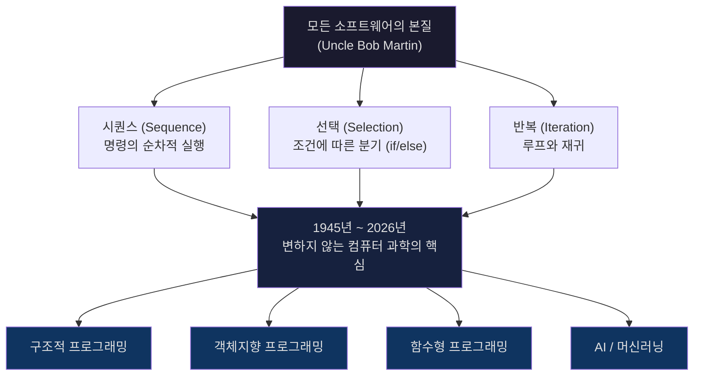
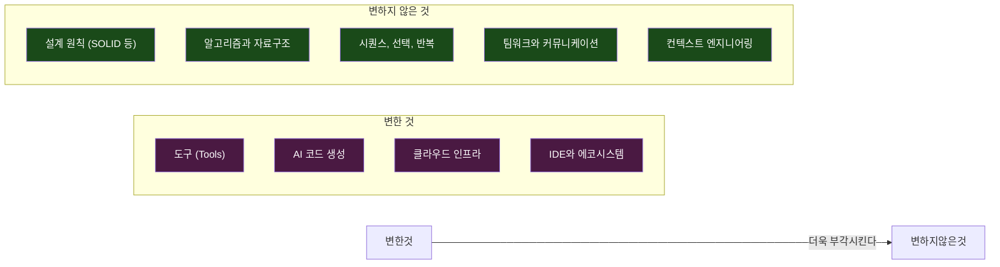
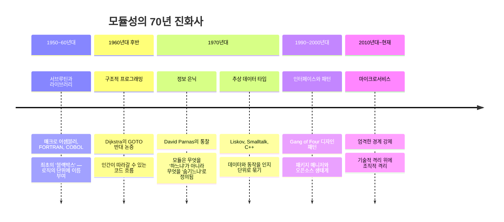
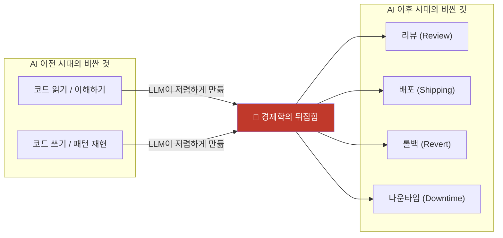
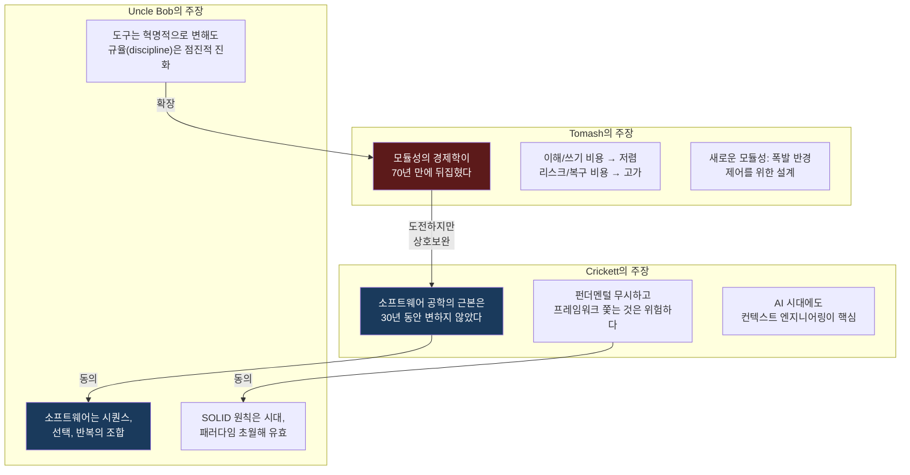
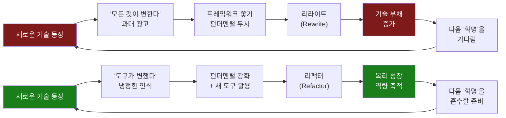

## John Crickett, Uncle Bob Martin, Tomash의 X(트위터) 논쟁 심층 분석

> 작성일: 2026-04-23  
> 출처: X(트위터) 스레드 — [@johncrickett](https://x.com/johncrickett/status/2046204735834013810), [@unclebobmartin](https://x.com/unclebobmartin/status/2046566984238731723), [@_tomash](https://x.com/_tomash/status/2046306417641181193)  
> 참고 블로그: [Let It Slop: A New Approach to Modularity in the Age of AI Code Generation](https://tomash.wrug.eu/blog/2026/04/19/new-modularity/)

---
## 관련글

[**소프트웨어 엔지니어링의 가장 큰 거짓말: "이 산업은 빠르게 변한다"**](https://k82022603.github.io/posts/%EC%86%8C%ED%94%84%ED%8A%B8%EC%9B%A8%EC%96%B4-%EC%97%94%EC%A7%80%EB%8B%88%EC%96%B4%EB%A7%81%EC%9D%98-%EA%B0%80%EC%9E%A5-%ED%81%B0-%EA%B1%B0%EC%A7%93%EB%A7%90-%EC%9D%B4-%EC%82%B0%EC%97%85%EC%9D%80-%EB%B9%A0%EB%A5%B4%EA%B2%8C-%EB%B3%80%ED%95%9C%EB%8B%A4/)

## 1. 논쟁의 발단: John Crickett의 도발적 선언

2026년 4월, John Crickett(@johncrickett)은 X(트위터)에 소프트웨어 엔지니어링 업계를 향한 도발적인 화두를 던졌다. 30년 넘게 현업에서 소프트웨어를 개발해온 베테랑 엔지니어인 그는 이렇게 단언했다.

> _"소프트웨어 엔지니어링에서 가장 큰 거짓말은 이 분야가 빠르게 변한다는 것이다. 나는 30년 동안 이 분야가 제자리에 머물러 있는 것을 지켜봤다."_

Crickett은 그 근거로 세 가지를 제시했다.

1. **우리는 여전히 수십 년 전의 언어와 알고리즘을 사용한다.** C 언어는 그가 커리어를 시작할 때도 널리 쓰였고, 지금도 마찬가지다. 스택, 힙 메모리, 데이터 구조 알고리즘의 대부분은 1950~60년대에 이미 정립된 것들이다.
2. **1990년대에 이미 좋은 것임을 알고 있었던 관행들을 우리는 아직도 채택하지 못하고 있다.** TDD, 클린 코드, 지속적 통합 같은 개념들은 수십 년 전에 등장했지만, 오늘날에도 많은 팀이 이를 무시한다.
3. **우리는 AI를 구축하는 데 1980년대의 아이디어를 사용하고 있다.** 오늘날 AI 붐을 이끄는 신경망, 역전파 알고리즘의 수학적 토대는 수십 년 전에 이미 확립된 것이다.

그리고 이 허구적 변화 내러티브가 가져오는 **실질적 해악**을 지적했다.

- _"6개월마다 모든 것이 바뀐다"_ 는 믿음은 엔지니어들이 **펀더멘털(기초) 대신 프레임워크 쫓기**에 몰두하게 만든다.
- 팀들이 **리팩터(refactor) 대신 리라이트(rewrite)** 를 선택하게 만든다.
- 우리가 하는 일이 진정한 **공학(engineering)** 임을 스스로 부정하게 만든다.

그의 핵심 주장은 간결하다. _"진정한 공학은 복리로 성장한다. 과거 위에 새로운 것을 쌓아올린다."_ 그렇다면 30년 동안 실제로 변한 것은 무엇이고, 단지 이름을 바꿔 재브랜딩한 것은 무엇인가?

---

## 2. Uncle Bob Martin의 동의와 심화: "소프트웨어의 본질은 불변이다"

Robert C. Martin, 즉 Uncle Bob(@unclebobmartin)은 Crickett의 주장에 동의하면서도 한 층 더 깊이 들어갔다.

> _"매우 맞는 말입니다. 도구는 혁명적인 방식으로 변해왔지만, 소프트웨어 엔지니어링이라는 규율(discipline) 자체는 혁명 없이 점진적으로 진화해왔습니다. 소프트웨어 설계와 소프트웨어 아키텍처의 원칙들은 시대, 플랫폼, 애플리케이션, 하드웨어와 무관하게 동일합니다. 결국 소프트웨어란 시퀀스(sequence), 선택(selection), 그리고 반복(iteration)에 불과하기 때문입니다."_

Uncle Bob의 "시퀀스, 선택, 반복" 테제는 그의 오랜 철학적 입장이다. 1945년 이후 소프트웨어의 근본이 바뀌지 않았다는 것이 그의 일관된 주장이다. 어떤 프로그래밍 언어이든, 어떤 패러다임이든, 모든 소프트웨어는 결국 이 세 가지 기본 구조의 조합이다.

Uncle Bob은 또한 SOLID 원칙의 영속성을 강조한다. 마이크로서비스 시대에 SOLID가 구식이라는 비판이 있지만, 그는 이에 반박한다. 핵심 논거는 **"각 세대는 자신의 기술적 맥락이 이전 세대와 근본적으로 다르다고 착각한다"** 는 것이다. 하지만 단일 책임 원칙(SRP), 개방-폐쇄 원칙(OCP), 리스코프 치환 원칙(LSP), 인터페이스 분리 원칙(ISP), 의존성 역전 원칙(DIP)은 패러다임이 바뀌어도 유효하다.

---

## 3. Crickett의 두 얼굴: 비판자이자 업데이터

흥미로운 것은 Crickett 자신도 소프트웨어 세계에서 **진정한 변화**가 존재함을 인정하는 입장으로 진화하고 있다는 점이다.

그는 자신의 LinkedIn 포스트에서 이렇게 밝혔다.

> _"AI 어시스티드 코딩에 대한 회의론자였던 내 선입견을 업데이트했다."_

METR의 데이터에 따르면 Claude Opus 4.5는 인간이 4시간 이상 걸리는 작업을 50% 성공률로 자율적으로 수행할 수 있으며, 2025년 초 모델들은 30분짜리 작업도 버거워했다. 이것은 단순한 점진적 개선이 아니라 **진정한 역량의 도약**이라고 그는 인정한다.

그러나 그는 여기서 핵심 통찰을 추가한다. **AI 코딩 도구를 효과적으로 활용하는 핵심 역량은 결국 '컨텍스트 엔지니어링(Context Engineering)'이며, 이것은 항상 중요했던 것**이라는 것이다. API를 잘 문서화하고, 명확한 패턴을 유지하며, 작동하는 예제를 제공하는 것 — 이 모든 것이 AI 시대에도 여전히 인간 엔지니어의 핵심 역할이다.

이것은 그의 원래 주장과 모순되지 않는다. **도구는 혁명적으로 변했지만, 좋은 엔지니어링의 본질은 변하지 않았다.** AI가 코드를 더 빠르게 생성하게 되었을 때, 진정으로 중요해지는 것은 오히려 오래된 가치들 — 명확한 구조, 좋은 문서, 일관된 패턴 — 이다.

---

## 4. Tomash의 반론: 그러나 "지각 변동"이 있다

바로 이 지점에서 Tomash(@_tomash)가 개입한다. 그는 이 논쟁이 펼쳐지던 날, 자신의 블로그에 ["Let It Slop: A New Approach to Modularity in the Age of AI Code Generation"](https://tomash.wrug.eu/blog/2026/04/19/new-modularity/)이라는 글을 게시했다고 알렸다.

Tomash의 핵심 논점은 이것이다. **소프트웨어 엔지니어링의 '왜'와 '어떻게'에서 약 70년 만에 처음으로 진정한 지각 변동이 일어나고 있다.**

### 4.1 모듈성의 70년 역사: 변하지 않았던 '경제 논리'

Tomash는 먼저 모듈성(modularity)이 왜 소프트웨어에서 중요했는지를 추적한다. 그 답은 놀랍도록 단순하다: **인간의 작업 기억(working memory)은 약 4~7개 항목밖에 다루지 못하기 때문이다.**

소프트웨어가 복잡해질수록 인간의 두뇌가 한 번에 처리할 수 있는 범위를 넘어선다. 좋은 모듈성이란 이 '인지적 압축(conceptual compression)'을 가능하게 하는 것이다. 즉, 복잡한 내부를 블랙박스로 숨기고 입출력만 알면 전체를 이해할 수 있게 만드는 것이다.

이 경제적 논리가 지난 70년간 프로그래밍의 모든 주요 발전을 이끌어왔다.

이 모든 발전의 공통 주제는 무엇인가? Tomash는 이렇게 정리한다. **"모듈성은 항상 인간이 코드를 이해하는 비용과 코드를 작성하는 비용을 줄이는 방향으로 최적화되어왔다."**

### 4.2 경제학의 뒤집힘: AI가 읽기와 쓰기를 저렴하게 만들다

그런데 바로 이 전제가 뒤집혔다. LLM은 코드의 패턴을 인식하고(읽기), 알려진 패턴에 맞는 코드를 재현하는(쓰기) 것에 매우 능숙하다. 결국 LLM은 **거대한 다차원 행렬을 이용한 패턴 인식과 패턴 재현 기계**이기 때문이다.

70년간 소프트웨어 혁신을 이끌어온 두 가지 인지 작업 — 읽기와 쓰기 — 이 이제 사실상 저렴해졌다.

그렇다면 이제 무엇이 비싼가?

1. **리뷰(Reviewing):** 인간은 이 코드를 배포해도 안전한지 판단해야 한다. diff만 보는 리뷰는 전체 맥락을 드러내지 못한다.
2. **배포(Shipping):** 배포 파이프라인, 조율, 타이밍, 리스크 관리는 여전히 시간이 걸린다.
3. **롤백(Reverting):** 프로덕션에서 문제가 생겼을 때 되돌리는 것은 변경이 얽혀 있을수록 비싸진다.
4. **다운타임(Downtime):** 프로덕션 장애는 여전히 가장 비싼 이벤트다.

**제약이 이동했다.** 우리는 '코드를 이해하고 쓰는 비용'에 최적화하던 시대에서 **'리스크와 복구 비용'에 최적화해야 하는 시대**로 넘어가고 있다.

### 4.3 새로운 모듈성 철학: "이해를 위한 설계"에서 "폭발 반경 제어를 위한 설계"로

이 논리에서 Tomash는 새로운 모듈성 철학을 도출한다.

**기존 모델:** 모듈은 복잡성을 숨기고 개발자가 사고하는 것을 돕는 잘 명명된 추상화다.

**새로운 모델:** 모듈은 정의된 입출력과 부수효과를 가진 기능 단위로, 만약 그것이 고장났을 때 즉시 비활성화할 수 있고, 요구사항이 바뀌면 처음부터 새로 작성해서 교체할 수 있도록 설계된다. **코드 중복이 발생하더라도.**

이 철학의 핵심 원칙들은 다음과 같다.

#### 원칙 1: 런타임 코드 경로 제어 (Feature Flag)

가장 중요한 비협상 조건은 **어떤 코드 경로로 진입할지를 배포 시점이 아닌 런타임에 결정**하는 것이다. 이상적으로는 피처 플래그(Feature Flag)를 통해 점진적으로 롤아웃하며 동작을 관찰한다.

이것은 단순해 보이지만 모든 것을 바꾼다. 모듈을 배포 없이 끌 수 있다면, 그 모듈을 배포하는 것은 더 이상 두려운 이벤트가 아니다. **롤백이 저렴해지면, 더 빨리 배포할 수 있다. 더 빨리 배포하면, 더 빨리 피드백을 받는다. 더 빨리 피드백을 받으면, 더 빨리 배운다.**

#### 원칙 2: 수정이 아닌 교체 (Replace, Not Refactor)

요구사항이 크게 변했을 때, 기존 모듈을 들어가서 수정하고 싶은 본능이 있다. 리팩터링. 추상화 추출. 이것이 크래프트다. 이것이 좋은 엔지니어링처럼 보인다.

그러나 Tomash는 정반대를 제안한다. **요구사항이 크게 바뀌면, 새 버전을 처음부터 작성한다.** 새 버전은 구 버전 옆에 공존한다. 런타임 코드 경로가 사용자를 점진적으로 새 버전으로 라우팅한다(5% → 20% → 100%). 확신이 생기면 구 버전을 삭제한다.

#### 원칙 3: 모듈 간 내부 공유 금지

공유 헬퍼는 결합(coupling)을 재창조한다. 두 모듈이 동일한 헬퍼를 임포트하면, 그 헬퍼의 변경이 두 모듈 모두에 영향을 준다. **모듈 간 중복은 독립적 교체 가능성의 대가이며, 오늘날 코드 작성 비용에서 그것은 저렴한 대가다.**

이것은 Erlang 철학과 맞닿는다. Erlang은 1980년대 말 Ericsson에서 통신 인프라를 위해 설계되었다. "Hot code swapping"(실행 중인 시스템의 코드를 다운타임 없이 교체), 격리된 프로세스, 고장 격리 — 이 원칙들이 다시 주목받는다.

---

## 5. 종합 분석: 세 관점의 조화와 긴장

이 세 인물의 논쟁을 종합하면 흥미로운 구조가 드러난다.

세 사람의 입장을 정리하면 다음과 같다.

| 구분 | Crickett | Uncle Bob | Tomash |
|------|----------|-----------|--------|
| **무엇이 변하지 않는가** | 언어, 알고리즘, 좋은 관행의 본질 | 시퀀스·선택·반복, SOLID 원칙 | 모듈성의 '왜' 자체(비용 절감) |
| **무엇이 변했는가** | 도구, AI 역량의 도약 | 도구와 생태계 | 비용의 구조(읽기/쓰기 → 저렴, 리스크/복구 → 고가) |
| **결론** | 펀더멘털에 집중하라 | 규율을 쌓아올려라 | 모듈성 철학을 재정의하라 |
| **AI에 대한 입장** | 도구의 변화는 인정, 본질은 불변 | 혁명적 도구 변화, 규율의 점진적 진화 | 진정한 지각 변동, 새 설계 철학 필요 |

---

## 6. 역사적 맥락: '변화의 과대 광고 사이클'과 '진짜 변화'

Crickett의 논점에서 가장 예리한 부분은 소프트웨어 업계의 **변화 과대 광고(hype) 사이클**에 대한 비판이다. 실제로 역사를 보면 이 패턴이 반복적으로 나타난다.

- **1990년대의 객체지향 혁명:** OOP가 소프트웨어 개발을 완전히 바꿀 것이라 했다. 실제로는 기존 설계 원칙들이 OOP 맥락으로 재표현된 것이었다.
- **2000년대의 SOA(서비스 지향 아키텍처):** 기업 소프트웨어를 혁신할 것이라 했다. 마이크로서비스로 이름을 바꿔 다시 등장했다.
- **2010년대의 마이크로서비스:** 모든 것을 작은 서비스로 나누면 된다고 했다. 분산 시스템의 복잡성이라는 오래된 문제가 새롭게 포장되어 등장했다.
- **2020년대의 AI/LLM 혁명:** 프로그래머가 곧 필요 없어질 것이라 한다. 하지만 컨텍스트 엔지니어링, 아키텍처 설계, 리뷰 역량이 오히려 더 중요해지고 있다.

그러나 중요한 구분이 필요하다. 모든 변화가 과대 광고는 아니다. Tomash가 지적하듯, LLM이 코드의 읽기와 쓰기 비용을 실질적으로 낮춘 것은 실재하는 경제적 변화다. 다만 그것이 어떤 의미에서 변화인지를 정확히 이해하는 것이 중요하다. 소프트웨어의 본질이 바뀐 것이 아니라, **소프트웨어 개발의 경제학이 바뀐 것**이다.

---

## 7. 실천적 함의: 엔지니어는 어떻게 해야 하는가

이 논쟁에서 추출할 수 있는 실천적 결론들을 정리한다.

### 7.1 펀더멘털에 투자하라

Crickett이 강조하는 것처럼, 프레임워크는 왔다 가지만 펀더멘털은 남는다. 알고리즘과 자료구조, 설계 원칙, 시스템 설계의 기초 — 이것들은 어떤 기술 사이클에서도 가치를 유지한다.

Crickett이 즐겨 인용하는 원칙이 있다. **"재건할 수 없다면, 이해하지 못한 것이다(If you can't rebuild it, you don't understand it)."** 도구를 사용하는 것과 그 도구가 왜 존재하는지를 아는 것은 다른 차원의 이해다.

### 7.2 복리(Compound) 역량을 구축하라

Uncle Bob이 말하는 "규율(discipline)의 점진적 진화"란 한 세대의 지식이 다음 세대로 쌓이는 것을 의미한다. Dijkstra의 구조적 프로그래밍은 Parnas의 정보 은닉으로, Parnas의 정보 은닉은 객체지향으로, 객체지향은 SOLID 원칙으로, SOLID 원칙은 클린 아키텍처로 이어졌다. 이것이 진정한 공학적 복리다.

### 7.3 AI 시대의 모듈성을 재설계하라

Tomash가 제시하는 방향은 실용적이다. AI가 코드 생성을 저렴하게 만든 지금, 모듈 설계의 기준을 바꿔야 한다. "이 코드는 이해하기 쉬운가?"에서 **"이 코드가 잘못되었을 때 즉시 끌 수 있는가?"** 로.

피처 플래그를 통한 런타임 코드 경로 제어, 모듈의 독립적 교체 가능성, 모듈 간 중복을 허용하는 결합 해제 — 이것들이 AI 시대의 새로운 모듈성 철학이다.

### 7.4 '6개월마다 모든 것이 바뀐다'는 서사에 저항하라

이 서사는 엔지니어를 소비자로 만든다. 최신 프레임워크를 소비하고, 다음 프레임워크를 기다리는 소비자. 반면 **진정한 엔지니어는 생산자다.** 기초 위에 새로운 것을 쌓는 사람이다.

Crickett이 30년 경력에서 배운 교훈은 간결하다. 소프트웨어 엔지니어링에서 진정으로 중요한 것들 — 명확성, 단순성, 테스트 가능성, 유지보수성 — 은 언제나 중요했고, 앞으로도 중요할 것이다.

---

## 8. 결론: "Plus ça change, plus c'est la même chose"

프랑스 속담이 있다. _"Plus ça change, plus c'est la même chose."_ — "더 많이 변할수록, 더 같은 것이 된다."

John Crickett의 도발, Uncle Bob Martin의 심화, Tomash의 반론을 종합하면 역설적 진실에 도달한다.

**소프트웨어 엔지니어링에서 변하지 않는 것이 있다는 사실 자체는 변하지 않는다.** 도구는 혁명적으로 바뀐다. 생태계는 요동친다. 새로운 패러다임이 등장한다. 그러나 시퀀스, 선택, 반복이라는 소프트웨어의 본질, 좋은 설계 원칙의 가치, 인간 인지의 한계라는 근본 제약 — 이것들은 변하지 않는다.

변하는 것은 **이 변하지 않는 원칙들을 어떻게 적용하느냐**다. Tomash가 보여주듯, AI 시대에는 모듈성을 "인지 비용 최소화"가 아닌 "리스크 제어"의 관점에서 적용해야 한다. 이것은 원칙의 배신이 아니라, 원칙의 시대적 적용이다.

6개월마다 모든 것이 바뀐다는 서사를 버리고, 변하는 것과 변하지 않는 것을 분별하는 능력. 그것이 진정한 소프트웨어 공학자의 역량이다.

---

## 참고 자료

- John Crickett (@johncrickett) X 포스트: https://x.com/johncrickett/status/2046204735834013810
- Uncle Bob Martin (@unclebobmartin) X 포스트: https://x.com/unclebobmartin/status/2046566984238731723
- Tomash (@_tomash) X 포스트: https://x.com/_tomash/status/2046306417641181193
- Tomash 블로그: https://tomash.wrug.eu/blog/2026/04/19/new-modularity/
- John Crickett LinkedIn: https://www.linkedin.com/in/johncrickett/
- Uncle Bob Martin Clean Code (2026 Expanded Edition): https://www.oreilly.com/videos/clean-code-fundamentals/9780134661742/
- Robert C. Martin Wikipedia: https://en.wikipedia.org/wiki/Robert_C._Martin

---

*작성일: 2026-04-23*
