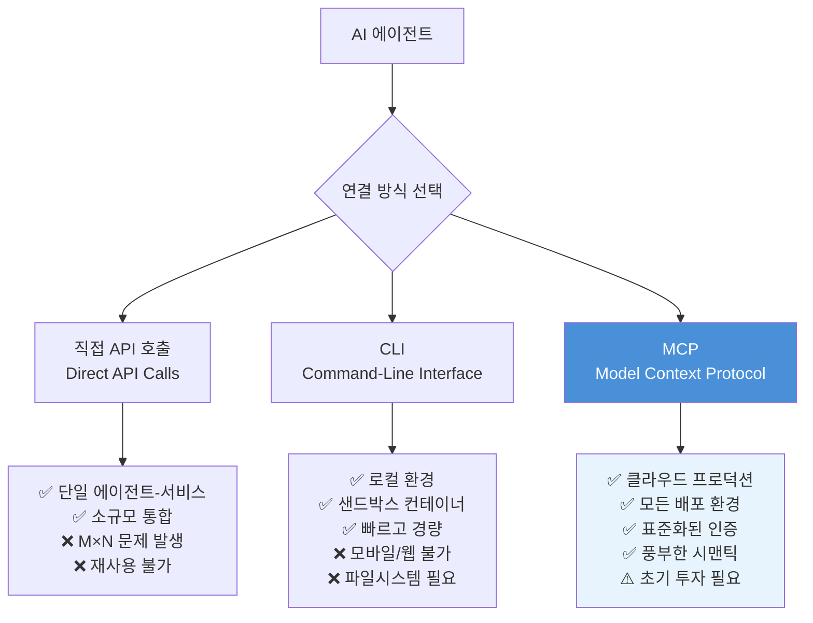
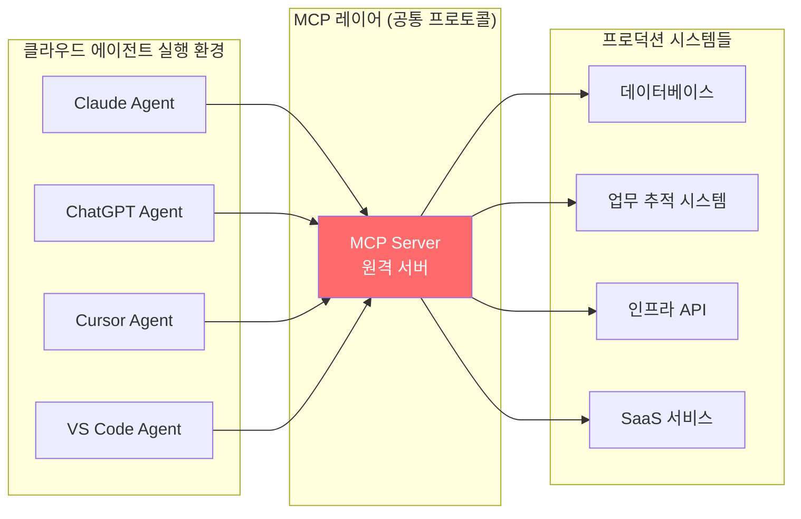
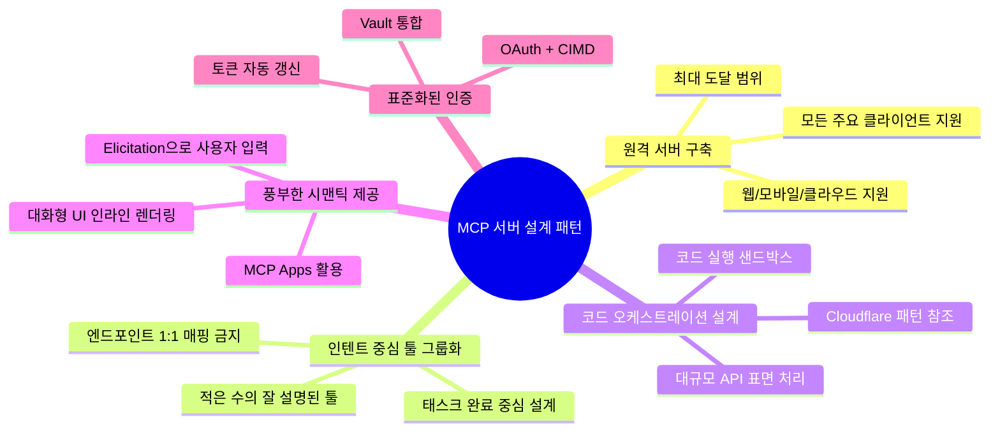
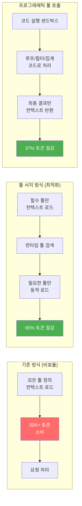
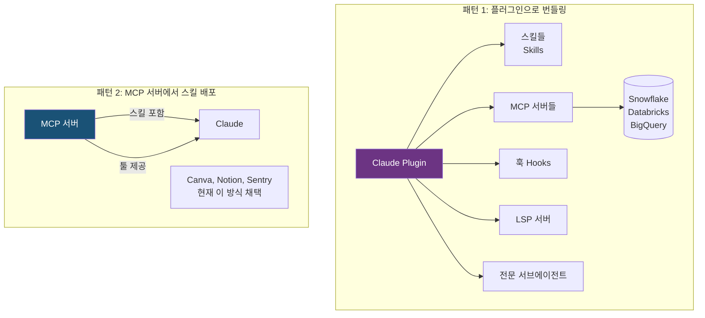
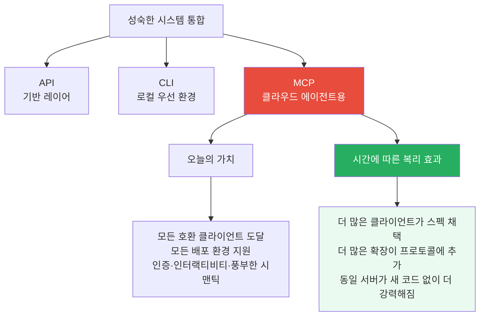

> **출처**: Anthropic 공식 블로그 (2026년 4월 22일)  
> **원문**: [Building agents that reach production systems with MCP](https://claude.com/blog/building-agents-that-reach-production-systems-with-mcp)  
> **트위터**: [@claudedevs](https://x.com/claudedevs/status/2047086372666921217)  
> **작성일**: 2026년 4월 23일 

---

## 개요: 왜 이 글이 중요한가

Anthropic이 2026년 4월 22일 발행한 이 블로그 포스트는 단순한 기술 문서가 아니다. 이것은 AI 에이전트 시대에 외부 시스템과 연결하는 방법론에 대한 Anthropic의 현재 사상과 실전 패턴을 집약한 선언문에 가깝다. 에이전트가 단순히 질문에 답하는 존재에서 실제 업무를 수행하는 존재로 진화하는 과정에서, "어떻게 외부 세계와 연결하는가"는 가장 근본적인 질문이다. 이 포스트는 바로 그 질문에 대한 Anthropic의 현재 답변이다.

MCP SDK 월간 다운로드 수가 연초 1억 건에서 3억 건으로 폭증했고, 2026년 4월 뉴욕에서 열린 MCP Dev Summit North America에는 약 1,200명이 참석했다는 사실은, MCP가 이미 실험적 프로토콜을 넘어 산업 표준으로 자리잡고 있음을 보여준다. Gartner는 2026년까지 API 게이트웨이 벤더의 75%, iPaaS 벤더의 50%가 MCP 기능을 탑재할 것으로 전망했고, Forrester는 엔터프라이즈 앱 벤더의 30%가 자체 MCP 서버를 출시할 것이라고 예측했다. 이 글은 그런 맥락 위에서 읽혀야 한다.

---

## 1. 에이전트와 외부 시스템을 연결하는 세 가지 방법

블로그의 첫 번째 핵심 프레임은 에이전트가 외부 시스템에 접근하는 세 가지 경로를 정리하는 것이다. Anthropic은 이를 **직접 API 호출**, **CLI**, **MCP**로 구분하며, 각각이 적합한 시나리오가 다르다고 설명한다.

### 1-1. 직접 API 호출: 시작점이지만 한계가 있다

대부분의 팀이 처음 에이전트를 만들 때 선택하는 방식이다. 에이전트가 코드 실행 샌드박스 안에서 HTTP 요청을 직접 날리거나, 범용 function-calling 도구를 통해 API를 호출한다. 단일 에이전트가 단일 서비스와 대화하는 상황, 혹은 재사용이 필요 없는 소수의 통합에서는 충분히 작동한다.

문제는 스케일이다. 에이전트와 서비스 사이에 공통 레이어가 없으면, 에이전트-서비스 쌍마다 별도의 인증 처리, 툴 설명, 엣지 케이스 처리가 필요해진다. 이것이 바로 **M×N 통합 문제**다. M개의 에이전트와 N개의 서비스가 있을 때, M×N개의 맞춤형 통합이 필요해지는 구조적 비효율이다.

### 1-2. CLI: 로컬에서의 빠른 통합

에이전트가 셸에서 CLI 도구를 실행하는 방식이다. 기존 도구를 그대로 활용할 수 있어 빠르고 가볍다. 파일시스템과 셸이 있는 로컬 환경, 샌드박스 컨테이너에서는 탁월한 선택이다. "공통 레이어"를 제공하기는 하지만 그 레이어가 매우 얇다.

결정적 한계는 모바일, 웹, 클라우드 호스팅 플랫폼에서는 작동하지 않는다는 점이다. 컨테이너를 노출하지 않는 환경에서는 CLI를 실행할 방법이 없다. 인증도 디스크의 자격증명 파일에 의존하는 경우가 많아 클라우드 에이전트 환경에 부적합하다. 이 방식은 빠르고 허용적인 로컬 환경에 적합한 해법이다.

### 1-3. MCP: 프로토콜로서의 공통 레이어

MCP는 공통 레이어를 **프로토콜**로 제공한다. 에이전트는 서버에 연결하고, 서버는 해당 시스템의 기능을 노출한다. 인증, 디스커버리, 풍부한 시맨틱이 표준화되어 있다. 하나의 원격 서버가 Claude, ChatGPT, Cursor, VS Code 등 모든 호환 클라이언트에서, 어떤 배포 환경에서도 동작한다.

초기 투자가 다소 필요하다는 게 단점이지만, 리턴은 명확하다. 이식성 있는 통합이 가능하고, 기능이 풍부한 에이전트 통합에 필요한 시맨틱을 갖추게 된다.

---

## 2. 프로덕션 에이전트는 클라우드에서 실행된다

블로그의 두 번째 핵심 주장은 프로덕션 에이전트의 실행 환경에 관한 것이다. 스케일과 지속적 운영이 필요한 프로덕션 에이전트는 점점 더 클라우드에서 실행되고 있다. 그리고 에이전트가 접근해야 하는 시스템들—데이터, 업무 추적, 인프라—도 마찬가지로 클라우드에 있다. 이 시스템들은 대부분 원격으로 접근해야 하고 인증이 필요하다. 바로 이 지점에서 MCP가 공통 레이어를 제공한다.

이 맥락에서 MCP의 채택 수치가 의미를 갖는다. MCP SDK의 월간 다운로드 수가 연초 1억 건에서 3억 건을 돌파했으며, 엔터프라이즈와 주요 에이전트 플랫폼에서 강한 채택이 이루어지고 있다. 수백만 명의 사람들이 매일 MCP를 Claude와 함께 사용하고 있으며, 이 프로토콜은 Claude Cowork, Claude Managed Agents, Claude Code의 채널 등 최근 출시된 주요 기능들의 근간이 되고 있다.

2026년 현재 300개 이상의 MCP 클라이언트(Claude Desktop, Cursor, Windsurf, VS Code, Zed, Replit 등)가 존재하며, Claude를 통해서만 월 10억 건 이상의 툴 호출이 MCP를 통해 이루어지고 있다. Fortune 500 기업 중 Block, Bloomberg, Amazon, Pinterest 등이 MCP를 배포했으며, 엔터프라이즈 AI 팀의 67%가 MCP를 사용하거나 검토 중이다.

---

## 3. 효과적인 MCP 서버 구축: 5가지 핵심 패턴

블로그의 가장 실용적인 섹션이다. Anthropic은 200개 이상의 MCP 서버 디렉토리와 수백만 명의 일간 사용자를 통해 축적된 실전 경험을 바탕으로, 에이전트가 서버를 얼마나 안정적으로 사용할 수 있는지를 결정하는 핵심 설계 패턴들을 제시한다.

### 3-1. 원격 서버로 구축하라: 최대 도달 범위

분배(distribution)를 원한다면 원격 서버가 답이다. 원격 서버만이 웹, 모바일, 클라우드 호스팅 에이전트 전체에서 실행될 수 있는 유일한 구성이며, 모든 주요 클라이언트가 최적화되어 있는 방식이다. 로컬 서버는 개발 초기에는 유용하지만, 배포 환경에서는 도달 범위가 심각하게 제한된다.

### 3-2. 엔드포인트가 아닌 인텐트(의도)를 중심으로 툴을 그룹화하라

이것은 MCP 서버 설계에서 가장 자주 범하는 실수와 연결된다. 많은 팀이 기존 API를 MCP 서버로 변환할 때, API 엔드포인트를 1:1로 매핑하는 방식을 택한다. Anthropic은 이것이 잘못된 접근이라고 명확히 한다.

**잘못된 방식**: `get_thread` → `parse_messages` → `create_issue` → `link_attachment`  
**올바른 방식**: `create_issue_from_thread` (단 하나의 툴)

더 적고 잘 설명된 툴이 방대한 API 미러보다 일관되게 더 나은 성능을 보인다. 에이전트가 수많은 원시 함수를 조합하는 것이 아니라, 두세 번의 호출로 태스크를 완료할 수 있어야 한다. 이는 에이전트의 컨텍스트 효율성과 신뢰성 모두에 직결되는 설계 원칙이다.

### 3-3. API 표면이 방대하다면 코드 오케스트레이션을 설계하라

Cloudflare, AWS, Kubernetes처럼 수백 가지 개별 작업이 필요한 서비스는 인텐트 기반 툴셋으로는 커버가 불가능하다. 이럴 때 Anthropic이 제시하는 패턴은 **코드를 받아들이는 얇은 툴 표면**이다.

에이전트가 짧은 스크립트를 작성하고, 서버는 이를 샌드박스에서 API 대상으로 실행하며, 결과만 반환한다. Cloudflare의 MCP 서버가 이의 기준 사례다. 단 2개의 툴(검색과 실행)로 약 2,500개의 엔드포인트를 대략 1K 토큰으로 커버한다. 이것은 컨텍스트 효율성의 극단적 최적화 사례다.

### 3-4. 풍부한 시맨틱을 제공하라: MCP Apps와 Elicitation

**MCP Apps**는 최초의 공식 프로토콜 확장으로, 툴이 인터랙티브 인터페이스(차트, 폼, 대시보드 등)를 반환하여 채팅 인터페이스 안에서 인라인으로 렌더링하는 것을 가능하게 한다. 텍스트만 반환하는 서버에 비해 MCP Apps를 탑재한 서버는 채택률과 리텐션이 의미 있게 높은 것으로 나타났다. Claude.ai, Claude Cowork, 그리고 다수의 주요 AI 툴에서 지원된다.

**Elicitation**은 서버가 툴 호출 중간에 사용자 입력을 요청할 수 있게 해주는 메커니즘이다. 두 가지 모드가 있다.

- **폼 모드(Form mode)**: 간단한 스키마를 보내면 클라이언트가 네이티브 폼을 렌더링한다. 누락된 파라미터를 요청하거나, 파괴적 작업을 확인하거나, 옵션을 명확히 할 때 사용한다. 폭넓게 지원된다.

- **URL 모드(URL mode)**: 사용자를 브라우저로 유도한다. 다운스트림 OAuth 완료, 결제 처리, MCP 클라이언트를 거쳐선 안 되는 자격증명 수집 등에 사용한다. 현재 Claude Code에서 지원되며 더 많은 클라이언트로 확산 중이다.

두 모드 모두 사용자를 설정 페이지로 내보내지 않고 작업 흐름 안에 머물게 한다는 점에서 UX 관점에서 의미가 크다.

### 3-5. 표준화된 인증에 의존하라

표준화된 인증은 클라우드 호스팅 에이전트에서 MCP를 실용적으로 만드는 핵심이다. 최신 MCP 스펙은 OAuth에 대해 **CIMD(Client ID Metadata Documents)** 클라이언트 등록을 지원한다. 이를 통해 최초 인증 흐름이 빨라지고 예상치 못한 재인증 요청이 크게 줄어든다.

사용자가 인가를 마친 후에는 **Claude Managed Agents의 Vault**가 중요한 역할을 한다. 사용자의 OAuth 토큰을 한 번 등록하고 세션 생성 시 Vault ID로 참조하면, 플랫폼이 각 MCP 연결에 올바른 자격증명을 주입하고 대신 갱신해준다. 직접 구축해야 하는 시크릿 저장소도, 호출마다 전달해야 하는 토큰도 없다.

---

## 4. 컨텍스트 효율적인 MCP 클라이언트 구축

MCP 클라이언트(에이전트 오케스트레이터)를 만드는 팀을 위한 섹션이다. 서버가 더 많이 연결될수록 컨텍스트 비용이 기하급수적으로 늘어나는 문제를 해결하는 두 가지 핵심 패턴이 제시된다.

### 4-1. 온디맨드 툴 정의 로딩: Tool Search

컨텍스트 문제의 규모를 먼저 이해해야 한다. 5개 서버 셋업의 경우 58개 툴이 약 55K 토큰을 소비하며, Jira 하나만 해도 약 17K 토큰을 사용한다. Anthropic 내부에서는 최적화 전 툴 정의가 134K 토큰을 소비하는 경우도 있었다.

**툴 서치(Tool Search)** 는 모든 툴 정의를 미리 컨텍스트에 로드하지 않고 런타임에 카탈로그를 검색하여 필요한 툴만 가져오는 방식이다. Anthropic의 테스트에서 툴 서치는 툴 정의 토큰을 85% 이상 줄이면서도 높은 선택 정확도를 유지했다. Opus 4는 49%에서 74%로, Opus 4.5는 79.5%에서 88.1%로 MCP 평가 정확도가 향상되었다.

구현 방식은 `defer_loading: true`로 표시된 툴은 초기에 로드되지 않고, Claude는 Tool Search Tool만 볼 수 있으며, 필요한 기능이 생기면 툴을 검색하여 관련 정의를 컨텍스트에 가져온다.

### 4-2. 프로그래매틱 툴 호출: 결과를 코드로 처리하라

**프로그래매틱 툴 호출(Programmatic Tool Calling)** 은 툴 결과를 모델에 원시 데이터로 반환하는 대신, 코드 실행 샌드박스에서 처리하는 방식이다. 에이전트가 코드 안에서 루프, 필터, 집계를 수행하고 최종 출력만 컨텍스트에 도달한다. Anthropic의 테스트에서 이 방식은 복잡한 다단계 워크플로우에서 토큰 사용량을 약 37% 줄였다.

두 패턴은 자연스럽게 조합된다. 더 가벼운 컨텍스트, 더 적은 라운드트립, 더 빠른 응답을 동시에 달성한다.

---

## 5. MCP 서버와 스킬의 조합: 두 가지 패턴

블로그의 마지막 주요 섹션은 MCP와 스킬(Skills)의 관계를 다룬다. 이 두 가지는 경쟁하는 것이 아니라 보완적이다.

> **MCP**: 외부 시스템의 툴과 데이터에 대한 접근  
> **스킬(Skills)**: 그 툴을 사용하여 실제 업무를 수행하는 절차적 지식

가장 유능한 에이전트는 둘 다 사용한다. 스킬은 MCP 서버를 소수의 연결 너머로 확장시킨다.

### 5-1. 스킬과 MCP 서버를 플러그인으로 번들링

**Claude용 플러그인**은 스킬, MCP 서버, 훅, LSP 서버, 전문화된 서브에이전트를 하나의 쉽게 소비 가능한 배포 방법으로 묶는 추상화다. 여러 컨텍스트 제공자를 최소한의 마찰로 통합하는 최선의 방법이다.

Anthropic의 Cowork용 데이터 플러그인이 이 패턴의 실례다. 10개의 스킬과 Snowflake, Databricks, BigQuery, Hex 등을 위한 8개의 MCP 서버로 구성되어 있다. 스킬이 MCP를 통해 가져온 도구들을 오케스트레이션하여 Claude가 도메인 전문가처럼 행동할 수 있게 된다.

### 5-2. MCP 서버에서 스킬 배포

공급자가 MCP 서버와 함께 스킬을 게시하는 방식이다. 에이전트는 원시 기능과 그것을 잘 사용하기 위한 견해 있는 플레이북을 함께 얻게 된다. 현재 Canva, Notion, Sentry 등이 Claude의 웹 디렉토리에 스킬과 커넥터를 나란히 등록하는 방식으로 이 패턴을 채택하고 있다.

이 방식을 모든 클라이언트에 이식 가능하게 만들기 위해, MCP 커뮤니티는 현재 서버에서 스킬을 직접 전달하는 확장을 활발히 개발 중이다. 이 확장이 안정화되면 클라이언트는 자동으로 관련 전문성을 상속받게 되며, API와 함께 버전 관리된다.

---

## 6. 복합 레이어로서의 MCP: 전략적 함의

블로그는 "세 가지 경로가 실제로는 성숙한 통합에서 모두 공존한다"는 결론으로 마무리된다.

에이전트가 클라우드로 이동하면서 MCP는 임계적 레이어가 되고 있으며, 복리 효과를 내는 레이어다. 오늘 원격 서버를 만들면, 더 많은 클라이언트가 스펙을 채택하고 더 많은 확장이 프로토콜에 추가될수록, 새 코드를 배포하지 않아도 해당 서버는 더 강력해진다.

이것이 Anthropic이 말하는 "복합 레이어"다. MCP 위에 구축된 모든 통합은 생태계를 강화한다. 혼자 해결해야 하는 엣지 케이스는 줄고, 유지해야 하는 맞춤형 통합도 줄어든다.

---

## 7. 최신 동향: MCP 생태계의 현재

블로그의 내용을 더 넓은 맥락에서 이해하기 위해 2026년 현재 MCP 생태계의 상황을 살펴본다.

### 거버넌스: 중립적 인프라로의 전환

2025년 12월, Anthropic은 MCP를 Linux Foundation 산하 AAIF(Agentic AI Foundation)에 기증했다. AAIF는 Anthropic, Block, OpenAI가 공동 창립했으며, Google, Microsoft, AWS, Cloudflare의 지원을 받고 있다. 특정 기업의 프로토콜에서 업계 공동 중립 인프라로의 전환이다. 이 타임라인의 실질적 함의는 명확하다. 2026년 주요 프론티어 모델 중 어느 것으로 구축된 AI 에이전트도 원칙적으로 어떤 MCP 호환 서버의 툴과 데이터도 벤더에 관계없이 소비할 수 있다.

### 2026년 MCP 로드맵: 프로덕션 준비

MCP의 2026년 로드맵은 프로덕션 경험에서 나온 일관된 갭들을 해결하는 데 집중한다. 핵심 우선순위는 전송 확장성(상태 비저장 수평 확장, .well-known 기반 서버 디스커버리), 에이전트 커뮤니케이션, 거버넌스 성숙, 엔터프라이즈 준비도의 네 가지 영역이다.

### 프로덕션 배포의 현실적 과제

MCP는 초기 2026년 현재 10,000개 이상의 활성 서버와 월 9,700만 건의 SDK 다운로드를 기록하고 있다. 그러나 아직 MCP는 에이전트가 프로덕션 스케일에서 이러한 툴을 안전하게 운영하는 방법을 표준화하지 못하고 있다. 신원 전파(identity propagation), 적응형 툴 예산 배정(adaptive tool budgeting), 구조화된 오류 시맨틱이라는 세 가지 프로토콜 수준의 기본 요소가 여전히 부재하다.

---

## 8. 아키텍트 관점에서 본 핵심 시사점

이 블로그가 시스템 아키텍처와 AI 에이전트 개발을 결합하는 맥락에서 갖는 의미를 정리한다.

### M×N 문제에서 M+N 문제로

소프트웨어 통합의 역사에서 이 구조적 전환은 중요한 패턴이다. ESB(Enterprise Service Bus), GraphQL, OpenAPI 등 많은 표준화 시도가 같은 문제를 해결하려 했다. MCP의 차별점은 AI 에이전트 맥락에 특화된 시맨틱—도구 설명, 컨텍스트 관리, 대화형 UI 반환—을 표준화했다는 점이다.

### 스프링 AOP와의 아날로지

Java EE/Spring 생태계에서 AOP(Aspect-Oriented Programming)가 횡단 관심사(cross-cutting concerns)를 분리했듯, MCP는 에이전트 통합의 횡단 관심사—인증, 시맨틱 설명, 컨텍스트 효율성—를 분리하고 표준화한다. 비즈니스 로직은 서비스 레이어에, 통합 로직은 프로토콜 레이어에 위치하는 관심사의 분리다.

### 인텐트 기반 API 설계의 귀환

"엔드포인트가 아닌 인텐트를 중심으로 툴을 그룹화하라"는 원칙은 사실 오랫동안 좋은 API 설계의 원칙이었다. MCP는 이 원칙을 에이전트 맥락에 재적용한다. 에이전트가 소비하는 API는 인간 개발자가 소비하는 API보다 더 의도 중심적이어야 한다. 왜냐하면 에이전트는 문서를 읽고 실험할 수 없기 때문이다.

### 클라우드 네이티브 에이전트의 운영 요구사항

Cloudflare 패턴(2개 툴로 2,500 엔드포인트 커버)은 단순한 영리함이 아니다. 이것은 컨텍스트 윈도우라는 AI 에이전트 특유의 제약에 대한 구조적 해법이다. Java EE의 커넥션 풀이 데이터베이스 연결 제약에 대한 구조적 해법이었던 것처럼.

---

## 요약 비교표

| 항목 | 직접 API 호출 | CLI | MCP |
|------|-------------|-----|-----|
| **적합 환경** | 단일 통합, 소규모 | 로컬, 샌드박스 | 클라우드, 프로덕션 |
| **공통 레이어** | 없음 | 얇음 | 프로토콜 수준 |
| **인증** | 맞춤형 | 파일 기반 | 표준화 (OAuth) |
| **확장성** | M×N 문제 | 로컬 한정 | 클라이언트 무관 |
| **모바일/웹** | 가능 | 불가 | 가능 |
| **복리 효과** | 없음 | 제한적 | 높음 |
| **초기 투자** | 낮음 | 낮음 | 중간 |
| **장기 유지비** | 높음 | 중간 | 낮음 |

---

## 마치며: 에이전트 시대의 인프라 레이어

이 블로그 포스트가 2026년 4월에 발행된 것은 우연이 아니다. MCP는 이제 실험적 프로토콜이 아니라, AI 에이전트 시대의 인프라 레이어로 자리잡는 임계점을 지나고 있다. Anthropic이 이 시점에 이 가이드를 공개한 것은, 에이전트 생태계의 수렴점을 만들겠다는 전략적 의도를 담고 있다.

MCP는 이제 AI 에이전트 스택의 핵심 빌딩 블록 중 하나로 부상했으며, 모델이 외부 툴, 파일, 비즈니스 시스템과 연결하는 공통 언어로 기능하고 있다. OpenAI, Microsoft, Google, Amazon을 포함한 AI 기업과 개발자 플랫폼의 증가하는 생태계가 표준 지원을 추가하고 있다.

RummiArena나 LxM 같은 프로덕션 지향 프로젝트를 구축하는 맥락에서, 이 글의 패턴들—특히 코드 오케스트레이션 설계, 툴 서치를 통한 컨텍스트 최적화, 스킬과 MCP의 조합—은 직접 적용 가능한 실전 지침이다. 에이전트 팀이 단순히 도구를 사용하는 것을 넘어 도구를 어떻게 만들고 연결할지를 설계하는 단계에 들어섰다면, MCP 서버 구축은 피할 수 없는 선택지가 되어가고 있다.

---

*이 문서는 Anthropic 공식 블로그 포스트(2026.04.22)와 관련 최신 자료를 종합하여 작성되었습니다.*

*참고 자료: [MCP 공식 블로그](https://blog.modelcontextprotocol.io) | [Anthropic 엔지니어링 블로그](https://www.anthropic.com/engineering/advanced-tool-use) | [MCP 2026 로드맵](https://blog.modelcontextprotocol.io/posts/2026-mcp-roadmap/)*
