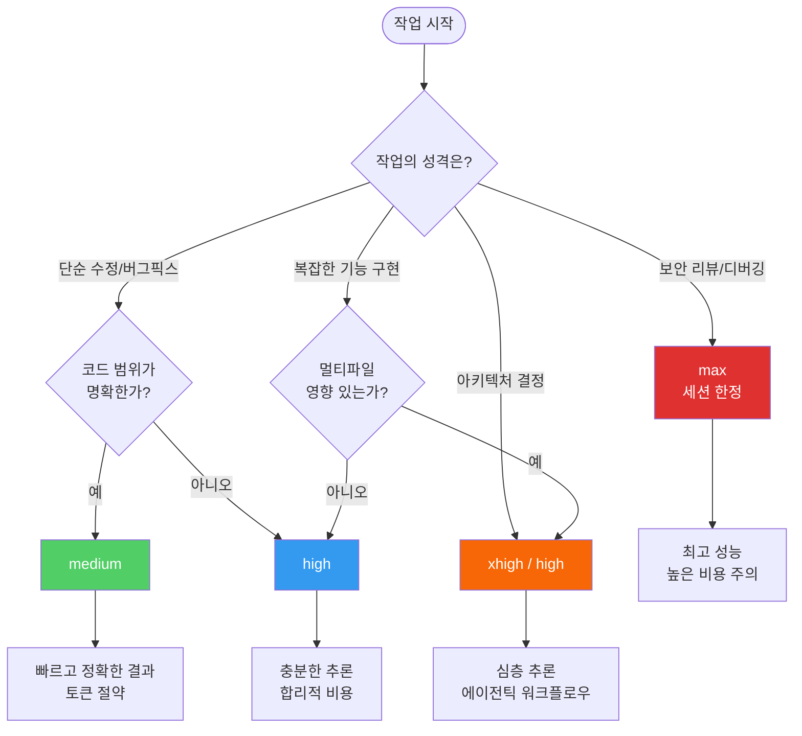
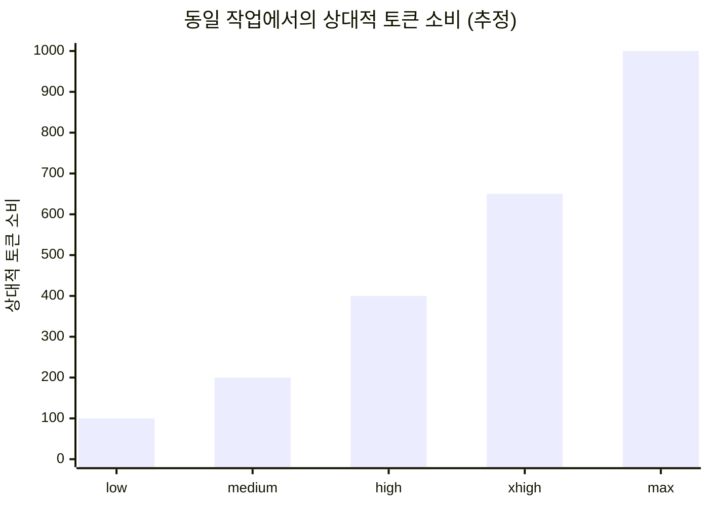
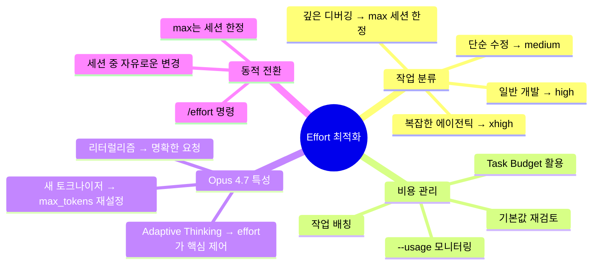

### "무조건 높은 게 좋을까?" — @jaewontfix의 실전 인사이트에서 출발하는 Opus 4.7 Effort 심층 분석

> 작성 기준: 2026년 4월 24일  
> 참조: Anthropic 공식 문서, Claude Code Docs (code.claude.com), [@jaewontfix]( https://www.threads.com/@jaewontfix/post/DXdxzW2gYZ3) Threads 포스트

---

## 1. 발단: 하나의 Threads 포스트가 던진 질문

한국 개발자 커뮤니티에서 활발히 활동 중인 @jaewontfix는 최근 Claude Code Opus 4.7을 사용하면서 겪은 경험을 Threads에 공유했다. 그 내용은 간결하지만 많은 Claude Code 사용자들이 공감할 만한 핵심을 짚고 있었다.

> *"effort를 xhigh로 해놓으니까 쓸데없는 토큰 소비와 정작 내가 정말 원하는 요구사항대로 개발을 안하고 계속 잔존이슈를 남기고, 최초에 요청했던 수정 요청 작업은 제대로 진행도 안되는 상황이 발생하더라구요. 그래서 effort를 medium으로 내려봤습니다. 그랬더니 정말 거짓말처럼 단순하게 해당 기능만 딱 수정을 완벽하게 진행하더라구요."*

이 경험은 단순한 개인 anecdote가 아니다. Anthropic의 공식 문서와 커뮤니티의 실전 경험들이 한목소리로 같은 결론을 내리고 있다는 점에서, 이 포스트는 Claude Code를 사용하는 모든 개발자들이 한 번쯤 진지하게 짚고 넘어가야 할 주제를 건드리고 있다. **effort 설정은 "높을수록 좋다"는 직관이 틀릴 수 있다.**

이 문서는 그 이유를 기술적으로, 그리고 실용적으로 파헤친다.

---

## 2. Effort 파라미터란 무엇인가

### 2.1 개념의 탄생 배경

Claude Code에서 `effort` 파라미터는 모델이 응답을 생성하기 전에 얼마나 깊이 "생각"할지를 제어하는 단일 설정값이다. 이것은 단순한 속도 토글이 아니다. 내부적으로는 **Extended Thinking(확장 사고) 토큰 버짓**을 제어하는 메커니즘으로, 모델이 최종 응답을 출력하기 전 별도의 추론 단계에서 얼마나 많은 토큰을 소비할 수 있는지를 결정한다.

Claude Opus 4.7부터는 기존의 `budget_tokens` 방식이 완전히 폐기되고, `adaptive thinking`이라는 새로운 패러다임 위에서 `effort`가 사실상 유일한 제어 수단이 되었다. Adaptive thinking이란, 모델이 각 요청의 복잡도를 스스로 평가하여 필요한 경우에만, 그리고 필요한 만큼만 사고 토큰을 사용하는 방식이다.

### 2.2 Claude Opus 4.7의 Effort 레벨 체계

Opus 4.7은 총 5단계의 effort 레벨을 지원한다. 이 레벨은 모델에 따라 달리 calibration되기 때문에, 같은 레벨명이라도 Opus 4.6과 Opus 4.7에서 동일한 토큰 소비를 의미하지는 않는다.

```
low ──────── medium ──────── high ──────── xhigh ──────── max
 ↑                                           ↑               ↑
빠름/저비용                              기본값(v2.1.117)  최고 성능
                                         (Opus 4.7)      (세션 한정)
```

각 레벨의 특성을 상세히 살펴보면 다음과 같다.

**low**: 가장 작은 thinking 버짓. 모델이 학습된 패턴 인식에 기반해 빠르게 응답한다. 고지연 민감 워크로드나 단순 분류, 빠른 조회 작업에 적합하다. Opus 4.7은 이 레벨에서 "무엇을 요청했는가"에 정확히 스코프를 맞춰 실행하며, 요청 범위를 벗어나는 추가 작업을 수행하지 않는다.

**medium**: 적절한 thinking 버짓. 의미 있는 추론을 수행하되 최대 용량에는 한참 못 미친다. 대부분의 일상적인 코딩 작업을 처리하기에 충분하다. @jaewontfix가 단순 버그 수정에서 경험한 것처럼, **명확하게 정의된 단순 작업에서는 오히려 더 정확하고 집중된 결과를 낸다.**

**high**: 상당히 큰 버짓. 복잡한 로직 추적, 다중 접근법 고려, 백트래킹 등이 가능하다. Opus 4.7에서의 API 기본값이다. 대부분의 인텔리전스 민감 작업에 권장되는 최소값이다.

**xhigh**: Opus 4.7에서 새로 추가된 레벨로, `high`와 `max` 사이에 위치한다. Claude Code v2.1.117 기준으로 **Opus 4.7의 Claude Code 기본값**이다. 고급 코딩과 복잡한 에이전틱 작업에 최적화되어 있으며, max가 야기하는 "런어웨이 토큰 사용"이 없는 것이 장점이다.

**max**: 토큰 제약 없는 완전한 추론. 현존하는 가장 깊은 분석이 가능하지만, 과잉 사고(overthinking)에 취약하다. 세션 단위로만 적용되며 세션 종료 후 초기화된다. 정말로 어렵고 복잡한 문제에만 의도적으로 사용해야 한다.

### 2.3 레벨별 Adaptive Thinking 동작 방식

| Effort 레벨 | 사고 활성화 빈도 | 특징 |
|-------------|----------------|------|
| low | 거의 사용 안 함 | 패턴 인식 위주 |
| medium | 필요시에만 | 복잡도 평가 후 선택적 사용 |
| high | 거의 항상 | 대부분의 문제에서 깊이 사고 |
| xhigh | 항상 + 광범위하게 | 도구 호출 사이에도 사고 |
| max | 제한 없이 | 존재하는 한 계속 사고 |

---

## 3. @jaewontfix 경험의 기술적 해석

### 3.1 왜 xhigh에서 단순 수정이 더 나빠졌는가


**현상 1: 요구사항에 집중 못 하고 잔존 이슈를 남김**

`xhigh` 레벨에서 Opus 4.7은 adaptive thinking을 광범위하게 활성화한다. 이때 모델은 단순히 요청된 작업만 처리하는 게 아니라, **주변 컨텍스트를 스캔하고, 연관 파일을 읽고, 잠재적 부작용을 탐색하고, 더 넓은 아키텍처적 함의를 고려한다.** 이 과정에서 원래 요청된 수정의 범위가 흐려지고, 모델의 attention이 분산될 수 있다.

단순한 버그 수정 요청임에도 불구하고 모델이 "더 넓은 문제"를 발견하거나, "더 나은 접근법"을 탐색하거나, 여러 가능성을 동시에 고려하다가 정작 핵심 작업의 완성도가 떨어지는 상황이 발생한다. 이는 **지나친 사고(overthinking)의 부작용**이다.

**현상 2: 쓸데없는 토큰 소비**

Opus 4.7은 새로운 토크나이저를 사용하며, 같은 입력이라도 Opus 4.6 대비 약 1.0~1.35배 더 많은 토큰을 사용한다. 여기에 `xhigh` 레벨의 extended thinking 토큰이 더해지면, 간단한 한 줄 수정 요청이 수천 토큰의 thinking 과정을 거치게 될 수 있다.

Anthropic이 공식 문서에서 직접 언급한 것처럼, `max` 레벨은 명시적으로 "overthinking에 취약하다"고 경고하며, `xhigh`도 마찬가지로 단순 작업에서는 불필요한 토큰 소비를 야기한다.

**현상 3: medium으로 내렸더니 정확해짐**

Opus 4.7은 Opus 4.6에 비해 **effort 레벨을 더 엄격하게 준수**한다는 특성이 있다. `medium`에서는 요청된 작업의 범위에 정확히 맞춰 실행하고, 요청하지 않은 추가 탐색을 수행하지 않는다. 이것이 바로 "거짓말처럼 해당 기능만 딱 수정"되는 결과로 나타난 것이다.

이를 Anthropic이 "stricter effort calibration"이라고 부르는 특성의 긍정적 활용 사례로 볼 수 있다.

### 3.2 Jevons 역설의 소프트웨어 공학적 적용

이 현상을 경제학 관점에서 해석하면 흥미롭다. Jevons 역설(Jevons Paradox)은 기술 효율성이 높아질수록 총 자원 소비가 오히려 증가하는 현상을 설명한다. Claude Code의 effort 파라미터에도 유사한 역설이 존재한다.

높은 effort 레벨은 모델을 "더 똑똑하게" 만들지만, 그 지능이 **작업의 복잡도에 비례하지 않으면** 오히려 역효과를 낳는다. 단순 수정 작업에 max 추론 능력을 투입하면, 모델은 존재하지 않는 복잡성을 찾으려 하고, 불필요한 최적화를 고려하며, 결국 원래 요청보다 더 많은 것을 하려다가 핵심을 놓치게 된다.


---

## 4. Opus 4.7의 Effort 체계, 무엇이 달라졌나

### 4.1 xhigh의 등장: 새로운 5단계 체계

Opus 4.7 이전까지 effort는 `low`, `medium`, `high`, `max` 4단계였다. Opus 4.7에서 `xhigh`가 새로운 레벨로 추가되면서 `high`와 `max` 사이에 위치하게 되었다. 이것은 단순한 레벨 추가 이상의 의미를 갖는다.

기존 `max`는 종종 **"과잉 추론(overthinking)"** 문제를 야기했다. 모델이 필요 이상으로 깊이 파고들어 복잡성을 스스로 만들어내거나, 간단한 해결책이 있는데 복잡한 경로를 탐색하는 현상이 나타났다. `xhigh`는 이 간극을 메우기 위해 설계되었다. 코딩과 에이전틱 작업에서 `max`의 성능에 가깝되, 런어웨이 토큰 사용이 없는 레벨이다.

Anthropic은 공식적으로 **Opus 4.7 Claude Code의 기본값을 xhigh로 설정**했다 (v2.1.117 기준). 기존에 effort를 수동으로 설정하지 않았던 사용자는 Opus 4.7로 전환 시 자동으로 xhigh가 적용된다.

### 4.2 Adaptive Thinking: 고정 버짓의 폐기

Opus 4.7의 가장 큰 변화 중 하나는 `budget_tokens` 방식의 완전 폐기다.

| 구분 | Opus 4.6 | Opus 4.7 |
|------|----------|----------|
| thinking 제어 방식 | `budget_tokens` (고정 버짓) | `effort` + adaptive thinking |
| 지원 여부 | budget_tokens 허용 (deprecated) | budget_tokens → HTTP 400 에러 |
| thinking 타입 | `"enabled"` 또는 `"adaptive"` | `"adaptive"` 전용 |
| 유연성 | 정확한 토큰 수 지정 가능 | 모델이 필요에 따라 동적 결정 |

Adaptive thinking은 모델이 각 요청의 복잡도를 평가하고 그에 맞는 사고 토큰을 동적으로 할당한다. `xhigh`에서도 매우 단순한 질문에는 사고를 최소화하고, 복잡한 문제에는 충분히 깊이 사고하는 방식으로 자원을 배분한다.

### 4.3 Opus 4.7의 리터럴리즘(Literalism): effort와의 상호작용

Opus 4.7의 또 다른 주요 변화는 **더 엄격한 지시 이행**이다. 이전 모델(Opus 4.6)이 암묵적인 맥락을 추론하여 요청을 보완했다면, Opus 4.7은 명시된 내용을 그대로 실행한다.

이 특성은 effort 설정과 결합하여 흥미로운 효과를 낸다.

- **xhigh + 모호한 요청**: xhigh의 광범위한 추론 능력이 모호함을 넓게 해석하려 하고, 리터럴리즘은 그 해석을 문자 그대로 실행하려 한다. 결과가 예측하기 어렵다.
- **medium + 명확한 요청**: medium의 집중된 추론이 정확히 요청된 범위에서 작동하고, 리터럴리즘이 그것을 정확히 이행한다. @jaewontfix가 경험한 "거짓말처럼 완벽한 수정"이 이 조합의 결과다.

Anthropic 엔지니어 Boris Cherny는 이 변화에 대해 "Opus 4.7과 효과적으로 작업하는 방법을 익히는 데 며칠이 걸렸다"고 언급했다. 이는 이 변화가 단순한 업그레이드가 아닌 **작업 방식의 패러다임 전환**을 요구함을 시사한다.

### 4.4 새 토크나이저의 비용 영향

Opus 4.7은 새로운 토크나이저를 사용하며, 같은 텍스트를 처리할 때 Opus 4.6 대비 약 1.0~1.35배 더 많은 토큰을 소비한다. 이는 단순히 비용만의 문제가 아니다.

- **max_tokens 설정 재검토 필요**: xhigh 또는 max effort 사용 시 최소 64k tokens을 max_tokens로 설정할 것을 Anthropic은 권장한다.
- **캐시 무효화**: 기존 Opus 4.6 기반 캐시는 Opus 4.7에서 재구성이 필요하다. 이전 토크나이제이션 기반의 캐시를 그대로 사용하면 추가 비용이 발생한다.
- **세션 비용 급증**: xhigh 기본값 + 새 토크나이저 + 세션 후반부로 갈수록 증가하는 추론 오버헤드가 결합하면, 긴 개발 세션에서 예상보다 훨씬 높은 토큰 사용량이 나올 수 있다.

---

## 5. Effort 레벨 선택의 실용 가이드

### 5.1 작업 유형별 권장 Effort 레벨



### 5.2 구체적인 작업 예시와 권장 레벨

#### 🟢 medium이 적합한 경우

단순하고 범위가 명확한 모든 작업이 해당된다. 특정 함수의 반환값 수정, 오타 수정, 조건문 로직 변경, API 엔드포인트 URL 업데이트, 변수명 변경 등 "무엇을 고쳐야 하는지 나도 알고 모델도 알 수 있는" 작업들이다. @jaewontfix의 포스트에서 다룬 사례가 정확히 여기에 해당한다.

또한 단순 코드 설명 요청, 테스트 케이스 작성(기대 동작이 명확한 경우), 포맷팅 변경, import 정리 등도 medium이면 충분하다.

#### 🔵 high가 적합한 경우

단일 파일 내에서의 중간 복잡도 작업, 기존 패턴을 따르는 기능 추가, 여러 함수에 걸친 리팩토링, 명확한 스펙이 있는 버그 수정 등이 여기에 해당한다. 하루 종일 Claude Code를 사용하는 개발 세션에서 "90% 이상의 작업"을 high로 처리하는 것이 비용과 품질의 균형점이라는 의견도 있다.

#### 🟠 xhigh가 적합한 경우

여러 파일에 걸친 리팩토링, 모듈 간 의존성이 있는 기능 변경, 복잡한 에이전틱 워크플로우 실행, 아키텍처 마이그레이션, 연쇄적 부작용을 고려해야 하는 변경, 심층적인 코드 리뷰가 필요한 상황 등이다. Anthropic이 Opus 4.7의 기본값으로 선택한 것은, 이 레벨이 코딩 에이전트로서의 일반 사용 사례를 가장 잘 커버한다고 판단했기 때문이다.

#### 🔴 max가 적합한 경우

max는 의도적으로 선택해야 하는 레벨이다. 오랫동안 해결하지 못한 복잡한 버그 디버깅, 트레이드오프가 많은 실제 아키텍처 결정, 보안 리뷰, 모델의 최대 성능을 측정하는 평가(eval) 작업 등에 한해서 사용한다. 세션이 끝나면 자동으로 초기화된다는 점도 기억해야 한다.

### 5.3 세션 내 동적 전환 전략


```
# 세션 시작: 기본값 xhigh로 시작
claude

# 단순 수정 작업으로 전환 시
/effort medium

# 수정 후 복잡한 리팩토링 작업으로 전환
/effort xhigh

# 정말 어려운 디버깅 발생 시 (세션 내 한정)
/effort max

# 다시 일상 작업으로
/effort high
```

`low`, `medium`, `high`, `xhigh`는 세션 간에도 유지되지만, `max`는 현재 세션에서만 적용되고 종료 시 초기화된다. 따라서 `max`는 특정 문제를 해결하기 위해 의도적으로 올리는 용도로만 사용하고, 일반 작업으로 돌아올 때 다시 낮춰주는 것이 좋다.

### 5.4 Effort 설정 방법

Claude Code에서 effort를 설정하는 방법은 여러 가지가 있다.

| 방법 | 명령/설정 | 지속성 |
|------|----------|--------|
| 슬래시 커맨드 | `/effort medium` | 세션 간 유지 (max 제외) |
| 인터랙티브 슬라이더 | `/effort` (인수 없이) | 세션 간 유지 |
| 시작 시 플래그 | `claude --effort medium` | 해당 세션만 |
| 환경 변수 | `CLAUDE_CODE_EFFORT_LEVEL=medium` | 최우선 적용, 전체 세션 |
| Skill/Subagent 프론트매터 | `effort: medium` (마크다운 파일) | 해당 스킬/서브에이전트 실행 시 |

우선순위는 환경 변수 > 설정된 레벨 > 모델 기본값 > Skill 프론트매터 순이다.

---

## 6. Opus 4.7에서의 Effort와 프롬프트 엔지니어링

### 6.1 Effort와 프롬프트의 관계

Opus 4.7의 리터럴리즘 특성으로 인해, effort 레벨과 프롬프트 품질은 서로를 보완하는 관계가 된다.

**낮은 effort + 정밀한 프롬프트**: 낮은 레벨에서 복잡한 추론이 필요한 경우, 프롬프트에 "이 작업은 다단계 추론이 필요합니다. 응답하기 전에 신중하게 생각하세요"와 같은 명시적 지시를 추가하여 모델을 유도할 수 있다.

**높은 effort + 구체적인 컨텍스트**: xhigh나 max에서는 모델이 광범위하게 탐색하므로, 범위를 명시적으로 제한하는 것이 중요하다. "다른 파일은 건드리지 말고", "이 함수만 수정하고" 같은 제약을 명시하면 over-exploration을 방지할 수 있다.

**프론트로딩(Front-loading) 전략**: Opus 4.7에서는 여러 질문을 여러 번에 나눠 물어보는 것보다, 처음 한 번의 메시지에 모든 컨텍스트, 제약, 성공 기준을 담아서 전달하는 것이 토큰 효율과 결과 품질 모두에서 유리하다. 각 user turn마다 추론 오버헤드가 추가되기 때문이다.

### 6.2 "Ultrathink", "Think harder" 같은 프롬프트 트리거

공식 설정은 아니지만, 프롬프트에 "think harder", "ultrathink" 같은 표현을 포함하면 모델의 effort를 임시로 상향 조정하는 효과가 있다. 이는 비공식적인 방법이지만 실제로 작동하는 것으로 알려져 있다. 단, 공식 `/effort` 설정과는 구별해서 이해해야 한다.

### 6.3 Task Budget: Effort의 보완 수단

Opus 4.7은 새로운 **Task Budget** 기능(beta)도 도입했다. 이는 전체 에이전틱 루프에서 소비할 토큰 총량에 대한 "소프트 가이드"를 모델에게 제공하는 기능이다. 하드 캡이 아닌 소프트 제안이므로, 모델은 이 버짓을 인지하면서 작업의 우선순위를 결정하고 예산이 소진될 때 적절히 마무리한다.

```python
# Task Budget 사용 예시
response = client.beta.messages.create(
    model="claude-opus-4-7",
    max_tokens=128000,
    output_config={
        "effort": "high",
        "task_budget": {
            "type": "tokens",
            "total": 50000  # 최소 20,000 토큰
        }
    }
)
```

이 기능은 effort 설정과 함께 사용하여 긴 에이전틱 세션에서 비용을 통제하는 데 유용하다.

---

## 7. 모델별 Effort 지원 현황

### 7.1 어떤 모델이 어떤 레벨을 지원하는가

| 모델 | low | medium | high | xhigh | max |
|------|-----|--------|------|-------|-----|
| Claude Opus 4.7 | ✅ | ✅ | ✅ | ✅ (기본값) | ✅ |
| Claude Opus 4.6 | ✅ | ✅ | ✅ | ❌ (high로 fallback) | ✅ |
| Claude Sonnet 4.6 | ✅ | ✅ | ✅ (기본값) | ❌ | ✅ |
| Claude Mythos Preview | ✅ | ✅ | ✅ | ✅ | ✅ |

Opus 4.6에서 xhigh를 설정하면 자동으로 high로 fallback된다. 모델 전환 시 이 차이를 인지하고 있어야 한다.

### 7.2 Claude Code v2.1.117의 변경사항

Claude Code v2.1.117 버전부터 기본 effort 레벨이 변경되었다.

- **Opus 4.7**: xhigh (새로운 기본값)
- **Opus 4.6**: high
- **Sonnet 4.6**: high

Opus 4.7로 처음 전환할 때, 이전에 Opus 4.6이나 Sonnet 4.6에서 수동으로 설정한 effort 레벨과 관계없이 xhigh가 자동 적용된다. 이후 `/effort` 명령으로 원하는 레벨로 변경할 수 있다.

---

## 8. 비용 최적화 전략

### 8.1 Effort 레벨과 토큰 비용의 관계

Anthropic은 정확한 배수를 공개하지 않지만, 커뮤니티의 실전 경험과 문서를 종합하면 대략적인 비용 차이를 추정할 수 있다.



> ⚠️ 위 수치는 예시이며 작업 유형에 따라 크게 달라질 수 있습니다.

중요한 것은 같은 결과를 낼 수 있는 경우라면, 낮은 effort가 항상 더 비용 효율적이라는 점이다. Hex CTO가 지적한 것처럼, "low effort의 Opus 4.7은 medium effort의 Opus 4.6과 대략 동등"하다는 점도 참고할 만하다. 즉, 모델이 업그레이드되었다고 해서 무조건 높은 effort가 필요한 것은 아니다.

### 8.2 실용적인 비용 절감 접근법

**기본값 재검토**: @jaewontfix의 조언처럼, 단순 작업에서 xhigh를 기본값으로 사용하지 않는 것만으로도 상당한 토큰을 절약할 수 있다. 개인의 실제 작업 패턴을 파악하여 자신에게 맞는 "기본 레벨"을 찾는 것이 첫 번째다.

**작업 배칭(Batching)**: 관련 질문들을 하나의 메시지에 묶어서 전달하면, 각 user turn마다 발생하는 추론 오버헤드를 줄일 수 있다. Opus 4.7의 interactive 모드는 user turn이 많을수록 더 많은 토큰을 사용하는 경향이 있기 때문이다.

**Auto Mode 활용**: Claude Code Max 사용자는 Auto Mode를 통해 사람의 개입 없이 장시간 작업을 자율 실행시킬 수 있다. 이는 특히 긴 에이전틱 작업에서 각 user interaction으로 인한 추론 오버헤드를 제거하여 토큰 효율을 높인다.

**--usage 모니터링**: 세션 후 `--usage` 요약을 통해 실제 소비된 토큰과 예상 비용을 확인하고, 초기 xhigh 세션에서 자신의 워크로드에 맞는 baseline을 확립하라.

---

## 9. 커뮤니티 인사이트와 모범 사례

### 9.1 실무자들이 공유하는 패턴

다양한 커뮤니티 채널과 블로그를 통해 공유된 실전 패턴들을 정리하면 다음과 같다.

**"High를 기본으로, xhigh는 필요할 때만"**: 많은 중급~고급 사용자들은 daily default를 xhigh가 아닌 high로 유지하고, 특정 복잡한 작업에 들어갈 때만 `/effort xhigh`로 올린다. xhigh의 이점이 실제로 필요한 작업의 비율이 생각보다 높지 않다는 경험적 판단에서 나온 전략이다.

**"단순 작업은 medium이 king"**: @jaewontfix의 경험처럼, 범위가 명확하고 단순한 수정 작업에서는 medium이 일관되게 좋은 결과를 낸다. "단순 작업의 medium > 단순 작업의 xhigh"라는 것이 커뮤니티의 공통된 경험이다.

**"max는 디버깅 무기"**: max는 일상적으로 사용하는 것이 아니라, "여러 번 시도해도 해결이 안 되는 버그" 또는 "아키텍처 결정의 트레이드오프 분석"처럼 정말 깊은 추론이 필요한 상황에 의도적으로 꺼내는 카드로 활용된다.

### 9.2 @jaewontfix 포스트가 갖는 의미

이 포스트의 가치는 단순한 팁 공유를 넘어선다. Claude Code를 사용하는 한국 개발자 커뮤니티에서, "무조건 높은 effort = 더 좋은 결과"라는 잘못된 직관을 실전 경험으로 반박하고, 더 효율적인 사용법을 제안했다는 점에서 의의가 있다.

더불어 이 경험은 AI 도구 사용에서의 메타 능력, 즉 **"어떤 도구를 어떤 상황에 어떻게 사용할지 판단하는 능력"** 의 중요성을 보여준다. 단순히 Claude Code를 사용하는 것과, 상황에 맞게 effort를 조율하며 최적의 결과를 이끌어내는 것은 다른 차원의 숙련도를 요구한다.

---

## 10. 정리: Effort 설정의 원칙

Anthropic의 공식 문서, 커뮤니티 경험, 그리고 @jaewontfix의 실전 인사이트를 종합하면 다음과 같은 원칙으로 정리할 수 있다.

**첫째, Effort는 작업의 실제 복잡도에 비례해야 한다.** 높은 effort가 항상 좋은 결과를 보장하지 않는다. 단순 작업에 과도한 사고 용량을 투입하면 오히려 집중력이 분산되고, 토큰은 낭비되며, 결과는 나빠질 수 있다.

**둘째, Opus 4.7의 Adaptive Thinking을 신뢰하라.** medium 레벨에서도 모델은 문제가 복잡하다고 판단하면 사고를 활성화한다. Adaptive thinking의 핵심은 모델이 "필요할 때만, 필요한 만큼" 사고한다는 것이다. 이 메커니즘을 억지로 override할 필요가 없다.

**셋째, 자신의 최적 세팅을 찾는 것이 중요하다.** @jaewontfix가 포스트 말미에 "저만의 최적의 세팅을 찾으러 가야겠습니다"라고 말한 것처럼, 최적 설정은 사람마다, 프로젝트마다, 작업 유형마다 다르다. 실험하고, 관찰하고, 조정하는 과정이 필수다.

**넷째, 세션 내 동적 전환을 적극 활용하라.** 하나의 세션 안에서도 작업 성격이 바뀌면 effort를 함께 바꿔야 한다. `/effort` 명령의 부담은 타이핑 3~4단어뿐이다.



---

## 참고 자료

- [Effort - Claude API Docs](https://platform.claude.com/docs/en/build-with-claude/effort) (Anthropic 공식 문서)
- [Model configuration - Claude Code Docs](https://code.claude.com/docs/en/model-config) (v2.1.117 기준)
- [Best practices for using Claude Opus 4.7 with Claude Code](https://claude.com/blog/best-practices-for-using-claude-opus-4-7-with-claude-code) (Anthropic 블로그)
- [What's new in Claude Opus 4.7](https://platform.claude.com/docs/en/about-claude/models/whats-new-claude-4-7) (Anthropic 공식 문서)
- [Adaptive thinking - Claude API Docs](https://platform.claude.com/docs/en/build-with-claude/adaptive-thinking) (Anthropic 공식 문서)
- [Claude Code Effort Levels Explained - MindStudio](https://www.mindstudio.ai/blog/claude-code-effort-levels-explained)
- [Claude Code's effort parameter - @kentgigger](https://kentgigger.com/posts/claude-code-effort-parameter)
- [@jaewontfix Threads 포스트](https://www.threads.com/@jaewontfix/post/DXdxzW2gYZ3)

---

*이 문서는 2026년 4월 24일 기준으로 작성되었습니다. Claude Code 및 Claude API 사양은 지속적으로 업데이트되므로 공식 문서를 함께 참조하세요.*
