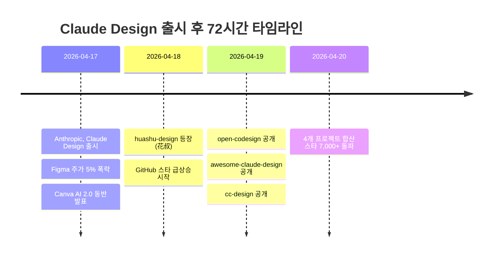
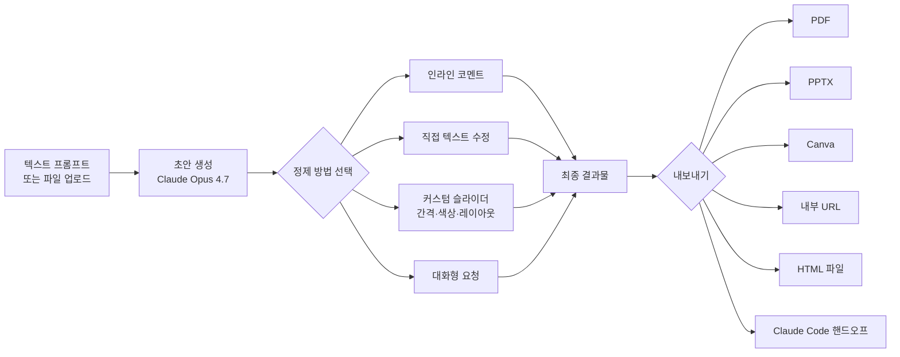
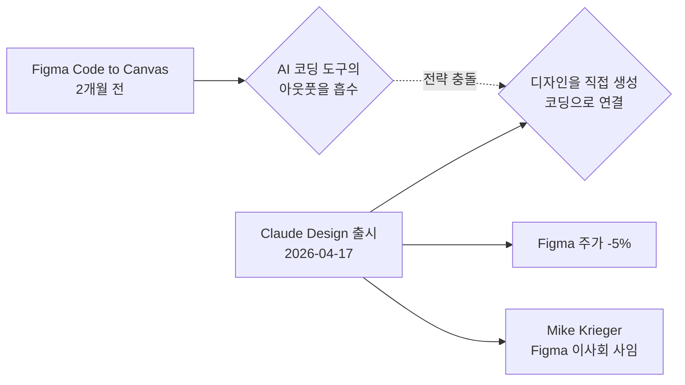
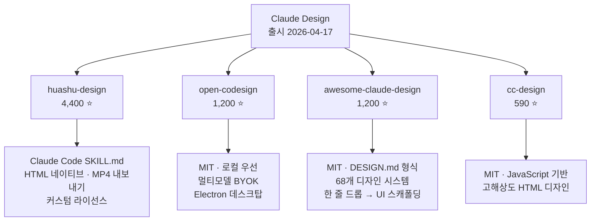
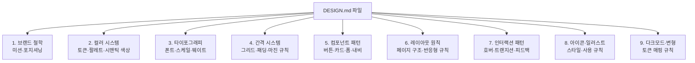
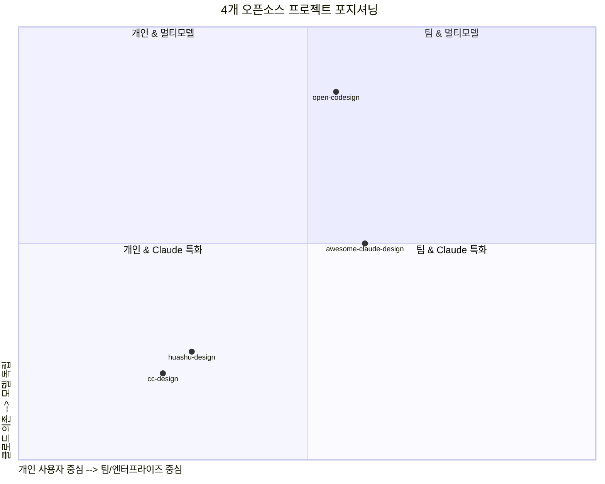
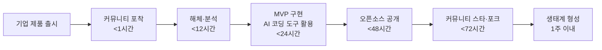
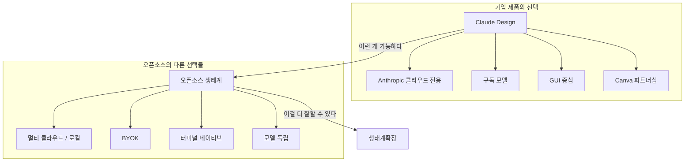
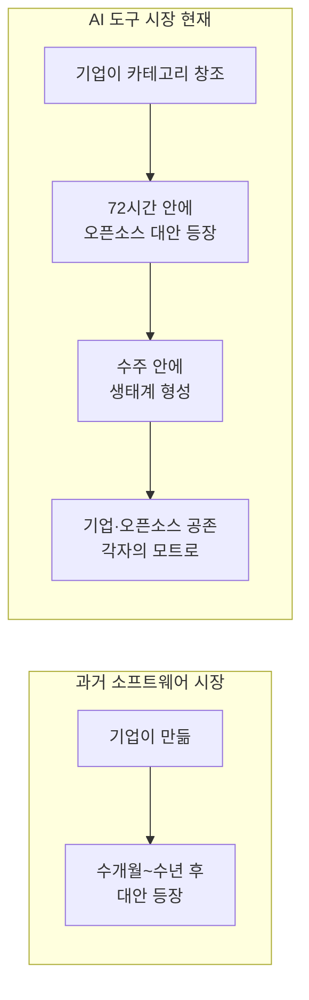

> 작성일: 2026년 4월 24일  
> 출처: Thread [@sweet_bkan](https://www.threads.com/@sweet_bkan/post/DXeMOUVgghD), Anthropic 공식 발표, TechCrunch, The New Stack, Gizmodo, GitHub 저장소 분석

---

## 목차

1. [서론: 72시간이라는 시간 단위의 의미](#1-서론)
2. [Claude Design 공식 출시 배경](#2-claude-design-공식-출시-배경)
3. [Claude Design의 핵심 기능 해부](#3-claude-design의-핵심-기능-해부)
4. [Figma 충격과 시장 반응](#4-figma-충격과-시장-반응)
5. [Canva와의 전략적 파트너십](#5-canva와의-전략적-파트너십)
6. [72시간 내 등장한 4개의 오픈소스 대안](#6-72시간-내-등장한-4개의-오픈소스-대안)
   - 6.1 [huashu-design](#61-huashu-design-4400-스타)
   - 6.2 [open-codesign](#62-open-codesign-1200-스타)
   - 6.3 [awesome-claude-design](#63-awesome-claude-design-1200-스타)
   - 6.4 [cc-design](#64-cc-design-590-스타)
7. [4개 프로젝트 비교 분석](#7-4개-프로젝트-비교-분석)
8. [AI 도구 생태계의 새로운 패턴: 72시간 사이클](#8-ai-도구-생태계의-새로운-패턴)
9. [단순 클론을 넘어선 진화: 오픈소스의 역습](#9-단순-클론을-넘어선-진화)
10. [역사적 맥락: 이전에도 있었던 패턴](#10-역사적-맥락)
11. [AI 도구 시장 참여자에게 주는 시사점](#11-ai-도구-시장-참여자에게-주는-시사점)
12. [결론](#12-결론)

---

## 1. 서론

2026년 4월 17일, Anthropic이 Claude Design을 출시했다. 그로부터 72시간 뒤, GitHub에는 4개의 오픈소스 대안 프로젝트가 등장했고, 그 합산 스타 수는 7,000개를 돌파했다. 이 숫자 자체도 놀랍지만, 더 주목해야 할 것은 이 프로젝트들이 단순한 복제품이 아니었다는 사실이다.

오늘날 AI 도구 시장에서는 기업이 카테고리를 정의하면, 커뮤니티가 72시간 안에 그 카테고리를 민주화하는 패턴이 정착되고 있다. 이 문서는 Claude Design이 무엇인지, 왜 이것이 시장을 뒤흔들었는지, 그리고 72시간 만에 등장한 오픈소스 생태계가 어떤 의미를 갖는지를 깊이 분석한다.

---

## 2. Claude Design 공식 출시 배경

### Anthropic Labs라는 실험실

Claude Design은 Anthropic의 일반 제품 라인이 아닌, **Anthropic Labs**라는 실험적 조직에서 탄생했다. Labs는 Claude Code, MCP(Model Context Protocol), Skills, Claude in Chrome, Cowork 등 Anthropic의 최전선 실험 제품들을 인큐베이팅하는 팀이다.

주목할 인사 이동이 있었다. Instagram의 공동 창업자이자 Anthropic의 CPO(최고 제품 책임자)였던 **Mike Krieger**가 Labs의 공동 리더로 합류했다. 이 시점에서 그는 Figma 이사회에서도 사임했는데, 이 두 가지 사건이 동시에 일어났다는 것은 Anthropic이 디자인 도구 시장에 본격적으로 진입하겠다는 의지를 명확히 드러낸 신호였다.

Claude Design은 출시와 동시에 **Research Preview** 형태로, Claude Pro, Max, Team, Enterprise 구독자들에게 단계적으로 제공되었다. 가격은 별도 추가 없이 기존 구독에 포함되었다.

### 출시 직전의 긴장

출시 불과 며칠 전, The Information이 Anthropic의 디자인 도구 개발을 보도했다. 이미 시장은 무언가를 예감하고 있었다. 그리고 Mike Krieger의 Figma 이사회 사임 소식이 겹치면서, 업계는 Anthropic이 단순한 텍스트·코드 AI를 넘어 **엔드투엔드 디자인 워크플로우**에 진입한다는 것을 직감했다.

---

## 3. Claude Design의 핵심 기능 해부

Claude Design은 "디자인 도구를 갖고 있지 않은 사람들이 아이디어에서 시각적 결과물로 빠르게 이동할 수 있도록 돕는" 것을 핵심 철학으로 삼는다.

### 3.1 파워 엔진: Claude Opus 4.7

Claude Design의 구동 엔진은 Anthropic이 전날 출시한 **Claude Opus 4.7**이다. 이 모델은 전작 대비 그래픽 디자인 작업에서 현저히 높은 성능을 보이며, 특히 이미지 분석 능력이 대폭 향상되어 사용자가 업로드하는 레퍼런스 이미지를 더 정확하게 해석할 수 있다. 다만, Opus 4.7의 비전 토큰은 일반 텍스트 토큰의 약 3배 비용이 들기 때문에, Pro 구독자들 사이에서 "두 번의 프롬프트로 주간 한도의 95%를 소진했다"는 경험담이 Reddit에 다수 올라왔다.

### 3.2 대화형 창작 흐름

Claude Design의 UX는 다음과 같은 흐름으로 작동한다.

특히 **커스텀 슬라이더** 기능이 독특하다. Claude가 현재 디자인에서 조정할 만한 파라미터들(간격, 색상 톤, 폰트 크기 등)을 스스로 판단해 실시간 조작 가능한 슬라이더를 생성해준다. 매번 LLM에 요청을 보내지 않아도 세밀한 수정이 가능하게 해준다.

### 3.3 팀 디자인 시스템 자동화

Claude Design의 가장 강력한 엔터프라이즈 기능은 **자동 디자인 시스템 구축**이다. 온보딩 시 코드베이스와 디자인 파일을 읽어들여 팀의 색상, 타이포그래피, 컴포넌트를 학습한다. 이후 모든 프로젝트에 이 브랜드 시스템이 자동 적용되어, 팀 전체의 디자인 일관성이 AI에 의해 유지된다.

팀은 복수의 디자인 시스템을 유지할 수 있으며, 시간이 지남에 따라 시스템을 정제할 수도 있다. 이는 과거에 수십 명의 디자이너가 손으로 유지하던 브랜드 거버넌스 업무를 사실상 자동화하는 시도다.

### 3.4 다양한 입력 소스

- **텍스트 프롬프트**: "고요하고 명상적인 모바일 앱 프로토타입을 만들어줘. 차분한 타이포그래피, 자연에서 영감받은 색상, 깔끔한 레이아웃으로."
- **파일 업로드**: DOCX, PPTX, XLSX 등 문서를 직접 업로드
- **코드베이스 연결**: 실제 제품처럼 보이는 프로토타입 생성
- **웹 캡처 도구**: 기존 웹사이트에서 요소를 직접 가져오기
- **스케치 이미지 업로드**: 손으로 그린 와이어프레임도 인식

### 3.5 협업과 공유

Claude Design은 조직 스코프의 공유 기능을 제공한다. 문서를 비공개로 유지하거나, 조직 내 링크 공유(뷰어), 또는 동료가 함께 디자인을 수정하고 그룹 대화로 Claude와 상호작용할 수 있는 편집 권한 부여가 가능하다.

### 3.6 Claude Code로의 핸드오프

디자인이 완성되면, Claude Design은 모든 것을 **핸드오프 번들**로 패키징해 Claude Code에 단 하나의 명령으로 전달할 수 있다. 이 흐름은 디자인과 개발 사이의 간극을 대폭 줄여준다. Brilliant라는 회사는 "다른 도구에서 20개 이상의 프롬프트가 필요하던 복잡한 페이지를 Claude Design에서는 단 2개의 프롬프트로 재현했다"고 증언했다.

### 3.7 지원 유즈케이스 전체 지형

| 역할 | Claude Design 활용 방법 |
|------|------------------------|
| 디자이너 | 정적 목업 → 인터랙티브 프로토타입 (코드 리뷰나 PR 없이) |
| PM | 기능 플로우 와이어프레임 → Claude Code 핸드오프 |
| 창업자/AE | 러프 아웃라인 → 완성된 온브랜드 피치덱 (PPTX/Canva 내보내기) |
| 마케터 | 캠페인 비주얼, 랜딩 페이지, SNS 애셋 |
| 개발자 | 음성·영상·셰이더·3D·AI 기반 프론티어 프로토타입 |

---

## 4. Figma 충격과 시장 반응

Claude Design 출시가 시장에 미친 가장 즉각적인 파장은 **Figma 주가 하락**이었다.

출시 발표 직후 Figma 주가는 약 **5%** 추가 하락했다. 이미 지난 12개월간 거의 50%가 빠진 상태에서의 추가 하락이었다. 시장이 이 한 건의 발표에 이렇게 민감하게 반응한 데는 맥락이 있다.

불과 두 달 전, Figma는 **Code to Canvas**라는 기능을 출시했다. Claude Code 같은 AI 코딩 도구가 생성한 코드를 Figma 내의 편집 가능한 디자인으로 변환하는 기능이었다. 즉, Figma는 AI 코딩 도구의 아웃풋을 흡수하는 방향으로 진화하려 했다. 그런데 Anthropic이 반대 방향으로 움직였다. 코드 생성 AI가 디자인까지 직접 만들어버리는 방향으로.

Mike Krieger가 Figma 이사회에서 사임한 것도 출시 불과 며칠 전이었다. 이 두 이벤트의 타이밍이 겹치면서 시장은 Figma에 대한 위협 신호로 읽었다.

그러나 Anthropic은 Figma와의 경쟁보다 **보완 관계**를 강조했다. 시장에서는 의심의 눈길을 거두지 않고 있지만, 적어도 공식 포지셔닝은 "최초 아이디어 단계"를 담당하는 도구로서 기존 Figma 워크플로우와 공존할 수 있다는 입장이다.

---

## 5. Canva와의 전략적 파트너십

Claude Design이 단독으로 출시된 것이 아니라는 점도 중요하다. Anthropic과 Canva는 2년에 걸친 협력의 결과로 Claude Design과 **Canva AI 2.0**을 동시에 발표했다.

### 5.1 Canva의 포지셔닝 전략

Canva의 **Design Engine**이 Claude Design의 기반을 지원한다. Claude Design에서 만든 비주얼은 원클릭으로 Canva로 가져올 수 있으며, Canva에서 완전히 편집 가능하고 협업 가능한 디자인이 된다.

이것은 Canva가 Figma를 따라잡으며 사용한 전략의 반복이다. "다른 도구들이 내보내는 곳이 되라." AI 코딩 도구의 시대에도 Canva는 AI가 생성한 출력물을 자신의 생태계로 끌어들이는 위치를 선점하려 한다.

### 5.2 Canva의 성장 맥락

2025년 기준으로 Canva는 연간 매출 35억 달러, 월간 활성 사용자 2억 6,500만 명, 유료 구독자 3,100만 명을 보유한다. 2025년 8월 직원 주식 매각 기준 기업 가치 420억 달러에 달한다. 이런 규모의 회사가 Anthropic과의 파트너십을 공동으로 발표한 것은, 두 회사 모두에게 의미 있는 전략적 선택이다.

---

## 6. 72시간 내 등장한 4개의 오픈소스 대안

Claude Design 출시 후 72시간 안에 GitHub에 등장한 4개의 오픈소스 프로젝트를 각각 심층 분석한다.

### 6.1 huashu-design (4,400 스타)

**제작자**: 花叔 (Huasheng, @AlchainHust)

huashu-design은 가장 많은 스타를 받은 프로젝트로, 중국의 독립 개발자 花叔가 만들었다. 그는 Bilibili, YouTube, Xiaohongshu에 걸쳐 30만 명 이상의 팔로워를 보유한 콘텐츠 크리에이터이자 개발자로, "Claude Code 오렌지북(75페이지)"의 공동 저자이기도 하다. 그의 이전 대표작인 **Nuwa Skill**(다른 스킬을 생성하는 메타스킬)은 이미 12,000개 이상의 스타를 보유하고 있었다.

#### 무엇인가

중요한 점은 huashu-design이 **GUI 애플리케이션이 아니라는 것**이다. 이것은 Claude Code에 설치하는 **SKILL.md 형식의 스킬 파일**이다. "Claude Design을 역설계했다"는 花叔의 트윗은 바이럴 마케팅이었고, 실제 README에서 그는 Claude Design의 **Brand Asset Protocol 개념**만 차용했으며 나머지는 완전히 새로 작성한 코드임을 인정한다.

Claude Design이 GUI를 새로 구축했다면, huashu-design은 GUI를 제거하는 방향을 선택했다. 같은 문제를 터미널에서 직접 해결하는 셸 별칭과 맥OS 네이티브 앱의 차이에 비유할 수 있다.

#### 핵심 기능

huashu-design은 단일 대화형 프롬프트에서 7가지 출력 유형을 생성할 수 있다.

| 출력 유형 | 설명 | 예상 소요 시간 |
|-----------|------|----------------|
| 모바일 앱 프로토타입 | iPhone 프레임이 있는 HTML 파일, 화면 간 애니메이션, 클릭 가능한 내비게이션 | 10~15분 |
| 피치덱 | HTML 프레젠테이션 + Python 스크립트로 변환된 편집 가능 PPTX | 15~20분 |
| 애니메이션 프로토타입 | CSS/JS 기반 애니메이션 포함 | 20~30분 |
| MP4 영상 내보내기 | 고해상도 프로토타입 영상 | 25~35분 |
| 슬라이드 | 프레젠테이션용 슬라이드 | 10~15분 |
| 원페이저 | 마케팅/랜딩 페이지 | 8~12분 |
| 아이콘/일러스트 | SVG 기반 비주얼 | 5~10분 |

특히 **20개의 디자인 철학**이 내장되어 있다는 점이 원본 Claude Design보다 "깊이가 있다"는 평가를 받는 이유다. 단순히 시각적 스타일 가이드가 아니라, 어떤 디자인 판단을 내려야 할 때 AI가 참조할 수 있는 구조화된 철학 체계다.

Playwright 기반의 검증 스크립트가 포함되어, 생성된 파일의 클릭 링크가 실제로 작동하는지 납품 전 자동 검증한다.

#### 라이선스

공식 MIT나 Apache가 아닌 **커스텀 라이선스**다. 개인 학습·연구·사이드 프로젝트·콘텐츠 제작에는 무료이지만, **상업적 이용은 저자의 명시적 허가가 필요하다**. 프리랜서가 고객에게 납품하는 작업에 사용하면 라이선스 위반이 된다는 점에서 바이럴 요약본들이 생략한 중요한 디테일이 있다.

### 6.2 open-codesign (1,200 스타)

**제작자**: OpenCoworkAI (오픈소스 커뮤니티)

open-codesign은 Claude Design의 "진정한" 오픈소스 대안을 자처하는 **Electron 기반 데스크탑 애플리케이션**이다. MIT 라이선스로 제공된다.

#### 철학

"구독 락인, 클라우드 전용 워크플로우, 단일 제공업체 강제"에서 벗어나고 싶은 사람들을 위해 설계되었다. Claude Design이 Anthropic 클라우드 전용인 것과 달리, open-codesign은 로컬 머신에서 완전히 구동된다.

#### BYOK 멀티모델 아키텍처

open-codesign의 핵심 차별점은 **BYOK(Bring Your Own Key) 멀티모델 라우터**다. 지원 모델은 다음과 같다.

- Anthropic Claude (모든 버전)
- OpenAI GPT
- Google Gemini
- Kimi
- GLM (Zhipu AI)
- DeepSeek / SiliconFlow
- Ollama (완전 로컬 오프라인 추론)
- OpenAI 호환 엔드포인트 전체

기존 Claude Code나 Codex API 키가 있다면 **원클릭으로 설정을 가져와** 90초 안에 실행 가능하다. API 키는 `~/.config/open-codesign/config.toml` (파일 모드 0600)에 로컬 저장되며, 선택한 모델 제공업체 외부로 데이터가 전송되지 않는다.

#### 내보내기 형식

HTML(CSS 인라인), PDF(로컬 Chrome 렌더링), PPTX, ZIP, Markdown 등 5가지 형식으로 디바이스 내에서 생성된다. Claude Design처럼 Canva를 경유할 필요가 없다.

#### 12개 내장 디자인 스킬 모듈

단순한 프롬프트 인터페이스가 아니라 12개의 전문화된 디자인 스킬 모듈이 포함되어 있다: 슬라이드덱, 대시보드, 랜딩 페이지, SVG 차트, 글라스모피즘, 에디토리얼 타이포그래피, 히어로, 프라이싱, 풋터, 채팅 UI, 데이터 테이블, 캘린더. 이 모듈들은 LLM이 "일반적인 AI 채팅 인터페이스의 평범한 출력"을 벗어나 의도적인 레이아웃과 여백을 가진 결과물을 생성하도록 유도한다.

#### Claude Design과의 비교

| 항목 | open-codesign | Claude Design |
|------|:---:|:---:|
| 오픈소스 | ✅ MIT | ❌ 폐쇄 |
| 데스크탑 네이티브 | ✅ Electron | ❌ 웹 전용 |
| BYOK | ✅ 모든 제공업체 | ❌ Anthropic 전용 |
| 로컬/오프라인 | ✅ 완전 로컬 | ❌ 클라우드 |
| 지원 모델 | ✅ 20+ | Claude만 |
| 버전 히스토리 | ✅ SQLite 로컬 스냅샷 | ❌ 없음 |
| 데이터 프라이버시 | ✅ 온디바이스 | ❌ 클라우드 처리 |

### 6.3 awesome-claude-design (1,200 스타)

**제작자**: VoltAgent (GitHub 조직)

awesome-claude-design은 도구를 만든 것이 아니라 **접근 방식 자체를 바꾼** 프로젝트다. "디자인 시스템을 텍스트 파일로 관리한다"는 발상의 전환이 그 핵심이다.

#### DESIGN.md 포맷

이 프로젝트의 아이디어는 간단하지만 강력하다. 브랜드의 색상, 타이포그래피, 컴포넌트 패턴, 설계 철학을 **하나의 마크다운 파일(DESIGN.md)** 에 구조화해서 담는다. 이 파일을 Claude Design에 드롭하면, 전체 UI 스캐폴딩(색상 토큰, 타입 스케일, 버튼, 카드, 내비, 워킹 UI 킷)이 단 한 번의 작업으로 생성된다.

모든 DESIGN.md는 9개 섹션 구조를 따른다.

#### Figma와 브랜드 가이드라인 PDF의 한계를 넘어

프로젝트는 DESIGN.md의 포지셔닝을 명확히 설명한다. Figma 내보내기는 **무엇을 써야 하는지**는 알려주지만 **왜**는 알려주지 않는다. 브랜드 가이드라인 PDF는 인간에게 말하지만("친근하면서도 프리미엄") AI에게는 너무 모호하다. DESIGN.md는 그 중간에 위치한다. AI가 파일에서 다루지 않은 케이스를 만났을 때도 올바른 판단을 내릴 수 있도록 구체적인 규칙과 그 이유를 함께 담는다.

#### 68개 디자인 시스템 컬렉션

68개의 주요 브랜드 디자인 시스템이 DESIGN.md 형식으로 큐레이션되어 있다. Apple, Stripe, Vercel, Figma, Spotify, Cursor 등 유명 브랜드의 디자인 패턴이 AI 에이전트가 읽을 수 있는 구조화된 문서로 변환되어 있다. 이 파일들은 공식 디자인 시스템이 아니라 공개적으로 관찰 가능한 디자인 패턴에서 추출한 교육용 자료임을 README에서 명시한다.

#### 접근 방식의 의미

이 프로젝트가 제안하는 것은 "좋은 디자인의 지식을 AI가 재사용 가능한 포맷으로 코드화한다"는 발상이다. 디자이너가 작업한 결과물이 아니라, 디자이너가 사고하는 방식을 텍스트로 변환하는 것이다. 이것은 AI 시대의 **디자인 지식 관리**가 어떤 방향으로 진화할 수 있는지를 보여주는 실험이다.

### 6.4 cc-design (590 스타)

cc-design은 가장 적은 스타를 받았지만, JavaScript 기반의 또 다른 고해상도 HTML 디자인 스킬로서 자신만의 포지션을 갖는다. Claude Code 안에서 구동되며, 특히 인터랙티브한 웹 컴포넌트와 복잡한 JavaScript 기반 애니메이션에 강점을 보인다.

---

## 7. 4개 프로젝트 비교 분석

| 항목 | huashu-design | open-codesign | awesome-claude-design | cc-design |
|------|:---:|:---:|:---:|:---:|
| 스타 | 4,400 | 1,200 | 1,200 | 590 |
| 형태 | SKILL.md | Electron 앱 | DESIGN.md 컬렉션 | SKILL.md |
| 라이선스 | 커스텀(개인 무료) | MIT | MIT | MIT |
| 멀티모델 | ❌ Claude만 | ✅ 20+ | ✅ 모든 AI | ❌ Claude만 |
| GUI | ❌ 터미널 | ✅ 데스크탑 앱 | N/A | ❌ 터미널 |
| MP4 내보내기 | ✅ | ❌ | N/A | ❌ |
| 디자인 철학 내장 | ✅ 20개 | ✅ 12개 스킬 | ✅ 68개 시스템 | ✅ |
| 오프라인 가능 | △ Claude 필요 | ✅ Ollama | N/A | △ Claude 필요 |
| 핵심 혁신 | 터미널 네이티브+MP4 | 멀티모델 BYOK | 텍스트 기반 디자인 시스템 | JS 기반 고해상도 |

---

## 8. AI 도구 생태계의 새로운 패턴

이 사건에서 우리가 목격한 것은 단순히 "좋은 제품이 나오니 따라 만들었다"는 이야기가 아니다. **AI 도구 시장의 구조 자체가 변했다**는 신호다.

### 8.1 72시간 사이클의 메커니즘

왜 72시간인가? 현대의 AI 네이티브 개발 환경에서 코드 작성 속도 자체가 근본적으로 달라졌기 때문이다.

과거에는 "이런 도구를 만들어야겠다"는 결정에서 "동작하는 프로토타입"까지 최소 몇 주가 걸렸다. LLM 기반 개발 환경에서는 하루이틀이면 MVP가 나온다. GitHub Pages나 npm publish로 배포는 수십 분이면 된다. 커뮤니티는 X(트위터), GitHub, Reddit, 중국의 경우 Bilibili와 Xiaohongshu를 통해 즉각적으로 연결된다.

### 8.2 "카테고리 창조자"와 "카테고리 민주화자"

이 패턴에서 기업과 오픈소스 커뮤니티는 서로 다른 역할을 맡는다.

기업(Anthropic, Devin, Cursor 등)의 역할은 **카테고리를 창조**하는 것이다. "이런 것이 가능하다"를 증명한다. 이를 위해서는 방대한 자본, 최고 수준의 모델, 브랜드 파워, 엔터프라이즈 영업망이 필요하다. 오픈소스가 하루 이틀 만에 복제할 수 없는 것들이다.

오픈소스 커뮤니티의 역할은 **카테고리를 민주화**하는 것이다. "이것을 구독 없이, 더 자유롭게, 더 깊이 있게 할 수 있다"를 증명한다. 락인이 없는 대안, 자신의 API 키 사용, 로컬 실행, 멀티모델 지원이 오픈소스의 자연스러운 응답 방향이 된다.

### 8.3 왜 이 사이클이 AI 도구에서 특히 빠른가

AI 도구 시장에서 이 사이클이 특히 빠른 데는 구조적 이유가 있다.

첫째, AI 도구 자체가 도구 제작 속도를 높인다. Claude Code, Cursor, Copilot을 사용하는 개발자들은 그 도구들로 새 AI 도구를 만든다. 재귀적 가속이다.

둘째, AI 도구의 핵심은 모델이 아니라 **프롬프트와 워크플로우 설계**다. Claude Opus 4.7을 복제할 수는 없지만, Claude에게 어떻게 디자인 작업을 시키는지에 대한 프롬프트 구조는 며칠 안에 이해하고 재구현할 수 있다.

셋째, **SKILL.md 포맷**이라는 Anthropic 자신이 만든 표준이 이 과정을 더 쉽게 만들었다. Anthropic이 공개한 프롬프트 엔지니어링 방법론 위에서 커뮤니티가 빠르게 빌드한다.

---

## 9. 단순 클론을 넘어선 진화

72시간 오픈소스 반응에서 가장 중요한 포인트는 이들이 **단순 복제품이 아니었다**는 것이다.

### 9.1 각 프로젝트의 차별화 방향

**open-codesign**은 Claude 의존성을 제거했다. 모델 불가지론적 설계로, 특정 AI 회사에 종속되지 않는 대안을 만들었다. 이것은 원본보다 더 자유롭고, 더 유연하며, 더 프라이버시 친화적이다.

**huashu-design**은 GUI를 오히려 제거했다. 원본이 아름다운 인터페이스를 만들었다면, 이 프로젝트는 터미널 네이티브 접근으로 파워유저 경험을 극대화했다. 20개의 디자인 철학 내장으로 원본보다 더 깊은 디자인 사고를 제공한다고 주장한다.

**awesome-claude-design**은 접근 방식 자체를 바꿨다. "디자인 시스템을 텍스트 파일로 관리"라는 새로운 패러다임을 제안했다. 이것은 AI 에이전트 시대의 **디자인 지식 관리**가 어떤 형태를 가질 수 있는지에 대한 실험적 답변이다.

### 9.2 "이런 것이 가능하다" → "이걸 더 잘할 수 있다"

기업 제품과 오픈소스의 관계는 이제 단순한 "무료 대안"이 아니다. 기업이 가능성의 공간을 열면, 오픈소스 커뮤니티가 그 공간에서 기업이 선택하지 않은 방향들을 탐색한다. 기업은 상업적 타당성을 위해 특정 선택을 해야 하지만, 커뮤니티는 그런 제약 없이 더 극단적인 최적화를 추구할 수 있다.

---

## 10. 역사적 맥락

Claude Design의 72시간 반응은 처음이 아니다. AI 도구 시장에서 이 패턴은 이미 반복된 바 있다.

### 10.1 Devin과 SWE-bench 오픈소스 물결

2024년 Cognition AI가 최초의 AI 소프트웨어 엔지니어라고 선언한 **Devin**을 출시했을 때, 커뮤니티는 SWE-bench(소프트웨어 엔지니어링 벤치마크)를 중심으로 오픈소스 대안들을 쏟아냈다. OpenDevin(현 OpenHands), SWE-agent 등이 단 몇 주 안에 등장했고, 일부는 Devin의 공개 벤치마크 성능을 빠르게 따라잡거나 능가했다.

### 10.2 Cursor와 에디터 대안 물결

Cursor가 AI 코딩 에디터 시장을 정의했을 때, Windsurf, Zed AI, 그리고 Neovim/VSCode용 AI 플러그인들이 쏟아졌다. Cursor가 만든 카테고리 위에서 커뮤니티는 더 특화된, 더 가벼운, 더 오픈소스 친화적인 대안들을 만들었다.

### 10.3 패턴의 진화

| 시기 | 기업 카테고리 창조자 | 커뮤니티 반응 속도 |
|------|---------------------|-------------------|
| 2022~2023 | GitHub Copilot | 수개월 |
| 2024 초 | Devin | 수주 |
| 2024 중 | Cursor | 수주 |
| 2025~2026 | Claude Code, Claude Design | **72시간** |

반응 속도가 급격히 빨라지고 있다. 이것은 AI 도구로 AI 도구를 만드는 재귀적 가속의 결과다.

---

## 11. AI 도구 시장 참여자에게 주는 시사점

### 11.1 기업 입장에서

카테고리를 창조해도 72시간 안에 오픈소스 대안이 나온다는 것이 기업의 혁신 인센티브를 약화시키는가? 그렇지 않다고 본다. 오히려 이것은 기업이 단순한 "가능성 증명"을 넘어 **엔터프라이즈 인프라, 브랜드 신뢰, 에코시스템 파트너십**에 집중해야 한다는 신호다.

Anthropic의 클로드 디자인이 갖는 실질적 모트(경제적 해자)는 코드 자체가 아니라 Claude Opus 4.7 모델의 품질, Canva와의 파트너십, Claude Code와의 긴밀한 통합, Pro/Team/Enterprise 구독 기반이다. 이것들은 72시간 만에 복제할 수 없다.

### 11.2 개발자/메이커 입장에서

오픈소스 대안들의 빠른 등장은 기회이기도 하다. AI 도구 시장에서 포지셔닝을 찾는 인디 개발자나 팀은 "기업이 만든 카테고리의 빈 곳"을 빠르게 찾아 채우는 전략이 유효하다. 특히 기업이 상업적 이유로 선택하지 않은 방향들(완전 로컬, 멀티모델, 특정 니치 유즈케이스)이 공략 지점이 된다.

### 11.3 사용자/구매자 입장에서

72시간 사이클이 의미하는 것은 AI 도구 시장에서 "기다리면 더 좋은 것이 나온다"가 사실이 되어가고 있다는 것이다. 기업 제품을 즉시 채택하는 얼리어답터와, 커뮤니티의 검증을 기다리는 관망자 전략 사이의 선택이 더 중요해졌다.

### 11.4 AI 시대의 경쟁 구조 변화

경쟁의 축이 "기능의 독점"에서 **"모트의 질"** 로 이동한다. 기능 자체는 빠르게 복제된다. 모델 품질, 파트너십, 브랜드 신뢰, 엔터프라이즈 지원, 데이터 보안 인증 같은 것들이 기업 제품의 진짜 경쟁 자산이 된다.

---

## 12. 결론

Claude Design 출시와 그 후 72시간은 AI 도구 생태계가 얼마나 빠르게 움직이는지를 압축적으로 보여준 사건이다.

Anthropic은 Claude Design으로 "AI 네이티브 디자인 도구"라는 카테고리를 창조했다. Figma 주가를 흔들고, Canva와 전략적 파트너십을 맺고, 창업자·PM·마케터·디자이너 모두에게 새로운 가능성을 보여줬다. Claude Code 생태계와의 통합으로 디자인에서 개발까지의 워크플로우를 하나의 궤도 안에 가져오려는 시도도 했다.

커뮤니티는 72시간 안에 응답했다. 하지만 단순 복사가 아니었다. 터미널 네이티브로, 멀티모델로, 텍스트 파일 기반 디자인 시스템으로 각자의 방식으로 같은 문제를 더 잘 풀 수 있다고 주장했다.

이 사이클이 72시간으로 줄어든 것은 AI 개발 도구가 만들어낸 재귀적 가속의 결과다. AI 도구로 AI 도구를 만들기 때문에 속도가 빨라진다. 그리고 이 속도는 더 빨라질 것이다.

AI 도구를 만들거나 쓰는 사람이라면 이 속도감을 단순히 인식하는 것을 넘어, 자신의 전략에 내재화해야 할 시점이다. 카테고리를 창조하거나, 카테고리를 민주화하거나. 그 둘 중 어느 역할을 맡든, 지금 이 생태계는 역사상 가장 빠르게 움직이고 있다.

---

## 참고 자료

- [Claude Design 공식 발표](https://www.anthropic.com/news/claude-design-anthropic-labs) — Anthropic, 2026-04-17
- [Introducing Anthropic Labs](https://www.anthropic.com/news/introducing-anthropic-labs) — Anthropic
- [TechCrunch: Anthropic launches Claude Design](https://techcrunch.com/2026/04/17/anthropic-launches-claude-design-a-new-product-for-creating-quick-visuals/)
- [The New Stack: Anthropic launches Claude Design, a Figma and Canva rival](https://thenewstack.io/anthropic-claude-design-launch/)
- [Gizmodo: Anthropic Launches Claude Design, Figma Stock Immediately Nosedives](https://gizmodo.com/anthropic-launches-claude-design-figma-stock-immediately-nosedives-2000748071)
- [The Next Web: Canva and Anthropic launch Claude Design](https://thenextweb.com/news/canva-anthropic-claude-design-ai-powered-visual-suite)
- [GitHub: OpenCoworkAI/open-codesign](https://github.com/OpenCoworkAI/open-codesign)
- [GitHub: VoltAgent/awesome-claude-design](https://github.com/VoltAgent/awesome-claude-design)
- [Pasqualepillitteri.it: Huashu Design 심층 분석](https://pasqualepillitteri.it/en/news/1161/huashu-design-claude-code-skill-chinese)

---

*이 문서는 2026년 4월 24일 기준 공개 정보를 바탕으로 작성되었습니다.*
